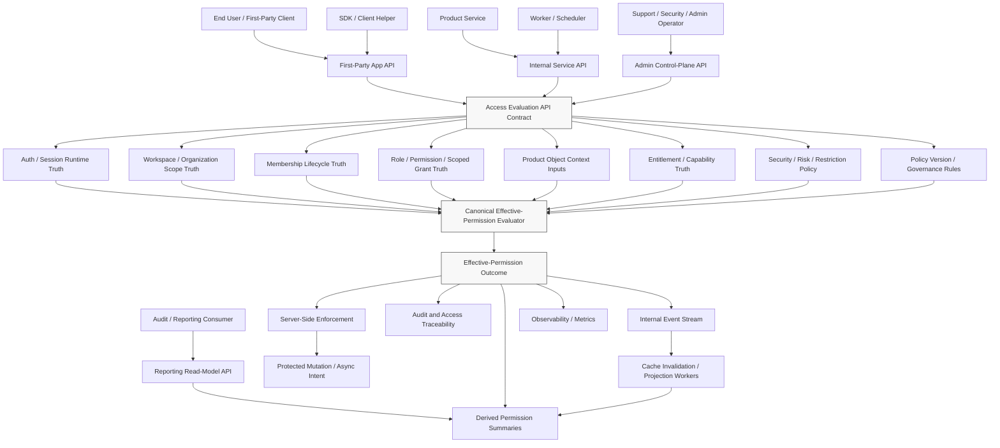
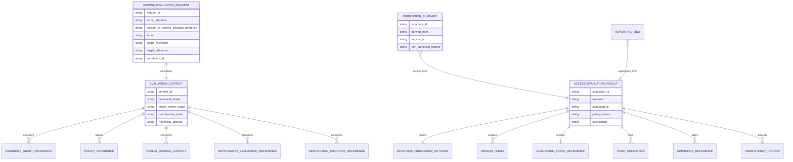
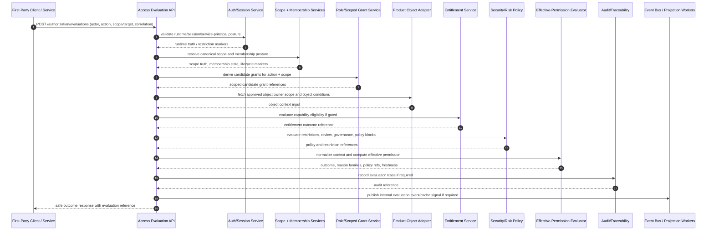

# ACCESS_EVALUATION_AND_EFFECTIVE_PERMISSION_API_SPEC

## Title
FUZE Access Evaluation and Effective Permission API Specification

## Document Metadata

- **Document Name:** `ACCESS_EVALUATION_AND_EFFECTIVE_PERMISSION_API_SPEC.md`
- **Document Type:** Production-grade FUZE API SPEC v2 interface-contract specification
- **Status:** Draft for production-grade API-spec library inclusion
- **Version:** 2.0.0
- **Effective Date:** 2026-04-24
- **Last Updated:** 2026-04-24
- **Reviewed On:** 2026-04-24
- **Document Owner:** FUZE Platform Authorization Architecture
- **Approval Authority:** FUZE Platform Architecture and Governance Authority
- **Review Cadence:** Quarterly or upon material change to identity/session posture, workspace scope semantics, membership lifecycle, role/permission catalog structure, scoped authorization, entitlement posture, admin containment, audit traceability, API architecture, security/risk policy, or effective-permission evaluation behavior
- **Governing Layer:** API contract layer / platform authorization and effective-permission interface layer
- **Parent Registry:** FUZE API SPEC v2 Canonical File Registry
- **Upstream Semantic Registry:** `REFINED_SYSTEM_SPEC_INDEX.md`
- **Upstream API Registry:** `API_SPEC_INDEX.md`
- **Primary Audience:** API architecture, backend engineering, frontend engineering, platform authorization engineering, product engineering, internal service authors, worker/runtime engineers, security engineering, audit, support/control-plane operators, SDK/OpenAPI/AsyncAPI authors, implementation-contract authors
- **Primary Purpose:** Define the production-grade API contract posture for evaluating FUZE access requests and exposing effective-permission outcomes without redefining the refined system semantics owned by `ACCESS_EVALUATION_AND_EFFECTIVE_PERMISSION_SPEC.md`.
- **Primary Upstream References:** `REFINED_SYSTEM_SPEC_INDEX.md`; `API_SPEC_INDEX.md`; `DOCS_SPEC_INDEX.md`; `SYSTEM_SPEC_INDEX.md`; `ACCESS_EVALUATION_AND_EFFECTIVE_PERMISSION_SPEC.md`; `ROLE_PERMISSION_AND_ACCESS_CONTROL_SPEC.md`; `SCOPED_AUTHORIZATION_MODEL_SPEC.md`; `WORKSPACE_AND_ORGANIZATION_SPEC.md`; `WORKSPACE_MEMBERSHIP_LIFECYCLE_SPEC.md`; `ENTITLEMENT_AND_CAPABILITY_GATING_SPEC.md`; `AUDIT_AND_ACCESS_TRACEABILITY_SPEC.md`; `ADMIN_ACCESS_CORRECTION_AND_CONTAINMENT_SPEC.md`; `FUZE_ACCOUNT_ACCESS_AND_SESSION_CANONICAL_FINAL_SPEC.md`; `FUZE_ACCOUNT_ACCESS_AND_SESSION_THESIS_FINAL_SPEC.md`; `SECURITY_AND_RISK_CONTROL_SPEC.md`; `API_ARCHITECTURE_SPEC.md`; `PUBLIC_API_SPEC.md`; `INTERNAL_SERVICE_API_SPEC.md`; `EVENT_MODEL_AND_WEBHOOK_SPEC.md`; `IDEMPOTENCY_AND_VERSIONING_SPEC.md`; `MIGRATION_AND_BACKWARD_COMPATIBILITY_SPEC.md`.
- **Primary Downstream Dependents:** OpenAPI contracts for authorization evaluation; internal authorization adapters; first-party route guards; product object-policy adapters; worker authorization middleware; audit and access-trace ingestion contracts; admin/control-plane inspection tools; SDK permission helpers; product integration specifications; implementation-contract specs for effective-permission storage, evaluation services, and cache invalidation.
- **API Surface Families Covered:** First-party application API; internal service API; admin/control-plane API; event/async API; reporting/read-model API; implementation-facing evaluation contracts.
- **API Surface Families Excluded:** Broad public external mutation APIs; public disclosure APIs; raw role-management APIs; workspace membership lifecycle APIs; entitlement mutation APIs; identity/session issuance APIs; database schema contracts; policy-engine DSL contracts.
- **Canonical System Owner(s):** FUZE Platform Authorization Architecture for effective-permission semantics; adjacent canonical owners remain identity/session, workspace, membership, scoped authorization, entitlement, security/risk, audit, and admin containment domains.
- **Canonical API Owner:** FUZE API Architecture and Platform Authorization API Owners jointly; narrower implementation ownership MUST be assigned in downstream implementation-contract specs.
- **Supersedes:** No same-name API v1 file was identified in the retrieved API v1 registry. This document supersedes any weaker effective-permission API notes, boolean-only authorization-check contracts, or product-local permission-check patterns within this scope.
- **Superseded By:** Not yet known.
- **Related Decision Records:** Not yet known.
- **Canonical Status Note:** Refined system specs own semantic truth. This API spec owns interface-contract expression of effective-permission truth and MUST NOT redefine canonical authorization semantics.
- **Implementation Status:** Normative API contract baseline; downstream OpenAPI, AsyncAPI, SDK, service, storage, audit, cache, and runtime contracts must conform.
- **Approval Status:** Draft pending formal approval record.
- **Change Summary:** Created API SPEC v2 production contract for access evaluation and effective permission; added surface-family boundaries, route families, request/response/error/status models, idempotency and retry rules, admin/control-plane separation, event semantics, diagrams, flow view, acceptance criteria, and implementation test cases.

## Purpose

This API specification defines how FUZE API surfaces request, enforce, expose, cache, trace, and report access-evaluation and effective-permission outcomes.

The API contract exists because FUZE refined system semantics explicitly distinguish identity, runtime session, collaborative scope, membership, structural authorization, scoped grant applicability, entitlement, restriction posture, object conditions, and final effective permission. The API layer MUST preserve those distinctions while giving first-party clients, internal services, workers, control-plane tools, and downstream contract generators stable interface rules.

This document governs the interface expression of final access-evaluation outcomes. It does not own the underlying semantic truth. `ACCESS_EVALUATION_AND_EFFECTIVE_PERMISSION_SPEC.md` owns canonical final-outcome semantics and evaluation ordering; this document defines how APIs may ask for, enforce, return, audit, cache, version, and derive contracts from those outcomes.

## Scope

This specification governs:

- API surface families for access evaluation and effective-permission exposure.
- Route/resource families for synchronous evaluation, batch evaluation, mutation preflight, explainability, cache-safe summaries, admin inspection, and event consumption.
- Request context requirements for actor, session/service principal, scope, action, target object, entitlement-sensitive capability, policy references, idempotency, and correlation.
- Response model requirements for outcome, reason families, policy references, evaluated-at metadata, freshness posture, operation references, and protected explainability.
- Error, result, and status semantics for unresolved scope, missing grant, restriction, review, entitlement missing, policy block, stale context, authorization failure, and degraded-mode handling.
- Server-side enforcement requirements for mutation-capable APIs that depend on effective permission.
- Idempotency, replay safety, retry posture, audit traceability, observability, compatibility, migration, OpenAPI, AsyncAPI, SDK, and implementation-contract derivation guardrails.

## Out of Scope

This specification does not govern:

- Account creation, provider resolution, authentication challenge, session issuance, or session refresh mechanics.
- Workspace, organization, or membership mutation semantics except where they are consumed as evaluation inputs.
- Role catalog management, permission catalog management, or scoped-grant mutation APIs in full depth.
- Entitlement creation, billing state, credits ledger truth, pricing formulas, or product admission rules.
- Complete policy-engine DSL syntax, database schema, storage engine, or low-level policy runtime internals.
- Public transparency, public registry, or public disclosure APIs.
- Product-local object rule tables except as inputs to the shared effective-permission evaluation contract.

## Design Goals

1. Preserve refined effective-permission semantics at the API boundary.
2. Prevent boolean-only or UI-derived permission checks from becoming canonical enforcement.
3. Make access-evaluation API results deterministic, auditable, traceable, and safe under retry.
4. Distinguish public, first-party, internal, admin/control, event, reporting, and implementation-facing surfaces.
5. Require server-side enforcement for mutation and high-impact execution.
6. Support synchronous and batch evaluation without hiding per-target mixed outcomes.
7. Support accepted async intent separately from final business outcome when evaluation gates async execution.
8. Preserve least privilege, fail-closed behavior, restriction precedence, and no cross-scope fallback.
9. Support OpenAPI, AsyncAPI, SDK, audit, observability, and migration artifacts without allowing those artifacts to redefine semantics.

## Non-Goals

- This API spec is not a raw endpoint inventory.
- This API spec is not a policy DSL spec.
- This API spec is not a database schema spec.
- This API spec is not a public commitment to expose detailed denial reasons externally.
- This API spec is not a product-local authorization framework.
- This API spec does not make entitlement, membership, workspace selection, session validity, or role presence equivalent to final effective permission.

## Core Principles

### Refined Semantics Own Truth

The API layer MUST derive from the refined system library. API convenience, client ergonomics, provider behavior, worker convenience, or admin convenience MUST NOT override semantic ownership.

### Server-Side Enforcement Is Authoritative

Mutation-capable APIs MUST enforce effective permission server-side. Client-side permission hints, cached badges, and SDK helpers are advisory only.

### Scope Before Authority

Evaluation APIs MUST resolve and validate canonical scope before applying scoped grants or product object rules. Client-supplied scope hints are not canonical authority.

### Candidate Grant Is Not Final Permission

API contracts MUST distinguish structural grant applicability from final evaluated outcomes. A candidate grant may still produce `deny`, `restricted`, `review_required`, `entitlement_missing`, or `policy_blocked`.

### Fail Closed

Missing, stale, ambiguous, contradictory, or policy-incomplete evaluation context MUST NOT default to allow.

### Reason Fidelity With Safe Disclosure

Internal traces MUST preserve reason families and policy references. Public or user-facing surfaces MAY collapse details for safety, but MUST NOT erase internal lineage.

### Derived Views Are Subordinate

Permission summaries, cached access views, dashboards, reporting projections, and SDK convenience helpers MUST remain derived and regenerable from canonical evaluation inputs and outcomes.

## Canonical Definitions

- **Access Evaluation API:** Any API that asks whether an actor may perform an action in a scope against a target now.
- **Effective-Permission Outcome:** The final evaluated result for a concrete action, such as `allow`, `deny`, `restricted`, `review_required`, `entitlement_missing`, `scope_unresolved`, or `policy_blocked`.
- **Evaluation Context:** The normalized request facts required to evaluate access safely, including actor, runtime posture, action, scope, target, object owner scope, membership state, candidate grants, entitlement posture, restrictions, policy references, freshness, and correlation.
- **Evaluation Reference:** Stable identifier for an evaluation record or decision trace used for audit, observability, debugging, and downstream causality.
- **Permission Summary:** A derived low-risk read model summarizing likely capabilities for UX or dashboards. It is not canonical for sensitive mutation.
- **Mutation Preflight:** A synchronous or near-synchronous evaluation performed immediately before a protected mutation or async operation is accepted.
- **Protected Explanation:** Internal or privileged explainability metadata that may include candidate grant summaries, policy versions, reason families, and suppression causes.

## Truth Class Taxonomy

API implementations MUST preserve the following truth classes:

1. **Semantic Truth:** Refined system semantics for identity, session, scope, membership, structural authorization, scoped grants, entitlement, restriction, object condition, and effective permission.
2. **API Contract Truth:** Route families, request/response/error/idempotency/versioning semantics defined by this document and downstream OpenAPI/AsyncAPI contracts.
3. **Policy Truth:** Active policy versions, risk rules, restriction state, review posture, and governance/control rules used during evaluation.
4. **Runtime Truth:** Current session state, service-principal posture, request lineage, operation state, evaluation freshness, and degraded-mode posture.
5. **Storage / Audit Truth:** Durable evaluation records, audit traces, idempotency records, access restriction snapshots, and operation references.
6. **Provider-Input Truth:** External or product-provided object facts that remain inputs until owner-domain validation succeeds.
7. **Event / Async Execution Truth:** Evaluation-related events, accepted async intents, worker re-evaluation, retries, and finalization states.
8. **Projection / Reporting Truth:** Cached permission summaries, dashboards, reports, exports, and analytics tables derived from canonical evaluation records.
9. **Presentation Truth:** UI labels, error copy, SDK conveniences, and public-safe denial messages.

## Architectural Position in the Spec Hierarchy

This API spec sits below:

- `REFINED_SYSTEM_SPEC_INDEX.md`
- `ACCESS_EVALUATION_AND_EFFECTIVE_PERMISSION_SPEC.md`
- `ROLE_PERMISSION_AND_ACCESS_CONTROL_SPEC.md`
- `SCOPED_AUTHORIZATION_MODEL_SPEC.md`
- `WORKSPACE_AND_ORGANIZATION_SPEC.md`
- `WORKSPACE_MEMBERSHIP_LIFECYCLE_SPEC.md`
- `ENTITLEMENT_AND_CAPABILITY_GATING_SPEC.md`
- `AUDIT_AND_ACCESS_TRACEABILITY_SPEC.md`
- `ADMIN_ACCESS_CORRECTION_AND_CONTAINMENT_SPEC.md`
- shared API architecture, event, idempotency, and migration specifications

It sits above or alongside:

- OpenAPI route files for authorization evaluation.
- AsyncAPI event contracts for access-evaluation events.
- SDK helpers and typed client contracts.
- Internal service adapters.
- Product object-policy adapter contracts.
- Worker authorization middleware.
- Audit ingestion and observability contracts.

## Upstream Semantic Owners

- **Identity / Account:** Owns canonical `account_id` and account lifecycle truth.
- **Auth / Session:** Owns session validity, privileged session posture, service-principal trust, and runtime authentication truth.
- **Workspace / Organization:** Owns workspace and organization existence, lifecycle state, and collaborative scope truth.
- **Membership Lifecycle:** Owns membership, invitation, activation, restriction, suspension, removal, reinstatement, and provenance truth.
- **Role / Permission:** Owns role catalogs, permission catalogs, structural grant mutation, and baseline authorization truth.
- **Scoped Authorization:** Owns scope categories, grant-to-scope binding, scope applicability, inheritance, narrowing, and scope mismatch semantics.
- **Effective Permission:** Owns final action-level evaluated outcomes.
- **Entitlement / Capability Gating:** Owns eligibility for products, capabilities, usage posture, policy holds, and capability gates.
- **Security / Risk:** Owns risk posture, containment, step-up, restriction, review, and higher-order policy controls.
- **Audit / Access Traceability:** Owns traceability semantics and reconstruction requirements.
- **Admin Correction / Containment:** Owns privileged remediation and containment workflows.

## API Surface Families

### Public API

Default posture: **excluded** for detailed access-evaluation APIs.

Public surfaces MAY expose narrowly scoped, public-safe capability or status signals only where an approved public API spec explicitly allows it. Public APIs MUST NOT expose protected reason families, candidate grant summaries, internal policy references, membership details, or privileged evaluation context.

### First-Party Application API

First-party application APIs MAY expose:

- current-user permission summaries for UX hints;
- per-action preflight outcomes for interactive flows;
- safe denial categories suitable for user messaging;
- cache freshness metadata for low-risk views.

They MUST NOT be treated as authoritative enforcement for protected mutation. Mutation routes must re-evaluate or verify fresh effective permission server-side.

### Internal Service API

Internal service APIs MAY expose full evaluation requests and protected explanation metadata to approved services. They MUST carry actor/session or approved service-principal context, scope, action, target, correlation, and policy-version references.

### Admin / Control-Plane API

Admin/control-plane APIs MAY expose protected evaluation traces, reason families, candidate grant summaries, policy versions, and remediation links. They MUST require privileged authorization, reason-coded access, audit lineage, least-privilege access, and protected-data handling.

### Event / Webhook / Async API

Event surfaces MAY publish bounded evaluation events to internal event streams. External webhooks MUST NOT expose sensitive evaluation internals unless a separate approved contract explicitly permits a public-safe subset.

### Reporting / Read-Model API

Reporting APIs MAY expose derived aggregates, dashboards, summaries, and audit-review views. They MUST remain read-only and MUST NOT become semantic owners or enforcement authorities.

### Implementation-Facing API

Implementation-facing contracts define adapters, middleware, internal policy calls, and worker enforcement requirements. They MAY be more precise than public/first-party route schemas but MUST remain subordinate to refined semantics and this API spec.

## System / API Boundaries

This API spec governs interface contracts for:

- evaluation requests;
- evaluation responses;
- mutation preflight and enforcement handoff;
- batch evaluation;
- derived permission summaries;
- admin inspection;
- audit and event linkage;
- cache invalidation and freshness signaling.

It does not govern:

- role assignment mutation APIs;
- membership mutation APIs;
- session issuance APIs;
- entitlement mutation APIs;
- full admin remediation case lifecycle APIs;
- product-local object storage contracts.

## Adjacent API Boundaries

- `IDENTITY_AND_ACCOUNT_API_SPEC.md` and `AUTH_SESSION_AND_LINKED_LOGIN_API_SPEC.md` own identity and runtime authentication APIs.
- `WORKSPACE_AND_ORGANIZATION_API_SPEC.md` owns workspace/organization scope APIs.
- `WORKSPACE_MEMBERSHIP_LIFECYCLE_API_SPEC.md` owns membership lifecycle APIs where created.
- `ROLE_PERMISSION_AND_ACCESS_CONTROL_API_SPEC.md` owns role/permission catalog and grant mutation APIs.
- `SCOPED_AUTHORIZATION_MODEL_API_SPEC.md` owns grant-to-scope applicability and scope-resolution API contracts where created.
- `ENTITLEMENT_AND_CAPABILITY_GATING_API_SPEC.md` owns eligibility APIs.
- `ADMIN_ACCESS_CORRECTION_AND_CONTAINMENT_API_SPEC.md` owns privileged remediation APIs.
- `AUDIT_AND_ACCESS_TRACEABILITY_API_SPEC.md` owns trace query and evidence APIs.

## Conflict Resolution Rules

When API behavior conflicts with refined semantics, FUZE MUST resolve in this order:

1. Active refined registry and higher constitutional materials.
2. `ACCESS_EVALUATION_AND_EFFECTIVE_PERMISSION_SPEC.md` on final evaluation semantics.
3. Upstream owner-domain refined specs on their truth classes.
4. Shared API architecture specs on surface-family posture, public/internal/admin separation, accepted-state semantics, idempotency, event posture, and migration.
5. This API spec on access-evaluation interface contracts.
6. Downstream OpenAPI/AsyncAPI/SDK artifacts.
7. Implementation convenience, frontend state, caches, dashboards, and local product assumptions.

Specific conflict rules:

- Public exposure convenience MUST NOT override protected reason confidentiality.
- Internal service convenience MUST NOT create broad hidden-write authority.
- Admin inspection MUST NOT become remediation mutation unless routed through approved admin containment APIs.
- Derived permission summary MUST NOT override canonical evaluation for sensitive mutation.
- Product-local object context MUST NOT override canonical object owner scope.
- Entitlement success MUST NOT override missing permission.
- Candidate grant presence MUST NOT override restriction, review, policy block, or unresolved scope.

## Default Decision Rules

When ambiguity exists:

- Default to `deny`, `restricted`, `scope_unresolved`, or `review_required`, never permissive fallback.
- Default to internal-only exposure for detailed evaluation semantics.
- Default to first-party summaries as advisory UX hints.
- Default to server-side re-evaluation before sensitive mutation.
- Default to no cross-scope fallback.
- Default to per-target results for batch evaluation.
- Default to preserving full internal reason lineage even when user-facing output is collapsed.
- Default to requiring correlation identifiers for all protected evaluation paths.
- Default to idempotency keys for evaluation-bound mutations and admin/control actions.

## Roles / Actors / API Consumers

- **End User:** Requests actions through first-party clients.
- **Workspace Member / Owner / Admin:** Acts within workspace scope subject to membership, grant, restriction, entitlement, and object conditions.
- **First-Party Client:** Requests safe permission summaries and preflight outcomes.
- **Product Service:** Requests effective-permission decisions for product actions and supplies approved object facts.
- **Platform Domain Service:** Enforces shared authorization semantics for canonical domains.
- **Worker / Scheduler:** Revalidates effective permission before deferred or retried execution where required.
- **Support Operator:** Views protected evaluation traces through reason-coded admin surfaces.
- **Security / Risk Reviewer:** Reviews restricted, policy-blocked, or suspicious evaluation paths.
- **Audit Reviewer:** Queries traceable evidence without becoming an owner of permission truth.
- **Service Principal:** Acts under explicitly approved service identity and scope rules.

## Resource / Entity Families

API-facing resource families SHOULD include:

- `AccessEvaluation`
- `AccessEvaluationRequest`
- `AccessEvaluationResult`
- `AccessEvaluationBatch`
- `EffectivePermissionOutcome`
- `PermissionSummary`
- `EvaluationTrace`
- `EvaluationExplanation`
- `EvaluationPolicyReference`
- `AccessEvaluationOperation`
- `AccessEvaluationAuditReference`
- `AccessRestrictionSnapshotReference`
- `EntitlementEvaluationReference`
- `ObjectAccessContextReference`
- `IdempotencyRecord`
- `CorrelationTrace`

These are API-contract entities, not necessarily database tables.

## Ownership Model

The effective-permission API layer owns:

- access-evaluation route-family contract posture;
- request/response/error/status semantics;
- safe exposure of outcomes and reason families;
- enforcement handoff requirements;
- idempotency and correlation requirements for evaluation-bound operations;
- API-level distinction between canonical evaluation and derived summaries.

It MUST NOT own:

- identity truth;
- session truth;
- workspace or membership truth;
- role/permission truth;
- scoped grant truth;
- entitlement truth;
- admin containment truth;
- audit truth;
- product-local object truth.

## Authority / Decision Model

API consumers submit a normalized evaluation request or invoke a protected mutation that requires evaluation. The API layer MUST either:

1. call the canonical evaluator synchronously;
2. use a safe fresh evaluation reference generated by the canonical evaluator;
3. reject the request if required context is missing, stale, ambiguous, or out of policy; or
4. accept an async operation only when the operation state explicitly records that final execution remains pending later evaluation or re-evaluation.

APIs MUST NOT treat the following as final authority:

- session validity alone;
- current workspace UI selection;
- membership alone;
- role assignment alone;
- entitlement alone;
- feature flag alone;
- cached permission summary alone;
- product-local creator or owner flag alone;
- prior successful evaluation outside its valid freshness and target scope.

## Authentication Model

Evaluation APIs MUST require one of:

- a valid authenticated session for interactive first-party access;
- a privileged session for protected admin/control-plane inspection;
- an approved service principal for internal service or worker calls;
- an explicitly permitted machine-to-machine credential where downstream specs allow.

Authentication proves runtime presence only. It MUST NOT be treated as authorization.

## Authorization / Scope / Permission Model

Evaluation API access is itself permissioned.

- First-party callers may request only their own safe evaluation summaries unless another approved route grants broader inspection.
- Internal services may request evaluations only for approved domains, actions, and scopes.
- Admin/control-plane callers require privileged permissions, reason codes, and audit logging.
- Reporting consumers may read derived summaries only through read-only reporting surfaces.
- Batch evaluation callers must be authorized for the scope and target set being evaluated.

The evaluation target action MUST use durable, namespaced action identifiers. Scope category and scope identifier MUST be explicit or canonically resolvable from target object metadata.

## Entitlement / Capability-Gating Model

For gated capabilities, APIs MUST support entitlement posture as a distinct input and outcome contributor.

- Missing entitlement MUST NOT be collapsed into missing permission internally.
- Successful entitlement MUST NOT override missing actor permission.
- Entitlement-derived restrictions or policy holds MUST be distinguishable from structural permission denial.
- First-party UX MAY collapse entitlement messaging where product copy requires, but internal traces MUST preserve the canonical distinction.

## API State Model

Evaluation-related API state classes include:

- `requested` — evaluation request received and normalized.
- `evaluated` — canonical evaluation completed.
- `allowed` — final outcome permits action now.
- `denied` — final outcome denies action now.
- `restricted` — stronger restriction suppresses ordinary authority.
- `review_required` — action cannot proceed automatically.
- `policy_blocked` — governing policy forbids action.
- `entitlement_missing` — eligibility is absent or unusable for the capability.
- `scope_unresolved` — no safe canonical scope was produced.
- `stale_context` — required context exceeded freshness policy.
- `degraded_unavailable` — canonical evaluation cannot be completed safely.
- `accepted_pending_evaluation` — async intent accepted but final execution requires later evaluation.
- `superseded` — evaluation or operation was replaced by newer canonical evaluation.

## Lifecycle / Workflow Model

1. Caller prepares request with actor/runtime context, action, scope/target, object facts, and correlation metadata.
2. API authenticates caller and validates caller may request the evaluation.
3. API normalizes context and resolves target scope through owner-domain sources.
4. Evaluator derives candidate grants from canonical role/permission/scoped-grant truth.
5. Evaluator applies membership, lifecycle, restriction, object, entitlement, and policy rules.
6. Evaluator returns one effective-permission outcome with reason family and metadata.
7. API enforces allow/deny/review/restriction semantics according to route family.
8. High-impact outcomes are recorded with audit and observability linkage.
9. Events, cache invalidations, and read-model updates are emitted where policy requires.
10. Async workers revalidate or bind to safe operation references before final execution.

## Architecture Diagram — Mermaid flowchart

## Data Design — Mermaid Diagram

## Flow View

### Synchronous Evaluation Flow

1. Caller submits `actor`, `action`, `scope` or `target`, `request_context`, and `correlation_id`.
2. API authenticates caller and verifies caller may request evaluation for the target context.
3. API rejects missing, malformed, cross-scope, or contradictory inputs.
4. API resolves canonical scope and object owner scope from owner-domain sources.
5. Evaluator computes candidate grant set.
6. Evaluator applies membership, lifecycle, restriction, object, entitlement, policy, and governance conditions.
7. Evaluator returns one canonical outcome and reason family.
8. API returns safe response detail based on surface family.
9. Audit and observability records are created where sensitivity or policy requires.

### Mutation Preflight Flow

1. Mutation API receives a protected request with idempotency key and correlation ID.
2. Mutation API performs fresh effective-permission evaluation before commit or accepted async intent.
3. If `allow`, mutation proceeds only within evaluated scope and target.
4. If `review_required`, mutation is not executed and may create a review operation.
5. If `restricted`, `policy_blocked`, `scope_unresolved`, `entitlement_missing`, or `deny`, mutation is blocked.
6. Mutation result links to evaluation reference and audit trace.

### Batch Evaluation Flow

1. Caller submits one actor context and multiple actions/targets.
2. API validates maximum batch size and caller authorization for batch context.
3. Evaluator produces per-target outcomes.
4. Response MUST preserve mixed results.
5. Aggregate status MAY summarize but MUST NOT hide denied, restricted, unresolved, or review-required targets.

### Async Worker Flow

1. API accepts async intent only after allowed preflight or under `accepted_pending_evaluation` semantics.
2. Worker receives operation reference, actor/service-principal context, scope, target, and evaluation policy.
3. Worker revalidates effective permission when freshness policy requires.
4. Worker executes, blocks, retries, or routes to review based on current outcome.
5. Final outcome records evaluation lineage.

### Admin Inspection Flow

1. Operator requests protected trace access with reason code.
2. Admin API verifies privileged permission, session posture, and need-to-know scope.
3. API returns protected explanation fields only to authorized operator surfaces.
4. Access to explanation is itself audited.
5. Remediation requires separate admin correction/containment APIs.

## Data Flows — Mermaid sequenceDiagram

## Request Model

### Common Required Fields

Evaluation requests SHOULD support:

- `request_id` or server-generated equivalent;
- `actor_reference` where service identity is not acting only for itself;
- `session_reference` or `service_principal_reference`;
- `action` as durable namespaced action identifier;
- `scope_hint` where available;
- `target_reference` where object-sensitive;
- `target_type` or object family;
- `capability_reference` where entitlement-sensitive;
- `request_surface` such as first-party, internal, admin, worker, reporting;
- `correlation_id`;
- `trace_id` where available;
- `idempotency_key` for evaluation-bound mutations and admin actions;
- `policy_context` where the caller has a specific policy version or operation context;
- `requested_explanation_level` bounded by surface family and caller permission.

### Request Rules

- API MUST reject malformed, unsupported, or ambiguous action identifiers.
- API MUST NOT trust caller-supplied object owner scope without validation.
- API MUST require explicit scope or target sufficient for canonical scope resolution.
- API MUST enforce maximum batch size and target complexity limits.
- API MUST treat explanation level as a request, not an entitlement to protected detail.
- API MUST require reason codes for admin/control-plane protected explanation or override-adjacent inspection.

## Response Model

### Common Response Fields

Evaluation responses SHOULD support:

- `evaluation_id`;
- `outcome`;
- `outcome_class`;
- `allowed` boolean only as derived convenience, never as sole internal field;
- `reason_family`;
- `safe_message_code`;
- `policy_references` where caller is authorized;
- `candidate_grant_summary` where caller is authorized;
- `scope_reference` used for evaluation;
- `object_owner_scope` where relevant and safe;
- `entitlement_reference` where relevant and safe;
- `restriction_reference` where relevant and safe;
- `evaluated_at`;
- `freshness_posture`;
- `cacheability`;
- `expires_at` when cacheable;
- `correlation_id`;
- `trace_id`;
- `audit_reference` where applicable;
- `operation_reference` where async or review flow is created.

### Surface-Specific Redaction

- First-party responses SHOULD use safe message codes and bounded categories.
- Internal service responses MAY include protected reason metadata where approved.
- Admin/control-plane responses MAY include richer explanation with reason-coded access.
- Public responses MUST be narrow and security-safe.
- Reporting responses MUST aggregate or filter protected data according to audit and privacy policy.

## Error / Result / Status Model

API contracts MUST distinguish transport errors from evaluation outcomes.

### Transport / Contract Errors

- `400 invalid_request`
- `401 unauthenticated`
- `403 evaluation_request_forbidden`
- `404 target_not_found_or_not_visible`
- `409 conflicting_context`
- `409 idempotency_conflict`
- `422 unsupported_action`
- `423 policy_locked`
- `429 rate_limited`
- `503 evaluation_unavailable_fail_closed`

### Evaluation Outcomes

- `allow`
- `deny`
- `restricted`
- `review_required`
- `entitlement_missing`
- `scope_unresolved`
- `policy_blocked`
- `stale_context`
- `degraded_unavailable`

### Result Rules

- Evaluation outcomes SHOULD normally be `200` responses for pure evaluation APIs unless the request itself is invalid or forbidden.
- Mutation APIs MUST return route-appropriate errors or result statuses while preserving internal outcome lineage.
- `review_required` is not success for execution. It may be success for creating a review operation.
- `accepted_pending_evaluation` MUST NOT be represented as final business success.

## Idempotency / Retry / Replay Model

### Pure Evaluation Reads

Pure read-only evaluation may be retried safely but SHOULD carry correlation identifiers. Idempotency keys are optional unless the evaluation creates durable trace, review, or operation records.

### Mutation-Bound Evaluation

Protected mutation routes MUST require idempotency keys when retries are plausible. The idempotency record MUST bind at minimum:

- actor or service-principal context;
- action;
- scope;
- target;
- request payload hash where relevant;
- evaluation reference;
- resulting operation reference where created;
- response class.

### Admin / Control-Plane Actions

Admin explanation access that creates durable review operations, correction requests, or containment cases MUST be idempotent and reason-coded.

### Replay Rules

- A replayed mutation MUST NOT reuse a stale allow outside its permitted freshness window.
- Idempotent replay MUST return the prior compatible result or reject with `idempotency_conflict`.
- Replay MUST NOT widen scope, action, target, explanation level, or operator authority.
- Async retries MUST preserve causality linkage to the initiating evaluation and operation reference.

## Rate Limit / Abuse-Control Model

- Public and first-party evaluation endpoints MUST be rate-limited to prevent enumeration of permissions, memberships, roles, or object existence.
- Batch evaluation MUST enforce bounded size, target type constraints, and per-scope quotas.
- Admin/control-plane trace inspection MUST be monitored for unusual volume and sensitive-target access.
- Internal services MUST use service-specific budgets and anomaly detection.
- Repeated denied, unresolved-scope, or policy-blocked evaluations SHOULD feed abuse and risk observability where policy allows.

## Endpoint / Route Family Model

Route names below are canonical families, not final route commitments.

### Evaluation

- `POST /authorization/evaluations`
- `POST /authorization/evaluations:batch`
- `POST /authorization/evaluations:preflight`

### Current Actor Summaries

- `GET /me/permissions/summary`
- `GET /workspaces/{workspace_id}/me/permissions/summary`
- `GET /products/{product_namespace}/me/permissions/summary`

### Internal Service Evaluation

- `POST /internal/authorization/evaluations`
- `POST /internal/authorization/evaluations:batch`
- `POST /internal/authorization/evaluations:revalidate-operation`

### Admin / Control-Plane Inspection

- `GET /admin/authorization/evaluations/{evaluation_id}`
- `POST /admin/authorization/evaluations/{evaluation_id}:explain`
- `GET /admin/authorization/traces/{trace_id}`

### Reporting / Derived Views

- `GET /reports/access/evaluation-summary`
- `GET /reports/access/denial-trends`
- `GET /reports/access/review-required-summary`

### Event Families

- `authz.evaluation.completed`
- `authz.evaluation.denied`
- `authz.evaluation.review_required`
- `authz.restriction_override.applied`
- `authz.entitlement_block.applied`
- `authz.policy_block.applied`
- `authz.permission_summary.invalidated`

## Public API Considerations

Detailed effective-permission evaluation is not a default public API surface. If public exposure is approved, it MUST:

- expose only public-safe, stable, narrow response semantics;
- avoid revealing internal role, membership, policy, risk, or candidate-grant details;
- resist enumeration attacks;
- use stable compatibility posture;
- remain read-only;
- preserve internal canonical trace where evaluation affects platform state.

## First-Party Application API Considerations

First-party APIs MAY support UX-friendly permission summaries and preflight calls, but:

- summaries are advisory;
- mutation APIs must enforce server-side;
- UI cannot widen scope;
- stale summaries must be invalidated after membership, grant, restriction, entitlement, or workspace lifecycle changes;
- safe denial copy may be collapsed without losing internal reason detail.

## Internal Service API Considerations

Internal service APIs MUST:

- require service identity and approved caller registration;
- carry actor context when acting on behalf of a user;
- avoid headless broad-write shortcuts;
- preserve scope, action, target, correlation, and policy references;
- preserve per-item results for batch or async work;
- reject unsafe stale context;
- record high-impact outcomes.

## Admin / Control-Plane API Considerations

Admin/control-plane APIs MUST:

- be separate from ordinary application routes;
- require privileged session posture where applicable;
- require reason codes for protected explanation access;
- audit access to evaluation traces;
- protect sensitive fields;
- not provide mutation shortcuts into role, membership, entitlement, or containment truth;
- route remediation through approved admin correction and containment APIs.

## Event / Webhook / Async API Considerations

Internal events MAY publish evaluation outcomes, but events are not canonical mutation owners.

Event payloads SHOULD include:

- `event_id`;
- `event_type`;
- `evaluation_id`;
- `actor_reference` protected as appropriate;
- `scope_reference`;
- `target_reference` protected as appropriate;
- `action`;
- `outcome`;
- `reason_family`;
- `policy_reference` where safe;
- `correlation_id`;
- `trace_id`;
- `occurred_at`.

External webhooks MUST default to no sensitive evaluation internals unless a separate public/partner contract approves a redacted subset.

## Chain-Adjacent API Considerations

This domain is primarily off-chain platform authorization. Chain-adjacent actions that require FUZE authorization MUST:

- evaluate off-chain actor authority before accepting execution intent;
- distinguish accepted intent from chain finality;
- revalidate before irreversible or high-impact execution where freshness policy requires;
- preserve signer, vault, governance, and treasury boundaries in adjacent specs;
- never treat chain observation alone as actor permission.

## Data Model / Storage Support Implications

Downstream storage contracts SHOULD preserve:

- durable `evaluation_id` identity;
- request context snapshots or reconstructable references;
- candidate grant summaries for high-impact outcomes;
- reason families and policy references;
- entitlement and restriction references;
- object context references;
- audit and trace IDs;
- idempotency bindings for mutation-bound evaluations;
- cache invalidation records;
- supersession lineage.

Storage MAY optimize low-risk read evaluation differently, but MUST NOT remove evidence needed for sensitive mutation, incident review, support reconstruction, or audit.

## Read Model / Projection / Reporting Rules

- Permission summaries are derived, not canonical.
- Reporting APIs are read-only and must be traceable to canonical evaluation lineage.
- Caches must have explicit freshness posture and invalidation triggers.
- Sensitive mutation may not rely solely on cached summaries.
- Public-facing messages may collapse detail; internal protected traces must preserve reason fidelity.
- Derived views must be regenerable and must not contain independent mutation authority.

## Security / Risk / Privacy Controls

APIs MUST protect against:

- permission enumeration;
- object existence probing;
- cross-scope leakage;
- stale badge reuse;
- confused-deputy internal calls;
- review-required bypass;
- broad admin trace scraping;
- policy-reference leakage;
- product-local shadow authorization;
- async execution after revocation.

Sensitive denial reasons, membership details, role mappings, risk markers, and policy versions MUST be redacted according to surface family and caller permission.

## Audit / Traceability / Observability Requirements

High-impact evaluation and enforcement paths MUST make reconstructable:

- caller identity and runtime posture;
- actor on whose behalf action was requested;
- scope and target;
- action;
- candidate grant summary;
- membership and lifecycle posture used;
- restriction and entitlement contributions;
- policy references;
- final outcome;
- enforcement consequence;
- idempotency and operation references;
- correlation and trace identifiers.

Observability SHOULD track evaluation latency, stale-context rejection, scope mismatch, denial rates, review-required rates, entitlement blocks, restriction overrides, and policy-block trends.

## Failure Handling / Edge Cases

### Valid Session, Missing Scope

Return `scope_unresolved` for evaluation; block mutation.

### Workspace Selected in UI, Membership Removed

First-party summary must update or invalidate; mutation must deny or restrict after fresh evaluation.

### Object Owner Scope Differs From Requested Scope

Canonical object owner scope wins. API must reject, reroute explicitly where approved, or return deny/scope mismatch. Silent fallback is forbidden.

### Candidate Grant Exists, Workspace Suspended

Restriction/lifecycle posture suppresses candidate grant. API must not return executable allow.

### Valid Permission, Missing Entitlement

Return `entitlement_missing` or policy-specific denial internally; do not collapse into allow.

### Review Required

Do not execute mutation. Create or reference a review operation only if route family supports it.

### Batch Mixed Outcomes

Return per-target outcomes and avoid aggregate success hiding denied or restricted targets.

### Evaluation Service Degraded

Fail closed for sensitive mutation. Low-risk summaries may return degraded status if policy permits and clearly mark non-canonical freshness.

### Async Worker With Stale Preflight

Worker must revalidate or block execution according to freshness policy.

## Migration / Versioning / Compatibility / Deprecation Rules

- Legacy boolean-only interfaces MUST migrate toward richer internal outcome semantics.
- Public or first-party compatibility layers MAY continue to expose simplified booleans only as derived fields.
- Deprecated outcome aliases MUST map to canonical outcome classes until removed.
- Version changes that alter outcome classes, reason-family disclosure, route family semantics, idempotency requirements, or protected explanation access are breaking unless explicitly compatibility-wrapped.
- Migrations MUST remove unsafe reliance on UI permission badges for sensitive mutation.
- Existing product-local authorization checks must integrate with shared evaluation contracts or be explicitly scoped as product-local non-shared behavior.

## OpenAPI / AsyncAPI / SDK Derivation Rules

OpenAPI artifacts MUST preserve:

- distinct evaluation outcomes;
- surface-specific schemas;
- request context requirements;
- redaction rules;
- error vs outcome distinction;
- idempotency headers for mutation-bound routes;
- correlation and trace headers;
- batch per-target result semantics.

AsyncAPI artifacts MUST preserve:

- event type distinction;
- causality references;
- payload redaction posture;
- non-ownership of event consumers;
- replay safety expectations.

SDKs MUST:

- mark permission summaries as advisory;
- expose outcome classes rather than only booleans for internal/admin clients;
- avoid hiding `review_required`, `restricted`, `scope_unresolved`, and `entitlement_missing`;
- make server-side enforcement requirements clear to product implementers.

## Implementation-Contract Guardrails

Downstream implementation contracts MUST preserve:

1. refined system semantics and truth-class separation;
2. server-side enforcement for protected mutation;
3. no cross-scope fallback;
4. candidate-grant vs final-outcome distinction;
5. entitlement vs permission distinction;
6. membership vs permission distinction;
7. scope resolution before grant use;
8. policy/restriction precedence;
9. reason-family and audit lineage for high-impact outcomes;
10. first-class `review_required` handling;
11. per-target batch results;
12. idempotency for mutation-bound evaluation;
13. cache freshness and invalidation requirements;
14. protected explanation redaction and reason-coded admin access.

## Downstream Execution Staging

Preferred staging:

1. Define canonical outcome enum and reason-family catalog.
2. Define evaluation request/response OpenAPI schemas.
3. Define internal service evaluator contract.
4. Define first-party summary/preflight route contracts.
5. Define mutation middleware enforcement contract.
6. Define audit and trace ingestion contract.
7. Define cache invalidation and permission summary projection contract.
8. Define admin/control-plane explainability contract.
9. Define AsyncAPI event contracts.
10. Migrate legacy boolean-only and product-local permission checks.

## Required Downstream Specs / Contract Layers

- OpenAPI contract for first-party authorization evaluation.
- OpenAPI contract for internal authorization evaluation.
- OpenAPI contract for admin evaluation explanation and trace inspection.
- AsyncAPI contract for authorization evaluation events.
- SDK contract for permission summaries and preflight helpers.
- Implementation contract for evaluator service and policy adapter.
- Implementation contract for cache invalidation and permission-summary projection.
- Audit ingestion contract for effective-permission outcomes.
- Product adapter contract for object-access context.

## Boundary Violation Detection / Non-Canonical API Patterns

Forbidden patterns:

- `GET /can-i` style boolean-only internal contract for protected mutation.
- Mutation route trusting client permission summary.
- Product route treating creator/owner flag as platform permission.
- Workspace route using selected workspace UI state as canonical scope.
- Internal worker executing with broad service role and no actor/scope context.
- Admin route exposing evaluation explanation without reason-coded audit.
- Public route exposing candidate grant or risk-policy details.
- Event consumer treating evaluation event as new grant truth.
- Reporting projection becoming enforcement input for sensitive mutation.
- Entitlement success returned as `allow` without permission evaluation.

Detection SHOULD include linting, contract tests, audit analytics, runtime diagnostics, and security review gates.

## Canonical Examples / Anti-Examples

### Canonical Example: Workspace Member Export

A workspace member requests report export. API resolves workspace scope, confirms membership, derives candidate `report.export.execute`, checks object owner scope, checks entitlement for export capability, applies risk policy, returns `allow`, and mutation executes with evaluation reference.

### Canonical Example: Valid Role, Missing Entitlement

A workspace admin has export permission but the workspace lacks export entitlement. API returns `entitlement_missing` internally and safe product copy externally. It does not convert admin role into entitlement.

### Canonical Example: Async Workflow Execution

A workflow run is accepted after preflight. Worker revalidates before high-cost execution because membership changed. Worker blocks execution and records denied outcome with operation lineage.

### Anti-Example: UI Badge As Authority

Frontend shows “Admin” from stale cache and sends mutation. Backend executes without re-evaluation. This is non-canonical and forbidden.

### Anti-Example: Product Owner Bypass

Product object creator attempts workspace billing change because they created a product project. Product ownership does not grant billing authority. This is forbidden.

### Anti-Example: Admin Trace Without Reason

Support operator opens detailed candidate grant and risk-policy information without reason code and audit trail. This is forbidden.

## Acceptance Criteria

1. Evaluation APIs distinguish transport errors from effective-permission outcomes.
2. Evaluation responses represent at minimum `allow`, `deny`, `restricted`, `review_required`, `entitlement_missing`, `scope_unresolved`, `policy_blocked`, and stale/degraded classes where applicable.
3. Mutation-capable APIs perform server-side evaluation or validate a fresh evaluation reference before protected mutation.
4. First-party permission summaries are marked derived/advisory and cannot authorize sensitive mutation by themselves.
5. Batch evaluation preserves per-target outcomes and never collapses mixed denied/restricted results into broad success.
6. Internal service calls carry actor or approved service-principal context, resolved scope, action, target, and correlation reference.
7. Admin/control-plane explanation APIs require privileged authorization, reason code, and audit record.
8. Public surfaces do not expose protected reason families, candidate grant details, membership detail, or risk-policy internals.
9. Entitlement failures remain internally distinguishable from missing permission.
10. Scope mismatch resolves to denial, explicit reroute, or review, never silent broader-scope fallback.
11. Idempotency keys are required for evaluation-bound mutation and admin/control actions where retries are plausible.
12. Replay with a different actor, action, scope, target, payload hash, or explanation level is rejected as idempotency conflict.
13. Async accepted-state responses distinguish accepted intent from final execution success.
14. Worker execution revalidates permission when freshness policy requires.
15. High-impact outcomes create audit/trace records with correlation and policy references.
16. Cache invalidation occurs after membership, grant, restriction, entitlement, or workspace lifecycle changes that affect summaries.
17. OpenAPI schemas preserve outcome distinctions and redaction differences by surface family.
18. AsyncAPI schemas preserve event causality and non-ownership semantics.
19. SDK helpers expose advisory summary semantics and do not encourage client-side enforcement.
20. Contract tests reject forbidden patterns such as boolean-only protected mutation, cross-scope fallback, and `review_required` execution.

## Test Cases

### Positive Path

1. **Allow Workspace Action:** Active session, active workspace membership, valid scoped grant, matching object owner scope, active entitlement, no restriction -> response outcome `allow`; mutation commits with evaluation reference.
2. **Low-Risk Summary:** First-party client requests own workspace permission summary -> API returns derived summary with `non_canonical` marker, freshness metadata, and safe message codes.
3. **Internal Batch Evaluation:** Product service submits three object actions -> API returns three per-target outcomes with stable evaluation IDs.

### Negative / Authorization Path

4. **Unauthenticated Evaluation:** Missing session/service credential -> `401 unauthenticated`.
5. **Caller Not Allowed To Evaluate Target:** User requests another member's protected permission trace -> `403 evaluation_request_forbidden`.
6. **Missing Scope:** Request lacks resolvable scope and target metadata -> outcome `scope_unresolved` or request error where malformed.
7. **Scope Mismatch:** Requested workspace differs from canonical object owner workspace -> deny/scope mismatch; no fallback.
8. **Removed Membership:** Actor has stale UI summary but membership removed -> mutation denied or restricted after fresh evaluation.
9. **Restricted Workspace:** Candidate grant exists but workspace suspended -> `restricted` or `policy_blocked`, not `allow`.
10. **Missing Permission:** Active member lacks action permission -> `deny` with safe reason family.
11. **Missing Entitlement:** Valid permission but gated capability unavailable -> `entitlement_missing` internally.
12. **Review Required:** Governance-sensitive action through ordinary admin route -> `review_required`; mutation not executed.

### Idempotency / Retry / Replay

13. **Same Retry:** Mutation retried with same idempotency key and same payload -> prior compatible result returned.
14. **Changed Scope Replay:** Same idempotency key with different scope -> `409 idempotency_conflict`.
15. **Stale Allow Replay:** Retry after freshness window expires for high-impact action -> revalidate or fail closed.
16. **Async Revalidation:** Worker revalidates after grant revocation -> execution blocked and trace recorded.

### Rate Limit / Abuse

17. **Enumeration Attempt:** Client probes many object IDs through evaluation -> rate limit and safe not-found/not-visible behavior.
18. **Admin Trace Scraping:** Operator opens unusually many detailed traces -> alert and audit review.

### Audit / Observability

19. **High-Impact Denial Trace:** Billing mutation denied due to missing permission -> audit includes actor, scope, action, target, outcome, reason family, policy reference, correlation.
20. **Protected Explanation Access:** Support operator explains denial with reason code -> explanation access itself is audited.
21. **Derived Summary Invalidation:** Role revoked -> permission summary invalidation event emitted and stale summary no longer authorizes mutation.

### Migration / Compatibility

22. **Boolean Legacy Compatibility:** Legacy endpoint returns `allowed=false` while internal result preserves `entitlement_missing` or `restricted` outcome.
23. **SDK Contract:** SDK marks `canPerform` result as advisory and exposes full outcome to supported clients.
24. **Forbidden Pattern Lint:** OpenAPI review rejects protected mutation route without server-side evaluation requirement.

## Dependencies / Cross-Spec Links

This API spec depends on:

- `ACCESS_EVALUATION_AND_EFFECTIVE_PERMISSION_SPEC.md`
- `ROLE_PERMISSION_AND_ACCESS_CONTROL_SPEC.md`
- `SCOPED_AUTHORIZATION_MODEL_SPEC.md`
- `WORKSPACE_AND_ORGANIZATION_SPEC.md`
- `WORKSPACE_MEMBERSHIP_LIFECYCLE_SPEC.md`
- `ENTITLEMENT_AND_CAPABILITY_GATING_SPEC.md`
- `AUDIT_AND_ACCESS_TRACEABILITY_SPEC.md`
- `ADMIN_ACCESS_CORRECTION_AND_CONTAINMENT_SPEC.md`
- `FUZE_ACCOUNT_ACCESS_AND_SESSION_CANONICAL_FINAL_SPEC.md`
- `SECURITY_AND_RISK_CONTROL_SPEC.md`
- shared API architecture, public API, internal API, event/webhook, idempotency/versioning, and migration/backward-compatibility specs.

## Explicitly Deferred Items

- Final route naming and exact URL version prefix.
- Full machine-readable OpenAPI schema files.
- Full AsyncAPI event payload files.
- Exact protected reason-family catalog.
- Exact policy DSL and policy engine implementation.
- Exact cache invalidation SLA.
- Exact data warehouse schema for reporting projections.
- Exact admin UI workflow and operator roster.
- Product-specific object policy tables.

## Final Normative Summary

FUZE access-evaluation APIs MUST preserve the platform distinction between identity, authentication, session, scope, membership, structural grants, scoped authorization, entitlement, restriction, object state, policy, and final effective permission. API surfaces may make those outcomes consumable by first-party clients, internal services, workers, admin tools, and reporting systems, but they MUST NOT redefine the underlying semantic truth.

The canonical API posture is conservative: detailed evaluation is internal or protected by default; first-party permission summaries are advisory; mutation requires server-side evaluation; admin inspection is separate, privileged, reason-coded, and audited; events and reports remain derived; and ambiguous, stale, missing, or contradictory context fails closed. Downstream OpenAPI, AsyncAPI, SDK, service, cache, worker, audit, and product contracts MUST preserve these boundaries.

## Quality Gate Checklist

- [x] Upstream refined semantic owners are explicit.
- [x] Canonical API owner is explicit.
- [x] API surface families are explicit.
- [x] Mutation boundaries are explicit.
- [x] Read boundaries are explicit.
- [x] Adjacent API boundaries are explicit.
- [x] Truth classes are explicit.
- [x] Conflict-resolution rules are explicit.
- [x] Default decision rules are explicit.
- [x] Public, first-party, internal, admin/control, event/webhook, reporting, and implementation-facing distinctions are explicit.
- [x] Non-canonical API patterns are called out.
- [x] Admin/operator inspection paths are bounded, reason-coded, and audited.
- [x] Read-model, cache, reporting, and projection rules are explicit.
- [x] Accepted-state vs final success semantics are explicit where async execution exists.
- [x] Idempotency and replay requirements are explicit.
- [x] Request, response, error, result, and status classes are explicit.
- [x] Failure and degraded-mode behavior is explicit.
- [x] Audit, traceability, and observability requirements are explicit.
- [x] Versioning, migration, compatibility, and deprecation rules are explicit.
- [x] OpenAPI / AsyncAPI / SDK guardrails are explicit.
- [x] Dependencies and downstream impacts are explicit.
- [x] Non-goals and deferred items are explicit.
- [x] Architecture Diagram uses Mermaid `flowchart` syntax.
- [x] Architecture Diagram clarifies consumers, surface families, owner domains, services, stores/projections, event systems, workers, and downstream consumers.
- [x] Data Design diagram uses Mermaid syntax and distinguishes canonical, derived, audit, operation, and idempotency records.
- [x] Flow View covers synchronous, mutation, batch, async, failure, audit, admin, and retry paths.
- [x] Data Flows use Mermaid `sequenceDiagram` syntax.
- [x] Sequence diagram distinguishes canonical evaluation from derived projection and event consumers.
- [x] Acceptance Criteria are concrete and testable.
- [x] Test Cases cover positive, negative, authorization, entitlement, idempotency, retry, conflict, rate-limit, degraded-mode, audit, migration, and boundary-violation behavior.
