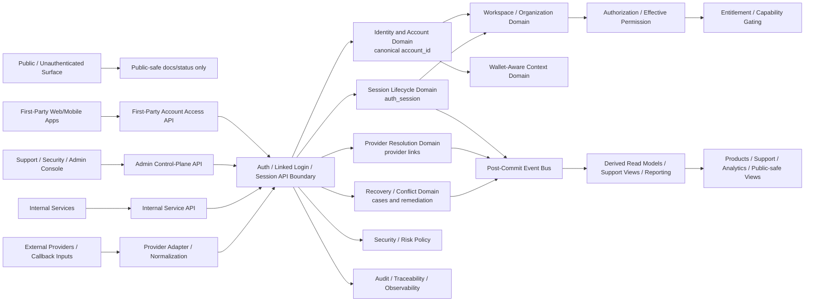
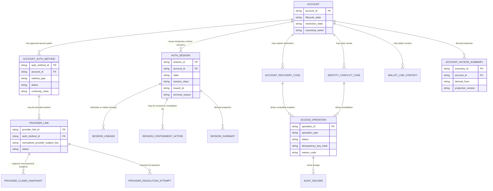
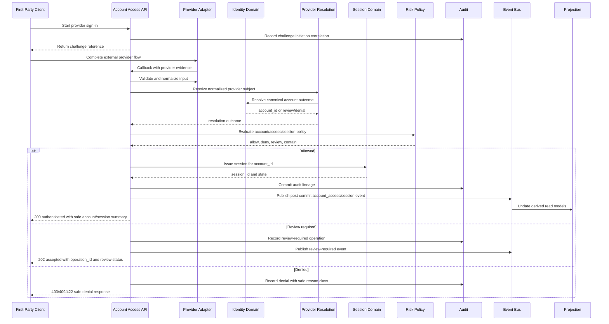

# ACCOUNT_ACCESS_AND_SESSION_CANONICAL_API_SPEC

## Title

FUZE Account Access and Session Canonical API Specification

## Document Metadata

- **Document Name:** `ACCOUNT_ACCESS_AND_SESSION_CANONICAL_API_SPEC.md`
- **Document Type:** Production-grade FUZE API SPEC v2 document
- **Status:** Draft for production-grade API-spec library inclusion
- **Version:** 2.0.0
- **Effective Date:** 2026-04-24
- **Last Updated:** 2026-04-24
- **Reviewed On:** 2026-04-24
- **Document Owner:** FUZE Platform Identity and Access Architecture
- **Approval Authority:** FUZE Platform Architecture and Governance Authority
- **Review Cadence:** Quarterly or upon material change to account identity, linked authentication, provider resolution, session lifecycle, recovery posture, workspace/authorization ordering, wallet-aware access posture, risk containment, API surface posture, or compatibility policy
- **Governing Layer:** API contract layer derived from canonical refined account/access/session semantics
- **Parent Registry:** `API_SPEC_INDEX.md`
- **Upstream Semantic Registry:** `REFINED_SYSTEM_SPEC_INDEX.md`
- **Upstream API Registry:** `API_SPEC_INDEX.md`
- **Primary Audience:** API architecture, backend engineering, identity/auth engineering, frontend and first-party client engineering, platform security, support/control-plane engineering, audit, governance, reliability, implementation-contract authors, OpenAPI/AsyncAPI/SDK authors
- **Primary Purpose:** Define the canonical FUZE API contract posture for account identity, approved access paths, linked authentication, provider resolution, session issuance, session continuation, containment, recovery-sensitive behavior, and downstream layer ordering without redefining refined system semantics.
- **Primary Upstream References:**
  - `REFINED_SYSTEM_SPEC_INDEX.md`
  - `API_SPEC_INDEX.md`
  - `DOCS_SPEC_INDEX.md`
  - `SYSTEM_SPEC_INDEX.md`
  - `FUZE_ACCOUNT_ACCESS_AND_SESSION_CANONICAL_FINAL_SPEC.md`
  - `FUZE_ACCOUNT_ACCESS_AND_SESSION_THESIS_FINAL_SPEC.md`
  - `IDENTITY_AND_ACCOUNT_SPEC.md`
  - `AUTH_SESSION_AND_LINKED_LOGIN_SPEC.md`
  - `FUZE_ACCOUNT_ACCESS_CONTINUITY_SPEC.md`
  - `FUZE_PROVIDER_RESOLUTION_AND_LINKING_SPEC.md`
  - `FUZE_SESSION_LIFECYCLE_AND_SECURITY_SPEC.md`
  - `FUZE_ACCOUNT_RECOVERY_AND_CONFLICT_HANDLING_SPEC.md`
  - `KEY_MANAGEMENT_AND_USER_RECOVERY_SPEC.md`
  - `WALLET_AWARE_USER_SPEC.md`
  - `WORKSPACE_AND_ORGANIZATION_SPEC.md`
  - `ROLE_PERMISSION_AND_ACCESS_CONTROL_SPEC.md`
  - `SCOPED_AUTHORIZATION_MODEL_SPEC.md`
  - `ACCESS_EVALUATION_AND_EFFECTIVE_PERMISSION_SPEC.md`
  - `ENTITLEMENT_AND_CAPABILITY_GATING_SPEC.md`
  - `AUDIT_AND_ACCESS_TRACEABILITY_SPEC.md`
  - `AUDIT_LOG_AND_ACTIVITY_SPEC.md`
  - `SECURITY_AND_RISK_CONTROL_SPEC.md`
  - `API_ARCHITECTURE_SPEC.md`
  - `PUBLIC_API_SPEC.md`
  - `INTERNAL_SERVICE_API_SPEC.md`
  - `EVENT_MODEL_AND_WEBHOOK_SPEC.md`
  - `IDEMPOTENCY_AND_VERSIONING_SPEC.md`
  - `MIGRATION_AND_BACKWARD_COMPATIBILITY_SPEC.md`
- **Primary Downstream Dependents:**
  - `ACCOUNT_ACCESS_CONTINUITY_API_SPEC.md`
  - `PROVIDER_RESOLUTION_AND_LINKING_API_SPEC.md`
  - `SESSION_LIFECYCLE_AND_SECURITY_API_SPEC.md`
  - `ACCOUNT_RECOVERY_AND_CONFLICT_HANDLING_API_SPEC.md`
  - `KEY_MANAGEMENT_AND_USER_RECOVERY_API_SPEC.md`
  - `IDENTITY_AND_ACCOUNT_API_SPEC.md`
  - `AUTH_SESSION_AND_LINKED_LOGIN_API_SPEC.md`
  - `WALLET_AWARE_USER_API_SPEC.md`
  - `WORKSPACE_AND_ORGANIZATION_API_SPEC.md`
  - `ROLE_PERMISSION_AND_ACCESS_CONTROL_API_SPEC.md`
  - `SCOPED_AUTHORIZATION_MODEL_API_SPEC.md`
  - `ACCESS_EVALUATION_AND_EFFECTIVE_PERMISSION_API_SPEC.md`
  - `ENTITLEMENT_AND_CAPABILITY_GATING_API_SPEC.md`
  - `AUDIT_AND_ACCESS_TRACEABILITY_API_SPEC.md`
  - product integration API contracts
  - identity/auth implementation contracts
  - session-store implementation contracts
  - event and webhook contracts
  - OpenAPI, AsyncAPI, and SDK generation layers
- **API Surface Families Covered:** first-party application APIs, internal service APIs, admin/control-plane APIs, event/async APIs, reporting/read-model APIs, limited public-read explanatory surfaces where explicitly approved
- **API Surface Families Excluded:** public identity mutation APIs, unauthenticated account mutation APIs, unbounded provider-adapter internals, workspace/authorization mutation APIs, entitlement mutation APIs, wallet-link mutation APIs except as downstream consumers, raw database contracts, provider SDK internals, session transport secret implementation detail
- **Canonical System Owner(s):** FUZE Platform Identity and Access Architecture; Identity and Account Domain; Auth / Session / Linked Login Domain; Provider Resolution Domain; Session Lifecycle and Security Domain; Recovery / Conflict Domain for recovery-sensitive cases; Security/Risk Domain for containment policy
- **Canonical API Owner:** FUZE Platform API Architecture in coordination with FUZE Platform Identity and Access Architecture
- **Supersedes:** Earlier or v1 API interpretations that collapse account identity, authentication methods, sessions, authorization, entitlements, wallets, or product-local profiles into a single API truth layer.
- **Superseded By:** Not yet known
- **Related Decision Records:** Not yet known
- **Canonical Status Note:** This document is an API-contract expression of the canonical refined account/access/session rule set. It MUST NOT be used to reinterpret or weaken upstream refined system semantics.
- **Implementation Status:** Normative API contract baseline; route-level OpenAPI, event contracts, SDKs, storage contracts, and implementation plans must conform.
- **Approval Status:** Drafted for API SPEC v2 production-grade inclusion; formal approval record not yet attached.
- **Change Summary:** Created the canonical API SPEC v2 companion to the account/access/session canonical refined system spec; normalized surface families, route/resource posture, request/response/error semantics, idempotency, audit lineage, projection rules, events, admin bounds, sequence flows, acceptance criteria, and test cases.

---

## Purpose

This API specification defines how FUZE exposes, consumes, and governs API contracts for the canonical relationship among:

- durable account identity
- approved access paths and linked authentication methods
- provider-resolution inputs and outcomes
- authenticated runtime session state
- recovery-sensitive access restoration
- security containment
- downstream workspace, authorization, entitlement, wallet-aware, reporting, and product consumption

The API layer expresses the refined system semantics at the interface-contract boundary. It does not own the underlying semantics. The refined system specifications own the meaning of account identity, access-path truth, session truth, continuity, provider resolution, recovery, security containment, and downstream authorization/entitlement separation.

The purpose of this document is to make downstream API contracts deterministic enough that backend services, first-party clients, internal services, admin/control-plane tools, event consumers, audit systems, and SDK generation layers cannot accidentally create identity drift, access-path drift, session drift, public exposure drift, or authorization drift.

## Scope

This API specification governs:

- API surface-family posture for account/access/session canonical APIs
- route/resource families for account identity reads, access-path listing, provider flow initiation, provider callback completion, link/unlink intent, session issuance, session inspection, logout, revocation, containment, recovery-sensitive transition references, and derived safe summaries
- request, response, status, result, error, idempotency, replay, rate-limit, and audit requirements
- canonical owner-domain write boundaries for account, access-path, provider-link, and session mutations
- canonical read boundaries and derived read-model constraints
- accepted-state versus final-outcome behavior for async review, recovery, containment, and provider-conflict cases
- event and webhook posture for material account/access/session outcomes
- admin/control-plane API separation, authorization, reason-code, and audit obligations
- OpenAPI, AsyncAPI, SDK, and implementation-contract derivation guardrails
- compatibility, migration, deprecation, and versioning requirements
- acceptance criteria and test cases for implementation readiness

## Out of Scope

This API specification does not govern:

- exact provider SDK implementation, OAuth/OIDC SDK wiring, Telegram/Line/Facebook adapter internals, or raw callback cryptography
- exact session token format, cookie flags, mobile secure-storage details, or refresh-token secret storage
- database schema, indexes, migrations, or sharding topology
- full workspace membership, role, permission, entitlement, wallet-link, billing, credit, payout, treasury, or governance semantics
- product-local profile schema except where product-local profiles must consume canonical account identity
- UI copy, onboarding UX, support-console screen design, or user-education content
- legal identity, KYC, or compliance verification overlays unless later explicitly introduced by a governing specification
- public account lookup APIs unless separately approved through public-read specifications

## Design Goals

1. Preserve `account_id` as the only durable API subject anchor for cross-product actor continuity.
2. Preserve access paths as approved ways to reach an account, not alternate API identities.
3. Preserve sessions as temporary runtime truth that cannot become durable identity, workspace, authorization, entitlement, or wallet truth.
4. Normalize provider input through backend-owned API outcomes before identity, access-path, or session truth changes.
5. Make ambiguous, contested, duplicate, collision, recovery, and risk states explicit in API results rather than silently resolving them.
6. Separate public, first-party, internal, admin/control-plane, event, webhook, reporting, and implementation-facing surfaces.
7. Ensure every side-effecting API is idempotent or explicitly non-retryable with safe failure semantics.
8. Ensure privileged corrections are reason-coded, policy-constrained, least-privilege, and auditable.
9. Ensure derived/read-model APIs remain correctable and subordinate to owner-domain canonical truth.
10. Make the API strong enough to derive OpenAPI, AsyncAPI, SDKs, tests, and implementation contracts without inventing new semantics.

## Non-Goals

This API specification is not intended to:

- publish a raw endpoint dump
- define final machine-readable OpenAPI schemas
- replace the canonical refined system specifications
- make the API layer a semantic owner
- create product-local identity routes
- turn provider claims into canonical identity
- turn sessions into authorization or entitlement
- expose broad public account mutation surfaces
- let admin APIs operate as hidden shortcuts around domain validation
- allow read models, dashboards, exports, or reports to mutate canonical truth

## Core Principles

### 1. Refined Semantics Own Meaning

Refined system specifications own semantic truth. This API specification owns interface-contract expression only.

### 2. Account-Centered API Subject Principle

All account/access/session APIs MUST converge on `account_id` as the durable subject anchor. Provider subjects, emails, wallets, product-local user IDs, and session IDs are not durable platform actor roots.

### 3. Access-Path API Principle

APIs MUST model linked authentication methods and provider links as access paths to a canonical account, never as separate canonical identities.

### 4. Session Subordination API Principle

Session APIs MUST make clear that a valid session represents authenticated runtime presence only. It does not imply workspace authority, permission, entitlement, wallet ownership, billing status, or product capability.

### 5. Backend Normalization API Principle

Provider callbacks, client state, wallet-auth-like proofs, and third-party inputs MUST be normalized by backend-owned APIs before affecting canonical account/access/session truth.

### 6. Explicit Ambiguity API Principle

Ambiguous identity, provider, recovery, or session-trust cases MUST return explicit review, denial, conflict, or remediation states rather than silently merging, relinking, reassigning, or issuing sessions.

### 7. Plane Separation Principle

First-party client APIs, internal service APIs, admin/control-plane APIs, event APIs, webhook APIs, reporting APIs, and public-read APIs MUST remain distinct even if they reference the same canonical account.

### 8. Derived View Discipline Principle

Derived account/session/access summaries MAY be exposed for safe consumption, but they MUST be marked and treated as derived read models and MUST NOT become mutation owners.

## Canonical Definitions

### Account API Resource

The API-facing representation of the canonical account subject. It MUST expose or reference `account_id` and safe account lifecycle/status attributes appropriate to the caller surface.

### Access Path API Resource

The API-facing representation of an approved authentication method, linked login, or provider-backed access path associated with an account.

### Provider Flow API Resource

The API-facing representation of a provider-auth initiation, callback correlation, link intent, resolution attempt, or provider result.

### Session API Resource

The API-facing representation of temporary authenticated runtime state and session lineage.

### Operation Reference

A stable API reference used to track accepted, async, privileged, or retryable side effects, including provider review, recovery-sensitive actions, session containment, and admin corrections.

### Review / Conflict API Resource

A safe, bounded API representation of a conflict, ambiguity, risk review, or remediation posture. It may expose limited status but must not leak sensitive evidence outside approved surfaces.

### Canonical Read

A read that returns owner-domain truth directly or through an owner-approved contract.

### Derived Read

A read model, cache, support summary, analytics view, or reporting surface generated from canonical truth and subject to regeneration and reconciliation.

## Truth Class Taxonomy

API contracts MUST preserve the following truth classes.

### Semantic Truth

The refined system specifications define the meaning of account identity, access paths, sessions, provider resolution, continuity, recovery, and containment.

### API Contract Truth

This document and downstream OpenAPI/AsyncAPI contracts define allowed surfaces, route families, request/response models, status/result classes, errors, idempotency posture, and compatibility behavior.

### Canonical Identity Truth

The account identity anchored by `account_id`, lifecycle state, anti-fragmentation posture, recovery/restoration continuity, and identity-domain restrictions.

### Access-Path Truth

Durable linked-login and provider-link state associated with the canonical account, including pending, active, disabled, removed, restricted, review-required, superseded, and related states.

### Provider-Input Truth

Validated provider callback payloads, issuer-subject pairs, signed assertions, email hints, profile claims, provider metadata, and wallet-auth-like evidence if later approved. These are evidence inputs only.

### Runtime Session Truth

Session issuance, active state, refresh/rotation lineage, expiry, logout, revocation, security invalidation, privileged session posture, and containment state.

### Policy Truth

Security, risk, recovery, provider-approval, continuity, operator-control, rate-limit, and migration policies that constrain API outcomes.

### Authorization Truth

Workspace, membership, role, permission, and effective access decisions owned by authorization-related domains after valid authentication/session context exists.

### Entitlement Truth

Commercial, product, capability, and usage eligibility owned by entitlement/capability domains after identity/session/scope context exists.

### Wallet-Aware Context Truth

Wallet-link and wallet-derived participation context attached to the account but not replacing identity, access-path, or session truth.

### Audit / Traceability Truth

Audit records, request lineage, correlation records, operation references, reason codes, actor attribution, and policy-version capture used to reconstruct API behavior.

### Derived Read-Model Truth

Support views, session summaries, account-access dashboards, safe first-party summaries, analytics projections, search indexes, and exports.

### Public / Reporting Truth

Public or reporting surfaces that may summarize approved facts but remain non-canonical and public-safe.

## Architectural Position in the Spec Hierarchy

This document sits below:

- `REFINED_SYSTEM_SPEC_INDEX.md`
- `API_SPEC_INDEX.md`
- `API_ARCHITECTURE_SPEC.md`
- `PUBLIC_API_SPEC.md`
- `INTERNAL_SERVICE_API_SPEC.md`
- `EVENT_MODEL_AND_WEBHOOK_SPEC.md`
- `IDEMPOTENCY_AND_VERSIONING_SPEC.md`
- `MIGRATION_AND_BACKWARD_COMPATIBILITY_SPEC.md`
- `FUZE_ACCOUNT_ACCESS_AND_SESSION_CANONICAL_FINAL_SPEC.md`
- `FUZE_ACCOUNT_ACCESS_AND_SESSION_THESIS_FINAL_SPEC.md`

It derives from and coordinates with:

- `IDENTITY_AND_ACCOUNT_SPEC.md`
- `AUTH_SESSION_AND_LINKED_LOGIN_SPEC.md`
- `FUZE_ACCOUNT_ACCESS_CONTINUITY_SPEC.md`
- `FUZE_PROVIDER_RESOLUTION_AND_LINKING_SPEC.md`
- `FUZE_SESSION_LIFECYCLE_AND_SECURITY_SPEC.md`
- `FUZE_ACCOUNT_RECOVERY_AND_CONFLICT_HANDLING_SPEC.md`
- `KEY_MANAGEMENT_AND_USER_RECOVERY_SPEC.md`
- `SECURITY_AND_RISK_CONTROL_SPEC.md`
- `AUDIT_AND_ACCESS_TRACEABILITY_SPEC.md`

It sits above route-specific contracts, OpenAPI files, AsyncAPI files, SDKs, service implementation contracts, storage contracts, and product integration contracts.

## Upstream Semantic Owners

The following upstream owners remain authoritative:

- **Canonical account identity:** Identity and Account Domain
- **Access-path and linked-login lifecycle:** Auth / Session / Linked Login Domain, constrained by Identity, Continuity, Provider Resolution, Recovery, and Security/Risk Domains
- **Provider resolution and provider-link evidence:** Provider Resolution and Linking Domain
- **Session lifecycle and containment:** Session Lifecycle and Security Domain
- **Access continuity:** Account Access Continuity rule set and Identity Domain coordination
- **Recovery and conflict posture:** Account Recovery and Conflict Handling Domain
- **Secret reset and recovery-sensitive key handling:** Key Management and User Recovery Domain
- **Security/risk containment:** Security and Risk Control Domain
- **Workspace scope and membership:** Workspace and Organization Domain
- **Authorization and effective permission:** Role/Permission, Scoped Authorization, and Effective Permission Domains
- **Capability eligibility:** Entitlement and Capability Gating Domain
- **Audit lineage:** Audit and Access Traceability / Audit Log and Activity Domains

## API Surface Families

### Public API Surface

Public unauthenticated surfaces MUST NOT expose account mutation, linked-login mutation, session issuance, session inspection, provider conflict evidence, recovery evidence, or access-path details.

Public API exposure MAY include only separately approved public-safe explanatory metadata, service status, or documentation surfaces. Any public account-related lookup MUST be governed by public-read specs and MUST NOT expose private identity/access/session truth.

### First-Party Application API Surface

First-party clients MAY use account/access/session APIs for:

- sign-in initiation
- provider flow start and callback completion through safe browser/mobile paths
- account self-summary retrieval
- linked-login listing and user-initiated link/unlink intent
- session issuance via approved flows
- current-session inspection
- logout
- selected session-management actions
- recovery entry and safe recovery status where approved

First-party APIs MUST not grant direct write access to canonical identity, provider-link, or session records outside owner-controlled operations.

### Internal Service API Surface

Internal service APIs MAY coordinate owner-domain services for:

- canonical account reads
- provider resolution
- linked-login lifecycle operations
- session issuance, continuation, revocation, and containment
- policy checks
- audit emission
- projection updates
- event publication

Internal service APIs MUST not become hidden broad-write shortcuts. They must preserve owner-domain boundaries and least privilege.

### Admin / Control-Plane API Surface

Admin/control-plane APIs MAY support:

- identity conflict review
- provider-link review and correction
- session containment
- privileged access-path disablement
- recovery-sensitive correction
- support-visible derived summaries
- policy-bound remediation execution

Every admin/control-plane mutation MUST require stronger authorization, reason code, actor attribution, policy reference, operation reference, correlation ID, audit emission, and bounded scope. Admin APIs MUST be separated from ordinary application APIs.

### Event / Async API Surface

Event and async APIs MAY publish post-commit events for:

- account lifecycle changes
- access-path link/unlink/disable/restore/review outcomes
- provider resolution outcomes
- session issued/refreshed/rotated/revoked/invalidated/expired
- recovery/conflict state transitions
- containment actions
- derived projection updates

Events are synchronization signals and audit-support artifacts, not alternate truth owners.

### Webhook Surface

External webhooks MUST be avoided for private identity/access/session internals unless separately approved and scoped. If webhooks are later allowed, they must be narrow, public-safe or tenant-safe, versioned, signed, replay-protected, idempotent, and derived from post-commit truth.

### Reporting / Read-Model Surface

Reporting APIs MAY expose derived summaries for support, analytics, audit, and product operations. They MUST mark derived data clearly, avoid allowing derived surfaces to mutate canonical truth, and provide reconciliation references to owner-domain records where safe.

### Implementation-Facing Surface

Implementation contracts MAY define service-to-service endpoints, schemas, workers, storage writes, queues, and policy-adapter interactions. They MUST preserve this API spec’s semantic boundaries and may not narrow audit, idempotency, or conflict-handling requirements without explicit architecture approval.

## System / API Boundaries

The API layer MUST preserve these boundaries:

| Boundary | API Rule |
| --- | --- |
| Identity vs authentication | Account APIs expose who the actor is; auth/access APIs expose how the actor proves access. |
| Authentication vs session | Successful auth evidence does not become session truth until backend session issuance succeeds. |
| Session vs authorization | Valid session does not imply workspace authority or permissions. |
| Authorization vs entitlement | Permission allow does not imply product/capability eligibility. |
| Account vs workspace | Workspace changes do not redefine account identity. |
| Account vs wallet | Wallet links attach context and do not replace `account_id`. |
| Provider input vs account truth | Provider payloads are evidence inputs only. |
| Canonical reads vs derived reads | Derived APIs must not mutate or override owner-domain truth. |
| First-party vs admin | Admin/control mutation paths must never be reachable through ordinary client routes. |
| API vs implementation detail | API contracts govern interface behavior but do not expose raw secret, database, or provider internals. |

## Adjacent API Boundaries

### `IDENTITY_AND_ACCOUNT_API_SPEC.md`

Owns detailed canonical account APIs. This document defines the cross-domain account/access/session contract posture that those APIs must preserve.

### `AUTH_SESSION_AND_LINKED_LOGIN_API_SPEC.md`

Owns detailed authentication, linked-login, and session orchestration APIs. This document defines the canonical cross-domain ordering and truth separation.

### `ACCOUNT_ACCESS_CONTINUITY_API_SPEC.md`

Owns continuity-sensitive API constraints and last-viable-access safety. This document requires all account/access/session APIs to preserve continuity defaults.

### `PROVIDER_RESOLUTION_AND_LINKING_API_SPEC.md`

Owns provider-flow and provider-link route families. This document defines provider input as evidence and requires backend-owned normalization.

### `SESSION_LIFECYCLE_AND_SECURITY_API_SPEC.md`

Owns detailed session issuance, refresh, rotation, inspection, revocation, invalidation, and containment contracts. This document defines the cross-domain session subordination rule.

### `ACCOUNT_RECOVERY_AND_CONFLICT_HANDLING_API_SPEC.md`

Owns recovery/conflict case APIs. This document requires ambiguous account/access/session outcomes to route into explicit review and remediation states.

### Workspace / Authorization / Entitlement API Specs

Own downstream scope, permission, and capability decisions. This document requires authentication and session context to precede but not replace those evaluations.

### Audit / Security API Specs

Own cross-domain audit, risk, and containment posture. This document requires account/access/session APIs to emit lineage sufficient for those domains.

## Conflict Resolution Rules

When API contract behavior appears to conflict with upstream semantics, the platform MUST resolve in this order:

1. active refined registry and active refined domain specification on semantics
2. API architecture and shared API governance on interface-family posture
3. this API specification on account/access/session canonical API expression
4. narrower domain API specs on route-family detail, only when compatible with this document and upstream refined semantics
5. implementation contracts on service/storage detail, only when compatible with all higher layers
6. client, dashboard, report, SDK, or product convenience last

Specific API conflict rules:

- API convenience MUST NOT redefine `account_id`, access-path meaning, or session meaning.
- Provider callback payloads MUST NOT directly mutate identity or session truth without backend normalization and owner-domain commit.
- Product-local IDs MUST NOT appear as canonical API subject roots.
- Session IDs MUST NOT be used as stable actor identifiers outside session-domain context.
- A successful sign-in response MUST NOT imply workspace permission or entitlement.
- Derived account/session summaries MUST NOT override canonical owner-domain reads.
- Admin mutation APIs MUST NOT bypass owner-domain validation or audit requirements.
- Reporting mismatches MUST resolve in favor of canonical backend records.
- Ambiguous provider/account/recovery cases MUST resolve to explicit review, denial, or containment, not silent merge/reassignment.

## Default Decision Rules

Where ambiguity remains:

1. default actor anchor is `account_id`
2. default durable identity owner is the Identity and Account Domain
3. default access-path owner is Auth / Session / Linked Login Domain constrained by Identity, Provider Resolution, Continuity, Recovery, and Security/Risk Domains
4. default session owner is the Session Lifecycle and Security Domain
5. default provider evidence owner is the provider adapter until normalized, then owner-domain resolution services decide outcomes
6. default interpretation of provider email is hint/contact/review signal, not canonical mapping key
7. default interpretation of wallet address is attached context, not identity root
8. default interpretation of session is temporary runtime truth, not authorization/entitlement
9. default high-risk uncertain access behavior is fail-closed
10. default ambiguous identity/provider/recovery outcome is explicit review
11. default privileged correction path is admin/control-plane only, reason-coded and audited
12. default derived-read behavior is read-only, correctable, and subordinate

## Roles / Actors / API Consumers

### End User

Uses first-party APIs to sign in, link providers, manage approved access paths, inspect safe session summaries, log out, and initiate recovery.

### First-Party Client

Initiates safe account/access/session flows and renders results. It MUST NOT decide canonical identity, provider resolution, session validity, authorization, or entitlement.

### Backend Owner Service

Executes owner-domain operations for identity, provider resolution, linked login, sessions, recovery, risk, and audit.

### Internal Service Consumer

Consumes canonical account/session context and downstream authorization/entitlement outcomes. It MUST NOT write account/access/session truth unless explicitly owner-authorized.

### Admin / Support Operator

Performs bounded, reason-coded, auditable control-plane actions under least privilege and stronger authorization.

### Security / Risk System

Constrains issuance/continuation, triggers containment, and may require step-up or review.

### Audit / Observability Consumer

Consumes lineage, correlation, audit, and event records for reconstructability.

### Reporting / Projection Consumer

Consumes derived summaries without becoming a mutation owner.

## Resource / Entity Families

API contracts SHOULD expose or reference the following resource families.

### Canonical Resource Families

- `account`
- `account_auth_method`
- `provider_resolution_attempt`
- `provider_link`
- `auth_challenge`
- `auth_session`
- `session_lineage`
- `account_recovery_case`
- `identity_conflict_case`
- `access_operation`
- `audit_lineage_reference`

### Derived Resource Families

- `account_access_summary`
- `session_summary`
- `linked_login_summary`
- `support_access_view`
- `security_access_view`
- `account_access_activity_view`
- `account_access_projection`

### Non-Canonical Input Families

- `provider_callback_payload`
- `provider_claims_snapshot`
- `client_auth_state`
- `device_hint`
- `risk_signal`
- `wallet_auth_evidence` if later approved for access purposes

## Ownership Model

### Canonical Mutation Owners

- `account`: Identity and Account Domain
- `account_auth_method` / linked-login: Auth / Session / Linked Login Domain under identity/continuity constraints
- `provider_link`: Provider Resolution and Auth / Session Domains under identity ownership constraints
- `auth_session`: Session Lifecycle and Security Domain
- `identity_conflict_case`: Recovery / Conflict Handling Domain in coordination with Identity Domain
- `account_recovery_case`: Recovery / Conflict Handling Domain
- `audit_lineage_reference`: Audit domains

### API Mutation Rule

An API route may initiate a mutation only if it belongs to or delegates to the canonical owner domain. Cross-domain workflows must carry operation references and preserve owner-specific validation.

### Read Ownership

Canonical read routes must originate from owner-approved read models. Derived read routes must mark themselves as derived and expose reconciliation references where appropriate.

## Authority / Decision Model

The API decision model is:

1. authenticate caller or classify unauthenticated flow
2. validate surface family and route authorization
3. validate request envelope, correlation ID, idempotency key where required, and rate-limit posture
4. normalize any provider/client/external evidence
5. resolve canonical account/access/session owner-domain preconditions
6. evaluate policy, risk, recovery, conflict, continuity, and account-state constraints
7. execute owner-domain mutation or produce accepted/review/denied outcome
8. emit audit lineage and post-commit events where applicable
9. update or schedule derived projections
10. return canonical response, accepted operation reference, or explicit error/status/result class

## Authentication Model

### Unauthenticated Flow Authentication

Some API routes begin unauthenticated, such as provider sign-in start, provider callback completion, and recovery initiation. These routes MUST:

- avoid exposing private account truth before proof succeeds
- use challenge/correlation state
- validate callback or recovery evidence server-side
- rate-limit aggressively
- avoid account enumeration
- return generic or safe status where disclosure would create risk

### Authenticated User Session

Authenticated user routes MUST validate server-side session truth before allowing access-path reads, link intents, unlink intents, session inspection, logout, and safe self-service account summaries.

### Recent-Auth / Step-Up

High-impact operations SHOULD require recent-auth or step-up posture where policy requires it, including:

- adding a new high-risk access path
- removing or disabling a viable access path
- deleting or closing account access
- changing recovery-sensitive data
- revoking other sessions
- viewing privileged session/security details

### Service Authentication

Internal service APIs MUST use explicit service identity, scoped service authorization, mTLS or equivalent service-trust boundary where applicable, and least-privilege permissions.

### Admin Authentication

Admin/control-plane APIs MUST require privileged session class or equivalent control-plane authentication, stronger authorization, reason code, policy reference, and audit lineage.

## Authorization / Scope / Permission Model

Account/access/session APIs MUST enforce authorization as follows:

- account self-service reads require valid session for the same `account_id`
- linked-login list/read routes require the actor to be the account subject or an authorized support/security/admin actor
- link/unlink actions require valid session, step-up where required, continuity checks, and owner-domain authorization
- session inspection requires account ownership or privileged authorized support/security role
- session revocation requires self-scope for own sessions or privileged scope for others
- provider callback completion does not rely on a pre-existing user session unless it is a link-intent flow
- admin corrections require explicit privileged permission and bounded case/operation scope
- internal service routes require service scopes specific to the operation family
- derived reporting views require reporting/read privileges and must not allow mutation

Authorization APIs must evaluate workspace or organization context only after account/session validity is established where a route is workspace-scoped.

## Entitlement / Capability-Gating Model

Most account/access/session foundation routes are platform safety routes and SHOULD NOT be blocked by product entitlement unless the route is product-specific. However:

- product-specific session or access convenience features MAY require capability gating
- entitlement MUST NOT redefine account identity, access-path truth, provider resolution, or session validity
- loss of product entitlement MUST NOT delete canonical account identity
- entitlement failures MUST be returned as explicit capability or product-access denials, not auth failures
- recovery and account-safety routes SHOULD remain available as platform safety surfaces unless higher-order policy restricts them

## API State Model

### Account State Classes

API contracts MUST distinguish at least:

- `pending_setup`
- `active`
- `restricted`
- `suspended`
- `deactivated`
- `closed`
- `merged`
- `review_required`

### Access-Path State Classes

API contracts MUST distinguish at least:

- `pending_verification`
- `active`
- `disabled`
- `removed`
- `restricted`
- `review_required`
- `superseded`

### Provider Resolution Outcome Classes

API contracts MUST distinguish at least:

- `resolved_existing_account`
- `bootstrap_required`
- `bootstrap_completed`
- `link_intent_required`
- `link_completed`
- `conflict_review_required`
- `risk_review_required`
- `recovery_required`
- `resolution_denied`

### Session State Classes

API contracts MUST distinguish at least:

- `issued`
- `active`
- `rotated`
- `expired`
- `revoked`
- `invalidated_security`
- `logged_out`
- `contained`

### Operation State Classes

Accepted async or review-required operations MUST distinguish at least:

- `accepted`
- `pending_validation`
- `pending_review`
- `blocked`
- `completed`
- `failed`
- `denied`
- `cancelled`
- `superseded`

## Lifecycle / Workflow Model

### Account Access Start

1. client starts an approved access flow
2. backend creates or validates challenge/correlation state
3. provider or credential proof is obtained
4. backend validates and normalizes input
5. owner-domain resolution decides existing account, bootstrap, link, review, or denial
6. session issuance occurs only after approved resolution and policy checks

### Linked Login Management

1. authenticated actor requests link/unlink/disable/restore
2. API validates session, recent-auth, scope, idempotency, and policy
3. continuity check verifies operation will not strand the account
4. provider proof or admin approval is validated where required
5. owner-domain state changes are committed
6. session containment or event publication occurs where required

### Session Lifecycle

1. session is issued after approved account/auth resolution
2. session may be refreshed or rotated only while account, auth-path, recovery, and risk posture allow
3. session may end by logout, expiry, revocation, or security invalidation
4. session containment may be targeted or global
5. derived session views update after canonical session-domain commit

### Recovery / Conflict

1. ambiguous or unsafe account/access/session outcome returns explicit review, recovery, conflict, or denial status
2. a durable case or operation reference is created where appropriate
3. ordinary self-service mutation is blocked until the case resolves
4. admin/control-plane remediation remains bounded and audited
5. final resolution emits events and may require session invalidation

## Architecture Diagram — Mermaid flowchart

## Data Design — Mermaid Diagram

## Flow View

### Synchronous Sign-In Flow

1. Client requests sign-in initiation for an approved provider or credential method.
2. API creates a challenge and correlation reference.
3. Provider or credential proof returns to backend-controlled completion route.
4. API validates provider authenticity and normalizes evidence.
5. Provider/identity owner domains resolve the result to an explicit outcome.
6. If outcome is valid and policy permits, session owner issues a session.
7. API returns session-established response and safe account summary.
8. Downstream workspace/authorization/entitlement checks occur only on subsequent scoped actions.

### Accepted Async / Review Flow

1. Provider/account/recovery evidence is ambiguous or risk-blocked.
2. API creates `operation_id` and, where appropriate, conflict/review case reference.
3. API returns `202 Accepted` or equivalent accepted-state response with `pending_review`, `risk_review_required`, or `conflict_review_required`.
4. Review/remediation occurs through admin/control-plane or recovery workflows.
5. Final owner-domain outcome is committed.
6. Event is emitted.
7. Projection updates.
8. Polling or subscribed clients observe final status without treating accepted state as success.

### Failure / Retry Flow

1. Client retries a side-effecting request with the same idempotency key.
2. API resolves the prior operation and returns the same semantic outcome or current operation status.
3. If the previous request did not reach owner-domain commit, the API may safely retry validation and commit.
4. If the request conflicts with a different payload under the same idempotency key, API returns an idempotency conflict error.
5. Audit and observability preserve both attempts.

### Admin / Operator Flow

1. Operator accesses privileged control-plane session.
2. API verifies privileged scope, case/operation scope, reason code, and policy reference.
3. API validates owner-domain constraints and continuity/safety rules.
4. Mutation executes only through owner-controlled path.
5. Audit record captures actor, target, reason, policy version, correlation ID, before/after state references, and operation ID.
6. Events and containment actions are triggered where required.

### Degraded-Mode Flow

1. If derived projections are stale or unavailable, canonical APIs may continue owner-domain reads.
2. If owner-domain truth cannot be reached for high-risk decisions, API must fail closed.
3. API must not substitute provider claims, frontend state, cache, report, or support view for canonical truth.
4. Replay/recovery must preserve idempotency and audit lineage.

## Data Flows — Mermaid sequenceDiagram

## Request Model

All account/access/session API requests MUST use a standard envelope or equivalent contract including:

- `request_id` or generated correlation reference
- `idempotency_key` for side-effecting or retryable requests
- `actor_context` derived server-side, never trusted solely from client
- `target_account_id` where caller is already authenticated or admin-scoped
- `operation_type`
- `surface_family`
- `client_context` as non-canonical telemetry only
- `provider_flow_reference` for provider flows
- `session_reference` where session lifecycle operations apply
- `reason_code` for privileged/admin/control mutations
- `policy_reference` where policy materially shapes the outcome
- `expected_version` or state precondition where optimistic conflict handling is needed
- `return_projection` preference only where safe and allowed

### Required Request Rules

- Clients MUST NOT submit `account_id` as proof of identity.
- Clients MUST NOT submit provider claims as canonical truth.
- Admin APIs MUST require reason code and target scope.
- Internal APIs MUST require service identity and operation-specific scope.
- Idempotency keys MUST be scoped to actor, route family, operation type, and target where applicable.
- API contracts MUST define which fields are caller-supplied, server-derived, provider-derived, or owner-domain-derived.

## Response Model

Responses MUST distinguish:

### Success Response

Used when the owner-domain mutation or canonical read is final and committed.

Minimum fields:

- `result`
- `status`
- `account_id` where safe and applicable
- resource representation or safe summary
- `operation_id` where operation lineage applies
- `correlation_id`
- `audit_reference` where safe and applicable
- `policy_reference` where safe and applicable
- `projection_version` for derived reads

### Accepted Response

Used when request intent is accepted but final business outcome is pending.

Minimum fields:

- `result: accepted`
- `operation_id`
- `operation_status`
- `accepted_at`
- `finality: pending`
- safe next-step indicator
- polling or subscription reference if supported
- no implication of final session issuance, account merge, provider link, recovery completion, or authorization success

### Denial / Review Response

Used when the API blocks or routes to review.

Minimum fields:

- `result: denied` or `result: review_required`
- safe `reason_class`
- `operation_id` or `case_reference` where safe
- remediation or support-safe next step where allowed
- no sensitive provider, security, or conflict evidence unless caller surface is authorized

### Error Response

Used for contract, authentication, authorization, validation, conflict, rate-limit, idempotency, dependency, or internal failure classes.

Minimum fields:

- `error.code`
- `error.message` safe for surface
- `error.reason_class`
- `correlation_id`
- `retryable`
- `idempotency_status` where applicable
- `operation_id` if the request created or resumed an operation
- `documentation_reference` where available

## Error / Result / Status Model

API implementations MUST define stable error classes at least equivalent to:

- `AUTH_REQUIRED`
- `AUTH_INVALID`
- `RECENT_AUTH_REQUIRED`
- `STEP_UP_REQUIRED`
- `ACCOUNT_RESTRICTED`
- `ACCOUNT_SUSPENDED`
- `ACCESS_PATH_DISABLED`
- `ACCESS_PATH_NOT_FOUND`
- `LAST_VIABLE_ACCESS_PATH_BLOCKED`
- `PROVIDER_CALLBACK_INVALID`
- `PROVIDER_SUBJECT_CONFLICT`
- `PROVIDER_RESOLUTION_REVIEW_REQUIRED`
- `IDENTITY_CONFLICT_REVIEW_REQUIRED`
- `RECOVERY_REQUIRED`
- `SESSION_EXPIRED`
- `SESSION_REVOKED`
- `SESSION_INVALIDATED`
- `SESSION_CONTAINMENT_REQUIRED`
- `AUTHORIZATION_DENIED`
- `ENTITLEMENT_DENIED`
- `POLICY_DENIED`
- `IDEMPOTENCY_CONFLICT`
- `STATE_CONFLICT`
- `RATE_LIMITED`
- `DEPENDENCY_UNAVAILABLE`
- `DEGRADED_MODE_UNAVAILABLE`
- `MIGRATION_VERSION_UNSUPPORTED`
- `INTERNAL_ERROR`

### Status Semantics

- `200` / `201`: final success only when owner-domain commit or canonical read is complete.
- `202`: accepted intent only; not final business success.
- `204`: final success with no body only for routes where no result ambiguity exists.
- `400`: malformed or invalid request.
- `401`: authentication absent or invalid.
- `403`: authenticated but not allowed, including permission or policy denial.
- `404`: resource not visible or not found; avoid account enumeration.
- `409`: state conflict, idempotency conflict, provider conflict, last viable path conflict, or incompatible precondition.
- `422`: semantically invalid request.
- `423` or equivalent: locked/review/containment state where supported.
- `429`: rate-limited.
- `503`: dependency unavailable; must not substitute stale truth.

## Idempotency / Retry / Replay Model

Idempotency is mandatory for:

- account bootstrap attempts
- provider callback completion
- provider link completion
- access-path disable/remove/restore
- session issuance after external callback
- session refresh/rotation where retried by clients
- session revocation and containment
- recovery initiation and completion
- conflict/remediation operation requests
- admin/control-plane mutations

Requirements:

1. Idempotency keys MUST be unique within defined actor/surface/operation/target scope.
2. Same key and same semantic request MUST return same final result or current operation status.
3. Same key with materially different payload MUST return `IDEMPOTENCY_CONFLICT`.
4. Provider callback replay MUST not create duplicate accounts, duplicate links, duplicate sessions, or duplicate case records.
5. Session revocation and containment retries MUST be safe and monotonic.
6. Recovery and admin retries MUST preserve reason code, policy reference, actor attribution, and audit lineage.
7. Idempotency records MUST have retention appropriate to replay risk.
8. Idempotency MUST not be implemented solely in frontend state.

## Rate Limit / Abuse-Control Model

Account/access/session APIs MUST apply rate limits and abuse controls to:

- unauthenticated sign-in initiation
- provider callback completion
- recovery initiation
- challenge verification
- access-path link attempts
- unlink/disable attempts
- session refresh
- session inspection
- admin/control-plane actions
- support evidence retrieval
- derived reporting exports

Rate limits must be contextual and may include account, provider subject, normalized provider key, IP/network, device hint, workspace where applicable, session lineage, actor, service identity, and operation family.

Abuse controls MUST avoid account enumeration and MUST not reveal whether a private account, email, provider subject, session, or recovery case exists unless the caller is authorized.

## Endpoint / Route Family Model

This document defines allowed route families, not final endpoint paths.

### Account Canonical Read Families

- retrieve current authenticated account summary
- retrieve canonical account status for authorized internal/service use
- retrieve admin-scoped account access posture
- retrieve derived account access summary

Rules:

- self-service responses must be safe and scoped to the authenticated account
- internal/admin reads must enforce least privilege and audit sensitive access
- derived reads must identify projection version or derivation source where applicable

### Provider Flow Families

- start provider sign-in
- complete provider callback
- start provider link intent
- complete provider link intent
- cancel provider flow
- retrieve provider flow status

Rules:

- provider callbacks must be normalized server-side
- provider success must not directly imply session issuance
- callback replay must be idempotent
- ambiguous provider outcomes must return review/denial state

### Access-Path Families

- list access paths for self or privileged scope
- request link
- request unlink
- disable/restore path
- admin review/correction
- retrieve access-path history or activity where allowed

Rules:

- last viable path removal requires continuity checks
- high-impact mutations require recent-auth/step-up or admin policy
- destructive hidden rewrites are forbidden

### Session Families

- issue session after successful auth
- inspect current session
- list selected sessions where allowed
- refresh/rotate session
- logout current session
- revoke selected session
- global logout/containment
- privileged session issuance/termination

Rules:

- session issuance requires account/auth/policy success
- session continuation is subordinate to account/risk/recovery state
- revocation/containment must be monotonic and audited

### Recovery / Conflict Families

- initiate recovery
- retrieve safe recovery status
- submit recovery evidence where approved
- retrieve conflict/review status
- admin review/remediation
- finalize recovery-sensitive access restoration

Rules:

- recovery restores access to same canonical account
- conflict/review status must avoid leaking sensitive evidence
- final restoration may trigger session containment

### Admin / Control-Plane Families

- review provider conflict
- review identity conflict
- disable/restore access path
- targeted/global session containment
- privileged correction with reason code
- view audit/lineage references

Rules:

- admin routes must be plane-separated
- every mutation requires reason code and audit
- admin action cannot bypass owner-domain validation

### Derived / Reporting Families

- support account access summary
- session activity summary
- audit-linked activity view
- product-safe account context summary
- reporting export where approved

Rules:

- derived views are non-canonical
- export routes must be read-only
- stale or mismatched derived data must not drive canonical mutations

## Public API Considerations

Public API exposure for this domain is intentionally narrow.

Allowed public surfaces:

- documentation metadata
- platform status metadata
- public-safe generic auth-provider availability if separately approved
- public-safe error documentation

Forbidden public surfaces:

- account lookup by email, provider subject, wallet, product-local ID, or session
- public linked-login listing
- public session inspection
- public recovery-case lookup
- public provider-conflict status
- public identity mutation or merge APIs
- public access-path correction APIs

## First-Party Application API Considerations

First-party applications may use account/access/session APIs as the main user-facing surface, but must preserve backend authority.

Client rules:

- client state is never canonical
- provider redirects/callbacks are evidence, not final outcomes
- session artifacts must be validated server-side
- applications must handle `review_required`, `step_up_required`, `recovery_required`, `account_restricted`, and `session_invalidated`
- applications must not infer authorization or entitlement from sign-in success
- applications must not expose private conflict/recovery evidence in UI unless specifically authorized
- applications must treat accepted-state responses as pending, not final success

## Internal Service API Considerations

Internal service APIs must be more explicit, not less governed.

Requirements:

- explicit service identity
- operation-specific scopes
- owner-domain validation
- correlation ID propagation
- audit reference propagation
- idempotency for side effects
- no hidden broad-write paths
- no mutation by derived projections
- no direct database write bypass of owner-domain APIs
- no reinterpretation of account/access/session truth for product convenience

## Admin / Control-Plane API Considerations

Admin/control-plane APIs are allowed only when bounded.

Mandatory requirements:

- separate route namespace or equivalent plane separation
- privileged authentication/session class
- least-privilege permission
- case or operation scope
- reason code
- policy reference
- explicit target account/access/session identifiers
- before/after state capture or references
- audit emission
- rate limit and anomaly detection
- dual control or approval where policy requires
- no silent merge, reassignment, link transfer, or session restoration

Admin APIs MUST default to containment or review when safety is uncertain.

## Event / Webhook / Async API Considerations

### Event Families

The platform SHOULD emit post-commit events such as:

- `account.access.account_created`
- `account.access.account_restricted`
- `account.access.auth_method_linked`
- `account.access.auth_method_disabled`
- `account.access.auth_method_removed`
- `account.access.provider_resolution_completed`
- `account.access.provider_resolution_review_required`
- `account.access.session_issued`
- `account.access.session_rotated`
- `account.access.session_revoked`
- `account.access.session_invalidated`
- `account.access.session_contained`
- `account.access.recovery_initiated`
- `account.access.recovery_completed`
- `account.access.conflict_opened`
- `account.access.conflict_resolved`
- `account.access.admin_correction_applied`

### Event Rules

- events must emit after canonical commit
- events must carry stable identifiers and correlation references
- events must not leak private evidence to unauthorized consumers
- events are not mutation owners
- event consumers must be idempotent
- replay must not create duplicate mutations
- schema versions must be explicit

### Webhook Rules

External webhooks for this domain are deferred unless separately approved. If approved later, they must expose only safe derived outcomes and never raw account/access/session secrets or evidence.

## Chain-Adjacent API Considerations

This API domain is not chain-adjacent by default.

Wallet-aware context may attach to accounts for participation-aware behavior, but:

- wallet state does not replace `account_id`
- wallet proof is not a universal login method unless explicitly approved by identity/auth specs
- chain observations do not mutate account identity
- wallet-linked participation or payout eligibility must remain governed by wallet, chain, eligibility, payout, and public-trust specs
- public chain references must not expose private account/access/session truth

## Data Model / Storage Support Implications

Downstream storage contracts must preserve:

- distinct account, access-path, provider-link, session, recovery-case, conflict-case, operation, idempotency, audit, and projection records
- explicit state transitions rather than destructive implicit overwrites
- normalized provider subject uniqueness constraints
- session lineage sufficient for rotation, revocation, inspection, and audit
- idempotency records for side-effecting operations
- policy references and reason codes for privileged mutations
- derived projection rebuildability
- retention appropriate to security, audit, replay, and privacy rules

Storage models MUST NOT collapse account, provider link, and session into a single ambiguous user-session row.

## Read Model / Projection / Reporting Rules

Derived read models MAY exist for:

- first-party safe account access summary
- support account access posture
- session inspection summary
- account access activity
- risk/security access view
- reporting exports
- analytics and operational dashboards

Derived models MUST:

- be read-only
- include projection version where meaningful
- be traceable to canonical owner-domain records
- avoid exposing sensitive evidence outside authorized surfaces
- not suppress active review, conflict, restriction, or containment state where material
- be correctable or regenerable from canonical truth
- never serve as the write API target for canonical truth

## Security / Risk / Privacy Controls

Account/access/session APIs are security-critical.

Minimum controls:

- server-side validation of account, provider, and session state
- no account enumeration from unauthenticated routes
- CSRF and callback integrity protections where relevant
- replay protection for provider callbacks and session refresh/rotation
- rate limiting and abuse detection
- step-up for sensitive actions
- targeted and global containment
- privileged-session separation
- sensitive evidence minimization in responses
- secret redaction in logs
- privacy-safe derived reads
- secure audit lineage
- fail-closed behavior for high-risk uncertainty

## Audit / Traceability / Observability Requirements

Every material API operation MUST be reconstructable across:

- caller actor or service identity
- target account
- access path or provider subject reference where applicable
- session lineage where applicable
- provider flow/challenge reference
- operation ID
- idempotency key hash
- request/correlation/trace IDs
- policy reference
- reason code for privileged action
- outcome status
- error/review/denial reason class
- owner-domain commit reference
- emitted event references
- projection update references where applicable

Observability MUST distinguish authentication failure, provider-resolution failure, policy denial, authorization denial, entitlement denial, session invalidation, rate limit, dependency failure, and idempotency conflict.

## Failure Handling / Edge Cases

### Provider Subject Already Linked Elsewhere

Return conflict/review or denial. Do not silently reassign.

### Email Match but Provider Subject Differs

Treat email as hint only. Do not silently merge.

### Last Viable Access Path Removal

Block ordinary self-service unless replacement/recovery/operator-reviewed path is approved.

### Session Active but Account Restricted

Account restriction wins; session continuation must be denied or contained.

### Recovery Completion

Old sessions and risky access paths may be invalidated or contained according to recovery/security policy.

### Product-Local ID Submitted as Canonical Subject

Reject or treat as product-local context only; require canonical `account_id` where applicable.

### Derived Projection Stale

Do not use derived projection for mutation. Fetch canonical owner-domain truth or fail closed.

### Provider Callback Replay

Return prior semantic outcome without duplicate mutation.

### Dependency Unavailable

For high-risk access or mutation, fail closed. For safe derived reads, return degraded status where allowed.

### Admin Missing Reason Code

Reject mutation.

### Session Refresh During Risk Escalation

Deny refresh and return session invalidated or containment-required status where applicable.

## Migration / Versioning / Compatibility / Deprecation Rules

- API versions must preserve `account_id` continuity and account/access/session separation.
- Deprecated route families must not remain as hidden alternative identity or session owners.
- Legacy product-local user identifiers may be accepted as migration references only where mapped to canonical `account_id`.
- Migration responses must include compatibility or deprecation metadata where route behavior changed.
- Provider-link migration must preserve normalized subject uniqueness, lineage, and audit references.
- Session migration must avoid reviving invalidated sessions.
- SDKs must represent accepted-state responses distinctly from final success.
- Breaking changes must follow shared migration/backward-compatibility specs.
- Public or first-party contracts must remain narrower than internal/admin contracts.
- Compatibility adapters must not weaken security, idempotency, audit, or conflict-handling requirements.

## OpenAPI / AsyncAPI / SDK Derivation Rules

OpenAPI artifacts MUST preserve:

- surface family classification
- authentication requirements
- authorization scope requirements
- idempotency header or field requirements
- correlation ID requirements
- request field provenance
- accepted versus final response schemas
- stable error codes and reason classes
- operation references
- audit/correlation references where safe
- derived versus canonical response labels
- deprecation/version metadata

AsyncAPI artifacts MUST preserve:

- post-commit event semantics
- event versioning
- event idempotency keys
- correlation IDs
- owner-domain event sources
- schema compatibility rules
- replay handling
- private evidence minimization

SDKs MUST:

- not hide accepted-state as success
- expose typed errors
- expose review/denial/recovery/containment states
- avoid client-side canonical identity decisions
- provide idempotency helpers for retryable operations
- avoid exposing admin/control-plane methods in ordinary client SDKs

## Implementation-Contract Guardrails

Downstream implementation contracts MUST preserve:

1. `account_id` as durable actor anchor
2. access paths as linked methods, not identities
3. provider inputs as evidence until owner-domain resolution
4. sessions as temporary runtime truth
5. account/risk/recovery precedence over session continuation
6. workspace/authorization/entitlement separation
7. wallet context as attached, not identity-rooting
8. no product-local canonical user root
9. no frontend-owned session truth
10. no silent merge, relink, reassignment, or fragmentation
11. explicit state for review, conflict, recovery, containment, and denial
12. idempotency for retryable side effects
13. audit lineage for material operations
14. admin/control separation with reason codes
15. derived-read subordination
16. fail-closed high-risk behavior
17. versioned OpenAPI/AsyncAPI contracts
18. migration-safe compatibility layers

## Downstream Execution Staging

Recommended staging:

1. define canonical route families and surface classification
2. implement account identity read contract
3. implement provider flow and provider resolution contracts
4. implement linked-login lifecycle contracts
5. implement session issuance and lifecycle contracts
6. implement idempotency and operation records
7. implement audit and event publication
8. implement recovery/conflict/control-plane contracts
9. implement derived read models and projections
10. implement OpenAPI, AsyncAPI, SDK, and contract tests
11. run migration and compatibility validation
12. complete production readiness review

## Required Downstream Specs / Contract Layers

This API spec requires compatible downstream work in:

- account identity API route contracts
- auth/session/linked-login route contracts
- provider resolution and provider link contracts
- session lifecycle and containment contracts
- account recovery/conflict API contracts
- idempotency record contracts
- audit/event contracts
- access-summary projection contracts
- admin/control-plane implementation contracts
- OpenAPI and SDK artifacts
- AsyncAPI event schemas
- contract test suites
- migration and deprecation plans

## Boundary Violation Detection / Non-Canonical API Patterns

Forbidden API patterns:

- `POST /users` creating product-local canonical identities
- provider callback directly writing account rows
- email-only account merge
- wallet-only platform identity reassignment
- session token used as actor identity
- login success returning permission or entitlement as implied final truth
- support dashboard directly editing canonical links
- admin route without reason code or audit
- event consumer mutating identity truth
- derived projection used as mutation source
- idempotency implemented only client-side
- public account lookup by private identifiers
- internal service broad write route with no owner-domain validation
- route aliases that hide canonical resource families
- accepted async response treated as final success
- stale cache used during high-risk account/session decisions

Detection should monitor:

- multiple active provider links for same normalized subject
- same actor appearing as multiple product-local roots
- session continuation after restriction/containment
- access-path mutation without continuity check
- privileged mutation without reason code
- event consumer writes to owner-domain truth
- read-model mismatch with canonical state
- provider callback replay producing duplicate records
- SDK handling accepted-state as success

## Canonical Examples / Anti-Examples

### Canonical Example — Many Providers, One Account

A user signs in with Google, later links Telegram, and both access paths resolve to the same `account_id`. APIs expose access paths as linked methods and sessions as runtime state.

### Canonical Example — Provider Conflict

A callback returns a provider subject already bound to another account. API returns `PROVIDER_SUBJECT_CONFLICT` with review status. No silent reassignment occurs.

### Canonical Example — Session Containment

A recovery completion invalidates prior sessions. Session APIs return `SESSION_INVALIDATED`, events publish containment, and first-party clients require re-entry.

### Canonical Example — Workspace Check After Session

A valid session is established. Workspace and permission APIs still evaluate scope and action permission before product action execution.

### Anti-Example — Product-Local Identity Root

A product creates its own `user_id` and exposes it as canonical actor identity. This is forbidden.

### Anti-Example — Session Equals Permission

A first-party client treats sign-in success as workspace admin access. This is forbidden.

### Anti-Example — Admin Identity Surgery

Support directly edits provider links without reason code, audit, continuity validation, or owner-domain operation. This is forbidden.

### Anti-Example — Public Account Lookup

A public API returns account/access-path details by email or provider subject. This is forbidden unless a future approved public-read spec creates a narrow public-safe contract.

## Acceptance Criteria

1. API contracts expose `account_id` as the durable actor anchor and do not expose provider subject, email, wallet, product-local ID, or session ID as canonical identity root.
2. Provider callback completion is backend-normalized, idempotent, replay-safe, and cannot directly mutate account/session truth without owner-domain resolution.
3. Linked-login APIs model access paths as relationships to accounts, not identities.
4. Session APIs clearly distinguish issued, active, refreshed/rotated, expired, revoked, invalidated, logged-out, and contained states.
5. Sign-in/session success responses do not imply workspace authorization or entitlement.
6. Every side-effecting route defines idempotency behavior or explicitly forbids retry with safe failure semantics.
7. Accepted-state responses include operation IDs and do not claim final business success.
8. Admin/control-plane mutations are plane-separated, reason-coded, policy-constrained, scoped, and audited.
9. Last-viable access-path removal is blocked or routed to continuity/recovery/admin remediation.
10. Provider-subject collision returns conflict/review or denial, not silent reassignment.
11. Email-only merge is impossible through the API contract.
12. Wallet context cannot replace account identity through this API contract.
13. Derived read models are labeled as derived and cannot write canonical truth.
14. Events are post-commit, versioned, idempotent for consumers, and not mutation owners.
15. Audit lineage records actor, target, operation, reason, policy, correlation, idempotency, and outcome for material operations.
16. Rate limits protect unauthenticated, recovery, provider, session, and admin paths.
17. High-risk dependency failure fails closed rather than using stale cache or frontend state.
18. OpenAPI schemas preserve accepted/final/error distinction and stable error codes.
19. AsyncAPI schemas preserve post-commit event semantics and replay safety.
20. SDKs expose typed review, recovery, denial, conflict, idempotency, and containment states.
21. Migration adapters preserve `account_id` continuity and do not create parallel canonical subjects.
22. Contract tests can prove product-local IDs are not accepted as canonical subject roots.
23. Contract tests can prove sessions do not grant permission or entitlement.
24. Contract tests can prove unauthorized public routes cannot enumerate accounts or access paths.
25. Implementation review can trace every write route to a canonical owner domain.

## Test Cases

### Positive Path Tests

1. **Provider sign-in resolves existing account**
   - Given a normalized provider subject already linked to `account_id`
   - When callback completion succeeds
   - Then API returns final authenticated response with session state and safe account summary.

2. **Authenticated link intent adds provider**
   - Given a valid session and step-up where required
   - When a new provider proof has no conflict
   - Then API creates a durable access path and emits audit/event records.

3. **Current session inspection**
   - Given a valid session
   - When current-session route is called
   - Then API returns safe session summary and does not expose raw secrets.

4. **Logout current session**
   - Given an active session
   - When logout is requested
   - Then session transitions to logged-out/revoked and retry returns same semantic outcome.

5. **Admin targeted containment**
   - Given privileged authorization, reason code, policy reference, and target session
   - When containment is requested
   - Then target session is invalidated and audit lineage is emitted.

### Negative / Boundary Tests

6. **Email-only merge rejected**
   - Given provider email matches another account but provider subject differs
   - When callback completes
   - Then API does not merge and returns review/denial per policy.

7. **Provider subject collision**
   - Given provider subject is already bound to another account
   - When link intent attempts to bind it
   - Then API returns `PROVIDER_SUBJECT_CONFLICT` or review status.

8. **Product-local user ID rejected as canonical**
   - Given request uses product-local ID as account root
   - When canonical mutation route is called
   - Then API rejects or requires canonical `account_id`.

9. **Session does not imply permission**
   - Given valid session but no workspace permission
   - When protected workspace action is attempted
   - Then authorization API denies; account/session API success is not reused as permission.

10. **Entitlement denial not auth failure**
    - Given valid session and permission but missing capability entitlement
    - When product capability is requested
    - Then entitlement route returns entitlement denial, not auth/session failure.

### Authorization / Entitlement / Scope Tests

11. **Self-service access-path list scoped to own account**
    - Given account A session
    - When accessing account B access paths
    - Then API denies or hides resource.

12. **Admin route requires privileged scope**
    - Given ordinary user session
    - When admin containment route is called
    - Then API returns authorization denial.

13. **Recent-auth required for sensitive unlink**
    - Given valid but stale session
    - When removing access path
    - Then API returns `RECENT_AUTH_REQUIRED` or `STEP_UP_REQUIRED`.

14. **Last viable access path blocked**
    - Given account has only one viable access path
    - When self-service unlink is requested
    - Then API returns `LAST_VIABLE_ACCESS_PATH_BLOCKED`.

### Idempotency / Retry / Replay Tests

15. **Provider callback replay safe**
    - Given same callback and idempotency context
    - When replayed
    - Then no duplicate account, provider link, session, or case is created.

16. **Idempotency conflict**
    - Given same idempotency key with different payload
    - When route is retried
    - Then API returns `IDEMPOTENCY_CONFLICT`.

17. **Session revocation retry**
    - Given session already revoked
    - When revocation retries with same idempotency key
    - Then API returns same revoked outcome.

18. **Accepted review retry**
    - Given review operation already accepted
    - When client retries
    - Then API returns current operation status.

### Conflict / Recovery / Degraded-Mode Tests

19. **Recovery completion invalidates old sessions**
    - Given recovery completes under policy requiring containment
    - When old session is used
    - Then API returns `SESSION_INVALIDATED`.

20. **Conflict review blocks session issuance**
    - Given unresolved identity/provider conflict
    - When sign-in completion attempts to issue session
    - Then API returns review-required and no session is issued.

21. **Derived projection unavailable**
    - Given projection service unavailable
    - When canonical read route is called
    - Then canonical read may succeed or return degraded metadata; mutation never uses projection as truth.

22. **Owner-domain unavailable for high-risk mutation**
    - Given identity/provider/session owner unavailable
    - When high-risk mutation requested
    - Then API fails closed.

23. **Stale client session after containment**
    - Given global containment completed
    - When client presents stale token
    - Then API denies continuation.

### Rate Limit / Abuse Tests

24. **Unauthenticated recovery rate limit**
    - Given repeated recovery initiation attempts
    - When threshold is exceeded
    - Then API returns rate-limited without account enumeration.

25. **Provider callback brute force**
    - Given invalid callback attempts
    - When rate or anomaly threshold is exceeded
    - Then API blocks or escalates without leaking account state.

26. **Admin anomaly**
    - Given high volume admin corrections
    - When threshold exceeded
    - Then API triggers security/risk controls and preserves audit lineage.

### Migration / Compatibility Tests

27. **Legacy user mapping**
    - Given legacy product-local user ID
    - When migration adapter resolves it
    - Then canonical `account_id` is returned and no new identity root is created.

28. **Deprecated route warning**
    - Given legacy route call
    - When supported during migration
    - Then response includes deprecation metadata and canonical semantics remain unchanged.

29. **SDK accepted-state handling**
    - Given API returns `202 accepted`
    - When SDK receives response
    - Then SDK exposes pending operation, not final success.

### Boundary Violation Tests

30. **Event consumer cannot mutate identity**
    - Given account-access event consumed by downstream projection
    - When projection attempts canonical mutation
    - Then mutation is rejected outside owner-domain API.

31. **Support view cannot directly write provider link**
    - Given support projection has stale link data
    - When support tries direct edit
    - Then API rejects and requires admin/control-plane operation.

32. **Public lookup blocked**
    - Given unauthenticated request by email/provider subject
    - When public lookup route is attempted
    - Then API rejects or returns generic response without confirming existence.

## Dependencies / Cross-Spec Links

This API specification depends on:

- `REFINED_SYSTEM_SPEC_INDEX.md`
- `API_SPEC_INDEX.md`
- `DOCS_SPEC_INDEX.md`
- `SYSTEM_SPEC_INDEX.md`
- `FUZE_ACCOUNT_ACCESS_AND_SESSION_CANONICAL_FINAL_SPEC.md`
- `FUZE_ACCOUNT_ACCESS_AND_SESSION_THESIS_FINAL_SPEC.md`
- `IDENTITY_AND_ACCOUNT_SPEC.md`
- `AUTH_SESSION_AND_LINKED_LOGIN_SPEC.md`
- `FUZE_ACCOUNT_ACCESS_CONTINUITY_SPEC.md`
- `FUZE_PROVIDER_RESOLUTION_AND_LINKING_SPEC.md`
- `FUZE_SESSION_LIFECYCLE_AND_SECURITY_SPEC.md`
- `FUZE_ACCOUNT_RECOVERY_AND_CONFLICT_HANDLING_SPEC.md`
- `KEY_MANAGEMENT_AND_USER_RECOVERY_SPEC.md`
- `WALLET_AWARE_USER_SPEC.md`
- `WORKSPACE_AND_ORGANIZATION_SPEC.md`
- `ROLE_PERMISSION_AND_ACCESS_CONTROL_SPEC.md`
- `SCOPED_AUTHORIZATION_MODEL_SPEC.md`
- `ACCESS_EVALUATION_AND_EFFECTIVE_PERMISSION_SPEC.md`
- `ENTITLEMENT_AND_CAPABILITY_GATING_SPEC.md`
- `AUDIT_AND_ACCESS_TRACEABILITY_SPEC.md`
- `AUDIT_LOG_AND_ACTIVITY_SPEC.md`
- `SECURITY_AND_RISK_CONTROL_SPEC.md`
- `API_ARCHITECTURE_SPEC.md`
- `PUBLIC_API_SPEC.md`
- `INTERNAL_SERVICE_API_SPEC.md`
- `EVENT_MODEL_AND_WEBHOOK_SPEC.md`
- `IDEMPOTENCY_AND_VERSIONING_SPEC.md`
- `MIGRATION_AND_BACKWARD_COMPATIBILITY_SPEC.md`

This API specification materially informs:

- `ACCOUNT_ACCESS_CONTINUITY_API_SPEC.md`
- `PROVIDER_RESOLUTION_AND_LINKING_API_SPEC.md`
- `SESSION_LIFECYCLE_AND_SECURITY_API_SPEC.md`
- `ACCOUNT_RECOVERY_AND_CONFLICT_HANDLING_API_SPEC.md`
- `KEY_MANAGEMENT_AND_USER_RECOVERY_API_SPEC.md`
- `WORKSPACE_AND_ORGANIZATION_API_SPEC.md`
- `ROLE_PERMISSION_AND_ACCESS_CONTROL_API_SPEC.md`
- `ENTITLEMENT_AND_CAPABILITY_GATING_API_SPEC.md`
- identity/auth implementation contracts
- first-party client SDKs
- admin/support console contracts
- audit/event schemas
- migration and compatibility plans

## Explicitly Deferred Items

The following are intentionally deferred:

- final route path naming
- complete OpenAPI schema files
- complete AsyncAPI schema files
- exact provider-specific protocol fields
- exact session token/cookie/storage implementation
- exact MFA/step-up implementation catalogs
- exact database schema, index, and partition design
- exact support-console UI workflows
- exact risk scoring formulas
- exact public-safe documentation endpoints
- exact monitoring alert thresholds
- exact retention periods for each record class where not governed elsewhere

## Final Normative Summary

FUZE account/access/session APIs MUST express the canonical refined account/access/session model without redefining it.

The governing API rules are:

1. `account_id` is the durable actor anchor.
2. Access paths are approved methods for reaching an account, not alternate identities.
3. Provider inputs are evidence until backend owner-domain resolution commits an outcome.
4. Sessions are temporary runtime truth and cannot become identity, authorization, entitlement, or wallet truth.
5. Authentication and session issuance precede but do not replace workspace, permission, and entitlement evaluation.
6. Ambiguity defaults to review, denial, or containment rather than silent merge, silent reassignment, or silent fragmentation.
7. Admin/control-plane actions are bounded, reason-coded, policy-constrained, and audited.
8. Events, projections, reports, SDKs, dashboards, and public-safe surfaces are downstream consumers, not canonical owners.
9. Side-effecting operations must be idempotent, replay-safe, auditable, and migration-safe.
10. High-risk uncertainty fails closed.

Any API, SDK, route, worker, event consumer, projection, admin tool, or product integration that weakens these rules is non-compliant with this specification.

## Quality Gate Checklist

- [x] Upstream refined semantic owners are explicit.
- [x] Canonical API owner is explicit.
- [x] API surface families are explicit.
- [x] Mutation boundaries are explicit.
- [x] Read boundaries are explicit.
- [x] Adjacent API boundaries are explicit.
- [x] Truth classes are explicit.
- [x] Conflict-resolution rules are explicit.
- [x] Default decision rules are explicit.
- [x] Public, first-party, internal, admin/control, event/webhook, reporting, and implementation-facing distinctions are explicit.
- [x] Non-canonical API patterns are called out.
- [x] Operator/admin override paths are bounded, reason-coded, policy-constrained, and audited.
- [x] Read-model, cache, reporting, and projection rules are explicit.
- [x] Chain-adjacent posture is explicit where relevant.
- [x] Accepted-state versus final success semantics are explicit.
- [x] Idempotency and replay requirements are explicit.
- [x] Request, response, error, result, and status classes are explicit.
- [x] Failure and degraded-mode behaviors are explicit.
- [x] Audit, traceability, and observability requirements are explicit.
- [x] Versioning, migration, compatibility, and deprecation rules are explicit.
- [x] OpenAPI, AsyncAPI, and SDK guardrails are explicit.
- [x] Dependencies and downstream impacts are explicit.
- [x] Non-goals and deferred items are explicit.
- [x] Architecture Diagram uses Mermaid `flowchart` syntax.
- [x] Architecture Diagram clarifies consumers, surface families, owner domains, services, stores, events, projections, and downstream consumers.
- [x] Data Design diagram uses Mermaid syntax.
- [x] Data Design diagram distinguishes canonical, derived, provider-input, operation, idempotency/audit, and projection data.
- [x] Flow View covers synchronous, accepted async, failure, retry, audit, admin/operator, degraded-mode, and finalization paths.
- [x] Data Flows use Mermaid `sequenceDiagram` syntax.
- [x] Data Flows distinguish accepted-state responses from final outcomes.
- [x] Acceptance Criteria are concrete and testable.
- [x] Test Cases include positive, negative, authorization, entitlement, idempotency, retry, conflict, rate-limit, degraded-mode, audit, migration, and boundary-violation behavior.
