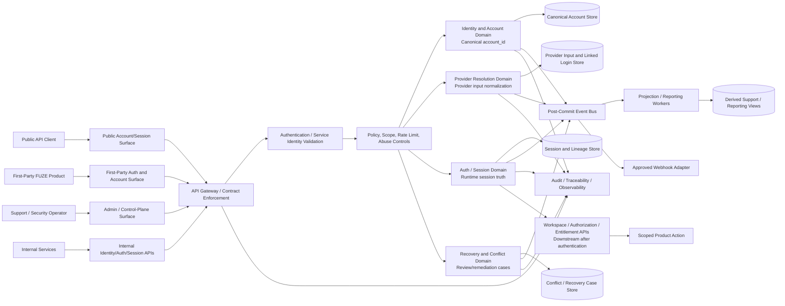
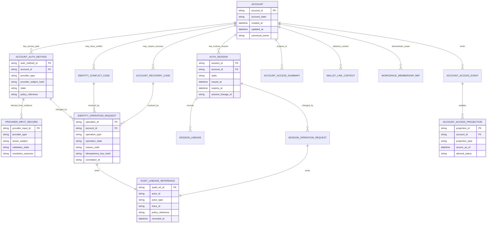
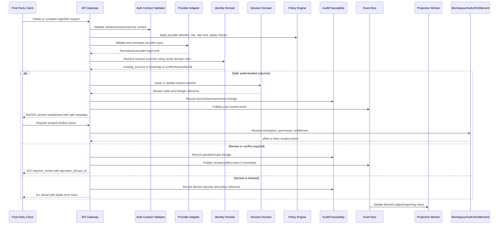

# ACCOUNT_ACCESS_AND_SESSION_THESIS_API_SPEC

## Document Metadata

- **Document Name:** `ACCOUNT_ACCESS_AND_SESSION_THESIS_API_SPEC.md`
- **Document Type:** FUZE API SPEC v2 production-grade interface-contract specification
- **Status:** Draft for API SPEC v2 library inclusion
- **Version:** 2.0.0
- **Effective Date:** 2026-04-24
- **Last Updated:** 2026-04-24
- **Reviewed On:** 2026-04-24
- **Document Owner:** FUZE Platform Identity and Access Architecture
- **Approval Authority:** FUZE Platform Architecture and Governance Authority
- **Review Cadence:** Quarterly or upon material change to account identity, authentication access paths, linked login, session lifecycle, provider resolution, recovery posture, workspace/authorization ordering, wallet-aware access posture, or public/API exposure posture
- **Governing Layer:** API SPEC v2 / identity, account, auth, and session interface-contract layer
- **Parent Registry:** `API_SPEC_INDEX.md` and the FUZE API SPEC v2 Canonical File Registry
- **Upstream Semantic Registry:** `REFINED_SYSTEM_SPEC_INDEX.md`
- **Upstream API Registry:** `API_SPEC_INDEX.md`
- **Primary Audience:** API architecture, backend engineering, frontend and first-party application engineering, platform identity engineering, auth/session engineering, security engineering, support operations, audit, governance, SDK/OpenAPI authors, implementation-contract authors
- **Primary Purpose:** Define the API contract thesis for how FUZE exposes account identity, approved access methods, and temporary authenticated session state without allowing the API layer to reinterpret refined account/access/session semantics.
- **Primary Upstream References:**
  - `REFINED_SYSTEM_SPEC_INDEX.md`
  - `API_SPEC_INDEX.md`
  - `DOCS_SPEC_INDEX.md`
  - `SYSTEM_SPEC_INDEX.md`
  - `FUZE_ACCOUNT_ACCESS_AND_SESSION_THESIS_FINAL_SPEC.md`
  - `FUZE_ACCOUNT_ACCESS_AND_SESSION_CANONICAL_FINAL_SPEC.md`
  - `IDENTITY_AND_ACCOUNT_SPEC.md`
  - `AUTH_SESSION_AND_LINKED_LOGIN_SPEC.md`
  - `FUZE_ACCOUNT_ACCESS_CONTINUITY_SPEC.md`
  - `FUZE_PROVIDER_RESOLUTION_AND_LINKING_SPEC.md`
  - `FUZE_SESSION_LIFECYCLE_AND_SECURITY_SPEC.md`
  - `FUZE_ACCOUNT_RECOVERY_AND_CONFLICT_HANDLING_SPEC.md`
  - `WALLET_AWARE_USER_SPEC.md`
  - `WORKSPACE_AND_ORGANIZATION_SPEC.md`
  - `ROLE_PERMISSION_AND_ACCESS_CONTROL_SPEC.md`
  - `SCOPED_AUTHORIZATION_MODEL_SPEC.md`
  - `ACCESS_EVALUATION_AND_EFFECTIVE_PERMISSION_SPEC.md`
  - `ENTITLEMENT_AND_CAPABILITY_GATING_SPEC.md`
  - `AUDIT_AND_ACCESS_TRACEABILITY_SPEC.md`
- **Primary Downstream Dependents:**
  - `IDENTITY_AND_ACCOUNT_API_SPEC.md`
  - `AUTH_SESSION_AND_LINKED_LOGIN_API_SPEC.md`
  - `WALLET_AWARE_USER_API_SPEC.md`
  - `ACCOUNT_ACCESS_AND_SESSION_CANONICAL_API_SPEC.md`
  - `ACCOUNT_ACCESS_CONTINUITY_API_SPEC.md`
  - `PROVIDER_RESOLUTION_AND_LINKING_API_SPEC.md`
  - `SESSION_LIFECYCLE_AND_SECURITY_API_SPEC.md`
  - `ACCOUNT_RECOVERY_AND_CONFLICT_HANDLING_API_SPEC.md`
  - `WORKSPACE_AND_ORGANIZATION_API_SPEC.md`
  - `ROLE_PERMISSION_AND_ACCESS_CONTROL_API_SPEC.md`
  - `SCOPED_AUTHORIZATION_MODEL_API_SPEC.md`
  - `ACCESS_EVALUATION_AND_EFFECTIVE_PERMISSION_API_SPEC.md`
  - `ENTITLEMENT_AND_CAPABILITY_GATING_API_SPEC.md`
  - `AUDIT_AND_ACCESS_TRACEABILITY_API_SPEC.md`
  - OpenAPI, AsyncAPI, SDK, implementation-contract, event-contract, and support/control-plane contract artifacts derived from this API domain
- **API Surface Families Covered:** Public explanatory read surfaces where approved; first-party product auth entry and account/session inspection surfaces; internal identity/auth/session service APIs; admin/control-plane review and remediation APIs; event and webhook-adjacent notifications; reporting/support projections derived from canonical truth.
- **API Surface Families Excluded:** Raw provider SDK callback internals, credential storage internals, MFA protocol internals, database schema internals, product-local profile APIs except as downstream consumers, workspace authorization APIs except as adjacent boundaries, wallet protocol APIs except as attached context, billing/credits/ledger APIs except as downstream subject consumers.
- **Canonical System Owner(s):** FUZE Platform Identity and Account Domain; FUZE Auth / Session / Linked Login Domain; FUZE Provider Resolution Domain; FUZE Session Lifecycle and Security Domain; FUZE Audit / Traceability Domain for reconstructability.
- **Canonical API Owner:** FUZE Platform API Architecture in coordination with FUZE Platform Identity and Access Architecture.
- **Supersedes:** Earlier API-level account/access/session thesis guidance, including any v1 API wording that blurred account, access-path, and session semantics or treated provider identity, session state, wallet state, workspace membership, frontend state, reporting views, or product-local user tables as platform identity truth.
- **Superseded By:** Not yet known.
- **Related Decision Records:** Not yet known.
- **Canonical Status Note:** This API spec is the production-grade API contract expression of the refined thesis. It does not own semantic truth; refined system specs own account/access/session meaning. This document governs how APIs must expose, consume, and preserve that meaning.
- **Implementation Status:** Ready for downstream route-family, OpenAPI, AsyncAPI, service-contract, SDK, QA, audit, and control-plane derivation.
- **Approval Status:** Drafted for API SPEC v2 inclusion; formal approval record not yet attached.
- **Change Summary:** Created API SPEC v2 account/access/session thesis contract; aligned API surface boundaries with refined thesis and canonical account/access/session rules; added request/response/error/status, idempotency, audit, event, projection, migration, diagram, acceptance-criteria, and test-case requirements.

## Purpose

This API specification defines the production-grade API contract thesis for FUZE account access and session behavior.

The upstream refined thesis states the governing platform idea:

> Identity belongs to the account. Access belongs to approved linked login methods. Runtime presence belongs to the session.

This API spec expresses that thesis at the interface layer. It defines how public, first-party, internal, admin/control, event, webhook-adjacent, and reporting surfaces MUST preserve the distinction between:

1. canonical account identity,
2. approved access-path or linked-login truth,
3. temporary authenticated session truth,
4. provider-input evidence,
5. workspace/authorization/entitlement truth downstream of authentication,
6. wallet-aware context attached to the account, and
7. derived/reporting/support views.

This document is intentionally a thesis-level API specification. It defines interface posture, allowed resource families, boundary rules, and contract obligations. It does not replace endpoint-specific implementation contracts, database schemas, provider-specific protocol contracts, or token transport details.

## Scope

This specification governs API behavior for:

- account/access/session thesis interpretation at the interface layer;
- canonical account subject anchoring by `account_id`;
- approved authentication method and linked-login exposure boundaries;
- authenticated session establishment, inspection, continuation, revocation, invalidation, and containment at the contract level;
- provider-input normalization before account or access-path influence;
- conflict, recovery, remediation, review, and risk-review outcomes at the API boundary;
- post-authentication ordering into workspace, authorization, permission, entitlement, and product-capability evaluation;
- reason-coded, policy-bounded, audited admin/control-plane account/access/session actions;
- derived account/access/session support, reporting, continuity, and session-inspection views;
- events and webhook-adjacent notifications emitted after canonical commits;
- idempotency, retry safety, audit lineage, observability, compatibility, and migration rules for this API family.

## Out of Scope

This API spec does not govern:

- exact OAuth, OIDC, Telegram, Line, Facebook, Google, SSO, wallet-signature, or future provider protocol mechanics;
- exact credential hashing, key-management, token format, cookie flags, session-token transport, refresh-token storage, or MFA implementation;
- full workspace membership, role, permission, entitlement, product capability, billing, credits, ledger, payout, treasury, or governance semantics;
- exact database table schemas, service topology, queue mechanics, cache implementation, or support-console UI;
- legal identity, KYC, sanctions, or compliance identity beyond the FUZE platform account model unless separately introduced by approved specs;
- public marketing or community copy except where API surfaces must not misrepresent truth ownership.

## Design Goals

1. Preserve one canonical account identity across FUZE products and access paths.
2. Prevent API surfaces from turning provider login, session presence, workspace membership, wallet possession, or product-local user records into platform identity truth.
3. Provide stable route/resource family posture for account, access method, session, provider resolution, conflict/review, recovery, audit, and derived view surfaces.
4. Make accepted-state, conflict-state, denied-state, and final-success semantics explicit.
5. Require idempotency, replay safety, reason codes, policy references, correlation IDs, and audit lineage where side effects or sensitive actions exist.
6. Support OpenAPI, AsyncAPI, SDK, QA, observability, and implementation-contract derivation without collapsing API specs into raw endpoint lists.
7. Keep public APIs narrow and stable while allowing first-party and internal APIs to express necessary platform detail under stronger policy and authorization controls.

## Non-Goals

This specification does not aim to:

- create a new account/access/session semantic model separate from the refined system specs;
- define one monolithic `/user` API that hides ownership boundaries;
- expose provider claims, wallet addresses, sessions, or workspace membership as canonical identity substitutes;
- define all endpoint paths, all schema fields, or all provider-specific callbacks;
- allow admin convenience to bypass review, policy, idempotency, or audit;
- make reporting, cache, SDK, or frontend state canonical.

## Core Principles

### 1. Refined Semantics First

API contracts MUST derive from refined system specs. If an API v1 source, product convenience, or implementation shortcut conflicts with refined account/access/session semantics, the API layer MUST be corrected rather than the refined semantics weakened.

### 2. Account Is the API Subject Anchor

The stable API subject anchor for person-level continuity is `account_id`. Provider subject IDs, emails, wallet addresses, workspace IDs, product-local user IDs, session IDs, and report IDs MUST NOT replace `account_id` as the actor identity anchor.

### 3. Access Paths Are Not Identities

Authentication methods, linked logins, provider subjects, and wallet-auth proofs MAY be exposed as access-path resources or provider-input resources, but they MUST NOT be represented as alternate canonical user identities.

### 4. Sessions Are Runtime Truth Only

Session APIs MAY expose runtime authentication state, session lineage, expiration, revocation, invalidation, and containment. They MUST NOT imply durable identity truth, workspace permission, product entitlement, or financial eligibility.

### 5. Authentication Is Not Authorization

API responses MUST preserve the ordering: account resolution, access-path validation, session establishment, workspace/scope resolution, permission evaluation, entitlement/capability evaluation, then action execution.

### 6. Provider Inputs Require FUZE Normalization

Provider callbacks and external claims are evidence. They are provider-input truth until FUZE backend normalization and owner-domain validation produce a canonical account, linked-login, conflict, review, denial, or bootstrap outcome.

### 7. Ambiguity Becomes Explicit Review

Duplicate-account risk, ambiguous provider evidence, unsafe link intent, recovery uncertainty, or contested identity posture MUST resolve to explicit `review_required`, `conflict_opened`, `risk_review_required`, or `denied` outcomes. APIs MUST NOT silently merge, split, fragment, overwrite, or reassign identity truth.

### 8. Derived Views Stay Derived

Support views, continuity views, session-inspection views, analytics summaries, exports, SDK caches, public explanations, and reporting projections MAY summarize canonical state. They MUST be regenerable and MUST NOT become mutation owners.

## Canonical Definitions

- **Account:** The canonical FUZE identity record for a person or actor.
- **Account ID:** The durable platform actor anchor used across products and domains.
- **Authentication Method:** An approved way to prove access to a canonical account.
- **Linked Login / Access Path:** The durable relationship between an account and an approved authentication method or provider subject.
- **Session:** Temporary authenticated runtime state created after successful authentication and required policy evaluation.
- **Provider Input:** External login evidence such as issuer-subject pairs, callback payloads, identity-provider claims, messaging-provider subject identifiers, or future wallet-auth proof inputs.
- **Account Resolution Outcome:** The FUZE-owned result of normalizing auth evidence into `existing_account`, `new_account_bootstrap`, `link_completed`, `review_required`, `conflict_opened`, `risk_review_required`, or `denied`.
- **Session Lineage:** A traceable chain of issued, refreshed, rotated, revoked, expired, or invalidated sessions.
- **Conflict Case:** Explicit state representing unsafe automatic resolution of provider, account, recovery, or duplicate-account evidence.
- **Recovery Case:** Explicit state representing controlled restoration of access to the same account.
- **Derived View:** A read model, report, cache, support view, or projection that summarizes canonical truth but cannot mutate or override it.

## Truth Class Taxonomy

This API spec distinguishes the following truth classes:

1. **Semantic Truth:** Owned by refined system specs; defines what account, access path, session, provider input, conflict, recovery, wallet context, workspace scope, permission, and entitlement mean.
2. **API Contract Truth:** Owned by this and adjacent API specs; defines how interfaces expose, accept, reject, paginate, version, idempotently execute, and report those semantics.
3. **Canonical Identity Truth:** Account records and lifecycle state anchored by `account_id`.
4. **Access-Path Truth:** Durable approved authentication method and provider-subject mappings.
5. **Runtime Session Truth:** Active and historical session state, session lineage, issuance, revocation, expiration, invalidation, containment, and recent-auth posture.
6. **Policy Truth:** Provider approval, risk, recovery, step-up, operator-control, entitlement, and security policies that constrain outcomes.
7. **Provider-Input Truth:** External evidence before FUZE validation and owner-domain resolution.
8. **Authorization Truth:** Workspace scope, membership, role, permission, and effective-access decisions owned by authorization domains.
9. **Entitlement Truth:** Product/capability eligibility owned by entitlement domains.
10. **Wallet-Aware Context Truth:** Wallet links and wallet-derived participation context attached to the account.
11. **Audit / Observability Truth:** Durable lineage, correlation, actor attribution, event references, trace IDs, policy references, and decision records.
12. **Derived Read-Model Truth:** Support, continuity, inspection, reporting, search, cache, export, and public-read summaries.
13. **Presentation Truth:** User-facing wording, UI state, SDK convenience objects, and product-local explanations that must remain subordinate to canonical and contract truth.

## Architectural Position in the Spec Hierarchy

This document sits below:

- `REFINED_SYSTEM_SPEC_INDEX.md`
- `FUZE_ACCOUNT_ACCESS_AND_SESSION_THESIS_FINAL_SPEC.md`
- `FUZE_ACCOUNT_ACCESS_AND_SESSION_CANONICAL_FINAL_SPEC.md`
- `IDENTITY_AND_ACCOUNT_SPEC.md`
- `AUTH_SESSION_AND_LINKED_LOGIN_SPEC.md`
- platform boundary, architecture, data ownership, security, audit, and access-control refined specs

It sits alongside or above downstream API specs that provide more detailed contracts for:

- identity/account APIs,
- auth/session/linked-login APIs,
- provider resolution and linking APIs,
- session lifecycle and security APIs,
- account recovery and conflict-handling APIs,
- workspace, authorization, entitlement, wallet-aware, audit, and public-read APIs.

This document governs thesis-level API posture and MUST NOT absorb the detailed ownership of adjacent API specs.

## Upstream Semantic Owners

- **Identity and Account Domain:** canonical account, account lifecycle, `account_id`, identity continuity, identity conflict/remediation, identity recovery posture.
- **Auth / Session / Linked Login Domain:** authentication flows, linked login lifecycle, session issuance, inspection, refresh, revocation, invalidation, containment, and runtime access.
- **Provider Resolution Domain:** normalization of provider inputs into safe account/access outcomes.
- **Session Lifecycle and Security Domain:** session lifecycle state, session lineage, risk-based containment, global revoke, recent-auth posture, and trust-reset implications.
- **Account Recovery and Conflict Handling Domain:** recovery cases, conflict cases, duplicate-account risk, remediation flows.
- **Workspace / Organization Domain:** workspace context after authentication.
- **Authorization Domain:** roles, permissions, effective permission, and scoped authorization after context resolution.
- **Entitlement Domain:** product/capability eligibility after identity, session, and scope resolution.
- **Wallet-Aware Domain:** wallet-link truth and wallet-derived participation context attached to account.
- **Audit / Traceability Domain:** reconstructability, actor attribution, lineage, and privileged-control audit.

## API Surface Families

### Public API Surface

Public APIs MAY expose only narrow, stable, non-sensitive account/access/session thesis outcomes. Public surfaces SHOULD avoid exposing raw provider claims, internal account-resolution heuristics, conflict-case internals, security policy internals, or session secrets.

Allowed public posture examples:

- documented auth entry initiation where approved;
- high-level account/session status for the authenticated actor;
- safe session revocation for the authenticated actor;
- public-facing explanation of identity/access/session boundaries;
- stable error classes without internal risk signals.

### First-Party Application Surface

First-party FUZE products MAY initiate login, link approved access methods, inspect current session state, request logout/revoke, and display safe account/access/session status. They MUST consume canonical backend outcomes and MUST NOT create local platform identity truth.

### Internal Service Surface

Internal services MAY consume richer account/access/session contracts for orchestration, policy, events, projection, support, and runtime execution. Internal APIs MUST remain least-privileged, service-identity-scoped, correlation-linked, and audit-aware. Internal service APIs MUST NOT become hidden broad-write shortcuts.

### Admin / Control-Plane Surface

Admin/control APIs MAY support review, remediation, recovery, provider correction, global logout, session containment, access-path disablement, or conflict resolution only through bounded, policy-constrained, reason-coded, audited, idempotent workflows.

### Event / Webhook / Async Surface

Material account/access/session actions SHOULD emit post-commit events. External webhooks, if approved, MUST expose narrower derived notifications than internal events and MUST NOT expose secrets, raw provider claims, or internal risk scoring.

### Reporting / Support Surface

Reporting and support APIs MAY provide derived account/access/session summaries. They MUST identify derived status, source freshness, conflict/restriction indicators where material, and canonical reconciliation references. They MUST NOT provide direct mutation routes except via explicit control-plane workflows.

### Chain-Adjacent Surface

Wallet-aware or chain-adjacent surfaces MAY attach wallet context to an account where separately approved. They MUST NOT treat wallet possession, token balance, or chain observation as canonical FUZE account identity.

## System / API Boundaries

### Governed by This API Spec

- thesis-level API posture for account/access/session boundaries;
- resource-family separation between account, access method, session, provider input, conflict/recovery, audit, and derived views;
- request/response/error/status/idempotency/audit/versioning guardrails;
- cross-surface exposure posture.

### Governed by Upstream Refined System Specs

- semantic meaning of account, access path, session, provider input, continuity, recovery, conflict, workspace, authorization, entitlement, wallet context, and derived views;
- owner-domain mutation boundaries;
- conflict-resolution precedence;
- canonical state meanings and truth classes.

### Governed by Adjacent API Specs

- route-by-route identity/account API details;
- exact auth challenge, callback, linked-login, and session APIs;
- provider resolution/linking implementation contracts;
- account recovery and conflict-handling APIs;
- workspace/authorization/entitlement APIs;
- audit log APIs;
- public trust/public metadata APIs.

### Governed by Implementation-Contract Specs

- exact payload fields beyond API-family contract requirements;
- service-to-service RPC shapes;
- database schemas;
- token and cookie mechanics;
- provider-specific adapters;
- queue/worker behavior;
- observability dashboards and runbooks.

## Adjacent API Boundaries

- `IDENTITY_AND_ACCOUNT_API_SPEC.md` owns canonical account resource contracts and identity lifecycle APIs.
- `AUTH_SESSION_AND_LINKED_LOGIN_API_SPEC.md` owns authentication, linked-login, session issuance, session continuation, and session revocation contract detail.
- `ACCOUNT_ACCESS_AND_SESSION_CANONICAL_API_SPEC.md` owns stricter canonical API rule expression downstream of this thesis.
- `ACCOUNT_ACCESS_CONTINUITY_API_SPEC.md` owns access resilience and continuity-specific API contracts.
- `PROVIDER_RESOLUTION_AND_LINKING_API_SPEC.md` owns provider normalization, callback result handling, link intent, provider subject mapping, and ambiguous-provider outcomes.
- `SESSION_LIFECYCLE_AND_SECURITY_API_SPEC.md` owns detailed session lifecycle, risk containment, recent-auth, revoke, rotation, and invalidation APIs.
- `ACCOUNT_RECOVERY_AND_CONFLICT_HANDLING_API_SPEC.md` owns recovery case, duplicate-account risk, conflict review, remediation, and controlled correction APIs.
- `WORKSPACE_AND_ORGANIZATION_API_SPEC.md`, `ROLE_PERMISSION_AND_ACCESS_CONTROL_API_SPEC.md`, and `ENTITLEMENT_AND_CAPABILITY_GATING_API_SPEC.md` own post-authentication scope, authorization, and capability checks.
- `AUDIT_AND_ACCESS_TRACEABILITY_API_SPEC.md` owns audit lineage and traceability APIs.

## Conflict Resolution Rules

1. Refined system specs win on semantic truth.
2. This API spec wins on thesis-level API contract posture where it does not contradict refined semantics.
3. Adjacent API specs win on their narrower route/resource family details where they preserve this thesis and upstream semantics.
4. Implementation contracts win only on implementation detail and MUST NOT redefine semantic or API contract truth.
5. Public/first-party/admin convenience MUST NOT override owner-domain mutation boundaries.
6. Provider input MUST NOT override canonical account/access truth.
7. Runtime session state MUST NOT override account restriction, auth-path disablement, recovery completion, risk containment, or policy denial.
8. Derived views, reports, caches, and SDK objects MUST NOT override canonical backend records.
9. Where ambiguity remains, the API MUST choose the more restrictive architecture-consistent outcome and surface a review, conflict, risk, or denial status rather than guessing.

## Default Decision Rules

1. Default subject anchor: `account_id`.
2. Default access-path meaning: linked login, not identity.
3. Default session meaning: temporary runtime authentication state, not authorization or entitlement.
4. Default provider evidence meaning: provider input requiring FUZE normalization.
5. Default wallet meaning: attached context, not identity root.
6. Default workspace meaning: collaboration/operating scope after authentication.
7. Default authorization meaning: separate effective permission decision after scope resolution.
8. Default entitlement meaning: product/capability eligibility after identity/session/scope.
9. Default ambiguous provider or duplicate-account outcome: explicit review or conflict case.
10. Default high-risk privileged mutation: reason-coded, policy-bound, idempotent, audited control-plane operation.
11. Default derived-view mismatch: canonical owner-domain records win.
12. Default public exposure: narrower and safer unless an approved spec expands exposure.

## Roles / Actors / API Consumers

- **End User:** Authenticated or authenticating actor using FUZE products.
- **First-Party Product Client:** FUZE-owned web, mobile, or product UI initiating flows and consuming outcomes.
- **Public API Client:** External consumer of approved stable public account/session surfaces.
- **Internal Service:** FUZE service using service identity under least privilege.
- **Provider Adapter:** Internal adapter processing external provider inputs before FUZE normalization.
- **Async Worker:** Background processor executing accepted operations, projection, event delivery, or remediation workflow steps.
- **Support Operator:** Human operator acting through policy-bound control plane.
- **Security Operator:** Privileged actor responding to risk, recovery, conflict, containment, or incident conditions.
- **Audit / Compliance Consumer:** Consumer reconstructing lineage and evidence.
- **Reporting Consumer:** Consumer of derived views and safe projections.

## Resource / Entity Families

API resource families SHOULD be expressed around these families rather than one ambiguous user object:

- `account`
- `account_identity_status`
- `account_auth_method` / `linked_login`
- `auth_provider_input` / `provider_resolution_attempt`
- `auth_session`
- `session_lineage`
- `account_access_summary` / `continuity_summary`
- `identity_conflict_case`
- `account_recovery_case`
- `identity_operation_request`
- `session_operation_request`
- `audit_lineage_reference`
- `account_access_event`
- `account_access_projection` / `support_account_access_view`

Forbidden resource-family shortcuts:

- one generic `user` object that merges account, provider, session, workspace, permission, entitlement, wallet, and product-local profile truth;
- `provider_user` as canonical FUZE identity;
- `session_user` as canonical FUZE identity;
- `wallet_user` as canonical FUZE identity;
- `workspace_user` as canonical FUZE identity.

## Ownership Model

### Canonical Mutation Owners

- Account creation, lifecycle, restriction, merge/remediation posture: Identity and Account Domain.
- Linked-login lifecycle and auth-path validation: Auth / Session / Linked Login Domain with identity-domain constraints.
- Provider normalization and provider-account resolution: Provider Resolution Domain.
- Session issuance, refresh, revoke, invalidation, containment: Auth / Session and Session Lifecycle Domains.
- Recovery and conflict cases: Account Recovery and Conflict Handling Domain with identity/security participation.
- Audit lineage: Audit / Traceability Domain.

### Non-Owners

Products, frontends, SDKs, public APIs, provider callbacks, reports, dashboards, caches, analytics jobs, support displays, and public-read surfaces MUST NOT directly mutate canonical account, linked-login, provider-resolution, recovery, conflict, or session truth.

## Authority / Decision Model

API decisions MUST be made by the owner domain for the truth being changed. Workflow orchestration MAY coordinate multiple domains, but it MUST preserve ownership boundaries. For example:

- a first-party product MAY request login initiation but cannot decide account resolution;
- a provider adapter MAY submit provider input but cannot assign a provider subject to an account without FUZE-owned resolution;
- a support console MAY request remediation but cannot mutate identity directly without a bounded operation request;
- a session service MAY revoke sessions but cannot reinterpret account identity;
- an authorization service MAY deny action in workspace scope but cannot redefine account identity.

## Authentication Model

- Public and first-party endpoints that inspect or mutate the current account/session MUST require authenticated context unless they are explicitly unauthenticated initiation endpoints.
- Auth initiation endpoints MAY be unauthenticated but MUST enforce provider allowlists, anti-abuse controls, correlation, replay protection, and redirect/callback safety.
- Callback-like APIs MUST treat provider payloads as provider-input evidence and MUST not expose raw validation internals to clients.
- Session-bearing requests MUST bind to server-side session validation or equivalent trusted runtime verification.
- High-risk actions MUST require recent-auth, step-up, or stronger policy posture where specified by security policy.
- Service-to-service calls MUST use explicit service identity, not end-user session impersonation unless a delegated actor chain is recorded.

## Authorization / Scope / Permission Model

- Authentication proves account reachability; it does not prove workspace authority or feature permission.
- APIs that operate within workspace/product scope MUST require scope resolution after session validation.
- Permission checks MUST be evaluated by the authorization domain using canonical `account_id` plus resolved workspace/object scope.
- Control-plane actions MUST require privileged scopes distinct from ordinary application permissions.
- APIs MUST NOT infer authorization allow solely from session validity, provider identity, wallet possession, product-local role labels, or derived support view state.

## Entitlement / Capability-Gating Model

- Entitlement checks are downstream of account/session/scope.
- Entitlement APIs MUST consume `account_id` and required scope; they MUST NOT create alternate subject identifiers.
- Loss or absence of entitlement MUST NOT redefine identity or revoke canonical account existence.
- API responses SHOULD distinguish `authenticated_but_not_entitled` from `unauthenticated`, `unauthorized`, and `account_restricted`.

## API State Model

At the API contract level, the platform MUST be able to distinguish these states or equivalent canonical statuses:

### Account State

- `pending_setup`
- `active`
- `restricted`
- `suspended`
- `deactivated`
- `closed`
- `merged` only as explicit remediation outcome

### Access Method / Linked Login State

- `pending_verification`
- `pending_link_completion`
- `active`
- `disabled`
- `removed`
- `review_required`
- `conflict_bound`

### Provider Resolution State

- `received`
- `validated_input`
- `normalized`
- `existing_account_resolved`
- `new_account_bootstrap_allowed`
- `link_intent_completed`
- `review_required`
- `conflict_opened`
- `risk_review_required`
- `denied`

### Session State

- `issued`
- `active`
- `refreshed`
- `rotated`
- `revoked`
- `expired`
- `invalidated`
- `contained`

### Operation State

- `accepted`
- `processing`
- `requires_review`
- `blocked_by_policy`
- `completed`
- `failed`
- `cancelled`
- `reversed`

## Lifecycle / Workflow Model

1. Actor initiates an approved auth entry or access-management action.
2. API assigns or requires `correlation_id` and, for side-effecting requests, an `idempotency_key`.
3. API validates authentication context or initiation safety.
4. Provider or credential proof is validated by owner-controlled backend logic.
5. Provider input is normalized into FUZE provider-input truth.
6. Owner domain resolves canonical account/access outcome.
7. If safe, session is established or access-method mutation proceeds.
8. If ambiguous or risky, API returns accepted/review/conflict/risk outcome with operation or case reference.
9. After session establishment, workspace, authorization, and entitlement checks occur for scoped actions.
10. Canonical commit emits audit lineage and post-commit events where material.
11. Derived read models and support projections update asynchronously.
12. Public or external notifications, if approved, derive from committed owner truth only.

## Architecture Diagram — Mermaid flowchart

## Data Design — Mermaid Diagram

## Flow View

### Synchronous Login / Session Establishment

1. Client initiates approved login flow.
2. API returns initiation reference and records correlation.
3. Provider or credential proof returns to backend-controlled completion endpoint.
4. Provider input is validated and normalized.
5. Account resolution produces existing account, new account bootstrap, link completion, review, conflict, risk review, or denial.
6. If the outcome is safe and policy allows, the session service issues session runtime state.
7. API returns session-established response with safe account/session metadata, not provider internals.
8. Downstream clients must request workspace/scope/permission/entitlement separately or through approved composed endpoints that preserve separation.

### Accepted Async / Review Flow

1. Request cannot be completed safely synchronously.
2. API records `operation_id` or `case_id`, `correlation_id`, idempotency key hash, actor attribution, policy reference, and reason.
3. API returns `202 Accepted` or equivalent `requires_review` status.
4. Async worker or operator workflow evaluates case.
5. Finalization commits canonical outcome, emits audit lineage and events, updates derived views.
6. Client polls operation/case status or receives approved notification if available.

### Failure / Retry Flow

1. Repeated request with same idempotency key returns the same operation or final result when request fingerprint matches.
2. Repeated request with same key but different material payload returns idempotency conflict.
3. Provider duplicate callback or replay is recognized and safely ignored or mapped to existing operation.
4. Transient provider outage returns provider-unavailable status without fragmenting account identity.
5. Degraded derived views do not block canonical owner-domain reads where owner systems are healthy and do not become fallback truth where owner systems are unavailable.

### Admin / Operator Flow

1. Operator authenticates through privileged control-plane surface.
2. API verifies privileged permission, policy, reason code, case/operation reference, recent-auth or step-up posture if required, and idempotency key.
3. Owner domain validates requested mutation.
4. API returns accepted or completed operation status.
5. Audit lineage records operator actor, target account, policy reference, before/after state class, correlation ID, and trace ID.
6. Events and projections update after canonical commit.

## Data Flows — Mermaid sequenceDiagram

## Request Model

Side-effecting account/access/session thesis APIs MUST define at contract level:

- `correlation_id` or equivalent request lineage reference;
- `idempotency_key` for repeatable side effects;
- authenticated actor or service identity;
- target `account_id` where applicable;
- requested operation type;
- provider type and provider input reference where applicable;
- safe client context where relevant, such as product, redirect intent, device class, or workspace hint;
- reason code for privileged, support, security, recovery, remediation, or destructive access changes;
- policy version/reference when the policy materially affects the outcome;
- optional `operation_id` or `case_id` when continuing an accepted async/review flow.

Requests MUST NOT require clients to submit raw canonical state transitions that belong to owner domains. Clients request intents; owner domains decide canonical outcomes.

## Response Model

Responses MUST distinguish:

- final synchronous success;
- accepted async intent;
- review required;
- conflict opened;
- risk review required;
- denied by authentication failure;
- denied by account/access/session state;
- denied by authorization;
- denied by entitlement;
- rate-limited or abuse-controlled;
- provider unavailable;
- degraded projection/reporting state;
- migration/compatibility warning where relevant.

Safe response fields SHOULD include:

- `account_id` where authenticated and allowed;
- `session_id` or opaque session reference only where safe;
- `operation_id` or `case_id` for async/review outcomes;
- `status` using stable contract enums;
- `status_reason_code` using non-sensitive reason classes;
- `correlation_id`;
- `trace_id` where safe for support correlation;
- `audit_ref_id` for privileged or sensitive operations where appropriate;
- `source_truth_class` for derived views;
- `source_as_of` for projections.

Responses MUST NOT expose secrets, credential material, raw provider tokens, raw internal risk scores, or hidden merge heuristics.

## Error / Result / Status Model

API errors MUST use stable classes. At minimum, this API family MUST distinguish:

- `unauthenticated`
- `authentication_failed`
- `session_invalid`
- `session_expired`
- `session_revoked`
- `session_contained`
- `account_restricted`
- `account_suspended`
- `access_method_disabled`
- `provider_unavailable`
- `provider_input_invalid`
- `provider_resolution_ambiguous`
- `identity_conflict_required`
- `recovery_required`
- `recent_auth_required`
- `step_up_required`
- `not_authorized`
- `not_entitled`
- `rate_limited`
- `abuse_denied`
- `idempotency_conflict`
- `operation_already_completed`
- `operation_requires_review`
- `derived_view_stale`
- `migration_compatibility_violation`

Errors MUST NOT collapse all denial into generic login failure when downstream consumers need deterministic handling. Public surfaces MAY redact sensitive details while preserving stable classes.

## Idempotency / Retry / Replay Model

- All side-effecting APIs that create accounts, link access methods, remove access methods, issue sessions, revoke sessions, initiate recovery, complete recovery, open conflict cases, remediate identity, or perform control-plane actions MUST support idempotency.
- Idempotency keys MUST be scoped to actor/client/service, operation family, target account where applicable, and request fingerprint.
- Replays with identical fingerprint MUST return the same operation reference or final outcome.
- Replays with changed material payload MUST return `idempotency_conflict`.
- Provider callbacks MUST be replay-safe and duplicate-delivery-safe.
- Async workers MUST be deterministic and idempotent across retries.
- Retry behavior MUST never silently duplicate accounts, duplicate linked logins, duplicate recovery cases, or issue multiple independent active sessions when the contract promised one outcome.

## Rate Limit / Abuse-Control Model

Rate limits and abuse controls MUST apply to:

- login initiation;
- provider callback completion;
- linked-login add/remove flows;
- recovery initiation/completion;
- session refresh/revoke/list/inspect;
- conflict/review status polling;
- control-plane remediation;
- public session/account status endpoints.

Rate-limit responses MUST distinguish transient client throttling from policy denial or account restriction. Abuse systems MUST NOT silently mutate identity or access-path truth; they may block, contain, require review, or restrict through owner-approved pathways.

## Endpoint / Route Family Model

This thesis API spec allows route families such as:

- `/account-access-thesis/current` for safe current-account/access/session thesis summary;
- `/account-access-thesis/status` for safe boundary/status explanation and non-sensitive runtime posture;
- `/accounts/{account_id}/access-summary` for owner-approved derived access posture views;
- `/accounts/{account_id}/auth-methods` for linked-login list/manage routes owned by adjacent auth/session specs;
- `/sessions/current`, `/sessions/{session_id}`, `/sessions/revoke`, `/sessions/global-revoke` for session surfaces owned by session specs;
- `/provider-resolution/attempts` and `/provider-resolution/callbacks` for provider normalization owned by provider specs;
- `/identity-conflict-cases` and `/account-recovery-cases` for review/recovery surfaces owned by adjacent specs;
- `/account-access-operations/{operation_id}` for accepted async/control-plane operation status;
- `/account-access-events` for internal event consumption where approved;
- `/account-access-projections` for support/reporting views.

Exact endpoints belong in narrower API specs. This document forbids route families that collapse account, provider, session, workspace, permission, entitlement, wallet, and product-local profile truth into one ambiguous write surface.

## Public API Considerations

Public APIs MUST default to narrow exposure. Public contract MUST:

- avoid raw provider data;
- avoid exposing internal conflict/remediation heuristics;
- avoid exposing full session lineage unless explicitly approved;
- use stable public-safe status classes;
- preserve account/access/session separation in docs and SDKs;
- not imply that login equals authorization or entitlement;
- not expose admin/control-plane mutation paths.

## First-Party Application API Considerations

First-party clients MAY receive richer workflow outcomes, but they MUST:

- treat backend account/session outcomes as authoritative;
- not store frontend-only auth/session truth as canonical;
- not merge account, provider, session, workspace, and entitlement into one local user truth object;
- handle `requires_review`, `conflict_opened`, `risk_review_required`, and `step_up_required` states explicitly;
- use separate access-control and entitlement checks for scoped product actions.

## Internal Service API Considerations

Internal APIs MUST:

- use service identity and least privilege;
- record actor chains for delegated user actions;
- preserve owner-domain mutation boundaries;
- support idempotency and audit for side effects;
- publish or consume post-commit events without treating events as write authority;
- avoid hidden broad-write endpoints that mutate identity/access/session truth outside owner validation.

## Admin / Control-Plane API Considerations

Admin/control APIs MUST be:

- separate from ordinary application APIs;
- privileged-scope protected;
- recent-auth or step-up protected where required;
- policy-bound;
- reason-coded;
- case/operation-reference linked;
- idempotent;
- actor-attributed;
- correlation-linked;
- audit-logged;
- observable;
- reversible only through explicit remediation where safe.

Admin APIs MUST NOT perform undocumented identity surgery, silent provider reassignment, silent account merge, silent session continuation after restriction, or hidden derived-view mutation.

## Event / Webhook / Async API Considerations

Internal events SHOULD exist for material account/access/session changes, including:

- account created/activated/restricted/suspended/closed/merged;
- linked login added/disabled/removed/restored/review-blocked;
- provider resolution completed/review-required/conflict-opened/denied;
- session issued/refreshed/rotated/revoked/expired/invalidated/contained;
- recovery initiated/approved/completed/rejected/cancelled;
- conflict/remediation opened/escalated/resolved/reversed;
- privileged operation accepted/completed/failed/reversed.

Events MUST be post-commit when they represent canonical truth. Pre-commit events MUST be explicitly labeled as intents or attempts. External webhooks MUST be narrower, redacted, and stable.

## Chain-Adjacent API Considerations

Wallet-aware or chain-adjacent flows MUST follow these rules:

- wallet proof is provider/input or wallet-context truth unless separately validated into wallet-link truth;
- wallet link attaches to `account_id` and does not replace it;
- wallet possession MUST NOT establish universal FUZE identity;
- chain observations MUST NOT mutate account identity without owner-domain validation;
- public chain references MUST be derived and must not expose private account/session state.

## Data Model / Storage Support Implications

Downstream storage contracts MUST support:

- durable `account` records;
- durable linked-auth/access-method records;
- provider-input records or equivalent replay-safe normalization attempts;
- durable session records and lineage where required;
- operation records for sensitive side effects;
- explicit recovery and conflict/remediation cases;
- idempotency records;
- audit lineage references;
- derived projections with source references and source freshness.

Destructive overwrites SHOULD be avoided for sensitive access-path and session lineage changes. Corrections SHOULD preserve before/after state classes and audit references.

## Read Model / Projection / Reporting Rules

Derived views MAY include:

- account access summary;
- continuity posture;
- linked-login summary;
- session inspection summary;
- conflict/recovery status summary;
- support-facing trust posture summary;
- analytics counts and trend summaries.

Derived views MUST:

- identify source truth and source freshness;
- be regenerable from canonical records;
- not mutate canonical truth;
- not silently coalesce identities;
- not hide active conflict/recovery/restriction states where material;
- reconcile to owner-domain truth when mismatches occur.

## Security / Risk / Privacy Controls

This API family is security-critical. Implementations MUST enforce:

- backend-authoritative account and session validation;
- provider input verification before resolution;
- anti-replay and CSRF/redirect/callback safety where applicable;
- idempotency for sensitive side effects;
- rate limits and abuse controls;
- step-up or recent-auth for sensitive user actions;
- privileged authorization and reason codes for admin/control actions;
- safe redaction of provider tokens, credentials, risk internals, and raw identity evidence;
- account-state and risk-state precedence over session continuation;
- global revoke and targeted containment pathways;
- audit logging and observability for sensitive outcomes.

## Audit / Traceability / Observability Requirements

Every material account/access/session API action MUST be reconstructable across:

- requesting actor and actor type;
- target `account_id`;
- access method or provider input reference where applicable;
- session or session lineage reference where applicable;
- operation/case reference;
- idempotency key hash;
- correlation ID;
- trace ID;
- policy reference/version;
- reason code for privileged or sensitive operations;
- result status and finalization state;
- event IDs and projection update references where applicable.

Observability MUST distinguish canonical owner-domain failures from projection/reporting staleness and provider unavailability.

## Failure Handling / Edge Cases

### Provider Outage

Return provider-unavailable or accepted-pending outcome where appropriate. Do not create fallback identity truth from email, frontend state, cached provider profile, or wallet state.

### Duplicate Provider Callback

Map to existing idempotent operation or safely ignore after confirming prior result. Do not duplicate account, access method, session, or conflict case.

### Ambiguous Provider Evidence

Return review/conflict outcome. Do not silent merge, silent split, or provider-subject reassignment.

### Session Present but Account Restricted

Account restriction, suspension, recovery reset, or risk containment wins. Session APIs must return invalidated/contained/revoked status as appropriate.

### Frontend State Mismatch

Backend truth wins. Frontend must refresh or clear local state.

### Derived View Stale

Canonical owner-domain reads win. Reporting/support surfaces must identify staleness or reconciliation need.

### Lost Access Method

If another approved method or recovery path exists, recovery should restore access to same account. Do not bootstrap substitute identity unless owner-domain rules explicitly allow new account creation.

### Wallet Link Change

Wallet context changes do not redefine account identity.

### Workspace Change

Workspace membership changes do not redefine account identity or session semantics.

## Migration / Versioning / Compatibility / Deprecation Rules

- API versions MUST preserve account/access/session separation.
- Deprecated v1 surfaces that expose ambiguous `user` objects MUST be wrapped, corrected, or sunset with migration guidance.
- Clients MUST migrate from provider-local, product-local, or session-local actor assumptions to `account_id` subject anchoring.
- Migration tooling MUST not silently merge accounts based on email similarity, provider profile similarity, wallet possession, or product-local user records.
- Backward-compatible fields MAY remain as aliases only if canonical ownership is explicit and no client can mistake them for identity truth.
- Deprecation notices MUST identify replacement route families and semantic differences.
- Public API compatibility MUST prefer narrower stable contracts; internal API compatibility MAY evolve faster but must preserve semantic invariants.

## OpenAPI / AsyncAPI / SDK Derivation Rules

OpenAPI, AsyncAPI, and SDK artifacts derived from this spec MUST:

- preserve resource-family boundaries;
- distinguish account, access method, provider input, session, recovery/conflict case, operation, audit, and projection models;
- include stable status/error enums;
- include idempotency and correlation headers/fields for side effects;
- mark derived/read-model resources as derived;
- avoid a single generated `User` type that merges truth classes;
- avoid hiding accepted async outcomes behind synchronous success abstractions;
- expose retry semantics and idempotency conflicts clearly;
- redact sensitive provider/security fields by default;
- include deprecation annotations for legacy aliases.

## Implementation-Contract Guardrails

Downstream implementations MUST NOT:

- let product-local user tables become platform identity;
- let provider callbacks mutate account truth directly;
- use email as sole silent merge key;
- reassign provider subjects without explicit owner-domain operation;
- treat valid session as authorization or entitlement;
- bypass session invalidation on account restriction/security events;
- make reporting/support dashboards write to canonical account/access/session truth;
- allow operator mutation without reason code, policy reference, audit, and idempotency;
- collapse recovery, conflict, and remediation into hidden notes or untracked flags;
- expose public APIs that leak raw provider tokens, risk internals, or identity evidence.

## Downstream Execution Staging

1. Stabilize account/access/session thesis API posture.
2. Derive canonical API spec and narrower identity/auth/session route-family specs.
3. Define provider resolution and linked-login implementation contracts.
4. Define session lifecycle, containment, and security contracts.
5. Define recovery/conflict/remediation contracts.
6. Define workspace/authorization/entitlement integration contracts.
7. Define event/AsyncAPI contracts and projection contracts.
8. Define OpenAPI/SDK generation rules and migration adapters.
9. Define QA, observability, audit, and runbook contracts.

## Required Downstream Specs / Contract Layers

Required downstream work includes:

- route-family specs for identity/account, auth/session, provider resolution, account recovery/conflict, and session lifecycle;
- storage contracts for account, access method, provider input, session lineage, operation, idempotency, recovery/conflict, and audit records;
- event contracts for material account/access/session changes;
- public/first-party/internal/admin surface matrices;
- OpenAPI and SDK contract artifacts;
- migration adapters for legacy v1 API shapes;
- QA and regression test suites for identity fragmentation, session subordination, idempotency, and auditability.

## Boundary Violation Detection / Non-Canonical API Patterns

APIs SHOULD detect and surface reviewable evidence for:

- provider subject appearing on multiple accounts;
- product-local user ID attempting to act as canonical account;
- session accepted after account restriction;
- access method removal that would strand account access without recovery path;
- idempotency replay mismatch;
- privileged operation missing reason code or audit reference;
- derived view attempting canonical mutation;
- wallet-auth flow attempting identity replacement;
- authorization allow inferred from login without scope/permission evaluation.

Forbidden API patterns:

- `/users/{id}` as a broad write surface for identity, access, session, workspace, entitlement, wallet, and product profile state;
- provider callback directly writing `account_id` mapping without FUZE provider-resolution domain;
- admin merge endpoint without case, reason, policy, idempotency, and audit;
- session introspection endpoint that returns authorization allow by default;
- report/export endpoint that offers canonical mutation;
- public endpoint exposing raw provider claims or internal risk scores.

## Canonical Examples / Anti-Examples

### Canonical Example 1 — Google Login Resolves Existing Account

A first-party product completes Google login. FUZE validates provider input, maps stable provider subject to an existing `account_id`, issues a session, and then the product separately resolves workspace and entitlement.

### Canonical Example 2 — Telegram Link Requires Existing Session and Safe Link Intent

An authenticated actor links Telegram. The API validates current session, recent-auth policy, link intent, provider subject uniqueness, and idempotency. If safe, the linked-login record becomes active and audit/event records are emitted.

### Canonical Example 3 — Duplicate Email Does Not Auto-Merge

A provider returns an email matching another account. The API treats email as a hint, not sole canonical key, and returns conflict/review outcome if stable provider-subject mapping cannot safely resolve.

### Canonical Example 4 — Session Revoked After Account Restriction

A security event restricts the account. Session APIs return contained/revoked/invalidated state even if a client still has a local token.

### Anti-Example 1 — Product-Local User as Identity

A product creates `product_user_id` and uses it as cross-platform actor identity. Forbidden.

### Anti-Example 2 — Provider Callback as Owner

A provider callback inserts or reassigns an account link without FUZE normalization and owner-domain validation. Forbidden.

### Anti-Example 3 — Session Equals Permission

A client assumes valid session means workspace admin capability. Forbidden.

### Anti-Example 4 — Wallet as Account

A wallet signature creates or overwrites canonical FUZE identity without account-domain rules. Forbidden.

## Acceptance Criteria

1. API contracts identify `account_id` as the durable subject anchor and do not expose provider/session/wallet/workspace IDs as substitute identity roots.
2. Side-effecting account/access/session APIs require idempotency keys and return deterministic replay behavior.
3. Provider callbacks are replay-safe and normalize into FUZE-owned provider-input truth before affecting account/access state.
4. Ambiguous provider or duplicate-account evidence returns explicit review/conflict/risk status and does not silently merge or fragment accounts.
5. Session issuance occurs only after safe account resolution, access-path validation, and required policy checks.
6. Session validity is subordinate to account restriction, suspension, auth-method disablement, recovery reset, and risk containment.
7. API errors distinguish unauthenticated, session invalid, account restricted, not authorized, not entitled, provider ambiguous, review required, and idempotency conflict cases.
8. First-party clients can handle accepted async/review outcomes through operation or case references.
9. Admin/control-plane APIs require privileged authorization, reason code, policy reference where material, idempotency, correlation, actor attribution, and audit lineage.
10. Derived read-model APIs identify source freshness and do not allow direct canonical mutation.
11. Public APIs do not expose secrets, raw provider tokens, internal risk scores, or hidden resolution heuristics.
12. Events representing canonical changes are emitted only after canonical commit or are explicitly labeled as pre-commit intents.
13. OpenAPI/SDK derivations preserve separate models for account, access method, provider input, session, operation, recovery/conflict case, audit reference, and projection.
14. Migration adapters do not preserve legacy semantics that treat a generic `user` object as all truth classes.
15. Observability can distinguish provider outage, canonical owner failure, policy denial, and stale projection.

## Test Cases

### Positive Path Tests

1. **Existing Account Login:** Given valid provider evidence mapped to an existing access method, API returns successful session establishment with `account_id`, safe session reference, correlation ID, and no workspace authorization claim.
2. **New Account Bootstrap:** Given approved provider evidence with no existing account and policy allows bootstrap, API creates account through identity owner, establishes session, emits audit/event records, and returns canonical account reference.
3. **Linked Login Add:** Given authenticated actor, recent-auth posture, valid link intent, unique provider subject, and idempotency key, API activates linked login once and returns same result on replay.
4. **Session Revoke:** Given active session and authorized request, API revokes session, records lineage, emits event, and subsequent session inspection returns revoked.

### Negative / Boundary Tests

5. **Silent Email Merge Blocked:** Given provider email matches another account but stable subject does not safely map, API returns conflict/review status and creates no merge.
6. **Provider Callback Replay:** Given duplicate callback with same provider attempt, API returns original operation/result and creates no duplicate account/auth method/session.
7. **Frontend State Mismatch:** Given frontend claims active session but backend session is invalidated, API returns session invalidated/contained and does not accept frontend state.
8. **Wallet Identity Replacement Blocked:** Given wallet proof attempting to overwrite account identity, API denies or routes to wallet-aware context flow without identity reassignment.

### Authorization / Entitlement Tests

9. **Authenticated Not Authorized:** Given valid session but no workspace permission, API returns authorization denial distinct from authentication failure.
10. **Authenticated Not Entitled:** Given valid account/session/scope but no product entitlement, API returns entitlement denial distinct from authorization denial.
11. **Admin Scope Required:** Given ordinary user session attempts conflict remediation endpoint, API returns not authorized and records denied audit event where required.

### Idempotency / Retry / Conflict Tests

12. **Idempotent Link Replay:** Same idempotency key and same payload returns same linked-login result.
13. **Idempotency Payload Mismatch:** Same idempotency key with different provider subject returns idempotency conflict.
14. **Concurrent Link Attempts:** Two attempts to link same provider subject to different accounts result in one safe outcome and one conflict/review outcome, not silent reassignment.
15. **Async Review Poll:** Accepted review operation returns stable operation state until finalization and then final outcome.

### Rate Limit / Abuse / Degraded-Mode Tests

16. **Login Rate Limit:** Excess login initiation returns rate-limited status without mutating account/access truth.
17. **Provider Outage:** Provider unavailable returns provider-unavailable or accepted-pending status without fallback identity creation.
18. **Projection Stale:** Derived access summary reports stale source timestamp and canonical owner read remains authoritative.

### Audit / Observability / Migration Tests

19. **Privileged Mutation Audit:** Admin disables access method with reason code and policy reference; audit record includes actor, target account, operation ID, correlation ID, trace ID, before/after state class.
20. **Session Containment Trace:** Security containment invalidates sessions and trace shows policy reason, affected session lineage, and event IDs.
21. **Legacy User Alias Migration:** Legacy `user_id` maps to `account_id` only as alias; SDK docs mark it deprecated and no route treats it as canonical identity.
22. **Boundary Violation Detection:** Attempted report-driven canonical mutation is rejected and logged as boundary violation.

## Dependencies / Cross-Spec Links

This API spec depends on and must remain consistent with:

- `REFINED_SYSTEM_SPEC_INDEX.md`
- `API_SPEC_INDEX.md`
- `DOCS_SPEC_INDEX.md`
- `SYSTEM_SPEC_INDEX.md`
- `FUZE_ACCOUNT_ACCESS_AND_SESSION_THESIS_FINAL_SPEC.md`
- `FUZE_ACCOUNT_ACCESS_AND_SESSION_CANONICAL_FINAL_SPEC.md`
- `IDENTITY_AND_ACCOUNT_SPEC.md`
- `AUTH_SESSION_AND_LINKED_LOGIN_SPEC.md`
- `FUZE_ACCOUNT_ACCESS_CONTINUITY_SPEC.md`
- `FUZE_PROVIDER_RESOLUTION_AND_LINKING_SPEC.md`
- `FUZE_SESSION_LIFECYCLE_AND_SECURITY_SPEC.md`
- `FUZE_ACCOUNT_RECOVERY_AND_CONFLICT_HANDLING_SPEC.md`
- `WALLET_AWARE_USER_SPEC.md`
- `WORKSPACE_AND_ORGANIZATION_SPEC.md`
- `ROLE_PERMISSION_AND_ACCESS_CONTROL_SPEC.md`
- `SCOPED_AUTHORIZATION_MODEL_SPEC.md`
- `ACCESS_EVALUATION_AND_EFFECTIVE_PERMISSION_SPEC.md`
- `ENTITLEMENT_AND_CAPABILITY_GATING_SPEC.md`
- `AUDIT_AND_ACCESS_TRACEABILITY_SPEC.md`
- `PUBLIC_API_SPEC.md`
- `INTERNAL_SERVICE_API_SPEC.md`
- `EVENT_MODEL_AND_WEBHOOK_SPEC.md`
- `IDEMPOTENCY_AND_VERSIONING_SPEC.md`
- `MIGRATION_AND_BACKWARD_COMPATIBILITY_SPEC.md`

## Explicitly Deferred Items

The following are intentionally deferred to narrower specs:

- exact provider list and provider-specific callback schemas;
- exact credential storage, MFA, step-up, token, cookie, and refresh strategy;
- exact workspace permission matrices and entitlement catalogs;
- exact wallet-auth implementation scope;
- exact admin-console UX;
- exact database schema, indexes, retention, and archival policy;
- exact event payload fields and webhook subscription lifecycle;
- exact SDK method names and OpenAPI operation IDs.

## Final Normative Summary

The `ACCOUNT_ACCESS_AND_SESSION_THESIS_API_SPEC.md` establishes the API-layer thesis that FUZE APIs MUST preserve one canonical account identity, many approved access paths, and temporary runtime sessions without blurring those truth classes. APIs MUST normalize provider inputs through FUZE-owned backend rules, make ambiguity explicit, subordinate sessions to account/security posture, evaluate workspace/authorization/entitlement after authentication, keep derived views subordinate, and require idempotency, auditability, observability, policy control, and migration safety for all material side effects.

## Quality Gate Checklist

- [x] Upstream refined semantic owners are explicit.
- [x] Canonical API owner is explicit.
- [x] API surface families are explicit.
- [x] Mutation boundaries are explicit.
- [x] Read boundaries are explicit.
- [x] Adjacent API boundaries are explicit.
- [x] Truth classes are explicit.
- [x] Conflict-resolution rules are explicit.
- [x] Default decision rules are explicit.
- [x] Public, first-party, internal, admin/control, event/webhook, reporting, and chain-adjacent distinctions are explicit where relevant.
- [x] Non-canonical API patterns are called out clearly.
- [x] Operator/admin override paths are bounded, reason-coded, and audited.
- [x] Read-model, cache, reporting, and projection rules are explicit.
- [x] On-chain vs off-chain / wallet-aware responsibilities are explicit where relevant.
- [x] Accepted-state vs final success semantics are explicit where relevant.
- [x] Idempotency and replay requirements are explicit.
- [x] Request, response, error, result, and status classes are explicit enough for implementation.
- [x] Failure and degraded-mode behaviors are explicit.
- [x] Audit, traceability, and observability requirements are explicit.
- [x] Versioning, migration, compatibility, and deprecation rules are explicit.
- [x] Downstream OpenAPI / AsyncAPI / SDK guardrails are explicit.
- [x] Dependencies and downstream impacts are explicit.
- [x] Non-goals and deferred items are explicit.
- [x] The document is strong enough for backend/API/frontend/data/runtime/security teams to implement without inventing contradictory semantics.
- [x] Architecture Diagram uses Mermaid `flowchart` syntax.
- [x] Architecture Diagram clarifies API consumers, surface families, owner domains, services, stores, event systems, async workers, and downstream consumers.
- [x] Data Design diagram uses Mermaid syntax.
- [x] Data Design distinguishes canonical data from derived, projected, provider-input, public/reporting, and presentation data.
- [x] Flow View includes synchronous, asynchronous, failure, retry, audit, admin/operator, and finalization paths.
- [x] Data Flows use Mermaid `sequenceDiagram` syntax.
- [x] Data Flows distinguish accepted-state responses from final business outcomes.
- [x] Acceptance Criteria are concrete, testable, and aligned with the API domain.
- [x] Acceptance Criteria include observable pass/fail conditions.
- [x] Test Cases are specific enough for implementation QA, contract validation, regression testing, and production readiness review.
- [x] Test Cases include positive, negative, authorization, entitlement, idempotency, retry, conflict, rate-limit, degraded-mode, audit, migration, and boundary-violation coverage.
