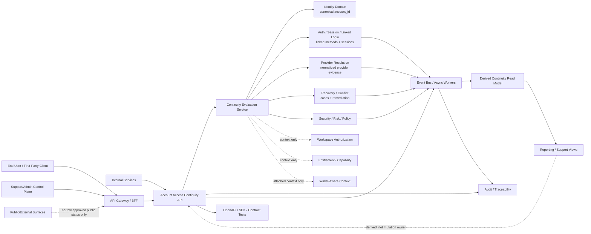
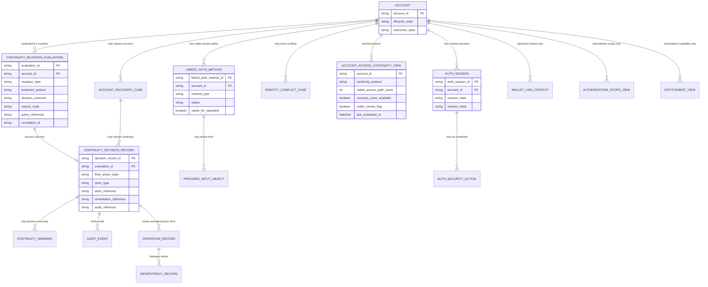

# ACCOUNT_ACCESS_CONTINUITY_API_SPEC

## Document Metadata

- Document Name: `ACCOUNT_ACCESS_CONTINUITY_API_SPEC.md`
- Document Type: FUZE API SPEC v2 / Production-grade API interface-contract specification
- Status: Draft for production-grade API specification library
- Version: 1.0.0
- Effective Date: 2026-04-24
- Last Updated: 2026-04-24
- Reviewed On: 2026-04-24
- Document Owner: FUZE Platform Identity / Access Architecture
- Approval Authority: FUZE Platform Architecture and Governance Authority
- Review Cadence: Quarterly or upon material change to account identity, linked authentication methods, provider resolution, recovery posture, session-security posture, continuity-sensitive admin controls, or API compatibility rules
- Governing Layer: API contract layer derived from refined system semantics
- Parent Registry: `API_SPEC_INDEX.md`
- Upstream Semantic Registry: `REFINED_SYSTEM_SPEC_INDEX.md`
- Upstream API Registry: `API_SPEC_INDEX.md`
- Primary Audience: API architecture, backend engineering, frontend engineering, platform identity engineering, auth/session engineering, security engineering, recovery/support operations, audit, reliability engineering, SDK/OpenAPI authors, QA, and implementation-contract authors
- Primary Purpose: Define the FUZE API contract for account access continuity: continuity posture reads, continuity-sensitive mutation evaluation, continuity-aware auth/link/session/recovery flows, support/admin remediation surfaces, event implications, error/status semantics, idempotency, audit lineage, and downstream contract guardrails.
- Primary Upstream References:
  - `REFINED_SYSTEM_SPEC_INDEX.md`
  - `DOCS_SPEC_INDEX.md`
  - `SYSTEM_SPEC_INDEX.md`
  - `API_SPEC_INDEX.md`
  - `FUZE_ACCOUNT_ACCESS_CONTINUITY_SPEC.md`
  - `FUZE_ACCOUNT_ACCESS_AND_SESSION_THESIS_FINAL_SPEC.md`
  - `FUZE_ACCOUNT_ACCESS_AND_SESSION_CANONICAL_FINAL_SPEC.md`
  - `IDENTITY_AND_ACCOUNT_SPEC.md`
  - `AUTH_SESSION_AND_LINKED_LOGIN_SPEC.md`
  - `FUZE_PROVIDER_RESOLUTION_AND_LINKING_SPEC.md`
  - `FUZE_SESSION_LIFECYCLE_AND_SECURITY_SPEC.md`
  - `FUZE_ACCOUNT_RECOVERY_AND_CONFLICT_HANDLING_SPEC.md`
  - `WALLET_AWARE_USER_SPEC.md`
  - `WORKSPACE_AND_ORGANIZATION_SPEC.md`
  - `ROLE_PERMISSION_AND_ACCESS_CONTROL_SPEC.md`
  - `SCOPED_AUTHORIZATION_MODEL_SPEC.md`
  - `ENTITLEMENT_AND_CAPABILITY_GATING_SPEC.md`
  - `AUDIT_AND_ACCESS_TRACEABILITY_SPEC.md`
  - `SECURITY_AND_RISK_CONTROL_SPEC.md`
  - `SESSION_AND_LINKED_LOGIN_API_SPEC.md`
  - `AUTH_IDENTITY_API_SPEC.md`
- Primary Downstream Dependents:
  - `PROVIDER_RESOLUTION_AND_LINKING_API_SPEC.md`
  - `SESSION_LIFECYCLE_AND_SECURITY_API_SPEC.md`
  - `ACCOUNT_RECOVERY_AND_CONFLICT_HANDLING_API_SPEC.md`
  - `KEY_MANAGEMENT_AND_USER_RECOVERY_API_SPEC.md`
  - `IDENTITY_AND_ACCOUNT_API_SPEC.md`
  - `AUTH_SESSION_AND_LINKED_LOGIN_API_SPEC.md`
  - `AUDIT_AND_ACCESS_TRACEABILITY_API_SPEC.md`
  - `SECURITY_AND_RISK_CONTROL_API_SPEC.md`
  - first-party account settings clients
  - support/admin control-plane implementation contracts
  - OpenAPI / AsyncAPI / SDK contract generation
  - audit, observability, and incident-response pipelines
- API Surface Families Covered:
  - First-party application APIs for continuity posture, warning, and continuity-sensitive account-management flows
  - Internal service APIs for continuity evaluation and decision recording
  - Admin/control-plane APIs for bounded, reason-coded, audited continuity remediation
  - Event/async APIs for continuity posture changes, blocks, warnings, recovery routing, and session containment side effects
  - Reporting/read-model APIs for safe derived continuity summaries
- API Surface Families Excluded:
  - Public unauthenticated API surfaces except narrow public-support status where separately approved
  - Raw provider SDK/callback mechanics outside continuity decision expression
  - Workspace permission evaluation APIs
  - Entitlement/capability truth APIs
  - Wallet-auth or chain-auth APIs unless explicitly approved by wallet-aware and identity specs
  - Database schema specifications, runbooks, and machine-readable OpenAPI/AsyncAPI files
- Canonical System Owner(s): Identity Domain in coordination with Auth / Session / Linked Login, Recovery / Conflict Handling, Security / Risk, Audit, Workspace/Authz, Entitlement, and Wallet-Aware domains
- Canonical API Owner: FUZE Platform API Architecture / Identity Access API Surface
- Supersedes: Any weaker API interpretation that treats access continuity as a product-local UX concern, session-derived state, provider-derived state, or support-tool-only state
- Superseded By: Not yet known
- Related Decision Records: Not yet known
- Canonical Status Note: This API spec expresses the interface contract for the refined continuity model. Refined system specs own semantic truth. This API spec owns contract expression and MUST NOT redefine continuity semantics.
- Implementation Status: Normative API design baseline; endpoint-level OpenAPI, AsyncAPI, SDKs, storage schemas, service internals, and runbooks must conform.
- Approval Status: Draft for architecture review
- Change Summary:
  - Introduces a dedicated API SPEC v2 continuity contract derived from `FUZE_ACCOUNT_ACCESS_CONTINUITY_SPEC.md`.
  - Defines allowed route/resource families for continuity posture, mutation evaluation, decision records, warnings, recovery/remediation references, admin remediation, and events.
  - Separates canonical identity, auth-link, session, recovery/conflict, policy, provider-input, wallet, authorization/entitlement, derived view, reporting, and audit truth classes.
  - Requires idempotency, correlation, reason codes, policy references, explicit decision outcomes, audit lineage, event emission, and conservative defaults for all continuity-sensitive side-effecting APIs.

---

## Purpose

This specification defines the FUZE API contract for account access continuity.

Account access continuity means that the same canonical FUZE account remains reachable over time through at least one viable approved ordinary access path or one approved recovery/remediation path. The API layer does not own that semantic truth. The refined continuity specification owns the meaning. This API specification defines how that truth is exposed, evaluated, mutated, audited, projected, and consumed across FUZE API surfaces without allowing products, clients, support tools, sessions, provider callbacks, reports, or derived views to reinterpret continuity.

The API contract exists because continuity affects identity safety, account recovery, provider linking, session containment, product entry, workspace continuity, wallet-aware participation, billing context, audit reconstruction, and support remediation. A weak API contract would allow teams to implement unsafe shortcuts such as deleting the last viable access path, overtrusting a session, silently creating duplicate accounts, moving provider links without remediation, or treating a support dashboard as canonical truth.

This document therefore defines route-family posture, request and response expectations, error/status classes, idempotency and replay requirements, authorization and entitlement separation, audit/observability requirements, event and async behavior, migration rules, diagrams, acceptance criteria, and test cases for production implementation.

## Scope

This API spec governs:

- Continuity posture retrieval for authenticated first-party users and authorized support/admin operators.
- Continuity-sensitive mutation evaluation before linked-method removal, disablement, replacement, password replacement, recovery completion, provider correction, or operator remediation commits.
- API expression of decision outcomes: `allow`, `allow_with_warning`, `block`, `review_required`, `reroute_to_recovery`, and `reroute_to_remediation`.
- Continuity warnings and reason-code responses.
- Continuity decision records and operation references.
- Continuity-aware integration with linked-auth, provider-resolution, session-containment, recovery/conflict, security/risk, and audit APIs.
- Admin/control-plane continuity correction and remediation APIs when explicitly approved.
- Event and webhook implications for internal systems and, where separately approved, external/first-party notifications.
- Derived read-model, support-view, reporting, export, and dashboard constraints.
- OpenAPI, AsyncAPI, SDK, implementation-contract, test, and migration guardrails.

## Out of Scope

This API spec does not govern:

- Canonical account identity semantics in full. Those belong to `IDENTITY_AND_ACCOUNT_SPEC.md` and the account/session canonical specifications.
- Provider-resolution heuristics in full. Those belong to `FUZE_PROVIDER_RESOLUTION_AND_LINKING_SPEC.md` and its API spec.
- Session lifecycle in full. That belongs to `FUZE_SESSION_LIFECYCLE_AND_SECURITY_SPEC.md` and its API spec.
- Recovery evidence collection and conflict playbooks in full. Those belong to recovery/conflict and key-management/user-recovery specs.
- Workspace membership, role, permission, entitlement, product capability, or billing truth.
- Exact provider SDK integration, OAuth/OIDC callback wiring, browser/mobile token transport, cryptographic secret storage, or database schema.
- Public disclosure policy for continuity internals.
- UI copy for warnings, review states, or support remediation.

Out-of-scope does not mean irrelevant. Adjacent APIs MUST remain compatible with this API spec when continuity-sensitive behavior is involved.

## Design Goals

1. Preserve the refined continuity semantics at the API boundary.
2. Make continuity posture explicit, testable, and auditable.
3. Prevent last-path removal, unsafe provider replacement, silent reassignment, silent merge, silent duplicate creation, and product-local continuity logic.
4. Ensure sessions are never treated as durable continuity proof.
5. Ensure provider inputs are normalized evidence, not continuity truth.
6. Support safe UX and first-party client flows without exposing unsafe internals.
7. Support bounded support/admin remediation without creating hidden write shortcuts.
8. Make side-effecting continuity decisions idempotent, retry-safe, correlated, reason-coded, and observable.
9. Make derived continuity views useful without making them write owners.
10. Support downstream OpenAPI, AsyncAPI, SDK, QA, monitoring, migration, and implementation-contract derivation.

## Non-Goals

This API spec is not intended to:

- Guarantee automated recovery in all cases.
- Require every account to have multiple ordinary access paths.
- Replace endpoint-level OpenAPI definitions.
- Replace service-internal storage schemas.
- Replace support runbooks or incident-response playbooks.
- Let public API convenience expand continuity-sensitive exposure.
- Let first-party client UX bypass owner-domain mutation boundaries.
- Define wallet possession as universal continuity proof.
- Treat account continuity as equivalent to workspace authorization or entitlements.

## Core Principles

### 1. Continuity Is Account-Anchored

All continuity API resources MUST anchor to the canonical `account_id`. Provider subject, email, wallet address, product profile, device, and session identifiers are inputs or adjacent references, not continuity roots.

### 2. API Contract Truth Is Not Semantic Truth

This API spec defines how continuity is expressed through APIs. It MUST NOT override refined system specs. When a route-level implementation conflicts with refined continuity semantics, the route-level implementation is wrong.

### 3. Evaluate Before Commit

Any continuity-sensitive mutation MUST evaluate post-mutation continuity before the owner-domain mutation commits.

### 4. Block or Review Before Stranding

Ordinary self-service APIs MUST NOT allow the last viable ordinary access path to be removed, disabled, or superseded unless an approved replacement, recovery, or remediation path is already established by policy.

### 5. Runtime Session Is Insufficient

A valid session MAY authenticate the actor for an API request, but it MUST NOT prove durable future reachability for continuity-sensitive decisions.

### 6. Provider Inputs Are Evidence

Provider callbacks, claims, emails, profile hints, issuer-subject pairs, and provider metadata are provider-input truth until normalized and accepted by owner domains.

### 7. Products Consume, They Do Not Own

Product APIs may display continuity state and initiate approved flows. They MUST NOT create product-local continuity logic, local fallback identity, or local bypass routes.

### 8. Admin Power Is Bounded

Operator remediation APIs MUST be separated from ordinary application APIs, require stronger authorization, capture reason codes and policy references, emit audit, and preserve explicit decision records.

### 9. Derived Views Are Regenerable

Continuity summaries, dashboards, support views, and reports MUST be derived from canonical identity, auth-link, session, recovery, policy, and audit truths. They MUST NOT become mutation owners.

### 10. Fail Closed for High-Impact Ambiguity

If continuity cannot be safely evaluated because required canonical truth, policy, or dependency evidence is missing or degraded, high-impact mutations MUST fail closed, return explicit status, or route to review/remediation.

## Canonical Definitions

### Account Access Continuity

The property that the same canonical account remains reachable over time through at least one viable approved ordinary access path or one approved recovery/remediation path.

### Viable Access Path

An approved authentication method linked to the canonical account that is active or otherwise allowed for ordinary use, not removed, not unresolved-conflict, and not blocked by account state or policy for the relevant operation.

### Continuity Posture

A platform-evaluated summary of the account’s present continuity resilience and whether ordinary or recovery-driven access remains safely possible.

Canonical posture distinctions:

- `resilient`
- `acceptable`
- `fragile`
- `recovery_only`
- `under_review`
- `blocked`

Exact downstream labels may evolve only if they preserve these distinctions.

### Continuity-Sensitive Mutation

A mutation that can materially weaken future reachability to the same canonical account. Examples include linked-method removal, provider replacement, password replacement/removal, recovery-significant attribute change, recovery completion, global session invalidation triggered by trust reset, or operator correction affecting access paths.

### Continuity Evaluation

A pre-commit API or internal service decision that determines whether a requested mutation is allowed, allowed with warning, blocked, requires review, or must reroute to recovery/remediation.

### Continuity Decision Record

A durable record showing why a continuity-sensitive mutation was allowed, blocked, warned, rerouted, or escalated.

### Continuity Warning

A user-facing or operator-facing signal that an action reduces resilience, requires stronger verification, or may route to review/remediation.

### Stranded Account

A canonical account that lacks any presently viable ordinary access path and lacks any presently usable approved recovery/remediation route.

### Recovery-Only Posture

A posture in which ordinary access is unavailable or insufficient, but an approved recovery/remediation route remains available.

## Truth Class Taxonomy

### Semantic Truth

Owned by refined system specs. The semantic meaning of account, access path, session, recovery, conflict, provider input, authorization, entitlement, wallet-aware context, and derived views is upstream of this API spec.

### API Contract Truth

Owned by this document and downstream OpenAPI/AsyncAPI contracts. It defines route families, resource expressions, request/response fields, status classes, idempotency behavior, and error/result semantics.

### Canonical Identity Truth

`account_id`, account lifecycle, account restriction, identity anti-fragmentation, and identity conflict meaning are canonical identity truth. Continuity attaches to the account but does not redefine identity.

### Auth-Link Truth

`linked_auth_method` and equivalent approved access-path bindings are canonical auth-link truth. They are inputs to continuity and are mutated by auth/session/linked-login owner APIs.

### Runtime Session Truth

`auth_session`, refresh lineage, revocation, invalidation, and containment state are runtime truth. Sessions can authenticate requests and may trigger continuity-affecting side effects, but they do not replace durable continuity.

### Recovery / Conflict Truth

Recovery cases, conflict cases, remediation posture, evidence evaluation, review state, and restoration decisions are canonical recovery/conflict truth for continuity exceptions.

### Policy Truth

Continuity thresholds, allowed recovery routes, last-path rules, recent-auth requirements, operator-control rules, rate limits, risk thresholds, and security policies are policy truth.

### Provider-Input Truth

Provider claims and callbacks are evidence. They do not become continuity truth until normalized and accepted by owner-domain logic.

### Public Read-Model Truth

Approved external surfaces may expose narrow, stable, non-sensitive status. Public read models MUST NOT expose internal continuity-sensitive detail.

### Derived / Projection Truth

Continuity views, support summaries, dashboards, UX summaries, analytics, exports, and caches are derived. They MUST be regenerable and MUST NOT mutate continuity.

### Audit / Traceability Truth

Audit events, decision records, operation records, idempotency records, trace IDs, and correlation IDs preserve lineage and reconstruction.

### Presentation Truth

Labels, messages, warning copy, icons, and UX grouping are presentation truth. They MAY simplify but MUST NOT contradict canonical posture or decision results.

## Architectural Position in the Spec Hierarchy

This document sits below:

- `REFINED_SYSTEM_SPEC_INDEX.md`
- `FUZE_ACCOUNT_ACCESS_AND_SESSION_THESIS_FINAL_SPEC.md`
- `FUZE_ACCOUNT_ACCESS_AND_SESSION_CANONICAL_FINAL_SPEC.md`
- `IDENTITY_AND_ACCOUNT_SPEC.md`
- `AUTH_SESSION_AND_LINKED_LOGIN_SPEC.md`
- `FUZE_ACCOUNT_ACCESS_CONTINUITY_SPEC.md`
- `FUZE_PROVIDER_RESOLUTION_AND_LINKING_SPEC.md`
- `FUZE_SESSION_LIFECYCLE_AND_SECURITY_SPEC.md`
- `FUZE_ACCOUNT_RECOVERY_AND_CONFLICT_HANDLING_SPEC.md`

This document sits beside or above the downstream contract layers for:

- identity/account APIs
- auth/session/linked-login APIs
- provider-resolution APIs
- recovery/conflict APIs
- security/risk APIs
- audit/traceability APIs
- SDK and implementation-contract derivation

It does not define the database schema or service topology, but downstream implementations MUST preserve the API rules here.

## Upstream Semantic Owners

| Semantic Area | Upstream Owner | API Contract Rule |
| --- | --- | --- |
| Canonical account identity | Identity and Account Domain | APIs MUST anchor continuity to `account_id`. |
| Access-path viability | Auth / Session / Linked Login Domain | APIs MUST evaluate linked methods through owner-domain truth. |
| Provider mapping | Provider Resolution and Linking Domain | Provider evidence MUST normalize before influencing continuity. |
| Session lifecycle | Session Lifecycle and Security Domain | Session presence MUST NOT satisfy durable continuity. |
| Recovery/remediation | Recovery / Conflict Handling Domain | Recovery restores same account; review references must be explicit. |
| Policy/risk | Security / Risk and Policy Domains | High-risk ambiguity MUST deny, block, or review. |
| Audit/traceability | Audit Domain | Material decisions MUST emit audit and correlation lineage. |
| Workspace/authz | Workspace/Authz Domains | Continuity does not grant workspace power. |
| Entitlements | Entitlement/Capability Domains | Continuity does not mint or transfer entitlements. |
| Wallet-aware context | Wallet-Aware Domain | Wallet links are attached context unless explicitly approved as access paths. |

## API Surface Families

### Public API

Public unauthenticated APIs SHOULD NOT expose account continuity posture. Any public-read companion MUST be explicitly approved, narrow, non-sensitive, and incapable of revealing access-path inventory, risk flags, recovery posture, provider hints, or internal reason codes.

### First-Party Application API

First-party app APIs MAY expose safe continuity posture, warnings, and approved account-management flows to the authenticated account actor. They MUST hide sensitive internals and MUST route side-effecting mutations through owner-domain endpoints.

### Internal Service API

Internal service APIs MAY perform continuity evaluation, decision persistence, posture recalculation, event emission, and derived-view generation. They MUST enforce owner-domain boundaries and must not become broad-write shortcuts.

### Admin / Control-Plane API

Admin/control-plane APIs MAY support continuity review, remediation, exception handling, and operator correction. They MUST be separated from ordinary application APIs, require stronger authorization, capture reason codes and policy references, and emit durable audit.

### Event / Async API

Continuity events MAY be emitted after canonical commits and decision persistence. Events communicate outcomes and trigger projections, session containment, recovery workflows, support queues, notifications, and monitoring.

### Webhook API

External webhooks are not default for continuity internals. Webhooks MAY expose narrow, approved user-facing or enterprise-facing status only after privacy/security approval and MUST avoid sensitive access-path detail.

### Reporting API

Reporting APIs MAY summarize continuity outcomes, counts, and posture distributions for authorized internal review. They MUST remain derived and correctable from canonical truth.

### Chain-Adjacent API

Continuity APIs are not chain-owned. Chain or wallet-adjacent records MAY be continuity-relevant context, but wallet possession or chain observation MUST NOT become universal continuity proof unless a higher-order approved identity/auth specification states otherwise.

## System / API Boundaries

This API spec governs contract expression for continuity. It does not transfer semantic ownership.

The API layer MUST preserve:

- identity owner mutation boundaries
- auth-link owner mutation boundaries
- provider-resolution owner boundaries
- session owner boundaries
- recovery/conflict owner boundaries
- authorization and entitlement separation
- audit and traceability requirements
- derived-view non-ownership
- public exposure minimization

The API layer MUST NOT:

- create a continuity route that directly rewrites `account`, `linked_auth_method`, `auth_session`, `account_recovery_case`, or provider-link truth outside the relevant owner domain
- let reports, support views, or caches override live continuity checks
- treat successful request authentication as sufficient continuity proof
- expose last-path, recovery, or provider-risk detail to callers that do not need it
- convert review-required states into apparent synchronous success

## Adjacent API Boundaries

### Identity and Account APIs

Identity APIs may expose account-level identity and account posture. They consume continuity posture for safety and display, but do not allow continuity rules to redefine identity truth.

### Auth Session and Linked Login APIs

Auth/session/linked-login APIs execute linked-method add, remove, disable, restore, and replace flows. This continuity API defines the pre-commit evaluation and response posture those flows must respect.

### Provider Resolution and Linking APIs

Provider APIs normalize provider evidence and detect provider conflicts. Continuity APIs consume normalized provider outcomes and constrain safe link/unlink/replace behavior.

### Session Lifecycle and Security APIs

Session APIs issue, refresh, revoke, invalidate, and inspect sessions. Continuity APIs define when session presence is insufficient and when trust resets or recovery/remediation should trigger containment.

### Recovery and Conflict APIs

Recovery/conflict APIs own case lifecycle and restoration/remediation. Continuity APIs expose recovery/remediation references and ensure completed recovery preserves the same account.

### Workspace / Authorization APIs

Authorization APIs evaluate scope, roles, permissions, and effective access after authentication. Continuity APIs must not imply workspace authority.

### Entitlement and Capability APIs

Entitlement APIs own product capabilities and paid/credit-gated access. Continuity APIs must not mint, transfer, or reinterpret entitlements.

### Audit APIs

Audit APIs store and expose authorized decision lineage. Continuity APIs must provide audit references, correlation IDs, and reason-coded events.

## Conflict Resolution Rules

When continuity-relevant API layers disagree, implementations MUST resolve in this order unless a higher-order approved policy explicitly overrides:

1. Canonical identity-domain records and restriction state.
2. Canonical recovery/conflict state and approved remediation outcomes.
3. Canonical linked-auth records and auth-session state.
4. Explicit policy and security/risk constraints.
5. Validated provider-input evidence interpreted by approved provider-resolution rules.
6. Runtime client state.
7. Derived views, support dashboards, analytics, reports, exports, and product-local caches.

Specific rules:

- Provider email overlap MUST NOT justify silent merge, silent link, or silent reassignment.
- Stale session presence MUST NOT bypass continuity blocks.
- Wallet presence MUST NOT prove continuity unless a separate approved wallet-auth continuity policy applies.
- Product-local user records MUST NOT override platform continuity.
- Support dashboard values MUST NOT override canonical records.
- Derived read models MUST NOT override real-time continuity evaluation.
- Ambiguity MUST route to review, remediation, denial, or block rather than silent continuation.

## Default Decision Rules

1. Default continuity anchor: `account_id`.
2. Default continuity owner: Identity Domain in coordination with continuity rules.
3. Default access-path viability owner: Auth / Session / Linked Login Domain.
4. Default provider interpretation: evidence for mapping, not continuity root.
5. Default session interpretation: temporary runtime access, not durable continuity.
6. Default wallet interpretation: attached context, not universal fallback.
7. Default last viable path behavior: block ordinary self-service removal.
8. Default duplicate-account or provider-collision behavior: review/remediation.
9. Default operator override behavior: require stronger authorization, reason code, policy reference, audit lineage, and bounded workflow.
10. Default degraded dependency behavior for high-impact mutation: fail closed or route to review.
11. Default derived-view mismatch behavior: canonical owner-domain truth wins.
12. Default public exposure behavior: expose less, not more.

## Roles / Actors / API Consumers

### End User

An authenticated actor managing their own account access paths or reading safe continuity posture.

### Authenticated Account Actor Performing Sensitive Mutation

An actor who has a valid session and may be required to perform recent-auth, step-up, or additional verification before continuity-sensitive changes.

### First-Party Client

FUZE-owned web, mobile, or product clients that display posture and initiate approved flows.

### Identity Service

Owner-domain service for canonical account identity and identity-level continuity meaning.

### Auth / Session / Linked Login Service

Owner-domain service for linked-method lifecycle, auth challenges, session issuance, session containment, and auth-side continuity checks.

### Provider Resolution Service

Owner-domain service for provider normalization, provider subject mapping, link intent, and provider conflict detection.

### Recovery / Conflict Service

Owner-domain service for recovery, conflict, review, remediation, and restoration flows.

### Security / Risk Service

Service or function that supplies risk posture, policy denial, step-up, containment, and elevated review requirements.

### Support / Admin Operator

Privileged actor using separated control-plane APIs under policy, reason-code, and audit constraints.

### Audit / Observability Systems

Systems that receive operation records, audit events, traces, metrics, and logs.

### Reporting / Analytics Consumer

Authorized internal consumer of derived continuity reports, never a mutation owner.

## Resource / Entity Families

API-facing resource families MAY include:

- `AccountContinuityPosture`
- `ContinuityAccessPathSummary`
- `ContinuityMutationEvaluation`
- `ContinuityDecisionRecord`
- `ContinuityWarning`
- `ContinuityOperation`
- `ContinuityRecoveryReference`
- `ContinuityRemediationReference`
- `ContinuityPolicyReference`
- `ContinuityAuditReference`
- `ContinuityEvent`
- `ContinuityProjection`

Canonical supporting entities remain owner-domain entities:

- `account`
- `linked_auth_method`
- `auth_session`
- `auth_challenge`
- `provider_link`
- `provider_resolution`
- `account_recovery_case`
- `identity_conflict_case`
- `auth_security_action`
- `audit_event`
- `idempotency_record`
- `operation_record`

## Ownership Model

### Continuity API Owns

- API expression of continuity posture reads.
- API expression of pre-commit continuity evaluation.
- API expression of continuity decision outcomes, warnings, and references.
- API requirements for idempotency, correlation, reason codes, and audit references.
- Route-family posture for first-party, internal, admin/control, event, and reporting surfaces.

### Continuity API Does Not Own

- Canonical identity mutation.
- Linked-auth mutation execution.
- Provider-subject mapping.
- Session issuance, refresh, revocation, or invalidation.
- Recovery evidence validation.
- Workspace permission evaluation.
- Entitlement or product capability truth.
- Wallet-link verification.
- Audit storage engine.
- Database schema.

## Authority / Decision Model

Continuity-sensitive API flows MUST apply the following decision model:

1. Authenticate caller through approved session or service credentials.
2. Resolve canonical actor and target account.
3. Authorize caller for the requested surface and action.
4. Apply recent-auth/step-up requirements if sensitive.
5. Load canonical identity, linked-auth, session, recovery/conflict, policy, provider, and risk inputs from owner domains.
6. Compute pre-mutation and predicted post-mutation continuity posture.
7. Resolve outcome into `allow`, `allow_with_warning`, `block`, `review_required`, `reroute_to_recovery`, or `reroute_to_remediation`.
8. Persist decision record when required.
9. If side-effecting, execute only through owner-domain mutation boundary.
10. Emit audit, operation, trace, metric, and event lineage after canonical commit.
11. Recalculate and project posture after mutation.
12. Return a response that distinguishes accepted intent, final success, block, review, and remediation.

No client, support tool, provider callback, or product-local service may skip this model for continuity-sensitive behavior.

## Authentication Model

Continuity APIs require one of:

- an authenticated user session for self-service reads and allowed self-service flows
- service-to-service credentials for internal evaluation and projection
- privileged admin/control-plane credentials for remediation and operator actions
- short-lived recovery/review tokens only where recovery/conflict owner APIs explicitly authorize them

Authentication MUST NOT be equated with authorization, entitlement, or continuity. A valid session authenticates the caller; it does not prove the requested mutation preserves future access.

## Authorization / Scope / Permission Model

Continuity APIs MUST distinguish:

- actor authentication
- account ownership or delegated account-management ability
- workspace scope, where a workspace context is relevant to support or product UX
- permission to read safe posture
- permission to initiate continuity-sensitive self-service flows
- permission to execute admin/control-plane remediation
- permission to view sensitive reason codes or internal decision details
- permission to export or report continuity data

Self-service callers MAY receive safe, user-facing reason categories. Admin/control-plane callers MAY receive deeper reason codes only when authorized.

Continuity APIs MUST NOT grant workspace membership, product capability, or entitlement.

## Entitlement / Capability-Gating Model

Continuity is not entitlement. The API MAY include safe entitlement-adjacent impact summaries for UX or support, but MUST NOT become entitlement truth. Losing a product capability, subscription, or workspace role MUST NOT imply account continuity loss. Preserving account continuity MUST NOT preserve downstream powers unless the relevant owner domain grants them.

## API State Model

### Continuity Posture States

- `resilient`
- `acceptable`
- `fragile`
- `recovery_only`
- `under_review`
- `blocked`

### Evaluation Outcomes

- `allow`
- `allow_with_warning`
- `block`
- `review_required`
- `reroute_to_recovery`
- `reroute_to_remediation`

### Operation States

- `accepted`
- `in_progress`
- `succeeded`
- `blocked`
- `warning_issued`
- `review_required`
- `rerouted_to_recovery`
- `rerouted_to_remediation`
- `failed_validation`
- `failed_authorization`
- `failed_policy`
- `failed_dependency`
- `expired`
- `cancelled`

### Decision Record States

- `recorded`
- `superseded`
- `reversed_by_remediation`
- `invalidated_by_policy`
- `archived`

## Lifecycle / Workflow Model

### Ordinary Posture Read

1. Caller authenticates.
2. API authorizes the caller for safe posture visibility.
3. API loads or computes the current derived posture from canonical owner-domain truth.
4. API returns safe posture, warnings, and references.
5. Sensitive contributing details are redacted unless authorized.

### Pre-Mutation Evaluation

1. Caller requests evaluation for an intended mutation.
2. API validates request shape and target account.
3. API verifies caller authorization and recent-auth requirements.
4. API obtains canonical inputs.
5. API computes predicted post-mutation continuity.
6. API returns decision outcome, reason category, policy reference, operation/evaluation reference, warning, recovery/remediation routing, and audit/correlation identifiers.
7. If the evaluation is tied to a later mutation, the evaluation has a bounded validity window and must be rechecked before commit.

### Controlled Mutation Execution

1. Client submits mutation through owner API with evaluation reference and idempotency key.
2. Owner API revalidates or refreshes evaluation.
3. If still allowed, owner API commits mutation.
4. Post-commit continuity recalculation occurs.
5. Events and audit lineage are emitted.
6. Response distinguishes final success from accepted async operation.

### Recovery / Remediation Exception

1. Evaluation returns `reroute_to_recovery`, `reroute_to_remediation`, or `review_required`.
2. API returns recovery/remediation/case references rather than pretending success.
3. Recovery/conflict owner APIs govern evidence and case lifecycle.
4. Completion restores access to the same canonical account or records denial.
5. Continuity posture is recalculated.
6. Session containment occurs where trust posture requires.

### Admin / Operator Remediation

1. Operator authenticates through privileged session.
2. API verifies admin scope, policy authority, reason code, and approval where required.
3. API loads canonical continuity, linked-auth, provider, recovery, session, and risk truth.
4. API produces a remediation operation with idempotency, audit, and trace references.
5. Owner-domain mutation executes if authorized.
6. Session containment, recovery-case updates, and posture projection occur.
7. Full audit lineage is emitted.

## Architecture Diagram — Mermaid flowchart



## Data Design — Mermaid Diagram



The diagram intentionally distinguishes canonical owner-domain data from derived views, operation/idempotency records, provider-input objects, wallet context, authorization views, entitlement views, and reports. Derived views MUST NOT become mutation owners.

## Flow View

### Flow A — Read Safe Continuity Posture

1. First-party client calls `GET /v2/accounts/{account_id}/access-continuity`.
2. API authenticates the caller.
3. API authorizes self-read or delegated support read.
4. API obtains current derived posture or triggers a bounded recomputation.
5. API redacts sensitive access-path and risk details for ordinary callers.
6. API returns posture, safe warnings, viable path count bucket, recovery availability indicator, `last_evaluated_at`, and correlation ID.
7. API emits read metrics. It does not mutate canonical state.

### Flow B — Evaluate Linked-Method Removal

1. Caller submits intended removal to continuity evaluation.
2. API verifies actor, recent-auth, target account, and mutation type.
3. API fetches canonical linked methods, account state, session state, recovery posture, provider state, and policy.
4. API computes whether at least one viable ordinary access path remains after removal.
5. If yes, response is `allow` or `allow_with_warning`.
6. If no, response is `block` unless an approved recovery/remediation route applies.
7. API returns evaluation reference and validity window.
8. Owner linked-login API must revalidate before committing removal.

### Flow C — Provider Replacement

1. Provider API normalizes replacement provider evidence.
2. Continuity API evaluates whether the replacement is fully viable before the old access path is removed.
3. If provider collision or ambiguity exists, API returns `review_required`.
4. If allowed, provider/link owner commits replacement under idempotency.
5. Continuity posture recalculates and emits `identity.continuity_posture_changed` if materially changed.
6. Session containment occurs if trust posture requires.

### Flow D — Recovery Completion

1. Recovery/conflict API marks recovery evidence ready for decision.
2. Continuity API evaluates whether completion restores reachability to the same `account_id`.
3. API prohibits shortcut account creation or hidden reassignment.
4. On success, recovery owner commits restoration.
5. Session API invalidates old sessions when trust reset requires.
6. Continuity posture moves out of `recovery_only` or `under_review` where appropriate.
7. Audit and event lineage is emitted.

### Flow E — Admin Remediation

1. Operator uses separated admin route.
2. API requires privileged session, admin scope, reason code, policy reference, and case reference.
3. API evaluates pre/post continuity and risk.
4. If authorized, owner-domain mutation executes.
5. API returns operation reference, decision record, and audit reference.
6. Events drive projection and monitoring.
7. Any unsupported operator shortcut is denied and recorded.

### Flow F — Dependency-Degraded Evaluation

1. Required canonical owner-domain dependency is unavailable.
2. API determines mutation impact class.
3. Low-impact read MAY return stale-derived posture with explicit `staleness` metadata.
4. High-impact mutation evaluation MUST fail closed, return `dependency_degraded`, or route to review.
5. API MUST NOT synthesize continuity truth from stale reports or product-local caches.

## Data Flows — Mermaid sequenceDiagram

```mermaid
sequenceDiagram
  participant Client as First-Party Client
  participant API as Continuity API
  participant AuthN as AuthN/Session
  participant AuthZ as Authorization/Policy
  participant Eval as Continuity Evaluation
  participant Id as Identity Domain
  participant Link as Linked Auth Domain
  participant Prov as Provider Resolution
  participant Rec as Recovery/Conflict
  participant Risk as Security/Risk
  participant Mut as Owner Mutation API
  participant Audit as Audit/Trace
  participant Bus as Event Bus
  participant Proj as Read Model

  Client->>API: Evaluate continuity-sensitive mutation
  API->>AuthN: Validate caller session
  AuthN-->>API: account_id + session posture
  API->>AuthZ: Check scope, recent-auth, policy
  AuthZ-->>API: authorized or denied
  API->>Eval: Create evaluation with idempotency key
  Eval->>Id: Load canonical account state
  Eval->>Link: Load linked methods and viability
  Eval->>Prov: Load normalized provider constraints
  Eval->>Rec: Load recovery/conflict posture
  Eval->>Risk: Load risk and policy constraints
  Eval-->>API: decision outcome + reason + references

  alt Allowed final mutation
    Client->>Mut: Commit owner-domain mutation with evaluation_ref
    Mut->>Eval: Revalidate evaluation before commit
    Eval-->>Mut: still allowed
    Mut->>Audit: Record decision and mutation lineage
    Mut->>Bus: Emit post-commit continuity event
    Bus->>Proj: Recalculate derived posture
    Mut-->>Client: final success + audit_ref
  else Warning or accepted async
    API->>Audit: Record warning or accepted operation
    API->>Bus: Emit warning or operation event
    API-->>Client: accepted or allow_with_warning + operation_ref
  else Blocked or review required
    API->>Audit: Record block/review decision
    API-->>Client: block/review/recovery route + case_ref
  else Dependency degraded
    API->>Audit: Record degraded decision
    API-->>Client: fail closed or review_required
  end
```

## Request Model

Continuity API request contracts MUST include the following where applicable:

### Common Headers

- `Authorization`: required except explicitly approved public status surfaces.
- `X-FUZE-Correlation-ID`: required or generated by the API gateway.
- `X-FUZE-Request-ID`: required or generated.
- `Idempotency-Key`: required for side-effecting or accepted async operations.
- `X-FUZE-Actor-Type`: service/admin contexts only.
- `X-FUZE-Policy-Version`: optional caller hint; server policy remains authoritative.
- `X-FUZE-Client-Version`: SHOULD be provided by first-party clients for compatibility analysis.

### Common Target Fields

- `account_id`
- `mutation_type`
- `target_resource_type`
- `target_resource_id`
- `requested_effect`
- `evaluation_context`
- `reason_code` for admin/control-plane paths
- `policy_reference` for admin/control-plane paths
- `case_reference` for recovery/remediation paths
- `expected_state_version` where optimistic concurrency is required

### Evaluation Request Example Shape

```json
{
  "account_id": "acct_...",
  "mutation_type": "linked_method.remove",
  "target_resource_type": "linked_auth_method",
  "target_resource_id": "lam_...",
  "requested_effect": "remove",
  "client_context": {
    "surface": "first_party_account_settings",
    "product_context": "fuze_app"
  }
}
```

### Admin Remediation Request Example Shape

```json
{
  "account_id": "acct_...",
  "case_reference": "case_...",
  "mutation_type": "provider_link.correct",
  "requested_effect": "restore_access_path",
  "reason_code": "operator_remediation_verified",
  "policy_reference": "policy:continuity-remediation:v1",
  "operator_note_reference": "note_...",
  "expected_state_version": "v..."
}
```

## Response Model

Continuity API responses MUST distinguish safe user-facing summaries from internal detail.

### Common Response Fields

- `account_id`
- `continuity_posture`
- `decision_outcome`
- `reason_code` or safe reason category
- `policy_reference` when applicable
- `evaluation_id`
- `decision_record_id` when persisted
- `operation_ref` for accepted async flows
- `recovery_ref` or `remediation_ref` when rerouted
- `warning_ref` when a warning is issued
- `audit_ref` where visible to caller class
- `correlation_id`
- `trace_id`
- `expires_at` for evaluations with limited validity
- `staleness` for derived reads

### Decision Response Example

```json
{
  "account_id": "acct_...",
  "continuity_posture": "fragile",
  "decision_outcome": "block",
  "reason_code": "last_viable_access_path",
  "safe_message_code": "cannot_remove_last_access_method",
  "evaluation_id": "ceval_...",
  "decision_record_id": "cdec_...",
  "recovery_ref": "recovery_route_...",
  "correlation_id": "corr_...",
  "trace_id": "trace_..."
}
```

### Accepted Async Response Example

```json
{
  "account_id": "acct_...",
  "decision_outcome": "reroute_to_remediation",
  "operation_ref": "op_...",
  "case_reference": "case_...",
  "status": "accepted",
  "accepted_state_is_final": false,
  "correlation_id": "corr_..."
}
```

## Error / Result / Status Model

The API MUST use stable, bounded error/result categories:

- `validation_failed`
- `authentication_required`
- `authorization_denied`
- `recent_auth_required`
- `step_up_required`
- `entitlement_not_applicable`
- `continuity_blocked`
- `continuity_warning`
- `review_required`
- `recovery_required`
- `remediation_required`
- `policy_denied`
- `provider_conflict`
- `account_restricted`
- `session_containment_required`
- `dependency_degraded`
- `idempotency_conflict`
- `state_conflict`
- `rate_limited`
- `abuse_control_denied`
- `operation_expired`
- `unsupported_surface`
- `internal_error`

HTTP status mappings SHOULD be consistent:

- `200 OK`: safe read or completed evaluation.
- `202 Accepted`: async review/remediation/operation accepted, not final outcome.
- `400 Bad Request`: validation failure.
- `401 Unauthorized`: authentication required.
- `403 Forbidden`: authorization/policy denial.
- `409 Conflict`: state conflict, idempotency conflict, provider collision, or continuity conflict.
- `422 Unprocessable Entity`: semantically valid request that cannot be applied under continuity rules.
- `423 Locked`: account/review/recovery lock where used.
- `429 Too Many Requests`: rate or abuse control.
- `503 Service Unavailable`: dependency degraded when fail-closed behavior applies.

API responses MUST NOT leak sensitive detail such as exact access path inventory, provider-conflict internals, recovery evidence, or risk model internals to unauthorized callers.

## Idempotency / Retry / Replay Model

Idempotency is mandatory for:

- continuity-sensitive mutation evaluation tied to later commit
- linked-method add/remove/disable/restore/replace operations
- provider replacement or correction operations
- recovery completion continuity decisions
- admin remediation actions
- session containment triggered by continuity-related trust reset
- event consumer operations that project continuity state
- callback or async replay paths that can produce duplicate events

Rules:

1. Side-effecting requests MUST require `Idempotency-Key`.
2. Idempotency scope MUST include actor, account, mutation type, target resource, and intended effect.
3. Replayed identical requests MUST return the same outcome or current operation state.
4. Replayed incompatible requests under the same idempotency key MUST return `idempotency_conflict`.
5. Accepted async operations MUST expose stable `operation_ref`.
6. Event consumers MUST dedupe by event ID and decision/operation reference.
7. Retry must not emit contradictory terminal events for the same decision.
8. Expired evaluation references MUST force re-evaluation.

## Rate Limit / Abuse-Control Model

Continuity APIs are high-sensitivity and MUST be protected against enumeration, probing, social-engineering support abuse, and recovery-route manipulation.

Required controls:

- Per-account and per-actor rate limits for posture reads and mutation evaluations.
- Stricter rate limits for recovery/remediation and provider-conflict paths.
- Abuse scoring for repeated last-path removal attempts.
- Step-up or cool-down for repeated sensitive mutation attempts.
- Operator rate and anomaly monitoring for remediation actions.
- Redaction and generic responses where detail would assist takeover attempts.
- Separate monitoring for dependency-degraded and review-routed outcomes.

Rate limits MUST NOT silently mutate continuity state.

## Endpoint / Route Family Model

This spec defines allowed route families, not final endpoint inventory.

### First-Party User Route Families

- `GET /v2/accounts/{account_id}/access-continuity`
  - Returns safe continuity posture and warnings.
- `POST /v2/accounts/{account_id}/access-continuity/evaluations`
  - Evaluates intended continuity-sensitive mutation.
- `GET /v2/accounts/{account_id}/access-continuity/evaluations/{evaluation_id}`
  - Retrieves evaluation status while valid.
- `GET /v2/accounts/{account_id}/access-continuity/warnings`
  - Lists safe warnings.
- `POST /v2/accounts/{account_id}/access-continuity/recovery-route`
  - Initiates approved recovery routing when allowed by recovery owner APIs.

### Internal Service Route Families

- `POST /internal/v2/continuity/evaluate`
- `POST /internal/v2/continuity/recalculate`
- `POST /internal/v2/continuity/decision-records`
- `POST /internal/v2/continuity/events/project`
- `GET /internal/v2/continuity/accounts/{account_id}/canonical-inputs`

Internal routes MUST be service-scoped and owner-domain constrained.

### Admin / Control-Plane Route Families

- `GET /admin/v2/accounts/{account_id}/access-continuity`
- `POST /admin/v2/accounts/{account_id}/access-continuity/remediation-evaluations`
- `POST /admin/v2/accounts/{account_id}/access-continuity/remediations`
- `GET /admin/v2/accounts/{account_id}/access-continuity/decision-records`
- `POST /admin/v2/accounts/{account_id}/access-continuity/warnings/{warning_id}/clear`

Admin routes MUST require privileged session, scoped permission, reason code, policy reference, and audit capture for side effects.

### Reporting Route Families

- `GET /internal/v2/reports/access-continuity/posture-distribution`
- `GET /internal/v2/reports/access-continuity/decision-outcomes`
- `GET /internal/v2/reports/access-continuity/review-queue-summary`

Reporting routes MUST remain derived and must not expose sensitive account-level details without authorization.

## Public API Considerations

Public APIs default to no continuity detail. If a public companion surface is approved, it MAY expose only generic platform-level status such as "account access continuity protections are active" or stable documentation-driven messaging. It MUST NOT expose account posture, viable path counts, provider hints, recovery availability, risk flags, internal reason codes, or remediation status.

## First-Party Application API Considerations

First-party clients MAY:

- show safe posture states
- show warnings before continuity-sensitive mutations
- prompt for recent-auth or step-up
- initiate recovery/remediation routing when returned by the API
- show accepted/review/blocked states
- allow the user to add replacement access paths before removal

First-party clients MUST NOT:

- locally calculate last-path safety
- infer continuity from visible sessions
- hide `review_required` or `block` outcomes as generic errors
- treat stale cached posture as permission to commit
- bypass evaluation because a user completed provider auth
- disclose sensitive reason details not returned by the API

## Internal Service API Considerations

Internal service APIs MUST:

- enforce service identity and authorization
- call owner-domain services for canonical inputs
- persist decision records where required
- use idempotency keys for side effects
- emit events only after canonical commit
- preserve trace/correlation lineage
- fail closed for high-impact dependency degradation
- avoid becoming broad mutation gateways

Internal APIs MUST NOT mutate owner-domain records by bypassing the owning service.

## Admin / Control-Plane API Considerations

Admin/control-plane APIs MUST be:

- physically or logically separated from ordinary user APIs
- privileged-session gated
- role/scope constrained
- reason-coded
- policy-referenced
- case-referenced when related to recovery/remediation
- approved through workflow where required
- idempotent and replay-safe
- fully audited
- observable through security monitoring

Operator remediation MUST NOT silently redefine identity, silently move provider links, silently merge accounts, or erase continuity lineage.

## Event / Webhook / Async API Considerations

Representative internal events:

- `identity.continuity_evaluated`
- `identity.continuity_warning_emitted`
- `identity.continuity_blocked`
- `identity.continuity_posture_changed`
- `identity.continuity_rerouted_to_recovery`
- `identity.continuity_rerouted_to_review`
- `identity.continuity_restored`
- `auth.session_global_invalidated`
- `auth.linked_method_removed`
- `auth.linked_method_disabled`
- `auth.linked_method_restored`

Event rules:

1. Events MUST be emitted after canonical commit or after decision persistence for non-mutating decisions.
2. Events MUST include event ID, account ID, decision/operation reference, correlation ID, trace ID, timestamp, source service, schema version, and safe reason class.
3. Events MUST NOT expose sensitive recovery evidence or provider secret material.
4. Event consumers MUST dedupe.
5. Event schemas MUST distinguish accepted intent from final business outcome.
6. External webhooks are not default and require explicit approval.

## Chain-Adjacent API Considerations

Wallet-aware or chain-adjacent context may be continuity-relevant only as attached context. Wallet possession, chain observation, token holding, or public wallet registry state MUST NOT become continuity proof unless a higher-order approved identity/auth specification explicitly defines wallet-auth continuity semantics.

Continuity APIs MAY preserve wallet-linked context during recovery/remediation, but must not mutate wallet-link truth.

## Data Model / Storage Support Implications

Downstream implementation SHOULD support semantics equivalent to:

### `account_access_continuity_view`

Derived posture view:

- `account_id`
- `continuity_posture`
- `viable_access_path_count` or bucket
- `recovery_route_available`
- `under_review_flag`
- `last_evaluated_at`
- `contributing_state_refs`

### `continuity_mutation_evaluation`

Pre-commit evaluation:

- `evaluation_id`
- `account_id`
- `mutation_type`
- `target_resource_type`
- `target_resource_id`
- `pre_state_reference`
- `predicted_post_state_reference`
- `decision_outcome`
- `reason_code`
- `policy_reference`
- `evaluated_at`
- `expires_at`
- `correlation_id`
- `idempotency_key_hash`

### `continuity_decision_record`

Durable final decision record:

- `decision_record_id`
- `evaluation_id`
- `account_id`
- `final_action_state`
- `actor_type`
- `actor_reference`
- `case_reference`
- `operation_ref`
- `audit_reference`
- `committed_at`

### `continuity_warning`

Warning record:

- `warning_id`
- `account_id`
- `warning_type`
- `severity`
- `surfaced_to_actor_type`
- `created_at`
- `cleared_at`
- `cleared_by`
- `clear_reason_code`

### `operation_record` and `idempotency_record`

Needed for replay-safe async execution.

Physical schemas may differ, but these semantics MUST remain available for audit, reconstruction, and contract validation.

## Read Model / Projection / Reporting Rules

Read models and reports MAY summarize continuity only if:

- They are clearly derived.
- They are regenerable from canonical owner-domain truth.
- They do not become mutation owners.
- They do not invent states without canonical backing.
- Stale projections do not override real-time blocks.
- Public/external surfaces do not expose sensitive access safety details.
- Reports distinguish accepted async intent from final outcome.
- Reports preserve schema version and generated-at metadata.

Support views MUST display staleness and canonical-reference information where used for decision support.

## Security / Risk / Privacy Controls

Continuity APIs MUST protect:

- access-path inventory
- last viable path state
- provider collision details
- recovery route availability
- risk posture
- session containment reason detail
- admin remediation details
- audit and operator notes

Required controls:

- recent-auth/step-up for sensitive self-service reads or mutations
- strict access control for admin detail
- redaction by caller class
- anti-enumeration behavior
- policy denial without unsafe detail
- safe generic messaging for public and unauthorized callers
- complete audit for sensitive decisions
- secure handling of correlation IDs and trace IDs
- privacy-aware retention of provider snapshots and decision records

## Audit / Traceability / Observability Requirements

Every material continuity API decision MUST be reconstructable.

Required audit fields:

- actor type and actor reference
- target `account_id`
- request ID
- correlation ID
- trace ID
- idempotency key hash for side effects
- route family
- mutation type
- target resource reference
- decision outcome
- reason code
- policy reference
- pre-state reference
- predicted post-state reference where applicable
- recovery/remediation case reference where applicable
- operator reason and approval reference for admin actions
- emitted event IDs
- operation reference
- timestamp and service version

Observability MUST include:

- count of evaluations by outcome
- continuity blocks by reason class
- warnings emitted
- review/remediation route rates
- dependency degraded rates
- idempotency replay rates
- admin action rates
- projection lag
- stale-read frequency
- event-consumer lag and failure

## Failure Handling / Edge Cases

### Last Viable Path Removal

Self-service removal MUST block unless replacement or approved recovery/remediation path exists.

### Replacement Provider Not Yet Viable

Removal of old path MUST wait until replacement path is fully viable or migration flow guarantees continuity.

### Provider Collision

If provider subject maps elsewhere or cannot resolve safely, return `review_required` or `provider_conflict`; do not silently merge or relink.

### Session Present but Account Restricted

Account restriction wins. Continuity APIs must deny or route appropriately even if session authentication succeeds.

### Recovery Completion Requires Trust Reset

Completion may restore continuity while invalidating old sessions.

### Reporting Mismatch

Canonical owner-domain truth wins over report or dashboard.

### Dependency Degraded

High-impact mutations fail closed or route to review. Low-impact reads may return stale data with explicit staleness metadata.

### Duplicate Request

Idempotency returns prior outcome for identical replay and conflict for incompatible replay.

### Concurrent Mutation

Use state versions and re-evaluation. If the account state changed after evaluation, require re-evaluation.

### Operator Correction

Must be bounded, reason-coded, policy-referenced, auditable, and case-linked. No destructive hidden rewrite.

## Migration / Versioning / Compatibility / Deprecation Rules

1. API versions MUST preserve semantic distinctions for posture, outcomes, truth classes, and owner boundaries.
2. Route additions MUST be backward-compatible unless versioned.
3. Deprecated route families MUST keep blocking last-path unsafe mutations until removed.
4. Migration from product-local identity or session models MUST map to canonical `account_id` and linked-method truth.
5. Legacy clients MAY receive compatibility responses but MUST NOT bypass continuity evaluation.
6. New providers MUST integrate through provider-resolution and continuity evaluation.
7. New session mechanics MUST remain subordinate to continuity and identity truth.
8. New recovery routes MUST restore access to the same account.
9. New wallet-aware capabilities MUST remain attached context unless explicitly approved as access paths.
10. Error codes MUST remain stable or be versioned with migration guidance.

## OpenAPI / AsyncAPI / SDK Derivation Rules

OpenAPI specs MUST preserve:

- authentication and authorization requirements by surface
- idempotency-key requirements
- correlation/request ID requirements
- posture enums
- evaluation outcome enums
- operation-state enums
- stable error/result codes
- safe vs internal reason-code visibility
- accepted-state vs final-outcome distinction
- admin reason-code/policy-reference fields
- staleness metadata for derived reads
- evaluation expiration and revalidation requirements

AsyncAPI specs MUST preserve:

- event IDs
- schema versions
- source service
- decision/operation references
- correlation/trace IDs
- post-commit emission rules
- replay/dedupe requirements
- no sensitive evidence in events
- accepted vs terminal outcome distinction

SDKs MUST NOT hide `block`, `review_required`, `reroute_to_recovery`, or `reroute_to_remediation` as generic exceptions. They must expose typed outcomes.

## Implementation-Contract Guardrails

Downstream implementations MUST:

1. Preserve `account_id` as continuity anchor.
2. Preserve linked methods as access paths, not identities.
3. Preserve sessions as runtime truth, not continuity proof.
4. Evaluate continuity before continuity-sensitive commits.
5. Use owner-domain APIs for mutations.
6. Block last viable path removal unless approved alternate route exists.
7. Route ambiguity to review/remediation.
8. Capture idempotency, correlation, trace, reason, policy, decision, and audit references.
9. Keep derived views derived and regenerable.
10. Fail closed for high-impact degraded evaluation.
11. Emit events after canonical commits.
12. Preserve admin/control-plane separation.
13. Redact sensitive reason details for lower-trust callers.
14. Prevent product-local fallback identity or continuity systems.
15. Validate that diagrams, tests, and implementation docs do not contradict normative rules.

## Downstream Execution Staging

Recommended staging:

1. Stabilize canonical identity and account APIs.
2. Stabilize linked-auth and provider-resolution APIs.
3. Implement continuity posture read and evaluation APIs.
4. Integrate continuity evaluation into linked-method mutation flows.
5. Integrate recovery/conflict references and case routing.
6. Integrate session containment side effects.
7. Implement admin/control-plane remediation.
8. Build derived read models and support dashboards.
9. Emit event streams and projection consumers.
10. Generate OpenAPI/AsyncAPI/SDKs and contract tests.
11. Execute migration compatibility tests for legacy identity/session concepts.

## Required Downstream Specs / Contract Layers

Required compatible downstream work:

- `PROVIDER_RESOLUTION_AND_LINKING_API_SPEC.md`
- `SESSION_LIFECYCLE_AND_SECURITY_API_SPEC.md`
- `ACCOUNT_RECOVERY_AND_CONFLICT_HANDLING_API_SPEC.md`
- `KEY_MANAGEMENT_AND_USER_RECOVERY_API_SPEC.md`
- `IDENTITY_AND_ACCOUNT_API_SPEC.md`
- `AUTH_SESSION_AND_LINKED_LOGIN_API_SPEC.md`
- `AUDIT_AND_ACCESS_TRACEABILITY_API_SPEC.md`
- `SECURITY_AND_RISK_CONTROL_API_SPEC.md`
- OpenAPI file for continuity route families
- AsyncAPI file for continuity events
- SDK typed outcome layer
- admin/control-plane implementation contract
- support/remediation runbook
- audit and observability implementation contract
- projection/reporting contract

## Boundary Violation Detection / Non-Canonical API Patterns

The following are forbidden unless a higher-order approved exception explicitly states otherwise:

- Product-local continuity computation outranking platform evaluation.
- Session presence used as proof that last-path removal is safe.
- Provider email or profile similarity used for silent merge.
- Provider subject silently reassigned between accounts.
- Duplicate account silently created to avoid conflict review.
- Wallet linkage used as universal fallback access without policy approval.
- Support tool rewrites continuity state without case, policy, reason, and audit lineage.
- Reporting view used as authoritative continuity source.
- Admin API exposed through ordinary application route family.
- Idempotency omitted from side-effecting continuity routes.
- Review-required flow returned as final success.
- Async accepted-state treated as final business outcome.
- Public API exposing access-path inventory or recovery safety detail.
- Derived projection used to bypass live continuity block.
- Hidden broad-write internal service that mutates identity/auth/session records.

Systems SHOULD detect and surface these as policy violations, audit anomalies, contract-test failures, or security alerts.

## Canonical Examples / Anti-Examples

### Canonical Example 1 — Add Replacement Before Removal

A user with one email-password method wants to remove it after adding Google. The API evaluates removal only after the Google link is active and viable. The removal is allowed with an evaluation reference and post-mutation posture recalculation.

### Canonical Example 2 — Block Last Path Removal

A user tries to remove the only viable provider while still logged in. The API returns `continuity_blocked` with safe reason `cannot_remove_last_access_method`. Session presence does not make removal safe.

### Canonical Example 3 — Recovery Restores Same Account

A user loses provider access. Recovery completes and restores access to the same `account_id`. Old sessions may be globally invalidated. Continuity posture recalculates.

### Canonical Example 4 — Admin Remediation With Lineage

A support operator corrects a disputed provider link only through a case-linked, policy-referenced, reason-coded control-plane operation that emits audit and events.

### Anti-Example 1 — Product-Local Fallback User

A product creates a new local user because provider sign-in failed and later maps it back silently. Forbidden.

### Anti-Example 2 — Silent Email Merge

Provider email matches another account, so the system merges automatically. Forbidden.

### Anti-Example 3 — Session Equals Continuity

A valid session is used as the sole reason to allow last-path deletion. Forbidden.

### Anti-Example 4 — Report-Driven Repair

A support dashboard shows stale posture and an operator directly edits continuity records. Forbidden.

### Anti-Example 5 — Hidden Internal Broad Write

An internal API removes linked methods without invoking continuity evaluation. Forbidden.

## Acceptance Criteria

1. A continuity posture read for an authenticated account returns a stable posture enum, safe warnings, staleness metadata, and correlation ID.
2. A self-service request to remove the last viable access path returns `continuity_blocked` and does not mutate linked-auth state.
3. A self-service request to remove an access path after a replacement is fully viable returns `allow` or `allow_with_warning`, and the owner mutation revalidates before commit.
4. A provider collision returns `review_required` or `provider_conflict`; no silent merge, duplicate, or reassignment occurs.
5. A recovery completion restores continuity to the same `account_id` or records denial/review; it does not create a substitute account silently.
6. A valid session alone is insufficient to satisfy continuity evaluation.
7. Admin remediation requires privileged session, admin scope, reason code, policy reference, case reference where applicable, idempotency key, and audit emission.
8. Side-effecting requests without idempotency keys fail contract validation.
9. Replayed identical idempotent requests return the same outcome or operation state.
10. Replayed incompatible idempotent requests return `idempotency_conflict`.
11. High-impact evaluation with degraded canonical dependencies fails closed or routes to review.
12. Low-impact stale reads include explicit staleness metadata.
13. Derived continuity views are regenerable and never used as mutation owners.
14. Events are emitted only after canonical commits or decision persistence and include schema version, event ID, operation/decision reference, correlation ID, and trace ID.
15. Async accepted responses use `202 Accepted` and indicate accepted state is not final business outcome.
16. Unauthorized callers cannot see sensitive access-path inventory, provider-conflict detail, recovery evidence, or internal risk reason codes.
17. OpenAPI and SDK contracts expose typed outcomes, not generic exceptions for review/block/reroute cases.
18. Audit records can reconstruct pre-state, decision, actor, policy, reason, operation, post-event lineage, and resulting posture.
19. Contract tests fail if a route commits continuity-sensitive mutation without pre-commit evaluation.
20. Migration tests prove legacy product-local identifiers cannot override canonical `account_id`.

## Test Cases

### Positive Path

1. `GET /v2/accounts/{account_id}/access-continuity` returns `acceptable` for a user with one viable access path and approved recovery route.
2. Evaluation returns `allow` for removal of one of two viable access paths.
3. Evaluation returns `allow_with_warning` when removal leaves the account `fragile` but still policy-acceptable.
4. Provider replacement succeeds only after replacement provider is active and conflict-free.
5. Recovery completion changes posture from `recovery_only` to `acceptable` and emits events.

### Negative Path

6. Last viable access-path removal returns `continuity_blocked`.
7. Removing a provider with unresolved provider collision returns `review_required`.
8. Attempting continuity mutation on a restricted account returns `account_restricted` or `policy_denied`.
9. Public unauthenticated request for account posture returns `authentication_required` or no sensitive data.
10. Product-local client attempts to commit mutation without evaluation and receives `unsupported_surface` or `policy_denied`.

### Authentication / Authorization

11. Missing session returns `authentication_required`.
12. Valid session for wrong account returns `authorization_denied`.
13. Sensitive mutation without recent-auth returns `recent_auth_required`.
14. Admin route with ordinary user session returns `authorization_denied`.
15. Admin route missing reason code or policy reference fails validation.

### Entitlement / Permission Separation

16. User loses workspace membership but continuity posture still reflects account reachability, not workspace authorization.
17. User loses entitlement but continuity APIs do not report account loss.
18. Entitlement impact summary is redacted or marked derived.

### Idempotency / Retry / Replay

19. Duplicate evaluation request with same idempotency key returns same evaluation.
20. Same idempotency key with different mutation target returns `idempotency_conflict`.
21. Event consumer replay does not duplicate projection or audit side effects.
22. Expired evaluation reference forces re-evaluation before commit.

### Conflict / Concurrency

23. Linked method changes after evaluation cause commit revalidation failure.
24. Two concurrent removal requests cannot strand the account.
25. Provider subject already bound to another account routes to conflict review.
26. Recovery and provider correction race resolves by canonical owner-domain order, not client timing.

### Rate Limit / Abuse

27. Repeated posture probing triggers rate limit without leaking access-path detail.
28. Repeated last-path removal attempts trigger abuse monitoring and possible step-up.
29. Operator remediation anomaly generates security alert.

### Degraded Mode

30. Identity service unavailable during high-impact mutation returns `dependency_degraded` and does not commit.
31. Read-model projection lag returns stale metadata.
32. Event bus delayed does not cause a second mutation or contradictory terminal event.

### Audit / Observability

33. Every blocked mutation has decision record and audit reference.
34. Every admin remediation includes operator, reason code, policy, case reference, trace ID, and event ID.
35. Metrics count evaluations by outcome and reason class.

### Migration / Compatibility

36. Legacy route attempting linked-method deletion is wrapped or blocked until continuity evaluation occurs.
37. SDK exposes `review_required` and `reroute_to_recovery` as typed outcomes.
38. Older client receives compatibility response but cannot bypass continuity rules.

### Boundary Violation

39. Support dashboard data cannot be used as write input without canonical re-evaluation.
40. Wallet link alone cannot satisfy continuity unless explicit policy marks it as approved access path.
41. Provider email match cannot merge accounts.
42. Session cache cannot restore access after canonical invalidation.

## Dependencies / Cross-Spec Links

This spec depends on:

- `REFINED_SYSTEM_SPEC_INDEX.md`
- `API_SPEC_INDEX.md`
- `DOCS_SPEC_INDEX.md`
- `SYSTEM_SPEC_INDEX.md`
- `FUZE_ACCOUNT_ACCESS_CONTINUITY_SPEC.md`
- `FUZE_ACCOUNT_ACCESS_AND_SESSION_THESIS_FINAL_SPEC.md`
- `FUZE_ACCOUNT_ACCESS_AND_SESSION_CANONICAL_FINAL_SPEC.md`
- `IDENTITY_AND_ACCOUNT_SPEC.md`
- `AUTH_SESSION_AND_LINKED_LOGIN_SPEC.md`
- `FUZE_PROVIDER_RESOLUTION_AND_LINKING_SPEC.md`
- `FUZE_SESSION_LIFECYCLE_AND_SECURITY_SPEC.md`
- `FUZE_ACCOUNT_RECOVERY_AND_CONFLICT_HANDLING_SPEC.md`
- `KEY_MANAGEMENT_AND_USER_RECOVERY_SPEC.md`
- `WALLET_AWARE_USER_SPEC.md`
- `WORKSPACE_AND_ORGANIZATION_SPEC.md`
- `ROLE_PERMISSION_AND_ACCESS_CONTROL_SPEC.md`
- `SCOPED_AUTHORIZATION_MODEL_SPEC.md`
- `ACCESS_EVALUATION_AND_EFFECTIVE_PERMISSION_SPEC.md`
- `ENTITLEMENT_AND_CAPABILITY_GATING_SPEC.md`
- `AUDIT_AND_ACCESS_TRACEABILITY_SPEC.md`
- `SECURITY_AND_RISK_CONTROL_SPEC.md`
- `SESSION_AND_LINKED_LOGIN_API_SPEC.md`
- `AUTH_IDENTITY_API_SPEC.md`

## Explicitly Deferred Items

The following are intentionally deferred:

- Exact OpenAPI YAML/JSON route definitions.
- Exact AsyncAPI schemas and topic names.
- Exact database schemas and index definitions.
- Exact provider-specific callback validation logic.
- Exact session transport and token mechanics.
- Exact recovery evidence scoring.
- Exact support console UI.
- Exact legal/compliance disclosure language.
- Exact public documentation wording.
- Exact wallet-auth continuity policy if wallet-auth is approved later.
- Exact retention windows for each audit, decision, and operation record.

## Final Normative Summary

`ACCOUNT_ACCESS_CONTINUITY_API_SPEC.md` governs the API expression of FUZE account access continuity. The API MUST preserve the refined rule that continuity is anchored to the canonical `account_id`, that linked authentication methods are access paths rather than identities, that sessions are temporary runtime truth rather than durable continuity proof, and that provider inputs are evidence until normalized by owner-domain rules.

Every continuity-sensitive API mutation MUST evaluate future reachability before commit, block or route to review/remediation when ambiguity exists, preserve owner-domain mutation boundaries, require idempotency for side effects, emit audit and correlation lineage, and keep derived reads from becoming owners. Admin/control-plane APIs may correct continuity only through bounded, reason-coded, policy-constrained, case-linked, audited workflows. Public and reporting APIs must default to narrow, derived, non-sensitive exposure. Downstream OpenAPI, AsyncAPI, SDK, implementation, migration, and QA layers MUST NOT reinterpret or weaken these rules.

## Quality Gate Checklist

- [x] Upstream refined semantic owners are explicit.
- [x] Canonical API owner is explicit.
- [x] API surface families are explicit.
- [x] Mutation boundaries are explicit.
- [x] Read boundaries are explicit.
- [x] Adjacent API boundaries are explicit.
- [x] Truth classes are explicit.
- [x] Conflict-resolution rules are explicit.
- [x] Default decision rules are explicit.
- [x] Public, first-party, internal, admin/control, event/webhook, reporting, and chain-adjacent distinctions are explicit.
- [x] Non-canonical API patterns are called out.
- [x] Operator/admin override paths are bounded, reason-coded, policy-constrained, and audited.
- [x] Read-model, cache, reporting, and projection rules are explicit.
- [x] On-chain/wallet-adjacent posture is explicit where relevant.
- [x] Accepted-state vs final success semantics are explicit.
- [x] Idempotency and replay requirements are explicit.
- [x] Request, response, error, result, and status classes are explicit.
- [x] Failure and degraded-mode behavior is explicit.
- [x] Audit, traceability, and observability requirements are explicit.
- [x] Versioning, migration, compatibility, and deprecation rules are explicit.
- [x] Downstream OpenAPI / AsyncAPI / SDK guardrails are explicit.
- [x] Dependencies and downstream impacts are explicit.
- [x] Non-goals and deferred items are explicit.
- [x] Architecture Diagram uses Mermaid `flowchart`.
- [x] Architecture Diagram clarifies API consumers, surface families, owner domains, services, event systems, derived views, and downstream consumers.
- [x] Data Design diagram uses Mermaid syntax.
- [x] Data Design distinguishes canonical, derived, provider-input, operation, idempotency, audit, wallet-context, authz, and entitlement data.
- [x] Flow View includes synchronous, asynchronous, failure, retry, audit, admin/operator, and finalization paths.
- [x] Data Flows use Mermaid `sequenceDiagram`.
- [x] Sequence flow distinguishes accepted-state responses from final business outcomes.
- [x] Acceptance Criteria are concrete and testable.
- [x] Acceptance Criteria include observable pass/fail conditions.
- [x] Test Cases include positive, negative, authentication, authorization, entitlement, idempotency, retry, conflict, rate-limit, degraded-mode, audit, migration, and boundary-violation coverage.
