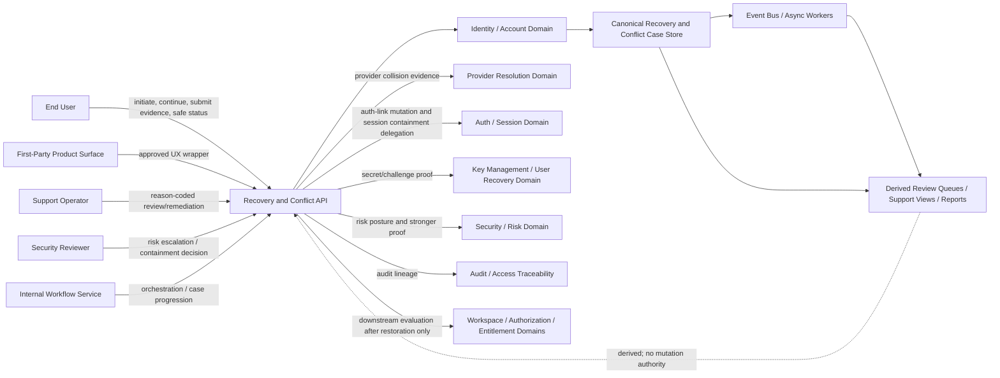
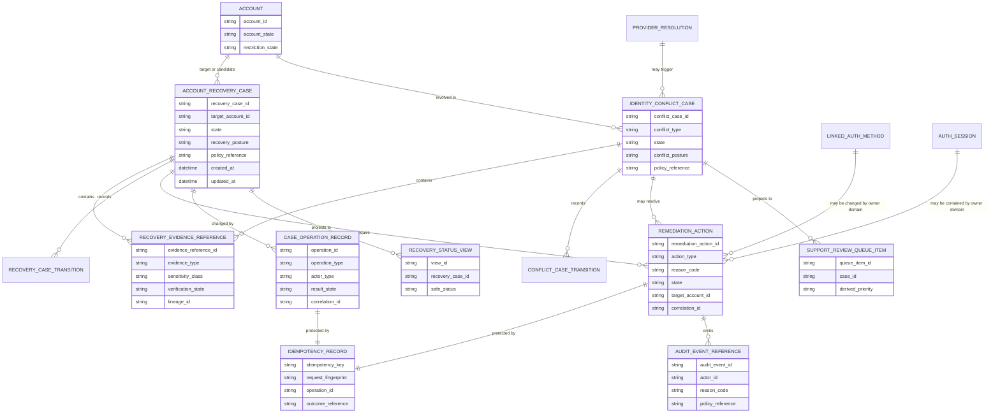
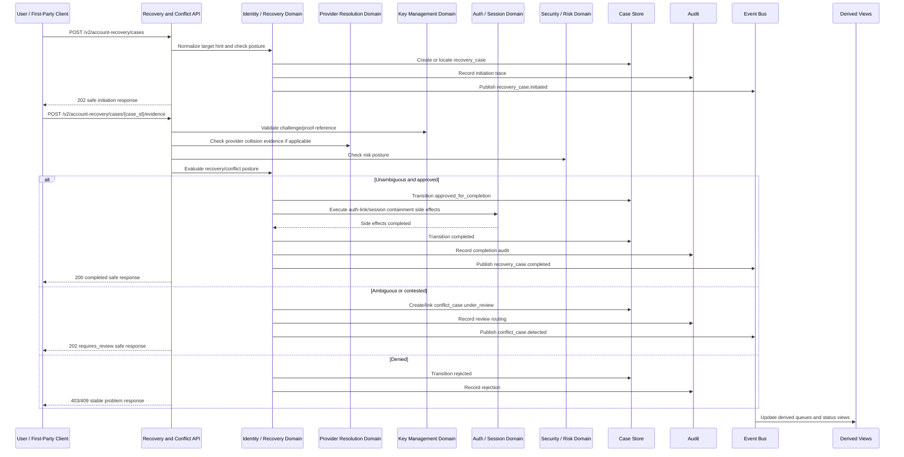

# ACCOUNT_RECOVERY_AND_CONFLICT_HANDLING_API_SPEC.md

## Document Metadata

- **Document Name:** `ACCOUNT_RECOVERY_AND_CONFLICT_HANDLING_API_SPEC.md`
- **Document Type:** FUZE API SPEC v2 / Production-grade interface-contract specification
- **Status:** Draft for production-grade API-spec review
- **Version:** 2.0.0
- **Effective Date:** 2026-04-24
- **Last Updated:** 2026-04-24
- **Reviewed On:** 2026-04-24
- **Document Owner:** FUZE Platform Identity and Account Domain, with API ownership coordinated through FUZE Platform API Architecture and recovery-execution coordination delegated to Auth / Session, Recovery Operations, Security / Risk, and Audit domains under policy control
- **Approval Authority:** FUZE Platform Architecture and Governance Authority
- **Review Cadence:** Quarterly or upon material change to account recovery policy, conflict handling, provider-linking behavior, continuity policy, session-containment policy, support/admin remediation controls, evidence policy, security/risk posture, audit requirements, or public/first-party/admin recovery surface exposure
- **Governing Layer:** API SPEC v2 / Identity, Account, Auth, and Session API family
- **Parent Registry:** `API_SPEC_INDEX.md`
- **Upstream Semantic Registry:** `REFINED_SYSTEM_SPEC_INDEX.md`
- **Upstream API Registry:** `API_SPEC_INDEX.md`
- **Primary Audience:** API designers, backend engineers, identity engineers, auth/session engineers, provider-resolution engineers, recovery workflow engineers, frontend/client engineers, security engineers, support/control-plane engineers, audit/governance reviewers, OpenAPI/AsyncAPI/SDK authors, QA and contract-validation teams
- **Primary Purpose:** Define the FUZE API contract for account recovery and conflict handling, including recovery-case initiation, safe status reads, evidence intake, conflict-case creation, review/remediation routing, completion, rejection, supersession, session containment coordination, admin/control-plane remediation, event emission, idempotency, replay safety, audit lineage, read-model boundaries, migration, and downstream contract guardrails.
- **Primary Upstream References:**
  - `REFINED_SYSTEM_SPEC_INDEX.md`
  - `DOCS_SPEC_INDEX.md`
  - `SYSTEM_SPEC_INDEX.md`
  - `API_SPEC_INDEX.md`
  - `FUZE_ACCOUNT_ACCESS_AND_SESSION_THESIS_FINAL_SPEC.md`
  - `FUZE_ACCOUNT_ACCESS_AND_SESSION_CANONICAL_FINAL_SPEC.md`
  - `IDENTITY_AND_ACCOUNT_SPEC.md`
  - `AUTH_SESSION_AND_LINKED_LOGIN_SPEC.md`
  - `FUZE_ACCOUNT_ACCESS_CONTINUITY_SPEC.md`
  - `FUZE_PROVIDER_RESOLUTION_AND_LINKING_SPEC.md`
  - `FUZE_SESSION_LIFECYCLE_AND_SECURITY_SPEC.md`
  - `FUZE_ACCOUNT_RECOVERY_AND_CONFLICT_HANDLING_SPEC.md`
  - `KEY_MANAGEMENT_AND_USER_RECOVERY_SPEC.md`
  - `SECURITY_AND_RISK_CONTROL_SPEC.md`
  - `AUDIT_AND_ACCESS_TRACEABILITY_SPEC.md`
  - `ADMIN_ACCESS_CORRECTION_AND_CONTAINMENT_SPEC.md`
  - `WORKSPACE_AND_ORGANIZATION_SPEC.md`
  - `ROLE_PERMISSION_AND_ACCESS_CONTROL_SPEC.md`
  - `SCOPED_AUTHORIZATION_MODEL_SPEC.md`
  - `ACCESS_EVALUATION_AND_EFFECTIVE_PERMISSION_SPEC.md`
  - `ENTITLEMENT_AND_CAPABILITY_GATING_SPEC.md`
  - `AUTH_IDENTITY_API_SPEC.md`
  - `SESSION_AND_LINKED_LOGIN_API_SPEC.md`
- **Primary Downstream Dependents:**
  - OpenAPI contracts for recovery and conflict APIs
  - AsyncAPI contracts for recovery/conflict/remediation events
  - identity-domain recovery services
  - provider-resolution review and collision handling
  - session-containment and forced re-entry services
  - key-management and reset flows
  - support/admin case tools
  - security incident and compromise-response workflows
  - audit and access traceability pipelines
  - frontend/mobile recovery UX
  - SDK recovery helpers
  - QA, contract validation, and regression suites
- **API Surface Families Covered:** first-party recovery APIs, safe public/unauthenticated initiation surfaces, internal service APIs, admin/control-plane APIs, event/async APIs, derived review/read-model/reporting APIs
- **API Surface Families Excluded:** ordinary login when no recovery/conflict posture exists, full provider-resolution/linking APIs, full session lifecycle APIs, full key-management/reset APIs, workspace authorization APIs, entitlement APIs, wallet APIs, treasury/governance/chain APIs, legal/KYC verification APIs unless explicitly introduced by a later governing spec
- **Canonical System Owner(s):** Identity and Account Domain for recovery/conflict case meaning; Auth / Session Domain for linked-auth mutation execution and session containment; Provider Resolution Domain for provider-subject and provider-link truth; Key Management Domain for secret/reset proof mechanics; Security / Risk Domain for elevated-risk policy; Audit Domain for traceability truth
- **Canonical API Owner:** FUZE Platform API Architecture / Identity Recovery API owner
- **Supersedes:** Recovery/conflict portions of `AUTH_IDENTITY_API_SPEC.md` and `SESSION_AND_LINKED_LOGIN_API_SPEC.md` where this API v2 document is narrower, stricter, or more explicit
- **Superseded By:** Not yet known
- **Related Decision Records:** Not explicitly available in retrieved governing materials
- **Canonical Status Note:** This API spec derives from `FUZE_ACCOUNT_RECOVERY_AND_CONFLICT_HANDLING_SPEC.md`. It owns interface-contract expression only. It MUST NOT redefine refined recovery, identity, account, auth-link, provider, session, key-management, security, audit, authorization, entitlement, wallet, or reporting semantics.
- **Implementation Status:** Normative API contract baseline; downstream OpenAPI, AsyncAPI, SDK, service, storage, event, support-tool, audit, and runtime contracts must conform
- **Approval Status:** Drafted for API SPEC v2 inclusion; formal approval record not yet attached
- **Change Summary:** Created a production-grade API v2 contract for recovery and conflict handling; separated recovery-case and conflict-case API ownership from ordinary login, session lifecycle, provider linking, and secret reset APIs; hardened same-account restoration, anti-silent-merge, anti-silent-reassignment, explicit review, operator remediation, idempotency, audit, event, projection, migration, and boundary-violation rules.

---

## Purpose

This document defines the FUZE API contract for **account recovery and conflict handling**.

The API layer governed here expresses refined recovery semantics as implementable interface contracts. It defines how a user, first-party product, trusted internal service, support operator, security reviewer, or control-plane workflow may initiate, inspect, progress, complete, reject, supersede, or remediate a recovery or conflict case while preserving the same canonical `account_id`.

Recovery and conflict handling are trust-preservation mechanisms at the identity boundary. They are not login conveniences. They exist to restore access to an existing canonical account while preventing takeover, silent merge, silent fragmentation, silent reassignment, product-local identity drift, provider-callback overreach, stale-session overreach, and support-tool shadow ownership.

---

## Scope

This specification governs API contracts for:

1. recovery initiation through approved public or first-party surfaces;
2. safe recovery-case status retrieval;
3. evidence submission and evidence-reference intake;
4. recovery-case progression, review routing, expiration, cancellation, supersession, rejection, and completion;
5. conflict-case detection and creation for provider collisions, duplicate-account risk, ambiguous candidate accounts, contested ownership, recovery-significant contact overlap, and misbinding allegations;
6. review/remediation workflows for support, security, and admin/control-plane actors;
7. recovery-sensitive linked-auth mutation orchestration;
8. session containment coordination after trust reset, recovery completion, provider correction, compromise remediation, or secret reset;
9. derived review queues, support views, user-safe status views, and reporting boundaries;
10. event/async behavior for case and remediation lifecycles;
11. idempotency, replay safety, rate limiting, abuse control, audit, observability, migration, and SDK derivation requirements.

---

## Out of Scope

This API spec does not govern:

- canonical account identity creation, merge, deletion, or general lifecycle APIs;
- ordinary login, auth challenge, provider callback, or session issuance APIs when no recovery/conflict posture exists;
- full provider-resolution/linking APIs;
- full key-management, password reset, secret verifier, MFA factor, or cryptographic challenge mechanics;
- full session lifecycle, refresh, logout, revoke, or token transport APIs;
- workspace membership, role assignment, permission evaluation, entitlement grants, or product capability gates;
- wallet-link APIs, chain ownership, treasury, governance, or payout APIs;
- case-management UI design, staffing procedure, legal/KYC verification model, or support queue topology;
- unrelated commercial, billing, credits, payout, or governance correction workflows except where account continuity implications must be preserved.

---

## Design Goals

1. Restore access to the same canonical account rather than creating replacement identity paths.
2. Preserve identity integrity over convenience when evidence is weak, incomplete, contested, or ambiguous.
3. Prevent silent merge, silent fragmentation, silent reassignment, silent bootstrap, and support-driven hidden rewrites.
4. Make recovery and conflict outcomes explicit, durable, policy-constrained, auditable, reviewable, and replay-safe.
5. Keep recovery/conflict truth backend-owned and domain-owned rather than frontend-owned, product-owned, provider-owned, support-tool-owned, or report-owned.
6. Distinguish recovery-case truth from identity truth, auth-link truth, session truth, provider-input truth, key/reset proof truth, wallet-aware context truth, authorization truth, entitlement truth, derived read-model truth, and reporting truth.
7. Define deterministic API behavior under retries, duplicate submissions, asynchronous review, partial failure, degraded dependencies, and high-risk uncertainty.
8. Support safe first-party UX without exposing account existence, sensitive evidence, internal reviewer notes, risk scores, or ambiguous candidate details beyond policy.
9. Provide enough API contract clarity for OpenAPI, AsyncAPI, SDK, QA, audit, support tooling, security workflows, and migration planning.

---

## Non-Goals

This API spec is not intended to:

- guarantee fully automated recovery in every case;
- optimize solely for minimum friction at the expense of takeover resistance;
- treat provider callback success, email similarity, profile similarity, wallet possession, product-local records, or active session presence as sufficient proof for merge, reassignment, or recovery completion;
- let support or admin operators bypass policy, audit, continuity, or security rules;
- make recovery completion equivalent to workspace permission, entitlement, wallet ownership, or product capability;
- define exact MFA, KYC, secret, or cryptographic protocol detail;
- replace downstream API schemas, evidence storage contracts, review runbooks, incident runbooks, or queue implementation specs.

---

## Core Principles

### Same-Account Restoration

Recovery MUST restore reachability to the same canonical `account_id`. Recovery MUST NOT create a new canonical account as a shortcut.

### No Silent Merge

The API layer MUST NOT silently merge accounts based on evidence similarity, provider signals, email overlap, product hints, or support intuition.

### No Silent Reassignment

Provider subjects, linked auth methods, recovery-significant contacts, wallet-aware relationships, or other access-path relationships MUST NOT be silently moved between accounts.

### Explicit Review

If automated certainty is insufficient, the API MUST create or route to explicit review or remediation posture rather than guessing.

### Session Containment

Recovery completion, compromise remediation, password/secret reset, provider correction, controlled reassignment, and certain corrective access actions MAY require targeted or global session containment.

### Audit Lineage

Recovery and conflict handling MUST be reconstructable through durable case state, evidence references, reason-coded decisions, policy references, actor lineage, trace identifiers, correlation identifiers, operation identifiers, and emitted events.

### Backend Ownership

Products and frontends MAY initiate and consume recovery flows. They MUST NOT own canonical recovery truth or conflict-resolution truth.

### Authorization Separation

Recovery restores account access. It does not automatically restore or grant workspace role, permission, entitlement, product capability, wallet ownership, commercial benefit, payout eligibility, or governance authority.

### Conservative Remediation

Operator/support intervention MUST be narrow, bounded, reason-coded, policy-referenced, authorization-checked, and audited. Remediation is an exception path, not a second identity system.

---

## Canonical Definitions

- **Recovery:** Controlled process that restores ability to reach an existing canonical FUZE account after ordinary access paths are unavailable, degraded, blocked, or insufficient.
- **Recovery Case:** Durable platform case tracking initiation, verification, review, transitions, and outcome for a specific canonical account or safely anchored candidate account context.
- **Conflict Case:** Durable platform case used when identity/access-path evidence cannot safely resolve to one unambiguous account-access outcome.
- **Recovery-Significant Attribute:** Attribute or relationship whose change can materially affect ability to regain access to the same account.
- **Recovery Posture:** Evaluated state describing whether recovery is unnecessary, available, in progress, under review, blocked, completed recently, rejected, expired, or superseded.
- **Conflict Posture:** State in which the platform cannot safely continue ordinary automated resolution because of ambiguity, collision, duplicate-account risk, provider collision, contested ownership, or remediation-sensitive inconsistency.
- **Evidence Reference:** Durable reference to policy-approved proof material, challenge result, provider-normalized evidence, reviewer attachment, or support note used in recovery/conflict decisioning.
- **Remediation Action:** Controlled corrective action resolving or containing a recovery/conflict case without silently rewriting canonical identity truth.
- **Recovery Completion:** Terminal or near-terminal action restoring account reachability and potentially triggering auth-method changes, continuity-posture changes, and session containment.
- **Controlled Reassignment:** Exceptional, explicitly approved, policy-authorized, and auditable remediation action changing ownership of an access-path binding.
- **Under Review:** Posture indicating automated progression has paused and explicit reviewer or policy-controlled operator decision is required.
- **Stranded Account:** Canonical account with no presently viable ordinary access path and no currently usable approved recovery or remediation route.

---

## Truth Class Taxonomy

This API spec preserves the following truth classes:

1. **Semantic Truth:** Defined by upstream refined system specs.
2. **API Contract Truth:** Defined here for requests, responses, errors, statuses, idempotency, surface families, events, and compatibility.
3. **Canonical Identity Truth:** `account_id`, account lifecycle, account restriction/suspension, and identity continuity owned by Identity and Account Domain.
4. **Auth-Link Truth:** Durable approved mapping between a canonical account and its linked authentication methods or provider-backed access paths.
5. **Recovery / Conflict Case Truth:** Durable case state, transitions, review posture, remediation references, evidence references, and terminal outcomes.
6. **Runtime Session Truth:** Temporary authenticated runtime presence, session lineage, revocation state, invalidation state, and privileged-session posture.
7. **Secret / Key-State Truth:** Secret version, reset lineage, recovery challenge/proof mechanics, and reset-capable proof state owned by Key Management / Auth Session domains.
8. **Policy Truth:** Recovery policy, security policy, continuity policy, operator-control policy, evidence sufficiency rules, and higher-order platform constraints.
9. **Provider-Input Truth:** Provider callback claims, issuer-subject pairs, profile fields, and metadata as evidence inputs, not identity truth.
10. **Wallet-Aware Context Truth:** Wallet-link state and wallet-derived participation context as attached context, not default recovery truth.
11. **Authorization / Entitlement Truth:** Workspace scope, membership, roles, permissions, product capabilities, and entitlements evaluated downstream.
12. **Audit / Traceability Truth:** Durable actor/action/reason/policy/evidence/correlation/event lineage.
13. **Derived Read-Model Truth:** Review queues, support views, dashboards, search projections, safe user status views, and reports derived from canonical case records.
14. **Presentation Truth:** UX copy, emails, support copy, SDK messages, and product guidance that summarize state without owning it.

---

## Architectural Position in the Spec Hierarchy

This API spec sits below:

- `REFINED_SYSTEM_SPEC_INDEX.md`
- `FUZE_ACCOUNT_ACCESS_AND_SESSION_THESIS_FINAL_SPEC.md`
- `FUZE_ACCOUNT_ACCESS_AND_SESSION_CANONICAL_FINAL_SPEC.md`
- `IDENTITY_AND_ACCOUNT_SPEC.md`
- `AUTH_SESSION_AND_LINKED_LOGIN_SPEC.md`
- `FUZE_ACCOUNT_ACCESS_CONTINUITY_SPEC.md`
- `FUZE_PROVIDER_RESOLUTION_AND_LINKING_SPEC.md`
- `FUZE_SESSION_LIFECYCLE_AND_SECURITY_SPEC.md`
- `FUZE_ACCOUNT_RECOVERY_AND_CONFLICT_HANDLING_SPEC.md`
- `KEY_MANAGEMENT_AND_USER_RECOVERY_SPEC.md`
- `SECURITY_AND_RISK_CONTROL_SPEC.md`
- `AUDIT_AND_ACCESS_TRACEABILITY_SPEC.md`

It sits beside or above downstream machine-readable and implementation layers:

- OpenAPI recovery/conflict route files;
- AsyncAPI event contracts;
- recovery workflow orchestration contracts;
- support/admin tooling contracts;
- evidence storage contracts;
- audit schema contracts;
- SDK recovery helpers;
- frontend/mobile recovery-state contracts;
- migration and regression test suites.

---

## Upstream Semantic Owners

### `FUZE_ACCOUNT_RECOVERY_AND_CONFLICT_HANDLING_SPEC.md`

Primary semantic owner for recovery-case truth, conflict-case truth, same-account restoration, no-silent-merge rules, no-silent-reassignment rules, review/remediation routing, case states, evidence posture, operator remediation, and case lineage.

### `IDENTITY_AND_ACCOUNT_SPEC.md`

Owns canonical account identity, `account_id`, account lifecycle, restriction/suspension posture, account-level conflict semantics, and identity-level recovery meaning.

### `AUTH_SESSION_AND_LINKED_LOGIN_SPEC.md`

Owns ordinary auth/session/linked-login parent semantics, linked-auth lifecycle, auth challenge state, session issuance, and the rule that ordinary auth/session behavior must defer to recovery/conflict state when trust is contested.

### `FUZE_ACCOUNT_ACCESS_CONTINUITY_SPEC.md`

Owns continuity posture and the principle that mutations must not strand the user from the same canonical account.

### `FUZE_PROVIDER_RESOLUTION_AND_LINKING_SPEC.md`

Owns provider normalization, provider-subject uniqueness, provider collision handling, provider-link correction constraints, and provider-input evidence boundaries.

### `FUZE_SESSION_LIFECYCLE_AND_SECURITY_SPEC.md`

Owns session containment execution, session invalidation, post-recovery re-entry posture, session lineage, and privileged-session controls.

### `KEY_MANAGEMENT_AND_USER_RECOVERY_SPEC.md`

Owns reset-capable secret material, recovery proof, challenge state, secret/reset lineage, and recovery-sensitive secret mutation execution semantics.

### `SECURITY_AND_RISK_CONTROL_SPEC.md`

Owns risk severity, compromise posture, containment thresholds, stronger proof requirements, abuse control, and high-sensitivity operator controls.

### `AUDIT_AND_ACCESS_TRACEABILITY_SPEC.md`

Owns durable access traceability, actor lineage, policy reference, reason code, correlation ID, and reconstruction requirements.

---

## API Surface Families

### Public / Unauthenticated Safe Surfaces

May exist only for recovery initiation, status continuation using opaque case tokens, and anti-enumeration-safe messaging. These surfaces MUST NOT expose account existence, candidate accounts, provider collisions, reviewer notes, risk scores, or sensitive evidence.

### First-Party Application Surfaces

FUZE products may expose recovery initiation, evidence submission, safe case status, user action completion, and cancellation where allowed. They remain consumers and initiators, not owners.

### Internal Service Surfaces

Trusted FUZE services may create, update, evaluate, or consume recovery/conflict case state through scoped service-to-service APIs. Internal APIs MUST NOT become hidden broad-write shortcuts.

### Admin / Control-Plane Surfaces

Support, security, and privileged operators may inspect and remediate cases only through separated, reason-coded, policy-constrained, audited APIs.

### Event / Async Surfaces

Recovery and conflict case transitions emit post-commit events. Events support orchestration, projection, notification, audit, and containment. They do not become mutation owners.

### Reporting / Projection Surfaces

Derived review queues, support views, analytics, and reporting may summarize case state. They MUST be marked derived and MUST NOT mutate canonical case truth.

### Chain-Adjacent Surfaces

No chain-adjacent recovery authority is defined. Wallet or on-chain context may be evidence only where a separate governing spec permits it. It MUST NOT be universal recovery proof.

---

## System / API Boundaries

This API spec governs interface contracts for recovery/conflict case state and related remediation actions.

It does not govern:

- ordinary identity/account lifecycle APIs;
- ordinary auth/session/login APIs;
- provider normalization APIs except where provider collision triggers case state;
- secret/reset APIs except where reset outcomes require recovery-case coordination;
- session invalidation execution APIs except as delegated or coordinated side effects;
- authorization/entitlement evaluation after restored access;
- wallet ownership or chain truth.

Downstream APIs MAY reference recovery posture. They MUST NOT reinterpret it.

---

## Adjacent API Boundaries

- `IDENTITY_AND_ACCOUNT_API_SPEC.md` owns canonical account CRUD/lifecycle boundaries and identity reads.
- `AUTH_SESSION_AND_LINKED_LOGIN_API_SPEC.md` owns ordinary auth/session/linked-login route families outside explicit recovery/conflict posture.
- `PROVIDER_RESOLUTION_AND_LINKING_API_SPEC.md` owns provider normalization, provider-link CRUD, provider conflict detection at provider boundary, and provider-subject uniqueness outputs.
- `SESSION_LIFECYCLE_AND_SECURITY_API_SPEC.md` owns session issuance, inspection, refresh, revoke, invalidation, containment, and privileged-session behavior.
- `KEY_MANAGEMENT_AND_USER_RECOVERY_API_SPEC.md` owns secret-reset and proof/challenge mechanics.
- `ACCOUNT_ACCESS_CONTINUITY_API_SPEC.md` owns continuity preflight and continuity posture APIs.
- `AUDIT_AND_ACCESS_TRACEABILITY_API_SPEC.md` owns generic access audit and traceability APIs.
- `ADMIN_ACCESS_CORRECTION_AND_CONTAINMENT_API_SPEC.md` owns cross-domain operator correction and containment patterns.
- Workspace, authorization, and entitlement API specs own downstream access after restored account authentication.

---

## Conflict Resolution Rules

When interpretation conflicts arise:

1. Active refined system specs win on semantic truth.
2. `FUZE_ACCOUNT_RECOVERY_AND_CONFLICT_HANDLING_SPEC.md` wins on recovery/conflict semantics.
3. `IDENTITY_AND_ACCOUNT_SPEC.md` wins on canonical account identity.
4. `FUZE_PROVIDER_RESOLUTION_AND_LINKING_SPEC.md` wins on provider evidence and provider-link semantics.
5. `FUZE_SESSION_LIFECYCLE_AND_SECURITY_SPEC.md` wins on session containment execution.
6. `KEY_MANAGEMENT_AND_USER_RECOVERY_SPEC.md` wins on reset proof and secret-state mechanics.
7. `SECURITY_AND_RISK_CONTROL_SPEC.md` wins on risk/containment thresholds.
8. This API spec wins only on interface-contract expression that does not contradict refined semantic owners.
9. Older v1 API specs may inform historical route posture, but MUST NOT override refined semantics or this v2 contract.
10. Derived views, reports, dashboards, support queues, product caches, and frontend state never win over canonical case truth.

Specific API conflict rules:

- Email similarity MUST NOT produce merge or reassignment.
- Provider callback success MUST NOT bypass recovery/conflict case posture.
- Active session presence MUST NOT prove durable recovery authority.
- Wallet presence MUST NOT rewrite account ownership.
- Product-local user records MUST NOT anchor recovery.
- Support tool displays MUST NOT override canonical case records.
- Reporting exports MUST NOT trigger corrective mutation directly.

---

## Default Decision Rules

1. Default actor anchor is `account_id`.
2. Default recovery goal is restoration to the same canonical account.
3. Default owner of recovery/conflict case meaning is Identity and Account Domain.
4. Default owner of linked-auth mutation and session containment execution is Auth / Session Domain.
5. Default interpretation of provider subject is evidence under provider-resolution rules, not a second identity root.
6. Default interpretation of email/contact overlap is hint or review signal, not canonical matching proof.
7. Default interpretation of active session is temporary runtime signal, not durable recovery proof.
8. Default interpretation of wallet linkage is attached context, not universal recovery proof.
9. Default response to ambiguity is explicit review or denial.
10. Default response to last viable access path loss is recovery/remediation posture, not silent bootstrap.
11. Default response to disputed reassignment is preserve current canonical ownership and open remediation.
12. Default response under high-risk uncertainty or degraded evidence is fail closed for high-impact access actions.

---

## Roles / Actors / API Consumers

- **End User:** Initiates recovery, submits evidence, completes approved actions, reviews safe status, and consumes completion/denial outcomes.
- **Authenticated User Performing Sensitive Mutation:** Initiates recovery-adjacent access-path changes requiring recent-auth, step-up, or continuity preflight.
- **First-Party Product Surface:** Presents approved flows and safe status, without deciding canonical outcomes.
- **Identity Domain Service:** Canonical case owner and final same-account restoration decision owner.
- **Auth / Session Service:** Executes auth-method mutation and session containment after approved decision.
- **Provider Resolution Service:** Supplies provider-normalized evidence, provider collision state, and provider-link correction constraints.
- **Key Management / Recovery Service:** Supplies challenge, reset proof, secret-version, and reset completion outputs.
- **Security / Risk Service:** Supplies risk posture, compromise posture, stronger proof requirements, and containment requirements.
- **Support Operator:** Reviews cases and executes narrow approved remediation through privileged APIs.
- **Security Reviewer:** Escalates, denies, or authorizes compromise-sensitive remediation.
- **Internal Workflow / Review Service:** Orchestrates case state transitions under policy.
- **Audit / Traceability Service:** Records actor, reason, policy, evidence, correlation, and event lineage.
- **Projection / Reporting Consumers:** Consume derived views and reports without owning case truth.

---

## Resource / Entity Families

### API-Facing Resources

- `account_recovery_case`
- `identity_conflict_case`
- `recovery_case_status`
- `conflict_case_status`
- `recovery_evidence_reference`
- `recovery_challenge_reference`
- `remediation_action`
- `case_review_decision`
- `case_operation`
- `case_audit_reference`
- `case_event`
- `recovery_posture`
- `conflict_posture`

### Canonical Owner-Domain Entities

- `account_recovery_case`
- `identity_conflict_case`
- `account_recovery_evidence_reference`
- `account_access_remediation_action`
- `recovery_case_transition`
- `conflict_case_transition`
- `case_operation_record`
- `idempotency_record`
- `audit_event_reference`

### Referenced but Non-Owned Entities

- `account`
- `linked_auth_method`
- `provider_resolution`
- `provider_link`
- `auth_session`
- `account_secret_state`
- `account_recovery_challenge`
- `workspace_membership`
- `permission_evaluation`
- `entitlement_evaluation`
- `wallet_link`
- `risk_signal`

### Derived Entities

- `support_recovery_queue_item`
- `case_review_dashboard_item`
- `user_safe_recovery_status_view`
- `account_access_posture_summary`
- `recovery_metrics_report`
- `case_search_projection`

Derived entities MUST be regenerable from canonical case records and MUST NOT write canonical case truth.

---

## Ownership Model

### Identity and Account Domain Owns

- recovery-case and conflict-case meaning;
- same-account restoration decision;
- case state transitions;
- duplicate-account and ambiguity posture;
- final case completion/rejection/supersession meaning;
- identity-safe remediation posture.

### Auth / Session Domain Owns

- linked-auth mutation execution after approved case decision;
- session invalidation and containment execution;
- recent-auth/challenge execution where required;
- post-recovery session re-entry under session policy.

### Provider Resolution Domain Owns

- provider-subject uniqueness;
- provider collision semantics;
- provider-link correction constraints;
- provider evidence interpretation before recovery consumption.

### Key Management Domain Owns

- secret/reset challenge mechanics;
- proof verification mechanics;
- secret-version/reset lineage;
- secret reset completion execution.

### Security / Risk Domain Owns

- elevated-risk posture;
- compromise response;
- stronger proof requirements;
- deny/escalate/containment thresholds.

### Support/Admin Domains May

- read admin-safe case details;
- add review notes and evidence references;
- make approved decisions where policy permits;
- execute bounded remediation through audited endpoints.

### Support/Admin Domains Must Not

- create canonical recovery truth outside owner domains;
- silently merge or reassign accounts;
- bypass blocked or under-review posture;
- rewrite history or erase lineage;
- mutate provider/session/secret truth outside owning-domain APIs.

### Product Domains May

- initiate recovery;
- display safe status/guidance;
- route users to approved flows.

### Product Domains Must Not

- own recovery truth;
- merge/reassign accounts;
- override blocked/review state;
- treat product-local state as recovery anchor.

---

## Authority / Decision Model

### Automated Progression Is Allowed Only When

- target canonical account is unambiguous;
- evidence meets policy;
- no provider collision, duplicate-account risk, contested ownership, or elevated-risk posture blocks progression;
- resulting auth-method and session effects are deterministic;
- continuity can be preserved;
- idempotency and audit context are present.

### Explicit Review Is Required When

- provider subject collides with another account;
- provider email/profile overlap is suggestive but insufficient;
- multiple candidate accounts are plausible;
- user/support alleges misbinding or mistaken remediation;
- recovery-significant attribute conflicts with another account’s state;
- restoration could strand, overwrite, or reassign access truth;
- elevated risk or compromise signals exist;
- required dependencies are degraded enough to reduce safe automation confidence.

### Operator Remediation Is Permitted Only When

- policy explicitly permits the action class;
- caller has privileged authority;
- reason code, policy reference, operation ID, correlation ID, and audit reference are recorded;
- resulting continuity, auth-link, session-containment, and evidence effects are explicit;
- the action remains bounded and reconstructable.

### Denial Is Required When

- evidence is insufficient;
- ambiguity remains unresolved;
- requested action violates same-account restoration;
- requested correction would steal or overwrite another account’s access path;
- security posture requires fail-closed behavior;
- required audit or policy controls cannot be satisfied.

---

## Authentication Model

### Public / Unauthenticated Initiation

Recovery initiation MAY be unauthenticated where product policy permits, but must use anti-enumeration-safe responses and must not disclose account existence or candidate account detail.

### Opaque Case Continuation

Case continuation MAY use short-lived opaque recovery tokens, challenge references, or continuation references owned by the recovery/key-management domain. Such tokens are bounded evidence, not identity truth.

### Authenticated Self-Service

Authenticated sensitive mutations may initiate recovery-adjacent workflows only after current session validation plus recent-auth/step-up where required.

### Internal Service

Internal service APIs require service-to-service authentication, explicit service identity, scoped authority, correlation ID, and operation lineage.

### Admin / Control-Plane

Admin APIs require privileged operator identity, appropriate operator session class, scoped authorization, reason code, policy reference, and audit context.

---

## Authorization / Scope / Permission Model

Recovery APIs MUST distinguish:

- public initiation;
- user-safe continuation;
- authenticated user self-service;
- trusted internal orchestration;
- support review;
- security review;
- privileged remediation;
- read-only reporting/projection.

A valid session alone is insufficient for recovery-sensitive mutation. The API MUST evaluate:

- caller type;
- operation family;
- target account or candidate account posture;
- case state;
- recovery/conflict posture;
- evidence sufficiency;
- risk posture;
- recent-auth or step-up posture;
- operator permission;
- policy reference;
- idempotency state.

---

## Entitlement / Capability-Gating Model

Recovery does not grant entitlement or product capability.

Recovery completion may restore ability to authenticate into the canonical account. Workspace membership, roles, permissions, entitlements, billing state, product capability, payout eligibility, and governance participation remain owned by adjacent domains.

Recovery APIs MAY expose flags such as `requires_permission_evaluation` or `requires_entitlement_evaluation`. They MUST NOT return fields implying final product access unless owner-domain evaluation occurred elsewhere and is clearly marked.

---

## API State Model

### Recovery Case States

- `initiated`
- `verification_pending`
- `evidence_pending`
- `awaiting_user_action`
- `under_review`
- `approved_for_completion`
- `completion_in_progress`
- `completed`
- `rejected`
- `expired`
- `cancelled`
- `superseded`

### Conflict Case States

- `detected`
- `triage_pending`
- `under_review`
- `awaiting_evidence`
- `remediation_planned`
- `remediation_in_progress`
- `resolved`
- `rejected`
- `superseded`
- `closed_without_change`

### Recovery Posture States

- `not_needed`
- `available`
- `recovery_only`
- `under_review`
- `blocked`
- `completed_recently`
- `denied`
- `expired`

### Conflict Posture States

- `none`
- `possible`
- `confirmed`
- `under_review`
- `remediation_required`
- `resolved`
- `blocked`

### Operation States

- `accepted`
- `completed`
- `partially_completed`
- `denied`
- `failed`
- `cancelled`
- `requires_user_action`
- `requires_review`
- `superseded`

### State Rules

- State transitions MUST be explicit, durable, auditable, and replay-safe.
- Terminal states MUST NOT silently become active.
- Supersession MUST preserve prior case lineage.
- Closure MUST preserve outcome, reason, and effective remediation.
- Derived views MUST NOT become mutation owners.
- Degraded runtime conditions MUST NOT create hidden truth substitution.

---

## Lifecycle / Workflow Model

### Recovery Initiation

1. User or authorized actor initiates an approved recovery path.
2. API applies anti-enumeration controls.
3. API creates or references durable `account_recovery_case`.
4. API records operation and idempotency state where mutation occurs.
5. API returns safe status, continuation reference, or accepted operation reference.
6. API does not mutate identity, linked auth, provider link, or session state at initiation unless specifically authorized by owner-domain policy.

### Evidence Collection

1. User completes approved challenge or submits evidence through bounded route.
2. API validates evidence envelope and caller/case binding.
3. API stores evidence reference, not uncontrolled raw evidence in response.
4. Evidence may support progression, denial, or review.
5. Evidence never becomes alternate identity truth.

### Conflict Detection

1. API or internal workflow checks provider collisions, duplicate-account risk, contested ownership, link/unlink collision, and elevated-risk signals.
2. If unsafe ambiguity exists, API creates or references `identity_conflict_case`.
3. Ordinary progression is frozen.
4. Case enters review/remediation posture.
5. Current canonical ownership is preserved while review remains unresolved.

### Review / Remediation

1. Support/security/internal reviewer inspects admin-safe case detail.
2. Reviewer records decision with reason code and policy reference.
3. Approved remediation action is executed through owner-domain APIs.
4. Auth-link mutation, provider correction, secret reset, and session containment occur only in owner domains.
5. Audit and events capture full lineage.

### Completion

1. Case reaches `approved_for_completion`.
2. API verifies no blocking conflict, risk, or degraded dependency.
3. Owner domains execute required auth-method, secret, provider, continuity, and session side effects.
4. API records completion result and audit lineage.
5. API emits post-commit events.
6. User-safe status returns completion without leaking sensitive internal detail.

### Rejection / Expiration / Cancellation

1. Case is rejected, expires, or is cancelled with reason.
2. No hidden identity or access mutation occurs.
3. Evidence/case lineage is preserved.
4. Events and audit records are emitted where required.
5. Retrying requires a new case or allowed supersession path.

### Supersession

1. A newer case or remediation path supersedes a prior case.
2. Prior case is marked `superseded`.
3. Supersession reference links old/new cases.
4. Derived views update.
5. History remains reconstructable.

---

## Architecture Diagram — Mermaid flowchart

---

## Data Design — Mermaid Diagram

---

## Flow View

### Primary Flow — Recovery Initiation

1. Caller submits recovery initiation request through public or first-party route.
2. API normalizes target hint without exposing account existence.
3. API checks whether an existing active case or blocked posture applies.
4. API creates or references durable recovery case.
5. API records idempotency and operation lineage when side effects occur.
6. API emits safe response: `accepted`, `verification_pending`, `under_review`, or equivalent.
7. API emits audit/observability and async events according to sensitivity.

### Primary Flow — Evidence Submission and Evaluation

1. Caller submits evidence or challenge result bound to case continuation.
2. API validates case state, token/challenge binding, replay posture, and rate limit.
3. Evidence reference is recorded.
4. Identity/recovery policy evaluates sufficiency.
5. If unambiguous and safe, case progresses.
6. If ambiguous, conflict case is created or linked.
7. If insufficient, case remains pending, under review, or rejected.
8. API never returns sensitive raw evidence or candidate account detail to unsafe surfaces.

### Conflict Flow — Provider Collision

1. Provider resolution detects issuer-subject already linked elsewhere or ambiguous candidates.
2. Recovery API receives normalized collision evidence.
3. API creates durable conflict case.
4. Ordinary session issuance, relink, or recovery completion is blocked.
5. Case routes to review.
6. Current canonical ownership is preserved pending remediation.
7. Remediation executes only through owner-domain APIs and audit lineage.

### Completion Flow

1. Recovery case reaches `approved_for_completion`.
2. API re-checks conflict, risk, continuity, account state, and dependency posture.
3. Required auth-link, secret, provider, or session effects are executed by owner domains.
4. Session containment is applied where policy requires.
5. Case records completion, final reason, operation, and audit references.
6. Events update downstream projections and notifications.
7. User receives safe completion state and re-entry instructions.

### Admin / Operator Flow

1. Operator enters privileged control-plane context.
2. Operator reads admin-safe case data.
3. Operator records decision/remediation request with reason code, policy reference, and idempotency key.
4. API verifies operator authority and action class.
5. Owner domains execute bounded remediation.
6. Audit captures operator, target, policy, reason, evidence references, and result.
7. Derived queues update post-commit.

### Failure / Retry / Degraded Flow

1. Caller retries with same idempotency key and identical fingerprint.
2. API returns prior operation outcome or accepted operation status.
3. Caller retries with same key and different fingerprint.
4. API returns idempotency conflict.
5. Required owner-domain dependency unavailable.
6. API fails closed for high-impact mutations or returns governed accepted/retry status where safe.
7. API does not use stale derived views as fallback truth.

---

## Data Flows — Mermaid sequenceDiagram

---

## Request Model

All side-effecting requests MUST include or derive:

- operation type;
- caller type;
- target hint, case ID, or continuation token;
- idempotency key where mutation or case creation may occur;
- correlation ID or trace ID;
- policy reference where required;
- reason code for admin/control-plane or remediation actions;
- evidence reference or challenge reference where applicable;
- actor confirmation for privileged actions;
- service identity for internal workflows;
- recent-auth or step-up reference where policy requires.

Requests MUST NOT include:

- frontend-declared canonical account truth without backend validation;
- provider claims as identity truth;
- email/contact overlap as sole proof of account ownership;
- wallet proof as universal recovery truth;
- product-local user ID as recovery anchor;
- direct storage mutation intent;
- broad admin override without bounded action class, reason, policy, and audit envelope.

---

## Response Model

### Success / Progress Response Classes

- `recovery_case.accepted`
- `recovery_case.status`
- `recovery_case.requires_user_action`
- `recovery_case.requires_review`
- `recovery_case.approved_for_completion`
- `recovery_case.completed`
- `recovery_case.rejected`
- `recovery_case.expired`
- `recovery_case.superseded`
- `conflict_case.detected`
- `conflict_case.status`
- `remediation_action.accepted`
- `remediation_action.completed`
- `operation.partial`

### Required Fields Where Applicable

- `case_id` or opaque continuation reference;
- `case_type`;
- `safe_status`;
- `state`;
- `posture`;
- `operation_id`;
- `correlation_id`;
- `audit_reference` for sensitive actions;
- `policy_reference`;
- `required_next_action`;
- `expires_at` where safe;
- `superseded_by` where safe;
- `requires_session_reentry`;
- `requires_permission_evaluation`;
- `requires_entitlement_evaluation`.

### User-Safe Response Constraints

User-facing responses MUST avoid:

- confirming account existence unless policy allows;
- exposing candidate accounts;
- exposing provider subject collisions in unsafe detail;
- exposing reviewer notes;
- exposing raw evidence;
- exposing internal risk score or risk rule detail;
- exposing other account identifiers involved in conflict.

### Admin-Safe Response Constraints

Admin responses MAY include richer case detail where authorized, but still MUST redact secrets, raw token material, unsafe provider data, sensitive personal data outside case need, and internal details not needed by the operator.

---

## Error / Result / Status Model

### HTTP Classes

- `200 OK` for safe completed reads or completed idempotent outcomes.
- `201 Created` for explicit case creation where account-enumeration posture permits.
- `202 Accepted` for asynchronous initiation, review, remediation, or completion workflows.
- `400 Bad Request` for malformed inputs.
- `401 Unauthorized` for missing/invalid session where session is required.
- `403 Forbidden` for policy or authority denial.
- `404 Not Found` where case existence can be safely concealed or unavailable to caller.
- `409 Conflict` for conflicting state, active conflict posture, terminal state, or idempotency conflict.
- `410 Gone` for expired continuation references where safe.
- `423 Locked` or equivalent problem code for blocked/recovery-only/account-restricted posture where FUZE uses that mapping.
- `429 Too Many Requests` for rate-limit or abuse-control denial.
- `500/503` for server/dependency failure, with fail-closed high-impact posture.

### Stable Error Codes

- `RECOVERY_CASE_NOT_FOUND`
- `RECOVERY_CASE_EXPIRED`
- `RECOVERY_CASE_TERMINAL`
- `RECOVERY_CASE_SUPERSEDED`
- `RECOVERY_NOT_AVAILABLE`
- `RECOVERY_BLOCKED`
- `RECOVERY_UNDER_REVIEW`
- `RECOVERY_EVIDENCE_REQUIRED`
- `RECOVERY_EVIDENCE_INSUFFICIENT`
- `RECOVERY_EVIDENCE_REPLAYED`
- `RECOVERY_PROOF_EXPIRED`
- `RECOVERY_COMPLETION_DENIED`
- `CONFLICT_CASE_DETECTED`
- `CONFLICT_CASE_UNDER_REVIEW`
- `PROVIDER_COLLISION_REQUIRES_REVIEW`
- `DUPLICATE_ACCOUNT_RISK_REQUIRES_REVIEW`
- `SILENT_MERGE_FORBIDDEN`
- `SILENT_REASSIGNMENT_FORBIDDEN`
- `ACCOUNT_RESTRICTED`
- `ACCOUNT_SUSPENDED`
- `RISK_POSTURE_BLOCKS_RECOVERY`
- `STEP_UP_REQUIRED`
- `RECENT_AUTH_REQUIRED`
- `REASON_CODE_REQUIRED`
- `POLICY_REFERENCE_REQUIRED`
- `OPERATOR_PERMISSION_DENIED`
- `IDEMPOTENCY_KEY_REQUIRED`
- `IDEMPOTENCY_CONFLICT`
- `RATE_LIMITED`
- `OWNER_DOMAIN_UNAVAILABLE_FAIL_CLOSED`
- `DERIVED_VIEW_UNAVAILABLE`

### Result Semantics

Accepted responses mean a request was accepted or a case was created/routed. They do not imply final restoration. Final restoration exists only after canonical case state reaches `completed` and required owner-domain side effects complete or are explicitly represented as accepted operation references.

---

## Idempotency / Retry / Replay Model

Idempotency is mandatory for:

- recovery initiation where a durable case may be created;
- evidence submission where duplicate evidence could alter state;
- case transition mutations;
- recovery completion;
- remediation action creation;
- conflict-case creation from provider collision or duplicate risk;
- admin/control-plane decisions;
- linked-auth/secret/session side effects triggered by recovery.

Rules:

1. Idempotency keys MUST be scoped to caller, operation family, case/target, and request fingerprint.
2. Same key and same fingerprint returns prior outcome or operation reference.
3. Same key and different fingerprint returns `IDEMPOTENCY_CONFLICT`.
4. Duplicate evidence submission MUST NOT create contradictory evidence posture.
5. Duplicate recovery completion MUST NOT execute duplicate auth-link, secret, provider, or session side effects.
6. Replayed provider or challenge evidence MUST be detected and denied or mapped to prior outcome.
7. Terminal case states MUST be replay-safe.
8. Idempotency records MUST be retained long enough for retry windows, async completion, and audit reconstruction.

---

## Rate Limit / Abuse-Control Model

Recovery APIs MUST apply high-sensitivity abuse controls.

- Public initiation must be anti-enumeration-safe and rate-limited by IP/device/account-hint risk envelope.
- Evidence submission must be challenge-bound and attempt-limited.
- Case status polling must be rate-limited and safe under enumeration constraints.
- Admin/control-plane actions must be operator- and target-rate-limited.
- Provider collision and conflict APIs must detect replay, duplicate callbacks, and suspicious correlation patterns.
- Excessive failed recovery attempts should create security/risk signals.
- Rate-limit responses MUST NOT leak account existence or candidate detail.

---

## Endpoint / Route Family Model

The following route families are normative contract families, not final OpenAPI path commitments. Exact paths MAY be adjusted by downstream OpenAPI work if semantics are preserved.

### Public / First-Party Recovery APIs

#### `POST /v2/account-recovery/cases`

Initiates an approved recovery flow.

Required behavior:
- anti-enumeration-safe;
- creates or references durable case state;
- idempotent where side effects occur;
- does not mutate identity/auth-link/session truth directly;
- returns safe accepted/status response.

#### `GET /v2/account-recovery/cases/{case_id}`

Returns safe recovery case status.

Required behavior:
- validates caller/continuation authority;
- returns user-safe state only;
- hides candidate account detail;
- marks `requires_user_action`, `requires_review`, `completed`, `rejected`, `expired`, or `superseded` safely.

#### `POST /v2/account-recovery/cases/{case_id}/evidence`

Submits or attaches evidence reference.

Required behavior:
- validates challenge/case binding;
- detects replay;
- records evidence reference and lineage;
- evaluates or queues evaluation;
- may route to conflict/review.

#### `POST /v2/account-recovery/cases/{case_id}/cancel`

Cancels an in-progress user-controlled case where policy allows.

Required behavior:
- terminal/idempotent where applicable;
- does not erase history;
- preserves audit lineage.

#### `POST /v2/account-recovery/cases/{case_id}/complete`

Completes an approved case or requests completion.

Required behavior:
- only allowed from valid approved state;
- re-checks conflict/risk/continuity posture;
- delegates auth-link/secret/session side effects to owner domains;
- idempotent;
- returns final or accepted operation status.

### Conflict APIs

#### `POST /internal/v2/identity-conflicts`

Creates or links a conflict case from provider, recovery, continuity, or internal detection.

Required behavior:
- service-authenticated;
- idempotent;
- stores normalized conflict type;
- freezes unsafe ordinary progression;
- emits event.

#### `GET /internal/v2/identity-conflicts/{conflict_case_id}`

Reads internal conflict case state.

Required behavior:
- least-privilege internal access;
- marks canonical vs derived fields;
- does not expose raw evidence beyond scope.

#### `POST /internal/v2/identity-conflicts/{conflict_case_id}/link-recovery-case`

Links conflict to recovery case.

Required behavior:
- idempotent;
- preserves lineage;
- blocks ordinary completion if unresolved.

### Admin / Control-Plane APIs

#### `GET /admin/v2/account-recovery/cases/{case_id}`

Reads admin-safe case detail.

Required behavior:
- privileged access;
- audit read if sensitivity requires;
- redacts secrets and unnecessary personal/provider data.

#### `POST /admin/v2/account-recovery/cases/{case_id}/decisions`

Records reviewer decision.

Required behavior:
- requires reason code, policy reference, operator identity, correlation ID, and idempotency key;
- supports approve, reject, require more evidence, escalate, supersede, or remediation plan;
- does not execute owner-domain side effects without explicit bounded operation.

#### `POST /admin/v2/identity-conflicts/{conflict_case_id}/remediation-actions`

Creates controlled remediation action.

Required behavior:
- privileged access;
- policy-constrained action class;
- explicit affected domains;
- idempotent;
- auditable;
- executes side effects only through owner domains.

#### `POST /admin/v2/account-recovery/cases/{case_id}/supersede`

Supersedes an earlier case.

Required behavior:
- preserves linkage to replacement case or reason for closure;
- requires operator authority or internal policy;
- never deletes history.

### Internal Orchestration APIs

#### `POST /internal/v2/account-recovery/cases/{case_id}/transitions`

Progresses case state under workflow policy.

Required behavior:
- service-authenticated;
- validates legal transition;
- idempotent;
- emits events and audit.

#### `POST /internal/v2/account-recovery/cases/{case_id}/containment-requirements`

Records or requests containment requirements from security/session owners.

Required behavior:
- explicit reason, policy, and affected session/auth-link scope;
- does not directly terminate sessions unless delegated operation is approved by session owner.

### Event Families

- `account_recovery.case_initiated`
- `account_recovery.evidence_received`
- `account_recovery.case_under_review`
- `account_recovery.case_approved_for_completion`
- `account_recovery.case_completed`
- `account_recovery.case_rejected`
- `account_recovery.case_expired`
- `account_recovery.case_superseded`
- `identity_conflict.case_detected`
- `identity_conflict.case_under_review`
- `identity_conflict.remediation_planned`
- `identity_conflict.remediation_completed`
- `account_access.remediation_action_completed`
- `account_recovery.session_containment_required`

Events MUST include stable event ID, occurred time, case ID, operation ID, correlation ID, actor/service identity where allowed, reason code where applicable, policy reference where applicable, and safe domain references. Events MUST NOT expose raw evidence or sensitive candidate details to unauthorized consumers.

---

## Public API Considerations

Public recovery surfaces MUST be narrow and anti-enumeration-safe. They MAY initiate cases and display safe status using opaque continuation references. They MUST NOT expose account existence, provider collisions, duplicate-account candidates, internal reviewer notes, evidence scoring, raw provider data, risk scoring, or remediation details.

---

## First-Party Application API Considerations

First-party clients MUST:

- treat backend case state as authoritative;
- show safe next actions without inventing completion;
- distinguish `requires_user_action`, `requires_review`, `completed`, `rejected`, `expired`, and `superseded`;
- not treat active session as recovery proof unless API explicitly returns an allowed recent-auth or step-up requirement result;
- clear or refresh local auth/session state when completion requires re-entry;
- not infer workspace permission or entitlement from recovery completion.

---

## Internal Service API Considerations

Internal service APIs MUST:

- use service-to-service authentication;
- use scoped authority;
- preserve case lineage;
- identify caller service;
- provide correlation ID;
- avoid broad write shortcuts;
- return minimal necessary details;
- distinguish canonical case truth from derived view detail.

---

## Admin / Control-Plane API Considerations

Admin/control-plane APIs MUST be separated from ordinary app routes and must require:

- privileged operator identity;
- explicit scoped authorization;
- case/action scope;
- reason code;
- policy reference;
- idempotency key;
- audit reference;
- operator note where required;
- redaction rules;
- bounded remediation action class.

Admin/control-plane APIs MUST NOT permit free-form identity merge, provider reassignment, secret reset, or session containment without owner-domain coordination and audit lineage.

---

## Event / Webhook / Async API Considerations

Recovery and conflict events are post-commit notifications or orchestration signals. They MUST NOT become write owners. Async workers MUST be idempotent and replay-safe.

External webhooks for recovery/conflict events are not generally approved by this spec. If later approved, they MUST expose only minimal, policy-safe, non-sensitive status and must not include raw evidence, candidate accounts, internal conflict details, or reviewer notes.

---

## Chain-Adjacent API Considerations

Wallet and chain signals are not default recovery truth. Chain observations MAY be supporting evidence only where an approved wallet-aware or higher-order policy explicitly permits. Chain state MUST NOT create, merge, reassign, or recover accounts directly.

---

## Data Model / Storage Support Implications

Downstream storage contracts MUST support:

- durable recovery case records;
- durable conflict case records;
- explicit case transitions;
- evidence references with lineage and sensitivity class;
- remediation action records;
- operation records;
- idempotency records;
- reason codes;
- policy references;
- actor/service/operator lineage;
- correlation IDs and trace IDs;
- audit event references;
- supersession references;
- terminal states;
- derived view regeneration.

Storage implementations MUST not destructively rewrite case state in ways that erase history, evidence lineage, or remediation lineage.

---

## Read Model / Projection / Reporting Rules

Derived read models MAY expose:

- safe user status;
- case queue status;
- review priority;
- case age;
- required action category;
- terminal outcome category;
- remediation action status;
- projection freshness;
- operational metrics.

Derived read models MUST NOT expose:

- raw recovery evidence;
- raw provider secrets or callback data;
- account candidates to unsafe surfaces;
- internal risk scores;
- reviewer notes outside authorized admin surface;
- raw idempotency records;
- direct mutation controls;
- final authorization/entitlement conclusions.

If derived views disagree with canonical case records, canonical case records win.

---

## Security / Risk / Privacy Controls

Recovery APIs MUST enforce:

- anti-enumeration posture;
- rate limiting and abuse detection;
- challenge replay detection;
- evidence sensitivity classification;
- step-up/recent-auth when required;
- risk escalation for suspicious attempts;
- safe redaction for all user-facing and admin surfaces;
- fail-closed posture for high-impact uncertainty;
- privileged route separation;
- secure evidence reference handling;
- no raw secret or token exposure;
- containment triggering after trust reset where policy requires.

Privacy controls MUST minimize evidence exposure, candidate-account disclosure, operator note exposure, and reporting leakage.

---

## Audit / Traceability / Observability Requirements

Material recovery/conflict actions MUST record:

- actor identity or service identity;
- target account or candidate context where safe;
- recovery case ID;
- conflict case ID where applicable;
- operation ID;
- idempotency key reference;
- action type;
- pre-state and post-state;
- reason code;
- policy reference;
- evidence references;
- reviewer/operator identity where applicable;
- side-effect domain references;
- session containment reference where applicable;
- correlation ID;
- trace ID;
- result status;
- emitted event IDs;
- supersession linkage.

Observability MUST include initiation rate, evidence submission rate, review routing, completion rate, rejection rate, expiration rate, replay detections, conflict detections, provider-collision detections, admin decisions, remediation actions, containment triggers, dependency failures, projection lag, and abuse/rate-limit metrics.

---

## Failure Handling / Edge Cases

### Provider Subject Linked Elsewhere

Create or link conflict case. Do not silently relink, merge, or issue ordinary session.

### Duplicate Candidate Accounts

Create conflict case and route to review. Preserve existing canonical ownership.

### Recovery Email Overlap

Treat as hint or review signal, not proof.

### Active Session Present

May support narrow recent-auth posture if policy allows. It does not prove durable recovery authority.

### Account Restricted or Suspended

Recovery may be blocked, review-only, or security-routed. Account state wins.

### Recovery Completion Requires Containment

Delegate containment to Session Lifecycle and Security owner. Record operation and audit references.

### Evidence Replay

Reject or map to prior outcome. Do not duplicate progression.

### Case Already Terminal

Return terminal state or `RECOVERY_CASE_TERMINAL`; do not reactivate silently.

### Derived Queue Stale

Canonical case store wins. Projection freshness must be reported.

### Dependency Degraded

Fail closed for high-impact actions. Do not invent fallback truth from stale views.

### Partial Remediation

Return operation reference, per-domain outcome, and finalization state. Continue via idempotent repair workflow.

---

## Migration / Versioning / Compatibility / Deprecation Rules

- API v2 MUST preserve refined recovery/conflict semantics during migration from older auth/identity/session APIs.
- Compatibility adapters MAY route old initiation/status/remediation paths into v2 semantics temporarily.
- Deprecated routes MUST NOT allow silent merge, silent reassignment, or weaker evidence rules.
- Case IDs, evidence references, audit references, and terminal states must remain stable across migrations.
- Migration must preserve case lineage, supersession, idempotency records, and auditability.
- SDK changes must distinguish initiation accepted, verification pending, under review, completed, rejected, expired, blocked, and superseded.
- Version changes MUST not silently alter case-state semantics or evidence sufficiency semantics.

---

## OpenAPI / AsyncAPI / SDK Derivation Rules

OpenAPI artifacts MUST preserve:

- public/first-party/internal/admin route separation;
- anti-enumeration response requirements;
- idempotency requirements;
- stable error codes;
- case-state enums;
- conflict-state enums;
- evidence-reference patterns;
- reason-code and policy-reference requirements;
- derived vs canonical read labeling;
- admin redaction behavior;
- accepted-state vs final completion semantics.

AsyncAPI artifacts MUST preserve:

- post-commit event semantics;
- stable event IDs;
- case IDs;
- operation IDs;
- correlation IDs;
- reason code and policy reference fields where applicable;
- idempotent consumer requirements;
- no raw evidence leakage.

SDKs MUST preserve:

- safe initiation semantics;
- no account-existence inference;
- deterministic handling of `requires_review`, `blocked`, `completed`, `rejected`, `expired`, and `superseded`;
- no local recovery truth;
- no auto-merge or provider reassignment behavior;
- session re-entry handling after completion.

---

## Implementation-Contract Guardrails

Downstream implementations MUST NOT:

1. create replacement accounts as a recovery shortcut;
2. silently merge accounts;
3. silently reassign provider subjects or linked auth methods;
4. treat provider callback success as recovery completion;
5. treat email/profile similarity as proof;
6. treat active session as durable recovery authority;
7. treat wallet possession as universal recovery proof;
8. let product-local user records anchor recovery;
9. let support queues mutate canonical case truth;
10. bypass owner-domain APIs for auth-link, provider, secret, or session side effects;
11. complete recovery without required evidence/policy/risk checks;
12. omit idempotency for side-effecting case transitions;
13. omit audit on sensitive recovery or remediation decisions;
14. expose candidate accounts or raw evidence to unsafe surfaces;
15. let derived reports drive direct corrective mutation;
16. erase historical case lineage through destructive rewrites;
17. treat recovery completion as authorization or entitlement grant.

---

## Downstream Execution Staging

1. Stabilize recovery/conflict case state model.
2. Implement safe public/first-party initiation and status.
3. Implement evidence reference intake.
4. Implement conflict-case creation and review routing.
5. Implement internal workflow transitions.
6. Implement admin/control-plane review decisions.
7. Implement owner-domain side-effect orchestration.
8. Implement session containment coordination.
9. Implement audit and event emission.
10. Implement derived queues and status views.
11. Generate OpenAPI and AsyncAPI artifacts.
12. Generate SDK helpers.
13. Implement QA and migration compatibility tests.

---

## Required Downstream Specs / Contract Layers

- OpenAPI route contract for account recovery/conflict APIs
- AsyncAPI recovery/conflict event contract
- recovery/conflict storage contract
- evidence reference and sensitivity contract
- remediation action contract
- case idempotency and operation-record contract
- support/admin tooling contract
- session containment coordination contract
- key-management/reset proof contract
- provider collision handling contract
- audit event schema
- migration adapter plan for older auth/identity/session routes
- frontend/mobile recovery UX contract
- SDK recovery helper contract
- QA and regression test contract

---

## Boundary Violation Detection / Non-Canonical API Patterns

Forbidden patterns:

1. `POST /recover` that creates a new account when target account is ambiguous.
2. Auto-merge when two accounts share an email.
3. Provider callback directly reassigning provider subject to a different account.
4. Support operator editing account/provider/session rows directly.
5. Recovery status view exposing other candidate accounts.
6. Product-local user ID used as recovery anchor.
7. Wallet signature used as universal recovery proof.
8. Session token used as durable proof for identity rewrite.
9. Conflict case closed by deleting evidence or history.
10. Replayed evidence advancing the case twice.
11. Derived review queue writing canonical case state.
12. Recovery completion granting workspace admin permission.
13. Admin remediation without reason code, policy reference, idempotency, and audit.
14. Public status response revealing that a specific email has a FUZE account.
15. Report export triggering account correction directly.

---

## Canonical Examples / Anti-Examples

### Canonical Example — Lost Provider Access

A user loses access to one provider but has evidence sufficient to restore access to the same `account_id`. Recovery case completes, approved auth path is restored or replaced, and sessions are contained where policy requires.

### Canonical Example — Provider Collision

A provider subject is already linked to another active or review-constrained account. The API creates a conflict case and routes to review. It does not relink automatically.

### Canonical Example — Support Remediation

Support reviews a contested access-path claim. A remediation action is created with reason code and policy reference, then executed through owner-domain APIs with audit and session containment.

### Anti-Example — Silent Email Merge

Two accounts share a recovery email and the API merges them without review. This is forbidden.

### Anti-Example — Active Session as Recovery Proof

A stale active session is used to rewrite provider-link ownership. This is forbidden.

### Anti-Example — Product-Local Recovery

A product’s local user table decides which platform account is recovered. This is forbidden.

---

## Acceptance Criteria

1. Recovery initiation creates or references durable case state without disclosing account existence on public surfaces.
2. Recovery status responses are safe, bounded, and do not expose candidate accounts or raw evidence.
3. Evidence submission records durable evidence references and cannot replay to duplicate progression.
4. Provider collision creates or links conflict case and blocks ordinary recovery completion.
5. Duplicate-account risk routes to explicit review rather than silent merge.
6. Recovery completion restores access to the same canonical `account_id`.
7. Recovery completion does not create a replacement account as shortcut.
8. Recovery completion delegates auth-link, secret, provider, and session side effects to owner domains.
9. Session containment is triggered where policy requires and captured in audit lineage.
10. Admin remediation requires privileged authority, reason code, policy reference, idempotency key, and audit.
11. Support/admin APIs cannot silently reassign provider subjects or linked auth methods outside controlled remediation.
12. Active session presence does not override recovery/conflict posture.
13. Wallet proof does not become universal recovery proof.
14. Product-local records cannot anchor recovery decisions.
15. Derived views are marked derived and cannot mutate canonical case truth.
16. Accepted-state responses are distinct from final recovery completion.
17. Idempotent retries return prior operation outcome or idempotency conflict.
18. High-impact actions fail closed when required owner-domain dependencies are unavailable.
19. OpenAPI artifacts preserve state enums, error codes, idempotency, and route-family separation.
20. AsyncAPI artifacts preserve post-commit event semantics without exposing raw evidence.
21. SDK behavior avoids account-existence inference and handles review/blocked/expired/superseded states deterministically.
22. Migration from older v1 routes preserves case lineage, terminal states, and audit references.

---

## Test Cases

### Positive Path

1. **Initiate recovery safely:** Public request returns `202` with safe status and no account-existence leak.
2. **Submit valid evidence:** Evidence reference is stored, case transitions to next allowed state, audit emitted.
3. **Complete approved recovery:** Case reaches `completed`, restores same `account_id`, triggers required containment.
4. **User status read:** Authenticated or continuation-bound user receives safe status without sensitive details.
5. **Admin approve review:** Privileged reviewer approves with reason and policy; owner-domain side effects execute.
6. **Supersede case:** New case supersedes old case while preserving lineage.
7. **Internal conflict creation:** Provider-resolution service creates conflict case from normalized collision evidence.

### Negative Path

8. **Unknown account hint:** Public initiation returns safe indistinguishable response.
9. **Insufficient evidence:** Case remains pending/review or rejects with stable problem code.
10. **Expired continuation:** Status/evidence submission returns expired/gone safe response.
11. **Terminal case mutation:** Attempt to mutate completed/rejected case returns terminal error or safe prior outcome.
12. **Provider collision:** Attempted completion returns `PROVIDER_COLLISION_REQUIRES_REVIEW`.
13. **Email overlap only:** API refuses automatic completion and routes to review.
14. **Wallet proof only:** API refuses recovery unless separate policy allows it.
15. **Active session only:** API refuses identity rewrite based only on session.

### Authorization / Admin

16. **Admin missing privilege:** Remediation request returns `OPERATOR_PERMISSION_DENIED`.
17. **Admin missing reason:** Remediation request returns `REASON_CODE_REQUIRED`.
18. **Admin missing policy:** Remediation request returns `POLICY_REFERENCE_REQUIRED`.
19. **Product attempts canonical decision:** Product service receives forbidden/insufficient authority.
20. **Support direct reassignment shortcut:** API rejects unbounded reassignment.

### Idempotency / Retry / Replay

21. **Duplicate initiation same key:** Returns same case or operation.
22. **Duplicate initiation different fingerprint:** Returns `IDEMPOTENCY_CONFLICT`.
23. **Evidence replay:** Does not advance case twice.
24. **Completion retry:** Does not duplicate auth-link/session side effects.
25. **Remediation retry:** Returns prior remediation outcome.

### Rate Limit / Abuse

26. **Repeated public initiation:** Rate limit triggers without account-existence leak.
27. **Evidence brute-force:** Challenge/evidence attempts are limited and risk signal emitted.
28. **Status polling abuse:** Safe throttling response returned.
29. **Operator bulk remediation abuse:** Control-plane throttling or escalation triggers.

### Degraded Mode

30. **Provider dependency unavailable:** Ambiguous recovery fails closed or enters review.
31. **Risk dependency unavailable:** High-impact completion fails closed.
32. **Audit dependency unavailable:** Sensitive remediation does not proceed silently without audit.
33. **Projection unavailable:** Canonical case APIs still work; derived queue reports unavailable/stale.

### Migration / Compatibility

34. **Legacy recovery route adapter:** Maps to v2 case creation without weaker semantics.
35. **Legacy conflict route adapter:** Creates v2 conflict case and preserves lineage.
36. **Migrated case state:** Terminal cases remain terminal.
37. **SDK migration:** SDK handles `requires_review`, `blocked`, `expired`, and `superseded`.

### Boundary Violation

38. **Silent merge attempt:** Contract test fails route attempting merge without case/review/remediation.
39. **Provider reassignment shortcut:** Contract test fails direct reassignment outside provider/recovery owner domains.
40. **Derived queue mutation:** Write through queue projection is rejected.
41. **Recovery grants permission:** Product route test fails if recovery completion grants workspace role or entitlement.
42. **Raw evidence exposure:** User-safe API response fails redaction test if raw evidence appears.

---

## Dependencies / Cross-Spec Links

This spec depends on:

- `REFINED_SYSTEM_SPEC_INDEX.md`
- `API_SPEC_INDEX.md`
- `FUZE_ACCOUNT_RECOVERY_AND_CONFLICT_HANDLING_SPEC.md`
- `FUZE_ACCOUNT_ACCESS_AND_SESSION_THESIS_FINAL_SPEC.md`
- `FUZE_ACCOUNT_ACCESS_AND_SESSION_CANONICAL_FINAL_SPEC.md`
- `IDENTITY_AND_ACCOUNT_SPEC.md`
- `AUTH_SESSION_AND_LINKED_LOGIN_SPEC.md`
- `FUZE_ACCOUNT_ACCESS_CONTINUITY_SPEC.md`
- `FUZE_PROVIDER_RESOLUTION_AND_LINKING_SPEC.md`
- `FUZE_SESSION_LIFECYCLE_AND_SECURITY_SPEC.md`
- `KEY_MANAGEMENT_AND_USER_RECOVERY_SPEC.md`
- `SECURITY_AND_RISK_CONTROL_SPEC.md`
- `AUDIT_AND_ACCESS_TRACEABILITY_SPEC.md`
- `ADMIN_ACCESS_CORRECTION_AND_CONTAINMENT_SPEC.md`
- `WORKSPACE_AND_ORGANIZATION_SPEC.md`
- `ROLE_PERMISSION_AND_ACCESS_CONTROL_SPEC.md`
- `SCOPED_AUTHORIZATION_MODEL_SPEC.md`
- `ACCESS_EVALUATION_AND_EFFECTIVE_PERMISSION_SPEC.md`
- `ENTITLEMENT_AND_CAPABILITY_GATING_SPEC.md`
- `AUTH_IDENTITY_API_SPEC.md`
- `SESSION_AND_LINKED_LOGIN_API_SPEC.md`

Downstream specs and implementation layers MUST preserve the semantic boundaries established by these upstream sources.

---

## Explicitly Deferred Items

The following are intentionally deferred:

- exact evidence catalog and sensitivity classes;
- exact legal/KYC proof policy if introduced;
- exact challenge mechanics and secret reset internals;
- exact storage encryption and retention periods for evidence;
- exact case queue implementation;
- exact reviewer staffing and escalation workflow;
- exact notification copy;
- exact OpenAPI route naming after API architecture review;
- exact SDK method names;
- exact incident runbook procedures;
- exact audit storage schema.

Deferred items MUST NOT be implemented in ways that weaken this API contract.

---

## Final Normative Summary

`ACCOUNT_RECOVERY_AND_CONFLICT_HANDLING_API_SPEC.md` governs the API expression of FUZE recovery and conflict handling.

The recovery API restores access to the same canonical `account_id`; it does not create replacement identity. The conflict API makes ambiguity durable and reviewable; it does not hide ambiguity through silent merge, silent reassignment, or silent fragmentation.

All recovery/conflict APIs must preserve owner-domain boundaries, explicit case state, evidence lineage, idempotency, replay safety, reason-coded remediation, policy references, audit traceability, safe public responses, route-family separation, session-containment coordination, and downstream authorization/entitlement separation.

No downstream API, product, frontend, SDK, operator tool, provider callback, wallet proof, session artifact, derived queue, report, or cache may redefine recovery/conflict truth or bypass the owning-domain rules defined by refined system semantics.

---

## Quality Gate Checklist

- [x] Upstream refined semantic owners are explicit.
- [x] Canonical API owner is explicit.
- [x] API surface families are explicit.
- [x] Mutation boundaries are explicit.
- [x] Read boundaries are explicit.
- [x] Adjacent API boundaries are explicit.
- [x] Truth classes are explicit.
- [x] Conflict-resolution rules are explicit.
- [x] Default decision rules are explicit.
- [x] Public, first-party, internal, admin/control, event/webhook, reporting, and chain-adjacent distinctions are explicit.
- [x] Non-canonical API patterns are called out.
- [x] Operator/admin paths are bounded, reason-coded, policy-constrained, and audited.
- [x] Read-model/projection/reporting rules are explicit.
- [x] On-chain/wallet responsibilities are explicitly non-authoritative for recovery unless approved by separate governing policy.
- [x] Accepted-state vs final completion semantics are explicit.
- [x] Idempotency and replay requirements are explicit.
- [x] Request, response, error, result, and status classes are defined.
- [x] Failure and degraded-mode behavior are explicit.
- [x] Audit, traceability, and observability requirements are explicit.
- [x] Versioning, migration, compatibility, and deprecation rules are explicit.
- [x] OpenAPI / AsyncAPI / SDK guardrails are explicit.
- [x] Dependencies and downstream impacts are explicit.
- [x] Non-goals and deferred items are explicit.
- [x] Architecture Diagram uses Mermaid `flowchart`.
- [x] Data Design diagram uses Mermaid `erDiagram`.
- [x] Flow View includes sync, async, failure, retry, audit, admin/operator, and finalization paths.
- [x] Data Flows use Mermaid `sequenceDiagram`.
- [x] Acceptance Criteria are concrete and testable.
- [x] Test Cases cover positive, negative, authorization, entitlement, idempotency, retry, conflict, rate-limit, degraded-mode, audit, migration, and boundary-violation behavior.

---

## End of Document
