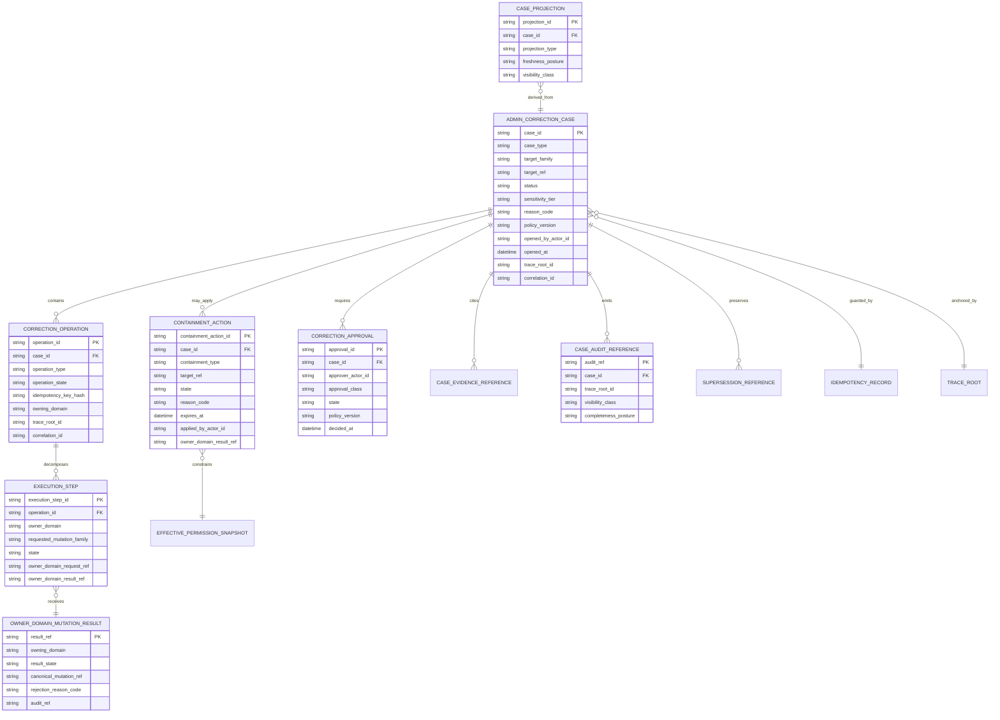

# FUZE Admin Access Correction and Containment API Specification

## Document Metadata

- **Document Name:** `ADMIN_ACCESS_CORRECTION_AND_CONTAINMENT_API_SPEC.md`
- **Document Type:** Production-grade API SPEC v2 interface-contract specification
- **Status:** Drafted for API SPEC v2 library inclusion
- **Version:** 2.0.0
- **Effective Date:** 2026-04-24
- **Last Updated:** 2026-04-24
- **Reviewed On:** 2026-04-24
- **Document Owner:** FUZE Platform Security and Access Remediation Architecture
- **Approval Authority:** FUZE Platform Architecture and Governance Authority; formal named approval record not yet attached
- **Review Cadence:** Quarterly or upon material change to privileged operator tooling, session security, recovery, workspace membership, scoped authorization, effective-permission evaluation, audit traceability, risk containment, API surface governance, event contracts, or migration posture
- **Governing Layer:** API SPEC v2 / admin-control and privileged-remediation interface contract layer
- **Parent Registry:** `API_SPEC_INDEX.md`
- **Upstream Semantic Registry:** `REFINED_SYSTEM_SPEC_INDEX.md`
- **Upstream API Registry:** `API_SPEC_INDEX.md`
- **Primary Audience:** API architecture, backend engineering, platform security, support/control-plane engineering, trust and safety, audit, governance, internal tool builders, OpenAPI/AsyncAPI authors, implementation-contract authors, QA, and production-readiness reviewers
- **Primary Purpose:** Define the FUZE API contract posture for privileged admin access correction and containment without allowing admin convenience, support tooling, or hidden service writes to become a super-admin bypass of canonical identity, session, workspace, membership, scoped authorization, effective-permission, entitlement, security, or audit semantics
- **Primary Upstream References:** `REFINED_SYSTEM_SPEC_INDEX.md`, `DOCS_SPEC_INDEX.md`, `SYSTEM_SPEC_INDEX.md`, `API_SPEC_INDEX.md`, `ADMIN_ACCESS_CORRECTION_AND_CONTAINMENT_SPEC.md`, `ACCESS_EVALUATION_AND_EFFECTIVE_PERMISSION_SPEC.md`, `AUDIT_AND_ACCESS_TRACEABILITY_SPEC.md`, `SECURITY_AND_RISK_CONTROL_SPEC.md`, `FUZE_ACCOUNT_ACCESS_AND_SESSION_CANONICAL_FINAL_SPEC.md`, `FUZE_ACCOUNT_ACCESS_AND_SESSION_THESIS_FINAL_SPEC.md`, `AUTH_SESSION_AND_LINKED_LOGIN_SPEC.md`, `FUZE_SESSION_LIFECYCLE_AND_SECURITY_SPEC.md`, `FUZE_ACCOUNT_RECOVERY_AND_CONFLICT_HANDLING_SPEC.md`, `WORKSPACE_AND_ORGANIZATION_SPEC.md`, `WORKSPACE_MEMBERSHIP_LIFECYCLE_SPEC.md`, `ROLE_PERMISSION_AND_ACCESS_CONTROL_SPEC.md`, `SCOPED_AUTHORIZATION_MODEL_SPEC.md`, `ENTITLEMENT_AND_CAPABILITY_GATING_SPEC.md`, `API_ARCHITECTURE_SPEC.md`, `PUBLIC_API_SPEC.md`, `INTERNAL_SERVICE_API_SPEC.md`, `EVENT_MODEL_AND_WEBHOOK_SPEC.md`, `IDEMPOTENCY_AND_VERSIONING_SPEC.md`, `MIGRATION_AND_BACKWARD_COMPATIBILITY_SPEC.md`
- **Primary Downstream Dependents:** control-plane implementation contracts, privileged support consoles, security incident tooling, admin workflow services, audit review tooling, internal service adapters, OpenAPI admin schemas, AsyncAPI event contracts, support runbooks, QA regression suites, monitoring and incident-response integrations
- **API Surface Families Covered:** internal admin/control-plane APIs, internal service APIs, first-party operator console APIs, event/async APIs, audit/query APIs, reporting-safe derived read APIs, implementation-facing service contracts
- **API Surface Families Excluded:** unrestricted public APIs, ordinary end-user self-service APIs, product-local moderation APIs that do not mutate canonical platform access state, raw database/storage APIs, chain-native APIs, payment or ledger correction APIs except where access containment constrains them
- **Canonical System Owner(s):** Admin Access Correction and Containment Domain, in coordination with Identity, Auth/Session, Workspace, Membership, Role/Permission, Scoped Authorization, Effective Permission, Security/Risk, Audit/Traceability, and Entitlement domains
- **Canonical API Owner:** FUZE Platform API Architecture / Interface Governance Domain with delegated admin-control ownership to FUZE Platform Security and Access Remediation Architecture
- **Supersedes:** Earlier support override, break-glass, emergency admin, access correction, and containment interface patterns to the extent they allowed hidden writes, unbounded operator power, missing reason codes, missing idempotency, missing audit lineage, or ambiguous ownership
- **Superseded By:** Not yet known
- **Related Decision Records:** Not yet known
- **Canonical Status Note:** Refined system specifications own semantic truth. This API specification owns interface-contract expression of privileged correction and containment truth. Downstream APIs, services, operator tools, events, dashboards, and SDKs MUST NOT reinterpret privileged correction as generic super-admin authority.
- **Implementation Status:** Normative API baseline; endpoint, schema, service, event, audit, and test contracts must be derived from this document before production operation
- **Approval Status:** Drafted for API SPEC v2 inclusion; formal approval record not yet attached
- **Change Summary:** Initial API SPEC v2 document for admin access correction and containment; introduces explicit surface-family posture, route/resource families, request/response/error/status/idempotency/audit/versioning rules, diagrams, flow views, acceptance criteria, and test cases.

---

## Purpose

This API specification defines how FUZE exposes privileged admin access correction and containment through safe, bounded, auditable API contracts.

The API domain exists because ordinary access flows cannot safely cover every state defect or trust emergency. FUZE sometimes needs privileged operator workflows to repair incorrect or unsafe access state, contain unsafe trust, supersede mistaken prior actions, restore valid control paths, or coordinate multi-domain remediation. Those workflows MUST NOT become generic super-admin shortcuts. They MUST remain case-based, reason-coded, policy-constrained, idempotent where sensitive mutation is possible, reconstructable through audit, and routed through owning-domain mutation boundaries.

This specification converts the refined admin correction and containment semantics into interface contracts for:

- control-plane case creation, triage, review, approval, execution, supersession, and closure
- containment activation, propagation, lifting, expiry, and follow-up
- owning-domain corrective mutation requests and outcomes
- privileged-session enforcement
- operator authorization and separation of duties
- idempotency, retry, replay, and concurrency safety
- audit, correlation, causality, traceability, and observability
- event and async workflow behavior
- admin read models and reporting-safe derived views
- OpenAPI, AsyncAPI, SDK, and implementation-contract derivation guardrails

The resulting API contract is intentionally narrower than the refined semantic domain and stronger than a raw endpoint listing. It specifies the allowed interface families and rules downstream implementations must preserve.

---

## Scope

This API specification governs:

1. Admin/control-plane APIs for privileged correction-case and containment-case lifecycle.
2. Internal service APIs used to coordinate owning-domain mutations for identity, session, workspace, membership, role, scoped grant, and effective-permission-related remediation.
3. Event and async APIs used to publish correction, containment, approval, execution, closure, and supersession outcomes.
4. Read-model APIs used by authorized support, security, audit, and governance reviewers.
5. Request, response, error, status, idempotency, audit, authorization, and migration requirements for privileged remediation contracts.
6. Boundaries preventing public, product-local, frontend-only, or hidden internal APIs from bypassing canonical access semantics.

This API specification does not own the underlying system semantics for identity, session, workspace, membership, role, scoped authorization, effective permission, entitlement, risk, or audit. It consumes those semantics and expresses them through interface contracts.

---

## Out of Scope

The following are out of scope:

- ordinary login, session issuance, auth callback, or linked-login mechanics
- ordinary workspace administration that does not require privileged remediation
- ordinary role assignment and revocation through standard scoped authorization routes
- full account recovery evidence policy
- full security incident response runbooks
- financial refund, ledger, credit, subscription, or payout correction semantics except where containment suppresses access or control-plane authority
- raw database schemas, queue implementation details, and storage engine behavior
- public-facing disclosure copy or user-message wording
- exact operator staffing, shift, escalation-roster, or legal review procedure
- product-local moderation workflows that do not claim canonical platform access mutation

---

## Design Goals

1. Express privileged correction and containment as bounded admin/control-plane API contracts.
2. Preserve upstream domain ownership during exceptional remediation.
3. Prevent hidden super-admin writes and product-local support overrides.
4. Make every sensitive privileged mutation reason-coded, case-linked, idempotent, and auditable.
5. Require stronger runtime posture for privileged operators than ordinary application users.
6. Enforce separation of duties where policy requires requester, reviewer, approver, and executor distinction.
7. Support rapid containment without silently converting containment into permanent correction.
8. Preserve explicit lineage for superseded mistakes, containment actions, corrective mutations, and later closure.
9. Support deterministic OpenAPI, AsyncAPI, SDK, implementation, QA, and monitoring derivation.
10. Fail closed when target identity, scope, authority, approval, idempotency, traceability, or policy prerequisites are missing or ambiguous.

---

## Non-Goals

This API specification does not:

- create a universal admin actor that can write any domain truth directly
- allow support tickets, screenshots, UI state, or stale dashboards to override canonical owner-domain truth
- let internal services use broad-write shortcuts to bypass domain APIs
- expose privileged correction or containment as public API surface
- make containment a substitute for final remediation
- allow destructive rewrite of history where supersession lineage is required
- allow derived read models to become correction or containment truth
- specify the exact database schema, queue implementation, or UI console design

---

## Core Principles

### 1. Privileged but Not Owner

Admin correction APIs MAY coordinate privileged remediation, but they MUST NOT become canonical owners of identity truth, session truth, workspace truth, membership truth, role/grant truth, entitlement truth, effective-permission truth, or audit truth.

### 2. Case-Based Mutation

Every privileged correction or containment mutation MUST attach to a durable case or approved sub-case. Uncase-linked privileged writes are forbidden.

### 3. Owning-Domain Execution

Corrective mutations MUST execute through the owning domain’s approved boundary. The admin correction layer may orchestrate and validate, but it MUST NOT directly overwrite upstream truth stores.

### 4. Containment Before Convenience

When continuing access is unsafe, APIs MUST support containment before full correction. Containment MUST be explicit, reason-coded, attributable, and reversible or reviewable under policy.

### 5. Fail-Closed Privilege

If privileged-session posture, operator authority, approvals, target resolution, policy version, idempotency, or audit traceability is missing or ambiguous, mutation MUST fail, hold, or route to review. It MUST NOT default to success.

### 6. Stronger Runtime Posture

Privileged correction and containment actions require stronger authentication/session posture than ordinary product actions. Recent authentication, privileged-session class, device/risk posture, and service-principal eligibility MUST be evaluated before sensitive execution.

### 7. No Self-Escalation

APIs MUST prevent operators from using correction workflows to grant themselves access, lift their own containment, approve their own privileged execution where separation is required, or bypass role boundaries.

### 8. Explicit Lineage

APIs MUST preserve prior wrong or unsafe state, later corrective action, containment, supersession, approval, reason, operator, policy, and trace lineage. Hidden destructive rewrite is forbidden.

### 9. Derived Views Are Subordinate

Admin dashboards, support queues, exports, search indexes, and audit summaries are derived views. They MAY guide operators but MUST NOT be mutation owners or evidence substitutes where canonical trace records are required.

### 10. Narrow Exposure

Privileged correction and containment APIs are not public platform APIs. External and first-party user-facing surfaces MAY show narrow status or appeal-related derived state only where a separate approved spec allows it.

---

## Canonical Definitions

- **Admin Access Correction:** A privileged, policy-bound API workflow that repairs incorrect, unsafe, incomplete, or non-recoverable access state while preserving upstream domain ownership and audit lineage.
- **Containment:** A privileged action or posture that suppresses unsafe trust, unsafe access continuation, or unsafe mutation capability pending remediation, review, expiry, or closure.
- **Correction Case:** Durable control-plane resource representing one privileged remediation flow or linked sequence of actions.
- **Containment Case:** Durable control-plane resource or sub-resource representing trust-limiting actions and their review posture.
- **Privileged Session:** Higher-trust runtime session class required for sensitive operator actions.
- **Corrective Mutation:** A case-linked owning-domain mutation that repairs identity linkage, session posture, membership state, role assignment, scoped grant, workspace owner/control path, or related access-relevant state.
- **Containment Action:** A case-linked trust-limiting action such as session invalidation, auth hold, role suppression, grant freeze, membership suspension, workspace restriction, mutation hold, or product capability suppression.
- **Case Outcome:** Final or interim result for a case, such as `corrected`, `contained_pending_review`, `denied`, `rejected_as_unauthorized`, `superseded`, or `closed_no_change`.
- **Operation Reference:** Stable API response identifier representing an accepted async execution request.
- **Supersession Reference:** Link from a corrective action to a prior mistaken, unsafe, or superseded action or state.
- **Reason Code:** Stable machine-readable explanation class required for privileged action.
- **Policy Version:** Stable version reference identifying the control policy used for authorization, approval, execution, containment, or denial.

---

## Truth Class Taxonomy

Downstream API contracts MUST preserve these truth classes:

1. **Semantic Truth:** Refined system specifications define what privileged correction and containment mean.
2. **API Contract Truth:** This document defines allowed route families, request/response/error semantics, surface boundaries, and implementation guardrails.
3. **Policy Truth:** Operator role policy, approval policy, separation-of-duties rules, containment thresholds, privileged-session posture, and reason-code requirements.
4. **Runtime Truth:** Current operator session, service-principal posture, operation state, queue state, execution state, lock state, and transient failure state.
5. **Canonical Identity Truth:** Durable account identity and continuity truth, owned outside this API domain.
6. **Session Truth:** Authentication/session validity, invalidation, privileged-session state, and trust reset posture, owned by auth/session domains.
7. **Workspace and Membership Truth:** Collaborative scope, owner/control path, membership lifecycle, and invitation truth, owned by workspace and membership domains.
8. **Authorization Truth:** Roles, permissions, scoped grants, structural authority, and final effective-permission outcomes, owned by authorization/evaluation domains.
9. **Correction / Containment Truth:** Case state, admission posture, approvals, execution lineage, containment posture, and privileged remediation outcomes, owned by this domain.
10. **Audit / Traceability Truth:** Durable evidence of actor, session, scope, target, policy, approval, mutation, outcome, and supersession lineage.
11. **Derived Read-Model Truth:** Queues, dashboards, support summaries, case lists, search indexes, and analytics derived from canonical records.
12. **Presentation Truth:** UI labels, operator guidance, user-facing status messages, and collapsed explanations that must remain subordinate to canonical and audit truth.
13. **Provider/Input Truth:** Tickets, external evidence, provider callbacks, screenshots, incident reports, and chain/provider signals before owner-domain validation.

---

## Architectural Position in the Spec Hierarchy

This API specification sits below the refined semantic registry and the refined admin correction system specification. It derives from, but does not replace, upstream refined system semantics.

### Upstream Semantic Owners

- `ADMIN_ACCESS_CORRECTION_AND_CONTAINMENT_SPEC.md` owns privileged correction and containment semantics.
- `ACCESS_EVALUATION_AND_EFFECTIVE_PERMISSION_SPEC.md` owns final access-evaluation and effective-permission semantics.
- `AUDIT_AND_ACCESS_TRACEABILITY_SPEC.md` owns durable access traceability and reconstruction semantics.
- `SECURITY_AND_RISK_CONTROL_SPEC.md` owns cross-domain risk, containment, challenge, review, and protective posture semantics.
- Identity, auth/session, workspace, membership, role/permission, scoped authorization, entitlement, and product domains own their respective canonical truths.

### API Governance Owners

- `API_ARCHITECTURE_SPEC.md` governs shared API surface-family posture and interface architecture.
- `PUBLIC_API_SPEC.md` constrains public exposure and prohibits broad privileged public control surfaces.
- `INTERNAL_SERVICE_API_SPEC.md` governs service-to-service contracts and prevents hidden broad-write shortcuts.
- `EVENT_MODEL_AND_WEBHOOK_SPEC.md` governs event/webhook derivation.
- `IDEMPOTENCY_AND_VERSIONING_SPEC.md` and `MIGRATION_AND_BACKWARD_COMPATIBILITY_SPEC.md` govern safe retry, replay, version, migration, and deprecation behavior.

### Downstream Layers

This specification governs, but does not replace:

- OpenAPI admin schemas
- internal service contracts
- AsyncAPI event contracts
- operator-console implementation contracts
- storage schemas
- workflow implementation details
- monitoring/alerting rules
- audit export schemas
- QA and contract test suites

---

## API Surface Families

### Covered Surface Families

| Surface Family | Status | Contract Posture |
| --- | --- | --- |
| Admin/control-plane API | Required | Primary surface for case lifecycle, containment, approval, execution, and closure. Requires privileged operator identity and stronger session posture. |
| First-party operator console API | Required | May use admin/control-plane API through narrow UI-specific adapters. Must not own mutation truth. |
| Internal service API | Required | Used for owning-domain mutation requests, case execution, evaluation refresh, audit linkage, and projection update. Must be least-privilege and operation-scoped. |
| Event / async API | Required | Publishes case and containment state changes after canonical commit or accepted operation state. Must distinguish accepted intent from final outcome. |
| Audit/query API | Required | Allows authorized reviewers to inspect canonical trace and derived summaries. Must enforce visibility classes. |
| Reporting-safe derived read API | Optional | May expose redacted or aggregate admin metrics. Must not become canonical truth. |

### Excluded Surface Families

| Surface Family | Status | Reason |
| --- | --- | --- |
| Unauthenticated public API | Forbidden | Privileged correction and containment are never unauthenticated external capabilities. |
| Broad external partner write API | Forbidden by default | External parties must not directly trigger privileged remediation. They may submit evidence through separate approved intake flows. |
| Ordinary user self-service API | Excluded | User recovery or appeals belong to account/session/recovery or support intake specs, not this privileged execution contract. |
| Product-local hidden API | Forbidden | Products must not create local support override or containment truth. |
| Raw data-store API | Forbidden | Direct database writes bypass owner-domain contracts and audit lineage. |
| Chain-native API | Excluded | Access correction is off-chain platform control. Chain-adjacent effects must be mediated by relevant chain/governance specs. |

---

## System / API Boundaries

### This API Owns

- correction-case resource family contracts
- containment-case and containment-action contracts
- privileged operation acceptance and execution contracts
- approval, review, reason-code, policy-version, and operator-attribution contract fields
- owning-domain remediation request envelopes
- case-linked idempotency and replay rules
- case, operation, containment, and trace status semantics
- event publication posture for privileged remediation outcomes

### This API Consumes

- canonical identity and account state
- operator session and privileged-session posture
- workspace and membership lifecycle state
- role/permission and scoped grant state
- effective-permission evaluation outcomes
- entitlement/capability gating outcomes where relevant
- security/risk containment policy
- audit traceability contracts

### This API Must Not Own

- canonical account identity
- auth method or session issuance
- workspace existence or owner lifecycle in full
- membership lifecycle semantics in full
- role catalog or permission namespace truth
- scoped grant binding truth
- final effective-permission truth
- commercial entitlement truth
- generic audit-log truth outside access-remediation lineage

---

## Adjacent API Boundaries

### Identity and Account APIs

Identity APIs own account identity, conflict posture, account lifecycle, and identity-sensitive recovery. Admin correction APIs may request identity remediation but MUST NOT directly merge, reassign, or rewrite identity truth.

### Auth / Session APIs

Auth/session APIs own session invalidation, privileged-session issuance, linked-login posture, and auth-path containment. Admin correction APIs may request or coordinate session containment only through approved auth/session boundaries.

### Workspace / Organization APIs

Workspace APIs own workspace existence, owner/control-path state, and structural scope lifecycle. Admin correction APIs may coordinate owner-safety correction but MUST preserve workspace-domain invariants.

### Membership APIs

Membership APIs own invitation, activation, suspension, removal, reinstatement, and correction semantics. Admin correction APIs may orchestrate mistaken membership correction through membership-domain mutation boundaries.

### Role / Permission / Scoped Authorization APIs

Authorization APIs own role catalogs, permission mappings, grant binding, grant revocation, and scope applicability. Admin correction APIs may request corrective grant revocation or replacement but MUST NOT define new grant semantics.

### Effective Permission APIs

Effective-permission APIs own final action-level outcomes. Admin correction APIs may impose containment or correction posture that changes later evaluation, but they do not compute final permission independently.

### Entitlement APIs

Entitlement APIs own product/capability eligibility. Admin access correction MUST NOT turn entitlement into authority, and MUST NOT bypass entitlement gates except through explicitly approved policy-bound remediation paths.

### Audit APIs

Audit and access traceability APIs own canonical evidence access, visibility class, completeness state, and reconstruction requirements. Admin correction APIs MUST emit or link the required trace records.

---

## Conflict Resolution Rules

When API inputs, derived views, operator claims, product state, or owning-domain data disagree, implementations MUST resolve conflicts in this order unless a higher-order approved policy explicitly overrides it:

1. Canonical identity continuity and recovery truth.
2. Valid privileged-session posture and operator identity.
3. Canonical workspace, organization, membership, role, grant, and scoped authorization truth.
4. Active containment, restriction, or security/risk posture.
5. Owning-domain invariants for requested corrective mutation.
6. Case admission, approval, separation-of-duties, and policy-version posture.
7. Canonical execution outcome returned by owning-domain APIs.
8. Canonical audit and traceability records.
9. Derived dashboards, case queues, product-local status, support ticket text, screenshots, or cached frontend state.

Additional normative rules:

- Containment MUST outrank stale ordinary grants and stale sessions.
- Owning-domain truth MUST outrank support-ticket text or operator notes.
- Ambiguous targets MUST route to denial, hold, containment, or review; they MUST NOT auto-correct.
- Product-local support override state MUST NOT override platform containment.
- Later correction MUST link to earlier wrong or unsafe state rather than silently erasing it.

---

## Default Decision Rules

When no narrower policy exists, the API layer MUST apply these defaults:

- Default to `403 forbidden` or `409 conflict` rather than privileged success if operator authority is incomplete.
- Default to `review_required` for identity-ambiguous, owner-sensitive, governance-sensitive, or broad-containment cases.
- Default to containment or hold when continuing trust is unsafe.
- Default to owning-domain routed mutation rather than direct cross-domain write.
- Default to same-account continuity and no hidden account merge or reassignment.
- Default to valid owner/control-path preservation for shared scopes.
- Default to requiring reason code, policy version, idempotency key, trace root, and correlation ID for sensitive mutation.
- Default to invalidating stale derived reads after correction or containment.
- Default to least-privilege internal service calls scoped to one case, one operation, and one target set.

---

## Roles / Actors / API Consumers

### Operator Actor Classes

- **Support Operator:** May initiate low-to-medium sensitivity correction cases and view redacted case summaries where authorized.
- **Risk Reviewer:** May initiate, review, approve, or lift security/risk containment within policy boundaries.
- **Platform Security Operator:** May execute high-impact containment and correction when policy, privileged session, and approval requirements are satisfied.
- **Workspace Access Administrator:** May participate in workspace or membership correction only through bounded admin workflows; ordinary workspace admin status is not enough for platform-level correction.
- **Governance-Aware Approver:** Required for governance-sensitive, treasury-sensitive, owner-control-sensitive, or broad platform control actions where policy requires elevated approval.
- **Internal Service Principal:** May execute operation-scoped owning-domain calls after authorization by the admin correction service. Must be least-privilege, auditable, and non-humanly attributable only through approved service lineage.
- **Audit Reviewer:** May inspect protected evidence under visibility controls. May not mutate cases unless separately authorized.

### Non-Operator Consumers

- **First-party admin console:** Consumes admin APIs but is not a source of truth.
- **Product services:** Consume containment and correction outcomes; may not write correction truth.
- **Effective-permission evaluator:** Consumes active containment state as higher-priority input.
- **Audit and reporting systems:** Consume canonical trace references and produce derived views.
- **Notification systems:** May consume case-status events for approved notifications; they do not own case truth.

---

## Resource / Entity Families

### Primary API Resources

- `AdminCorrectionCase`
- `ContainmentCase`
- `ContainmentAction`
- `CorrectionOperation`
- `CorrectionApproval`
- `CorrectionExecutionStep`
- `CorrectionTarget`
- `RemediationRequest`
- `SupersessionReference`
- `CaseEvidenceReference`
- `CaseAuditReference`
- `CasePolicyReference`
- `CaseProjection`

### Supporting Resource Families

- `OperatorSessionPosture`
- `EffectivePermissionSnapshot`
- `OwnerDomainMutationResult`
- `IdempotencyRecord`
- `TraceRoot`
- `CorrelationContext`
- `OperationStatus`
- `VisibilityClass`
- `ReasonCode`

### Entity Rules

- A correction case MAY contain multiple execution steps, but each step MUST bind to one owning-domain boundary and one explicit target family.
- A containment case MAY be created before final target correction, but MUST remain explicitly linked to follow-up review, expiry, lift, or closure.
- A correction operation MUST produce an operation reference when accepted asynchronously.
- A corrective mutation MUST contain target resolution metadata and owner-domain confirmation before execution finalization.

---

## Ownership Model

### Admin Correction API Owns

- interface contracts for privileged correction and containment cases
- API-visible case lifecycle state
- admin-control route families and surface restrictions
- operation acceptance, execution, and final status semantics
- reason-code, policy-version, approval, and audit-reference requirements
- event emission contract for case/containment state changes

### Owning Domains Own

- account identity changes
- auth/session invalidation and privileged-session posture
- workspace and organization structural truth
- membership lifecycle state
- role, permission, and scoped-grant truth
- effective-permission outcome computation
- entitlement eligibility truth
- audit evidence semantics

### Product Domains May

- submit product-local evidence to a case where authorized
- consume containment events and suppress product-local access
- display approved derived status messages

### Product Domains Must Not

- create local privileged correction state
- bypass active containment because product cache says access exists
- write identity, membership, role, grant, or session truth through product-local admin endpoints
- expose privileged correction mechanics through public APIs

---

## Authority / Decision Model

Admin correction APIs MUST evaluate authority at four levels:

1. **Caller Authentication:** The operator or service principal is authenticated and session/service posture is valid.
2. **Privileged Runtime Posture:** The caller has recent-auth, privileged session, device/risk, challenge, or service-principal posture required for the action class.
3. **Admin Authorization:** The caller has effective permission for the specific admin action, target scope, sensitivity, and case phase.
4. **Case Policy Authorization:** The case has required approvals, reason codes, evidence, policy version, separation-of-duties compliance, and owning-domain target resolution.

No single role, token, service key, or UI control MAY bypass the layered authority model.

---

## Authentication Model

### Human Operators

Human operator calls MUST require:

- canonical FUZE account identity
- valid session
- privileged-session posture for sensitive actions
- recent-auth or step-up challenge where policy requires
- device/risk posture where policy requires
- correlation ID and trace root generated server-side or gateway-side

### Service Principals

Service principals MUST require:

- registered service identity
- explicit scope-limited authority
- operation-scoped token or credential posture
- caller-service attribution
- case and operation reference
- mTLS, workload identity, or equivalent internal authentication posture as defined by implementation contracts

### Forbidden Authentication Patterns

- shared human admin accounts
- static broad super-admin API keys
- product-local bearer tokens that can execute platform correction
- unauthenticated webhook-style privileged mutation
- privilege inferred only from network location
- long-lived privileged sessions without policy-bounded renewal and audit

---

## Authorization / Scope / Permission Model

Admin correction APIs MUST use the platform effective-permission model and must not rely on role names alone.

Required authorization dimensions include:

- actor account or service principal
- operator role category
- action family
- target domain
- target scope
- sensitivity tier
- required approval class
- separation-of-duties status
- containment state
- policy version
- reason-code family
- allowed execution window

Representative permission families:

- `admin_access.case.create`
- `admin_access.case.triage`
- `admin_access.case.review`
- `admin_access.case.approve`
- `admin_access.case.execute`
- `admin_access.case.close`
- `admin_access.containment.apply`
- `admin_access.containment.lift`
- `admin_access.correction.request_identity`
- `admin_access.correction.request_session`
- `admin_access.correction.request_workspace`
- `admin_access.correction.request_membership`
- `admin_access.correction.request_grant`
- `admin_access.audit.read_protected`

Permissions MUST be evaluated in scope. Broad platform roles are not sufficient unless the action, target, and sensitivity tier are explicitly included.

---

## Entitlement / Capability-Gating Model

Admin correction APIs are not commercial product capabilities. However, they MAY affect product capabilities indirectly when containment suppresses access or when corrected membership/role state changes downstream eligibility.

Rules:

- Entitlement success MUST NOT override missing admin authorization.
- Admin correction MUST NOT grant commercial entitlement as a side effect unless the entitlement domain explicitly owns and validates that mutation.
- Product capability gating MUST consume containment outcomes where policy requires suppression.
- Operator access to admin tooling MAY be capability-gated internally, but capability gating is not a substitute for effective permission and privileged-session checks.

---

## API State Model

### Correction Case States

- `opened`
- `awaiting_triage`
- `awaiting_evidence`
- `awaiting_review`
- `awaiting_approval`
- `approved_for_execution`
- `execution_accepted`
- `executing`
- `partially_executed`
- `executed`
- `contained_pending_followup`
- `denied`
- `superseded`
- `closed_no_change`
- `closed_corrected`
- `closed_contained`
- `failed_requires_review`

### Containment States

- `none`
- `targeted_containment_active`
- `global_containment_active`
- `access_mutation_frozen`
- `session_trust_frozen`
- `product_capability_suppressed`
- `lift_requested`
- `lift_approved`
- `resolved_and_lifted`
- `expired_requires_review`

### Operation States

- `accepted`
- `queued`
- `executing`
- `succeeded`
- `succeeded_with_followup_required`
- `partially_succeeded`
- `failed_retryable`
- `failed_terminal`
- `rejected_by_owner_domain`
- `blocked_by_policy`
- `superseded`

### State Rules

- APIs MUST distinguish accepted async intent from final business outcome.
- `accepted` and `queued` are not proof of correction.
- `contained_pending_followup` is not permanent correction.
- `partially_executed` MUST expose which steps succeeded, failed, were blocked, or require remediation.
- Terminal states MUST include reason family, policy version, trace references, and timestamp.

---

## Lifecycle / Workflow Model

1. A case is opened with target hint, reason code, evidence references, requested action family, and correlation context.
2. The API normalizes target references and validates that the request is admissible for privileged correction or containment.
3. The API evaluates operator authentication, privileged-session posture, effective permission, and policy.
4. The case enters triage, evidence, review, approval, denial, containment, or execution path.
5. If immediate trust risk exists, the API may accept containment before full correction.
6. Execution plans are decomposed into owner-domain mutation requests.
7. Each owner-domain mutation is idempotent, operation-scoped, audited, and lineage-linked.
8. Events are emitted after canonical commit or accepted operation state according to event contract rules.
9. Derived read models and product consumers update from canonical events and traces.
10. The case closes only when required correction, containment, follow-up, denial, or supersession conditions are explicit.

---

## Architecture Diagram — Mermaid flowchart

```mermaid
flowchart TD
    subgraph Consumers[API Consumers]
        Console[First-Party Operator Console]
        Support[Support Operator]
        Risk[Risk/Security Operator]
        Auditor[Audit Reviewer]
        Product[Product Services]
    end

    subgraph Surfaces[API Surface Families]
        AdminAPI[Admin / Control-Plane API]
        InternalAPI[Internal Service API]
        EventAPI[Event / Async API]
        AuditAPI[Audit / Trace Query API]
        ReadAPI[Derived Admin Read API]
    end

    subgraph AdminDomain[Admin Correction and Containment Domain]
        CaseSvc[Correction Case Service]
        ContainSvc[Containment Service]
        ApprovalSvc[Approval and Policy Service]
        ExecSvc[Correction Execution Orchestrator]
        Idem[Idempotency Records]
        Ops[Operation Records]
    end

    subgraph OwnerDomains[Canonical Owner Domains]
        Identity[Identity / Account]
        Session[Auth / Session]
        Workspace[Workspace / Organization]
        Membership[Membership Lifecycle]
        Authz[Role / Permission / Scoped Authorization]
        Eval[Effective Permission]
        Entitlement[Entitlement / Capability]
        RiskDomain[Security / Risk]
    end

    subgraph Evidence[Evidence and Projection]
        Audit[Audit / Access Trace Store]
        Events[Event Bus]
        Projections[Derived Case and Access Projections]
        Monitor[Monitoring / Alerting]
    end

    Console --> AdminAPI
    Support --> AdminAPI
    Risk --> AdminAPI
    Auditor --> AuditAPI
    Product --> EventAPI
    Product --> ReadAPI

    AdminAPI --> CaseSvc
    AdminAPI --> ContainSvc
    AdminAPI --> ApprovalSvc
    CaseSvc --> Idem
    CaseSvc --> Ops
    CaseSvc --> ApprovalSvc
    ApprovalSvc --> Eval
    ApprovalSvc --> RiskDomain
    ContainSvc --> Session
    ContainSvc --> Authz
    ContainSvc --> Eval
    ExecSvc --> InternalAPI
    InternalAPI --> Identity
    InternalAPI --> Session
    InternalAPI --> Workspace
    InternalAPI --> Membership
    InternalAPI --> Authz
    InternalAPI --> Entitlement

    CaseSvc --> Audit
    ContainSvc --> Audit
    ExecSvc --> Audit
    OwnerDomains --> Audit
    CaseSvc --> Events
    ContainSvc --> Events
    ExecSvc --> Events
    Events --> Projections
    Events --> Product
    Events --> Monitor
    Projections --> ReadAPI
    Audit --> AuditAPI
```



---

## Data Design — Mermaid Diagram



The diagram distinguishes canonical correction/containment records from derived projections. `CASE_PROJECTION` is not a mutation owner. `OWNER_DOMAIN_MUTATION_RESULT` references canonical mutation owned by the relevant upstream domain.

---

## Flow View

### Standard Correction Flow

1. Operator submits `POST /admin/access-correction/cases` with target hint, reason code, requested remediation family, evidence references, and idempotency key.
2. API authenticates the operator, validates privileged-session posture, validates operator effective permission, and creates a trace root.
3. API validates case admissibility and normalizes target references without trusting client-supplied scope or product-local IDs as canonical.
4. Case is created in `opened` or `awaiting_triage` state.
5. API evaluates whether containment is required before correction.
6. Case moves through triage, review, evidence, and approval as required by policy.
7. Execution plan is decomposed into owning-domain mutation steps.
8. Execution orchestrator submits operation-scoped internal service requests.
9. Owning domains accept, reject, or execute canonical mutations.
10. Admin case service records step results, audit references, event emissions, and final status.
11. Derived projections and product consumers update after event propagation.
12. Case closes only after correction, denial, supersession, or containment follow-up posture is explicit.

### Emergency Containment Flow

1. Operator or risk system submits containment request with target, containment type, reason code, and risk policy reference.
2. API validates heightened privileged-session posture and emergency containment authority.
3. If continuing trust is unsafe, containment MAY be accepted before full correction evidence is complete.
4. Containment action is created and routed to auth/session, authorization, workspace, membership, product, or effective-permission owner domains as needed.
5. Affected sessions, grants, memberships, mutations, or product capabilities are suppressed according to owning-domain contracts.
6. Event `admin_access.containment.applied` is emitted after canonical commit or accepted operation.
7. Effective-permission evaluators and product consumers treat containment as higher priority than cached access.
8. Case remains `contained_pending_followup` until review, lift, expiry, correction, supersession, or closure is explicit.

### Failure / Retry Flow

1. API receives duplicate request with same idempotency key and same semantic payload.
2. API returns the existing case or operation reference and current status.
3. If payload differs under same idempotency key, API returns `409 idempotency_conflict`.
4. Retryable owner-domain failure leaves operation `failed_retryable` with next allowed retry posture.
5. Terminal owner-domain rejection leaves case in `failed_requires_review` or `denied` depending on policy.
6. Partial success leaves explicit step state and requires follow-up review or compensation.

### Admin Lift / Closure Flow

1. Authorized operator requests containment lift or case closure.
2. API validates privileged-session posture, separation-of-duties, policy requirements, and current case state.
3. Owning domains confirm whether containment can be lifted safely.
4. API emits lift/closure event and records supersession or residual follow-up requirements.
5. Derived views update; stale product access state remains invalid until fresh effective-permission evaluation succeeds.

---

## Data Flows — Mermaid sequenceDiagram

```mermaid
sequenceDiagram
    autonumber
    participant Op as Operator
    participant Admin as Admin Control API
    participant Auth as Auth/Session Service
    participant Eval as Effective Permission Service
    participant Case as Case Service
    participant Policy as Approval/Policy Service
    participant Exec as Execution Orchestrator
    participant Owner as Owning Domain API
    participant Audit as Audit/Trace Service
    participant Bus as Event Bus
    participant Product as Product Consumer

    Op->>Admin: POST /admin/access-correction/cases + Idempotency-Key
    Admin->>Auth: Validate session + privileged posture
    Auth-->>Admin: valid privileged session / policy posture
    Admin->>Eval: Evaluate admin action permission
    Eval-->>Admin: allow / deny / review_required
    Admin->>Audit: Create trace root + correlation context
    Audit-->>Admin: trace_root_id
    Admin->>Case: Create or fetch idempotent case
    Case-->>Admin: case_id, status=opened
    Admin->>Policy: Determine review/approval/containment requirements
    Policy-->>Admin: approval_required or emergency_containment_allowed

    alt Immediate containment required
        Admin->>Case: Record containment action pending execution
        Case->>Exec: Accept containment operation
        Exec->>Owner: Request session/grant/membership/workspace suppression
        Owner-->>Exec: accepted or committed containment
        Exec->>Audit: Record containment lineage and result
        Exec->>Bus: Publish admin_access.containment.applied
        Bus-->>Product: Consume containment and suppress cached access
        Admin-->>Op: 202 Accepted + operation_id + contained_pending_followup
    else Correction requires approval
        Admin-->>Op: 202 Accepted + case_id + awaiting_approval
    end

    Op->>Admin: POST /admin/access-correction/cases/{case_id}/execute
    Admin->>Auth: Revalidate privileged session
    Admin->>Eval: Re-evaluate execute permission
    Admin->>Policy: Validate approvals and separation of duties
    Policy-->>Admin: approved_for_execution
    Admin->>Exec: Execute operation-scoped remediation plan
    Exec->>Owner: Submit owning-domain corrective mutation
    Owner-->>Exec: canonical mutation result or rejection
    Exec->>Audit: Record execution step + owner result
    Exec->>Bus: Publish admin_access.correction.executed or failed
    Bus-->>Product: Update derived status; require fresh evaluation before access
    Admin-->>Op: 200/202 with case status, operation status, trace refs
```

---

## Request Model

### Common Required Headers

Sensitive mutation requests MUST include or receive server-side equivalents for:

- `Authorization`
- `X-FUZE-Correlation-Id`
- `Idempotency-Key` for mutation or operation acceptance requests
- `X-FUZE-Reason-Code` or body-level `reason_code`
- `X-FUZE-Policy-Version` where caller supplies a policy expectation; server remains authoritative
- `X-FUZE-Operator-Intent` for high-sensitivity admin actions where implementation contracts require explicit operator affirmation

### Common Request Fields

Mutation requests SHOULD support:

```json
{
  "case_type": "membership_correction | grant_correction | session_containment | workspace_owner_correction | identity_access_remediation | product_access_containment",
  "target": {
    "target_family": "account | session | workspace | membership | role_assignment | scoped_grant | product_capability",
    "target_ref": "server-resolvable-reference",
    "target_scope": {
      "scope_type": "workspace | organization | platform | product | operational",
      "scope_id": "string"
    }
  },
  "requested_action": "open_case | apply_containment | request_correction | approve | execute | lift_containment | close_case",
  "reason_code": "stable_machine_reason",
  "reason_detail": "operator-supplied detail subject to visibility controls",
  "evidence_refs": ["evidence_ref_1"],
  "requested_by_actor_id": "server-derived when human caller",
  "policy_context": {
    "policy_version": "string",
    "sensitivity_tier": "low | medium | high | critical",
    "emergency": false
  },
  "client_request_ref": "optional external client-safe reference"
}
```

### Request Rules

- Server-side identity and session context MUST override caller-supplied actor fields.
- Caller-supplied target scope is a hint until canonical owner-domain resolution succeeds.
- Sensitive mutation requests MUST include idempotency keys.
- Reason codes MUST be stable machine-readable values, not only free text.
- Evidence references MUST point to approved evidence objects, not raw arbitrary external URLs unless normalized by an evidence intake layer.
- The API MUST reject requests that attempt to combine unrelated corrective mutations in one opaque broad operation.

---

## Response Model

### Synchronous Success Response

Used only when the API can complete canonical work safely within the request.

```json
{
  "status": "succeeded",
  "case_id": "case_123",
  "operation_id": "op_123",
  "case_status": "closed_corrected",
  "result": {
    "outcome": "corrected",
    "owner_domain_results": [
      {
        "owning_domain": "membership",
        "result_state": "succeeded",
        "canonical_mutation_ref": "membership_mut_456"
      }
    ]
  },
  "audit": {
    "trace_root_id": "trace_123",
    "correlation_id": "corr_123",
    "audit_refs": ["audit_123"]
  },
  "policy": {
    "policy_version": "admin-access-correction-2026-04-24",
    "reason_code": "mistaken_membership_removal"
  }
}
```

### Accepted Async Response

Used for containment, multi-step correction, approvals, or owner-domain async execution.

```json
{
  "status": "accepted",
  "case_id": "case_123",
  "operation_id": "op_123",
  "case_status": "execution_accepted",
  "operation_status": "queued",
  "accepted_state_note": "Accepted for execution; final correction outcome is not yet complete.",
  "status_url": "/admin/access-correction/operations/op_123",
  "audit": {
    "trace_root_id": "trace_123",
    "correlation_id": "corr_123"
  }
}
```

### Denial / Review Response

```json
{
  "status": "rejected",
  "error": {
    "code": "review_required",
    "message": "The requested privileged action requires additional review.",
    "reason_family": "separation_of_duties_required",
    "retryable": false
  },
  "case_id": "case_123",
  "audit": {
    "trace_root_id": "trace_123",
    "correlation_id": "corr_123"
  }
}
```

### Response Rules

- Responses MUST include case and operation references for accepted or completed mutations.
- Responses MUST expose accepted-state vs final outcome clearly.
- Public-safe messages MAY collapse reason detail, but protected audit detail MUST remain internally reconstructable.
- Sensitive internal reason codes MUST be visibility-controlled and not leaked to unauthorized consumers.

---

## Error / Result / Status Model

### Error Classes

| HTTP Status | Code | Meaning |
| --- | --- | --- |
| 400 | `invalid_request` | Request shape invalid or required fields missing. |
| 401 | `unauthenticated` | Caller has no valid authenticated posture. |
| 403 | `forbidden` | Caller lacks required effective permission, privileged session, or service authority. |
| 403 | `privileged_session_required` | Action requires stronger runtime posture. |
| 403 | `separation_of_duties_violation` | Caller cannot approve or execute this action due to role in the case. |
| 404 | `target_not_found` | Canonical target cannot be resolved or is not visible to caller. |
| 409 | `case_state_conflict` | Requested transition is illegal for current case state. |
| 409 | `idempotency_conflict` | Same idempotency key used with materially different payload. |
| 409 | `owner_domain_invariant_violation` | Owning domain rejected mutation due to canonical invariant. |
| 412 | `policy_precondition_failed` | Required approval, evidence, reason code, or policy prerequisite missing. |
| 422 | `target_ambiguous` | Target cannot be safely resolved to one canonical object. |
| 423 | `contained_or_frozen` | Target or caller is under containment or mutation freeze. |
| 429 | `rate_limited` | Rate or abuse-control threshold exceeded. |
| 500 | `internal_error` | Unexpected server failure. |
| 503 | `owner_domain_unavailable` | Required owner-domain service unavailable; mutation not finalized. |

### Result Families

- `corrected`
- `contained_pending_review`
- `contained_pending_followup`
- `denied`
- `review_required`
- `superseded`
- `closed_no_change`
- `partial_success_requires_review`
- `owner_domain_rejected`
- `failed_retryable`
- `failed_terminal`

### Status Rules

- `202 Accepted` MUST NOT be represented as final correction success.
- `200 OK` for reads is not proof that a derived view is fresh enough for sensitive mutation.
- `409` conflicts SHOULD preserve enough detail for remediation without leaking protected information.
- `423 contained_or_frozen` MUST suppress mutation even if ordinary permission exists.

---

## Idempotency / Retry / Replay Model

### Idempotency Requirements

Idempotency keys are mandatory for:

- case creation when the request may be retried
- containment application
- containment lift
- correction execution
- approval submission
- closure and supersession operations
- owning-domain mutation requests

Idempotency scope MUST include:

- caller or service principal
- target family and target reference after normalization where possible
- case ID when known
- operation family
- semantic payload hash
- policy version or equivalent control context

### Retry Rules

- Duplicate request with same key and same semantic payload MUST return the original case/operation result or current status.
- Same key with different semantic payload MUST return `409 idempotency_conflict`.
- Retryable owner-domain failure MUST preserve operation state and retry eligibility.
- Retried containment MUST NOT duplicate containment effects.
- Retried correction MUST NOT create duplicate grant revocations, duplicate membership reinstatements, duplicate owner transfers, or duplicate session invalidations.

### Replay Safety

- Idempotency records for critical operations MUST outlive client retry windows and operational replay windows.
- Privileged operation replay after session downgrade, policy change, or containment of the operator MUST revalidate authority unless policy explicitly permits continuation of already accepted work.
- Async workers MUST validate operation state before executing retry or resume.

---

## Rate Limit / Abuse-Control Model

Admin correction APIs MUST enforce rate and abuse controls appropriate to privileged mutation.

Required controls include:

- per-operator and per-service-principal rate limits
- per-target case creation throttles
- per-target containment change throttles
- emergency action anomaly detection
- broad-impact containment approval thresholds
- privileged-session challenge frequency controls
- owner-domain mutation burst controls
- automated alerting for high-risk patterns

Rate limiting MUST NOT silently skip audit. Denied, throttled, or suspicious attempts SHOULD produce trace records where security policy requires.

---

## Endpoint / Route Family Model

This specification defines route families, not exhaustive raw endpoints. Concrete OpenAPI must derive from these families.

### Case Lifecycle Routes

- `POST /admin/access-correction/cases`
- `GET /admin/access-correction/cases/{case_id}`
- `GET /admin/access-correction/cases`
- `PATCH /admin/access-correction/cases/{case_id}`
- `POST /admin/access-correction/cases/{case_id}/triage`
- `POST /admin/access-correction/cases/{case_id}/close`
- `POST /admin/access-correction/cases/{case_id}/supersede`

Rules:

- Creation requires reason code, target hint, evidence reference or emergency justification, and idempotency key.
- Patch MUST be constrained to allowed state transitions and metadata updates. It MUST NOT become generic case rewriting.
- Closure requires final outcome, trace references, and follow-up posture.

### Approval / Review Routes

- `POST /admin/access-correction/cases/{case_id}/reviews`
- `POST /admin/access-correction/cases/{case_id}/approvals`
- `GET /admin/access-correction/cases/{case_id}/approvals`

Rules:

- Approval APIs MUST enforce separation of duties.
- Approval cannot be inferred from comments or ticket state.
- Approval responses MUST include approval state, approver identity, policy version, visibility class, and audit reference.

### Containment Routes

- `POST /admin/access-correction/cases/{case_id}/containment-actions`
- `GET /admin/access-correction/containment-actions/{containment_action_id}`
- `POST /admin/access-correction/containment-actions/{containment_action_id}/lift`
- `POST /admin/access-correction/containment-actions/{containment_action_id}/extend`

Rules:

- Apply, lift, and extend are distinct operations.
- Containment MUST be target-scoped and reason-coded.
- Lifting containment MUST not restore stale permissions without fresh effective-permission evaluation.

### Execution Routes

- `POST /admin/access-correction/cases/{case_id}/operations`
- `GET /admin/access-correction/operations/{operation_id}`
- `POST /admin/access-correction/operations/{operation_id}/retry`
- `POST /admin/access-correction/operations/{operation_id}/cancel`

Rules:

- Operation acceptance MUST identify accepted-state semantics.
- Execution plans MUST decompose into owner-domain steps.
- Retry and cancel MUST validate current operation state and policy.

### Evidence / Trace Routes

- `POST /admin/access-correction/cases/{case_id}/evidence-references`
- `GET /admin/access-correction/cases/{case_id}/audit-references`
- `GET /admin/access-correction/cases/{case_id}/timeline`

Rules:

- Evidence references do not become canonical target truth.
- Audit timelines MUST distinguish operator notes, evidence, approvals, containment, owner-domain mutations, events, and derived projections.

### Internal Owner-Domain Request Routes

Concrete paths may vary by service, but route families MUST support:

- `POST /internal/admin-access-correction/{domain}/mutation-requests`
- `GET /internal/admin-access-correction/owner-domain-results/{result_ref}`

Rules:

- These routes are internal only.
- They MUST require service identity, case reference, operation reference, reason code, policy version, trace root, correlation ID, and idempotency key.
- They MUST NOT expose broad generic writes.

---

## Public API Considerations

Privileged admin correction and containment mutation routes MUST NOT be public APIs.

Permitted public-adjacent surfaces, only when separately specified, may include:

- narrow user-facing status that a support or security review is in progress
- appeal or evidence intake routes that do not execute privileged mutation
- public-safe notification of account/session restriction or workspace access change

Public APIs MUST NOT expose:

- admin case internals
- operator identities beyond approved disclosure
- protected reason codes
- risk signals or policy thresholds
- privileged execution plans
- target scope details beyond the user’s authorized visibility
- raw audit trace detail

---

## First-Party Application API Considerations

First-party operator consoles MAY consume admin/control APIs through UI adapters, but the UI MUST NOT become source of truth.

Rules:

- UI actions MUST map to explicit API operations.
- Buttons, forms, or dashboards MUST NOT imply authority without server-side evaluation.
- Derived case projections MUST show freshness and visibility class where relevant.
- Sensitive actions SHOULD require explicit operator affirmation and step-up posture.
- UI caches MUST invalidate after containment, correction, approval, denial, or case closure events.

---

## Internal Service API Considerations

Internal service APIs are required for owning-domain execution but MUST remain narrow.

Rules:

- Use least-privilege service principals.
- Bind every call to case ID, operation ID, trace root, reason code, policy version, and idempotency key.
- Owner-domain services MUST validate invariants independently.
- Internal services MUST reject mutation requests that lack approved remediation context.
- Internal APIs MUST not expose generic `update_any_access_state` style endpoints.
- Service-to-service retries MUST be idempotent and state-aware.

---

## Admin / Control-Plane API Considerations

Admin/control-plane APIs are the primary mutation surface.

Rules:

- Access is restricted to authorized operators and services.
- Every mutation requires privileged-session or approved service-principal posture.
- Critical actions require separation-of-duties and approval.
- Broad containment and owner-sensitive correction require higher sensitivity tier and elevated review.
- Operator notes are not canonical truth.
- Manual overrides must be structured, reason-coded, and lineage-linked.

---

## Event / Webhook / Async API Considerations

### Event Families

Representative internal events:

- `admin_access.case.opened`
- `admin_access.case.triaged`
- `admin_access.case.approval_requested`
- `admin_access.case.approved`
- `admin_access.case.denied`
- `admin_access.correction.execution_accepted`
- `admin_access.correction.executed`
- `admin_access.correction.failed`
- `admin_access.containment.applied`
- `admin_access.containment.lifted`
- `admin_access.case.superseded`
- `admin_access.case.closed`

### Event Rules

- Events MUST distinguish accepted operation state from final outcome.
- Events MUST include case ID, operation ID where applicable, trace root, correlation ID, reason family, policy version, target family, visibility class, and occurred-at timestamp.
- Events MUST NOT include protected sensitive evidence detail unless the event topic is explicitly protected.
- Events MUST be emitted only after canonical commit or explicit accepted operation state.
- Product consumers MUST treat containment events as invalidation triggers for derived access state.

### Webhook Posture

External webhooks for privileged correction are forbidden by default. If a future approved spec permits partner notification, it MUST expose only public-safe status and must not allow partner-initiated privileged mutation.

---

## Chain-Adjacent API Considerations

Admin access correction and containment are off-chain platform control functions.

Rules:

- These APIs MUST NOT directly write chain-native state.
- If containment affects chain-adjacent governance, treasury, payout, registry, or contract-operation access, it MUST route through the relevant governance/chain-adjacent API domain.
- Chain observations, wallet claims, or provider inputs are evidence until normalized by the owning domain.
- Chain-adjacent public registries MUST NOT expose privileged internal correction detail unless a public-trust spec explicitly approves a derived disclosure.

---

## Data Model / Storage Support Implications

Storage implementations must support:

- durable case records
- durable operation records
- idempotency records
- containment action records
- approval/review records
- execution step records
- owner-domain result references
- evidence references
- audit references
- supersession references
- visibility classes
- projection freshness metadata

Storage MUST preserve history and lineage. Hard deletes or destructive rewrites of case, approval, containment, or execution history are forbidden except under separately governed retention/deletion policies that preserve required audit obligations.

---

## Read Model / Projection / Reporting Rules

Read models MAY support:

- operator queues
- case timelines
- containment dashboards
- unresolved follow-up lists
- audit review views
- security incident summaries
- aggregate operational metrics

Read-model rules:

- Derived projections MUST identify freshness posture.
- Derived projections MUST not serve as canonical mutation sources.
- Stale projections MUST not authorize sensitive execution.
- Redacted views MUST not imply that hidden protected detail does not exist.
- Exports MUST preserve enough references to canonical case and trace records to support reconstruction by authorized reviewers.

---

## Security / Risk / Privacy Controls

Required controls:

- privileged-session enforcement for sensitive actions
- step-up or recent-auth requirements
- device/risk posture checks where required
- least-privilege operator permissions
- separation-of-duties enforcement
- protected visibility classes for sensitive evidence and reason detail
- prevention of self-escalation and self-approval
- anomaly detection for repeated, broad, or high-risk correction attempts
- containment of suspicious operator sessions
- redaction of sensitive reason details from unauthorized views
- privacy-bounded evidence references and user data access

Security controls MUST be evaluated at request time and again at execution time for async operations where policy requires revalidation.

---

## Audit / Traceability / Observability Requirements

Every privileged correction or containment mutation MUST produce or link to canonical access trace records.

Minimum trace fields:

- trace root ID
- correlation ID
- case ID
- operation ID where applicable
- actor account or service principal
- privileged-session posture or service-auth posture
- target family and canonical target reference
- scope reference
- requested action
- reason code
- policy version
- approval references
- owner-domain request and result references
- outcome and status
- timestamps
- visibility class
- idempotency reference
- supersession references where applicable

Observability requirements:

- metrics for case creation, approval latency, containment latency, execution latency, owner-domain rejection, retry, partial failure, and stale projection detection
- alerts for broad containment, repeated denied admin attempts, separation-of-duties violations, missing trace data, and unusual operator behavior
- logs must be structured and correlated but must not leak protected evidence detail into generic logs

If required traceability cannot be produced for a high-impact action, the API MUST fail, hold, degrade, or route to review rather than silently complete.

---

## Failure Handling / Edge Cases

### Target Ambiguity

If target resolution cannot identify exactly one canonical target, mutation MUST not proceed. The case may remain in review with evidence request.

### Partial Owner-Domain Success

If multi-step execution partially succeeds, the API MUST expose step-level state, preserve trace lineage, and route to follow-up review or compensation. It MUST NOT report overall `corrected` until all required steps have valid final outcomes.

### Owner-Domain Rejection

If an owning domain rejects a corrective mutation due to invariant violation, the admin correction API MUST preserve the rejection reason family and route to review, denial, or alternate approved remediation. It MUST NOT bypass the owner domain.

### Stale Operator Authority

If an operator loses authority after operation acceptance but before execution, execution MUST revalidate or hold according to policy. Critical actions SHOULD fail closed unless explicitly approved to continue.

### Containment Lift Race

If containment lift races with new risk signals, active risk/containment posture wins. Lift request MUST return conflict or review-required.

### Duplicate Correction

Duplicate correction attempts MUST resolve through idempotency or case conflict rules. The API MUST prevent duplicate owner transfers, duplicate grant changes, duplicate session invalidations, and duplicate membership reinstatements.

### Degraded Dependencies

If auth/session, effective-permission, audit, or owner-domain services are unavailable, sensitive mutation MUST fail closed or enter accepted-but-not-executed hold state. The API MUST not claim final success.

---

## Migration / Versioning / Compatibility / Deprecation Rules

- API versions MUST preserve semantic distinction between case state, containment state, operation state, and owner-domain mutation result.
- Deprecated route families MUST continue to prevent broad hidden writes during coexistence.
- Migration from legacy support override tools MUST produce explicit case records or migration lineage for sensitive historical actions where required.
- Field removals that weaken auditability, idempotency, reason codes, policy references, or traceability are breaking changes.
- New reason codes MUST be versioned and documented.
- New containment types MUST include owner-domain propagation and effective-permission implications before production exposure.
- Older clients MUST not be allowed to execute sensitive actions that lack newly required policy or trace fields after enforcement cutover.

---

## OpenAPI / AsyncAPI / SDK Derivation Rules

### OpenAPI Rules

OpenAPI artifacts MUST:

- mark admin/control routes as internal/admin-only
- require auth, idempotency, reason-code, correlation, and policy fields where applicable
- distinguish `200`, `202`, `403`, `409`, `412`, `422`, `423`, `429`, `503` outcomes
- model operation references explicitly
- avoid generic object mutation endpoints
- include visibility-controlled schemas for protected fields

### AsyncAPI Rules

AsyncAPI artifacts MUST:

- distinguish accepted-state events from final-outcome events
- include event version, case ID, operation ID, trace root, correlation ID, reason family, and visibility class
- avoid embedding protected evidence details in broad topics
- specify ordering, replay, deduplication, and idempotent consumer expectations

### SDK Rules

SDKs MUST:

- be internal-only unless separately approved
- surface accepted-vs-final semantics clearly
- require idempotency keys for mutation helpers
- avoid convenience methods that hide reason codes or audit fields
- prevent public or product-facing SDKs from exposing privileged mutation calls

---

## Implementation-Contract Guardrails

Implementation contracts MUST preserve:

- case-linked mutation
- owner-domain execution boundaries
- privileged-session enforcement
- reason codes
- policy versions
- separation of duties
- idempotency keys
- operation references
- trace roots and correlation IDs
- event semantics
- derived-read subordination
- accepted-state vs final outcome distinction
- containment precedence over stale access
- no self-escalation
- no hidden broad writes

Implementation contracts MUST NOT:

- use direct database writes for correction
- use product-local override tables as canonical truth
- collapse approval comments into approval state
- treat service principal authority as unlimited
- skip audit for emergency actions
- retry non-idempotent owner-domain mutations
- expose protected reason detail through public APIs

---

## Downstream Execution Staging

1. Define canonical reason-code and sensitivity-tier catalog.
2. Define OpenAPI route schemas for case, containment, approval, execution, evidence, and trace routes.
3. Define internal owner-domain mutation envelopes and service principal scopes.
4. Define AsyncAPI event schemas and protected-topic policy.
5. Implement idempotency records and operation state machine.
6. Implement privileged-session and effective-permission enforcement.
7. Implement audit trace emission before production mutation enablement.
8. Migrate legacy support tools into case-linked workflows.
9. Deploy derived projections and dashboards as read-only consumers.
10. Add contract tests, replay tests, failure tests, and production-readiness gates.

---

## Required Downstream Specs / Contract Layers

- Admin correction OpenAPI schema
- Admin containment OpenAPI schema
- Internal owner-domain remediation envelope spec
- Admin correction event/AsyncAPI schema
- Reason-code catalog
- Privileged-session policy contract
- Operator role and permission contract
- Case storage schema
- Audit trace envelope schema
- Derived projection schema
- QA contract test plan
- Monitoring/alerting contract
- Legacy support-tool migration plan

---

## Boundary Violation Detection / Non-Canonical API Patterns

Forbidden patterns include:

1. `POST /admin/superuser/write-anything`
2. Product-local `support_override=true` that bypasses platform containment.
3. Direct database update of membership, role, grant, identity, or session state outside owner-domain APIs.
4. Operator approval implied by a ticket comment.
5. Reusing one idempotency key for different targets or operation families.
6. Containment lifted automatically by stale UI refresh.
7. Public API endpoint that exposes or executes privileged correction.
8. Service principal with broad unscoped mutation authority.
9. Corrective history overwritten rather than superseded.
10. Async operation returning `success` before owning-domain commit.
11. Dashboard projection used as final evidence when canonical trace is missing.
12. Operator self-grants or self-approval through correction flow.
13. Suppressing audit because an action is urgent.
14. Entitlement success treated as access correction authority.
15. Chain/provider input treated as canonical access truth before normalization.

Detection should include contract tests, runtime policy checks, static route review, audit completeness scans, and anomaly alerts.

---

## Canonical Examples / Anti-Examples

### Canonical Example 1 — Mistaken Membership Removal

A support operator opens a case for mistaken workspace membership removal. The API validates privileged session, access permission, reason code, evidence reference, owner-safety constraints, and required approvals. Membership reinstatement executes through the membership domain. The case records supersession lineage to the mistaken removal and emits correction events. This is canonical.

### Canonical Example 2 — Emergency Session Containment

A risk operator detects compromised access and applies targeted session containment before full review completes. Auth/session domain invalidates the target sessions. Effective-permission evaluators consume containment posture. Product caches are invalidated. The case remains contained pending follow-up. This is canonical.

### Canonical Example 3 — Wrong-Scope Grant Correction

A scoped grant was attached to the wrong workspace. Admin correction opens a case, validates target ambiguity, routes revocation and replacement through scoped authorization APIs, preserves supersession lineage, and does not directly rewrite grant tables. This is canonical.

### Anti-Example 1 — Support Console Direct Write

A support console directly updates a member role in a database because the operator is trusted. This is forbidden.

### Anti-Example 2 — Containment Ignored by Product Cache

A product continues to allow access because its cached permission badge still says `admin` after platform containment is active. This is forbidden.

### Anti-Example 3 — Public Emergency Override

A public endpoint allows external callers to request immediate containment lift with a ticket number. This is forbidden.

### Anti-Example 4 — Hidden Account Merge

An operator silently merges or reassigns account identity while resolving an access case without identity-domain approval and lineage. This is forbidden.

---

## Acceptance Criteria

1. Admin correction mutation endpoints reject unauthenticated callers with `401`.
2. Admin correction mutation endpoints reject callers without privileged-session posture using `403 privileged_session_required`.
3. Sensitive mutation endpoints require an idempotency key and reject missing keys.
4. Reusing an idempotency key with different semantic payload returns `409 idempotency_conflict`.
5. Case creation persists case ID, reason code, target family, trace root, correlation ID, policy version, and opened-by actor.
6. Containment application cannot proceed without reason code, target resolution, authority, and trace root.
7. Containment events invalidate derived access state and are consumed as higher priority than cached grants.
8. Correction execution routes owner-domain mutations through internal owner-domain APIs, not direct writes.
9. Owner-domain invariant rejection results in review, denial, or failed state; it does not trigger bypass mutation.
10. Approval-required cases cannot execute until required approvals are recorded and separation-of-duties is satisfied.
11. Operators cannot approve or execute prohibited self-affecting or self-escalating cases.
12. `202 Accepted` responses include operation ID and explicitly state that final correction is not complete.
13. Partial execution exposes step-level result state and does not return final `corrected` outcome.
14. Audit trace records link actor, session/service principal, scope, target, reason code, policy version, approval, operation, owner-domain result, and outcome.
15. Protected reason details are not exposed through unauthorized read APIs.
16. Derived read-model APIs expose freshness posture or equivalent safe-use metadata.
17. Public APIs cannot execute privileged correction, containment, approval, or lift.
18. Service-principal calls require case ID, operation ID, trace root, correlation ID, reason code, policy version, and idempotency key.
19. Containment lift triggers fresh effective-permission evaluation before product access resumes.
20. Migration from legacy tools prevents legacy broad-write paths after cutover.
21. Events distinguish accepted operation from final correction or final containment lift.
22. Monitoring alerts fire for broad containment, repeated denied attempts, missing audit references, and separation-of-duties violations.

---

## Test Cases

### Positive Path Tests

1. **Create Low-Sensitivity Correction Case:** Authorized support operator with privileged session creates a membership correction case and receives `201` or `202` with case ID, trace root, and status `opened`.
2. **Apply Emergency Containment:** Authorized risk operator applies targeted session containment and receives `202` with operation ID; session service invalidates target sessions; event is emitted.
3. **Execute Approved Grant Correction:** Approved case routes revocation to scoped authorization domain and returns owner-domain mutation reference.
4. **Lift Resolved Containment:** Authorized reviewer lifts containment after policy checks; effective-permission cache invalidates and access requires fresh evaluation.
5. **Read Protected Audit Timeline:** Authorized audit reviewer retrieves case timeline with protected fields allowed by visibility class.

### Negative Authorization Tests

6. **Missing Privileged Session:** Ordinary authenticated operator attempts containment and receives `403 privileged_session_required`.
7. **Insufficient Permission:** Operator with support view rights but no execution rights attempts correction execution and receives `403 forbidden`.
8. **Self-Approval Blocked:** Requester attempts to approve their own high-impact case and receives `403 separation_of_duties_violation`.
9. **Unauthorized Protected Read:** Operator without audit visibility attempts protected evidence read and receives redacted response or `403`.

### Idempotency / Retry / Replay Tests

10. **Duplicate Case Create Same Payload:** Same idempotency key and payload returns original case reference.
11. **Duplicate Case Create Different Payload:** Same idempotency key with changed target returns `409 idempotency_conflict`.
12. **Retry Owner-Domain Timeout:** Retryable timeout preserves operation state and eventually succeeds without duplicate mutation.
13. **Replay After Operator Containment:** Accepted operation revalidates or holds when operator authority is contained before execution.

### Conflict / Edge Tests

14. **Ambiguous Target:** Target hint resolves to multiple memberships; API returns `422 target_ambiguous` and case remains review/evidence state.
15. **Owner-Domain Invariant Violation:** Workspace owner correction would strand workspace; owning domain rejects and case becomes `failed_requires_review`.
16. **Partial Execution:** Session containment succeeds but grant correction fails; operation is `partially_succeeded` and case requires review.
17. **Containment Lift Race:** New security risk signal arrives during lift; lift returns `409` or `review_required` and containment remains active.

### Rate Limit / Abuse Tests

18. **Repeated Broad Containment Attempts:** System throttles or blocks repeated broad containment attempts and emits security alert.
19. **Case Spam Against Same Target:** Per-target throttling prevents excessive case creation and preserves trace record.

### Audit / Observability Tests

20. **Missing Trace Root Block:** High-impact correction cannot create trace root; API fails or holds and does not execute mutation.
21. **Event Correlation:** Case execution event includes case ID, operation ID, trace root, correlation ID, reason family, and policy version.
22. **Derived Projection Freshness:** Stale dashboard projection cannot be used to authorize execution.

### Migration / Compatibility Tests

23. **Legacy Direct Write Disabled:** Legacy support override endpoint cannot mutate membership after migration cutover.
24. **Old Client Missing Reason Code:** Old client mutation request missing reason code is rejected after enforcement date.
25. **Event Version Compatibility:** Consumer receives old and new event versions without confusing accepted state with final outcome.

### Boundary Violation Tests

26. **Product-Local Override Ignored:** Product local override does not bypass platform containment.
27. **Public API Mutation Attempt:** Public route attempting containment returns not found or forbidden and emits security trace where policy requires.
28. **Service Principal Broad Write Attempt:** Internal service principal attempts unscoped mutation and receives `403`.

---

## Dependencies / Cross-Spec Links

This API specification depends on:

- `REFINED_SYSTEM_SPEC_INDEX.md`
- `DOCS_SPEC_INDEX.md`
- `SYSTEM_SPEC_INDEX.md`
- `API_SPEC_INDEX.md`
- `ADMIN_ACCESS_CORRECTION_AND_CONTAINMENT_SPEC.md`
- `ACCESS_EVALUATION_AND_EFFECTIVE_PERMISSION_SPEC.md`
- `AUDIT_AND_ACCESS_TRACEABILITY_SPEC.md`
- `SECURITY_AND_RISK_CONTROL_SPEC.md`
- `IDENTITY_AND_ACCOUNT_SPEC.md`
- `AUTH_SESSION_AND_LINKED_LOGIN_SPEC.md`
- `FUZE_ACCOUNT_ACCESS_AND_SESSION_THESIS_FINAL_SPEC.md`
- `FUZE_ACCOUNT_ACCESS_AND_SESSION_CANONICAL_FINAL_SPEC.md`
- `FUZE_SESSION_LIFECYCLE_AND_SECURITY_SPEC.md`
- `FUZE_ACCOUNT_RECOVERY_AND_CONFLICT_HANDLING_SPEC.md`
- `WORKSPACE_AND_ORGANIZATION_SPEC.md`
- `WORKSPACE_MEMBERSHIP_LIFECYCLE_SPEC.md`
- `ROLE_PERMISSION_AND_ACCESS_CONTROL_SPEC.md`
- `SCOPED_AUTHORIZATION_MODEL_SPEC.md`
- `ENTITLEMENT_AND_CAPABILITY_GATING_SPEC.md`
- `API_ARCHITECTURE_SPEC.md`
- `PUBLIC_API_SPEC.md`
- `INTERNAL_SERVICE_API_SPEC.md`
- `EVENT_MODEL_AND_WEBHOOK_SPEC.md`
- `IDEMPOTENCY_AND_VERSIONING_SPEC.md`
- `MIGRATION_AND_BACKWARD_COMPATIBILITY_SPEC.md`

This API specification informs:

- `AUDIT_AND_ACCESS_TRACEABILITY_API_SPEC.md`
- `ENTITLEMENT_AND_CAPABILITY_GATING_API_SPEC.md`
- support/control-plane implementation contracts
- security incident workflows
- internal operator runbooks
- access analytics and anomaly detection
- OpenAPI / AsyncAPI / SDK derivation

---

## Explicitly Deferred Items

- Exact route names and schema field names for production OpenAPI files.
- Exact reason-code catalog and sensitivity-tier catalog.
- Exact privileged-session implementation details.
- Exact service-principal authentication mechanism.
- Exact storage schema and retention schedule.
- Exact operator console UI design.
- Exact staffing, escalation, and approval roster.
- Exact public/user notification wording.
- Exact legacy support-tool migration inventory.
- Exact audit export formats for compliance review.

---

## Final Normative Summary

Admin access correction and containment APIs are privileged, bounded, case-based control-plane interfaces. They exist to repair or contain unsafe access state when ordinary flows are insufficient, but they do not create generic super-admin authority.

Every sensitive privileged action MUST be authenticated, authorized, privileged-session checked, reason-coded, policy-versioned, case-linked, idempotent, auditable, and routed through owner-domain boundaries. Containment MUST outrank stale sessions, stale grants, cached product access, and operator convenience. Correction MUST preserve explicit lineage and MUST NOT silently rewrite history. Derived projections, dashboards, tickets, screenshots, and product-local state MUST remain subordinate to canonical owner-domain truth and access traceability.

Downstream OpenAPI, AsyncAPI, SDK, service, storage, workflow, audit, and QA contracts MUST preserve these API contract rules.

---

## Quality Gate Checklist

- [x] Upstream refined semantic owners are explicit.
- [x] Canonical API owner is explicit.
- [x] API surface families are explicit.
- [x] Mutation boundaries are explicit.
- [x] Read boundaries are explicit.
- [x] Adjacent API boundaries are explicit.
- [x] Truth classes are explicit.
- [x] Conflict-resolution rules are explicit.
- [x] Default decision rules are explicit.
- [x] Public, first-party, internal, admin/control, event/webhook, reporting, and chain-adjacent distinctions are explicit.
- [x] Non-canonical API patterns are called out.
- [x] Operator/admin override paths are bounded, reason-coded, policy-constrained, and audited.
- [x] Read-model, cache, reporting, and projection rules are explicit.
- [x] Chain-adjacent responsibilities are explicit.
- [x] Accepted-state vs final success semantics are explicit.
- [x] Idempotency and replay requirements are explicit.
- [x] Request, response, error, result, and status classes are explicit.
- [x] Failure and degraded-mode behavior is explicit.
- [x] Audit, traceability, and observability requirements are explicit.
- [x] Versioning, migration, compatibility, and deprecation rules are explicit.
- [x] OpenAPI / AsyncAPI / SDK guardrails are explicit.
- [x] Dependencies and downstream impacts are explicit.
- [x] Non-goals and deferred items are explicit.
- [x] Architecture Diagram uses Mermaid `flowchart` syntax.
- [x] Architecture Diagram clarifies consumers, surfaces, owner domains, services, data stores, event systems, async execution, and downstream consumers.
- [x] Data Design diagram uses Mermaid syntax.
- [x] Data Design distinguishes canonical data from derived projection data.
- [x] Flow View includes synchronous, asynchronous, failure, retry, audit, admin/operator, and finalization paths.
- [x] Data Flows use Mermaid `sequenceDiagram` syntax.
- [x] Sequence diagram distinguishes accepted-state response from final outcome.
- [x] Acceptance Criteria are concrete and testable.
- [x] Test Cases cover positive, negative, authorization, entitlement-adjacent, idempotency, retry, conflict, rate-limit, degraded-mode, audit, migration, and boundary-violation behavior.
