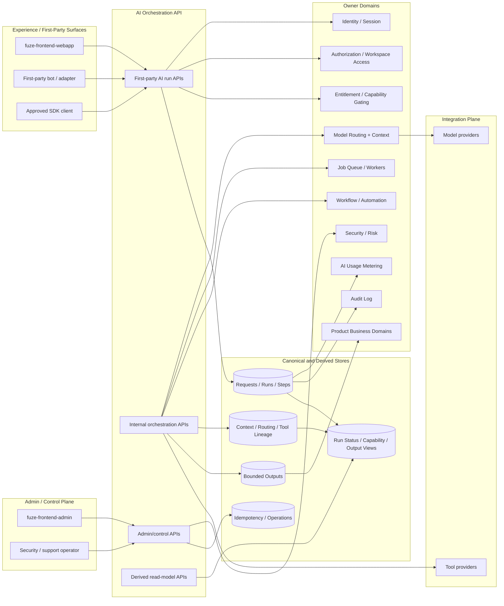
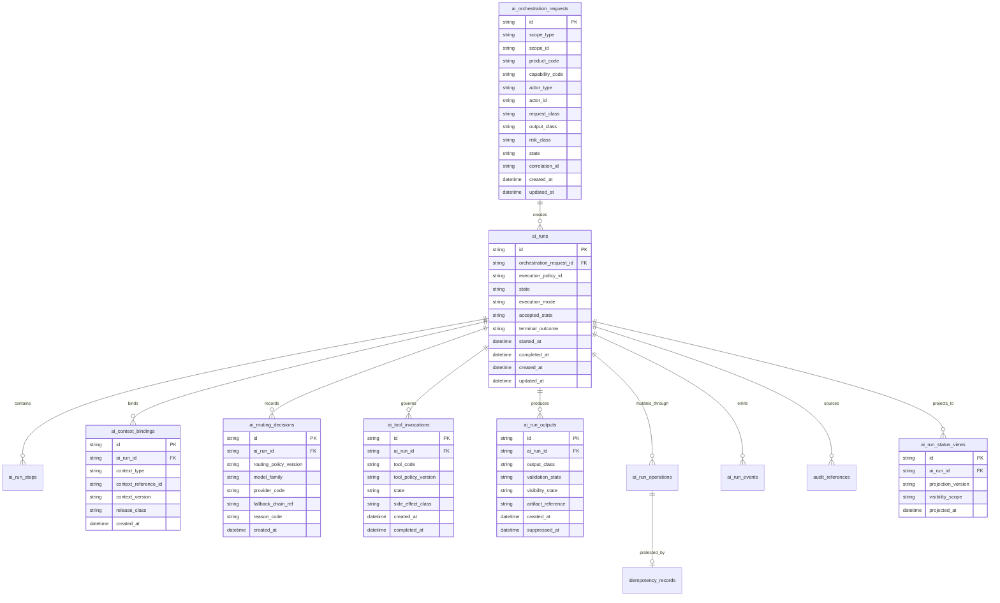
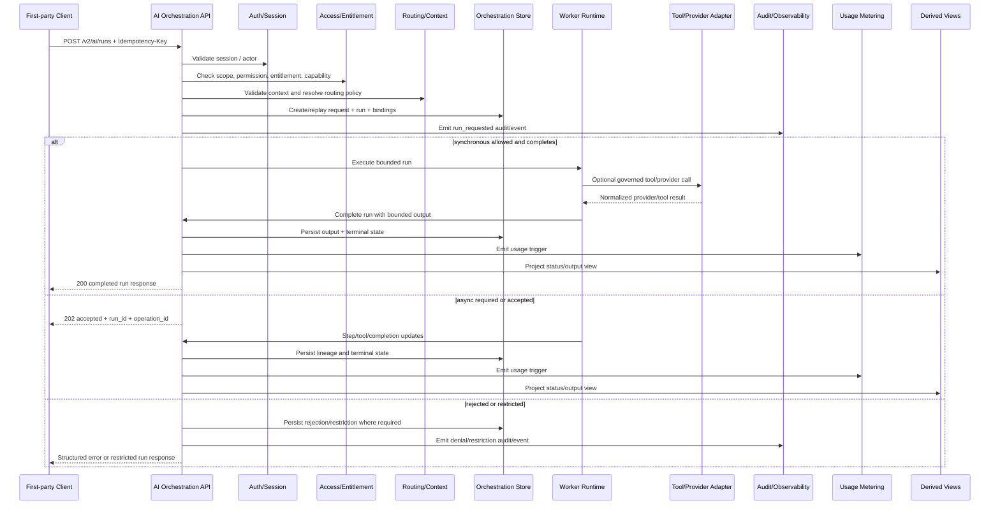

# AI_ORCHESTRATION_API_SPEC.md

## Document Metadata

- **Document Name:** `AI_ORCHESTRATION_API_SPEC.md`
- **Document Type:** FUZE API SPEC v2 / Production-grade interface-contract specification
- **Status:** Draft refined API specification pending approval
- **Version:** 2.0.0
- **Effective Date:** 2026-04-24
- **Last Updated:** 2026-04-24
- **Reviewed On:** 2026-04-24
- **Document Owner:** FUZE AI Orchestration Domain; named individual owner not yet specified
- **Approval Authority:** FUZE Platform Architecture and Governance Authority; explicit approval record not yet attached
- **Review Cadence:** Quarterly and whenever orchestration lifecycle semantics, AI execution modes, routing/context posture, tool-governance posture, async execution behavior, cost/usage linkage, safety controls, or API surface families materially change
- **Governing Layer:** API contract layer derived from the shared platform AI orchestration refined system specification
- **Parent Registry:** `API_SPEC_INDEX.md` and FUZE API SPEC v2 Canonical File Registry
- **Upstream Semantic Registry:** `REFINED_SYSTEM_SPEC_INDEX.md`
- **Upstream API Registry:** `API_SPEC_INDEX.md`
- **Primary Audience:** Backend engineering, AI engineering, product engineering, frontend engineering, workflow/runtime engineering, platform architecture, security, audit, operations, support/control-plane operators, SDK/OpenAPI/AsyncAPI authors, QA and contract-validation teams
- **Primary Purpose:** Define the production-grade API contract for FUZE AI orchestration surfaces, run lifecycle, request normalization, policy/context binding, bounded outputs, internal execution handoff, admin remediation, event emission, idempotency, auditability, observability, and downstream implementation guardrails
- **Primary Upstream References:** `AI_ORCHESTRATION_SPEC.md`, `MODEL_ROUTING_AND_CONTEXT_SPEC.md`, `AI_USAGE_METERING_SPEC.md`, `WORKFLOW_AND_AUTOMATION_SPEC.md`, `JOB_QUEUE_AND_WORKER_SPEC.md`, `FEATURE_FLAG_AND_ROLLOUT_CONTROL_SPEC.md`, `API_ARCHITECTURE_SPEC.md`, `PUBLIC_API_SPEC.md`, `INTERNAL_SERVICE_API_SPEC.md`, `EVENT_MODEL_AND_WEBHOOK_SPEC.md`, `IDEMPOTENCY_AND_VERSIONING_SPEC.md`, `MIGRATION_AND_BACKWARD_COMPATIBILITY_SPEC.md`, `AUDIT_LOG_AND_ACTIVITY_SPEC.md`, `SECURITY_AND_RISK_CONTROL_SPEC.md`, `MONITORING_ALERTING_AND_INCIDENT_RESPONSE_SPEC.md`, `SECRETS_CONFIG_AND_ENVIRONMENT_SPEC.md`, `FUZE_ACCOUNT_ACCESS_AND_SESSION_CANONICAL_FINAL_SPEC.md`, `FUZE_WORKSPACE_ACCESS_CONTROL_BASICS_THESIS_FINAL_SPEC.md`
- **Primary Downstream Dependents:** `MODEL_ROUTING_AND_CONTEXT_API_SPEC.md`, `AI_USAGE_METERING_API_SPEC.md`, `WORKFLOW_AND_AUTOMATION_API_SPEC.md`, `JOB_QUEUE_AND_WORKER_API_SPEC.md`, `FEATURE_FLAG_AND_ROLLOUT_CONTROL_API_SPEC.md`, product-specific AI integration contracts, OpenAPI definitions, AsyncAPI event catalogs, SDK contracts, internal worker contracts, admin/control-plane contracts
- **API Surface Families Covered:** First-party authenticated application APIs, internal service APIs, admin/control-plane APIs, event/async APIs, reporting/read-model APIs with bounded exposure
- **API Surface Families Excluded:** General public unauthenticated AI execution APIs, third-party outbound AI run webhooks by default, raw provider APIs, direct tool-provider APIs, model-provider SDK contracts, product-local prompt templates, database schema migrations, runbooks
- **Canonical System Owner(s):** FUZE AI Orchestration Domain
- **Canonical API Owner:** FUZE AI Orchestration API Domain
- **Supersedes:** Existing v1 `AI_ORCHESTRATION_API_SPEC.md` where it is weaker, less explicit, or inconsistent with refined API SPEC v2 structure; ad hoc direct model-provider or product-local AI runner endpoints
- **Superseded By:** None currently defined
- **Related Decision Records:** Not explicitly attached in retrieved source material
- **Canonical Status Note:** Refined system specs own semantic truth. This API spec owns interface-contract expression of that truth and MUST NOT redefine orchestration semantics, model-routing semantics, usage-metering truth, workflow truth, queue truth, authorization truth, entitlement truth, audit truth, or product business truth.
- **Implementation Status:** Contract-ready draft for architecture, backend, frontend, internal-service, worker, admin, OpenAPI, AsyncAPI, SDK, and QA implementation planning
- **Approval Status:** Pending formal FUZE approval workflow
- **Change Summary:** Upgrades the prior AI orchestration API material into API SPEC v2 form; adds explicit truth classes, surface families, route families, state models, request/response/error/idempotency rules, diagrams, flow views, event rules, admin controls, boundary-violation detection, acceptance criteria, and production-readiness test cases.

## Purpose

This document defines the FUZE API contract for AI orchestration.

The AI Orchestration API is the governed interface by which FUZE products, first-party clients, internal services, workers, and operators create, read, advance, cancel, restrict, retry, complete, and observe AI orchestration runs.

The API exists because AI execution in FUZE is a shared platform capability, not product-local helper code. The API MUST preserve platform-governed request intake, policy binding, context release, model-routing lineage, tool-use lineage, async execution, bounded outputs, auditability, metering linkage, and explicit separation between AI output and canonical business truth.

## Scope

This API spec governs:

- first-party creation and read surfaces for AI runs
- visible AI capability discovery for authenticated users and approved first-party clients
- internal service creation, step advancement, tool-lineage recording, and run finalization
- admin/control-plane run restriction, cancellation, retry, remediation, suppression, and discrepancy handling
- event and async interface expectations for orchestration lifecycle changes
- request, response, error, state, idempotency, retry, replay, audit, and observability rules
- read-model, projection, reporting, and presentation boundaries for orchestration state
- OpenAPI, AsyncAPI, SDK, and implementation-contract derivation guardrails

## Out of Scope

This API spec does not govern:

- full model-routing policy matrices, which belong to `MODEL_ROUTING_AND_CONTEXT_API_SPEC.md`
- full context-pack retrieval implementation, which belongs to model-routing/context, search, data-handling, and storage contracts
- raw model-provider schemas or SDK usage
- prompt templates for each product flow
- AI usage metering formulas or commercial treatment, which belong to `AI_USAGE_METERING_API_SPEC.md`
- billing, credits, subscriptions, pricing, refunds, payout, treasury, or governance truth
- general workflow truth or queue substrate truth
- product-specific durable business-object mutation semantics
- external third-party AI-run webhooks by default
- database DDL, runbook procedures, provider secret storage, or incident-command playbooks

## Design Goals

1. Provide a single governed API contract for AI execution across FUZE.
2. Preserve backend-owned orchestration truth and prevent product-local AI stacks from drifting.
3. Make request normalization, policy binding, context release, model/tool lineage, and output state explicit.
4. Support synchronous, streaming, hybrid, and async AI execution without hidden background behavior.
5. Distinguish accepted AI execution intent from final business outcomes.
6. Ensure idempotent, retry-safe, auditable mutation-like API behavior.
7. Provide stable interface families for first-party clients, internal services, admin/control-plane tools, events, and derived reads.
8. Support downstream OpenAPI, AsyncAPI, SDK, worker, and QA contracts without allowing those artifacts to reinterpret orchestration semantics.

## Non-Goals

- Make AI output canonical business truth.
- Allow frontend, bot, dashboard, or product services to call model providers directly for production behavior outside orchestration.
- Collapse orchestration into model routing, usage metering, workflow, job queue, observability, or runtime-control ownership.
- Expose raw prompts, provider responses, secrets, hidden risk labels, or operator-only internals through user-facing APIs.
- Define a generic unbounded autonomous-agent platform.
- Allow admin convenience to become ordinary broad-write access.

## Core Principles

### 1. Refined-Semantics Preservation

The API MUST preserve `AI_ORCHESTRATION_SPEC.md` semantics. API convenience, SDK shape, frontend UX, worker implementation, provider behavior, or admin tooling MUST NOT redefine those semantics.

### 2. Backend-Owned Orchestration Truth

Canonical orchestration requests, runs, steps, routing lineage, tool-use lineage, output state, restriction state, retry lineage, and remediation actions are backend-owned orchestration truth.

### 3. Business-Truth Separation

Run completion means the AI orchestration run reached terminal state. It does not mean any product, workflow, finance, access, governance, or user-trust business truth was committed unless the owning domain separately validates and commits it.

### 4. Context and Tool Least Privilege

Context release and tool access MUST be explicit, scope-bound, policy-bound, and recorded. Tools are never globally available merely because a model could invoke them.

### 5. Async Explicitness

Long-running AI work MUST be represented with canonical run, step, job, and event lineage. Hidden background model calls, detached worker loops, and untracked retries are forbidden.

### 6. Idempotent Mutation Discipline

Run creation, cancellation, restriction, retry, step advancement, tool-invocation reporting, completion, suppression, and discrepancy resolution MUST be idempotent and replay-safe.

### 7. Control-Plane Boundedness

Operator/admin actions MUST be separated from ordinary application APIs, reason-coded, policy-constrained, audited, and lineage-preserving.

### 8. Public Exposure Minimization

No unauthenticated general AI execution surface is approved by this spec. Public or external exposure MUST be narrower than internal orchestration truth and MUST be separately approved.

## Canonical Definitions

- **AI Orchestration Request:** A normalized API-created request for governed AI execution with actor, scope, product/service, capability, context, execution policy, and idempotency binding.
- **AI Run:** Canonical lifecycle resource representing one governed AI execution attempt or bounded sequence.
- **AI Run Step:** Canonical step-level execution lineage within a run.
- **Execution Policy:** Versioned policy bundle controlling model families, execution mode, context classes, tools, retry behavior, safety posture, output constraints, and control rules.
- **Context Binding:** A durable reference to approved context released into a run.
- **Routing Decision:** A recorded model/provider/fallback selection decision returned by governed routing/context logic and consumed by orchestration.
- **Tool Invocation Lineage:** A recorded request, authorization, execution, and outcome trail for tool usage within a run.
- **Bounded Output:** Stored AI output with output class, validation state, visibility policy, and publication constraints.
- **Action Proposal:** AI-produced structured suggestion requiring owning-domain validation before effect.
- **Accepted State:** API acknowledgement that work has been accepted or queued; not final business success.
- **Terminal Run State:** A final orchestration state such as `completed`, `failed`, `cancelled`, `restricted`, or `timed_out`.

## Truth Class Taxonomy

The API MUST preserve these truth classes:

1. **Semantic truth:** Owned by refined AI orchestration system specs.
2. **API contract truth:** Owned by this API spec and derived machine-readable API contracts.
3. **Policy truth:** Owned by execution-policy, routing/context, safety, feature-flag, entitlement, and control-plane domains.
4. **Runtime truth:** Current execution state, streaming state, attempts, retries, worker posture, and provider availability.
5. **Ledger / storage truth:** Durable orchestration requests, runs, steps, bindings, outputs, idempotency records, operation records, and audit linkage.
6. **Provider-input truth:** Raw or normalized model/provider responses before orchestration validation and downstream owner-domain validation.
7. **Event / async execution truth:** Emitted orchestration lifecycle events, job references, queue attempts, and async continuation records.
8. **Projection / reporting truth:** Dashboards, status views, analytics views, operational summaries, and run lists.
9. **Presentation truth:** UI-rendered AI output, summaries, explanations, markdown blocks, and frontend streaming display.

Derived, provider-input, projection, and presentation truth MUST NOT become canonical mutation truth.

## Architectural Position in the Spec Hierarchy

This API spec sits below the refined semantic registry and AI orchestration refined system spec. It is the interface-contract expression of those semantics.

It coordinates with:

- `MODEL_ROUTING_AND_CONTEXT_API_SPEC.md` for routing and context resolution API contracts
- `AI_USAGE_METERING_API_SPEC.md` for usage measurement and commercial accounting API contracts
- `WORKFLOW_AND_AUTOMATION_API_SPEC.md` for workflow-state and automation progression contracts
- `JOB_QUEUE_AND_WORKER_API_SPEC.md` for queue/worker execution substrate contracts
- `FEATURE_FLAG_AND_ROLLOUT_CONTROL_API_SPEC.md` for rollout, disablement, and kill-switch posture
- `INTERNAL_SERVICE_API_SPEC.md` for service-to-service trust and internal surface discipline
- `EVENT_MODEL_AND_WEBHOOK_SPEC.md` for event envelope, delivery, and webhook posture
- `AUDIT_LOG_AND_ACTIVITY_API_SPEC.md` for immutable audit surfaces
- `SECURITY_AND_RISK_CONTROL_API_SPEC.md` for sensitive execution controls

## Upstream Semantic Owners

The upstream semantic owner is the FUZE AI Orchestration Domain. Adjacent semantic owners retain authority over their own truth classes:

- Model routing/context: routing decision and context release semantics
- AI usage metering: normalized usage-accounting truth
- Workflow and automation: workflow-state and automation-progression truth
- Job queue and worker: deferred execution substrate truth
- Authorization/access: permission and effective access truth
- Entitlement/capability gating: eligibility truth
- Audit: immutable audit truth
- Security/risk: risk posture and security-control truth
- Product domains: product business truth

## API Surface Families

### First-Party Authenticated Application APIs

Used by FUZE first-party clients and approved surface adapters to create AI runs, read visible run status, read bounded outputs, cancel allowed runs, and discover visible AI capabilities.

### Internal Service APIs

Used by trusted internal services, workflow services, workers, and product services to create product-owned runs, advance steps, report tool results, complete runs, and retrieve canonical run state.

### Admin / Control-Plane APIs

Used by privileged admin/control-plane tooling to restrict, cancel, retry, reroute, suppress, remediate, or resolve discrepancies under policy.

### Event / Async APIs

Used for orchestration lifecycle events, async worker continuation, workflow notification, usage metering triggers, audit sourcing, observability, and operational alerting.

### Reporting / Read-Model APIs

Used for bounded read-only run summaries, capability views, output views, operational posture, and analytics-safe summaries. These APIs are derived and MUST NOT mutate canonical orchestration state.

## System / API Boundaries

The AI Orchestration API is an application-plane API that coordinates with execution-plane workers, integration-plane providers/tools, control-plane interventions, and reporting-plane projections.

- The experience/edge layer MAY initiate and render allowed runs.
- The application plane owns canonical request/run acceptance and state semantics.
- The execution plane MAY execute deferred steps but MUST NOT redefine run meaning.
- The integration plane MAY call providers/tools after governed authorization but MUST NOT own orchestration semantics.
- The control plane MAY intervene under policy but MUST NOT become ordinary run owner.
- The reporting plane MAY project run summaries but MUST NOT become canonical run truth.

## Adjacent API Boundaries

- `MODEL_ROUTING_AND_CONTEXT_API_SPEC.md` owns route/context decision APIs; this API consumes decision IDs and context-binding references.
- `AI_USAGE_METERING_API_SPEC.md` owns usage/cost accounting APIs; this API emits metering-relevant lineage.
- `WORKFLOW_AND_AUTOMATION_API_SPEC.md` owns workflow progression APIs; this API emits or returns AI results for workflow consumption without owning workflow truth.
- `JOB_QUEUE_AND_WORKER_API_SPEC.md` owns queue mechanics; this API owns orchestration run meaning.
- `FEATURE_FLAG_AND_ROLLOUT_CONTROL_API_SPEC.md` owns rollout/disablement controls; this API enforces resulting posture.
- `AUDIT_LOG_AND_ACTIVITY_API_SPEC.md` owns immutable audit entries; this API sources audit events.
- `SECURITY_AND_RISK_CONTROL_API_SPEC.md` owns risk policy; this API enforces relevant AI execution restrictions.

## Conflict Resolution Rules

1. `REFINED_SYSTEM_SPEC_INDEX.md` and constitutional platform specs win over narrower API interpretations.
2. `AI_ORCHESTRATION_SPEC.md` wins on orchestration semantics.
3. This API spec wins on AI orchestration interface-contract expression.
4. Adjacent refined specs win on their owned semantics: routing/context, metering, workflow, queue, rollout, audit, authorization, entitlement, security, and product business truth.
5. Existing v1 API material is historical and MUST NOT override active refined semantics.
6. Provider responses, AI outputs, UI labels, reports, and SDK convenience methods never override canonical orchestration or owner-domain truth.
7. If ambiguity remains, choose the narrower, safer, lineage-preserving interpretation and require explicit follow-up refinement.

## Default Decision Rules

- Missing identity, session, service identity, scope, or entitlement defaults to denial, downgrade, or review, never privilege expansion.
- Missing execution policy defaults to rejection.
- Missing context authorization defaults to context exclusion or denial.
- Unknown tool family defaults to denial.
- AI output defaults to advisory/proposed, not committed.
- Async acceptance defaults to `202 Accepted` with operation/run references, not final success.
- Admin retry/remediation defaults to new lineage or linked attempt, not overwrite.
- Derived views default to non-canonical projection status.
- Public exposure defaults to no exposure unless explicitly approved.

## Roles / Actors / API Consumers

- Authenticated user
- Workspace member
- Workspace owner/admin
- First-party frontend client
- First-party bot or messaging adapter
- Product domain service
- Workflow/automation service
- Worker runtime
- Routing/context service
- Tool execution service
- Usage metering service
- Audit service
- Monitoring/observability service
- Support/operator
- Security/control-plane operator
- SDK client generated from approved OpenAPI contracts

## Resource / Entity Families

Canonical API-facing resources:

- `aiCapability`
- `aiOrchestrationRequest`
- `aiRun`
- `aiRunStep`
- `aiContextBinding`
- `aiRoutingDecision`
- `aiToolInvocation`
- `aiRunOutput`
- `aiRunOperation`
- `aiRunRestriction`
- `aiRunRetry`
- `aiOutputSuppression`
- `aiRunDiscrepancy`
- `aiRunEvent`
- `aiRunStatusView`
- `aiCapabilityView`
- `aiOutputView`

## Ownership Model

The AI Orchestration API owns mutations to orchestration requests, runs, steps, context-binding references as used by runs, routing-decision lineage as used by runs, tool-invocation lineage as used by runs, bounded outputs, orchestration operation records, and control-plane actions against runs.

It does not own:

- account identity
- session truth
- workspace membership or permissions
- entitlement truth
- routing policy source of truth
- usage metering truth
- workflow truth
- queue substrate truth
- product business truth
- provider secrets
- public trust/reporting truth

## Authority / Decision Model

### Ordinary Application Authority

Authenticated callers may create, read, or cancel only allowed runs within authorized scopes and capabilities.

### Service Authority

Internal service callers may create and advance runs only under explicit service identity, least-privilege scopes, execution policy, and owner-domain authorization.

### Worker Authority

Workers may advance steps, report tool outcomes, and complete runs only through internal APIs with execution authority and idempotency controls.

### Admin / Operator Authority

Operators may restrict, suppress, retry, remediate, or resolve discrepancies only through admin APIs requiring privileged identity, policy allowance, reason codes, and audit records.

### Product Authority

Products may request AI capabilities and validate or commit product-domain consequences, but they do not own platform orchestration semantics.

## Authentication Model

- First-party application APIs require valid authenticated session unless a specific public-safe capability is separately approved.
- Internal APIs require service-to-service identity.
- Admin/control-plane APIs require privileged operator identity and stronger session/security posture.
- Event consumers require registered consumer identity and replay-safe subscription configuration.
- SDK-authored calls MUST preserve the same authentication requirements as the underlying API route family.

## Authorization / Scope / Permission Model

Every mutating or sensitive read route MUST evaluate:

- canonical account identity or service identity
- session validity where human actor is present
- target workspace/account/product scope
- effective permission in that scope
- route family authorization
- requested AI capability
- execution policy eligibility
- context-class eligibility
- tool-family eligibility where relevant
- run visibility for reads
- operator privilege and reason code for admin actions

Run output visibility MUST be same-scope or narrower than run initiation visibility.

## Entitlement / Capability-Gating Model

AI orchestration initiation MUST consult entitlement/capability gating when capability class, execution mode, model family, tool access, cost tier, volume, workspace tier, or product subscription materially affects eligibility.

Lack of entitlement MUST produce one of:

- `AI_ENTITLEMENT_REQUIRED`
- `AI_CAPABILITY_NOT_ALLOWED`
- `AI_EXECUTION_MODE_NOT_ALLOWED`
- downgraded execution mode where policy allows
- safe alternate response where policy allows

The API MUST NOT silently bypass entitlement because a caller has route access.

## API State Model

### Orchestration Request States

`created`, `validated`, `rejected`, `enqueued`, `started`, `completed`, `failed`, `cancelled`, `restricted`

### Run States

`pending`, `routing`, `awaiting_execution`, `running`, `streaming`, `awaiting_tool_result`, `awaiting_review`, `completed`, `failed`, `cancelled`, `restricted`, `timed_out`

### Run Step States

`pending`, `ready`, `executing`, `completed`, `failed`, `cancelled`, `superseded`

### Tool Invocation States

`requested`, `authorized`, `executing`, `completed`, `failed`, `rejected`, `cancelled`

### Output States

`partial`, `final`, `restricted`, `suppressed`, `retracted_if_required`, `superseded`

### Operation States

`accepted`, `processing`, `succeeded`, `failed`, `conflicted`, `cancelled`, `expired`

## Lifecycle / Workflow Model

1. Caller requests an AI capability or internal service submits an orchestration request.
2. API authenticates caller and resolves actor/service identity.
3. API evaluates authorization, scope, entitlement, route family, capability, and execution policy.
4. API validates context references and requested output/action classes.
5. API creates or replays an idempotent orchestration request and run.
6. API records context bindings and requests/records routing decisions.
7. API executes synchronously, streams, or accepts async continuation with job/operation references.
8. Internal services/workers record steps and tool invocation lineage.
9. Run reaches terminal state or enters restricted/review posture.
10. Bounded output is stored and exposed only through allowed views.
11. Events, audit records, metering triggers, and observability records are emitted.
12. Admin/control-plane actions, if needed, preserve lineage and reason-coded audit trail.

## Architecture Diagram — Mermaid flowchart

## Data Design — Mermaid Diagram

## Flow View

### Primary First-Party Run Creation Flow

1. Client sends `POST /v2/ai/runs` with scope, product, capability, input, context references, execution mode hint, and `Idempotency-Key`.
2. API authenticates session and binds canonical actor.
3. API checks workspace/account scope, permissions, entitlement, capability gating, feature flags, risk class, rate limits, and abuse controls.
4. API validates context references through routing/context and data access rules.
5. API creates or replays orchestration request and run.
6. API either returns synchronous result, streaming handle, or async accepted response.
7. Internal worker executes steps and reports lineage.
8. API stores bounded output and terminal state.
9. API emits events, audit records, observability signals, and metering triggers.
10. Client reads run state and output through bounded read routes.

### Internal Service Flow

1. Product or workflow service submits `POST /internal/v2/ai/runs` with service identity, owner-domain reference, policy code, context bindings, and idempotency key.
2. API verifies service identity, least-privilege authority, owner-domain scope, and policy allowance.
3. API creates canonical request/run lineage and returns accepted state or initial run summary.
4. Worker records steps, tool invocations, routing lineage, output, and completion through internal APIs.
5. Product/workflow consumes output as proposal or bounded result and separately validates any business effect.

### Admin / Control-Plane Flow

1. Operator selects run and submits restrict, retry, suppress, cancel, or discrepancy-resolution action.
2. API verifies privileged operator identity, route authority, reason code, policy allowance, and idempotency key.
3. API records operation lineage and applies bounded state transition.
4. API emits audit and lifecycle events.
5. User-visible output or run status is updated only through derived projection.

### Failure / Degraded Flow

1. Policy, provider, tool, context, queue, or validation failure occurs.
2. API records failure class and whether retry, fallback, review, restriction, or terminal failure applies.
3. Sensitive classes fail closed; low-risk classes may degrade only where policy allows.
4. Duplicate retries or replayed operations return idempotent outcomes.
5. Audit, monitoring, and derived status views reflect the failure without leaking secrets or restricted content.

## Data Flows — Mermaid sequenceDiagram

## Request Model

### Required Headers for Mutation Routes

- `Authorization` or service-auth equivalent
- `Content-Type: application/json`
- `Idempotency-Key` for all mutation-like routes
- `X-Correlation-Id` or platform-generated correlation ID
- `X-Request-Trace-Id` where available
- API version marker where route family requires it

### Common Create Run Request Fields

- `scope_type`
- `scope_id`
- `product_code`
- `capability_code`
- `request_class`
- `output_class`
- `execution_mode_hint`
- `input_payload`
- `context_reference_ids[]` or `context_bindings[]`
- `client_metadata` bounded to safe keys
- `workflow_reference` where applicable
- `policy_hint` only if caller is allowed to provide it

### Forbidden Request Fields

- raw provider credential references
- frontend-selected provider/model as authoritative choice
- unrestricted tool lists
- hidden prompt-injection instructions treated as policy
- product-computed final business mutation flags
- admin-only suppression/restriction flags on ordinary application routes
- cross-scope context references without explicit authorization

## Response Model

### Synchronous Completed Response

A synchronous success response MUST include:

- `run_id`
- `request_id`
- `state: completed`
- `execution_mode: sync`
- bounded `output` or `output_ref`
- safe routing/tool summaries where allowed
- `correlation_id`
- `audit_ref` where exposed to internal/admin callers

### Async Accepted Response

An async response MUST use accepted-state semantics and include:

- `run_id`
- `request_id`
- `operation_id` or `job_ref`
- `state`
- `accepted_at`
- `status_url` or follow-up route family
- `estimated_completion_hint` only when policy permits and not contractual
- `correlation_id`

### Restricted Response

A restricted response MUST distinguish restriction from failure and include safe visible fields only:

- `run_id`
- `state: restricted`
- `restriction_code` if safe
- `output_available: false` or bounded visibility indicator
- `correlation_id`

### Read Response

Read responses MUST distinguish:

- canonical run state
- safe bounded output
- derived/projection status
- withheld or redacted fields
- user-visible vs internal/admin-only fields

## Error / Result / Status Model

The API MUST use structured problem-details-style errors.

Required error fields:

- `type`
- `title`
- `status`
- `code`
- `detail`
- `instance`
- `correlation_id`
- `retryable`
- `safe_user_message` where exposed to first-party clients

Canonical error classes:

- `AI_SESSION_REQUIRED`
- `AI_SERVICE_IDENTITY_REQUIRED`
- `AI_PERMISSION_DENIED`
- `AI_OPERATOR_PERMISSION_DENIED`
- `AI_ENTITLEMENT_REQUIRED`
- `AI_CAPABILITY_NOT_ALLOWED`
- `AI_EXECUTION_POLICY_REQUIRED`
- `AI_EXECUTION_MODE_NOT_ALLOWED`
- `AI_CONTEXT_NOT_ALLOWED`
- `AI_TOOL_NOT_ALLOWED`
- `AI_RUN_STATE_INVALID`
- `AI_STEP_STATE_INVALID`
- `AI_OUTPUT_RELEASE_FORBIDDEN`
- `AI_OUTPUT_ALREADY_SUPPRESSED`
- `AI_IDEMPOTENCY_KEY_REQUIRED`
- `AI_IDEMPOTENCY_CONFLICT`
- `AI_RATE_LIMITED`
- `AI_PROVIDER_UNAVAILABLE`
- `AI_ROUTING_UNAVAILABLE`
- `AI_TOOL_EXECUTION_UNAVAILABLE`
- `AI_RUN_RESTRICTED`
- `AI_VALIDATION_FAILED`
- `AI_DEGRADED_MODE_ACTIVE`

## Idempotency / Retry / Replay Model

Idempotency is mandatory for:

- run creation
- run cancellation
- run restriction
- run retry/reroute/remediation
- step advancement
- tool invocation creation/reporting
- run completion
- output suppression/retraction
- discrepancy resolution

The idempotency record MUST bind:

- key
- route family
- actor/service identity
- target scope
- request hash
- semantic operation type
- resulting resource ID
- terminal response hash/status
- expiration policy

Replay of the same semantic request MUST return the original terminal result. Replay of the same key with a different semantic request MUST fail with `AI_IDEMPOTENCY_CONFLICT`.

Retry lineage MUST preserve the original failed run, retry operation, new attempt or linked step, operator reason where applicable, and final outcome.

## Rate Limit / Abuse-Control Model

Rate limits MUST account for:

- actor identity
- service identity
- workspace/account scope
- product code
- capability code
- execution mode
- model/tool cost class
- risk class
- concurrency
- recent failure/retry volume
- operator/admin route sensitivity

Rate-limit denial MUST not reveal sensitive model/provider or policy internals. High-risk or high-cost classes SHOULD use stricter concurrency and burst limits.

## Endpoint / Route Family Model

### First-Party Application APIs

- `GET /v2/ai/capabilities`
- `POST /v2/ai/runs`
- `GET /v2/ai/runs`
- `GET /v2/ai/runs/{run_id}`
- `GET /v2/ai/runs/{run_id}/output`
- `POST /v2/ai/runs/{run_id}/cancel`
- `GET /v2/ai/runs/{run_id}/events` where approved for safe visible lifecycle events

### Internal Service APIs

- `POST /internal/v2/ai/runs`
- `GET /internal/v2/ai/runs/{run_id}`
- `POST /internal/v2/ai/runs/{run_id}/steps`
- `POST /internal/v2/ai/runs/{run_id}/tool-invocations`
- `POST /internal/v2/ai/runs/{run_id}/complete`
- `POST /internal/v2/ai/runs/{run_id}/fail`
- `POST /internal/v2/ai/runs/{run_id}/output`
- `GET /internal/v2/ai/runs/{run_id}/lineage`

### Admin / Control-Plane APIs

- `GET /admin/v2/ai/runs`
- `GET /admin/v2/ai/runs/{run_id}`
- `POST /admin/v2/ai/runs/{run_id}/restrict`
- `POST /admin/v2/ai/runs/{run_id}/cancel`
- `POST /admin/v2/ai/runs/{run_id}/retry`
- `POST /admin/v2/ai/runs/{run_id}/reroute`
- `POST /admin/v2/ai/runs/{run_id}/output-suppression`
- `POST /admin/v2/ai-run-discrepancies`
- `GET /admin/v2/ai/orchestration/health`

### Event / Async Interfaces

- `ai.run_requested`
- `ai.run_validated`
- `ai.run_rejected`
- `ai.run_started`
- `ai.run_step_updated`
- `ai.routing_decision_recorded`
- `ai.context_binding_recorded`
- `ai.tool_invocation_requested`
- `ai.tool_invocation_completed`
- `ai.tool_invocation_failed`
- `ai.run_completed`
- `ai.run_failed`
- `ai.run_cancelled`
- `ai.run_restricted`
- `ai.run_retried`
- `ai.output_suppressed`
- `ai.run_discrepancy_resolved`

## Public API Considerations

This spec does not approve general public unauthenticated AI execution. Any future public AI helper surface MUST be separately specified, public-safe, rate-limited, scope-limited, and unable to inherit authenticated capabilities silently.

## First-Party Application API Considerations

First-party clients MUST:

- use approved route families
- send idempotency keys for mutation-like calls
- treat async accepted responses as pending, not complete
- render restricted/degraded states explicitly
- avoid displaying raw internal provider/tool details
- never compute canonical run success or business truth locally

## Internal Service API Considerations

Internal services MUST:

- authenticate with service identity
- carry least-privilege scope
- preserve owner-domain references
- use idempotency keys for all mutation-like operations
- report step/tool/output lineage explicitly
- not use internal routes as hidden broad-write shortcuts
- not bypass routing/context, entitlement, or audit controls

## Admin / Control-Plane API Considerations

Admin APIs MUST require:

- privileged operator identity
- policy-authorized action type
- reason code
- operator note where material
- correlation ID
- idempotency key
- audit record
- state transition guard

Admin APIs MUST NOT silently rewrite history, delete prior outputs to hide lineage, mark business truth committed, or bypass owner-domain validation.

## Event / Webhook / Async API Considerations

Internal orchestration events MUST use platform event envelope rules. Event payloads MUST include stable event ID, event type, occurred time, run ID, request ID, scope, product/capability where relevant, actor/service type, operation ID where relevant, correlation ID, and reason code where applicable.

External webhooks for AI run lifecycle are not enabled by default. If later approved, they MUST expose narrow, redacted, stable event semantics and MUST NOT leak prompts, raw provider payloads, hidden policy internals, tool secrets, or operator-only review details.

## Chain-Adjacent API Considerations

This API has no direct chain-write authority. If an AI run proposes or summarizes chain-adjacent actions, the output MUST remain a proposal until the owning chain-adjacent, governance, treasury, payout, registry, or product domain validates and commits it through its canonical API.

## Data Model / Storage Support Implications

Implementation MUST support durable storage for:

- orchestration requests
- runs
- run steps
- context bindings
- routing decisions
- tool invocations
- run outputs
- run operations
- idempotency records
- audit references
- event outbox records
- derived status/capability/output views

Sensitive payloads SHOULD be stored by bounded artifact reference or redacted representation where full persistence would violate data minimization or security posture.

## Read Model / Projection / Reporting Rules

Read models MAY support:

- user-visible run status
- admin run inspection
- capability visibility
- output summaries
- operational dashboards
- failure/latency/backlog views
- usage-adjacent summaries

Read models MUST NOT:

- mutate canonical runs
- define success/failure semantics differently from canonical run state
- expose broader context than the caller could access at source
- become metering truth
- become product business truth
- become audit truth

## Security / Risk / Privacy Controls

The API MUST enforce:

- least-privilege context release
- policy-governed tool exposure
- prompt/tool escalation resistance
- provider secret non-disclosure
- data-classification-aware input/output handling
- restricted output state for policy/safety failures
- admin/control separation
- rate/concurrency/cost controls
- redaction of operator-only, security-only, and provider-only details
- safe handling of malformed provider responses
- high-risk class review, restriction, or deterministic validation before downstream effect

## Audit / Traceability / Observability Requirements

Every material run MUST be traceable by:

- actor/service identity
- scope and product context
- capability code
- request class and risk class
- execution policy version
- routing decision
- context bindings
- tool invocations
- run steps
- output state
- idempotency key
- correlation ID
- events emitted
- audit references
- workflow/job/metering linkage where applicable
- operator actions and reason codes

Observability MUST include latency, state transitions, provider failures, routing failures, tool failures, output validation failures, retries, cancellations, restrictions, suppressions, rate-limit denials, queue backlog, and degraded-mode posture.

## Failure Handling / Edge Cases

- Missing identity: deny.
- Missing scope: deny.
- Missing entitlement: deny, downgrade, or safe alternate only where policy allows.
- Missing execution policy: reject.
- Context access denied: exclude context or reject; never widen.
- Tool unavailable: fallback, retry, review, or fail according to policy.
- Provider unavailable: fallback, async retry, degraded response, or fail explicitly.
- Duplicate request: replay idempotent result.
- Permission changes during async execution: revalidate before sensitive execution or output release.
- Context drift during long-running runs: preserve original context binding versions or explicitly rebind with lineage.
- Malformed structured output: fail validation and move to retry, restriction, or review.
- Output later found unsafe: suppress/retract via admin/control path with audit.
- Terminal-state mutation attempted: return conflict unless approved remediation path exists.

## Migration / Versioning / Compatibility / Deprecation Rules

- Route families use `/v2`, `/internal/v2`, and `/admin/v2` for API SPEC v2 contracts.
- Existing `/v1` clients MAY continue during migration windows but MUST not receive semantics contradictory to refined v2 rules.
- Additive fields are preferred.
- State meanings MUST NOT change silently.
- Removing fields, changing terminal state semantics, broadening output exposure, changing idempotency behavior, or changing auth requirements is breaking.
- Deprecated routes MUST include deprecation metadata and documented migration path.
- Legacy product-local direct provider calls MUST be migrated to orchestration or explicitly retired.

## OpenAPI / AsyncAPI / SDK Derivation Rules

OpenAPI MUST preserve:

- route-family separation
- required idempotency headers
- structured error model
- accepted vs completed response classes
- visible vs internal/admin response shapes
- enum stability
- redaction markers where fields are withheld
- operation IDs aligned with canonical operation names

AsyncAPI MUST preserve:

- event names
- event envelope fields
- idempotent consumer guidance
- replay handling
- internal vs external event exposure
- redaction requirements

SDKs MUST NOT:

- expose admin APIs to ordinary users
- hide accepted-state semantics
- auto-retry non-idempotent calls
- infer business truth from run completion
- expose raw provider internals as stable contract fields

## Implementation-Contract Guardrails

Implementation contracts MUST preserve:

- canonical resource IDs
- stable state enums
- idempotency record semantics
- explicit lineage for context, routing, steps, tools, and outputs
- strict route-family authentication/authorization
- admin reason-code/audit requirements
- derived-read non-canonical status
- output restriction/suppression posture
- event and audit emission
- accepted-state vs final-outcome distinction

Implementation MUST NOT optimize away lineage, policy versions, idempotency checks, audit references, or authorization revalidation for performance convenience.

## Downstream Execution Staging

Recommended implementation staging:

1. Establish v2 run/create/read/cancel contracts and canonical storage lineage.
2. Add routing/context binding references and execution policy versions.
3. Add internal step/tool/completion APIs.
4. Add event outbox, audit integration, and observability coverage.
5. Add admin restriction/retry/suppression/discrepancy APIs.
6. Add derived run/capability/output read models.
7. Migrate legacy v1/direct-provider flows.
8. Generate OpenAPI/AsyncAPI/SDK contracts and enforce contract tests.

## Required Downstream Specs / Contract Layers

- `MODEL_ROUTING_AND_CONTEXT_API_SPEC.md`
- `AI_USAGE_METERING_API_SPEC.md`
- `WORKFLOW_AND_AUTOMATION_API_SPEC.md`
- `JOB_QUEUE_AND_WORKER_API_SPEC.md`
- `FEATURE_FLAG_AND_ROLLOUT_CONTROL_API_SPEC.md`
- OpenAPI route definitions
- AsyncAPI event definitions
- internal worker execution contracts
- tool invocation implementation contracts
- admin/control-plane UI contracts
- QA contract-validation suite

## Boundary Violation Detection / Non-Canonical API Patterns

Forbidden patterns:

- frontend or bot surfaces directly calling providers for production behavior
- product-local hidden AI runners bypassing orchestration
- raw model/provider choice accepted from frontend as authoritative
- direct tool execution without policy-bound orchestration lineage
- AI output written as business truth without owning-domain validation
- detached background AI jobs without run ID
- admin routes used as ordinary application routes
- internal service APIs exposed to public/edge clients
- reporting dashboards mutating run state
- metering or billing systems treated as run-state authority
- deleting outputs to hide unsafe lineage instead of suppressing/retracting with audit

Detection SHOULD include contract tests, audit anomaly detection, route-family access logs, event/run reconciliation, and operational alerts for direct-provider usage or missing lineage.

## Canonical Examples / Anti-Examples

### Canonical Example — Async Report Brief

A workflow service submits `POST /internal/v2/ai/runs` with `capability_code=report_brief`, authorized scope, context binding references, execution policy, and idempotency key. The API returns `202 Accepted` with run and operation IDs. Workers record steps, routing decision, tool lineage, output, and completion. Workflow consumes the final bounded output as a proposal and separately validates any workflow effect.

### Anti-Example — Direct Provider Shortcut

A dashboard sends a prompt directly to a model provider and stores the answer as a final project decision. This violates orchestration ownership, context governance, auditability, provider-boundary normalization, and business-truth separation.

### Canonical Example — Operator Output Suppression

A support operator suppresses a completed run output through `POST /admin/v2/ai/runs/{run_id}/output-suppression` with reason code and idempotency key. The output visibility changes, prior lineage remains intact, and audit/event records are emitted.

### Anti-Example — Silent Rewrite

An operator edits the stored output payload directly to remove unsafe text. This is forbidden because it destroys lineage and bypasses suppression, audit, and reason-code requirements.

## Acceptance Criteria

1. Creating an AI run without authentication or service identity fails with a structured auth error.
2. Creating an AI run without `Idempotency-Key` fails with `AI_IDEMPOTENCY_KEY_REQUIRED`.
3. Replaying the same create request with the same idempotency key returns the same run outcome.
4. Replaying the same key with different payload fails with `AI_IDEMPOTENCY_CONFLICT`.
5. A caller cannot create or read a run outside authorized scope.
6. Lack of entitlement denies, downgrades, or safely alternates according to explicit policy; it never silently bypasses entitlement.
7. Context references are validated before release and denied context is not included in prompts, outputs, events, or derived views.
8. Tool invocation cannot occur without policy allowance and run lineage.
9. Async creation returns accepted-state response and does not imply final business outcome.
10. Run completion does not commit product business truth without owner-domain validation.
11. Admin restriction, retry, reroute, suppression, and discrepancy-resolution require privileged identity, reason code, idempotency key, and audit emission.
12. Restricted output is not visible through ordinary first-party output reads.
13. Derived read models cannot mutate canonical run state.
14. Events include required envelope fields and stable run/request IDs.
15. Audit records can reconstruct actor, scope, policy, context, routing, tools, output, operation, and reason-code lineage.
16. Provider or tool failure produces explicit failure, fallback, degraded, restriction, or review state.
17. Permission change during async execution causes sensitive revalidation before final output release or high-impact action.
18. OpenAPI/SDK contracts preserve route-family separation, idempotency headers, accepted vs completed responses, and structured errors.
19. No response leaks provider secrets, hidden policy internals, unauthorized context, or operator-only details.
20. Migration from v1/direct-provider paths preserves compatibility while eliminating non-canonical direct execution.

## Test Cases

### Positive Tests

1. Authenticated user creates allowed sync run and receives `200 completed` with bounded output.
2. Authenticated user creates async run and receives `202 accepted` with `run_id` and `operation_id`.
3. Internal service creates product-owned run with service identity and valid policy.
4. Worker records a step and terminal completion through internal APIs.
5. Admin suppresses unsafe output and ordinary user output read shows restricted/suppressed state.

### Negative / Validation Tests

6. Missing `Idempotency-Key` on create returns `AI_IDEMPOTENCY_KEY_REQUIRED`.
7. Invalid capability returns `AI_CAPABILITY_NOT_ALLOWED`.
8. Unauthorized context reference returns `AI_CONTEXT_NOT_ALLOWED` or excludes context by policy.
9. Frontend-provided model/provider selection is ignored or rejected as non-authoritative.
10. Product-computed final business mutation flag is rejected.

### Authorization / Entitlement Tests

11. User outside workspace cannot read run or infer protected run existence.
12. Workspace member without capability cannot create high-risk AI run.
13. Internal service without least-privilege scope cannot create run for unrelated product.
14. Non-admin caller cannot restrict, retry, suppress, reroute, or resolve discrepancy.
15. Non-entitled account receives denial or allowed downgrade.

### Idempotency / Retry / Replay Tests

16. Duplicate create with same key and payload returns same `run_id`.
17. Same key with different payload returns conflict.
18. Duplicate step advancement does not create duplicate step effects.
19. Duplicate tool invocation report does not execute tool twice.
20. Retry operation creates linked retry lineage without overwriting original failure.

### Conflict / Concurrency Tests

21. Completing an already terminal run returns state conflict unless approved remediation path exists.
22. Cancelling a completed run returns non-cancellable conflict.
23. Suppressing already suppressed output returns idempotent terminal action or conflict according to operation key.
24. Concurrent completion attempts resolve deterministically to one terminal state.

### Rate Limit / Abuse-Control Tests

25. Excess high-cost run creation returns `AI_RATE_LIMITED` without leaking provider details.
26. Excess concurrent tool-heavy requests are denied or queued according to policy.
27. Repeated policy-denied requests trigger abuse-control signals.

### Failure / Degraded-Mode Tests

28. Provider unavailable returns fallback, accepted retry, degraded, or explicit provider error according to policy.
29. Tool failure moves run to safe failure/retry/review state.
30. Routing service unavailable fails closed for sensitive classes.
31. Output validation failure prevents output release.
32. Queue backlog returns accepted/degraded status without losing run lineage.

### Audit / Observability Tests

33. Run create, completion, cancellation, restriction, retry, tool use, and suppression emit audit references.
34. Observability records contain correlation IDs and run IDs.
35. Admin actions include operator identity, reason code, note where required, and before/after state summary.
36. Derived read projection lag is visible as projection metadata, not treated as canonical truth.

### Migration / Compatibility Tests

37. v1 route behavior maps to v2 semantics during migration without broadening exposure.
38. Deprecated fields carry migration metadata.
39. SDK generated from OpenAPI cannot call admin routes with user auth.
40. AsyncAPI events replay idempotently and do not cause duplicate downstream effects.

### Boundary-Violation Tests

41. Direct provider call path is detected and rejected or blocked by deployment policy.
42. Reporting API cannot mutate run state.
43. Metering event cannot mark run completed.
44. Product API cannot treat AI output as committed business truth without owner-domain validation.
45. Internal API cannot be called by edge/public client credentials.

## Dependencies / Cross-Spec Links

- `REFINED_SYSTEM_SPEC_INDEX.md`
- `API_SPEC_INDEX.md`
- `AI_ORCHESTRATION_SPEC.md`
- `MODEL_ROUTING_AND_CONTEXT_SPEC.md`
- `AI_USAGE_METERING_SPEC.md`
- `WORKFLOW_AND_AUTOMATION_SPEC.md`
- `JOB_QUEUE_AND_WORKER_SPEC.md`
- `FEATURE_FLAG_AND_ROLLOUT_CONTROL_SPEC.md`
- `API_ARCHITECTURE_SPEC.md`
- `PUBLIC_API_SPEC.md`
- `INTERNAL_SERVICE_API_SPEC.md`
- `EVENT_MODEL_AND_WEBHOOK_SPEC.md`
- `IDEMPOTENCY_AND_VERSIONING_SPEC.md`
- `MIGRATION_AND_BACKWARD_COMPATIBILITY_SPEC.md`
- `AUDIT_LOG_AND_ACTIVITY_SPEC.md`
- `SECURITY_AND_RISK_CONTROL_SPEC.md`
- `MONITORING_ALERTING_AND_INCIDENT_RESPONSE_SPEC.md`
- `SECRETS_CONFIG_AND_ENVIRONMENT_SPEC.md`
- `DATA_CLASSIFICATION_AND_HANDLING_SPEC.md`
- `DATA_RETENTION_DELETION_AND_ARCHIVAL_SPEC.md`

## Explicitly Deferred Items

- Full machine-readable OpenAPI schema field catalog
- Full AsyncAPI event schema catalog
- Full routing-policy matrix
- Full context-pack schema
- Full tool registry and adapter catalog
- Full AI usage metering formula and commercial treatment
- Full streaming transport contract
- Full provider fallback configuration
- Full incident runbook and operational remediation procedure

Deferred items MUST remain compatible with this API spec and the upstream refined AI orchestration semantics.

## Final Normative Summary

The AI Orchestration API is the canonical FUZE interface contract for governed AI execution. It accepts normalized AI execution intent, binds identity, scope, authorization, entitlement, policy, context, routing, tools, async execution, output state, audit, and observability into durable run lineage. It MUST preserve the rule that AI output is not business truth unless an owning domain validates and commits it. It MUST separate first-party, internal, admin/control, event, and derived-read surfaces. It MUST be idempotent, replay-safe, auditable, migration-safe, and explicit about accepted-state versus final outcome. Downstream implementations, OpenAPI/AsyncAPI artifacts, SDKs, workers, dashboards, admin tools, product integrations, and reporting layers MUST NOT reinterpret or bypass these rules.

## Quality Gate Checklist

- [x] Upstream refined semantic owners are explicit.
- [x] Canonical API owner is explicit.
- [x] API surface families are explicit.
- [x] Mutation boundaries are explicit.
- [x] Read boundaries are explicit.
- [x] Adjacent API boundaries are explicit.
- [x] Truth classes are explicit.
- [x] Conflict-resolution rules are explicit.
- [x] Default decision rules are explicit.
- [x] Public, first-party, internal, admin/control, event/webhook, reporting, and chain-adjacent distinctions are explicit where relevant.
- [x] Non-canonical API patterns are called out.
- [x] Operator/admin override paths are bounded, reason-coded, policy-constrained, and audited.
- [x] Read-model, cache, reporting, and projection rules are explicit.
- [x] On-chain vs off-chain responsibilities are explicit where relevant.
- [x] Accepted-state vs final success semantics are explicit.
- [x] Idempotency and replay requirements are explicit.
- [x] Request, response, error, result, and status classes are explicit.
- [x] Failure and degraded-mode behaviors are explicit.
- [x] Audit, traceability, and observability requirements are explicit.
- [x] Versioning, migration, compatibility, and deprecation rules are explicit.
- [x] Downstream OpenAPI / AsyncAPI / SDK guardrails are explicit.
- [x] Dependencies and downstream impacts are explicit.
- [x] Non-goals and deferred items are explicit.
- [x] Architecture Diagram uses Mermaid `flowchart` syntax.
- [x] Architecture Diagram clarifies consumers, surface families, owner domains, services, stores, event/async systems, providers, and downstream consumers.
- [x] Data Design diagram uses Mermaid syntax.
- [x] Data Design distinguishes canonical data from derived, projected, provider-input, and presentation data.
- [x] Flow View includes synchronous, asynchronous, failure, retry, audit, admin/operator, and finalization paths where relevant.
- [x] Data Flows use Mermaid `sequenceDiagram` syntax.
- [x] Data Flows distinguish accepted-state responses from final outcomes.
- [x] Acceptance Criteria are concrete and testable.
- [x] Test Cases cover positive, negative, authorization, entitlement, idempotency, retry, conflict, rate-limit, degraded-mode, audit, migration, and boundary-violation behavior.
