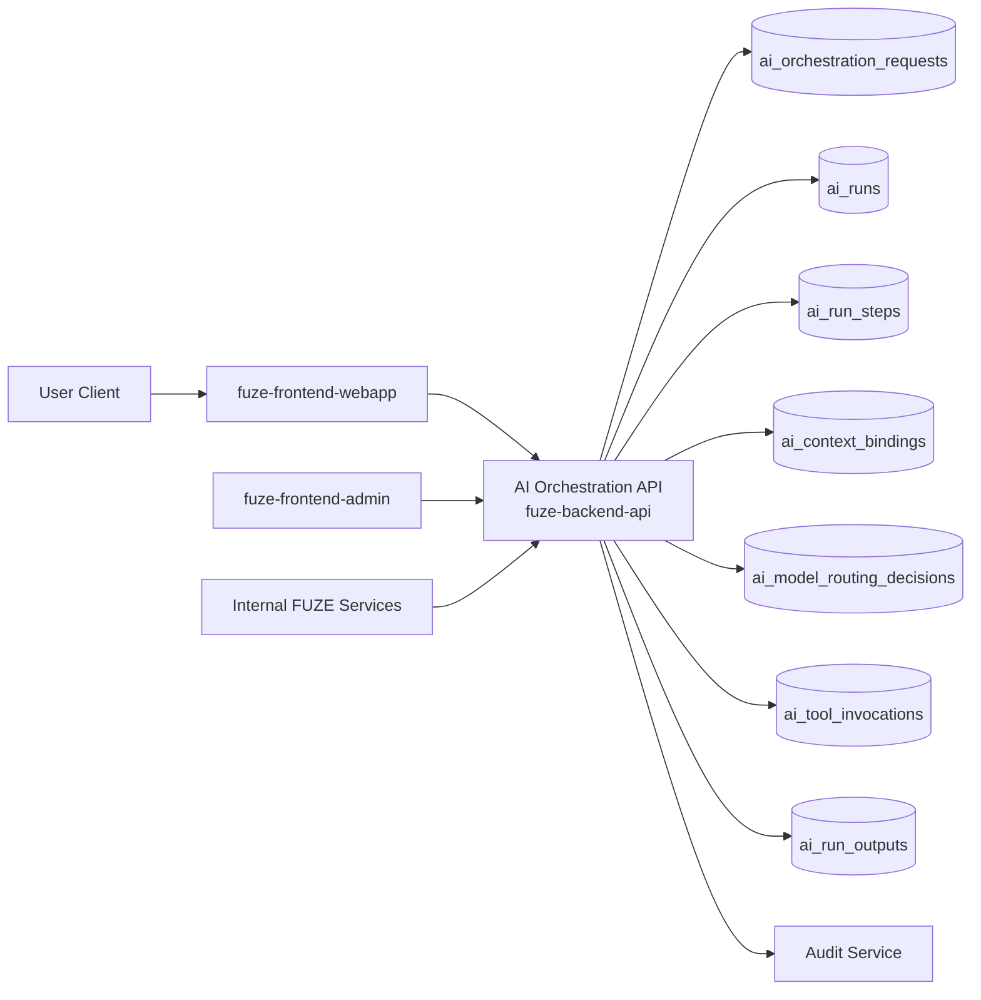
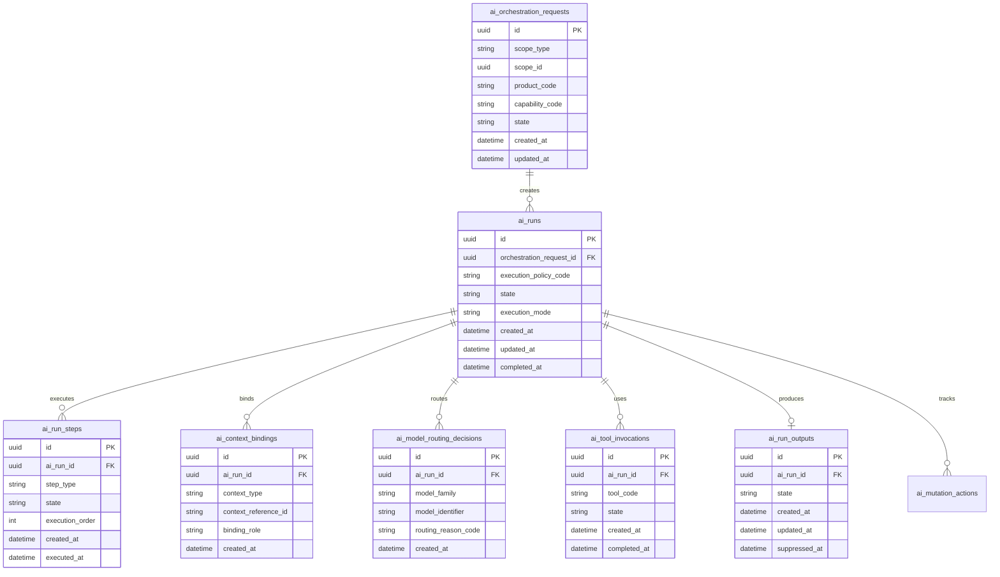
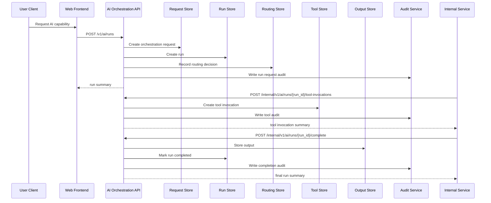

# AI_ORCHESTRATION_API_SPEC

## 1. Title

**AI_ORCHESTRATION_API_SPEC.md**

---

## 2. Document Metadata

- **Document Name:** AI_ORCHESTRATION_API_SPEC.md
- **API Classification:** public, internal, admin, event-driven
- **Owning Domain:** AI Orchestration Domain
- **Primary Implementing Repo:** `fuze-backend-api`
- **Primary System of Record:** AI orchestration requests, runs, routing decisions, tool-call lineage, policy gates, and execution summaries in `fuze-backend-api`
- **Status:** Draft for canonical source-of-truth approval
- **Purpose:** Define the production-grade API contract architecture for FUZE AI orchestration, governed model execution, context assembly, tool invocation control, run lifecycle management, and safe cross-product AI execution behavior across the platform
- **Canonical Folder:** `fuze.ac > docs > api-spec`

---

## 2.1 API Classification Header

- **API Classification:** public | internal | admin | event-driven
- **Owning Domain:** AI Orchestration Domain
- **Primary Implementing Repo:** `fuze-backend-api`
- **Primary System of Record:** AI orchestration run and policy-control domain

---

## 3. Purpose

This document defines the canonical API specification for FUZE AI orchestration operations. It translates the governing FUZE platform architecture, AI orchestration rules, model-routing and context rules, usage-metering rules, workflow and automation rules, audit requirements, security controls, and API architecture rules into an implementation-ready API contract.

This API exists because FUZE is a platform of AI-enabled products and shared AI capabilities, not a collection of unrelated product-local model calls. AI execution must therefore be governed at the platform layer so that model selection, context assembly, tool usage, policy controls, cost visibility, auditability, and runtime safety are consistent across QTB, AIMM, ZAGA, AIE, HerHelp, Botmad, ToolGrid, and future products.

Accordingly, this specification defines how AI runs are created, how orchestration requests are normalized, how models and tools are selected under policy, how run status and outputs are exposed, how orchestration integrates with workflow and async execution, and how AI execution remains bounded, auditable, idempotent, and architecture-consistent without allowing AI to become the uncontrolled owner of business truth.

---

## 4. Scope

This specification covers:

- AI orchestration request APIs
- AI run status and output visibility APIs
- model and tool orchestration control APIs
- context-pack and execution-policy binding APIs
- internal service APIs for product-initiated AI runs
- admin/control-plane APIs for AI run remediation, cancellation, restriction, and policy-safe override behavior
- event emission requirements for orchestration lifecycle changes
- request, response, error, idempotency, versioning, audit, and database-shape rules for this domain

This specification does **not** redefine:

- detailed model-routing strategy in full detail
- detailed AI usage metering semantics in full detail
- workflow engine semantics in full detail
- product-specific AI prompt content in full detail
- product business truth or durable product object ownership
- billing, credits, payout, treasury, governance, or wallet semantics
- low-level provider SDK implementation details

Those remain governed by their own source-of-truth specifications.

---

## 5. Source-of-Truth Inputs

### Primary FUZE docs and specs used

#### Highest-priority platform and ownership sources
- `SYSTEM_SPEC_INDEX.md`
- `SYSTEM_BOUNDARY_AND_OWNERSHIP_SPEC.md`
- `SYSTEM_OVERVIEW_AND_BOUNDARIES_SPEC.md`
- `PLATFORM_ARCHITECTURE_SPEC.md`
- `DOMAIN_OWNERSHIP_MATRIX_SPEC.md`
- `DATA_MODEL_AND_ENTITY_OWNERSHIP_SPEC.md`

#### Primary AI / runtime / product orchestration sources
- `AI_ORCHESTRATION_SPEC.md`
- `MODEL_ROUTING_AND_CONTEXT_SPEC.md`
- `AI_USAGE_METERING_SPEC.md`
- `WORKFLOW_AND_AUTOMATION_SPEC.md`
- `JOB_QUEUE_AND_WORKER_SPEC.md`
- `INTERNAL_SERVICE_API_SPEC.md`
- `EVENT_MODEL_AND_WEBHOOK_SPEC_refreshed.md`
- `ROLE_PERMISSION_AND_ACCESS_CONTROL_SPEC.md`
- `AUDIT_LOG_AND_ACTIVITY_SPEC.md`
- `SECURITY_AND_RISK_CONTROL_SPEC.md`

#### API and runtime sources
- `API_ARCHITECTURE_SPEC.md`
- `PUBLIC_API_SPEC.md`
- `IDEMPOTENCY_AND_VERSIONING_SPEC.md`
- `MIGRATION_AND_BACKWARD_COMPATIBILITY_SPEC.md`
- `MONITORING_ALERTING_AND_INCIDENT_RESPONSE_SPEC.md`
- `SECRETS_CONFIG_AND_ENVIRONMENT_SPEC.md`

#### Product integration context
- `PRODUCT_INTEGRATION_ARCHITECTURE_SPEC.md`
- `QTB_PRODUCT_INTEGRATION_SPEC.md`
- `AIMM_PRODUCT_INTEGRATION_SPEC.md`
- `ZAGA_PRODUCT_INTEGRATION_SPEC.md`
- `AIE_PRODUCT_INTEGRATION_SPEC.md`
- `HERHELP_PRODUCT_INTEGRATION_SPEC.md`
- `BOTMAD_PRODUCT_INTEGRATION_SPEC.md`

#### Format guides
- `The_API_Specification_guide.md`
- `Database_Schemas_Guide.md`

### Highest-priority interpretation applied

For this file, the most important governing interpretation is:

1. AI is a governed platform capability, not the owner of durable business truth
2. backend owns canonical orchestration truth
3. model routing, context assembly, tool access, and execution policies must be platform-governed
4. products may request AI execution but do not redefine cross-platform orchestration semantics
5. admin/control-plane may inspect, restrict, cancel, or remediate orchestration under controlled policy but do not own AI truth
6. workflow, async execution, tool calls, and metering are related but distinct layers and must remain explicitly separated

### Supporting external standards used only as guidance

- HTTP semantics for safe reads, async execution initiation, and mutation responses
- structured problem-details error design
- general agent/run orchestration and tool-execution safety patterns as supporting guidance

External guidance does not override FUZE source-of-truth documents.

---

## 6. Governing Architecture and Ownership Interpretation

This API belongs to the **AI Orchestration Domain** because it owns the platform-governed lifecycle of AI execution requests, run planning, model/tool selection, execution state, and bounded outputs across the FUZE ecosystem.

This API is implemented primarily in `fuze-backend-api` because:

- backend owns durable orchestration truth
- frontend surfaces must consume run state, not invent or finalize it
- AI execution policy, context binding, and tool controls must be centralized
- product domains require a shared and trusted AI execution interface
- audit generation, safety restrictions, and operational remediation must be backend-governed

This API is **not** owned by:

- `fuze-frontend-webapp`, because webapp only initiates or reads allowed AI runs
- `fuze-frontend-admin`, because admin may inspect, cancel, or restrict but must not own orchestration truth
- product domains, because products may define request context and desired capabilities but do not define platform-wide orchestration semantics
- `fuze-sdk`, because SDKs derive from approved contracts and never become orchestration source of truth
- workflow or job systems, because those systems execute deferred work and sequencing, but do not own AI orchestration business meaning

### Architectural implications

- one orchestration request may produce one or more execution attempts or steps
- orchestration truth includes requested capability, routing decisions, context bindings, tool-call lineage, and final bounded outputs
- AI output is not canonical business truth unless another owning domain explicitly validates and commits it
- tool calls, async jobs, and workflow transitions remain explicit subcomponents of orchestration, not hidden side effects
- run cancellation, retry, and restriction must preserve explicit lineage
- usage metering and billing effects remain downstream or adjacent to orchestration, not the same thing as orchestration truth

---

## 7. Domain Responsibilities

The AI Orchestration API domain is responsible for:

1. receiving and normalizing AI execution requests
2. binding requests to scope, actor, context, and orchestration policy
3. resolving model routing and tool availability under governed policy
4. creating and managing AI run lifecycle state
5. exposing bounded run outputs and status for allowed consumers
6. coordinating async execution and retries where appropriate
7. supporting safe internal product-initiated orchestration
8. supporting admin/control-plane restriction, cancellation, and remediation actions
9. emitting orchestration lifecycle events
10. generating audit lineage for sensitive AI execution behavior

The domain is not responsible for:

- owning product business truth
- independently committing business mutations as truth without owning-domain validation
- owning workflow truth outside orchestration-specific execution lineage
- owning usage billing or credits truth
- owning provider secrets or model-provider billing as the commercial source of truth
- owning final user entitlements or permissions beyond access gating for run initiation

---

## 8. Out of Scope

The following are out of scope for this API specification:

- raw provider API schemas
- low-level prompt templates for every product flow
- product-local feature behavior outside orchestration boundaries
- final UI streaming behavior for every frontend surface
- full metering and charge calculation logic
- full workflow DAG design
- full retrieval/RAG schema design
- detailed knowledge index implementation

Where later detailed specs are needed, they must remain compatible with this API.

---

## 9. Canonical Entities and Data Ownership

### Durable entities

#### 9.1 ai_orchestration_requests
- **Owner:** AI Orchestration Domain
- **Purpose:** canonical normalized request records for AI execution
- **Nature:** source-of-truth durable entity

#### 9.2 ai_runs
- **Owner:** AI Orchestration Domain
- **Purpose:** canonical run lifecycle records
- **Nature:** source-of-truth durable entity

#### 9.3 ai_run_steps
- **Owner:** AI Orchestration Domain
- **Purpose:** explicit step-level execution lineage for multi-step orchestration
- **Nature:** source-of-truth durable entity

#### 9.4 ai_context_bindings
- **Owner:** AI Orchestration Domain
- **Purpose:** explicit references to context packs, documents, workspace state, product state, or user state used by a run
- **Nature:** source-of-truth durable lineage entity

#### 9.5 ai_model_routing_decisions
- **Owner:** AI Orchestration Domain
- **Purpose:** explicit record of resolved model route, fallback, and policy-bounded selection rationale
- **Nature:** source-of-truth durable lineage entity

#### 9.6 ai_tool_invocations
- **Owner:** AI Orchestration Domain
- **Purpose:** explicit record of governed tool-use requests and results within a run
- **Nature:** source-of-truth durable lineage entity

#### 9.7 ai_execution_policies
- **Owner:** AI Orchestration Domain
- **Purpose:** named execution policy bundles controlling tools, context classes, model families, safety posture, and retry bounds
- **Nature:** source-of-truth durable entity

#### 9.8 ai_run_outputs
- **Owner:** AI Orchestration Domain
- **Purpose:** canonical stored run outputs and bounded result summaries
- **Nature:** source-of-truth durable entity, but not canonical business truth for other domains

#### 9.9 ai_mutation_actions
- **Owner:** AI Orchestration Domain
- **Purpose:** high-level action records for create, cancel, retry, restrict, override-safe remediation, and closure
- **Nature:** durable action records with audit linkage

#### 9.10 ai_audit_events
- **Owner:** Audit / Activity domain, sourced by AI Orchestration Domain
- **Purpose:** immutable trail for sensitive orchestration actions
- **Nature:** durable audit records

### Derived or cached entities

#### 9.11 ai_run_status_views
- **Owner:** derived read-model layer
- **Purpose:** user-facing and admin-facing run summaries
- **Nature:** derived

#### 9.12 ai_capability_views
- **Owner:** derived read-model layer
- **Purpose:** visible orchestration capability summaries by product and scope
- **Nature:** derived

#### 9.13 ai_output_views
- **Owner:** derived read-model layer
- **Purpose:** product-safe or user-safe output presentations
- **Nature:** derived

---

## 10. State Model and Lifecycle

### 10.1 orchestration request lifecycle

Possible states:

- `created`
- `validated`
- `rejected`
- `enqueued`
- `started`
- `completed`
- `failed`
- `cancelled`

### 10.2 run lifecycle

Possible states:

- `pending`
- `routing`
- `awaiting_execution`
- `running`
- `awaiting_tool_result`
- `completed`
- `failed`
- `cancelled`
- `restricted`

### 10.3 run step lifecycle

Possible states:

- `pending`
- `ready`
- `executing`
- `completed`
- `failed`
- `cancelled`
- `superseded`

### 10.4 tool invocation lifecycle

Possible states:

- `requested`
- `authorized`
- `executing`
- `completed`
- `failed`
- `rejected`

### 10.5 output lifecycle

Possible states:

- `partial`
- `final`
- `retracted_if_required`
- `superseded`

Lifecycle notes:
- orchestration may be synchronous for simple runs or async for governed long-running flows
- completion of a run does not mean business truth has been committed into product domains
- cancellation and retry must preserve run and step lineage
- restricted state may block output release or tool execution without deleting prior history

---

## 11. API Surface Overview

The API surface is divided into four families:

### 11.1 Public / first-party user-facing APIs
Used by `fuze-frontend-webapp` and approved first-party clients for:
- creating AI orchestration requests within allowed capabilities
- reading run status
- reading bounded outputs
- cancelling own/authorized runs where policy allows
- reading visible orchestration capability summaries

### 11.2 Internal service APIs
Used by trusted internal services for:
- creating product-owned orchestration requests
- binding context and policies
- starting execution
- reporting step and tool outcomes
- reading canonical run status and outputs

### 11.3 Admin / control-plane APIs
Used by `fuze-frontend-admin` through backend-only privileged routes for:
- restricting or cancelling runs
- retrying or remediating failed runs under controlled policy
- policy-safe output suppression or retraction
- reviewing tool-call or routing anomalies

### 11.4 Event-driven interfaces
Used for downstream side effects:
- audit generation
- metering and usage capture triggers
- workflow continuation triggers
- product-notification triggers
- monitoring and anomaly detection

---

## 12. Authentication and Authorization Model

### 12.1 Authentication posture by route family

#### Authenticated user routes
Require valid authenticated session:
- create orchestration request in owned or authorized scope
- read run status and outputs for owned or authorized runs
- cancel own/authorized runs where policy allows
- read visible capability metadata

#### Internal service routes
Require internal service identity with explicit least privilege:
- create and execute product-owned runs
- bind context and policy
- report step and tool outcomes
- read canonical run and output state

#### Admin routes
Require privileged operator identity plus reason-coded actions:
- restrict/cancel runs
- retry or remediate failed runs
- suppress or retract outputs under policy
- inspect routing and tool anomalies

### 12.2 Authorization checkpoints

Authorization must evaluate:
- canonical account identity
- session validity
- target scope and product context
- actor’s workspace role where applicable
- whether requested AI capability is allowed in that scope
- whether the execution policy allows requested model/tool/context classes
- whether run belongs to actor’s visible scope
- whether admin/operator role is present for privileged actions

### 12.3 Sensitive action rules

The following require heightened checks:
- orchestration requests with elevated tool access
- runs using sensitive context classes
- admin restrict/cancel/remediate actions
- output suppression or retraction
- manual retry or override-safe reroute actions

---

## 13. API Endpoints / Interface Contracts

## 13.1 Public / First-Party User APIs

### 13.1.1 `GET /v1/ai/capabilities`
**Purpose:** list visible AI orchestration capabilities for current actor and scope  
**Caller Type:** authenticated user  
**Auth Expectation:** valid authenticated session  
**Query Parameters Summary:**
- optional `scope_type`
- optional `scope_id`
- optional `product_code`
**Response Summary:**
- visible capability summaries
- allowed execution classes
- streaming/async hints where applicable
- product/scope visibility metadata
**Side Effects:** none
**Audit Requirements:** access logging only
**Emitted Events:** none required

### 13.1.2 `POST /v1/ai/runs`
**Purpose:** create AI orchestration request and initial run for an owned or authorized scope  
**Caller Type:** authenticated user with scope authority  
**Request Body Summary:**
- `scope_type`
- `scope_id`
- `product_code`
- `capability_code`
- `input_payload`
- optional `context_reference_ids[]`
- optional `execution_mode`
- optional `client_metadata`
- `idempotency_key`
**Response Summary:**
- orchestration request summary
- run summary
- initial status
- async/streaming hints
**Side Effects:** creates orchestration request and run
**Idempotency Behavior:** required
**Audit Requirements:** sensitive AI execution initiation audit
**Emitted Events:** `ai.run_requested`

### 13.1.3 `GET /v1/ai/runs`
**Purpose:** list visible AI runs for current actor in owned/authorized scopes  
**Caller Type:** authenticated user  
**Query Parameters Summary:**
- pagination
- optional state filters
- optional product filters
- optional date range
**Response Summary:** run summaries, states, product/scope metadata, and bounded output availability
**Side Effects:** none

### 13.1.4 `GET /v1/ai/runs/{run_id}`
**Purpose:** retrieve canonical bounded run detail view  
**Caller Type:** authenticated user with run visibility  
**Response Summary:**
- run state
- input summary
- context summary
- routing summary
- tool-use summary where safe
- bounded output summary
**Side Effects:** none

### 13.1.5 `GET /v1/ai/runs/{run_id}/output`
**Purpose:** retrieve bounded final or partial output for a visible run  
**Caller Type:** authenticated user with run visibility  
**Response Summary:**
- output state
- final or partial content payload
- structured output blocks where applicable
- safety/restriction indicators
**Side Effects:** none

### 13.1.6 `POST /v1/ai/runs/{run_id}/cancel`
**Purpose:** cancel a user-visible run where policy allows  
**Caller Type:** authenticated user with cancellation authority  
**Request Body Summary:**
- optional `reason_code`
- `idempotency_key`
**Response Summary:** updated run summary
**Side Effects:** run transitions to cancelled if still cancellable
**Idempotency Behavior:** required
**Audit Requirements:** sensitive run-cancel audit
**Emitted Events:** `ai.run_cancelled`

## 13.2 Internal Service APIs

### 13.2.1 `POST /internal/v1/ai/runs`
**Purpose:** create product-owned orchestration request and run  
**Caller Type:** internal trusted services  
**Auth Expectation:** service-to-service identity only  
**Request Body Summary:**
- `scope_type`
- `scope_id`
- `product_code`
- `capability_code`
- `input_payload`
- `execution_policy_code`
- optional `context_bindings[]`
- optional `workflow_reference`
- `idempotency_key`
**Response Summary:** orchestration request and run summary
**Side Effects:** creates request and run, binds policy and initial context
**Idempotency Behavior:** required
**Audit Requirements:** AI execution initiation audit
**Emitted Events:** `ai.run_requested`

### 13.2.2 `POST /internal/v1/ai/runs/{run_id}/steps`
**Purpose:** record or advance one orchestration step in a run  
**Caller Type:** internal trusted services with execution authority  
**Request Body Summary:**
- `step_type`
- `step_payload`
- optional `state_transition`
- `idempotency_key`
**Response Summary:** step summary and updated run state
**Side Effects:** creates or advances run step lineage
**Idempotency Behavior:** required
**Audit Requirements:** step execution audit where sensitivity requires
**Emitted Events:** `ai.run_step_updated`

### 13.2.3 `POST /internal/v1/ai/runs/{run_id}/tool-invocations`
**Purpose:** request or report governed tool invocation within a run  
**Caller Type:** internal trusted services with tool-execution authority  
**Request Body Summary:**
- `tool_code`
- `invocation_payload`
- `invocation_mode`
- `idempotency_key`
**Response Summary:** tool invocation summary
**Side Effects:** creates tool invocation lineage and may update run state
**Idempotency Behavior:** required
**Audit Requirements:** sensitive tool-use audit
**Emitted Events:** `ai.tool_invocation_requested`, `ai.tool_invocation_completed`, `ai.tool_invocation_failed`

### 13.2.4 `POST /internal/v1/ai/runs/{run_id}/complete`
**Purpose:** finalize run with bounded output or terminal failure  
**Caller Type:** internal trusted services with completion authority  
**Request Body Summary:**
- `terminal_outcome`
- optional `output_payload`
- optional `failure_code`
- `idempotency_key`
**Response Summary:** final run summary and output summary
**Side Effects:** run transitions to completed or failed, output stored if present
**Idempotency Behavior:** required
**Audit Requirements:** critical AI run completion audit
**Emitted Events:** `ai.run_completed`, `ai.run_failed`

### 13.2.5 `GET /internal/v1/ai/runs/{run_id}`
**Purpose:** retrieve canonical run truth for trusted services  
**Caller Type:** internal trusted services  
**Response Summary:** full run status, routing, step, context, tool, and output lineage
**Side Effects:** none

## 13.3 Admin / Control-Plane APIs

### 13.3.1 `POST /admin/v1/ai/runs/{run_id}/restrict`
**Purpose:** restrict a run due to safety, policy, or anomaly concerns  
**Caller Type:** admin/operator  
**Request Body Summary:**
- `reason_code`
- `operator_note`
- optional `related_case_id`
- `idempotency_key`
**Response Summary:** restricted run summary
**Side Effects:** run transitions to restricted or restriction overlay is applied
**Audit Requirements:** critical audit
**Emitted Events:** `ai.run_restricted`

### 13.3.2 `POST /admin/v1/ai/runs/{run_id}/retry`
**Purpose:** trigger controlled retry or reroute for a failed or remediable run  
**Caller Type:** admin/operator  
**Request Body Summary:**
- `retry_profile`
- `reason_code`
- `operator_note`
- `idempotency_key`
**Response Summary:** retry action summary and new/updated run linkage
**Side Effects:** may create retry lineage and new execution attempt
**Audit Requirements:** critical audit
**Emitted Events:** `ai.run_retried`

### 13.3.3 `POST /admin/v1/ai/runs/{run_id}/output-suppression`
**Purpose:** suppress or retract visible output under controlled policy  
**Caller Type:** admin/operator  
**Request Body Summary:**
- `suppression_reason_code`
- `operator_note`
- `idempotency_key`
**Response Summary:** updated output and run visibility summary
**Side Effects:** output state may become retracted or hidden by policy
**Audit Requirements:** critical audit
**Emitted Events:** `ai.output_suppressed`

### 13.3.4 `POST /admin/v1/ai-run-discrepancies`
**Purpose:** resolve discrepancy involving routing, tool execution, or run status under controlled policy  
**Caller Type:** admin/operator  
**Request Body Summary:**
- `run_id`
- `resolution_code`
- `operator_note`
- `related_case_id`
- `idempotency_key`
**Response Summary:** discrepancy-resolution summary
**Side Effects:** may update run, step, or output posture with preserved lineage
**Audit Requirements:** critical audit
**Emitted Events:** `ai.run_discrepancy_resolved`

---

## 14. Request Rules

### 14.1 General request rules
- all mutation-capable routes must require JSON requests with explicit content type
- all mutation routes must carry correlation IDs
- sensitive orchestration mutations must carry idempotency keys
- admin mutations must require reason codes and operator notes
- no route may accept frontend-computed AI success as authoritative run truth

### 14.2 Sensitive-action request requirements
The following requests require heightened validation:
- run creation using sensitive capability classes
- step advancement that implies external side effects
- tool invocation requests
- run completion with final output
- restrict/retry/output-suppression actions
- discrepancy-resolution actions

Heightened validation may include:
- scope authorization checks
- capability-policy checks
- context-class validation
- duplicate-step or duplicate-tool-invocation checks
- operator role confirmation
- support/security case linkage for admin flows

### 14.3 Scope integrity rule
Orchestration mutations must target a valid and authorized scope and capability. Product or service callers must not create or mutate runs for unrelated or unauthorized scopes.

### 14.4 Business-truth separation rule
AI orchestration completion must not directly imply business-truth mutation in another domain unless that owning domain explicitly validates and commits the change through its own canonical API or internal mutation path.

---

## 15. Response Rules

### 15.1 Success response rules
Successful responses must include:
- stable resource identifiers
- timestamps for created/updated state
- state/status values
- scope and product summaries
- routing or output summaries where relevant
- correlation references for mutations

### 15.2 Async-accepted response rules
If execution, retry, or remediation is async, the response must:
- return accepted status
- include action or job ID
- provide follow-up status semantics

### 15.3 Terminal mutation response rules
Terminal mutation responses must clearly show:
- target request/run
- mutation type
- resulting run, step, or output state
- retry or suppression effects where relevant
- whether user-visible output may refresh asynchronously

### 15.4 Read response rules
Read responses must distinguish:
- durable orchestration truth
- bounded output summaries
- routing or tool summaries that are safe to expose
- operator-only details that must remain excluded from user-facing views

---

## 16. Error Model

The API uses structured problem-details style error responses.

### 16.1 Required error fields
- `type`
- `title`
- `status`
- `code`
- `detail`
- `instance`
- `correlation_id`

### 16.2 Common error codes

#### Authorization / permission errors
- `AI_SESSION_REQUIRED`
- `AI_PERMISSION_DENIED`
- `AI_OPERATOR_PERMISSION_DENIED`
- `AI_SERVICE_PERMISSION_DENIED`

#### State conflict errors
- `AI_RUN_STATE_INVALID`
- `AI_STEP_STATE_INVALID`
- `AI_TOOL_INVOCATION_ALREADY_TERMINAL`
- `AI_OUTPUT_ALREADY_SUPPRESSED`
- `AI_RETRY_CONFLICT`

#### Policy / safety errors
- `AI_CAPABILITY_NOT_ALLOWED`
- `AI_SCOPE_RESTRICTED`
- `AI_CONTEXT_NOT_ALLOWED`
- `AI_TOOL_NOT_ALLOWED`
- `AI_OUTPUT_RELEASE_FORBIDDEN`
- `AI_RESTRICTION_REQUIRED`

#### Request integrity errors
- `AI_IDEMPOTENCY_KEY_REQUIRED`
- `AI_REQUEST_INVALID`
- `AI_REQUEST_UNPROCESSABLE`

#### Dependency or provider errors
- `AI_PROVIDER_UNAVAILABLE`
- `AI_ROUTING_UNAVAILABLE`
- `AI_TOOL_EXECUTION_UNAVAILABLE`

### 16.3 Error handling rules
- do not expose hidden operator-only or security-review internals
- do not imply business-truth commitment from orchestration success
- distinguish restricted run from failed execution
- distinguish disallowed context/tool from generic provider failure
- include retry guidance only where safe

---

## 17. Idempotency and Mutation Safety

### 17.1 Required idempotent mutations
The following mutation routes require idempotent behavior:
- run creation
- step advancement
- tool invocation creation/reporting
- run completion
- run cancellation
- run restriction
- retry
- output suppression
- discrepancy resolution

### 17.2 Idempotency key rules
- mutation requests must supply `Idempotency-Key`
- backend stores key scope, request hash, actor, and terminal result
- replay of same semantic request returns original terminal outcome
- replay of same key with different semantic request must fail with conflict

### 17.3 Mutation safety rules
- the same step must not be applied twice in conflicting ways
- the same tool invocation must not be executed twice accidentally
- retry lineage must preserve link to original failed or remediated run
- output suppression must preserve explicit prior output history
- remediation must preserve immutable history rather than rewrite prior records

---

## 18. Versioning and Compatibility Rules

### 18.1 Versioning
This API family is versioned under `/v1`, `/internal/v1`, and `/admin/v1` route families.

### 18.2 Compatibility approach
- additive evolution preferred
- no silent semantic change to run, step, tool, or output states
- new capability codes and tool codes may be added without breaking existing contracts
- response fields may be added but existing meanings must remain stable

### 18.3 Breaking-change rules
Breaking changes include:
- changing the meaning of completed, failed, restricted, or cancelled run states
- changing bounded output semantics incompatibly
- removing critical run or step fields
- changing tool invocation or routing decision semantics incompatibly

Such changes require explicit migration planning and version evolution.

### 18.4 Deprecation
Deprecated routes or fields must:
- be documented explicitly
- carry deprecation metadata where supported
- preserve compatibility windows long enough for first-party consumers and future SDKs

---

## 19. Event Emission and Webhook Behavior

This domain is event-capable.

### 19.1 Internal events
The AI Orchestration domain must emit canonical internal events such as:
- `ai.run_requested`
- `ai.run_step_updated`
- `ai.tool_invocation_requested`
- `ai.tool_invocation_completed`
- `ai.tool_invocation_failed`
- `ai.run_completed`
- `ai.run_failed`
- `ai.run_cancelled`
- `ai.run_restricted`
- `ai.run_retried`
- `ai.output_suppressed`
- `ai.run_discrepancy_resolved`

### 19.2 Event payload minimums
Each event should contain:
- event ID
- event type
- occurred_at
- scope type and scope ID
- run ID
- product code and capability code where relevant
- step or tool invocation reference where relevant
- actor type
- correlation ID
- reason code where applicable

### 19.3 External webhook posture
This specification does not expose general third-party outbound orchestration webhooks by default. Any future outbound AI-run webhook surface must be narrow, security-reviewed, and governed by a separate contract.

---

## 20. Audit and Activity Requirements

The following actions must generate durable audit events:

- sensitive run creation
- tool invocation requests and outcomes where policy requires
- run completion or failure
- run cancellation
- run restriction
- retry and remediation actions
- output suppression
- discrepancy resolution
- other sensitive orchestration flows

### Required audit fields
- audit event ID
- actor type and actor reference
- scope type and scope reference
- target request / run / step / tool / output reference as applicable
- action type
- before/after run summary where applicable
- reason code
- correlation ID
- operator note if operator action
- occurred_at

User-facing activity feeds may show a filtered subset, but audit truth must remain durable and immutable.

---

## 21. Data Model and Database Schema View

### 21.1 `ai_orchestration_requests`
- `id` PK
- `scope_type`
- `scope_id`
- `product_code`
- `capability_code`
- `requested_by_actor_type`
- `requested_by_actor_id`
- `input_payload_json`
- `state`
- `created_at`
- `updated_at`

**Constraints:**
- index on (`scope_type`, `scope_id`)
- index on (`product_code`, `capability_code`)
- index on `state`

### 21.2 `ai_runs`
- `id` PK
- `orchestration_request_id` FK -> `ai_orchestration_requests.id`
- `execution_policy_code`
- `state`
- `execution_mode`
- `started_at` nullable
- `completed_at` nullable
- `failed_at` nullable
- `cancelled_at` nullable
- `restricted_at` nullable
- `created_at`
- `updated_at`

**Constraints:**
- index on `orchestration_request_id`
- index on `state`

### 21.3 `ai_run_steps`
- `id` PK
- `ai_run_id` FK -> `ai_runs.id`
- `step_type`
- `state`
- `execution_order`
- `step_payload_json`
- `created_at`
- `executed_at` nullable
- `failed_at` nullable

**Constraints:**
- index on `ai_run_id`
- index on (`state`, `execution_order`)

### 21.4 `ai_context_bindings`
- `id` PK
- `ai_run_id` FK -> `ai_runs.id`
- `context_type`
- `context_reference_id`
- `binding_role`
- `created_at`

**Constraints:**
- index on `ai_run_id`
- index on (`context_type`, `context_reference_id`)

### 21.5 `ai_model_routing_decisions`
- `id` PK
- `ai_run_id` FK -> `ai_runs.id`
- `model_family`
- `model_identifier`
- `routing_reason_code`
- `fallback_chain_json` nullable
- `created_at`

**Constraints:**
- index on `ai_run_id`

### 21.6 `ai_tool_invocations`
- `id` PK
- `ai_run_id` FK -> `ai_runs.id`
- `tool_code`
- `state`
- `request_payload_json`
- `response_summary_json` nullable
- `created_at`
- `completed_at` nullable
- `failed_at` nullable

**Constraints:**
- index on `ai_run_id`
- index on (`tool_code`, `state`)

### 21.7 `ai_execution_policies`
- `id` PK
- `policy_code`
- `state`
- `allowed_tool_codes_json`
- `allowed_context_classes_json`
- `allowed_model_families_json`
- `retry_policy_json`
- `created_at`
- `updated_at`

**Constraints:**
- unique `policy_code`
- index on `state`

### 21.8 `ai_run_outputs`
- `id` PK
- `ai_run_id` FK -> `ai_runs.id`
- `state`
- `output_payload_json`
- `structured_output_json` nullable
- `created_at`
- `updated_at`
- `suppressed_at` nullable

**Constraints:**
- unique `ai_run_id` in current output space
- index on `state`

### 21.9 `ai_mutation_actions`
- `id` PK
- `ai_run_id` FK -> `ai_runs.id`
- `action_type`
- `state`
- `reason_code`
- `operator_note` nullable
- `requested_by_actor_type`
- `requested_by_actor_id`
- `created_at`
- `executed_at` nullable
- `closed_at` nullable
- `correlation_id`

### 21.10 `idempotency_records`
- `id` PK
- `idempotency_key`
- `scope_family`
- `actor_reference`
- `request_hash`
- `response_hash`
- `terminal_status`
- `created_at`
- `expires_at`

### 21.11 `audit_log_entries`
Domain-sourced audit records written into the audit domain.

### Normalization notes
- canonical orchestration truth stays in requests, runs, steps, routing, tool, and output tables
- product business truth remains external to orchestration
- policy and context binding lineage remain explicit rather than implied
- user-facing output views are derived and must not replace canonical run/output truth

### Reconciliation notes
- one orchestration request may map to one canonical primary run lineage plus explicit retries
- tool-invocation outcomes must reconcile to run step state
- output visibility and suppression must reconcile to explicit output state
- run closure must preserve step and action history

---

## 22. Architecture Diagram — Mermaid flowchart



---

## 23. Data Design — Mermaid Diagram



---

## 24. Flow View

### 24.1 Happy path — user AI run
1. authenticated actor requests AI capability in authorized scope
2. backend validates capability, policy, scope, and context eligibility
3. orchestration request and run are created
4. routing decision resolves model family and execution policy
5. run executes directly or through async step sequence
6. bounded output is stored
7. run completes and output becomes visible
8. audit and events are emitted

### 24.2 Happy path — product-owned orchestration
1. internal product service submits orchestration request with execution policy
2. backend binds context and creates run
3. run steps and tool invocations execute under policy
4. final output is stored
5. product reads canonical result and may separately validate or commit product truth
6. audit and events are emitted

### 24.3 Alternate path — tool-required run
1. run begins with model and context bound
2. execution requires governed tool invocation
3. tool invocation is authorized and executed
4. tool result updates run state
5. execution continues to final output

### 24.4 Failure path — disallowed capability or context
1. request is submitted
2. backend detects scope, capability, or context policy violation
3. request is rejected or run becomes restricted before execution
4. no final output is released

### 24.5 Failure and remediation path — run step fails
1. run starts and one step fails
2. run moves to failed or partial failure posture
3. admin or internal remediation triggers retry/reroute under policy
4. retry lineage is created explicitly
5. final terminal state preserves full history

### 24.6 Output suppression path
1. run completes with output
2. later safety/policy review requires suppression
3. admin applies output suppression
4. visible output state becomes suppressed/retracted
5. run lineage remains intact

### 24.7 Retry behavior
- duplicate run creation returns same primary run result
- duplicate step update returns same terminal step result
- duplicate tool invocation returns same terminal invocation result
- duplicate completion returns same final run outcome
- duplicate suppression or restriction returns same terminal action result

---

## 25. Data Flows — Mermaid sequenceDiagram



---

## 26. Security and Risk Controls

1. **AI orchestration truth is backend-owned**  
   Frontends and products may not authoritatively mark AI runs complete or valid outside approved backend APIs.

2. **AI is not business-truth owner**  
   Orchestration outputs must not be treated as canonical product truth without owning-domain validation.

3. **Policy-bound routing and context**  
   Model, tool, and context decisions must be governed by explicit execution policy.

4. **Least privilege**  
   Internal execution and tool routes must be limited to authorized service callers with explicit privileges.

5. **Sensitive-context controls**  
   Sensitive context classes and tools must be explicitly allowed before execution.

6. **Immutable lineage**  
   Retries, suppressions, failures, and remediations must preserve history instead of rewriting prior records.

7. **Problem-details discipline**  
   Error bodies must be structured and safe, without exposing hidden operator-only or security-review details.

8. **Audit immutability**  
   Sensitive orchestration actions require durable immutable audit lineage.

9. **Replay resistance**  
   Run creation, step updates, tool invocations, completion, retry, and suppression must be idempotent and replay-safe.

10. **Output-release control**  
    Completion of execution does not guarantee unrestricted output release; suppression/restriction must remain explicit.

---

## 27. Operational Considerations

- run-status reads are user- and product-visible and should be highly available
- async execution and tool flows must be correctness-sensitive and traceable
- failed steps and retries require explicit remediation visibility
- routing and provider degradation should surface clearly to ops views
- monitoring should alert on:
  - spikes in failed runs
  - unusual restriction or suppression volume
  - tool invocation failure spikes
  - routing fallback spikes
  - run backlog growth
  - output suppression anomalies

---

## 28. Acceptance Criteria

1. The API preserves the distinction between AI orchestration truth and product business truth.
2. Only `fuze-backend-api` owns canonical orchestration truth.
3. AI run creation, execution, routing, tool use, and outputs are durable and backend-owned.
4. Capability, context, model, and tool use are policy-bound.
5. Run completion is distinct from business-truth commitment in other domains.
6. Step, tool, retry, and suppression lineage are explicit and immutable.
7. Cancellation, retry, and suppression are idempotent and auditable.
8. Internal execution routes are least-privilege and backend-only.
9. Admin routes require reason-coded privileged authorization.
10. Event emissions exist for major orchestration mutations.
11. Response and error semantics are stable and machine-readable.
12. Database schema separates requests, runs, steps, context, routing, tools, and outputs.
13. Products can consume canonical orchestration APIs without redefining platform orchestration semantics.
14. Restriction and discrepancy handling are supported and safely replayable.
15. Mermaid diagrams remain consistent with prose and data model.

---

## 29. Test Cases

### 29.1 Positive cases
1. Authenticated user creates allowed AI run successfully.
2. Authenticated user reads visible run summary successfully.
3. Authenticated user reads visible bounded output successfully.
4. Internal service creates product-owned run successfully.
5. Internal service records tool invocation successfully.
6. Internal service completes run successfully.
7. Admin restricts suspicious run successfully.
8. Admin retries failed run successfully.

### 29.2 Negative cases
9. Unauthenticated call to user AI route is rejected.
10. User without scope authority cannot create run for workspace scope.
11. Request for disallowed capability returns `AI_CAPABILITY_NOT_ALLOWED`.
12. Request with disallowed context returns `AI_CONTEXT_NOT_ALLOWED`.
13. Tool invocation using disallowed tool returns `AI_TOOL_NOT_ALLOWED`.
14. Attempt to read suppressed output returns appropriate restricted or suppressed result.

### 29.3 Authorization cases
15. Ordinary user cannot call admin restrict/retry/output-suppression routes.
16. Internal service without execution privilege cannot complete run.
17. Internal service without tool privilege cannot create tool invocation.
18. Product service cannot mark orchestration result as product truth without separate owning-domain path.

### 29.4 Idempotency and replay cases
19. Repeating run creation with same idempotency key returns original run result.
20. Repeating tool invocation with same idempotency key returns original terminal invocation result.
21. Repeating run completion with same idempotency key returns original terminal run result.
22. Repeating output suppression with same idempotency key returns original suppression result.

### 29.5 Concurrency cases
23. Concurrent step updates preserve one explicit ordered step lineage and one duplicate-safe outcome where appropriate.
24. Concurrent retry and suppression actions preserve explicit run-state ordering without hidden overwrite.
25. Concurrent tool invocation result reporting does not create ambiguous terminal tool state.

### 29.6 Recovery / admin cases
26. Failed run can be retried under controlled policy with explicit retry linkage.
27. Restricted run prevents further normal execution without approved remediation.
28. Suppressed output remains historically linked while no longer normally visible.

### 29.7 Event and audit cases
29. Successful run creation emits `ai.run_requested`.
30. Successful tool invocation completion emits `ai.tool_invocation_completed`.
31. Successful run completion emits `ai.run_completed`.
32. Successful suppression emits `ai.output_suppressed` with critical audit lineage.

---

## 30. Open Questions or Explicit Deferred Decisions

1. Exact capability-code taxonomy across all products is deferred.
2. Exact policy-bundle structure for sensitive-context classes is deferred.
3. Exact streaming-output protocol details are deferred.
4. Exact provider-fallback decision model is deferred.
5. Exact product-specific output-shape standards are deferred.
6. Exact discrepancy case taxonomy for orchestration anomalies is deferred.

---

## 31. Implementation Notes for `fuze-backend-api`

Recommended backend module layout:

```text
modules/platform/
  ai-orchestration/
  model-routing/
  workflow-orchestration/
  audit-log/
  control-plane/
  integrations/
```

Implementation guidance:
- keep request identity, run state, step lineage, context binding, routing, tool invocation, and output lineage in one canonical domain service
- perform capability-policy and context-policy checks inside the commit boundary
- keep retries, suppressions, and restrictions explicit and idempotent
- treat admin remediations as domain actions, not ad hoc row edits
- emit events only after canonical state commit succeeds
- publish user-facing output views from canonical truth; do not let derived views mutate orchestration state

---

## 32. Frontend Consumption Notes

### For `fuze-frontend-webapp`
- may create runs, read run status, read bounded outputs, and cancel allowed runs
- must not infer canonical run completion from client-side model-stream state alone
- must treat backend run responses as authoritative
- should clearly distinguish pending, running, failed, completed, restricted, and cancelled states
- should not present AI output as committed platform truth unless the owning domain separately confirms that outcome

### For `fuze-frontend-admin`
- may trigger privileged restrict, retry, suppression, and discrepancy actions only through backend admin APIs
- must require operator reason input for sensitive mutations
- must not directly mutate orchestration truth client-side
- should present immutable audit-linked summaries after privileged actions

---

## 33. Contract Derivation Notes

### OpenAPI / AsyncAPI
This spec should later derive into:
- capability and run-creation operations
- run-status and output-read operations
- internal step, tool, and completion operations
- admin restriction / retry / suppression / discrepancy operations
- shared problem-details schema
- AI orchestration events in AsyncAPI

### Future `fuze-sdk`
Future `fuze-sdk` packages may derive:
- AI run creation helpers
- run-status polling helpers
- typed run, step, tool, and output models
- problem-error models for orchestration outcomes

The SDK must derive from approved API contracts and must not become the source of truth over this narrative specification.
