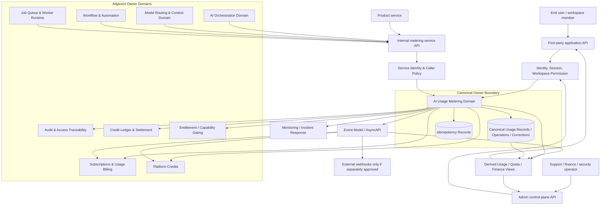
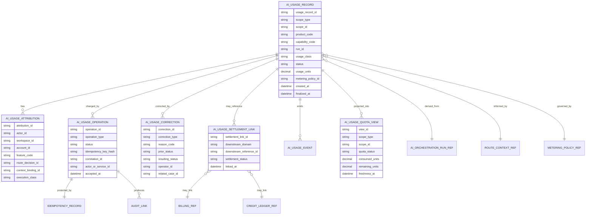
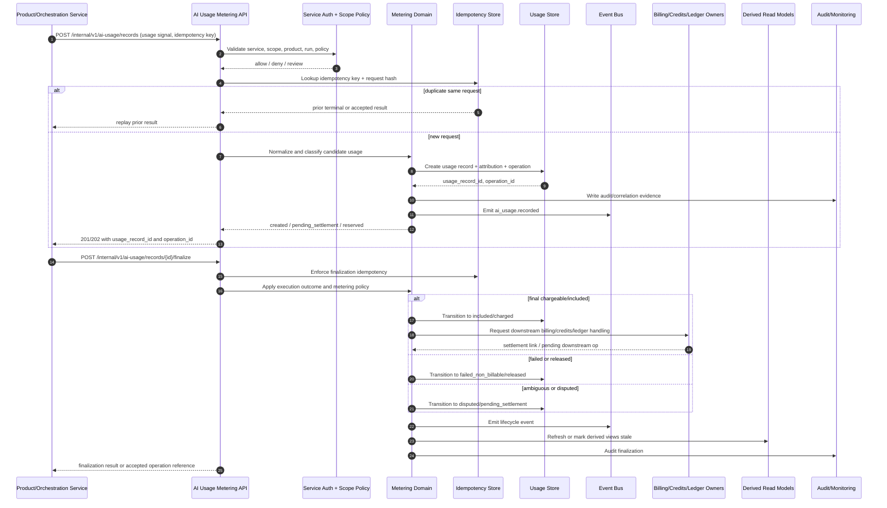

# FUZE AI Usage Metering API Specification

## Document Metadata

- **Document Name:** `AI_USAGE_METERING_API_SPEC.md`
- **Document Type:** Production-grade API SPEC v2
- **Status:** Draft for canonical API-spec inclusion
- **Version:** 2.0.0
- **Effective Date:** 2026-04-24
- **Last Updated:** 2026-04-24
- **Reviewed On:** 2026-04-24
- **Document Owner:** FUZE AI Platform Commerce Architecture / AI Usage Metering Domain
- **Approval Authority:** FUZE Platform Architecture and Governance Authority; formal named approver not yet attached
- **Review Cadence:** Quarterly or upon material change to AI orchestration semantics, model routing/context policy, entitlement posture, subscriptions and usage billing posture, Platform Credits semantics, credit-ledger settlement posture, pricing policy, event semantics, idempotency/versioning posture, or security/risk controls
- **Governing Layer:** API contract layer / shared AI commercial infrastructure / AI usage metering
- **Parent Registry:** `API_SPEC_INDEX.md`; API SPEC v2 canonical registry
- **Upstream Semantic Registry:** `REFINED_SYSTEM_SPEC_INDEX.md`
- **Upstream API Registry:** `API_SPEC_INDEX.md`
- **Primary Audience:** API architecture, backend engineering, AI platform engineering, commerce and billing engineering, credits and ledger engineering, product engineering, frontend engineering, data engineering, finance operations, support operations, security, audit/compliance, platform operations, implementation-contract authors, OpenAPI/AsyncAPI/SDK authors
- **Primary Purpose:** Define the production-grade API contract for recording, finalizing, correcting, explaining, querying, and projecting FUZE AI usage metering while preserving refined metering semantics and separating metering truth from AI orchestration, routing/context, billing, Platform Credits, credit-ledger, entitlement, workflow, queue, provider-input, analytics, and presentation truth.
- **Primary Upstream References:** `REFINED_SYSTEM_SPEC_INDEX.md`, `AI_USAGE_METERING_SPEC.md`, `AI_ORCHESTRATION_SPEC.md`, `MODEL_ROUTING_AND_CONTEXT_SPEC.md`, `SUBSCRIPTIONS_AND_USAGE_BILLING_SPEC.md`, `PLATFORM_CREDITS_SPEC.md`, `CREDIT_LEDGER_AND_SETTLEMENT_SPEC.md`, `PRICING_AND_MONETIZATION_MODEL_SPEC.md`, `WORKFLOW_AND_AUTOMATION_SPEC.md`, `JOB_QUEUE_AND_WORKER_SPEC.md`, `ENTITLEMENT_AND_CAPABILITY_GATING_SPEC.md`, `AUDIT_LOG_AND_ACTIVITY_SPEC.md`, `AUDIT_AND_ACCESS_TRACEABILITY_SPEC.md`, `API_ARCHITECTURE_SPEC.md`, `PUBLIC_API_SPEC.md`, `INTERNAL_SERVICE_API_SPEC.md`, `EVENT_MODEL_AND_WEBHOOK_SPEC.md`, `IDEMPOTENCY_AND_VERSIONING_SPEC.md`, `MIGRATION_AND_BACKWARD_COMPATIBILITY_SPEC.md`, `SECURITY_AND_RISK_CONTROL_SPEC.md`, `MONITORING_ALERTING_AND_INCIDENT_RESPONSE_SPEC.md`, `DATA_CLASSIFICATION_AND_HANDLING_SPEC.md`
- **Primary Downstream Dependents:** AI orchestration implementation contracts, model-routing implementation contracts, AI usage OpenAPI/AsyncAPI artifacts, first-party AI usage UI contracts, billing rating contracts, Platform Credits settlement contracts, credit-ledger settlement contracts, workflow compensation contracts, job/worker retry contracts, support/admin remediation contracts, finance reconciliation contracts, quota/reporting read-model contracts, product-specific AI monetization and quota specifications
- **API Surface Families Covered:** first-party application reads, internal service metering ingestion, internal service quota checks, admin/control-plane correction and remediation, event/async lifecycle notifications, reporting/read-model projections, implementation-facing OpenAPI/AsyncAPI/SDK derivation
- **API Surface Families Excluded:** direct third-party public AI usage mutation APIs, direct provider-billing APIs, direct credit-ledger mutation APIs, direct subscription rating APIs, direct pricing policy authoring APIs, direct product-local billing APIs, public outbound AI-usage webhooks except where separately approved
- **Canonical System Owner(s):** AI Usage Metering Domain for usage metering semantics; adjacent owners remain canonical for orchestration, routing/context, billing, Platform Credits, credit-ledger, entitlement, workflow, queue, audit, security, and reporting concerns
- **Canonical API Owner:** FUZE API Architecture with AI Usage Metering Domain as domain contract owner
- **Supersedes:** Historical `AI_USAGE_METERING_API_SPEC.md` v1 material and weaker API writeups that treated usage counters, raw provider token reports, product-local dashboard totals, or frontend-submitted totals as canonical metering truth
- **Superseded By:** Not yet known
- **Related Decision Records:** Not yet known
- **Canonical Status Note:** This API spec derives from the active refined AI usage metering system spec. It owns interface-contract expression only. It MUST NOT redefine refined AI usage metering semantics, truth classes, lifecycle meaning, correction posture, settlement boundaries, or adjacent domain ownership.
- **Implementation Status:** Normative API baseline for downstream implementation planning; route, schema, event, OpenAPI, AsyncAPI, SDK, and implementation-contract artifacts must conform after approval
- **Approval Status:** Draft for review
- **Change Summary:** Upgraded the historical AI usage metering API into API SPEC v2 form; added explicit truth-class taxonomy, surface family separation, request/response/error/status semantics, idempotency/replay rules, event and async posture, diagrams, flow views, acceptance criteria, test cases, non-canonical patterns, and quality gate checklist.

## Purpose

This document defines the FUZE API contract for AI usage metering. The API exists to make AI consumption recordable, explainable, correction-safe, auditable, quota-aware, billing-consumable, credits-aware, and reporting-safe without allowing product-local counters, provider invoices, dashboard projections, or frontend totals to become canonical usage truth.

The API expresses the refined AI usage metering semantics at the interface layer. It defines allowed route/resource families, actor classes, request and response expectations, lifecycle statuses, error/result semantics, idempotency and replay protections, event behavior, admin remediation rules, read-model boundaries, and downstream OpenAPI/AsyncAPI/SDK guardrails.

This API MUST preserve the refined rule that AI usage metering is a shared platform truth domain. It measures, classifies, attributes, settles, corrects, explains, and reports AI consumption across products and scopes while remaining distinct from AI orchestration truth, model routing/context truth, billing truth, Platform Credits semantic truth, credit-ledger settlement truth, entitlement truth, workflow truth, queue truth, provider-input truth, analytics truth, and presentation truth.

## Scope

This API specification governs:

- first-party reads of account-scoped and workspace-scoped AI usage summaries
- first-party reads of quota, limit, budget, included-usage, warning, exceeded, and freshness posture
- internal service APIs for recording normalized AI usage events
- internal service APIs for validating usage scope, projected usage, quota posture, and settlement eligibility
- internal service APIs for finalizing usage records or batches after execution outcome and metering policy evaluation
- admin/control-plane APIs for reason-coded correction, release, reversal, suppression, dispute, recomputation, and discrepancy resolution
- event families emitted by metering lifecycle changes
- read-model, reporting, support, finance, and reconciliation projection constraints
- request/response/error/status/idempotency/audit/versioning/migration requirements
- OpenAPI, AsyncAPI, SDK, and implementation-contract derivation guardrails

## Out of Scope

This API spec does not govern:

- AI run lifecycle semantics, step state, output validation, or tool execution meaning; those belong to AI orchestration
- model-family selection, provider-lane resolution, context release, redaction, or fallback semantics; those belong to model routing and context
- final subscription billing, included-usage commercial interpretation, overage invoice treatment, dunning, or renewal state; those belong to subscriptions and usage billing
- Platform Credit class semantics or credit ownership; those belong to Platform Credits
- authoritative credit-ledger append mechanics, balances, reservation ledger entries, or final settlement truth; those belong to credit ledger and settlement
- entitlement eligibility truth, scope permission truth, or actor authorization truth
- exact pricing tables, campaign packages, monetization copy, or product-local price displays
- raw provider invoice schemas, raw model-provider usage exports, or provider commercial contract terms
- external third-party public mutation APIs for AI usage metering
- exact database schemas, queue implementation details, alert thresholds, or operational runbooks

## Design Goals

1. Preserve one shared AI usage metering API layer for all FUZE products and shared services.
2. Make every meaningful AI usage action traceable to actor, scope, product, capability, run, routing/context lineage, execution class, metering policy, idempotency lineage, and downstream settlement posture where relevant.
3. Prevent product-local counters, provider usage reports, analytics dashboards, or frontend-submitted totals from becoming canonical usage truth.
4. Support synchronous, streaming, hybrid, async, long-running, reservation-aware, retryable, failed, released, corrected, reversed, disputed, and internal-operational AI usage patterns.
5. Keep metering contract outputs usable by billing, credits, ledger, support, finance, reporting, and product teams without letting those layers redefine metering semantics.
6. Ensure all mutation routes are idempotent, auditable, correlation-safe, versionable, replay-safe, migration-safe, and boundary-safe.
7. Provide concrete API family rules strong enough to support OpenAPI, AsyncAPI, SDK, implementation-contract, QA, and production-readiness work.

## Non-Goals

This API spec does not attempt to:

- encode every provider-specific token accounting formula
- define every product’s pricing formula or included-usage tier
- make raw AI provider usage sufficient for billing or settlement
- make metering a substitute for authorization, entitlement, pricing, billing, or ledger approval
- expose all internal usage details to end users or third-party API consumers
- permit admin tools to silently rewrite usage history
- define a general analytics warehouse schema or BI model
- make public usage summaries equivalent to canonical metering records

## Core Principles

### Metering API Expresses, Not Redefines

The API layer expresses refined metering semantics. It MUST NOT redefine what AI usage records, usage classes, settlement links, correction records, reservations, or metering policies mean.

### Platform-Owned Metering

AI usage metering is a platform-owned domain. Products may originate usage-bearing AI actions, but they MUST NOT implement hidden product-local metering systems or submit frontend-computed totals as authoritative input.

### Execution Is Not Metering

AI orchestration owns execution/run meaning. Metering consumes execution lineage and outcomes to classify usage; it does not own run state.

### Routing Is Not Metering

Model routing/context owns route and context decisions. Metering may reference route class, provider lane, model family, context class, or policy version for usage classification, but it does not own routing semantics.

### Billing Is Not Metering

Metering provides normalized usage inputs and usage status. Billing determines included-versus-overage and commercial obligation treatment under billing rules.

### Credits and Ledger Are Not Metering

Metering may request or reference credits-backed reservation, release, spend, reversal, or settlement links. It does not define Platform Credit semantics or authoritative ledger truth.

### Scope-Correctness

Every metering mutation MUST resolve a canonical account or workspace scope before it can be accepted. Wrong-scope usage MUST fail closed, enter dispute/review, or be corrected through explicit lineage.

### Idempotent Economic Effect

Retries, replays, queue redelivery, streaming partials, provider retries, and operator retries MUST NOT create duplicate chargeable or included-usage effects for the same business AI action.

### Correction Lineage

Corrections, suppressions, releases, reversals, disputes, and recomputations MUST preserve original record lineage and reason-coded action history. Destructive overwrite is forbidden.

### Derived Read Safety

Summaries, quota views, dashboard counters, support views, finance exports, and analytics views are derived from canonical metering records. They MUST NOT become hidden mutation owners.

## Canonical Definitions

- **AI Usage Event:** A normalized business-relevant AI consumption signal eligible to become a canonical metering record.
- **AI Usage Record:** Canonical persisted record of normalized AI usage, attribution, classification, lifecycle, and settlement linkage.
- **Usage Unit:** Business-relevant measured unit defined by metering policy, not merely a provider-native token or invoice line.
- **Usage Class:** Contract-visible classification such as `included`, `premium`, `overage`, `internal_operational`, `reserved`, `released`, `failed_non_billable`, `corrected`, `reversed`, or `disputed`.
- **Metering Policy:** Approved policy bundle defining usage units, classes, thresholds, settlement posture, reservation requirements, correction rules, and reporting posture.
- **Usage Scope:** Canonical commercial subject of usage, normally `account` or `workspace`.
- **Reservation:** Provisional usage/economic hold before final settlement for high-cost, long-running, or ambiguity-prone AI work.
- **Settlement Link:** Reference tying a usage record to billing, included usage, credits-backed settlement, ledger outcome, or release/reversal path without making metering the owner of those domains.
- **Correction Record:** Explicit lineage record for reason-coded post-recognition repair of metering state.
- **Quota Status View:** Derived read model summarizing usage against policy-defined limits. It is not a mutation source.
- **Metering Operation:** Idempotent API mutation that records, finalizes, corrects, suppresses, releases, reverses, disputes, or recomputes metering state.

## Truth Class Taxonomy

The API MUST preserve these truth classes:

1. **Semantic truth:** Meaning of metering records, units, classes, statuses, corrections, reservations, and settlement links; owned by the refined AI Usage Metering Domain.
2. **API contract truth:** Route families, request/response fields, errors, status classes, idempotency behavior, versioning, and surface-family exposure; owned by this API spec.
3. **Policy truth:** Metering policies, thresholds, unit definitions, reservation rules, correction rules, entitlement dependencies, and visibility rules.
4. **Runtime truth:** Orchestration/worker execution attempts, provider calls, streaming chunks, retries, timeouts, cancellation, and degraded-mode state.
5. **Ledger/storage truth:** Durable usage records, operation records, idempotency records, settlement links, correction records, and audit links.
6. **Billing truth:** Included usage, overage, billing-period treatment, billing scope, and recurring/usage billing outcomes.
7. **Platform Credits truth:** Credit class meaning, ownership scopes, spend posture, and credit semantics.
8. **Credit-ledger truth:** Append-only reservation, release, spend, reversal, settlement, and balance derivation.
9. **Provider-input truth:** Raw provider usage, token counts, cost estimates, latency signals, and invoice exports before FUZE normalization.
10. **Event/async execution truth:** Events, operations, queue jobs, async finalization, retries, and dead-letter handling.
11. **Projection/reporting truth:** Quota summaries, dashboards, support views, finance exports, usage reports, and analytics summaries.
12. **Presentation truth:** UI badges, product warnings, plan messages, and user-facing explanations.

No API route, event, SDK helper, or implementation layer may collapse these truth classes.

## Architectural Position in the Spec Hierarchy

This API spec sits below the refined system-spec registry and the active AI usage metering refined spec. It sits alongside the AI orchestration API, model routing/context API, workflow API, job/worker API, public API, internal service API, event/webhook API, idempotency/versioning API, migration/backward-compatibility API, subscriptions/billing API, Platform Credits API, credit ledger API, pricing API, audit API, and security/risk API.

This API spec owns interface-contract expression for AI usage metering. It does not replace the refined system spec or adjacent domain specs.

## Upstream Semantic Owners

- `AI_USAGE_METERING_SPEC.md` owns metering semantics, usage classes, status meaning, correction lineage, reservation posture, and metering boundary rules.
- `AI_ORCHESTRATION_SPEC.md` owns AI run lifecycle, tool-use lineage, execution outcome, and bounded output semantics.
- `MODEL_ROUTING_AND_CONTEXT_SPEC.md` owns route decisions, model-family/provider-lane normalization, context release, redaction, and route/context policy lineage.
- `SUBSCRIPTIONS_AND_USAGE_BILLING_SPEC.md` owns billing scope, included usage, overage, billing state, and recurring/usage-billing treatment.
- `PLATFORM_CREDITS_SPEC.md` owns Platform Credit semantics.
- `CREDIT_LEDGER_AND_SETTLEMENT_SPEC.md` owns authoritative economic mutation lineage and balance derivation.
- `PRICING_AND_MONETIZATION_MODEL_SPEC.md` owns pricing policy, rate posture, package models, and commercial offer interpretation.
- `ENTITLEMENT_AND_CAPABILITY_GATING_SPEC.md` owns capability eligibility and entitlement posture.
- `WORKFLOW_AND_AUTOMATION_SPEC.md` owns workflow state and compensation choreography.
- `JOB_QUEUE_AND_WORKER_SPEC.md` owns queue mechanics, attempts, leases, retries, timeouts, and dead-letter handling.
- `AUDIT_LOG_AND_ACTIVITY_SPEC.md` and `AUDIT_AND_ACCESS_TRACEABILITY_SPEC.md` own immutable audit and access reconstruction posture.

## API Surface Families

### Public API

No general third-party public mutation API is approved by this spec. Public exposure, if later approved, MUST be narrow, read-only by default, redacted, rate-limited, versioned, and subordinate to public API posture.

### First-Party Application API

First-party clients MAY read bounded usage summaries, quota status, history summaries, operation status, and explainable usage details for scopes the actor is authorized to view. They MUST NOT record, finalize, correct, suppress, reverse, or recompute usage.

### Internal Service API

Internal trusted services MAY record usage events, reserve projected usage, finalize records, perform quota checks, reconcile execution outcome, and request downstream settlement links. These routes require service identity, least privilege, idempotency, correlation IDs, and explicit owner-domain validation.

### Admin / Control-Plane API

Privileged operators MAY perform bounded correction, release, reversal, suppression, dispute, recomputation, and remediation actions. Every such mutation MUST be reason-coded, permission-gated, policy-bound, idempotent, audited, and associated with a case/reference where required.

### Event / Async API

The metering domain MUST emit internal events for material lifecycle changes. External webhooks are not approved by default. Async operations MUST expose accepted-state operation references and finalization events without confusing accepted intent with final economic outcome.

### Reporting / Read-Model API

Reporting APIs MAY expose derived usage summaries for support, finance, product analytics, or customer-facing UI. They MUST disclose freshness and derivation boundaries and MUST NOT permit derived views to mutate canonical metering state.

## System / API Boundaries

This API terminates canonical metering mutations in the AI Usage Metering Domain. It may coordinate with orchestration, routing/context, entitlement, billing, credits, ledger, workflow, queue, audit, security, monitoring, and reporting systems through explicit API calls or events, but it does not become their semantic owner.

A metering API response of `recorded`, `accepted`, `pending_settlement`, or `finalized` does not by itself prove invoice generation, credits settlement, entitlement activation, or business-output validity unless the response explicitly includes a verified downstream link from that owner domain.

## Adjacent API Boundaries

- AI orchestration APIs create and progress runs; they MUST emit enough lineage for metering but MUST NOT assign final metering economic class by themselves.
- Model routing/context APIs create route decisions and context bindings; they MAY provide cost class inputs but MUST NOT record final usage.
- Billing APIs consume metering outcomes; they MUST NOT rewrite usage records to fit billing expectations.
- Platform Credits APIs consume approved spend/release intent; they MUST NOT use raw provider usage as a substitute for metering policy.
- Credit ledger APIs record authoritative settlement effects; metering APIs reference ledger outcomes but do not calculate balances.
- Pricing APIs provide policy/rate references; metering APIs apply approved metering policy references and do not author pricing tables.
- Workflow/job APIs coordinate long-running actions; they MUST preserve metering idempotency keys and operation references.
- Audit APIs record reviewable evidence; metering APIs must source required audit data.

## Conflict Resolution Rules

1. Active refined system semantics win over API convenience.
2. `AI_USAGE_METERING_SPEC.md` wins on metering meaning, usage statuses, correction posture, reservation posture, and reporting boundaries.
3. `AI_ORCHESTRATION_SPEC.md` wins on run lifecycle and execution outcome meaning.
4. `MODEL_ROUTING_AND_CONTEXT_SPEC.md` wins on model route, provider lane, and context governance.
5. `SUBSCRIPTIONS_AND_USAGE_BILLING_SPEC.md` wins on billing interpretation.
6. `PLATFORM_CREDITS_SPEC.md` wins on credit semantics.
7. `CREDIT_LEDGER_AND_SETTLEMENT_SPEC.md` wins on settlement ledger truth.
8. `ENTITLEMENT_AND_CAPABILITY_GATING_SPEC.md` wins on capability eligibility.
9. Raw provider usage, product-local counters, UI summaries, analytics reports, support notes, or finance exports never win over canonical metering records.
10. When ambiguity remains, the API MUST choose the more conservative interpretation: fail closed, enter pending/disputed/review posture, preserve lineage, and escalate through explicit refinement or decision record.

## Default Decision Rules

- If a usage-bearing AI action occurred but final treatment is not yet known, create a non-final metering record rather than omitting usage.
- If scope cannot be resolved, reject or hold for review; do not infer from a convenient product context.
- If duplicate signals arrive for one business action, collapse through idempotency lineage rather than producing duplicate effects.
- If provider usage differs from FUZE metering policy, preserve provider data as input metadata and use FUZE metering policy for canonical usage classification.
- If a correction affects billing or credits, emit/trigger downstream owner-domain repair rather than directly rewriting those domains.
- If a read model is stale, mark it stale or recompute; do not mutate canonical records to match stale views.
- If admin action lacks an approved reason code or required case linkage, reject it.
- If a route would expose operator-only usage details to ordinary users, return a redacted/forbidden response.

## Roles / Actors / API Consumers

- **End user:** Reads personal usage summaries, history summaries, quota status, and explanatory details.
- **Workspace member:** Reads workspace usage where role/permission allows.
- **Workspace owner / billing manager:** Reads broader workspace usage and quota posture where policy allows.
- **Product service:** Supplies product and feature attribution for AI usage through internal APIs.
- **AI orchestration service:** Emits run-linked usage signals and execution outcome inputs.
- **Routing/context service:** Supplies route decision, provider-lane, model-family, and context-policy lineage.
- **Billing service:** Consumes finalized usage outcomes and included/overage classifications.
- **Credits / ledger services:** Consume approved settlement/reservation/release requests and return settlement links.
- **Workflow service:** Coordinates multi-step metering, compensation, correction, and finalization flows.
- **Worker runtime:** Executes async metering-related jobs without owning metering semantics.
- **Support / finance operator:** Performs review or correction through bounded admin APIs.
- **Audit / security / monitoring systems:** Receive event, audit, correlation, and anomaly data.

## Resource / Entity Families

Canonical API resources:

- `ai_usage_record`
- `ai_usage_operation`
- `ai_usage_attribution`
- `ai_metering_policy_reference`
- `ai_usage_reservation`
- `ai_usage_settlement_link`
- `ai_usage_correction`
- `ai_usage_dispute`
- `ai_usage_reversal`
- `ai_usage_release`
- `ai_usage_batch`
- `ai_usage_quota_check`
- `ai_usage_summary_view`
- `ai_usage_quota_status_view`
- `ai_usage_report_export`
- `ai_usage_idempotency_record`
- `ai_usage_audit_link`

Derived resources MUST be named and documented as views, summaries, projections, or exports. They MUST NOT be presented as canonical mutation owners.

## Ownership Model

The AI Usage Metering Domain owns canonical metering records, units, statuses, usage classes, metering operations, attribution lineage, policy references, correction lineage, and settlement link posture.

The API owner owns transport-level contract shape, route family segmentation, response classes, error codes, idempotency behavior, versioning posture, compatibility posture, and OpenAPI/AsyncAPI derivation rules.

Downstream implementation layers own concrete persistence, indexes, queues, worker code, telemetry, and service internals, but they MUST NOT reinterpret metering semantics.

## Authority / Decision Model

- All metering mutations require authenticated actor or internal service identity.
- Internal service mutations require explicit service-to-service authorization and scope validation.
- Admin/control-plane mutations require privileged operator authorization, reason code, policy version, audit correlation, and case linkage where required.
- Metering policy changes require platform governance and cannot be introduced by a route parameter alone.
- Billing, credits, ledger, entitlement, orchestration, and routing/context outputs may influence metering, but only through approved contract inputs.

## Authentication Model

First-party routes require authenticated sessions with canonical account identity and, for workspace reads, workspace membership or approved billing/usage visibility permission.

Internal routes require service identity, mTLS or equivalent service authentication, explicit allowed caller registration, route-scoped service permissions, and correlation IDs.

Admin routes require privileged session posture, strong operator identity, scoped admin permission, reason code, policy-bound action type, audit correlation, and elevated checks for financial or broad-scope changes.

## Authorization / Scope / Permission Model

Every route MUST evaluate:

- actor identity or service identity
- target scope type and scope ID
- product code and feature/capability context where applicable
- workspace membership and effective permission where workspace-scoped
- billing/usage visibility policy for read routes
- internal service capability for mutation routes
- admin permission, reason code, and case linkage for correction/control-plane routes
- data-classification visibility for detailed usage fields

Authorization is separate from entitlement and commercial eligibility. Passing authorization to view usage does not imply entitlement to execute further AI work.

## Entitlement / Capability-Gating Model

Metering APIs do not own entitlement truth. However:

- internal quota-check routes MAY expose entitlement-dependent metering posture as an input to orchestration or routing decisions
- usage recording MUST preserve entitlement/policy context that applied at execution time where relevant
- premium, restricted, high-cost, or overage-prone usage classes MUST reference the entitlement or capability policy version used
- entitlement denial MUST NOT be converted into metering success
- metering correction MUST NOT silently activate or deactivate entitlement outside the entitlement domain

## API State Model

### Usage Record Statuses

Allowed status classes include:

- `created`
- `pending_settlement`
- `reserved`
- `included`
- `charged`
- `released`
- `failed_non_billable`
- `corrected`
- `reversed`
- `disputed`
- `suppressed`
- `superseded`

### Operation Statuses

Allowed operation statuses include:

- `accepted`
- `processing`
- `succeeded`
- `failed`
- `requires_review`
- `partially_applied`
- `cancelled`
- `superseded`

### Quota / Limit Statuses

Allowed quota statuses include:

- `available`
- `warning`
- `exceeded`
- `restricted`
- `pending_refresh`
- `stale`
- `unavailable`

### State Rules

- Final metering states MUST NOT be destructively overwritten.
- `pending_settlement`, `reserved`, and `accepted` are not final economic outcomes.
- `charged` requires explicit downstream-consumable settlement or billing linkage where policy requires.
- `released`, `corrected`, `reversed`, and `suppressed` MUST preserve original lineage.
- `disputed` suspends ordinary trust but does not by itself resolve final economic truth.

## Lifecycle / Workflow Model

1. A product/orchestration/workflow initiates AI work under authorization, entitlement, routing/context, and execution policies.
2. The AI orchestration layer emits a usage-bearing signal or projected usage request with run, step, scope, product, capability, route/context, policy, and idempotency lineage.
3. The metering API validates caller identity, scope, product, run linkage, metering policy, idempotency key, and request integrity.
4. The metering domain creates or reuses a usage operation and usage record.
5. For high-cost or long-running work, the API may create `reserved` or `pending_settlement` posture.
6. Execution finalization supplies outcome details. Metering classifies usage as included, charged, released, failed_non_billable, disputed, or correction-required.
7. Downstream billing, credits, and ledger domains consume approved metering outcomes through explicit contract paths.
8. Derived quota/status/read models are updated asynchronously with freshness metadata.
9. Events and audit records are emitted.
10. Corrections, reversals, releases, suppressions, disputes, or recomputations may later append lineage through admin/control-plane APIs.

## Architecture Diagram - Mermaid flowchart

## Data Design - Mermaid Diagram

## Flow View

### Synchronous Read Flow

1. Client requests usage summary or quota status.
2. API authenticates account/session and resolves target scope.
3. Authorization evaluates workspace role, usage visibility, data classification, and requested detail level.
4. API reads derived usage/quota view and, if necessary, canonical usage records for drill-down.
5. Response returns summary, freshness metadata, scope, product filters, and redacted details.
6. Access is logged; sensitive reads may produce audit events.

### Internal Usage Recording Flow

1. Orchestration, workflow, tool execution, or product service submits normalized usage signal.
2. API authenticates service identity and validates caller rights.
3. API validates scope, product, capability, run linkage, route/context references, metering policy, usage unit, and idempotency key.
4. Existing idempotency record is reused or a new operation is accepted.
5. Metering record is created in `created`, `reserved`, or `pending_settlement` status.
6. Event and audit lineage are emitted.
7. Response returns usage record, operation reference, and finalization requirements.

### Async Finalization Flow

1. Execution outcome arrives through internal route or event.
2. API validates idempotency, original usage lineage, execution outcome, and metering policy.
3. Metering status transitions to `included`, `charged`, `released`, `failed_non_billable`, `disputed`, or `pending_settlement`.
4. Downstream billing/credits/ledger integration is requested where required.
5. Derived usage/quota/reporting views refresh asynchronously.
6. Finalization event and audit evidence are emitted.

### Admin Correction Flow

1. Operator submits reason-coded correction, release, reversal, suppression, dispute, or recomputation request.
2. API validates privileged session, permission, policy eligibility, related case, idempotency, and target state.
3. Correction operation is accepted or rejected.
4. Canonical usage lineage is appended; prior records are not destructively overwritten.
5. Downstream owner domains receive explicit repair events or operation requests where required.
6. Audit and monitoring records are emitted.
7. Derived views are marked stale or recomputed.

### Failure / Retry / Degraded Mode Flow

- Duplicate requests return the original idempotent result.
- Dependency failure produces `accepted` plus operation reference only if safe; otherwise returns deterministic dependency error.
- Quota view unavailable does not authorize unbounded execution; caller must degrade, deny, or use cached posture only where policy allows.
- Provider usage unavailable may leave record `pending_settlement` or `disputed`; raw estimates MUST NOT become final by convenience.
- Dead-lettered async finalization requires reviewable operation status and audit linkage.

## Data Flows - Mermaid sequenceDiagram

## Request Model

### Required Common Headers

- `Authorization` or service authentication equivalent
- `Idempotency-Key` for all mutation routes
- `X-FUZE-Correlation-ID`
- `X-FUZE-Request-ID`
- `X-FUZE-Client-Version` for first-party clients where available
- `X-FUZE-Service-Name` for internal callers where available

### Required Mutation Request Fields

Mutation requests MUST include, where applicable:

- `scope_type`
- `scope_id`
- `product_code`
- `capability_code`
- `actor_id` or service actor reference
- `run_id` / `run_step_id` where execution-linked
- `route_decision_id` / `context_binding_id` where routing-linked
- `usage_units`
- `usage_unit_type`
- `usage_class_requested` or usage classification inputs
- `metering_policy_id` / `metering_policy_version`
- `idempotency_key`
- `correlation_id`
- `provider_usage_metadata` as non-canonical provider-input truth where available
- `reason_code` and `operator_note` for admin actions

### Request Validation Rules

- Frontend clients MUST NOT submit authoritative usage units for mutation.
- Internal callers MUST submit normalized lineage sufficient for deterministic deduplication.
- Usage units MUST be non-negative unless the route is an explicit correction/reversal path.
- Provider metadata MUST be stored or interpreted as provider-input truth, not canonical business meaning by itself.
- Ambiguous scope, missing policy version, invalid run link, or unauthorized product code MUST fail closed.

## Response Model

Responses MUST distinguish:

- canonical usage record identity and status
- operation identity and operation status
- accepted-state versus final business outcome
- derived summary versus canonical record
- metering status versus billing/credits/ledger settlement status
- visible user-facing fields versus operator/internal fields
- freshness and projection timestamps for summaries

### Common Success Fields

- `usage_record_id`
- `operation_id`
- `scope_type`
- `scope_id`
- `product_code`
- `capability_code`
- `usage_class`
- `status`
- `usage_units`
- `metering_policy_version`
- `settlement_links[]`
- `correlation_id`
- `created_at`
- `updated_at`
- `finalized_at` where applicable
- `freshness_at` for derived views

### Accepted Async Response

Async mutations MUST return:

- HTTP `202 Accepted`
- `operation_id`
- `operation_status`
- `status_url` or follow-up resource reference
- expected result class, not guaranteed final outcome
- correlation ID

## Error / Result / Status Model

Errors MUST use structured problem-details style with:

- `type`
- `title`
- `status`
- `code`
- `detail`
- `instance`
- `correlation_id`
- `retryable`
- `safe_retry_after` where applicable

Representative error codes:

- `AI_USAGE_SESSION_REQUIRED`
- `AI_USAGE_SERVICE_AUTH_REQUIRED`
- `AI_USAGE_PERMISSION_DENIED`
- `AI_USAGE_SCOPE_INVALID`
- `AI_USAGE_SCOPE_AMBIGUOUS`
- `AI_USAGE_PRODUCT_NOT_ALLOWED`
- `AI_USAGE_POLICY_REQUIRED`
- `AI_USAGE_POLICY_VERSION_INVALID`
- `AI_USAGE_RUN_LINK_INVALID`
- `AI_USAGE_ROUTE_CONTEXT_LINK_INVALID`
- `AI_USAGE_UNITS_INVALID`
- `AI_USAGE_IDEMPOTENCY_KEY_REQUIRED`
- `AI_USAGE_IDEMPOTENCY_CONFLICT`
- `AI_USAGE_DUPLICATE_RECORD`
- `AI_USAGE_STATE_CONFLICT`
- `AI_USAGE_FINALIZATION_NOT_ALLOWED`
- `AI_USAGE_CORRECTION_REASON_REQUIRED`
- `AI_USAGE_OPERATOR_PERMISSION_DENIED`
- `AI_USAGE_QUOTA_EXCEEDED`
- `AI_USAGE_QUOTA_STATUS_UNAVAILABLE`
- `AI_USAGE_DOWNSTREAM_SETTLEMENT_PENDING`
- `AI_USAGE_DOWNSTREAM_OWNER_REQUIRED`
- `AI_USAGE_PROVIDER_METADATA_UNTRUSTED`
- `AI_USAGE_RATE_LIMITED`
- `AI_USAGE_DEPENDENCY_UNAVAILABLE`

The API MUST NOT use generic success responses where a material state distinction affects billing, credits, quota, audit, or user trust.

## Idempotency / Retry / Replay Model

All metering mutation routes MUST be idempotent. The idempotency record MUST bind:

- idempotency key
- route family
- actor/service identity
- scope
- request hash
- semantic business action reference
- operation ID
- terminal or accepted response
- expiration/retention policy

Replay rules:

- same key + same semantic request returns the original result
- same key + different semantic request fails with `AI_USAGE_IDEMPOTENCY_CONFLICT`
- retry after network timeout MUST be safe
- worker redelivery MUST not create duplicate usage or duplicate downstream settlement
- provider retry metadata MUST not by itself create a new canonical usage record
- finalization retries MUST not double-apply billing, credits, or quota effects

## Rate Limit / Abuse-Control Model

- First-party read APIs MUST be rate-limited by actor, scope, client, and query breadth.
- Internal mutation APIs MUST be rate-limited by service, product, scope, and usage class.
- Admin correction APIs MUST have stricter rate limits, anomaly detection, approval escalation, and case linkage for broad or high-value changes.
- High-cardinality history/export routes MUST use pagination, time windows, and export jobs.
- Abuse controls MUST distinguish user read throttling from internal service mutation protection.
- Rate limits MUST NOT silently drop usage mutations. Rejected usage mutations must return deterministic errors or enter safe retryable queues.

## Endpoint / Route Family Model

Route names below are canonical family guidance, not a full OpenAPI file.

### First-Party Application Reads

- `GET /v1/ai-usage/me/summary`
- `GET /v1/ai-usage/me/history`
- `GET /v1/ai-usage/me/quota-status`
- `GET /v1/workspaces/{workspace_id}/ai-usage/summary`
- `GET /v1/workspaces/{workspace_id}/ai-usage/history`
- `GET /v1/workspaces/{workspace_id}/ai-usage/quota-status`
- `GET /v1/ai-usage/operations/{operation_id}` where actor is allowed to see operation status

### Internal Service Routes

- `POST /internal/v1/ai-usage/records`
- `POST /internal/v1/ai-usage/records/{usage_record_id}/finalize`
- `POST /internal/v1/ai-usage/reservations`
- `POST /internal/v1/ai-usage/reservations/{reservation_id}/release`
- `POST /internal/v1/ai-usage/quota-checks`
- `GET /internal/v1/ai-usage/records/{usage_record_id}`
- `GET /internal/v1/ai-usage/scopes/{scope_type}/{scope_id}/summary`
- `GET /internal/v1/ai-usage/operations/{operation_id}`

### Admin / Control-Plane Routes

- `POST /admin/v1/ai-usage/corrections`
- `POST /admin/v1/ai-usage/records/{usage_record_id}/suppress`
- `POST /admin/v1/ai-usage/records/{usage_record_id}/reverse`
- `POST /admin/v1/ai-usage/records/{usage_record_id}/dispute`
- `POST /admin/v1/ai-usage/recomputations`
- `POST /admin/v1/ai-usage/discrepancies/{discrepancy_id}/resolve`
- `GET /admin/v1/ai-usage/discrepancies`
- `GET /admin/v1/ai-usage/audit-trace/{usage_record_id}`

### Reporting / Export Routes

- `GET /internal/v1/ai-usage/reports/scopes/{scope_type}/{scope_id}`
- `POST /internal/v1/ai-usage/reports/exports`
- `GET /internal/v1/ai-usage/reports/exports/{export_id}`

Reporting routes MUST remain derived and MUST NOT mutate canonical records.

## Public API Considerations

This spec does not approve broad third-party public AI usage APIs. Any future public API MUST:

- be read-only by default
- expose stable summaries rather than raw internal lineage
- redact provider, operator, fraud, security, and internal policy details
- include freshness metadata
- be separately reviewed for privacy, customer trust, rate limit, and compatibility posture
- never expose a route that allows third parties to create, correct, or finalize usage records unless a future approved spec explicitly expands the surface

## First-Party Application API Considerations

First-party applications may show:

- current usage summary
- quota status and warning/exceeded posture
- bounded history by product/capability/date
- explanation of included/overage/released/corrected status where visible
- operation status for user-visible actions

They MUST NOT:

- compute authoritative usage totals client-side
- infer billing/credits settlement from local counters
- display stale quota as final without freshness metadata
- expose operator-only correction reason details to ordinary users
- rely on cached summaries to authorize high-cost AI work

## Internal Service API Considerations

Internal callers MUST:

- use service identity and least privilege
- submit idempotency keys and correlation IDs
- pass scope/product/run/route/context/policy lineage
- distinguish projected usage, reserved usage, recorded usage, and finalized usage
- preserve provider-input metadata separately from normalized metering units
- avoid direct writes to metering storage outside the API contract
- avoid hidden cross-domain writes to billing or ledger systems

## Admin / Control-Plane API Considerations

Admin/control-plane APIs MUST:

- require elevated operator identity
- require reason codes and operator notes
- require case/ticket/reference linkage for material financial corrections
- preserve before/after state and original record lineage
- emit critical audit events
- rate limit and monitor broad-scope or high-value actions
- separate correction from ordinary usage recording
- trigger downstream repair through owner-domain contracts, not direct unauthorized mutation

Admin APIs MUST NOT become a support shortcut for ordinary product behavior.

## Event / Webhook / Async API Considerations

Canonical internal event families include:

- `ai_usage.recorded`
- `ai_usage.reserved`
- `ai_usage.finalized`
- `ai_usage.included`
- `ai_usage.charged`
- `ai_usage.released`
- `ai_usage.failed_non_billable`
- `ai_usage.corrected`
- `ai_usage.reversed`
- `ai_usage.disputed`
- `ai_usage.suppressed`
- `ai_usage.quota_warning`
- `ai_usage.quota_exceeded`
- `ai_usage.recomputed`

Event payloads MUST include event ID, event type, occurred_at, usage record or operation ID, scope, product, capability, status, policy version, correlation ID, idempotency lineage, and reason code where applicable.

External webhook exposure is intentionally deferred. Internal events do not grant hidden write authority to subscribers.

## Chain-Adjacent API Considerations

AI usage metering may cause downstream credits-backed settlement that is chain-adjacent where Platform Credits or Base-linked layers apply. This API does not write on-chain state and does not represent off-chain usage as on-chain fact.

Any chain-adjacent reference MUST distinguish:

- metering record
- approved settlement request
- credit-ledger outcome
- chain observation or commitment reference
- public-read projection

## Data Model / Storage Support Implications

Implementation contracts MUST support durable storage for:

- usage records
- usage attribution records
- metering operations
- idempotency records
- reservations
- settlement links
- correction/reversal/release/dispute/suppression records
- policy references
- audit links
- derived summary views
- quota status views
- discrepancy records
- export operation records

Storage implementation MUST preserve append-only lineage for commercially meaningful transitions and MUST allow reconstruction of final usage posture from canonical records and correction history.

## Read Model / Projection / Reporting Rules

Read models MAY exist for UI performance, support, finance, quota display, analytics, and exports. They MUST:

- declare freshness timestamp
- preserve scope and product boundaries
- distinguish canonical and derived fields
- support recomputation from canonical records
- exclude suppressed, disputed, or low-trust usage from downstream summaries where policy requires
- never accept writes that mutate canonical metering state
- never act as billing, credits, or ledger owner

## Security / Risk / Privacy Controls

- Usage details may reveal product behavior, sensitive AI tasks, workspace activity, provider usage, or commercial posture and must be classified accordingly.
- Provider metadata and internal policy details must be redacted from ordinary user-facing surfaces unless approved.
- Admin corrections must be monitored for abuse and privilege escalation.
- Scope confusion, wrong-workspace usage, duplicate settlement, broad recomputation, and unsupported manual adjustment are risk events.
- Sensitive internal routes must use service authentication, least privilege, and audit correlation.
- Export routes must enforce data classification, retention, pagination, and access review.

## Audit / Traceability / Observability Requirements

Every mutation MUST capture:

- actor or service identity
- target scope
- product/capability context
- operation type
- idempotency reference
- correlation ID and trace ID
- prior and resulting status where applicable
- reason code where applicable
- policy version
- downstream settlement references where applicable
- emitted event references

Metrics MUST cover usage-record creation rate, finalization latency, pending-settlement age, duplicate suppression, quota-check latency, correction volume, reversal volume, dispute volume, downstream settlement lag, read-model freshness, error rates, and rate-limit events.

## Failure Handling / Edge Cases

- **Missing run linkage:** reject unless policy explicitly permits non-run internal operational usage.
- **Wrong scope:** reject or dispute; do not infer silently.
- **Duplicate usage signal:** return original idempotent outcome.
- **Provider metadata missing:** accept pending only if FUZE policy can safely classify; otherwise hold for review.
- **Execution failed after reservation:** release or failed_non_billable according to policy.
- **Streaming partial usage:** aggregate under one operation lineage unless policy defines separate billable chunks.
- **Finalization dependency unavailable:** return accepted operation or dependency error; do not fabricate charged status.
- **Derived view stale:** show stale/pending_refresh; do not use stale view for high-cost authorization.
- **Admin correction conflicts with downstream settlement:** create correction operation and trigger owner-domain repair; do not direct-write ledger/billing state.
- **Migration overlap:** support old and new route families through explicit compatibility mapping and no duplicate economic effects.

## Migration / Versioning / Compatibility / Deprecation Rules

- API route families are versioned under `/v1`, `/internal/v1`, and `/admin/v1` until a future approved version supersedes them.
- API SPEC v2 semantics supersede weaker v1 language where v1 allowed ambiguity.
- Additive fields are preferred.
- Status meaning, usage-class meaning, idempotency behavior, correction lineage, and scope requirements MUST NOT change incompatibly without a new version and migration plan.
- Historical usage records must remain readable through compatibility views or migration mapping.
- Migration must prevent duplicate records when replaying or backfilling AI usage.
- Deprecated fields must include sunset metadata and compatibility windows.

## OpenAPI / AsyncAPI / SDK Derivation Rules

OpenAPI artifacts MUST:

- preserve surface family separation
- mark mutation routes idempotency-required
- distinguish operation status from usage record status
- include structured errors and stable error codes
- include authorization scope requirements
- mark derived views as derived
- avoid exposing internal/admin fields to first-party/public clients

AsyncAPI artifacts MUST:

- define canonical event names and payload envelopes
- include event IDs, correlation IDs, idempotency lineage, policy version, and operation references
- distinguish internal events from any future external webhooks
- prevent event subscribers from interpreting events as hidden write authority

SDK artifacts MUST:

- make idempotency handling explicit for mutations
- expose accepted async operations safely
- avoid helper methods that imply billing/credits settlement before downstream confirmation
- preserve scope type and scope ID requirements

## Implementation-Contract Guardrails

Implementation teams MUST NOT:

- write directly to metering storage outside approved services
- use frontend totals as canonical usage
- use raw provider token counts as final FUZE business usage without normalization
- infer billing or credit settlement from metering status alone
- allow workers to bypass idempotency on retry
- allow admin tools to update usage units without correction lineage
- collapse quota views into entitlement truth
- expose provider/internal details in user-facing responses without approval
- build product-local metering ledgers

Implementation teams MUST:

- preserve canonical operation records
- use durable idempotency records
- include trace/correlation IDs
- support audit reconstruction
- implement safe migration/backfill logic
- reconcile derived views from canonical records
- provide failure observability and review queues for ambiguous usage

## Downstream Execution Staging

Recommended staging:

1. Confirm refined metering policy and API route families.
2. Define OpenAPI and AsyncAPI artifacts.
3. Implement canonical usage record and operation services.
4. Implement idempotency store and retry-safe worker patterns.
5. Integrate orchestration and routing/context lineage.
6. Integrate quota checks and reservation/finalization flows.
7. Integrate billing/credits/ledger owner-domain handoffs.
8. Implement first-party read models and freshness metadata.
9. Implement admin correction and dispute tooling.
10. Implement reporting/export projections.
11. Run migration/backfill and dual-read/dual-write tests where needed.
12. Complete QA, audit, security, and operational readiness review.

## Required Downstream Specs / Contract Layers

- AI usage metering OpenAPI contract
- AI usage metering AsyncAPI/event catalog
- metering storage implementation contract
- metering idempotency contract
- metering quota/read-model contract
- orchestration-to-metering integration contract
- routing/context-to-metering lineage contract
- metering-to-billing handoff contract
- metering-to-credits/ledger handoff contract
- admin correction implementation contract
- migration/backfill plan
- observability and audit instrumentation plan

## Boundary Violation Detection / Non-Canonical API Patterns

Forbidden patterns include:

- `POST /v1/ai-usage/me/increment` from frontend clients
- product-local AI usage tables treated as billing truth
- raw provider invoice import directly mutating customer usage
- admin direct edit of usage totals without correction record
- quota status view used as entitlement truth
- billing service overwriting metering record status to match invoice state
- worker retry creating a second chargeable record
- event subscriber writing ledger entries from raw `ai_usage.recorded` without approved settlement path
- public API exposing operator correction details
- summary cache treated as canonical record source

Detection controls SHOULD include drift audits, duplicate-use monitors, wrong-scope checks, direct-storage-write detection, event subscriber permission checks, and reconciliation reports.

## Canonical Examples / Anti-Examples

### Canonical Example: Premium Workspace AI Run

A workspace member initiates a premium AI analysis. Orchestration validates identity and entitlement, routing/context selects an approved provider lane and context pack, metering records a `pending_settlement` usage record with workspace scope, finalization classifies it as `charged`, and billing/credits/ledger consume the outcome through explicit downstream links.

### Canonical Example: Failed Long-Running Run

A high-cost async run reserves usage but fails before producing policy-defined billable output. Metering transitions from `reserved` to `released` or `failed_non_billable`, emits events, refreshes quota views, and preserves audit lineage.

### Canonical Example: Admin Correction

Support identifies wrong-scope usage. Operator submits a reason-coded correction with case ID. Metering appends correction lineage, marks derived views stale, and triggers downstream billing/credits repair through owner-domain contracts.

### Anti-Example: Frontend Counter as Truth

A UI counter increments local usage and sends totals to billing. This is forbidden because frontend totals are presentation truth and cannot become metering or billing truth.

### Anti-Example: Provider Invoice as Final Usage

A provider invoice import directly charges customers. This is forbidden because provider usage is provider-input truth and must be normalized by FUZE metering policy before commercial effect.

## Acceptance Criteria

1. All mutation routes require idempotency key, correlation ID, authenticated actor/service identity, and scope validation.
2. First-party clients can read authorized account/workspace usage summaries but cannot create or mutate usage records.
3. Internal service callers can record usage only with approved service identity, product code, scope, run/capability lineage, and metering policy reference.
4. Duplicate usage-record requests with the same idempotency key and request hash return the original result without duplicate economic effect.
5. Reuse of an idempotency key with a different semantic request returns `AI_USAGE_IDEMPOTENCY_CONFLICT`.
6. Wrong-scope or ambiguous-scope usage is rejected or placed into review/dispute; it is never silently attributed.
7. Raw provider usage metadata is stored as provider-input truth and cannot alone finalize chargeable usage.
8. `pending_settlement`, `reserved`, and `accepted` responses are visibly distinct from final included/charged/released outcomes.
9. Admin corrections require privileged permission, reason code, operator note, and audit record.
10. Corrections, reversals, suppressions, and recomputations preserve original record lineage.
11. Metering finalization does not directly mutate billing, credits, or ledger state except through approved owner-domain handoff contracts.
12. Derived read models expose freshness metadata and cannot mutate canonical usage records.
13. Event payloads include stable event ID, usage/operation reference, scope, product, policy version, status, and correlation ID.
14. Quota-check failures or stale quota posture do not authorize unbounded high-cost AI execution.
15. Migration/backfill flows prevent duplicate usage and preserve old-to-new record lineage.
16. OpenAPI/AsyncAPI/SDK artifacts preserve surface-family separation and do not expose admin/internal fields to user-facing clients.
17. Observability can report pending-settlement age, duplicate suppression, correction volume, downstream settlement lag, and read-model freshness.
18. Boundary-violation tests detect direct storage writes, product-local meters, frontend authoritative counters, and hidden ledger writes.

## Test Cases

| ID | Scenario | Expected Result |
|---|---|---|
| T01 | Authenticated user requests own usage summary | Returns bounded summary with freshness metadata and no operator-only details |
| T02 | Workspace member without usage-view permission requests workspace summary | Returns permission denied |
| T03 | Internal orchestration service records usage with valid idempotency key | Creates or returns usage record and operation reference |
| T04 | Same internal request is retried after timeout | Returns original result; no duplicate usage or settlement |
| T05 | Same idempotency key is reused with different usage units | Returns idempotency conflict |
| T06 | Usage record is submitted without scope ID | Rejects with scope invalid/ambiguous error |
| T07 | Product service submits usage for unauthorized workspace | Rejects and emits security/monitoring signal where required |
| T08 | Provider token metadata conflicts with FUZE metering policy | Stores provider metadata separately and uses FUZE policy for classification |
| T09 | Long-running high-cost run creates reservation and later succeeds | Transitions to final included/charged state with settlement link where applicable |
| T10 | Reserved run fails before policy-defined billable output | Transitions to released or failed_non_billable; quota view refreshes |
| T11 | Finalization dependency is unavailable | Returns accepted operation or dependency error; does not fabricate final charged state |
| T12 | Admin correction lacks reason code | Rejects with correction reason required |
| T13 | Admin correction with valid reason updates usage posture | Appends correction record, audits action, emits event, and marks views stale/recomputed |
| T14 | Billing attempts to overwrite metering record directly | Fails boundary-violation control; must use owner-domain handoff |
| T15 | Worker redelivers finalization message | Idempotency prevents duplicate finalization and duplicate downstream effect |
| T16 | Quota status view is stale | Response marks stale/pending_refresh; high-cost route cannot rely on stale final authority |
| T17 | Reporting export requests suppressed records | Excludes or redacts according to policy and records export audit where required |
| T18 | Migration backfills historical usage | Preserves legacy references, prevents duplicates, and exposes compatibility mapping |
| T19 | Public/first-party client attempts mutation route | Denied; mutation remains internal/admin only |
| T20 | Event subscriber consumes `ai_usage.recorded` | Subscriber may update derived state but cannot create ledger settlement without approved path |
| T21 | Scope migration changes workspace owner | Historical usage remains linked to original scope unless explicit reassignment/correction exists |
| T22 | Rate limit exceeded on history export | Returns structured rate-limit error without dropping canonical records |
| T23 | Disputed usage appears in user summary | Summary marks disputed/excluded according to policy; does not present as final charged truth |
| T24 | SDK helper receives 202 accepted | SDK exposes operation status and does not report final success prematurely |
| T25 | Direct database write bypasses metering API | Drift/audit control detects non-canonical write and flags for remediation |

## Dependencies / Cross-Spec Links

This API depends on:

- refined registry precedence and API derivation rules
- AI usage metering semantics
- AI orchestration run lineage
- model routing/context lineage
- identity/session and workspace authorization
- entitlement/capability gating
- subscriptions and usage billing
- Platform Credits and credit-ledger settlement
- pricing/monetization policy
- workflow and job/worker async execution
- event/webhook model
- idempotency/versioning/migration specs
- audit/access traceability
- security/risk/data-classification rules
- monitoring/incident response

## Explicitly Deferred Items

- Third-party public AI usage API expansion
- External AI-usage webhooks
- Machine-readable OpenAPI file
- Machine-readable AsyncAPI file
- Detailed provider-specific cost adapters
- Exact per-product usage unit formulas
- Detailed finance warehouse schema
- Detailed operational runbooks and alert thresholds
- Full migration plan from every historical usage artifact

## Final Normative Summary

`AI_USAGE_METERING_API_SPEC.md` defines the API contract for FUZE AI usage metering. The API MUST preserve the refined AI usage metering domain as the canonical shared platform layer for normalized AI usage records, attribution, classification, lifecycle, correction, reservation, and settlement linkage. It MUST keep metering separate from orchestration, routing/context, billing, credits, ledger, entitlement, workflow, queue, provider input, reporting, and presentation truth.

All mutation-capable routes MUST be authenticated, authorized, scoped, idempotent, correlation-tracked, audit-capable, versioned, and retry-safe. First-party routes are read-oriented and bounded. Internal routes record and finalize usage under service identity. Admin routes correct, release, reverse, suppress, dispute, or recompute under reason-coded control-plane policy. Derived views and reporting outputs may summarize metering truth but MUST NOT become shadow owners.

Any implementation that uses product-local counters, raw provider usage, dashboard summaries, frontend totals, support notes, or exports as canonical metering truth violates this API specification.

## Quality Gate Checklist

- [x] Upstream refined semantic owners are explicit.
- [x] Canonical API owner is explicit.
- [x] API surface families are explicit.
- [x] Mutation boundaries are explicit.
- [x] Read boundaries are explicit.
- [x] Adjacent API boundaries are explicit.
- [x] Truth classes are explicit.
- [x] Conflict-resolution rules are explicit.
- [x] Default decision rules are explicit.
- [x] Public, first-party, internal, admin/control, event/webhook, reporting, and chain-adjacent distinctions are explicit.
- [x] Non-canonical API patterns are called out clearly.
- [x] Operator/admin override paths are bounded, reason-coded, and audited.
- [x] Read-model, cache, reporting, and projection rules are explicit.
- [x] On-chain/chain-adjacent responsibilities are explicit where relevant.
- [x] Accepted-state versus final success semantics are explicit.
- [x] Idempotency and replay requirements are explicit.
- [x] Request, response, error, result, and status classes are explicit.
- [x] Failure and degraded-mode behaviors are explicit.
- [x] Audit, traceability, and observability requirements are explicit.
- [x] Versioning, migration, compatibility, and deprecation rules are explicit.
- [x] OpenAPI, AsyncAPI, and SDK guardrails are explicit.
- [x] Dependencies and downstream impacts are explicit.
- [x] Non-goals and deferred items are explicit.
- [x] Architecture Diagram uses Mermaid `flowchart` syntax.
- [x] Data Design diagram uses Mermaid syntax and distinguishes canonical data from derived views.
- [x] Flow View includes synchronous, asynchronous, failure, retry, audit, admin/operator, and finalization paths.
- [x] Data Flows sequence diagram distinguishes accepted-state responses from final outcomes.
- [x] Acceptance Criteria are concrete and testable.
- [x] Test Cases include positive, negative, authorization, entitlement, idempotency, retry, conflict, rate-limit, degraded-mode, audit, migration, and boundary-violation coverage.
