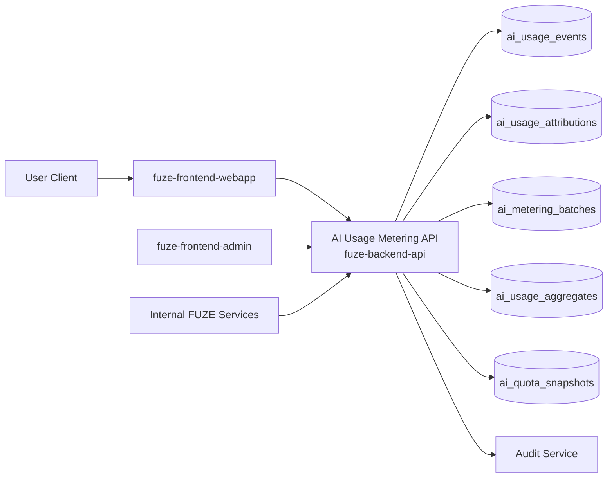
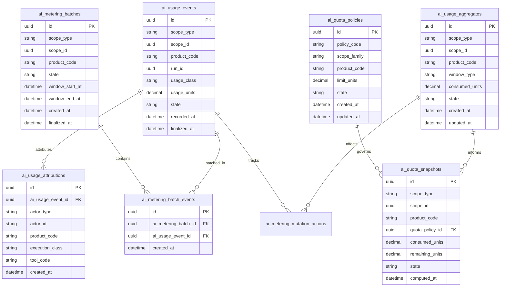
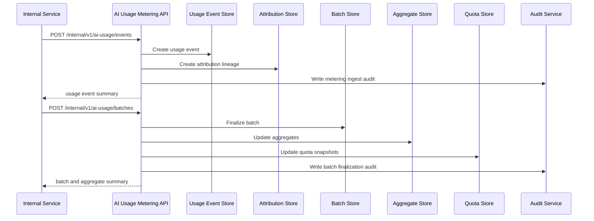

# AI_USAGE_METERING_API_SPEC

## 1. Title

**AI_USAGE_METERING_API_SPEC.md**

---

## 2. Document Metadata

- **Document Name:** AI_USAGE_METERING_API_SPEC.md
- **API Classification:** public, internal, admin, event-driven
- **Owning Domain:** AI Usage Metering Domain
- **Primary Implementing Repo:** `fuze-backend-api`
- **Primary System of Record:** AI usage events, metering aggregates, billable usage units, attribution lineage, quota state, and adjustment-safe metering records in `fuze-backend-api`
- **Status:** Draft for canonical source-of-truth approval
- **Purpose:** Define the production-grade API contract architecture for FUZE AI usage metering, consumption attribution, quota and budget visibility, metered-unit recording, and controlled correction-safe AI consumption accounting across the platform
- **Canonical Folder:** `fuze.ac > docs > api-spec`

---

## 2.1 API Classification Header

- **API Classification:** public | internal | admin | event-driven
- **Owning Domain:** AI Usage Metering Domain
- **Primary Implementing Repo:** `fuze-backend-api`
- **Primary System of Record:** AI usage metering and attribution domain

---

## 3. Purpose

This document defines the canonical API specification for FUZE AI usage metering operations. It translates the governing FUZE platform architecture, AI orchestration rules, model-routing and context rules, subscriptions and usage billing rules, Platform Credits semantics, workflow/async execution rules, audit requirements, security controls, and API architecture rules into an implementation-ready API contract.

This API exists because FUZE is a platform of AI-enabled products with shared orchestration and shared commercial controls. AI usage must therefore be tracked consistently across products, scopes, models, tool calls, and execution classes. Metering cannot be left as a product-local estimate or provider-local invoice artifact. It must be platform-owned, explicitly attributed, correction-safe, and clearly separated from orchestration truth, billing truth, Platform Credits truth, and product business truth.

Accordingly, this specification defines how AI consumption events are represented, how usage units are normalized and attributed to account/workspace/product/run context, how meter summaries and quota/budget views are exposed, how metering records are accepted and finalized, and how metering remains bounded, auditable, idempotent, and architecture-consistent.

---

## 4. Scope

This specification covers:

- AI usage summary visibility APIs
- quota, limit, and budget visibility APIs
- internal service APIs for AI usage event recording
- metering finalization and aggregation APIs
- model/tool/run usage attribution APIs
- admin/control-plane APIs for correction-safe usage adjustments, suppression, or discrepancy resolution
- event emission requirements for AI metering lifecycle changes
- request, response, error, idempotency, versioning, audit, and database-shape rules for this domain

This specification does **not** redefine:

- AI orchestration lifecycle semantics in full detail
- model-routing policy in full detail
- Platform Credits ledger semantics in full detail
- subscriptions and billing semantics in full detail
- product-specific pricing plans in full detail
- workflow engine semantics in full detail
- product business truth
- provider invoice schemas or low-level provider cost exports

Those remain governed by their own source-of-truth specifications.

---

## 5. Source-of-Truth Inputs

### Primary FUZE docs and specs used

#### Highest-priority platform and ownership sources
- `SYSTEM_SPEC_INDEX.md`
- `SYSTEM_BOUNDARY_AND_OWNERSHIP_SPEC.md`
- `SYSTEM_OVERVIEW_AND_BOUNDARIES_SPEC.md`
- `PLATFORM_ARCHITECTURE_SPEC.md`
- `DOMAIN_OWNERSHIP_MATRIX_SPEC.md`
- `DATA_MODEL_AND_ENTITY_OWNERSHIP_SPEC.md`

#### Primary AI / metering / commercial sources
- `AI_USAGE_METERING_SPEC.md`
- `AI_ORCHESTRATION_SPEC.md`
- `MODEL_ROUTING_AND_CONTEXT_SPEC.md`
- `WORKFLOW_AND_AUTOMATION_SPEC.md`
- `JOB_QUEUE_AND_WORKER_SPEC.md`
- `SUBSCRIPTIONS_AND_USAGE_BILLING_SPEC.md`
- `PLATFORM_CREDITS_SPEC.md`
- `PRICING_AND_MONETIZATION_MODEL_SPEC.md`

#### API and runtime sources
- `API_ARCHITECTURE_SPEC.md`
- `PUBLIC_API_SPEC.md`
- `INTERNAL_SERVICE_API_SPEC.md`
- `EVENT_MODEL_AND_WEBHOOK_SPEC.md`
- `IDEMPOTENCY_AND_VERSIONING_SPEC.md`
- `MIGRATION_AND_BACKWARD_COMPATIBILITY_SPEC.md`
- `AUDIT_LOG_AND_ACTIVITY_SPEC.md`

#### Security and operations sources
- `SECURITY_AND_RISK_CONTROL_SPEC.md`
- `MONITORING_ALERTING_AND_INCIDENT_RESPONSE_SPEC.md`
- `SECRETS_CONFIG_AND_ENVIRONMENT_SPEC.md`

#### Product integration context
- `PRODUCT_INTEGRATION_ARCHITECTURE_SPEC.md`
- `QTB_PRODUCT_INTEGRATION_SPEC.md`
- `AIMM_PRODUCT_INTEGRATION_SPEC.md`
- `ZAGA_PRODUCT_INTEGRATION_SPEC.md`
- `AIE_PRODUCT_INTEGRATION_SPEC.md`
- `HERHELP_PRODUCT_INTEGRATION_SPEC.md`
- `BOTMAD_PRODUCT_INTEGRATION_SPEC.md`

#### Format guides
- `The_API_Specification_guide.md`
- `Database_Schemas_Guide.md`

### Highest-priority interpretation applied

For this file, the most important governing interpretation is:

1. AI usage metering is a platform-owned accounting and attribution layer, not a product-local estimate
2. backend owns canonical metering truth
3. AI orchestration truth, usage metering truth, billing truth, and credits truth are related but distinct
4. products may originate usage signals through platform orchestration flows but do not redefine metering semantics
5. admin/control-plane may correct or suppress metering under controlled policy but do not own metering truth
6. metering must preserve explicit attribution to scope, product, run, model/tool class, and correction lineage

### Supporting external standards used only as guidance

- HTTP semantics for safe reads and mutation responses
- structured problem-details error design
- general metering and usage-accounting lineage patterns as supporting guidance

External guidance does not override FUZE source-of-truth documents.

---

## 6. Governing Architecture and Ownership Interpretation

This API belongs to the **AI Usage Metering Domain** because it owns the canonical accounting of AI consumption events, normalized usage units, attribution, aggregate summaries, and correction-safe metering lineage across FUZE.

This API is implemented primarily in `fuze-backend-api` because:

- backend owns durable metering truth
- frontend surfaces must consume usage summaries, not author them
- usage accounting crosses products and shared AI capabilities
- downstream billing, credits, quota, and reporting flows require a trusted metering source
- remediation, adjustments, and audit generation must be backend-governed

This API is **not** owned by:

- `fuze-frontend-webapp`, because webapp only reads metering summaries and bounded quota/budget views
- `fuze-frontend-admin`, because admin may correct or resolve discrepancies but must not own metering truth
- AI orchestration domain, because orchestration owns run lifecycle while metering owns consumption accounting
- billing domain, because billing consumes metering results and rules, but does not own raw metering truth
- product domains, because products may request AI execution and consume summaries but do not define cross-platform metering semantics

### Architectural implications

- one orchestration run may generate one or more usage events
- usage may arise from model execution, tool invocation, retrieval/context expansion, or other governed cost-bearing execution classes depending on policy
- metering events must preserve scope, product, run, and execution attribution
- aggregate quota or budget views are derived from canonical usage events and policy configuration
- metering correction must preserve immutable lineage rather than rewrite prior records
- metering completion does not itself mean billing or credits deduction has occurred

---

## 7. Domain Responsibilities

The AI Usage Metering API domain is responsible for:

1. maintaining canonical AI usage event records
2. normalizing usage units from orchestration and tool execution lineage
3. attributing usage to account/workspace/product/run context
4. exposing bounded metering summaries for user, product, and internal service consumers
5. exposing quota, limit, and budget views where policy allows
6. supporting internal service metering ingestion and finalization
7. supporting admin/control-plane correction-safe adjustments and discrepancy resolution
8. emitting AI metering lifecycle events
9. generating audit lineage for sensitive metering actions
10. preserving separation between metering, orchestration, billing, and credits

The domain is not responsible for:

- owning AI orchestration lifecycle truth
- owning final subscription billing truth
- owning Platform Credits ledger truth
- owning product business truth
- owning provider invoice truth
- owning payout or treasury behavior

---

## 8. Out of Scope

The following are out of scope for this API specification:

- low-level provider token schema normalization details
- final billing charge calculation formulas
- final credits deduction logic
- product-local pricing table design
- full budget-policy authoring system
- full anomaly-detection engine internals
- final retrieval cost-class taxonomy for every future tool
- external analytics warehouse schema design

Where later detailed specs are needed, they must remain compatible with this API.

---

## 9. Canonical Entities and Data Ownership

### Durable entities

#### 9.1 ai_usage_events
- **Owner:** AI Usage Metering Domain
- **Purpose:** canonical normalized AI consumption event records
- **Nature:** source-of-truth durable entity

#### 9.2 ai_usage_attributions
- **Owner:** AI Usage Metering Domain
- **Purpose:** explicit attribution of usage to scope, product, run, actor, capability, and execution class
- **Nature:** source-of-truth durable lineage entity

#### 9.3 ai_metering_batches
- **Owner:** AI Usage Metering Domain
- **Purpose:** grouping/finalization records for usage events before or during aggregation
- **Nature:** durable source-of-truth batch lineage

#### 9.4 ai_usage_aggregates
- **Owner:** AI Usage Metering Domain
- **Purpose:** canonical aggregate summaries by scope/product/window where policy requires durable persistence
- **Nature:** source-of-truth durable aggregate entity, always reconcilable from usage events and attribution lineage

#### 9.5 ai_quota_policies
- **Owner:** AI Usage Metering Domain
- **Purpose:** named quota/limit/budget configuration references applied to scope or product contexts
- **Nature:** source-of-truth durable entity

#### 9.6 ai_quota_snapshots
- **Owner:** AI Usage Metering Domain
- **Purpose:** time-bounded snapshot of consumption versus quota/budget posture
- **Nature:** durable derived summary with explicit lineage

#### 9.7 ai_metering_adjustments
- **Owner:** AI Usage Metering Domain
- **Purpose:** controlled corrective increase/decrease or suppression of usage records
- **Nature:** durable corrective lineage entity

#### 9.8 ai_metering_mutation_actions
- **Owner:** AI Usage Metering Domain
- **Purpose:** high-level action records for ingest, finalize, adjust, suppress, remediate, and close discrepancy actions
- **Nature:** durable action records with audit linkage

#### 9.9 ai_metering_audit_events
- **Owner:** Audit / Activity domain, sourced by AI Usage Metering Domain
- **Purpose:** immutable trail for sensitive metering actions
- **Nature:** durable audit records

### Derived or cached entities

#### 9.10 ai_usage_summary_views
- **Owner:** derived read-model layer
- **Purpose:** user-facing and product-facing metering summaries
- **Nature:** derived

#### 9.11 ai_quota_status_views
- **Owner:** derived read-model layer
- **Purpose:** bounded quota, limit, and budget status summaries
- **Nature:** derived

#### 9.12 ai_metering_discrepancy_views
- **Owner:** derived ops read-model layer
- **Purpose:** visibility into metering inconsistencies or pending correction flows
- **Nature:** derived

---

## 10. State Model and Lifecycle

### 10.1 usage event lifecycle

Possible states:

- `recorded`
- `validated`
- `finalized`
- `suppressed`
- `superseded`
- `invalidated`

### 10.2 metering batch lifecycle

Possible states:

- `collecting`
- `ready`
- `finalized`
- `corrected`
- `superseded`

### 10.3 aggregate lifecycle

Possible states:

- `current`
- `stale`
- `recomputed`
- `superseded`

### 10.4 adjustment lifecycle

Possible states:

- `requested`
- `approved_if_required`
- `applied`
- `failed`
- `cancelled`
- `closed`

### 10.5 quota snapshot lifecycle

Possible states:

- `current`
- `exceeded`
- `warning`
- `stale`
- `superseded`

Lifecycle notes:
- usage events must not become billable/consumable platform accounting truth until validated/finalized by policy
- suppression and invalidation preserve lineage instead of deleting records
- aggregate recomputation must preserve explicit supersession history where durable aggregates are stored
- quota status is derived from canonical events and policy, not a free-floating mutable field

---

## 11. API Surface Overview

The API surface is divided into four families:

### 11.1 Public / first-party user-facing APIs
Used by `fuze-frontend-webapp` and approved first-party clients for:
- reading usage summaries
- reading quota, limit, and budget posture
- reading product- and scope-bounded metering history summaries
- reading bounded run-linked usage summaries where visible

### 11.2 Internal service APIs
Used by trusted internal services for:
- recording usage events
- finalizing metering batches
- reading canonical usage and aggregate summaries
- checking quota/budget posture during AI execution decisions

### 11.3 Admin / control-plane APIs
Used by `fuze-frontend-admin` through backend-only privileged routes for:
- adjustment or suppression actions
- metering discrepancy resolution
- aggregate recomputation or forced refresh under controlled policy
- quota-policy remediation actions where allowed

### 11.4 Event-driven interfaces
Used for downstream side effects:
- billing and credits usage routing
- workflow continuation or throttling decisions
- analytics and anomaly detection
- audit generation
- monitoring and reporting

---

## 12. Authentication and Authorization Model

### 12.1 Authentication posture by route family

#### Authenticated user routes
Require valid authenticated session:
- read own account AI usage summary
- read workspace AI usage summary if actor is authorized
- read quota/limit/budget posture in visible scope
- read visible bounded metering history

#### Internal service routes
Require internal service identity with explicit least privilege:
- record usage events
- finalize metering
- read canonical aggregates
- check quota status during orchestration or workflow execution

#### Admin routes
Require privileged operator identity plus reason-coded actions:
- apply metering adjustments or suppressions
- resolve discrepancies
- trigger recomputation or forced refresh
- remediate quota-policy issues where allowed

### 12.2 Authorization checkpoints

Authorization must evaluate:
- canonical account identity
- session validity
- target scope and product context
- actor’s workspace role where applicable
- whether requested visibility level is allowed
- whether internal service has required metering mutation privilege
- whether admin/operator role is present for privileged actions

### 12.3 Sensitive action rules

The following require heightened checks:
- internal usage-event recording for monetizable execution classes
- batch finalization
- metering adjustments and suppressions
- aggregate recomputation with downstream effect
- discrepancy-resolution actions

---

## 13. API Endpoints / Interface Contracts

## 13.1 Public / First-Party User APIs

### 13.1.1 `GET /v1/ai-usage/me`
**Purpose:** retrieve current account-scoped AI usage summary for current actor  
**Caller Type:** authenticated user  
**Auth Expectation:** valid authenticated session  
**Response Summary:**
- current usage totals by selected windows
- product summaries
- quota/budget posture summaries
- freshness metadata
**Side Effects:** none
**Audit Requirements:** access logging only
**Emitted Events:** none required

### 13.1.2 `GET /v1/workspaces/{workspace_id}/ai-usage`
**Purpose:** retrieve workspace-scoped AI usage summary where actor is authorized  
**Caller Type:** authenticated user  
**Response Summary:** workspace usage totals, product summaries, quota posture, and freshness metadata
**Side Effects:** none

### 13.1.3 `GET /v1/ai-usage/history`
**Purpose:** list bounded AI usage history summaries for current actor’s account scope  
**Caller Type:** authenticated user  
**Query Parameters Summary:**
- pagination
- optional date range
- optional product filters
- optional execution class filters
**Response Summary:** bounded usage-event or aggregate-window summaries
**Side Effects:** none

### 13.1.4 `GET /v1/workspaces/{workspace_id}/ai-usage/history`
**Purpose:** list bounded AI usage history summaries for authorized workspace scope  
**Caller Type:** authenticated user  
**Response Summary:** workspace usage-history summaries
**Side Effects:** none

### 13.1.5 `GET /v1/ai-usage/quota-status`
**Purpose:** retrieve quota, limit, and budget posture for current actor’s account scope  
**Caller Type:** authenticated user  
**Response Summary:**
- active quota policy summaries
- consumed vs remaining summaries
- warning/exceeded posture
- freshness metadata
**Side Effects:** none

### 13.1.6 `GET /v1/workspaces/{workspace_id}/ai-usage/quota-status`
**Purpose:** retrieve quota, limit, and budget posture for authorized workspace scope  
**Caller Type:** authenticated user  
**Response Summary:** workspace quota/budget posture summary
**Side Effects:** none

## 13.2 Internal Service APIs

### 13.2.1 `POST /internal/v1/ai-usage/events`
**Purpose:** record normalized AI usage event from orchestration or governed tool execution  
**Caller Type:** internal trusted services  
**Auth Expectation:** service-to-service identity only  
**Request Body Summary:**
- `scope_type`
- `scope_id`
- `product_code`
- `run_id`
- `capability_code`
- `usage_class`
- `usage_units`
- optional `provider_usage_metadata`
- optional `tool_code`
- `idempotency_key`
**Response Summary:** recorded usage-event summary and attribution summary
**Side Effects:** creates usage event and attribution lineage
**Idempotency Behavior:** required
**Audit Requirements:** sensitive metering ingestion audit where policy requires
**Emitted Events:** `ai_usage.event_recorded`

### 13.2.2 `POST /internal/v1/ai-usage/batches`
**Purpose:** finalize one metering batch or grouping of usage events  
**Caller Type:** internal trusted services with metering authority  
**Request Body Summary:**
- `scope_type`
- `scope_id`
- `product_code` optional
- `usage_event_ids[]` or finalize filter criteria
- `idempotency_key`
**Response Summary:** batch summary, affected aggregate summaries, quota snapshot summary
**Side Effects:** finalizes metering batch, updates aggregates and quota snapshots
**Idempotency Behavior:** required
**Audit Requirements:** critical metering-finalization audit
**Emitted Events:** `ai_usage.batch_finalized`

### 13.2.3 `POST /internal/v1/ai-usage/quota-checks`
**Purpose:** determine whether an AI action may proceed under current quota/budget posture  
**Caller Type:** internal trusted services  
**Request Body Summary:**
- `scope_type`
- `scope_id`
- `product_code`
- `capability_code`
- `projected_usage_units`
- optional `usage_class`
**Response Summary:**
- allow / deny / warn
- current quota posture
- projected effect summary
**Side Effects:** none by default
**Audit Requirements:** internal access logging; durable evaluation optional for sensitive flows
**Emitted Events:** none required

### 13.2.4 `GET /internal/v1/ai-usage/scopes/{scope_type}/{scope_id}`
**Purpose:** retrieve canonical AI usage summary for trusted services  
**Caller Type:** internal trusted services  
**Response Summary:** aggregate summaries, quota posture, freshness metadata, and relevant batch status
**Side Effects:** none

## 13.3 Admin / Control-Plane APIs

### 13.3.1 `POST /admin/v1/ai-usage/adjustments`
**Purpose:** apply controlled metering adjustment under policy  
**Caller Type:** admin/operator  
**Request Body Summary:**
- `scope_type`
- `scope_id`
- optional `product_code`
- `adjustment_units`
- `direction`
- `reason_code`
- `operator_note`
- optional `related_case_id`
- `idempotency_key`
**Response Summary:** adjustment summary and resulting aggregate/quota summary
**Side Effects:** creates metering adjustment lineage and updates derived posture
**Audit Requirements:** critical audit
**Emitted Events:** `ai_usage.adjusted`

### 13.3.2 `POST /admin/v1/ai-usage/events/{usage_event_id}/suppress`
**Purpose:** suppress or invalidate one metering event under controlled policy  
**Caller Type:** admin/operator  
**Request Body Summary:**
- `reason_code`
- `operator_note`
- `idempotency_key`
**Response Summary:** updated usage-event summary and affected aggregate posture
**Side Effects:** usage event transitions to suppressed or invalidated, aggregates may refresh
**Audit Requirements:** critical audit
**Emitted Events:** `ai_usage.event_suppressed`

### 13.3.3 `POST /admin/v1/ai-usage/recomputations`
**Purpose:** trigger controlled aggregate or quota recomputation for a target scope  
**Caller Type:** admin/operator  
**Request Body Summary:**
- `scope_type`
- `scope_id`
- optional `product_code`
- `recompute_reason_code`
- `operator_note`
- `idempotency_key`
**Response Summary:** recomputation action summary
**Side Effects:** may recompute aggregates and quota snapshots with preserved lineage
**Audit Requirements:** critical audit
**Emitted Events:** `ai_usage.recomputed`

### 13.3.4 `POST /admin/v1/ai-usage/discrepancies`
**Purpose:** resolve AI metering discrepancy under controlled policy  
**Caller Type:** admin/operator  
**Request Body Summary:**
- `scope_type`
- `scope_id`
- optional `product_code`
- `resolution_code`
- `operator_note`
- `related_case_id`
- `idempotency_key`
**Response Summary:** discrepancy-resolution summary
**Side Effects:** may adjust, suppress, recompute, or close discrepancy posture with preserved lineage
**Audit Requirements:** critical audit
**Emitted Events:** `ai_usage.discrepancy_resolved`

---

## 14. Request Rules

### 14.1 General request rules
- all mutation-capable routes must require JSON requests with explicit content type
- all mutation routes must carry correlation IDs
- sensitive metering mutations must carry idempotency keys
- admin mutations must require reason codes and operator notes
- no route may accept frontend-computed usage totals as authoritative input

### 14.2 Sensitive-action request requirements
The following requests require heightened validation:
- usage-event recording for monetizable execution classes
- batch finalization
- metering adjustment
- event suppression
- recomputation and discrepancy-resolution actions

Heightened validation may include:
- scope authorization checks
- run and execution-class linkage validation
- duplicate event checks
- policy checks for quota-sensitive classes
- operator role confirmation
- support/finance case linkage for admin flows

### 14.3 Scope integrity rule
Metering mutations must target valid and authorized scopes and product contexts. Product or service callers must not create or mutate usage records for unrelated or unauthorized scopes.

### 14.4 Downstream-separation rule
Metering finalization must not itself silently imply billing, credits deduction, or business-truth mutation in another domain. Those downstream effects must be explicitly triggered and owned by their respective domains.

---

## 15. Response Rules

### 15.1 Success response rules
Successful responses must include:
- stable resource identifiers
- timestamps for created/updated state
- state/status values
- scope, product, and execution-class summaries
- quota or aggregate summaries where relevant
- correlation references for mutations

### 15.2 Async-accepted response rules
If finalization, recomputation, or discrepancy resolution is async, the response must:
- return accepted status
- include action or job ID
- provide follow-up status semantics

### 15.3 Terminal mutation response rules
Terminal mutation responses must clearly show:
- target event, batch, or scope
- mutation type
- resulting event, aggregate, or quota state
- downstream summary changes where relevant
- whether user-visible posture may refresh asynchronously

### 15.4 Read response rules
Read responses must distinguish:
- durable metering truth
- derived summary or quota posture
- bounded history summaries
- operator-only details that must remain excluded from user-facing views

---

## 16. Error Model

The API uses structured problem-details style error responses.

### 16.1 Required error fields
- `type`
- `title`
- `status`
- `code`
- `detail`
- `instance`
- `correlation_id`

### 16.2 Common error codes

#### Authorization / permission errors
- `AI_USAGE_SESSION_REQUIRED`
- `AI_USAGE_PERMISSION_DENIED`
- `AI_USAGE_OPERATOR_PERMISSION_DENIED`
- `AI_USAGE_SERVICE_PERMISSION_DENIED`

#### State conflict errors
- `AI_USAGE_EVENT_STATE_INVALID`
- `AI_USAGE_BATCH_STATE_INVALID`
- `AI_USAGE_EVENT_ALREADY_FINALIZED`
- `AI_USAGE_EVENT_ALREADY_SUPPRESSED`
- `AI_USAGE_RECOMPUTE_CONFLICT`

#### Policy / safety errors
- `AI_USAGE_SCOPE_RESTRICTED`
- `AI_USAGE_QUOTA_EXCEEDED`
- `AI_USAGE_QUOTA_CHECK_REQUIRED`
- `AI_USAGE_CLASS_NOT_ALLOWED`
- `AI_USAGE_DOWNSTREAM_CORRECTION_REQUIRED`

#### Request integrity errors
- `AI_USAGE_IDEMPOTENCY_KEY_REQUIRED`
- `AI_USAGE_REQUEST_INVALID`
- `AI_USAGE_REQUEST_UNPROCESSABLE`

#### Dependency or provider errors
- `AI_USAGE_AGGREGATION_UNAVAILABLE`
- `AI_USAGE_ORCHESTRATION_LINK_UNAVAILABLE`
- `AI_USAGE_RECOMPUTE_UNAVAILABLE`

### 16.3 Error handling rules
- do not expose hidden operator-only or anomaly-detection internals
- do not imply billing or credits deduction solely from metering event recording
- distinguish quota-exceeded from generic scope restriction
- distinguish invalid run linkage from duplicate already-recorded event
- include retry guidance only where safe

---

## 17. Idempotency and Mutation Safety

### 17.1 Required idempotent mutations
The following mutation routes require idempotent behavior:
- usage-event recording
- batch finalization
- metering adjustment
- event suppression
- recomputation
- discrepancy resolution

### 17.2 Idempotency key rules
- mutation requests must supply `Idempotency-Key`
- backend stores key scope, request hash, actor, and terminal result
- replay of same semantic request returns original terminal outcome
- replay of same key with different semantic request must fail with conflict

### 17.3 Mutation safety rules
- the same usage event must not be recorded twice in conflicting ways
- finalized batches must not be re-applied without explicit supersession or correction path
- suppression must preserve prior lineage and not silently delete events
- recomputation must preserve aggregate supersession lineage
- adjustments must preserve immutable correction history rather than rewrite raw usage events unless suppression/invalidation semantics are explicitly used

---

## 18. Versioning and Compatibility Rules

### 18.1 Versioning
This API family is versioned under `/v1`, `/internal/v1`, and `/admin/v1` route families.

### 18.2 Compatibility approach
- additive evolution preferred
- no silent semantic change to event, batch, aggregate, quota, or adjustment states
- new usage classes may be added without breaking existing contracts
- response fields may be added but existing meanings must remain stable

### 18.3 Breaking-change rules
Breaking changes include:
- changing the meaning of finalized, suppressed, invalidated, or exceeded states
- changing quota snapshot semantics incompatibly
- removing critical event or aggregate fields
- changing usage attribution semantics incompatibly

Such changes require explicit migration planning and version evolution.

### 18.4 Deprecation
Deprecated routes or fields must:
- be documented explicitly
- carry deprecation metadata where supported
- preserve compatibility windows long enough for first-party consumers and future SDKs

---

## 19. Event Emission and Webhook Behavior

This domain is event-capable.

### 19.1 Internal events
The AI Usage Metering domain must emit canonical internal events such as:
- `ai_usage.event_recorded`
- `ai_usage.batch_finalized`
- `ai_usage.adjusted`
- `ai_usage.event_suppressed`
- `ai_usage.recomputed`
- `ai_usage.discrepancy_resolved`
- `ai_usage.quota_exceeded`
- `ai_usage.quota_warning`

### 19.2 Event payload minimums
Each event should contain:
- event ID
- event type
- occurred_at
- scope type and scope ID
- product code and usage class where relevant
- usage event ID or batch ID where relevant
- run ID where relevant
- actor type
- correlation ID
- reason code where applicable

### 19.3 External webhook posture
This specification does not expose general third-party outbound metering webhooks by default. Any future outbound AI-usage webhook surface must be narrow, security-reviewed, and governed by a separate contract.

---

## 20. Audit and Activity Requirements

The following actions must generate durable audit events:

- sensitive usage-event recording where policy requires
- batch finalization
- metering adjustments
- event suppression
- recomputation actions
- discrepancy resolution
- quota-policy-sensitive override actions
- other sensitive metering flows

### Required audit fields
- audit event ID
- actor type and actor reference
- scope type and scope reference
- target event / batch / aggregate / action reference as applicable
- action type
- before/after metering summary where applicable
- reason code
- correlation ID
- operator note if operator action
- occurred_at

User-facing activity feeds may show a filtered subset, but audit truth must remain durable and immutable.

---

## 21. Data Model and Database Schema View

### 21.1 `ai_usage_events`
- `id` PK
- `scope_type`
- `scope_id`
- `product_code`
- `run_id` nullable
- `capability_code` nullable
- `usage_class`
- `usage_units`
- `state`
- `recorded_at`
- `finalized_at` nullable
- `suppressed_at` nullable
- `created_at`
- `updated_at`

**Constraints:**
- index on (`scope_type`, `scope_id`)
- index on (`product_code`, `usage_class`)
- index on `state`

### 21.2 `ai_usage_attributions`
- `id` PK
- `ai_usage_event_id` FK -> `ai_usage_events.id`
- `actor_type`
- `actor_id`
- `workspace_id` nullable
- `product_code`
- `capability_code` nullable
- `execution_class`
- `tool_code` nullable
- `created_at`

**Constraints:**
- index on `ai_usage_event_id`
- index on (`product_code`, `execution_class`)

### 21.3 `ai_metering_batches`
- `id` PK
- `scope_type`
- `scope_id`
- `product_code` nullable
- `state`
- `window_start_at`
- `window_end_at`
- `created_at`
- `finalized_at` nullable
- `superseded_at` nullable

**Constraints:**
- index on (`scope_type`, `scope_id`)
- index on `state`

### 21.4 `ai_metering_batch_events`
- `id` PK
- `ai_metering_batch_id` FK -> `ai_metering_batches.id`
- `ai_usage_event_id` FK -> `ai_usage_events.id`
- `created_at`

**Constraints:**
- unique (`ai_metering_batch_id`, `ai_usage_event_id`)
- index on `ai_metering_batch_id`

### 21.5 `ai_usage_aggregates`
- `id` PK
- `scope_type`
- `scope_id`
- `product_code` nullable
- `window_type`
- `window_start_at`
- `window_end_at`
- `consumed_units`
- `state`
- `created_at`
- `updated_at`
- `superseded_at` nullable

**Constraints:**
- index on (`scope_type`, `scope_id`, `window_type`)
- index on `state`

### 21.6 `ai_quota_policies`
- `id` PK
- `policy_code`
- `scope_family`
- `product_code` nullable
- `state`
- `limit_units`
- `warning_threshold_json`
- `window_type`
- `created_at`
- `updated_at`

**Constraints:**
- unique `policy_code`
- index on `state`

### 21.7 `ai_quota_snapshots`
- `id` PK
- `scope_type`
- `scope_id`
- `product_code` nullable
- `quota_policy_id` FK -> `ai_quota_policies.id`
- `consumed_units`
- `remaining_units`
- `state`
- `computed_at`
- `superseded_at` nullable

**Constraints:**
- index on (`scope_type`, `scope_id`)
- index on `state`

### 21.8 `ai_metering_adjustments`
- `id` PK
- `scope_type`
- `scope_id`
- `product_code` nullable
- `direction`
- `adjustment_units`
- `reason_code`
- `state`
- `created_at`
- `applied_at` nullable
- `closed_at` nullable

### 21.9 `ai_metering_mutation_actions`
- `id` PK
- `target_reference_type`
- `target_reference_id`
- `action_type`
- `state`
- `reason_code`
- `operator_note` nullable
- `requested_by_actor_type`
- `requested_by_actor_id`
- `created_at`
- `executed_at` nullable
- `closed_at` nullable
- `correlation_id`

### 21.10 `idempotency_records`
- `id` PK
- `idempotency_key`
- `scope_family`
- `actor_reference`
- `request_hash`
- `response_hash`
- `terminal_status`
- `created_at`
- `expires_at`

### 21.11 `audit_log_entries`
Domain-sourced audit records written into the audit domain.

### Normalization notes
- canonical metering truth stays in usage events, attribution lineage, batches, aggregates, and quota snapshots
- orchestration run truth remains external and referenced, not duplicated as metering truth
- quota snapshots are derived from canonical events and policy and may be persisted for fast reads
- user-facing metering summaries are derived and must not replace canonical metering state

### Reconciliation notes
- one usage event should reconcile to one attribution lineage and zero or one finalized-batch inclusion path per policy
- aggregate recomputation must preserve supersession lineage
- quota snapshots must reconcile to aggregate or event totals under policy-defined windows
- suppression/invalidation must preserve explicit audit and adjustment lineage

---

## 22. Architecture Diagram — Mermaid flowchart



---

## 23. Data Design — Mermaid Diagram



---

## 24. Flow View

### 24.1 Happy path — usage event recording
1. orchestration or governed tool execution produces measurable usage
2. internal service records normalized usage event
3. backend validates run/scope/product attribution and policy
4. usage event and attribution lineage are created
5. audit event is written where required
6. `ai_usage.event_recorded` event is emitted

### 24.2 Happy path — batch finalization
1. internal service finalizes one usage batch or time/window grouping
2. backend validates included events and batch state
3. batch is finalized
4. aggregates and quota snapshots are updated
5. audit and `ai_usage.batch_finalized` event are emitted

### 24.3 Happy path — user reads usage and quota
1. authenticated actor requests account or workspace AI usage summary
2. backend validates scope visibility
3. backend returns bounded summary, quota posture, and freshness metadata
4. client displays current usage and quota state

### 24.4 Alternate path — quota warning or exceed
1. internal service performs quota check before or during AI execution flow
2. backend evaluates projected usage against active quota policies
3. backend returns warn or deny posture
4. orchestration or workflow layer decides whether to proceed, restrict, or require alternate path
5. quota-warning or quota-exceeded events may be emitted

### 24.5 Failure path — invalid run linkage or duplicate event
1. internal service records usage event
2. backend detects invalid run linkage, duplicate action reference, or invalid scope context
3. event is rejected
4. no finalized metering state is created

### 24.6 Failure and remediation path — incorrect metering
1. discrepancy is detected in usage totals or attribution
2. admin applies suppression, adjustment, or recomputation under controlled policy
3. backend preserves original event lineage
4. aggregates and quota snapshots refresh with explicit correction history
5. audit and discrepancy events are emitted

### 24.7 Retry behavior
- duplicate usage-event recording returns same terminal event result
- duplicate batch finalization returns same terminal batch result
- duplicate adjustment or suppression returns same terminal action result
- duplicate recomputation or discrepancy resolution returns same final correction result

---

## 25. Data Flows — Mermaid sequenceDiagram



---

## 26. Security and Risk Controls

1. **Metering truth is backend-owned**  
   Frontends and products may not authoritatively mark AI consumption totals outside approved backend APIs.

2. **Metering is distinct from orchestration, billing, and credits**  
   The API must keep usage-accounting semantics explicitly separate from run truth and downstream financial truth.

3. **Attribution integrity**  
   Usage events must validate scope, product, run, and execution-class linkage before becoming canonical metering truth.

4. **Least privilege**  
   Internal ingestion and finalization routes must be limited to authorized service callers with explicit privileges.

5. **Quota control support**  
   The domain must support explicit warn/exceeded posture without conflating it with billing or orchestration state.

6. **Immutable lineage**  
   Suppression, adjustment, recomputation, and discrepancy actions must preserve history instead of rewriting prior records.

7. **Problem-details discipline**  
   Error bodies must be structured and safe, without exposing hidden operator-only or anomaly-detection details.

8. **Audit immutability**  
   Sensitive metering actions require durable immutable audit lineage.

9. **Replay resistance**  
   Event recording, finalization, adjustment, suppression, and recomputation must be idempotent and replay-safe.

10. **Downstream separation**  
    Metering finalization must not silently mutate billing or credits truth without explicit downstream domain actions.

---

## 27. Operational Considerations

- usage-summary reads are user- and product-visible and should be highly available
- event recording and batch finalization are correctness-sensitive and must preserve attribution lineage
- aggregate and quota refresh latency should remain bounded enough for practical orchestration decisions
- suppressed or corrected events should remain visible to ops/audit surfaces with clear lineage
- monitoring should alert on:
  - spikes in duplicate event attempts
  - unusual quota-exceeded spikes
  - batch-finalization backlog growth
  - aggregate recomputation spikes
  - metering discrepancy spikes
  - run-linked metering validation failures

---

## 28. Acceptance Criteria

1. The API preserves the distinction between AI usage metering, AI orchestration, Platform Credits, billing, and product business truth.
2. Only `fuze-backend-api` owns canonical AI metering truth.
3. Usage events, attribution, batches, aggregates, and quota posture are durable and backend-owned.
4. Usage-event recording validates scope, product, and run attribution.
5. Batch finalization is explicit and updates aggregate/quota posture safely.
6. Metering adjustment, suppression, and recomputation preserve immutable lineage.
7. Quota posture is derived from canonical usage truth and policy.
8. Internal metering routes are least-privilege and backend-only.
9. Admin routes require reason-coded privileged authorization.
10. Event emissions exist for major metering mutations.
11. Response and error semantics are stable and machine-readable.
12. Database schema separates usage events, attribution, batches, aggregates, quota policies, and quota snapshots.
13. Products can consume canonical metering APIs without redefining metering semantics.
14. Discrepancy handling is supported and safely replayable.
15. Mermaid diagrams remain consistent with prose and data model.

---

## 29. Test Cases

### 29.1 Positive cases
1. Internal service records usage event successfully.
2. Internal service finalizes usage batch successfully.
3. Authenticated user reads account-scoped AI usage summary successfully.
4. Authorized workspace actor reads workspace quota status successfully.
5. Internal service performs quota check successfully.
6. Admin applies metering adjustment successfully.
7. Admin suppresses incorrect usage event successfully.
8. Admin triggers recomputation successfully.

### 29.2 Negative cases
9. Unauthenticated call to user AI-usage route is rejected.
10. User without workspace visibility cannot read workspace AI usage.
11. Recording usage event with invalid run linkage returns validation error.
12. Recording duplicate event in conflicting way returns conflict error.
13. Disallowed usage class returns `AI_USAGE_CLASS_NOT_ALLOWED`.
14. Quota-sensitive action requiring prior quota check returns `AI_USAGE_QUOTA_CHECK_REQUIRED` where policy applies.

### 29.3 Authorization cases
15. Ordinary user cannot call admin adjustment/suppress/recompute routes.
16. Internal service without metering privilege cannot record usage event.
17. Internal service without finalization privilege cannot finalize batch.
18. Product service cannot post frontend-computed totals as canonical metering truth.

### 29.4 Idempotency and replay cases
19. Repeating usage-event recording with same idempotency key returns original event result.
20. Repeating batch finalization with same idempotency key returns original batch result.
21. Repeating suppression with same idempotency key returns original suppression result.
22. Repeating recomputation with same idempotency key returns original recomputation result.

### 29.5 Concurrency cases
23. Concurrent duplicate event recordings produce one accepted event lineage and one duplicate-safe outcome.
24. Concurrent batch finalization and suppression preserve explicit aggregate/quotas lineage without hidden overwrite.
25. Concurrent recomputation and adjustment preserve explicit supersession history for aggregates and snapshots.

### 29.6 Recovery / admin cases
26. Suppressed usage event remains historically linked while removed from normal aggregate posture.
27. Discrepancy resolution updates aggregate or quota posture safely under controlled policy.
28. Recomputed aggregates preserve explicit supersession lineage for previous aggregate state.

### 29.7 Event and audit cases
29. Successful usage-event recording emits `ai_usage.event_recorded`.
30. Successful batch finalization emits `ai_usage.batch_finalized`.
31. Successful adjustment emits `ai_usage.adjusted`.
32. Successful discrepancy resolution emits `ai_usage.discrepancy_resolved` with critical audit lineage.

---

## 30. Open Questions or Explicit Deferred Decisions

1. Exact normalized AI usage unit taxonomy across all providers is deferred.
2. Exact quota-policy hierarchy across account, workspace, and product scopes is deferred.
3. Exact budget-warning threshold model is deferred.
4. Exact linkage between metering units and credits or billing charge units for every product is deferred.
5. Exact user-visible history granularity is deferred.
6. Exact discrepancy taxonomy for metering anomalies is deferred.

---

## 31. Implementation Notes for `fuze-backend-api`

Recommended backend module layout:

```text
modules/platform/
  ai-usage-metering/
  ai-orchestration/
  commerce-billing/
  platform-credits/
  audit-log/
  control-plane/
```

Implementation guidance:
- keep usage-event identity, attribution, batch finalization, aggregate computation, and quota posture in one canonical domain service
- perform run-linkage, scope-linkage, and duplicate-event checks inside the commit boundary
- keep suppression, adjustment, and recomputation explicit and idempotent
- treat admin remediations as domain actions, not ad hoc row edits
- emit events only after canonical state commit succeeds
- publish user-facing metering summaries from canonical truth; do not let derived views mutate metering state

---

## 32. Frontend Consumption Notes

### For `fuze-frontend-webapp`
- may read usage summaries, bounded history, and quota posture
- must not infer canonical usage totals from client-side estimation alone
- must treat backend metering responses as authoritative
- should clearly distinguish current usage, quota warning, and quota exceeded posture
- should not present metering as direct billing or credits deduction unless downstream domains separately confirm that outcome

### For `fuze-frontend-admin`
- may trigger privileged adjustment, suppression, recomputation, and discrepancy actions only through backend admin APIs
- must require operator reason input for sensitive mutations
- must not directly mutate metering truth client-side
- should present immutable audit-linked summaries after privileged actions

---

## 33. Contract Derivation Notes

### OpenAPI / AsyncAPI
This spec should later derive into:
- usage-summary and quota-status read operations
- internal usage-event and batch-finalization operations
- quota-check operations
- admin adjustment / suppression / recomputation / discrepancy operations
- shared problem-details schema
- AI metering events in AsyncAPI

### Future `fuze-sdk`
Future `fuze-sdk` packages may derive:
- AI usage summary helpers
- quota-status helpers
- typed usage event, aggregate, and quota models
- problem-error models for metering outcomes

The SDK must derive from approved API contracts and must not become the source of truth over this narrative specification.
