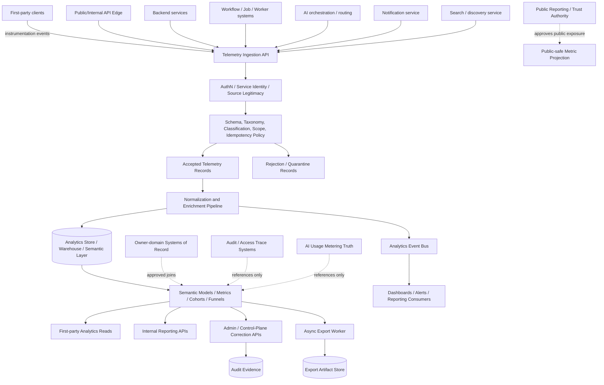
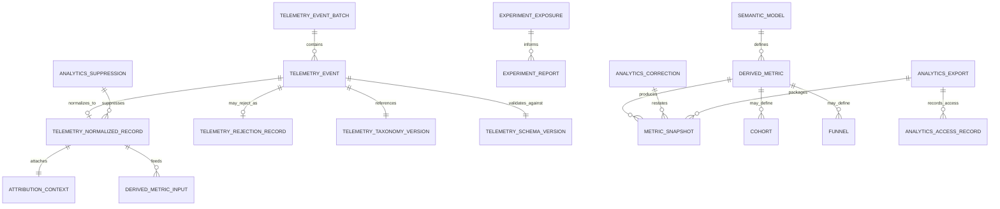
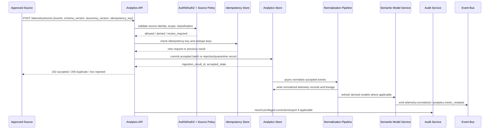

# FUZE Analytics and Product Telemetry API Specification

## Document Metadata

- **Document Name:** `ANALYTICS_AND_PRODUCT_TELEMETRY_API_SPEC.md`
- **Document Type:** Production-grade API SPEC v2
- **Status:** Draft API specification derived from active refined system semantics
- **Version:** 2.0.0
- **Effective Date:** 2026-04-25
- **Last Updated:** 2026-04-25
- **Reviewed On:** 2026-04-25
- **Document Owner:** FUZE Platform Analytics and Product Telemetry Governance Domain; named individual owner not explicitly specified in retrieved governing materials
- **Approval Authority:** FUZE Platform Architecture and Specification Governance Domain; explicit named approver not yet known
- **Review Cadence:** Quarterly and whenever analytics taxonomy, telemetry collection, warehouse posture, experimentation, notification analytics, AI metering, privacy/data handling, public reporting, or product instrumentation materially changes
- **Governing Layer:** API SPEC v2 / analytics and product telemetry interface-contract layer
- **Parent Registry:** `API_SPEC_INDEX.md`
- **Upstream Semantic Registry:** `REFINED_SYSTEM_SPEC_INDEX.md`
- **Upstream API Registry:** `API_SPEC_INDEX.md`
- **Primary Audience:** API architecture, backend engineering, frontend engineering, data engineering, analytics engineering, product engineering, AI engineering, security, audit/compliance, support/control-plane operators, finance/product operations, implementation-contract authors, SDK/OpenAPI authors, reporting authors
- **Primary Purpose:** Define the FUZE API contract posture for telemetry ingestion, normalized telemetry reads, derived analytics reads, metric and semantic-model references, experiment exposure capture, analytics correction/restatement/suppression, exports, and reporting-safe derived analytics surfaces without allowing analytics APIs to become hidden business, audit, billing, notification, AI metering, or public-publication truth
- **Primary Upstream References:** `REFINED_SYSTEM_SPEC_INDEX.md`, `ANALYTICS_AND_PRODUCT_TELEMETRY_SPEC.md`, `API_ARCHITECTURE_SPEC.md`, `PUBLIC_API_SPEC.md`, `INTERNAL_SERVICE_API_SPEC.md`, `EVENT_MODEL_AND_WEBHOOK_SPEC.md`, `IDEMPOTENCY_AND_VERSIONING_SPEC.md`, `MIGRATION_AND_BACKWARD_COMPATIBILITY_SPEC.md`, `DATA_CLASSIFICATION_AND_HANDLING_SPEC.md`, `DATA_RETENTION_DELETION_AND_ARCHIVAL_SPEC.md`, `AUDIT_LOG_AND_ACTIVITY_SPEC.md`, `AUDIT_AND_ACCESS_TRACEABILITY_SPEC.md`, `NOTIFICATION_AND_USER_COMMUNICATION_SPEC.md`, `AI_USAGE_METERING_SPEC.md`, `WORKFLOW_AND_AUTOMATION_SPEC.md`, `JOB_QUEUE_AND_WORKER_SPEC.md`, `SEARCH_INDEXING_AND_DISCOVERY_SPEC.md`, `TRANSPARENCY_REPORTING_SPEC.md`, `PUBLIC_CONTRACT_AND_WALLET_REGISTRY_SPEC.md`
- **Primary Downstream Dependents:** Telemetry ingestion APIs, product instrumentation SDKs, analytics event catalogs, warehouse contracts, semantic-model APIs, dashboard APIs, cohort/funnel APIs, experiment analytics APIs, anomaly reporting APIs, analytics export APIs, public-safe metric derivation contracts, OpenAPI/SDK artifacts, AsyncAPI event contracts, implementation-contract specs
- **API Surface Families Covered:** First-party analytics reads; first-party telemetry ingestion where approved; internal service ingestion and normalization; internal/event-driven analytics pipelines; admin/control-plane correction, restatement, suppression, and export controls; reporting APIs; limited public-safe analytics projections where explicitly approved by public-reporting governance
- **API Surface Families Excluded:** Owner-domain mutation APIs, immutable audit evidence APIs, access-trace reconstruction APIs, AI usage metering truth APIs, notification delivery truth APIs, billing/ledger/credits truth APIs, incident truth APIs, public registry/public transparency APIs except as downstream consumers of explicitly approved derived metrics
- **Canonical System Owner(s):** FUZE Platform Analytics and Product Telemetry Governance Domain for analytics semantics, telemetry taxonomy, derived measurement governance, analytics correction lineage, and reporting-safe derived-view discipline
- **Canonical API Owner:** FUZE Platform API Architecture and Analytics API Contract Domain
- **Supersedes:** Any earlier informal analytics API assumptions that treat telemetry events, dashboards, product-local event streams, vendor analytics exports, or experiment readouts as canonical business truth; no same-name v1 API specification was found during the research pass
- **Superseded By:** Not yet known
- **Related Decision Records:** Not explicitly specified in retrieved governing materials
- **Canonical Status Note:** This API specification expresses the active refined analytics and product telemetry semantics at the interface-contract layer. It does not redefine owner-domain truth, audit evidence, AI metering truth, notification truth, or public publication authority.
- **Implementation Status:** Normative API-contract baseline; downstream route, schema, SDK, event, warehouse, and dashboard contracts must align before production use
- **Approval Status:** Draft pending explicit FUZE approval workflow
- **Change Summary:** Created API SPEC v2 for analytics and product telemetry, including surface-family posture, route/resource families, truth classes, request/response/error/idempotency rules, diagrams, acceptance criteria, and QA tests for production-grade implementation.

## Purpose

This API specification defines the FUZE interface-contract posture for analytics and product telemetry.

It governs how APIs collect, validate, normalize, attribute, deduplicate, transform, expose, correct, suppress, export, and report telemetry-derived analytics. It ensures analytics APIs remain a derived measurement layer and never become hidden canonical systems of record for business state, audit evidence, access traceability, notification delivery, AI usage metering, billing, public reporting, or governance outcomes.

## Scope

This specification governs API contracts for:

- approved telemetry ingestion from clients, public/API edges, backend services, workflows, workers, AI flows, search/discovery flows, notification flows, and connector-driven experiences
- telemetry schema and taxonomy version referencing
- source legitimacy, idempotency, deduplication, and replay-safe ingestion
- attribution context for account, workspace, session, product, feature, experiment, route, surface, worker, job, workflow, notification, search, AI, and connector contexts where approved
- normalized telemetry record reads for authorized internal consumers
- derived metrics, cohorts, funnels, semantic models, dashboards, scorecards, experiments, and anomaly views
- analytics corrections, backfills, restatements, suppressions, and archival controls
- analytics exports and reporting artifacts
- public-safe derived metrics only when an approved public-reporting or public-trust spec explicitly authorizes exposure
- event and async behavior for telemetry acceptance, rejection, normalization, enrichment, suppression, model publication, metric restatement, experiment exposure, anomaly detection, and export generation

## Out of Scope

This specification does not govern:

- canonical business-object mutation or lifecycle semantics
- immutable audit evidence truth
- access-trace reconstruction truth
- notification creation, delivery, required-notice, or communication truth
- AI usage metering commercial truth
- payment, billing, credits, ledger, settlement, invoice, receipt, refund, or payout truth
- incident declaration, continuity state, security restriction, or runtime deployment truth
- public publication authority for transparency reports, registry surfaces, investor/community reports, or public metrics
- exact BI vendor, warehouse product, event-streaming product, SDK syntax, dashboard layout, or statistical methodology for every experiment
- exact schema for every possible telemetry event; this document governs the API contract layer that downstream event catalogs must instantiate

## Design Goals

1. Preserve analytics as a derived measurement API family, not a source-of-truth API family.
2. Provide consistent, governed telemetry ingestion and read surfaces across products and platform layers.
3. Keep raw/semi-raw telemetry, normalized telemetry, derived metrics, semantic models, dashboards, exports, and presentation views explicitly separate.
4. Support reproducible analytics through taxonomy versions, schema versions, transformation references, metric versions, and lineage.
5. Preserve privacy, classification, retention, suppression, masking, and access-control posture at the API layer.
6. Support product analytics, operational analytics, growth analytics, experiment analytics, notification analytics, AI analytics, search analytics, and API telemetry without swallowing their upstream domains.
7. Prevent product-local event naming, vendor event streams, and dashboard formulas from creating shadow platform semantics.
8. Make correction, restatement, and backfill auditable, idempotent, and lineage-preserving.
9. Support OpenAPI, AsyncAPI, SDK, warehouse, and implementation-contract derivation without allowing downstream layers to reinterpret refined semantics.
10. Support future public-safe metric exposure only through explicit publication authority and derived-view labeling.

## Non-Goals

This API specification is not intended to:

- turn instrumentation into audit evidence
- turn dashboard APIs into canonical business-state APIs
- replace billing, credits, AI metering, notification, access, search, event, workflow, or public-reporting APIs
- authorize collection of secrets, restricted content, unapproved identifiers, or privacy-unsafe payloads
- define exact metric formulas for every product dashboard
- make every telemetry event externally readable
- let experiments redefine entitlement, rollout, pricing, or product semantics
- let product-local analytics routes bypass shared taxonomy and governance where shared concepts are involved

## Core Principles

### 1. Analytics-Is-Derived API Principle
Analytics APIs expose derived measurement and interpretation. They MUST NOT claim owner-domain business truth unless the response explicitly references the stronger source domain as the canonical owner.

### 2. Instrumentation-Is-Not-Evidence Principle
Telemetry ingestion and analytics read APIs MUST NOT be used as substitutes for audit evidence, access-trace evidence, billing evidence, or public-report evidence.

### 3. Taxonomy-Governed Ingestion Principle
Production telemetry ingestion MUST reference governed event families, taxonomy versions, schema versions, source identifiers, and handling posture.

### 4. Attribution-With-Bounds Principle
Telemetry attribution MUST attach only permitted account, workspace, session, feature, experiment, route, product, object, or execution context. Unsafe or unavailable attribution defaults to narrowed, anonymized, deferred, or rejected treatment.

### 5. Derived-View Labeling Principle
Read APIs MUST distinguish raw/semi-raw telemetry, normalized telemetry, derived metrics, semantic models, dashboard views, exports, and presentation views.

### 6. Privacy-and-Classification Principle
Analytics APIs MUST enforce data classification, minimization, masking, suppression, retention, and export restrictions before accepting, exposing, or exporting telemetry.

### 7. Correlation-Without-Collapse Principle
Analytics APIs MAY correlate owner-domain, notification, AI metering, workflow, search, API, event, and audit-related references but MUST NOT merge their truth classes.

### 8. Replay-and-Lineage Principle
Backfill, replay, deduplication, correction, restatement, and export generation MUST preserve lineage, idempotency posture, actor attribution, and version references.

### 9. Public-Exposure Requires Publication Authority Principle
Analytics APIs MUST default public-facing metrics to internal-only unless public reporting, public trust, or registry governance explicitly authorizes external exposure.

### 10. Non-Canonical Vendor Boundary Principle
Vendor analytics streams, CDP events, BI exports, warehouse replicas, and dashboard cache outputs MUST NOT outrank canonical FUZE analytics records or stronger source domains.

## Canonical Definitions

- **Instrumentation Event:** A structured emission from an approved source intended for the analytics layer.
- **Telemetry Ingestion Request:** API request that attempts to submit one or more instrumentation events.
- **Telemetry Record:** Accepted analytics-domain record, raw/semi-raw or normalized, that remains derived measurement truth.
- **Telemetry Taxonomy:** Governed classification and naming system for event families, metrics, dimensions, and analytic interpretation.
- **Attribution Context:** Approved account, workspace, session, product, feature, experiment, route, object, workflow, job, or source context attached to telemetry.
- **Semantic Model:** Governed analytics model defining reusable metrics, dimensions, filters, joins, and caveats.
- **Derived Metric:** Reproducible calculated value built from telemetry and approved joins to stronger source domains.
- **Cohort:** Analytics-derived grouping of accounts, workspaces, sessions, users, events, or objects under approved definitions.
- **Funnel:** Ordered derived model describing progression across approved telemetry or stronger-domain milestones.
- **Experiment Exposure:** Governed analytics record indicating assignment or exposure to an experiment/variant, subordinate to rollout and entitlement truth.
- **Analytics Correction:** Approved lineage-preserving fix, suppression, restatement, or backfill of telemetry-derived state.
- **Analytics Export:** Bounded generated artifact or dataset derived from analytics state under access, classification, retention, and publication rules.
- **Presentation View:** Dashboard, chart, summary, scorecard, or UI view derived from analytics APIs.

## Truth Class Taxonomy

Analytics API contracts MUST preserve these distinct truth classes:

1. **Owner-domain business truth** — canonical product/platform business state owned outside analytics.
2. **Audit evidence truth** — immutable or stricter attributable evidence owned by audit domains.
3. **Access trace truth** — access reconstruction evidence owned by access-trace domains.
4. **Notification truth** — canonical communication and delivery lineage owned by notification APIs/domains.
5. **AI metering truth** — canonical AI usage-accounting and commercial treatment owned by AI metering.
6. **Workflow / job / event execution truth** — accepted workflow, job, event, and async execution state owned by execution/event domains.
7. **Telemetry truth** — accepted/normalized instrumentation and analytics-domain records.
8. **Analytics model truth** — metric definitions, semantic models, cohorts, funnels, dashboards, anomaly views, and experiment analytics.
9. **Reporting / presentation truth** — rendered dashboards, exports, scorecards, narratives, and operator summaries.
10. **Public publication truth** — externally published metrics or reports under separate publication authority.

Analytics APIs own classes 7 and 8 within this scope and may expose class 9 as derived presentation. They do not own classes 1-6 or 10.

## Architectural Position in the Spec Hierarchy

This API spec derives from `ANALYTICS_AND_PRODUCT_TELEMETRY_SPEC.md` and must remain subordinate to `REFINED_SYSTEM_SPEC_INDEX.md`. It sits alongside API specs for public APIs, internal service APIs, event/webhook APIs, idempotency/versioning, notification APIs, audit APIs, AI metering APIs, workflow/job APIs, search APIs, and public-reporting APIs.

The refined analytics system spec owns semantic truth. This API spec owns interface expression: route families, request/response structure, result classes, error classes, idempotency behavior, surface segmentation, versioning, event posture, SDK guardrails, and contract validation rules.

## Upstream Semantic Owners

- `ANALYTICS_AND_PRODUCT_TELEMETRY_SPEC.md` owns analytics semantics, telemetry taxonomy posture, derived measurement governance, analytics correction/backfill lineage, and reporting-safe derived-view discipline.
- `DATA_CLASSIFICATION_AND_HANDLING_SPEC.md` and `DATA_RETENTION_DELETION_AND_ARCHIVAL_SPEC.md` own classification, minimization, handling, retention, deletion, archival, suppression, and lifecycle posture.
- `AUDIT_LOG_AND_ACTIVITY_SPEC.md` and `AUDIT_AND_ACCESS_TRACEABILITY_SPEC.md` own evidence and access reconstruction truth.
- `NOTIFICATION_AND_USER_COMMUNICATION_SPEC.md` owns communication semantics and delivery truth.
- `AI_USAGE_METERING_SPEC.md` owns AI usage metering and commercial measurement truth.
- `EVENT_MODEL_AND_WEBHOOK_SPEC.md`, `WORKFLOW_AND_AUTOMATION_SPEC.md`, and `JOB_QUEUE_AND_WORKER_SPEC.md` own event, workflow, job, async, retry, and execution truth.
- `SEARCH_INDEXING_AND_DISCOVERY_SPEC.md` owns search/discovery canonical indexing and discovery semantics.
- `TRANSPARENCY_REPORTING_SPEC.md` and public-trust specs own public-facing publication authority for metrics.

## API Surface Families

### Public API
Public analytics APIs are excluded by default. Public exposure MAY exist only for explicitly approved, stable, narrow, public-safe metrics or status summaries governed by public-reporting/public-trust specs. Public APIs MUST label values as derived and MUST NOT expose raw telemetry, semi-raw telemetry, identifiers, sensitive dimensions, or internal dashboards.

### First-Party Application API
First-party applications MAY use analytics APIs for:

- user/workspace-authorized dashboards
- feature usage summaries
- account/workspace product insights
- experiment-safe UX summaries
- notification engagement summaries where authorized
- product health views

First-party APIs MUST enforce account/workspace visibility, entitlement, scope, privacy, classification, and derived-view labeling.

### Internal Service API
Internal services MAY ingest telemetry, request normalization, access governed derived metrics, submit experiment exposure, request exports, and consume analytics events. Internal APIs MUST validate source legitimacy, schema/taxonomy version, idempotency, data handling posture, and attribution permissions.

### Admin / Control-Plane API
Admin/control APIs MAY perform correction, suppression, backfill, restatement, model publishing, taxonomy change approval, and privileged export. These routes MUST be reason-coded, role-constrained, policy-constrained, audit-captured, and idempotent where retryable.

### Event / Webhook / Async API
Analytics events are internal synchronization signals by default. Public webhooks for analytics are excluded unless explicitly approved by public API/public-reporting governance. Async APIs MUST distinguish accepted ingestion from normalized/final derived state.

### Reporting API
Reporting APIs MAY generate dashboards, metric snapshots, exports, scorecards, cohort/funnel summaries, and experiment reports. They MUST preserve derivation basis, metric version, freshness/lag, caveats, access controls, and public/non-public status.

## System / API Boundaries

Analytics APIs MAY collect and expose derived measurements. They MUST NOT:

- mutate owner-domain business objects
- override audit, billing, notification, AI metering, access, search, workflow, or event truth
- infer canonical completion from telemetry alone
- perform sensitive operator actions based solely on stale analytics projections
- publish public metrics without public-reporting authority
- preserve product-local naming drift when a shared taxonomy exists

## Adjacent API Boundaries

- **Audit APIs:** Analytics may link to audit references but cannot substitute telemetry for audit evidence.
- **Notification APIs:** Analytics may measure communication engagement and delivery performance but cannot redefine communication lifecycle or delivery truth.
- **AI Metering APIs:** Analytics may analyze AI behavior/cost patterns but cannot redefine metering units or charge posture.
- **Workflow/Job APIs:** Analytics may instrument workflow/job progress but cannot redefine accepted/final workflow outcome.
- **Search APIs:** Analytics may measure search and discovery behavior but cannot redefine canonical search index truth.
- **Public Reporting APIs:** Analytics may supply approved inputs but cannot self-authorize public publication.
- **Data Lifecycle APIs:** Analytics must obey retention, suppression, deletion, and classification boundaries.

## Conflict Resolution Rules

1. `REFINED_SYSTEM_SPEC_INDEX.md` wins on refined-library precedence and derivation obligations.
2. Higher-order boundary and ownership specs win on platform-wide ownership and truth hierarchy.
3. Owner-domain specs win on the business meaning of source events and joined state.
4. Audit/access-trace specs win on evidence and access reconstruction.
5. AI metering wins on AI usage-accounting truth.
6. Notification specs win on communication and delivery truth.
7. Data classification/retention specs win on telemetry handling, minimization, suppression, deletion, archival, and export restrictions.
8. Public-reporting/public-trust specs win on external publication authority.
9. This API spec wins on analytics API route families, request/response posture, telemetry ingestion, derived analytics reads, correction/backfill APIs, idempotency, and API-specific result/error semantics within the analytics domain.
10. Dashboards, exports, vendor tools, CDPs, notebooks, spreadsheets, and cached views never win over canonical analytics records or stronger source domains.

## Default Decision Rules

- Ambiguous telemetry status defaults to derived, non-authoritative measurement.
- Unknown or unsafe attribution defaults to narrowed, anonymized, held, or rejected ingestion.
- Privacy/classification uncertainty defaults to exclusion, masking, or review-required.
- Duplicate event submission defaults to idempotent reuse or deduplication, not double counting.
- Public exposure defaults to denied unless publication authority is explicit.
- Experiment readouts default to advisory, not canonical rollout, entitlement, or product truth.
- Dashboard/source conflicts default to source-domain truth, with analytics correction required.
- Vendor-only events default to non-canonical until normalized into FUZE telemetry.
- Backfill/replay defaults to lineage-preserving correction, not silent overwrite.
- Sensitive exports default to denied or review-required when scope, purpose, or classification is unclear.

## Roles / Actors / API Consumers

- First-party clients and product frontends
- Public API edge and internal API gateways
- Backend services and domain services
- Workflow orchestrators, job queues, and workers
- AI orchestration and model-routing systems
- Notification and communication services
- Search/discovery services
- Telemetry collectors and ingestion gateways
- Event buses, stream processors, warehouse loaders, and transformation jobs
- Analytics services, semantic-model services, dashboard services, and export workers
- Product managers, analytics engineers, data engineers, support operators, growth operators, finance/product operators, security/audit reviewers, publication approvers

## Resource / Entity Families

- `telemetry_event_batch`
- `telemetry_event`
- `telemetry_ingestion_result`
- `telemetry_normalized_record`
- `telemetry_rejection_record`
- `telemetry_attribution_context`
- `telemetry_taxonomy_version`
- `telemetry_schema_version`
- `semantic_model`
- `derived_metric`
- `metric_snapshot`
- `cohort`
- `funnel`
- `experiment_exposure`
- `experiment_report`
- `analytics_dashboard`
- `analytics_anomaly`
- `analytics_correction`
- `analytics_backfill`
- `analytics_suppression`
- `analytics_export`
- `analytics_access_record`

## Ownership Model

The analytics API owner controls telemetry ingestion contracts, analytics-derived resource representations, taxonomy/schema references, metric/semantic-model API posture, analytics correction/backfill/suppression APIs, analytics export APIs, and derived-view labeling.

The analytics API owner does not own business mutation, audit evidence, AI metering, notification delivery, billing, search index truth, workflow execution, or public publication truth. APIs MUST expose references to those owners rather than copying or redefining their semantics.

## Authority / Decision Model

- Ingestion acceptance is decided by analytics ingestion policy, schema validation, source legitimacy, data handling policy, and idempotency state.
- Attribution is decided by approved attribution rules and upstream identity/workspace/session/scope truth.
- Derived metrics are decided by approved semantic models and metric versions.
- Corrections/restatements/backfills require analytics control-plane authority and may require source-domain, data-governance, security, or publication review.
- Public exposure requires public-reporting/public-trust authority.
- Entitlement may decide whether a workspace/user may see an analytics feature, but entitlement does not redefine the metric.

## Authentication Model

- Public-safe read APIs, if any, MAY use public API authentication or anonymous access only where explicitly approved.
- First-party analytics APIs require authenticated user/session context.
- Internal ingestion APIs require service identity and source legitimacy validation.
- Admin/control analytics APIs require privileged actor or service identity, step-up where required, reason code, policy version, and audit capture.
- Export and raw/semi-raw telemetry access require the strongest applicable authentication posture.

## Authorization / Scope / Permission Model

Analytics APIs MUST enforce:

- account/workspace scope visibility before returning analytics
- feature/product/surface authorization before returning product analytics
- role/permission checks for admin dashboards, raw telemetry, export, correction, suppression, and backfill
- data-classification restrictions before returning sensitive dimensions
- publication authority before public metrics are exposed
- least-privilege internal service access for ingestion, normalization, model publishing, and export

## Entitlement / Capability-Gating Model

Entitlement MAY gate advanced analytics features, report depth, retention window, export ability, dashboard access, and premium insights. Entitlement MUST NOT suppress telemetry required for platform safety, supportability, operational integrity, audit-adjacent review, or production readiness where collection is otherwise approved.

## API State Model

### Telemetry Ingestion States
- `received`
- `accepted_for_ingestion`
- `accepted_duplicate`
- `rejected`
- `quarantined`
- `deferred_for_review`

### Telemetry Record States
- `captured`
- `normalized`
- `deduplicated`
- `enriched`
- `suppressed`
- `retained`
- `expired`
- `archived`
- `restated`

### Semantic Model States
- `draft`
- `approved`
- `active`
- `deprecated`
- `superseded`
- `withdrawn`

### Export States
- `requested`
- `accepted`
- `processing`
- `completed`
- `failed`
- `expired`
- `cancelled`

### Correction States
- `identified`
- `review_required`
- `approved`
- `processing`
- `restated`
- `suppressed`
- `closed`

## Lifecycle / Workflow Model

1. An approved source submits telemetry with source, taxonomy, schema, idempotency, and attribution context.
2. The API authenticates the source and validates route, schema, taxonomy, classification, source legitimacy, and idempotency.
3. The API accepts, rejects, quarantines, or defers the event batch.
4. Accepted telemetry is normalized, deduplicated, enriched, and linked to attribution context within approved boundaries.
5. Derived models, metrics, cohorts, funnels, dashboards, and experiment reports consume normalized telemetry and approved stronger-domain joins.
6. Read APIs expose authorized derived state with version, lineage, freshness, and caveat metadata.
7. Corrections, suppressions, backfills, and restatements are performed through admin/control APIs with reason codes and audit lineage.
8. Exports are generated asynchronously under access, classification, retention, and publication controls.
9. Events notify downstream consumers of accepted, rejected, normalized, suppressed, model-published, metric-restated, anomaly, and export outcomes.

## Architecture Diagram — Mermaid flowchart

## Data Design — Mermaid Diagram

## Flow View

### Ingestion Flow
1. Caller submits a telemetry event batch with event family, schema version, taxonomy version, source identity, idempotency key, timestamps, and attribution context.
2. API authenticates user/service/source and rejects unknown source identities.
3. API validates schema, taxonomy, classification, retention eligibility, consent/preference constraints where applicable, attribution safety, and payload minimization.
4. Idempotency layer returns prior accepted result for duplicates or records new ingestion attempt.
5. Accepted events receive canonical analytics identifiers; rejected events receive deterministic rejection classes.
6. Async normalization produces normalized telemetry records and emits analytics events.

### Read Flow
1. Caller requests derived analytics by workspace/account/product/feature/model/metric scope.
2. API authenticates and authorizes scope, role, entitlement, classification, and data handling posture.
3. API resolves metric/semantic model version and freshness.
4. Response labels values as raw/semi-raw, normalized, derived metric, dashboard, or presentation view and includes caveats/lineage.

### Correction / Restatement Flow
1. Privileged caller opens correction/backfill/suppression request with reason code, affected metric/event range, policy reference, and expected effect.
2. API validates admin authority, data classification, downstream publication impact, and idempotency.
3. Processing job applies correction with lineage, produces restatement records, emits events, and updates derived views.
4. Public or external derived outputs remain held until separately approved where applicable.

### Export Flow
1. Caller requests export with purpose, scope, format, retention, audience, and classification.
2. API validates authority, entitlement, privacy, scope, public/private status, and data minimization.
3. Export is accepted asynchronously and returns operation/export reference.
4. Export worker generates artifact, records lineage, expires artifact according to policy, and emits `analytics.export_generated`.

## Data Flows — Mermaid sequenceDiagram

## Request Model

Telemetry ingestion requests MUST include, where applicable:

- `event_family`
- `event_name`
- `schema_version`
- `taxonomy_version`
- `source_type`
- `source_id`
- `occurred_at`
- `captured_at`
- `idempotency_key` or event-level dedupe key
- `correlation_id`
- `trace_id`
- `account_ref`, `workspace_ref`, `session_ref`, `product_ref`, `feature_ref`, `route_ref`, `experiment_ref`, or explicitly omitted/narrowed attribution fields
- `classification_hint`
- `payload` restricted to approved schema
- `synthetic_or_backfill_marker` where applicable

Analytics read requests MUST include explicit scope, model/metric version or version-selection policy, time window, aggregation posture, filters, and derived-view intent. Sensitive reads MUST include purpose, role context, and policy references where required.

Admin/control requests MUST include reason code, actor/service reference, affected range/scope, expected action, policy version, correlation ID, idempotency key, and approval references where required.

## Response Model

Responses MUST distinguish:

- accepted ingestion vs normalized/available derived state
- duplicate accepted result vs new acceptance
- rejection vs quarantine vs review-required
- normalized telemetry vs derived metric vs presentation view
- current metric version vs deprecated/restated versions
- fresh data vs lagged/incomplete data
- internal-only vs public-safe outputs
- canonical source-domain references vs analytics-derived values

Standard response metadata SHOULD include:

- `request_id`
- `correlation_id`
- `trace_id`
- `operation_id` where async
- `idempotency_status`
- `taxonomy_version`
- `schema_version`
- `semantic_model_version`
- `metric_version`
- `freshness_as_of`
- `lineage_refs`
- `derived_view_status`
- `classification_status`
- `public_exposure_status`

## Error / Result / Status Model

Required error/result classes include:

- `telemetry_schema_invalid`
- `taxonomy_version_unknown`
- `taxonomy_version_deprecated`
- `source_not_approved`
- `source_identity_invalid`
- `classification_not_allowed`
- `payload_contains_restricted_field`
- `attribution_not_allowed`
- `scope_not_authorized`
- `entitlement_required`
- `metric_not_found`
- `semantic_model_inactive`
- `derived_view_not_authoritative`
- `public_exposure_not_authorized`
- `idempotency_conflict`
- `duplicate_event_accepted`
- `event_quarantined`
- `export_requires_review`
- `correction_requires_approval`
- `retention_window_exceeded`
- `rate_limited`
- `degraded_mode_read_only`

Errors MUST be machine-readable and MUST NOT reveal restricted schema details, tenant-sensitive information, or private metric definitions to unauthorized callers.

## Idempotency / Retry / Replay Model

- Ingestion APIs MUST support event-level dedupe keys and/or batch idempotency keys.
- Retried ingestion with identical payload and idempotency key MUST return prior result.
- Retried ingestion with same key but materially different payload MUST return `idempotency_conflict`.
- Backfill/replay events MUST be labeled as synthetic/backfilled/replayed and preserve original occurrence time separately from ingestion time.
- Correction, suppression, restatement, export, and model-publication APIs MUST be idempotent where retryable.
- Duplicate telemetry MUST NOT double count unless the taxonomy explicitly models repeated events and dedupe keys are distinct.
- Async normalization retries MUST be safe and must preserve lineage.

## Rate Limit / Abuse-Control Model

Analytics APIs MUST enforce:

- per-source ingestion quotas
- per-tenant and per-workspace ingestion limits
- schema-error and rejection-rate throttles
- export frequency and size limits
- raw/semi-raw telemetry access limits
- anomaly/spam detection for telemetry spoofing, duplicate flooding, unauthorized schema injection, and synthetic backfill abuse
- stronger throttling for public/first-party routes than internal pipelines where appropriate

Rate limiting MUST return deterministic result classes and SHOULD include retry guidance where safe.

## Endpoint / Route Family Model

Route names are illustrative and SHOULD be normalized by downstream OpenAPI work.

### Telemetry Ingestion
- `POST /v2/telemetry/events`
- `POST /v2/telemetry/events:batch`
- `GET /v2/telemetry/ingestion-results/{ingestion_result_id}`

### Telemetry Taxonomy and Schema
- `GET /v2/analytics/taxonomies`
- `GET /v2/analytics/taxonomies/{taxonomy_version}`
- `GET /v2/analytics/schemas/{schema_version}`
- `POST /v2/admin/analytics/taxonomies/{taxonomy_version}:publish`

### Normalized Telemetry Reads
- `GET /v2/internal/analytics/telemetry-records`
- `GET /v2/internal/analytics/rejections`
- `GET /v2/internal/analytics/attribution-contexts/{attribution_context_id}`

### Metrics, Models, Cohorts, Funnels
- `GET /v2/analytics/semantic-models`
- `GET /v2/analytics/semantic-models/{model_id}`
- `GET /v2/analytics/metrics/{metric_id}`
- `GET /v2/analytics/metrics/{metric_id}/snapshots`
- `GET /v2/analytics/cohorts/{cohort_id}`
- `GET /v2/analytics/funnels/{funnel_id}`

### Experiment Analytics
- `POST /v2/analytics/experiment-exposures`
- `GET /v2/analytics/experiments/{experiment_id}/reports`

### Dashboards and Reports
- `GET /v2/analytics/dashboards/{dashboard_id}`
- `GET /v2/analytics/reports/{report_id}`
- `POST /v2/analytics/exports`
- `GET /v2/analytics/exports/{export_id}`

### Admin / Control Plane
- `POST /v2/admin/analytics/corrections`
- `POST /v2/admin/analytics/backfills`
- `POST /v2/admin/analytics/suppressions`
- `POST /v2/admin/analytics/metrics/{metric_id}:restate`
- `POST /v2/admin/analytics/exports/{export_id}:approve`
- `POST /v2/admin/analytics/exports/{export_id}:revoke`

## Public API Considerations

Public APIs MUST NOT expose raw telemetry, workspace/user-level telemetry, internal dashboards, event payloads, or sensitive metrics. Public-safe metrics require explicit publication authority, stable schema, lag/freshness labels, derived-view labels, and privacy-safe aggregation.

## First-Party Application API Considerations

First-party clients MAY read authorized analytics summaries and submit approved client telemetry. Client-originated telemetry is lower trust than backend service telemetry and MUST pass source legitimacy, schema, attribution, privacy, and replay checks. Client analytics reads MUST be scoped to the caller's account/workspace/role/product authorization.

## Internal Service API Considerations

Internal ingestion sources MUST have registered source identities, allowed event families, schema/taxonomy compatibility, rate limits, and data handling rules. Internal reads of raw/semi-raw telemetry require stricter authorization and purpose controls.

## Admin / Control-Plane API Considerations

Admin/control APIs MUST be separated from ordinary analytics APIs. Correction, backfill, restatement, suppression, model publication, taxonomy publication, export approval, and public metric staging require reason codes, audit capture, policy references, and idempotency.

## Event / Webhook / Async API Considerations

Analytics event families SHOULD include:

- `telemetry.accepted`
- `telemetry.rejected`
- `telemetry.quarantined`
- `telemetry.normalized`
- `telemetry.suppressed`
- `telemetry.enriched`
- `analytics.model_published`
- `analytics.metric_restated`
- `analytics.export_requested`
- `analytics.export_generated`
- `experiment.exposure_recorded`
- `analytics.anomaly_detected`

Events are internal by default. Public webhooks are excluded unless separately authorized.

## Chain-Adjacent API Considerations

Analytics MAY ingest chain-adjacent observations or public-chain reference usage metrics, but on-chain fact remains owned by chain-native truth and FUZE chain/reference specs. Analytics MUST label chain-derived metrics as derived and include block/time/freshness caveats where relevant. Analytics MUST NOT represent off-chain assumptions as on-chain fact.

## Data Model / Storage Support Implications

Storage implementations MUST preserve:

- ingestion result records
- telemetry events and normalized records
- rejection/quarantine records
- source identity and schema/taxonomy references
- attribution contexts
- semantic models and metric versions
- derived metric snapshots
- cohorts, funnels, experiment exposures, and reports
- correction, suppression, backfill, and restatement lineage
- export artifacts and access records
- retention, expiry, classification, and masking metadata

## Read Model / Projection / Reporting Rules

- Dashboards, reports, scorecards, anomalies, cohorts, funnels, and exports are derived read models.
- Analytics read models MAY lag; responses MUST expose freshness or caveat metadata where material.
- Sensitive operator decisions MUST NOT rely solely on analytics read models without source-domain review.
- Metrics joined to stronger source domains MUST preserve source references and derived interpretation labels.
- Public-facing metric projections require separate publication approval.

## Security / Risk / Privacy Controls

Analytics APIs MUST enforce:

- approved-source ingestion
- payload allowlists by schema
- identifier minimization and masking
- restricted content exclusion
- tenant/workspace/account visibility checks
- least-privilege raw telemetry access
- reason-coded admin actions
- export review for sensitive or large datasets
- telemetry spoofing detection
- duplicate-counting protection
- privacy-safe aggregation thresholds where applicable
- retention, deletion, suppression, and archival controls

## Audit / Traceability / Observability Requirements

FUZE MUST be able to reconstruct:

- source surface and source identity for telemetry
- schema/taxonomy versions applied
- idempotency/dedupe decisions
- attribution context attached or withheld
- classification, masking, suppression, and retention decisions
- transformations and semantic models behind derived metrics
- correction/backfill/restatement history
- exports generated, accessed, expired, revoked, or published
- admin/control actor, reason code, policy version, and approval linkage

## Failure Handling / Edge Cases

- Invalid schema returns deterministic rejection and does not poison the pipeline.
- Unknown taxonomy version rejects or quarantines according to policy.
- Client event without safe attribution is narrowed, anonymized, held, or rejected.
- Duplicate event replay returns previous result or dedupes without double-counting.
- Dashboard conflicts with owner-domain truth trigger analytics correction, not source-domain rewrite.
- Metric restatement affecting public materials requires publication review before external reuse.
- Export generation failure preserves export request state and safe retry semantics.
- Analytics pipeline degradation may allow ingestion acceptance while derived reads show stale/incomplete status.
- Raw telemetry access denial MUST NOT imply metric absence.

## Migration / Versioning / Compatibility / Deprecation Rules

- Legacy product-local analytics routes MUST be retired or marked non-canonical when shared taxonomy applies.
- Vendor IDs may be retained as adapter references but MUST NOT replace FUZE telemetry identifiers.
- Metric definitions and semantic models MUST be versioned.
- Breaking schema/taxonomy changes require compatibility windows, migration notes, and downstream consumer notification.
- Restatements MUST preserve prior metric version lineage and effective periods.
- SDKs MUST preserve derived-view labels and must not hide model/version/freshness metadata.

## OpenAPI / AsyncAPI / SDK Derivation Rules

OpenAPI/SDK artifacts MUST preserve:

- surface family separation
- derived-view labels
- schema/taxonomy version fields
- idempotency headers/fields
- accepted-vs-final async status
- metric/model version references
- classification and export restrictions
- machine-readable error/result classes
- operation, correlation, and trace references

AsyncAPI artifacts MUST preserve event families, post-commit emission rules, replay/backfill markers, and non-authoritative analytics event status.

## Implementation-Contract Guardrails

Implementation contracts MUST NOT:

- optimize away idempotency/dedupe keys
- hide schema/taxonomy/model versions
- treat analytics reads as canonical business truth
- expose raw telemetry through first-party/public APIs without explicit approval
- ignore classification/retention/suppression metadata
- let product-local names redefine shared metrics
- restate metrics silently
- publish public metrics from internal dashboards without publication authority
- use analytics joins to bypass workspace/account visibility boundaries

## Downstream Execution Staging

1. Stabilize taxonomy, schema registry, source registry, and data handling policy.
2. Implement ingestion, idempotency, dedupe, rejection, quarantine, and normalization contracts.
3. Implement attribution and privacy/classification enforcement.
4. Implement semantic models, derived metrics, and read APIs.
5. Implement correction, suppression, backfill, restatement, and export APIs.
6. Implement dashboards, cohorts, funnels, experiments, anomaly views, and public-safe projections where approved.
7. Generate OpenAPI/AsyncAPI/SDK artifacts and contract tests.

## Required Downstream Specs / Contract Layers

- Analytics event catalog and taxonomy contract
- Product instrumentation SDK contract
- Telemetry schema registry contract
- Source identity and ingestion allowlist contract
- Warehouse/semantic-model contract
- Metric versioning and restatement contract
- Experiment exposure and analysis contract
- Dashboard/report/export contract
- Analytics privacy/classification handling contract
- Public-safe metric publication contract where applicable

## Boundary Violation Detection / Non-Canonical API Patterns

Forbidden patterns include:

- treating dashboard output as canonical business truth
- treating telemetry as audit/access evidence
- treating notification opens or push receipts as notification truth
- treating AI provider counters or analytics estimates as AI metering truth
- ingesting secrets, restricted content, or unapproved identifiers into analytics
- product-local routes minting shared metrics with conflicting definitions
- public metric exposure without publication authority
- silent metric restatement
- analytics joins that bypass workspace/account visibility
- vendor dashboards replacing FUZE semantic model truth

## Canonical Examples / Anti-Examples

### Canonical Example — Product Feature Usage Summary
A first-party client requests feature usage for a workspace. The API checks workspace authorization and entitlement, returns a derived metric with semantic model version, freshness timestamp, and caveat that it is analytics-derived.

### Canonical Example — Notification Engagement Analysis
Analytics correlates notification delivery references with engagement telemetry. It reports engagement as derived analytics while deferring delivery truth to the notification domain.

### Canonical Example — AI Usage Pattern Analysis
Analytics reports model-route usage patterns for product optimization but does not claim billing-grade usage units; AI metering remains canonical.

### Canonical Example — Metric Restatement
A taxonomy bug is discovered. Admin submits a reason-coded restatement request. API processes backfill, preserves prior metric lineage, emits `analytics.metric_restated`, and marks affected dashboards as restated.

### Anti-Example — Dashboard as Revenue Truth
A revenue dashboard total is treated as billing truth during reconciliation. This is forbidden.

### Anti-Example — Telemetry as Audit Evidence
A button-click event is used as the sole proof of privileged action. This is forbidden.

### Anti-Example — Vendor Event Stream as Canonical
A CDP event name becomes the platform metric definition without FUZE taxonomy approval. This is forbidden.

### Anti-Example — Public Metric from Internal BI
A public KPI is published directly from an internal dashboard without publication authority, caveats, or lineage. This is forbidden.

## Acceptance Criteria

1. Telemetry ingestion rejects unknown source identities with `source_not_approved`.
2. Telemetry ingestion rejects or quarantines unknown taxonomy/schema versions deterministically.
3. Duplicate ingestion with the same idempotency key and identical payload returns the prior result.
4. Duplicate ingestion with the same idempotency key and different payload returns `idempotency_conflict`.
5. Client-originated telemetry cannot include restricted fields outside the approved schema.
6. Analytics read APIs label every returned value as normalized, derived, presentation, or public-safe projection.
7. Workspace analytics reads cannot cross workspace boundaries without explicit privileged authorization.
8. Raw/semi-raw telemetry reads are not available through public or ordinary first-party routes.
9. Metric responses include semantic model version, metric version, freshness, and lineage references where applicable.
10. Experiment reports are marked advisory and do not claim entitlement or rollout truth.
11. Notification analytics defers to notification delivery truth when delivery state conflicts.
12. AI analytics defers to AI metering when usage accounting conflicts.
13. Correction, suppression, backfill, restatement, and export approval routes require reason code and audit capture.
14. Public-safe metric projection is denied unless publication authority is explicit.
15. Export requests enforce classification, scope, purpose, and retention/expiry constraints.
16. Degraded analytics pipelines can return stale/incomplete indicators without pretending data is fresh.
17. Analytics events are emitted only after accepted or committed analytics-layer state.
18. OpenAPI/SDK artifacts preserve derived-view labels and idempotency semantics.
19. Rate limits prevent source flooding and return machine-readable limit classes.
20. Boundary-violation diagnostics identify product-local metrics that conflict with governed taxonomy.

## Test Cases

### Positive Tests
1. Submit valid backend telemetry with approved schema and receive `accepted_for_ingestion`.
2. Submit a valid duplicate event and receive `accepted_duplicate` without double-counting.
3. Retrieve a workspace feature-usage metric as an authorized workspace admin and verify derived-view metadata.
4. Generate an internal export with approved purpose and verify artifact expiry metadata.
5. Publish a semantic model version through admin route with reason code and audit record.

### Negative Tests
6. Submit telemetry from an unregistered source and verify `source_not_approved`.
7. Submit telemetry containing a restricted content field and verify `payload_contains_restricted_field`.
8. Request raw telemetry from a first-party user route and verify denial.
9. Request another workspace's dashboard and verify `scope_not_authorized`.
10. Attempt public metric read without publication approval and verify `public_exposure_not_authorized`.

### Authorization / Entitlement Tests
11. Verify premium analytics feature denial when entitlement is absent.
12. Verify baseline operational telemetry collection continues where approved even when premium analytics entitlement is absent.
13. Verify support operator raw telemetry access requires reason code and classification permission.
14. Verify public/anonymous caller cannot access internal metrics.

### Idempotency / Retry / Replay Tests
15. Retry ingestion with same idempotency key and same payload; verify same result.
16. Retry ingestion with same key and modified payload; verify `idempotency_conflict`.
17. Backfill historic telemetry with replay marker and verify original occurrence time is preserved separately.
18. Restate a metric twice with same idempotency key and verify single restatement operation.

### Conflict / Boundary Tests
19. Compare dashboard value to owner-domain value and verify owner-domain truth wins and analytics correction is opened.
20. Compare notification engagement analytics to notification delivery truth and verify notification truth wins.
21. Compare AI analytics usage estimate to AI metering and verify AI metering wins.
22. Attempt to use experiment exposure as rollout truth and verify contract forbids it.

### Rate-Limit / Abuse Tests
23. Flood ingestion with duplicate events and verify dedupe/rate-limit behavior.
24. Submit events with rapidly changing unknown schema versions and verify throttling/quarantine.
25. Attempt large sensitive export repeatedly and verify review/rate limits.

### Degraded-Mode / Failure Tests
26. Simulate normalization pipeline outage and verify ingestion can return accepted state while reads show stale/incomplete status.
27. Simulate warehouse lag and verify `freshness_as_of` and caveat metadata are returned.
28. Simulate export worker failure and verify retry-safe export operation state.

### Audit / Migration / Compatibility Tests
29. Verify correction/backfill/restatement creates audit record with actor, reason, policy, and affected metric range.
30. Verify deprecated taxonomy version returns warning or deterministic rejection according to migration posture.
31. Verify old vendor IDs are adapter references only and cannot replace FUZE telemetry IDs.
32. Verify SDK-generated clients expose derived-view and metric-version fields.

## Dependencies / Cross-Spec Links

This specification depends on refined analytics semantics, API architecture, public/internal service API posture, event/webhook posture, idempotency/versioning, migration/backward compatibility, data classification/retention, audit/access traceability, notification/user communication, AI usage metering, workflow/job execution, search/discovery, and public reporting/public-trust publication specs.

## Explicitly Deferred Items

- Exact complete telemetry event catalog
- Exact schema registry implementation
- Exact warehouse technology and transformation engine
- Exact BI/dashboard vendor integration
- Exact statistical methodology for every experiment type
- Exact public-safe metric approval workflow details
- Machine-readable OpenAPI and AsyncAPI artifacts
- Per-product instrumentation field lists

## Final Normative Summary

Analytics and product telemetry APIs are derived measurement interfaces. They collect and expose telemetry-derived insight without becoming owner-domain truth, audit evidence, notification truth, AI metering truth, billing truth, workflow truth, search truth, or public publication authority. Every implementation MUST preserve taxonomy governance, source legitimacy, attribution boundaries, privacy/classification controls, derived-view labels, idempotency, correction lineage, export controls, and stronger-source precedence.

## Quality Gate Checklist

- [x] Upstream refined semantic owners are explicit.
- [x] Canonical API owner is explicit.
- [x] API surface families are explicit.
- [x] Mutation boundaries are explicit.
- [x] Read boundaries are explicit.
- [x] Adjacent API boundaries are explicit.
- [x] Truth classes are explicit.
- [x] Conflict-resolution and default-decision rules are explicit.
- [x] Public, first-party, internal, admin/control, event/webhook, reporting, and chain-adjacent distinctions are explicit where relevant.
- [x] Non-canonical API patterns are called out.
- [x] Operator/admin paths are bounded, reason-coded, policy-constrained, and audited.
- [x] Read-model/projection/reporting rules are explicit.
- [x] Accepted-state vs final derived-state semantics are explicit.
- [x] Idempotency and replay requirements are explicit.
- [x] Request/response/error/status classes are implementation-usable.
- [x] Failure and degraded-mode behavior is explicit.
- [x] Audit, traceability, and observability requirements are explicit.
- [x] Versioning, migration, compatibility, and deprecation rules are explicit.
- [x] OpenAPI/AsyncAPI/SDK derivation guardrails are explicit.
- [x] Dependencies and downstream impacts are explicit.
- [x] Non-goals and deferred items are explicit.
- [x] Architecture Diagram uses Mermaid `flowchart` syntax.
- [x] Data Design diagram uses Mermaid syntax and distinguishes canonical/derived analytics structures.
- [x] Flow View covers sync, async, failure, retry, audit, admin/operator, and finalization paths.
- [x] Data Flows use Mermaid `sequenceDiagram` syntax.
- [x] Acceptance Criteria are concrete and testable.
- [x] Test Cases cover positive, negative, authorization, entitlement, idempotency, retry, conflict, rate-limit, degraded-mode, audit, migration, and boundary-violation behavior.
