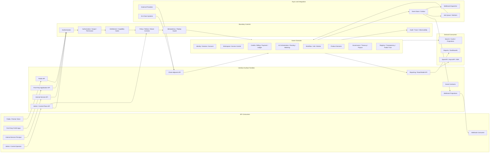
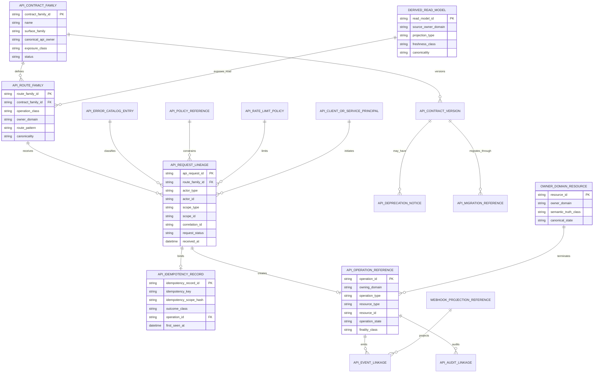
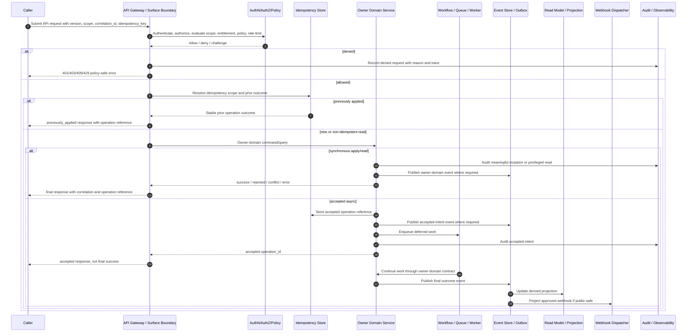

# FUZE API Architecture Specification

## Document Metadata

- **Document Name:** `API_ARCHITECTURE_SPEC.md`
- **Document Type:** API SPEC v2 — Production-Grade Interface Contract Specification
- **Status:** Draft for canonical API SPEC v2 adoption
- **Version:** 2.0.0-api-v2
- **Effective Date:** 2026-04-24
- **Last Updated:** 2026-04-24
- **Reviewed On:** 2026-04-24
- **Document Owner:** FUZE Platform API Architecture / Interface Governance Domain
- **Approval Authority:** FUZE Platform Architecture and Governance Authority; explicit named approver not yet specified in retrieved governing materials
- **Review Cadence:** Quarterly and whenever platform plane boundaries, API surface families, public/internal/admin exposure posture, accepted async posture, idempotency/versioning policy, migration policy, event/webhook posture, chain-adjacent interface posture, or OpenAPI/AsyncAPI/SDK derivation rules materially change
- **Governing Layer:** API SPEC v2 / Shared platform interface architecture and API governance
- **Parent Registry:** `API_SPEC_INDEX.md`
- **Upstream Semantic Registry:** `REFINED_SYSTEM_SPEC_INDEX.md`
- **Upstream API Registry:** `API_SPEC_INDEX.md`
- **Primary Audience:** Platform architecture, backend engineering, product engineering, frontend engineering, API contract authors, OpenAPI/AsyncAPI/SDK authors, workflow/runtime engineering, AI engineering, data engineering, security, audit, operations, finance/control-plane authors, public API authors, partner integration authors, implementation-contract authors
- **Primary Purpose:** Define FUZE's canonical API architecture contract layer: API surface families, interface boundaries, owner-domain mutation and read posture, accepted-state semantics, request/response/error/status conventions, idempotency/replay/versioning/migration/audit obligations, public/internal/admin/event separation, and downstream implementation-contract guardrails.
- **Primary Upstream References:**
  - `REFINED_SYSTEM_SPEC_INDEX.md`
  - `DOCS_SPEC_INDEX.md`
  - `SYSTEM_SPEC_INDEX.md`
  - `API_SPEC_INDEX.md`
  - `SYSTEM_BOUNDARY_AND_OWNERSHIP_SPEC.md`
  - `SYSTEM_OVERVIEW_AND_BOUNDARIES_SPEC.md`
  - `PLATFORM_ARCHITECTURE_SPEC.md`
  - `DOMAIN_OWNERSHIP_MATRIX_SPEC.md`
  - `DATA_MODEL_AND_ENTITY_OWNERSHIP_SPEC.md`
  - `ONCHAIN_OFFCHAIN_RESPONSIBILITY_SPEC.md`
  - `PRODUCT_BOUNDARY_AND_DOMAIN_OWNERSHIP_SPEC.md`
  - `PRODUCT_ADMISSION_AND_EXPANSION_GATE_SPEC.md`
  - `API_ARCHITECTURE_SPEC.md` refined system spec
  - `PUBLIC_API_SPEC.md`
  - `INTERNAL_SERVICE_API_SPEC.md`
  - `EVENT_MODEL_AND_WEBHOOK_SPEC.md`
  - `IDEMPOTENCY_AND_VERSIONING_SPEC.md`
  - `MIGRATION_AND_BACKWARD_COMPATIBILITY_SPEC.md`
  - `AUDIT_LOG_AND_ACTIVITY_SPEC.md`
  - `AUDIT_AND_ACCESS_TRACEABILITY_SPEC.md`
  - `SECURITY_AND_RISK_CONTROL_SPEC.md`
  - `MONITORING_ALERTING_AND_INCIDENT_RESPONSE_SPEC.md`
  - `SECRETS_CONFIG_AND_ENVIRONMENT_SPEC.md`
  - `FUZE_WORKSPACE_ACCESS_CONTROL_BASICS_THESIS_FINAL_SPEC.md`
  - `FUZE_ACCOUNT_ACCESS_AND_SESSION_THESIS_FINAL_SPEC.md`
  - `FUZE_ACCOUNT_ACCESS_AND_SESSION_CANONICAL_FINAL_SPEC.md`
- **Primary Downstream Dependents:**
  - `PUBLIC_API_SPEC.md`
  - `INTERNAL_SERVICE_API_SPEC.md`
  - `EVENT_MODEL_AND_WEBHOOK_SPEC.md`
  - `IDEMPOTENCY_AND_VERSIONING_SPEC.md`
  - `MIGRATION_AND_BACKWARD_COMPATIBILITY_SPEC.md`
  - all domain API SPEC v2 files
  - OpenAPI / AsyncAPI / SDK derivation layers
  - service implementation contracts
  - API gateway, auth, rate-limit, observability, audit, and control-plane implementation layers
- **API Surface Families Covered:** public API, authenticated public API, first-party application API, internal service API, admin/control-plane API, event API, webhook API, reporting/read-model API, chain-adjacent API, implementation-facing contract surfaces
- **API Surface Families Excluded:** Exact domain-specific endpoints, exact database schemas, exact smart-contract ABIs, exact UI component contracts, exact vendor infrastructure configuration, exact runbooks, and exact machine-generated OpenAPI/AsyncAPI artifacts
- **Canonical System Owner(s):** FUZE Platform API Architecture / Interface Governance Domain; domain owners retain ownership of domain semantics exposed through APIs
- **Canonical API Owner:** FUZE Platform API Architecture / Interface Governance Domain
- **Supersedes:** Historical v1 `API_ARCHITECTURE_SPEC.md` as the governing API architecture source, and weaker interpretations that treat APIs as transport-only routes, mirror internal services publicly, collapse public/internal/admin/event surfaces, allow aggregated reads to become hidden write owners, or allow accepted async responses to masquerade as final business success
- **Superseded By:** Not yet specified
- **Related Decision Records:** Not explicitly specified in retrieved governing materials
- **Canonical Status Note:** This document is the API SPEC v2 interface-contract expression of the active refined API architecture semantics. Refined system specs own semantic truth. This document owns interface-contract expression, route-family posture, request/response/error/idempotency/audit/migration expectations, and downstream API contract guardrails.
- **Implementation Status:** Normative source for downstream API contract and implementation planning; not a machine-readable OpenAPI/AsyncAPI file
- **Approval Status:** Draft pending explicit approval workflow
- **Change Summary:** Upgrades API architecture from refined system-spec semantics and v1 API architecture material into API SPEC v2 format with explicit surface-family contracts, truth classes, owner-domain boundaries, route-family model, request/response/error/status semantics, idempotency/replay behavior, migration/versioning rules, audit/observability requirements, diagrams, flow views, acceptance criteria, test cases, and quality gate.

## Purpose

This API specification defines the canonical FUZE API architecture contract layer.

It governs how FUZE exposes platform, product, shared-service, public, internal, admin/control, event, webhook, reporting, and chain-adjacent capabilities through explicit interface families while preserving canonical domain ownership. It translates refined API architecture semantics into an implementation-usable API contract posture for downstream route inventories, domain API specs, OpenAPI artifacts, AsyncAPI artifacts, SDKs, gateway rules, audit rules, and service implementation contracts.

This document is governing. It is not a route dump and not a generic API style guide. Any downstream API design that contradicts this document MUST either be corrected or explicitly escalated through the FUZE architecture and governance process.

## Scope

This specification governs:

1. API surface-family taxonomy and exposure posture.
2. Owner-domain mutation and read-boundary rules.
3. Public, authenticated-public, first-party, internal, admin/control, event, webhook, reporting, and chain-adjacent separation.
4. Request, response, error, result, status, pagination, correlation, and operation-reference expectations.
5. Accepted-state vs final-success API behavior.
6. Idempotency, retry, replay, duplicate submission, and conflict behavior.
7. Authentication, authorization, scope, permission, entitlement, and policy enforcement at the API boundary.
8. Audit, traceability, observability, and request-lineage obligations.
9. Read-model, projection, public-read, reporting, cache, and publication discipline.
10. API versioning, compatibility, migration, deprecation, and sunset posture.
11. OpenAPI, AsyncAPI, SDK, and implementation-contract derivation guardrails.
12. Cross-domain API safety for workflow, queue, AI, commercial, governance, transparency, registry, and chain-adjacent domains.

## Out of Scope

This specification does not define:

1. Every final endpoint path or field-level schema.
2. Exact service internals or database schema for domain services.
3. Exact gateway, broker, queue, mesh, or cloud-vendor implementation.
4. Exact smart-contract ABIs or chain deployment procedures.
5. Exact UI copy, frontend component state, or client-side store design.
6. Exact operational runbooks.
7. Exact OpenAPI/AsyncAPI generated files.
8. Domain-specific business truth, which remains owned by refined system specs and corresponding owner-domain API specs.

## Design Goals

1. Reinforce FUZE ownership boundaries through interface design.
2. Prevent public, internal, admin, workflow, worker, reporting, or SDK convenience from becoming hidden semantic authority.
3. Make accepted async behavior explicit and testable.
4. Make request lineage, idempotency, audit, and observability universal for meaningful mutations and privileged reads.
5. Provide a stable source for downstream OpenAPI, AsyncAPI, SDK, and implementation-contract derivation.
6. Keep public contracts narrower, safer, and more stable than internal collaboration contracts.
7. Keep admin/control-plane routes explicit, bounded, reason-coded, and audited.
8. Ensure derived reads, reporting views, caches, and public artifacts remain downstream to canonical owner-domain truth.
9. Support long-term versioning, migration, deprecation, and compatibility without silent semantic drift.

## Non-Goals

1. This spec does not make all FUZE capabilities public.
2. This spec does not make all internal capabilities synchronous HTTP routes.
3. This spec does not grant products authority to redefine shared platform primitives.
4. This spec does not allow reporting, dashboard, search, cache, SDK, workflow, or worker layers to mutate owner-domain truth directly.
5. This spec does not replace domain-specific API specs.
6. This spec does not permit transport convenience to override canonical ownership.
7. This spec does not turn external provider input or chain observations into canonical FUZE state without normalization and owner-domain validation.

## Core Principles

### 1. API-as-Boundary-Enforcement Principle

APIs in FUZE MUST enforce platform ownership, truth-class separation, and plane boundaries. API architecture is not merely transport design.

### 2. Owner-Domain Mutation Principle

Canonical writes MUST terminate in the domain that owns the underlying truth, even when initiated through public, first-party, workflow, worker, internal, admin, or partner surfaces.

### 3. Surface-Family Separation Principle

Public, authenticated-public, first-party, internal, admin/control, event, webhook, reporting, and chain-adjacent surfaces MUST remain explicitly differentiated.

### 4. Accepted-State Honesty Principle

When an API has only accepted intent for later work, the response MUST say so and MUST NOT claim final success.

### 5. Derived-Read Discipline Principle

Aggregated, reporting, dashboard, public-read, cache, registry, and projection APIs MUST NOT become hidden write owners.

### 6. Public-Narrowing Principle

Public APIs MUST be narrower, safer, more stable, and more information-minimized than corresponding internal or first-party capabilities.

### 7. Internal-Is-Not-Root Principle

Internal service APIs require explicit service identity, service-scope grants, and owner-domain authority. Network location or repository adjacency is never sufficient authority.

### 8. Admin-Is-Separate Principle

Operator, support, emergency, governance, and override APIs MUST be separate from ordinary application and internal mutation routes and MUST be reason-coded, policy-constrained, and durably audited.

### 9. Normalization-Before-Influence Principle

Provider callbacks, partner signals, external events, and chain observations remain provider-input truth until normalized and accepted by the correct owner domain.

### 10. Contract-Governance Principle

Versioning, deprecation, migration, idempotency, replay safety, and audit lineage are mandatory API contract obligations, not optional implementation polish.

## Canonical Definitions

- **API architecture domain:** Shared governance domain that owns API surface-family posture, route-family discipline, request/response/error conventions, accepted-state posture, and contract derivation guardrails.
- **Surface family:** A category of API exposure with specific trust, compatibility, authorization, audit, and support obligations.
- **Owner-domain API:** API contract controlled by the domain that owns the meaning and mutation of the underlying truth.
- **Public API:** External contract exposed to unauthenticated public readers, authenticated users, partners, or public clients under public compatibility and abuse posture.
- **First-party application API:** API consumed by FUZE first-party applications and product surfaces, typically authenticated and scope-aware, but not automatically public to arbitrary external consumers.
- **Internal service API:** Service-to-service contract inside the FUZE platform boundary that preserves explicit service identity, scope, and owner-domain mutation discipline.
- **Admin/control-plane API:** Privileged API family for support, remediation, approvals, overrides, emergency controls, rollout controls, or governance-sensitive execution.
- **Event API / event contract:** Internal asynchronous contract for owner-domain facts, accepted intents, integration outcomes, or operational transitions.
- **Webhook API / webhook contract:** Curated external projection of approved internal event outcomes with stricter exposure and delivery semantics.
- **Reporting/read-model API:** Read-only interface over derived, projected, aggregated, publication, or reporting state.
- **Chain-adjacent API:** API that observes, coordinates, prepares, reconciles, or publishes chain-related information without redefining on-chain or off-chain authority.
- **Accepted async intent:** Durable record that a request was admitted for later execution. It is not final business success.
- **Operation reference:** Stable identifier for tracking accepted, applied, retried, replayed, failed, compensated, or superseded API work.
- **Correlation ID:** Caller- or system-provided trace handle linking requests, logs, events, audits, and support diagnostics.
- **Idempotency key:** Caller-provided or generated key used to bind retried mutation intent to a stable outcome under a defined scope.

## Truth Class Taxonomy

Every API contract MUST preserve the following truth classes where applicable:

1. **Semantic truth** — domain meaning, lifecycle meaning, and ownership of facts.
2. **API contract truth** — the route, request, response, error, status, version, and compatibility contract exposed by an API.
3. **Policy truth** — authorization, entitlement, exposure, migration, deprecation, rollout, public visibility, and admin-control rules.
4. **Runtime truth** — current processing, accepted, queued, running, dependency, failure, or degraded-mode status.
5. **Ledger / storage truth** — durable owner-domain records, request lineage, idempotency records, audit records, contract registries, and operation references.
6. **Provider-input truth** — external callbacks, partner payloads, chain observations, and third-party claims before FUZE normalization and owner-domain acceptance.
7. **Event / async execution truth** — domain events, integration events, workflow status, queue status, worker attempts, and webhook delivery status.
8. **Projection / reporting truth** — derived reads, dashboards, public summaries, analytics, exports, search indexes, registry outputs, and transparency artifacts.
9. **Presentation truth** — frontend wording, SDK ergonomics, UI grouping, labels, or display-only convenience fields.

Truth classes MUST NOT be collapsed for convenience. If a downstream contract cannot identify which truth class it exposes or mutates, it is incomplete.

## Architectural Position in the Spec Hierarchy

This API spec sits below the refined semantic registry and platform boundary specs, and above narrower domain API specs and machine-readable contracts.

```text
REFINED_SYSTEM_SPEC_INDEX.md
  -> platform boundary, ownership, architecture, domain, data, on-chain/off-chain specs
    -> refined API architecture, public API, internal API, event/webhook, idempotency, migration specs
      -> API SPEC v2 shared API architecture contract (this file)
        -> domain API SPEC v2 files
          -> OpenAPI / AsyncAPI / SDK / implementation-contract artifacts
```

The refined system specs remain semantic source of truth. This document governs interface expression of those semantics.

## Upstream Semantic Owners

The following upstream semantic owners constrain this API spec:

1. **Platform boundary and architecture specs** own plane separation, system boundaries, on-chain/off-chain responsibility, and platform/product distinctions.
2. **Domain ownership specs** own mutation authority and canonical entity ownership.
3. **Public API refined spec** owns external exposure posture and public contract safety.
4. **Internal service API refined spec** owns service-to-service posture, explicit service identity, and internal mutation discipline.
5. **Event/webhook refined spec** owns internal event and external webhook semantics.
6. **Idempotency/versioning refined spec** owns replay safety and version classification semantics.
7. **Migration/backward compatibility refined spec** owns coexistence, cutover, deprecation, supersession, and historical interpretability semantics.
8. **Audit/security/operations refined specs** own audit, abuse, incident, observability, and risk controls.

## API Surface Families

### Public API

Public APIs expose approved external contracts. They MAY include unauthenticated public reads, authenticated user/workspace-scoped reads, partner APIs, public product actions, and public-trust artifacts. They MUST NOT mirror internal services by default.

### First-Party Application API

First-party application APIs support FUZE-owned user experiences and product surfaces. They MAY expose richer flows than public APIs but MUST still preserve owner-domain mutation boundaries and authorization checks.

### Internal Service API

Internal APIs support service-to-service collaboration. They MUST require service identity, explicit grants, route-family classification, idempotency where relevant, audit lineage, and owner-domain termination for canonical writes.

### Admin / Control-Plane API

Admin/control APIs support privileged support, remediation, emergency, rollout, governance, or override behavior. They MUST be separate from ordinary application APIs, reason-coded, policy-constrained, and durably audited.

### Event / Webhook API

Event APIs and webhook contracts communicate accepted facts, accepted intents, operational transitions, and approved public projections. They complement APIs but do not replace owner-domain write contracts.

### Reporting / Read-Model API

Reporting/read-model APIs expose derived or projected state. They MUST be read-only unless a narrower approved spec explicitly defines a write path to a publication-owned object.

### Chain-Adjacent API

Chain-adjacent APIs coordinate off-chain FUZE services with on-chain observations or actions. They MUST distinguish on-chain truth, off-chain policy truth, public registry truth, treasury/governance truth, and presentation truth.

### Implementation-Facing API Contracts

Implementation-facing contracts include generated OpenAPI, AsyncAPI, SDK, service-stub, gateway, policy, and test artifacts. They derive from this spec and narrower domain specs; they are not semantic owners.

## System / API Boundaries

1. The **experience/edge layer** may initiate requests and render responses but does not own API semantics or canonical truth.
2. The **application plane** is the default home for owner-domain mutation and canonical business reads.
3. The **execution plane** may continue accepted work through workflows, jobs, workers, retries, and deferred execution but does not own upstream business meaning.
4. The **integration plane** may normalize provider, partner, callback, or chain-adjacent inputs before owner-domain validation.
5. The **reporting plane** may publish derived or public-read projections but is not a mutation owner.
6. The **control plane** may approve, restrict, override, quarantine, roll back, or remediate under policy but does not become ordinary business truth owner.
7. The **on-chain layer** remains separately authoritative for contract-native truth where applicable.

## Adjacent API Boundaries

- `PUBLIC_API_SPEC.md` governs public and external surface posture. This spec governs shared cross-family architecture.
- `INTERNAL_SERVICE_API_SPEC.md` governs service-to-service interface posture. This spec defines the broader family in which it sits.
- `EVENT_MODEL_AND_WEBHOOK_SPEC.md` governs event and webhook semantics. This spec governs how APIs relate to those contracts.
- `IDEMPOTENCY_AND_VERSIONING_SPEC.md` governs detailed replay and versioning semantics. This spec makes those obligations universal at architecture level.
- `MIGRATION_AND_BACKWARD_COMPATIBILITY_SPEC.md` governs coexistence, cutover, deprecation, sunset, and supersession. This spec defines how API contracts must participate.
- Domain API specs govern domain-specific route families, resource models, request/response schemas, and error codes.
- Implementation contracts must preserve but not reinterpret this document.

## Conflict Resolution Rules

1. `REFINED_SYSTEM_SPEC_INDEX.md` and higher-order refined system specs win over this API spec on semantic truth.
2. Domain owner specs win on domain meaning, state ownership, mutation rules, and canonical reads.
3. This spec wins on shared API surface-family structure, cross-family route discipline, accepted-state posture, and API contract truth.
4. Public/internal/event/idempotency/migration specs win inside their narrower interface-family scopes.
5. OpenAPI, AsyncAPI, SDKs, gateway configurations, generated clients, dashboards, reports, caches, and implementation shortcuts never win over canonical API architecture.
6. If ambiguity remains, FUZE MUST choose the more conservative architecture-consistent interpretation and record the unresolved issue for refinement.

## Default Decision Rules

1. Canonical writes default to owner-domain APIs.
2. External exposure defaults to non-public until explicitly approved.
3. Public contracts default to narrower and more stable than internal contracts.
4. Admin/control actions default to separate privileged surfaces.
5. Derived/read-model/reporting APIs default to read-only.
6. Long-running operations default to accepted-state responses.
7. Provider input defaults to non-canonical until normalized and owner-validated.
8. Chain observations default to observation truth until reconciled under chain/off-chain rules.
9. If an API cannot name its owner domain, surface family, scope model, idempotency posture, audit posture, and migration posture, it MUST NOT be treated as production-grade.

## Roles / Actors / API Consumers

### Human Actors

- End users
- Workspace members and owners
- External developers
- Partner operators
- Support operators
- Security reviewers
- Product operators
- Finance/control-plane operators
- Governance or approval actors
- Public/community/investor readers of approved trust surfaces

### System Actors

- First-party frontend applications
- Public clients and SDK clients
- API gateways and auth/scope layers
- Platform domain services
- Product domain services
- Workflow engines
- Job workers and schedulers
- AI orchestration and routing services
- Billing, credits, payment, ledger, entitlement, and payout services
- Integration adapters
- Chain-adjacent services
- Event stores, webhook dispatchers, and consumers
- Reporting, transparency, registry, and analytics services
- Admin/control-plane backends
- Audit, observability, and security systems

## Resource / Entity Families

API architecture recognizes these shared support resource families:

- `api_contract_family`
- `api_route_family`
- `api_surface_classification`
- `api_request_lineage`
- `api_operation_reference`
- `api_idempotency_record`
- `api_error_catalog_entry`
- `api_contract_version`
- `api_deprecation_notice`
- `api_migration_reference`
- `api_event_linkage`
- `api_webhook_projection_reference`
- `api_audit_linkage`
- `api_policy_reference`
- `api_rate_limit_policy`
- `api_client_or_service_principal`

Domain resources remain owned by their domain specs and MUST NOT be re-owned by this architecture spec.

## Ownership Model

### API Architecture Owns

1. Surface-family taxonomy.
2. Shared route-family discipline.
3. Cross-family accepted-state semantics.
4. Architecture-level request/response/error/status posture.
5. Architecture-level idempotency, replay, audit, observability, migration, and compatibility obligations.
6. OpenAPI/AsyncAPI/SDK derivation guardrails.

### API Architecture Does Not Own

1. Business domain truth.
2. Workflow truth.
3. Queue/worker truth.
4. AI run, model-routing, context, or metering truth.
5. Commercial, billing, credits, payment, ledger, payout, treasury, entitlement, governance, registry, transparency, audit, security, or operations truth.
6. Chain-native truth.
7. Presentation truth.

### Owner Domains MUST

1. Expose canonical writes only through approved owner-domain APIs.
2. Preserve domain semantics across all surface families.
3. Emit lineage for audit, event, observability, idempotency, and migration records.
4. Prevent non-owner services from mutating domain truth through private storage or hidden internal paths.

### Non-Owner Consumers MAY

1. Request owner-domain actions through approved contracts.
2. Consume owner-domain reads through approved query APIs.
3. Display, report, project, or aggregate under derived-read rules.
4. Coordinate deferred work through accepted operation references.

### Non-Owner Consumers MUST NOT

1. Mutate foreign-domain tables or private stores.
2. Treat cached, reporting, public, SDK, or UI state as canonical mutation truth.
3. Infer authority from internal network location, workflow participation, worker class, or admin UI access.
4. Treat provider callbacks or event receipt as permission to write owner-domain truth.

## Authority / Decision Model

1. **Platform API Governance Authority** controls surface-family taxonomy, API architecture posture, contract-governance rules, and API SPEC v2 compliance.
2. **Domain Authority** controls domain semantics, mutation rules, canonical state, and final outcome interpretation.
3. **Public API Governance Authority** controls external exposure, public visibility, supportability, compatibility, and abuse posture.
4. **Internal API Governance Authority** controls service-to-service posture, service identity, grants, and internal contract discipline.
5. **Event/Webhook Governance Authority** controls event envelopes, webhook projection, retry/redelivery posture, and AsyncAPI semantics.
6. **Migration and Compatibility Governance Authority** controls coexistence, cutover, deprecation, sunset, and supersession posture.
7. **Control/Governance Authority** may approve, restrict, or remediate privileged actions but does not become business truth owner.
8. **External Authority** applies only to external systems' own inputs or chain-native state; FUZE-owned consequences require FUZE normalization and owner-domain acceptance.

## Authentication Model

APIs MAY authenticate:

- unauthenticated public readers for explicitly public resources
- end-user accounts
- workspace-scoped users
- partner clients
- service principals
- worker principals
- admin/control-plane operators
- governance or approval actors
- chain-adjacent service actors

Authentication MUST identify caller class, credential class, environment, and principal lineage. Authentication alone MUST NOT imply authorization.

## Authorization / Scope / Permission Model

Authorization MUST evaluate the requested operation against:

1. Actor identity and actor class.
2. Account scope.
3. Workspace or organization scope.
4. Product scope.
5. Service principal scope grants.
6. Resource owner and target domain.
7. Operation class: read, write, transition, accepted intent, admin action, event publish, webhook delivery, reporting export.
8. Permission/effective permission where workspace access is relevant.
9. Policy version and enforcement mode.
10. Sensitive-path rules for finance, payout, treasury, governance, security, admin, AI, or public-trust domains.

APIs MUST preserve identity/authentication/session/authorization separation. Session validity is not permission. Workspace scope is not permission. Entitlement is not authorization.

## Entitlement / Capability-Gating Model

Entitlement and capability gating MAY influence whether an API capability is available, quota-limited, premium-only, beta-only, partner-only, or product-gated. Entitlement MUST NOT be treated as permission to mutate an object. Authorization MUST still be evaluated independently.

APIs that expose paid, premium, AI, workflow, commercial, chain-adjacent, or admin-sensitive capabilities MUST distinguish:

- entitlement eligibility
- authorization permission
- rate/quota availability
- commercial billing/credits posture
- rollout availability
- policy restrictions

## API State Model

API contracts MUST use explicit, bounded state classes. Common operation states include:

- `received`
- `validated`
- `authorized`
- `accepted`
- `applied`
- `previously_applied`
- `queued`
- `running`
- `completed`
- `rejected`
- `conflicted`
- `failed_retryable`
- `failed_terminal`
- `cancelled`
- `compensated`
- `superseded`
- `deprecated`
- `sunset`
- `retired`

### State Rules

1. `accepted` MUST remain distinct from `completed` or `applied`.
2. `previously_applied` MUST remain distinct from new application.
3. `conflicted` MUST remain distinct from validation failure and retryable failure.
4. `failed_retryable` MUST remain distinct from terminal policy denial.
5. `compensated` MUST preserve linkage to the original accepted or applied operation.
6. `deprecated`, `sunset`, `retired`, and `superseded` MUST preserve contract lineage and historical interpretability.

## Lifecycle / Workflow Model

1. **Surface classification:** API contract declares surface family, owner domain, exposure class, compatibility posture, and operation class.
2. **Request intake:** Gateway/edge/internal boundary receives request with actor, scope, correlation, idempotency, and version context.
3. **Authentication:** Caller identity is established.
4. **Authorization and policy evaluation:** Scope, permission, entitlement, rollout, abuse, and sensitive-path policy checks occur before side effects.
5. **Validation:** Schema, resource existence, state preconditions, conflict preconditions, and domain invariants are validated.
6. **Idempotency resolution:** Duplicate or retry intent resolves to stable prior outcome, conflict, or new operation.
7. **Owner-domain execution:** Owner domain applies mutation, returns read, or records accepted async intent.
8. **Event/audit/observability linkage:** Meaningful outcomes emit audit records, events, traces, metrics, and operation references as required.
9. **Async continuation:** Workflow/job/worker/integration systems continue deferred work through explicit owner-domain contracts.
10. **Read-model projection:** Derived/public/reporting views update downstream without gaining mutation authority.
11. **Migration/version handling:** Contract version, deprecation, compatibility, and supersession rules are preserved.
12. **Finalization or remediation:** Operation completes, fails, conflicts, is compensated, or enters controlled remediation with durable lineage.

## Architecture Diagram — Mermaid Flowchart



## Data Design — Mermaid Diagram



## Flow View

### Synchronous Read Flow

1. Caller invokes a read route in a declared surface family.
2. API boundary authenticates where required.
3. API boundary resolves visibility, authorization, public visibility class, and scope.
4. Owner domain or approved read model returns canonical, caller-scoped, derived, or public-artifact data with explicit classification.
5. Response includes correlation ID, cache/freshness hints where relevant, and no hidden mutation side effects.
6. Audit is recorded for privileged or sensitive reads.

### Synchronous Mutation Flow

1. Caller submits a bounded business action or explicit transition request.
2. API boundary authenticates actor or service principal.
3. Authorization, permission, entitlement, rollout, policy, and abuse checks run before side effects.
4. Idempotency scope is evaluated.
5. Owner domain validates state and applies mutation if immediately possible.
6. Response returns `success`, `previously_applied`, `conflict`, `rejected`, or error class.
7. Audit, events, traces, metrics, and operation references are recorded.

### Accepted Async Flow

1. Caller submits a long-running or retry-heavy action.
2. API validates and authorizes the action.
3. Owner domain records accepted intent and operation reference.
4. Response returns `202 Accepted`-style semantics with `operation_id`, `status_url` or equivalent, and no final-success claim.
5. Workflow/job/worker systems continue execution through owner-domain contracts.
6. Final outcome is surfaced through status API, event, webhook projection, or derived read model.
7. Failures enter retryable, terminal, compensated, or remediation states with durable lineage.

### Admin / Control-Plane Flow

1. Operator or control system invokes privileged route.
2. Strong authentication, role, scope, reason code, policy version, and approval prerequisites are verified.
3. API rejects missing reason, unsupported scope, or unsupported operation class before side effects.
4. Owner domain or control domain applies constrained action.
5. Audit record includes actor, reason code, policy reference, target, before/after posture where safe, and resulting operation/event lineage.

### Migration Flow

1. Contract version or route family is registered with current lifecycle state.
2. Proposed change declares compatibility posture, affected clients, owner domain, and coexistence plan.
3. Migration governance approves deprecation, supersession, cutover, or sunset.
4. API responses, docs, SDKs, events, and read models expose version posture and migration lineage.
5. Sunset or removal occurs only after required notice and compatibility obligations or approved emergency override.

## Data Flows — Mermaid Sequence Diagram



## Request Model

### Common Request Fields

All meaningful API requests SHOULD support or derive:

- `request_id` or server-assigned equivalent
- `correlation_id`
- `idempotency_key` for mutation or accepted-async requests
- `actor` or authenticated principal reference
- `scope` including account, workspace, product, service, partner, or admin scope where applicable
- `operation_type`
- `target_resource` or business intent
- `contract_version`
- `client_context` where safe and useful
- `reason_code` for admin/control actions
- `policy_context` for sensitive operations

### Request Rules

1. Mutation requests MUST identify target domain and operation class.
2. Public write requests MUST express bounded business actions, not raw internal commands.
3. Internal write requests MUST identify service principal and service-scope grant.
4. Admin requests MUST include reason code and policy/audit context.
5. Provider/callback requests MUST include verifiable source, signature/credential posture, and normalization context.
6. Chain-adjacent requests MUST distinguish observation, preparation, execution, reconciliation, and publication intent.

## Response Model

### Common Response Fields

Responses SHOULD include:

- `status`
- `data` or `result`
- `error` when applicable
- `operation_id` for mutations or accepted async operations
- `correlation_id`
- `request_id`
- `resource_version` or `contract_version` where applicable
- `canonicality` where confusion is likely: `canonical`, `derived`, `public_artifact`, `projection`, `presentation`
- `next_actions` or `status_url` for accepted async operations

### Response Classes

- `success`
- `accepted`
- `previously_applied`
- `rejected`
- `conflict`
- `failed_retryable`
- `failed_terminal`
- `deprecated`
- `sunset`

### Response Rules

1. Accepted responses MUST include stable operation references.
2. Derived reads MUST not imply canonical mutation authority.
3. Public responses MUST minimize sensitive internals.
4. Internal responses MAY include richer operational context but MUST remain contract-governed.
5. Admin responses MUST preserve audit and remediation lineage.

## Error / Result / Status Model

### Error Classes

- `validation_error`
- `authentication_required`
- `authentication_invalid`
- `authorization_denied`
- `scope_invalid`
- `permission_denied`
- `entitlement_required`
- `capability_unavailable`
- `policy_denied`
- `rate_limited`
- `abuse_detected`
- `idempotency_conflict`
- `state_conflict`
- `version_unsupported`
- `contract_deprecated`
- `contract_sunset`
- `dependency_unavailable`
- `provider_input_invalid`
- `chain_observation_unconfirmed`
- `async_operation_failed`
- `admin_reason_required`
- `internal_error`

### Error Payload Requirements

Error payloads MUST include:

- stable machine-readable `code`
- error `class`
- safe human-readable `message`
- retry hint where applicable
- correlation or trace reference
- field-level details for validation errors where safe
- policy or reason reference where applicable

### Error Rules

1. Public error payloads MUST avoid leaking internal topology, secrets, provider internals, or policy-sensitive details.
2. Internal errors MAY include more diagnostic context but MUST remain stable enough for contract validation.
3. Admin/control errors MUST be reviewable and audit-linked.
4. Conflict errors MUST distinguish domain state conflict from duplicate idempotency conflict.
5. Version and migration errors MUST include replacement or deprecation guidance where applicable.

## Idempotency / Retry / Replay Model

1. Mutation and accepted-async routes MUST define whether idempotency is required, optional, or forbidden.
2. Economic, ledger, payment, credits, payout, governance, admin, workflow, job, AI, and public write requests SHOULD require idempotency keys.
3. Idempotency scope MUST include actor or service principal, scope, route family, target resource or operation type, and request fingerprint where applicable.
4. Exact retries MUST return stable prior outcomes.
5. Materially different payloads under the same key MUST return `idempotency_conflict`.
6. Replay of events or async work MUST not create duplicate business effects.
7. Webhook redelivery MUST create delivery attempts, not new business facts.
8. Idempotency records MUST be audit-linked for meaningful mutations.

## Rate Limit / Abuse-Control Model

API contracts MUST define rate-limit and abuse posture appropriate to surface family:

- public routes require explicit rate limits and abuse controls
- authenticated public routes require actor/workspace/client quotas where relevant
- partner routes require partner identity and replay protections
- internal service routes require service-level quotas and circuit breakers
- admin/control routes require sensitive-path throttles and approval controls
- expensive AI/workflow/search/reporting routes require cost and resource controls

Rate limiting MUST NOT silently replace authorization or entitlement evaluation.

## Endpoint / Route Family Model

This document defines route-family posture, not exhaustive endpoints. Downstream specs MUST refine exact routes.

### Public Route Families

- `GET /public/v{version}/...`
- `GET /v{version}/me/...`
- `POST /v{version}/{domain}/{bounded_business_action}`
- `GET /v{version}/{domain}/{resource_id}/status`
- `GET /public/v{version}/registry/...`
- `GET /public/v{version}/transparency/...`

### First-Party Application Route Families

- `GET /app/v{version}/{domain}/...`
- `POST /app/v{version}/{domain}/{business_action}`
- `PATCH /app/v{version}/{domain}/{resource_id}` where owner-domain approved
- `GET /app/v{version}/{domain}/{operation_id}`

### Internal Service Route Families

- `POST /internal/v{version}/{domain}/commands/{command_name}`
- `GET /internal/v{version}/{domain}/queries/{query_name}`
- `POST /internal/v{version}/{domain}/transitions/{transition_name}`
- `POST /internal/v{version}/{domain}/reconciliations/{operation_name}`

### Admin / Control Route Families

- `GET /admin/v{version}/{domain}/records/{record_id}`
- `POST /admin/v{version}/{domain}/approvals`
- `POST /admin/v{version}/{domain}/corrections`
- `POST /admin/v{version}/{domain}/overrides`
- `POST /admin/v{version}/{domain}/quarantine`
- `POST /admin/v{version}/{domain}/replay`
- `GET /admin/v{version}/control-plane/status`

### Event / Webhook Families

- internal event names: `<domain>.<entity_or_scope>.<action_or_state>`
- public webhook event names: curated subset with explicit public exposure class
- webhook management route families: `POST /v{version}/webhooks/endpoints`, `PATCH /v{version}/webhooks/endpoints/{id}`, `POST /v{version}/webhooks/deliveries/{id}/redeliver`

### Reporting / Read-Model Families

- `GET /reports/v{version}/{domain}/...`
- `GET /admin/v{version}/reports/{report_family}/...`
- `GET /public/v{version}/{artifact_family}/...`

Route families MUST declare surface, owner domain, exposure class, version, canonicality, and migration posture.

## Public API Considerations

Public APIs MUST be curated external contracts. They MUST NOT mirror internal service routes or expose raw internal mutation primitives. Public writes MUST be bounded business actions, approved for public exposure, scoped to caller authority, idempotent where retryable, abuse-controlled, and compatible across published versions.

Public reads MUST classify outputs as caller-scoped canonical state, canonical public artifact, derived public view, or presentation helper. Public APIs MUST prefer stable identifiers and bounded statuses over internal implementation snapshots.

## First-Party Application API Considerations

First-party APIs MAY support richer product flows than public APIs but MUST still preserve owner-domain boundaries, authorization, entitlement, idempotency, and audit rules. First-party status screens or dashboards MUST NOT be treated as canonical truth unless they call owner-domain canonical APIs.

## Internal Service API Considerations

Internal APIs MUST require explicit service identity, operation class, service-scope grants, and owner-domain termination for canonical writes. Internal collaboration MUST NOT use direct table writes or hidden queue messages to bypass domain APIs. Internal APIs MAY expose richer diagnostic context than public APIs but MUST remain versioned and contract-governed where cross-service dependencies exist.

## Admin / Control-Plane API Considerations

Admin/control APIs MUST be separate from ordinary user-facing and internal service routes. They MUST require privileged authentication, explicit role/scope, reason codes, policy references, audit lineage, and bounded operation classes. Operator convenience MUST NOT create broad root mutation routes.

Admin actions that alter, correct, override, replay, quarantine, or restrict owner-domain truth MUST preserve linkage to original operations and MUST emit required audit and event records.

## Event / Webhook / Async API Considerations

APIs and events are complementary:

- APIs initiate, query, accept, or control actions.
- Events communicate accepted intents, committed facts, operational states, or publication outcomes.
- Webhooks expose curated public-safe projections of approved events.

Events MUST originate from the owner domain or an authorized owner-domain path. Webhook delivery failure MUST NOT roll back the underlying business fact. Event and webhook contracts MUST be idempotent, replay-safe, versioned, and lineage-preserving.

## Chain-Adjacent API Considerations

Chain-adjacent APIs MUST distinguish:

- chain-native truth
- off-chain policy truth
- chain observation truth
- reconciliation truth
- treasury/governance approval truth
- public registry/public trust truth
- presentation truth

APIs MUST NOT imply that off-chain policy changed chain-native state before a confirmed chain outcome exists. APIs MUST NOT treat unconfirmed chain observations or provider-indexer results as final owner-domain truth without the applicable confirmation and reconciliation rules.

## Data Model / Storage Support Implications

API architecture requires support stores for:

1. Contract family registry.
2. Route family registry.
3. Contract version and deprecation registry.
4. Request lineage logs.
5. Idempotency records.
6. Operation references.
7. Error catalog entries.
8. Audit linkage.
9. Event linkage.
10. Webhook projection and delivery linkage.
11. Migration and supersession references.
12. Rate-limit and abuse-control records.
13. Service principal and client credential references.

These support stores do not own domain truth. They provide contract governance, traceability, and safe execution.

## Read Model / Projection / Reporting Rules

1. Read models MUST declare whether they expose canonical state, derived state, public artifact state, reporting state, cache state, or presentation state.
2. Derived read APIs MUST be read-only unless a narrower publication-owner spec explicitly defines a write path.
3. Reporting APIs MUST preserve source lineage and freshness class where correctness matters.
4. Public summaries MUST not reveal restricted internal state.
5. Caches and search indexes MUST not become mutation sources.
6. Exports MUST identify source domain and time of extraction where material.

## Security / Risk / Privacy Controls

APIs MUST apply security controls appropriate to trust sensitivity:

- authentication and credential verification
- authorization and effective-permission enforcement
- entitlement/capability gating where relevant
- rate limit and abuse controls
- request validation and payload limits
- sensitive-data classification and minimization
- secret exclusion from payloads, events, and logs
- provider callback signature verification
- service principal grants and rotation posture
- admin/control reason codes and approval posture
- chain-adjacent confirmation and reconciliation safeguards
- privacy-safe public error and response shaping

## Audit / Traceability / Observability Requirements

Meaningful mutations, accepted async intents, privileged reads, admin/control actions, public contract changes, event/webhook projection, migration actions, and sensitive internal service calls MUST emit audit and observability records.

Required lineage SHOULD include:

- actor or service principal
- scope
- surface family
- route family
- contract version
- operation ID
- idempotency key or record where applicable
- correlation ID and trace ID
- target resource
- outcome class
- policy version
- reason code for admin/control actions
- event/webhook linkage where applicable
- migration/deprecation reference where applicable

Observability MUST support request tracing, latency analysis, dependency failure diagnosis, error-rate monitoring, replay diagnosis, and audit reconstruction.

## Failure Handling / Edge Cases

### Duplicate Submission

Duplicate submissions with the same idempotency key and equivalent payload MUST return stable prior outcome. Same key with materially different payload MUST return `idempotency_conflict`.

### Lost Client Response

Client retry after timeout MUST resolve through idempotency and operation status, not create duplicate business effects.

### Partial Async Failure

Accepted async work that fails after acceptance MUST transition to retryable failure, terminal failure, compensated, cancelled, or remediation state with operation lineage.

### Authorization Drift

If caller authority changes after acceptance but before finalization, the owner-domain or workflow spec MUST define whether continuation is allowed. Security-sensitive operations SHOULD re-check authority at execution boundaries.

### Dependency Outage

APIs MUST distinguish dependency-unavailable retryable failures from domain rejections.

### Public Contract Deprecation

Deprecated public contracts MUST return explicit deprecation metadata or notices where applicable and MUST preserve compatibility obligations until sunset.

### Admin Override Conflict

Admin overrides that conflict with owner-domain invariants MUST be rejected unless a narrower approved control-plane spec authorizes the action and preserves compensation/correction lineage.

### Provider Callback Ambiguity

Provider callbacks with invalid signatures, stale timestamps, duplicate event IDs, unsupported state transitions, or unrecognized provider references MUST remain provider-input truth and MUST NOT mutate owner-domain truth.

### Chain Reorg / Confirmation Ambiguity

Chain-adjacent APIs MUST distinguish observed, pending confirmation, confirmed, reconciled, and disputed states where chain uncertainty affects correctness.

## Migration / Versioning / Compatibility / Deprecation Rules

1. Every externally consumed and cross-domain API contract MUST declare version posture.
2. Public APIs require strongest compatibility and notice obligations.
3. Internal APIs may migrate faster but MUST preserve explicit cutover and coexistence semantics where dependencies exist.
4. Event/webhook payloads MUST preserve version and replay interpretability.
5. Breaking changes require new contract version or explicit approved migration plan.
6. Deprecation MUST remain distinct from sunset.
7. Sunset MUST preserve historical readability for audit, public trust, and compatibility records.
8. Supersession MUST include replacement references.
9. SDKs and generated clients MUST not hide breaking changes without contract version changes.
10. Migration support layers MUST not create hidden dual ownership.

## OpenAPI / AsyncAPI / SDK Derivation Rules

### OpenAPI

OpenAPI artifacts MUST preserve:

- surface family and visibility class
- owner domain
- route family and operation class
- request/response/error schema semantics
- idempotency requirements
- accepted-state vs final-state responses
- auth/scope requirements
- rate-limit and abuse metadata where supported
- deprecation and version metadata
- canonical vs derived response classification where relevant

### AsyncAPI

AsyncAPI artifacts MUST preserve:

- event owner domain
- event class and exposure class
- envelope identity, correlation, causation, actor, scope, version, and timestamp fields
- payload version
- replay/redelivery semantics
- webhook projection boundaries
- compatibility and deprecation posture

### SDKs

SDKs MUST NOT become semantic owners. SDKs MAY improve ergonomics but MUST preserve operation states, idempotency keys, error classes, version posture, and accepted-state semantics.

## Implementation-Contract Guardrails

Downstream implementation contracts MUST NOT:

1. Expose internal routes as public routes by gateway configuration alone.
2. Treat frontend-only state as canonical API result truth.
3. Convert derived read models into write endpoints.
4. Hide async behavior behind fake synchronous success responses.
5. Collapse entitlement into authorization.
6. Collapse workspace scope into permission.
7. Collapse session validity into authorization.
8. Collapse public trust publication into source-domain truth.
9. Collapse chain observation into confirmed chain truth.
10. Collapse event receipt into mutation authority.
11. Collapse admin routes into ordinary internal routes.
12. Omit idempotency from retryable mutations.
13. Omit audit lineage from sensitive operations.
14. Omit compatibility/deprecation metadata from public or cross-domain contracts.

## Downstream Execution Staging

1. **Architecture alignment:** Validate surface family, owner domain, truth class, and route-family posture.
2. **Domain API spec:** Define exact domain-specific resources, route families, request/response/error schemas, and state transitions.
3. **Contract artifact generation:** Produce OpenAPI/AsyncAPI/SDK artifacts preserving this spec.
4. **Implementation contract:** Define service boundaries, storage support, audit, metrics, and dependency behavior.
5. **Test contract:** Implement acceptance and regression tests.
6. **Migration contract:** Define version/deprecation/sunset/coexistence if replacing prior APIs.
7. **Operational readiness:** Validate rate limits, alerting, tracing, runbooks, rollback/forward-fix, and incident controls.

## Required Downstream Specs / Contract Layers

- Domain-specific API SPEC v2 files.
- Public route inventory and OpenAPI artifacts.
- Internal service route inventory and OpenAPI artifacts.
- Event and webhook catalogs and AsyncAPI artifacts.
- Error catalog and status taxonomy.
- Auth/scope/permission/entitlement policy matrix.
- Idempotency storage and replay contract.
- Audit event mapping.
- Migration/deprecation/sunset registry.
- SDK generation rules and semantic conformance tests.
- API gateway exposure and route classification configuration.

## Boundary Violation Detection / Non-Canonical API Patterns

The following patterns are non-canonical and MUST be rejected or remediated:

1. Public route mirrors internal command directly.
2. Admin override route is available through ordinary app API.
3. Internal service writes to foreign domain tables directly.
4. Worker retries create duplicate business effects.
5. Workflow step mutates owner-domain state without owner-domain API.
6. Read model or cache exposes write endpoint to canonical truth.
7. Public API returns internal provider payload as canonical status.
8. Chain-adjacent API reports unconfirmed observation as final chain truth.
9. SDK maps `accepted` to `success` without operation status.
10. Error model hides policy denial as generic internal failure.
11. Deprecated public route is removed without compatibility posture.
12. Event consumer mutates foreign domain solely because it received an event.
13. Entitlement check bypasses permission check.
14. Session validity is treated as workspace authorization.
15. Migration adapter creates indefinite dual write authority.

## Canonical Examples / Anti-Examples

### Canonical Example: Public Async Product Request

A public authenticated user submits a product request. The public API validates scope, permission, entitlement, rate limit, and idempotency. The owner product domain records accepted intent and returns `accepted` with `operation_id`. Workflow and workers continue execution. Final result is exposed through status/read API and optionally event/webhook projection. The public API never claims completion at acceptance time.

### Anti-Example: Public Raw Internal Command

`POST /public/v1/internal/credits/issue` exposes a raw internal command to public callers. This is forbidden. Public credit-affecting actions must be bounded business actions that terminate in the correct credits/billing/payment owner domains.

### Canonical Example: Internal Service Command

A workflow service calls `POST /internal/v1/billing/commands/finalize-invoice` with service identity, scope grant, idempotency key, operation reference, and correlation ID. Billing validates and either applies, rejects, conflicts, or accepts async intent. Workflow does not mutate billing tables.

### Anti-Example: Worker Direct Database Write

A worker updates a payment or credit ledger table directly after processing a queue message. This is forbidden. The worker must call the owner-domain API or a domain-owned execution contract.

### Canonical Example: Admin Correction

An operator submits a correction through a control-plane route with privileged authentication, reason code, target record, policy version, and required approval. The owner domain applies correction or rejects it. Audit records before/after lineage and emitted events preserve historical interpretability.

### Anti-Example: Dashboard as Truth

A reporting dashboard aggregates active subscription and credits state, then an implementation writes back from the dashboard into canonical billing or credits truth. This is forbidden. Reporting dashboards are derived read models.

## Acceptance Criteria

1. Every production API contract declares surface family, owner domain, operation class, exposure class, version, and canonicality.
2. Every canonical write terminates in the owner-domain boundary.
3. Public routes are explicitly approved and narrower than internal or admin capabilities.
4. Internal service routes require authenticated service principal and scope grants.
5. Admin/control routes require privileged actor, reason code, policy reference, and audit lineage.
6. Long-running operations return accepted-state responses with stable operation references.
7. Accepted-state responses do not claim final business success.
8. Mutation routes define idempotency requirements and duplicate-submission behavior.
9. Error payloads use stable machine-readable codes and distinguish validation, auth, authorization, entitlement, policy, conflict, rate limit, idempotency, dependency, version, and internal errors.
10. Derived/read-model/reporting/public-view APIs identify canonicality and remain read-only unless explicitly approved otherwise.
11. Event and webhook contracts preserve owner-domain event meaning and public projection boundaries.
12. Public webhook delivery failure does not roll back owner-domain truth.
13. API contracts include audit, trace, and correlation requirements for meaningful mutations and privileged reads.
14. Public and cross-domain contracts include versioning, deprecation, migration, and sunset posture.
15. Provider and chain inputs remain normalized-input truth until owner-domain validation succeeds.
16. OpenAPI artifacts preserve accepted-state, idempotency, error classes, auth/scope, deprecation, and canonicality metadata.
17. AsyncAPI artifacts preserve event owner, event class, version, envelope identity, replay/redelivery semantics, and webhook exposure class.
18. SDKs preserve semantic states and do not collapse `accepted`, `success`, `previously_applied`, and `conflict` into one generic success path.
19. Boundary-violation tests fail any route that exposes internal/admin capabilities through public route families without approval.
20. Migration tests verify old and new versions preserve lineage and do not create hidden dual ownership.

## Test Cases

### Positive Tests

1. **Public bounded write accepted:** Submit a valid public product action with correct auth, scope, entitlement, and idempotency key. Expect `accepted` response with operation ID and no final-success claim.
2. **Internal owner-domain command:** Service principal with grant calls owner-domain internal command. Expect mutation or accepted intent through owner domain and audit linkage.
3. **Admin correction:** Authorized operator submits reason-coded correction. Expect policy validation, audit record, operation reference, and owner-domain outcome.
4. **Derived read:** Reporting API returns derived data with source lineage and canonicality metadata.
5. **Webhook projection:** Approved domain event produces public-safe webhook projection with event identity and delivery record.

### Negative Tests

6. **Public internal mirror blocked:** Attempt to expose or call an internal command through public route. Expect rejection or route classification failure.
7. **Missing service identity:** Internal route call without authenticated service principal fails.
8. **Missing admin reason:** Admin override without reason code fails with `admin_reason_required`.
9. **Entitlement without permission:** Caller has entitlement but lacks resource permission. Expect authorization denial.
10. **Session without workspace access:** Valid session but no workspace permission. Expect permission denial.

### Idempotency / Retry / Replay Tests

11. **Exact retry:** Same idempotency key and equivalent payload returns stable prior outcome.
12. **Payload mismatch:** Same idempotency key and different payload returns `idempotency_conflict`.
13. **Lost response retry:** Client times out after accepted operation, retries, and receives same operation ID.
14. **Event replay:** Replay of event does not create duplicate business effect.
15. **Webhook redelivery:** Redelivery creates new delivery attempt, not new business fact.

### Conflict / Concurrency Tests

16. **State precondition conflict:** Mutation with stale resource version returns `state_conflict`.
17. **Concurrent accepted operations:** Two conflicting accepted intents resolve according to owner-domain conflict rules.
18. **Migration coexistence:** Old and new contract versions coexist without dual write ownership.

### Rate Limit / Abuse Tests

19. **Public rate limit:** Exceed public client quota. Expect `rate_limited` with safe retry hint.
20. **Partner replay abuse:** Duplicate signed callback outside replay window is rejected or quarantined.
21. **Sensitive admin throttle:** Excess override attempts trigger sensitive-path controls and audit events.

### Failure / Degraded-Mode Tests

22. **Dependency unavailable:** API returns retryable dependency error without applying partial mutation.
23. **Async terminal failure:** Accepted operation that fails terminally exposes final failure status and audit/event lineage.
24. **Projection lag:** Read-model API exposes freshness/lag metadata and does not claim canonical write truth.
25. **Provider ambiguity:** Invalid provider callback remains provider-input truth and does not mutate owner-domain state.
26. **Chain confirmation ambiguity:** Chain-adjacent API reports pending confirmation rather than final chain truth.

### Audit / Observability Tests

27. **Mutation traceability:** Mutation produces request lineage, operation reference, audit link, trace ID, and event link where required.
28. **Privileged read traceability:** Admin sensitive read is auditable and includes actor/scope/reason lineage.
29. **Error observability:** Error includes correlation ID and stable code while preserving public-safe detail.

### Migration / Compatibility Tests

30. **Deprecated route metadata:** Deprecated public route returns deprecation metadata and replacement guidance.
31. **Sunset enforcement:** Sunset route rejects new use only after required compatibility posture or approved emergency override.
32. **SDK semantic preservation:** Generated SDK exposes `accepted`, `previously_applied`, `conflict`, and final success distinctly.

### Boundary-Violation Tests

33. **Read model write attempt:** Derived reporting API write attempt fails.
34. **Workflow hidden write:** Workflow attempts direct foreign-domain mutation; test fails unless owner-domain contract is used.
35. **Worker hidden write:** Worker attempts direct database mutation; test fails.
36. **Gateway exposure drift:** Gateway config tries to publish internal/admin route publicly; conformance test blocks release.

## Dependencies / Cross-Spec Links

- `PUBLIC_API_SPEC.md` for public/external route posture.
- `INTERNAL_SERVICE_API_SPEC.md` for service-to-service posture.
- `EVENT_MODEL_AND_WEBHOOK_SPEC.md` for events/webhooks.
- `IDEMPOTENCY_AND_VERSIONING_SPEC.md` for replay and version semantics.
- `MIGRATION_AND_BACKWARD_COMPATIBILITY_SPEC.md` for migration and compatibility posture.
- `SECURITY_AND_RISK_CONTROL_SPEC.md` for security/risk constraints.
- `AUDIT_LOG_AND_ACTIVITY_SPEC.md` and `AUDIT_AND_ACCESS_TRACEABILITY_SPEC.md` for audit semantics.
- `WORKSPACE_ACCESS_CONTROL_BASICS_API_SPEC.md`, `ROLE_PERMISSION_AND_ACCESS_CONTROL_API_SPEC.md`, `SCOPED_AUTHORIZATION_MODEL_API_SPEC.md`, and `ACCESS_EVALUATION_AND_EFFECTIVE_PERMISSION_API_SPEC.md` for access behavior.
- `ENTITLEMENT_AND_CAPABILITY_GATING_API_SPEC.md` for entitlement/capability behavior.
- Domain-specific API specs for exact business contracts.

## Explicitly Deferred Items

1. Complete route inventory for every domain API.
2. Exact field-level schemas for domain objects.
3. Machine-readable OpenAPI and AsyncAPI files.
4. Complete error catalog enumeration.
5. Detailed gateway implementation and routing configuration.
6. Exact retention periods for request lineage and idempotency records.
7. Exact SDK package structure.
8. Detailed per-domain rate-limit values.
9. Detailed per-domain admin approval workflow.
10. Exact chain confirmation thresholds and chain-specific reconciliation rules.

Deferred items MUST be resolved in downstream specs or implementation contracts without contradicting this document.

## Final Normative Summary

FUZE API architecture is an ownership-preserving interface-contract layer. It exists to ensure that every exposed route, event, webhook, SDK call, read model, and control-plane action reinforces canonical domain ownership rather than bypassing it. Public APIs are curated external promises, not internal mirrors. Internal APIs require explicit service identity and owner-domain discipline. Admin/control APIs are privileged, bounded, reason-coded, and audited. Events and webhooks communicate facts and projections but do not grant mutation authority. Derived reads and reporting surfaces remain downstream to canonical truth. Accepted async intent is not final success. Idempotency, auditability, migration safety, and compatibility are mandatory for production-grade FUZE APIs.

Downstream implementation teams MUST preserve these rules. Any API contract that cannot identify its owner domain, surface family, truth class, mutation/read boundary, authorization posture, idempotency posture, audit posture, version posture, and migration posture is not production-grade and MUST NOT ship as canonical FUZE API architecture.

## Quality Gate Checklist

- [x] Upstream refined semantic owners are explicit.
- [x] Canonical API owner is explicit.
- [x] API surface families are explicit.
- [x] Mutation boundaries are explicit.
- [x] Read boundaries are explicit.
- [x] Adjacent API boundaries are explicit.
- [x] Truth classes are explicit.
- [x] Conflict-resolution rules are explicit.
- [x] Default decision rules are explicit.
- [x] Public, first-party, internal, admin/control, event/webhook, reporting, and chain-adjacent distinctions are explicit.
- [x] Non-canonical API patterns are called out.
- [x] Operator/admin override paths are bounded, reason-coded, and audited.
- [x] Read-model, cache, reporting, projection, and public-read rules are explicit.
- [x] On-chain vs off-chain responsibilities are explicit where relevant.
- [x] Accepted-state vs final-success semantics are explicit.
- [x] Idempotency and replay requirements are explicit.
- [x] Request, response, error, result, and status classes are explicit.
- [x] Failure and degraded-mode behaviors are explicit.
- [x] Audit, traceability, and observability requirements are explicit.
- [x] Versioning, migration, compatibility, and deprecation rules are explicit.
- [x] Downstream OpenAPI / AsyncAPI / SDK guardrails are explicit.
- [x] Dependencies and downstream impacts are explicit.
- [x] Non-goals and deferred items are explicit.
- [x] Architecture Diagram uses Mermaid `flowchart` syntax.
- [x] Architecture Diagram clarifies consumers, surface families, owner domains, controls, event systems, async workers, chain-adjacent systems, and derived consumers.
- [x] Data Design diagram uses Mermaid syntax.
- [x] Data Design distinguishes support records, owner-domain resources, derived read models, idempotency, events, audit, migration, and webhook projection records.
- [x] Flow View includes synchronous, asynchronous, failure, retry, audit, admin/operator, and migration paths.
- [x] Data Flows use Mermaid `sequenceDiagram` syntax.
- [x] Data Flows distinguish accepted-state responses from final business outcomes.
- [x] Acceptance Criteria are concrete and testable.
- [x] Acceptance Criteria include observable pass/fail conditions.
- [x] Test Cases cover positive, negative, authorization, entitlement, idempotency, retry, conflict, rate-limit, degraded-mode, audit, migration, and boundary-violation behavior.
