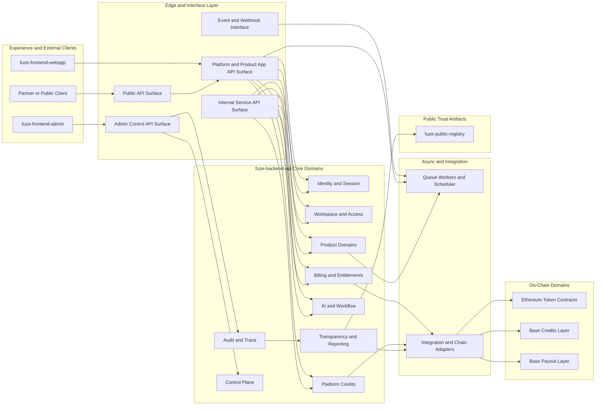
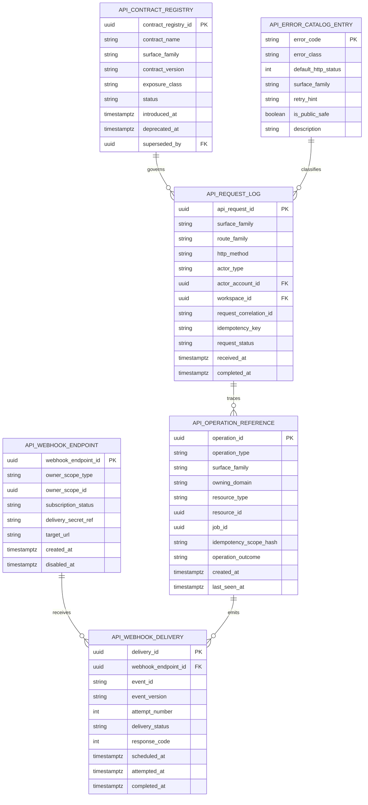
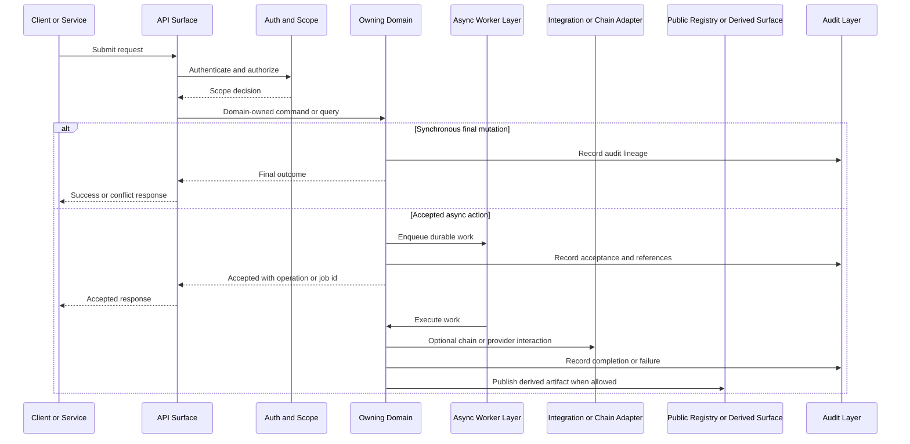

# API_ARCHITECTURE_SPEC.md

## 1. Title
FUZE API Architecture Specification

## 2. Document Metadata
- Document Name: API_ARCHITECTURE_SPEC.md
- Status: Active Draft for Approval
- API Classification: platform-wide architecture; public, internal, admin, derived-public, event-driven, and chain-adjacent interface governance
- Owning Domain: Platform Architecture / API Architecture
- Primary Implementing Repo: `fuze-backend-api`
- Supporting Repos: `fuze-frontend-webapp`, `fuze-frontend-admin`, `fuze-contracts`, `fuze-public-registry`, future `fuze-sdk`
- Primary System of Record: platform-owned service contracts and domain-owned canonical data stores inside `fuze-backend-api`, with explicit on-chain contract truth where applicable
- Canonical Folder Target: `fuze.ac > docs > api-spec`
- Interpretation Mode: architecture-level API source of truth

## 3. Purpose
This document defines the canonical API architecture of the FUZE platform. Its purpose is to establish how FUZE structures APIs across platform domains, product domains, internal service coordination, public trust surfaces, admin and control-plane actions, event-driven interfaces, and chain-adjacent integrations so that interface design reinforces canonical ownership, economic safety, auditability, and long-term platform consistency.

FUZE is a platform-first ecosystem with shared identity, workspace, billing, Platform Credits, AI orchestration, workflow execution, transparency, governance-sensitive controls, Ethereum token participation, Base credits commitments, and Base payout execution. In such a system, API architecture is not merely transport design. It is one of the main enforcement layers for domain ownership, write authority, read-model discipline, async workflow behavior, and public trust.

## 4. Scope
This specification covers:
- platform-wide API philosophy and boundary rules
- API surface families across public, first-party, internal, admin, derived-public, event, and chain-adjacent interfaces
- ownership-aligned write/read principles
- request, response, correlation, and error architecture principles
- synchronous and asynchronous interaction patterns
- authentication, authorization, and scope rules at the architecture level
- versioning, compatibility, and idempotency expectations at the architecture level
- event and webhook positioning relative to APIs
- governance, treasury, credits, billing, payout, and transparency-sensitive boundary rules
- contract-derivation expectations for OpenAPI, AsyncAPI, and future SDK generation

This specification does not define every endpoint, payload field, or domain-specific resource contract. Those belong in narrower API SPEC files and derived machine-readable contracts.

## 5. Source-of-Truth Inputs
### Governing FUZE indexes
- `DOCS_SPEC.md`
- `SYSTEM_SPEC_INDEX.md`

### Highest-priority FUZE system specifications used
- `SYSTEM_BOUNDARY_AND_OWNERSHIP_SPEC.md`
- `PLATFORM_ARCHITECTURE_SPEC.md`
- `DOMAIN_OWNERSHIP_MATRIX_SPEC.md`
- `DATA_MODEL_AND_ENTITY_OWNERSHIP_SPEC.md`
- `ONCHAIN_OFFCHAIN_RESPONSIBILITY_SPEC.md`

### Additional FUZE API and runtime specifications used
- `PUBLIC_API_SPEC.md`
- `INTERNAL_SERVICE_API_SPEC.md`
- `EVENT_MODEL_AND_WEBHOOK_SPEC_refreshed.md`
- `IDEMPOTENCY_AND_VERSIONING_SPEC.md`
- `MIGRATION_AND_BACKWARD_COMPATIBILITY_SPEC.md`
- `SERVICE_TOPOLOGY_SPEC.md`

### FUZE core docs used for architectural alignment
- `FUZE_WHITEPAPER_v.2026.3.0.1.pdf`
- `FUZE_CHAIN_ARCHITECTURE.md`
- `FUZE_PLATFORM_CREDITS.md`
- `STABLECOIN_PROFIT_PARTICIPATION.md`
- `TOKEN_CONTRACT_ARCHITECTURE_.md`

### Supporting format and quality guides
- `The_API_Specification_guide.md`
- `Database_Schemas_Guide.md`

### External standards used only as supporting design guidance
- HTTP semantics and idempotent-method principles from RFC 9110
- OpenAPI ecosystem conventions for contract-first API design
- AsyncAPI ecosystem conventions for event and webhook contract modeling

### Source priority interpretation
Where ambiguity exists, platform-wide ownership and architecture documents override narrower API or product documents. Docs-level conflicts are resolved according to `DOCS_SPEC.md`. System-spec conflicts are resolved according to `SYSTEM_SPEC_INDEX.md`.

## 6. Governing Architecture and Ownership Interpretation
FUZE APIs exist to expose capabilities according to canonical ownership, trust sensitivity, and execution mode rather than according to frontend convenience or temporary repository structure.

The architecture therefore applies these governing rules:
- `fuze-backend-api` owns business truth, domain APIs, orchestration APIs, admin execution APIs, worker-trigger interfaces, integration ingress, and chain-adjacent adapters.
- `fuze-frontend-webapp` consumes APIs and owns presentation only.
- `fuze-frontend-admin` triggers privileged workflows and renders control-plane state, but does not own durable truth.
- `fuze-contracts` owns explicit on-chain contract behavior and chain-native truth only where contract design commits it.
- `fuze-public-registry` publishes derived or canonical public artifacts but does not redefine underlying platform or chain truth.
- future `fuze-sdk` derives from approved contracts rather than acting as source of truth.

The result is a boundary-enforcement API model. Domain owners expose interfaces. Consumers may read, derive, present, and execute against those interfaces according to contract, but they do not take over ownership of the underlying fact.

## 7. Domain Responsibilities
### Platform API architecture domain responsibilities
- define API surface families and their allowed use
- define canonical response and error philosophy
- define routing and contract-boundary discipline
- define write/read separation rules
- define sync vs async interaction guidance
- define public vs internal vs admin exposure criteria
- define chain-adjacent interface boundaries
- define contract-derivation requirements for OpenAPI and AsyncAPI

### Domain responsibilities by interface family
- **Platform application APIs**: expose shared platform capabilities such as identity, workspace, wallet-aware context, billing, credits, AI orchestration, workflow entrypoints, audit visibility, and transparency views.
- **Product-domain APIs**: expose product-owned canonical objects and product-specific workflows while consuming platform primitives.
- **Internal service APIs**: provide service-to-service collaboration without bypassing ownership boundaries.
- **Admin/control-plane APIs**: provide privileged operator and governance-aware control flows under stronger authorization, auditing, and mutation safety.
- **Public APIs**: expose only intentionally safe and supportable external contracts.
- **Event and webhook contracts**: communicate accepted outcomes and state changes outward from the owning domain.
- **Chain-adjacent APIs**: coordinate off-chain orchestration with on-chain truth, without pretending that contracts own off-chain policy or that off-chain systems own on-chain execution truth.

## 8. Out of Scope
This document does not:
- define every route path or schema field
- freeze every internal transport choice to HTTP only
- define product-specific request and result contracts in full
- define every event payload schema
- define every admin workflow detail
- define the full database schema of each domain
- redefine chain architecture, profit-participation policy, or contract logic that belongs in dedicated docs
- authorize public exposure of every first-party endpoint

## 9. Canonical Entities and Data Ownership
This architecture references the following canonical entity classes:

### Platform canonical entities
- account
- linked login method
- session
- workspace
- workspace membership
- role assignment / access grant
- wallet link
- credits account / balance context
- subscription
- entitlement
- payment record
- invoice / receipt
- audit event
- payout-cycle orchestration record
- transparency publication record
- integration provider record

### Product-domain canonical entities
- product request objects
- product job objects
- product result artifacts
- product-specific configuration and workflow entities

### On-chain canonical entities
- FUZE token balance and transfer truth on Ethereum
- Base Platform Credits commitment state where applicable
- Base payout funding and claim execution state
- vault and governance contract state

### Derived entities
- dashboard aggregates
- public registry entries
- payout ledger artifacts
- investor/community reports
- transparency reports
- search indexes and caches

### Ownership interpretation
- canonical write entities are owned by the relevant platform, product, or on-chain domain
- derived entities may aggregate or publish, but they may not redefine canonical meaning
- API architecture must preserve lineage between canonical entities and derived representations
- contract state, policy-derived datasets, and off-chain business entities must remain distinct

## 10. State Model and Lifecycle
At architecture level, FUZE APIs should recognize the following lifecycle classes rather than one global state machine.

### A. Synchronous request lifecycle
`requested -> validated -> authorized -> applied | rejected`

### B. Asynchronous request lifecycle
`requested -> accepted -> queued -> running -> completed | failed | canceled`

### C. Economic mutation lifecycle
`requested -> validated -> policy_checked -> applied_once -> recorded -> reported`

### D. Public artifact publication lifecycle
`prepared -> reviewed -> published -> superseded | corrected | deprecated`

### E. Governance-sensitive action lifecycle
`proposed -> gated -> approved -> executed | rejected | expired`

### Lifecycle rules
- API acceptance is not always equivalent to final state.
- Async APIs must expose accepted-state semantics explicitly.
- Governance-sensitive APIs require stronger state progression controls than routine runtime APIs.
- Publication-oriented APIs must preserve historical interpretability through correction and supersession rather than silent replacement where trust-sensitive artifacts are involved.

## 11. API Surface Overview
FUZE recognizes the following canonical API surface families.

### 11.1 Platform Application APIs
Used by first-party surfaces and product domains to access shared platform capabilities.

Examples:
- identity and account context
- workspace and membership reads/writes
- wallet-link actions
- credits balance and spend-intent operations
- subscription and entitlement operations
- workflow initiation and status APIs

### 11.2 Product-Domain APIs
Used by product-facing surfaces and product services to create, mutate, and read product-owned objects.

Examples:
- QTB analysis requests
- AIMM configuration jobs
- ZAGA utility operations
- AIE event-intelligence requests
- HerHelp generation requests
- Botmad workflow scans

### 11.3 Internal Service APIs
Used for service-to-service coordination across platform-owned and product-owned domains.

Examples:
- payment verification handoff to billing
- credits issuance command requests
- entitlement refresh requests
- payout-cycle preparation requests
- registry publication coordination

### 11.4 Admin / Control-Plane APIs
Used by privileged operators and governance-aware systems for approvals, overrides, emergency controls, and policy-safe operational actions.

Examples:
- support-safe correction requests
- review and approval transitions
- control-path status reads
- incident and operational actions subject to policy

### 11.5 Public APIs
Used by external consumers, partner systems, public clients, and public-read trust surfaces under explicit exposure policy.

Examples:
- public registry reads
- transparency report retrieval
- public metadata reads
- authenticated user profile, workspace, credits, and job-status reads
- selected externally consumable product request/result APIs

### 11.6 Event-Driven Interfaces
Used for asynchronous coordination and external webhook delivery.

Examples:
- `payment.verified`
- `credits.issued`
- `workflow.run.started`
- `product_job.completed`
- `payout_cycle.funded`

### 11.7 Chain-Adjacent APIs
Used by the off-chain platform to interpret, coordinate, reconcile, and present chain-linked actions.

Examples:
- token-aware participation lookups
- payout-cycle preparation based on policy-derived eligibility
- contract registry and wallet registry publication
- Base credits and payout execution observation and reconciliation

## 12. Authentication and Authorization Model
### Authentication subjects
FUZE APIs may authenticate:
- end-user accounts
- workspace members
- internal services
- admin or operator roles
- governance-gated execution actors
- partner or external integration clients
- unauthenticated public readers for explicitly public resources

### Authorization dimensions
Authorization must be evaluated by scope and domain, not authentication alone. At minimum, authorization may depend on:
- account scope
- workspace scope
- product scope
- entitlement state
- billing or credits state where relevant
- admin/operator role
- governance-sensitive control path
- environment restrictions
- public visibility class

### Surface-family authorization posture
- **Public read**: intentionally visible only, no hidden privileged data.
- **Authenticated public**: user- or workspace-scoped only.
- **Internal service**: mutually authenticated and least-privilege domain-to-domain rights.
- **Admin/control-plane**: explicit role, policy, and audit gating.
- **Chain-adjacent**: split between read access, orchestration rights, and governance-controlled execution.

### Non-negotiable rule
No API may assume that because the caller is first-party or internal it may bypass domain authorization. Trusted caller status does not replace domain-specific mutation authority.

## 13. API Endpoints / Interface Contracts
This file defines architectural route families and contract shapes rather than every final endpoint. Route-family names are normative at the architecture level.

### 13.1 Platform application route families
- `POST /v1/accounts`
- `GET /v1/me`
- `POST /v1/sessions`
- `DELETE /v1/sessions/{session_id}`
- `GET /v1/workspaces`
- `POST /v1/workspaces`
- `GET /v1/workspaces/{workspace_id}`
- `POST /v1/workspaces/{workspace_id}/members`
- `GET /v1/wallet-links`
- `POST /v1/wallet-links`
- `GET /v1/credits/accounts/{credits_account_id}`
- `GET /v1/credits/accounts/{credits_account_id}/ledger`
- `GET /v1/subscriptions`
- `POST /v1/subscriptions/change-requests`
- `POST /v1/workflows/runs`
- `GET /v1/workflows/runs/{run_id}`

### 13.2 Product-domain route families
- `POST /v1/products/{product_key}/requests`
- `GET /v1/products/{product_key}/requests/{request_id}`
- `GET /v1/products/{product_key}/jobs/{job_id}`
- `GET /v1/products/{product_key}/results/{result_id}`
- `PATCH /v1/products/{product_key}/objects/{object_id}`

### 13.3 Internal service route families
- `POST /internal/v1/{domain}/commands/{command_name}`
- `GET /internal/v1/{domain}/queries/{query_name}`
- `POST /internal/v1/{domain}/transitions/{transition_name}`
- `POST /internal/v1/{domain}/reconciliations/{operation_name}`

### 13.4 Admin / control-plane route families
- `GET /admin/v1/{domain}/records/{record_id}`
- `POST /admin/v1/{domain}/approvals`
- `POST /admin/v1/{domain}/corrections`
- `POST /admin/v1/{domain}/overrides`
- `GET /admin/v1/control-plane/status`

### 13.5 Public trust and registry route families
- `GET /public/v1/registry/contracts`
- `GET /public/v1/registry/wallets`
- `GET /public/v1/transparency/reports`
- `GET /public/v1/payout-cycles`
- `GET /public/v1/platform/metadata`
- `GET /public/v1/products/catalog`

### 13.6 Interface contract rules
For every route family or interface contract:
- paths should be resource-oriented and noun-based where practical
- paths should not expose raw internal mutation primitives to public callers
- domain-owned mutations should be represented as business actions or explicit domain transitions
- derived/public artifacts should be clearly distinct from canonical write paths
- admin routes must not be reused as ordinary app routes
- internal APIs must not be exposed publicly by accident or by proxy

## 14. Request Rules
### General request rules
- every write-capable request must identify acting subject, scope, and target resource or business action
- all mutation requests must be traceable to a domain-owned intent
- request validation must occur before authorization-sensitive side effects
- request fields must distinguish canonical identifiers, client correlation identifiers, and optional metadata

### Scope rules
Requests must make scope explicit where relevant:
- account-scoped
- workspace-scoped
- product-scoped
- payout-cycle-scoped
- governance-action-scoped

### Async request rules
Long-running actions must use an acceptance model:
- request accepted
- returned stable request or job identifier
- status retrievable through explicit status or result APIs

### Business-action rule
Public and first-party writes should express business intent, not raw internal mutation power.

Examples:
- allowed: request checkout, request product run, request wallet link, request workspace creation
- not allowed as general public primitives: `issue_credits`, `adjust_ledger`, `publish_payout_cycle`, `advance_governance_state`

## 15. Response Rules
### Response philosophy
Responses must help clients and operators understand:
- whether the operation succeeded, was accepted, conflicted, rejected, or failed
- whether the returned resource is canonical, derived, or publication-oriented
- which correlation and trace references apply
- whether the result is final or still in progress

### Recommended response envelope concepts
- `status`
- `data`
- `error`
- `correlation_id`
- `request_id` or `job_id` where relevant
- pagination metadata where relevant
- version metadata where relevant

### Response-state classes
- `success`
- `accepted`
- `previously_applied`
- `conflict`
- `rejected`
- `error`

### Important rule
A response that acknowledges request acceptance must not masquerade as final completion if the underlying work is asynchronous.

## 16. Error Model
FUZE uses a structured error model across API families.

### Error classes
- validation errors
- authentication errors
- authorization errors
- scope errors
- state conflict errors
- idempotency conflicts
- rate limit or quota errors
- dependency/provider errors
- async execution failure status
- governance or policy denial errors
- internal platform errors

### Error payload expectations
An error payload should communicate:
- machine-readable error code
- human-readable message
- domain or subsystem context
- retry suitability where appropriate
- correlation or trace reference
- optional field-level validation details

### Architectural error rules
- public errors must avoid leaking sensitive internals
n- internal errors may include richer domain context, but still require consistency
- admin errors must preserve reviewability for support and policy-sensitive workflows
- economic and governance-sensitive APIs require especially clear conflict and denial semantics

## 17. Idempotency and Mutation Safety
Idempotency in FUZE is business-level, not only transport-level.

### Architecture rules
- repeated submission of the same intended business action must apply at most once in business meaning
- identical retries must resolve to stable outcomes or explicit conflict semantics
- the stronger the economic or governance sensitivity, the stronger the idempotency requirement
- idempotency references must be recorded in audit lineage for retriable write operations

### Operations requiring explicit idempotency treatment
- account-creation flows where duplicate creation is possible
- wallet-link confirmation flows
- checkout or payment-linked business actions
- async job submission
- credits mutations
- subscription transitions
- payout publication and trust-sensitive publication actions
- governance- or treasury-sensitive action requests

### Mutation safety rules
- no frontend may act as local owner of mutation truth
- no read-model service may mutate canonical source truth silently
- no product may create alternate balance or payout semantics outside approved platform boundaries

## 18. Versioning and Compatibility Rules
### Architecture versioning principles
- every externally consumed or cross-domain consumed contract should evolve deliberately
- public APIs require stronger stability guarantees than internal interfaces
- event and webhook payloads must preserve interpretability during evolution
- published trust artifacts must preserve historical meaning when format changes

### Versioning model
At architecture level, FUZE supports:
- path or surface-family versioning for public APIs, e.g. `/v1/...`
- explicit contract versioning for events and webhooks
- internal interface versioning when cross-service compatibility requires it
- publication-version metadata for derived/public artifacts where format or interpretation evolves

### Compatibility rules
- breaking changes require explicit version transition
- additive changes are preferred over disruptive mutation of existing semantics
- deprecation must be explicit for public and cross-domain contracts
- migration-sensitive domains must preserve lineage and interpretation across versions

## 19. Event Emission and Webhook Behavior
### Event positioning
Events are complementary to APIs, not replacements for them.
- APIs initiate, query, or accept actions
- events communicate meaningful accepted outcomes or state changes outward
- audit records preserve review lineage

### Event rules
- events must be produced by the owning domain or by an authorized domain-owned orchestration path
- consumers may react, project, notify, or trigger follow-up work, but do not take ownership of original truth
- internal event delivery should be assumed at-least-once
- public webhooks are narrower and safer subsets of internal event surfaces

### Architectural event families
- domain events
- integration events
- system/operational events
- public webhook events

### Webhook rules
- every webhook must include stable event identity
- webhook retries must not imply new business actions
- webhook exposure must not leak internal control-plane state by default

## 20. Audit and Activity Requirements
Every meaningful API mutation or privileged read family must have audit posture appropriate to its sensitivity.

### Must be auditable
- account and workspace mutations
- wallet-link mutations
- credits and billing mutations
- product job submissions where billable or policy-relevant
- admin approvals, overrides, and corrections
- payout, registry, transparency, and governance-sensitive publication actions
- internal service commands affecting economic or trust-sensitive state

### Audit expectations
Audit records should capture:
- acting subject
- acting scope
- interface family
- request identifier
- idempotency identifier where applicable
- target entity or business reference
- outcome class
- correlation/trace identifiers
- resulting event linkage where applicable

Activity feeds may be user-facing or operator-facing, but they are not substitutes for canonical audit records.

## 21. Data Model and Database Schema View
This section defines the minimum database-oriented architecture needed to support FUZE API behavior.

### Core architecture tables / entity families
#### `api_request_log`
Purpose:
- store accepted or attempted API requests for traceability, rate analysis, and support diagnostics

Key columns:
- `api_request_id` PK
- `surface_family`
- `route_family`
- `http_method`
- `actor_type`
- `actor_account_id` nullable FK
- `workspace_id` nullable FK
- `client_id` nullable FK
- `request_correlation_id`
- `idempotency_key` nullable
- `request_status`
- `received_at`
- `completed_at` nullable

Indexes:
- `(surface_family, route_family, received_at)`
- `(request_correlation_id)` unique where present
- `(actor_account_id, received_at)`
- `(idempotency_key, actor_account_id, workspace_id, route_family)` partial where idempotency applies

#### `api_operation_reference`
Purpose:
- bind business actions and async requests to stable operation identity

Key columns:
- `operation_id` PK
- `operation_type`
- `surface_family`
- `owning_domain`
- `resource_type`
- `resource_id` nullable
- `job_id` nullable
- `idempotency_scope_hash`
- `operation_outcome`
- `created_at`
- `last_seen_at`

Constraints:
- unique business operation reference within scoped idempotency dimensions

#### `api_contract_registry`
Purpose:
- track approved contract families, route families, version, exposure class, and deprecation state

Key columns:
- `contract_registry_id` PK
- `contract_name`
- `surface_family`
- `contract_version`
- `exposure_class`
- `status`
- `introduced_at`
- `deprecated_at` nullable
- `superseded_by` nullable self FK

#### `api_error_catalog_entry`
Purpose:
- govern stable machine-readable error taxonomy across surface families

Key columns:
- `error_code` PK
- `error_class`
- `default_http_status`
- `surface_family`
- `retry_hint`
- `is_public_safe`
- `description`

#### `api_webhook_endpoint`
Purpose:
- manage registered partner/public webhook endpoints where allowed

Key columns:
- `webhook_endpoint_id` PK
- `owner_scope_type`
- `owner_scope_id`
- `subscription_status`
- `delivery_secret_ref`
- `target_url`
- `created_at`
- `disabled_at` nullable

#### `api_webhook_delivery`
Purpose:
- preserve retry lineage and delivery status for emitted webhook events

Key columns:
- `delivery_id` PK
- `webhook_endpoint_id` FK
- `event_id`
- `event_version`
- `attempt_number`
- `delivery_status`
- `response_code` nullable
- `scheduled_at`
- `attempted_at` nullable
- `completed_at` nullable

### Schema rules
- API architecture tables do not own core domain truth; they support contract governance, traceability, and safe execution.
- Core business entities remain in domain-owned tables.
- API support tables must preserve lineage to domain-owned entities through stable foreign references.
- derived/public artifacts should be linked to source domain references and publication records rather than redefining business truth.

## 22. Architecture Diagram — Mermaid flowchart

## 23. Data Design — Mermaid Diagram

## 24. Flow View
### Happy path
1. Client or service calls the appropriate API surface family.
2. Edge layer validates request shape, correlation metadata, and surface eligibility.
3. Authn/authz and scope checks are performed.
4. Owning domain processes the business action or accepts async work.
5. Canonical mutation occurs only in the owning domain or contract domain.
6. Response indicates final success or accepted state.
7. Audit records and downstream events are emitted where relevant.
8. Derived/public artifacts update through approved reporting or publication flows.

### Alternate path
1. A client uses a public surface to initiate a valid business action.
2. The request is translated to an owning-domain command rather than directly mutating internal subsystems.
3. The domain accepts the action asynchronously and returns a stable operation reference.
4. The client later polls or subscribes for status and retrieves final artifacts from result APIs.

### Failure and recovery path
1. A request times out or a dependency fails.
2. The caller retries with the same idempotency identity where required.
3. The owning domain resolves whether the action is previously applied, still in progress, or safely retryable.
4. Duplicate business mutation is prevented.
5. Failures are surfaced through structured error or status semantics.
6. Operators use admin/control-plane APIs for review, correction, or replay only through governed paths.

### Retry behavior
- naturally idempotent reads may be retried freely
- retry-sensitive writes require business-level idempotency protection
- async job submissions should resolve to the same logical operation when the same business request is retried
- event and webhook consumers must assume duplicate delivery is possible

### Admin override flow
- admin surfaces may initiate correction or override requests
- the backend control-plane domain evaluates policy and authorization
- corrections produce auditable records and, where necessary, compensating domain actions rather than silent truth rewrites

## 25. Data Flows — Mermaid sequenceDiagram

## 26. Security and Risk Controls
- public exposure must be deliberate, narrow, and supportable
- internal APIs require mutual trust establishment plus least-privilege authorization
- admin/control-plane APIs require stronger authorization and audit posture than ordinary product APIs
- governance-, treasury-, credits-, billing-, and payout-sensitive interfaces require explicit policy gating and stronger mutation safety
- API error payloads must not leak sensitive internals to public clients
- webhook deliveries must use verifiable signing or shared-secret verification
- chain-adjacent APIs must preserve the distinction between chain truth, off-chain policy, and derived reporting
- surface separation must prevent accidental promotion of internal or admin routes into public contracts

## 27. Operational Considerations
- topology may begin as a modular backend architecture but ownership rules must remain stable
- async workloads should be separated from latency-sensitive request paths where heavy processing, retries, or reconciliation are required
- contract registry and error catalog governance should be maintained as explicit artifacts
- request tracing and correlation IDs are required for cross-domain supportability
- public and internal rate limits may differ by surface family
- platform operators need visibility into accepted, replayed, conflicted, and failed mutation outcomes
- historical contract and publication versions must remain interpretable for audit and support

## 28. Acceptance Criteria
1. Every FUZE API can be classified into one surface family defined in this document.
2. Every write-capable API maps to a single canonical owning domain.
3. No frontend surface is treated as durable truth owner.
4. Public APIs are narrower than internal and admin APIs in mutation authority.
5. Derived/public read APIs are explicitly distinguishable from canonical write paths.
6. Async operations use an accepted-state pattern with stable operation or job identifiers.
7. Governance-, treasury-, credits-, billing-, and payout-sensitive APIs require stronger controls than routine runtime APIs.
8. Event-driven interfaces are positioned as outcome propagation mechanisms, not hidden write paths.
9. API contracts preserve the separation between FUZE token, Platform Credits, stablecoin payout execution, treasury, governance, and transparency artifacts.
10. Architecture-level response, error, versioning, and idempotency rules are consistent across later domain API specs.
11. The specification is implementable in `fuze-backend-api` and consumable by both frontend repos without shifting truth ownership into the UI.
12. The file is derivation-ready for OpenAPI, AsyncAPI, and future SDK package planning.

## 29. Test Cases
### Positive cases
- classify a new workspace mutation API as a platform application API owned by the workspace domain
- classify a product analysis submission API as a product-domain API with async acceptance semantics
- classify a public registry lookup endpoint as a public read API exposing a canonical public artifact or derived public model

### Negative cases
- reject a design where a dashboard aggregation API directly mutates subscription truth
- reject a design where a product invents local credits balance semantics outside the platform credits domain
- reject a design where a public API exposes raw payout entitlement mutation

### Authorization cases
- authenticated account can access its own scoped profile and credits summaries
- workspace admin can trigger permitted workspace-scoped operations
- ordinary user cannot invoke admin/control-plane routes
- internal service without domain-specific authorization cannot mutate another domain’s truth through undocumented shortcuts

### Idempotency cases
- repeated async job submission with same business identity returns the same logical operation reference
- repeated payment-linked issuance command does not create duplicate credits mutation
- repeated payout publication request resolves to previously applied or explicit conflict outcome

### Concurrency / replay cases
- simultaneous conflicting state transitions surface as conflict, not silent double mutation
- duplicate event delivery does not create duplicate downstream publication artifacts
- duplicate webhook retry retains same event identity and distinct delivery-attempt lineage

### Reconciliation / ledger integrity cases
- reporting artifact generation does not redefine canonical billing, credits, or payout truth
- public registry publication references canonical contract and wallet sources without becoming chain-state owner

### Event and webhook cases
- domain event is emitted only after owning-domain acceptance or state change
- public webhook exposure is narrower than internal event production and preserves retry-safe identity

## 30. Open Questions or Explicit Deferred Decisions
1. Whether FUZE will standardize one exact response envelope across all surface families or allow bounded family-specific envelopes with shared semantics.
2. Whether internal service APIs will remain HTTP-first, hybrid, or partially gateway-mediated in implementation.
3. Whether path-based versioning will be used for all public APIs or whether some partner surfaces will use header-based or contract-metadata versioning.
4. Whether some first-party app route families will intentionally remain private and not graduate into public contract families.
5. Whether all public trust surfaces will be served directly from `fuze-backend-api` or whether some will be materialized and served through `fuze-public-registry` infrastructure.

## 31. Implementation Notes for `fuze-backend-api`
- treat this file as the top-level API boundary and surface-family contract for the backend
- implement route families by owning domain, not by UI screen grouping
- keep admin controllers and public controllers physically and logically separated
- maintain shared correlation, audit, error, and idempotency middleware or modules without centralizing business truth away from domains
- expose internal commands and queries through explicit contracts rather than private database coupling
- isolate chain-adjacent adapters from ordinary product or app controllers
- maintain a contract registry and error catalog as governed backend artifacts

## 32. Frontend Consumption Notes
### For `fuze-frontend-webapp`
- consume only public and first-party app-facing routes intended for user or workspace interaction
- never treat cached UI state as canonical truth
- rely on accepted-state plus polling or status retrieval patterns for async work
- avoid hidden assumptions that first-party app routes are automatically public contracts

### For `fuze-frontend-admin`
- consume only admin/control-plane and authorized reporting interfaces appropriate to privileged workflows
- do not implement business mutation locally
- corrections, overrides, and approvals must be explicit backend-owned actions with auditable outcomes
- admin UX may present richer operational detail, but must still respect canonical ownership boundaries

## 33. Contract Derivation Notes
### OpenAPI / AsyncAPI
- derive separate machine-readable contracts for public, internal, admin, and product surface families rather than collapsing them into one undifferentiated file
- keep shared schemas, error catalog entries, idempotency semantics, and version markers consistent across derived contracts
- represent async acceptance, status retrieval, and final artifact fetch patterns explicitly
- represent event and webhook contracts separately via AsyncAPI or equivalent event contract artifacts

### Future `fuze-sdk`
- derive SDK packages from approved public and partner-facing contracts only
- do not let SDK ergonomics redefine API ownership or business semantics
- separate shared platform SDK modules from product-specific SDK modules
- preserve stable names for route families, error codes, operation references, and event identities to support reliable SDK generation
