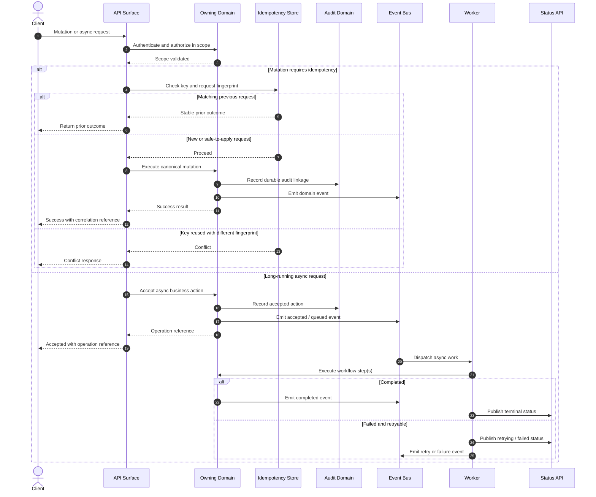

# API_ARCHITECTURE_SPEC.md
Canonical API Architecture Specification for FUZE.ac

## 1. Title

**API_ARCHITECTURE_SPEC.md**  
Canonical API Architecture Specification for the FUZE Platform

---

## 2. Document Metadata

- Document Name: `API_ARCHITECTURE_SPEC.md`
- Document Type: Platform-wide API architecture specification
- Status: Canonical Draft for Source-of-Truth Use
- Governing Registries:
  - `DOCS_SPEC.md`
  - `SYSTEM_SPEC_INDEX.md`
- Primary Implementation Repo: `fuze-backend-api`
- Consumer Repos:
  - `fuze-frontend-webapp`
  - `fuze-frontend-admin`
- Related Repos:
  - `fuze-contracts`
  - `fuze-specs`
  - `fuze-public-registry`
  - `fuze-sdk` (future derived consumer only)
- Specification Layer: Shared API / workflow / event / runtime layer
- Intended Folder: `fuze.ac > docs > system-spec`
- Related Specifications:
  - `PUBLIC_API_SPEC.md`
  - `INTERNAL_SERVICE_API_SPEC.md`
  - `EVENT_MODEL_AND_WEBHOOK_SPEC.md`
  - `IDEMPOTENCY_AND_VERSIONING_SPEC.md`
  - `MIGRATION_AND_BACKWARD_COMPATIBILITY_SPEC.md`

---

## 3. Purpose

This document defines the canonical API architecture of the FUZE platform. Its purpose is to establish how APIs are structured across FUZE, how platform and product domains expose capabilities safely and coherently, how write and read boundaries align with canonical entity ownership, and how the API layer supports a multi-product, transparency-first platform with shared identity, billing, Platform Credits, workflow, governance, treasury, stablecoin payout execution, and public transparency systems.

In FUZE, API architecture is not only a transport concern. It is a boundary-enforcement layer. It determines which backend domains are allowed to mutate truth, which surfaces are read-only, which actions must be asynchronous, which interfaces are safe for public exposure, and how product-specific APIs extend the platform without redefining it.

---

## 4. Scope

This specification covers:

- the canonical API philosophy of the FUZE ecosystem
- the distinction among first-party application APIs, public APIs, internal service APIs, admin/control APIs, and event-driven interfaces
- how APIs align with canonical entity ownership and mutation authority
- request, response, error, versioning, and idempotency principles at the architecture level
- identity, workspace, wallet-aware, Platform Credits, billing, AI, workflow, governance, treasury, transparency, and payout-sensitive API boundaries
- synchronous versus asynchronous API interaction patterns
- how APIs interact with audit, monitoring, transparency, reporting, and chain-integration systems
- security, privacy, control, and failure-handling principles for FUZE APIs

This specification does **not** define every endpoint, every payload field, or every product-specific route. Those details belong in downstream domain API specifications, product API specifications, OpenAPI contracts, AsyncAPI contracts, and implementation code.

---

## 5. Source-of-Truth Inputs

### 5.1 Governing FUZE docs

The following docs-level sources govern this specification:

- `DOCS_SPEC.md`
- `FUZE_WHITEPAPER_v.2026.3.0.1.pdf`
- `FUZE_CHAIN_ARCHITECTURE.md`
- `FUZE_PLATFORM_CREDITS.md`
- `STABLECOIN_PROFIT_PARTICIPATION.md`
- `TOKEN_CONTRACT_ARCHITECTURE_.md`

### 5.2 Governing FUZE system specs

The following system-spec sources govern this specification:

- `SYSTEM_SPEC_INDEX.md`
- `SYSTEM_BOUNDARY_AND_OWNERSHIP_SPEC.md`
- `SYSTEM_OVERVIEW_AND_BOUNDARIES_SPEC.md`
- `PLATFORM_ARCHITECTURE_SPEC.md`
- `DOMAIN_OWNERSHIP_MATRIX_SPEC.md`
- `DATA_MODEL_AND_ENTITY_OWNERSHIP_SPEC.md`
- `ONCHAIN_OFFCHAIN_RESPONSIBILITY_SPEC.md`
- `AUTH_SESSION_AND_LINKED_LOGIN_SPEC.md`
- `ROLE_PERMISSION_AND_ACCESS_CONTROL_SPEC.md`
- `PLATFORM_CREDITS_SPEC.md`
- `CREDIT_LEDGER_AND_SETTLEMENT_SPEC.md`
- `SUBSCRIPTIONS_AND_USAGE_BILLING_SPEC.md`
- `AI_ORCHESTRATION_SPEC.md`
- `AI_USAGE_METERING_SPEC.md`
- `MODEL_ROUTING_AND_CONTEXT_SPEC.md`
- `WORKFLOW_AND_AUTOMATION_SPEC.md`
- `JOB_QUEUE_AND_WORKER_SPEC.md`
- `EVENT_MODEL_AND_WEBHOOK_SPEC_refreshed.md`
- `AUDIT_LOG_AND_ACTIVITY_SPEC.md`
- `PUBLIC_CONTRACT_AND_WALLET_REGISTRY_SPEC.md`
- `TRANSPARENCY_REPORTING_SPEC.md`
- `PAYOUT_LEDGER_SPEC.md`
- `BASE_PLATFORM_CREDITS_LAYER_SPEC.md`
- `BASE_PAYOUT_EXECUTION_LAYER_SPEC.md`
- `SECURITY_AND_RISK_CONTROL_SPEC.md`
- `PAYMENT_FRAUD_AND_ABUSE_PREVENTION_SPEC.md`

### 5.3 Highest-priority interpretation inputs

When conflicts arise, the following are treated as highest priority for this document:

1. `SYSTEM_BOUNDARY_AND_OWNERSHIP_SPEC.md`
2. `SYSTEM_OVERVIEW_AND_BOUNDARIES_SPEC.md`
3. `PLATFORM_ARCHITECTURE_SPEC.md`
4. `DOMAIN_OWNERSHIP_MATRIX_SPEC.md`
5. `DATA_MODEL_AND_ENTITY_OWNERSHIP_SPEC.md`
6. `ONCHAIN_OFFCHAIN_RESPONSIBILITY_SPEC.md`
7. Docs-level conflict order from `DOCS_SPEC.md`

### 5.4 Supporting external references

The following external references inform best practices but do not override FUZE source-of-truth rules:

- OpenAPI Specification guidance
- current IETF draft guidance for the `Idempotency-Key` HTTP header
- OWASP API Security Top 10 (2023)
- Mermaid syntax guidance for flowchart, ER, and sequence diagrams

---

## 6. Governing Architecture and Ownership Interpretation

### 6.1 Core interpretation

FUZE is a shared platform core with product extension domains and a separate on-chain integration layer. APIs must reinforce this architecture rather than weaken it. Shared platform concerns such as identity, workspaces, Platform Credits, billing, wallet-aware participation, workflow orchestration, AI orchestration, audit, transparency, and reporting remain platform-owned. Product APIs extend the platform by exposing product-domain capabilities, but they do not take ownership of shared platform truth.

### 6.2 Why this API architecture belongs to the platform core

API architecture is platform-owned because it governs:

- interface classes and boundary discipline across all products
- how canonical writes map to owning backend domains
- how read aggregation is separated from write authority
- how public, internal, admin, and event interfaces differ
- how on-chain and off-chain responsibilities remain distinct
- how async execution becomes first-class without collapsing every action into blocking HTTP calls

### 6.3 Why other domains do not own this specification

- Product domains do not own it because they inherit and extend the shared platform API rules.
- Frontend repos do not own it because frontend surfaces consume APIs and must not define mutation authority.
- `fuze-contracts` does not own it because contract interfaces are chain-domain interfaces, not the whole platform interaction model.
- `fuze-sdk` does not own it because SDKs are derived packaging artifacts, not canonical interface truth.

### 6.4 Platform constraints that shape this design

This API architecture is constrained by the following FUZE rules:

- backend domains own durable truth
- frontend surfaces must not become shadow owners of business state
- FUZE token, Platform Credits, stablecoin payout execution, treasury, and governance must remain distinct
- on-chain state and off-chain business truth must coordinate explicitly
- trust-sensitive operations require narrower, more explicit contracts than routine product reads
- reporting and transparency surfaces are derived and must not redefine canonical truth

---

## 7. Domain Responsibilities

### 7.1 Platform-owned API responsibilities

The platform layer owns APIs for:

- identity and account lifecycle
- sessions and linked login
- workspace and organization context
- role and permission evaluation
- wallet-aware participation context
- subscriptions, entitlements, invoicing, receipts, and commercial state
- Platform Credits issuance, reservation, spending, release, reversal, and adjustment
- AI orchestration and usage metering
- shared workflow and automation orchestration
- audit and activity capture
- transparency and reporting publication coordination
- public wallet and contract registry surfaces

### 7.2 Product-owned API responsibilities

Each product owns APIs for product-domain objects and workflows, such as:

- QTB analysis requests and outputs
- AIMM operational configuration and simulation workflows
- ZAGA utility-program objects
- AIE discovery and event-intelligence objects
- HerHelp generation project lifecycle
- Botmad workflow assistance artifacts
- ToolGrid inventory, campaigns, tools, zones, and analytics surfaces

### 7.3 Chain-adjacent API responsibilities

Chain-adjacent APIs coordinate with on-chain systems but do not erase chain boundaries. They include:

- token-state observation
- Base Platform Credits ledger coordination
- payout-cycle execution coordination
- snapshot and eligibility pipeline coordination
- contract event ingestion and reconciliation

### 7.4 Derived/public-trust API responsibilities

Derived and public-trust APIs may expose:

- public metadata
- public product catalog views
- public contract and wallet registry views
- public transparency and payout-status views
- investor/community report access surfaces

These surfaces remain read-oriented and derived unless a narrower write contract is explicitly approved.

---

## 8. Out of Scope

This specification does not define:

- exact wire-level endpoint inventory for every domain
- exact OpenAPI schemas for every payload
- exact auth token implementation details
- exact internal transport technologies for all service-to-service calls
- exact queue infrastructure or broker implementation
- exact SDK class layout
- exact public monetization or quota policy
- exact chain ABI layouts
- exact pagination and search parameter conventions for every downstream API family

Those details belong in domain API specs, product API specs, OpenAPI / AsyncAPI files, and implementation documents.

---

## 9. Canonical Entities and Data Ownership

This section defines the minimum architecture-level entities required to make FUZE API design coherent. These are conceptual ownership entities, not full implementation tables.

### 9.1 API surface entities

| Entity | Purpose | Canonical Owner |
|---|---|---|
| `api_surface` | Defines a distinct callable interface family | Platform API architecture |
| `api_surface_version` | Tracks contract version lineage | Platform API architecture |
| `api_visibility_class` | Public, internal, first-party, admin, or webhook classification | Platform API architecture |
| `api_operation_policy` | Declares policy, sensitivity, and allowed caller types | Platform API architecture |

### 9.2 Request lineage entities

| Entity | Purpose | Canonical Owner |
|---|---|---|
| `request_lineage` | Request-level trace and correlation record | Platform request layer |
| `correlation_reference` | Cross-service and async correlation | Platform orchestration layer |
| `idempotency_record` | Mutation replay protection | Owning mutation domain |
| `auth_subject_context` | Caller identity and role scope | Identity / access domains |

### 9.3 Async operation entities

| Entity | Purpose | Canonical Owner |
|---|---|---|
| `async_operation` | Durable accepted operation record | Owning domain or shared workflow domain |
| `job_execution` | Worker execution record | Async execution layer |
| `operation_result_reference` | Result linkage to canonical entity or artifact | Owning domain |
| `retry_lineage` | Retry-attempt lineage and terminal classification | Async execution layer |

### 9.4 Trust-sensitive linkage entities

| Entity | Purpose | Canonical Owner |
|---|---|---|
| `audit_lineage_reference` | Durable audit linkage for sensitive actions | Audit domain |
| `policy_reference` | Governing rule or policy source | Control / governance layer |
| `payout_cycle_reference` | Payout correlation and public reporting linkage | Payout-related domains |
| `governance_action_reference` | Governance-sensitive action lineage | Governance domain |

### 9.5 Ownership rules

- `api_surface` and interface classification are platform-owned.
- `idempotency_record` belongs to the domain that owns the mutation semantics.
- `async_operation` belongs to the accepting domain, even if the actual execution is delegated to workers.
- derived dashboards, frontend state, or reporting mirrors are **not** canonical owners of API truth.

---

## 10. State Model and Lifecycle

### 10.1 API surface lifecycle

`draft -> approved -> implemented -> versioned -> deprecated -> retired`

### 10.2 Synchronous request lifecycle

`received -> authenticated -> authorized -> validated -> executed -> responded -> audited`

### 10.3 Asynchronous request lifecycle

`received -> authenticated -> authorized -> validated -> accepted -> queued -> executing -> completed | failed | cancelled`

### 10.4 Event-driven side effect lifecycle

`domain mutation committed -> domain event emitted -> downstream consumers process -> retries if needed -> terminal handled state`

### 10.5 Public/deprecated interface lifecycle

`active -> deprecation_announced -> migration_window -> sunset_locked -> retired`

### 10.6 Important lifecycle rule

A successful synchronous API response does not necessarily mean every downstream side effect completed. If the business action is async or event-driven, the accepted or completed meaning must be explicit.

---

## 11. API Surface Overview

FUZE must explicitly recognize the following API surface families.

### 11.1 First-party application APIs

Used by `fuze-frontend-webapp` and selected first-party product experiences.

Characteristics:
- identity-aware
- scope-aware
- typically authenticated
- may submit sync or async work
- may expose aggregated read models
- must not become hidden admin or public integration surfaces

### 11.2 Platform domain APIs

Used by first-party apps and product services to access platform-owned capabilities.

Examples:
- identity
- workspace
- wallet-aware context
- Platform Credits reads and mutation requests
- subscription and billing checks
- workflow entrypoints
- audit-aware actions

### 11.3 Product-domain APIs

Used by product frontends and product services to create, mutate, and read product-owned domain objects.

### 11.4 Internal service APIs

Used for service-to-service coordination inside FUZE. They are typed collaboration boundaries and must not be treated as public APIs by accident.

### 11.5 Admin/control-plane APIs

Used by `fuze-frontend-admin` and privileged operational tools for policy-sensitive, support-sensitive, and control-sensitive flows.

### 11.6 Public APIs

Used by external consumers, public data surfaces, partner-safe integrations, or explicitly allowed read/public interaction layers.

### 11.7 Event-driven interfaces

Used for asynchronous system coordination and selected external webhooks.

### 11.8 Surface-family rule

These families may share conventions, but they must **not** be treated as one undifferentiated interface layer. Different API families have different:

- stability expectations
- auth and authorization rules
- rate-limit rules
- exposure rules
- audit requirements
- side-effect semantics

---

## 12. Authentication and Authorization Model

### 12.1 Authentication subjects

API callers may be:

- end-user accounts
- workspace members
- internal services
- privileged operators/admins
- governance-controlled executors
- partner or external integration clients
- public unauthenticated consumers for selected read-only surfaces

### 12.2 Authorization dimensions

Authorization must consider:

- account identity
- workspace role and scope
- product entitlement
- billing owner scope
- wallet-aware context where relevant
- admin/operator authority
- governance policy restrictions
- control-plane or environment restrictions

### 12.3 Sensitive-scope rule

Authentication alone is not sufficient for sensitive domains. Credits, billing, treasury, governance, payout, and admin override flows require explicit authorization checks with scope-aware policy evaluation.

### 12.4 Least-privilege rule

Tokens, sessions, service credentials, and admin capabilities must have only the authority required for their function.

---

## 13. API Endpoints / Interface Contracts

This architecture-level specification defines the canonical route families and contract classes rather than every final downstream endpoint.

### 13.1 Canonical route family classes

#### A. First-party application route families
- `/v1/app/...`
- `/v1/workspaces/...`
- `/v1/me/...`
- `/v1/products/...`

#### B. Platform domain route families
- `/v1/identity/...`
- `/v1/auth/...`
- `/v1/workspaces/...`
- `/v1/roles/...`
- `/v1/wallets/...`
- `/v1/credits/...`
- `/v1/billing/...`
- `/v1/invoices/...`
- `/v1/receipts/...`
- `/v1/ai/...`
- `/v1/workflows/...`
- `/v1/audit/...`

#### C. Product-domain route families
- `/v1/qtb/...`
- `/v1/aimm/...`
- `/v1/zaga/...`
- `/v1/aie/...`
- `/v1/herhelp/...`
- `/v1/botmad/...`
- `/v1/toolgrid/...`

#### D. Admin/control families
- `/v1/admin/...`
- `/v1/control/...`
- `/v1/ops/...`

#### E. Public families
- `/v1/public/...`
- `/v1/public/registry/...`
- `/v1/public/transparency/...`
- `/v1/public/products/...`
- `/v1/public/payouts/...`

#### F. Internal families
- `/internal/v1/...`

#### G. Webhook families
- outbound webhook event contracts
- inbound provider callback contracts under dedicated callback routes

### 13.2 Canonical interaction contracts

#### Read-only contract
- Purpose: fetch canonical or derived state
- Caller types: first-party, public, internal, or admin depending on domain
- Side effects: no business mutation
- Audit: trace request lineage; durable audit only where policy requires it

#### Mutation contract
- Purpose: create or mutate canonical truth in the owning domain
- Caller types: scoped authenticated first-party, admin, or internal service
- Side effects: domain-owned mutation only
- Requirements: validation, authorization, idempotency, audit where relevant, downstream event emission where relevant

#### Accepted-async contract
- Purpose: accept long-running or multi-step work
- Caller types: first-party, internal, or admin depending on domain
- Response: accepted status, operation reference, correlation reference
- Side effects: durable operation record, queue or workflow submission

#### Internal command/query contract
- Purpose: typed service-to-service collaboration
- Caller types: authenticated internal services only
- Requirements: strong traceability, explicit contract versioning discipline, narrow scope

#### Public-read contract
- Purpose: expose intentionally public, safe, supportable data
- Caller types: external consumers or unauthenticated clients where allowed
- Requirements: no hidden write semantics, clear caching rules, strong abuse control

#### Webhook contract
- Purpose: notify external consumers of approved event outcomes
- Requirements: signed delivery, retry discipline, deduplication behavior, event versioning

### 13.3 Architecture-level route semantics

- Use noun-oriented, resource-oriented paths for HTTP-style APIs.
- Keep admin and internal surfaces separate from public surface naming.
- Do not expose generic “do anything” mutation endpoints.
- Credits, treasury, governance, and payout-sensitive actions must use narrow, explicit operation routes or operation types.
- Aggregated reads may compose across domains, but writes must terminate in the owning domain contract.

---

## 14. Request Rules

### 14.1 Request composition rules

Requests must be explicit about:

- caller identity
- scope
- target resource or operation
- mutation intent if applicable
- idempotency key where applicable
- correlation metadata where supported
- version target where applicable

### 14.2 Scope rules

Important APIs must preserve scope explicitly, including:

- account scope
- workspace scope
- product scope
- billing owner scope
- governance domain scope
- payout-cycle scope where relevant

### 14.3 Validation rules

All mutation-capable APIs must validate:

- required fields
- allowed state transitions
- ownership and scope constraints
- product/platform boundaries
- treasury / governance / payout policy constraints where relevant

### 14.4 Replay safety rule

Retry-capable mutation requests must be designed with domain-level idempotency, not only transport-level retry assumptions.

---

## 15. Response Rules

### 15.1 Response philosophy

Responses must make clear:

- whether the call succeeded, was accepted, or failed
- whether the returned object is canonical or derived
- the applicable request, correlation, or operation reference
- whether additional async processing remains pending
- the applicable error class when unsuccessful

### 15.2 Minimum response envelope semantics

At minimum, FUZE APIs should be able to carry these concepts:

- success or accepted outcome
- data payload
- error object when needed
- correlation reference
- pagination metadata where relevant
- async operation metadata where relevant

### 15.3 Async response rule

Accepted async responses must not pretend to be final success. They should expose an operation reference and clear follow-up status semantics.

### 15.4 Derived-read response rule

Derived reads should declare themselves as derived where confusion with canonical truth is possible.

---

## 16. Error Model

### 16.1 Error architecture principles

Errors must communicate:

- machine-readable code
- human-readable message
- category
- retry guidance where appropriate
- correlation reference
- domain context where useful but safe

### 16.2 Minimum error classes

FUZE error classes must distinguish among:

- validation errors
- authentication errors
- authorization errors
- object-level access errors
- state conflict errors
- rate limit / quota errors
- dependency/provider errors
- async job failure states
- governance or policy denial errors
- internal platform errors

### 16.3 Sensitive-domain error rule

Credits, billing, treasury, governance, and payout-sensitive APIs must return explicit, supportable error classifications and must not use vague generic failures where actionability matters.

### 16.4 Public error rule

Public APIs must avoid leaking internal implementation details while still preserving a predictable and supportable error model.

---

## 17. Idempotency and Mutation Safety

### 17.1 Canonical rule

If the same business mutation is submitted more than once due to retry, replay, duplicate delivery, or transient failure, FUZE should apply it at most once in business meaning.

### 17.2 When idempotency is required

Idempotency is required for:

- external payment-verification follow-through
- Platform Credits issuance, reservation, spend, release, reversal, and adjustment
- subscription and entitlement mutation where replay is possible
- refund, reversal, or adjustment flows
- payout-cycle publication and payout-sensitive transitions
- governance or treasury-sensitive execution requests
- inbound provider callbacks
- accepted async operation submission where duplicate create semantics are dangerous

### 17.3 Architecture-level mechanism

FUZE should support an `Idempotency-Key` style request mechanism for non-idempotent HTTP mutation methods where retry safety matters, while domain-level storage determines the true business deduplication rules.

### 17.4 Conflict rule

A repeated key with the same business request should return the stable prior outcome where possible. A repeated key with a materially different payload should be treated as a conflict, not as a successful replay.

---

## 18. Versioning and Compatibility Rules

### 18.1 Versioning philosophy

- Public APIs must use explicit and stable versioning.
- Internal APIs still require change discipline even if their exact versioning mechanism differs.
- Events and webhooks must follow compatibility discipline.
- Breaking changes must not be introduced casually into broadly consumed surfaces.

### 18.2 Preferred evolution pattern

- add rather than break when possible
- deprecate explicitly
- preserve migration windows where needed
- document semantic changes clearly
- keep canonical ownership stable even when interface shape evolves

### 18.3 Compatibility rule

Versioning must protect continuity without freezing all internal evolution. The more external or trust-sensitive a surface is, the stronger its compatibility discipline must be.

---

## 19. Event Emission and Webhook Behavior

### 19.1 Event-first coordination rule

FUZE should prefer event-driven coordination for important cross-domain side effects.

Examples:
- payment verified -> credits issued
- subscription renewed -> entitlements refreshed
- credits spent -> product usage recorded
- payout cycle funded -> payout ledger updated
- governance action executed -> transparency update triggered

### 19.2 Event ownership rule

Events communicate meaningful outcomes from the owning domain outward. They do not transfer ownership of the underlying truth to downstream consumers.

### 19.3 Webhook exposure rule

External webhook contracts are permitted only for intentionally supported external outcomes and must not expose internal governance-, treasury-, or payout-sensitive control events by default.

### 19.4 Delivery rule

Webhook and event consumers must support replay safety, deduplication, retry handling, and version-aware consumption.

---

## 20. Audit and Activity Requirements

### 20.1 Auditability requirements

Important API interactions must support:

- correlation IDs
- actor and scope traceability
- request timestamps
- result classification
- idempotency references where relevant
- workflow or operation references for async actions
- durable audit generation for trust-sensitive actions

### 20.2 Activity versus audit distinction

- audit records are durable compliance/control traces
- activity feeds are user-facing or operator-facing experience surfaces
- API responses are not themselves audit or activity systems
- events are not substitutes for full audit records

### 20.3 Sensitive-domain requirement

Credits, billing, treasury, governance, admin override, and payout-sensitive APIs must have stronger durable audit lineage than ordinary read APIs.

---

## 21. Data Model and Database Schema View

This section provides the architecture-level relational blueprint needed to support API discipline in `fuze-backend-api`. Exact schema details belong in downstream domain specs.

### 21.1 Core architecture tables

#### `api_surfaces`
- `api_surface_id` (PK, UUID)
- `surface_name` (unique)
- `surface_family` (enum: first_party, platform, product, internal, admin, public, webhook)
- `owning_domain`
- `visibility_class`
- `status` (draft, active, deprecated, retired)
- `version_reference`
- `created_at`
- `updated_at`

#### `api_operations`
- `api_operation_id` (PK, UUID)
- `api_surface_id` (FK -> `api_surfaces.api_surface_id`)
- `operation_name`
- `http_method` (nullable for non-HTTP contracts)
- `route_pattern` (nullable for non-HTTP contracts)
- `operation_type` (read, mutate, async_accept, internal_command, internal_query, webhook_inbound, webhook_outbound)
- `owning_domain`
- `sensitivity_class`
- `requires_idempotency`
- `audit_class`
- `status`
- `created_at`
- `updated_at`

#### `request_lineage`
- `request_id` (PK, UUID)
- `correlation_id` (indexed)
- `api_operation_id` (FK -> `api_operations.api_operation_id`)
- `actor_type`
- `actor_reference`
- `workspace_id` (nullable)
- `scope_type`
- `scope_reference`
- `received_at`
- `completed_at` (nullable)
- `response_status`
- `error_code` (nullable)

#### `idempotency_records`
- `idempotency_record_id` (PK, UUID)
- `owning_domain`
- `idempotency_key` (indexed)
- `request_fingerprint`
- `operation_name`
- `actor_reference`
- `scope_reference`
- `first_request_id` (FK -> `request_lineage.request_id`)
- `stored_outcome_reference`
- `status`
- `expires_at` (nullable)
- `created_at`

**Constraints**
- unique constraint on (`owning_domain`, `idempotency_key`)
- request fingerprint mismatch with same key must raise conflict semantics

#### `async_operations`
- `async_operation_id` (PK, UUID)
- `request_id` (FK -> `request_lineage.request_id`)
- `owning_domain`
- `operation_name`
- `status` (accepted, queued, executing, completed, failed, cancelled)
- `accepted_at`
- `started_at` (nullable)
- `completed_at` (nullable)
- `failed_at` (nullable)
- `result_reference` (nullable)
- `failure_code` (nullable)
- `retry_count`
- `workflow_reference` (nullable)
- `job_reference` (nullable)

#### `api_version_registry`
- `api_version_registry_id` (PK, UUID)
- `surface_name`
- `version_reference`
- `compatibility_class`
- `effective_from`
- `deprecation_announced_at` (nullable)
- `sunset_at` (nullable)
- `notes`

### 21.2 Relationship model

- one `api_surface` has many `api_operations`
- one `api_operation` has many `request_lineage` rows
- one request may have zero or one `async_operations` records
- one request may link to one `idempotency_record`
- one surface may have many version records over time

### 21.3 Database design notes

- Keep `request_lineage` append-heavy and index on `correlation_id`, `actor_reference`, and `received_at`.
- Keep `idempotency_records` domain-partitionable for high-volume mutation domains.
- Do not store derived dashboard state as source-of-truth mutation lineage.
- Product-domain schema extensions should reuse the architecture tables for request lineage, async coordination, and audit linkage rather than inventing isolated tracing models.
- Strongly typed resource identifiers should be stable once issued and must not be replaced by presentation-layer aliases.
- Calculated or summary fields should remain derived where possible rather than becoming shadow truth tables.

---

## 22. Architecture Diagram — Mermaid flowchart

```mermaid
flowchart TD
    A[External Clients / Public Consumers]
    B[fuze-frontend-webapp]
    C[fuze-frontend-admin]

    subgraph API_SURFACES[API Surface Families]
        D[Public APIs]
        E[First-Party App APIs]
        F[Admin / Control APIs]
        G[Internal Service APIs]
        H[Event / Webhook Interfaces]
    end

    subgraph PLATFORM_CORE[fuze-backend-api Platform Core]
        I[Identity and Access Domain]
        J[Workspace and Role Domain]
        K[Wallet-Aware Domain]
        L[Billing and Subscription Domain]
        M[Platform Credits Domain]
        N[AI Orchestration Domain]
        O[Workflow and Automation Domain]
        P[Audit and Activity Domain]
        Q[Transparency and Reporting Coordination]
        R[Registry Publication Coordination]
    end

    subgraph PRODUCT_DOMAINS[Product Domains]
        S[QTB]
        T[AIMM]
        U[ZAGA]
        V[AIE]
        W[HerHelp]
        X[Botmad]
        Y[ToolGrid]
    end

    subgraph ASYNC_RUNTIME[Async and Runtime Layers]
        Z[Job Queue and Workers]
        AA[Schedulers]
        AB[Event Bus / Domain Events]
    end

    subgraph CHAIN_LAYER[Chain-Adjacent Integration]
        AC[Ethereum Token Read]
        AD[Base Credits Layer]
        AE[Base Payout Execution Layer]
        AF[Snapshot and Eligibility Pipeline]
        AG[Contract Event Ingestion]
    end

    subgraph DERIVED_OUTPUTS[Derived / Public Trust Outputs]
        AH[fuze-public-registry]
        AI[Public Transparency Outputs]
        AJ[Investor / Community Outputs]
    end

    A --> D
    B --> E
    C --> F

    D --> I
    D --> J
    D --> K
    D --> L
    D --> M
    D --> Q
    D --> R
    D --> S
    D --> T
    D --> U
    D --> V
    D --> W
    D --> X
    D --> Y

    E --> I
    E --> J
    E --> K
    E --> L
    E --> M
    E --> N
    E --> O
    E --> S
    E --> T
    E --> U
    E --> V
    E --> W
    E --> X
    E --> Y

    F --> I
    F --> J
    F --> L
    F --> M
    F --> O
    F --> P
    F --> Q
    F --> R

    G --> I
    G --> J
    G --> K
    G --> L
    G --> M
    G --> N
    G --> O
    G --> P
    G --> Q
    G --> R
    G --> S
    G --> T
    G --> U
    G --> V
    G --> W
    G --> X
    G --> Y

    O --> Z
    O --> AA
    I --> AB
    J --> AB
    K --> AB
    L --> AB
    M --> AB
    N --> AB
    O --> AB
    S --> AB
    T --> AB
    U --> AB
    V --> AB
    W --> AB
    X --> AB
    Y --> AB

    G --> AC
    G --> AD
    G --> AE
    G --> AF
    G --> AG

    Q --> AI
    R --> AH
    Q --> AJ

    H --> AB
    AG --> AB
```



---

## 23. Data Design — Mermaid Diagram

```mermaid
erDiagram
    API_SURFACES ||--o{ API_OPERATIONS : contains
    API_OPERATIONS ||--o{ REQUEST_LINEAGE : records
    REQUEST_LINEAGE ||--o| ASYNC_OPERATIONS : may_create
    REQUEST_LINEAGE ||--o| IDEMPOTENCY_RECORDS : may_link
    API_SURFACES ||--o{ API_VERSION_REGISTRY : versions

    API_SURFACES {
        uuid api_surface_id PK
        string surface_name UK
        string surface_family
        string owning_domain
        string visibility_class
        string status
        string version_reference
        timestamp created_at
        timestamp updated_at
    }

    API_OPERATIONS {
        uuid api_operation_id PK
        uuid api_surface_id FK
        string operation_name
        string http_method
        string route_pattern
        string operation_type
        string owning_domain
        string sensitivity_class
        boolean requires_idempotency
        string audit_class
        string status
        timestamp created_at
        timestamp updated_at
    }

    REQUEST_LINEAGE {
        uuid request_id PK
        string correlation_id IDX
        uuid api_operation_id FK
        string actor_type
        string actor_reference
        uuid workspace_id
        string scope_type
        string scope_reference
        timestamp received_at
        timestamp completed_at
        string response_status
        string error_code
    }

    IDEMPOTENCY_RECORDS {
        uuid idempotency_record_id PK
        string owning_domain
        string idempotency_key UK
        string request_fingerprint
        string operation_name
        string actor_reference
        string scope_reference
        uuid first_request_id FK
        string stored_outcome_reference
        string status
        timestamp expires_at
        timestamp created_at
    }

    ASYNC_OPERATIONS {
        uuid async_operation_id PK
        uuid request_id FK
        string owning_domain
        string operation_name
        string status
        timestamp accepted_at
        timestamp started_at
        timestamp completed_at
        timestamp failed_at
        string result_reference
        string failure_code
        int retry_count
        string workflow_reference
        string job_reference
    }

    API_VERSION_REGISTRY {
        uuid api_version_registry_id PK
        string surface_name
        string version_reference
        string compatibility_class
        timestamp effective_from
        timestamp deprecation_announced_at
        timestamp sunset_at
        string notes
    }
```

---

## 24. Flow View

### 24.1 Happy path — synchronous canonical mutation

1. Client calls the owning domain API.
2. The API authenticates the caller.
3. The API authorizes the caller in explicit scope.
4. The API validates payload and current state.
5. If mutation-capable, the API checks idempotency rules.
6. The owning domain performs the canonical mutation.
7. The API records request lineage and audit linkage as required.
8. The owning domain emits a domain event if downstream consequences exist.
9. The API returns a success response with canonical identifiers and a correlation reference.

### 24.2 Happy path — asynchronous accepted action

1. Client submits a long-running action.
2. The API authenticates, authorizes, validates, and applies idempotency rules.
3. The API creates a durable accepted operation record.
4. The API enqueues a workflow or job reference.
5. The API returns an accepted response with an operation reference.
6. Workers execute downstream work.
7. A status API or event stream reflects progress.
8. The final result becomes available through explicit result or status endpoints.

### 24.3 Alternate flow — aggregated read

1. Client requests dashboard or summary view.
2. The read API composes from canonical or derived sources.
3. The response is labeled as canonical or derived as appropriate.
4. No domain truth is mutated.
5. No local frontend correction is allowed.

### 24.4 Failure flow — dependency failure during accepted async work

1. Request is accepted successfully.
2. Worker begins execution.
3. External provider or internal dependency fails.
4. Worker records failure state and retry lineage.
5. Operation remains observable as failed or retrying.
6. Canonical mutation is not silently duplicated.
7. Client or operator can inspect the terminal failure state and next permitted action.

### 24.5 Retry / replay flow

1. Client retries a mutation with the same idempotency key after timeout.
2. The API compares the owning-domain idempotency record.
3. If the request fingerprint matches, the prior stable outcome is returned.
4. If the fingerprint differs, a conflict response is returned.
5. Duplicate mutation is prevented.

### 24.6 Admin override / review flow

1. A privileged operator calls the admin/control API.
2. The API authenticates and validates elevated scope.
3. The API checks role and policy restrictions.
4. A narrow explicit action is executed, not a generic freeform mutation.
5. Durable audit lineage is required.
6. Downstream domain consequences flow through explicit events or orchestration.

### 24.7 Cross-domain side-effect flow

1. The owning domain commits a canonical change.
2. The domain emits an event.
3. A subscriber domain reacts through event-driven coordination or explicit internal API.
4. The subscriber updates only its own canonical entities.
5. Cross-domain write shortcuts are not allowed.

---

## 25. Data Flows — Mermaid sequenceDiagram



---

## 26. Security and Risk Controls

### 26.1 Core security principles

- least privilege
- explicit scope-aware authorization
- strong separation between public and internal surfaces
- sensitive-path hardening for Platform Credits, billing, treasury, governance, and payout
- abuse resistance through validation, rate limiting, and replay protection
- inventory and contract management for public APIs

### 26.2 Architecture-level controls

- broken object-level authorization must be addressed at the operation level
- function-level authorization must distinguish ordinary user actions from privileged control actions
- property-level exposure must be governed in read responses, not left to ad hoc frontend filtering
- public APIs must have stronger external inventory discipline than internal APIs
- unsafe consumption of external callbacks and provider APIs must be mediated through explicit inbound interface contracts

### 26.3 Sensitive-domain hardening

The following surfaces require tighter controls than ordinary product reads:

- Platform Credits mutation
- billing-state mutation
- refund and reversal paths
- governance and foundation operations
- treasury and vault actions
- payout-cycle preparation and publication
- public transparency publication controls
- admin override functions

---

## 27. Operational Considerations

### 27.1 Degraded mode philosophy

FUZE APIs should support degraded mode without redefining truth.

Examples:
- AI orchestration unavailable while identity and billing remain healthy
- reporting or transparency publication delayed while canonical economic truth remains intact
- product-specific long-running actions delayed while accepted request lineage remains visible
- public-read surfaces degraded without changing internal canonical state

### 27.2 Observability requirements

Operational monitoring should support:

- request correlation
- surface-family classification
- owning-domain attribution
- async operation visibility
- error-class aggregation
- retry and replay visibility
- public versus internal traffic segmentation

### 27.3 Runtime placement rule

- synchronous request handling belongs in request/response layers
- orchestration belongs in orchestration layers
- heavy or retry-capable work belongs in async execution layers
- chain interactions belong in on-chain integration layers
- reporting and transparency publication belong in derived/reporting layers

---

## 28. Acceptance Criteria

1. The API architecture explicitly distinguishes first-party, platform, product, internal, admin, public, and event-driven interface families.
2. The specification makes clear that canonical writes must terminate in the owning backend domain.
3. The specification explicitly prevents aggregated read surfaces from becoming hidden write owners.
4. The specification preserves separation between FUZE token, Platform Credits, stablecoin payout execution, treasury, governance, and transparency layers.
5. The specification defines when synchronous versus asynchronous APIs should be used.
6. The specification requires event-first coordination for important cross-domain side effects.
7. The specification defines minimum response, error, idempotency, and versioning principles.
8. The specification includes a concrete architecture-level database schema view with identifiable tables, keys, and constraints.
9. The specification includes a Mermaid architecture diagram that matches the stated platform ownership and surface model.
10. The specification includes a Mermaid data-design diagram that matches the stated schema view.
11. The specification includes a flow view and Mermaid sequence diagram covering happy path, alternate flow, failure flow, retry flow, and admin override or review concepts.
12. The specification aligns with the FUZE repository model and assigns primary API ownership to `fuze-backend-api`.
13. The specification includes implementation notes for first-party frontend consumers and future contract derivation.
14. The specification is usable as a governing source-of-truth file for downstream domain API specs and OpenAPI / AsyncAPI work.

---

## 29. Test Cases

### 29.1 Positive cases

1. **Canonical mutation route uses owning domain**
   - Given a Platform Credits reservation request
   - When a first-party app calls the Platform Credits mutation API
   - Then the mutation is processed by the credits-owning backend domain
   - And no product frontend owns the mutation logic

2. **Accepted async operation returns durable reference**
   - Given a long-running HerHelp generation request
   - When the request is accepted
   - Then an async operation reference is returned
   - And the result is retrievable through status/result flows

3. **Derived read remains read-only**
   - Given a dashboard summary view
   - When the aggregated read endpoint composes billing and Platform Credits state
   - Then the response presents derived data without mutating canonical billing or credits truth

### 29.2 Negative cases

4. **Cross-domain convenience write is rejected**
   - Given a product domain attempts to mutate billing truth directly
   - When it bypasses the billing-owning API
   - Then the architecture is considered violated and the design fails review

5. **Frontend-owned truth is rejected**
   - Given `fuze-frontend-webapp` attempts to resolve credits conflicts locally
   - When its behavior diverges from backend truth
   - Then the architecture is considered invalid

6. **Generic sensitive mutation endpoint is rejected**
   - Given an admin API proposes a generic treasury action endpoint without narrow action typing
   - Then the design fails review as too broad for a trust-sensitive domain

### 29.3 Authorization cases

7. **Scope-aware authorization required**
   - Given a user belongs to one workspace only
   - When they attempt a workspace-scoped mutation in another workspace
   - Then the request is denied with an authorization error

8. **Privileged override requires stronger control**
   - Given an operator attempts a payout-related override
   - When their role lacks payout authority
   - Then the action is denied and logged

### 29.4 Idempotency cases

9. **Repeat with same idempotency key returns stable prior outcome**
   - Given a retry of a Platform Credits reservation mutation with the same key and identical payload
   - Then the same business outcome is returned without duplicate mutation

10. **Repeat with same key but different payload conflicts**
   - Given a retry with reused idempotency key and a changed payload
   - Then the API returns a conflict response and rejects the second mutation

### 29.5 Concurrency / replay cases

11. **Inbound provider callback replay is safe**
   - Given an external payment verification callback is replayed
   - When the same event is received twice
   - Then duplicate Platform Credits issuance does not occur

12. **Async retry does not create second canonical result**
   - Given an async operation experiences worker retry
   - Then execution lineage is visible and the canonical business action is still applied at most once

### 29.6 Event / webhook cases

13. **Owning domain emits event after canonical mutation**
   - Given a subscription renewal changes entitlement truth
   - Then the billing-owning domain emits the downstream event
   - And downstream consumers do not become owners of billing truth

14. **Public webhook excludes internal-only controls**
   - Given a public webhook contract is proposed for governance control events
   - Then the proposal is rejected unless explicitly approved as a safe external surface

### 29.7 Reconciliation / ledger integrity cases

15. **Reporting lag does not redefine economic truth**
   - Given a transparency publication job is delayed
   - Then the canonical payout or Platform Credits truth remains unchanged
   - And public reporting reflects delayed publication rather than rewriting truth

### 29.8 Diagram consistency cases

16. **Architecture Mermaid matches prose**
   - Given the architecture diagram
   - When reviewed against the architecture and ownership sections
   - Then every major node and relationship used in the diagram is supported by the prose

17. **Data Design Mermaid matches schema**
   - Given the ER diagram
   - When reviewed against the schema section
   - Then every entity and relationship in the diagram exists in the schema prose
   - And no additional unsupported entities appear

18. **Sequence diagram matches flow view**
   - Given the sequence diagram
   - When reviewed against the flow section
   - Then the submit, idempotency, async, audit, event, and retry behaviors remain consistent

---

## 30. Open Questions or Explicit Deferred Decisions

1. Exact OpenAPI envelope schema is deferred to downstream contract files.
2. Exact auth token format and service credential mechanism are deferred to auth-specific API and security specifications.
3. Exact pagination, filtering, and search conventions are deferred to shared contract design.
4. Exact AsyncAPI event naming registry is deferred to event/webhook contract files.
5. Exact route inventory by domain is deferred to downstream domain API specs.
6. Exact public quota and monetization model for public APIs is deferred.
7. Exact internal transport mix beyond HTTP-style request/response and event-driven coordination is deferred to runtime and implementation choices.

---

## 31. Implementation Notes for `fuze-backend-api`

### 31.1 Repository placement

`fuze-backend-api` is the primary implementation owner of this specification.

### 31.2 Required backend structure implications

The backend should preserve explicit separation among:

- request/response entrypoints
- platform domains
- product domains
- orchestration
- async execution
- chain integration
- reporting and transparency publication coordination
- admin/control entrypoints

### 31.3 Required backend behaviors

- publish domain-owned APIs only from the owning modules
- centralize auth, correlation, error envelope, and idempotency middleware where appropriate
- keep domain mutation semantics in domain modules, not generic controllers
- support accepted async operation patterns uniformly
- emit events from owning domains after canonical mutation
- preserve audit linkage for sensitive actions
- keep public, admin, and internal route families physically and logically separated

---

## 32. Frontend Consumption Notes

### 32.1 `fuze-frontend-webapp`

The webapp may consume:

- first-party application APIs
- approved public-read APIs where useful
- product-domain APIs
- async status/result APIs

The webapp must **not**:
- own canonical mutation logic
- reconcile backend truth locally as authoritative truth
- call internal service APIs directly
- access privileged admin/control APIs

### 32.2 `fuze-frontend-admin`

The admin frontend may consume:

- admin/control APIs
- privileged operational read models
- support and review endpoints
- narrow explicit override endpoints

The admin frontend must **not**:
- become the owner of policy truth
- become the owner of payout truth
- become the owner of ledger truth
- bypass backend audit and authorization logic

---

## 33. Contract Derivation Notes

### 33.1 OpenAPI / AsyncAPI derivation

This specification should drive the creation of:

- `public.openapi.yaml`
- `internal-platform.openapi.yaml`
- `admin-control-plane.openapi.yaml`
- product-specific OpenAPI files
- `platform-events.asyncapi.yaml`
- `partner-webhooks.asyncapi.yaml`
- shared error and schema registries

### 33.2 Derivation rule

Narrative API architecture comes first. Machine-readable contracts derive from it. Implementation derives from the contracts. SDKs derive later from the approved contracts.

### 33.3 Future `fuze-sdk`

Future SDK packages must derive from approved public or partner-safe contracts only. Internal and admin contracts should not be treated as default SDK surfaces unless explicitly approved.

---

## Closing Summary

The FUZE API architecture is the boundary-enforcement and capability-exposure layer of a multi-product, transparency-first platform ecosystem. It aligns writes with canonical ownership, distinguishes first-party, platform, product, internal, public, admin, and event-driven surfaces, treats asynchronous work as first-class where necessary, and applies stronger control discipline to Platform Credits, billing, governance, treasury, and payout-sensitive domains. By treating APIs as architecture rather than only transport, FUZE creates a durable implementation foundation for downstream domain API specifications, machine-readable contracts, and long-term platform scale.
