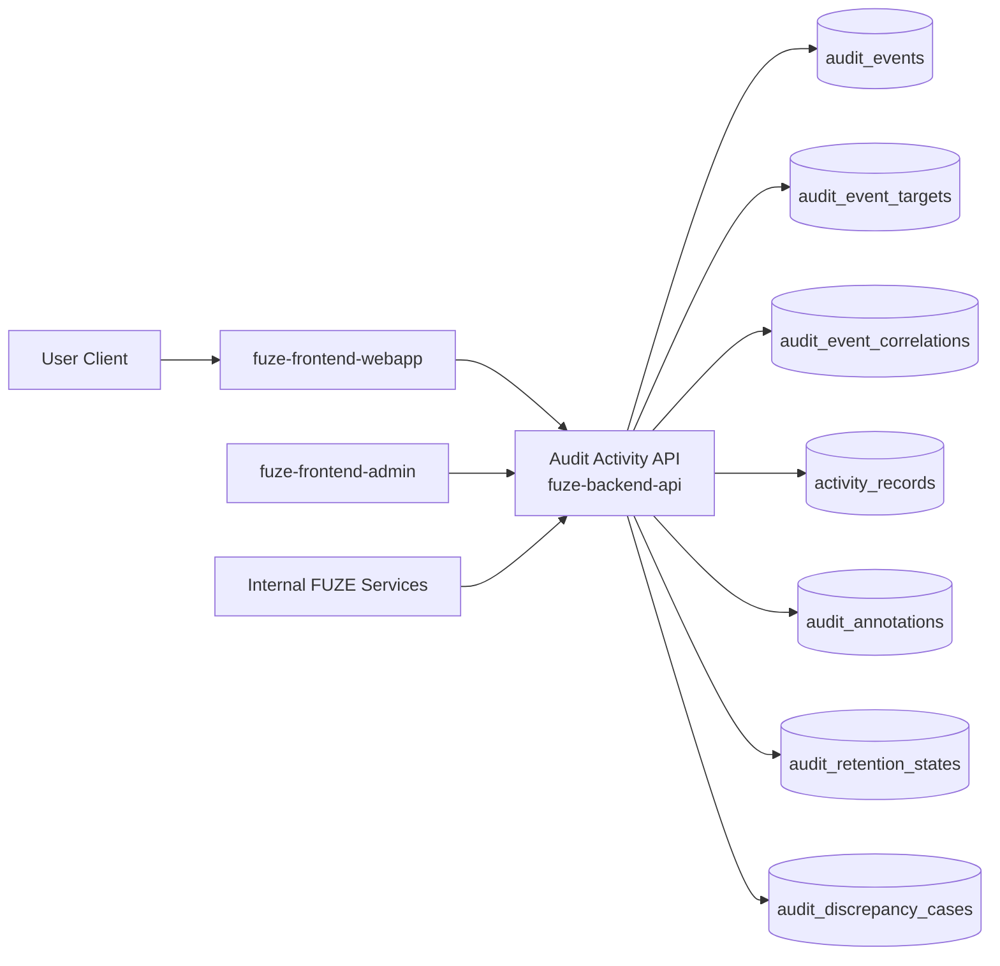
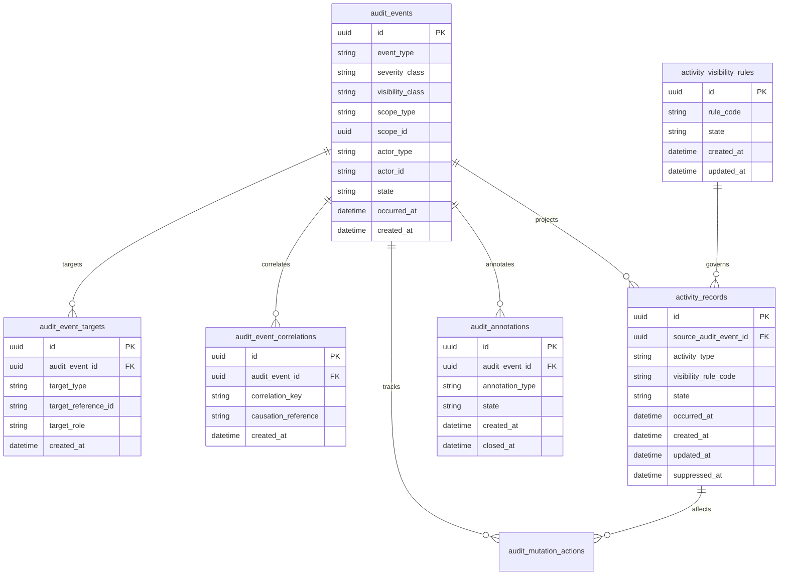
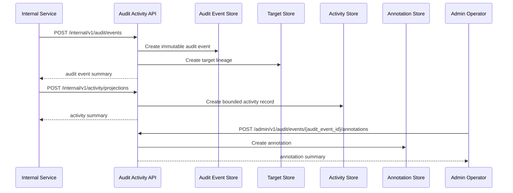

# AUDIT_ACTIVITY_API_SPEC

## 1. Title

**AUDIT_ACTIVITY_API_SPEC.md**

---

## 2. Document Metadata

- **Document Name:** AUDIT_ACTIVITY_API_SPEC.md
- **API Classification:** public, internal, admin, event-driven
- **Owning Domain:** Audit Log and Activity Domain
- **Primary Implementing Repo:** `fuze-backend-api`
- **Primary System of Record:** immutable audit events, bounded activity records, actor/action lineage, target-object references, retention-state metadata, and review/remediation records in `fuze-backend-api`
- **Status:** Draft for canonical source-of-truth approval
- **Purpose:** Define the production-grade API contract architecture for FUZE audit logging, bounded user/admin activity feeds, actor-action traceability, immutable security and operational records, and controlled visibility across the platform
- **Canonical Folder:** `fuze.ac > docs > api-spec`

---

## 2.1 API Classification Header

- **API Classification:** public | internal | admin | event-driven
- **Owning Domain:** Audit Log and Activity Domain
- **Primary Implementing Repo:** `fuze-backend-api`
- **Primary System of Record:** audit and activity record domain

---

## 3. Purpose

This document defines the canonical API specification for FUZE audit and activity operations. It translates the governing FUZE platform architecture, audit requirements, security controls, workflow and automation rules, AI orchestration rules, payment and financial control requirements, role and access-control rules, and API architecture rules into an implementation-ready API contract.

This API exists because FUZE is a multi-product platform with sensitive financial, operational, security, governance-adjacent, AI, and administrative actions that require durable traceability. Audit and activity cannot be treated as optional logs, frontend timelines, or product-local append-only notes. Audit records must be platform-governed, immutable, attributable, and visibility-controlled. At the same time, user-facing and admin-facing activity feeds require a bounded, policy-safe projection of selected underlying actions without exposing internal-only security or operational detail.

Accordingly, this specification defines how audit events and bounded activity records are represented, how actors, targets, and correlated actions are linked, how public/user/admin/internal visibility is controlled, how retention and remediation-safe handling works, and how audit/activity behavior remains auditable, idempotent, and architecture-consistent across the FUZE ecosystem.

---

## 4. Scope

This specification covers:

- audit event visibility APIs
- bounded activity-feed visibility APIs
- internal service APIs for writing canonical audit and activity records
- actor/target/action correlation APIs
- admin/control-plane APIs for review, annotation, retention-safe remediation, and discrepancy resolution
- event emission requirements for audit/activity lifecycle changes
- request, response, error, idempotency, versioning, audit, and database-shape rules for this domain

This specification does **not** redefine:

- the business rules of every source domain generating audit records
- full SIEM/export or external compliance pipeline contracts
- full retention policy text for every jurisdiction
- end-user notification behavior
- workflow, AI, billing, credits, queue, or governance domain truth
- secrets-management implementation detail
- infrastructure log shipping details

Those remain governed by their own source-of-truth specifications.

---

## 5. Source-of-Truth Inputs

### Primary FUZE docs and specs used

#### Highest-priority platform and ownership sources
- `SYSTEM_SPEC_INDEX.md`
- `SYSTEM_BOUNDARY_AND_OWNERSHIP_SPEC.md`
- `SYSTEM_OVERVIEW_AND_BOUNDARIES_SPEC.md`
- `PLATFORM_ARCHITECTURE_SPEC.md`
- `DOMAIN_OWNERSHIP_MATRIX_SPEC.md`
- `DATA_MODEL_AND_ENTITY_OWNERSHIP_SPEC.md`

#### Primary audit / control / security sources
- `AUDIT_LOG_AND_ACTIVITY_SPEC.md`
- `ROLE_PERMISSION_AND_ACCESS_CONTROL_SPEC.md`
- `SECURITY_AND_RISK_CONTROL_SPEC.md`
- `WORKFLOW_AND_AUTOMATION_SPEC.md`
- `JOB_QUEUE_AND_WORKER_SPEC.md`
- `AI_ORCHESTRATION_SPEC.md`
- `AI_USAGE_METERING_SPEC.md`
- `PAYMENT_RAILS_INTEGRATION_SPEC.md`
- `REFUND_REVERSAL_AND_ADJUSTMENT_SPEC.md`
- `TRANSPARENCY_MODEL_SPEC.md`
- `TRANSPARENCY_REPORTING_SPEC.md`

#### API and runtime sources
- `API_ARCHITECTURE_SPEC.md`
- `PUBLIC_API_SPEC.md`
- `INTERNAL_SERVICE_API_SPEC.md`
- `EVENT_MODEL_AND_WEBHOOK_SPEC_refreshed.md`
- `IDEMPOTENCY_AND_VERSIONING_SPEC.md`
- `MIGRATION_AND_BACKWARD_COMPATIBILITY_SPEC.md`
- `MONITORING_ALERTING_AND_INCIDENT_RESPONSE_SPEC.md`
- `SECRETS_CONFIG_AND_ENVIRONMENT_SPEC.md`

#### Product integration context
- `PRODUCT_INTEGRATION_ARCHITECTURE_SPEC.md`
- `QTB_PRODUCT_INTEGRATION_SPEC.md`
- `AIMM_PRODUCT_INTEGRATION_SPEC.md`
- `ZAGA_PRODUCT_INTEGRATION_SPEC.md`
- `AIE_PRODUCT_INTEGRATION_SPEC.md`
- `HERHELP_PRODUCT_INTEGRATION_SPEC.md`
- `BOTMAD_PRODUCT_INTEGRATION_SPEC.md`

#### Format guides
- `The_API_Specification_guide.md`
- `Database_Schemas_Guide.md`

### Highest-priority interpretation applied

For this file, the most important governing interpretation is:

1. audit is immutable platform-owned traceability truth
2. activity is a bounded, visibility-controlled projection and is not equivalent to full audit truth
3. backend owns canonical audit and activity truth
4. source domains emit canonical audit-worthy events, but do not redefine audit-domain semantics
5. admin/control-plane may review, annotate, and resolve discrepancies under controlled policy but do not rewrite audit truth
6. security, financial, AI, and operational traces must remain attributable, correlated, and separable by visibility level

### Supporting external standards used only as guidance

- HTTP semantics for read and write-style internal APIs
- structured problem-details error design
- general immutable-audit and activity-projection lineage patterns as supporting guidance

External guidance does not override FUZE source-of-truth documents.

---

## 6. Governing Architecture and Ownership Interpretation

This API belongs to the **Audit Log and Activity Domain** because it owns the canonical immutable trace layer for sensitive platform actions and the bounded projection layer for user/admin-facing activity summaries.

This API is implemented primarily in `fuze-backend-api` because:

- backend owns durable audit and activity truth
- source domains must emit into a common traceability layer
- visibility and retention controls must be centralized
- correlation across cross-domain actions requires platform-level aggregation
- review, annotation, and discrepancy handling must be backend-governed

This API is **not** owned by:

- `fuze-frontend-webapp`, because webapp only reads bounded activity or scoped audit views where allowed
- `fuze-frontend-admin`, because admin may review and annotate but must not own or rewrite canonical audit truth
- source domains such as payments, AI, workflows, or credits, because they emit events and retain their own business truth but do not own cross-platform audit semantics
- external observability stacks, because exported logs are downstream consumers rather than canonical FUZE audit truth
- `fuze-public-registry`, because public registries may expose approved derived artifacts, not internal immutable audit records

### Architectural implications

- one business action may generate multiple audit events across source and coordination domains
- one audit event may correlate to one or more target objects and one correlation chain
- activity records are derived from audit or event sources under visibility policy
- immutable audit truth and redactable/suppressible activity views must remain distinct
- annotations and investigations must preserve lineage without mutating original audit content
- audit completion does not change business truth; it records it

---

## 7. Domain Responsibilities

The Audit Log and Activity API domain is responsible for:

1. receiving and storing canonical immutable audit events
2. generating and serving bounded activity projections
3. maintaining actor, target, correlation, and causation lineage
4. enforcing visibility classes and access controls for audit/activity reads
5. supporting internal service ingestion of audit records
6. supporting admin review, annotation, retention-safe handling, and discrepancy resolution
7. emitting audit/activity lifecycle events where necessary
8. preserving separation between immutable audit truth and derived activity summaries
9. enabling forensic and operational traceability across domains
10. maintaining retention-state and evidence-quality metadata

The domain is not responsible for:

- deciding the substantive business outcome of source-domain actions
- rewriting source-domain history
- serving as the primary owner of source-domain entities
- replacing full external compliance/export pipelines
- acting as the user notification system
- exposing internal-only audit detail to unauthorized consumers

---

## 8. Out of Scope

The following are out of scope for this API specification:

- raw infrastructure logs and metrics streams
- external SIEM connector details
- full legal hold management detail
- final compliance export schemas
- document or media evidence storage implementation detail
- public transparency artifacts unless explicitly derived by another approved domain
- full data-loss-prevention engine internals
- final end-user UI rendering design for timelines

Where later detailed specs are needed, they must remain compatible with this API.

---

## 9. Canonical Entities and Data Ownership

### Durable entities

#### 9.1 audit_events
- **Owner:** Audit Log and Activity Domain
- **Purpose:** canonical immutable audit records
- **Nature:** source-of-truth durable entity

#### 9.2 audit_event_targets
- **Owner:** Audit Log and Activity Domain
- **Purpose:** explicit target-object lineage for each audit event
- **Nature:** source-of-truth durable lineage entity

#### 9.3 audit_event_correlations
- **Owner:** Audit Log and Activity Domain
- **Purpose:** correlation and causation linkage across related events, actions, jobs, runs, and requests
- **Nature:** source-of-truth durable lineage entity

#### 9.4 activity_records
- **Owner:** Audit Log and Activity Domain
- **Purpose:** bounded activity projection records derived from eligible events
- **Nature:** source-of-truth durable entity for derived projection state

#### 9.5 activity_visibility_rules
- **Owner:** Audit Log and Activity Domain
- **Purpose:** canonical visibility policy references for activity classes
- **Nature:** source-of-truth durable entity

#### 9.6 audit_annotations
- **Owner:** Audit Log and Activity Domain
- **Purpose:** controlled operator annotations, investigation notes, and review metadata linked to audit events
- **Nature:** durable additive lineage entity

#### 9.7 audit_retention_states
- **Owner:** Audit Log and Activity Domain
- **Purpose:** explicit retention, archival, legal-hold, or lifecycle state tracking for audit artifacts
- **Nature:** durable governance/retention entity

#### 9.8 audit_discrepancy_cases
- **Owner:** Audit Log and Activity Domain
- **Purpose:** discrepancy and remediation tracking for missing, malformed, duplicated, or inconsistent audit/activity records
- **Nature:** durable review/remediation entity

#### 9.9 audit_mutation_actions
- **Owner:** Audit Log and Activity Domain
- **Purpose:** high-level action records for ingest, annotate, project, archive, remediate, and close discrepancy
- **Nature:** durable action records with audit linkage

#### 9.10 audit_audit_events
- **Owner:** Audit / Activity domain self-audit layer
- **Purpose:** immutable audit trail for sensitive audit-domain actions themselves
- **Nature:** durable audit records

### Derived or cached entities

#### 9.11 activity_feed_views
- **Owner:** derived read-model layer
- **Purpose:** user-facing and admin-facing activity timelines
- **Nature:** derived

#### 9.12 audit_search_views
- **Owner:** derived read-model layer
- **Purpose:** optimized filtered views for internal/ops/admin searches
- **Nature:** derived

#### 9.13 audit_discrepancy_views
- **Owner:** derived ops read-model layer
- **Purpose:** visibility into ingestion gaps, duplicates, projection failures, or retention anomalies
- **Nature:** derived

---

## 10. State Model and Lifecycle

### 10.1 audit event lifecycle

Possible states:

- `recorded`
- `validated`
- `projected_if_applicable`
- `archived`
- `held`
- `superseded_if_required`

### 10.2 activity record lifecycle

Possible states:

- `created`
- `visible`
- `suppressed`
- `superseded`
- `archived`

### 10.3 annotation lifecycle

Possible states:

- `opened`
- `active`
- `resolved`
- `closed`

### 10.4 discrepancy case lifecycle

Possible states:

- `opened`
- `under_review`
- `resolved`
- `failed`
- `closed`

### 10.5 retention-state lifecycle

Possible states:

- `active`
- `archived`
- `held`
- `pending_expiry_if_supported`
- `closed`

Lifecycle notes:
- immutable audit content is additive-only and must not be edited in place
- activity projections may be suppressed or superseded without changing original audit records
- annotations and discrepancy cases are additive review layers
- archival and hold states affect retention handling, not original event truth

---

## 11. API Surface Overview

The API surface is divided into four families:

### 11.1 Public / first-party user-facing APIs
Used by `fuze-frontend-webapp` and approved first-party clients for:
- reading bounded user-visible activity feeds
- reading user-visible activity detail where authorized
- reading scoped personal or workspace action history where policy allows

### 11.2 Internal service APIs
Used by trusted internal services for:
- writing canonical audit events
- writing bounded activity projection candidates
- querying canonical audit traces for authorized system functions
- linking correlation and target references

### 11.3 Admin / control-plane APIs
Used by `fuze-frontend-admin` through backend-only privileged routes for:
- scoped audit search and review
- annotation and investigation
- activity suppression under controlled policy
- retention-state transitions where allowed
- discrepancy resolution

### 11.4 Event-driven interfaces
Used for downstream side effects:
- anomaly detection
- compliance/export triggers
- workflow and incident-response triggers
- internal monitoring and reporting
- security review and forensic continuation

---

## 12. Authentication and Authorization Model

### 12.1 Authentication posture by route family

#### Authenticated user routes
Require valid authenticated session:
- read own bounded activity feed
- read authorized workspace activity where actor has visibility
- read bounded activity detail only if visibility class permits

#### Internal service routes
Require internal service identity with explicit least privilege:
- write audit events
- create or update activity projection candidates
- read scoped audit traces for authorized internal purposes
- attach correlation and target references

#### Admin routes
Require privileged operator identity plus reason-coded actions:
- search internal audit traces
- annotate or investigate
- suppress activity projection
- change retention-safe handling state where policy allows
- resolve discrepancies

### 12.2 Authorization checkpoints

Authorization must evaluate:
- canonical account identity
- session validity
- target scope and visibility class
- actor’s workspace role where applicable
- whether the actor may view full audit detail versus bounded activity detail
- whether internal service has authorized ingest or read privileges
- whether admin/operator role is present for privileged actions

### 12.3 Sensitive action rules

The following require heightened checks:
- writing high-severity audit events
- reading internal-only audit categories
- suppressing activity projection
- adding operator annotations
- changing retention/hold posture
- discrepancy-resolution actions

---

## 13. API Endpoints / Interface Contracts

## 13.1 Public / First-Party User APIs

### 13.1.1 `GET /v1/activity/me`
**Purpose:** retrieve bounded personal activity feed for current actor  
**Caller Type:** authenticated user  
**Auth Expectation:** valid authenticated session  
**Query Parameters Summary:**
- pagination
- optional date range
- optional activity type filters
**Response Summary:**
- activity record summaries
- occurred_at
- activity class
- bounded target summaries
- visibility-safe details
**Side Effects:** none
**Audit Requirements:** access logging only
**Emitted Events:** none required

### 13.1.2 `GET /v1/workspaces/{workspace_id}/activity`
**Purpose:** retrieve bounded workspace activity feed where actor is authorized  
**Caller Type:** authenticated user  
**Response Summary:** workspace activity summaries and bounded details
**Side Effects:** none

### 13.1.3 `GET /v1/activity/{activity_record_id}`
**Purpose:** retrieve one bounded activity detail view  
**Caller Type:** authenticated user with visibility  
**Response Summary:**
- bounded activity detail
- occurred_at
- actor summary
- target summary
- visibility-safe metadata
**Side Effects:** none

## 13.2 Internal Service APIs

### 13.2.1 `POST /internal/v1/audit/events`
**Purpose:** write canonical immutable audit event  
**Caller Type:** internal trusted service  
**Auth Expectation:** service-to-service identity only  
**Request Body Summary:**
- `event_type`
- `severity_class`
- `visibility_class`
- `actor_summary`
- `target_summaries[]`
- `action_summary`
- optional `correlation_reference`
- optional `metadata_summary`
- `idempotency_key`
**Response Summary:** recorded audit-event summary and projection eligibility summary
**Side Effects:** creates immutable audit event, target links, and optional correlation links
**Idempotency Behavior:** required
**Audit Requirements:** self-audited for sensitive categories
**Emitted Events:** `audit.event_recorded`

### 13.2.2 `POST /internal/v1/activity/projections`
**Purpose:** create or update bounded activity projection from eligible audit/event source  
**Caller Type:** internal trusted service with projection authority  
**Request Body Summary:**
- `source_event_reference`
- `activity_type`
- `visibility_rule_code`
- `projection_summary`
- `idempotency_key`
**Response Summary:** activity-record summary
**Side Effects:** creates or supersedes activity projection
**Idempotency Behavior:** required
**Audit Requirements:** projection audit where sensitivity requires
**Emitted Events:** `activity.projected`

### 13.2.3 `POST /internal/v1/audit/correlations`
**Purpose:** attach correlation or causation links to one or more audit events  
**Caller Type:** internal trusted service  
**Request Body Summary:**
- `correlation_key`
- `event_references[]`
- optional `causation_reference`
- `idempotency_key`
**Response Summary:** correlation summary
**Side Effects:** creates correlation lineage
**Idempotency Behavior:** required
**Audit Requirements:** correlation-link audit where sensitivity requires
**Emitted Events:** `audit.correlation_attached`

### 13.2.4 `GET /internal/v1/audit/events/{audit_event_id}`
**Purpose:** retrieve canonical audit-event truth for trusted services  
**Caller Type:** internal trusted service  
**Response Summary:** full audit event, target lineage, correlation lineage, and retention metadata
**Side Effects:** none

### 13.2.5 `GET /internal/v1/audit/scopes/{scope_type}/{scope_id}`
**Purpose:** retrieve scoped canonical audit summary for trusted services  
**Caller Type:** internal trusted service  
**Response Summary:** filtered audit summaries, activity projection summaries, and correlation metadata
**Side Effects:** none

## 13.3 Admin / Control-Plane APIs

### 13.3.1 `GET /admin/v1/audit/events`
**Purpose:** search and review audit events under privileged policy  
**Caller Type:** admin/operator  
**Query Parameters Summary:**
- optional scope filters
- actor filters
- event type filters
- severity filters
- date range
- correlation filters
**Response Summary:** privileged audit-event summaries and review metadata
**Side Effects:** none
**Audit Requirements:** privileged audit-read audit
**Emitted Events:** none required

### 13.3.2 `POST /admin/v1/audit/events/{audit_event_id}/annotations`
**Purpose:** add controlled annotation or investigation note to one audit event  
**Caller Type:** admin/operator  
**Request Body Summary:**
- `annotation_type`
- `annotation_note`
- optional `case_reference`
- `idempotency_key`
**Response Summary:** annotation summary
**Side Effects:** creates additive annotation record
**Audit Requirements:** critical audit
**Emitted Events:** `audit.annotation_added`

### 13.3.3 `POST /admin/v1/activity/{activity_record_id}/suppress`
**Purpose:** suppress one activity projection under controlled policy without mutating source audit truth  
**Caller Type:** admin/operator  
**Request Body Summary:**
- `reason_code`
- `operator_note`
- `idempotency_key`
**Response Summary:** suppressed activity-record summary
**Side Effects:** activity record transitions to suppressed or superseded
**Audit Requirements:** critical audit
**Emitted Events:** `activity.suppressed`

### 13.3.4 `POST /admin/v1/audit/retention-actions`
**Purpose:** apply retention-safe archival or hold action to an audit scope or event under policy  
**Caller Type:** admin/operator  
**Request Body Summary:**
- `target_reference_type`
- `target_reference_id`
- `retention_action`
- `reason_code`
- `operator_note`
- `idempotency_key`
**Response Summary:** retention-action summary
**Side Effects:** updates retention-state lineage without rewriting original event truth
**Audit Requirements:** critical audit
**Emitted Events:** `audit.retention_updated`

### 13.3.5 `POST /admin/v1/audit-discrepancies`
**Purpose:** resolve audit/activity discrepancy under controlled policy  
**Caller Type:** admin/operator  
**Request Body Summary:**
- `target_reference_type`
- `target_reference_id`
- `resolution_code`
- `operator_note`
- `related_case_id`
- `idempotency_key`
**Response Summary:** discrepancy-resolution summary
**Side Effects:** may annotate, suppress projection, restore projection, or close discrepancy posture with preserved lineage
**Audit Requirements:** critical audit
**Emitted Events:** `audit.discrepancy_resolved`

---

## 14. Request Rules

### 14.1 General request rules
- all mutation-capable routes must require JSON requests with explicit content type
- all mutation routes must carry correlation IDs
- sensitive audit/activity mutations must carry idempotency keys
- admin mutations must require reason codes and operator notes where applicable
- no route may accept frontend-authored audit truth as authoritative input

### 14.2 Sensitive-action request requirements
The following requests require heightened validation:
- high-severity audit-event ingestion
- internal-only visibility classes
- annotation creation
- activity suppression
- retention/hold transitions
- discrepancy-resolution actions

Heightened validation may include:
- visibility-class validation
- actor/target integrity validation
- duplicate-event checks
- privileged-read checks
- operator role confirmation
- support/security/compliance case linkage for admin flows

### 14.3 Scope integrity rule
Audit/activity mutations must target valid and authorized scopes, actors, and source references. Product or service callers must not create or mutate audit/activity state for unrelated or unauthorized scopes.

### 14.4 Projection separation rule
Activity projection must remain explicitly derived from canonical audit or approved source events. Suppression or supersession of an activity record must not rewrite the underlying audit event.

---

## 15. Response Rules

### 15.1 Success response rules
Successful responses must include:
- stable resource identifiers
- timestamps for created/updated state
- state/status values
- scope, actor, and target summaries where relevant
- correlation references where relevant
- correlation references for mutations

### 15.2 Async-accepted response rules
If archival, restoration, or discrepancy remediation is async, the response must:
- return accepted status
- include action or job ID
- provide follow-up status semantics

### 15.3 Terminal mutation response rules
Terminal mutation responses must clearly show:
- target event, activity record, or discrepancy case
- mutation type
- resulting audit/activity/retention state
- suppression, annotation, or hold effects where relevant
- whether user-visible summaries may refresh asynchronously

### 15.4 Read response rules
Read responses must distinguish:
- immutable audit truth
- bounded activity projection
- annotation/review metadata
- operator-only details that must remain excluded from lower-privilege consumers

---

## 16. Error Model

The API uses structured problem-details style error responses.

### 16.1 Required error fields
- `type`
- `title`
- `status`
- `code`
- `detail`
- `instance`
- `correlation_id`

### 16.2 Common error codes

#### Authorization / permission errors
- `AUDIT_SESSION_REQUIRED`
- `AUDIT_PERMISSION_DENIED`
- `AUDIT_OPERATOR_PERMISSION_DENIED`
- `AUDIT_SERVICE_PERMISSION_DENIED`

#### State conflict errors
- `AUDIT_EVENT_STATE_INVALID`
- `ACTIVITY_RECORD_STATE_INVALID`
- `ACTIVITY_ALREADY_SUPPRESSED`
- `AUDIT_RETENTION_CONFLICT`
- `AUDIT_DISCREPANCY_CONFLICT`

#### Policy / safety errors
- `AUDIT_VISIBILITY_NOT_ALLOWED`
- `AUDIT_SCOPE_RESTRICTED`
- `AUDIT_EVENT_WRITE_FORBIDDEN`
- `ACTIVITY_PROJECTION_FORBIDDEN`
- `AUDIT_RETENTION_ACTION_FORBIDDEN`

#### Request integrity errors
- `AUDIT_IDEMPOTENCY_KEY_REQUIRED`
- `AUDIT_REQUEST_INVALID`
- `AUDIT_REQUEST_UNPROCESSABLE`

#### Dependency or provider errors
- `AUDIT_STORAGE_UNAVAILABLE`
- `AUDIT_PROJECTION_UNAVAILABLE`
- `AUDIT_ARCHIVE_UNAVAILABLE`

### 16.3 Error handling rules
- do not expose hidden internal-only security or compliance detail to unauthorized consumers
- do not imply that activity projection equals full audit truth
- distinguish forbidden visibility from missing object visibility
- distinguish storage/projection failure from policy rejection
- include retry guidance only where safe

---

## 17. Idempotency and Mutation Safety

### 17.1 Required idempotent mutations
The following mutation routes require idempotent behavior:
- audit-event write
- activity projection creation
- correlation attachment
- annotation creation
- activity suppression
- retention action
- discrepancy resolution

### 17.2 Idempotency key rules
- mutation requests must supply `Idempotency-Key`
- backend stores key scope, request hash, actor, and terminal result
- replay of same semantic request returns original terminal outcome
- replay of same key with different semantic request must fail with conflict

### 17.3 Mutation safety rules
- immutable audit event content must not be rewritten in place
- duplicate audit writes must resolve to the same canonical result or conflict-safe no-op
- activity suppression must preserve source linkage
- annotations must remain additive
- retention and discrepancy actions must preserve immutable history rather than rewrite prior records

---

## 18. Versioning and Compatibility Rules

### 18.1 Versioning
This API family is versioned under `/v1`, `/internal/v1`, and `/admin/v1` route families.

### 18.2 Compatibility approach
- additive evolution preferred
- no silent semantic change to audit, activity, annotation, discrepancy, or retention states
- new event types, target types, and visibility classes may be added without breaking existing contracts
- response fields may be added but existing meanings must remain stable

### 18.3 Breaking-change rules
Breaking changes include:
- changing the meaning of immutable audit versus bounded activity projection
- changing suppression or retention semantics incompatibly
- removing critical actor, target, or correlation fields
- changing visibility-class behavior incompatibly

Such changes require explicit migration planning and version evolution.

### 18.4 Deprecation
Deprecated routes or fields must:
- be documented explicitly
- carry deprecation metadata where supported
- preserve compatibility windows long enough for internal and first-party consumers

---

## 19. Event Emission and Webhook Behavior

This domain is event-capable.

### 19.1 Internal events
The Audit Log and Activity domain must emit canonical internal events such as:
- `audit.event_recorded`
- `activity.projected`
- `audit.correlation_attached`
- `audit.annotation_added`
- `activity.suppressed`
- `audit.retention_updated`
- `audit.discrepancy_resolved`

### 19.2 Event payload minimums
Each event should contain:
- event ID
- event type
- occurred_at
- scope type and scope ID where relevant
- audit event ID or activity record ID where relevant
- actor summary where relevant
- target reference where relevant
- correlation ID
- reason code where applicable

### 19.3 External webhook posture
This specification does not expose general third-party outbound audit/activity webhooks by default. Any future outbound audit-derived webhook surface must be narrow, security-reviewed, and governed by a separate contract.

---

## 20. Audit and Activity Requirements

The audit domain is itself auditable.

The following actions must generate durable self-audit events:

- high-severity audit-event ingestion
- privileged audit read/search actions where policy requires
- annotation creation
- activity suppression
- retention-state changes
- discrepancy resolution
- other sensitive audit-domain mutations

### Required audit fields
- audit event ID
- actor type and actor reference
- target event / activity / annotation / discrepancy / retention reference as applicable
- action type
- before/after summary where applicable
- reason code
- correlation ID
- operator note if operator action
- occurred_at

---

## 21. Data Model and Database Schema View

### 21.1 `audit_events`
- `id` PK
- `event_type`
- `severity_class`
- `visibility_class`
- `scope_type` nullable
- `scope_id` nullable
- `actor_type`
- `actor_id` nullable
- `action_summary_json`
- `metadata_summary_json` nullable
- `state`
- `occurred_at`
- `created_at`

**Constraints:**
- index on (`event_type`, `occurred_at`)
- index on (`visibility_class`, `severity_class`)
- index on (`scope_type`, `scope_id`)

### 21.2 `audit_event_targets`
- `id` PK
- `audit_event_id` FK -> `audit_events.id`
- `target_type`
- `target_reference_id`
- `target_role`
- `created_at`

**Constraints:**
- index on `audit_event_id`
- index on (`target_type`, `target_reference_id`)

### 21.3 `audit_event_correlations`
- `id` PK
- `audit_event_id` FK -> `audit_events.id`
- `correlation_key`
- `causation_reference` nullable
- `created_at`

**Constraints:**
- index on `audit_event_id`
- index on `correlation_key`

### 21.4 `activity_records`
- `id` PK
- `source_audit_event_id` nullable FK -> `audit_events.id`
- `activity_type`
- `visibility_rule_code`
- `scope_type` nullable
- `scope_id` nullable
- `state`
- `projection_summary_json`
- `occurred_at`
- `created_at`
- `updated_at`
- `suppressed_at` nullable

**Constraints:**
- index on (`scope_type`, `scope_id`)
- index on (`state`, `occurred_at`)
- index on `visibility_rule_code`

### 21.5 `activity_visibility_rules`
- `id` PK
- `rule_code`
- `state`
- `allowed_actor_classes_json`
- `projection_policy_json`
- `created_at`
- `updated_at`

**Constraints:**
- unique `rule_code`
- index on `state`

### 21.6 `audit_annotations`
- `id` PK
- `audit_event_id` FK -> `audit_events.id`
- `annotation_type`
- `annotation_note`
- `created_by_actor_type`
- `created_by_actor_id`
- `state`
- `created_at`
- `closed_at` nullable

**Constraints:**
- index on `audit_event_id`
- index on `state`

### 21.7 `audit_retention_states`
- `id` PK
- `target_reference_type`
- `target_reference_id`
- `state`
- `reason_code` nullable
- `created_at`
- `updated_at`

**Constraints:**
- index on (`target_reference_type`, `target_reference_id`)
- index on `state`

### 21.8 `audit_discrepancy_cases`
- `id` PK
- `target_reference_type`
- `target_reference_id`
- `state`
- `resolution_code` nullable
- `created_at`
- `updated_at`
- `closed_at` nullable

**Constraints:**
- index on (`target_reference_type`, `target_reference_id`)
- index on `state`

### 21.9 `audit_mutation_actions`
- `id` PK
- `target_reference_type`
- `target_reference_id`
- `action_type`
- `state`
- `reason_code`
- `operator_note` nullable
- `requested_by_actor_type`
- `requested_by_actor_id`
- `created_at`
- `executed_at` nullable
- `closed_at` nullable
- `correlation_id`

### 21.10 `idempotency_records`
- `id` PK
- `idempotency_key`
- `scope_family`
- `actor_reference`
- `request_hash`
- `response_hash`
- `terminal_status`
- `created_at`
- `expires_at`

### 21.11 `audit_log_entries`
Self-audit records for sensitive audit-domain mutations or privileged reads.

### Normalization notes
- immutable audit truth stays in `audit_events` plus target and correlation tables
- activity projections remain separate and visibility-bounded
- annotations, discrepancy, and retention are additive control layers
- source-domain business truth remains external to audit tables

### Reconciliation notes
- one audit event may project to zero or more bounded activity records under policy
- suppression of activity must not orphan source audit linkage
- discrepancy resolution must preserve original ingest/projection lineage
- retention state and archival posture must remain queryable independently of event content

---

## 22. Architecture Diagram — Mermaid flowchart



---

## 23. Data Design — Mermaid Diagram



---

## 24. Flow View

### 24.1 Happy path — internal audit ingest
1. source domain completes or attempts significant action
2. internal service posts canonical audit event
3. backend validates event shape, actor/target integrity, and visibility class
4. immutable audit event, target links, and correlation links are recorded
5. projection eligibility is evaluated
6. audit event becomes queryable by authorized consumers
7. self-audit and domain events are emitted where required

### 24.2 Happy path — activity projection
1. eligible source audit event is selected for bounded activity projection
2. internal service creates activity projection request
3. backend validates visibility rule and projection policy
4. activity record is created and becomes visible to authorized users/admins
5. source audit truth remains unchanged

### 24.3 Happy path — privileged review
1. admin searches privileged audit events
2. backend enforces visibility and scope authorization
3. admin reviews matching events
4. admin optionally creates annotation
5. annotation is stored as additive lineage
6. self-audit is emitted for privileged action where policy requires

### 24.4 Failure path — invalid audit write
1. internal service submits malformed or unauthorized audit payload
2. backend rejects request
3. no canonical audit event is created
4. bounded error is returned

### 24.5 Failure and remediation path — bad projection or discrepancy
1. activity projection is incorrect, duplicated, missing, or visibility-inconsistent
2. admin opens discrepancy resolution
3. backend preserves source audit event
4. activity record may be suppressed, restored, or superseded with preserved lineage
5. discrepancy case closes with explicit resolution history

### 24.6 Retention/hold path
1. retention or hold action is required for one event or scope
2. admin applies retention action
3. backend updates retention-state lineage without rewriting event content
4. archival/hold posture becomes queryable for future review

### 24.7 Retry behavior
- duplicate audit write returns same canonical audit result
- duplicate activity projection returns same projection or supersession-safe outcome
- duplicate annotation or suppression returns same terminal action result
- duplicate discrepancy or retention action returns same terminal action result

---

## 25. Data Flows — Mermaid sequenceDiagram



---

## 26. Security and Risk Controls

1. **Audit truth is backend-owned and immutable**  
   Source domains and frontends may not rewrite canonical audit events outside approved backend ingest paths.

2. **Audit and activity are distinct**  
   The API must keep immutable audit truth separate from bounded activity projection.

3. **Visibility-class enforcement**  
   Audit and activity reads must be filtered by explicit visibility class, scope, and role rules.

4. **Least privilege**  
   Internal write and privileged read routes must be limited to authorized services and operators.

5. **Additive remediation only**  
   Annotations, suppression, discrepancy handling, and retention actions must remain additive and lineage-preserving.

6. **Correlation integrity**  
   Cross-domain correlation and target lineage must remain explicit and queryable.

7. **Problem-details discipline**  
   Error bodies must be structured and safe, without exposing unauthorized internal-only detail.

8. **Self-audit immutability**  
   Sensitive audit-domain actions must themselves generate immutable trace records.

9. **Replay resistance**  
   Event ingest, projection, annotation, suppression, and discrepancy actions must be idempotent and replay-safe.

10. **Projection-release control**  
    Suppressing an activity record must never destroy or rewrite source audit truth.

---

## 27. Operational Considerations

- bounded activity reads are user-visible and should be highly available
- audit ingest is correctness-sensitive and must preserve ordering and correlation where required
- privileged search and discrepancy review should remain performant under large event volumes
- archival/hold actions should remain queryable and operationally observable
- monitoring should alert on:
  - spikes in audit ingest failures
  - unusual privileged audit-read volume
  - projection backlog or failure spikes
  - suppression or discrepancy spikes
  - retention/hold anomalies
  - correlation-link failures

---

## 28. Acceptance Criteria

1. The API preserves the distinction between immutable audit truth and bounded activity projection.
2. Only `fuze-backend-api` owns canonical audit and activity truth.
3. Audit events, target links, correlations, activity records, annotations, and discrepancy states are durable and backend-owned.
4. Audit/event ingest validates actor, target, scope, and visibility integrity.
5. Activity projections are explicitly derived and do not replace source audit truth.
6. Annotation, suppression, retention, and discrepancy remediation are additive and lineage-preserving.
7. Audit and activity mutations are idempotent and auditable.
8. Internal audit routes are least-privilege and backend-only.
9. Admin routes require privileged authorization and reason-coded actions where applicable.
10. Event emissions exist for major audit/activity mutations.
11. Response and error semantics are stable and machine-readable.
12. Database schema separates immutable audit records, activity projections, correlations, annotations, and retention/discrepancy layers.
13. Source domains can emit canonical audit events without redefining audit semantics.
14. Visibility restriction and discrepancy handling are supported and safely replayable.
15. Mermaid diagrams remain consistent with prose and data model.

---

## 29. Test Cases

### 29.1 Positive cases
1. Internal service writes canonical audit event successfully.
2. Internal service writes bounded activity projection successfully.
3. Authenticated user reads personal activity feed successfully.
4. Authorized workspace actor reads workspace activity successfully.
5. Admin searches privileged audit events successfully.
6. Admin adds annotation successfully.
7. Admin suppresses incorrect activity projection successfully.
8. Admin applies retention action successfully.

### 29.2 Negative cases
9. Unauthenticated call to activity feed route is rejected.
10. User without workspace visibility cannot read workspace activity.
11. Internal service without audit-write privilege cannot write canonical audit event.
12. Invalid visibility class or malformed target reference returns validation error.
13. Unauthorized actor cannot read internal-only audit detail.
14. Attempt to suppress already suppressed activity record returns state conflict or duplicate-safe outcome.

### 29.3 Authorization cases
15. Ordinary user cannot call privileged audit search or annotation routes.
16. Internal service without projection privilege cannot create activity projection.
17. Operator without required privilege cannot apply retention action.
18. Source domain cannot treat activity projection as full audit truth.

### 29.4 Idempotency and replay cases
19. Repeating audit write with same idempotency key returns original audit-event result.
20. Repeating activity projection with same idempotency key returns original projection result.
21. Repeating annotation with same idempotency key returns original annotation result.
22. Repeating suppression or discrepancy resolution with same idempotency key returns original terminal action result.

### 29.5 Concurrency cases
23. Concurrent duplicate audit writes for same correlation and payload resolve to one canonical result and one duplicate-safe outcome.
24. Concurrent projection and suppression preserve explicit projection-state ordering without hidden overwrite.
25. Concurrent annotation and discrepancy actions preserve explicit additive lineage.

### 29.6 Recovery / admin cases
26. Suppressed activity record remains historically linked to source audit event.
27. Discrepancy resolution can restore or supersede projection under controlled policy with preserved lineage.
28. Retention hold remains queryable without mutating event content.

### 29.7 Event and audit cases
29. Successful audit ingest emits `audit.event_recorded`.
30. Successful activity projection emits `activity.projected`.
31. Successful annotation emits `audit.annotation_added`.
32. Successful suppression emits `activity.suppressed`.
33. Successful discrepancy resolution emits `audit.discrepancy_resolved` with critical self-audit lineage.

---

## 30. Open Questions or Explicit Deferred Decisions

1. Exact event-type taxonomy across all FUZE domains is deferred.
2. Exact visibility-class matrix for every actor and scope type is deferred.
3. Exact retention durations and archival tiers by category are deferred.
4. Exact activity projection rules for every product surface are deferred.
5. Exact privileged-read audit policy thresholds are deferred.
6. Exact discrepancy taxonomy for audit/projection anomalies is deferred.

---

## 31. Implementation Notes for `fuze-backend-api`

Recommended backend module layout:

```text
modules/platform/
  audit-activity/
  control-plane/
  security-review/
  audit-log/
  integrations/
```

Implementation guidance:
- keep immutable audit event ingest, target/correlation linkage, projection generation, and annotation/discrepancy handling in one canonical domain service
- perform visibility and actor/target integrity checks inside the commit boundary
- keep suppression, retention, and remediation explicit and idempotent
- treat admin review actions as additive domain actions, not ad hoc row edits
- emit events only after canonical state commit succeeds
- publish user-facing activity summaries from canonical truth; do not let derived views mutate immutable audit records

---

## 32. Frontend Consumption Notes

### For `fuze-frontend-webapp`
- may read bounded personal or authorized workspace activity feeds
- must not assume activity feed contains full internal audit detail
- must treat backend activity responses as authoritative
- should clearly distinguish visible user activity from hidden internal-only audit content

### For `fuze-frontend-admin`
- may trigger privileged search, annotation, suppression, retention, and discrepancy actions only through backend admin APIs
- must require operator note input for sensitive mutations
- must not directly mutate audit truth client-side
- should present immutable audit records and additive review lineage separately

---

## 33. Contract Derivation Notes

### OpenAPI / AsyncAPI
This spec should later derive into:
- public activity-feed read operations
- internal audit-ingest, projection, and correlation operations
- admin search / annotation / suppression / retention / discrepancy operations
- shared problem-details schema
- audit/activity events in AsyncAPI

### Future `fuze-sdk`
Future `fuze-sdk` packages may derive:
- bounded activity feed helpers
- typed activity and correlation models for approved consumers
- problem-error models for audit/activity outcomes

The SDK must derive from approved API contracts and must not become the source of truth over this narrative specification.
