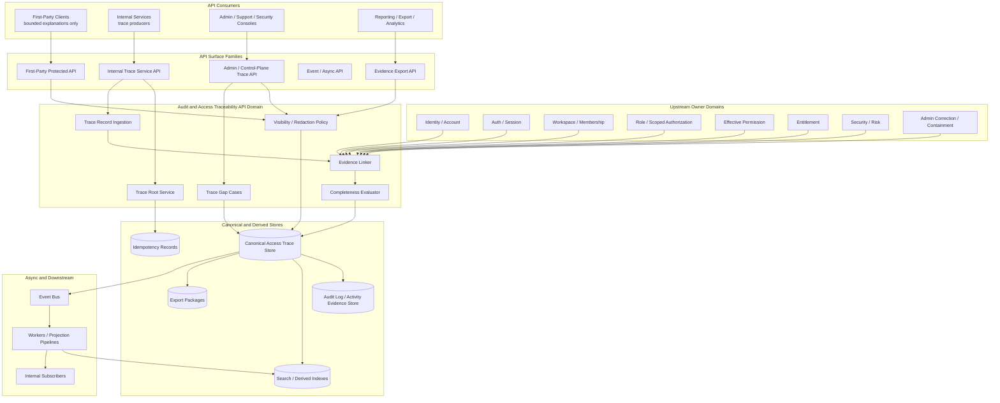
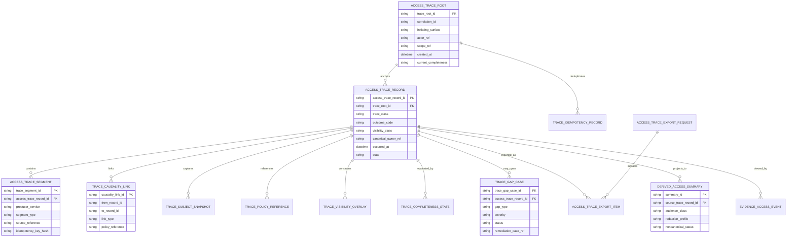
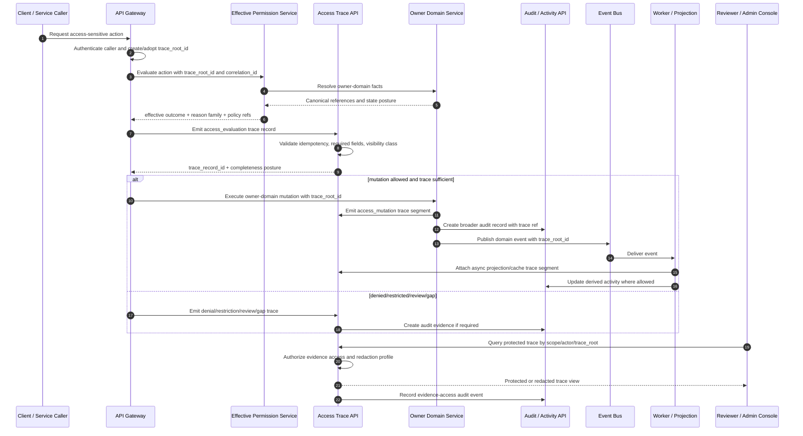

# FUZE Audit and Access Traceability API Specification

## Document Metadata

- **Document Name:** `AUDIT_AND_ACCESS_TRACEABILITY_API_SPEC.md`
- **Document Type:** API SPEC v2 / production-grade interface-contract specification
- **Status:** Draft API SPEC v2 for canonical review
- **Version:** 2.0.0
- **Effective Date:** 2026-04-24
- **Last Updated:** 2026-04-24
- **Reviewed On:** 2026-04-24
- **Document Owner:** FUZE Platform Audit, Security, and Access Traceability Architecture
- **Approval Authority:** FUZE Platform Architecture and Governance Authority
- **Review Cadence:** Quarterly, and upon material change to account/session semantics, workspace access control, effective-permission evaluation, privileged correction, audit-log governance, data classification, lifecycle governance, API architecture, event posture, or access-evidence retention posture
- **Governing Layer:** API contract layer derived from platform core / audit and access traceability refined semantics
- **Parent Registry:** `API_SPEC_INDEX.md`
- **Upstream Semantic Registry:** `REFINED_SYSTEM_SPEC_INDEX.md`
- **Upstream API Registry:** `API_SPEC_INDEX.md`
- **Primary Audience:** Platform architecture, backend engineering, API engineering, security engineering, support/control-plane engineering, audit/compliance, trust and safety, data engineering, event-contract authors, OpenAPI/AsyncAPI/SDK authors, implementation-contract authors
- **Primary Purpose:** Define the canonical API contract posture for producing, linking, querying, redacting, exporting, and consuming access-domain trace records so FUZE can reconstruct access evaluations, access mutations, denials, restrictions, privileged corrections, containment actions, session trust changes, and cross-service causality without collapsing access traceability into generic activity logging, product telemetry, support notes, or derived dashboards
- **Primary Upstream References:**
  - `REFINED_SYSTEM_SPEC_INDEX.md`
  - `DOCS_SPEC_INDEX.md`
  - `SYSTEM_SPEC_INDEX.md`
  - `API_SPEC_INDEX.md`
  - `SYSTEM_BOUNDARY_AND_OWNERSHIP_SPEC.md`
  - `SYSTEM_OVERVIEW_AND_BOUNDARIES_SPEC.md`
  - `PLATFORM_ARCHITECTURE_SPEC.md`
  - `DOMAIN_OWNERSHIP_MATRIX_SPEC.md`
  - `DATA_MODEL_AND_ENTITY_OWNERSHIP_SPEC.md`
  - `FUZE_ACCOUNT_ACCESS_AND_SESSION_THESIS_FINAL_SPEC.md`
  - `FUZE_ACCOUNT_ACCESS_AND_SESSION_CANONICAL_FINAL_SPEC.md`
  - `FUZE_WORKSPACE_ACCESS_CONTROL_BASICS_THESIS_FINAL_SPEC.md`
  - `WORKSPACE_AND_ORGANIZATION_SPEC.md`
  - `ROLE_PERMISSION_AND_ACCESS_CONTROL_SPEC.md`
  - `WORKSPACE_MEMBERSHIP_LIFECYCLE_SPEC.md`
  - `SCOPED_AUTHORIZATION_MODEL_SPEC.md`
  - `ACCESS_EVALUATION_AND_EFFECTIVE_PERMISSION_SPEC.md`
  - `ADMIN_ACCESS_CORRECTION_AND_CONTAINMENT_SPEC.md`
  - `AUDIT_AND_ACCESS_TRACEABILITY_SPEC.md`
  - `AUDIT_LOG_AND_ACTIVITY_SPEC.md`
  - `DATA_CLASSIFICATION_AND_HANDLING_SPEC.md`
  - `DATA_RETENTION_DELETION_AND_ARCHIVAL_SPEC.md`
  - `SECURITY_AND_RISK_CONTROL_SPEC.md`
  - `API_ARCHITECTURE_SPEC.md`
  - `PUBLIC_API_SPEC.md`
  - `INTERNAL_SERVICE_API_SPEC.md`
  - `EVENT_MODEL_AND_WEBHOOK_SPEC.md`
  - `IDEMPOTENCY_AND_VERSIONING_SPEC.md`
  - `MIGRATION_AND_BACKWARD_COMPATIBILITY_SPEC.md`
- **Primary Downstream Dependents:**
  - `ENTITLEMENT_AND_CAPABILITY_GATING_API_SPEC.md`
  - `AUDIT_LOG_AND_ACTIVITY_API_SPEC.md`
  - `SECURITY_AND_RISK_CONTROL_API_SPEC.md`
  - `WORKSPACE_AND_ORGANIZATION_API_SPEC.md`
  - `ROLE_PERMISSION_AND_ACCESS_CONTROL_API_SPEC.md`
  - `WORKSPACE_MEMBERSHIP_LIFECYCLE_API_SPEC.md`
  - `SCOPED_AUTHORIZATION_MODEL_API_SPEC.md`
  - `ACCESS_EVALUATION_AND_EFFECTIVE_PERMISSION_API_SPEC.md`
  - `ADMIN_ACCESS_CORRECTION_AND_CONTAINMENT_API_SPEC.md`
  - support and control-plane evidence consoles
  - security investigation and incident-response workflows
  - compliance and governance review workflows
  - access analytics and anomaly-detection pipelines
  - product integration contracts that emit or consume access trace references
  - OpenAPI, AsyncAPI, SDK, event catalog, storage, search, and export contracts
- **API Surface Families Covered:** Internal service APIs; admin/control-plane APIs; first-party protected reviewer APIs; event and async APIs; reporting/export read APIs for authorized internal audiences; implementation-facing API contract rules
- **API Surface Families Excluded:** Unauthenticated public APIs; broad user-facing activity feeds; generic product analytics APIs; generic SIEM/log-shipping APIs; raw infrastructure log APIs; external webhook exposure of sensitive trace detail; chain-native APIs
- **Canonical System Owner(s):** FUZE Platform Audit, Security, and Access Traceability Architecture for access trace record categories, trace-root semantics, completeness posture, visibility classes, and reconstruction requirements; upstream owner domains remain owners of identity, session, workspace, membership, grants, effective permission, entitlement, correction, containment, and security/risk truth
- **Canonical API Owner:** FUZE API Platform / Audit and Access Traceability API Domain
- **Supersedes:** No same-name v1 file was identified. This document supersedes narrower access-trace portions of older `AUDIT_ACTIVITY_API_SPEC.md` where that v1 document treated audit/activity and access traceability together or lacked API SPEC v2 trace-specific boundaries.
- **Superseded By:** Not yet known
- **Related Decision Records:** Not yet known
- **Canonical Status Note:** This API spec is the canonical API-layer expression of `AUDIT_AND_ACCESS_TRACEABILITY_SPEC.md`. API contracts, internal services, event publishers, admin tools, support tools, products, SDKs, dashboards, exports, and implementation contracts MUST NOT treat generic audit logs, product telemetry, UI history, support tickets, or activity feeds as substitutes for the access-trace API requirements defined here.
- **Implementation Status:** Normative API-contract baseline; route, schema, event, storage, export, and tooling contracts must be derived from and validated against this document
- **Approval Status:** Draft for architecture and API governance review
- **Change Summary:** Created API SPEC v2 document for access-domain traceability; separated access trace APIs from broader audit/activity APIs; defined trace-root, evidence-linkage, query, redaction, export, idempotency, async, event, and derived-view rules; added diagrams, flow views, acceptance criteria, test cases, and downstream OpenAPI/AsyncAPI guardrails.

## Purpose

This specification defines the FUZE API contract for audit and access traceability.

The purpose of the API is to make access-domain evidence reconstructable at platform boundaries. It defines how services create trace roots, attach access-evaluation and mutation evidence, preserve causality across sync and async execution, query protected trace records, publish safe derived summaries, export evidence under policy, and link later correction or containment actions to earlier access state.

This API spec is not a generic audit-log API. It is the interface-contract expression of FUZE access-trace semantics: actor, runtime posture, scope, target, structural authorization inputs, effective-permission outcome, restriction posture, entitlement posture where relevant, policy references, correction lineage, containment lineage, visibility class, retention posture, and trace completeness.

## Scope

This specification governs API contracts for:

1. creating or adopting trace roots for access-relevant workflows;
2. emitting canonical access trace records for access evaluations, denials, restrictions, mutations, session trust changes, privileged corrections, containment actions, and derived access summary publications;
3. linking trace records to upstream owner-domain evidence and downstream audit/activity records;
4. preserving causality across services, workers, event systems, caches, read models, support tools, and admin/control-plane tools;
5. querying protected trace records by authorized internal, security, audit, support, or governance actors;
6. producing redacted trace views and derived access summaries without making them canonical evidence owners;
7. exporting trace evidence through reason-coded, policy-constrained, auditable operations;
8. reporting trace completeness states, degradation posture, missing-lineage cases, and remediation linkage;
9. emitting and consuming access-trace events through AsyncAPI/event-contract layers;
10. constraining OpenAPI, AsyncAPI, SDK, storage, search, and implementation-contract derivation.

## Out of Scope

This API spec does not govern:

- identity creation, account recovery, or provider linking mechanics;
- session issuance, refresh-token mechanics, or login UI flows;
- workspace creation, membership invitation, or role catalog design in full depth;
- final effective-permission ordering beyond consuming and tracing outcomes from the effective-permission domain;
- privileged correction admissibility beyond tracing correction lineage and evidence posture;
- generic activity feeds or product timelines, which belong to broader audit/activity APIs;
- raw SIEM integration, log shipping, observability metrics, infrastructure logs, or debugging traces;
- complete retention schedule matrices or legal-hold runbooks;
- public disclosure wording or transparency-report publication;
- database DDL, storage engine mechanics, or exact search-index topology;
- complete UI design for audit consoles or support review surfaces.

## Design Goals

1. Preserve canonical access lineage across identity, session, scope, membership, grant, entitlement, restriction, effective-permission, correction, containment, and audit layers.
2. Make high-impact access evaluations and mutations reconstructable without relying on UI history, loose logs, product-local telemetry, screenshots, or support tickets.
3. Keep access-trace truth distinct from generic audit truth, activity-history truth, owner-domain business truth, event truth, runtime truth, reporting truth, and presentation truth.
4. Provide route and event families that are implementation-usable without collapsing into raw database schema listings.
5. Ensure high-trust workflows fail, hold, degrade, or route to review when required trace lineage cannot be produced.
6. Preserve safe redaction and least-disclosure while maintaining protected internal reconstructability.
7. Prevent internal service APIs from becoming hidden broad-write shortcuts or unverifiable audit bypasses.
8. Support future OpenAPI, AsyncAPI, SDK, storage, export, search, and QA contract generation.
9. Provide concrete acceptance criteria and test cases for production readiness.

## Non-Goals

This API spec is not intended to:

- make the traceability domain the owner of identity, session, workspace, membership, role, grant, entitlement, effective-permission, correction, containment, or business truth;
- replace `AUDIT_LOG_AND_ACTIVITY_API_SPEC` or broader audit/activity APIs;
- expose sensitive access trace detail to users or public consumers by default;
- permit product services to satisfy access trace requirements with local logs only;
- allow dashboards, warehouses, analytics, activity cards, or exports to become canonical trace truth;
- define all field-level storage schemas or every product-local object fact;
- make every low-risk read a full-fidelity trace record where policy allows sampling or aggregation;
- use trace creation success to reinterpret the business outcome of a domain action.

## Core Principles

### Canonical Lineage Principle
Every high-impact access evaluation, access mutation, privileged correction, containment action, and sensitive access-dependent workflow MUST preserve a canonical trace root or equivalent stable correlation anchor.

### Access-Trace / Generic-Audit Separation Principle
Access trace records are a narrower reconstruction layer than generic audit records. Generic audit/activity APIs may consume access trace references, but they MUST NOT replace access trace semantics.

### Attribution and Scope Principle
Trace records MUST preserve actor, actor class, runtime posture, service-principal posture where applicable, scope, target, requested action, and execution path at the fidelity required for the trace class.

### Structural-vs-Effective Principle
Trace records MUST distinguish structural authority inputs, such as membership, role assignment, scoped grant, or entitlement posture, from final effective-permission outcomes.

### Completeness-Is-Not-Success Principle
Trace completeness MUST remain distinguishable from business success. A business operation may complete, fail, hold, degrade, or route to review independently of whether trace linkage is complete, except where policy requires complete traceability before finalization.

### Safe Redaction Principle
APIs MAY return redacted, minimized, or audience-bounded views. They MUST preserve protected internal references needed for reconstruction where policy allows.

### Derived-View Subordination Principle
Search indexes, support summaries, exports, analytics, activity feeds, reports, dashboards, and user-facing explanations are derived views. They MUST remain subordinate to canonical trace records and upstream owner-domain truth.

### No Shadow Bypass Principle
No product, worker, internal service, admin tool, support tool, or provider adapter may perform sensitive access-relevant mutations through an untraced side channel.

## Canonical Definitions

- **Trace Root:** Durable root identifier anchoring one access-relevant action, request, mutation, evaluation, correction, or containment workflow and all linked evidence.
- **Access Trace Record:** Canonical access-domain evidence record describing an access decision, mutation, denial, restriction, review posture, correction, containment, session trust change, or linkage point.
- **Trace Segment:** A partial record attached to a trace root by a service boundary, worker, event consumer, admin tool, or projection pipeline.
- **Causality Reference:** Stable pointer to a prior trace, event, request, mutation, evaluation, correction case, or containment action that materially influenced the current trace record.
- **Trace Completeness Posture:** Canonical state describing whether enough evidence exists for the trace class and trust level.
- **Protected Trace View:** Internal view that preserves sensitive reconstruction fields under stricter authorization.
- **Redacted Trace View:** Audience-bounded view that collapses sensitive details while preserving safe references and trace state.
- **Derived Access Summary:** Non-canonical summary, dashboard, activity projection, export view, or support timeline derived from canonical trace records.
- **Trace Producer:** Service, gateway, worker, evaluator, admin tool, or domain boundary that emits access trace records.
- **Trace Consumer:** Service, tool, reviewer, export pipeline, analytics pipeline, or product surface that reads canonical trace records or approved derived views.
- **Trace Gap:** Missing, malformed, contradictory, stale, or unlinkable evidence required for the trust level of a trace class.
- **Evidence Export:** Policy-governed, reason-coded, audited package of trace records or derived summaries intended for review, compliance, support, security, or governance workflows.

## Truth Class Taxonomy

Downstream implementations MUST preserve these truth classes:

1. **Semantic Truth:** Owner-domain meaning for identity, session, workspace, membership, grants, effective permission, entitlement, correction, containment, and security posture.
2. **API Contract Truth:** Request, response, status, error, event, idempotency, trace-root, query, export, and compatibility semantics defined by this document.
3. **Access-Trace Truth:** Canonical evidence lineage required to reconstruct access-related decisions, mutations, denials, restrictions, and corrections.
4. **Audit Truth:** Immutable broader audit evidence for meaningful actions, evidence access, exports, redactions, and operator actions.
5. **Policy Truth:** Visibility, retention, classification, redaction, approval, reason-code, and review rules that constrain trace creation and access.
6. **Runtime Truth:** Current request, job, worker, retry, projection, degraded-mode, or remediation status.
7. **Ledger / Storage Truth:** Durable trace records, trace segments, idempotency records, export records, completeness records, retention metadata, and redaction overlays.
8. **Provider-Input Truth:** External callbacks, imported provider payloads, chain observations, or third-party claims before owner-domain normalization and acceptance.
9. **Projection / Reporting Truth:** Derived summaries, search indexes, dashboards, support timelines, exports, analytics outputs, and compliance packages.
10. **Presentation Truth:** UI labels, public-safe explanations, user-facing denial text, support console wording, and activity-card rendering.

These truth classes MUST NOT be collapsed. Access-trace truth records the evidence chain; it does not own upstream domain meaning or downstream presentation.

## Architectural Position in the Spec Hierarchy

This API spec sits below:

- `REFINED_SYSTEM_SPEC_INDEX.md`
- `API_SPEC_INDEX.md`
- platform boundary and ownership specifications;
- account/session canonical specifications;
- workspace/access-control thesis and canonical specifications;
- `ACCESS_EVALUATION_AND_EFFECTIVE_PERMISSION_SPEC.md`;
- `ADMIN_ACCESS_CORRECTION_AND_CONTAINMENT_SPEC.md`;
- `AUDIT_AND_ACCESS_TRACEABILITY_SPEC.md`;
- `AUDIT_LOG_AND_ACTIVITY_SPEC.md`;
- API architecture, internal-service API, public API, event/webhook, idempotency, migration, data-classification, retention, security, and runtime specifications.

This API spec sits above:

- route-level OpenAPI definitions;
- AsyncAPI event channel definitions;
- SDK contracts for internal trace producers and protected trace consumers;
- storage schemas for trace records, trace segments, idempotency records, visibility overlays, export packages, and trace-gap cases;
- support/admin console implementation contracts;
- access analytics, anomaly-detection, evidence export, and investigation tooling contracts.

## Upstream Semantic Owners

This API consumes but does not redefine these upstream owners:

| Upstream Domain | Owned Truth | API Requirement Here |
|---|---|---|
| Identity and Account | `account_id`, identity lifecycle, actor continuity | Trace records reference canonical account anchors; they do not create identity truth. |
| Auth / Session | session validity, privileged-session posture, invalidation, service-principal runtime | Trace APIs preserve runtime posture and session references for high-trust actions. |
| Workspace / Organization | scope existence, lifecycle, hierarchy, owner scope | Trace APIs preserve scope context and wrong-scope evidence. |
| Membership Lifecycle | invitation, activation, restriction, suspension, removal, reinstatement | Trace APIs link membership state to access outcomes or mutations. |
| Role / Permission | role catalogs, permission bundles, structural grants | Trace APIs record structural grant references without making grants final authority. |
| Scoped Authorization | grant-to-scope binding and scope applicability | Trace APIs preserve scope-bound grant context and scope-mismatch outcomes. |
| Effective Permission | final evaluated outcome | Trace APIs record final outcomes and salient input references. |
| Entitlement / Capability | commercial or policy eligibility | Trace APIs record entitlement effect when material without redefining entitlement truth. |
| Security / Risk | restrictions, containment, review, abuse posture | Trace APIs preserve stronger restriction and containment effects. |
| Admin Correction / Containment | privileged remediation cases, approvals, supersession | Trace APIs link correction and containment to prior trace roots. |
| Audit Log / Activity | broader audit evidence and activity-history semantics | Trace APIs supply access-trace references to broader audit/activity systems. |
| Classification / Retention | handling posture and lifecycle posture | Trace APIs enforce visibility, export, redaction, retention, and evidence-minimization posture. |

## API Surface Families

### Public API

This spec does not define unauthenticated public routes. Public surfaces MAY consume approved derived, redacted, or aggregate outputs through separate public trust/reporting specs, but public consumers MUST NOT receive protected trace records.

### First-Party Application API

First-party user-facing clients MAY receive bounded denial explanations, activity summaries, or support-safe references through adjacent APIs. They MUST NOT receive protected trace internals unless a separate approved specification explicitly grants a narrow authenticated surface.

### Internal Service API

Internal services use this surface to create trace roots, emit trace segments, attach upstream references, resolve trace completeness posture, and query trace references for authorized service workflows. These routes require service identity, least-privilege scope, idempotency, and correlation.

### Admin / Control-Plane API

Authorized support, security, audit, compliance, and governance reviewers use this surface to search, inspect, redact, export, annotate, hold, or remediate trace evidence. These routes require privileged session posture, explicit reason codes, visibility policy, evidence-access auditing, and case linkage where required.

### Event / Webhook / Async API

Internal events propagate trace creation, linkage, completeness, gap detection, correction linkage, containment linkage, materialization, redaction, and export status. External webhooks MUST NOT expose sensitive trace records unless a future approved external trust surface defines a narrow, redacted event contract.

### Reporting / Export API

Authorized internal reporting and compliance exports MAY consume canonical trace records and derived views through explicit export operations. Exports are not canonical mutation owners and MUST preserve source trace IDs, policy references, visibility class, and export audit lineage.

## System / API Boundaries

### This API Governs

- trace-root creation/adoption;
- access trace record emission and linkage;
- trace completeness posture;
- trace visibility and redaction contract posture;
- internal query and reviewer search semantics;
- protected evidence export and export status;
- trace-gap detection and remediation linkage;
- event and async propagation of trace state;
- idempotency, retry, replay, conflict, rate-limit, audit, and migration rules for trace APIs.

### Upstream Refined System Specs Govern

- what identity, session, workspace, membership, grant, effective permission, entitlement, correction, containment, and security/risk states mean;
- final authorization outcomes;
- correction admissibility;
- policy authority for restrictions and containment;
- audit and activity semantics broader than access traceability;
- classification, retention, deletion, archival, and evidence handling posture.

### Adjacent API Specs Govern

- user-facing activity feeds and broader audit/activity APIs;
- effective-permission evaluation APIs;
- admin correction execution APIs;
- role/permission and scoped authorization mutation APIs;
- workspace and membership lifecycle APIs;
- security/risk controls;
- data retention/deletion APIs;
- public transparency/reporting APIs.

### Implementation-Contract Specs Govern

- concrete database schema;
- queue topics and worker lease mechanics;
- storage partitioning and index design;
- OpenAPI field-level definitions;
- AsyncAPI channel schemas;
- SDK method names;
- console-specific UI flows;
- SIEM, warehouse, and export package formats.

## Adjacent API Boundaries

### `ACCESS_EVALUATION_AND_EFFECTIVE_PERMISSION_API_SPEC.md`

Owns request/response contract for producing final effective-permission outcomes. This trace API records the evaluation context, outcome, reason family, and policy references needed for reconstruction.

### `ADMIN_ACCESS_CORRECTION_AND_CONTAINMENT_API_SPEC.md`

Owns correction and containment execution. This trace API links correction cases, containment actions, approvals, reason codes, supersession references, and affected prior trace roots.

### `AUDIT_LOG_AND_ACTIVITY_API_SPEC.md`

Owns broader audit/activity read, timeline, annotation, retention, and discrepancy APIs. This trace API supplies access-trace references and protected lineage that broader audit/activity APIs may consume.

### `ROLE_PERMISSION_AND_ACCESS_CONTROL_API_SPEC.md` and `SCOPED_AUTHORIZATION_MODEL_API_SPEC.md`

Own structural grant and scoped authorization mutation APIs. This trace API records mutations and scope-binding evidence but does not own grant truth.

### `WORKSPACE_MEMBERSHIP_LIFECYCLE_API_SPEC.md`

Owns membership lifecycle mutations. This trace API records membership access-change evidence and downstream access implications.

### `ENTITLEMENT_AND_CAPABILITY_GATING_API_SPEC.md`

Owns entitlement/capability evaluation and mutation APIs. This trace API records entitlement posture when it materially affects final access or capability outcome.

## Conflict Resolution Rules

When API behavior, implementation, or derived artifacts conflict, FUZE MUST resolve conflicts in this order:

1. active refined registry and higher constitutional materials;
2. upstream owner-domain truth for identity, session, scope, membership, grants, entitlement, restriction, correction, and containment;
3. `AUDIT_AND_ACCESS_TRACEABILITY_SPEC.md` for access-trace reconstruction semantics;
4. this API spec for interface-contract expression of access traceability;
5. `AUDIT_LOG_AND_ACTIVITY_SPEC.md` and audit/activity APIs for broader audit/activity surfaces outside this trace-specific domain;
6. API architecture, public/internal/admin, event/webhook, idempotency, and migration specs for cross-cutting interface rules;
7. protected canonical trace records and visibility-controlled internal views;
8. derived summaries, dashboards, support timelines, exports, activity cards, analytics projections, and UI history.

Additional rules:

- owner-domain truth outranks trace commentary and support notes;
- protected canonical trace records outrank derived views;
- cached UI explanations do not outrank server-side trace records;
- trace completeness posture does not change upstream business truth;
- missing high-value lineage MUST produce explicit gap, degraded, hold, or review posture rather than silent success;
- product-local telemetry is never sufficient evidence for shared sensitive access actions when canonical trace records are required.

## Default Decision Rules

When ambiguity exists and no narrower approved rule exists:

- default to preserving canonical actor, runtime, scope, target, policy, and trace-root references;
- default to server-side trace evidence over client-supplied claims;
- default to no inferred causality from loose telemetry when stronger canonical linkage should exist;
- default to redacted rather than absent views when a canonical trace exists but viewer access is limited;
- default to `trace_gap` or `insufficient_for_sensitive_use` for missing critical lineage in high-trust workflows;
- default to fail, hold, degrade, or explicit review when a sensitive action cannot produce required trace evidence;
- default to append-only supersession for corrections, redactions, and reinterpretations;
- default to least-disclosure on query and export;
- default to no public exposure of protected trace details;
- default to no product-local substitute for shared trace roots, trace IDs, or correlation IDs.

## Roles / Actors / API Consumers

### Human Actors

- workspace members who may indirectly cause trace records through access attempts;
- workspace owners and admins whose sensitive actions require traceability;
- support operators reviewing redacted or protected access traces;
- security reviewers investigating restrictions, denials, containment, and compromise posture;
- audit/compliance reviewers accessing protected evidence;
- governance reviewers for high-trust or control-plane actions;
- privacy/compliance reviewers governing redaction and export posture.

### System Actors

- API gateways and edge services;
- identity and session services;
- workspace, membership, role, scoped authorization, and effective-permission services;
- entitlement, security/risk, correction, and containment services;
- audit-log and activity services;
- event publishers and consumers;
- workflow engines, queues, and workers;
- search and reporting systems;
- export and evidence package services;
- support/admin consoles;
- product services emitting supporting object facts.

### API Consumer Classes

- trace producers;
- trace linkers;
- trace query consumers;
- evidence exporters;
- admin/control-plane reviewers;
- derived-report consumers;
- event subscribers;
- implementation-contract generators.

## Resource / Entity Families

### Canonical API Resources

- `AccessTraceRoot`
- `AccessTraceRecord`
- `AccessTraceSegment`
- `AccessTraceSubjectSnapshot`
- `AccessTracePolicyReference`
- `AccessTraceCausalityLink`
- `AccessTraceCompletenessState`
- `AccessTraceGapCase`
- `AccessTraceVisibilityOverlay`
- `AccessTraceExportRequest`
- `AccessTraceExportPackage`
- `AccessTraceEvidenceAccessEvent`
- `AccessTraceDerivedSummary`
- `AccessTraceIdempotencyRecord`

### Referenced Upstream Resources

- `Account`
- `Session`
- `ServicePrincipal`
- `Workspace`
- `Organization`
- `Membership`
- `RoleAssignment`
- `ScopedGrant`
- `EffectivePermissionEvaluation`
- `EntitlementOutcome`
- `SecurityRestriction`
- `CorrectionCase`
- `ContainmentAction`
- `AuditRecord`

### Derived Resources

- support summaries;
- search documents;
- redacted trace views;
- activity projections;
- analytics aggregates;
- export manifests;
- compliance packages.

Derived resources MUST retain source trace IDs and MUST NOT become canonical access-trace owners.

## Ownership Model

### Audit and Access Traceability API Domain Owns

- API contract for trace-root creation/adoption;
- API contract for trace record and trace segment emission;
- minimum request and response fields for reconstructable access evidence;
- trace completeness, visibility, redaction, and gap-state response semantics;
- trace query, export, and evidence-access API posture;
- idempotency and retry semantics for trace creation and linkage;
- event contract posture for access trace lifecycle;
- compatibility and migration rules for trace APIs.

### Audit and Access Traceability API Domain Does Not Own

- identity/account truth;
- session validity or auth-path truth;
- workspace or membership lifecycle truth;
- role/permission catalogs or grant ownership;
- final effective-permission outcome semantics;
- entitlement truth;
- correction/containment admissibility;
- security/risk restriction truth;
- broader audit/activity domain semantics;
- data retention or classification taxonomy;
- public reporting publication truth.

### Product Domains May

- attach product-local object context;
- emit supporting trace segments tied to canonical trace roots;
- consume trace IDs in support/admin surfaces;
- display bounded explanations from approved derived views.

### Product Domains Must Not

- create product-local trace substitutes for shared sensitive access actions;
- suppress required canonical trace emission because local telemetry exists;
- erase trace roots during projection, cache invalidation, or async processing;
- expose protected trace details through product APIs without approved visibility policy;
- treat derived activity cards as canonical access evidence.

## Authority / Decision Model

The API layer enforces who may produce, link, query, export, redact, or remediate trace records. It does not decide whether the underlying business action is allowed unless the request is itself an evidence-access or trace-management action.

### Upstream Domains Decide

- actor identity and lifecycle;
- session and privileged-session validity;
- scope and membership state;
- structural grants and scoped applicability;
- final effective-permission outcome;
- entitlement posture;
- restriction, containment, and review posture;
- privileged correction admissibility;
- retention and handling policy.

### This API Decides

- whether a caller may create or link a trace record;
- whether minimum trace fields are present for a trace class;
- whether a trace record is idempotently duplicate, conflicting, or accepted;
- whether a trace is complete, pending linkage, degraded, or insufficient;
- whether a viewer may receive protected, redacted, summary, or no trace detail;
- whether an export request is authorized, reason-coded, and auditable;
- whether derived views may be produced from canonical trace records.

## Authentication Model

### Internal Service Routes

Internal service routes MUST require authenticated service identity, approved service-principal posture, environment identity, caller scope, and explicit route capability. Service identity MUST be preserved in trace records and evidence-access audit events.

### Admin / Control-Plane Routes

Admin routes MUST require authenticated operator identity, valid privileged session where policy requires, reason code, case reference for sensitive workflows, scope authorization, and evidence-access audit logging.

### First-Party Protected Routes

First-party protected routes MAY return bounded trace references or denial explanations only when authenticated user/session context is valid and visibility policy permits. They MUST NOT return protected internal trace fields by default.

### Event Consumers

Event consumers MUST authenticate to the event system and MUST preserve publisher identity, event ID, trace root, correlation ID, and replay metadata.

## Authorization / Scope / Permission Model

Every trace API request MUST pass authorization appropriate to the surface:

- trace production requires service capability for the trace class and scope;
- trace linkage requires authority to attach evidence to the target trace root and source reference;
- trace query requires reviewer permission, scope access, visibility class permission, and need-to-know policy;
- trace export requires privileged export authority, case/reason linkage, classification clearance, and audit capture;
- trace redaction or overlay requires policy authority and must create new linked records;
- trace-gap remediation requires admin/control-plane authority and cannot fabricate missing facts.

Authorization to view trace evidence does not grant authority to mutate upstream access state. Authorization to mutate upstream access state does not automatically grant authority to query protected trace details.

## Entitlement / Capability-Gating Model

Entitlement is usually not required merely to emit canonical trace evidence. Entitlement MAY affect:

- whether a product capability outcome requires trace evidence;
- whether a user or workspace can access a first-party activity/explanation surface derived from trace records;
- whether export, advanced audit search, or compliance reporting tools are available to a workspace or internal audience;
- whether external-facing report surfaces can consume approved aggregate trace summaries.

Entitlement success MUST NOT be represented as permission grant. Entitlement-denied or entitlement-missing outcomes MUST remain distinguishable in trace records where materially relevant.

## API State Model

### Trace Record States

- `accepted`
- `emitted`
- `validated`
- `materialized`
- `linked`
- `pending_async_linkage`
- `redacted_view_available`
- `protected_view_available`
- `superseded`
- `retention_bound`
- `archived`
- `retention_expired`
- `held`
- `minimized_for_evidence`

### Trace Completeness States

- `complete`
- `complete_with_redactions`
- `pending_async_linkage`
- `degraded_but_acceptable`
- `insufficient_for_sensitive_use`
- `trace_gap_open`
- `remediation_required`

### Export States

- `requested`
- `policy_check_pending`
- `accepted`
- `building`
- `available`
- `denied`
- `failed`
- `expired`
- `revoked`

### Gap Case States

- `opened`
- `classified`
- `under_review`
- `remediated`
- `accepted_degraded`
- `closed_insufficient`
- `closed_duplicate`

State names may vary in implementation, but semantic distinctions MUST remain representable.

## Lifecycle / Workflow Model

1. A caller initiates an access-relevant request, mutation, evaluation, correction, or containment action.
2. A trace root is created or adopted at the earliest safe platform boundary.
3. The gateway or producer captures actor, runtime posture, scope, target, request class, correlation ID, and policy context.
4. Upstream domains evaluate or mutate their owned truth.
5. Trace segments attach stable references to upstream evidence, not copied alternative truth.
6. Final outcome, deny, restriction, review, correction, containment, or mutation result is recorded with reason family and policy reference.
7. If async processing occurs, workers preserve trace root and causality references across retries, event handling, projection, cache invalidation, and completion.
8. Trace completeness is evaluated for the trace class and trust level.
9. Derived views, activity projections, search entries, exports, and dashboards consume canonical trace records under visibility and classification policy.
10. Later correction, containment, redaction, retention, export, or review action creates linked records rather than rewriting history.

## Architecture Diagram — Mermaid flowchart

## Data Design — Mermaid Diagram

Canonical data is represented by `ACCESS_TRACE_ROOT`, `ACCESS_TRACE_RECORD`, `ACCESS_TRACE_SEGMENT`, `TRACE_CAUSALITY_LINK`, `TRACE_SUBJECT_SNAPSHOT`, `TRACE_POLICY_REFERENCE`, `TRACE_COMPLETENESS_STATE`, `TRACE_GAP_CASE`, and `TRACE_IDEMPOTENCY_RECORD`. `DERIVED_ACCESS_SUMMARY`, indexes, exports, and presentation views are derived or operational and MUST NOT become mutation owners.

## Flow View

### Synchronous Evaluation Trace

1. Client or service sends an access-sensitive request.
2. Gateway authenticates caller and creates or adopts `trace_root_id` and `correlation_id`.
3. Access evaluation service normalizes context and computes final outcome.
4. Trace API receives evaluation trace record with actor, runtime posture, resolved scope, target, candidate input references, outcome, reason family, and policy reference.
5. Trace API validates minimum fields and idempotency.
6. Trace API materializes canonical record or returns prior idempotent result.
7. Caller receives business response and trace reference according to surface visibility.

### Mutation Trace

1. Mutation-capable owner-domain API creates/adopts trace root before high-impact mutation finalization.
2. Owner domain validates authorization and performs mutation if allowed.
3. Trace API records mutation trace and links it to owner-domain mutation ID.
4. Audit/activity API receives broader audit evidence reference.
5. Derived views refresh asynchronously and remain subordinate to canonical trace record.

### Async Propagation Trace

1. Producer emits event with `trace_root_id`, `correlation_id`, event ID, idempotency key, and causality link.
2. Worker consumes event and writes trace segment for worker action.
3. Retry preserves the same trace root and idempotency posture.
4. Projection and cache invalidation jobs write derived summary or completion segment.
5. Completeness evaluator moves state from `pending_async_linkage` to `complete`, `degraded_but_acceptable`, or `insufficient_for_sensitive_use`.

### Trace Gap / Degraded Mode

1. Trace API detects missing, stale, contradictory, or unlinkable evidence.
2. For low-risk workflows, it may mark `degraded_but_acceptable` under policy.
3. For high-trust workflows, it must fail, hold, route to review, or open `trace_gap_case`.
4. Remediation cannot fabricate missing facts; it may attach later evidence, correction, or accepted-degraded decision with reason code.

### Admin / Operator Review

1. Reviewer authenticates with privileged session where required.
2. Reviewer queries protected trace records by scope, actor, target, trace class, outcome, policy reference, or trace root.
3. API evaluates viewer visibility and records evidence-access event.
4. API returns protected, redacted, summary, or denied response.
5. Any export, redaction, hold, or remediation action creates new linked audit and trace records.

## Data Flows — Mermaid sequenceDiagram

## Request Model

### Required Request Envelope

All mutation-capable and trace-producing requests MUST support:

- `trace_root_id` or explicit request to create one;
- `correlation_id`;
- `idempotency_key` for mutation-capable or retried trace writes;
- `caller_identity` or service identity from authenticated context, not body trust alone;
- `producer_service`;
- `trace_class`;
- `occurred_at` or producer timestamp;
- `actor_ref` where applicable;
- `runtime_ref` or service-principal reference where applicable;
- `scope_ref` where applicable;
- `target_ref` where applicable;
- `requested_action` where applicable;
- `outcome_code` where applicable;
- `reason_family` where applicable;
- `policy_reference` where applicable;
- `visibility_class`;
- `source_reference` to owner-domain record, event, or evaluation;
- `causality_refs[]` where applicable.

### Trace Creation Requests

Trace creation requests MUST NOT rely on frontend-authored trace truth. Client-provided correlation hints MAY be accepted only as hints and MUST be normalized or replaced by trusted server-side identifiers.

### Trace Segment Requests

Trace segment requests MUST include the existing `trace_root_id`, producer identity, segment class, source reference, and idempotency key. They MUST fail or open a gap when attaching to an unknown or unauthorized trace root.

### Query Requests

Query requests MUST include explicit scope, actor, trace root, time range, target, trace class, outcome, policy, or case filters sufficient to avoid unbounded sensitive evidence browsing. Broad queries require stronger admin/control-plane approval.

### Export Requests

Export requests MUST include reason code, case reference where required, audience, requested fields or evidence class, scope/time boundaries, retention/export expiration posture, and approval reference where policy requires.

## Response Model

### Success Response Classes

- `trace_created`
- `trace_recorded`
- `trace_segment_linked`
- `trace_already_recorded`
- `trace_pending_async_linkage`
- `trace_complete`
- `trace_complete_with_redactions`
- `trace_degraded_but_acceptable`
- `trace_gap_opened`
- `export_accepted`
- `export_available`
- `redacted_view_returned`
- `protected_view_returned`

### Response Fields

Successful responses SHOULD include:

- stable resource ID;
- `trace_root_id`;
- `access_trace_record_id` where relevant;
- `correlation_id`;
- canonical status;
- trace completeness posture;
- visibility class or returned view class;
- policy references;
- causality references where safe;
- source reference hashes or stable references;
- created/updated timestamps;
- idempotency replay marker where applicable;
- operation reference for async operations.

### Redaction Response Rules

Responses to lower-privilege consumers MUST collapse or omit sensitive details while preserving stable safe references, status class, and next-action semantics. Redaction MUST NOT mutate canonical trace records.

### Accepted-State Responses

Async requests MUST return `202 Accepted` or equivalent semantics with operation reference, status endpoint, trace root, correlation ID, accepted timestamp, and finalization expectations. Accepted state is not final business success.

## Error / Result / Status Model

Errors MUST use structured problem-details style or equivalent. Required error fields:

- `type`
- `title`
- `status`
- `code`
- `detail`
- `instance`
- `correlation_id`
- `trace_root_id` where available
- `policy_reference` where safe
- `retryable`

### Required Error Code Families

- `TRACE_AUTHENTICATION_REQUIRED`
- `TRACE_SERVICE_AUTH_REQUIRED`
- `TRACE_PRIVILEGED_SESSION_REQUIRED`
- `TRACE_PERMISSION_DENIED`
- `TRACE_SCOPE_DENIED`
- `TRACE_VISIBILITY_DENIED`
- `TRACE_EXPORT_DENIED`
- `TRACE_INVALID_REQUEST`
- `TRACE_CLASS_INVALID`
- `TRACE_REQUIRED_FIELD_MISSING`
- `TRACE_SOURCE_REFERENCE_INVALID`
- `TRACE_CAUSALITY_REFERENCE_INVALID`
- `TRACE_ROOT_NOT_FOUND`
- `TRACE_ROOT_CONFLICT`
- `TRACE_IDEMPOTENCY_CONFLICT`
- `TRACE_DUPLICATE_SEGMENT`
- `TRACE_COMPLETENESS_INSUFFICIENT`
- `TRACE_GAP_REQUIRED`
- `TRACE_POLICY_BLOCKED`
- `TRACE_RATE_LIMITED`
- `TRACE_DEGRADED_MODE_UNAVAILABLE`
- `TRACE_EXPORT_CONFLICT`
- `TRACE_RETENTION_HELD`
- `TRACE_MIGRATION_VERSION_UNSUPPORTED`

### Status Distinctions

The API MUST distinguish:

- request validation failure;
- authentication failure;
- authorization denial;
- visibility denial;
- policy block;
- idempotent replay;
- idempotency conflict;
- trace completeness insufficiency;
- degraded accepted state;
- final trace materialization;
- export accepted vs export available;
- retention or hold constraints.

## Idempotency / Retry / Replay Model

### Idempotency Requirements

All trace-producing, trace-linking, export, redaction, hold, annotation, and gap-remediation requests MUST support idempotency keys. Idempotency scope MUST include caller identity, producer service, trace root, trace class, source reference, and request body hash or equivalent canonical fingerprint.

### Retry Rules

- Safe retries MUST return the original accepted or materialized result.
- Conflicting retries MUST return `TRACE_IDEMPOTENCY_CONFLICT`.
- Async worker retries MUST preserve trace root and causality reference.
- Event redelivery MUST NOT create duplicate trace segments.
- Export request retries MUST not produce multiple packages unless explicitly requested and audited as a new export.

### Replay Rules

Replay for recovery, migration, or backfill MUST preserve original occurrence timestamps, replay timestamps, source event IDs, replay reason, and replay operator/service identity. Replay MUST NOT fabricate missing canonical facts.

## Rate Limit / Abuse-Control Model

- Public and first-party bounded trace-reference routes MUST be rate-limited by actor, workspace, IP/device posture where applicable, and endpoint class.
- Internal trace-production routes MUST be protected by service quotas, producer allowlists, burst controls, and anomaly detection.
- Admin query/export routes MUST be strongly rate-limited, reason-coded, monitored, and auditable.
- Broad protected evidence queries MUST require higher trust posture or approval.
- Repeated failed visibility or export attempts MUST produce security telemetry and may trigger restrictions.
- Rate-limit responses MUST preserve correlation IDs without leaking protected trace existence to unauthorized callers.

## Endpoint / Route Family Model

Concrete route names may evolve, but generated OpenAPI MUST preserve these route families and semantic distinctions.

### Internal Trace Root and Record Production

- `POST /internal/v2/access-traces/roots`
  - Create or adopt a trace root for an access-relevant workflow.
- `POST /internal/v2/access-traces/records`
  - Emit canonical access trace record.
- `POST /internal/v2/access-traces/{trace_root_id}/segments`
  - Attach trace segment from a service boundary, worker, or projection pipeline.
- `POST /internal/v2/access-traces/{trace_root_id}/causality-links`
  - Link trace root/record to prior trace, event, correction, containment, or mutation.
- `POST /internal/v2/access-traces/{trace_root_id}/completeness-evaluations`
  - Evaluate trace completeness for policy class.

### Internal Query and Linkage

- `GET /internal/v2/access-traces/{trace_root_id}`
  - Retrieve protected trace record by trusted service.
- `GET /internal/v2/access-traces/records/{access_trace_record_id}`
  - Retrieve one trace record by trusted service.
- `GET /internal/v2/access-traces/by-source/{source_type}/{source_id}`
  - Retrieve trace records for an owner-domain source reference.
- `GET /internal/v2/access-traces/by-correlation/{correlation_id}`
  - Retrieve trace chain by correlation ID.

### Admin / Control-Plane Query and Remediation

- `GET /admin/v2/access-traces`
  - Search protected access traces under privileged policy.
- `GET /admin/v2/access-traces/{trace_root_id}`
  - Retrieve protected or redacted access trace view.
- `POST /admin/v2/access-traces/{trace_root_id}/visibility-overlays`
  - Create redaction or protected-view overlay without mutating canonical record.
- `POST /admin/v2/access-traces/{trace_root_id}/gap-cases`
  - Open or link trace gap case.
- `POST /admin/v2/access-traces/gap-cases/{gap_case_id}/resolve`
  - Resolve trace gap through evidence linkage, accepted degradation, or insufficiency closure.
- `POST /admin/v2/access-traces/{trace_root_id}/holds`
  - Apply policy-governed evidence hold or retention-bound posture.

### Evidence Export

- `POST /admin/v2/access-trace-exports`
  - Request protected or redacted trace evidence export.
- `GET /admin/v2/access-trace-exports/{export_request_id}`
  - Retrieve export status.
- `GET /admin/v2/access-trace-exports/{export_request_id}/download`
  - Retrieve export package under audited access control.
- `POST /admin/v2/access-trace-exports/{export_request_id}/revoke`
  - Revoke or expire export access.

### First-Party Bounded Explanation

- `GET /v2/access-trace-references/{safe_trace_reference}`
  - Retrieve bounded user-safe trace status only where explicitly approved.
- `GET /v2/access-denials/{denial_reference}`
  - Retrieve safe denial/restriction explanation from derived view, not protected trace record.

These first-party routes are optional and MUST remain narrow, redacted, and policy-bound.

## Public API Considerations

This spec defines no unauthenticated public API. Public APIs may expose only separately approved, redacted, aggregated, or public-trust-safe outputs through public transparency, registry, status, or reporting specs. Public APIs MUST NOT expose actor-specific protected trace chains, internal policy references, service-principal paths, raw subject snapshots, security/risk signals, or trace-gap remediation detail.

## First-Party Application API Considerations

First-party applications may display safe references, denial explanations, status labels, or activity summaries derived from trace records. They MUST:

- use redacted derived views;
- avoid leaking internal policy and risk details;
- distinguish denial, restriction, review-required, and entitlement-missing where policy allows;
- not infer final permission from activity display;
- not treat safe trace references as access tokens;
- preserve correlation IDs for support handoff without exposing protected trace internals.

## Internal Service API Considerations

Internal service APIs are the primary trace-production surface. They MUST:

- authenticate service identity;
- use explicit capabilities;
- include idempotency keys;
- preserve trace root and correlation IDs across service boundaries;
- emit stable owner-domain references rather than copied alternate truth;
- validate trace class required fields;
- produce observable failures for trace emission problems;
- avoid best-effort-only trace emission for high-trust actions where policy requires trace completeness before final success.

## Admin / Control-Plane API Considerations

Admin/control-plane APIs MUST be separated from ordinary application APIs. They MUST require:

- privileged operator authentication;
- recent-auth or privileged-session posture where policy requires;
- explicit reason code;
- case reference for sensitive evidence access, export, redaction, hold, or remediation;
- evidence-access audit event;
- bounded query filters;
- least-disclosure response class;
- append-only overlay or supersession for redaction/correction.

Operator access to trace evidence MUST NOT grant authority to modify upstream access state. Any corrective action must route through the admin correction and containment APIs.

## Event / Webhook / Async API Considerations

### Representative Internal Events

- `authz.trace_root_created`
- `authz.access_trace_recorded`
- `authz.evaluation_traced`
- `authz.deny_traced`
- `authz.restriction_traced`
- `authz.review_required_traced`
- `authz.grant_mutation_traced`
- `workspace.membership_access_change_traced`
- `auth.session_trust_change_traced`
- `admin.correction_trace_linked`
- `admin.containment_trace_linked`
- `audit.access_trace_materialized`
- `audit.access_trace_gap_opened`
- `audit.access_trace_gap_resolved`
- `audit.access_trace_export_requested`
- `audit.access_trace_export_completed`
- `audit.access_trace_visibility_overlay_created`

### Event Rules

- Events MUST include event ID, trace root, correlation ID, producer, occurred-at timestamp, emitted-at timestamp, source reference, and schema version.
- Events MUST NOT require ambiguous log scraping to join later.
- Event redelivery MUST preserve idempotency.
- Event consumers MUST not widen visibility beyond event payload classification.
- External webhooks MUST NOT expose protected access trace details unless explicitly approved by future public-trust specifications.

## Chain-Adjacent API Considerations

This API is generally off-chain. If access traces relate to chain-adjacent workflows, governance actions, public registry operations, payout eligibility, or wallet-aware participation:

- chain observations remain provider/input or chain-native truth until normalized by the owner domain;
- trace records may reference chain transaction IDs, wallet references, or registry records only as evidence references;
- trace APIs do not redefine chain-native truth, contract state, treasury authority, payout truth, or wallet identity;
- public chain references must be exposed only through approved public trust/read-model APIs.

## Data Model / Storage Support Implications

Implementation MUST support:

- append-oriented canonical trace records;
- stable trace root IDs;
- correlation and causality indexes;
- idempotency records with conflict fingerprints;
- immutable source references;
- visibility overlays instead of destructive mutation;
- trace completeness states;
- trace gap cases;
- evidence access records;
- retention/hold/minimization metadata;
- derived index source lineage;
- export manifests linked to source trace records.

Storage design MUST preserve reconstructability even when redacted views, archived records, or minimized evidence are served to narrower audiences.

## Read Model / Projection / Reporting Rules

- Canonical trace reads come from the access trace store or approved protected evidence service.
- Search indexes, dashboards, support timelines, reports, and exports are derived.
- Derived views MUST include source trace IDs or stable source references.
- Derived views MUST preserve redaction profile and audience class.
- Derived views MUST be invalidated or superseded when canonical trace records, visibility overlays, or retention posture change.
- Derived views MUST NOT silently invent causality or fill missing canonical facts.
- Public or user-facing derived views MUST be safe, narrow, and separately approved.

## Security / Risk / Privacy Controls

Trace records often contain sensitive identity, session, access, security, and operator context. Therefore:

- protected trace detail defaults to sensitive or restricted handling;
- secret material MUST NOT be stored in trace records;
- session tokens, private keys, recovery secrets, raw credentials, and equivalent material MUST be referenced only through safe bounded identifiers or excluded;
- broad trace queries require strong authorization and monitoring;
- evidence access is itself auditable;
- redaction overlays must be append-only and policy-referenced;
- export packages must be encrypted or access-controlled according to classification policy;
- support-facing views default to minimum necessary detail;
- security/risk signals may be collapsed for lower-privilege audiences while protected traces retain safe internal references.

## Audit / Traceability / Observability Requirements

The trace API itself MUST be auditable. Required records include:

- trace root creation;
- trace record emission;
- trace linkage;
- completeness evaluation;
- trace gap opening/resolution;
- protected trace read;
- export request, build, download, revoke, expiry;
- redaction/visibility overlay creation;
- retention hold or archival action;
- admin query with sensitive filters;
- failed privileged evidence access;
- idempotency conflict;
- migration/backfill/replay operation.

Observability MUST include metrics for ingestion latency, validation errors, idempotency conflicts, gap rates, async linkage lag, export failures, redaction overlay counts, query denials, and completeness-state distribution.

## Failure Handling / Edge Cases

### Missing Trace Root

High-impact workflows MUST not silently proceed if a required trace root cannot be created or adopted. They must fail, hold, degrade under explicit policy, or route to review.

### Missing Upstream Reference

If a source reference is missing but required, the API MUST reject the trace record or open a trace gap according to trace class policy.

### Async Linkage Delay

If workers or projections lag, trace completeness may be `pending_async_linkage`. Sensitive finalization MUST respect policy on whether pending linkage is acceptable.

### Duplicate Event Delivery

Duplicate event delivery must be absorbed idempotently and must not create duplicate trace records.

### Conflicting Evidence

Conflicting trace segments must not be merged silently. The API must return conflict, open gap case, or require administrative review.

### Redaction Conflict

A redaction overlay may narrow viewer access, but it must not destroy protected internal reconstructability unless retention/deletion policy explicitly allows minimization.

### Retention Hold

A held trace or export cannot be deleted, destroyed, or hidden from authorized protected review through ordinary lifecycle operations.

### Migration Replay

Replay must preserve original occurrence metadata and new replay metadata. Replay must not alter canonical history.

## Migration / Versioning / Compatibility / Deprecation Rules

- API versions MUST preserve trace root, correlation, source reference, trace class, visibility class, completeness posture, and outcome semantics.
- New trace classes may be added in backward-compatible ways if unknown classes are safely handled.
- Removing or renaming outcome semantics requires migration plan and compatibility mapping.
- Deprecated fields must remain readable or mappable until all dependent records, exports, events, and derived views are migrated.
- Backfills must mark replay reason and migration version.
- Historical trace records must remain intelligible under the policy version that produced them.
- SDKs must not hide `trace_root_id`, `correlation_id`, `idempotency_key`, or completeness posture.

## OpenAPI / AsyncAPI / SDK Derivation Rules

### OpenAPI

OpenAPI artifacts MUST preserve:

- surface family separation;
- required request envelope fields;
- idempotency headers/fields;
- structured error model;
- redacted vs protected response schemas;
- accepted-state operation references;
- visibility, policy, and completeness states;
- route-level security requirements.

### AsyncAPI

AsyncAPI artifacts MUST preserve:

- event IDs;
- trace root and correlation ID;
- source reference;
- schema version;
- idempotency/replay posture;
- visibility class;
- classification and retention-relevant metadata;
- no protected details in external channels.

### SDKs

SDKs MUST:

- make trace root and correlation propagation hard to omit;
- require idempotency for writes;
- expose typed result states;
- prevent frontend clients from constructing protected trace truth;
- distinguish protected admin clients from internal service producers and first-party redacted consumers.

## Implementation-Contract Guardrails

Downstream implementations MUST NOT:

- generate trace records solely from frontend claims;
- use product telemetry as a substitute for canonical trace records;
- attach trace records to ambiguous scopes;
- flatten structural inputs and final outcomes into one generic permission string;
- hide trace emission failures for high-trust actions;
- expose protected trace detail through user-facing APIs;
- merge conflicting trace segments without review;
- delete trace records through ordinary activity suppression;
- allow admin export without reason code and evidence-access audit;
- treat derived reports as canonical trace truth;
- drop trace root/correlation IDs at async boundaries;
- make internal service routes broad-write shortcuts without capability checks.

## Downstream Execution Staging

1. Define trace class catalog and minimum field matrix.
2. Define route-level OpenAPI contracts for internal, admin, export, and optional first-party bounded views.
3. Define AsyncAPI events and replay/idempotency rules.
4. Implement trace root propagation middleware in gateways and internal SDKs.
5. Implement canonical trace store and idempotency conflict store.
6. Implement visibility/redaction overlays.
7. Implement admin query, evidence access audit, and export flows.
8. Integrate effective-permission, membership, scoped authorization, session, correction, containment, and audit/activity domains.
9. Implement derived index/source-lineage rules.
10. Validate with acceptance criteria and test cases in this spec.

## Required Downstream Specs / Contract Layers

- Trace class and field matrix
- OpenAPI route contracts
- AsyncAPI event contracts
- Internal SDK propagation contract
- Trace storage schema contract
- Search/indexing source-lineage contract
- Evidence export package contract
- Visibility/redaction policy contract
- Retention/hold/minimization contract
- Admin/support console implementation contract
- Migration/backfill/replay runbook
- QA contract-validation suite

## Boundary Violation Detection / Non-Canonical API Patterns

The following patterns are forbidden:

1. product-local access logs used as sole evidence for shared sensitive access mutations;
2. frontend-authored trace records treated as canonical;
3. broad admin search without reason code or evidence-access audit;
4. trace queries that imply mutation authority;
5. activity suppression that deletes canonical trace records;
6. public exposure of protected trace detail;
7. missing idempotency on trace-producing mutation routes;
8. async workers dropping trace roots;
9. derived dashboards interpreted as canonical access evidence;
10. correction or containment actions that overwrite earlier trace history;
11. export packages without source trace IDs and export audit records;
12. support notes used to infer causality where canonical links are required;
13. trace record creation that silently copies and redefines upstream owner-domain truth;
14. broad internal service route that can write arbitrary trace classes without capability constraints.

## Canonical Examples / Anti-Examples

### Canonical Example — Denied Workspace Admin Action

A workspace admin attempts a billing-sensitive admin action. The effective-permission API returns `restricted` because a security containment applies. The trace API records actor, session posture, workspace scope, requested action, containment reference, effective outcome, reason family, policy reference, and trace completeness. A first-party client receives only a safe denial reference; a security reviewer can query protected trace details.

### Canonical Example — Correction Supersession

A support operator executes an approved correction case to repair a misbound scoped grant. The correction API owns execution. The trace API links the correction trace to the earlier grant mutation trace and all affected evaluation traces. The earlier trace remains historically queryable and is not overwritten.

### Canonical Example — Async Projection

A membership removal emits a trace record and domain event. A worker invalidates access caches and projects a support summary. The worker attaches a trace segment with the same trace root. The derived summary references the canonical trace record and cannot become mutation truth.

### Anti-Example — Product Telemetry Substitute

A product logs `user_clicked_remove_member` in analytics and treats it as sufficient evidence of membership removal. This is non-canonical because membership mutation truth and access trace requirements require owner-domain mutation references and canonical trace records.

### Anti-Example — Admin Export Without Case

An operator downloads all access traces for a workspace without reason code, scope boundary, case reference, or evidence-access audit. This is forbidden.

## Acceptance Criteria

1. Every high-impact access evaluation can return or persist a stable `trace_root_id`, `access_trace_record_id`, and `correlation_id`.
2. Trace-producing internal routes reject requests without authenticated service identity.
3. Trace-producing mutation routes require idempotency keys and return stable prior results on safe retry.
4. Conflicting idempotency replays return `TRACE_IDEMPOTENCY_CONFLICT` or equivalent.
5. Trace records preserve actor, runtime posture, scope, target, action, outcome, policy reference, source reference, and visibility class where required by trace class.
6. Final effective-permission outcomes remain distinguishable from structural grant inputs.
7. Entitlement-related access outcomes remain distinguishable from permission grants.
8. Admin query routes require privileged posture, reason code where policy requires, bounded filters, and evidence-access audit records.
9. Protected trace reads are denied or redacted when viewer lacks visibility class permission.
10. Redaction overlays do not mutate canonical trace records.
11. Export operations require reason code, scope/time boundary, audience, and export audit lineage.
12. Async events preserve trace root, correlation ID, event ID, source reference, and schema version.
13. Worker retries do not create duplicate trace segments.
14. Missing required high-trust lineage produces fail, hold, review, degraded, or trace-gap state rather than silent success.
15. Trace gap remediation can attach later evidence or accepted-degraded decisions but cannot fabricate missing facts.
16. Derived views include source trace IDs and audience/redaction profile.
17. Derived views are invalidated or superseded when visibility, retention, or canonical trace posture changes.
18. First-party user-facing routes return only safe, redacted, policy-approved explanations.
19. Public unauthenticated routes do not expose protected trace records.
20. Migration/backfill operations preserve original occurrence metadata and replay metadata.
21. Rate limits and abuse controls apply to admin search, export, and broad evidence access.
22. Access trace APIs do not mutate upstream identity, session, workspace, membership, grant, entitlement, correction, containment, or effective-permission truth.
23. OpenAPI artifacts preserve surface-family separation and structured error semantics.
24. AsyncAPI artifacts preserve replay and idempotency semantics.
25. SDKs require or strongly enforce trace root/correlation propagation for internal producer flows.

## Test Cases

### Positive Path Tests

1. **Create Trace Root:** Internal service creates trace root with valid service identity and idempotency key; response includes `trace_root_id`, `correlation_id`, and `accepted` status.
2. **Record Evaluation Trace:** Effective-permission service emits `access_evaluation` trace with `deny`; API materializes record and returns `complete`.
3. **Record Mutation Trace:** Membership service emits `membership_access_change` trace linked to owner-domain mutation ID; broader audit record references trace ID.
4. **Async Segment Link:** Worker attaches projection segment to existing trace root; completeness transitions from `pending_async_linkage` to `complete`.
5. **Admin Protected Query:** Authorized security reviewer retrieves protected trace details and evidence-access audit record is created.
6. **Redacted View:** Support reviewer with limited permission receives redacted trace view while protected fields remain stored.
7. **Export Evidence:** Compliance reviewer requests export with reason code and scope/time boundary; export transitions from `accepted` to `available` and download is audited.

### Negative Path Tests

8. **Unauthenticated Service Write:** Trace record write without service identity is rejected.
9. **Frontend Canonical Write:** First-party client attempts to create protected trace record; request is rejected.
10. **Missing Required Field:** High-impact trace without actor or scope reference fails validation or opens required gap according to policy.
11. **Unknown Trace Root:** Segment attach to unknown trace root is rejected or routed to gap policy, never silently accepted.
12. **Visibility Denied:** Reviewer without required visibility receives denial or redacted view, not protected record.
13. **Unbounded Admin Search:** Admin query without bounded filters or reason posture is rejected.

### Authorization / Entitlement / Scope Tests

14. **Wrong Scope Query:** Reviewer authorized for workspace A queries workspace B trace; API denies.
15. **Export Scope Denied:** Operator with read-only support permission attempts evidence export; API denies and audits failed attempt.
16. **Entitlement Outcome Trace:** Evaluation outcome `entitlement_missing` is recorded distinctly from `deny` due to missing grant.
17. **Restricted Outcome Trace:** Containment causes `restricted`; trace records containment reference and does not collapse into generic deny.

### Idempotency / Retry / Replay Tests

18. **Safe Retry:** Same idempotency key and same body returns original trace record.
19. **Conflict Retry:** Same key with different body returns idempotency conflict.
20. **Event Redelivery:** Duplicate event does not create duplicate trace segment.
21. **Migration Replay:** Backfilled historical trace preserves original occurrence timestamp plus replay metadata.

### Conflict / Gap / Degraded-Mode Tests

22. **Conflicting Evidence:** Two segments report incompatible outcomes for same source reference; API opens gap case or rejects conflict.
23. **Missing High-Trust Lineage:** Privileged correction trace without correction case reference fails or opens remediation-required gap.
24. **Acceptable Degradation:** Low-risk trace missing optional projection segment is marked `degraded_but_acceptable` under policy.
25. **Insufficient Sensitive Trace:** Billing-sensitive admin mutation missing trace root is blocked, held, or routed to review.

### Rate Limit / Abuse Tests

26. **Admin Search Flood:** Repeated broad searches trigger rate limiting and security telemetry.
27. **Export Abuse:** Excessive export attempts are denied or throttled and evidence-access attempts are audited.
28. **Visibility Probing:** Repeated unauthorized trace lookups do not reveal protected existence and trigger monitoring.

### Audit / Observability Tests

29. **Evidence Access Audited:** Every protected trace read creates evidence-access audit record.
30. **Trace Emission Failure Observable:** Trace ingestion outage produces metrics, alerts, and policy-governed degradation, not silent drops.
31. **Gap Rate Metric:** Missing-source-reference failures increment trace gap metrics.
32. **Export Download Audited:** Export download event records actor, case, export package, timestamp, and correlation ID.

### Migration / Compatibility Tests

33. **Unknown Trace Class:** Older consumer handles new trace class as protected unknown without permissive exposure.
34. **Deprecated Field Mapping:** Historical trace remains readable after field rename through compatibility mapping.
35. **Schema Version Event:** Event consumer rejects unsupported schema version safely or routes to dead-letter/remediation with trace root preserved.

### Boundary-Violation Tests

36. **Product Local Log Substitute:** Product attempts to satisfy sensitive access mutation with telemetry only; contract test fails.
37. **Activity Suppression:** Suppressing activity card leaves canonical trace record intact.
38. **Correction Overwrite Attempt:** Correction API attempts to overwrite earlier trace; API requires linked supersession instead.
39. **Derived Dashboard Claim:** Dashboard result conflicts with canonical trace; reviewer API returns canonical trace as controlling evidence.
40. **Public Detail Exposure:** Public route attempts to return protected policy/risk detail; contract test fails.

## Dependencies / Cross-Spec Links

This API spec depends on:

- `ACCESS_EVALUATION_AND_EFFECTIVE_PERMISSION_API_SPEC.md` for final outcome APIs;
- `ADMIN_ACCESS_CORRECTION_AND_CONTAINMENT_API_SPEC.md` for correction/containment execution APIs;
- `AUDIT_LOG_AND_ACTIVITY_API_SPEC.md` for broader audit and activity surfaces;
- `WORKSPACE_MEMBERSHIP_LIFECYCLE_API_SPEC.md` for membership mutation APIs;
- `SCOPED_AUTHORIZATION_MODEL_API_SPEC.md` for scoped grant linkage;
- `ROLE_PERMISSION_AND_ACCESS_CONTROL_API_SPEC.md` for role/permission mutation linkage;
- `ENTITLEMENT_AND_CAPABILITY_GATING_API_SPEC.md` for entitlement outcome references;
- `SECURITY_AND_RISK_CONTROL_API_SPEC.md` for restriction, risk, and containment signals;
- `DATA_CLASSIFICATION_AND_HANDLING_API_SPEC.md` for handling posture;
- `DATA_RETENTION_DELETION_AND_ARCHIVAL_API_SPEC.md` for retention, hold, archival, and minimization posture;
- `EVENT_MODEL_AND_WEBHOOK_SPEC.md` and future API counterpart for event delivery contracts;
- `IDEMPOTENCY_AND_VERSIONING_SPEC.md` and future API counterpart for idempotency and compatibility posture.

## Explicitly Deferred Items

- exact field-level schema and enum registry for every trace class;
- exact retention duration matrix by trace class;
- exact search index mapping and query syntax;
- exact export package file format;
- exact UI copy for denial explanations and support console trace views;
- exact SIEM/vendor integration;
- exact legal-hold approval workflow;
- exact DDL and storage partitioning;
- public-trust aggregate trace disclosure, if ever approved.

Deferred items MUST remain compatible with this API spec and upstream refined semantics.

## Final Normative Summary

`AUDIT_AND_ACCESS_TRACEABILITY_API_SPEC.md` defines the canonical FUZE API contract for access-domain traceability. It preserves trace roots, correlation, causality, actor/runtime/scope/target context, structural input references, final outcomes, policy references, correction and containment lineage, visibility, completeness, idempotency, export, and redaction semantics.

This API does not own upstream domain truth. It owns the interface contract by which that truth is made reconstructable across FUZE services and protected review workflows. Downstream implementation MUST preserve the separation between access-trace truth, broader audit truth, owner-domain semantic truth, runtime truth, derived reporting truth, and presentation truth.

No product, internal service, admin tool, derived dashboard, support note, activity feed, export, or public surface may substitute for required canonical trace records where this spec requires access traceability.

## Quality Gate Checklist

- [x] Upstream refined semantic owners are explicit.
- [x] Canonical API owner is explicit.
- [x] API surface families are explicit.
- [x] Mutation boundaries are explicit.
- [x] Read boundaries are explicit.
- [x] Adjacent API boundaries are explicit.
- [x] Truth classes are explicit.
- [x] Conflict-resolution rules are explicit.
- [x] Default decision rules are explicit.
- [x] Public, first-party, internal, admin/control, event/webhook, reporting, and chain-adjacent distinctions are explicit.
- [x] Non-canonical API patterns are called out.
- [x] Operator/admin override paths are bounded, reason-coded, and audited.
- [x] Read-model, cache, reporting, and projection rules are explicit.
- [x] Chain-adjacent responsibilities are explicit where relevant.
- [x] Accepted-state vs final success semantics are explicit.
- [x] Idempotency and replay requirements are explicit.
- [x] Request, response, error, result, and status classes are explicit.
- [x] Failure and degraded-mode behaviors are explicit.
- [x] Audit, traceability, and observability requirements are explicit.
- [x] Versioning, migration, compatibility, and deprecation rules are explicit.
- [x] OpenAPI / AsyncAPI / SDK guardrails are explicit.
- [x] Dependencies and downstream impacts are explicit.
- [x] Non-goals and deferred items are explicit.
- [x] Architecture Diagram uses Mermaid `flowchart` syntax.
- [x] Architecture Diagram clarifies consumers, surfaces, owner domains, services, stores, event systems, async workers, and downstream consumers.
- [x] Data Design diagram uses Mermaid syntax and distinguishes canonical and derived data.
- [x] Flow View is explicit.
- [x] Flow View includes sync, async, failure, retry, audit, admin/operator, and finalization paths.
- [x] Data Flows use Mermaid `sequenceDiagram` syntax.
- [x] Sequence diagram distinguishes accepted/async paths and canonical mutation/projection boundaries.
- [x] Acceptance Criteria are concrete and testable.
- [x] Test Cases cover positive, negative, authorization, entitlement, idempotency, retry, conflict, rate-limit, degraded-mode, audit, migration, and boundary-violation behavior.
