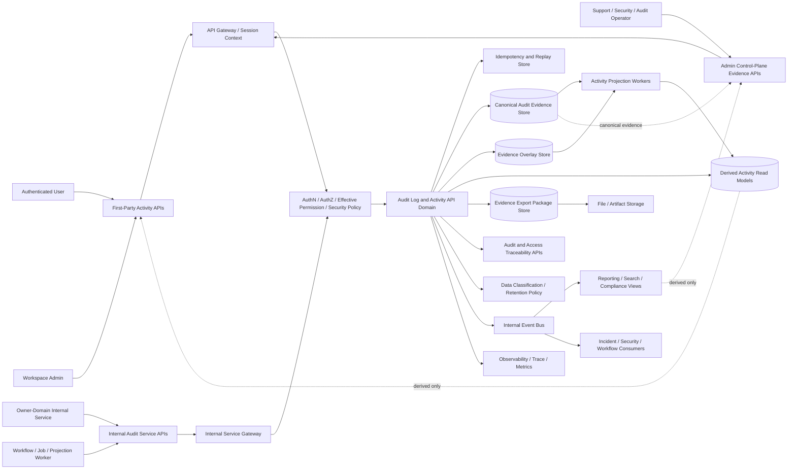
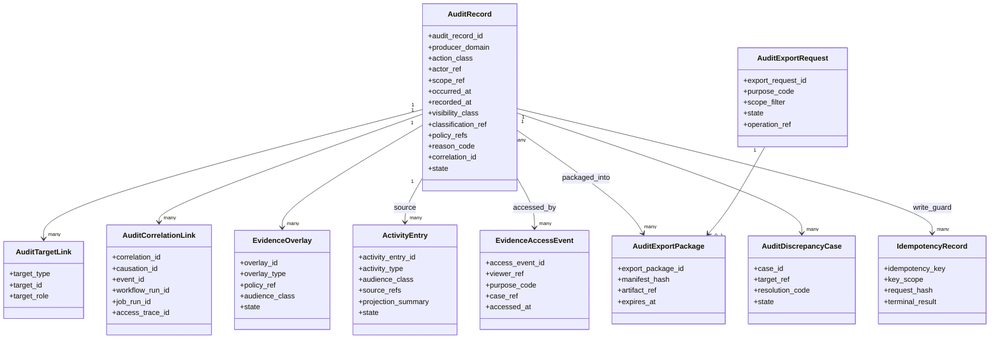
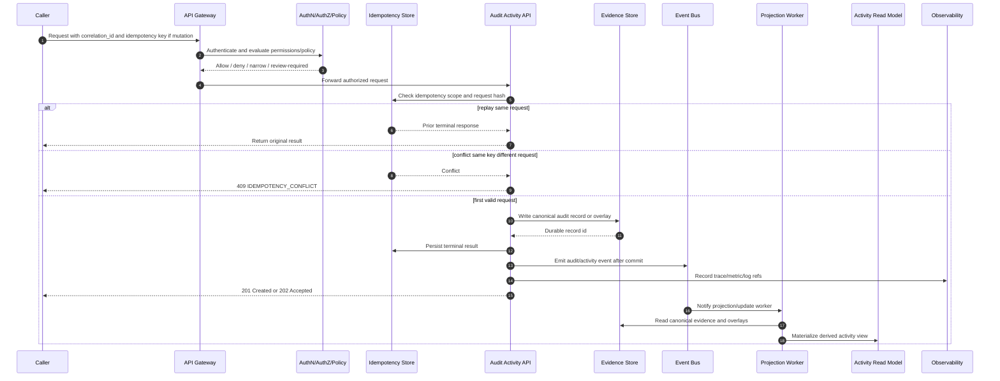

# FUZE Audit Log and Activity API Specification

## Document Metadata

- **Document Name:** `AUDIT_LOG_AND_ACTIVITY_API_SPEC.md`
- **Document Type:** FUZE API SPEC v2 / Production-grade interface-contract specification
- **Status:** Draft for production-grade API-spec review
- **Version:** 2.0.0
- **Effective Date:** 2026-04-24
- **Last Updated:** 2026-04-24
- **Reviewed On:** 2026-04-24
- **Document Owner:** FUZE Platform Audit and Activity Governance Domain
- **Approval Authority:** FUZE Platform Architecture and Governance Authority; named approval record not yet attached
- **Review Cadence:** Quarterly, and whenever audit evidence semantics, activity-history exposure, API surface-family posture, security/risk controls, retention/deletion policy, event/webhook posture, incident handling, privileged evidence access, or public/reporting exposure materially changes
- **Governing Layer:** API SPEC v2 / Security, Audit, Runtime, Operations, and Resilience API family
- **Parent Registry:** `API_SPEC_INDEX.md` and the FUZE API SPEC v2 Canonical File Registry
- **Upstream Semantic Registry:** `REFINED_SYSTEM_SPEC_INDEX.md`
- **Upstream API Registry:** `API_SPEC_INDEX.md`
- **Primary Audience:** Platform architecture, backend engineering, API design, frontend engineering, first-party client teams, internal service authors, security engineering, audit/compliance, support/control-plane operations, data engineering, reliability engineering, implementation-contract authors, OpenAPI/AsyncAPI/SDK authors
- **Primary Purpose:** Define the production-grade API contract for FUZE audit records, bounded activity reads, evidence access, evidence export, redaction overlays, audit search, admin review, activity projection, and audit-domain events while preserving refined system semantics and preventing audit/activity APIs from becoming hidden business-truth owners
- **Primary Upstream References:** `REFINED_SYSTEM_SPEC_INDEX.md`; `AUDIT_LOG_AND_ACTIVITY_SPEC.md`; `AUDIT_AND_ACCESS_TRACEABILITY_SPEC.md`; `SECURITY_AND_RISK_CONTROL_SPEC.md`; `MONITORING_ALERTING_AND_INCIDENT_RESPONSE_SPEC.md`; `DATA_CLASSIFICATION_AND_HANDLING_SPEC.md`; `DATA_RETENTION_DELETION_AND_ARCHIVAL_SPEC.md`; `API_ARCHITECTURE_SPEC.md`; `PUBLIC_API_SPEC.md`; `INTERNAL_SERVICE_API_SPEC.md`; `EVENT_MODEL_AND_WEBHOOK_SPEC.md`; `IDEMPOTENCY_AND_VERSIONING_SPEC.md`; `MIGRATION_AND_BACKWARD_COMPATIBILITY_SPEC.md`; `WORKFLOW_AND_AUTOMATION_SPEC.md`; `JOB_QUEUE_AND_WORKER_SPEC.md`; `FILE_OBJECT_AND_ARTIFACT_STORAGE_SPEC.md`; `SEARCH_INDEXING_AND_DISCOVERY_SPEC.md`; `ANALYTICS_AND_PRODUCT_TELEMETRY_SPEC.md`; `FUZE_ACCOUNT_ACCESS_AND_SESSION_THESIS_FINAL_SPEC.md`; `FUZE_ACCOUNT_ACCESS_AND_SESSION_CANONICAL_FINAL_SPEC.md`; `FUZE_WORKSPACE_ACCESS_CONTROL_BASICS_THESIS_FINAL_SPEC.md`
- **Primary Downstream Dependents:** OpenAPI contracts for audit/activity routes; AsyncAPI event contracts for audit/activity events; audit evidence store contracts; activity projection workers; support/admin consoles; evidence export tooling; redaction and disclosure workflows; product activity feeds; workspace activity surfaces; incident-response evidence tooling; security investigation tooling; reporting and compliance export pipelines; SDKs and first-party clients consuming bounded activity APIs
- **API Surface Families Covered:** First-party protected activity reads; internal service audit-write/query APIs; admin/control-plane evidence review and export APIs; internal event/async APIs; reporting/export APIs; implementation-facing contract guardrails
- **API Surface Families Excluded:** Unauthenticated public full-audit APIs; arbitrary third-party audit webhooks; raw infrastructure log ingestion APIs; SIEM vendor-specific APIs; full access-trace reconstruction APIs; full database DDL; UI copy/layout specs; chain-native contract APIs
- **Canonical System Owner(s):** FUZE Platform Audit and Activity Governance Domain; source owner domains retain semantic ownership of the business facts recorded in audit evidence
- **Canonical API Owner:** FUZE API Platform / Audit Log and Activity API Domain
- **Supersedes:** Older `AUDIT_ACTIVITY_API_SPEC.md` to the extent it overlaps this v2 API contract; no same-name v2 predecessor was identified in the researched materials
- **Superseded By:** Not yet known
- **Related Decision Records:** Not yet attached
- **Canonical Status Note:** This API specification expresses, but does not redefine, the refined audit-log and activity system semantics. Refined system specifications own semantic truth; this document owns API contract expression, route-family posture, request/response/error/status semantics, idempotency, authorization, auditability, observability, compatibility, and implementation guardrails for the audit/activity API domain.
- **Implementation Status:** Normative API-spec draft for downstream implementation-contract, OpenAPI, AsyncAPI, storage, worker, console, and SDK derivation
- **Approval Status:** Draft pending formal FUZE approval workflow
- **Change Summary:** Created a production-grade API SPEC v2 for the audit-log and activity API family. The document upgrades the older audit-activity API posture into a refined-semantics-derived contract, separates canonical audit evidence from derived activity views, separates generic audit from access traceability, formalizes first-party/internal/admin/event/reporting surfaces, defines route families and request/response/error/idempotency models, adds evidence export/redaction/disclosure guardrails, includes Mermaid architecture/data/sequence diagrams, and supplies acceptance criteria and test cases for production readiness.

## Purpose

This specification defines the FUZE Audit Log and Activity API contract.

It governs how clients, services, administrators, workers, reporting systems, and downstream contract artifacts interact with FUZE audit evidence and derived activity history. It makes explicit which API surfaces may write canonical audit records, which surfaces may read bounded activity, which surfaces may perform privileged evidence review or export, and which surfaces may only consume derived projections.

The API exists because FUZE must preserve durable, attributable, policy-aware evidence for material platform actions without letting product timelines, dashboards, events, workflow state, logs, or analytics become hidden systems of record. It also exists because user-facing and operator-facing activity views are necessary, but those views are derived, audience-scoped, and visibility-controlled. They must not rewrite canonical evidence or owner-domain business truth.

This document is governing. It is not a raw endpoint list and it is not a product activity-feed note. Downstream OpenAPI, AsyncAPI, SDK, storage, worker, admin-console, and reporting contracts MUST preserve this document's boundary and truth-class rules.

## Scope

This API specification governs:

- creation of canonical audit records by authorized internal services
- read access to bounded user and workspace activity history
- internal retrieval of canonical audit records for trusted system functions
- admin/control-plane search, review, annotation, redaction overlay, suppression, export, retention overlay, and discrepancy-case workflows
- activity projection creation and repair from canonical audit evidence
- evidence-access event creation for sensitive evidence reads and exports
- request headers, request-body requirements, response classes, status semantics, error classes, idempotency behavior, retry posture, rate limits, audit logging, observability, and compatibility requirements for the API family
- internal event families emitted by the audit/activity API domain
- rules for OpenAPI, AsyncAPI, SDK, and implementation-contract derivation

## Out of Scope

This API specification does not define:

- the business semantics of every source-domain action recorded in audit evidence
- the full access-trace reconstruction model, which belongs to `AUDIT_AND_ACCESS_TRACEABILITY_SPEC.md`
- raw infrastructure log collection, SIEM shipping, debug logging, product telemetry, or analytics instrumentation
- exact physical database DDL, partitioning, indexing, storage engine, object storage, warehouse topology, or vendor implementation
- exact UI card layout, timeline wording, support macro wording, or notification copy
- full legal/compliance retention schedules for each jurisdiction
- arbitrary third-party access to internal audit records
- public webhook exposure of raw audit records
- chain-native contract truth or on-chain event semantics

## Design Goals

1. Preserve audit evidence as immutable, attributable, and reviewable platform evidence.
2. Preserve activity feeds as derived, audience-scoped, visibility-controlled views.
3. Keep owner-domain business truth, access-trace truth, event truth, workflow truth, queue truth, analytics truth, reporting truth, and presentation truth separate.
4. Provide durable API route families for first-party activity reads, internal audit writes, internal canonical reads, admin evidence review, export, redaction, and projection repair.
5. Make idempotency, retry safety, replay handling, request correlation, policy references, reason codes, and audit lineage mandatory where needed.
6. Keep admin/operator override APIs explicit, bounded, reason-coded, policy-constrained, and audited.
7. Support activity projections and reporting without allowing projections to become mutation owners.
8. Provide implementation-grade diagrams, flow views, acceptance criteria, and test cases.
9. Reduce route drift, schema drift, evidence drift, visibility drift, error drift, and public-exposure drift.
10. Support downstream OpenAPI, AsyncAPI, SDK, storage, worker, console, and export-contract generation without redefining refined system semantics.

## Non-Goals

This API specification is not intended to:

- make audit APIs the business source of truth for every action they record
- expose full audit evidence to ordinary users or public consumers
- replace access-trace APIs with generic audit APIs
- replace event contracts, workflow contracts, queue contracts, or monitoring contracts
- turn activity feeds into canonical evidence stores
- turn analytics, dashboards, notifications, or exports into audit truth
- allow internal service APIs to become hidden broad-write shortcuts
- allow support/admin convenience to bypass reason codes, policy checks, and self-audit
- define exact persistence DDL or storage vendor details

## Core Principles

### 1. Refined Semantics Own Meaning
Refined system specifications own semantic truth. This API specification expresses those semantics at the interface-contract layer and MUST NOT redefine them.

### 2. Audit Is Evidence, Not Universal Ownership
Audit records preserve evidence that a material action, decision, accepted intent, privileged access, export, disclosure, correction, or remediation occurred. They do not become the semantic owner of the underlying business fact.

### 3. Activity Is Derived
Activity entries are derived from canonical audit evidence and/or canonical owner-domain records. Activity feeds are not canonical evidence and MUST remain traceable to source records.

### 4. Access Traceability Is Stricter and Adjacent
Access-related decisions and mutations may require both generic audit records and narrower access-trace records. Generic audit APIs MUST NOT replace the stricter access traceability domain.

### 5. Materiality Drives Evidence
Material mutations, sensitive reads, accepted async intents, privileged operations, security/risk interventions, export/disclosure actions, redactions, suppression, retention actions, and discrepancy resolutions generally require durable audit evidence.

### 6. Least Disclosure
Every activity read, evidence read, search result, export, report, and public-safe projection MUST disclose the minimum information permitted by audience, scope, classification, and policy.

### 7. Append-Only Correction
Canonical audit records are immutable after acceptance. Correction requires superseding records, redaction overlays, visibility overlays, or discrepancy/correction records rather than in-place rewrite.

### 8. Event Correlation Without Collapse
Audit records and event records may reference each other. Event publication does not replace audit evidence, and audit records do not replace event contracts.

### 9. Evidence Access Is Auditable
Sensitive evidence access, privileged search, export generation, disclosure, redaction, suppression, retention overlay, and exceptional admin review MUST themselves create audit evidence.

### 10. Conservative Defaults
When visibility, materiality, ownership, or lifecycle posture is unclear, APIs MUST fail closed, narrow visibility, or require review rather than expose or mutate evidence by convenience.

## Canonical Definitions

- **Audit Record:** A durable, immutable evidence artifact describing a material action, outcome, accepted intent, privileged read, export, disclosure, policy decision, redaction, retention action, or remediation.
- **Activity Entry:** A derived audience-scoped representation of one or more canonical source records suitable for user-facing or operator-facing history.
- **Canonical Evidence Store:** The protected durable store or coordinated stores that retain canonical audit records, integrity metadata, lineage, and evidence overlays.
- **Evidence Overlay:** A redaction, suppression, visibility, retention, or interpretive overlay attached to a canonical record without mutating its original evidence content.
- **Evidence Access Event:** A self-audit record representing sensitive evidence read, privileged search, export, disclosure, or review action.
- **Audit Export Package:** A bounded evidence package generated for a permitted audience or purpose under policy, classification, retention, and audit constraints.
- **Reason Code:** A machine-readable reason for privileged, exceptional, corrective, suppressive, restrictive, export, disclosure, or remediation actions.
- **Policy Reference:** A stable reference to the policy, rule version, or specification materially influencing the action or visibility decision.
- **Correlation ID:** A stable identifier linking API requests, audit records, workflow/jobs, events, access traces, and observability records within a causal chain.
- **Operation Reference:** A stable reference for accepted async or long-running audit-domain operations.
- **Supersession Link:** A durable link showing that a later record or overlay narrows, corrects, replaces, cancels, or reinterprets an earlier record.
- **Visibility Class:** The classification determining which audiences may view which fidelity of audit/activity data.

## Truth Class Taxonomy

The API MUST preserve the following truth classes:

1. **Semantic truth** — business meaning owned by source domains.
2. **API contract truth** — request/response/error/status/idempotency/interface obligations owned by this API spec.
3. **Audit truth** — immutable evidence records and evidence overlays owned by the audit/activity domain.
4. **Access-trace truth** — stricter access evaluation and mutation reconstruction records owned by the access traceability domain.
5. **Policy truth** — classification, visibility, retention, security, risk, export, disclosure, and approval rules.
6. **Runtime truth** — request processing state, workflow/job state, projection worker state, export job state, retry state, and operational health.
7. **Ledger/storage truth** — durable audit records, activity materializations, overlays, exports, idempotency records, and retention state.
8. **Provider-input truth** — raw external or connector inputs before owner-domain normalization and acceptance.
9. **Event/async truth** — accepted, emitted, delivered, replayed, or failed events and async operations.
10. **Projection/reporting truth** — activity feeds, dashboards, exports, search indexes, analytics views, support summaries, and compliance packages.
11. **Presentation truth** — UI labels, human-readable summaries, notifications, timeline cards, and support text.

These classes MUST NOT be collapsed. In particular, activity feeds, reports, exports, dashboards, and search results MUST NOT become canonical audit evidence or business truth.

## Architectural Position in the Spec Hierarchy

This API specification derives from the active refined system-spec registry and the refined audit/activity domain. It sits below refined semantic owners and above downstream OpenAPI, AsyncAPI, SDK, worker, storage, console, and reporting implementation contracts.

It is coordinated with:

- `AUDIT_LOG_AND_ACTIVITY_SPEC.md` for generic audit/activity semantics
- `AUDIT_AND_ACCESS_TRACEABILITY_SPEC.md` for stricter access-domain traceability
- `SECURITY_AND_RISK_CONTROL_SPEC.md` for security intervention and evidence requirements
- `MONITORING_ALERTING_AND_INCIDENT_RESPONSE_SPEC.md` for incident declarations, containment, recovery, and post-incident evidence
- `DATA_CLASSIFICATION_AND_HANDLING_SPEC.md` and `DATA_RETENTION_DELETION_AND_ARCHIVAL_SPEC.md` for classification, redaction, retention, lifecycle, archive, and deletion behavior
- `EVENT_MODEL_AND_WEBHOOK_SPEC.md` for event/webhook posture and replay/redelivery semantics
- `IDEMPOTENCY_AND_VERSIONING_SPEC.md` and `MIGRATION_AND_BACKWARD_COMPATIBILITY_SPEC.md` for replay safety, version compatibility, deprecation, and coexistence
- `PUBLIC_API_SPEC.md` and `INTERNAL_SERVICE_API_SPEC.md` for public/internal surface-family posture

## Upstream Semantic Owners

| Upstream domain | What it owns | How this API consumes it |
|---|---|---|
| Audit Log and Activity | Generic audit evidence, activity derivation, evidence overlays, export posture | Defines the primary API contract for audit/activity records and derived views |
| Audit and Access Traceability | Access-state and access-evaluation reconstruction | Links to access trace IDs but does not replace access-trace APIs |
| Source owner domains | Business meaning and lifecycle of domain actions | Provide source identifiers, material action classes, policy refs, and owner-domain outcomes |
| Security and Risk Control | Security/risk decisions, containment, review, challenge, restriction | Requires audit records for material interventions and protected evidence reads |
| Data Classification and Retention | Classification, lifecycle, hold, deletion, archive, redaction posture | Governs visibility, export, redaction, retention overlays, and lifecycle status |
| Event Model and Webhook | Internal events, webhook projections, replay/redelivery | Consumes/produces internal audit events without exposing raw evidence as webhooks |
| API Architecture / Public / Internal | Surface-family boundaries and contract discipline | Determines which routes are first-party, internal, admin/control, event, or reporting |

## API Surface Families

### First-Party Protected Activity APIs
Used by authenticated first-party users and workspaces to read bounded, audience-safe activity entries. These APIs expose derived activity only.

### Internal Service Audit APIs
Used by authorized internal services to write canonical audit records, attach lineage, query canonical records for authorized system purposes, and create projection candidates. These APIs are not public and MUST require service identity.

### Admin / Control-Plane Evidence APIs
Used by authorized support, security, audit, compliance, incident, finance-risk, and governance operators for search, review, annotation, redaction overlay, suppression, retention overlay, discrepancy resolution, and export. These routes require privileged authorization, reason codes where applicable, and self-audit.

### Event / Async APIs
Used for domain event emission, projection workers, export generation, discrepancy remediation, and asynchronous repair workflows. These APIs distinguish accepted state from final outcome.

### Reporting / Export APIs
Used for bounded evidence packages, compliance packages, incident/evidence exports, and governed internal reporting. They are derived or packaged outputs and MUST preserve source lineage.

### Implementation-Facing Contract APIs
Used by storage, projection, and worker layers through implementation contracts. They do not grant semantic ownership or hidden broad writes.

## System / API Boundaries

The audit/activity API domain owns interface contracts for audit records, activity entries, evidence overlays, evidence access, and evidence exports. It does not own source-domain business state, access authorization semantics, event meaning, workflow meaning, queue mechanics, analytics interpretation, or public trust publication truth.

The API MUST preserve the following boundary rules:

1. Source domains emit or authorize audit-worthy records but retain business meaning.
2. Activity APIs read derived views and cannot mutate canonical source truth.
3. Admin APIs may annotate, suppress, overlay, export, or open discrepancy cases; they cannot rewrite canonical audit evidence in place.
4. Internal service APIs may create audit records only within explicitly authorized domains and action classes.
5. Reporting/export APIs package or summarize evidence; they do not become canonical evidence stores.
6. Event APIs emit lifecycle signals after durable commits; event delivery does not define audit success.

## Adjacent API Boundaries

- `AUDIT_AND_ACCESS_TRACEABILITY_API_SPEC.md` owns access-evaluation trace read/write surfaces and reconstruction queries.
- `SECURITY_AND_RISK_CONTROL_API_SPEC.md` owns challenge/restriction/containment APIs; this API records evidence of such actions.
- `MONITORING_ALERTING_AND_INCIDENT_RESPONSE_API_SPEC.md` owns incident records and operational coordination; this API records evidence of incident declarations, severity changes, containment, and closure actions where material.
- `DATA_CLASSIFICATION_AND_HANDLING_API_SPEC.md` owns classification assignment/evaluation APIs; this API consumes classification for visibility, redaction, and export decisions.
- `DATA_RETENTION_DELETION_AND_ARCHIVAL_API_SPEC.md` owns lifecycle action APIs; this API owns audit evidence and overlays related to lifecycle actions within audit/activity scope.
- `EVENT_MODEL_AND_WEBHOOK_SPEC` / API surfaces own event/webhook contracts; this API emits internal audit-domain events but does not expose raw audit webhooks by default.
- `SEARCH_INDEXING_AND_DISCOVERY_API_SPEC.md` owns search infrastructure; audit search APIs here own privileged audit-search contract rules and must not become general search shortcuts.
- `ANALYTICS_AND_PRODUCT_TELEMETRY_API_SPEC.md` owns telemetry/analytics APIs; telemetry is not audit evidence unless explicitly promoted through audit rules.

## Conflict Resolution Rules

1. `REFINED_SYSTEM_SPEC_INDEX.md` and higher platform boundary specs win on semantic precedence.
2. `AUDIT_LOG_AND_ACTIVITY_SPEC.md` wins on generic audit/activity semantics.
3. `AUDIT_AND_ACCESS_TRACEABILITY_SPEC.md` wins on access-trace reconstruction semantics.
4. Source-domain refined specs win on the business meaning of the action being recorded.
5. This document wins on audit/activity API contract expression within its scope.
6. `EVENT_MODEL_AND_WEBHOOK_SPEC.md` wins on event/webhook delivery, replay, and exposure semantics.
7. `DATA_CLASSIFICATION_AND_HANDLING_SPEC.md` and `DATA_RETENTION_DELETION_AND_ARCHIVAL_SPEC.md` win on classification, redaction, retention, archive, and deletion constraints.
8. `SECURITY_AND_RISK_CONTROL_SPEC.md` wins on security/risk decision semantics; this API preserves evidence of those decisions.
9. Reports, dashboards, exports, activity feeds, notifications, and search indexes never win over canonical audit evidence or owner-domain truth.
10. When ambiguity remains, APIs MUST choose the more conservative, architecture-consistent, least-disclosure, fail-closed interpretation and escalate the ambiguity.

## Default Decision Rules

1. Material mutations default to requiring canonical audit records.
2. Privileged reads, evidence exports, redactions, suppressions, and admin review actions default to self-audit.
3. Activity reads default to derived, bounded, redacted output.
4. Unknown visibility defaults to hidden or review-required, not broadly visible.
5. Unknown materiality defaults to recording durable evidence until narrowed by explicit policy.
6. Unknown lifecycle posture defaults to retention-bound and non-public.
7. Duplicate writes default to idempotent replay of the original result or conflict, never duplicate evidence.
8. Accepted async operations default to `202 Accepted` plus operation reference, not final business success.
9. Public exposure defaults to none unless a separate public API/public-trust spec explicitly approves a narrowed projection.
10. If a request cannot identify actor, target, scope, action class, policy basis, and correlation lineage where required, it is incomplete.

## Roles / Actors / API Consumers

### Human Actors
- End users reading personal activity
- Workspace members and administrators reading bounded workspace activity
- Support operators reviewing scoped evidence under case policy
- Security/risk reviewers inspecting sensitive evidence
- Audit/compliance reviewers generating or reviewing evidence packages
- Incident responders reviewing incident-linked evidence
- Governance/finance operators reviewing privileged evidence where approved

### System Actors
- First-party web and admin clients
- Public API gateway, where only approved derived surfaces are later exposed
- Internal service gateway
- Source owner-domain services
- Workflow engines and job workers
- Event bus and projection workers
- Evidence export workers
- Activity materialization workers
- Search/indexing services
- Reporting/compliance export services
- Monitoring/observability systems

## Resource / Entity Families

### Canonical API Resources
- `audit_record`
- `audit_actor_ref`
- `audit_subject_ref`
- `audit_target_link`
- `audit_correlation_link`
- `audit_policy_ref`
- `audit_reason_code`
- `evidence_access_event`
- `evidence_overlay`
- `audit_annotation`
- `audit_redaction_overlay`
- `activity_entry`
- `activity_projection`
- `audit_export_request`
- `audit_export_package`
- `audit_retention_overlay`
- `audit_discrepancy_case`
- `audit_operation`
- `audit_idempotency_record`

### Referenced External Resources
- `account`
- `session`
- `workspace`
- `organization`
- `role_assignment`
- `permission_evaluation`
- `access_trace`
- `security_decision`
- `incident_record`
- `workflow_run`
- `job_run`
- `event_record`
- `webhook_delivery`
- `file_object`
- `export_artifact`
- `ledger_entry` where source-domain relevant
- `chain_reference` where source-domain relevant

### Derived Resources
- `activity_feed_view`
- `audit_search_view`
- `audit_report_view`
- `evidence_export_manifest`
- `support_timeline_view`
- `compliance_package_view`

Derived resources MUST remain traceable to canonical evidence.

## Ownership Model

The Audit Log and Activity API Domain owns:

- API contract expression for audit records and activity entries
- allowed route/resource families for audit/activity interactions
- evidence-access API requirements
- activity projection API posture
- audit export API posture
- admin annotation, redaction, suppression, retention overlay, and discrepancy-case API posture
- request/response/error/status/idempotency semantics for this API family
- OpenAPI/AsyncAPI/SDK guardrails for this API family

It does not own:

- the business meaning of recorded source-domain actions
- access-control evaluation semantics
- event/webhook meaning
- workflow/job truth
- analytics/telemetry interpretation
- public reporting truth
- exact persistence DDL
- UI presentation copy

## Authority / Decision Model

1. Source owner domains determine whether an action occurred and what it means.
2. Audit/activity APIs determine whether and how the action is recorded, exposed, projected, exported, redacted, or reviewed.
3. Authorization and policy services determine whether a caller may read or mutate the relevant API resource.
4. Security/risk policy may deny, narrow, challenge, review, or contain evidence access or export.
5. Classification and retention policy determine visibility, redaction, lifecycle, archive, and export restrictions.
6. Admin/control-plane actors may perform exceptional actions only through bounded, reason-coded, audited APIs.
7. Derived consumers may render activity or reporting views only from authorized source records and allowed projection policies.

## Authentication Model

- First-party activity APIs MUST require a valid authenticated account/session.
- Workspace activity APIs MUST require authenticated account/session and workspace scope evaluation.
- Internal service APIs MUST require authenticated service identity and explicit service authorization for audit family, producer domain, action class, and environment.
- Admin/control-plane APIs MUST require authenticated operator identity, privileged role, effective permission, policy posture, and reason code where required.
- Export APIs MUST require stronger authentication and authorization than ordinary reads.
- Sensitive evidence reads MAY require recent-auth, step-up, case linkage, ticket linkage, or dual-control approval according to policy.

## Authorization / Scope / Permission Model

Authorization MUST evaluate:

- account identity
- session validity
- service principal identity
- workspace or organization scope
- actor relationship to subject and target
- requested surface family
- visibility class
- classification and retention posture
- effective permission
- entitlement or capability gate where relevant
- security/risk restriction or containment posture
- case linkage or approval lineage for privileged reads/exports
- whether access is read-only, derived-read, canonical-read, admin-control, export, overlay, or repair

The right to perform a business action does not automatically grant the right to read full audit evidence for that action. The right to view an activity entry does not grant access to the canonical audit record.

## Entitlement / Capability-Gating Model

Entitlement may control access to activity-history features, workspace reports, or advanced audit review tooling. Entitlement MUST NOT reduce required audit creation, broaden evidence visibility, override classification, or authorize audit mutation by itself.

Premium or internal tooling features MUST remain bounded by authorization, classification, security/risk policy, and audit-domain rules.

## API State Model

### Audit Record States
- `recorded`
- `confirmed`
- `superseded`
- `overlay_applied`
- `retention_locked`
- `archived`

### Activity Entry States
- `materialized`
- `visible`
- `suppressed`
- `superseded`
- `expired_from_view`
- `archived`

### Export States
- `requested`
- `accepted`
- `approved`
- `generating`
- `available`
- `delivered`
- `expired`
- `revoked`
- `failed`

### Overlay States
- `requested`
- `applied`
- `superseded`
- `revoked_if_policy_allows`

### Discrepancy States
- `opened`
- `under_review`
- `repair_pending`
- `resolved`
- `closed`
- `failed`

### Operation States
- `accepted`
- `running`
- `succeeded`
- `failed`
- `canceled`
- `requires_review`

State names in implementation MAY vary, but the semantic distinctions MUST be expressible.

## Lifecycle / Workflow Model

1. A source-domain action, accepted async intent, privileged read, export, disclosure, redaction, suppression, security intervention, incident action, or remediation becomes audit-worthy.
2. The caller invokes an authorized internal, admin, or system route with correlation, actor, target, scope, action class, policy reference, reason code where required, and idempotency key for mutations.
3. The API authenticates the caller and evaluates authorization, security/risk posture, classification, retention, and visibility policy.
4. The idempotency layer checks key scope, request hash, prior result, and replay eligibility.
5. The audit/activity domain records canonical evidence or accepted operation state.
6. The domain emits internal events after durable commit where event publication is required.
7. Activity projection workers materialize or update derived views from canonical evidence and approved source records.
8. First-party clients and admin consoles read derived or canonical views according to policy.
9. Export/redaction/suppression/annotation/retention/discrepancy workflows execute through bounded admin/control APIs.
10. Failure, retry, degraded mode, and repair flows preserve lineage and do not rewrite canonical evidence in place.

## Architecture Diagram — Mermaid flowchart

## Data Design — Mermaid classDiagram

## Flow View

### Synchronous Activity Read
1. Client requests a personal or workspace activity endpoint.
2. API validates session and scope.
3. Authorization checks visibility class and effective permission.
4. API queries only approved derived activity view.
5. Response returns redacted/bounded activity entries with source lineage references only where permitted.
6. Sensitive activity reads MAY create an evidence-access event.

### Internal Audit Record Write
1. Internal service submits audit record with idempotency key, producer domain, actor, target, scope, action class, reason/policy where required, and correlation ID.
2. API authenticates service identity and validates producer-domain authority.
3. API validates request contract and classification/visibility posture.
4. Idempotency check returns prior result, conflict, or proceeds.
5. API writes canonical immutable audit record and lineage links.
6. API emits `audit.recorded` after durable commit.
7. Projection workers materialize derived activity only if policy allows.

### Admin Evidence Export
1. Operator submits export request with purpose, scope, filters, case reference, and reason code.
2. API authenticates operator, evaluates privileged permission, classification, retention, security/risk posture, and export policy.
3. API records evidence-access/export request audit record.
4. API returns `202 Accepted` with operation reference when generation is async.
5. Export worker builds bounded package, manifest, lineage, redactions, and artifact reference.
6. Export availability, delivery, expiry, or revocation is recorded and auditable.

### Failure / Retry / Degraded Mode
1. Idempotent mutation retries return original terminal result or conflict on request-hash mismatch.
2. Projection failure does not invalidate canonical evidence; repair operations rebuild derived views.
3. Export failure leaves canonical evidence intact and records operation failure.
4. If audit recording fails for a mandatory evidence action, API MUST not silently report final success; it must fail, enter accepted recovery posture, or mark degraded state with explicit remediation.

### Admin / Operator Remediation
1. Operator opens discrepancy, annotation, suppression, redaction, or retention overlay request.
2. API requires reason code, case reference where required, and idempotency key.
3. API writes additive overlay/case/action record and self-audit record.
4. Derived views refresh from overlay policy without mutating canonical evidence.

## Data Flows — Mermaid sequenceDiagram

## Request Model

### Required Headers
- `Authorization` for user/admin routes
- `X-Service-Identity` or equivalent service auth context for internal routes
- `X-Correlation-Id` for all routes
- `Idempotency-Key` for all mutation routes and async export/repair routes
- `X-Request-Source` where used by platform API gateway policy
- `Content-Type: application/json` for JSON mutation routes
- `Accept` with supported version/media type where applicable

### Common Mutation Fields
- `actor_ref`
- `scope_ref`
- `target_refs[]`
- `action_class`
- `outcome_class`
- `reason_code` where required
- `policy_refs[]` where materially relevant
- `classification_ref` or class input where required
- `visibility_class`
- `correlation_id`
- `causation_refs[]`
- `source_domain`
- `source_record_ref`
- `occurred_at`
- `metadata` with bounded schema

### Prohibited Request Patterns
- Frontend-authored canonical audit truth.
- Free-form privileged mutations without reason codes.
- Activity projection requests without canonical source lineage.
- Export requests without purpose, scope, and authorization basis.
- Admin redaction/suppression requests that rewrite original evidence content.
- Mutation requests without idempotency keys.

## Response Model

### Success Responses
Successful mutation responses MUST include stable identifiers, state, timestamps, correlation ID, operation reference if async, and lineage references safe for the caller.

### Read Responses
Read responses MUST distinguish:

- canonical audit record responses
- derived activity entry responses
- evidence overlay responses
- evidence export responses
- operation-status responses
- redacted/minimized responses

### Accepted Async Responses
`202 Accepted` MUST include:

- `operation_id`
- `operation_state`
- `accepted_at`
- `status_url` or status lookup reference where applicable
- `correlation_id`
- clear statement that acceptance is not final business success

### Derived Activity Responses
Derived activity responses MUST include:

- activity entry ID
- activity type
- safe actor summary
- safe target summary
- occurred timestamp
- audience-safe details
- state
- redaction/suppression indicators where permitted
- no hidden implication that the activity entry is canonical evidence

## Error / Result / Status Model

Errors MUST use structured problem details or a compatible FUZE error envelope with:

- `type`
- `title`
- `status`
- `code`
- `detail`
- `instance`
- `correlation_id`
- `retryable`
- `operation_id` where applicable

### Common Error Codes

- `AUDIT_AUTHENTICATION_REQUIRED`
- `AUDIT_PERMISSION_DENIED`
- `AUDIT_SCOPE_FORBIDDEN`
- `AUDIT_SERVICE_PRODUCER_FORBIDDEN`
- `AUDIT_VISIBILITY_FORBIDDEN`
- `AUDIT_CLASSIFICATION_RESTRICTED`
- `AUDIT_REASON_CODE_REQUIRED`
- `AUDIT_POLICY_REFERENCE_REQUIRED`
- `AUDIT_IDEMPOTENCY_KEY_REQUIRED`
- `AUDIT_IDEMPOTENCY_CONFLICT`
- `AUDIT_REQUEST_INVALID`
- `AUDIT_RECORD_NOT_FOUND_OR_NOT_VISIBLE`
- `AUDIT_RECORD_IMMUTABLE`
- `AUDIT_OVERLAY_CONFLICT`
- `AUDIT_EXPORT_POLICY_DENIED`
- `AUDIT_EXPORT_REQUIRES_REVIEW`
- `AUDIT_RETENTION_CONFLICT`
- `AUDIT_PROJECTION_UNAVAILABLE`
- `AUDIT_EVIDENCE_STORE_UNAVAILABLE`
- `AUDIT_OPERATION_ACCEPTED_NOT_COMPLETE`
- `AUDIT_RATE_LIMITED`
- `AUDIT_DEGRADED_MODE`

The API MUST distinguish missing object, not-visible object, denied scope, denied policy, immutable record, invalid state, idempotency conflict, retryable dependency failure, and review-required outcomes.

## Idempotency / Retry / Replay Model

All mutation routes MUST be idempotent within a defined idempotency scope. Idempotency scope SHOULD include caller identity/service identity, route family, target resource or source-domain action, environment, and request hash.

Rules:

1. Same key and same semantic request returns original terminal result.
2. Same key and different semantic request fails with `AUDIT_IDEMPOTENCY_CONFLICT`.
3. Retries MUST NOT create duplicate audit records, overlays, exports, annotations, suppressions, or discrepancy cases.
4. Replay of projection workers MUST rebuild derived activity from canonical evidence without mutating evidence.
5. Event replay MUST not create false duplicate business or audit meaning.
6. Export generation retry MUST preserve a single export request lineage and generate only allowed replacement artifacts under policy.
7. Idempotency records MUST be retained long enough to cover replay and retry windows defined by implementation contracts.

## Rate Limit / Abuse-Control Model

- First-party activity read routes MUST be rate-limited by actor, account, workspace, and route family.
- Admin search/export routes MUST have stronger rate limits, pagination limits, query complexity limits, and bulk-access controls.
- Internal write routes MUST be protected against producer-domain spoofing, replay storms, malformed payload floods, and duplicate-write bursts.
- Export routes MUST be bulk-access controlled and monitored for exfiltration risk.
- Suspicious evidence access MUST be observable and may trigger security/risk review.
- Rate-limit errors MUST not reveal hidden record existence across unauthorized scopes.

## Endpoint / Route Family Model

Route shapes are normative at family level. Exact route naming MAY be refined in OpenAPI contracts if semantic posture is preserved.

### First-Party Protected Activity APIs

#### `GET /v2/activity/me`
Returns bounded personal activity entries for the authenticated account.

#### `GET /v2/workspaces/{workspace_id}/activity`
Returns bounded workspace activity entries visible to the authenticated actor under workspace scope and policy.

#### `GET /v2/activity/{activity_entry_id}`
Returns one bounded activity entry if visible to the caller.

### Internal Service APIs

#### `POST /internal/v2/audit/records`
Creates a canonical immutable audit record from an authorized internal producer domain.

#### `POST /internal/v2/audit/records/{audit_record_id}/links`
Adds bounded correlation, causation, target, event, workflow, job, or access-trace linkage without mutating core record content.

#### `POST /internal/v2/activity/projections`
Creates or repairs derived activity projection candidates from canonical evidence under projection policy.

#### `GET /internal/v2/audit/records/{audit_record_id}`
Retrieves canonical audit evidence for authorized internal system functions.

#### `GET /internal/v2/audit/scopes/{scope_type}/{scope_id}`
Retrieves scoped audit summaries for trusted internal services with explicit authorization.

### Admin / Control-Plane APIs

#### `GET /admin/v2/audit/records`
Privileged audit search and review with policy-filtered results and self-audit where required.

#### `GET /admin/v2/audit/records/{audit_record_id}`
Privileged audit detail read. Sensitive reads MUST create evidence-access events where policy requires.

#### `POST /admin/v2/audit/records/{audit_record_id}/annotations`
Adds controlled operator annotation or investigation note.

#### `POST /admin/v2/audit/records/{audit_record_id}/redactions`
Applies policy-governed redaction overlay without rewriting canonical evidence.

#### `POST /admin/v2/activity/{activity_entry_id}/suppressions`
Suppresses or narrows an activity entry from selected audiences without mutating canonical evidence.

#### `POST /admin/v2/audit/exports`
Requests a bounded evidence export package.

#### `GET /admin/v2/audit/exports/{export_request_id}`
Reads export operation/package state if authorized.

#### `POST /admin/v2/audit/retention-overlays`
Applies audit-domain retention, hold, archive, or lifecycle overlay under lifecycle policy.

#### `POST /admin/v2/audit/discrepancy-cases`
Opens or resolves discrepancy cases for missing, duplicate, malformed, stale, overexposed, or inconsistent audit/activity state.

### Event / Async Surfaces

- `audit.recorded`
- `audit.overlay_applied`
- `audit.evidence_accessed`
- `audit.export_requested`
- `audit.export_generated`
- `audit.export_revoked`
- `audit.discrepancy_opened`
- `audit.discrepancy_resolved`
- `activity.projected`
- `activity.suppressed`
- `activity.projection_repaired`

These are internal events by default. Public webhook exposure is excluded unless a separate public/webhook spec explicitly approves a narrowed projection.

## Public API Considerations

This specification does not approve unauthenticated public access to full audit records. Any future public audit-derived API MUST be a narrowed public-read projection governed by public API, public trust, classification, retention, and disclosure rules.

Public or partner-facing activity summaries MUST not expose internal security reasoning, support notes, private workspace data, policy internals, privileged actor details, raw provider inputs, or unreleased business semantics.

## First-Party Application API Considerations

First-party clients may read bounded activity entries but MUST NOT write canonical audit truth. User-facing timelines MUST identify stale, hidden, suppressed, or unavailable activity in audience-safe terms and MUST NOT claim final business outcome where only accepted or in-progress state exists.

## Internal Service API Considerations

Internal service APIs may write canonical audit records only when service identity and producer-domain authority are validated. Internal APIs MUST NOT become broad write shortcuts for foreign domains. Source services MUST provide stable source references and enough lineage for later review.

## Admin / Control-Plane API Considerations

Admin/control-plane APIs are privileged and high-risk. They MUST require explicit operator identity, effective permission, reason codes where applicable, case references where policy requires, idempotency keys for mutations, and self-audit. They MUST not rewrite canonical evidence in place.

## Event / Webhook / Async API Considerations

Audit/activity events are internal events by default. Webhook projection of audit evidence is forbidden unless separately approved as a curated, public-safe, stable external contract. Async operations MUST distinguish accepted state from final package generation, final overlay application, or final repair success.

## Chain-Adjacent API Considerations

This API may record evidence of chain-adjacent observations or actions, but it does not define chain-native truth. Chain observations remain provider/input or chain-observation truth until normalized and accepted by the owner domain. Audit records may reference transaction hashes, chain IDs, contract references, or reconciliation records without redefining on-chain facts.

## Data Model / Storage Support Implications

Implementation contracts SHOULD preserve at minimum:

- canonical audit record ID
- producer domain
- actor reference and actor class
- subject/scope reference
- target links
- action class and outcome class
- reason code and policy references where applicable
- classification and visibility class
- occurred and recorded timestamps
- correlation and causation IDs
- source-domain reference
- event/workflow/job/access-trace references where applicable
- evidence overlay references
- activity projection references
- export/disclosure lineage
- retention/hold/archive lineage
- idempotency records
- evidence-access records

Current-state caches, materialized activity views, search indexes, dashboards, and reports are derived stores and MUST remain rebuildable or reconcilable from canonical records and overlays.

## Read Model / Projection / Reporting Rules

1. Activity feeds, support timelines, audit search views, compliance exports, and dashboards are derived read models unless explicitly canonical within this document.
2. Derived views MUST preserve source references sufficient for authorized review.
3. Derived views MUST obey classification, redaction, suppression, retention, and audience policy.
4. Derived views MUST not invent action meaning that is absent from canonical evidence or owner-domain truth.
5. Search indexes MUST not become the only remaining copy of evidence.
6. Reports MUST identify whether they are summaries, exports, public-safe projections, or canonical evidence packages.
7. Projection lag MUST be visible to operators where material.

## Security / Risk / Privacy Controls

- Protected evidence stores MUST resist unauthorized reads, writes, deletion, and tampering.
- Evidence export is a high-risk operation and requires heightened authorization and monitoring.
- Sensitive search and evidence reads may require case linkage, reason code, recent auth, dual control, or security review.
- User-facing activity must use least-disclosure summaries.
- Internal security reasoning must be redacted from ordinary activity feeds.
- Bulk evidence access must be rate-limited, monitored, and self-audited.
- Failed authorization must not reveal existence across unauthorized scopes.
- Secrets, raw credentials, raw security signals, and restricted provider payloads MUST NOT appear in activity projections.

## Audit / Traceability / Observability Requirements

The API MUST emit or preserve:

- request correlation IDs
- actor/service principal IDs
- source IP/device/session context where policy allows
- effective permission decision references
- security/risk decision references where relevant
- policy version references where materially relevant
- audit record IDs and operation IDs
- event IDs after durable event emission
- export manifest hashes and artifact references
- redaction/suppression/retention overlay lineage
- evidence-access records for sensitive reads and exports
- metrics for write failures, projection lag, export failures, denied reads, rate limits, and discrepancy backlog

Observability data is operational truth. It does not replace canonical audit evidence.

## Failure Handling / Edge Cases

### Mandatory Audit Write Fails
If an action requires audit evidence and the audit write fails, the caller MUST NOT receive unqualified final success. The system must fail the action, enter accepted recovery posture, or record degraded/remediation state through an approved mechanism.

### Projection Fails
Canonical evidence remains valid. Derived activity is stale or incomplete until projection is repaired.

### Export Generation Fails
The export operation fails or remains retryable; canonical evidence remains unchanged.

### Duplicate Internal Write
Idempotency MUST collapse duplicate submissions to one canonical record or return conflict on mismatch.

### Visibility Policy Changes
Derived activity and exports may change for audiences through overlays or rematerialization. Canonical evidence is not rewritten.

### Retention Hold Conflicts With Deletion
Hold wins until formally released. Activity views may be suppressed while protected evidence remains retained.

### Admin Attempts In-Place Rewrite
API MUST reject with immutable-record or forbidden-pattern error.

### Source-Domain and Audit Disagree
Source-domain truth wins on business meaning. A discrepancy case may be opened and audit evidence may be annotated or superseded, but audit APIs do not rewrite business truth.

## Migration / Versioning / Compatibility / Deprecation Rules

- Route families use `/v2`, `/internal/v2`, and `/admin/v2` for this specification generation.
- Additive fields are preferred.
- Meaning changes to audit record immutability, activity derivation, visibility classes, export states, overlay semantics, or idempotency behavior are breaking changes.
- Older `AUDIT_ACTIVITY_API_SPEC.md` route shapes may be temporarily aliased only if they preserve v2 semantics.
- Migration from older audit/activity stores must preserve actor, target, scope, action class, correlation, reason/policy, source refs, visibility, retention, and projection lineage where available.
- Deprecated routes MUST publish deprecation metadata and a migration window.
- Backfills MUST mark reconstructed evidence and avoid implying stronger historical certainty than source data supports.

## OpenAPI / AsyncAPI / SDK Derivation Rules

OpenAPI and SDK artifacts MUST:

- preserve surface-family distinctions
- distinguish canonical audit records from derived activity entries
- include structured errors and status models
- include idempotency headers on mutation routes
- include correlation IDs on all routes
- mark admin/internal routes as non-public
- include accepted-vs-final status distinctions
- prevent client SDKs from exposing internal service/admin routes to ordinary user clients
- document pagination, filtering, visibility, and redaction behavior

AsyncAPI artifacts MUST:

- classify audit/activity events as internal unless explicitly approved otherwise
- include event identity, event version, source audit record ID, correlation ID, actor/scope/target refs where safe, policy refs where relevant, and replay/deduplication requirements
- distinguish projection events from canonical record events

## Implementation-Contract Guardrails

Downstream implementation contracts MUST preserve:

1. audit evidence immutability
2. activity derivation and source lineage
3. first-party/internal/admin/event/reporting separation
4. source-domain semantic ownership
5. access-trace adjacency and stricter reconstruction rules
6. idempotency on all mutation routes
7. reason codes and policy refs for privileged actions
8. evidence-access self-audit
9. classification, retention, redaction, suppression, and export policy enforcement
10. accepted-state versus final-outcome semantics
11. correlation and observability requirements
12. explicit migration/deprecation behavior

## Downstream Execution Staging

1. Stabilize canonical audit-record and activity-entry API schemas.
2. Implement idempotent internal audit write APIs.
3. Implement bounded first-party activity reads.
4. Implement admin search/detail/annotation/suppression/redaction routes.
5. Implement export request/generation/status/revocation routes.
6. Implement activity projection workers and repair routes.
7. Implement internal event publication and AsyncAPI artifacts.
8. Implement OpenAPI/SDK generation with route-family separation.
9. Implement migration aliases or cutover for older `AUDIT_ACTIVITY_API_SPEC.md` route families.
10. Implement QA, contract tests, observability dashboards, and production readiness checks.

## Required Downstream Specs / Contract Layers

- OpenAPI contract for `AUDIT_LOG_AND_ACTIVITY_API_SPEC.md`
- AsyncAPI contract for audit/activity internal events
- Audit evidence storage contract
- Activity projection worker contract
- Evidence export package and artifact contract
- Audit search index contract
- Admin/support console contract
- Redaction/suppression/retention overlay contract
- Discrepancy-case remediation contract
- SDK exposure matrix
- Runbooks for export, redaction, discrepancy repair, projection lag, and degraded audit write handling

## Boundary Violation Detection / Non-Canonical API Patterns

The following patterns are forbidden:

- Ordinary user or frontend route creates canonical audit truth.
- Activity feed acts as canonical evidence.
- Search index or dashboard is the only evidence store.
- Internal service writes audit records for a producer domain it does not own or represent.
- Admin route rewrites audit record content in place.
- Export route bypasses classification or retention policy.
- Privileged read/search/export occurs without self-audit where policy requires it.
- Event delivery is treated as audit success.
- Telemetry or analytics event is treated as audit evidence without promotion under audit rules.
- Public API exposes raw audit evidence by default.
- Provider callback or chain observation is recorded as final business truth before owner-domain normalization.
- Duplicate idempotent requests create duplicate evidence.

## Canonical Examples / Anti-Examples

### Canonical Example — Workspace Member Removal
The workspace service removes a member, owns the membership semantics, writes a canonical audit record with actor, workspace scope, target member, reason/policy if applicable, and correlation ID. The activity projection creates a bounded workspace activity entry visible to authorized workspace administrators.

### Canonical Example — Security Containment
Security/risk service applies account containment. Security owns the containment decision. The audit API records evidence with policy version, reason class, actor/service, target, scope, and correlation. User-facing activity is minimized and does not reveal protected internal reasoning.

### Canonical Example — Evidence Export
An audit reviewer requests an export for a case. The API records the export request, evaluates policy and classification, generates an async operation, produces a manifest and artifact, and records evidence access and delivery events.

### Anti-Example — Frontend Audit Write
A web client posts a completed billing event directly to the audit API as canonical truth. This is forbidden; the billing owner domain must produce the audit-worthy record.

### Anti-Example — Suppression Rewrite
A support operator edits a canonical audit record to hide a timeline entry. This is forbidden; the operator must apply a policy-governed suppression or redaction overlay.

### Anti-Example — Event Equals Audit
A workflow event is assumed to be sufficient audit evidence for a privileged correction. This is forbidden unless an audit record is created or the event is explicitly accepted as evidence by the audit-domain contract.

## Acceptance Criteria

1. Every mutation route requires idempotency protection and rejects missing keys.
2. Duplicate mutation requests with the same idempotency key and same request hash return the original terminal result.
3. Duplicate mutation requests with the same key and different request hash return an idempotency conflict.
4. First-party activity reads return only derived activity entries, never raw canonical evidence.
5. Workspace activity reads enforce workspace scope and effective permission.
6. Internal audit writes validate service identity and producer-domain authority.
7. Admin audit search requires privileged authorization and policy checks.
8. Sensitive evidence reads create evidence-access audit records where policy requires.
9. Activity projection entries retain source audit record lineage.
10. Redaction and suppression APIs create overlays and do not mutate canonical record content.
11. Export requests require purpose, scope, authorization, and policy evaluation.
12. Export generation returns accepted operation state when asynchronous.
13. Export packages include manifest/hash/artifact lineage and expiry/revocation posture.
14. Errors distinguish not visible, not found, denied, policy blocked, immutable, idempotency conflict, rate-limited, and dependency-failure conditions.
15. Event emission occurs only after durable audit-domain commit.
16. Projection failure does not invalidate canonical evidence.
17. Search indexes and reporting views can be rebuilt or reconciled from canonical evidence and overlays.
18. Classification and retention policy are enforced on reads, exports, overlays, and derived activity.
19. Admin/operator actions require reason codes where policy requires them.
20. All privileged mutation paths are self-audited.
21. Accepted async operations distinguish accepted state from final success.
22. Public/raw audit exposure is absent unless separately approved by public API governance.
23. OpenAPI marks internal/admin routes as non-public and mutation routes as idempotent.
24. AsyncAPI identifies audit/activity events as internal by default.
25. Migration aliases from older route names preserve v2 semantic behavior.
26. Observability includes correlation IDs, operation IDs, denied counts, export failures, projection lag, and discrepancy backlog.
27. Boundary-violation tests prevent frontend-authored canonical audit truth.
28. Derived activity cannot override canonical evidence.
29. Access-trace references are linked where relevant but not replaced by generic audit routes.
30. Degraded mandatory-audit write behavior never silently reports final success.

## Test Cases

### Positive Path Tests
1. Internal service writes a valid audit record and receives `201 Created` with audit record ID.
2. Internal service retries the same write and receives the original result.
3. User reads `GET /v2/activity/me` and receives only visible derived entries.
4. Workspace admin reads workspace activity and receives entries scoped to authorized workspace.
5. Admin searches audit records with permitted filters and receives policy-filtered results.
6. Admin adds annotation with reason/case context and receives additive annotation record.
7. Admin requests export and receives `202 Accepted` plus operation ID.
8. Export worker completes package and export status becomes `available`.
9. Projection worker rebuilds an activity view from canonical audit evidence.
10. Internal event `audit.recorded` is emitted only after evidence commit.

### Negative / Authorization Tests
11. Unauthenticated activity read returns authentication error.
12. User attempts to read another workspace activity without permission and receives denied/not-visible response.
13. Frontend attempts `POST /internal/v2/audit/records` and is rejected.
14. Internal service attempts to write for unauthorized producer domain and is rejected.
15. Admin without export permission attempts export and receives policy/permission denial.
16. Operator attempts redaction without required reason code and receives validation error.
17. Sensitive record read without case linkage is denied or review-required.

### Idempotency / Retry / Conflict Tests
18. Mutation without `Idempotency-Key` fails.
19. Same key and changed body returns `AUDIT_IDEMPOTENCY_CONFLICT`.
20. Export request retry does not create duplicate packages.
21. Activity suppression retry returns original suppression outcome.
22. Event replay does not duplicate activity entries.

### State / Boundary Tests
23. Attempt to mutate canonical audit record content after recording fails as immutable.
24. Suppression overlay hides activity from selected audience but canonical record remains readable to authorized admin.
25. Redaction overlay produces minimized output for lower-privilege audience.
26. Activity projection with missing source lineage is rejected.
27. Search index result that lacks canonical source reference is rejected from production feed.

### Failure / Degraded Mode Tests
28. Evidence store unavailable during mandatory audit write returns failure or accepted remediation state, never final success.
29. Projection worker failure increments projection lag and leaves canonical evidence intact.
30. Export generation failure records failed operation and preserves original request lineage.
31. Retention hold prevents export/deletion action and returns retention conflict.
32. Rate-limit on admin search returns rate-limit error without leaking hidden record existence.

### Migration / Compatibility Tests
33. Legacy `AUDIT_ACTIVITY_API_SPEC.md` activity route alias returns v2-bounded activity semantics.
34. Backfilled audit records are marked with reconstruction/source-confidence metadata where original data is incomplete.
35. Deprecation metadata appears for retired v1 route aliases.

### Security / Abuse Tests
36. Bulk export attempts above policy threshold require review or are denied.
37. Repeated denied sensitive-read attempts produce security telemetry and audit signals where required.
38. Evidence export package expires and cannot be downloaded after expiry.
39. Revoked export package returns revoked state and creates audit lineage.
40. Public API scan confirms no raw audit-record public route is exposed.

## Dependencies / Cross-Spec Links

This API spec depends materially on:

- `REFINED_SYSTEM_SPEC_INDEX.md`
- `API_SPEC_INDEX.md`
- `AUDIT_LOG_AND_ACTIVITY_SPEC.md`
- `AUDIT_AND_ACCESS_TRACEABILITY_SPEC.md`
- `SECURITY_AND_RISK_CONTROL_SPEC.md`
- `MONITORING_ALERTING_AND_INCIDENT_RESPONSE_SPEC.md`
- `DATA_CLASSIFICATION_AND_HANDLING_SPEC.md`
- `DATA_RETENTION_DELETION_AND_ARCHIVAL_SPEC.md`
- `API_ARCHITECTURE_SPEC.md`
- `PUBLIC_API_SPEC.md`
- `INTERNAL_SERVICE_API_SPEC.md`
- `EVENT_MODEL_AND_WEBHOOK_SPEC.md`
- `IDEMPOTENCY_AND_VERSIONING_SPEC.md`
- `MIGRATION_AND_BACKWARD_COMPATIBILITY_SPEC.md`
- `WORKFLOW_AND_AUTOMATION_SPEC.md`
- `JOB_QUEUE_AND_WORKER_SPEC.md`
- `FILE_OBJECT_AND_ARTIFACT_STORAGE_SPEC.md`
- `SEARCH_INDEXING_AND_DISCOVERY_SPEC.md`
- `ANALYTICS_AND_PRODUCT_TELEMETRY_SPEC.md`
- `FUZE_ACCOUNT_ACCESS_AND_SESSION_THESIS_FINAL_SPEC.md`
- `FUZE_ACCOUNT_ACCESS_AND_SESSION_CANONICAL_FINAL_SPEC.md`
- `FUZE_WORKSPACE_ACCESS_CONTROL_BASICS_THESIS_FINAL_SPEC.md`

## Explicitly Deferred Items

- Exact physical DDL and table partition strategy.
- Exact object storage location and encryption mechanism for export packages.
- Exact SIEM vendor mappings.
- Exact UI copy for activity cards and admin evidence screens.
- Exact jurisdiction-specific retention duration matrix.
- Exact machine-readable OpenAPI and AsyncAPI YAML artifacts.
- Exact per-domain audit materiality catalog; source domains must define narrower mappings consistent with this API spec.
- Future public audit-derived APIs, if any, pending separate public API/public-trust approval.

## Final Normative Summary

The FUZE Audit Log and Activity API is the interface-contract layer for canonical audit evidence and derived activity history. It MUST preserve refined semantic ownership, immutable evidence, derived activity boundaries, first-party/internal/admin/event/reporting surface separation, least disclosure, idempotency, reason-coded privileged operations, self-audited evidence access, classification/retention enforcement, and migration safety. It MUST NOT allow activity feeds, dashboards, search indexes, events, analytics, notifications, public views, or admin convenience to become hidden owners of audit truth or source-domain business truth.

## Quality Gate Checklist

- [x] Upstream refined semantic owners are explicit.
- [x] Canonical API owner is explicit.
- [x] API surface families are explicit.
- [x] Mutation boundaries are explicit.
- [x] Read boundaries are explicit.
- [x] Adjacent API boundaries are explicit.
- [x] Truth classes are explicit.
- [x] Conflict-resolution rules are explicit.
- [x] Default decision rules are explicit.
- [x] Public, first-party, internal, admin/control, event/webhook, reporting, and chain-adjacent distinctions are explicit where relevant.
- [x] Non-canonical API patterns are called out.
- [x] Operator/admin override paths are bounded, reason-coded, policy-constrained, and audited.
- [x] Read-model, cache, reporting, and projection rules are explicit.
- [x] Chain-adjacent responsibilities are explicit where relevant.
- [x] Accepted-state versus final success semantics are explicit.
- [x] Idempotency and replay requirements are explicit.
- [x] Request, response, error, result, and status classes are implementation-usable.
- [x] Failure and degraded-mode behaviors are explicit.
- [x] Audit, traceability, and observability requirements are explicit.
- [x] Versioning, migration, compatibility, and deprecation rules are explicit.
- [x] OpenAPI / AsyncAPI / SDK guardrails are explicit.
- [x] Dependencies and downstream impacts are explicit.
- [x] Non-goals and deferred items are explicit.
- [x] Architecture Diagram uses Mermaid `flowchart` syntax.
- [x] Data Design diagram uses Mermaid syntax and distinguishes canonical and derived resources.
- [x] Flow View is clear and covers sync, async, failure, retry, audit, admin/operator, and finalization paths.
- [x] Data Flows use Mermaid `sequenceDiagram` syntax.
- [x] Acceptance Criteria are concrete and testable.
- [x] Test Cases cover positive, negative, authorization, entitlement/scope, idempotency, retry, conflict, rate-limit, degraded-mode, audit, migration, and boundary-violation behavior.
