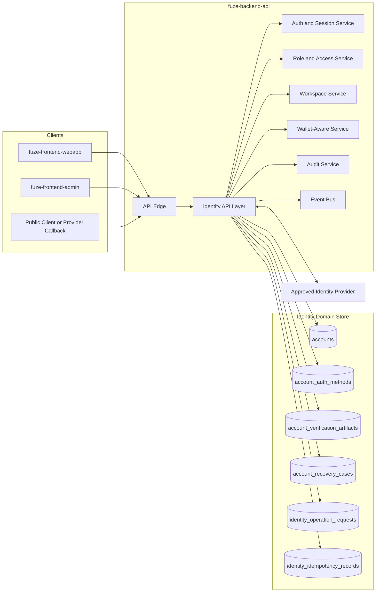
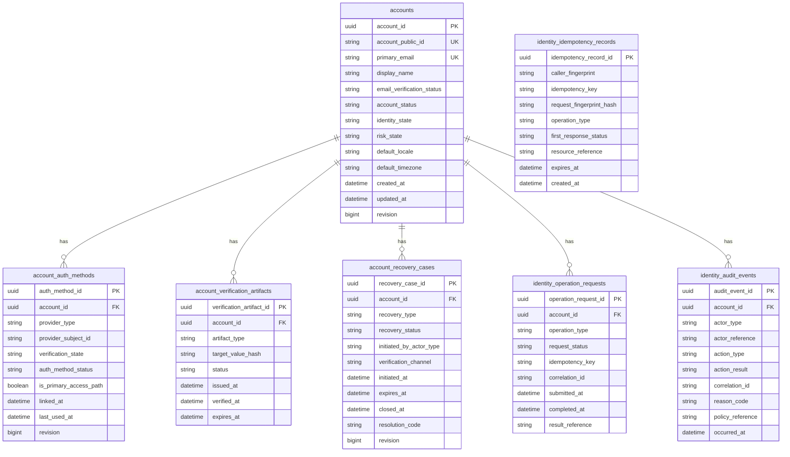
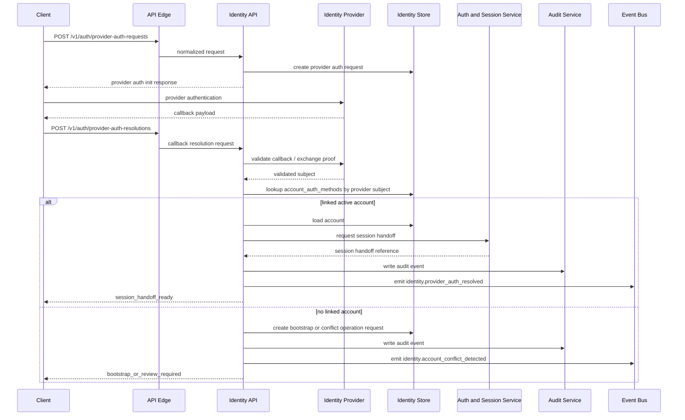

# AUTH_IDENTITY_API_SPEC.md

## Title

FUZE Authentication and Identity API Specification

## Document Metadata

- Document Name: `AUTH_IDENTITY_API_SPEC.md`
- Document Type: Canonical API Specification
- Status: Active
- API Classification: public | internal | admin | event-driven | chain-adjacent
- Owning Domain: Identity and Account Domain
- Primary Implementing Repo: `fuze-backend-api`
- Supporting Repos:
  - `fuze-frontend-webapp`
  - `fuze-frontend-admin`
  - `fuze-specs`
  - future `fuze-sdk`
- Primary System of Record: FUZE identity domain data store in `fuze-backend-api`
- Canonical Folder (default): `fuze.ac > docs > api-spec`
- Derived Contracts Folder (default): `fuze.ac > docs > api-contracts`

---

## Purpose

This specification defines the canonical API surface for FUZE authentication and identity. Its purpose is to establish how the platform exposes identity creation, account retrieval, account security posture, authentication initiation, provider callback resolution, session establishment handoff, identity linkage discovery, recovery initiation, and privileged identity-control operations without collapsing identity truth, authentication mechanics, authorization, wallet awareness, workspace membership, or product-specific state into one ambiguous interface.

This specification is foundational because FUZE is a multi-product, transparency-first platform ecosystem with shared identity, shared Platform Credits, workspace-aware collaboration, wallet-aware participation, AI-enabled products, and trust-sensitive operational surfaces. Authentication and identity are therefore not mere frontend convenience features. They are the durable entry boundary for the entire platform and one of the main upstream control points for security, commercial correctness, auditability, and user continuity.

---

## Scope

This specification covers:

- canonical API boundaries for account identity and account access initiation
- account registration and account bootstrap flows
- provider-based sign-in initiation and resolution
- canonical account profile retrieval and safe mutation surfaces
- account status, verification posture, and access-state semantics
- account recovery initiation and controlled continuation points
- identity-aware admin and support-control operations
- public, authenticated, internal, and admin interface separation
- canonical entity ownership for accounts, authentication methods, account status, and identity-related audit lineage
- request, response, error, idempotency, and compatibility rules specific to auth and identity APIs
- event emissions generated by auth and identity mutations
- implementation constraints for `fuze-backend-api`
- consumption constraints for `fuze-frontend-webapp` and `fuze-frontend-admin`
- contract-derivation expectations for OpenAPI / AsyncAPI and future `fuze-sdk`

This specification does not redefine:

- session issuance and session lifecycle internals beyond the identity API boundary handoff
- workspace membership or workspace authorization semantics
- wallet-aware participation semantics
- product-domain permissions
- credits, billing, governance, treasury, or payout logic

These are refined in:

- `AUTH_SESSION_AND_LINKED_LOGIN_SPEC.md`
- `ROLE_PERMISSION_AND_ACCESS_CONTROL_SPEC.md`
- `WORKSPACE_AND_ORGANIZATION_SPEC.md`
- `WALLET_AWARE_USER_SPEC.md`
- `API_ARCHITECTURE_SPEC.md`
- `PUBLIC_API_SPEC.md`
- `INTERNAL_SERVICE_API_SPEC.md`
- `EVENT_MODEL_AND_WEBHOOK_SPEC.md`
- `IDEMPOTENCY_AND_VERSIONING_SPEC.md`
- `MIGRATION_AND_BACKWARD_COMPATIBILITY_SPEC.md`
- `SECURITY_AND_RISK_CONTROL_SPEC.md`

---

## Source-of-Truth Inputs

### Governing FUZE docs and indexes
- `DOCS_SPEC.md`
- `SYSTEM_SPEC_INDEX.md`

### Highest-priority FUZE system specifications used
1. `SYSTEM_BOUNDARY_AND_OWNERSHIP_SPEC.md`
2. `SYSTEM_OVERVIEW_AND_BOUNDARIES_SPEC.md`
3. `PLATFORM_ARCHITECTURE_SPEC.md`
4. `DOMAIN_OWNERSHIP_MATRIX_SPEC.md`
5. `DATA_MODEL_AND_ENTITY_OWNERSHIP_SPEC.md`
6. `IDENTITY_AND_ACCOUNT_SPEC.md`
7. `AUTH_SESSION_AND_LINKED_LOGIN_SPEC.md`
8. `ROLE_PERMISSION_AND_ACCESS_CONTROL_SPEC.md`
9. `WORKSPACE_AND_ORGANIZATION_SPEC.md`
10. `WALLET_AWARE_USER_SPEC.md`
11. `SECURITY_AND_RISK_CONTROL_SPEC.md`
12. `AUDIT_LOG_AND_ACTIVITY_SPEC.md`
13. `API_ARCHITECTURE_SPEC.md`
14. `PUBLIC_API_SPEC.md`
15. `INTERNAL_SERVICE_API_SPEC.md`
16. `EVENT_MODEL_AND_WEBHOOK_SPEC.md`
17. `IDEMPOTENCY_AND_VERSIONING_SPEC.md`
18. `MIGRATION_AND_BACKWARD_COMPATIBILITY_SPEC.md`
19. `SECRETS_CONFIG_AND_ENVIRONMENT_SPEC.md`
20. `MONITORING_ALERTING_AND_INCIDENT_RESPONSE_SPEC.md`

### Generation-format guides
- `The_API_Specification_guide.md`
- `Database_Schemas_Guide.md`

### Supporting external standards used only as design guidance
- OpenID Connect Core 1.0 errata-set guidance for provider-based authentication
- OAuth 2.x / OAuth 2.1 best-practice direction for authorization-code + PKCE style provider sign-in
- RFC 9457 problem details for HTTP APIs
- HTTP semantics and status code guidance
- PAR / JAR-related hardening patterns where external identity providers support them

### Source interpretation note
FUZE source-of-truth rules take precedence over external standards. External standards were used only to improve interoperability, security posture, and contract clarity.

---

## Governing Architecture and Ownership Interpretation

The identity domain owns canonical person-level and account-level identity truth. Authentication methods, provider linkages, and session-establishment handoffs are tightly related to identity, but they do not redefine canonical identity. This API therefore belongs to the identity domain because the API surface must preserve the distinction between:

- canonical account identity
- authentication method and linked provider mapping
- temporary session state
- authorization and workspace/product scope
- wallet-aware participation

The API is implemented primarily in `fuze-backend-api` because backend domains own durable truth. `fuze-frontend-webapp` may initiate and consume identity flows, but it must never own account truth, provider link truth, or recovery truth. `fuze-frontend-admin` may trigger privileged identity review or corrective operations, but it must not become the source of truth for those actions.

This API is not a product API and not a generic auth utility. It is a platform-core API because all FUZE products consume shared identity and because identity mistakes would cascade into credits, billing, workspaces, wallet-aware behavior, reporting, and trust surfaces.

---

## Domain Responsibilities

The Identity and Account Domain is responsible for:

- canonical account creation and lifecycle state
- provider-linked identity mapping ownership
- normalized external authentication subject binding to FUZE account identity
- account profile truth that is identity-domain-owned
- account verification posture and restricted access state
- recovery initiation and controlled recovery state transitions
- identity-related audit lineage generation
- public-facing identity API surface that is safe to expose
- internal service identity lookups and restricted mutation paths

The Auth / Session subdomain is responsible for:

- session issuance, refresh, revocation, and active session lifecycle
- credential challenge processing
- login callback validation at the session-establishment boundary
- session risk controls

The Workspace Domain is responsible for:

- membership, roles, and organization grouping

The Wallet-Aware Domain is responsible for:

- wallet link truth and wallet verification

The Access-Control Domain is responsible for:

- role and permission evaluation

The Identity API may coordinate with these domains, but it must not absorb their ownership.

---

## Out of Scope

The following are explicitly out of scope for this specification:

- full session API contract semantics
- MFA factor orchestration internals beyond identity-bound initiation points
- workspace invite acceptance and role assignment
- wallet signature verification flows as a primary identity API concern
- credits balance or subscription entitlement logic
- payout eligibility or claim logic
- treasury, governance, reserve, or contract control paths
- product-specific profile extensions that belong to product domains
- raw provider-secret management details
- cloud IAM, CDN, or edge network controls

---

## Canonical Entities and Data Ownership

### 1. `account`
Canonical FUZE identity record.

**Owned by:** Identity Domain  
**Durability:** Source of truth  
**Purpose:** Stable platform identity anchor across products, workspaces, auth methods, wallet-aware context, and reporting lineage.

Representative fields:
- `account_id` (ULID/UUID, immutable)
- `account_public_id` (safe external identifier, immutable)
- `display_name`
- `primary_email`
- `email_verification_status`
- `account_status`
- `identity_state`
- `risk_state`
- `created_at`
- `updated_at`
- `restricted_at`
- `suspended_at`
- `deleted_at` (soft-delete / closure semantics only if allowed)
- `last_identity_review_at`
- `default_locale`
- `default_timezone`

### 2. `account_auth_method`
Linked authentication method / provider mapping.

**Owned by:** Identity Domain  
**Durability:** Source of truth  
**Purpose:** Provider-scoped authentication method linkage to a canonical account.

Representative fields:
- `auth_method_id`
- `account_id`
- `provider_type`
- `provider_subject_id`
- `provider_email_snapshot`
- `provider_claims_snapshot_hash`
- `verification_state`
- `auth_method_status`
- `is_primary_access_path`
- `linked_at`
- `last_used_at`
- `disabled_at`
- `removed_at`
- `risk_flag`

### 3. `account_recovery_case`
Controlled recovery state container.

**Owned by:** Identity Domain  
**Durability:** Source of truth  
**Purpose:** Tracks account access restoration flows without allowing ad hoc silent account rewrites.

Representative fields:
- `recovery_case_id`
- `account_id`
- `recovery_type`
- `recovery_status`
- `initiated_by_actor_type`
- `initiated_at`
- `verification_channel`
- `expires_at`
- `closed_at`
- `resolution_code`
- `support_case_reference`

### 4. `account_verification_artifact`
Identity verification and access integrity artifacts.

**Owned by:** Identity Domain  
**Durability:** Source of truth / evidence record  
**Purpose:** Records verification state transitions for email or provider proof, without overloading account core fields.

Representative fields:
- `verification_artifact_id`
- `account_id`
- `artifact_type`
- `target_value_hash`
- `issued_at`
- `verified_at`
- `expires_at`
- `status`
- `provider_reference`

### 5. `identity_operation_request`
Async/traceable request wrapper for sensitive identity operations.

**Owned by:** Identity Domain  
**Durability:** Durable operational record  
**Purpose:** Supports async or reviewable identity operations such as recovery or provider-link remediation.

Representative fields:
- `operation_request_id`
- `account_id`
- `operation_type`
- `request_status`
- `submitted_at`
- `started_at`
- `completed_at`
- `failed_at`
- `correlation_id`
- `idempotency_key`
- `result_reference`

### 6. `identity_audit_event`
Durable audit lineage for identity actions.

**Owned by:** Audit Domain (generated by Identity Domain)  
**Durability:** Source of truth for audit  
**Purpose:** Captures identity-related security and governance lineage.

Representative fields:
- `audit_event_id`
- `account_id`
- `actor_type`
- `actor_reference`
- `action_type`
- `action_result`
- `scope_type`
- `scope_reference`
- `correlation_id`
- `occurred_at`
- `risk_code`
- `policy_reference`

### 7. `identity_public_profile_projection`
Read-optimized derived projection.

**Owned by:** Derived read model  
**Durability:** Derived / regenerable  
**Purpose:** Safe authenticated retrieval of account profile data without making projections the write owner.

Representative fields:
- `account_id`
- `account_public_id`
- `display_name`
- `primary_email_masked`
- `email_verification_status`
- `account_status_public`
- `linked_auth_method_summary`
- `created_at`

---

## State Model and Lifecycle

### Account lifecycle
1. `pending_bootstrap`
2. `active`
3. `restricted`
4. `suspended`
5. `closed`

#### Allowed transitions
- `pending_bootstrap -> active`
- `active -> restricted`
- `restricted -> active`
- `active -> suspended`
- `restricted -> suspended`
- `suspended -> active` only through controlled review
- `active -> closed` only through controlled closure flow
- `restricted -> closed` only through controlled closure flow

#### Disallowed transitions
- direct silent recreation of a new canonical account to replace a suspended/closed one
- silent merge of two active accounts because provider or email appears similar
- product-local transitions that mutate account state outside identity APIs

### Auth method lifecycle
1. `pending_verification`
2. `active`
3. `disabled`
4. `removed`

Allowed transitions:
- `pending_verification -> active`
- `active -> disabled`
- `disabled -> active`
- `active -> removed`
- `pending_verification -> removed`

### Recovery case lifecycle
1. `initiated`
2. `verification_pending`
3. `under_review`
4. `approved`
5. `completed`
6. `expired`
7. `rejected`
8. `cancelled`

### Identity operation request lifecycle
1. `accepted`
2. `in_progress`
3. `awaiting_review`
4. `completed`
5. `failed`
6. `cancelled`

State transitions must be durable, auditable, and replay-safe.

---

## API Surface Overview

This API specification defines five interface families:

### 1. Public unauthenticated identity APIs
Narrow surface for account bootstrap, verification initiation, provider sign-in initiation, and recovery initiation.

### 2. Authenticated user identity APIs
Safe account/profile reads and limited self-service mutations.

### 3. Internal service identity APIs
Service-to-service account resolution, provider-subject lookup, and controlled status mutation used by trusted domains.

### 4. Admin/control-plane identity APIs
Privileged review, restriction, recovery resolution, and support-safe remediations.

### 5. Event-driven identity interfaces
Business events emitted after identity mutations or identity-risk transitions.

The API is intentionally split because public, internal, and admin callers have materially different trust assumptions.

---

## Authentication and Authorization Model

### Public unauthenticated endpoints
Authentication is not required, but:
- strict rate limiting applies
- abuse detection applies
- verification/challenge proofs are required where relevant
- idempotency is required for selected mutation-like initiation endpoints

### Authenticated user endpoints
Require a valid FUZE authenticated account context.
Authorization depends on:
- the canonical account identity
- whether the account is active or restricted
- whether the action targets self-owned identity resources
- step-up verification for sensitive operations

### Internal service endpoints
Require service identity and least-privilege authorization.
Internal callers must never be treated as broadly trusted by default. Each service-to-service endpoint must enforce explicit service scopes.

### Admin endpoints
Require privileged operator authorization with role checks, reason codes, audit lineage, and often dual-control or review workflow for high-risk actions.

### Authorization principles
- authentication alone is insufficient
- self-service does not imply unrestricted identity mutation
- internal does not imply omnipotent
- admin is not source of truth; admin triggers domain-owned mutation paths

---

## API Endpoints / Interface Contracts

### Public unauthenticated endpoints

#### `POST /v1/auth/identity/account-registrations`
**Purpose:** Create a canonical account bootstrap request.  
**Caller type:** public unauthenticated client  
**Auth expectation:** none  
**Request summary:** display name, email and/or chosen bootstrap method, optional locale/timezone, optional referral/public marketing context  
**Response summary:** accepted or created bootstrap resource with `account_registration_id`, verification-next-step metadata, correlation ID  
**Side effects:** may create `account` in `pending_bootstrap` or a bootstrap request artifact; may create verification artifact  
**Idempotency:** required with `Idempotency-Key`  
**Audit:** bootstrap initiation recorded  
**Emitted events:** `identity.account_registration_requested`

#### `POST /v1/auth/identity/email-verification-challenges`
**Purpose:** Issue or re-issue email verification challenge for bootstrap or email change flow.  
**Caller type:** public unauthenticated or authenticated client depending on flow  
**Auth expectation:** none or self-authenticated depending on context  
**Request summary:** target email, registration or account reference, intent code  
**Response summary:** accepted challenge issuance result  
**Side effects:** creates `account_verification_artifact`  
**Idempotency:** required  
**Audit:** verification challenge issuance logged  
**Emitted events:** `identity.email_verification_challenge_issued`

#### `POST /v1/auth/provider-auth-requests`
**Purpose:** Initiate provider login or provider link flow for Google, Telegram, or other approved providers.  
**Caller type:** public client or authenticated client linking provider  
**Auth expectation:** none for sign-in; authenticated for link flow  
**Request summary:** provider type, intent (`sign_in`, `link_provider`, `reverify`), client return context, PKCE/state/challenge references as required  
**Response summary:** authorization redirect target or provider init payload, opaque `provider_auth_request_id`  
**Side effects:** creates provider-auth request record  
**Idempotency:** recommended  
**Audit:** initiation logged  
**Emitted events:** `identity.provider_auth_requested`

#### `POST /v1/auth/provider-auth-resolutions`
**Purpose:** Resolve provider callback and map provider subject to canonical account or explicit conflict flow.  
**Caller type:** public client callback handler / trusted backend edge  
**Auth expectation:** callback proof / provider response validation  
**Request summary:** provider type, auth request reference, callback code or signed payload, PKCE verifier or equivalent, intent  
**Response summary:** one of:
- `session_handoff_ready`
- `link_completed`
- `account_bootstrap_required`
- `conflict_review_required`
**Side effects:** may activate auth method, may create bootstrap request, may initiate session-establishment handoff, may create conflict record  
**Idempotency:** required  
**Audit:** provider resolution logged  
**Emitted events:** one or more of
- `identity.provider_auth_resolved`
- `identity.auth_method_linked`
- `identity.account_conflict_detected`

#### `POST /v1/auth/recovery-cases`
**Purpose:** Initiate controlled account recovery.  
**Caller type:** public unauthenticated client  
**Auth expectation:** none  
**Request summary:** account locator(s), requested recovery channel, recovery type, proof hints  
**Response summary:** accepted recovery case reference without leaking whether account exists beyond policy-approved response semantics  
**Side effects:** creates `account_recovery_case`  
**Idempotency:** required  
**Audit:** recovery initiation recorded  
**Emitted events:** `identity.recovery_initiated`

### Authenticated user endpoints

#### `GET /v1/identity/me`
**Purpose:** Return authenticated caller’s canonical identity profile.  
**Caller type:** authenticated user  
**Auth expectation:** required  
**Request summary:** optional expansion flags  
**Response summary:** canonical profile payload with safe identity fields and linked-auth summary  
**Side effects:** none  
**Idempotency:** n/a  
**Audit:** read logging policy-based  
**Emitted events:** none

#### `PATCH /v1/identity/me/profile`
**Purpose:** Mutate allowed self-service identity profile fields.  
**Caller type:** authenticated user  
**Auth expectation:** required  
**Request summary:** mutable fields only, such as display name, locale, timezone, optional avatar reference if identity-domain-owned  
**Response summary:** updated profile  
**Side effects:** updates `account` mutable fields only  
**Idempotency:** recommended via conditional update token or request key  
**Audit:** profile mutation logged  
**Emitted events:** `identity.account_profile_updated`

#### `POST /v1/identity/me/email-change-requests`
**Purpose:** Initiate primary email change under controlled verification rules.  
**Caller type:** authenticated user  
**Auth expectation:** required, possibly step-up  
**Request summary:** new email, confirmation proof  
**Response summary:** accepted request with verification next step  
**Side effects:** creates verification artifacts and pending email-change operation  
**Idempotency:** required  
**Audit:** sensitive action logged  
**Emitted events:** `identity.email_change_requested`

#### `GET /v1/identity/me/auth-methods`
**Purpose:** Return linked authentication methods for the caller.  
**Caller type:** authenticated user  
**Auth expectation:** required  
**Request summary:** none  
**Response summary:** provider list, status, last used, primary access indicators  
**Side effects:** none  
**Audit:** read logging policy-based  
**Emitted events:** none

#### `DELETE /v1/identity/me/auth-methods/{authMethodId}`
**Purpose:** Request unlinking of a linked auth method under safe access-continuity rules.  
**Caller type:** authenticated user  
**Auth expectation:** required, step-up likely  
**Request summary:** reason code, confirmation proof  
**Response summary:** completed or accepted-for-review response  
**Side effects:** disables or removes auth method if safe; may create review case  
**Idempotency:** required  
**Audit:** unlink attempt logged  
**Emitted events:** `identity.auth_method_unlink_requested`, `identity.auth_method_removed` when completed

#### `POST /v1/identity/me/recovery-cancellation`
**Purpose:** Cancel self-initiated active recovery case if still cancellable.  
**Caller type:** authenticated user  
**Auth expectation:** required  
**Request summary:** recovery case reference  
**Response summary:** cancelled or conflict status  
**Side effects:** updates `account_recovery_case`  
**Idempotency:** required  
**Audit:** logged  
**Emitted events:** `identity.recovery_cancelled`

### Internal service endpoints

#### `POST /internal/v1/identity/account-resolutions`
**Purpose:** Resolve account by platform-safe identifiers for internal services.  
**Caller type:** internal service  
**Auth expectation:** service auth required  
**Request summary:** one or more identifiers such as `account_id`, `account_public_id`, `provider_subject`, `email_hash`  
**Response summary:** resolved account reference and allowed-safe identity attributes  
**Side effects:** none  
**Idempotency:** n/a  
**Audit:** internal service resolution logged as needed  
**Emitted events:** none

#### `POST /internal/v1/identity/account-status-mutations`
**Purpose:** Apply tightly controlled account status mutation requested by authorized internal domain.  
**Caller type:** internal service / control-plane service  
**Auth expectation:** strong service auth + policy scope  
**Request summary:** target account, desired status transition, reason code, policy reference, correlation ID  
**Response summary:** updated account state  
**Side effects:** updates `account.account_status`  
**Idempotency:** required  
**Audit:** mandatory  
**Emitted events:** `identity.account_status_changed`

#### `POST /internal/v1/identity/provider-subject-lookups`
**Purpose:** Resolve provider subject to linked account for validated provider flows.  
**Caller type:** internal auth/session service  
**Auth expectation:** service auth required  
**Request summary:** provider type, provider subject id  
**Response summary:** auth method and account reference or no-match  
**Side effects:** none  
**Idempotency:** n/a  
**Audit:** optional operational audit  
**Emitted events:** none

#### `POST /internal/v1/identity/recovery-case-transitions`
**Purpose:** Transition recovery cases through controlled internal workflow states.  
**Caller type:** internal workflow/review service  
**Auth expectation:** service auth + recovery scope  
**Request summary:** recovery case id, target state, reason, reviewer/automated policy reference  
**Response summary:** updated recovery case  
**Side effects:** updates recovery case  
**Idempotency:** required  
**Audit:** mandatory  
**Emitted events:** `identity.recovery_status_changed`

### Admin/control-plane endpoints

#### `GET /admin/v1/identity/accounts/{accountId}`
**Purpose:** Retrieve admin-safe identity detail for review.  
**Caller type:** operator/admin  
**Auth expectation:** privileged auth required  
**Request summary:** account identifier  
**Response summary:** account details, linked methods, restriction state, active recovery references, audit summary pointers  
**Side effects:** none  
**Audit:** admin access logged  
**Emitted events:** none

#### `POST /admin/v1/identity/accounts/{accountId}/restrictions`
**Purpose:** Apply or remove restricted/suspended state through controlled admin workflow.  
**Caller type:** operator/admin  
**Auth expectation:** privileged auth with policy gate  
**Request summary:** action, reason code, review evidence, optional expiry/reversal parameters  
**Response summary:** updated status  
**Side effects:** mutates account status; may trigger session invalidation via downstream session domain  
**Idempotency:** required  
**Audit:** mandatory with reason  
**Emitted events:** `identity.account_restriction_applied`, `identity.account_restriction_removed`

#### `POST /admin/v1/identity/accounts/{accountId}/recovery-resolutions`
**Purpose:** Resolve a support-reviewed recovery case.  
**Caller type:** operator/admin  
**Auth expectation:** privileged auth with recovery privilege  
**Request summary:** recovery case id, resolution action, evidence reference, support note  
**Response summary:** updated recovery case and resulting access-state change  
**Side effects:** may activate new access path, close prior auth methods, signal session revocation downstream  
**Idempotency:** required  
**Audit:** mandatory  
**Emitted events:** `identity.recovery_completed`, `identity.recovery_rejected`

#### `POST /admin/v1/identity/accounts/{accountId}/auth-method-remediations`
**Purpose:** Disable, restore, or replace linked auth method in exceptional support/security scenarios.  
**Caller type:** operator/admin  
**Auth expectation:** privileged auth with narrow scope  
**Request summary:** auth method id, remediation type, reason, evidence reference  
**Response summary:** updated auth method status  
**Side effects:** mutates auth method and possibly access continuity posture  
**Idempotency:** required  
**Audit:** mandatory  
**Emitted events:** `identity.auth_method_disabled`, `identity.auth_method_restored`

---

## Request Rules

1. All mutation-capable endpoints must require `X-Correlation-Id`.
2. Public mutation-initiation endpoints must accept `Idempotency-Key`.
3. Sensitive authenticated operations should require step-up confirmation or recent-auth proof where policy requires.
4. Email addresses must be normalized before uniqueness or matching checks.
5. Provider callback resolution requests must include anti-replay state and provider-validation artifacts.
6. Public requests must not expose whether a specific email or account exists unless FUZE policy explicitly allows the response shape.
7. Admin mutation requests must include:
   - `reason_code`
   - `policy_reference`
   - `actor_confirmation`
8. Internal service mutations must include service identity and explicit action scope.
9. Conditional update tokens or revision numbers should be used on mutable profile updates to avoid lost updates.
10. Any request that could create duplicate account bootstrap, recovery initiation, or provider-resolution side effects must be idempotent.

---

## Response Rules

1. Public successful creation-like flows should prefer:
   - `201 Created` for immediate canonical resource creation
   - `202 Accepted` for async/verification-gated initiation
2. Provider auth resolution may return:
   - `200 OK` for resolved and completed states
   - `202 Accepted` for review-required or session-handoff-preparation states
3. Identity reads return canonical or explicitly labeled derived profile projections.
4. Sensitive failures should avoid disclosing unnecessary internal state.
5. All error responses must use `application/problem+json`.
6. All successful mutation responses must include:
   - `correlation_id`
   - canonical resource reference or operation request reference
   - updated revision metadata where relevant
7. Async operations must include operation/request identifier and status endpoint reference.
8. Public responses that are deliberately ambiguous for anti-enumeration reasons must still be internally traceable via correlation IDs.

---

## Error Model

Errors use RFC 9457 problem details with FUZE extensions.

### Required base fields
- `type`
- `title`
- `status`
- `detail`
- `instance`

### Required FUZE extensions
- `code`
- `correlation_id`
- `domain`
- `retryable`
- `scope_type` where relevant
- `resource_reference` where relevant

### Representative error codes
- `identity.validation_failed`
- `identity.account_not_found`
- `identity.account_conflict`
- `identity.account_restricted`
- `identity.account_suspended`
- `identity.provider_subject_already_linked`
- `identity.email_already_in_use`
- `identity.recovery_not_allowed`
- `identity.auth_method_not_removable`
- `identity.step_up_required`
- `identity.provider_callback_invalid`
- `identity.provider_callback_replayed`
- `identity.state_transition_not_allowed`
- `identity.admin_policy_denied`
- `identity.service_scope_denied`

### HTTP status guidance
- `400` malformed request
- `401` unauthenticated
- `403` authenticated but forbidden
- `404` resource not visible or not found
- `409` conflict / duplicate / unsafe state transition
- `422` validation semantics failed
- `429` rate limited / abuse guarded
- `503` provider dependency degraded

---

## Idempotency and Mutation Safety

Idempotency is mandatory for:
- account registration bootstrap creation
- email verification challenge issuance
- provider auth resolution
- recovery initiation
- email change initiation
- auth method unlink requests
- account status mutation
- admin remediation actions

### Idempotency storage semantics
The system must store:
- idempotency key
- caller identity or caller context
- normalized request fingerprint
- first result status
- resulting resource or operation reference
- expiry timestamp

### Safety rules
- replays with same normalized request return the original logical result
- same key with materially different request body must fail
- admin and internal mutations must be idempotent even if triggered through workflow retries
- provider callback resolution must protect against duplicate callback processing
- idempotency records are not canonical identity truth, but are durable mutation-safety controls

---

## Versioning and Compatibility Rules

1. Public identity APIs use explicit `/v1/`.
2. Internal APIs also use explicit version prefixes to reduce drift and ease contract evolution.
3. Additive change is preferred over breaking change.
4. Existing enum values must not change semantic meaning silently.
5. New account states or auth method states must be introduced carefully and documented for downstream consumers.
6. Profile field removals require compatibility windows.
7. Provider-specific behavior should be abstracted behind stable FUZE field names where possible.
8. Recovery and admin APIs are not exempt from compatibility discipline.
9. Identity event schemas must follow the same compatibility rules as HTTP APIs.
10. Breaking changes require deprecation and migration handling aligned with `MIGRATION_AND_BACKWARD_COMPATIBILITY_SPEC.md`.

---

## Event Emission and Webhook Behavior

The identity domain emits internal business events. External webhooks, if ever exposed, must be routed through the canonical event/webhook layer and never directly from a frontend.

### Core internal events
- `identity.account_registration_requested`
- `identity.account_activated`
- `identity.account_profile_updated`
- `identity.account_status_changed`
- `identity.account_restriction_applied`
- `identity.account_restriction_removed`
- `identity.provider_auth_requested`
- `identity.provider_auth_resolved`
- `identity.auth_method_linked`
- `identity.auth_method_disabled`
- `identity.auth_method_removed`
- `identity.auth_method_restored`
- `identity.email_verification_challenge_issued`
- `identity.email_verified`
- `identity.email_change_requested`
- `identity.recovery_initiated`
- `identity.recovery_status_changed`
- `identity.recovery_completed`
- `identity.recovery_rejected`

### Event emission rules
- events are emitted only after canonical write commit
- event payloads must include canonical references, timestamps, and correlation ID
- events must not expose secrets or raw provider tokens
- events must be idempotent and replay-safe at the consumer level
- identity events are internal platform events unless explicitly surfaced externally through approved webhook contracts

---

## Audit and Activity Requirements

The API must generate durable audit lineage for:
- account creation
- account activation
- account restriction and suspension changes
- profile mutation
- linked auth method add/remove/disable/restore
- verification issuance and verification completion
- recovery initiation and recovery resolution
- admin access to sensitive identity detail
- internal service-triggered account-state mutation

Audit records must capture:
- actor type
- actor reference
- target account
- action
- result
- correlation ID
- policy reference where relevant
- reason code where relevant
- timestamp
- affected auth method or recovery case if applicable

User-facing activity feeds may expose a reduced derived subset, but activity feed data is not the audit source of truth.

---

## Data Model and Database Schema View

### Core tables

#### `accounts`
Primary keys:
- `account_id` PK
- unique `account_public_id`
- unique nullable normalized `primary_email`

Major columns:
- `display_name`
- `email_verification_status`
- `account_status`
- `identity_state`
- `risk_state`
- `default_locale`
- `default_timezone`
- `created_at`
- `updated_at`
- `restricted_at`
- `suspended_at`
- `closed_at`
- `revision`

Indexes:
- unique on normalized email where not null
- index on `account_status`
- index on `created_at`

#### `account_auth_methods`
Primary keys:
- `auth_method_id` PK

Foreign keys:
- `account_id -> accounts.account_id`

Major columns:
- `provider_type`
- `provider_subject_id`
- `provider_email_snapshot`
- `verification_state`
- `auth_method_status`
- `is_primary_access_path`
- `linked_at`
- `last_used_at`
- `disabled_at`
- `removed_at`
- `risk_flag`
- `revision`

Constraints:
- unique `(provider_type, provider_subject_id)` for active and pending methods
- only one primary access path per provider type per account if policy requires

Indexes:
- `(account_id, auth_method_status)`
- `(provider_type, provider_subject_id)`

#### `account_verification_artifacts`
Primary keys:
- `verification_artifact_id` PK

Foreign keys:
- `account_id -> accounts.account_id`

Major columns:
- `artifact_type`
- `target_value_hash`
- `status`
- `issued_at`
- `verified_at`
- `expires_at`
- `provider_reference`

Indexes:
- `(account_id, artifact_type, status)`
- `(expires_at)` for cleanup

#### `account_recovery_cases`
Primary keys:
- `recovery_case_id` PK

Foreign keys:
- `account_id -> accounts.account_id`

Major columns:
- `recovery_type`
- `recovery_status`
- `initiated_by_actor_type`
- `verification_channel`
- `initiated_at`
- `expires_at`
- `closed_at`
- `resolution_code`
- `support_case_reference`
- `revision`

Indexes:
- `(account_id, recovery_status)`
- `(expires_at)`
- `(support_case_reference)`

#### `identity_operation_requests`
Primary keys:
- `operation_request_id` PK

Foreign keys:
- `account_id -> accounts.account_id` nullable when pre-account bootstrap

Major columns:
- `operation_type`
- `request_status`
- `submitted_at`
- `started_at`
- `completed_at`
- `failed_at`
- `idempotency_key`
- `correlation_id`
- `result_reference`
- `error_code`

Constraints:
- unique `(caller_scope_hash, idempotency_key)` where applicable

Indexes:
- `(request_status, submitted_at)`
- `(account_id, operation_type)`

#### `identity_idempotency_records`
Primary keys:
- `idempotency_record_id` PK

Major columns:
- `idempotency_key`
- `caller_fingerprint`
- `request_fingerprint_hash`
- `operation_type`
- `first_response_status`
- `resource_reference`
- `stored_response_hash`
- `expires_at`
- `created_at`

Constraints:
- unique `(caller_fingerprint, idempotency_key)`

#### `identity_audit_events`
Primary keys:
- `audit_event_id` PK

Foreign keys:
- `account_id -> accounts.account_id` nullable only where no account yet exists

Major columns:
- `actor_type`
- `actor_reference`
- `action_type`
- `action_result`
- `scope_type`
- `scope_reference`
- `reason_code`
- `policy_reference`
- `correlation_id`
- `occurred_at`
- `metadata_json`

Indexes:
- `(account_id, occurred_at desc)`
- `(action_type, occurred_at desc)`
- `(correlation_id)`

### Ownership and normalization notes
- `accounts` is canonical identity truth
- `account_auth_methods` is canonical linked-access truth
- sessions are not stored here unless a separate auth/session schema explicitly owns them
- verification and recovery records are durable supporting truth, not UI-only artifacts
- projections must never become write owners
- audit rows are immutable after write except for legally required redaction mechanics

---

## Architecture Diagram — Mermaid flowchart

---

## Data Design — Mermaid Diagram

---

## Flow View

### Happy path flow — email registration to active account
1. Public client submits account registration request.
2. Identity API normalizes request, applies idempotency, and creates bootstrap state.
3. Email verification challenge is issued.
4. User completes verification.
5. Identity domain transitions account from `pending_bootstrap` to `active`.
6. Auth/session service may establish a session handoff.
7. Audit records and identity events are emitted.

### Happy path flow — provider sign-in to existing linked account
1. Client initiates provider auth request.
2. Provider returns validated callback payload.
3. Identity API resolves provider subject through `account_auth_methods`.
4. Canonical account is located.
5. If active and not restricted, session handoff is prepared.
6. Response returns `session_handoff_ready`.
7. Audit and event lineage are recorded.

### Alternate flow — provider first seen, bootstrap required
1. Provider callback resolves successfully, but no linked account exists.
2. Identity API creates or returns a bootstrap-required flow response.
3. User confirms bootstrap or account-link intent.
4. New account and auth method are created in controlled order.

### Alternate flow — unlink auth method
1. Authenticated user requests unlink.
2. Identity API checks recent-auth/step-up.
3. API verifies another viable access path exists or a safe recovery policy applies.
4. Auth method is disabled or removed.
5. Audit and event emission occur.

### Failure and recovery flow — account recovery
1. Public caller initiates recovery.
2. API creates `account_recovery_case` without unsafe enumeration leakage.
3. Recovery verification proceeds.
4. Case may enter `under_review`.
5. Admin/control-plane resolves approved or rejected outcome.
6. If approved, new access path may be established and old sessions may be revoked downstream.

### Retry/idempotency view
- Registration, recovery initiation, provider callback resolution, and admin identity remediations must be replay-safe.
- Duplicate external/provider callbacks return the first committed result.
- Workflow retries must not create duplicate accounts or duplicate auth method links.

### Authorization checkpoints
- self-service profile mutation requires authenticated self scope
- sensitive self-service actions may require step-up
- internal status mutations require service scope
- admin remediations require privileged role + reason code + audit

### Operational control logic
- restricted or suspended account state blocks ordinary self-service identity mutation
- admin remediation flows must not directly mutate unrelated domains
- session invalidation is signaled to the auth/session domain, not implemented ad hoc in frontend clients

---

## Data Flows — Mermaid sequenceDiagram

---

## Security and Risk Controls

1. Canonical account identity must remain backend-owned.
2. Provider callback resolution must validate anti-replay and anti-forgery controls.
3. Public identity endpoints must be rate-limited and abuse-protected.
4. The API must not leak account existence unnecessarily through recovery or bootstrap flows.
5. Sensitive identity mutations require step-up or equivalent recent-auth protection.
6. Linked auth method uniqueness must be enforced by durable constraints.
7. Admin remediations require explicit privilege, reason, and audit.
8. Internal service endpoints require least-privilege service authorization.
9. Account restrictions must override ordinary self-service operations.
10. Identity events must exclude secrets and provider tokens.
11. Logs and audit payloads must avoid storing raw secrets or reversible proof artifacts.
12. Recovery flows must prefer conservative outcomes over convenience when ambiguity remains.
13. Session invalidation side effects must be triggered through the proper auth/session domain, not by direct client assumptions.
14. Identity API design must preserve clear separation between:
    - identity
    - session
    - authorization
    - wallet-aware context
    - workspace scope
15. Provider subject collisions must never cause silent account merge.

---

## Operational Considerations

- Identity APIs are platform-critical and require high availability.
- Recovery and provider resolution flows are operationally sensitive and need observability.
- Correlation IDs must be searchable across identity, auth/session, and audit systems.
- Admin identity operations should surface queue/review states rather than blocking for long-running checks.
- Cleanup jobs may expire verification artifacts, idempotency records, and old recovery cases.
- Metrics should include:
  - registration attempts
  - activation success/failure
  - provider callback failure rates
  - auth method link/unlink rates
  - recovery initiation rates
  - restriction/suspension rates
  - admin remediation counts
- Alerting should trigger on:
  - spikes in duplicate provider callbacks
  - unusual recovery volume
  - unusual auth method collision rates
  - unexpected account state mutation bursts

---

## Acceptance Criteria

1. The canonical `account` entity is owned only by the identity domain.
2. Public registration cannot create duplicate active accounts for the same normalized email without controlled conflict handling.
3. Provider callback resolution is idempotent and replay-safe.
4. The API distinguishes self-service identity mutation from admin remediation.
5. Frontend clients never become identity source of truth.
6. Linked auth methods are uniquely bound to provider subject identifiers.
7. Recovery initiation does not create unsafe account-enumeration leakage.
8. Account status transitions follow allowed lifecycle rules only.
9. All sensitive identity mutations generate immutable audit lineage.
10. Identity events are emitted only after canonical write commit.
11. Internal service identity mutations require explicit service scopes.
12. Admin restriction and recovery endpoints require privileged authorization and reason codes.
13. The API remains compatible with downstream session, workspace, wallet, and access-control domains without absorbing their ownership.
14. Mermaid architecture, data design, and sequence diagrams accurately reflect the prose design.
15. The specification is compatible with later OpenAPI / AsyncAPI derivation.

---

## Test Cases

### Positive cases
1. Register account with email, verify email, activate account.
2. Sign in via linked Google provider and receive session handoff.
3. Read authenticated caller profile via `/v1/identity/me`.
4. Update display name successfully.
5. List linked auth methods successfully.
6. Unlink a secondary auth method while retaining another viable access path.
7. Initiate recovery and complete approved admin recovery flow.
8. Apply and remove account restriction via admin endpoint with proper authorization.

### Negative cases
9. Attempt registration with malformed email.
10. Attempt provider callback resolution with invalid state/verifier.
11. Attempt provider callback replay after first success.
12. Attempt unlink of the final viable auth method without approved recovery path.
13. Attempt self-service profile mutation while account is suspended.
14. Attempt admin remediation without reason code.
15. Attempt internal account-status mutation from unauthorized service scope.
16. Attempt email change to an already-in-use normalized email.

### Authorization cases
17. Authenticated user cannot read another account through self endpoint.
18. Public caller cannot access admin account detail.
19. Internal service without identity-mutation scope cannot change account status.
20. Admin with read-only support role cannot perform recovery resolution.

### Idempotency and replay cases
21. Re-submit identical registration request with same `Idempotency-Key` and receive same logical result.
22. Re-submit provider callback resolution and receive same committed outcome.
23. Re-submit admin restriction mutation with same idempotency key and no duplicate state transition.
24. Re-submit recovery initiation with same key and receive same recovery case reference.

### Concurrency cases
25. Concurrent link attempts for same provider subject cannot link to two accounts.
26. Concurrent unlink and recovery actions resolve safely without orphaning account access.
27. Concurrent profile updates with stale revision token fail predictably.

### Audit and event cases
28. Every sensitive mutation writes audit event with actor, reason, and correlation ID.
29. Account activation emits `identity.account_activated`.
30. Recovery completion emits `identity.recovery_completed` once only.

### Reconciliation / integrity cases
31. Projection reads remain consistent with canonical account and auth method tables.
32. Soft-failed provider callback does not create partial linked auth method rows.
33. Expired recovery case cannot be completed without explicit reopened flow.

---

## Open Questions or Explicit Deferred Decisions

1. Exact MFA factor model remains deferred to a dedicated future spec unless already approved elsewhere.
2. Exact session transport shape is owned by the auth/session specification.
3. Exact provider list beyond email/password, Google, and Telegram remains open to future approval.
4. Exact legal/account closure retention behavior requires broader policy confirmation.
5. Exact support evidence requirements for recovery resolution may be refined operationally.
6. Whether wallet-signature-based login becomes a first-class auth method remains deferred unless separately approved.

---

## Implementation Notes for `fuze-backend-api`

- Implement identity as its own domain module with clearly owned persistence.
- Keep session issuance in a separate auth/session module; the identity module returns handoff-ready outputs, not opaque direct session truth.
- Expose public, internal, and admin route groups separately.
- Enforce normalized email and provider subject uniqueness in persistence.
- Use durable idempotency storage for all sensitive initiation and mutation endpoints.
- Emit domain events only after successful commit.
- Route admin and support actions through explicit service methods with reason codes.
- Use optimistic concurrency or revision checks for mutable profile operations.
- Do not let reporting or projection services write identity truth.
- Keep provider-secret handling out of the identity API response surface and out of audit payloads.

---

## Frontend Consumption Notes for `fuze-frontend-webapp`

- Treat identity APIs as authoritative only through backend responses.
- Do not cache mutable profile state as if it were canonical truth.
- Use dedicated bootstrap / provider-auth / recovery flows rather than inventing local state machines that bypass backend statuses.
- Expect async and review-required states for provider and recovery flows.
- Surface anti-enumeration-safe responses without attempting client-side account existence inference.
- Use self endpoints only for authenticated account context, not to infer authorization or workspace rights beyond the backend payload.

## Frontend Consumption Notes for `fuze-frontend-admin`

- Admin UI must call privileged endpoints only through operator-authenticated sessions.
- Admin UI must always provide reason codes and operator notes where required.
- Admin UI is a control surface, not a source of truth.
- Admin pages should show current lifecycle states and audit summaries pulled from backend APIs.
- Sensitive actions should support explicit confirmation UX and policy-aware guardrails.

---

## Contract Derivation Notes for OpenAPI / AsyncAPI

### OpenAPI derivation
The derived OpenAPI contract should group operations into tags such as:
- `IdentityPublic`
- `IdentitySelf`
- `IdentityInternal`
- `IdentityAdmin`

Shared schemas should include:
- `AccountProfile`
- `AuthMethodSummary`
- `RecoveryCase`
- `IdentityOperationRequest`
- `ProblemDetails`
- `IdentityStatusMutationRequest`

### AsyncAPI derivation
Identity events should be published as internal platform events with:
- stable event names
- canonical resource references
- correlation ID
- actor metadata subset
- event version

### Future `fuze-sdk`
Future SDK generation should derive from approved OpenAPI contracts. SDK modules should not define new identity business rules. Suitable future package boundaries include:
- `@fuze/sdk-auth`
- `@fuze/sdk-identity`
- shared core error and correlation helpers

---

## Closing Summary

The FUZE Authentication and Identity API Specification defines the canonical contract boundary for platform identity and account access initiation. It keeps canonical account truth in the identity domain, preserves the distinction between identity, linked authentication methods, sessions, authorization, workspaces, and wallet-aware participation, and exposes separate public, self-service, internal, and admin interface families. By combining strict ownership boundaries, replay-safe mutation rules, explicit lifecycle states, structured audit lineage, and event-safe coordination, the API supports secure and durable platform access without weakening architectural clarity elsewhere in the FUZE ecosystem.
