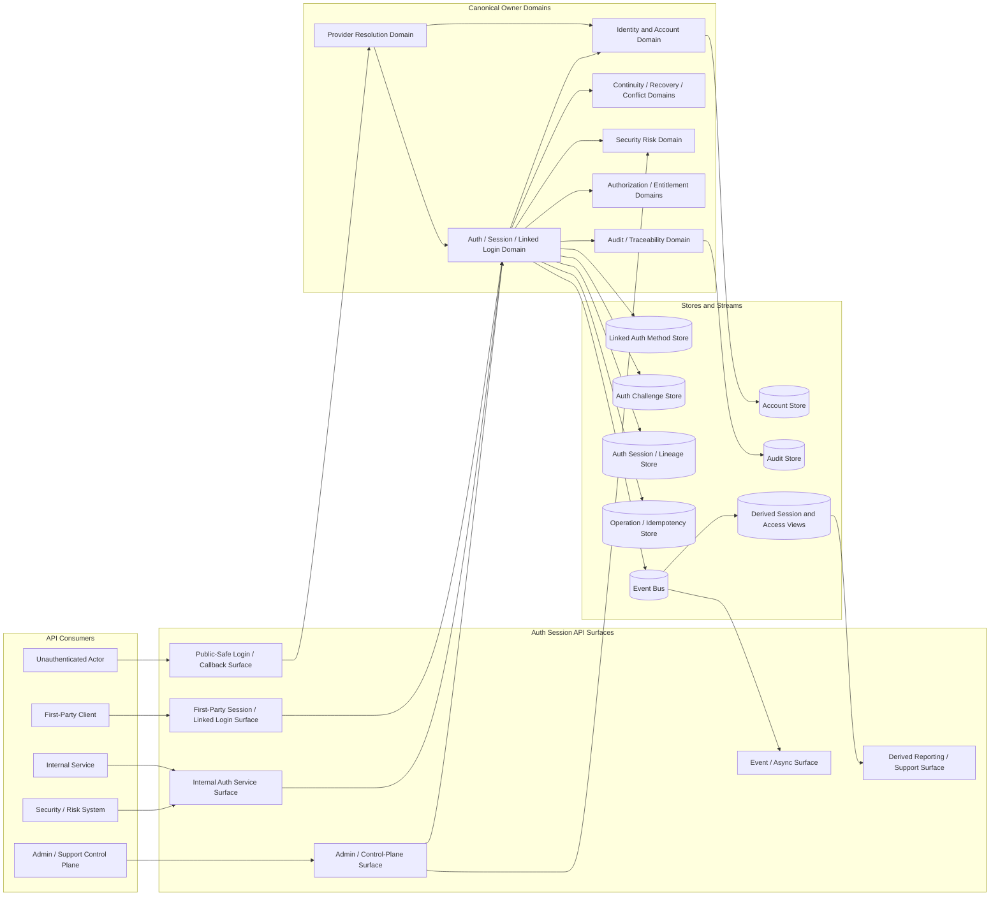
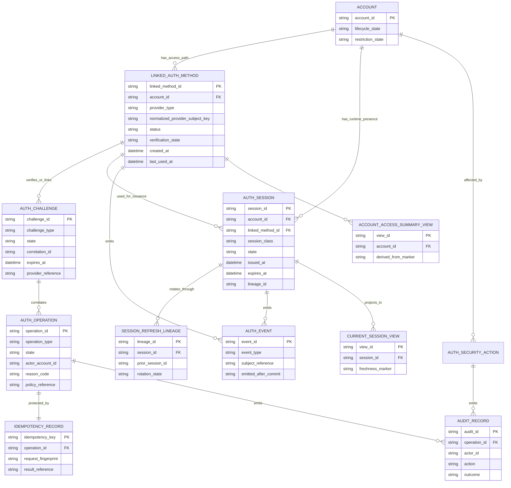
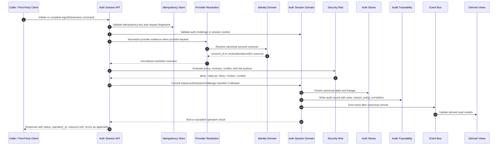

# AUTH_SESSION_AND_LINKED_LOGIN_API_SPEC

## Document Metadata

- Document Name: `AUTH_SESSION_AND_LINKED_LOGIN_API_SPEC.md`
- Document Type: FUZE API SPEC v2 / Production Interface Contract Specification
- Status: Draft for production-grade API source-of-truth inclusion
- Version: 2.0.0
- Effective Date: 2026-04-24
- Last Updated: 2026-04-24
- Reviewed On: 2026-04-24
- Document Owner: FUZE Platform Identity / Access Domain
- Approval Authority: FUZE Platform Architecture and Governance Authority
- Review Cadence: Quarterly or upon material authentication, session, provider-linking, recovery, risk-control, or access-continuity change
- Governing Layer: API contract layer for platform authentication, session, and linked-login surfaces
- Parent Registry: `API_SPEC_INDEX.md` and FUZE API SPEC v2 Canonical File Registry
- Upstream Semantic Registry: `REFINED_SYSTEM_SPEC_INDEX.md`
- Upstream API Registry: `API_SPEC_INDEX.md`
- Primary Audience: API design, backend engineering, identity/access engineering, security engineering, product engineering, frontend engineering, support operations, audit, platform operations, QA, SDK/OpenAPI/AsyncAPI authors
- Primary Purpose: Define the production-grade API contract posture for FUZE authentication, session, auth challenge, and linked-login behavior while preserving canonical account/access/session semantics from refined system specs.
- Primary Upstream References:
  - `REFINED_SYSTEM_SPEC_INDEX.md`
  - `API_SPEC_INDEX.md`
  - `DOCS_SPEC_INDEX.md`
  - `SYSTEM_SPEC_INDEX.md`
  - `SYSTEM_BOUNDARY_AND_OWNERSHIP_SPEC.md`
  - `SYSTEM_OVERVIEW_AND_BOUNDARIES_SPEC.md`
  - `PLATFORM_ARCHITECTURE_SPEC.md`
  - `DOMAIN_OWNERSHIP_MATRIX_SPEC.md`
  - `DATA_MODEL_AND_ENTITY_OWNERSHIP_SPEC.md`
  - `IDENTITY_AND_ACCOUNT_SPEC.md`
  - `FUZE_ACCOUNT_ACCESS_AND_SESSION_THESIS_FINAL_SPEC.md`
  - `FUZE_ACCOUNT_ACCESS_AND_SESSION_CANONICAL_FINAL_SPEC.md`
  - `AUTH_SESSION_AND_LINKED_LOGIN_SPEC.md`
  - `FUZE_ACCOUNT_ACCESS_CONTINUITY_SPEC.md`
  - `FUZE_PROVIDER_RESOLUTION_AND_LINKING_SPEC.md`
  - `FUZE_SESSION_LIFECYCLE_AND_SECURITY_SPEC.md`
  - `FUZE_ACCOUNT_RECOVERY_AND_CONFLICT_HANDLING_SPEC.md`
  - `WORKSPACE_AND_ORGANIZATION_SPEC.md`
  - `ROLE_PERMISSION_AND_ACCESS_CONTROL_SPEC.md`
  - `SCOPED_AUTHORIZATION_MODEL_SPEC.md`
  - `ACCESS_EVALUATION_AND_EFFECTIVE_PERMISSION_SPEC.md`
  - `ENTITLEMENT_AND_CAPABILITY_GATING_SPEC.md`
  - `AUDIT_AND_ACCESS_TRACEABILITY_SPEC.md`
  - `SECURITY_AND_RISK_CONTROL_SPEC.md`
- Primary Downstream Dependents:
  - OpenAPI contracts for auth/session and linked-login route families
  - AsyncAPI contracts for auth/session lifecycle events
  - SDK account access/session clients
  - first-party web and mobile login/session clients
  - provider adapter implementation contracts
  - auth/session service implementation contracts
  - security/risk controls and alerting contracts
  - audit/activity pipeline contracts
  - support/admin control-plane workflow contracts
  - product integration contracts that consume authenticated account context
- API Surface Families Covered: public-safe auth initiation/completion where approved, first-party application APIs, internal service APIs, admin/control-plane APIs, event/async APIs, webhook-adjacent notification posture where approved, reporting/read-model APIs for derived auth/session views
- API Surface Families Excluded: raw provider SDK internals, credential cryptographic storage APIs, workspace/authorization route ownership, entitlement route ownership, wallet ownership APIs, product-local login roots, treasury/payout/credits APIs, database schema details, support playbook UX details
- Canonical System Owner(s): Identity and Account Domain; Auth / Session / Linked Login Domain; Provider Resolution Domain; Session Lifecycle and Security Domain; Security/Risk Function; Audit/Traceability Domain
- Canonical API Owner: FUZE Platform Identity / Access API Owner
- Supersedes: `SESSION_AND_LINKED_LOGIN_API_SPEC.md` for the overlapping API domain to the extent this v2 document is adopted; earlier auth/session/linking API notes that conflict with refined system semantics
- Superseded By: Not yet known
- Related Decision Records: Not yet known
- Canonical Status Note: This API specification expresses, but does not redefine, refined system semantics for authentication, sessions, auth challenges, linked login methods, provider-backed access paths, and continuity-safe access mutations.
- Implementation Status: Normative API contract baseline; downstream OpenAPI, AsyncAPI, SDK, service, storage, audit, monitoring, and QA artifacts must conform.
- Approval Status: Drafted for API SPEC v2 inclusion; formal approval record not yet attached.
- Change Summary:
  - upgraded the historical session/linked-login API posture into API SPEC v2 structure
  - aligned API route families with refined account/access/session semantics
  - separated identity, provider resolution, linked-auth, session, workspace authorization, entitlement, wallet-aware, audit, and derived-read truth classes
  - added explicit surface-family, idempotency, replay, event, admin/control, migration, acceptance-criteria, and test-case requirements

---

## Purpose

This document defines the FUZE API contract for authentication sessions, auth challenges, linked login methods, and continuity-safe access-path management.

The API exists to expose controlled ways for callers to:

1. initiate and complete approved authentication flows;
2. receive, inspect, refresh, rotate, revoke, or invalidate temporary authenticated runtime state;
3. list and manage approved linked authentication methods;
4. begin and complete provider-backed link flows through backend-owned normalization;
5. enforce continuity before sensitive access-path mutations;
6. express conflict, review, recovery, containment, and risk posture without inventing alternate identity truth;
7. emit audit, observability, and domain events after canonical owner-domain commits.

This API specification does not own system semantics. The refined system specs own semantic truth. This document owns interface-contract expression of that truth.

## Scope

This API specification governs the contract-level behavior of:

- login initiation route families;
- provider callback and completion route families;
- auth challenge creation, inspection, completion, expiry, and replay denial semantics;
- session issuance, inspection, refresh, rotation, logout, targeted revocation, global revocation, and security invalidation route families;
- linked-auth method list, begin-link, complete-link, remove, disable, restore, and review-sensitive route families;
- first-party auth posture summaries and continuity summaries;
- internal auth/session service commands and reads;
- admin/control-plane correction, containment, support review, and security override route families;
- auth/session domain events and webhook-adjacent notification posture;
- derived read models, reporting surfaces, support views, and product convenience summaries that expose auth/session state without becoming owners.

## Out of Scope

This API specification does not govern:

- canonical account identity lifecycle APIs in full;
- provider-resolution heuristics in full;
- detailed cryptographic credential storage;
- provider SDK selection or raw OAuth/OIDC/messaging-provider mechanics;
- browser cookie, CSRF, local-storage, or token-transport implementation detail beyond contract-level safety requirements;
- workspace membership, role, permission, and entitlement decision routes;
- wallet-link truth or wallet-derived participation truth;
- legal identity, KYC, or compliance verification overlays;
- product-local profile data models;
- database table definitions;
- support staffing procedures or admin UI layout.

## Design Goals

1. Preserve one canonical account identity across all FUZE auth entry points.
2. Treat linked login methods as durable access paths, not alternate identities.
3. Treat sessions as temporary runtime truth, subordinate to account, auth-link, risk, recovery, and policy truth.
4. Expose route families that are deterministic, auditable, replay-safe, and continuity-safe.
5. Prevent provider callbacks, product frontends, admin convenience tools, or derived views from becoming hidden auth/session owners.
6. Separate authentication success from workspace authorization, permission grants, entitlement grants, and product capability.
7. Support public-safe and first-party UX without widening canonical write authority.
8. Preserve explicit state, lineage, reason codes, policy references, audit references, correlation IDs, operation references, and idempotency keys where they protect security or continuity.
9. Make downstream OpenAPI, AsyncAPI, SDK, QA, and implementation-contract derivation deterministic.

## Non-Goals

This API specification is not intended to:

- create a new account identity model;
- make email, provider profile fields, wallets, product-local user IDs, or sessions identity roots;
- make a valid session equivalent to workspace permission or entitlement;
- allow product-specific login systems to bypass the shared access model;
- define provider-specific SDK details;
- define low-level cookie or refresh-token algorithms;
- replace recovery, authorization, entitlement, wallet, security, audit, or storage specifications;
- expose broad public admin or linked-login mutation APIs.

## Core Principles

### API Expresses Refined Semantics

The API MUST express refined account/access/session semantics and MUST NOT reinterpret them for public API convenience, frontend convenience, provider convenience, worker convenience, or admin convenience.

### Account, Access Path, and Session Separation

`account_id` is the canonical actor anchor. A linked login is a durable access path to that account. A session is temporary authenticated runtime presence. API responses MUST preserve these distinctions.

### Auth Before Authorization

Authentication and session issuance occur before workspace context, role, permission, entitlement, and product capability evaluation. A session response MAY include downstream summary hints, but it MUST NOT assert final authorization unless the response explicitly identifies the downstream authorization owner and evaluation result.

### Backend Normalization

Provider callbacks and external evidence MUST normalize through backend-owned provider resolution before linked-auth or session truth changes.

### Continuity Before Convenience

APIs that remove, disable, restore, correct, or replace access paths MUST evaluate continuity posture. Ordinary self-service routes MUST NOT strand an account without another viable access path, approved recovery path, or operator-reviewed remediation path.

### Explicit Review Over Guessing

Ambiguous provider completion, duplicate-signup risk, contested provider ownership, replayed challenge completion, degraded provider evidence, or uncertain access safety MUST fail closed into denial, review, conflict, or remediation posture rather than silent merge, silent bootstrap, or silent reassignment.

### Derived Views Stay Derived

Current-session lists, access summaries, support views, analytics, exports, and product convenience views MAY summarize canonical records but MUST remain regenerable and MUST NOT mutate canonical auth/session truth.

## Canonical Definitions

- **Account**: Canonical FUZE identity anchor owned by the identity/account domain.
- **Authentication Method**: Approved mechanism by which an actor proves access to an account.
- **Linked Login / Linked Authentication Method**: Durable relationship between a canonical account and one approved authentication method or provider-backed subject.
- **Auth Challenge**: Durable short-lived owner-controlled state used for login initiation, provider callback correlation, link verification, re-authentication, step-up, or replay-sensitive completion.
- **Session**: Temporary authenticated runtime state created after successful authentication and required policy checks.
- **Session Lineage**: Durable lineage for refresh, rotation, revocation, invalidation, and security review.
- **Provider Input**: Validated external evidence from a provider or adapter, used as input to FUZE-owned resolution rules.
- **Continuity Summary**: Derived posture describing whether an account has viable access paths or approved recovery/remediation paths.
- **Auth Security Action**: Durable record for sensitive access intervention such as global revocation, security invalidation, forced re-authentication, or operator-controlled linked-method action.

## Truth Class Taxonomy

The API MUST distinguish the following truth classes.

| Truth Class | API Treatment |
|---|---|
| Canonical Identity Truth | Exposed only as account references and account-derived constraints; owned by identity/account APIs. |
| Auth-Link Truth | Exposed as linked-auth resources and mutation outcomes; owned by auth/session/linked-login APIs in coordination with identity/provider resolution. |
| Runtime Session Truth | Exposed as session resources, validity states, lineage references, and revocation/invalidation outcomes. |
| Auth-Challenge Truth | Exposed as short-lived challenge resources and completion outcomes; challenge completion is terminal and replay-safe. |
| Provider-Input Truth | Exposed only as normalized evidence, callback outcome, or review signal; never as identity truth. |
| Policy Truth | Exposed as policy references, denial classes, re-auth requirements, risk outcomes, and admin-control constraints. |
| Authorization Truth | Consumed or referenced after session issuance; not owned by this API. |
| Entitlement Truth | Consumed or referenced after identity/session/scope resolution; not owned by this API. |
| Wallet-Aware Context Truth | Attached downstream context; not session truth or identity truth. |
| Derived Read-Model Truth | Support views, current-session summaries, product summaries, dashboards, analytics, exports; derived and regenerable. |
| Audit / Traceability Truth | Durable audit and operation lineage records; emitted/recorded for sensitive actions and canonical transitions. |

## Architectural Position in the Spec Hierarchy

This API spec sits below refined system semantics for system boundaries, identity/account, canonical account/access/session, auth/session/linked-login, provider resolution, continuity, session lifecycle/security, recovery/conflict handling, security/risk, and audit/traceability.

It sits above:

- OpenAPI route specifications;
- AsyncAPI event specifications;
- SDK method contracts;
- auth/session service implementation contracts;
- provider-adapter contracts;
- frontend integration contracts;
- support/admin control-plane implementation contracts;
- auth/session QA and contract-validation suites.

## Upstream Semantic Owners

- `IDENTITY_AND_ACCOUNT_SPEC.md` governs canonical account truth and identity lifecycle.
- `FUZE_ACCOUNT_ACCESS_AND_SESSION_CANONICAL_FINAL_SPEC.md` governs cross-domain account/access/session ordering and truth separation.
- `AUTH_SESSION_AND_LINKED_LOGIN_SPEC.md` governs linked-auth, auth challenge, and parent session semantics.
- `FUZE_PROVIDER_RESOLUTION_AND_LINKING_SPEC.md` governs provider normalization and provider-to-account outcomes.
- `FUZE_ACCOUNT_ACCESS_CONTINUITY_SPEC.md` governs continuity constraints.
- `FUZE_SESSION_LIFECYCLE_AND_SECURITY_SPEC.md` governs detailed session lifecycle and containment.
- `FUZE_ACCOUNT_RECOVERY_AND_CONFLICT_HANDLING_SPEC.md` governs review, recovery, remediation, and conflict posture.
- `SECURITY_AND_RISK_CONTROL_SPEC.md` governs risk escalation and security controls.
- `AUDIT_AND_ACCESS_TRACEABILITY_SPEC.md` governs reconstructability and audit requirements.

## API Surface Families

### Public-Safe Surface

Public-safe surfaces MAY expose provider choices, login initiation, provider callback completion entry points, and limited challenge completion outcomes where approved. They MUST be narrow, state-machine-bound, rate-limited, replay-safe, and unable to mutate canonical truth without owner-domain validation.

### First-Party Application Surface

First-party applications MAY initiate login, inspect current session posture, request logout, list linked methods for the authenticated account, begin/complete link flows, and request allowed self-service linked-method changes. They MUST use backend-issued session state and MUST NOT treat frontend state as canonical.

### Internal Service Surface

Internal services MAY request owner-controlled session validation, session inspection, post-auth context exchange, security containment, event projection, and risk evaluation. Internal APIs MUST NOT become broad write shortcuts.

### Admin / Control-Plane Surface

Admin/control-plane APIs MAY support targeted revocation, global revocation, linked-method disable/restore under review, conflict-case transition, security invalidation, and support-assisted remediation. They MUST be separated from ordinary application APIs, strongly authorized, reason-coded, policy-constrained, idempotent where retryable, and audited.

### Event / Async Surface

The auth/session domain SHOULD emit durable events after canonical commits for material actions. Events are downstream notifications, not mutation authority.

### Reporting / Read-Model Surface

Reporting and support read models MAY summarize linked-auth and session state. They MUST be marked derived, expose freshness where relevant, and never write canonical auth/session truth.

## System / API Boundaries

This API governs interface expression for auth/session/linked-login truth. It MUST NOT govern or override:

- account creation or identity lifecycle except where session issuance references account outcomes;
- provider-to-account resolution decisioning in full;
- workspace membership or organization scope truth;
- permission or role truth;
- entitlement or capability truth;
- wallet-link or chain-adjacent truth;
- reporting truth;
- product-local profile truth.

## Adjacent API Boundaries

- `IDENTITY_AND_ACCOUNT_API_SPEC.md`: Owns canonical account reads and identity lifecycle contracts.
- `ACCOUNT_ACCESS_AND_SESSION_CANONICAL_API_SPEC.md`: Owns cross-domain canonical account/access/session API posture.
- `ACCOUNT_ACCESS_CONTINUITY_API_SPEC.md`: Owns deeper continuity checks and continuity summary contracts.
- `PROVIDER_RESOLUTION_AND_LINKING_API_SPEC.md`: Owns detailed provider normalization and provider-link resolution contracts.
- `SESSION_LIFECYCLE_AND_SECURITY_API_SPEC.md`: Owns detailed session lifecycle, refresh/rotation, containment, and security invalidation contracts.
- `ACCOUNT_RECOVERY_AND_CONFLICT_HANDLING_API_SPEC.md`: Owns recovery/conflict case contracts.
- `WORKSPACE_AND_ORGANIZATION_API_SPEC.md`: Owns workspace scope selection and membership context.
- `ROLE_PERMISSION_AND_ACCESS_CONTROL_API_SPEC.md`: Owns permission evaluation.
- `ENTITLEMENT_AND_CAPABILITY_GATING_API_SPEC.md`: Owns capability and entitlement decisions.
- `AUDIT_AND_ACCESS_TRACEABILITY_API_SPEC.md`: Owns audit read models and traceability contracts.

## Conflict Resolution Rules

When layers disagree, API implementations MUST resolve auth/session conflicts in this order unless a higher-order approved policy states otherwise:

1. canonical identity-domain records and account restriction state;
2. canonical linked-auth, auth-challenge, and session records;
3. explicit security, recovery, conflict, remediation, and policy state;
4. validated provider-input evidence interpreted through approved normalization rules;
5. runtime client state;
6. derived support views, dashboards, reporting views, product summaries, or caches.

Mandatory conflict rules:

- provider profile data MUST NOT override canonical account ownership;
- email similarity MUST NOT justify silent account merge, silent provider link, or silent reassignment;
- provider callback completion MUST NOT issue a session if canonical account resolution is blocked, ambiguous, or under review;
- stale browser state MUST NOT override backend invalidation;
- product-local login state MUST NOT override shared auth/session truth;
- a valid session MUST NOT override account suspension, restriction, recovery containment, or security invalidation;
- support tooling views MUST NOT be authoritative if they diverge from canonical records;
- reporting mismatches MUST resolve in favor of canonical owner-domain records.

## Default Decision Rules

1. Default actor anchor: `account_id`.
2. Default linked-auth mapping key: approved linked-auth method or normalized provider subject key.
3. Default owner of login completion and session issuance: Auth / Session / Linked Login Domain after identity/provider constraints pass.
4. Default interpretation of provider input: evidence requiring backend normalization.
5. Default interpretation of email: hint/contact/review signal, not sole canonical matching key.
6. Default interpretation of session: temporary runtime state, not identity or authorization truth.
7. Default high-risk posture: require step-up, deny, review, or contain rather than guessing.
8. Default ambiguous provider outcome: explicit conflict/review or denial.
9. Default final-access decision after login: downstream authorization and entitlement evaluation required.
10. Default admin/control mutation: bounded, reason-coded, policy-referenced, audited, and correlation-linked.

## Roles / Actors / API Consumers

- **Unauthenticated Actor**: Initiates login or provider callback flows under public-safe constraints.
- **Authenticated End User**: Inspects session posture, logs out, manages linked methods through approved self-service flows, and begins re-auth/step-up flows.
- **First-Party Client**: Initiates flows, displays challenge and linked-login UX, consumes backend-issued session and auth posture, and invokes allowed self-service routes.
- **Provider Adapter**: Validates provider transport and normalizes provider input into backend-owned structures.
- **Identity Service**: Owns canonical account outcomes and account restrictions.
- **Auth / Session Service**: Owns auth challenges, linked-auth lifecycle, session issuance, inspection, refresh/rotation, logout, revoke, and invalidation contracts.
- **Security / Risk Service**: Supplies risk posture, review requirements, step-up requirements, and containment decisions.
- **Authorization and Entitlement Services**: Evaluate downstream workspace permission and product capability after authentication succeeds.
- **Admin / Support Operator**: Performs bounded review/remediation/control actions under elevated authorization.
- **Audit / Observability Consumers**: Consume emitted audit records, events, traces, and metrics.

## Resource / Entity Families

### Canonical API Resources

- `auth_challenge`
- `linked_auth_method`
- `auth_session`
- `session_refresh_lineage`
- `auth_security_action`
- `auth_operation`
- `auth_event`
- `auth_audit_reference`

### Referenced External Resources

- `account`
- `provider_resolution_outcome`
- `provider_input`
- `recovery_case`
- `conflict_case`
- `workspace_context`
- `authorization_result`
- `entitlement_result`

### Derived API Resources

- `current_session_view`
- `account_access_summary_view`
- `linked_method_summary_view`
- `support_auth_posture_view`
- `auth_reporting_export`

Derived resources MUST expose their derived nature and MUST NOT accept canonical mutations.

## Ownership Model

### Identity Domain Owns

- canonical `account_id` truth;
- account lifecycle state;
- account restriction state;
- identity conflict and remediation state;
- provider-to-account resolution outputs where defined by identity/provider specs.

### Auth / Session / Linked Login Domain Owns

- auth challenge lifecycle;
- linked-auth method lifecycle at the auth domain boundary;
- session issuance, inspection, refresh, rotation, logout, revocation, global revocation, and security invalidation;
- current auth posture and auth mutation continuity checks;
- auth-sensitive audit emission in coordination with audit domains.

### Security / Risk Owns

- risk reviews;
- step-up requirements;
- compromise handling;
- containment/invalidation directives;
- stronger evidence requirements for contested actions.

### Products / Frontends May

- initiate approved flows;
- render login choices;
- present session and linked-method summaries;
- request allowed self-service changes;
- consume authenticated account context.

### Products / Frontends MUST NOT

- directly write linked-auth truth;
- issue product-local canonical sessions;
- treat provider callback completion as platform-auth success without backend issuance;
- auto-merge, auto-bootstrap, or auto-reassign accounts;
- redefine continuity rules.

## Authority / Decision Model

A successful side-effecting API command MUST pass through the following authority gates where applicable:

1. caller authentication or approved unauthenticated challenge context;
2. request schema validation;
3. correlation and idempotency evaluation;
4. provider proof/challenge integrity validation where relevant;
5. canonical account resolution or account reference validation;
6. linked-auth/session owner-domain validation;
7. security/risk/recovery/conflict posture validation;
8. authorization for the requested mutation;
9. continuity check for access-path mutations;
10. canonical state transition commit;
11. audit write and observability emission;
12. domain event emission after commit;
13. response using accepted, final, denied, review, or conflict outcome classes.

## Authentication Model

The API MUST support three contract-level caller postures:

1. **Unauthenticated challenge-bound caller**: May initiate or complete bounded login/provider challenge flows using short-lived correlation state.
2. **Authenticated account session caller**: May inspect and manage current session and linked-auth resources within account-scoped policy limits.
3. **Privileged service/admin caller**: May invoke internal or control-plane operations under service identity, elevated authorization, policy constraints, reason codes, and audit requirements.

Authentication to this API MUST NOT be conflated with authorization to perform downstream workspace or product actions.

## Authorization / Scope / Permission Model

The API MUST enforce:

- account-scoped self-service constraints for user-accessible operations;
- stronger authorization for linked-method mutation, global revoke, and step-up-sensitive actions;
- service identity and explicit scopes for internal route families;
- admin/control-plane permission checks for support, security, review, and containment actions;
- separation from workspace permission evaluation unless a route explicitly requires workspace-scoped policy context.

At minimum, route families SHOULD distinguish scopes equivalent to:

- `auth.login:initiate`
- `auth.login:complete`
- `auth.session:read:self`
- `auth.session:revoke:self`
- `auth.session:revoke:any_admin`
- `auth.linked_method:read:self`
- `auth.linked_method:mutate:self_sensitive`
- `auth.challenge:complete`
- `auth.security_action:execute_admin`
- `auth.event:consume_internal`

Exact scope names MAY be refined downstream, but the separation MUST remain.

## Entitlement / Capability-Gating Model

This API does not own entitlement truth. However:

- login success MAY be followed by entitlement checks before product access;
- linked-auth or session views MAY include entitlement-adjacent UX hints only if clearly marked derived;
- entitlement systems MUST consume canonical account/session context and MUST NOT use raw provider identity;
- lack of entitlement MUST NOT mutate identity, linked-auth, or session truth except through explicit policy paths such as session limitation, product-denial response, or risk signal.

## API State Model

### Linked Authentication Method States

The API MUST be able to represent at least:

- `pending_verification`
- `active`
- `disabled`
- `removed`
- `blocked_conflict`
- `blocked_risk_review`

Only `active` methods MAY serve as ordinary login paths.

### Session States

The API MUST be able to represent at least:

- `issued`
- `active`
- `rotated`
- `expired`
- `revoked`
- `invalidated_security`
- `logged_out`

Session transitions MUST be auditable and monotonic toward terminal states unless a downstream session lifecycle spec defines a stricter lifecycle.

### Auth Challenge States

The API MUST be able to represent at least:

- `created`
- `presented`
- `completed`
- `expired`
- `failed`
- `cancelled`
- `replayed_denied`

Challenge completion MUST be terminal and replay-safe.

### Operation States

Side-effecting accepted or asynchronous operations SHOULD use:

- `accepted`
- `processing`
- `succeeded`
- `denied`
- `failed_retryable`
- `failed_terminal`
- `requires_review`
- `conflict_detected`
- `cancelled`

## Lifecycle / Workflow Model

### Login Entry Flow

1. Caller requests login initiation for an approved method/provider.
2. API creates or reuses an idempotent `auth_challenge`.
3. Provider or credential evidence is validated through approved adapters.
4. Provider input normalizes into backend-owned account-resolution outcomes.
5. Account restriction, conflict, recovery, risk, and policy posture are evaluated.
6. If allowed, a session is issued or an accepted operation reference is returned.
7. Downstream workspace, authorization, entitlement, and product-capability evaluation occurs after session issuance.

### Linked Method Addition Flow

1. Authenticated caller requests `begin-link` for an approved method/provider.
2. API requires recent-auth or step-up if policy requires.
3. API creates a link challenge and idempotency record.
4. Provider proof is normalized and checked for uniqueness/collision.
5. Continuity, risk, and conflict posture are evaluated.
6. Owner-domain state commits linked method as `active`, or returns review/conflict/denial.
7. Audit and events are emitted after commit.

### Linked Method Removal / Disable Flow

1. Caller requests removal/disable for a linked method.
2. API validates account scope, recent-auth/step-up, and actor authority.
3. API evaluates continuity: ordinary self-service MUST NOT remove the final viable access path.
4. API either commits a state transition, returns `requires_replacement`, routes to review, or denies.
5. Audit, security telemetry, and events are emitted after commit.

### Session Refresh / Rotation Flow

1. Caller presents a refresh-capable session context through approved transport.
2. API validates session lineage, account state, linked-method state, risk, recovery, and policy posture.
3. If allowed, API rotates or refreshes session state and records lineage.
4. If blocked, API returns denial, revoked, expired, invalidated, or re-auth-required response.
5. Audit and observability are recorded according to risk level.

### Global Revocation / Security Invalidation Flow

1. Authorized user, service, admin, recovery flow, or security system requests global revoke or invalidation.
2. API validates authority, reason code, policy reference, and idempotency key.
3. API transitions affected sessions to terminal or containment state.
4. API emits audit records and events after commit.
5. Downstream clients must treat revoked/invalidated sessions as unusable.

## Architecture Diagram -- Mermaid flowchart

## Data Design -- Mermaid Diagram

## Flow View

1. **Synchronous validation path**: API validates schema, caller posture, correlation ID, idempotency key, challenge state, provider evidence, account state, linked-method state, security posture, and continuity before committing any mutation.
2. **Accepted async path**: For high-risk, provider-dependent, admin-controlled, or review-bound flows, API returns `202 Accepted` with `operation_id`, `status`, `polling/read route`, and `correlation_id`. Accepted state is not final business success.
3. **Finalization path**: Owner domain commits canonical state, writes audit lineage, emits event, updates derived views, and exposes final outcome.
4. **Failure path**: API returns deterministic error/result classes such as `challenge_expired`, `challenge_replayed`, `provider_conflict`, `continuity_violation`, `session_invalidated`, `requires_reauth`, `requires_review`, `policy_denied`, or `risk_denied`.
5. **Retry path**: Idempotent repeat requests return the original operation/result when request fingerprint matches. Conflicting fingerprints under the same key return an idempotency conflict.
6. **Degraded-mode path**: If provider, risk, audit, idempotency, or canonical owner store dependencies are unavailable and required for safety, high-impact mutations fail closed or remain accepted/pending, not silently completed.
7. **Admin/operator path**: Control-plane mutations require elevated authorization, reason code, policy reference, correlation ID, audit record, and bounded domain validation.
8. **Projection path**: Derived read models update only after canonical commits and must expose stale/freshness posture when used for support or reporting.

## Data Flows -- Mermaid sequenceDiagram

## Request Model

All side-effecting requests MUST include or derive:

- caller identity or challenge-bound caller posture;
- `correlation_id` or trace context;
- `idempotency_key` for replay-sensitive side effects;
- request timestamp or equivalent anti-replay material where relevant;
- route-specific resource reference such as `challenge_id`, `session_id`, or `linked_method_id`;
- intended action and action class;
- provider reference or provider input reference where relevant;
- reason code for privileged, admin, support, security, recovery, global revoke, restore, disable, or correction actions;
- policy reference or policy version when the outcome depends on policy;
- client context metadata only where allowed by privacy/security policy.

Requests MUST NOT accept caller-supplied canonical truth for:

- account ownership;
- provider-to-account resolution;
- session validity;
- linked-method final state;
- audit result;
- authorization grant;
- entitlement grant.

## Response Model

Responses MUST clearly distinguish:

- final success;
- accepted async intent;
- denial;
- review required;
- conflict detected;
- re-authentication required;
- step-up required;
- retryable failure;
- terminal failure;
- degraded-mode safe failure.

Successful response bodies SHOULD include:

- canonical resource reference;
- `account_id` where appropriate and safe;
- session or linked-method state;
- operation reference for async or sensitive actions;
- idempotency result reference;
- audit or correlation reference where safe to expose;
- expiration or freshness markers where applicable;
- downstream required next step when authorization or entitlement evaluation remains pending.

## Error / Result / Status Model

The API MUST use deterministic error classes. At minimum, downstream OpenAPI contracts SHOULD preserve classes equivalent to:

- `invalid_request`
- `unsupported_auth_method`
- `provider_unavailable`
- `provider_evidence_invalid`
- `provider_resolution_conflict`
- `challenge_expired`
- `challenge_replayed`
- `challenge_mismatch`
- `account_restricted`
- `account_recovery_required`
- `linked_method_not_active`
- `continuity_violation`
- `session_expired`
- `session_revoked`
- `session_invalidated_security`
- `requires_reauthentication`
- `requires_step_up`
- `requires_review`
- `policy_denied`
- `risk_denied`
- `authorization_denied`
- `entitlement_required`
- `idempotency_conflict`
- `rate_limited`
- `audit_required_unavailable`
- `canonical_owner_unavailable`

Error responses MUST NOT leak provider secrets, credential details, sensitive risk signals, or cross-account existence details beyond approved policy.

## Idempotency / Retry / Replay Model

Idempotency is mandatory for:

- login completion where duplicate callback or challenge replay could cause side effects;
- link completion;
- linked-method removal, disable, restore, and correction;
- session refresh/rotation;
- logout current if retryable;
- global revoke;
- targeted revocation;
- security invalidation;
- admin/control-plane mutations;
- recovery-aligned auth/session actions.

Rules:

1. Idempotency keys MUST be scoped to actor, operation type, route family, and request fingerprint.
2. Replays with the same fingerprint MUST return the same result or current operation state.
3. Replays with a different fingerprint MUST return `idempotency_conflict`.
4. Challenge completion MUST be terminal; a second completion attempt MUST return prior terminal result or `challenge_replayed`.
5. Retryable provider or risk failures MUST NOT create duplicate sessions or linked methods.
6. Idempotency records MUST retain enough lineage for audit and dispute reconstruction according to retention policy.

## Rate Limit / Abuse-Control Model

The API MUST enforce rate limits and abuse controls for:

- login initiation;
- provider callback completion;
- auth challenge completion;
- failed credential attempts;
- linked-method begin-link and complete-link;
- session refresh/rotation;
- logout/revoke routes where bulk abuse could degrade service;
- admin/control routes;
- support review actions.

Rate-limit responses MUST avoid leaking account existence. Abuse controls MAY trigger `requires_review`, `requires_step_up`, or `risk_denied` outcomes.

## Endpoint / Route Family Model

This document defines route-family posture, not final paths. Downstream OpenAPI MAY choose exact paths if these families remain distinct.

### Login and Auth Challenge Families

- `POST /auth/login/initiate`
- `POST /auth/login/complete`
- `GET /auth/challenges/{challenge_id}`
- `POST /auth/challenges/{challenge_id}/complete`
- `POST /auth/challenges/{challenge_id}/cancel`

### Session Families

- `GET /auth/sessions/current`
- `GET /auth/sessions`
- `POST /auth/sessions/refresh`
- `POST /auth/sessions/current/logout`
- `POST /auth/sessions/{session_id}/revoke`
- `POST /auth/sessions/revoke-all`
- `GET /auth/sessions/{session_id}/lineage`

### Linked Login Families

- `GET /auth/linked-methods`
- `POST /auth/linked-methods/begin-link`
- `POST /auth/linked-methods/complete-link`
- `POST /auth/linked-methods/{linked_method_id}/remove`
- `POST /auth/linked-methods/{linked_method_id}/disable`
- `POST /auth/linked-methods/{linked_method_id}/restore`
- `GET /auth/access-continuity-summary`

### Internal Families

- `POST /internal/auth/session/validate`
- `POST /internal/auth/session/introspect`
- `POST /internal/auth/security/contain`
- `POST /internal/auth/events/project`

### Admin / Control-Plane Families

- `POST /admin/auth/sessions/{session_id}/revoke`
- `POST /admin/auth/sessions/revoke-by-account`
- `POST /admin/auth/linked-methods/{linked_method_id}/disable`
- `POST /admin/auth/linked-methods/{linked_method_id}/restore`
- `POST /admin/auth/security-actions`
- `GET /admin/auth/review-cases/{case_id}/posture`

Admin paths MUST NOT be aliases for ordinary application paths.

## Public API Considerations

Public API exposure MUST be narrow. Public-safe routes MAY initiate and complete bounded login/challenge flows, but MUST NOT expose broad linked-method, session history, account enumeration, conflict-case, risk, or admin information.

Public responses MUST be stable, minimal, non-enumerating, and resistant to credential stuffing and account discovery.

## First-Party Application API Considerations

First-party clients MAY receive richer session and linked-method information than public clients, but still MUST NOT receive canonical write authority. First-party APIs SHOULD prefer backend-issued, server-validated session posture and SHOULD avoid long-lived bearer secrets in browser-accessible storage unless a downstream security specification explicitly permits a bounded pattern.

## Internal Service API Considerations

Internal service APIs MUST use service identity, explicit scope, correlation IDs, and least-privilege access. Internal introspection MUST return only the information required for the consuming service’s decision. Internal APIs MUST NOT permit arbitrary session or linked-method mutation without owner-domain validation.

## Admin / Control-Plane API Considerations

Admin/control-plane routes MUST:

- require elevated authorization;
- require reason codes;
- require policy reference or policy version;
- capture actor attribution;
- require correlation and audit references;
- enforce domain validation and continuity/risk checks;
- prefer explicit state transitions over destructive rewrites;
- return operation references for reviewable or async actions;
- never silently bypass owner-domain semantics.

## Event / Webhook / Async API Considerations

Auth/session events SHOULD be emitted after canonical commits for:

- login initiated;
- login completed;
- login denied;
- auth challenge expired, failed, cancelled, or replay-denied;
- linked login added, removed, disabled, restored, or blocked;
- session issued;
- session refreshed or rotated;
- session revoked;
- session invalidated for security;
- logout current;
- global revoke;
- sensitive auth action initiated, accepted, denied, or completed.

Events MUST include event ID, event type, subject references, occurred-at, emitted-at, correlation ID, operation ID where applicable, source domain, schema version, and audit reference where allowed.

Webhook exposure, if approved, MUST be downstream and narrower than internal events. Webhook consumers MUST NOT infer authority to mutate canonical auth/session truth.

## Chain-Adjacent API Considerations

This API is not chain-adjacent by default. Wallet-based authentication, if later approved, MUST be treated as provider-input evidence or an approved access method under the same identity/access/session constraints. Wallet possession MUST NOT become universal identity, authorization, entitlement, payout, treasury, or chain ownership truth through this API.

## Data Model / Storage Support Implications

Downstream storage and implementation contracts MUST preserve durable records or equivalent owner-governed representations for:

- `linked_auth_method`;
- `auth_session`;
- `session_refresh_lineage` if refresh-capable sessions exist;
- `auth_challenge`;
- `auth_security_action`;
- `auth_operation`;
- `idempotency_record`;
- `auth_event`;
- audit records and correlation lineage.

Hidden manual notes, missing rows, frontend flags, overwritten cache entries, or support-dashboard statuses MUST NOT substitute for canonical state.

## Read Model / Projection / Reporting Rules

Derived auth/session views MAY exist only if they:

1. are explicitly marked derived;
2. are regenerable from canonical records;
3. preserve canonical states without inventing incompatible status labels;
4. expose freshness/staleness where material;
5. do not silently coalesce accounts, sessions, or linked methods;
6. do not hide conflict, risk review, containment, recovery, or remediation posture;
7. never accept canonical write operations.

## Security / Risk / Privacy Controls

The API MUST support:

- step-up or recent-auth for sensitive auth actions;
- risk-based denial or review;
- global session invalidation after compromise, recovery, or operator intervention;
- provider callback replay protection;
- challenge binding to caller/session/provider context where relevant;
- non-enumerating error responses;
- privacy minimization for device, IP, provider claims, and session metadata;
- redaction of sensitive audit and risk details from ordinary clients;
- containment behavior when account, linked-method, or recovery state changes.

## Audit / Traceability / Observability Requirements

Every sensitive auth/session action MUST produce reconstructable lineage. At minimum, audit and observability records SHOULD capture:

- actor or service identity;
- target account/resource;
- action type;
- precondition outcome;
- result state;
- reason code where applicable;
- policy reference/version where applicable;
- correlation ID;
- operation ID;
- idempotency key reference or hash;
- request source class;
- risk decision reference where safe;
- emitted event IDs;
- timestamps.

Metrics SHOULD distinguish initiation, completion, denial, review, conflict, replay-denied, risk-denied, rate-limited, and degraded-mode outcomes.

## Failure Handling / Edge Cases

- **Provider outage**: Login/link completion MUST fail safely or remain pending; API MUST NOT invent provider truth from stale profile data.
- **Duplicate callback**: Idempotency and challenge terminal state MUST prevent duplicate linked methods or duplicate sessions.
- **Lost access to one method**: API SHOULD allow recovery or alternate approved method flows while preserving the same `account_id`.
- **Final viable method removal**: Ordinary self-service MUST be blocked unless replacement, recovery, or operator-reviewed remediation exists.
- **Session present but account restricted**: Account restriction wins; session MUST become denied, revoked, or invalidated according to policy.
- **Risk containment**: Security/risk MAY force re-auth, invalidate sessions, block linking, or route to review.
- **Reporting mismatch**: Canonical records win over support/reporting views.
- **Admin retry**: Retried admin actions MUST be idempotent and must not duplicate revocations, restores, or audit entries beyond allowable lineage.
- **Degraded audit dependency**: If audit is mandatory for a sensitive action and unavailable, the action MUST fail closed or remain pending unless an approved degraded-mode policy exists.

## Migration / Versioning / Compatibility / Deprecation Rules

- API versions MAY preserve old route aliases temporarily, but MUST NOT weaken canonical semantics.
- Older session/linked-login route names MUST migrate toward durable canonical names and truth classes defined here.
- Deprecated product-local login/session systems MUST converge into shared auth/session APIs.
- Compatibility layers MUST not allow email-only merge, provider-profile identity, frontend session truth, or product-local session truth.
- Versioned responses MUST preserve explicit state, lineage, correlation, idempotency, and error classes.
- Deprecation notices SHOULD identify replacement route families, semantic changes, and migration deadlines.

## OpenAPI / AsyncAPI / SDK Derivation Rules

Downstream artifacts MUST preserve:

- route-family separation;
- public/first-party/internal/admin/event distinctions;
- request idempotency fields;
- correlation and operation references;
- canonical state enumerations;
- error/result/status classes;
- accepted-state vs final success semantics;
- admin reason-code and policy-reference requirements;
- derived-view markings;
- non-enumerating security error behavior;
- event emitted-after-commit semantics.

SDKs MUST NOT hide `requires_review`, `requires_reauth`, `continuity_violation`, or `session_invalidated_security` behind generic failures.

## Implementation-Contract Guardrails

Implementation teams MUST NOT:

- treat a provider callback as session issuance;
- auto-merge accounts using email or provider profile similarity;
- allow frontend state to decide session validity;
- use product-local `user_id` as platform identity;
- bypass continuity checks for unlink/remove/disable flows;
- collapse session state into account state;
- make derived views canonical;
- omit audit for sensitive mutations;
- remove explicit challenge, session lineage, operation, or idempotency records where replay/security/continuity depends on them;
- create broad internal write APIs that bypass the auth/session owner domain;
- expose admin operations through ordinary first-party or public paths.

## Downstream Execution Staging

1. Stabilize route-family ownership and resource vocabulary.
2. Implement auth challenge and idempotency primitives.
3. Implement login initiation/completion and provider callback normalization integration.
4. Implement session issuance, inspection, refresh/rotation, logout, targeted revocation, and global revocation.
5. Implement linked-method list, begin-link, complete-link, remove, disable, restore, and continuity checks.
6. Implement admin/control-plane bounded intervention.
7. Implement event emission and derived projections.
8. Implement OpenAPI/AsyncAPI/SDK artifacts.
9. Implement contract, regression, security, replay, and migration tests.

## Required Downstream Specs / Contract Layers

- OpenAPI auth/session route specification
- AsyncAPI auth/session lifecycle event specification
- provider adapter contract
- session transport and cookie/token security implementation contract
- linked-auth storage contract
- session lifecycle/security implementation contract
- recovery/conflict integration contract
- audit and traceability contract
- security/risk policy integration contract
- first-party client integration contract
- admin/support control-plane contract
- QA contract validation suite

## Boundary Violation Detection / Non-Canonical API Patterns

The following are forbidden:

1. `POST /product/{product}/login` issuing product-local canonical sessions.
2. Provider callback directly creating `account_id` or session without backend resolution.
3. Email-only account merge after login.
4. Linked-method removal without continuity evaluation.
5. Admin disable/restore without reason code and audit.
6. Session introspection returning final authorization or entitlement when not evaluated by owner domains.
7. Derived support view mutating session state.
8. Reporting export used as source for session repair.
9. Public API listing linked methods or sessions for arbitrary accounts.
10. SDK converting `requires_review` to generic `login_failed`.

## Canonical Examples / Anti-Examples

### Canonical Example 1 -- Provider Login Issues Session After Owner Validation

A user completes Google login. Provider evidence normalizes to an existing linked method, account state allows issuance, risk checks pass, and the auth/session domain issues a session with audit and event lineage.

### Canonical Example 2 -- Add Telegram as Linked Method

An authenticated user begins a Telegram link flow. The API requires a link challenge, validates provider proof, checks no conflicting active ownership, verifies continuity/risk posture, commits `linked_auth_method=active`, and emits audit/events.

### Canonical Example 3 -- Final Method Removal Blocked

A user tries to remove the only active access path. The API returns `continuity_violation` or `requires_replacement` and does not remove the method.

### Anti-Example 1 -- Session Equals Authorization

A product receives a valid session and grants workspace admin access without workspace/role evaluation. This is forbidden.

### Anti-Example 2 -- Silent Email Merge

A provider callback includes an email that matches another account, and the API silently merges accounts. This is forbidden.

### Anti-Example 3 -- Frontend Session Truth

A frontend cache marks a user logged in after backend invalidation and continues making privileged product requests. This is forbidden.

### Anti-Example 4 -- Admin Convenience Bypass

Support restores a linked provider without reason code, policy reference, continuity check, or audit. This is forbidden.

## Acceptance Criteria

1. Login initiation creates or references durable challenge state and returns bounded, non-enumerating responses.
2. Login completion cannot issue a session unless provider/credential evidence, account state, linked-method state, challenge integrity, recovery/conflict posture, and risk policy pass.
3. Provider callback replay cannot create duplicate sessions or linked methods.
4. A session response never claims workspace permission or entitlement unless owner-domain evaluation is explicitly included and attributed.
5. Linked-method addition requires authenticated or explicitly approved secure context, provider proof validation, uniqueness/collision checks, continuity checks, and audit.
6. Linked-method removal blocks ordinary self-service removal of the final viable access path.
7. Session refresh/rotation records lineage and cannot continue if account, linked method, risk, recovery, or security posture blocks continuation.
8. Logout, targeted revoke, global revoke, and security invalidation produce deterministic terminal or containment state.
9. Admin/control-plane mutations require elevated authorization, reason code, policy reference, correlation ID, idempotency protection where retryable, and audit.
10. Derived session and access summary views are regenerable and cannot mutate canonical records.
11. Events are emitted only after canonical commits and include correlation, operation, schema version, and subject references.
12. Error classes distinguish replay, expired challenge, conflict, review, policy denial, risk denial, continuity violation, invalidated session, and idempotency conflict.
13. OpenAPI and SDK artifacts preserve public, first-party, internal, admin, event, and derived-reporting distinctions.
14. Degraded provider/risk/audit/canonical-owner dependency behavior fails closed for high-impact mutations.
15. Migration compatibility does not preserve old product-local session or provider merge semantics as canonical behavior.

## Test Cases

### Positive Path Tests

1. **Login success**: Approved provider evidence resolves to active linked method; account/risk posture allows issuance; response returns active session and audit/correlation reference.
2. **Current session read**: Authenticated caller reads current session; response includes session state and expiration/freshness markers without downstream permission claims.
3. **Refresh success**: Refresh-capable active session rotates successfully; lineage references prior and new session; old refresh token/path cannot be reused.
4. **Link method success**: Authenticated user links new approved provider; provider subject unique; continuity/risk pass; linked method becomes active.
5. **Logout current**: User logs out current session; session state becomes `logged_out`; repeat request returns idempotent terminal result.
6. **Global revoke**: Authorized caller revokes all sessions; all active sessions become revoked or invalidated according to policy.

### Negative and Boundary Tests

7. **Replay challenge completion**: Same challenge completion is submitted twice; second attempt returns original result or `challenge_replayed` without duplicate side effects.
8. **Expired challenge**: Completion after expiry returns `challenge_expired` and does not mutate session or linked-auth state.
9. **Email collision**: Provider email matches another account but normalized subject is not safely bound; API returns review/conflict, not merge.
10. **Final access path removal**: User attempts to remove last active method; API denies with `continuity_violation` or `requires_replacement`.
11. **Inactive linked method login**: Provider subject maps to disabled linked method; API denies or routes to review, no session issued.
12. **Restricted account session**: Existing session is presented after account restriction; API refuses ordinary continuation and returns restricted/invalidated posture.
13. **Authorization separation**: Login success does not grant workspace action until authorization API evaluates scope/permission.
14. **Entitlement separation**: Login success does not grant product capability until entitlement API evaluates eligibility.
15. **Idempotency conflict**: Same idempotency key with different request fingerprint returns `idempotency_conflict`.
16. **Rate limit**: Excess login attempts return non-enumerating `rate_limited` behavior and may trigger risk signals.
17. **Provider outage**: Provider unavailable during completion returns retryable or pending safe outcome without creating session.
18. **Audit unavailable**: Admin global revoke with mandatory audit unavailable fails closed or remains pending per approved degraded-mode policy.
19. **Admin no reason code**: Control-plane linked-method restore without reason code is rejected.
20. **Derived view mutation**: Attempt to mutate session through support/reporting view is rejected.
21. **Event after commit**: Auth event is emitted only after canonical store commit; failed mutation emits no success event.
22. **SDK mapping**: SDK exposes `requires_review`, `requires_reauth`, `continuity_violation`, and `session_invalidated_security` distinctly.
23. **Migration alias**: Deprecated v1 route alias still enforces v2 continuity, idempotency, and truth-class semantics.
24. **Degraded canonical owner**: If identity/account owner is unavailable for high-impact login/link completion, API does not complete by using cache-only identity.

## Dependencies / Cross-Spec Links

This API spec depends on:

- `REFINED_SYSTEM_SPEC_INDEX.md`
- `API_SPEC_INDEX.md`
- `SYSTEM_BOUNDARY_AND_OWNERSHIP_SPEC.md`
- `SYSTEM_OVERVIEW_AND_BOUNDARIES_SPEC.md`
- `PLATFORM_ARCHITECTURE_SPEC.md`
- `DOMAIN_OWNERSHIP_MATRIX_SPEC.md`
- `DATA_MODEL_AND_ENTITY_OWNERSHIP_SPEC.md`
- `IDENTITY_AND_ACCOUNT_SPEC.md`
- `FUZE_ACCOUNT_ACCESS_AND_SESSION_THESIS_FINAL_SPEC.md`
- `FUZE_ACCOUNT_ACCESS_AND_SESSION_CANONICAL_FINAL_SPEC.md`
- `AUTH_SESSION_AND_LINKED_LOGIN_SPEC.md`
- `FUZE_ACCOUNT_ACCESS_CONTINUITY_SPEC.md`
- `FUZE_PROVIDER_RESOLUTION_AND_LINKING_SPEC.md`
- `FUZE_SESSION_LIFECYCLE_AND_SECURITY_SPEC.md`
- `FUZE_ACCOUNT_RECOVERY_AND_CONFLICT_HANDLING_SPEC.md`
- `SECURITY_AND_RISK_CONTROL_SPEC.md`
- `AUDIT_AND_ACCESS_TRACEABILITY_SPEC.md`
- `EVENT_MODEL_AND_WEBHOOK_SPEC.md`
- `IDEMPOTENCY_AND_VERSIONING_SPEC.md`
- `MIGRATION_AND_BACKWARD_COMPATIBILITY_SPEC.md`

## Explicitly Deferred Items

- Exact provider SDK selection and callback transport details.
- Exact cookie, token, CSRF, browser storage, and refresh-token cryptographic implementation.
- Exact MFA catalog and step-up methods.
- Exact provider-specific claim mapping tables.
- Exact session retention periods.
- Exact admin/support UI flow.
- Exact recovery and conflict case workflow details beyond auth/session interaction.
- Exact OpenAPI paths and schemas where downstream implementation contracts choose final route names.

## Final Normative Summary

The FUZE Auth, Session, and Linked Login API MUST preserve the canonical account/access/session model: `account_id` is the durable actor anchor; linked login methods are approved access paths; sessions are temporary authenticated runtime state; provider inputs are evidence; authorization and entitlement are downstream; derived views are not owners; admin actions are bounded and audited; ambiguous or unsafe cases resolve to denial, review, conflict, remediation, or containment rather than silent merge, silent reassignment, silent bootstrap, or hidden session continuation.

## Quality Gate Checklist

- [x] Upstream refined semantic owners are explicit.
- [x] Canonical API owner is explicit.
- [x] API surface families are explicit.
- [x] Mutation boundaries are explicit.
- [x] Read boundaries are explicit.
- [x] Adjacent API boundaries are explicit.
- [x] Truth classes are explicit.
- [x] Conflict-resolution rules are explicit.
- [x] Default decision rules are explicit.
- [x] Public, first-party, internal, admin/control, event/webhook, reporting, and chain-adjacent distinctions are explicit where relevant.
- [x] Non-canonical API patterns are called out.
- [x] Operator/admin override paths are bounded, reason-coded, and audited.
- [x] Read-model, cache, reporting, and projection rules are explicit.
- [x] Wallet/chain-adjacent responsibility is addressed without expanding scope.
- [x] Accepted-state vs final success semantics are explicit.
- [x] Idempotency and replay requirements are explicit.
- [x] Request, response, error, result, and status classes are explicit.
- [x] Failure and degraded-mode behaviors are explicit.
- [x] Audit, traceability, and observability requirements are explicit.
- [x] Versioning, migration, compatibility, and deprecation rules are explicit.
- [x] OpenAPI, AsyncAPI, and SDK guardrails are explicit.
- [x] Dependencies and downstream impacts are explicit.
- [x] Non-goals and deferred items are explicit.
- [x] Architecture Diagram uses Mermaid `flowchart` syntax.
- [x] Data Design diagram uses Mermaid syntax and distinguishes canonical from derived resources.
- [x] Flow View covers synchronous, async, failure, retry, audit, admin/operator, and finalization paths.
- [x] Data Flows use Mermaid `sequenceDiagram` syntax.
- [x] Acceptance Criteria are concrete and testable.
- [x] Test Cases cover positive, negative, authorization, entitlement, idempotency, replay, conflict, rate-limit, degraded-mode, audit, migration, and boundary-violation behavior.
