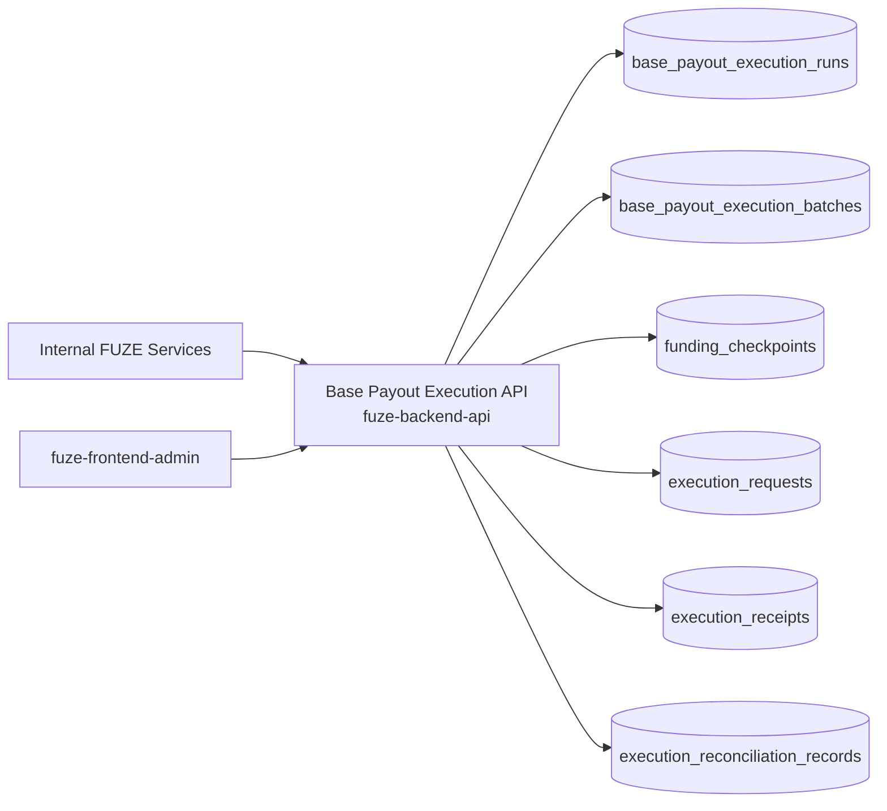
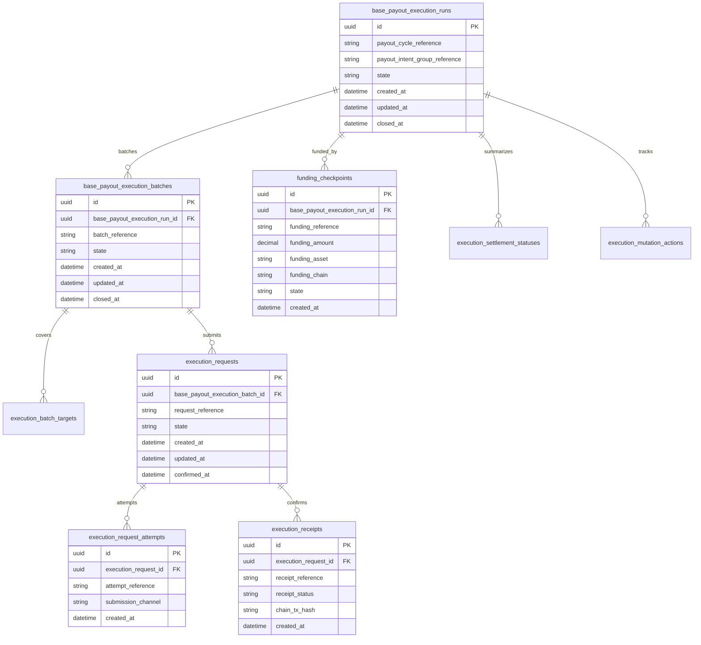
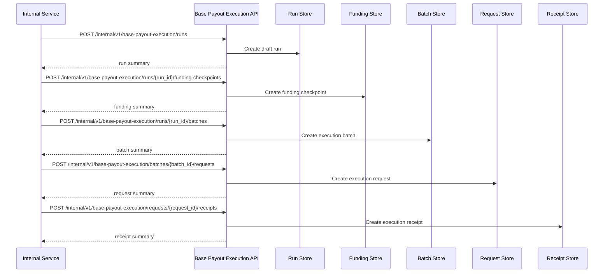

# BASE_PAYOUT_EXECUTION_API_SPEC

## 1. Title

**BASE_PAYOUT_EXECUTION_API_SPEC.md**

---

## 2. Document Metadata

- **Document Name:** BASE_PAYOUT_EXECUTION_API_SPEC.md
- **API Classification:** internal, admin, event-driven, chain-adjacent
- **Owning Domain:** Base Payout Execution Domain
- **Primary Implementing Repo:** `fuze-backend-api`
- **Primary Chain-Adjacent Dependency:** `fuze-contracts`
- **Primary System of Record:** payout execution runs, execution batches, funding checkpoints, execution requests, execution receipts, claimant settlement status references, execution reconciliation records, and correction-safe execution lineage in `fuze-backend-api`
- **Status:** Draft for canonical source-of-truth approval
- **Purpose:** Define the production-grade API contract architecture for FUZE Base payout execution preparation, execution orchestration, execution-state reconciliation, settlement-status recording, and controlled correction-safe lifecycle management across the platform
- **Canonical Folder:** `fuze.ac > docs > api-spec`

---

## 2.1 API Classification Header

- **API Classification:** internal | admin | event-driven | chain-adjacent
- **Owning Domain:** Base Payout Execution Domain
- **Primary Implementing Repo:** `fuze-backend-api`
- **Primary Chain-Adjacent Dependency:** `fuze-contracts`
- **Primary System of Record:** Base payout execution orchestration domain

---

## 3. Purpose

This document defines the canonical API specification for FUZE Base payout execution operations. It translates the governing FUZE platform architecture, Base payout execution rules, payout-ledger rules, snapshot and eligibility rules, profit participation rules, chain architecture, multisig and timelock constraints, treasury control rules, audit requirements, and API architecture rules into an implementation-ready API contract.

This API exists because FUZE stablecoin profit participation is executed through an explicit execution layer on Base or other approved payout rails. That execution layer must remain distinct from:

- Ethereum token-holder truth,
- off-chain eligibility determination,
- off-chain profit participation allocation records,
- payout-ledger cycle visibility,
- and treasury governance controls.

Execution therefore cannot be treated as a simple status flag on a payout cycle or as an uncontrolled direct contract call. It must be modeled through explicit execution runs, execution batches, funding checkpoints, execution requests, receipts, reconciliation records, and downstream claimant-settlement status references. The system must preserve strict separation between preparation, authorization, execution submission, receipt confirmation, final settlement posture, and correction/retry logic.

Accordingly, this specification defines how Base payout execution runs, execution batches, funding checkpoints, execution requests, receipts, reconciliation, and settlement-status linkage are represented, and how execution behavior remains auditable, idempotent, and architecture-consistent across FUZE.

---

## 4. Scope

This specification covers:

- internal APIs for Base payout execution-run creation and lifecycle management
- internal APIs for funding checkpoints, execution-batch creation, and execution-request submission coordination
- internal APIs for execution receipts, settlement-status linkage, and reconciliation updates
- internal read APIs for canonical execution truth
- admin/control-plane APIs for approve_for_submission, pause, retry, supersede, cancel_if_allowed, close, and discrepancy resolution
- event emission requirements for Base payout execution lifecycle changes
- request, response, error, idempotency, versioning, audit, and database-shape rules for this domain

This specification does **not** redefine:

- payout-ledger cycle semantics in full detail
- snapshot and eligibility calculation logic in full detail
- profit participation allocation semantics in full detail
- token contract behavior in full detail
- treasury multisig signing flows in full detail
- final public reporting schemas
- user-facing claimant portal UX
- low-level contract ABI implementation details

Those remain governed by their own source-of-truth specifications.

---

## 5. Source-of-Truth Inputs

### Primary FUZE docs and specs used

#### Highest-priority platform and ownership sources
- `SYSTEM_SPEC_INDEX.md`
- `DOCS_SPEC.md`
- `SYSTEM_BOUNDARY_AND_OWNERSHIP_SPEC.md`
- `SYSTEM_OVERVIEW_AND_BOUNDARIES_SPEC.md`
- `PLATFORM_ARCHITECTURE_SPEC.md`
- `DOMAIN_OWNERSHIP_MATRIX_SPEC.md`
- `DATA_MODEL_AND_ENTITY_OWNERSHIP_SPEC.md`
- `ONCHAIN_OFFCHAIN_RESPONSIBILITY_SPEC.md`

#### Primary payout / execution / control sources
- `BASE_PAYOUT_EXECUTION_LAYER_SPEC.md`
- `PAYOUT_LEDGER_SPEC.md`
- `PROFIT_PARTICIPATION_SYSTEM_SPEC.md`
- `SNAPSHOT_AND_ELIGIBILITY_PIPELINE_SPEC.md`
- `TREASURY_CONTROL_POLICY_SPEC.md`
- `VAULT_ACTION_POLICY_SPEC.md`
- `MULTISIG_AND_TIMELOCK_SPEC.md`
- `CHAIN_ARCHITECTURE_SPEC.md`
- `PUBLIC_CONTRACT_AND_WALLET_REGISTRY_SPEC.md`

#### Core docs inputs
- `FUZE_CHAIN_ARCHITECTURE.md`
- `STABLECOIN_PROFIT_PARTICIPATION.md`
- `TOKEN_CONTRACT_ARCHITECTURE_.md`
- `ALLOCATION_WALLET_MAP.md`
- tokenomics vault docs in `fuze.ac > docs/tokenomics/`

#### API and runtime sources
- `API_ARCHITECTURE_SPEC.md`
- `INTERNAL_SERVICE_API_SPEC.md`
- `EVENT_MODEL_AND_WEBHOOK_SPEC.md`
- `IDEMPOTENCY_AND_VERSIONING_SPEC.md`
- `MIGRATION_AND_BACKWARD_COMPATIBILITY_SPEC.md`
- `AUDIT_LOG_AND_ACTIVITY_SPEC.md`

#### Security and operations sources
- `SECURITY_AND_RISK_CONTROL_SPEC.md`
- `MONITORING_ALERTING_AND_INCIDENT_RESPONSE_SPEC.md`
- `SECRETS_CONFIG_AND_ENVIRONMENT_SPEC.md`

#### Format guides
- `The_API_Specification_guide.md`
- `Database_Schemas_Guide.md`

### Highest-priority interpretation applied

For this file, the most important governing interpretation is:

1. Base payout execution is a distinct execution and settlement-orchestration layer and must remain separate from profit participation allocations, payout-ledger summaries, Ethereum token balances, and Platform Credits
2. backend owns canonical execution-run, execution-batch, receipt, and reconciliation truth
3. downstream contract or chain submission must remain linked to approved upstream payout-cycle and allocation intent references
4. execution submission and execution confirmation must remain separate lifecycle steps
5. admin/control-plane may pause, retry, supersede, or cancel under controlled policy, but must preserve immutable lineage and treasury controls
6. execution success/failure must be explicit and must not silently mutate upstream allocation or visibility truth without explicit cross-domain reconciliation

### Supporting external standards used only as guidance

- HTTP semantics for internal mutation and status APIs
- structured problem-details error design
- general payout-execution orchestration, batch/receipt reconciliation, and correction-lineage patterns as supporting guidance

External guidance does not override FUZE source-of-truth documents.

---

## 6. Governing Architecture and Ownership Interpretation

This API belongs to the **Base Payout Execution Domain** because it owns the canonical lifecycle of:

- execution-run initialization,
- funding readiness checkpoints,
- execution-batch preparation,
- execution-request submission,
- receipt confirmation,
- settlement-status progression,
- and execution reconciliation.

This API is implemented primarily in `fuze-backend-api` because:

- backend owns durable execution orchestration truth
- execution batching, retry, pause, and reconciliation behavior must be centralized
- contract execution must be connected to off-chain controls and auditability
- multiple adjacent domains depend on the execution outcome while remaining separate
- public trust and internal operations require explicit off-chain execution records in addition to chain references

This API is **not** owned by:

- `fuze-frontend-webapp`, because frontend only consumes downstream bounded status views
- `fuze-frontend-admin`, because admin may approve or pause execution but must not own canonical execution truth
- `fuze-contracts`, because contracts own on-chain execution behavior, but orchestration and reconciliation truth remain in `fuze-backend-api`
- payout-ledger domain, because that domain records the structured cycle trust surface rather than execution orchestration truth
- profit participation domain, because that domain owns allocations and payout intents, not the actual Base execution lifecycle
- treasury domain, because treasury authority gates release/funding but does not own execution-run truth

### Architectural implications

- one payout cycle may produce one or more execution runs
- one execution run may produce one or more execution batches
- one execution batch may produce one or more execution requests or submission attempts
- one execution request may resolve into zero or more execution receipts depending on contract and chain behavior
- execution completion must remain explicit and tied to receipts and reconciliation
- retry, supersession, or cancellation must preserve old-to-new lineage rather than silently rewriting historical records

---

## 7. Domain Responsibilities

The Base Payout Execution API domain is responsible for:

1. maintaining canonical execution runs and execution batches
2. recording funding checkpoints and execution readiness posture
3. creating and tracking execution requests and execution receipts
4. recording settlement-status progression at execution-run and execution-batch level
5. linking execution truth back to payout-ledger and profit participation references
6. supporting admin approval, pause, retry, supersede, cancel_if_allowed, and close workflows
7. emitting execution lifecycle events
8. generating audit lineage for sensitive execution actions
9. preserving separation between allocation truth, payout-cycle truth, treasury authorization, and execution settlement truth
10. supporting correctness-sensitive reconciliation across off-chain and on-chain signals

The domain is not responsible for:

- defining upstream eligibility or allocation logic
- acting as the payout-ledger trust narrative layer
- defining treasury policy or multisig governance
- replacing raw contract or node infrastructure
- replacing final claimant-facing claim history tooling
- silently rewriting upstream payout-intent truth

---

## 8. Out of Scope

The following are out of scope for this API specification:

- raw smart-contract ABI detail
- node provider implementation specifics
- private key custody or signing workflows
- chain indexer internals
- final user claimant UI design
- external explorer integration specifics
- tax documentation flows
- final transparency report composition

Where later detailed specs are needed, they must remain compatible with this API.

---

## 9. Canonical Entities and Data Ownership

### Durable entities

#### 9.1 base_payout_execution_runs
- **Owner:** Base Payout Execution Domain
- **Purpose:** canonical execution-run records for one payout-cycle or payout-intent execution orchestration window
- **Nature:** source-of-truth durable entity

#### 9.2 base_payout_execution_batches
- **Owner:** Base Payout Execution Domain
- **Purpose:** batch-level grouping of execution targets and execution attempts
- **Nature:** source-of-truth durable entity

#### 9.3 execution_batch_targets
- **Owner:** Base Payout Execution Domain
- **Purpose:** references to covered payout intents, claimant groups, or execution segments for one batch
- **Nature:** source-of-truth durable lineage entity

#### 9.4 funding_checkpoints
- **Owner:** Base Payout Execution Domain
- **Purpose:** explicit records of funding readiness and funding-confirmation status prior to execution
- **Nature:** source-of-truth durable lineage entity

#### 9.5 execution_requests
- **Owner:** Base Payout Execution Domain
- **Purpose:** explicit submission-intent records for contract execution requests
- **Nature:** source-of-truth durable entity

#### 9.6 execution_request_attempts
- **Owner:** Base Payout Execution Domain
- **Purpose:** individual execution-submission attempts for one execution request
- **Nature:** source-of-truth durable lineage entity

#### 9.7 execution_receipts
- **Owner:** Base Payout Execution Domain
- **Purpose:** durable references to accepted or confirmed chain-execution receipts
- **Nature:** source-of-truth durable entity

#### 9.8 execution_settlement_statuses
- **Owner:** Base Payout Execution Domain
- **Purpose:** batch/run-level settlement-status summary records derived from request/receipt reconciliation
- **Nature:** source-of-truth durable aggregate entity

#### 9.9 execution_reconciliation_records
- **Owner:** Base Payout Execution Domain
- **Purpose:** validation and reconciliation records for off-chain submission state versus observed chain or contract state
- **Nature:** durable review/remediation entity

#### 9.10 execution_discrepancy_cases
- **Owner:** Base Payout Execution Domain
- **Purpose:** review and remediation records for failed, stale, duplicate, inconsistent, or misreported execution states
- **Nature:** durable review/remediation entity

#### 9.11 execution_mutation_actions
- **Owner:** Base Payout Execution Domain
- **Purpose:** high-level action records for create, approve_for_submission, submit, confirm, pause, retry, supersede, cancel_if_allowed, close, and resolve discrepancy
- **Nature:** durable action records with audit linkage

#### 9.12 execution_audit_events
- **Owner:** Audit / Activity domain, sourced by Base Payout Execution Domain
- **Purpose:** immutable trail for sensitive Base payout execution actions
- **Nature:** durable audit records

### Derived or cached entities

#### 9.13 execution_internal_status_views
- **Owner:** derived read-model layer
- **Purpose:** trusted execution-run and execution-batch operational summaries
- **Nature:** derived

#### 9.14 execution_cycle_projection_views
- **Owner:** derived read-model layer
- **Purpose:** bounded downstream projection views for payout-ledger or first-party surfaces
- **Nature:** derived

#### 9.15 execution_discrepancy_views
- **Owner:** derived ops read-model layer
- **Purpose:** visibility into failed, stale, or conflicting execution conditions
- **Nature:** derived

---

## 10. State Model and Lifecycle

### 10.1 execution run lifecycle

Possible states:

- `draft`
- `awaiting_funding`
- `ready_for_submission`
- `submitting`
- `partially_submitted`
- `submitted`
- `partially_confirmed`
- `confirmed`
- `paused`
- `failed`
- `closed`
- `superseded`
- `cancelled_if_allowed`

### 10.2 execution batch lifecycle

Possible states:

- `draft`
- `ready`
- `submitting`
- `submitted`
- `partially_confirmed`
- `confirmed`
- `failed`
- `paused`
- `superseded`
- `cancelled_if_allowed`

### 10.3 funding checkpoint lifecycle

Possible states:

- `pending`
- `verified`
- `insufficient`
- `invalidated`
- `superseded`

### 10.4 execution request lifecycle

Possible states:

- `created`
- `approved_for_submission`
- `submitted`
- `receipt_pending`
- `confirmed`
- `failed`
- `superseded`
- `cancelled_if_allowed`

### 10.5 discrepancy lifecycle

Possible states:

- `opened`
- `under_review`
- `resolved`
- `failed`
- `closed`

Lifecycle notes:
- funding readiness is a gate and not the same thing as submission
- submission and confirmation are separate lifecycle stages
- partial confirmation must remain explicit
- retries and supersession must preserve lineage rather than overwrite history

---

## 11. API Surface Overview

The API surface is divided into three families:

### 11.1 Internal service APIs
Used by trusted internal services for:
- creating execution runs and batches
- recording funding checkpoints
- creating execution requests
- recording execution attempts and receipts
- refreshing settlement-status summaries
- reading canonical execution truth

### 11.2 Admin / control-plane APIs
Used by `fuze-frontend-admin` through backend-only privileged routes for:
- approve_for_submission, pause, retry, supersede, cancel_if_allowed, close, and discrepancy actions
- reconciliation and status-repair workflows

### 11.3 Event-driven interfaces
Used for downstream side effects:
- payout-ledger projection updates
- first-party status refresh triggers
- audit generation
- anomaly detection and operational review
- reporting and transparency linkage triggers

No general unauthenticated public mutation surface exists for this domain.

---

## 12. Authentication and Authorization Model

### 12.1 Authentication posture by route family

#### Internal service routes
Require internal service identity with explicit least privilege:
- create execution runs and batches
- record funding readiness
- create and submit execution requests
- record receipts
- refresh reconciliation and settlement statuses
- read canonical truth

#### Admin routes
Require privileged operator identity plus reason-coded actions:
- approve_for_submission
- pause or retry runs/batches
- supersede/cancel_if_allowed
- close or resolve discrepancy cases

### 12.2 Authorization checkpoints

Authorization must evaluate:
- caller service identity
- allowed execution scope and linked payout-cycle context
- whether the caller has create/submit/confirm/reconcile privilege
- whether admin/operator role is present for privileged actions
- whether current run/batch/request state allows requested mutation

### 12.3 Sensitive action rules

The following require heightened checks:
- approve_for_submission
- submission or retry after failure
- pause or cancel_if_allowed
- manual receipt correction or reconciliation override
- discrepancy-resolution actions
- execution-state changes after downstream visibility has been published

---

## 13. API Endpoints / Interface Contracts

## 13.1 Internal Service APIs

### 13.1.1 `POST /internal/v1/base-payout-execution/runs`
**Purpose:** create draft Base payout execution run  
**Caller Type:** internal trusted service  
**Auth Expectation:** service-to-service identity only  
**Request Body Summary:**
- `payout_cycle_reference`
- optional `payout_intent_group_reference`
- optional `execution_profile`
- `idempotency_key`
**Response Summary:** execution-run summary
**Side Effects:** creates draft execution run
**Idempotency Behavior:** required
**Audit Requirements:** sensitive execution-run creation audit
**Emitted Events:** `base_payout_execution.run_created`

### 13.1.2 `POST /internal/v1/base-payout-execution/runs/{execution_run_id}/funding-checkpoints`
**Purpose:** record or refresh funding readiness checkpoint for one run  
**Caller Type:** internal trusted service  
**Request Body Summary:**
- `funding_reference`
- `funding_amount`
- `funding_asset`
- `funding_chain`
- `checkpoint_summary`
- `idempotency_key`
**Response Summary:** funding-checkpoint summary and updated run state
**Side Effects:** creates or supersedes funding checkpoint; may move run toward ready_for_submission
**Idempotency Behavior:** required
**Audit Requirements:** funding checkpoint audit
**Emitted Events:** `base_payout_execution.funding_verified`

### 13.1.3 `POST /internal/v1/base-payout-execution/runs/{execution_run_id}/batches`
**Purpose:** create execution batch within one run  
**Caller Type:** internal trusted service  
**Request Body Summary:**
- `batch_reference`
- `target_selection_criteria` or `target_ids[]`
- optional `batch_profile`
- `idempotency_key`
**Response Summary:** execution-batch summary
**Side Effects:** creates batch and target linkage
**Idempotency Behavior:** required
**Audit Requirements:** batch creation audit
**Emitted Events:** `base_payout_execution.batch_created`

### 13.1.4 `POST /internal/v1/base-payout-execution/batches/{execution_batch_id}/requests`
**Purpose:** create execution request for one batch  
**Caller Type:** internal trusted service  
**Request Body Summary:**
- `request_reference`
- optional `submission_payload_summary`
- `idempotency_key`
**Response Summary:** execution-request summary
**Side Effects:** creates execution request and request-attempt lineage scaffold
**Idempotency Behavior:** required
**Audit Requirements:** execution-request creation audit
**Emitted Events:** `base_payout_execution.request_created`

### 13.1.5 `POST /internal/v1/base-payout-execution/requests/{execution_request_id}/attempts`
**Purpose:** record submission attempt for one execution request  
**Caller Type:** internal trusted service  
**Request Body Summary:**
- `attempt_reference`
- optional `submission_channel`
- optional `attempt_summary`
- `idempotency_key`
**Response Summary:** execution-attempt summary and updated request state
**Side Effects:** creates execution request attempt; may move request or batch into submitting/submitted state
**Idempotency Behavior:** required
**Audit Requirements:** attempt recording audit
**Emitted Events:** `base_payout_execution.request_submitted`

### 13.1.6 `POST /internal/v1/base-payout-execution/requests/{execution_request_id}/receipts`
**Purpose:** record chain or contract receipt for one execution request  
**Caller Type:** internal trusted service  
**Request Body Summary:**
- `receipt_reference`
- `receipt_status`
- optional `chain_tx_hash`
- optional `receipt_summary`
- `idempotency_key`
**Response Summary:** execution-receipt summary and updated request/batch/run states
**Side Effects:** creates receipt; may move request/batch/run into partially_confirmed or confirmed state
**Idempotency Behavior:** required
**Audit Requirements:** receipt recording audit
**Emitted Events:** `base_payout_execution.receipt_recorded`

### 13.1.7 `POST /internal/v1/base-payout-execution/runs/{execution_run_id}/reconciliation`
**Purpose:** refresh reconciliation and settlement-status aggregates for one run  
**Caller Type:** internal trusted service  
**Request Body Summary:**
- optional `reconciliation_profile`
- `idempotency_key`
**Response Summary:** reconciliation summary and updated settlement-status summaries
**Side Effects:** creates reconciliation record and supersedes prior aggregate status where needed
**Idempotency Behavior:** required
**Audit Requirements:** reconciliation audit
**Emitted Events:** `base_payout_execution.reconciled`

### 13.1.8 `GET /internal/v1/base-payout-execution/runs/{execution_run_id}`
**Purpose:** retrieve canonical Base payout execution truth  
**Caller Type:** internal trusted service  
**Response Summary:** full execution run, batches, targets, funding checkpoints, requests, attempts, receipts, reconciliation, and discrepancy lineage
**Side Effects:** none

## 13.2 Admin / Control-Plane APIs

### 13.2.1 `POST /admin/v1/base-payout-execution/runs/{execution_run_id}/approve-for-submission`
**Purpose:** approve one execution run for submission under controlled policy  
**Caller Type:** admin/operator  
**Request Body Summary:**
- `reason_code`
- `operator_note`
- `idempotency_key`
**Response Summary:** approved-for-submission run summary
**Side Effects:** run moves to ready_for_submission if policy checks pass
**Audit Requirements:** critical audit
**Emitted Events:** `base_payout_execution.run_approved_for_submission`

### 13.2.2 `POST /admin/v1/base-payout-execution/runs/{execution_run_id}/pause`
**Purpose:** pause one execution run under controlled policy  
**Caller Type:** admin/operator  
**Request Body Summary:**
- `reason_code`
- `operator_note`
- `idempotency_key`
**Response Summary:** paused run summary
**Side Effects:** run and/or active batches move to paused state as allowed by policy
**Audit Requirements:** critical audit
**Emitted Events:** `base_payout_execution.run_paused`

### 13.2.3 `POST /admin/v1/base-payout-execution/runs/{execution_run_id}/retry`
**Purpose:** retry failed or paused execution run under controlled policy  
**Caller Type:** admin/operator  
**Request Body Summary:**
- `retry_profile`
- `reason_code`
- `operator_note`
- `idempotency_key`
**Response Summary:** retry summary and updated run state
**Side Effects:** may create superseding batches, requests, or attempts with preserved lineage
**Audit Requirements:** critical audit
**Emitted Events:** `base_payout_execution.run_retried`

### 13.2.4 `POST /admin/v1/base-payout-execution/runs/{execution_run_id}/supersede`
**Purpose:** supersede one execution run with a replacement run under controlled policy  
**Caller Type:** admin/operator  
**Request Body Summary:**
- `replacement_execution_run_id`
- `reason_code`
- `operator_note`
- `idempotency_key`
**Response Summary:** supersession summary
**Side Effects:** creates old-to-new supersession linkage and updates current execution preference
**Audit Requirements:** critical audit
**Emitted Events:** `base_payout_execution.run_superseded`

### 13.2.5 `POST /admin/v1/base-payout-execution/runs/{execution_run_id}/cancel`
**Purpose:** cancel one execution run if current lifecycle and policy allow  
**Caller Type:** admin/operator  
**Request Body Summary:**
- `cancellation_reason_code`
- `operator_note`
- `idempotency_key`
**Response Summary:** cancelled run summary
**Side Effects:** run moves to cancelled_if_allowed if state and policy allow
**Audit Requirements:** critical audit
**Emitted Events:** `base_payout_execution.run_cancelled`

### 13.2.6 `POST /admin/v1/base-payout-execution/discrepancies`
**Purpose:** resolve Base payout execution discrepancy under controlled policy  
**Caller Type:** admin/operator  
**Request Body Summary:**
- `target_reference_type`
- `target_reference_id`
- `resolution_code`
- `operator_note`
- `related_case_id`
- `idempotency_key`
**Response Summary:** discrepancy-resolution summary
**Side Effects:** may retry, supersede, close, pause, or reconcile execution posture with preserved lineage
**Audit Requirements:** critical audit
**Emitted Events:** `base_payout_execution.discrepancy_resolved`

---

## 14. Request Rules

### 14.1 General request rules
- all mutation-capable routes must require JSON requests with explicit content type
- all mutation routes must carry correlation IDs
- sensitive Base payout execution mutations must carry idempotency keys
- admin mutations must require reason codes and operator notes
- no route may accept frontend-authored execution truth as authoritative input

### 14.2 Sensitive-action request requirements
The following requests require heightened validation:
- funding-readiness confirmation
- batch and execution-request creation
- request submission recording
- receipt recording
- approval for submission
- retry, pause, cancel_if_allowed, supersede, and discrepancy-resolution actions

Heightened validation may include:
- payout-cycle and payout-intent integrity checks
- funding checkpoint validation
- duplicate-request and duplicate-receipt checks
- execution-run state checks
- operator role confirmation
- governance/finance/security case linkage for sensitive actions

### 14.3 Scope integrity rule
Base payout execution mutations must target valid and authorized runs, batches, requests, receipts, and discrepancy records. Services and operators must not mutate unrelated or unauthorized execution state.

### 14.4 Layer-separation rule
Execution-run, batch, request, receipt, and reconciliation state must remain explicitly separated. Approval or submission readiness must not be conflated with receipt-confirmed or economically final settlement.

---

## 15. Response Rules

### 15.1 Success response rules
Successful responses must include:
- stable resource identifiers
- timestamps for created/updated state
- state/status values
- run, batch, request, or receipt summaries where relevant
- funding or settlement-status summaries where relevant
- correlation references for mutations

### 15.2 Async-accepted response rules
If reconciliation, retry orchestration, or discrepancy remediation is async, the response must:
- return accepted status
- include action or job ID
- provide follow-up status semantics

### 15.3 Terminal mutation response rules
Terminal mutation responses must clearly show:
- target run, batch, request, receipt, or discrepancy
- mutation type
- resulting state
- retry, pause, supersession, or cancellation effects where relevant
- whether downstream payout-ledger or first-party status views may refresh asynchronously

### 15.4 Read response rules
Read responses must distinguish:
- canonical internal execution truth
- execution submission state
- receipt-confirmed state
- downstream projection references rather than implying upstream or public closure automatically

---

## 16. Error Model

The API uses structured problem-details style error responses.

### 16.1 Required error fields
- `type`
- `title`
- `status`
- `code`
- `detail`
- `instance`
- `correlation_id`

### 16.2 Common error codes

#### Authorization / permission errors
- `BASE_PAYOUT_EXECUTION_PERMISSION_DENIED`
- `BASE_PAYOUT_EXECUTION_OPERATOR_PERMISSION_DENIED`
- `BASE_PAYOUT_EXECUTION_SERVICE_PERMISSION_DENIED`

#### State conflict errors
- `BASE_PAYOUT_EXECUTION_RUN_STATE_INVALID`
- `BASE_PAYOUT_EXECUTION_BATCH_STATE_INVALID`
- `BASE_PAYOUT_EXECUTION_REQUEST_STATE_INVALID`
- `BASE_PAYOUT_EXECUTION_RECEIPT_STATE_INVALID`
- `BASE_PAYOUT_EXECUTION_RETRY_CONFLICT`

#### Policy / safety errors
- `BASE_PAYOUT_EXECUTION_FUNDING_REQUIRED`
- `BASE_PAYOUT_EXECUTION_APPROVAL_REQUIRED`
- `BASE_PAYOUT_EXECUTION_DUPLICATE_REQUEST`
- `BASE_PAYOUT_EXECUTION_DUPLICATE_RECEIPT`
- `BASE_PAYOUT_EXECUTION_CANCELLATION_NOT_ALLOWED`

#### Request integrity errors
- `BASE_PAYOUT_EXECUTION_IDEMPOTENCY_KEY_REQUIRED`
- `BASE_PAYOUT_EXECUTION_REQUEST_INVALID`
- `BASE_PAYOUT_EXECUTION_REQUEST_UNPROCESSABLE`

#### Dependency or provider errors
- `BASE_PAYOUT_EXECUTION_CHAIN_UNAVAILABLE`
- `BASE_PAYOUT_EXECUTION_STORAGE_UNAVAILABLE`
- `BASE_PAYOUT_EXECUTION_RECONCILIATION_UNAVAILABLE`

### 16.3 Error handling rules
- do not expose hidden internal treasury/security detail in low-privilege contexts
- do not imply completed settlement from approved_for_submission or submitted state alone
- distinguish funding-required from generic invalid state
- distinguish duplicate-request or duplicate-receipt from generic replay
- include retry guidance only where safe

---

## 17. Idempotency and Mutation Safety

### 17.1 Required idempotent mutations
The following mutation routes require idempotent behavior:
- execution-run creation
- funding-checkpoint recording
- batch creation
- execution-request creation
- request-attempt recording
- receipt recording
- reconciliation refresh
- approve_for_submission
- pause
- retry
- supersede
- cancel_if_allowed
- discrepancy resolution

### 17.2 Idempotency key rules
- mutation requests must supply `Idempotency-Key`
- backend stores key scope, request hash, actor, and terminal result
- replay of same semantic request returns original terminal outcome
- replay of same key with different semantic request must fail with conflict

### 17.3 Mutation safety rules
- one canonical active execution run per current execution lineage unless explicit supersession exists
- funding, request, attempt, and receipt lineage must remain referentially consistent
- retries must preserve prior failed or paused lineage
- receipt recording must not duplicate effective settlement confirmation
- cancellation and pause actions must preserve immutable history rather than rewrite prior records

---

## 18. Versioning and Compatibility Rules

### 18.1 Versioning
This API family is versioned under `/internal/v1` and `/admin/v1` route families.

### 18.2 Compatibility approach
- additive evolution preferred
- no silent semantic change to ready_for_submission, submitted, partially_confirmed, confirmed, paused, failed, closed, or superseded states
- new execution-reference or submission-channel types may be added without breaking existing contracts
- response fields may be added but existing meanings must remain stable

### 18.3 Breaking-change rules
Breaking changes include:
- changing the meaning of submission versus receipt confirmation
- changing run/batch/request lifecycle semantics incompatibly
- removing critical funding, receipt, or reconciliation fields
- changing retry or supersession semantics incompatibly

Such changes require explicit migration planning and version evolution.

### 18.4 Deprecation
Deprecated routes or fields must:
- be documented explicitly
- carry deprecation metadata where supported
- preserve compatibility windows long enough for internal consumers

---

## 19. Event Emission and Webhook Behavior

This domain is event-capable.

### 19.1 Internal events
The Base Payout Execution domain must emit canonical internal events such as:
- `base_payout_execution.run_created`
- `base_payout_execution.funding_verified`
- `base_payout_execution.batch_created`
- `base_payout_execution.request_created`
- `base_payout_execution.request_submitted`
- `base_payout_execution.receipt_recorded`
- `base_payout_execution.reconciled`
- `base_payout_execution.run_approved_for_submission`
- `base_payout_execution.run_paused`
- `base_payout_execution.run_retried`
- `base_payout_execution.run_superseded`
- `base_payout_execution.run_cancelled`
- `base_payout_execution.discrepancy_resolved`

### 19.2 Event payload minimums
Each event should contain:
- event ID
- event type
- occurred_at
- execution run or batch reference
- request or receipt reference where relevant
- funding reference where relevant
- actor type
- correlation ID
- reason code where applicable

### 19.3 External webhook posture
This specification does not expose general third-party outbound Base payout execution webhooks by default. Any future outbound execution-status webhook surface must be narrow, security-reviewed, and governed by a separate contract.

---

## 20. Audit and Activity Requirements

The following actions must generate durable audit events:

- execution-run creation
- funding checkpoint verification
- request submission and receipt recording for sensitive runs
- approval for submission
- pause, retry, supersede, cancel_if_allowed, and discrepancy-resolution actions
- other sensitive Base payout execution mutations

### Required audit fields
- audit event ID
- actor type and actor reference
- target run / batch / request / receipt / discrepancy reference as applicable
- action type
- before/after summary where applicable
- reason code
- correlation ID
- operator note if operator action
- occurred_at

Public-facing activity may show selected execution-derived milestones only through other bounded surfaces, but canonical internal audit truth remains durable and immutable.

---

## 21. Data Model and Database Schema View

### 21.1 `base_payout_execution_runs`
- `id` PK
- `payout_cycle_reference`
- `payout_intent_group_reference` nullable
- `execution_profile_json` nullable
- `state`
- `created_at`
- `updated_at`
- `closed_at` nullable

**Constraints:**
- index on `state`

### 21.2 `base_payout_execution_batches`
- `id` PK
- `base_payout_execution_run_id` FK -> `base_payout_execution_runs.id`
- `batch_reference`
- `state`
- `created_at`
- `updated_at`
- `closed_at` nullable

**Constraints:**
- unique (`base_payout_execution_run_id`, `batch_reference`)
- index on `state`

### 21.3 `execution_batch_targets`
- `id` PK
- `base_payout_execution_batch_id` FK -> `base_payout_execution_batches.id`
- `target_reference_type`
- `target_reference_id`
- `created_at`

**Constraints:**
- unique (`base_payout_execution_batch_id`, `target_reference_type`, `target_reference_id`)
- index on `base_payout_execution_batch_id`

### 21.4 `funding_checkpoints`
- `id` PK
- `base_payout_execution_run_id` FK -> `base_payout_execution_runs.id`
- `funding_reference`
- `funding_amount`
- `funding_asset`
- `funding_chain`
- `checkpoint_summary_json`
- `state`
- `created_at`

**Constraints:**
- index on `base_payout_execution_run_id`
- index on `state`

### 21.5 `execution_requests`
- `id` PK
- `base_payout_execution_batch_id` FK -> `base_payout_execution_batches.id`
- `request_reference`
- `submission_payload_summary_json`
- `state`
- `created_at`
- `updated_at`
- `confirmed_at` nullable
- `failed_at` nullable

**Constraints:**
- unique (`base_payout_execution_batch_id`, `request_reference`)
- index on `state`

### 21.6 `execution_request_attempts`
- `id` PK
- `execution_request_id` FK -> `execution_requests.id`
- `attempt_reference`
- `submission_channel`
- `attempt_summary_json`
- `created_at`

**Constraints:**
- unique (`execution_request_id`, `attempt_reference`)
- index on `execution_request_id`

### 21.7 `execution_receipts`
- `id` PK
- `execution_request_id` FK -> `execution_requests.id`
- `receipt_reference`
- `receipt_status`
- `chain_tx_hash` nullable
- `receipt_summary_json`
- `created_at`

**Constraints:**
- unique (`execution_request_id`, `receipt_reference`)
- index on `execution_request_id`

### 21.8 `execution_settlement_statuses`
- `id` PK
- `base_payout_execution_run_id` FK -> `base_payout_execution_runs.id`
- `scope_type`
- `scope_reference`
- `settlement_state`
- `summary_json`
- `created_at`

**Constraints:**
- index on `base_payout_execution_run_id`
- index on `settlement_state`

### 21.9 `execution_reconciliation_records`
- `id` PK
- `base_payout_execution_run_id` FK -> `base_payout_execution_runs.id`
- `state`
- `reconciliation_summary_json`
- `created_at`
- `closed_at` nullable

### 21.10 `execution_discrepancy_cases`
- `id` PK
- `target_reference_type`
- `target_reference_id`
- `state`
- `resolution_code` nullable
- `created_at`
- `updated_at`
- `closed_at` nullable

### 21.11 `execution_mutation_actions`
- `id` PK
- `target_reference_type`
- `target_reference_id`
- `action_type`
- `state`
- `reason_code`
- `operator_note` nullable
- `requested_by_actor_type`
- `requested_by_actor_id`
- `created_at`
- `executed_at` nullable
- `closed_at` nullable
- `correlation_id`

### 21.12 `idempotency_records`
- `id` PK
- `idempotency_key`
- `scope_family`
- `actor_reference`
- `request_hash`
- `response_hash`
- `terminal_status`
- `created_at`
- `expires_at`

### 21.13 `audit_log_entries`
Domain-sourced audit records written into the audit domain.

### Normalization notes
- canonical Base payout execution truth stays in runs, batches, targets, funding checkpoints, execution requests, attempts, receipts, settlement statuses, and discrepancy records
- upstream payout-cycle and payout-intent truth remain external and referenced
- downstream first-party or public status surfaces must derive from canonical execution truth through controlled projections
- confirmation/receipt truth remains separate from higher-level public cycle-status truth

### Reconciliation notes
- one active execution run should reconcile to one current execution lineage under current preference
- funding checkpoints must reconcile to execution readiness
- requests, attempts, and receipts must reconcile to batch and run statuses
- discrepancy cases must preserve review lineage for failed or conflicting execution conditions

---

## 22. Architecture Diagram — Mermaid flowchart



---

## 23. Data Design — Mermaid Diagram



---

## 24. Flow View

### 24.1 Happy path — run to confirmed execution
1. internal service creates draft execution run
2. funding checkpoint is verified
3. execution batches are created for covered targets
4. execution requests are created and approved for submission
5. submission attempts are recorded
6. receipts are recorded from Base execution layer
7. reconciliation refresh confirms aggregate settlement posture
8. downstream payout-ledger or first-party-safe projections refresh

### 24.2 Happy path — partial confirmation
1. execution run contains multiple batches or requests
2. some requests receive receipts while others remain pending
3. run and batch states move to partially_confirmed
4. operational summaries clearly distinguish partial from completed state
5. retry or later confirmation may follow

### 24.3 Alternate path — pause and retry
1. run is paused due to anomaly, chain issue, or control-plane intervention
2. admin records pause reason
3. later retry action creates new attempts or superseding lineage
4. prior history remains preserved
5. run eventually confirms or closes with explicit lineage

### 24.4 Failure path — invalid funding or duplicate submission
1. run or request submission is attempted
2. backend detects missing funding readiness, invalid state, or duplicate request/receipt condition
3. request is rejected
4. no effective duplicate execution state is created

### 24.5 Failure and remediation path — reconciliation conflict
1. off-chain submission state and observed receipt state diverge
2. admin opens discrepancy-resolution flow
3. backend preserves prior lineage
4. reconciliation record is refreshed and run/batch/request states are corrected or superseded
5. discrepancy closes with preserved history

### 24.6 Close path
1. all relevant batches reach terminal state or policy requires administrative closure
2. execution run is closed
3. downstream projections may consume closed posture
4. historical lineage remains queryable for audit and reporting

### 24.7 Retry behavior
- duplicate run creation returns same canonical execution run result
- duplicate funding-checkpoint creation returns same lineage result where applicable
- duplicate request, attempt, or receipt creation returns same canonical result or duplicate-safe conflict
- duplicate approve/pause/retry/supersede/cancel/discrepancy actions return same terminal action result

---

## 25. Data Flows — Mermaid sequenceDiagram



---

## 26. Security and Risk Controls

1. **Execution truth is backend-owned**  
   Frontends and informal operational surfaces may not authoritatively define Base payout execution truth.

2. **Layer separation is mandatory**  
   The API must keep execution orchestration separate from payout-ledger visibility, upstream allocation truth, and treasury policy truth.

3. **Funding-before-submission**  
   Execution submission must require explicit funding-readiness confirmation according to policy.

4. **Submission is not confirmation**  
   The API must preserve explicit distinction between approved/submitted state and receipt-confirmed state.

5. **Least privilege**  
   Internal write and admin approval/pause/retry routes must be limited to authorized services and operators.

6. **Immutable lineage for execution changes**  
   Retries, pauses, supersession, cancellations, and discrepancy resolution must preserve historical lineage rather than erase prior execution state.

7. **Problem-details discipline**  
   Error bodies must be structured and safe, without exposing hidden internal-only details.

8. **Audit immutability**  
   Sensitive Base payout execution actions require durable immutable audit lineage.

9. **Replay resistance**  
   Run, batch, request, attempt, receipt, and discrepancy actions must be idempotent and replay-safe.

10. **Receipt integrity**  
    Receipt recording must not overstate settlement finality beyond what the configured execution and reconciliation rules support.

---

## 27. Operational Considerations

- execution-run and execution-batch status reads for trusted operators should be highly available
- request submission, receipt recording, and reconciliation are correctness-sensitive and must preserve run integrity
- stale receipt states, failed submissions, and duplicate confirmation anomalies should surface clearly to ops views
- retry and pause workflows should be observable and policy-governed
- monitoring should alert on:
  - missing funding checkpoints for ready runs
  - duplicate request or receipt anomalies
  - stale receipt-pending requests
  - unusual retry, pause, or cancellation volume
  - reconciliation drift between off-chain and chain-observed state
  - downstream projection inconsistency versus canonical execution state

---

## 28. Acceptance Criteria

1. The API preserves the distinction between Base payout execution truth, payout-ledger cycle truth, snapshot/eligibility truth, and profit participation allocation truth.
2. Only `fuze-backend-api` owns canonical execution-run, batch, request, receipt, and reconciliation truth.
3. Execution runs, batches, targets, funding checkpoints, requests, attempts, receipts, and discrepancy records are durable and backend-owned.
4. Submission and receipt confirmation remain explicitly separated lifecycle states.
5. Funding readiness is enforced before submission according to policy.
6. Pause, retry, cancellation, correction, and supersession preserve immutable lineage.
7. Execution, receipt, reconciliation, and discrepancy actions are idempotent and auditable.
8. Internal and admin Base payout execution routes are least-privilege and backend-only.
9. Admin routes require reason-coded privileged authorization.
10. Event emissions exist for major Base payout execution mutations.
11. Response and error semantics are stable and machine-readable.
12. Database schema separates runs, batches, targets, funding checkpoints, requests, attempts, receipts, settlement statuses, and discrepancy layers.
13. Downstream systems can consume canonical execution outputs without redefining execution truth.
14. Discrepancy handling is supported and safely replayable.
15. Mermaid diagrams remain consistent with prose and data model.

---

## 29. Test Cases

### 29.1 Positive cases
1. Internal service creates draft execution run successfully.
2. Internal service records funding checkpoint successfully.
3. Internal service creates execution batch successfully.
4. Internal service creates execution request successfully.
5. Internal service records execution attempt successfully.
6. Internal service records execution receipt successfully.
7. Admin approves run for submission successfully.
8. Admin retries paused or failed run successfully.

### 29.2 Negative cases
9. Unauthorized service cannot create or mutate Base payout execution state.
10. Submission without funding readiness returns `BASE_PAYOUT_EXECUTION_FUNDING_REQUIRED`.
11. Retry on incompatible run state returns `BASE_PAYOUT_EXECUTION_RETRY_CONFLICT`.
12. Duplicate request creation returns `BASE_PAYOUT_EXECUTION_DUPLICATE_REQUEST`.
13. Duplicate receipt creation returns `BASE_PAYOUT_EXECUTION_DUPLICATE_RECEIPT`.
14. Cancellation on ineligible run state returns `BASE_PAYOUT_EXECUTION_CANCELLATION_NOT_ALLOWED`.

### 29.3 Authorization cases
15. Ordinary user cannot call Base payout execution admin APIs.
16. Internal service without submission privilege cannot create request attempts.
17. Operator without approval privilege cannot approve run for submission.
18. Submitted request does not imply confirmed settlement or public cycle closure.

### 29.4 Idempotency and replay cases
19. Repeating run creation with same idempotency key returns original draft run result.
20. Repeating funding-checkpoint creation with same idempotency key returns original checkpoint result.
21. Repeating receipt creation with same idempotency key returns original receipt result.
22. Repeating retry or discrepancy resolution with same idempotency key returns original terminal action result.

### 29.5 Concurrency cases
23. Concurrent request creation attempts preserve one canonical request lineage and one duplicate-safe outcome where appropriate.
24. Concurrent receipt recordings for same request preserve one effective confirmation lineage with duplicate-safe behavior.
25. Concurrent pause and retry actions preserve explicit lifecycle ordering without hidden overwrite.

### 29.6 Recovery / admin cases
26. Failed execution run can be retried under controlled policy with explicit superseding lineage.
27. Reconciliation drift can be corrected under controlled policy with preserved history.
28. Discrepancy resolution closes request/receipt conflict with preserved audit history.

### 29.7 Event and audit cases
29. Successful run creation emits `base_payout_execution.run_created`.
30. Successful funding checkpoint emits `base_payout_execution.funding_verified`.
31. Successful request submission emits `base_payout_execution.request_submitted`.
32. Successful receipt recording emits `base_payout_execution.receipt_recorded`.
33. Successful discrepancy resolution emits `base_payout_execution.discrepancy_resolved` with critical audit lineage.

---

## 30. Open Questions or Explicit Deferred Decisions

1. Exact batch-sizing and segmentation strategy for large execution runs is deferred.
2. Exact receipt-finality thresholds and confirmation policy are deferred.
3. Exact submission-channel taxonomy is deferred.
4. Exact cancellation policy after partial confirmation is deferred.
5. Exact downstream-projection contract between execution domain and payout-ledger domain is deferred.
6. Exact discrepancy taxonomy for execution/request/receipt conflicts is deferred.

---

## 31. Implementation Notes for `fuze-backend-api`

Recommended backend module layout:

```text
modules/platform/
  base-payout-execution/
  payout-ledger/
  profit-participation/
  snapshot-eligibility/
  audit-log/
  control-plane/
  integrations/
```

Implementation guidance:
- keep run identity, funding readiness, batch construction, request/attempt/receipt lineage, and reconciliation handling in one canonical domain service
- perform funding-integrity, duplicate-request, duplicate-receipt, and state-transition checks inside the commit boundary
- keep approve_for_submission, pause, retry, supersede, cancel_if_allowed, and discrepancy actions explicit and idempotent
- treat admin remediations as domain actions, not ad hoc row edits
- emit events only after canonical state commit succeeds
- publish downstream projection views from canonical execution truth; do not let derived views mutate execution state

---

## 32. Frontend Consumption Notes

### For `fuze-frontend-webapp`
- no direct public or end-user mutation surface is expected from this domain
- first-party or public status surfaces should consume bounded downstream projections rather than raw execution state directly
- frontend must not infer confirmed settlement from submitted or pending execution statuses alone

### For `fuze-frontend-admin`
- may trigger privileged approve_for_submission, pause, retry, supersede, cancel_if_allowed, and discrepancy actions only through backend admin APIs
- must require operator reason input for sensitive mutations
- must not directly mutate canonical Base payout execution truth client-side
- should present immutable execution lineage and receipt history separately from current operational status summaries

---

## 33. Contract Derivation Notes

### OpenAPI / AsyncAPI
This spec should later derive into:
- internal run, funding, batch, request, attempt, receipt, and reconciliation operations
- admin approve_for_submission / pause / retry / supersede / cancel / discrepancy operations
- shared problem-details schema
- Base payout execution lifecycle events in AsyncAPI

### Future `fuze-sdk`
Future `fuze-sdk` packages are unlikely to expose raw Base payout execution mutation surfaces publicly. Any internal tooling helpers derived from this contract must remain secondary artifacts and must not become the source of truth over this narrative specification.
