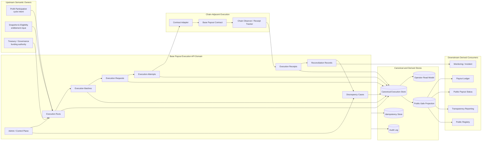
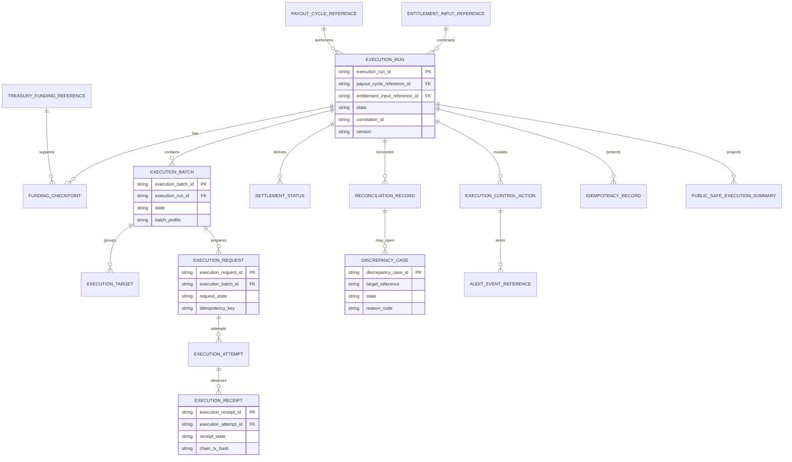
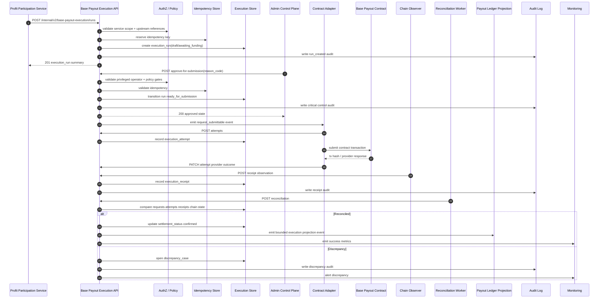

# FUZE Base Payout Execution Layer API Specification

## Document Metadata

- **Document Name:** `BASE_PAYOUT_EXECUTION_LAYER_API_SPEC.md`
- **Document Type:** Production-grade API SPEC v2 interface-contract specification
- **Status:** Draft canonical API SPEC v2
- **Version:** 2.0.0
- **Effective Date:** 2026-04-25
- **Last Updated:** 2026-04-25
- **Reviewed On:** 2026-04-25
- **Document Owner:** FUZE Base Payout Execution Domain; named individual owner not yet specified
- **Approval Authority:** FUZE Platform Architecture and Governance Authority; explicit approval workflow not yet specified in retrieved governing materials
- **Review Cadence:** Quarterly and whenever payout execution architecture, Base contract posture, entitlement-input format, treasury-control policy, payout-ledger posture, public-status posture, security posture, or migration posture materially changes
- **Governing Layer:** API contract layer for chain-adjacent execution orchestration, Base settlement coordination, payout execution control, and execution reconciliation
- **Parent Registry:** API SPEC v2 Canonical File Registry
- **Upstream Semantic Registry:** `REFINED_SYSTEM_SPEC_INDEX.md`
- **Upstream API Registry:** `API_SPEC_INDEX.md`
- **Primary Audience:** Backend engineering, API engineering, contracts engineering, treasury/governance operators, security engineering, audit/compliance, runtime operations, public-status/reporting authors, OpenAPI/AsyncAPI/SDK authors, implementation-contract authors
- **Primary Purpose:** Define the canonical FUZE API contract for creating, preparing, authorizing, submitting, confirming, reconciling, correcting, projecting, and auditing Base payout execution runs without redefining profit-participation, eligibility, treasury, payout-ledger, or public reporting semantics
- **Primary Upstream References:** `BASE_PAYOUT_EXECUTION_LAYER_SPEC.md`; `BASE_PAYOUT_EXECUTION_API_SPEC.md`; `PROFIT_PARTICIPATION_SYSTEM_SPEC.md`; `SNAPSHOT_AND_ELIGIBILITY_PIPELINE_SPEC.md`; `PAYOUT_LEDGER_SPEC.md`; `ONCHAIN_OFFCHAIN_RESPONSIBILITY_SPEC.md`; `CHAIN_ARCHITECTURE_SPEC.md`; `TREASURY_CONTROL_POLICY_SPEC.md`; `VAULT_ACTION_POLICY_SPEC.md`; `MULTISIG_AND_TIMELOCK_SPEC.md`; `PUBLIC_CONTRACT_AND_WALLET_REGISTRY_SPEC.md`; `TRANSPARENCY_MODEL_SPEC.md`; `TRANSPARENCY_REPORTING_SPEC.md`; `API_ARCHITECTURE_SPEC.md`; `INTERNAL_SERVICE_API_SPEC.md`; `PUBLIC_API_SPEC.md`; `EVENT_MODEL_AND_WEBHOOK_SPEC.md`; `IDEMPOTENCY_AND_VERSIONING_SPEC.md`; `MIGRATION_AND_BACKWARD_COMPATIBILITY_SPEC.md`; `AUDIT_LOG_AND_ACTIVITY_SPEC.md`; `SECURITY_AND_RISK_CONTROL_SPEC.md`; `MONITORING_ALERTING_AND_INCIDENT_RESPONSE_SPEC.md`; `BUSINESS_CONTINUITY_AND_RECOVERY_SPEC.md`; `FUZE_ACCOUNT_ACCESS_AND_SESSION_THESIS_FINAL_SPEC.md`; `FUZE_ACCOUNT_ACCESS_AND_SESSION_CANONICAL_FINAL_SPEC.md`; `FUZE_WORKSPACE_ACCESS_CONTROL_BASICS_THESIS_FINAL_SPEC.md`
- **Primary Downstream Dependents:** Base payout execution services; execution-run APIs; batch-builder services; contract adapters; chain-submission workers; receipt trackers; reconciliation jobs; discrepancy remediation workflows; payout-ledger projection consumers; public payout-status projection consumers; transparency reporting consumers; registry linkage consumers; audit-log pipelines; monitoring and incident workflows; OpenAPI/AsyncAPI/SDK artifacts; implementation-contract specs
- **API Surface Families Covered:** Internal service APIs; admin/control-plane APIs; event/async APIs; reporting/projection feeds; chain-adjacent adapter-facing APIs; first-party read APIs for operator and internal status; bounded public-read projection dependencies
- **API Surface Families Excluded:** Unauthenticated public mutation APIs; direct claimant UX APIs; raw smart-contract ABI; private key custody APIs; treasury multisig signing ceremony APIs; accounting book APIs; snapshot construction APIs; payout-ledger authoring APIs; transparency report composition APIs; Base Platform Credits APIs
- **Canonical System Owner(s):** FUZE Base Payout Execution Domain for execution orchestration truth; Base contract layer for chain-committed execution facts; Profit Participation Domain for payout-cycle semantic truth; Snapshot and Eligibility Domain for entitlement-input truth; Treasury/Governance Domains for funding/control authority; Payout Ledger Domain for structured cycle-record truth; Audit Domain for immutable audit truth
- **Canonical API Owner:** FUZE Base Payout Execution API Owner; named individual owner not yet specified
- **Supersedes:** `BASE_PAYOUT_EXECUTION_API_SPEC.md` as the v1/historical API spec for this domain; weaker API interpretations that collapse execution submission, confirmation, claim finality, payout-ledger publication, treasury authorization, or eligibility semantics into one generic status
- **Superseded By:** Not yet specified
- **Related Decision Records:** Not explicitly specified in retrieved governing materials
- **Canonical Status Note:** This API spec is the governing API SPEC v2 interface-contract expression of the active refined Base payout execution semantics. Refined system specs own semantic truth. This API spec owns interface-contract expression and downstream contract guardrails.
- **Implementation Status:** Normative API source for downstream implementation planning; implementation alignment not yet independently certified
- **Approval Status:** Draft pending explicit FUZE approval workflow
- **Change Summary:** Upgrades the v1 Base payout execution API into a production-grade API SPEC v2 contract. Adds explicit upstream semantic ownership, truth classes, surface-family boundaries, resource families, request/response/error/status semantics, idempotency and replay rules, authorization and control-plane rules, event and projection rules, chain-adjacent constraints, migration guardrails, diagrams, flow views, acceptance criteria, and test cases.

---

## Purpose

This specification defines the canonical API contract for the FUZE Base Payout Execution Layer.

The API exists to transform approved payout-cycle funding intent and approved entitlement inputs into controlled Base-side stablecoin payout execution while preserving strict separation among:

- profit-participation semantic truth;
- Ethereum holder participation truth;
- snapshot and eligibility truth;
- treasury and governance authority;
- Base contract execution truth;
- payout-ledger truth;
- public-status and transparency truth;
- audit, operations, and incident truth.

This document governs API surface families, route/resource families, request and response classes, error/result/status semantics, lifecycle transitions, idempotency, replay safety, authorization, auditability, event behavior, projection rules, migration rules, and implementation-contract guardrails for Base payout execution.

This document does not own payout semantics. The active refined Base payout execution system specification owns semantic truth; this API specification expresses that truth as governable interface contracts.

---

## Scope

This API specification governs:

1. creation and lifecycle management of Base payout execution runs;
2. creation and lifecycle management of execution batches;
3. funding-checkpoint recording and readiness gating;
4. execution-request creation, approval, submission, attempt tracking, and receipt recording;
5. settlement-status calculation and reconciliation;
6. discrepancy-case creation, review, remediation, closure, and supersession linkage;
7. admin/control-plane operations for approve, pause, retry, supersede, cancel-if-allowed, close, and resolve;
8. internal canonical reads for execution truth;
9. bounded derived reads for operator views, payout-ledger projections, public payout-status projections, and reporting consumers;
10. event and webhook-style internal lifecycle emissions;
11. audit, traceability, observability, rate-limit, abuse-control, migration, OpenAPI, AsyncAPI, and SDK derivation guardrails.

---

## Out of Scope

This API specification does not govern:

- distributable-profit accounting formulas or treasury-book truth;
- profit-participation cycle semantic meaning;
- snapshot reference selection, raw holder extraction, address treatment, or eligibility derivation;
- direct claimant UX and public wallet-claim flows except where they consume derived execution status;
- payout-ledger cycle-record ownership;
- transparency report composition, narrative wording, or publication cadence;
- public contract and wallet registry ownership;
- raw smart-contract ABI, bytecode, gas optimization, storage layout, or contract upgrade procedure;
- private key custody, signer ceremony, multisig workflow internals, or timelock procedure internals;
- Base Platform Credits semantics or APIs;
- workspace product entitlement or ordinary SaaS billing APIs.

---

## Design Goals

1. Preserve Base payout execution as a distinct API domain with explicit owner-domain mutation boundaries.
2. Make execution-run, batch, request, attempt, receipt, settlement-status, and discrepancy APIs deterministic and implementation-usable.
3. Ensure submission, confirmation, claim-state progression, closure, and final business outcome remain separate contract concepts.
4. Require approved upstream payout-cycle, eligibility, entitlement, and treasury/funding references before execution can become submission-ready.
5. Prevent direct contract calls, scripts, admin panels, dashboards, or public surfaces from becoming hidden canonical execution owners.
6. Require idempotent, replay-safe, audit-linked mutation APIs for all trust-sensitive operations.
7. Preserve correction, retry, pause, supersession, and discrepancy handling through explicit lineage rather than silent rewrite.
8. Provide route-family and resource-family guidance strong enough to support OpenAPI, AsyncAPI, SDK, worker, and implementation-contract derivation.
9. Keep internal execution truth distinct from derived public payout status, payout ledger summaries, reporting artifacts, and operator dashboards.

---

## Non-Goals

This API specification is not intended to:

- replace the refined Base payout execution semantic spec;
- turn API route names into semantic owners;
- provide exhaustive endpoint-by-endpoint machine-readable OpenAPI detail;
- define database DDL, queue topology, contract ABI, or infrastructure layout;
- permit public mutation of payout execution;
- expose unsafe signer, provider, relayer, private operational, or security-sensitive execution data;
- make chain receipts automatically prove payout-cycle semantic correctness;
- make reporting or public pages canonical execution truth.

---

## Core Principles

### 1. Refined Semantics Govern; API Contracts Express

The refined Base payout execution specification owns semantic truth. This API spec MUST express those semantics without redefining them.

### 2. Execution Orchestration Is Canonical Off-Chain API Truth

The API MUST treat execution runs, batches, requests, attempts, receipts, settlement-status records, reconciliation records, and discrepancy cases as canonical off-chain execution orchestration truth.

### 3. Contract Facts Are Not Full Business Meaning

Base contract state is authoritative for explicitly committed on-chain execution facts. It MUST NOT be treated as the owner of profit-participation meaning, eligibility meaning, treasury authority, or public-reporting truth.

### 4. Submission Is Not Confirmation

Submitted, receipt-pending, confirmed, claims-open, claims-active, closed, finalized, failed, paused, and discrepancy-under-review MUST remain separate states.

### 5. Control-Plane Actions Are Bounded

Admin/operator actions MUST be reason-coded, policy-constrained, auditable, and unable to erase prior execution lineage.

### 6. Derived Reads Are Not Mutation Owners

Payout-ledger projections, public payout-status surfaces, reporting exports, dashboards, and caches MUST remain derived. They MUST NOT accept writes that redefine canonical execution truth.

---

## Canonical Definitions

- **Execution Run:** Top-level orchestration resource for a bounded payout-cycle execution window.
- **Execution Batch:** A bounded grouping of targets, commitments, proof roots, claimant groups, or submission units within one run.
- **Execution Target:** A target linkage that binds a batch to approved entitlement inputs or claimant segments. Target records MUST be references, not locally invented entitlement truth.
- **Funding Checkpoint:** Execution-domain record proving the API has verified the required funding readiness condition at the level needed for controlled submission.
- **Execution Request:** Canonical submission-intent resource for contract-facing action.
- **Execution Attempt:** One concrete submission attempt associated with an execution request.
- **Execution Receipt:** Durable observation of chain or contract outcome for a request or attempt.
- **Settlement Status:** Execution-domain interpretation of run/batch/request settlement posture derived from requests, attempts, receipts, and reconciliation.
- **Reconciliation Record:** Record of comparison between canonical execution records, chain observations, contract state, and downstream projection state.
- **Discrepancy Case:** Formal remediation resource for inconsistent, stale, unsafe, duplicate, failed, or ambiguous execution posture.
- **Operation Reference:** Stable identifier returned for accepted async actions.
- **Public-Safe Execution Reference:** Bounded reference suitable for derived public or reporting surfaces without unsafe internal execution detail.

---

## Truth Class Taxonomy

The API MUST explicitly preserve these truth classes:

| Truth Class | API Interpretation | Canonical Owner |
|---|---|---|
| Semantic truth | Meaning of payout execution as a FUZE domain | Refined Base Payout Execution spec |
| API contract truth | Allowed surfaces, request/response/error/status behavior | This API spec |
| Contract truth | Base contract state, claim state, funding state, pause state, tx/receipt facts | Base contract layer |
| Execution orchestration truth | Runs, batches, requests, attempts, receipts, reconciliation, discrepancies | Base Payout Execution API/domain |
| Profit-participation truth | Cycle meaning, distributable-profit posture, payout rights meaning | Profit Participation Domain |
| Eligibility/entitlement truth | Snapshot, eligible dataset, entitlement/proof input | Snapshot and Eligibility Domain |
| Treasury/control truth | Funding approval, vault action authority, control restrictions | Treasury/Governance Domains |
| Ledger truth | Structured payout-cycle ledger record | Payout Ledger Domain |
| Public read-model truth | Public payout status, registry links, reporting summaries | Public-status/reporting/registry domains |
| Runtime truth | Jobs, queues, worker state, provider/relayer observations | Runtime/worker systems under execution domain |
| Audit truth | Immutable action and investigation lineage | Audit domain |
| Presentation truth | UI labels, descriptions, charts, operator console wording | Presentation layers |

No API route, table, event, or projection MAY collapse these classes into a single undifferentiated `status` or `history` concept.

---

## Architectural Position in the Spec Hierarchy

This document sits below platform-boundary, architecture, data ownership, and on-chain/off-chain responsibility specifications; below the refined Base payout execution semantic spec; adjacent to profit participation, payout ledger, snapshot/eligibility, treasury, governance, transparency, registry, security, audit, runtime, idempotency, and migration specifications; and above downstream OpenAPI, AsyncAPI, SDK, service, worker, contract-adapter, read-model, and runbook contracts.

Downstream layers MUST preserve this hierarchy:

1. constitutional platform and ownership specs;
2. refined semantic owner specs;
3. this API SPEC v2 interface contract;
4. implementation contracts, OpenAPI/AsyncAPI files, SDKs, service code, workers, dashboards, and runbooks.

---

## Upstream Semantic Owners

The API MUST consume the following upstream owners without redefining them:

- `BASE_PAYOUT_EXECUTION_LAYER_SPEC.md` for execution-layer semantics;
- `PROFIT_PARTICIPATION_SYSTEM_SPEC.md` for payout-cycle semantic meaning;
- `SNAPSHOT_AND_ELIGIBILITY_PIPELINE_SPEC.md` for eligibility and entitlement-input truth;
- `PAYOUT_LEDGER_SPEC.md` for structured cycle-ledger truth;
- `ONCHAIN_OFFCHAIN_RESPONSIBILITY_SPEC.md` and `CHAIN_ARCHITECTURE_SPEC.md` for chain/off-chain boundary rules;
- `TREASURY_CONTROL_POLICY_SPEC.md`, `VAULT_ACTION_POLICY_SPEC.md`, and `MULTISIG_AND_TIMELOCK_SPEC.md` for funding, vault, and control authority;
- `PUBLIC_CONTRACT_AND_WALLET_REGISTRY_SPEC.md`, `TRANSPARENCY_MODEL_SPEC.md`, and `TRANSPARENCY_REPORTING_SPEC.md` for derived public trust surfaces;
- account/session and workspace/access-control foundation documents for authentication and authorization constraints.

---

## API Surface Families

### Covered Surface Families

1. **Internal Service APIs** for execution-run, batch, checkpoint, request, receipt, reconciliation, and canonical read operations.
2. **Admin / Control-Plane APIs** for privileged approve, pause, retry, supersede, cancel-if-allowed, close, discrepancy, and override workflows.
3. **Event / Async APIs** for lifecycle events, reconciliation jobs, projection refresh, audit generation, and downstream status propagation.
4. **Chain-Adjacent Adapter APIs** for contract payload preparation, submission-attempt recording, receipt ingestion, and chain-observation normalization.
5. **Derived Reporting / Projection Feeds** for payout-ledger and public-status consumers.
6. **First-Party Operator Reads** for admin console and internal operations views.

### Excluded Surface Families

1. Unauthenticated public mutation APIs.
2. Broad public raw execution history dumps.
3. Direct claimant APIs that bypass payout-ledger/public-status boundary rules.
4. Smart-contract ABI endpoints.
5. Treasury signing ceremony endpoints.
6. Base Platform Credits endpoints.
7. Snapshot-construction endpoints.
8. Transparency-report authoring endpoints.

---

## System / API Boundaries

The API owns interface contracts for execution orchestration. It MAY validate upstream references, but it MUST NOT create payout-cycle semantic truth, eligibility truth, treasury authority, ledger truth, reporting truth, or public registry truth.

The API MAY expose read references to adjacent domains. It MUST treat those references as immutable or externally owned unless an adjacent API explicitly grants mutation through its own domain owner.

The API MUST reject attempts to:

- create an execution run without an approved payout-cycle reference;
- mark a run submission-ready without an approved entitlement-input reference and funding checkpoint;
- interpret raw contract tx presence as final cycle success;
- mutate payout-ledger state directly;
- alter eligibility data after approval;
- record treasury approval by operator note only;
- publish internal-only signer/provider details to public surfaces;
- accept frontend-authored execution truth as canonical.

---

## Adjacent API Boundaries

| Adjacent API Spec | Boundary Rule |
|---|---|
| `PROFIT_PARTICIPATION_API_SPEC.md` | Owns cycle semantic and payout-intent references; Base execution consumes them. |
| `SNAPSHOT_AND_ELIGIBILITY_PIPELINE_API_SPEC.md` | Owns eligibility/entitlement inputs; Base execution validates consumability only. |
| `PAYOUT_LEDGER_API_SPEC.md` | Owns ledger cycle records and visibility classes; Base execution emits/link-provides execution references. |
| `PUBLIC_PAYOUT_STATUS_API_SPEC.md` | Owns public-safe payout status; Base execution supplies bounded derived facts. |
| `PUBLIC_CHAIN_REFERENCE_API_SPEC.md` | Owns public chain-reference disclosure; Base execution must not publish unsafe internal fields. |
| `TREASURY_CONTROL_POLICY_API_SPEC.md` | Owns funding authority references and restriction posture. |
| `VAULT_ACTION_POLICY_API_SPEC.md` / `MULTISIG_AND_TIMELOCK_API_SPEC.md` | Own vault/multisig/timelock actions; Base execution records references, not authority itself. |
| `EVENT_MODEL_AND_WEBHOOK_SPEC.md` | Governs lifecycle event envelope, ordering, replay, and delivery semantics. |
| `IDEMPOTENCY_AND_VERSIONING_SPEC.md` | Governs idempotency, retry, replay, and versioning patterns. |
| `AUDIT_LOG_AND_ACTIVITY_API_SPEC.md` | Owns durable audit event storage and audit-reader contracts. |

---

## Conflict Resolution Rules

1. Active refined system specifications and higher constitutional materials win over this API spec if a semantic conflict exists.
2. This API spec wins over downstream OpenAPI, AsyncAPI, SDK, worker, adapter, and admin-console implementations for interface-contract interpretation.
3. `BASE_PAYOUT_EXECUTION_LAYER_SPEC.md` wins on execution-run, batch, request, receipt, settlement-status, reconciliation, and discrepancy semantics.
4. `PROFIT_PARTICIPATION_SYSTEM_SPEC.md` wins on payout-cycle meaning.
5. `SNAPSHOT_AND_ELIGIBILITY_PIPELINE_SPEC.md` wins on eligibility and entitlement-input meaning.
6. Treasury, vault, multisig, and timelock specs win on funding authority and control-gated action meaning.
7. `PAYOUT_LEDGER_SPEC.md` wins on cycle-ledger record meaning, visibility classes, correction lineage, and ledger publication posture.
8. Chain/off-chain responsibility specs win on which truth belongs on-chain versus off-chain.
9. If chain observations and API execution records disagree, the API MUST put the target into discrepancy-under-review unless a deterministic reconciliation rule proves a safer outcome.
10. If ambiguity remains, the implementation MUST choose the more conservative architecture-consistent interpretation and preserve traceability.

---

## Default Decision Rules

1. No approved payout-cycle reference means no canonical execution run.
2. No approved entitlement-input reference means no submission-ready execution batch.
3. No validated funding checkpoint means no execution request may be submitted.
4. No required control approval means control-sensitive action MUST fail closed.
5. No idempotency key on mutation means mutation MUST be rejected.
6. Duplicate idempotency key with equivalent body MUST return the original result or operation reference.
7. Duplicate idempotency key with materially different body MUST return an idempotency conflict.
8. Receipt pending is not confirmation.
9. Confirmation is not payout-ledger finalization.
10. Public payout-status projection is not canonical execution truth.
11. Direct chain call not linked to a canonical execution request MUST be discrepancy input, not canonical execution success.
12. Retry MUST be blocked if duplicate settlement cannot be ruled out.
13. Correction MUST preserve lineage through supersession, compensating action, or discrepancy resolution.
14. Public exposure MUST be narrowed if required for safety or privacy, but internal audit lineage MUST remain complete.

---

## Roles / Actors / API Consumers

| Actor | Allowed Interaction |
|---|---|
| Profit Participation Service | Requests creation of execution runs from approved payout-cycle intent. |
| Snapshot/Eligibility Service | Provides approved entitlement-input references; does not mutate execution truth. |
| Treasury/Control Service | Provides funding and control references; does not own execution-run truth. |
| Base Payout Execution Service | Owns run, batch, request, receipt, reconciliation, and discrepancy mutations. |
| Contract Adapter | Prepares, submits, and records chain-adjacent attempts under canonical request lineage. |
| Chain Observer / Receipt Tracker | Records observed receipts and state changes through normalized execution APIs. |
| Reconciliation Worker | Compares execution records, chain facts, ledger projections, and public-status outputs. |
| Admin Operator | Performs bounded, privileged, reason-coded control-plane actions. |
| Security / Incident Operator | Opens, reviews, and remediates discrepancy cases under policy. |
| Payout Ledger Consumer | Consumes bounded execution references for ledger updates. |
| Public Status / Reporting Consumer | Consumes public-safe derived execution state only. |
| First-Party Admin UI | Renders operator views and invokes admin APIs; does not own truth. |
| Public Reader | Consumes derived public payout status through separate public APIs. |

---

## Resource / Entity Families

### Canonical API Resources

1. `base_payout_execution_run`
2. `base_payout_execution_batch`
3. `base_payout_execution_target`
4. `funding_checkpoint`
5. `execution_request`
6. `execution_attempt`
7. `execution_receipt`
8. `execution_settlement_status`
9. `execution_reconciliation_record`
10. `execution_discrepancy_case`
11. `execution_control_action`
12. `execution_operation`
13. `execution_audit_reference`
14. `execution_projection_reference`

### Derived Resource Families

1. `execution_operator_status_view`
2. `execution_cycle_projection_view`
3. `public_safe_execution_summary`
4. `execution_discrepancy_view`
5. `execution_monitoring_signal`

Derived resources MUST identify their canonical source references and MUST NOT accept canonical execution mutations.

---

## Ownership Model

The canonical API ownership model is:

- Base Payout Execution API owns execution orchestration resource mutations.
- Base contracts own explicitly committed on-chain execution facts.
- Contract adapters own translation/submission mechanics only, not execution semantics.
- Reconciliation workers derive status and open discrepancy cases; they do not silently mutate canonical truth without allowed API transitions.
- Admin tools invoke bounded control-plane APIs; they do not own canonical data.
- Read models and reports are derived and subordinate.

---

## Authority / Decision Model

### Ordinary Mutations

Ordinary internal service mutations MAY create runs, batches, checkpoints, requests, attempts, receipts, and reconciliation records only when caller identity, upstream references, state preconditions, idempotency rules, and authorization checks pass.

### Privileged Mutations

Privileged admin/control-plane mutations include:

- approve for submission;
- pause;
- retry;
- supersede;
- cancel if allowed;
- close;
- open discrepancy;
- resolve discrepancy;
- manual receipt correction;
- projection repair;
- force reconciliation under incident policy.

These MUST require privileged operator identity, reason code, operator note, correlation ID, idempotency key, policy version reference when applicable, and audit emission.

### Forbidden Authority Shortcuts

The API MUST NOT accept:

- bare wallet address lists as entitlement truth;
- operator notes as treasury authority;
- explorer links as canonical receipt truth without normalized validation;
- direct frontend status mutations;
- public page edits as payout execution state;
- relayer/provider success callbacks as canonical confirmation before normalization;
- database hotfixes as valid correction paths without audit and lineage.

---

## Authentication Model

The API MUST support at least these authentication modes:

1. **Internal service identity** for service-to-service calls.
2. **Privileged operator identity** for admin/control-plane calls.
3. **Worker identity** for queue and chain-observer tasks.
4. **Read-only internal identity** for first-party operator views.
5. **No direct public mutation authentication mode** for this domain.

Authentication MUST remain separate from authorization. A valid service or operator identity does not by itself grant action permission.

---

## Authorization / Scope / Permission Model

Authorization MUST evaluate:

- caller identity class;
- route family;
- requested action;
- current resource state;
- payout-cycle reference scope;
- control-policy requirements;
- treasury/funding dependency references;
- whether the caller may submit, record receipt, reconcile, or override;
- whether the requested action would affect published ledger/public-status outputs;
- whether incident, security, or governance escalation is required.

Suggested permission scopes:

- `base_payout_execution:run:create`
- `base_payout_execution:run:read`
- `base_payout_execution:batch:create`
- `base_payout_execution:checkpoint:write`
- `base_payout_execution:request:create`
- `base_payout_execution:attempt:write`
- `base_payout_execution:receipt:write`
- `base_payout_execution:reconcile`
- `base_payout_execution:admin:approve`
- `base_payout_execution:admin:pause`
- `base_payout_execution:admin:retry`
- `base_payout_execution:admin:supersede`
- `base_payout_execution:admin:cancel`
- `base_payout_execution:admin:close`
- `base_payout_execution:admin:discrepancy`
- `base_payout_execution:projection:read`

---

## Entitlement / Capability-Gating Model

This API does not define user-facing product entitlements. It must, however, enforce execution capability gates:

- only approved services may create or mutate execution resources;
- only approved operators may perform control-plane actions;
- only approved contract adapters may submit execution requests or record attempts;
- only approved observers may record receipts;
- public consumers may only receive derived public-safe status through adjacent public APIs;
- read access to sensitive execution detail MUST be capability-gated and field-filtered.

---

## API State Model

### Execution Run States

`draft`, `awaiting_funding`, `funding_verified`, `ready_for_submission`, `submitting`, `partially_submitted`, `submitted`, `partially_confirmed`, `confirmed`, `claims_open`, `claims_active`, `paused`, `failed`, `discrepancy_under_review`, `closed`, `finalized`, `superseded`, `cancelled_if_allowed`.

### Execution Batch States

`draft`, `ready`, `submitting`, `submitted`, `partially_confirmed`, `confirmed`, `claims_open`, `claims_active`, `paused`, `failed`, `discrepancy_under_review`, `superseded`, `cancelled_if_allowed`.

### Funding Checkpoint States

`pending`, `verified`, `insufficient`, `invalidated`, `superseded`.

### Execution Request States

`created`, `approved_for_submission`, `submitted`, `receipt_pending`, `confirmed`, `failed`, `superseded`, `cancelled_if_allowed`, `discrepancy_under_review`.

### Execution Attempt States

`created`, `submitted_to_adapter`, `submitted_to_chain`, `provider_acknowledged`, `receipt_pending`, `confirmed`, `reverted`, `failed`, `abandoned`, `superseded`.

### Receipt States

`observed`, `validated`, `confirmed`, `reverted`, `failed`, `orphaned`, `disputed`, `superseded`.

### Discrepancy States

`opened`, `under_review`, `mitigation_pending`, `remediation_submitted`, `resolved`, `closed`, `escalated`, `superseded`.

---

## Lifecycle / Workflow Model

1. **Upstream cycle approval:** Profit participation approves a payout-cycle intent.
2. **Eligibility/entitlement approval:** Snapshot and eligibility publishes approved entitlement-input reference.
3. **Run creation:** Internal service creates an execution run referencing approved upstream inputs.
4. **Funding checkpoint:** Treasury/control references are verified and recorded.
5. **Batch creation:** Execution targets are grouped into one or more batches.
6. **Submission approval:** Admin/control-plane or policy service approves submission readiness.
7. **Request creation:** Internal service creates execution requests for batches.
8. **Attempt submission:** Contract adapter submits the canonical request to the approved contract path.
9. **Receipt observation:** Chain observer records normalized receipts.
10. **State reconciliation:** Reconciliation worker compares requests, attempts, receipts, contract state, and expected execution posture.
11. **Projection update:** Payout-ledger and public-status projections receive bounded events.
12. **Claim activity:** Chain and execution observers record claim-state progression where relevant.
13. **Closure/finalization:** Run moves to closed/finalized when contract and policy conditions are satisfied.
14. **Discrepancy/remediation:** Failures, ambiguity, duplicates, stale state, or mismatches open discrepancy cases and require controlled remediation.

---

## Architecture Diagram — Mermaid Flowchart

---

## Data Design — Mermaid Diagram

---

## Flow View

### Synchronous Request Path

1. Client authenticates as approved service, worker, or privileged operator.
2. API resolves authorization, route family, current resource state, upstream references, and policy constraints.
3. API checks idempotency key for mutation routes.
4. API validates request schema, resource scope, state transition, and conflict rules.
5. API writes canonical execution state or rejects with structured error.
6. API emits audit event for sensitive action.
7. API emits lifecycle event where applicable.
8. API returns canonical resource summary or accepted operation reference.

### Async Execution Path

1. Execution request is accepted and operation reference is returned.
2. Worker consumes lifecycle event or queue job.
3. Contract adapter prepares bounded contract payload from canonical execution request.
4. Attempt is recorded before or atomically with submission according to implementation contract.
5. Chain observation records receipt or failure.
6. Reconciliation worker updates settlement status or opens discrepancy.
7. Derived projections refresh only from canonical execution state.

### Failure and Retry Path

1. Failed or ambiguous attempt is recorded with failure code.
2. API determines whether retry is safe using idempotency, receipt, and settlement checks.
3. Unsafe retry opens discrepancy; safe retry creates new attempt or superseding request.
4. All retries preserve original request and attempt lineage.
5. Manual intervention requires admin/control-plane reason code and audit.

### Admin / Operator Path

1. Operator authenticates through privileged identity.
2. API verifies permission, reason code, policy constraint, and resource state.
3. API performs bounded mutation or returns policy/state conflict.
4. Audit, event, monitoring, and projection refresh are emitted.
5. Prior lineage remains queryable.

### Degraded-Mode Path

1. If chain provider, indexer, relayer, or downstream projection is degraded, execution state MUST remain explicit.
2. Submission MAY be paused depending on policy and risk class.
3. Receipt state MAY remain pending or disputed, not inferred successful.
4. Public projections MAY be delayed or narrowed, but internal canonical state and audit lineage MUST remain complete.

---

## Data Flows — Mermaid Sequence Diagram

---

## Request Model

### Universal Mutation Headers

All mutation-capable routes MUST require:

- `Authorization` with valid service, worker, or operator identity;
- `Content-Type: application/json`;
- `Idempotency-Key`;
- `X-Correlation-Id`;
- `X-Request-Timestamp`;
- API version header or versioned route prefix;
- actor/service identity context;
- optional `X-Reason-Code` where route family requires it.

### Universal Mutation Body Fields

Mutation bodies SHOULD include:

- canonical target resource reference;
- upstream source references where applicable;
- requested transition/action;
- reason code for admin/control actions;
- operator note for privileged actions;
- policy/control reference where applicable;
- client operation reference where applicable;
- expected resource version for conflict-sensitive transitions.

### Forbidden Request Fields

Requests MUST NOT accept:

- raw entitlement lists as canonical truth;
- frontend-authored final status;
- unbounded internal notes as authority;
- private signer keys or raw secrets;
- direct public publication flags that bypass public-status/payout-ledger owners;
- arbitrary SQL/filter expressions;
- unvalidated tx hashes as final confirmation.

---

## Response Model

### Success Responses

Success responses MUST include:

- stable resource identifier;
- resource type;
- current lifecycle state;
- version or revision token;
- timestamps;
- correlation ID;
- operation ID for async work;
- upstream reference summaries;
- derived projection status where relevant;
- audit reference for sensitive mutations.

### Accepted Responses

Async actions SHOULD return `202 Accepted` with:

- `operation_id`;
- target resource reference;
- accepted state;
- expected follow-up status route;
- no claim of final business outcome.

### Read Responses

Read responses MUST distinguish:

- canonical execution truth;
- contract-observed truth;
- runtime/worker truth;
- discrepancy posture;
- projection/public-status posture;
- fields intentionally hidden for security or audience restrictions.

---

## Error / Result / Status Model

The API MUST use structured problem-details style errors.

Required fields:

- `type`;
- `title`;
- `status`;
- `code`;
- `detail`;
- `instance`;
- `correlation_id`;
- `resource_reference` where applicable;
- `current_state` where state conflict applies;
- `required_state` or `allowed_states` where useful;
- `retryable` boolean;
- `audit_reference` for sensitive denied/control actions where safe.

### Error Classes

| Class | Example Codes |
|---|---|
| Authentication | `BASE_PAYOUT_EXECUTION_AUTH_REQUIRED`, `BASE_PAYOUT_EXECUTION_AUTH_INVALID` |
| Authorization | `BASE_PAYOUT_EXECUTION_PERMISSION_DENIED`, `BASE_PAYOUT_EXECUTION_OPERATOR_PERMISSION_DENIED` |
| Scope | `BASE_PAYOUT_EXECUTION_SCOPE_INVALID`, `BASE_PAYOUT_EXECUTION_REFERENCE_SCOPE_MISMATCH` |
| State Conflict | `BASE_PAYOUT_EXECUTION_RUN_STATE_INVALID`, `BASE_PAYOUT_EXECUTION_REQUEST_STATE_INVALID` |
| Idempotency | `BASE_PAYOUT_EXECUTION_IDEMPOTENCY_KEY_REQUIRED`, `BASE_PAYOUT_EXECUTION_IDEMPOTENCY_CONFLICT` |
| Upstream Reference | `BASE_PAYOUT_EXECUTION_PAYOUT_CYCLE_REFERENCE_REQUIRED`, `BASE_PAYOUT_EXECUTION_ENTITLEMENT_INPUT_INVALID` |
| Funding / Control | `BASE_PAYOUT_EXECUTION_FUNDING_REQUIRED`, `BASE_PAYOUT_EXECUTION_APPROVAL_REQUIRED` |
| Duplicate / Replay | `BASE_PAYOUT_EXECUTION_DUPLICATE_REQUEST`, `BASE_PAYOUT_EXECUTION_DUPLICATE_RECEIPT`, `BASE_PAYOUT_EXECUTION_REPLAY_BLOCKED` |
| Chain / Adapter | `BASE_PAYOUT_EXECUTION_CHAIN_RECEIPT_INVALID`, `BASE_PAYOUT_EXECUTION_PROVIDER_OUTCOME_UNNORMALIZED` |
| Discrepancy | `BASE_PAYOUT_EXECUTION_DISCREPANCY_OPEN`, `BASE_PAYOUT_EXECUTION_RECONCILIATION_FAILED` |
| Rate Limit / Abuse | `BASE_PAYOUT_EXECUTION_RATE_LIMITED`, `BASE_PAYOUT_EXECUTION_ABUSE_RISK_DENIED` |
| Migration / Version | `BASE_PAYOUT_EXECUTION_API_VERSION_UNSUPPORTED`, `BASE_PAYOUT_EXECUTION_SCHEMA_VERSION_CONFLICT` |

---

## Idempotency / Retry / Replay Model

1. Every mutation route MUST require an idempotency key.
2. Idempotency scope MUST include route family, caller identity, target reference, and semantic action.
3. Equivalent replay MUST return the original result, resource, or operation reference.
4. Non-equivalent replay under the same key MUST return idempotency conflict.
5. Execution submission requests MUST bind idempotency to execution request identity and chain-adjacent operation reference.
6. Receipt recording MUST prevent duplicate receipt mutation for the same chain transaction, request, attempt, and confirmation class.
7. Retry actions MUST preserve original request and attempt lineage.
8. Retry MUST be blocked if duplicate settlement risk cannot be bounded.
9. Provider callbacks and chain observations MUST be normalized before mutating canonical execution state.
10. Idempotency records MUST be auditable and retained according to migration and retention policy for trust-sensitive payout windows.

---

## Rate Limit / Abuse-Control Model

The API MUST apply route-family-specific controls:

- internal service mutation rates limited by service identity and payout-cycle scope;
- receipt ingestion rates limited by chain, contract, run, and observer identity;
- admin/control actions limited by operator identity, target resource, and reason-code class;
- discrepancy opening protected from alert storms with deduplication and grouping;
- read APIs protected from broad scraping of sensitive execution detail;
- public-safe downstream projections shaped by public API specs, not raw internal execution APIs.

Abuse controls MUST fail closed for mutation routes and MUST emit observability/audit signals for denied sensitive attempts.

---

## Endpoint / Route Family Model

The following route families are normative. Exact low-level path naming MAY be refined by OpenAPI, but downstream contracts MUST preserve the family boundaries and semantics.

### Internal Service Routes

- `POST /internal/v2/base-payout-execution/runs`
- `GET /internal/v2/base-payout-execution/runs/{execution_run_id}`
- `GET /internal/v2/base-payout-execution/runs/{execution_run_id}/lineage`
- `POST /internal/v2/base-payout-execution/runs/{execution_run_id}/funding-checkpoints`
- `POST /internal/v2/base-payout-execution/runs/{execution_run_id}/batches`
- `POST /internal/v2/base-payout-execution/batches/{execution_batch_id}/targets`
- `POST /internal/v2/base-payout-execution/batches/{execution_batch_id}/requests`
- `POST /internal/v2/base-payout-execution/requests/{execution_request_id}/attempts`
- `PATCH /internal/v2/base-payout-execution/attempts/{execution_attempt_id}`
- `POST /internal/v2/base-payout-execution/requests/{execution_request_id}/receipts`
- `POST /internal/v2/base-payout-execution/runs/{execution_run_id}/reconciliation`
- `GET /internal/v2/base-payout-execution/discrepancies/{discrepancy_case_id}`

### Admin / Control-Plane Routes

- `POST /admin/v2/base-payout-execution/runs/{execution_run_id}/approve-for-submission`
- `POST /admin/v2/base-payout-execution/runs/{execution_run_id}/pause`
- `POST /admin/v2/base-payout-execution/runs/{execution_run_id}/retry`
- `POST /admin/v2/base-payout-execution/runs/{execution_run_id}/supersede`
- `POST /admin/v2/base-payout-execution/runs/{execution_run_id}/cancel-if-allowed`
- `POST /admin/v2/base-payout-execution/runs/{execution_run_id}/close`
- `POST /admin/v2/base-payout-execution/discrepancies`
- `POST /admin/v2/base-payout-execution/discrepancies/{discrepancy_case_id}/resolve`
- `POST /admin/v2/base-payout-execution/receipts/{execution_receipt_id}/mark-disputed`

### Internal Read / Projection Routes

- `GET /internal/v2/base-payout-execution/projections/payout-ledger/{payout_cycle_reference_id}`
- `GET /internal/v2/base-payout-execution/projections/public-safe/{payout_cycle_reference_id}`
- `GET /internal/v2/base-payout-execution/runs/{execution_run_id}/audit-references`
- `GET /internal/v2/base-payout-execution/runs/{execution_run_id}/operation-status/{operation_id}`

No public unauthenticated mutation route is allowed.

---

## Public API Considerations

The Base payout execution API itself is not a public mutation API. Public exposure MUST be through derived public payout status, public registry, public chain-reference, or transparency-reporting APIs.

Public-safe outputs MAY include:

- cycle reference;
- public-safe execution state family;
- claim-open or claim-closed posture;
- public-safe funding state;
- public-safe chain transaction references where approved;
- public-safe correction/supersession indicators;
- public-safe timestamp families.

Public outputs MUST NOT include:

- internal signer, relayer, provider, nonce, queue, retry, private incident, operator, or security-control detail;
- raw eligibility files or private claimant records;
- internal discrepancy notes;
- privileged admin action internals;
- unbounded receipt history where it creates safety, privacy, or trust-risk issues.

---

## First-Party Application API Considerations

First-party admin and internal operations clients MAY consume operator read views and invoke admin routes only through backend-controlled authorization. Frontend clients MUST NOT:

- compute execution state locally as canonical;
- submit execution truth directly;
- perform control actions without backend authorization;
- bypass idempotency or audit requirements;
- expose internal-only fields to public users.

---

## Internal Service API Considerations

Internal service APIs MUST be least-privilege, explicitly scoped, and resistant to broad-write shortcuts. Service identities MUST be granted only the action families they require. Internal route convenience MUST NOT bypass state transitions, funding gates, entitlement gates, idempotency, or audit.

---

## Admin / Control-Plane API Considerations

Admin/control-plane APIs MUST be separated from ordinary internal service routes. They MUST require privileged authentication, authorization, reason codes, operator notes, correlation IDs, idempotency keys, and audit. They MUST preserve prior lineage and MUST NOT delete or rewrite submitted/confirmed execution history silently.

Admin actions that affect published or public-visible execution posture MUST trigger downstream projection reconciliation and public-status review.

---

## Event / Webhook / Async API Considerations

### Event Families

- `base_payout_execution.run_created`
- `base_payout_execution.funding_checkpoint_recorded`
- `base_payout_execution.batch_created`
- `base_payout_execution.request_created`
- `base_payout_execution.request_approved_for_submission`
- `base_payout_execution.attempt_recorded`
- `base_payout_execution.receipt_recorded`
- `base_payout_execution.reconciled`
- `base_payout_execution.discrepancy_opened`
- `base_payout_execution.discrepancy_resolved`
- `base_payout_execution.run_paused`
- `base_payout_execution.run_retried`
- `base_payout_execution.run_superseded`
- `base_payout_execution.run_cancelled`
- `base_payout_execution.run_closed`
- `base_payout_execution.public_projection_ready`

Events MUST include canonical identifiers, source resource version, correlation ID, causation ID, event ID, event timestamp, schema version, audience classification, and replay metadata.

Events MUST NOT be treated as canonical mutation authority by consumers. Consumers MUST use canonical APIs or event source references to resolve authoritative state.

---

## Chain-Adjacent API Considerations

1. Contract adapters MUST consume canonical execution requests and MUST NOT invent targets or entitlement inputs.
2. Submission payload summaries MUST preserve enough reference lineage to audit the execution, without exposing raw unsafe details to broad readers.
3. Provider or relayer acknowledgement is submission-channel truth, not confirmation.
4. Chain receipt observation MUST be normalized before becoming execution receipt truth.
5. Contract state wins only for facts explicitly committed on-chain.
6. Off-chain execution orchestration remains authoritative for run/batch/request/attempt/reconciliation lineage.
7. Chain reorg, dropped transaction, reverted transaction, duplicate transaction, stale nonce, and provider mismatch cases MUST become explicit receipt/discrepancy states.

---

## Data Model / Storage Support Implications

Implementation storage MUST support:

- append-safe mutation action records;
- stable resource identifiers;
- versioned resource state;
- idempotency records;
- operation records;
- audit references;
- upstream reference integrity;
- old-to-new supersession linkage;
- discrepancy case linkage;
- receipt and transaction uniqueness constraints;
- public-safe projection materialization;
- migration-compatible schema versioning;
- retention of trust-sensitive history.

Storage implementations MUST NOT rely on mutable status-only rows that erase prior execution, request, attempt, receipt, or discrepancy state.

---

## Read Model / Projection / Reporting Rules

1. Canonical reads MUST be served from execution-domain canonical state or strongly consistent canonical read models.
2. Operator views MAY aggregate but MUST label derived fields.
3. Payout-ledger projections MUST include enough references to preserve linkage without absorbing execution truth.
4. Public-safe projections MUST be field-filtered and audience-classified.
5. Reporting exports MUST identify source resource versions.
6. Caches MUST be invalidated or versioned when canonical execution state changes.
7. Projections MUST NOT accept writes that mutate canonical execution truth.
8. Discrepancy state MUST be reflected in projections rather than silently hidden when material.

---

## Security / Risk / Privacy Controls

The API MUST protect:

- signer, relayer, provider, nonce, vault, and operational security detail;
- private claimant and entitlement-input detail;
- internal discrepancy notes and incident findings;
- privileged operator identities where public exposure is not approved;
- sensitive treasury/control references;
- rate-limited internal execution routes;
- cross-domain write boundaries.

Security-sensitive operations MUST emit audit and monitoring signals. High-risk state transitions SHOULD support dual-control or review requirements where required by control-policy specs.

---

## Audit / Traceability / Observability Requirements

Every mutation MUST be traceable through:

- caller identity;
- service/operator identity class;
- correlation ID;
- causation ID where event-triggered;
- idempotency key;
- target resource identifiers;
- prior and resulting state;
- reason code where required;
- upstream references;
- downstream event IDs;
- audit event reference;
- operation/job reference for async flows.

Metrics MUST include request rates, error rates, state transition counts, receipt latency, reconciliation latency, discrepancy rates, retry counts, idempotency conflicts, provider failures, chain observation delays, projection lag, and admin/control action counts.

---

## Failure Handling / Edge Cases

The API MUST explicitly handle:

- duplicate run creation;
- missing payout-cycle reference;
- missing entitlement-input reference;
- invalid funding checkpoint;
- insufficient funding;
- approval missing;
- submission timeout;
- provider acknowledgement without chain inclusion;
- chain inclusion without matching execution request;
- receipt duplication;
- reverted transaction;
- chain reorg or orphaned receipt;
- partial batch confirmation;
- public projection lag;
- payout-ledger mismatch;
- manually discovered chain transaction;
- stale worker job;
- retry after unknown submission outcome;
- cancellation after irreversible submission;
- entitlement input superseded after run creation;
- funding revoked or invalidated;
- operator attempted override without reason code;
- migration of in-flight runs.

Unsafe or ambiguous cases MUST become discrepancy cases rather than inferred success.

---

## Migration / Versioning / Compatibility / Deprecation Rules

1. API version MUST be explicit through route prefix or version header.
2. v2 MUST supersede v1 `BASE_PAYOUT_EXECUTION_API_SPEC.md` behavior where v1 lacks sufficient truth separation or lifecycle clarity.
3. Breaking changes require new version or compatibility window.
4. Resource identifiers MUST remain stable across migrations.
5. State values MUST be migrated with explicit mapping and audit where state meaning changes.
6. Events MUST carry schema version and compatibility metadata.
7. SDKs MUST preserve accepted-state versus final-outcome semantics.
8. Deprecated fields MUST remain readable long enough to support audit and migration reconciliation.
9. In-flight runs MUST migrate through documented compatibility states, not ad hoc status rewriting.
10. Public-safe projection contracts MUST be kept narrower and more stable than internal canonical contracts.

---

## OpenAPI / AsyncAPI / SDK Derivation Rules

OpenAPI, AsyncAPI, SDK, and implementation-contract artifacts MUST preserve:

- route family separation;
- internal/admin/public-derived boundary;
- required headers;
- idempotency requirements;
- operation references;
- structured error classes;
- lifecycle state enums;
- accepted-state semantics;
- field-level sensitivity classification;
- authorization scope names;
- audit and correlation fields;
- pagination/filter constraints for reads;
- event envelope requirements;
- deprecated-field behavior;
- no public mutation surface.

SDK convenience methods MUST NOT hide idempotency keys, reason codes, or accepted-versus-final distinctions.

---

## Implementation-Contract Guardrails

Downstream implementations MUST NOT:

1. call Base contracts directly outside canonical execution-request lineage;
2. mutate execution state through dashboards, scripts, or database patches;
3. treat tx hash as final success without normalized receipt and reconciliation;
4. treat public payout status as canonical execution truth;
5. merge payout execution and Base Platform Credits APIs;
6. allow admin override without reason code and audit;
7. retry after uncertain submission outcome without duplicate-settlement analysis;
8. infer entitlement from wallet address lists;
9. make funding readiness implicit from account balance alone;
10. expose internal execution detail through public routes;
11. erase failed, superseded, or disputed history;
12. update payout-ledger truth directly from execution route handlers without ledger-domain API/event boundary.

---

## Downstream Execution Staging

Suggested implementation stages:

1. canonical resource schema and state-machine implementation;
2. internal run/batch/checkpoint/request APIs;
3. idempotency and audit infrastructure;
4. contract-adapter attempt/receipt APIs;
5. reconciliation worker and discrepancy model;
6. admin/control-plane APIs;
7. event publication and projection feed contracts;
8. payout-ledger and public-status projection integration;
9. monitoring and incident response integration;
10. migration from v1 API behavior;
11. OpenAPI/AsyncAPI/SDK release;
12. production readiness review.

---

## Required Downstream Specs / Contract Layers

- OpenAPI v2 routes for internal and admin surfaces;
- AsyncAPI event catalog for Base payout execution events;
- contract-adapter implementation contract;
- chain-observer receipt normalization contract;
- reconciliation-worker implementation contract;
- discrepancy and incident runbook;
- payout-ledger projection contract;
- public payout-status projection contract;
- field-level sensitivity map;
- state-machine transition table;
- migration mapping from v1 API resources and fields.

---

## Boundary Violation Detection / Non-Canonical API Patterns

The following patterns MUST be detected and rejected or remediated:

- public mutation routes for execution;
- frontend-authored execution status;
- direct database mutation of canonical execution state;
- contract calls not tied to execution requests;
- treating provider callback as canonical receipt;
- treating payout-ledger state as execution state;
- creating execution runs from unapproved entitlement data;
- allowing treasury note to replace formal funding reference;
- merging credits and payout execution route families;
- hiding discrepancy state from operator/public-safe projections where material;
- silently overwriting failed or superseded attempts;
- retry without duplicate-settlement analysis;
- deriving public reporting from raw internal execution tables without projection filtering.

---

## Canonical Examples / Anti-Examples

### Canonical Example: Safe Run Creation

A profit-participation cycle is approved, an entitlement-input reference is approved, and treasury funding reference exists. The internal service creates a run with an idempotency key and correlation ID. The API creates a draft/awaiting-funding run and emits an audit event.

### Anti-Example: Direct Wallet List Execution

An operator uploads a wallet CSV to an admin console and requests execution. This MUST be rejected because the CSV is not canonical entitlement-input truth.

### Canonical Example: Receipt Normalization

A contract adapter records an attempt, submits a transaction, and a chain observer records a validated receipt. Reconciliation transitions the request to confirmed and emits a bounded event for payout-ledger projection.

### Anti-Example: Tx Hash Means Final Cycle Success

A tx hash appears in an explorer and a dashboard marks the cycle finalized. This is forbidden. Tx hash is not equivalent to final payout-cycle success or payout-ledger finalization.

### Canonical Example: Safe Retry

A provider timeout occurs before chain inclusion. Reconciliation proves no submitted transaction exists and admin policy allows retry. The API records a new attempt under the original request, preserving lineage.

### Anti-Example: Silent Retry After Unknown Outcome

A worker resubmits because it did not receive provider response. This is forbidden unless duplicate-settlement risk is bounded and idempotency/reconciliation checks pass.

---

## Acceptance Criteria

1. The API rejects execution-run creation without an approved payout-cycle reference.
2. The API rejects submission readiness without approved entitlement input and verified funding checkpoint.
3. Every mutation route requires idempotency key and correlation ID.
4. Equivalent idempotent replay returns the original result or operation reference.
5. Non-equivalent idempotent replay returns a structured conflict.
6. Admin/control-plane mutations require privileged identity, reason code, operator note, authorization, and audit.
7. Submission and confirmation are represented as separate states.
8. Receipt-pending state never appears as confirmed in canonical reads.
9. Chain receipt recording validates request/attempt linkage before mutating state.
10. Duplicate receipts are detected and rejected or deduplicated according to idempotency rules.
11. Retry is blocked when duplicate settlement cannot be ruled out.
12. Reconciliation opens discrepancy cases for ambiguous chain/backend mismatches.
13. Discrepancy cases preserve target reference, reason code, current state, resolution, and audit lineage.
14. Payout-ledger projections receive bounded execution references, not raw internal mutation authority.
15. Public-safe projections exclude signer, provider, nonce, operator, and internal incident details.
16. Derived views identify their canonical source resource version.
17. Event envelopes include event ID, schema version, correlation ID, causation ID, and replay metadata.
18. Migration mapping preserves in-flight run lineage and does not rewrite historical status silently.
19. OpenAPI/AsyncAPI/SDK artifacts preserve state enums, idempotency, error classes, and accepted-versus-final semantics.
20. Boundary-violation tests fail for direct contract calls, frontend-authored status, and unapproved entitlement inputs.
21. Monitoring captures receipt latency, reconciliation latency, discrepancy rate, retry count, idempotency conflicts, projection lag, and admin action count.
22. All sensitive state transitions emit audit references.
23. Public mutation routes for this domain do not exist.
24. Base Platform Credits routes cannot mutate Base payout execution resources.
25. Operator dashboards can render derived status but cannot become canonical mutation owners.

---

## Test Cases

| ID | Scenario | Expected Result |
|---|---|---|
| TC-001 | Create run with valid payout-cycle and entitlement references | `201 Created`; run state `draft` or `awaiting_funding`; audit emitted |
| TC-002 | Create run without payout-cycle reference | `422` with `BASE_PAYOUT_EXECUTION_PAYOUT_CYCLE_REFERENCE_REQUIRED` |
| TC-003 | Re-submit identical create-run request with same idempotency key | Original response returned |
| TC-004 | Re-submit different body with same idempotency key | `409` idempotency conflict |
| TC-005 | Record funding checkpoint with valid treasury reference | checkpoint `verified`; run may progress toward `funding_verified` |
| TC-006 | Approve submission as unprivileged caller | `403` operator permission denied |
| TC-007 | Approve submission without reason code | `400/422` reason-code required |
| TC-008 | Create execution request before funding verified | State conflict or funding-required error |
| TC-009 | Record attempt for valid execution request | attempt created; request state `submitted` or `receipt_pending` according to adapter outcome |
| TC-010 | Provider acknowledges but no chain receipt exists | request remains non-final; no confirmed state returned |
| TC-011 | Record valid receipt linked to request/attempt | receipt recorded; reconciliation can confirm request/batch/run |
| TC-012 | Record receipt with unknown tx/request linkage | discrepancy opened or receipt rejected according to normalization policy |
| TC-013 | Duplicate receipt for same tx/request | deduped or duplicate receipt error; no double-confirmation |
| TC-014 | Reverted transaction receipt | request/attempt marked failed or discrepancy; not confirmed |
| TC-015 | Chain reorg invalidates receipt | receipt `orphaned`/`disputed`; reconciliation opens discrepancy |
| TC-016 | Retry after failed tx with no settlement risk | new attempt created with lineage to prior attempt |
| TC-017 | Retry after unknown submission outcome | retry blocked; discrepancy opened |
| TC-018 | Pause active run through admin route | run/batches paused where policy allows; audit and event emitted |
| TC-019 | Cancel after irreversible submission | cancellation rejected unless explicit policy allows; structured conflict |
| TC-020 | Supersede run with replacement | old-to-new supersession linkage preserved; original remains readable |
| TC-021 | Resolve discrepancy with valid reason code | discrepancy closed/resolved; audit emitted; projections refreshed |
| TC-022 | Public-safe projection requested | sensitive fields omitted; source version included |
| TC-023 | Payout-ledger projection consumes execution event | ledger receives bounded reference only; no execution mutation authority |
| TC-024 | Frontend attempts to write execution status | rejected; frontend-authored truth forbidden |
| TC-025 | Direct contract tx discovered without canonical request | discrepancy input; not automatic success |
| TC-026 | Base Platform Credits service attempts payout execution mutation | rejected unless explicitly granted payout execution scope; no semantic merge |
| TC-027 | Migration maps v1 submitted state to v2 receipt-pending/confirmed distinction | state mapping explicit; no silent finalization |
| TC-028 | SDK call omits idempotency key | client-side or API error; no mutation |
| TC-029 | Rate-limit admin retry storm | requests throttled; audit/monitoring emitted |
| TC-030 | Projection lag occurs during chain observer outage | canonical state remains explicit; public output delayed/narrowed, not fabricated |

---

## Dependencies / Cross-Spec Links

- `REFINED_SYSTEM_SPEC_INDEX.md`
- `API_SPEC_INDEX.md`
- `BASE_PAYOUT_EXECUTION_LAYER_SPEC.md`
- `BASE_PAYOUT_EXECUTION_API_SPEC.md`
- `PROFIT_PARTICIPATION_SYSTEM_SPEC.md`
- `SNAPSHOT_AND_ELIGIBILITY_PIPELINE_SPEC.md`
- `PAYOUT_LEDGER_SPEC.md`
- `ONCHAIN_OFFCHAIN_RESPONSIBILITY_SPEC.md`
- `CHAIN_ARCHITECTURE_SPEC.md`
- `TREASURY_CONTROL_POLICY_SPEC.md`
- `VAULT_ACTION_POLICY_SPEC.md`
- `MULTISIG_AND_TIMELOCK_SPEC.md`
- `PUBLIC_CONTRACT_AND_WALLET_REGISTRY_SPEC.md`
- `TRANSPARENCY_MODEL_SPEC.md`
- `TRANSPARENCY_REPORTING_SPEC.md`
- `API_ARCHITECTURE_SPEC.md`
- `INTERNAL_SERVICE_API_SPEC.md`
- `PUBLIC_API_SPEC.md`
- `EVENT_MODEL_AND_WEBHOOK_SPEC.md`
- `IDEMPOTENCY_AND_VERSIONING_SPEC.md`
- `MIGRATION_AND_BACKWARD_COMPATIBILITY_SPEC.md`
- `AUDIT_LOG_AND_ACTIVITY_SPEC.md`
- `SECURITY_AND_RISK_CONTROL_SPEC.md`
- `MONITORING_ALERTING_AND_INCIDENT_RESPONSE_SPEC.md`
- `BUSINESS_CONTINUITY_AND_RECOVERY_SPEC.md`
- `FUZE_ACCOUNT_ACCESS_AND_SESSION_THESIS_FINAL_SPEC.md`
- `FUZE_ACCOUNT_ACCESS_AND_SESSION_CANONICAL_FINAL_SPEC.md`
- `FUZE_WORKSPACE_ACCESS_CONTROL_BASICS_THESIS_FINAL_SPEC.md`

---

## Explicitly Deferred Items

1. Exact OpenAPI schema fields and examples for every route.
2. Exact AsyncAPI schema payloads for every event.
3. Low-level contract ABI and adapter payload encoding.
4. Database DDL and indexing strategy.
5. Queue and worker topology.
6. Exact public payout-status schema.
7. Exact payout-ledger projection schema.
8. Dual-control policy thresholds for specific admin actions.
9. Exact retention windows for idempotency, audit, and operation records.
10. Contract upgrade and migration runbooks.

Deferred items MUST remain compatible with this API spec and the upstream refined semantic specs.

---

## Final Normative Summary

The Base Payout Execution Layer API is the canonical interface-contract layer for FUZE execution orchestration on Base. It owns API contracts for execution runs, batches, requests, attempts, receipts, reconciliation, discrepancy handling, and control-plane lifecycle operations. It does not own profit-participation meaning, eligibility derivation, treasury authority, payout-ledger truth, public reporting truth, or Base Platform Credits semantics.

Every mutation MUST be authenticated, authorized, idempotent, traceable, and audit-linked. Every sensitive control action MUST be reason-coded and bounded. Submission MUST remain distinct from confirmation and final payout-cycle meaning. Chain facts MUST be normalized and reconciled before mutating canonical execution truth. Derived public, reporting, and ledger surfaces MUST remain subordinate to canonical owner domains. Corrections, retries, pauses, cancellations, and supersessions MUST preserve explicit lineage.

Downstream implementations MUST treat this document as the governing API SPEC v2 contract for Base payout execution and MUST NOT introduce shortcuts that weaken ownership boundaries, replay safety, auditability, public trust, or semantic separation.

---

## Quality Gate Checklist

- [x] Upstream refined semantic owners are explicit.
- [x] Canonical API owner is explicit.
- [x] API surface families are explicit.
- [x] Mutation boundaries are explicit.
- [x] Read boundaries are explicit.
- [x] Adjacent API boundaries are explicit.
- [x] Truth classes are explicit.
- [x] Conflict-resolution rules are explicit.
- [x] Default decision rules are explicit.
- [x] Public, first-party, internal, admin/control, event/webhook, reporting, and chain-adjacent distinctions are explicit.
- [x] Non-canonical API patterns are called out.
- [x] Operator/admin override paths are bounded, reason-coded, and audited.
- [x] Read-model, cache, reporting, and projection rules are explicit.
- [x] On-chain vs off-chain responsibilities are explicit.
- [x] Accepted-state vs final-success semantics are explicit.
- [x] Idempotency and replay requirements are explicit.
- [x] Request, response, error, result, and status classes are explicit.
- [x] Failure and degraded-mode behavior are explicit.
- [x] Audit, traceability, and observability requirements are explicit.
- [x] Versioning, migration, compatibility, and deprecation rules are explicit.
- [x] OpenAPI / AsyncAPI / SDK guardrails are explicit.
- [x] Dependencies and downstream impacts are explicit.
- [x] Non-goals and deferred items are explicit.
- [x] Architecture Diagram uses Mermaid `flowchart` syntax.
- [x] Architecture Diagram clarifies API consumers, API surface families, owner domains, services, data stores, event systems, async workers, chain-adjacent systems, and downstream consumers.
- [x] Data Design diagram uses Mermaid syntax.
- [x] Data Design diagram distinguishes canonical data from derived, projected, public-read, audit, operation, and idempotency records.
- [x] Flow View covers synchronous, asynchronous, failure, retry, audit, admin/operator, and degraded-mode paths.
- [x] Data Flows sequence diagram distinguishes accepted execution flow from final reconciliation outcome.
- [x] Acceptance Criteria are concrete and testable.
- [x] Test Cases cover positive, negative, authorization, entitlement/reference, idempotency, retry, conflict, rate-limit, degraded-mode, audit, migration, and boundary-violation behavior.
