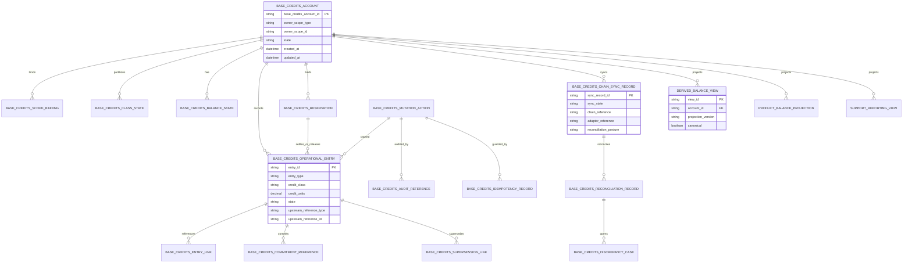
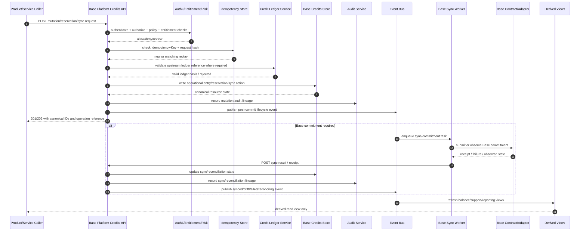

# BASE_PLATFORM_CREDITS_LAYER_API_SPEC.md

## Document Metadata

- **Document Name:** `BASE_PLATFORM_CREDITS_LAYER_API_SPEC.md`
- **Document Type:** FUZE API SPEC v2 / production-grade interface-contract specification
- **Status:** Draft for canonical API SPEC v2 approval
- **Version:** 2.0.0
- **Effective Date:** 2026-04-25
- **Last Updated:** 2026-04-25
- **Reviewed On:** 2026-04-25
- **Document Owner:** FUZE Base Platform Credits Layer Domain
- **Approval Authority:** FUZE Platform Architecture and Specification Governance Authority; formal named approver not yet specified
- **Review Cadence:** Quarterly and whenever Platform Credits semantics, credit-ledger posture, Base chain architecture, payment-normalization posture, billing posture, correction posture, reconciliation posture, or governance-sensitive controls materially change
- **Governing Layer:** API contract layer derived from the refined Base Platform Credits operational layer
- **Parent Registry:** FUZE API SPEC v2 Canonical File Registry
- **Upstream Semantic Registry:** `REFINED_SYSTEM_SPEC_INDEX.md`
- **Upstream API Registry:** `API_SPEC_INDEX.md`
- **Primary Audience:** Platform architecture, backend/API engineering, contracts-adapter engineering, credits/ledger engineering, billing and payments engineering, product spend-consumer teams, security, audit, finance/reconciliation, support operations, data engineering, runtime operations, OpenAPI/AsyncAPI/SDK authors, and implementation-contract authors
- **Primary Purpose:** Define the production-grade API contract for the Base Platform Credits Layer: Base-scoped credit accounts, scope bindings, class-aware operational state, issuance commitments, reservations, spend/release/reversal/adjustment projections, chain synchronization, reconciliation, discrepancy handling, correction-safe admin operations, events, read models, audit, idempotency, and downstream derivation guardrails
- **Primary Upstream References:**
  - `REFINED_SYSTEM_SPEC_INDEX.md`
  - `API_SPEC_INDEX.md`
  - `DOCS_SPEC_INDEX.md`
  - `SYSTEM_SPEC_INDEX.md`
  - `BASE_PLATFORM_CREDITS_LAYER_SPEC.md`
  - `PLATFORM_CREDITS_SPEC.md`
  - `CREDIT_LEDGER_AND_SETTLEMENT_SPEC.md`
  - `PAYMENT_RAILS_INTEGRATION_SPEC.md`
  - `SUBSCRIPTIONS_AND_USAGE_BILLING_SPEC.md`
  - `INVOICING_AND_RECEIPTS_SPEC.md`
  - `REFUND_REVERSAL_AND_ADJUSTMENT_SPEC.md`
  - `PRICING_AND_MONETIZATION_MODEL_SPEC.md`
  - `AI_USAGE_METERING_SPEC.md`
  - `ENTITLEMENT_AND_CAPABILITY_GATING_SPEC.md`
  - `ONCHAIN_OFFCHAIN_RESPONSIBILITY_SPEC.md`
  - `CHAIN_ARCHITECTURE_SPEC.md`
  - `BASE_PAYOUT_EXECUTION_LAYER_SPEC.md`
  - `SECURITY_AND_RISK_CONTROL_SPEC.md`
  - `AUDIT_AND_ACCESS_TRACEABILITY_SPEC.md`
  - `MONITORING_ALERTING_AND_INCIDENT_RESPONSE_SPEC.md`
  - `FUZE_ACCOUNT_ACCESS_AND_SESSION_THESIS_FINAL_SPEC.md`
  - `FUZE_ACCOUNT_ACCESS_AND_SESSION_CANONICAL_FINAL_SPEC.md`
  - `FUZE_WORKSPACE_ACCESS_CONTROL_BASICS_THESIS_FINAL_SPEC.md`
- **Primary Downstream Dependents:**
  - Base credits implementation contracts
  - Base credits contracts adapters and synchronization workers
  - Platform Credits API and Credit Ledger/Settlement API contract layers
  - product spend-consumer APIs
  - subscriptions, billing, usage, AI metering, refund, support, and reconciliation workflows
  - internal admin/control-plane tooling
  - OpenAPI, AsyncAPI, SDK, event schema, storage-contract, and QA artifacts
  - transparency-safe reporting and analytics projections that include credits state
- **API Surface Families Covered:** internal service APIs, first-party application read APIs, admin/control-plane APIs, event/async APIs, reporting/projection APIs, chain-adjacent adapter APIs
- **API Surface Families Excluded:** unauthenticated public mutation APIs, unrestricted public wallet-transfer APIs, raw payment-provider webhooks as canonical credits truth, raw contract ABI specs, accounting-book APIs, payout-claim APIs, token-holder APIs
- **Canonical System Owner(s):** Platform Credits Domain for semantic credit meaning; Credit Ledger and Settlement Domain for append-oriented mutation truth; Base Platform Credits Layer Domain for Base-side operational representation; On-Chain/Off-Chain Responsibility Domain for hybrid truth boundaries
- **Canonical API Owner:** FUZE Base Platform Credits Layer API Owner
- **Supersedes:** `BASE_PLATFORM_CREDITS_LAYER_API_SPEC.md` v1 draft material and any weaker API descriptions that did not preserve semantic, ledger, Base operational, payment, payout, and derived-read separation
- **Superseded By:** Not yet known
- **Related Decision Records:** Not yet specified
- **Canonical Status Note:** This API specification is canonical for interface-contract expression only. Refined system specifications own semantic truth. This API MUST preserve, not redefine, Platform Credits semantics, credit-ledger mutation truth, Base operational credits truth, chain/off-chain separation, authorization boundaries, and controlled movement restrictions.
- **Implementation Status:** Normative API design baseline; downstream endpoint, event, OpenAPI, AsyncAPI, SDK, service-contract, storage-contract, and QA work must conform
- **Approval Status:** Drafted for API SPEC v2 approval
- **Change Summary:** Upgraded the Base Platform Credits API from a v1 route-oriented draft into a production-grade API SPEC v2 document with explicit truth classes, surface-family boundaries, request/response/error/idempotency/audit/versioning rules, route-family models, diagrams, flow views, acceptance criteria, test cases, anti-patterns, and downstream derivation guardrails.

---

## Purpose

This API specification defines the canonical FUZE interface-contract posture for the **Base Platform Credits Layer**.

The Base Platform Credits Layer API expresses, at the interface layer, the refined system rule that Base is the operational chain environment for FUZE Platform Credits after approved off-chain normalization and ledger-authorized mutation. The API does not decide what a Platform Credit means, does not replace the append-oriented credit ledger, does not verify raw payment rails, does not determine accounting profit, does not execute stablecoin payout claims, and does not convert credits into an unrestricted market asset. It exposes and mutates only the Base-side operational representation of already-governed credits state.

The API must make downstream implementation safer by defining stable route families, resource families, lifecycle states, request and response expectations, error/result/status semantics, idempotency behavior, authorization checks, audit and observability requirements, chain-adjacent boundaries, event semantics, read-model rules, public-surface limits, and non-canonical patterns that teams MUST NOT implement.

---

## Scope

This API specification governs:

1. Base credits account and scope-binding APIs.
2. Base class-aware operational state APIs.
3. Base issuance-commitment, reservation, release, spend, reversal, expiry, adjustment, and approved internal rebinding projections.
4. Base chain-synchronization and commitment-reference APIs.
5. Reconciliation and discrepancy-case APIs.
6. Admin/control-plane APIs for suspend, resync, correct, rebind-if-allowed, supersede, resolve discrepancy, and release containment.
7. Internal read APIs for canonical Base operational credits truth.
8. First-party read APIs that expose bounded balance/status views without allowing client-side truth ownership.
9. Event and async behavior for Base credits operational lifecycle changes.
10. Request, response, error, result, status, idempotency, versioning, compatibility, audit, traceability, observability, and migration rules.

This API specification does not govern:

- the semantic definition of Platform Credits, classes, issuance categories, or controlled-transfer posture;
- the append-oriented ledger truth explaining why credits changed and how balances are derived;
- raw payment-provider verification or payment normalization;
- subscriptions, invoice truth, tax, accounting-book truth, or treasury-finalized meaning;
- FUZE token participation or Ethereum holder truth;
- snapshot/eligibility, profit participation, payout-ledger, or Base payout execution APIs;
- unrestricted public transfer, open-market credit trading, or third-party wallet asset behavior;
- final smart-contract ABI, storage layout, gas strategy, signer custody, or RPC/indexer details;
- final UX copy or statement rendering.

---

## Design Goals

1. Preserve refined Base Platform Credits semantics at the API boundary.
2. Provide deterministic contracts for Base-scoped account, class, balance, reservation, chain-sync, reconciliation, and correction state.
3. Keep semantic credits truth, ledger truth, Base operational truth, payment truth, entitlement truth, authorization truth, accounting truth, payout truth, and derived read-model truth separate.
4. Prevent product teams, admin tools, chain adapters, or dashboards from becoming shadow credits owners.
5. Support account-scoped and workspace-scoped balances without ambiguous ownership.
6. Support frequent operational credit activity on Base while preserving auditability and reconciliation.
7. Require idempotency and replay safety for every economically material mutation.
8. Make sync uncertainty, chain failure, projection lag, discrepancy, and degraded mode explicit.
9. Support OpenAPI, AsyncAPI, SDK, implementation-contract, and QA derivation without route drift or schema drift.
10. Provide implementation-useful diagrams, flow views, acceptance criteria, and test cases.

---

## Non-Goals

This API specification is not intended to:

- create a generic wallet-balance API;
- expose Base credits as public-market assets;
- allow frontend clients or products to author credits truth;
- permit direct product-local or admin-console balance rewriting;
- collapse credit ledger entries into Base balance counters;
- treat Base chain state as the sole business-level truth for credits;
- treat verified payment state as equivalent to credits issuance or available balance;
- treat credits as FUZE token, profit rights, payout rights, equity, governance, treasury assets, or stablecoin payout claims;
- replace implementation-contract specs, database schema docs, smart-contract ABI docs, or runbooks.

---

## Core Principles

### 1. Refined Semantics Are Upstream

The API layer MUST derive from active refined system specifications. It MUST NOT redefine the meaning of Platform Credits, class semantics, ledger truth, scope ownership, chain/off-chain responsibility, or controlled movement rules.

### 2. Semantic-Then-Ledger-Then-Operational

Platform Credits semantic truth defines what credits mean. Credit Ledger and Settlement truth defines why and how credits changed. Base Platform Credits operational truth defines the Base-side representation and synchronization posture of approved changes. API contracts MUST preserve this sequence.

### 3. Explicit Owner Scope

Every mutation and canonical read MUST resolve to an explicit owner scope: account, workspace, organization if later approved, or tightly bounded platform operational subject if explicitly modeled. Contextless Base balances are forbidden.

### 4. Controlled Movement

Credits MAY be issued, reserved, spent, released, reversed, adjusted, expired, or internally rebound only through approved platform-controlled pathways. Unrestricted transfer behavior is non-canonical.

### 5. Chain-Adjacent, Not Chain-Absolutist

Base commitment state is operationally important, but it does not replace platform semantic meaning, append-oriented ledger truth, payment verification, or accounting interpretation.

### 6. Derived Views Are Subordinate

Product balance displays, dashboards, exports, public-safe explanations, search indexes, and analytics projections are derived views. They MUST NOT accept writes or decide semantic truth.

### 7. Fail-Closed Integrity

If ownership, class validity, spend authority, reservation state, chain-sync posture, or ledger linkage cannot be verified for a sensitive economic action, the API MUST fail closed or enter explicit review/reconciliation posture.

### 8. Correction Lineage

Corrections, discrepancy repairs, resyncs, rebindings, and supersessions MUST preserve explicit lineage. Destructive overwrites are forbidden.

---

## Canonical Definitions

- **Base Credits Account:** Base operational subject bound to a canonical FUZE owner scope for credits representation and mutation.
- **Owner Scope:** Account, workspace, or other approved subject that owns or controls credits.
- **Credit Class:** Policy-defined class such as `paid`, `bonus`, `restricted`, or future approved classes.
- **Operational Entry:** Base-layer record representing issuance, reservation, release, spend, reversal, expiry, adjustment, commitment marker, or approved rebinding/supersession.
- **Base Balance State:** Class-aware operational state such as available, reserved, restricted, pending commitment, committed, failed, or reconciling posture.
- **Reservation:** Provisional hold that is not final spend and must settle, release, expire, or cancel deterministically.
- **Chain Sync Record:** Operational record linking Base commitment, contract-observed state, adapter submission, confirmation, drift, retry, or supersession state.
- **Discrepancy Case:** Review/remediation record for mismatch, duplication, stale state, failed commitment, misbinding, unauthorized mutation attempt, projection divergence, or chain/off-chain inconsistency.
- **Internal Rebinding:** Policy-approved correction or migration that reattaches lineage to a permitted internal scope without creating open transfer semantics.
- **Derived Balance View:** Read model for product, support, reporting, or UX consumption derived from canonical operational and ledger sources.

---

## Truth Class Taxonomy

The API MUST distinguish the following truth classes:

1. **Semantic Truth:** Meaning of credits, classes, issuance categories, spend policy, and controlled movement. Owned by Platform Credits refined semantics.
2. **API Contract Truth:** Allowed routes, request/response classes, result/status semantics, error families, idempotency, and compatibility rules. Owned by this document.
3. **Policy Truth:** Class policy, spend restrictions, fraud/risk containment, admin authority, governance posture, and review rules.
4. **Runtime Truth:** Request processing state, worker state, queue state, adapter state, retry state, and degraded-mode state.
5. **Ledger / Storage Truth:** Append-oriented credit mutation records, settlement lineage, operational entries, chain-sync records, reconciliation records, discrepancy cases, and durable audit records.
6. **Provider-Input Truth:** Raw payment events, chain observations, node responses, indexer events, or external provider state before FUZE normalization.
7. **Event / Async Truth:** Post-commit events and job notifications that synchronize systems but do not independently own business truth.
8. **Projection / Reporting Truth:** Product balances, support summaries, dashboards, exports, analytics, and public-safe views.
9. **Presentation Truth:** UI copy, labels, statement formatting, and user-facing explanations.

No API, event, worker, projection, or SDK MAY collapse these truth classes into one generic “credits state.”

---

## Architectural Position in the Spec Hierarchy

This API specification sits below:

- `REFINED_SYSTEM_SPEC_INDEX.md`
- `BASE_PLATFORM_CREDITS_LAYER_SPEC.md`
- `PLATFORM_CREDITS_SPEC.md`
- `CREDIT_LEDGER_AND_SETTLEMENT_SPEC.md`
- `ONCHAIN_OFFCHAIN_RESPONSIBILITY_SPEC.md`
- `CHAIN_ARCHITECTURE_SPEC.md`
- identity, account, session, workspace, authorization, entitlement, security, audit, payment, billing, refund, and operations refined specs

This API specification sits above:

- OpenAPI route files
- AsyncAPI event files
- SDK generation rules
- Base credits service implementation contracts
- Base credits contract-adapter implementation contracts
- database schema migrations for this API family
- worker, reconciliation, and support-control implementation docs
- QA, contract validation, regression, and production-readiness test suites

---

## Upstream Semantic Owners

- **Platform Credits Domain:** Owns what credits mean, class taxonomy, issuance categories, spend posture, ownership scope rules, controlled internal reassignment, expiry posture, and transfer restrictions.
- **Credit Ledger and Settlement Domain:** Owns append-oriented mutation lineage, balance derivation, settlement state, reconciliation posture, and ledger-based correction lineage.
- **Base Platform Credits Layer Domain:** Owns Base-side operational representation, Base credits accounts, class-aware operational entries, Base balance posture, chain-sync records, discrepancy records, correction/supersession posture, and implementation guardrails.
- **Payment Rails Domain:** Owns raw payment verification, normalized payment records, payment scope assignment, and rail correction inputs.
- **Billing / Pricing / Refund Domains:** Own commercial charge causes, subscription/usage decisions, invoice posture, refund/reversal causes, and pricing outputs.
- **Authorization / Workspace Domains:** Own actor permission, workspace authority, and scoped access posture.
- **Entitlement Domain:** Owns capability eligibility where credits and capability gates coordinate.
- **On-Chain / Off-Chain Responsibility Domain:** Owns the hybrid truth split and prevents raw chain state from absorbing policy/accounting/product meaning.
- **Security / Risk / Audit Domains:** Own containment, sensitive action controls, audit record governance, and observability requirements.
- **Base Payout Execution Domain:** Owns stablecoin payout execution and MUST remain separate from Base credits.

---

## API Surface Families

### Internal Service APIs

Internal service APIs are used by backend services, credits/ledger services, billing/usage services, Base adapters, reconciliation workers, and trusted product spend-consumer services. They MAY create and mutate Base operational credits state only after upstream semantic, ledger, authorization, and policy checks pass.

### First-Party Application APIs

First-party APIs MAY expose bounded balance, reservation, status, and statement summaries to FUZE web/mobile/product clients. They MUST be read-biased, projection-safe, permission-aware, and unable to create credits truth directly.

### Admin / Control-Plane APIs

Admin APIs MAY suspend, correct, rebind-if-allowed, resync, supersede, resolve discrepancies, or release containment only through reason-coded, policy-constrained, auditable, least-privilege routes.

### Event / Webhook / Async APIs

Event APIs publish post-commit lifecycle signals and trigger projection refresh, reconciliation, product update, audit, analytics, and support workflows. Events are synchronization signals, not independent mutation truth.

### Reporting / Projection APIs

Reporting APIs MAY expose derived operational summaries, support views, export-safe data, and transparency-safe aggregates. They MUST preserve lineage to canonical records and MUST NOT accept semantic writes.

### Chain-Adjacent Adapter APIs

Chain-adjacent APIs coordinate Base contract submission, sync, receipt ingestion, drift detection, and reconciliation. They MUST distinguish observed chain state, adapter execution state, and canonical Base operational credits truth.

### Public APIs

No unauthenticated or third-party public mutation API exists for this domain. Any future public read API MUST be separately approved and MUST expose only narrow, stable, privacy-safe, non-authoritative summaries.

---

## System / API Boundaries

### This API Governs

- route/resource family design for Base credits operational state;
- request fields and response classes at API contract level;
- result/status/error semantics;
- authorization, entitlement, policy, scope, and idempotency requirements at interface level;
- chain-adjacent state and sync posture as API-visible contract categories;
- audit, observability, migration, and compatibility posture for downstream implementation.

### Upstream Refined Specs Govern

- what credits mean;
- who owns semantic, ledger, policy, payment, billing, authorization, chain/off-chain, payout, and audit truth;
- lifecycle meaning of credits classes and controlled movement;
- failure and correction posture at the system layer.

### Adjacent API Specs Govern

- `PLATFORM_CREDITS_API_SPEC.md`: semantic credits API family.
- `CREDIT_LEDGER_AND_SETTLEMENT_API_SPEC.md`: append-oriented credits mutation and settlement API family.
- `PAYMENT_RAILS_INTEGRATION_API_SPEC.md`: verified payment normalization API family.
- `SUBSCRIPTIONS_AND_USAGE_BILLING_API_SPEC.md`: billing and usage API family.
- `REFUND_REVERSAL_AND_ADJUSTMENT_API_SPEC.md`: refund/reversal API family.
- `ENTITLEMENT_AND_CAPABILITY_GATING_API_SPEC.md`: capability-gating API family.
- `BASE_PAYOUT_EXECUTION_LAYER_API_SPEC.md`: stablecoin payout execution API family on Base.
- `CHAIN_ARCHITECTURE_API_SPEC.md`: cross-chain role and responsibility API posture.

### Implementation-Contract Specs Govern

- exact service decomposition;
- database tables and indexes;
- exact contract ABI and adapter payloads;
- queue names, retry policy code, RPC providers, signer custody, and indexer implementation;
- endpoint-level OpenAPI syntax and SDK packaging.

---

## Conflict Resolution Rules

1. `REFINED_SYSTEM_SPEC_INDEX.md` wins on refined-library membership and source-of-truth routing.
2. Active refined system specs win on semantic truth and ownership boundaries.
3. `PLATFORM_CREDITS_SPEC.md` wins on the meaning of credits, classes, issuance categories, spend restrictions, and controlled movement.
4. `CREDIT_LEDGER_AND_SETTLEMENT_SPEC.md` wins on append-oriented mutation lineage, settlement, balance derivation, and ledger reconciliation semantics.
5. `BASE_PLATFORM_CREDITS_LAYER_SPEC.md` wins on Base operational representation, chain sync, discrepancy, correction, and Base-side guardrails.
6. `ONCHAIN_OFFCHAIN_RESPONSIBILITY_SPEC.md` wins when raw chain state, contract state, provider input, policy, accounting, or reporting truth are confused.
7. This API spec wins only on interface-contract expression that does not contradict refined semantics.
8. If chain state, platform ledger state, and derived product view disagree, semantic meaning remains with Platform Credits, mutation lineage remains with Credit Ledger, Base operational state remains with Base Platform Credits, and derived product view MUST be corrected or marked stale.
9. If ambiguity remains, the API MUST select the more restrictive, architecture-consistent interpretation and require explicit refinement or decision recording.

---

## Default Decision Rules

1. If a mutation cannot bind to a valid owner scope, fail closed.
2. If actor permission cannot be evaluated, fail closed.
3. If entitlement or capability gating is required but cannot be checked, fail closed or return `review_required` where policy allows.
4. If ledger linkage is missing for an economically material Base operation, reject or hold in `pending_ledger_reference`.
5. If chain sync is uncertain, do not treat sync as final; use `pending_sync`, `drift_detected`, `commitment_failed`, or `reconciling`.
6. If raw chain state and canonical platform records differ materially, open discrepancy/reconciliation rather than trusting raw observation alone.
7. If a correction affects previously visible or consumed state, create explicit reversal, compensating, or supersession lineage.
8. If product-local cache disagrees with canonical state, product cache loses.
9. If payment verification or refund posture is disputed, pause new issuance/availability effects until upstream normalization resolves.
10. If public exposure is requested, default to no exposure unless approved by a public-read specification.

---

## Roles / Actors / API Consumers

- **Backend service principal:** trusted internal caller for canonical mutations.
- **Credits ledger service:** upstream authoritative mutation source for Base operational projection.
- **Billing/usage service:** approved caller for reservation/spend/release driven by product usage.
- **Product service:** approved spend consumer; never a semantic owner.
- **Base contract adapter:** chain-adjacent execution/sync caller; never a semantic owner.
- **Reconciliation worker:** compares ledger, Base operational state, chain sync, and projections.
- **Admin/control-plane operator:** privileged human or system actor acting through reason-coded bounded routes.
- **Support/finance reviewer:** reviewer of discrepancy, refund, adjustment, and correction cases.
- **Security/risk operator:** may trigger containment, suspension, review, or fraud controls.
- **First-party client:** read-only or request-initiating surface consuming bounded projections.
- **Reporting/data pipeline:** derived consumer; not a mutation owner.

---

## Resource / Entity Families

### Canonical API Resources

- `base_credits_account`
- `base_credits_scope_binding`
- `base_credits_class_state`
- `base_credits_balance_state`
- `base_credits_operational_entry`
- `base_credits_entry_link`
- `base_credits_reservation`
- `base_credits_commitment_reference`
- `base_credits_chain_sync_record`
- `base_credits_reconciliation_record`
- `base_credits_discrepancy_case`
- `base_credits_mutation_action`
- `base_credits_supersession_link`

### Derived API Resources

- `base_credits_balance_summary`
- `base_credits_statement_view`
- `base_credits_product_projection`
- `base_credits_support_summary`
- `base_credits_reporting_extract`
- `base_credits_public_safe_summary` if later approved

Derived resources MUST include enough canonical references for traceability and MUST NOT accept mutation requests.

---

## Ownership Model

- Base Platform Credits Layer Domain owns Base operational account, binding, operational-entry, class-state, balance-state, reservation, chain-sync, reconciliation, discrepancy, and supersession API resources.
- Credit Ledger and Settlement Domain owns the authoritative economic mutation basis.
- Platform Credits Domain owns semantic class and policy meaning.
- Payment/Billing/Pricing/Refund domains own upstream causes and commercial interpretations.
- Security/Risk domains may constrain, pause, or review mutation but do not become credits truth owners.
- Audit domain owns immutable audit records, sourced by this API.
- Product services and frontend clients consume approved contracts only.

---

## Authority / Decision Model

Base credits mutations require a valid chain of authority:

1. **Identity / service identity:** caller is authenticated as a permitted subject, service, or operator.
2. **Authorization:** caller may act on the target owner scope and route family.
3. **Semantic policy:** action is allowed under Platform Credits class, issuance, spend, movement, and restriction policy.
4. **Ledger basis:** economically material changes have an approved ledger reference or explicit controlled correction basis.
5. **Base operational validation:** target account, binding, entry, reservation, chain-sync state, and discrepancy posture allow the action.
6. **Audit and idempotency:** mutation is reasoned, traceable, and replay-safe.
7. **Event/projection:** downstream signals are emitted only after canonical commit.

---

## Authentication Model

- Internal service APIs MUST use authenticated service principals with least-privilege scopes.
- Admin APIs MUST use authenticated operator identity, privileged-session posture where required, and step-up controls for sensitive actions.
- First-party read APIs MUST use authenticated account or workspace context.
- Chain-adjacent adapter APIs MUST use service identity and environment-scoped permissions.
- Event consumers MUST use authenticated subscriptions or service identities.
- Public unauthenticated access is not allowed unless a future public-read spec approves a narrow read surface.

Wallet ownership MAY provide context for future product experiences, but it MUST NOT replace canonical account identity, workspace authority, service identity, or admin authorization.

---

## Authorization / Scope / Permission Model

Authorization MUST evaluate:

- route family and caller class;
- owner scope type and owner scope ID;
- workspace role and permission posture where workspace-owned credits are involved;
- service principal permissions for create, reserve, settle, release, reverse, adjust, sync, reconcile, and read;
- operator role, case linkage, reason code, and policy authorization for admin actions;
- security/risk containment posture;
- whether the current resource state allows the requested transition.

A subject may own credits while a specific actor lacks authority to spend them. Login alone, workspace membership alone, UI visibility alone, or wallet control alone is insufficient for mutation authority.

---

## Entitlement / Capability-Gating Model

Credits do not replace entitlements. For actions where product access requires entitlement or capability posture:

- the spend-consumer route MUST check capability eligibility separately from available balance;
- insufficient entitlement MUST produce a distinct error from insufficient credits;
- entitlement-denied actions MUST NOT reserve or spend credits;
- if entitlement policy changes during an active reservation, deterministic settlement/release rules MUST apply;
- product teams MUST NOT use available credits as a substitute for authorization or entitlement.

---

## API State Model

### Account States

- `active`
- `restricted`
- `suspended`
- `closed`
- `superseded`

### Scope Binding States

- `active`
- `pending_review`
- `rebound`
- `superseded`
- `invalidated`

### Operational Entry States

- `created`
- `pending_ledger_reference`
- `pending_commitment`
- `committed`
- `reversed`
- `adjusted`
- `expired`
- `superseded`
- `failed`
- `reconciling`

### Reservation States

- `opened`
- `active`
- `settling`
- `settled`
- `partially_settled`
- `released`
- `expired`
- `cancelled`
- `failed`
- `superseded`

### Chain Sync States

- `not_required`
- `pending`
- `submitted`
- `synced`
- `drift_detected`
- `commitment_failed`
- `replaced`
- `reconciling`
- `superseded`

### Discrepancy States

- `opened`
- `under_review`
- `containment_applied`
- `resolved`
- `failed`
- `closed`
- `superseded`

---

## Lifecycle / Workflow Model

1. Upstream payment, billing, product, or adjustment flow produces an approved semantic/ledger basis.
2. Base Platform Credits API receives an internal mutation request with owner scope, class, amount, upstream reference, idempotency key, and correlation ID.
3. API authenticates caller and authorizes target scope and action.
4. API validates class policy, account/binding state, restriction posture, available/reserved posture, and ledger linkage.
5. API creates or updates Base operational entry, reservation, or sync record in canonical storage.
6. If chain-adjacent commitment is required, API creates commitment/sync records and emits work for adapter submission.
7. API returns terminal success or accepted-state response with operation reference.
8. Async workers submit, observe, reconcile, and update chain-sync state.
9. Post-commit events refresh projections and notify consumers.
10. If mismatch or failure occurs, API opens discrepancy/reconciliation state rather than silently mutating or trusting raw input.
11. Admin/control-plane routes may pause, correct, resync, supersede, rebind-if-allowed, or resolve discrepancies with reason-coded audit.

Accepted-state responses MUST NOT be represented as final chain sync or final business outcome unless the relevant final state is reached.

---

## Architecture Diagram — Mermaid flowchart

```mermaid
flowchart TD
    subgraph Consumers["API Consumers"]
        FP["First-party products / webapp"]
        PS["Product spend services"]
        BILL["Billing / usage / pricing services"]
        LEDGER["Credit ledger service"]
        ADMIN["Admin / support / finance / security operators"]
        DATA["Reporting / analytics / support views"]
    end

    subgraph Surface["Base Platform Credits API Surface"]
        READ["First-party read APIs"]
        INT["Internal service mutation APIs"]
        CTRL["Admin/control-plane APIs"]
        EVT["Event / Async APIs"]
        REP["Reporting/projection APIs"]
        ADAPT["Chain-adjacent adapter APIs"]
    end

    subgraph OwnerDomains["Canonical Owner Domains"]
        PC["Platform Credits semantics"]
        CLS["Credit Ledger and Settlement truth"]
        BPC["Base Platform Credits operational truth"]
        AUTHZ["Identity / workspace / authz"]
        ENT["Entitlement / capability gates"]
        RISK["Security / risk / containment"]
        AUD["Audit / traceability"]
    end

    subgraph Storage["Canonical and Derived Stores"]
        ACC["Base credits accounts and scope bindings"]
        ENTRIES["Operational entries / class states / reservations"]
        SYNC["Commitment / chain-sync / reconciliation records"]
        DISC["Discrepancy and supersession lineage"]
        PROJ["Derived balance, product, support, and reporting views"]
        IDEMP["Idempotency records"]
    end

    subgraph Chain["Base Chain-Adjacent Layer"]
        WORKER["Submission / sync / reconciliation workers"]
        CONTRACT["Base credits contract or commitment adapter"]
        OBS["Chain observation / indexer input"]
    end

    FP --> READ
    PS --> INT
    BILL --> INT
    LEDGER --> INT
    ADMIN --> CTRL
    DATA --> REP

    READ --> PROJ
    INT --> AUTHZ
    CTRL --> AUTHZ
    INT --> PC
    INT --> CLS
    INT --> ENT
    INT --> RISK
    CTRL --> RISK

    INT --> BPC
    CTRL --> BPC
    BPC --> ACC
    BPC --> ENTRIES
    BPC --> SYNC
    BPC --> DISC
    INT --> IDEMP
    CTRL --> IDEMP

    BPC --> EVT
    EVT --> PROJ
    EVT --> AUD
    REP --> PROJ

    ADAPT --> WORKER
    WORKER --> CONTRACT
    CONTRACT --> OBS
    OBS --> ADAPT
    ADAPT --> SYNC
    SYNC --> DISC

    PROJ -. derived only .-> FP
    PROJ -. derived only .-> DATA
```

---

## Data Design — Mermaid Diagram

Derived views in this diagram are explicitly non-canonical and MUST be refreshable from canonical account, entry, reservation, sync, reconciliation, and ledger-linked records.

---

## Flow View

### Main Synchronous Mutation Flow

1. Caller submits mutation with `Idempotency-Key`, `X-Correlation-Id`, owner scope, class, amount, action type, upstream reference, and policy/version references where required.
2. API authenticates caller and resolves caller class.
3. API evaluates owner-scope authority, workspace permission, service permission, entitlement requirement, and risk restrictions.
4. API checks idempotency record.
5. API validates resource state, class policy, available/reserved balance, ledger linkage, and chain-sync constraints.
6. API writes canonical operational mutation record and mutation action.
7. API records audit reference and emits post-commit event.
8. API returns `200`, `201`, or `202` depending on terminal or accepted async state.

### Reservation / Settlement Flow

1. Product requests reservation with expected cost and target reference.
2. API validates balance, class, authority, and entitlement.
3. API creates reservation and reduces available operational posture.
4. Product completes, fails, cancels, or returns final cost.
5. API settles all or part of reservation into spend, releases remainder, or releases full reservation.
6. API emits reservation and settlement events.
7. Projection refresh is asynchronous and must not be treated as canonical enforcement state.

### Chain Sync Flow

1. Canonical mutation requires Base commitment.
2. API creates commitment reference and sync record in `pending`.
3. Worker submits adapter operation and records attempt/receipt references.
4. Observed chain state is normalized into sync result.
5. API updates sync state to `synced`, `commitment_failed`, `drift_detected`, `replaced`, or `reconciling`.
6. Reconciliation worker compares ledger, Base operational state, and chain observation.
7. Discrepancy case opens on unresolved mismatch.

### Admin / Correction Flow

1. Operator opens privileged route with reason code, operator note, correlation ID, and idempotency key.
2. API verifies privileged identity, role, case linkage, and policy authorization.
3. API applies suspension, resync, correction, rebinding, supersession, or discrepancy resolution through canonical mutation action.
4. API preserves original records and writes compensating or superseding lineage.
5. Audit record is critical severity.
6. Downstream projections update after canonical commit.

### Failure and Degraded Mode

- Chain unavailable: mutation may remain `pending_commitment` only if policy allows; otherwise fail with dependency error.
- Projection lag: sensitive spends must revalidate canonical state.
- Duplicate request: idempotent replay returns original result; semantic mismatch with same key returns conflict.
- Scope ambiguity: fail closed.
- Discrepancy: open review, optionally restrict account, and do not optimistic-finalize.
- Admin override requested after public/reporting exposure: require heightened approval and explicit supersession lineage.

---

## Data Flows — Mermaid sequenceDiagram

---

## Request Model

### Required Headers for Mutations

- `Authorization`
- `Content-Type: application/json`
- `Idempotency-Key`
- `X-Correlation-Id`
- `X-Request-Source`
- `X-Actor-Context` for on-behalf-of service calls where actor authority matters
- `X-Policy-Version` where policy-sensitive class, issuance, spend, correction, or rebinding posture applies

### Common Request Fields

- `owner_scope_type`
- `owner_scope_id`
- `base_credits_account_id` where account already exists
- `credit_class`
- `credit_units`
- `action_type`
- `upstream_reference_type`
- `upstream_reference_id`
- `reason_code`
- `target_reference_type`
- `target_reference_id`
- `policy_version`
- `expected_state` where optimistic conflict protection is needed
- `operator_note` for privileged actions
- `related_case_id` for support/finance/security corrections
- `client_operation_reference` only as non-authoritative correlation input

### Request Rules

- Client-authored balances are forbidden.
- Frontend-authored class semantics are forbidden.
- Upstream references are mandatory for economically material mutation.
- Admin actions require reason codes and operator notes.
- Amounts MUST use deterministic decimal/integer representation.
- Workspace-scoped requests MUST include enough context to evaluate workspace authority.
- Requests that cross scope, class, or correction boundaries MUST include explicit policy version or approved migration reference.

---

## Response Model

### Common Success Fields

- `resource_id`
- `resource_type`
- `state`
- `owner_scope_type`
- `owner_scope_id`
- `credit_class`
- `credit_units`
- `available_balance_summary`
- `reserved_balance_summary`
- `restriction_summary`
- `sync_state`
- `reconciliation_posture`
- `upstream_references`
- `operation_reference`
- `correlation_id`
- `created_at`
- `updated_at`

### Response Classes

- `created`: canonical resource created.
- `updated`: canonical resource transitioned.
- `accepted`: async work accepted; final outcome pending.
- `no_effect_replay`: idempotent replay returned original effect.
- `review_required`: request is not denied but requires explicit review before effect.
- `derived_view`: read result is non-canonical and must identify canonical lineage.

### Async-Accepted Responses

Accepted responses MUST include:

- operation ID;
- accepted state;
- finalization condition;
- polling/status route if applicable;
- whether balance availability is affected immediately;
- whether chain sync or projection refresh is pending.

Accepted state MUST NOT be represented as final chain commitment, final ledger settlement, or final business success.

---

## Error / Result / Status Model

Errors MUST follow structured problem-details style.

### Required Error Fields

- `type`
- `title`
- `status`
- `code`
- `detail`
- `instance`
- `correlation_id`
- `resource_reference` where safe
- `retryable`
- `safe_user_message` where first-party display is allowed

### Error Families

#### Authentication / Authorization

- `BASE_PLATFORM_CREDITS_AUTHENTICATION_REQUIRED`
- `BASE_PLATFORM_CREDITS_PERMISSION_DENIED`
- `BASE_PLATFORM_CREDITS_SERVICE_PERMISSION_DENIED`
- `BASE_PLATFORM_CREDITS_OPERATOR_PERMISSION_DENIED`
- `BASE_PLATFORM_CREDITS_WORKSPACE_PERMISSION_DENIED`

#### Scope / Class / Policy

- `BASE_PLATFORM_CREDITS_SCOPE_REQUIRED`
- `BASE_PLATFORM_CREDITS_SCOPE_BINDING_INVALID`
- `BASE_PLATFORM_CREDITS_CLASS_INVALID`
- `BASE_PLATFORM_CREDITS_CLASS_RESTRICTED`
- `BASE_PLATFORM_CREDITS_POLICY_DENIED`
- `BASE_PLATFORM_CREDITS_REBINDING_NOT_ALLOWED`

#### State / Conflict

- `BASE_PLATFORM_CREDITS_ACCOUNT_STATE_INVALID`
- `BASE_PLATFORM_CREDITS_ENTRY_STATE_INVALID`
- `BASE_PLATFORM_CREDITS_RESERVATION_STATE_INVALID`
- `BASE_PLATFORM_CREDITS_SYNC_STATE_INVALID`
- `BASE_PLATFORM_CREDITS_DISCREPANCY_OPEN`
- `BASE_PLATFORM_CREDITS_CONFLICT`

#### Economic Safety

- `BASE_PLATFORM_CREDITS_UPSTREAM_REFERENCE_REQUIRED`
- `BASE_PLATFORM_CREDITS_LEDGER_REFERENCE_INVALID`
- `BASE_PLATFORM_CREDITS_INSUFFICIENT_AVAILABLE_BALANCE`
- `BASE_PLATFORM_CREDITS_DUPLICATE_ENTRY`
- `BASE_PLATFORM_CREDITS_COMMITMENT_REQUIRED`
- `BASE_PLATFORM_CREDITS_COMMITMENT_FAILED`

#### Request Integrity

- `BASE_PLATFORM_CREDITS_IDEMPOTENCY_KEY_REQUIRED`
- `BASE_PLATFORM_CREDITS_IDEMPOTENCY_CONFLICT`
- `BASE_PLATFORM_CREDITS_REQUEST_INVALID`
- `BASE_PLATFORM_CREDITS_REQUEST_UNPROCESSABLE`
- `BASE_PLATFORM_CREDITS_AMOUNT_INVALID`

#### Dependency / Runtime

- `BASE_PLATFORM_CREDITS_CHAIN_UNAVAILABLE`
- `BASE_PLATFORM_CREDITS_STORAGE_UNAVAILABLE`
- `BASE_PLATFORM_CREDITS_RECONCILIATION_UNAVAILABLE`
- `BASE_PLATFORM_CREDITS_PROJECTION_STALE`
- `BASE_PLATFORM_CREDITS_RATE_LIMITED`

Error responses MUST distinguish permission denial, insufficient balance, invalid class, suspended account, open discrepancy, upstream missing reference, chain unavailable, and projection stale conditions.

---

## Idempotency / Retry / Replay Model

### Required Idempotency

Every mutation route MUST be idempotent, including:

- account creation;
- scope binding creation or rebinding;
- issuance commitment;
- operational entry creation;
- reservation creation;
- reservation settlement;
- reservation release;
- reversal, expiry, adjustment, and correction;
- chain-sync recording;
- resync;
- suspension;
- supersession;
- discrepancy resolution.

### Idempotency Record Requirements

The idempotency store MUST record:

- idempotency key;
- route family;
- actor/service identity;
- owner scope;
- request hash;
- upstream reference;
- resulting resource IDs;
- terminal or accepted result;
- timestamps;
- replay count;
- conflict state where same key is reused with different semantic request.

### Retry Rules

- Retrying same semantic request returns the original result.
- Retrying same key with changed semantic request returns conflict.
- Worker retries MUST preserve operation references.
- Chain retries MUST create attempt/sync lineage, not duplicate business effect.
- Duplicate provider events or duplicate ledger references MUST NOT double-issue or double-spend.
- Replay after correction/supersession MUST return the original historical result plus current supersession reference where safe.

---

## Rate Limit / Abuse-Control Model

The API MUST enforce:

- per-service and per-operator mutation limits;
- stricter admin/control-plane limits;
- anomaly detection for repeated failed reservations, duplicate keys, suspicious rebinding, repeated chain-sync failures, and high-risk adjustment attempts;
- fail-closed throttling for economically material mutation during active incident or containment posture;
- safe retry-after hints only where they do not leak internal security posture.

Rate limits MUST NOT cause hidden partial economic effects. If the system accepts work before throttling, it must preserve operation references.

---

## Endpoint / Route Family Model

This section defines route families, not final OpenAPI schemas.

### Internal Service Routes

#### `POST /internal/v1/base-platform-credits/accounts`

Create or locate Base credits account for owner scope.

Required: owner scope, purpose, idempotency key.  
Result: account summary, scope binding, state, balance summary.  
Forbidden: creating contextless accounts.

#### `POST /internal/v1/base-platform-credits/accounts/{account_id}/entries`

Create Base operational entry for issuance, spend, reversal, adjustment, expiry, or commitment marker.

Required: entry type, credit class, units, upstream ledger/reference, policy version, idempotency key.  
Result: operational entry, updated balance/class posture, chain-sync requirement.

#### `POST /internal/v1/base-platform-credits/accounts/{account_id}/reservations`

Create reservation against available Base operational credits.

Required: credit class, units, reservation reason, target reference, idempotency key.  
Result: reservation resource and updated available/reserved posture.

#### `POST /internal/v1/base-platform-credits/reservations/{reservation_id}/settle`

Finalize active reservation into spend.

Required: settlement amount or finalization basis, idempotency key.  
Result: settled or partially settled reservation, spend entry, released remainder if applicable.

#### `POST /internal/v1/base-platform-credits/reservations/{reservation_id}/release`

Release an active reservation.

Required: release reason, idempotency key.  
Result: released reservation and refreshed balance posture.

#### `POST /internal/v1/base-platform-credits/accounts/{account_id}/chain-sync-records`

Create or refresh chain-sync record.

Required: commitment reference, observed state or submission reference, idempotency key.  
Result: sync state and reconciliation posture.

#### `POST /internal/v1/base-platform-credits/reconciliation`

Start or record reconciliation pass.

Required: target reference, reconciliation profile, idempotency key.  
Result: reconciliation record, discrepancy state if mismatch remains.

#### `GET /internal/v1/base-platform-credits/accounts/{account_id}`

Retrieve canonical internal operational truth.

Result: account, scope bindings, class states, balance states, reservations, entries, sync records, reconciliation, discrepancy, and supersession lineage.

### First-Party Read Routes

#### `GET /v1/credits/base/balance-summary`

Return bounded authenticated subject balance summary.

Must be permission-aware and projection-labeled. Sensitive enforcement decisions MUST revalidate canonical state.

#### `GET /v1/credits/base/reservations/{reservation_id}`

Return subject-visible reservation status where authorized.

#### `GET /v1/credits/base/activity`

Return statement-like derived activity, excluding protected internal notes and unsafe correction detail.

### Admin / Control-Plane Routes

#### `POST /admin/v1/base-platform-credits/accounts/{account_id}/suspend`

Suspend or restrict account under policy.

Required: reason code, operator note, case reference, idempotency key.

#### `POST /admin/v1/base-platform-credits/accounts/{account_id}/resync`

Force resync/reconciliation.

Required: resync profile, reason code, operator note, idempotency key.

#### `POST /admin/v1/base-platform-credits/corrections`

Apply controlled correction, reversal, adjustment, or supersession.

Required: target reference, correction type, reason code, operator note, case reference, idempotency key.

#### `POST /admin/v1/base-platform-credits/accounts/{account_id}/rebind`

Policy-approved internal rebinding.

Required: old scope, new scope, approval reference, reason code, operator note, idempotency key.  
Forbidden: using rebinding to create open transfer behavior.

#### `POST /admin/v1/base-platform-credits/discrepancies/{case_id}/resolve`

Resolve discrepancy with explicit remediation.

Required: resolution code, remediation references, operator note, idempotency key.

### Event Families

- `base_platform_credits.account_created`
- `base_platform_credits.scope_bound`
- `base_platform_credits.entry_committed`
- `base_platform_credits.reservation_opened`
- `base_platform_credits.reservation_settled`
- `base_platform_credits.reservation_released`
- `base_platform_credits.reversal_committed`
- `base_platform_credits.adjustment_committed`
- `base_platform_credits.expiry_committed`
- `base_platform_credits.sync_submitted`
- `base_platform_credits.synced`
- `base_platform_credits.drift_detected`
- `base_platform_credits.discrepancy_opened`
- `base_platform_credits.discrepancy_resolved`
- `base_platform_credits.account_suspended`
- `base_platform_credits.corrected`
- `base_platform_credits.rebound`
- `base_platform_credits.superseded`

Events MUST carry stable IDs, owner scope, action type, state, policy version, upstream references, audit reference, correlation ID, and idempotency reference where relevant.

---

## Public API Considerations

No public mutation API is allowed. Public read exposure, if later approved, MUST:

- be read-only;
- be privacy-safe;
- expose only stable non-sensitive summaries;
- distinguish chain-visible state from platform interpretation;
- exclude internal correction notes, fraud/security posture, signer/provider details, payment details, workspace-private data, and raw ledger internals;
- identify derived status where applicable;
- remain subordinate to a future public-read/public-trust API spec.

---

## First-Party Application API Considerations

First-party apps MAY show balances, class posture, reservations, activity, and user-safe failure reasons. They MUST NOT:

- calculate balances client-side;
- treat stale projection as spend authority;
- allow UI-only role checks to authorize spending;
- expose internal audit or operator notes;
- imply credits are token, stablecoin, payout, or public-market asset;
- hide reservation, restriction, or pending sync state where user-facing action depends on it.

---

## Internal Service API Considerations

Internal services MUST:

- use service-to-service auth;
- preserve actor-on-behalf-of context where spend authority matters;
- pass deterministic idempotency keys;
- include upstream references;
- validate class, entitlement, scope, permission, and risk posture before mutating;
- never write derived views directly as source of truth;
- never use chain adapter success as a substitute for canonical API commit.

---

## Admin / Control-Plane API Considerations

Admin/control-plane APIs MUST be:

- separated from ordinary application routes;
- least-privilege;
- reason-coded;
- case-linked for sensitive remediation;
- step-up protected where required;
- audit-critical;
- idempotent;
- lineage-preserving.

Admin tools MUST NOT mint, rewrite, rebind, resync, or correct credits through ad hoc scripts outside this API or approved implementation-contract pathways.

---

## Event / Webhook / Async API Considerations

Events:

- are emitted after canonical commit;
- MUST NOT be accepted as independent mutation authority;
- MUST include stable references and policy/correlation context;
- MAY trigger projections and downstream workflows;
- MUST be replay-safe;
- MUST distinguish accepted async intent from final sync or final settlement state.

External webhooks from payment providers are outside this API and must terminate in payment normalization before affecting credits.

---

## Chain-Adjacent API Considerations

Chain-adjacent behavior MUST distinguish:

- Base operational truth;
- contract-visible commitment state;
- adapter submission state;
- chain observation/input state;
- reconciliation state;
- derived reporting state.

Raw chain events MUST NOT directly mutate unrelated business truth. Chain event ingestion must normalize into sync or reconciliation records under this API before projections or status surfaces update.

Signer references, provider credentials, RPC details, queue internals, and operational secrets MUST NOT appear in public or first-party responses.

---

## Data Model / Storage Support Implications

Storage implementation MUST preserve:

- stable IDs for all canonical resources;
- owner-scope fields on accounts, entries, reservations, and actions;
- class-aware balance partitions;
- append-style operational entry history;
- explicit link to ledger/upstream references;
- explicit chain-sync and reconciliation records;
- explicit discrepancy and supersession lineage;
- idempotency records;
- audit references;
- projection refresh lineage.

Mutable balance counters MAY exist for performance, but they MUST be derivable or reconcilable from canonical records and MUST NOT become independent truth.

---

## Read Model / Projection / Reporting Rules

- Product projections MAY support UX but are not enforcement truth for sensitive actions.
- Support summaries MAY show operational posture but must preserve links to canonical records.
- Reporting extracts MAY aggregate but must not obscure scope/class distinctions where material.
- Public-safe summaries MAY exist only under approved public-read governance.
- Projection lag MUST be surfaced where it affects user action or enforcement.
- Derived views MUST be refreshable from canonical operational and ledger-linked records.
- Caches MUST NOT permit spending against revoked, suspended, restricted, or exhausted credits.

---

## Security / Risk / Privacy Controls

The API MUST enforce:

- least privilege for service and operator routes;
- separation of ordinary product requests and privileged admin controls;
- containment for fraud, chargeback, duplicate submission, chain drift, wrong-scope binding, or suspicious adjustment patterns;
- redaction of sensitive internal details;
- workspace privacy for workspace-owned credits and activity;
- no exposure of signer/provider/secrets details;
- explicit review posture for high-risk rebinding, correction, and discrepancy closure;
- alerting for anomalous issuance, spend, correction, duplicate idempotency conflicts, repeated chain failures, and open discrepancies.

---

## Audit / Traceability / Observability Requirements

Every mutation MUST trace:

- caller identity or service principal;
- actor-on-behalf-of context where relevant;
- owner scope;
- affected resource IDs;
- action type;
- credit class and units;
- upstream reference;
- policy version;
- idempotency key;
- correlation ID;
- reason code for sensitive/admin actions;
- prior and resulting state;
- event IDs;
- chain-sync or reconciliation references where applicable.

Observability MUST include metrics for mutation volume, reservation aging, sync lag, projection lag, discrepancy count, retry count, idempotency conflicts, failed authorization, and admin corrections.

---

## Failure Handling / Edge Cases

- **Wrong scope:** reject or open controlled rebinding case; never silently move.
- **Insufficient balance:** reject reservation/spend with deterministic error.
- **Class restricted:** reject or require review depending on policy.
- **Duplicate ledger reference:** idempotent replay or duplicate-entry error; no duplicate effect.
- **Reservation timeout:** expire or release by deterministic policy.
- **Partial settlement:** record consumed and released portions explicitly.
- **Chain unavailable:** hold in pending state or reject based on policy; never mark synced.
- **Chain drift:** open discrepancy/reconciliation case.
- **Projection stale:** sensitive routes revalidate canonical state.
- **Admin correction after visibility:** require supersession lineage and audit.
- **Chargeback/refund after spend:** route through reversal/adjustment policy, not direct balance rewrite.
- **Concurrent spend:** lock or compare-and-swap at canonical state boundary; one succeeds, conflicts re-evaluate.
- **Open discrepancy:** restrict affected actions until resolved where material.

---

## Migration / Versioning / Compatibility / Deprecation Rules

- Route families use `/internal/v1`, `/admin/v1`, and approved first-party `/v1` read routes.
- Additive fields are preferred.
- State names MUST NOT silently change meaning.
- Deprecated fields require compatibility windows and migration notes.
- New credit classes require Platform Credits semantic approval and downstream compatibility review.
- New owner scope types require refined system and API approval.
- New public surfaces require public-read governance.
- Existing idempotency behavior MUST remain backward-compatible.
- Projections may evolve, but canonical resource IDs and lineage semantics MUST remain stable.
- Migration MUST include reconciliation checks before and after cutover.

---

## OpenAPI / AsyncAPI / SDK Derivation Rules

OpenAPI artifacts MUST preserve:

- route-family separation;
- required idempotency and correlation headers;
- structured errors;
- canonical vs derived response labels;
- accepted vs final status distinction;
- admin route separation;
- sensitive field redaction;
- stable enum definitions for states and error codes.

AsyncAPI artifacts MUST preserve:

- post-commit event semantics;
- event version;
- trace/correlation references;
- resource IDs and owner scope;
- replay safety;
- no event-as-truth reinterpretation.

SDKs MUST NOT:

- compute canonical balances locally;
- hide accepted vs final distinction;
- collapse insufficient balance, permission denial, restriction, and projection stale errors;
- expose admin routes in ordinary client SDKs;
- encourage direct retries without idempotency keys.

---

## Implementation-Contract Guardrails

Implementation contracts MUST specify:

- service boundaries;
- database tables and indexes;
- transaction boundaries;
- lock/concurrency strategy;
- idempotency store behavior;
- projection refresh mechanics;
- queue and worker retry rules;
- chain adapter normalization;
- audit sink integration;
- alert thresholds;
- migration plan;
- contract tests.

They MUST NOT reinterpret credit semantics, ledger ownership, Base operational truth, or chain/off-chain boundaries.

---

## Downstream Execution Staging

Recommended staging:

1. Canonical account/binding read and creation routes.
2. Operational entry and balance-state mutation routes.
3. Reservation/settlement/release routes.
4. Chain-sync and reconciliation routes.
5. Admin suspension/correction/discrepancy routes.
6. Event and projection refresh integration.
7. First-party read projections.
8. Migration and compatibility gates.
9. Public-read consideration only after separate approval.

---

## Required Downstream Specs / Contract Layers

- Base credits service implementation contract.
- Base credits storage/schema contract.
- Base credits event contract.
- Base credits chain adapter contract.
- Base credits reconciliation worker contract.
- Base credits admin/control-plane contract.
- Base credits first-party read-model contract.
- Base credits OpenAPI and AsyncAPI artifacts.
- Base credits contract validation and production readiness test suite.

---

## Boundary Violation Detection / Non-Canonical API Patterns

The following are forbidden unless a higher-order approved exception explicitly permits them:

1. Treating Base balances as the full semantic truth for Platform Credits.
2. Treating raw payment success as available credits.
3. Treating ledger projection counters as mutation truth.
4. Treating chain adapter success as final business settlement.
5. Allowing products to keep private credits balances for shared platform commerce.
6. Allowing frontend clients to author credits class, balance, or scope truth.
7. Allowing support/admin scripts to mint, rewrite, or rebind credits outside controlled APIs.
8. Using Base credits identifiers as payout-execution identifiers.
9. Treating credits as FUZE token, stablecoin payout, profit right, governance right, equity, or public-market asset.
10. Exposing unrestricted transfer routes.
11. Hiding accepted vs final sync status.
12. Letting reporting views repair canonical records.
13. Silently rewriting historical entries instead of superseding or compensating.
14. Publishing unsafe public balance, correction, fraud, provider, or signer detail.

---

## Canonical Examples / Anti-Examples

### Example: Valid Paid-Credits Issuance Projection

A verified payment is normalized by Payment Rails, Platform Credits approves class and issuance semantics, Credit Ledger records issuance, and Base Platform Credits API creates a class-aware operational entry with ledger linkage and pending/synced commitment state.

### Anti-Example: Payment Webhook Directly Creates Base Balance

A Stripe or stablecoin webhook directly mutates Base credits account balance. This is invalid because raw provider input must be normalized and ledger-authorized before Base operational representation.

### Example: Workspace Reservation for AI Job

A workspace-authorized service reserves credits for a long-running AI task, settles actual consumed amount after completion, and releases the remainder. Reservation and settlement are separate events and auditable.

### Anti-Example: Product Cache Authorizes Spend

A product reads a cached balance and charges without canonical revalidation for a sensitive action. This is invalid because projections are subordinate to canonical state.

### Example: Controlled Rebinding

A support-approved enterprise migration rebinds credits lineage from a wrong workspace to the correct workspace with reason code, approval reference, audit, and supersession link.

### Anti-Example: User-Initiated Transfer

A user transfers credits freely to another wallet or account through a public route. This is invalid because Base credits are controlled internal consumption units, not unrestricted market assets.

---

## Acceptance Criteria

1. Every mutation route requires authentication, authorization, idempotency key, and correlation ID.
2. Every economically material mutation requires a valid owner scope.
3. Every issuance, spend, reversal, adjustment, expiry, or commitment marker carries upstream semantic/ledger reference or approved correction basis.
4. Account, workspace, class, reservation, chain-sync, and discrepancy states are represented explicitly.
5. Internal, first-party, admin, event, projection, and chain-adjacent surfaces are separated.
6. First-party clients cannot create credits truth.
7. Admin/control-plane routes require reason codes, operator notes, and critical audit.
8. Rebinding cannot be used to create open transfer behavior.
9. Reservation is not final spend and can settle, partially settle, release, expire, or cancel deterministically.
10. Duplicate requests do not create duplicate economic effects.
11. Chain submission, chain observation, and canonical Base operational truth remain distinct.
12. Chain drift opens discrepancy/reconciliation rather than silently finalizing.
13. Derived projections identify themselves as derived and are refreshable from canonical records.
14. Public mutation routes do not exist.
15. Error responses distinguish permission, scope, class, balance, policy, idempotency, sync, and dependency failures.
16. Events are emitted after canonical commit and are replay-safe.
17. Projection lag cannot authorize sensitive spend.
18. Suspended/restricted accounts fail or require review according to policy.
19. Migration/deprecation changes preserve state meaning and compatibility windows.
20. OpenAPI, AsyncAPI, and SDK artifacts preserve accepted vs final state distinction and canonical vs derived labels.
21. Audit records can reconstruct who/what/why/when/how for every sensitive mutation.
22. Boundary violations listed in this document are detectable by implementation tests or operational controls.

---

## Test Cases

### Positive Path

1. Create account-scoped Base credits account with valid owner scope and idempotency key.
2. Replay same account-creation request with same idempotency key and receive same account.
3. Create paid issuance operational entry with valid ledger reference.
4. Create workspace-scoped reservation after workspace authorization succeeds.
5. Settle reservation fully into spend.
6. Partially settle reservation and release remainder.
7. Record chain-sync success after pending commitment.
8. Generate derived first-party balance summary from canonical records.
9. Admin suspends account with reason code and audit.
10. Admin resolves discrepancy with supersession lineage.

### Negative / Boundary Tests

1. Mutation without owner scope fails.
2. Mutation with invalid workspace authority fails.
3. Frontend client attempts to create balance and is denied.
4. Raw payment reference without normalized/ledger basis is rejected.
5. Product-local cache attempts to authorize spend without canonical validation and is rejected by contract test.
6. Rebind request without approval reference fails.
7. Public unauthenticated mutation route is absent.
8. Base payout execution ID used as Base credits account ID fails validation.
9. Open-market transfer request is rejected as non-canonical.
10. Admin correction without reason code fails.

### Authorization / Entitlement Tests

1. Account owner reads personal balance projection.
2. Workspace member without spend permission cannot reserve workspace credits.
3. Workspace owner with spend permission can reserve when entitlement and balance are valid.
4. Valid credits but missing product entitlement returns entitlement-specific denial and does not reserve.
5. Service principal without route scope cannot create operational entry.

### Idempotency / Retry / Replay Tests

1. Same idempotency key and same request returns original terminal result.
2. Same idempotency key with different amount returns conflict.
3. Duplicate ledger reference does not double-issue.
4. Worker retry after chain timeout records attempt lineage without duplicate business effect.
5. Receipt replay does not duplicate sync finalization.

### Conflict / Concurrency Tests

1. Concurrent reservations against same available balance allow only valid amount.
2. Reservation settle after release fails.
3. Correction against superseded entry returns supersession-aware conflict.
4. Open discrepancy blocks high-risk spend.
5. Projection stale error is returned for sensitive read-backed enforcement.

### Rate Limit / Abuse Tests

1. Repeated invalid admin corrections trigger rate limit and alert.
2. Repeated duplicate idempotency conflicts trigger anomaly event.
3. High-frequency reservation attempts by product service are throttled without partial effects.
4. Suspicious rebinding pattern opens security review.

### Chain / Degraded Mode Tests

1. Chain unavailable returns dependency error or accepted pending state only where policy permits.
2. Chain observation mismatch opens discrepancy case.
3. Sync success does not erase ledger linkage.
4. Chain event alone cannot create operational entry.
5. Reconciliation repairs projection, not canonical ledger truth.

### Audit / Observability Tests

1. Every mutation emits audit record with actor/service, owner scope, action, amount, policy version, idempotency key, and correlation ID.
2. Admin suspension is critical-audit severity.
3. Metrics record reservation aging and sync lag.
4. Discrepancy open/resolve emits observable events.
5. Audit trail reconstructs correction lineage after supersession.

### Migration / Compatibility Tests

1. Existing v1 state maps to v2 state enum without semantic loss.
2. Deprecated field remains readable during compatibility window.
3. New credit class is rejected until Platform Credits semantics approve it.
4. SDK exposes accepted vs final status distinctly.
5. AsyncAPI consumer replay does not mutate canonical state.

---

## Dependencies / Cross-Spec Links

This API depends on:

- `REFINED_SYSTEM_SPEC_INDEX.md`
- `BASE_PLATFORM_CREDITS_LAYER_SPEC.md`
- `PLATFORM_CREDITS_SPEC.md`
- `CREDIT_LEDGER_AND_SETTLEMENT_SPEC.md`
- `PAYMENT_RAILS_INTEGRATION_SPEC.md`
- `SUBSCRIPTIONS_AND_USAGE_BILLING_SPEC.md`
- `REFUND_REVERSAL_AND_ADJUSTMENT_SPEC.md`
- `ENTITLEMENT_AND_CAPABILITY_GATING_SPEC.md`
- `ONCHAIN_OFFCHAIN_RESPONSIBILITY_SPEC.md`
- `CHAIN_ARCHITECTURE_SPEC.md`
- `BASE_PAYOUT_EXECUTION_LAYER_SPEC.md`
- `SECURITY_AND_RISK_CONTROL_SPEC.md`
- `AUDIT_AND_ACCESS_TRACEABILITY_SPEC.md`
- identity, account, session, workspace, role, permission, and scoped authorization specs
- `API_ARCHITECTURE_SPEC.md`
- `EVENT_MODEL_AND_WEBHOOK_SPEC.md`
- `IDEMPOTENCY_AND_VERSIONING_SPEC.md`
- `MIGRATION_AND_BACKWARD_COMPATIBILITY_SPEC.md`

Downstream implementation MUST also coordinate with storage, event, worker, adapter, admin, reporting, and QA contracts.

---

## Explicitly Deferred Items

- Exact OpenAPI schemas.
- Exact AsyncAPI payload definitions.
- Exact database table DDL and index design.
- Exact smart-contract ABI and adapter payload format.
- Exact signer custody, RPC, indexer, queue, and retry implementation.
- Exact public-read exposure, if any.
- Exact user-facing statement/receipt UI.
- Exact accounting/revenue recognition treatment.
- Exact fraud threshold configuration.
- Named approval authority and decision-record IDs.

Deferred items MUST NOT be filled by implementation in ways that contradict this API spec or upstream refined semantics.

---

## Final Normative Summary

The Base Platform Credits Layer API is the canonical API contract for FUZE’s Base-side operational representation of Platform Credits. It exists to expose and mutate Base operational credits state only after semantic credits meaning, ledger mutation basis, owner scope, authorization, entitlement, policy, and risk posture have been validated. It MUST preserve strict separation among Platform Credits semantic truth, credit-ledger truth, Base operational truth, payment truth, entitlement truth, authorization truth, chain/off-chain responsibility, payout execution truth, and derived read-model truth.

The API MUST be idempotent, auditable, traceable, conflict-aware, projection-safe, chain-adjacent, and admin-bounded. It MUST reject contextless balances, unrestricted transfer behavior, product-local balance ownership, frontend-authored credits truth, raw payment-to-balance mutation, chain-event-as-business-truth shortcuts, and destructive correction patterns. Downstream OpenAPI, AsyncAPI, SDK, service, storage, worker, adapter, reporting, admin, and QA artifacts MUST preserve the boundaries and guardrails defined here.

---

## Quality Gate Checklist

- [x] Upstream refined semantic owners are explicit.
- [x] Canonical API owner is explicit.
- [x] API surface families are explicit.
- [x] Mutation boundaries are explicit.
- [x] Read boundaries are explicit.
- [x] Adjacent API boundaries are explicit.
- [x] Truth classes are explicit.
- [x] Conflict-resolution rules are explicit.
- [x] Default decision rules are explicit.
- [x] Public, first-party, internal, admin/control, event/webhook, reporting, and chain-adjacent distinctions are explicit.
- [x] Non-canonical API patterns are called out.
- [x] Operator/admin override paths are bounded, reason-coded, and audited.
- [x] Read-model, cache, reporting, and projection rules are explicit.
- [x] On-chain/off-chain responsibilities are explicit.
- [x] Accepted-state vs final success semantics are explicit.
- [x] Idempotency and replay requirements are explicit.
- [x] Request, response, error, result, and status classes are explicit.
- [x] Failure and degraded-mode behaviors are explicit.
- [x] Audit, traceability, and observability requirements are explicit.
- [x] Versioning, migration, compatibility, and deprecation rules are explicit.
- [x] OpenAPI, AsyncAPI, and SDK guardrails are explicit.
- [x] Dependencies and downstream impacts are explicit.
- [x] Non-goals and deferred items are explicit.
- [x] Architecture Diagram uses Mermaid `flowchart`.
- [x] Architecture Diagram clarifies consumers, surfaces, domains, stores, event systems, workers, chain-adjacent systems, and derived consumers.
- [x] Data Design diagram uses Mermaid syntax.
- [x] Data Design distinguishes canonical data from derived/projected/reporting data.
- [x] Flow View includes synchronous, async, failure, retry, audit, admin/operator, and finalization paths.
- [x] Data Flows use Mermaid `sequenceDiagram`.
- [x] Data Flows distinguish accepted-state response, chain sync, canonical mutation, and derived projections.
- [x] Acceptance Criteria are concrete and testable.
- [x] Test Cases include positive, negative, authorization, entitlement, idempotency, retry, conflict, rate-limit, degraded-mode, audit, migration, and boundary-violation coverage.
