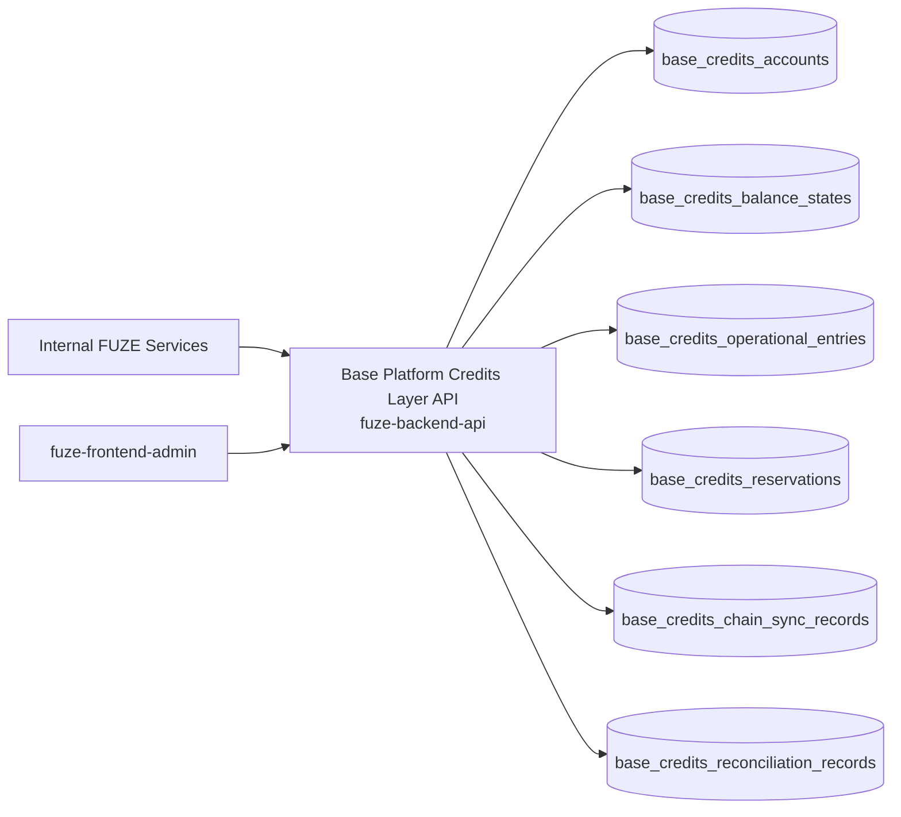
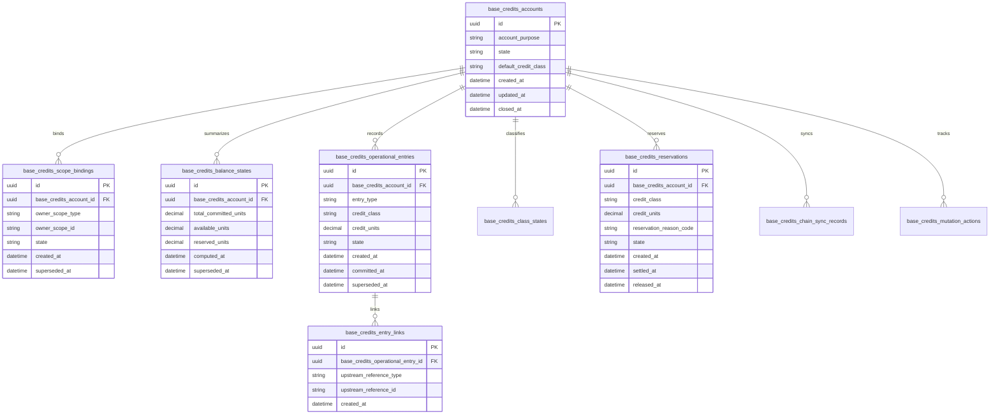
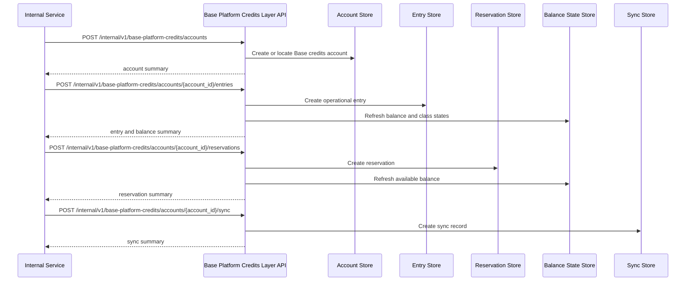

# BASE_PLATFORM_CREDITS_LAYER_API_SPEC

## 1. Title

**BASE_PLATFORM_CREDITS_LAYER_API_SPEC.md**

---

## 2. Document Metadata

- **Document Name:** BASE_PLATFORM_CREDITS_LAYER_API_SPEC.md
- **API Classification:** internal, admin, event-driven, chain-adjacent
- **Owning Domain:** Base Platform Credits Layer Domain
- **Primary Implementing Repo:** `fuze-backend-api`
- **Primary Chain-Adjacent Dependency:** `fuze-contracts`
- **Primary System of Record:** Base credits accounts, Base credits balance states, Base credits issuance commitments, spend state projections, reservation/release projections, chain-synced credits-layer references, and correction-safe Base credits operational lineage in `fuze-backend-api`
- **Status:** Draft for canonical source-of-truth approval
- **Purpose:** Define the production-grade API contract architecture for the FUZE Base Platform Credits layer, including Base-scoped credits issuance representation, scoped balance state coordination, reservation/spend/reversal state projection, chain-adjacent synchronization, and controlled correction-safe lifecycle management across the platform
- **Canonical Folder:** `fuze.ac > docs > api-spec`

---

## 2.1 API Classification Header

- **API Classification:** internal | admin | event-driven | chain-adjacent
- **Owning Domain:** Base Platform Credits Layer Domain
- **Primary Implementing Repo:** `fuze-backend-api`
- **Primary Chain-Adjacent Dependency:** `fuze-contracts`
- **Primary System of Record:** Base credits operational-layer domain

---

## 3. Purpose

This document defines the canonical API specification for FUZE Base Platform Credits layer operations. It translates the governing FUZE platform architecture, Base Platform Credits layer rules, Platform Credits rules, credit ledger and settlement rules, payment rails rules, subscriptions and usage billing rules, refund/reversal rules, chain architecture, and API architecture rules into an implementation-ready API contract.

This API exists because FUZE treats Base as the operational chain environment for Platform Credits. The Base credits layer is therefore not a generic wallet-balance surface and not a replacement for the semantic ledger. It is the chain-adjacent operational representation of the internal consumption unit after verified value has been normalized into Platform Credits and after platform policy has determined ownership scope, credit class, and operational meaning.

The Base Platform Credits layer must remain distinct from:

- Ethereum FUZE token ownership truth,
- external payment-rail verification,
- the semantic credit ledger and settlement domain,
- the Base payout execution layer for stablecoin profit participation,
- and unrestricted market-transfer asset behavior.

Accordingly, this specification defines how Base credits scopes, issuance commitments, operational balance states, reservation/release projections, chain-sync references, and correction lineage are represented, and how Base credits behavior remains auditable, idempotent, and architecture-consistent across FUZE.

---

## 4. Scope

This specification covers:

- internal APIs for Base credits account/scope creation and lifecycle management
- internal APIs for Base-scoped credits issuance representation and committed balance-state updates
- internal APIs for Base reservation, spend, release, reversal, and adjustment state projection
- internal APIs for chain-synchronization references and Base credits reconciliation
- internal read APIs for canonical Base credits operational truth
- admin/control-plane APIs for suspend, resync, correct, rebind_if_allowed, supersede, and discrepancy resolution
- event emission requirements for Base credits operational lifecycle changes
- request, response, error, idempotency, versioning, audit, and database-shape rules for this domain

This specification does **not** redefine:

- the semantic business rules of the credit ledger in full detail
- raw payment verification behavior in full detail
- product billing policy in full detail
- payout-execution or profit-participation semantics
- token ownership truth on Ethereum
- unrestricted public wallet transfer behavior for credits
- final end-user product UI for balances or statements

Those remain governed by their own source-of-truth specifications.

---

## 5. Source-of-Truth Inputs

### Primary FUZE docs and specs used

#### Highest-priority platform and ownership sources
- `SYSTEM_SPEC_INDEX.md`
- `DOCS_SPEC.md`
- `SYSTEM_BOUNDARY_AND_OWNERSHIP_SPEC.md`
- `SYSTEM_OVERVIEW_AND_BOUNDARIES_SPEC.md`
- `PLATFORM_ARCHITECTURE_SPEC.md`
- `DOMAIN_OWNERSHIP_MATRIX_SPEC.md`
- `DATA_MODEL_AND_ENTITY_OWNERSHIP_SPEC.md`
- `ONCHAIN_OFFCHAIN_RESPONSIBILITY_SPEC.md`

#### Primary credits / Base operational-layer sources
- `BASE_PLATFORM_CREDITS_LAYER_SPEC.md`
- `PLATFORM_CREDITS_SPEC.md`
- `CREDIT_LEDGER_AND_SETTLEMENT_SPEC.md`
- `PAYMENT_RAILS_INTEGRATION_SPEC.md`
- `SUBSCRIPTIONS_AND_USAGE_BILLING_SPEC.md`
- `REFUND_REVERSAL_AND_ADJUSTMENT_SPEC.md`
- `PRICING_AND_MONETIZATION_MODEL_SPEC.md`
- `WALLET_AWARE_USER_SPEC.md`
- `BASE_PAYOUT_EXECUTION_LAYER_SPEC.md`
- `CHAIN_ARCHITECTURE_SPEC.md`

#### Core docs inputs
- `FUZE_PLATFORM_CREDITS.md`
- `FUZE_CHAIN_ARCHITECTURE.md`
- `STABLECOIN_PROFIT_PARTICIPATION.md`

#### API and runtime sources
- `API_ARCHITECTURE_SPEC.md`
- `INTERNAL_SERVICE_API_SPEC.md`
- `EVENT_MODEL_AND_WEBHOOK_SPEC.md`
- `IDEMPOTENCY_AND_VERSIONING_SPEC.md`
- `MIGRATION_AND_BACKWARD_COMPATIBILITY_SPEC.md`
- `AUDIT_LOG_AND_ACTIVITY_SPEC.md`

#### Security and operations sources
- `SECURITY_AND_RISK_CONTROL_SPEC.md`
- `MONITORING_ALERTING_AND_INCIDENT_RESPONSE_SPEC.md`
- `SECRETS_CONFIG_AND_ENVIRONMENT_SPEC.md`

#### Format guides
- `The_API_Specification_guide.md`
- `Database_Schemas_Guide.md`

### Highest-priority interpretation applied

For this file, the most important governing interpretation is:

1. Base is the operational chain environment for Platform Credits and is where verified platform value is normalized into the internal consumption unit
2. backend owns canonical Base credits operational truth and Base-side lifecycle coordination
3. Base credits balances must remain scoped to accounts and workspaces under platform policy
4. Base credits issuance, spend, reservation, reversal, and adjustment on the operational layer must remain linked to the semantic ledger rather than replacing it
5. Base credits layer and Base payout execution layer remain separate even though both live on Base
6. Platform Credits remain non-market, account-bound or workspace-bound assets with tightly controlled internal movement rules

### Supporting external standards used only as guidance

- HTTP semantics for internal mutation and status APIs
- structured problem-details error design
- general operational-ledger projection, balance-state synchronization, and correction-lineage patterns as supporting guidance

External guidance does not override FUZE source-of-truth documents.

---

## 6. Governing Architecture and Ownership Interpretation

This API belongs to the **Base Platform Credits Layer Domain** because it owns the canonical lifecycle of:

- Base-scoped credits owner accounts,
- Base operational issuance commitments,
- committed available/reserved state projection,
- Base-side reservation and release posture,
- chain-synchronization references,
- and correction-safe Base operational credits history.

This API is implemented primarily in `fuze-backend-api` because:

- backend owns durable Base credits operational truth
- off-chain business rules and on-chain operational state must be coordinated centrally
- products need one shared Base credits layer rather than product-specific asset models
- reconciliation, correction, and policy enforcement must be backend-governed
- audit generation and discrepancy handling must be centralized

This API is **not** owned by:

- `fuze-frontend-webapp`, because frontend only reads bounded credits state through approved surfaces
- `fuze-frontend-admin`, because admin may correct or resync but must not own Base credits truth
- the semantic credit-ledger domain, because that domain explains why credits changed, while this domain records the Base operational representation
- Ethereum token domain, because Base credits are not FUZE token balances
- Base payout execution domain, because payout execution on Base is a separate bounded economic layer
- external payment domains, because payment verification occurs upstream of Base credits normalization

### Architectural implications

- one owner scope may have one or more Base credits accounts depending on purpose or class policy
- one semantic credits mutation may project to one or more Base operational entries or state changes
- Base available, reserved, and committed states must remain explicit
- product consumption should share one Base credits vocabulary across products
- internal movement rules must remain controlled and not degrade into open transfer behavior
- corrections and supersession must preserve lineage rather than silently rewrite history

---

## 7. Domain Responsibilities

The Base Platform Credits Layer API domain is responsible for:

1. maintaining canonical Base credits owner scopes and Base-scoped account records
2. representing Platform Credits issuance commitments on Base after verified normalization
3. representing spend, reservation, release, reversal, and adjustment state on the Base operational layer
4. recording class-aware credits state across account-scoped and workspace-scoped ownership
5. coordinating chain-sync references and reconciliation status for Base credits operations
6. supporting admin suspend, resync, correct, rebind_if_allowed, supersede, and discrepancy workflows
7. emitting Base credits lifecycle events
8. generating audit lineage for sensitive Base credits actions
9. preserving separation between Base credits, Ethereum token balances, payment verification, and payout execution
10. supporting one shared internal commerce layer across products

The domain is not responsible for:

- owning semantic reason-code truth for all credit mutations
- owning raw payment-rail verification
- owning final billing-policy logic
- owning payout execution or stablecoin claims
- owning FUZE token participation semantics
- enabling unrestricted peer-to-peer credits transfers

---

## 8. Out of Scope

The following are out of scope for this API specification:

- open-market transfer mechanisms for credits
- raw payment-processor webhooks
- full semantic invoice/subscription policy logic
- final Base contract ABI design
- public unauthenticated balance APIs
- final statement/export document UX
- third-party exchange or wallet integration specifics
- payout/claim settlement interfaces

Where later detailed specs are needed, they must remain compatible with this API.

---

## 9. Canonical Entities and Data Ownership

### Durable entities

#### 9.1 base_credits_accounts
- **Owner:** Base Platform Credits Layer Domain
- **Purpose:** canonical Base-scoped credits owner accounts for account or workspace scopes
- **Nature:** source-of-truth durable entity

#### 9.2 base_credits_balance_states
- **Owner:** Base Platform Credits Layer Domain
- **Purpose:** current and historical committed credits balance posture on Base
- **Nature:** source-of-truth durable aggregate entity

#### 9.3 base_credits_operational_entries
- **Owner:** Base Platform Credits Layer Domain
- **Purpose:** Base operational entry records corresponding to issuance, spend, reservation, release, reversal, and adjustment projections
- **Nature:** source-of-truth durable entity

#### 9.4 base_credits_entry_links
- **Owner:** Base Platform Credits Layer Domain
- **Purpose:** linkage from Base operational entries to upstream semantic ledger or billing references
- **Nature:** source-of-truth durable lineage entity

#### 9.5 base_credits_class_states
- **Owner:** Base Platform Credits Layer Domain
- **Purpose:** class-aware state partitions such as paid, bonus, restricted, or future governed classes
- **Nature:** source-of-truth durable entity

#### 9.6 base_credits_reservations
- **Owner:** Base Platform Credits Layer Domain
- **Purpose:** reservation/hold posture at the Base operational layer
- **Nature:** source-of-truth durable entity

#### 9.7 base_credits_scope_bindings
- **Owner:** Base Platform Credits Layer Domain
- **Purpose:** explicit binding of Base credits accounts to account or workspace owner scopes
- **Nature:** source-of-truth durable lineage entity

#### 9.8 base_credits_chain_sync_records
- **Owner:** Base Platform Credits Layer Domain
- **Purpose:** chain-adjacent synchronization checkpoints and sync health lineage for Base credits state
- **Nature:** durable operational lineage entity

#### 9.9 base_credits_reconciliation_records
- **Owner:** Base Platform Credits Layer Domain
- **Purpose:** validation and reconciliation records between semantic credits truth and Base operational state
- **Nature:** durable review/remediation entity

#### 9.10 base_credits_discrepancy_cases
- **Owner:** Base Platform Credits Layer Domain
- **Purpose:** review and remediation records for failed, duplicate, stale, misbound, or inconsistent Base credits state
- **Nature:** durable review/remediation entity

#### 9.11 base_credits_mutation_actions
- **Owner:** Base Platform Credits Layer Domain
- **Purpose:** high-level action records for create, issue, reserve, release, reverse, adjust, resync, suspend, supersede, and resolve discrepancy
- **Nature:** durable action records with audit linkage

#### 9.12 base_credits_audit_events
- **Owner:** Audit / Activity domain, sourced by Base Platform Credits Layer Domain
- **Purpose:** immutable trail for sensitive Base credits actions
- **Nature:** durable audit records

### Derived or cached entities

#### 9.13 base_credits_internal_status_views
- **Owner:** derived read-model layer
- **Purpose:** trusted operational summaries for Base credits accounts and scopes
- **Nature:** derived

#### 9.14 base_credits_product_projection_views
- **Owner:** derived read-model layer
- **Purpose:** bounded product-facing Base credits balance views for approved first-party surfaces
- **Nature:** derived

#### 9.15 base_credits_discrepancy_views
- **Owner:** derived ops read-model layer
- **Purpose:** visibility into failed, stale, duplicate, or inconsistent Base credits conditions
- **Nature:** derived

---

## 10. State Model and Lifecycle

### 10.1 Base credits account lifecycle

Possible states:

- `active`
- `restricted`
- `suspended`
- `closed`
- `superseded`

### 10.2 Base credits operational entry lifecycle

Possible states:

- `created`
- `committed`
- `reserved`
- `released`
- `reversed`
- `adjusted`
- `superseded`

### 10.3 Base credits reservation lifecycle

Possible states:

- `opened`
- `active`
- `settled`
- `released`
- `expired`
- `cancelled`

### 10.4 chain sync lifecycle

Possible states:

- `pending`
- `synced`
- `drift_detected`
- `failed`
- `superseded`

### 10.5 discrepancy lifecycle

Possible states:

- `opened`
- `under_review`
- `resolved`
- `failed`
- `closed`

Lifecycle notes:
- Base credits balance state is derived from committed operational entries and active reservations
- reservations and releases must remain explicit
- sync success and semantic correctness are separate concepts and must both be represented
- corrections and supersession must preserve immutable lineage

---

## 11. API Surface Overview

The API surface is divided into three families:

### 11.1 Internal service APIs
Used by trusted internal services for:
- creating Base credits accounts
- projecting issuance/spend/reservation/release/reversal/adjustment state to Base layer
- recording class-aware balance state
- refreshing chain-sync and reconciliation state
- reading canonical Base credits operational truth

### 11.2 Admin / control-plane APIs
Used by `fuze-frontend-admin` through backend-only privileged routes for:
- suspend, resync, correct, rebind_if_allowed, supersede, and discrepancy actions
- operational repair and visibility-safe correction workflows

### 11.3 Event-driven interfaces
Used for downstream side effects:
- product consumption enforcement
- first-party balance/status projection updates
- audit generation
- anomaly detection and operational review
- transparency and reporting linkage triggers where applicable

No general unauthenticated public mutation surface exists for this domain.

---

## 12. Authentication and Authorization Model

### 12.1 Authentication posture by route family

#### Internal service routes
Require internal service identity with explicit least privilege:
- create Base credits accounts
- write operational entries
- create or settle reservations
- refresh sync and reconciliation state
- read canonical truth

#### Admin routes
Require privileged operator identity plus reason-coded actions:
- suspend or resync accounts
- correct or supersede operational state
- rebind_if_allowed scope ownership under controlled policy
- resolve discrepancy cases

### 12.2 Authorization checkpoints

Authorization must evaluate:
- caller service identity
- allowed owner scope and credits-layer purpose
- whether the caller has issue/reserve/release/reverse/read/resync privilege
- whether admin/operator role is present for privileged actions
- whether current account, entry, or reservation state allows requested mutation

### 12.3 Sensitive action rules

The following require heightened checks:
- class-aware issuance commitment
- reservation or release affecting available balance
- rebind_if_allowed or scope ownership repair
- manual correction or supersession
- suspend or resync actions
- discrepancy-resolution actions

---

## 13. API Endpoints / Interface Contracts

## 13.1 Internal Service APIs

### 13.1.1 `POST /internal/v1/base-platform-credits/accounts`
**Purpose:** create or locate Base credits account for an owner scope  
**Caller Type:** internal trusted service  
**Auth Expectation:** service-to-service identity only  
**Request Body Summary:**
- `owner_scope_type`
- `owner_scope_id`
- optional `account_purpose`
- optional `default_credit_class`
- `idempotency_key`
**Response Summary:** Base credits account summary and current balance-state summary
**Side Effects:** creates account and scope binding if absent
**Idempotency Behavior:** required
**Audit Requirements:** account creation audit where sensitivity requires
**Emitted Events:** `base_platform_credits.account_created`

### 13.1.2 `POST /internal/v1/base-platform-credits/accounts/{base_credits_account_id}/entries`
**Purpose:** record Base operational issuance, spend, adjustment, or reversal entry  
**Caller Type:** internal trusted service  
**Request Body Summary:**
- `entry_type`
- `credit_class`
- `credit_units`
- `upstream_reference_type`
- `upstream_reference_id`
- optional `entry_summary`
- `idempotency_key`
**Response Summary:** Base operational entry summary and updated balance-state summary
**Side Effects:** creates operational entry, link record, class-state update, and balance-state refresh
**Idempotency Behavior:** required
**Audit Requirements:** credits operational-entry audit
**Emitted Events:** `base_platform_credits.entry_committed`

### 13.1.3 `POST /internal/v1/base-platform-credits/accounts/{base_credits_account_id}/reservations`
**Purpose:** create Base-layer reservation against available credits  
**Caller Type:** internal trusted service  
**Request Body Summary:**
- `credit_class`
- `credit_units`
- `reservation_reason_code`
- optional `target_reference`
- `idempotency_key`
**Response Summary:** reservation summary and updated available-balance summary
**Side Effects:** creates reservation and reservation-linked operational posture
**Idempotency Behavior:** required
**Audit Requirements:** reservation audit
**Emitted Events:** `base_platform_credits.reservation_opened`

### 13.1.4 `POST /internal/v1/base-platform-credits/reservations/{base_credits_reservation_id}/settle`
**Purpose:** settle active reservation into committed spend state  
**Caller Type:** internal trusted service  
**Request Body Summary:**
- optional `settlement_summary`
- `idempotency_key`
**Response Summary:** settled reservation summary and updated balance-state summary
**Side Effects:** reservation moves to settled; linked Base operational entry state is finalized
**Idempotency Behavior:** required
**Audit Requirements:** reservation settlement audit
**Emitted Events:** `base_platform_credits.reservation_settled`

### 13.1.5 `POST /internal/v1/base-platform-credits/reservations/{base_credits_reservation_id}/release`
**Purpose:** release active reservation under policy  
**Caller Type:** internal trusted service  
**Request Body Summary:**
- optional `release_reason_code`
- `idempotency_key`
**Response Summary:** released reservation summary and updated available-balance summary
**Side Effects:** reservation moves to released and available balance refreshes
**Idempotency Behavior:** required
**Audit Requirements:** reservation release audit
**Emitted Events:** `base_platform_credits.reservation_released`

### 13.1.6 `POST /internal/v1/base-platform-credits/accounts/{base_credits_account_id}/sync`
**Purpose:** record chain-sync checkpoint for Base credits account state  
**Caller Type:** internal trusted service  
**Request Body Summary:**
- `sync_reference`
- `sync_summary`
- `idempotency_key`
**Response Summary:** chain-sync summary and reconciliation posture
**Side Effects:** creates sync record and may refresh reconciliation state
**Idempotency Behavior:** required
**Audit Requirements:** sync audit where sensitivity requires
**Emitted Events:** `base_platform_credits.synced`

### 13.1.7 `GET /internal/v1/base-platform-credits/accounts/{base_credits_account_id}`
**Purpose:** retrieve canonical Base credits account truth  
**Caller Type:** internal trusted service  
**Response Summary:** full account, scope bindings, class states, balance states, reservations, sync, reconciliation, and discrepancy lineage
**Side Effects:** none

## 13.2 Admin / Control-Plane APIs

### 13.2.1 `POST /admin/v1/base-platform-credits/accounts/{base_credits_account_id}/suspend`
**Purpose:** suspend Base credits account under controlled policy  
**Caller Type:** admin/operator  
**Request Body Summary:**
- `reason_code`
- `operator_note`
- `idempotency_key`
**Response Summary:** suspended account summary
**Side Effects:** account moves to suspended or restricted state
**Audit Requirements:** critical audit
**Emitted Events:** `base_platform_credits.account_suspended`

### 13.2.2 `POST /admin/v1/base-platform-credits/corrections`
**Purpose:** apply controlled correction or superseding Base operational state change  
**Caller Type:** admin/operator  
**Request Body Summary:**
- `target_reference_type`
- `target_reference_id`
- `correction_type`
- `correction_summary`
- `reason_code`
- `operator_note`
- optional `related_case_id`
- `idempotency_key`
**Response Summary:** correction summary and updated balance-state summary
**Side Effects:** creates corrected or superseding Base operational lineage
**Audit Requirements:** critical audit
**Emitted Events:** `base_platform_credits.corrected`

### 13.2.3 `POST /admin/v1/base-platform-credits/accounts/{base_credits_account_id}/rebind`
**Purpose:** rebind Base credits account ownership scope if policy allows  
**Caller Type:** admin/operator  
**Request Body Summary:**
- `new_owner_scope_type`
- `new_owner_scope_id`
- `reason_code`
- `operator_note`
- `idempotency_key`
**Response Summary:** rebinding summary
**Side Effects:** creates superseding scope-binding lineage without erasing prior binding history
**Audit Requirements:** critical audit
**Emitted Events:** `base_platform_credits.rebound`

### 13.2.4 `POST /admin/v1/base-platform-credits/accounts/{base_credits_account_id}/resync`
**Purpose:** force resync and reconciliation of Base credits account state under controlled policy  
**Caller Type:** admin/operator  
**Request Body Summary:**
- `resync_profile`
- `reason_code`
- `operator_note`
- `idempotency_key`
**Response Summary:** resync summary and updated reconciliation posture
**Side Effects:** creates new chain-sync and reconciliation lineage
**Audit Requirements:** critical audit
**Emitted Events:** `base_platform_credits.resynced`

### 13.2.5 `POST /admin/v1/base-platform-credits/discrepancies`
**Purpose:** resolve Base credits discrepancy under controlled policy  
**Caller Type:** admin/operator  
**Request Body Summary:**
- `target_reference_type`
- `target_reference_id`
- `resolution_code`
- `operator_note`
- `related_case_id`
- `idempotency_key`
**Response Summary:** discrepancy-resolution summary
**Side Effects:** may correct, supersede, resync, suspend, or close discrepancy posture with preserved lineage
**Audit Requirements:** critical audit
**Emitted Events:** `base_platform_credits.discrepancy_resolved`

---

## 14. Request Rules

### 14.1 General request rules
- all mutation-capable routes must require JSON requests with explicit content type
- all mutation routes must carry correlation IDs
- sensitive Base credits mutations must carry idempotency keys
- admin mutations must require reason codes and operator notes
- no route may accept frontend-authored credits truth as authoritative input

### 14.2 Sensitive-action request requirements
The following requests require heightened validation:
- account creation for workspace or sensitive scopes
- credits issuance commitments
- reservation settlement or release
- scope rebinding or superseding corrections
- forced resync
- discrepancy-resolution actions

Heightened validation may include:
- owner-scope integrity checks
- upstream semantic-ledger reference checks
- class-state validation
- available-balance and reservation-state checks
- operator role confirmation
- finance/support/security case linkage for sensitive actions

### 14.3 Scope integrity rule
Base Platform Credits mutations must target valid and authorized accounts, bindings, entries, reservations, sync records, and discrepancy records. Services and operators must not mutate unrelated or unauthorized Base credits state.

### 14.4 Layer-separation rule
The Base Platform Credits layer must represent the on-chain operational credits economy, but must not collapse semantic ledger reasoning, payment verification, or payout execution semantics into one ambiguous object.

---

## 15. Response Rules

### 15.1 Success response rules
Successful responses must include:
- stable resource identifiers
- timestamps for created/updated state
- state/status values
- account, entry, reservation, or sync summaries where relevant
- class-state and balance-state summaries where relevant
- correlation references for mutations

### 15.2 Async-accepted response rules
If resync, reconciliation refresh, or discrepancy remediation is async, the response must:
- return accepted status
- include action or job ID
- provide follow-up status semantics

### 15.3 Terminal mutation response rules
Terminal mutation responses must clearly show:
- target account, entry, reservation, sync record, or discrepancy
- mutation type
- resulting state
- correction, rebinding, suspension, or resync effects where relevant
- whether downstream product or first-party surfaces may refresh asynchronously

### 15.4 Read response rules
Read responses must distinguish:
- canonical internal Base operational truth
- current balance-state summary
- reserved versus available posture
- chain-sync and reconciliation posture
- linkage to upstream semantic references rather than replacing them

---

## 16. Error Model

The API uses structured problem-details style error responses.

### 16.1 Required error fields
- `type`
- `title`
- `status`
- `code`
- `detail`
- `instance`
- `correlation_id`

### 16.2 Common error codes

#### Authorization / permission errors
- `BASE_PLATFORM_CREDITS_PERMISSION_DENIED`
- `BASE_PLATFORM_CREDITS_OPERATOR_PERMISSION_DENIED`
- `BASE_PLATFORM_CREDITS_SERVICE_PERMISSION_DENIED`

#### State conflict errors
- `BASE_PLATFORM_CREDITS_ACCOUNT_STATE_INVALID`
- `BASE_PLATFORM_CREDITS_ENTRY_STATE_INVALID`
- `BASE_PLATFORM_CREDITS_RESERVATION_STATE_INVALID`
- `BASE_PLATFORM_CREDITS_SYNC_STATE_INVALID`
- `BASE_PLATFORM_CREDITS_RESYNC_CONFLICT`

#### Policy / safety errors
- `BASE_PLATFORM_CREDITS_SCOPE_BINDING_INVALID`
- `BASE_PLATFORM_CREDITS_UPSTREAM_REFERENCE_REQUIRED`
- `BASE_PLATFORM_CREDITS_INSUFFICIENT_AVAILABLE_BALANCE`
- `BASE_PLATFORM_CREDITS_REBINDING_NOT_ALLOWED`
- `BASE_PLATFORM_CREDITS_DUPLICATE_ENTRY`

#### Request integrity errors
- `BASE_PLATFORM_CREDITS_IDEMPOTENCY_KEY_REQUIRED`
- `BASE_PLATFORM_CREDITS_REQUEST_INVALID`
- `BASE_PLATFORM_CREDITS_REQUEST_UNPROCESSABLE`

#### Dependency or provider errors
- `BASE_PLATFORM_CREDITS_CHAIN_UNAVAILABLE`
- `BASE_PLATFORM_CREDITS_STORAGE_UNAVAILABLE`
- `BASE_PLATFORM_CREDITS_RECONCILIATION_UNAVAILABLE`

### 16.3 Error handling rules
- do not expose hidden internal finance/security detail in low-privilege contexts
- do not imply semantic billing or payment truth from Base operational state alone
- distinguish insufficient available balance from account suspension
- distinguish upstream-reference-required from generic invalid state
- include retry guidance only where safe

---

## 17. Idempotency and Mutation Safety

### 17.1 Required idempotent mutations
The following mutation routes require idempotent behavior:
- Base credits account creation
- operational entry commitment
- reservation creation
- reservation settlement
- reservation release
- chain sync recording
- suspend
- correction
- rebind_if_allowed
- resync
- discrepancy resolution

### 17.2 Idempotency key rules
- mutation requests must supply `Idempotency-Key`
- backend stores key scope, request hash, actor, and terminal result
- replay of same semantic request returns original terminal outcome
- replay of same key with different semantic request must fail with conflict

### 17.3 Mutation safety rules
- one canonical active Base credits account per current owner scope and purpose under current lineage unless explicit supersession exists
- operational entries must maintain referential integrity to upstream semantic references
- reservation settlement and release must not double-consume or double-release credits
- resync and correction flows must preserve prior lineage
- rebinding and supersession must preserve immutable history rather than rewrite prior records

---

## 18. Versioning and Compatibility Rules

### 18.1 Versioning
This API family is versioned under `/internal/v1` and `/admin/v1` route families.

### 18.2 Compatibility approach
- additive evolution preferred
- no silent semantic change to committed, reserved, released, reversed, adjusted, suspended, or superseded states
- new credit classes, owner-scope purposes, or sync-reference types may be added without breaking existing contracts
- response fields may be added but existing meanings must remain stable

### 18.3 Breaking-change rules
Breaking changes include:
- changing the meaning of Base operational balance state
- changing reservation or release lifecycle semantics incompatibly
- removing critical owner-scope or upstream-reference fields
- changing correction, rebinding, or supersession semantics incompatibly

Such changes require explicit migration planning and version evolution.

### 18.4 Deprecation
Deprecated routes or fields must:
- be documented explicitly
- carry deprecation metadata where supported
- preserve compatibility windows long enough for internal consumers

---

## 19. Event Emission and Webhook Behavior

This domain is event-capable.

### 19.1 Internal events
The Base Platform Credits Layer domain must emit canonical internal events such as:
- `base_platform_credits.account_created`
- `base_platform_credits.entry_committed`
- `base_platform_credits.reservation_opened`
- `base_platform_credits.reservation_settled`
- `base_platform_credits.reservation_released`
- `base_platform_credits.synced`
- `base_platform_credits.account_suspended`
- `base_platform_credits.corrected`
- `base_platform_credits.rebound`
- `base_platform_credits.resynced`
- `base_platform_credits.discrepancy_resolved`

### 19.2 Event payload minimums
Each event should contain:
- event ID
- event type
- occurred_at
- Base credits account or reservation reference
- upstream semantic reference where relevant
- owner scope summary
- actor type
- correlation ID
- reason code where applicable

### 19.3 External webhook posture
This specification does not expose general third-party outbound Base credits webhooks by default. Any future outbound credits-status webhook surface must be narrow, security-reviewed, and governed by a separate contract.

---

## 20. Audit and Activity Requirements

The following actions must generate durable audit events:

- Base credits account creation for sensitive scopes
- operational entry commitments for issuance, reversal, or adjustment
- reservation settlement or release
- account suspension, rebinding, correction, and resync actions
- discrepancy-resolution actions
- other sensitive Base credits mutations

### Required audit fields
- audit event ID
- actor type and actor reference
- target account / entry / reservation / sync / discrepancy reference as applicable
- action type
- before/after summary where applicable
- reason code
- correlation ID
- operator note if operator action
- occurred_at

User-facing activity may show selected credits-layer milestones only through bounded downstream surfaces, but canonical internal audit truth remains durable and immutable.

---

## 21. Data Model and Database Schema View

### 21.1 `base_credits_accounts`
- `id` PK
- `account_purpose`
- `state`
- `default_credit_class`
- `created_at`
- `updated_at`
- `closed_at` nullable

**Constraints:**
- index on `state`

### 21.2 `base_credits_scope_bindings`
- `id` PK
- `base_credits_account_id` FK -> `base_credits_accounts.id`
- `owner_scope_type`
- `owner_scope_id`
- `state`
- `created_at`
- `superseded_at` nullable

**Constraints:**
- unique (`base_credits_account_id`, `owner_scope_type`, `owner_scope_id`, `state`)
- index on `base_credits_account_id`

### 21.3 `base_credits_balance_states`
- `id` PK
- `base_credits_account_id` FK -> `base_credits_accounts.id`
- `total_committed_units`
- `available_units`
- `reserved_units`
- `computed_at`
- `superseded_at` nullable

**Constraints:**
- index on `base_credits_account_id`
- index on `computed_at`

### 21.4 `base_credits_operational_entries`
- `id` PK
- `base_credits_account_id` FK -> `base_credits_accounts.id`
- `entry_type`
- `credit_class`
- `credit_units`
- `state`
- `created_at`
- `committed_at` nullable
- `superseded_at` nullable

**Constraints:**
- index on `base_credits_account_id`
- index on `state`

### 21.5 `base_credits_entry_links`
- `id` PK
- `base_credits_operational_entry_id` FK -> `base_credits_operational_entries.id`
- `upstream_reference_type`
- `upstream_reference_id`
- `created_at`

**Constraints:**
- unique (`base_credits_operational_entry_id`, `upstream_reference_type`, `upstream_reference_id`)
- index on `base_credits_operational_entry_id`

### 21.6 `base_credits_class_states`
- `id` PK
- `base_credits_account_id` FK -> `base_credits_accounts.id`
- `credit_class`
- `available_units`
- `reserved_units`
- `computed_at`
- `superseded_at` nullable

**Constraints:**
- index on `base_credits_account_id`
- index on `credit_class`

### 21.7 `base_credits_reservations`
- `id` PK
- `base_credits_account_id` FK -> `base_credits_accounts.id`
- `credit_class`
- `credit_units`
- `reservation_reason_code`
- `target_reference` nullable
- `state`
- `created_at`
- `settled_at` nullable
- `released_at` nullable

**Constraints:**
- index on `base_credits_account_id`
- index on `state`

### 21.8 `base_credits_chain_sync_records`
- `id` PK
- `base_credits_account_id` FK -> `base_credits_accounts.id`
- `sync_reference`
- `sync_summary_json`
- `state`
- `created_at`

**Constraints:**
- index on `base_credits_account_id`
- index on `state`

### 21.9 `base_credits_reconciliation_records`
- `id` PK
- `base_credits_account_id` FK -> `base_credits_accounts.id`
- `state`
- `reconciliation_summary_json`
- `created_at`
- `closed_at` nullable

### 21.10 `base_credits_discrepancy_cases`
- `id` PK
- `target_reference_type`
- `target_reference_id`
- `state`
- `resolution_code` nullable
- `created_at`
- `updated_at`
- `closed_at` nullable

### 21.11 `base_credits_mutation_actions`
- `id` PK
- `target_reference_type`
- `target_reference_id`
- `action_type`
- `state`
- `reason_code`
- `operator_note` nullable
- `requested_by_actor_type`
- `requested_by_actor_id`
- `created_at`
- `executed_at` nullable
- `closed_at` nullable
- `correlation_id`

### 21.12 `idempotency_records`
- `id` PK
- `idempotency_key`
- `scope_family`
- `actor_reference`
- `request_hash`
- `response_hash`
- `terminal_status`
- `created_at`
- `expires_at`

### 21.13 `audit_log_entries`
Domain-sourced audit records written into the audit domain.

### Normalization notes
- canonical Base credits operational truth stays in accounts, bindings, balance states, operational entries, reservations, sync records, and discrepancy records
- semantic credit-ledger truth remains external and referenced
- product-facing balance views must derive from canonical Base operational truth through controlled projections
- Base payout execution and profit-participation states remain separate domains and are not embedded into Base credits state

### Reconciliation notes
- one active account should reconcile to one current owner-scope binding under current lineage
- total, available, and reserved state must reconcile to committed entries and active reservations
- sync records must reconcile to Base operational-layer visibility and internal semantic references
- discrepancy cases must preserve review lineage for failed or conflicting Base credits conditions

---

## 22. Architecture Diagram — Mermaid flowchart



---

## 23. Data Design — Mermaid Diagram



---

## 24. Flow View

### 24.1 Happy path — issue and commit Base credits
1. internal service creates or locates Base credits account for an owner scope
2. verified upstream semantic credits event is provided
3. Base operational entry is committed with class-aware units
4. Base balance state and class state refresh
5. product projections may consume updated available balance

### 24.2 Happy path — reserve and settle
1. product requests reservation against available Base credits
2. backend validates owner scope, class, and available units
3. reservation becomes active and available balance decreases
4. later settlement converts reservation into committed spend posture
5. balance-state summaries refresh and downstream product enforcement continues

### 24.3 Alternate path — reserve and release
1. reservation is created for a potentially variable-cost action
2. action completes below reserved amount or is cancelled
3. reservation is released under policy
4. available balance refreshes
5. history preserves explicit reservation and release lineage

### 24.4 Failure path — invalid scope, duplicate entry, or insufficient balance
1. service attempts to commit or reserve credits
2. backend detects invalid scope binding, duplicate operational entry, or insufficient available balance
3. request is rejected
4. no effective duplicate or invalid Base operational state is created

### 24.5 Failure and remediation path — drift or binding anomaly
1. chain-adjacent state and semantic ledger state diverge or ownership binding is incorrect
2. admin opens correction, rebinding, resync, or discrepancy flow
3. backend preserves prior lineage
4. corrected or superseding Base operational state is created
5. discrepancy closes with preserved history

### 24.6 Suspend path
1. account enters restricted or suspicious posture
2. admin suspends Base credits account
3. new operational writes are blocked or limited under policy
4. downstream product projections reflect restricted posture without rewriting history

### 24.7 Retry behavior
- duplicate account creation returns same canonical Base credits account result
- duplicate entry commitment returns same canonical result or duplicate-safe conflict
- duplicate reservation settlement or release returns same terminal result
- duplicate correction, rebinding, resync, or discrepancy actions return same terminal action result

---

## 25. Data Flows — Mermaid sequenceDiagram



---

## 26. Security and Risk Controls

1. **Base credits truth is backend-owned**  
   Frontends and informal operational surfaces may not authoritatively define Base credits truth.

2. **Layer separation is mandatory**  
   The API must keep Base credits separate from Ethereum token truth, payment verification, semantic ledger explanation, and Base payout execution.

3. **Normalization-before-issuance**  
   Base credits issuance commitments must rely on verified upstream normalization rather than raw payment or raw UI events.

4. **Scoped ownership integrity**  
   Base credits accounts must preserve explicit account-scoped or workspace-scoped ownership.

5. **Least privilege**  
   Internal write and admin suspend/correct/rebind/resync routes must be limited to authorized services and operators.

6. **Immutable lineage for economic changes**  
   Corrections, supersession, rebinding, and discrepancy actions must preserve historical lineage rather than erase prior state.

7. **Non-market posture enforcement**  
   The API must not enable default unrestricted peer-to-peer or open-market credits transfer semantics.

8. **Problem-details discipline**  
   Error bodies must be structured and safe, without exposing hidden internal-only details.

9. **Audit immutability**  
   Sensitive Base credits actions require durable immutable audit lineage.

10. **Reservation integrity**  
    Reservation and release flows must not overstate available balance or imply final semantic settlement beyond allowed layer meaning.

---

## 27. Operational Considerations

- Base credits account and balance reads for trusted systems should be highly available
- operational entry commitment, reservation handling, and sync/reconciliation flows are correctness-sensitive and must preserve commerce integrity
- sync drift, duplicate-entry anomalies, insufficient-balance incidents, and scope-binding issues should surface clearly to ops views
- resync and correction workflows should be observable and retryable
- monitoring should alert on:
  - duplicate operational-entry attempts
  - repeated reservation failures
  - chain-sync drift
  - unusual rebinding or suspension volume
  - reconciliation mismatches between Base operational state and semantic ledger state
  - downstream product projection inconsistency versus canonical Base credits truth

---

## 28. Acceptance Criteria

1. The API preserves the distinction between Base Platform Credits operational truth, semantic credit-ledger truth, payment verification truth, Ethereum token truth, and Base payout execution truth.
2. Only `fuze-backend-api` owns canonical Base credits account, operational-entry, reservation, and sync truth.
3. Base credits accounts, bindings, balance states, operational entries, reservations, sync records, and discrepancy records are durable and backend-owned.
4. Base credits remain explicit account-scoped or workspace-scoped operational balances.
5. Issuance and spend projections require valid upstream semantic references and policy checks.
6. Reservation, release, correction, rebinding, and resync actions preserve immutable lineage.
7. Base credits entry, reservation, correction, and discrepancy actions are idempotent and auditable.
8. Internal and admin Base Platform Credits routes are least-privilege and backend-only.
9. Admin routes require reason-coded privileged authorization.
10. Event emissions exist for major Base credits mutations.
11. Response and error semantics are stable and machine-readable.
12. Database schema separates accounts, bindings, balance states, entries, reservations, sync, reconciliation, and discrepancy layers.
13. Downstream systems can consume canonical Base credits operational outputs without redefining Base credits truth.
14. Discrepancy handling is supported and safely replayable.
15. Mermaid diagrams remain consistent with prose and data model.

---

## 29. Test Cases

### 29.1 Positive cases
1. Internal service creates or locates Base credits account successfully.
2. Internal service commits Base operational entry successfully.
3. Internal service creates reservation successfully.
4. Internal service settles reservation successfully.
5. Internal service releases reservation successfully.
6. Internal service records sync checkpoint successfully.
7. Admin suspends Base credits account successfully.
8. Admin forces resync successfully.

### 29.2 Negative cases
9. Unauthorized service cannot create or mutate Base credits state.
10. Entry commit without valid upstream reference returns `BASE_PLATFORM_CREDITS_UPSTREAM_REFERENCE_REQUIRED`.
11. Reservation exceeding available balance returns `BASE_PLATFORM_CREDITS_INSUFFICIENT_AVAILABLE_BALANCE`.
12. Duplicate entry commitment returns `BASE_PLATFORM_CREDITS_DUPLICATE_ENTRY`.
13. Rebinding on ineligible account/scope returns `BASE_PLATFORM_CREDITS_REBINDING_NOT_ALLOWED`.
14. Resync on incompatible state returns `BASE_PLATFORM_CREDITS_RESYNC_CONFLICT`.

### 29.3 Authorization cases
15. Ordinary user cannot call Base Platform Credits admin APIs.
16. Internal service without reservation privilege cannot create reservation.
17. Operator without suspension privilege cannot suspend Base credits account.
18. Base credits balance state does not imply semantic billing-policy truth or payout rights by itself.

### 29.4 Idempotency and replay cases
19. Repeating account creation with same idempotency key returns original account result.
20. Repeating operational entry commitment with same idempotency key returns original entry result.
21. Repeating reservation settlement with same idempotency key returns original terminal settlement result.
22. Repeating correction or discrepancy resolution with same idempotency key returns original terminal action result.

### 29.5 Concurrency cases
23. Concurrent entry commitments for same upstream reference preserve one canonical operational lineage and one duplicate-safe outcome where appropriate.
24. Concurrent reservation and release actions preserve explicit lifecycle ordering without hidden overwrite.
25. Concurrent rebinding and suspension actions preserve explicit owner-state lineage without ambiguity.

### 29.6 Recovery / admin cases
26. Drift between semantic ledger and Base operational state can be corrected under controlled policy with explicit lineage.
27. Corrected Base credits state remains historically linked to original state.
28. Discrepancy resolution closes scope-binding or sync conflict with preserved audit history.

### 29.7 Event and audit cases
29. Successful Base credits account creation emits `base_platform_credits.account_created`.
30. Successful entry commitment emits `base_platform_credits.entry_committed`.
31. Successful reservation release emits `base_platform_credits.reservation_released`.
32. Successful resync emits `base_platform_credits.resynced`.
33. Successful discrepancy resolution emits `base_platform_credits.discrepancy_resolved` with critical audit lineage.

---

## 30. Open Questions or Explicit Deferred Decisions

1. Exact Base contract/state representation pattern for credits accounts is deferred.
2. Exact class-priority spend ordering policy at the Base layer is deferred.
3. Exact internal movement/rebinding rules between account and workspace scopes are deferred.
4. Exact sync and reconciliation cadence policy is deferred.
5. Exact drift-tolerance thresholds for auto-resync versus manual intervention are deferred.
6. Exact discrepancy taxonomy for Base credits sync and binding conflicts is deferred.

---

## 31. Implementation Notes for `fuze-backend-api`

Recommended backend module layout:

```text
modules/platform/
  base-platform-credits/
  credit-ledger-settlement/
  commerce-billing/
  payout-ledger/
  audit-log/
  control-plane/
  integrations/
```

Implementation guidance:
- keep account identity, scope binding, operational entry commitment, reservation handling, class-state projection, and sync/reconciliation handling in one canonical domain service
- perform scope-integrity, upstream-reference, duplicate-entry, reservation-state, and sync-state checks inside the commit boundary
- keep suspend, correct, rebind_if_allowed, resync, and discrepancy actions explicit and idempotent
- treat admin remediations as domain actions, not ad hoc row edits
- emit events only after canonical state commit succeeds
- publish downstream product-facing balance views from canonical Base credits truth; do not let derived views mutate Base credits state

---

## 32. Frontend Consumption Notes

### For `fuze-frontend-webapp`
- no direct public mutation surface is expected from this domain
- product-facing credits balances should consume bounded downstream projections rather than raw Base operational state directly
- frontend must not infer semantic billing meaning or payout meaning from Base credits balances alone
- frontend should distinguish available versus reserved Base credits when surfaced through approved projections

### For `fuze-frontend-admin`
- may trigger privileged suspend, correction, rebinding, resync, and discrepancy actions only through backend admin APIs
- must require operator reason input for sensitive mutations
- must not directly mutate canonical Base credits truth client-side
- should present immutable Base operational lineage and sync history separately from current status summaries

---

## 33. Contract Derivation Notes

### OpenAPI / AsyncAPI
This spec should later derive into:
- internal account, entry, reservation, settlement, release, sync, and canonical read operations
- admin suspend / correction / rebinding / resync / discrepancy operations
- shared problem-details schema
- Base Platform Credits lifecycle events in AsyncAPI

### Future `fuze-sdk`
Future `fuze-sdk` packages are unlikely to expose raw Base Platform Credits mutation surfaces publicly. Any internal tooling helpers derived from this contract must remain secondary artifacts and must not become the source of truth over this narrative specification.
