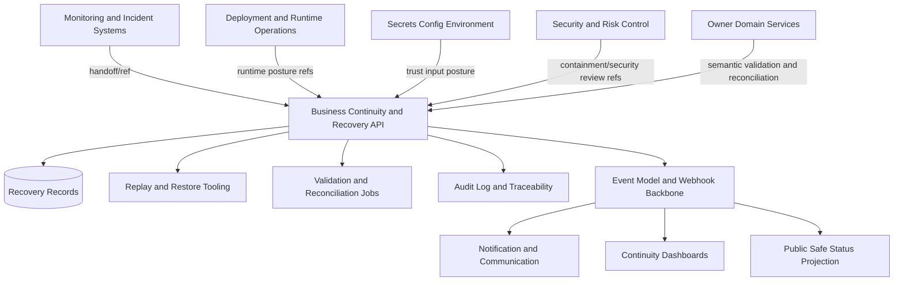
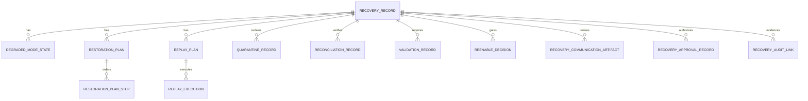
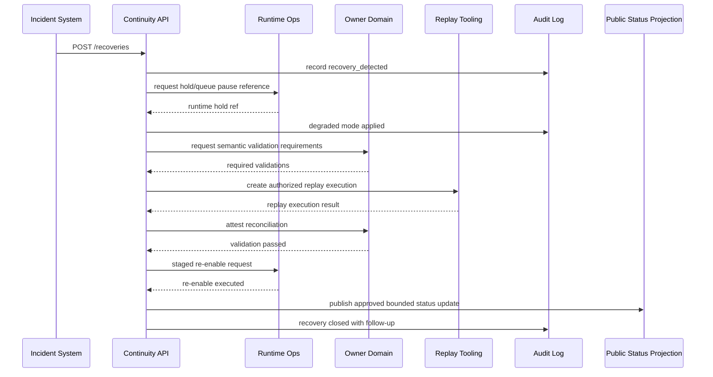

# FUZE Business Continuity and Recovery API Specification

## Document Metadata

- **Document Name:** `BUSINESS_CONTINUITY_AND_RECOVERY_API_SPEC.md`
- **Document Type:** Production-grade API specification
- **Status:** Draft v2 API specification derived from active refined system semantics
- **Version:** 2.0.0
- **Effective Date:** 2026-04-24
- **Last Updated:** 2026-04-24
- **Reviewed On:** 2026-04-24
- **Document Owner:** FUZE Platform Continuity, Recovery, and Resilience Governance Domain, in coordination with FUZE API Architecture and Platform Runtime Operations
- **Approval Authority:** Not explicitly specified in retrieved governing materials; MUST follow the active FUZE approval workflow and refined-system-spec governance posture
- **Review Cadence:** SHOULD be reviewed quarterly and whenever continuity tiers, recovery tooling, incident handoff, runtime topology, replay semantics, backup/restore contracts, public-trust publication posture, secrets/config posture, payout-sensitive flows, or recovery communication rules materially change
- **Governing Layer:** API contract / continuity and recovery control-plane interface / recovery-safe read models and internal service operations
- **Parent Registry:** `API_SPEC_INDEX.md`
- **Primary Semantic Owner:** `BUSINESS_CONTINUITY_AND_RECOVERY_SPEC.md`
- **Primary Upstream References:**
  - `REFINED_SYSTEM_SPEC_INDEX.md`
  - `BUSINESS_CONTINUITY_AND_RECOVERY_SPEC.md`
  - `API_ARCHITECTURE_SPEC.md`
  - `PUBLIC_API_SPEC.md`
  - `INTERNAL_SERVICE_API_SPEC.md`
  - `EVENT_MODEL_AND_WEBHOOK_SPEC.md`
  - `IDEMPOTENCY_AND_VERSIONING_SPEC.md`
  - `MIGRATION_AND_BACKWARD_COMPATIBILITY_SPEC.md`
  - `MONITORING_ALERTING_AND_INCIDENT_RESPONSE_SPEC.md`
  - `DEPLOYMENT_AND_RUNTIME_OPERATIONS_SPEC.md`
  - `SECRETS_CONFIG_AND_ENVIRONMENT_SPEC.md`
  - `SECURITY_AND_RISK_CONTROL_SPEC.md`
  - `AUDIT_LOG_AND_ACTIVITY_SPEC.md`
  - `AUDIT_AND_ACCESS_TRACEABILITY_SPEC.md`
  - `WORKFLOW_AND_AUTOMATION_SPEC.md`
  - `JOB_QUEUE_AND_WORKER_SPEC.md`
  - `FEATURE_FLAG_AND_ROLLOUT_CONTROL_SPEC.md`
  - `DATA_RETENTION_DELETION_AND_ARCHIVAL_SPEC.md`
  - `FILE_OBJECT_AND_ARTIFACT_STORAGE_SPEC.md`
  - `NOTIFICATION_AND_USER_COMMUNICATION_SPEC.md`
  - trust-sensitive owner-domain specs for identity, credits, billing, payout, registry, transparency, governance, treasury, and AI execution
- **Primary Downstream Dependents:**
  - recovery tooling
  - internal continuity dashboards
  - restore, replay, reconciliation, and validation services
  - incident-to-recovery handoff automation
  - support-safe user-impact surfaces
  - public-safe status and continuity communication projections
  - backup/restore implementation contracts
  - after-action and recovery-learning artifacts
- **Supersedes:** No previous active API spec with this filename was found in the retrieved materials. This document supersedes any ad hoc, dashboard-driven, runbook-local, or implementation-local API interpretation that exposes recovery controls without preserving refined recovery truth classes, restoration ordering, replay safety, re-enable validation, and audit lineage.
- **Superseded By:** None currently defined
- **Canonical Status Note:** This API specification governs interface contracts only. It does not redefine continuity and recovery semantics, owner-domain restoration correctness, incident severity, runtime control meaning, secret/config truth, security containment meaning, audit evidence semantics, or public communication semantics.
- **Implementation Status:** Normative target for downstream continuity/recovery API implementation; not by itself evidence that implementation exists
- **Approval Status:** Draft pending explicit approval workflow
- **Change Summary:** Initial v2 production-grade API spec for FUZE continuity and recovery APIs. Defines internal recovery-control surfaces, public/support read surfaces, recovery record lifecycle APIs, degraded-mode APIs, restoration plan APIs, replay/quarantine/reconciliation/validation APIs, communication artifact APIs, idempotency and audit requirements, event contracts, migration posture, diagrams, acceptance criteria, tests, and quality gate.

## Title

FUZE Business Continuity and Recovery API Specification

## Purpose

This specification defines the API contract layer for FUZE business continuity and recovery.

It converts the refined continuity and recovery semantics into concrete interface families for:

1. creating, assessing, updating, and closing recovery records
2. representing degraded mode, containment, partial restoration, validation, re-enable, and closure states
3. managing continuity domains, continuity tiers, blast-radius assessments, and restoration ordering
4. authoring and executing restoration plans
5. planning, authorizing, quarantining, executing, validating, rolling back, or superseding replay operations
6. recording reconciliation and validation results
7. authorizing recovery holds, recovery overrides, and break-glass recovery actions under strict controls
8. exposing safe read models for operators, support, users, public status systems, and public-trust surfaces
9. emitting internal events for downstream notification, monitoring, audit, runtime, worker, and reporting systems
10. preserving semantic separation between recovery truth, incident truth, runtime truth, security truth, config truth, audit truth, owner-domain truth, projection truth, and presentation truth.

This document is governing, not merely descriptive. It defines what API implementations MUST preserve so recovery tooling cannot become a hidden owner of canonical domain truth.

## Scope

This API spec governs:

- internal control-plane APIs for recovery record lifecycle management
- internal service APIs for degraded-mode state, recovery holds, restoration planning, replay, quarantine, reconciliation, validation, re-enable, and closure
- read-model APIs for continuity dashboards, support-safe user-impact views, public-status projections, and after-action reporting
- event and webhook-adjacent contracts for recovery lifecycle changes
- idempotency, optimistic concurrency, audit lineage, reason-code, and approval-link requirements for recovery mutations
- permission boundaries for recovery visibility and mutation authority
- versioning, migration, compatibility, and deprecation posture for recovery APIs
- quality gates for implementation readiness

## Out of Scope

This API spec does not define:

- exact cloud-region topology, backup product, replication vendor, container system, or database technology
- per-service RTO/RPO numeric targets
- full table-level restore runbooks or infrastructure commands
- exact legal disclosure text or jurisdiction-specific notification obligations
- owner-domain business correction semantics
- incident severity definitions beyond continuity handoff references
- security compromise determination semantics
- secret payload handling or credential rotation implementation
- full public-status page design or notification copy

These belong to adjacent specifications, implementation contracts, and runbooks, provided they preserve this API spec's contract semantics.

## Design Goals

The API design goals are:

1. make recovery state machine transitions explicit and auditable
2. separate continuity/recovery truth from incident, runtime, security, config, audit, and owner-domain truths
3. prevent replay, restore, or rebuild APIs from duplicating meaning-bearing mutations
4. make degraded mode and recovery holds first-class API states rather than ad hoc flags
5. support restoration ordering aligned to trust sensitivity and dependency boundaries
6. keep public and support-facing continuity information bounded and derived from canonical recovery records
7. require idempotency and correlation for every mutation that may be retried during disruption
8. allow safe staged re-enable while preserving rollback, renewed containment, and validation failure paths
9. ensure recovery APIs are usable during degraded conditions without silently widening authority
10. make downstream event, audit, monitoring, and notification integrations deterministic.

## Non-Goals

This API design is not intended to:

- provide generic infrastructure orchestration endpoints for arbitrary vendors
- turn dashboards into recovery truth owners
- let support, incident, or runtime tools modify owner-domain state directly
- expose sensitive recovery details through public APIs
- make all recovery actions public or customer-visible
- infer recovery completion from process restart or green dashboards
- implement domain-level corrections in the continuity API layer
- bypass owner-domain review for high-sensitivity or critical replay and re-enable actions.

## Canonical API Principles

1. **Recovery truth is canonical only inside the recovery domain.** Recovery APIs own recovery records, recovery stages, degraded-mode posture, replay authorization, validation references, and re-enable decisions, not owner-domain business truth.
2. **Owner-domain truth remains authoritative.** Identity, credits, billing, payout, registry, transparency, governance, treasury, workflow, and AI domains decide whether their own restored state is semantically correct.
3. **Replay requires semantics.** Replay APIs MUST require scope, owner-domain approval where needed, idempotency lineage, causation references, and validation outcomes.
4. **Degraded mode is explicit.** API responses MUST distinguish read-only, queued, delayed, held, unavailable, rebuilding, stale, quarantined, and partially re-enabled states.
5. **Re-enable is staged and validated.** API contracts MUST NOT equate restore execution, runtime health, or incident resolution with full recovery closure.
6. **Break-glass is bounded.** Emergency recovery actions MUST be reason-coded, time-bounded, approval-linked where applicable, audit-linked, and scope-limited.
7. **Public-safe surfaces are derived.** Public or user-visible continuity APIs consume canonical recovery records and approved communication artifacts but never expose internal recovery evidence by default.
8. **Everything material is reconstructible.** Recovery mutations, approvals, validation results, replay actions, and overrides MUST emit audit and correlation references.

## Truth Classes

APIs MUST preserve the following truth classes:

| Truth class | API ownership posture | Examples |
|---|---|---|
| Recovery truth | Owned by this API family | recovery records, stages, degraded modes, restoration plans, replay plans, validation records, re-enable state |
| Owner-domain truth | Referenced, not owned | account truth, credits ledger truth, billing truth, payout truth, registry truth, transparency truth, governance truth |
| Incident truth | Referenced, not owned | incident ids, severity, incident state, incident commander |
| Runtime truth | Referenced, not owned | service status, deployment, queue pause, worker resume, runtime containment |
| Security/risk truth | Referenced, not owned | compromise posture, security hold, risk restrictions |
| Config/environment truth | Referenced, not owned | environment id, service identity, config version, secret posture |
| Audit truth | Produced as evidence references, not redefined | audit log ids, actor, reason code, approval ids |
| Projection/reporting truth | Derived | dashboards, support views, public status, after-action summaries |
| Presentation truth | Derived | user-facing messages, status copy, notification text |

## API Surface Families

### Family A: Internal Recovery Control API

- **Audience:** Platform reliability, continuity governance, incident command, authorized runtime operators, security reviewers, owner-domain recovery participants.
- **Authentication:** Internal service authentication plus user/operator identity for human-driven actions.
- **Authorization:** Scope-aware, domain-aware, sensitivity-aware permissions. Visibility does not imply mutation authority.
- **Primary use:** Recovery records, restoration plans, degraded mode, holds, replay, quarantine, reconciliation, validation, re-enable, closure.
- **Base path:** `/internal/v2/continuity`

### Family B: Owner-Domain Recovery Integration API

- **Audience:** Owner-domain services and domain remediation tools.
- **Authentication:** Service-to-service identity.
- **Authorization:** Owner-domain scoped; cannot operate on unrelated domain truth.
- **Primary use:** Domain recovery checkpoints, semantic validation attestations, reconciliation outcomes, replay safety decisions.
- **Base path:** `/internal/v2/continuity/domain-integrations`

### Family C: Support and Operations Read API

- **Audience:** Support operators, internal dashboards, incident coordination tools.
- **Authentication:** Human or service identity.
- **Authorization:** Least-privilege read scopes; sensitive evidence redacted unless explicitly allowed.
- **Primary use:** Impact summaries, current degraded mode, affected capabilities, safe user-impact statements, recovery ETA classes if approved.
- **Base path:** `/ops/v2/continuity`

### Family D: Public-Safe Continuity Status API

- **Audience:** Public site, status page, partner-safe public projections, users where approved.
- **Authentication:** Public or authenticated depending on surface.
- **Authorization:** Only approved public-safe fields.
- **Primary use:** General service availability, degradation status, published communication artifacts, stale/limited public-trust indicators.
- **Base path:** `/v2/status/continuity`

### Family E: Event and Webhook Projection API

- **Audience:** Internal event bus, notification systems, audit systems, monitoring systems, derived public-status systems.
- **Authentication:** Internal event signing and consumer authentication.
- **Authorization:** Consumer-specific event family subscriptions.
- **Primary use:** Recovery lifecycle events and derived projection refresh.

## Canonical Resource Model

### `RecoveryRecord`

Canonical record representing a continuity/recovery event.

Required fields:

```json
{
  "recovery_id": "rec_01J...",
  "status": "degraded",
  "stage": "preservation_and_containment",
  "severity_hint": "high",
  "continuity_domains": ["credits", "workflow"],
  "recovery_tier": "high",
  "truth_classes_at_risk": ["owner_domain_truth", "runtime_truth", "audit_truth"],
  "incident_id": "inc_01J...",
  "environment_ref": "env_prod",
  "affected_surface_refs": ["api:credits", "worker:credit_settlement"],
  "blast_radius": {
    "scope_type": "workspace_subset",
    "tenant_count": 13,
    "capability_refs": ["credits.spend", "credits.balance_projection"]
  },
  "canonical_owner_refs": ["credits_domain"],
  "current_degraded_modes": ["writes_held", "read_projection_stale"],
  "created_at": "2026-04-24T00:00:00Z",
  "updated_at": "2026-04-24T00:10:00Z",
  "created_by": "usr_...",
  "reason_code": "provider_replay_uncertainty",
  "audit_ref": "aud_...",
  "version": 7
}
```

Allowed `status` values:

- `detected`
- `assessed`
- `degraded`
- `contained`
- `restore_in_progress`
- `validation_pending`
- `partially_reenabled`
- `fully_reenabled`
- `closed_with_followup`
- `superseded`
- `cancelled_invalid`

Allowed `stage` values:

- `detection_and_assessment`
- `preservation_and_containment`
- `restoration_planning`
- `restore_replay_rebuild_execution`
- `reconciliation_and_validation`
- `controlled_reenablement`
- `closure_and_improvement`

### `ContinuityDomain`

A domain or capability family governed by recovery posture.

Required fields:

- `continuity_domain_id`
- `domain_key`
- `owner_domain_ref`
- `recovery_tier`
- `critical_truth_classes`
- `restore_priority_rank`
- `safe_degraded_modes`
- `requires_owner_validation`
- `requires_security_review`
- `requires_public_trust_review`
- `default_reenable_policy`

Canonical domain keys SHOULD include:

- `identity_access`
- `workspace_access`
- `payments`
- `credits`
- `subscriptions_entitlements`
- `workflow_async`
- `ai_execution`
- `files_artifacts`
- `registry_publication`
- `transparency_reporting`
- `governance_treasury`
- `payouts`
- `public_api`
- `internal_api`
- `notifications`

### `DegradedModeState`

Represents bounded reduced behavior.

Allowed degraded mode types:

- `read_only`
- `writes_held`
- `queue_acceptance_only`
- `queue_consumption_paused`
- `publication_hold`
- `public_status_limited`
- `cache_stale_marked`
- `safe_reads_only`
- `provider_fallback_disabled`
- `manual_review_required`
- `claim_open_hold`
- `external_callback_hold`
- `support_visibility_limited`
- `service_unavailable`

Required fields:

- `degraded_mode_id`
- `recovery_id`
- `mode_type`
- `scope`
- `effective_from`
- `effective_until` nullable
- `applied_by`
- `reason_code`
- `related_runtime_action_ref` nullable
- `related_feature_flag_ref` nullable
- `audit_ref`

### `RestorationPlan`

A governed plan for recovery execution.

Required fields:

- `restoration_plan_id`
- `recovery_id`
- `status`
- `ordered_steps`
- `dependency_refs`
- `approval_requirements`
- `security_review_required`
- `owner_validation_required`
- `public_trust_validation_required`
- `rollback_or_recontainment_strategy`
- `audit_ref`

Allowed statuses:

- `draft`
- `under_review`
- `approved`
- `executing`
- `blocked`
- `completed`
- `superseded`
- `cancelled`

### `ReplayPlan`

A controlled replay/rebuild/re-drive plan.

Required fields:

- `replay_plan_id`
- `recovery_id`
- `domain_key`
- `scope`
- `source_event_range`
- `idempotency_strategy`
- `causation_refs`
- `expected_side_effects`
- `duplicate_prevention_rules`
- `quarantine_policy`
- `approval_state`
- `status`
- `audit_ref`

Allowed statuses:

- `planned`
- `authorized`
- `quarantined`
- `executing`
- `validated`
- `rolled_back`
- `superseded`
- `failed`

### `QuarantineRecord`

Required fields:

- `quarantine_id`
- `recovery_id`
- `object_type`
- `object_ref`
- `quarantine_reason`
- `detected_at`
- `review_state`
- `resolution_state`
- `owner_domain_ref`
- `audit_ref`

### `ReconciliationRecord`

Required fields:

- `reconciliation_id`
- `recovery_id`
- `domain_key`
- `source_truth_ref`
- `derived_surface_ref`
- `check_type`
- `status`
- `mismatch_summary` nullable
- `correction_required`
- `owner_attestation_ref` nullable
- `audit_ref`

Allowed statuses:

- `not_started`
- `running`
- `passed`
- `failed`
- `partial`
- `expired`

### `ValidationRecord`

Required fields:

- `validation_id`
- `recovery_id`
- `validation_type`
- `target_ref`
- `required_for_reenable`
- `status`
- `performed_by`
- `performed_at`
- `evidence_refs`
- `expires_at` nullable
- `audit_ref`

Validation types SHOULD include:

- `owner_domain_semantic_validation`
- `runtime_health_validation`
- `queue_replay_validation`
- `config_environment_validation`
- `security_clearance_validation`
- `public_trust_publication_validation`
- `derived_surface_coherence_validation`
- `support_communication_validation`

### `ReenableDecision`

Required fields:

- `reenable_decision_id`
- `recovery_id`
- `target_ref`
- `scope`
- `decision_state`
- `required_validation_refs`
- `approved_by`
- `reason_code`
- `staged_rollout_plan_ref` nullable
- `rollback_or_recontainment_ref` nullable
- `audit_ref`

Allowed decision states:

- `requested`
- `blocked_validation_missing`
- `approved_partial`
- `approved_full`
- `denied`
- `executed`
- `recontained`

### `RecoveryCommunicationArtifact`

Represents communication posture, not actual recovery truth.

Required fields:

- `communication_artifact_id`
- `recovery_id`
- `audience`
- `state`
- `summary`
- `approved_by` nullable
- `published_at` nullable
- `supersedes_artifact_id` nullable
- `source_recovery_version`
- `audit_ref`

Allowed audiences:

- `internal_incident`
- `support_internal`
- `customer_authenticated`
- `partner_bounded`
- `public_status`
- `public_trust`

Allowed states:

- `drafted_internal`
- `approved_internal`
- `published_external`
- `corrected`
- `withdrawn`
- `superseded`

## Endpoint Catalogue

### Recovery Records

#### `POST /internal/v2/continuity/recoveries`

Creates a canonical recovery record.

Required headers:

- `Authorization`
- `X-FUZE-Actor-Id`
- `Idempotency-Key`
- `X-FUZE-Reason-Code`
- `X-FUZE-Correlation-Id`

Request body:

```json
{
  "incident_id": "inc_01J...",
  "continuity_domains": ["credits", "workflow_async"],
  "initial_recovery_tier": "high",
  "truth_classes_at_risk": ["owner_domain_truth", "runtime_truth", "audit_truth"],
  "affected_surface_refs": ["svc:credits-api", "worker:credit-settlement"],
  "environment_ref": "env_prod",
  "assessment_summary": "Credit settlement worker consumed provider callback backlog with uncertain replay safety.",
  "requested_initial_degraded_modes": ["queue_consumption_paused", "writes_held"],
  "reason_code": "replay_safety_uncertain"
}
```

Response `201 Created`:

```json
{
  "recovery": { "recovery_id": "rec_01J...", "status": "detected", "version": 1 },
  "audit_ref": "aud_01J...",
  "links": {
    "self": "/internal/v2/continuity/recoveries/rec_01J..."
  }
}
```

Rules:

- MUST be idempotent by `Idempotency-Key` and normalized request hash.
- MUST NOT create owner-domain corrections.
- MUST link to incident if known, but MUST allow recovery records without incident when continuity assessment precedes formal incident handoff.
- MUST emit `continuity.recovery_detected` after durable commit.

#### `GET /internal/v2/continuity/recoveries/{recovery_id}`

Returns full internal recovery record subject to permission.

Query parameters:

- `include=plans,validations,replays,communications,audit_refs,quarantine,reconciliations`

Rules:

- MUST redact sensitive evidence refs unless caller has explicit evidence-read permission.
- MUST include `version` for optimistic concurrency.

#### `PATCH /internal/v2/continuity/recoveries/{recovery_id}`

Updates recovery assessment metadata or transitions stage/status.

Required headers:

- `If-Match: W/"<version>"`
- `Idempotency-Key`
- `X-FUZE-Reason-Code`

Rules:

- MUST enforce allowed state transitions.
- MUST reject closure unless required validation and follow-up rules are satisfied.
- MUST emit recovery lifecycle events after durable commit.

#### `POST /internal/v2/continuity/recoveries/{recovery_id}/assess`

Records or updates continuity assessment.

Request body:

```json
{
  "blast_radius": { "scope_type": "capability", "capability_refs": ["credits.spend"] },
  "availability_loss": true,
  "correctness_loss_suspected": true,
  "public_trust_risk": false,
  "recommended_recovery_tier": "high",
  "recommended_degraded_modes": ["writes_held", "queue_consumption_paused"],
  "assessment_notes": "Provider callbacks may have been accepted twice. Writes must remain held pending reconciliation."
}
```

Rules:

- MUST distinguish availability loss from correctness loss.
- MUST default to stricter tier on ambiguity.
- MUST NOT downgrade tier without reason code and authorization.

#### `POST /internal/v2/continuity/recoveries/{recovery_id}/close`

Closes recovery with follow-up linkage.

Request body:

```json
{
  "closure_summary": "Credits replay validated; worker re-enabled in staged scope; remaining dashboard lag tracked separately.",
  "followup_refs": ["followup_01J..."],
  "accepted_limitations": ["Public dashboard projection may remain stale for up to 15 minutes with stale marker."],
  "final_validation_refs": ["val_01J...", "recn_01J..."]
}
```

Rules:

- MUST require closure validation and explicit unresolved follow-up treatment.
- MUST preserve lineage even when incident is already resolved.

### Degraded Mode and Holds

#### `POST /internal/v2/continuity/recoveries/{recovery_id}/degraded-modes`

Applies a degraded mode.

Request body:

```json
{
  "mode_type": "writes_held",
  "scope": { "type": "capability", "refs": ["credits.spend"] },
  "effective_until": null,
  "related_runtime_action_ref": "runtime_hold_01J...",
  "reason_code": "write_correctness_uncertain"
}
```

Rules:

- MUST create a durable recovery-domain record.
- MAY call runtime, feature-flag, queue, or publication-hold systems only through approved adjacent APIs.
- MUST NOT claim business correction.

#### `DELETE /internal/v2/continuity/recoveries/{recovery_id}/degraded-modes/{degraded_mode_id}`

Removes or expires a degraded mode.

Rules:

- MUST require re-enable validation for high or critical domains.
- MUST reject removal if owner-domain or security hold remains active.

### Restoration Plans

#### `POST /internal/v2/continuity/recoveries/{recovery_id}/restoration-plans`

Creates a restoration plan.

Request body:

```json
{
  "ordered_steps": [
    {
      "step_key": "preserve_credits_ledger",
      "step_type": "canonical_truth_preservation",
      "target_ref": "domain:credits",
      "required_before": ["resume_credit_worker"]
    },
    {
      "step_key": "resume_credit_worker",
      "step_type": "runtime_reenable",
      "target_ref": "worker:credit-settlement",
      "required_validations": ["owner_domain_semantic_validation", "queue_replay_validation"]
    }
  ],
  "approval_requirements": ["credits_owner", "reliability_lead"],
  "rollback_or_recontainment_strategy": "If validation fails, restore queue hold and quarantine replay outputs."
}
```

Rules:

- MUST represent ordering explicitly.
- MUST prefer canonical truth preservation and containment before mutation restoration.
- MUST support supersession rather than destructive edits once execution starts.

#### `POST /internal/v2/continuity/restoration-plans/{restoration_plan_id}/approve`

Approves a restoration plan.

Rules:

- MUST require authorization matching tier and affected domains.
- MUST create audit evidence with actor, scope, reason, and approval refs.

#### `POST /internal/v2/continuity/restoration-plans/{restoration_plan_id}/execute-step`

Marks a restoration step as executing/completed/blocked.

Rules:

- MUST enforce dependencies.
- MUST require related runtime/action refs for steps that invoke adjacent control systems.

### Replay, Rebuild, and Quarantine

#### `POST /internal/v2/continuity/recoveries/{recovery_id}/replay-plans`

Creates a replay plan.

Request body:

```json
{
  "domain_key": "credits",
  "scope": { "type": "event_range", "from_event_id": "evt_100", "to_event_id": "evt_200" },
  "source_event_range": { "stream": "payment.provider.normalized", "from_offset": 440, "to_offset": 513 },
  "idempotency_strategy": "domain_mutation_idempotency_key",
  "causation_refs": ["provider_batch_abc"],
  "expected_side_effects": ["credits_ledger_entries"],
  "duplicate_prevention_rules": ["reject_existing_mutation_key", "quarantine_conflicting_provider_ref"],
  "quarantine_policy": "quarantine_on_existing_credit_mutation_or_unmatched_ref"
}
```

Rules:

- MUST default to `planned`.
- MUST NOT execute without authorization.
- MUST require owner-domain review for high or critical domains.
- MUST reject replay scope that lacks idempotency strategy.

#### `POST /internal/v2/continuity/replay-plans/{replay_plan_id}/authorize`

Authorizes replay.

Rules:

- MUST require owner-domain approval where replay can affect business meaning.
- MUST require security review if compromise or trust-input ambiguity exists.

#### `POST /internal/v2/continuity/replay-plans/{replay_plan_id}/execute`

Starts replay execution through approved worker/workflow systems.

Rules:

- MUST execute through owner-domain or workflow/worker APIs; the continuity API must not mutate owner-domain records directly.
- MUST create execution correlation refs.
- MUST support partial failure and quarantine.

#### `POST /internal/v2/continuity/recoveries/{recovery_id}/quarantine-records`

Creates a quarantine record.

Rules:

- MUST isolate suspect records, events, artifacts, or workloads from normal progression.
- MUST not delete or silently correct quarantined objects.

### Reconciliation and Validation

#### `POST /internal/v2/continuity/recoveries/{recovery_id}/reconciliations`

Creates a reconciliation job or record.

Request body:

```json
{
  "domain_key": "credits",
  "source_truth_ref": "ledger:credits_mutation_log",
  "derived_surface_ref": "projection:workspace_credit_balance",
  "check_type": "canonical_vs_projection_balance",
  "scope": { "workspace_ids": ["wrk_123"] }
}
```

Rules:

- MUST distinguish canonical truth from derived surfaces.
- MUST mark derived surfaces non-authoritative if reconciliation fails.

#### `POST /internal/v2/continuity/recoveries/{recovery_id}/validations`

Creates a validation record.

Rules:

- MUST record `validation_type`, `target_ref`, `status`, evidence refs, and expiration where applicable.
- MUST preserve owner-domain attestation references for semantic validations.

#### `POST /internal/v2/continuity/validations/{validation_id}/attest`

Owner-domain or authorized reviewer attests validation result.

Request body:

```json
{
  "status": "passed",
  "attestation_summary": "Credits ledger and projection reconciliation passed for affected scope.",
  "evidence_refs": ["query_result_ref_01J..."],
  "expires_at": "2026-04-24T06:00:00Z"
}
```

Rules:

- MUST not accept stale validation for re-enable if `expires_at` has passed.
- MUST require actor identity and scope authorization.

### Re-enable Decisions

#### `POST /internal/v2/continuity/recoveries/{recovery_id}/reenable-decisions`

Requests re-enable for a target capability or surface.

Request body:

```json
{
  "target_ref": "worker:credit-settlement",
  "scope": { "type": "workspace_subset", "refs": ["wrk_123"] },
  "required_validation_refs": ["val_01J...", "recn_01J..."],
  "requested_state": "approved_partial",
  "staged_rollout_plan_ref": "rollout_01J...",
  "rollback_or_recontainment_ref": "runtime_hold_rollback_01J..."
}
```

Rules:

- MUST reject if required validation missing, failed, expired, or unauthorized.
- MUST preserve partial-vs-full distinction.
- MUST not imply incident closure.

### Communication Artifacts

#### `POST /internal/v2/continuity/recoveries/{recovery_id}/communications`

Creates a recovery communication artifact.

Rules:

- MUST distinguish internal/support/public audiences.
- MUST derive from a specific recovery record version.
- MUST not expose sensitive evidence or operator controls to public surfaces.

#### `GET /v2/status/continuity/current`

Public-safe current continuity status.

Response example:

```json
{
  "status": "degraded",
  "affected_capabilities": [
    {
      "capability": "credits balance display",
      "state": "stale_marked",
      "message": "Some balance views may be delayed. Credits mutation records remain protected."
    }
  ],
  "last_updated_at": "2026-04-24T00:15:00Z",
  "source": "approved_public_status_projection"
}
```

Rules:

- MUST be derived from approved communication/public status projections.
- MUST not expose internal recovery ids unless approved.
- MUST mark stale, partial, or unavailable status rather than implying unsupported certainty.

## Error Model

All APIs MUST use the FUZE standard error envelope:

```json
{
  "error": {
    "code": "RECOVERY_VALIDATION_REQUIRED",
    "message": "Cannot re-enable target because required validation has not passed.",
    "details": {
      "missing_validation_types": ["owner_domain_semantic_validation"]
    },
    "correlation_id": "corr_01J...",
    "retryable": false
  }
}
```

Canonical error codes:

- `RECOVERY_NOT_FOUND`
- `RECOVERY_STATE_CONFLICT`
- `RECOVERY_INVALID_TRANSITION`
- `RECOVERY_TIER_REQUIRES_APPROVAL`
- `RECOVERY_VALIDATION_REQUIRED`
- `RECOVERY_VALIDATION_EXPIRED`
- `REPLAY_IDEMPOTENCY_STRATEGY_REQUIRED`
- `REPLAY_OWNER_DOMAIN_APPROVAL_REQUIRED`
- `REPLAY_SCOPE_UNSAFE`
- `QUARANTINE_REQUIRED`
- `REENABLE_BLOCKED_BY_HOLD`
- `REENABLE_BLOCKED_BY_SECURITY_REVIEW`
- `PUBLIC_STATUS_NOT_APPROVED`
- `COMMUNICATION_AUDIENCE_FORBIDDEN`
- `EVIDENCE_ACCESS_DENIED`
- `RECOVERY_CONCURRENCY_CONFLICT`
- `RECOVERY_IDEMPOTENCY_CONFLICT`
- `RECOVERY_SCOPE_FORBIDDEN`
- `RECOVERY_BREAK_GLASS_REQUIRED`
- `RECOVERY_BREAK_GLASS_FORBIDDEN`

HTTP mapping:

- `400` invalid request or unsafe missing field
- `401` unauthenticated
- `403` authenticated but forbidden by role/scope/tier/audience
- `404` not found or caller lacks visibility
- `409` state transition, concurrency, or idempotency conflict
- `412` `If-Match` precondition failed
- `422` semantically unsafe recovery/replay/reenable request
- `429` rate limited
- `500` internal error
- `503` continuity API temporarily degraded; MUST preserve accepted writes if acknowledged

## Idempotency and Concurrency

- Every mutation endpoint MUST accept `Idempotency-Key`.
- Every material transition MUST use optimistic concurrency via `If-Match` or equivalent version predicate.
- Repeated identical mutation requests MUST return the original result.
- Same idempotency key with different normalized request body MUST return `RECOVERY_IDEMPOTENCY_CONFLICT`.
- Replay execution MUST use both API idempotency and owner-domain idempotency/causation strategy.
- Recovery closure and re-enable decisions MUST be retry-safe.

## Authentication and Authorization

Required authorization scopes SHOULD include:

- `continuity.recovery.read`
- `continuity.recovery.write`
- `continuity.recovery.assess`
- `continuity.recovery.close`
- `continuity.degraded_mode.apply`
- `continuity.degraded_mode.remove`
- `continuity.restoration_plan.write`
- `continuity.restoration_plan.approve`
- `continuity.replay.plan`
- `continuity.replay.authorize`
- `continuity.replay.execute`
- `continuity.quarantine.write`
- `continuity.validation.write`
- `continuity.validation.attest`
- `continuity.reenable.request`
- `continuity.reenable.approve`
- `continuity.communication.write`
- `continuity.public_status.publish`
- `continuity.evidence.read`
- `continuity.break_glass.execute`

Authorization rules:

1. Read access to dashboards does not imply write access to recovery controls.
2. Replay authorization for high or critical domains requires owner-domain permission.
3. Critical recovery actions require stronger approval and may require restricted control-plane execution.
4. Public communication publication requires communication/public-trust authority.
5. Evidence read is separate from recovery record read.
6. Support-safe read scopes MUST redact internal controls, sensitive evidence, security details, and privileged operator paths.

## Audit and Traceability Requirements

Every material mutation MUST record:

- actor id
- actor type
- service principal where applicable
- reason code
- recovery id
- affected domain/scope
- previous state
- new state
- validation/approval refs where applicable
- incident ref where applicable
- runtime/security/config refs where applicable
- idempotency key hash
- correlation id
- timestamp
- audit reference

Audit MUST be sufficient to answer:

- what was degraded or held
- why recovery was initiated
- who authorized replay or re-enable
- which validations passed or failed
- whether owner-domain semantic correctness was confirmed
- what public communication was derived and when
- what remains unresolved after closure.

## Event Contracts

Events MUST be emitted only after durable canonical commit.

Required event families SHOULD include:

- `continuity.recovery_detected`
- `continuity.recovery_assessed`
- `continuity.degraded_mode_applied`
- `continuity.degraded_mode_removed`
- `continuity.recovery_contained`
- `continuity.restoration_plan_created`
- `continuity.restoration_plan_approved`
- `continuity.restoration_step_started`
- `continuity.restoration_step_completed`
- `continuity.replay_plan_created`
- `continuity.replay_authorized`
- `continuity.replay_started`
- `continuity.replay_quarantined`
- `continuity.replay_validated`
- `continuity.reconciliation_started`
- `continuity.reconciliation_failed`
- `continuity.reconciliation_passed`
- `continuity.validation_recorded`
- `continuity.reenable_requested`
- `continuity.reenable_approved`
- `continuity.reenable_executed`
- `continuity.communication_published`
- `continuity.recovery_closed`

Base event envelope:

```json
{
  "event_id": "evt_01J...",
  "event_type": "continuity.recovery_assessed",
  "event_version": "2.0",
  "occurred_at": "2026-04-24T00:00:00Z",
  "producer": "continuity-api",
  "correlation_id": "corr_01J...",
  "recovery_id": "rec_01J...",
  "incident_id": "inc_01J...",
  "environment_ref": "env_prod",
  "payload": {},
  "audit_ref": "aud_01J..."
}
```

Event rules:

- Events MUST not contain raw secrets, restricted evidence, or sensitive operator details.
- Events MUST preserve recovery id and correlation id.
- Public projections MUST consume curated communication/status events, not raw internal events.
- Event replay MUST be idempotent.

## Data Model Implications

Implementations SHOULD preserve at minimum:

- `recovery_records`
- `continuity_domains`
- `recovery_domain_scopes`
- `degraded_mode_states`
- `restoration_plans`
- `restoration_plan_steps`
- `replay_plans`
- `replay_executions`
- `quarantine_records`
- `reconciliation_records`
- `validation_records`
- `reenable_decisions`
- `recovery_communication_artifacts`
- `recovery_approval_records`
- `recovery_override_records`
- `recovery_followup_records`
- `recovery_event_outbox`
- `recovery_audit_links`

Storage rules:

- Canonical recovery records MUST be durable and reconstructible.
- Evidence refs MUST not store raw sensitive evidence in broad API tables.
- Public-safe projections MUST be separate from internal recovery records.
- Derived dashboard states MUST not become canonical recovery truth.
- Replay plans and replay executions MUST preserve owner-domain idempotency and causation references.

## Mermaid Architecture Diagram



## Mermaid Data Relationship Diagram



## Mermaid Recovery Sequence Diagram



## Standard Flows

### Flow 1: Incident-to-Recovery Handoff

1. Incident system detects material disruption.
2. Authorized responder creates recovery record.
3. Continuity API records affected domains, truth classes at risk, blast radius, initial degraded modes, and incident ref.
4. Recovery record enters `detected` then `assessed`.
5. Degraded modes are applied through bounded adjacent control APIs.
6. Restoration planning begins.

### Flow 2: High-Sensitivity Replay

1. Recovery plan identifies replay need.
2. Replay plan is created with scope, causation refs, idempotency strategy, expected side effects, and duplicate prevention rules.
3. Owner-domain approval and security review are obtained when required.
4. Replay executes through owner-domain/workflow tooling.
5. Conflicting or uncertain outputs enter quarantine.
6. Reconciliation checks canonical truth and derived surfaces.
7. Owner-domain attestation gates re-enable.

### Flow 3: Public-Trust Publication Recovery

1. Registry/transparency/payout surface is marked stale or held.
2. Recovery record identifies public-trust truth classes at risk.
3. Publication hold is applied through runtime/publication controls.
4. Source truth and publication lineage are reconciled.
5. Validation confirms artifact version, correction lineage, and public-safe state.
6. Approved communication artifact updates public status.
7. Publication resumes only after validation passes.

## Migration and Backward Compatibility

- Legacy dashboards MUST be treated as projections, not canonical recovery truth.
- Existing runbook-local recovery scripts MUST migrate to idempotent recovery records and replay plans.
- APIs MUST support additive fields without breaking clients.
- Breaking changes require explicit versioning and migration guidance.
- Public-safe status APIs MUST maintain stable semantics for `operational`, `degraded`, `stale`, `limited`, and `unavailable` states.
- Recovery records created under earlier versions MUST remain readable and must preserve original lifecycle semantics.

## Boundary Violations and Non-Canonical Patterns

The following are forbidden unless explicitly approved and bounded:

1. Closing recovery because a service restarted.
2. Re-enabling writes before owner-domain semantic validation passes.
3. Executing replay without idempotency and causation references.
4. Publishing public status directly from incident chat or dashboard state.
5. Treating support macros as recovery truth.
6. Letting the continuity API mutate credits, billing, payout, governance, or registry truth directly.
7. Removing a degraded mode while a security or owner-domain hold remains active.
8. Hiding replay conflicts instead of quarantining them.
9. Using lower-environment state as substitute production recovery evidence.
10. Downgrading recovery tier without audit lineage and reason code.

## Acceptance Criteria

The implementation is acceptable only if:

1. Recovery records can be created, assessed, updated, and closed with idempotency and audit refs.
2. Degraded modes and recovery holds are first-class records.
3. Restoration plans preserve ordering and dependency constraints.
4. Replay plans cannot execute without idempotency strategy and required authorization.
5. Reconciliation and validation records can gate re-enable decisions.
6. Re-enable APIs distinguish partial from full re-enable.
7. Public-safe status is derived from approved communication/status artifacts.
8. Support-safe views redact sensitive evidence and privileged controls.
9. Recovery lifecycle events are emitted after durable commit.
10. Closure rejects unresolved validation gaps unless explicit accepted limitations and follow-ups exist.
11. Optimistic concurrency prevents lost state transitions.
12. Audit logs can reconstruct recovery lifecycle, approvals, overrides, replay, validation, communication, and closure.

## Test Cases

### Test 1: Idempotent Recovery Creation

- Submit identical `POST /recoveries` twice with same `Idempotency-Key`.
- Expect same `recovery_id` and original response.

### Test 2: Idempotency Conflict

- Submit different request body with same `Idempotency-Key`.
- Expect `409 RECOVERY_IDEMPOTENCY_CONFLICT`.

### Test 3: Unsafe Replay Rejected

- Create replay plan without idempotency strategy.
- Expect `422 REPLAY_IDEMPOTENCY_STRATEGY_REQUIRED`.

### Test 4: High-Sensitivity Replay Requires Owner Approval

- Try authorizing credits replay without owner-domain approval.
- Expect `403 REPLAY_OWNER_DOMAIN_APPROVAL_REQUIRED`.

### Test 5: Re-enable Blocked by Missing Validation

- Request full re-enable for payout publication without public-trust validation.
- Expect `422 RECOVERY_VALIDATION_REQUIRED`.

### Test 6: Expired Validation Rejected

- Use expired validation ref in re-enable request.
- Expect `422 RECOVERY_VALIDATION_EXPIRED`.

### Test 7: Public Status Redaction

- Public status endpoint reads a recovery with internal evidence refs.
- Expect no internal recovery evidence, sensitive service refs, actor refs, or privileged control refs in response.

### Test 8: Closure Requires Follow-Up Treatment

- Attempt close with failed reconciliation and no accepted limitation/follow-up.
- Expect `422 RECOVERY_VALIDATION_REQUIRED` or equivalent closure-blocking error.

### Test 9: Concurrency Conflict

- Patch same recovery with stale `If-Match` version.
- Expect `412 RECOVERY_CONCURRENCY_CONFLICT`.

### Test 10: Derived Surface Marked Non-Authoritative

- Reconciliation fails between canonical ledger and projection.
- Expect projection status to become stale/non-authoritative and event emitted.

## Quality Gate Checklist

- [ ] API derives from `BUSINESS_CONTINUITY_AND_RECOVERY_SPEC.md` and does not redefine continuity semantics.
- [ ] Recovery truth and owner-domain truth remain separate.
- [ ] Incident truth and recovery truth remain separate.
- [ ] Runtime actions are referenced and coordinated, not owned by the continuity API.
- [ ] Replay APIs require idempotency, causation, authorization, quarantine policy, and validation.
- [ ] Public communication APIs are derived and audience-bounded.
- [ ] High/critical recovery actions require stronger approval and audit posture.
- [ ] All mutation endpoints are idempotent and auditable.
- [ ] Closure requires validation and follow-up treatment.
- [ ] Mermaid diagrams render successfully.
- [ ] Error codes are stable and documented.
- [ ] Event contracts avoid raw sensitive evidence and secrets.
- [ ] Migration posture prevents legacy dashboards or runbooks from becoming canonical recovery truth.

## Final Normative Summary

The Business Continuity and Recovery API exists to expose controlled, auditable, truth-preserving recovery interfaces. It MUST help FUZE degrade safely, preserve canonical truth, coordinate restoration, authorize replay, quarantine uncertainty, validate recovery, re-enable capabilities in stages, communicate accurately, and close recovery events with evidence and follow-up. It MUST NOT become a backdoor for owner-domain mutation, incident severity redefinition, runtime control reinterpretation, security containment bypass, or public-trust publication from stale or inferred state.
