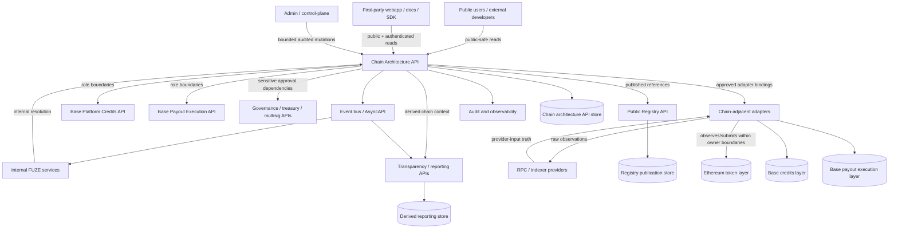
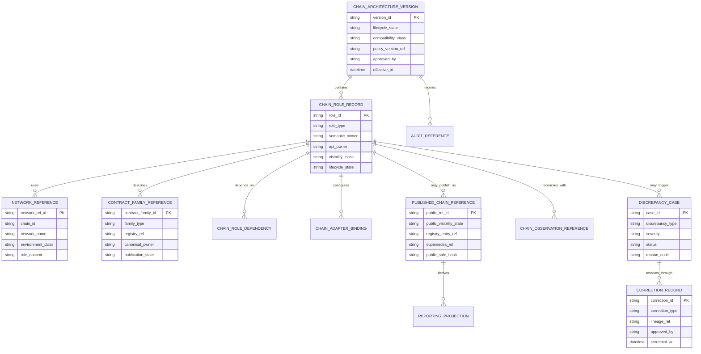
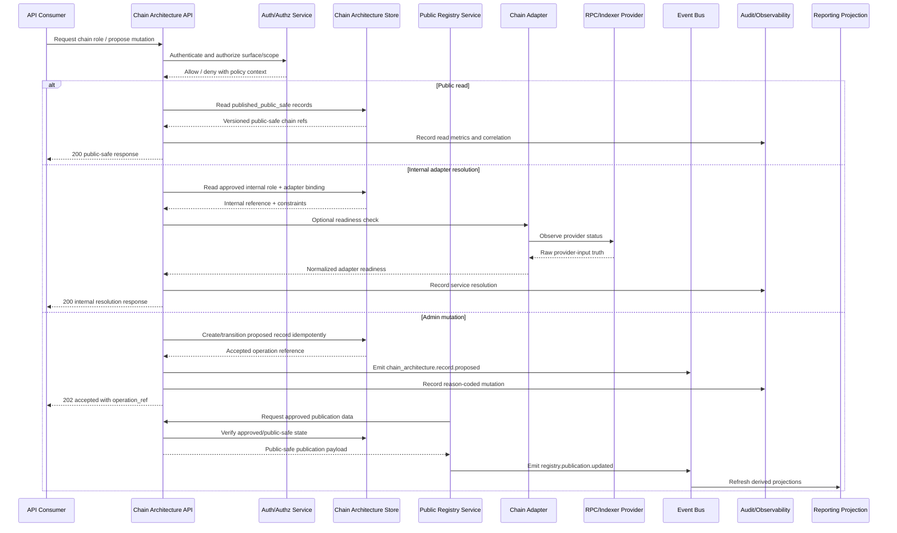

# FUZE Chain Architecture API Specification

## Document Metadata

- **Document Name:** `CHAIN_ARCHITECTURE_API_SPEC.md`
- **Document Type:** FUZE API SPEC v2 / Production-grade API specification
- **Status:** Draft production API specification
- **Version:** 2.0.0
- **Effective Date:** 2026-04-25
- **Last Updated:** 2026-04-25
- **Reviewed On:** 2026-04-25
- **Document Owner:** FUZE Platform API Architecture / Chain Architecture Interface Governance Domain; named individual owner is not explicitly specified in the retrieved governing materials
- **Approval Authority:** Not explicitly specified in the retrieved governing materials; constitutional approval authority remains governed by `REFINED_SYSTEM_SPEC_INDEX.md` and the active FUZE approval workflow
- **Review Cadence:** SHOULD be reviewed quarterly and whenever chain roles, contract registry posture, Base credits posture, Base payout execution posture, Ethereum token posture, treasury/governance controls, public-read exposure, or chain-adjacent implementation contracts materially change
- **Governing Layer:** API contract expression of the FUZE layered chain architecture
- **Parent Registry:** FUZE API SPEC v2 Canonical File Registry
- **Upstream Semantic Registry:** `REFINED_SYSTEM_SPEC_INDEX.md`
- **Upstream API Registry:** `API_SPEC_INDEX.md`
- **Primary Audience:** Platform architecture, backend/API engineering, contracts engineering, public API authors, internal service authors, admin/control-plane authors, event/AsyncAPI authors, public registry authors, transparency/reporting authors, security, audit, runtime operations, SDK/OpenAPI authors, implementation-contract authors
- **Primary Purpose:** Define the canonical API contract posture for exposing, consuming, administering, monitoring, and deriving interface contracts from FUZE's layered chain architecture without redefining the semantic meaning of Ethereum token truth, Base Platform Credits, Base payout execution, treasury/governance controls, public registry truth, transparency reporting, or chain-adjacent runtime execution
- **Primary Upstream References:** `REFINED_SYSTEM_SPEC_INDEX.md`; `DOCS_SPEC_INDEX.md`; `SYSTEM_SPEC_INDEX.md`; `API_SPEC_INDEX.md`; `SYSTEM_BOUNDARY_AND_OWNERSHIP_SPEC.md`; `SYSTEM_OVERVIEW_AND_BOUNDARIES_SPEC.md`; `PLATFORM_ARCHITECTURE_SPEC.md`; `DOMAIN_OWNERSHIP_MATRIX_SPEC.md`; `DATA_MODEL_AND_ENTITY_OWNERSHIP_SPEC.md`; `ONCHAIN_OFFCHAIN_RESPONSIBILITY_SPEC.md`; `CHAIN_ARCHITECTURE_SPEC.md`; `BASE_PLATFORM_CREDITS_LAYER_SPEC.md`; `BASE_PAYOUT_EXECUTION_LAYER_SPEC.md`; `PROFIT_PARTICIPATION_SYSTEM_SPEC.md`; `SNAPSHOT_AND_ELIGIBILITY_PIPELINE_SPEC.md`; `PAYOUT_LEDGER_SPEC.md`; `PUBLIC_CONTRACT_AND_WALLET_REGISTRY_SPEC.md`; `TRANSPARENCY_MODEL_SPEC.md`; `TRANSPARENCY_REPORTING_SPEC.md`; `GOVERNANCE_MODEL_SPEC.md`; `FOUNDATION_GOVERNANCE_SPEC.md`; `TREASURY_CONTROL_POLICY_SPEC.md`; `VAULT_ACTION_POLICY_SPEC.md`; `MULTISIG_AND_TIMELOCK_SPEC.md`; `API_ARCHITECTURE_SPEC.md`; `PUBLIC_API_SPEC.md`; `INTERNAL_SERVICE_API_SPEC.md`; `EVENT_MODEL_AND_WEBHOOK_SPEC.md`; `IDEMPOTENCY_AND_VERSIONING_SPEC.md`; `MIGRATION_AND_BACKWARD_COMPATIBILITY_SPEC.md`; `AUDIT_LOG_AND_ACTIVITY_SPEC.md`; `SECURITY_AND_RISK_CONTROL_SPEC.md`; `MONITORING_ALERTING_AND_INCIDENT_RESPONSE_SPEC.md`; `SECRETS_CONFIG_AND_ENVIRONMENT_SPEC.md`; `FUZE_ACCOUNT_ACCESS_AND_SESSION_THESIS_FINAL_SPEC.md`; `FUZE_ACCOUNT_ACCESS_AND_SESSION_CANONICAL_FINAL_SPEC.md`; `FUZE_WORKSPACE_ACCESS_CONTROL_BASICS_THESIS_FINAL_SPEC.md`
- **Primary Downstream Dependents:** `PUBLIC_CHAIN_REFERENCE_API_SPEC.md`; `PUBLIC_REGISTRY_LOOKUP_API_SPEC.md`; `PUBLIC_CONTRACT_AND_WALLET_REGISTRY_API_SPEC.md`; `BASE_PLATFORM_CREDITS_LAYER_API_SPEC.md`; `BASE_PAYOUT_EXECUTION_LAYER_API_SPEC.md`; `PUBLIC_METADATA_API_SPEC.md`; `PUBLIC_TRANSPARENCY_API_SPEC.md`; `PUBLIC_PAYOUT_STATUS_API_SPEC.md`; OpenAPI/AsyncAPI contracts; SDK chain-reference models; chain adapter implementation contracts; indexer/event-ingestion contracts; admin/control-plane chain configuration tools; reporting and public-trust surfaces
- **API Surface Families Covered:** public-read; first-party application read; internal service read/mutation; admin/control-plane mutation; event/async; reporting/export; chain-adjacent adapter; implementation-facing contract derivation
- **API Surface Families Excluded:** raw smart-contract ABI definitions; direct RPC provider API ownership; product-local APIs unrelated to chain context; unrestricted public mutation; unbounded wallet-private inventory export; treasury execution APIs beyond chain-role references; full payout claim and credits lifecycle APIs except as adjacent dependent surfaces
- **Canonical System Owner(s):** FUZE Platform Architecture for layered chain semantics; Ethereum Token Layer for token participation truth; Base Platform Credits Layer for Base credits operational truth; Base Payout Execution Layer for payout execution truth; On-Chain/Off-Chain Responsibility Domain for boundary interpretation; Public Contract and Wallet Registry Domain for public designation and publication truth; Treasury/Governance domains for control-sensitive action authority
- **Canonical API Owner:** FUZE Platform API Architecture / Chain Architecture API Domain
- **Supersedes:** No same-name v1 API spec was found in the retrieved materials. This document supersedes any informal API interpretation that exposes FUZE chain structure as generic chain metadata, conflates Ethereum token truth with Base credits or payout execution, or treats public registry/reporting outputs as chain-architecture mutation owners.
- **Superseded By:** None currently defined
- **Related Decision Records:** Not explicitly specified in the retrieved governing materials
- **Canonical Status Note:** This API specification is canonical for API-level expression of FUZE chain architecture. It does not own chain semantics. It derives from `CHAIN_ARCHITECTURE_SPEC.md` and adjacent refined system specs. Downstream APIs, OpenAPI/AsyncAPI artifacts, SDK models, public-read surfaces, admin/control-plane tools, indexers, adapters, and reporting layers MUST preserve the separation between token participation, internal commerce, payout execution, governance controls, registry publication, and derived reporting.
- **Implementation Status:** Normative API design source; implementation contracts, API routes, event contracts, SDK models, and chain-adjacent services MUST align before production release
- **Approval Status:** Draft pending explicit FUZE approval workflow
- **Change Summary:** Created API SPEC v2 document for chain architecture. Establishes API surface families, route/resource boundaries, truth classes, request/response/error/status rules, idempotency/retry posture, authorization/control rules, public-read restrictions, admin/control constraints, event/async behavior, diagrams, flow views, acceptance criteria, test cases, and downstream derivation guardrails.

## Purpose

This specification defines the FUZE API contract posture for the platform's layered chain architecture.

The purpose of this API specification is to make the chain architecture consumable and enforceable through API surfaces without allowing API convenience to redefine system semantics. The API layer MUST express the FUZE rule that:

- Ethereum is the canonical FUZE token participation layer.
- Base is the operational layer for Platform Credits.
- Base is also the stablecoin payout execution layer.
- Ethereum holder truth feeds snapshot-derived payout eligibility.
- Platform Credits are internal consumption assets, not token ownership.
- Stablecoin payout execution is not token transfer and is not credits spending.
- Public registry and transparency surfaces are derived/public-trust exposures, not mutation owners.
- On-chain state is canonical only for the meanings explicitly committed on-chain.
- Off-chain policy, accounting, eligibility, reporting, orchestration, and product behavior remain owned by the appropriate off-chain domains unless a narrower approved contract commitment explicitly says otherwise.

This API specification governs how those rules are exposed through public, first-party, internal, admin/control, event, reporting, chain-adjacent, OpenAPI, AsyncAPI, SDK, and implementation-contract layers.

## Scope

This API specification governs:

1. API resource families that represent FUZE chain roles, networks, contract families, chain-layer classifications, and chain-reference topology.
2. Read contracts that expose canonical chain architecture posture to first-party surfaces, public-safe surfaces, internal services, reporting systems, and SDKs.
3. Internal service contracts used by chain-adjacent services, registry services, payout services, credits services, transparency/reporting services, and admin/control-plane systems to resolve approved chain roles and references.
4. Admin/control-plane contracts for proposing, approving, publishing, superseding, pausing, correcting, or deprecating chain-role records and chain architecture references.
5. Event contracts for chain-architecture lifecycle, registry publication, adapter synchronization, indexing posture, discrepancy detection, and correction/supersession events.
6. Contract guardrails for OpenAPI/AsyncAPI/SDK derivation.
7. Request, response, error, result, idempotency, audit, observability, and migration rules for chain architecture APIs.
8. Boundary rules that prevent API surfaces from collapsing token, credits, payout, governance, registry, reporting, and provider-input truths.

## Out of Scope

This specification does not govern:

- raw smart-contract source code, ABI encoding, bytecode verification, or storage layout;
- RPC provider implementation details;
- low-level indexer selection, RPC failover, or provider-specific retry tuning;
- full tokenomics rules or token distribution policy;
- full Platform Credits business semantics;
- full Credit Ledger and Settlement semantics;
- full Base payout execution lifecycle or claimant-facing payout flow;
- full payout ledger semantics;
- treasury accounting or distributable-profit calculation;
- governance approval policy in full detail;
- public report composition in full detail;
- wallet-aware user identity and wallet-link lifecycle in full detail;
- product-local UX composition beyond consuming chain-reference APIs safely.

Those concerns belong to their own refined system specs, API specs, implementation contracts, or runbooks.

## Design Goals

The design goals are to:

1. make FUZE's layered chain model available through stable API contracts;
2. preserve chain-role separation across all API consumers;
3. prevent public, first-party, internal, admin, event, reporting, or SDK surfaces from redefining system semantics;
4. support public trust and developer clarity without overexposing sensitive operational or governance details;
5. provide canonical chain-reference resolution for services that need to interact with Ethereum, Base credits, Base payout execution, registries, or reporting artifacts;
6. distinguish canonical chain truth, chain-architecture API truth, registry truth, execution truth, provider-input truth, reporting truth, policy truth, and presentation truth;
7. make chain-reference changes auditable, reason-coded, versioned, idempotent, and migration-safe;
8. support implementation QA and contract validation through concrete acceptance criteria and test cases.

## Non-Goals

This API specification is not intended to:

- turn chain architecture into a generic blockchain metadata service;
- expose arbitrary contract inventories as official FUZE truth;
- allow public callers to mutate chain architecture state;
- make chain indexing events self-authorizing business outcomes;
- make registry or transparency publications the semantic owners of token, credits, payout, or governance truth;
- merge Base credits and Base payout execution because they share a network;
- treat Ethereum holder truth as product entitlement or payout success without owner-domain validation;
- replace machine-readable OpenAPI/AsyncAPI files;
- replace implementation contracts for indexers, adapters, smart contracts, payout execution, registry publication, or reporting.

## Core Principles

### 1. Refined Semantics Own Meaning

`CHAIN_ARCHITECTURE_SPEC.md` and adjacent refined system specs own chain semantics. This API owns interface expression only.

### 2. Chain Role Separation Is Mandatory

API resources MUST preserve the distinction between:

- token participation layer;
- Platform Credits layer;
- payout execution layer;
- treasury/reserve/control layer;
- registry/public-trust layer;
- reporting/transparency layer;
- chain-adjacent runtime execution layer.

### 3. Same Chain Does Not Mean Same Domain

Base may host both the Platform Credits operational layer and stablecoin payout execution. APIs MUST NOT collapse those domains into a generic `base_balance`, `base_assets`, or `base_value` abstraction.

### 4. Public Read Is Narrower Than Internal Truth

Public chain-reference APIs MAY expose approved chain roles, published contract references, network role explanations, deprecation/supersession posture, and public-safe verification metadata. They MUST NOT expose private wallet inventories, signer details, control keys, operational runbook details, unreleased future deployments, or sensitive security material.

### 5. Chain Events Are Inputs Until Normalized

Raw chain events, provider callbacks, indexer observations, wallet-client signals, and RPC responses are provider-input or observed-state truth until normalized by the owning FUZE domain.

### 6. Chain Architecture APIs Do Not Own Economic Outcomes

The Chain Architecture API MAY identify roles, references, network posture, and canonical separation rules. It MUST NOT calculate distributable profit, eligibility, credits balances, payouts, treasury permissions, or governance outcomes.

### 7. Admin Override Is Bounded

Admin/control-plane operations for chain architecture are permitted only for explicit, reason-coded, policy-authorized lifecycle transitions such as proposal, verification, publication, deprecation, supersession, pause, quarantine, discrepancy resolution, or correction. Ordinary application APIs MUST NOT contain these capabilities.

### 8. Derived Views Remain Derived

Public registry pages, dashboards, transparency reports, SDK metadata, and product displays are derived or presentation surfaces unless a narrower approved spec explicitly elevates a bounded artifact.

## Canonical Definitions

### Chain Architecture
The canonical FUZE model that assigns each major economic or trust role to a chain environment and defines how those roles coordinate without conceptual collapse.

### Chain Role
A bounded FUZE role assigned to a chain environment, such as `ethereum_token_participation`, `base_platform_credits`, `base_payout_execution`, or `governance_control_reference`.

### Chain Role Record
An API-facing record describing a chain role, its network, semantic owner, API owner, registry publication status, dependent domains, compatible route families, and lifecycle posture.

### Network Reference
A stable, versioned API object that identifies a chain environment such as Ethereum mainnet or Base, including approved chain identifiers, environment class, network role, public-safe metadata, and operational status.

### Contract Family Reference
A stable API object that groups contracts by FUZE role, not by implementation convenience. Examples include token contract, credits ledger/contract, payout execution contract, vault/control contract, or public registry contract family.

### Published Chain Reference
A public-safe, approved, registry-linked chain reference that may be exposed through public APIs or public registry surfaces.

### Internal Chain Reference
A permissioned reference used by backend services, adapters, indexers, or control-plane tools. Internal chain references MAY include additional operational metadata but MUST NOT leak sensitive material.

### Chain-Adjacent Adapter
An internal implementation layer that submits, observes, verifies, or normalizes chain interactions while preserving owner-domain boundaries.

### Chain Architecture Version
A versioned API contract snapshot of chain role topology and public-safe chain-reference posture. This is API contract truth, not semantic truth.

### Discrepancy Case
A reason-coded record indicating disagreement, uncertainty, missing confirmation, stale provider data, registry mismatch, chain observation mismatch, policy conflict, or projection drift involving chain architecture references.

## Truth Class Taxonomy

This API MUST preserve the following truth classes:

1. **Semantic Truth** — owned by refined system specs, especially `CHAIN_ARCHITECTURE_SPEC.md`, `ONCHAIN_OFFCHAIN_RESPONSIBILITY_SPEC.md`, Base layer specs, payout specs, registry specs, and governance/treasury specs.
2. **API Contract Truth** — route/resource families, request/response/error/status classes, compatibility posture, and surface-family rules defined by this API specification.
3. **Chain-Committed Truth** — facts explicitly committed on Ethereum or Base contracts within the role intended by those contracts.
4. **Registry Publication Truth** — public designation, verification, publication, deprecation, and supersession state owned by the public contract/wallet registry domain.
5. **Policy Truth** — off-chain policy rules governing approvals, restrictions, eligibility, accounting, treasury, governance, publication, or correction.
6. **Runtime / Execution Truth** — adapter submissions, confirmations, indexer state, job state, retry state, and reconciliation state.
7. **Provider-Input Truth** — raw RPC, indexer, wallet-client, or third-party provider signals before FUZE normalization.
8. **Projection / Reporting Truth** — transparency reports, dashboards, public chain reference views, SDK metadata, and analytics outputs derived from canonical sources.
9. **Presentation Truth** — final UX labels, product display composition, documentation examples, and explanatory text.

These truth classes MUST NOT be collapsed into one API object, one status enum, one datastore, or one SDK abstraction.

## Architectural Position in the Spec Hierarchy

This document sits below:

- `REFINED_SYSTEM_SPEC_INDEX.md` for refined-library precedence;
- `CHAIN_ARCHITECTURE_SPEC.md` for layered chain semantics;
- `ONCHAIN_OFFCHAIN_RESPONSIBILITY_SPEC.md` for chain/off-chain responsibility boundaries;
- top-level boundary, platform architecture, domain ownership, and data/entity ownership specs;
- API architecture, public API, internal service API, event/webhook, idempotency/versioning, migration, security, audit, and operations specs.

It sits above or directly governs:

- OpenAPI route families for chain architecture;
- AsyncAPI event families for chain-reference lifecycle and discrepancy events;
- SDK chain-reference models;
- chain adapter implementation contracts;
- public chain reference APIs;
- public registry lookup and public metadata APIs where they expose chain architecture;
- admin/control-plane chain configuration APIs;
- reporting and transparency chain-reference projections.

## Upstream Semantic Owners

The following upstream refined system specs own semantics this API must preserve:

- `CHAIN_ARCHITECTURE_SPEC.md` owns layered chain model, economic role separation, Ethereum/Base role mapping, and cross-layer chain architecture meaning.
- `ONCHAIN_OFFCHAIN_RESPONSIBILITY_SPEC.md` owns the boundary between chain-committed truth and off-chain policy, accounting, product, reporting, and execution truth.
- `BASE_PLATFORM_CREDITS_LAYER_SPEC.md` owns Base credits operational semantics.
- `BASE_PAYOUT_EXECUTION_LAYER_SPEC.md` owns Base payout execution semantics.
- `PROFIT_PARTICIPATION_SYSTEM_SPEC.md` owns profit-participation semantic meaning and cycle posture.
- `SNAPSHOT_AND_ELIGIBILITY_PIPELINE_SPEC.md` owns eligibility dataset derivation.
- `PAYOUT_LEDGER_SPEC.md` owns payout-cycle ledger semantics and reconciliation record meaning.
- `PUBLIC_CONTRACT_AND_WALLET_REGISTRY_SPEC.md` owns public designation, registry publication, deprecation, supersession, and public-safe wallet/contract visibility.
- `TRANSPARENCY_MODEL_SPEC.md` and `TRANSPARENCY_REPORTING_SPEC.md` own public-trust interpretation and reporting artifacts.
- `GOVERNANCE_MODEL_SPEC.md`, `FOUNDATION_GOVERNANCE_SPEC.md`, `TREASURY_CONTROL_POLICY_SPEC.md`, `VAULT_ACTION_POLICY_SPEC.md`, and `MULTISIG_AND_TIMELOCK_SPEC.md` own sensitive control semantics.

## API Surface Families

### Public-Read Surface

Public chain architecture APIs MAY expose:

- supported FUZE chain roles;
- public-safe network role descriptions;
- published contract family references;
- deprecation and supersession state;
- public-safe chain architecture version metadata;
- links to public registry and transparency references;
- bounded explanation of how Ethereum, Base credits, and Base payout execution differ.

Public APIs MUST NOT expose:

- private operational wallet inventories;
- unpublished contract deployments;
- signer identities or key material;
- sensitive treasury/control details;
- internal discrepancy notes;
- adapter configuration secrets;
- raw provider credentials;
- unapproved future chain plans.

### First-Party Application Surface

First-party applications MAY consume public-safe chain architecture plus authenticated user-scoped derived status where approved by adjacent APIs. They MUST NOT use chain architecture APIs to infer product entitlement, payout entitlement, credits balance, or identity ownership without calling the correct owner API.

### Internal Service Surface

Internal services MAY resolve authoritative chain role records, internal references, adapter configuration posture, registry linkage, dependency topology, chain architecture versions, and reconciliation status. Internal service APIs MUST enforce service identity, policy scope, rate controls, and audit lineage.

### Admin / Control-Plane Surface

Admin/control APIs MAY propose, verify, approve, publish, pause, deprecate, supersede, quarantine, or correct chain architecture records. These APIs MUST be separated from ordinary application APIs, require explicit authorization, preserve reason codes, require policy/version references, produce audit records, and emit lifecycle events.

### Event / Async Surface

Event surfaces MAY publish chain architecture lifecycle events, registry-publication events, discrepancy events, correction events, adapter-readiness events, and projection-refresh events. Events MUST carry enough lineage to support reconciliation and SHOULD NOT expose sensitive details to public webhook surfaces unless explicitly approved.

### Reporting / Export Surface

Reporting surfaces MAY consume chain architecture records to explain platform chain roles and to cross-link transparency artifacts. Reporting APIs MUST remain derived and MUST preserve source references.

### Chain-Adjacent Adapter Surface

Adapter interfaces MAY consume chain architecture records to select approved chain roles, contract families, endpoints, network identifiers, and operational status. Adapters MUST treat configuration inputs as contract constraints, not semantic ownership.

## System / API Boundaries

This API governs API-level representation of chain architecture. It does not own underlying chain state, economic state, policy state, registry publication state, or reporting state.

Allowed mutation boundaries:

- `POST /internal/chain-architecture/versions:propose` for internal proposal of versioned chain architecture changes.
- `POST /admin/chain-architecture/versions/{version_id}:approve` for control-plane approval.
- `POST /admin/chain-architecture/records/{record_id}:publish` for publishing public-safe records through registry-linked workflows.
- `POST /admin/chain-architecture/records/{record_id}:deprecate` for bounded deprecation.
- `POST /admin/chain-architecture/records/{record_id}:supersede` for lineage-preserving replacement.
- `POST /admin/chain-architecture/discrepancies/{case_id}:resolve` for reason-coded discrepancy resolution.

Forbidden mutation boundaries:

- public mutation of chain architecture;
- first-party client mutation of chain roles;
- chain indexer direct mutation of canonical records without normalization;
- reporting pipeline mutation of canonical chain role records;
- product API creation of chain roles;
- SDK-local override of chain architecture records.

## Adjacent API Boundaries

This API MUST coordinate with adjacent API specs as follows:

- `BASE_PLATFORM_CREDITS_LAYER_API_SPEC.md` owns Base credits operational resources, not this spec.
- `BASE_PAYOUT_EXECUTION_LAYER_API_SPEC.md` owns payout execution resources, not this spec.
- `PUBLIC_CONTRACT_AND_WALLET_REGISTRY_API_SPEC.md` owns public registry publication and lookup behavior for official contracts and wallets.
- `PUBLIC_CHAIN_REFERENCE_API_SPEC.md` owns narrower public-read route families derived from this chain architecture API.
- `PUBLIC_REGISTRY_LOOKUP_API_SPEC.md` owns public registry lookups and canonical publication retrieval.
- `PUBLIC_METADATA_API_SPEC.md` owns public metadata aggregation where chain references are only one input.
- `PUBLIC_TRANSPARENCY_API_SPEC.md` owns public transparency access and report retrieval.
- `GOVERNANCE_MODEL_API_SPEC.md`, `TREASURY_CONTROL_POLICY_API_SPEC.md`, `VAULT_ACTION_POLICY_API_SPEC.md`, and `MULTISIG_AND_TIMELOCK_API_SPEC.md` own governance/control decisions.
- `INTERNAL_SERVICE_API_SPEC.md` governs internal caller posture and service-to-service contract rules.
- `EVENT_MODEL_AND_WEBHOOK_SPEC.md` governs event publication and webhook safety.

## Conflict Resolution Rules

1. Refined system semantics win over this API where semantic interpretation conflicts.
2. This API wins over downstream OpenAPI, AsyncAPI, SDK, admin UI, or implementation-contract artifacts on API contract posture for chain architecture.
3. `CHAIN_ARCHITECTURE_SPEC.md` wins on the meaning of the layered chain model.
4. `ONCHAIN_OFFCHAIN_RESPONSIBILITY_SPEC.md` wins on chain/off-chain truth boundaries.
5. Registry APIs win on public registry publication truth, but not on chain-role semantics.
6. Base credits and Base payout execution APIs win on their own operational resources, but not on the overall chain architecture model.
7. Governance and treasury/control APIs win on approvals and restrictions, but not on underlying domain ownership.
8. Chain events and provider inputs NEVER win by themselves; owner-normalized state wins.
9. When ambiguity remains, choose the most conservative architecture-consistent interpretation and require a reason-coded decision record or future spec refinement.

## Default Decision Rules

- If a chain-related record cannot name its chain role, semantic owner, API owner, registry visibility state, and truth class, it MUST NOT be published as canonical.
- If a Base-related record could be credits or payout execution, the caller MUST identify the domain explicitly; otherwise return `409 ambiguous_chain_role` or `422 invalid_role_context`.
- If a chain observation conflicts with registry publication state, mark a discrepancy case; do not silently update the public reference.
- If an admin action lacks reason code, policy version, approver identity, audit context, or idempotency key where required, reject it.
- If public-safe and internal metadata disagree, public APIs MUST expose the latest approved public-safe state and internal APIs MUST surface discrepancy/reconciliation state to authorized callers.
- If a chain architecture change affects public APIs, SDKs, adapters, or reporting, it MUST create a versioned compatibility/migration record.

## Roles / Actors / API Consumers

### Human Actors

- public users and external developers reading chain references;
- holders and community members reading public chain architecture posture;
- workspace members consuming product displays derived from chain context;
- support operators investigating chain-reference ambiguity;
- finance, treasury, governance, and contracts operators reviewing sensitive changes;
- security and runtime operators responding to provider or chain discrepancies;
- API reviewers, SDK authors, and implementation-contract authors.

### System Actors

- public API gateway;
- first-party web and admin applications;
- internal platform services;
- public registry service;
- transparency/reporting service;
- Base credits service;
- Base payout execution service;
- payout ledger service;
- snapshot/eligibility service;
- governance/treasury/control services;
- chain adapters;
- indexers and RPC provider clients;
- event bus and webhook dispatchers;
- audit/observability pipelines;
- OpenAPI/AsyncAPI/SDK generators.

## Resource / Entity Families

### API-Facing Resources

- `ChainArchitectureVersion`
- `ChainRoleRecord`
- `NetworkReference`
- `ContractFamilyReference`
- `PublishedChainReference`
- `InternalChainReference`
- `ChainRoleDependency`
- `ChainArchitecturePolicyReference`
- `ChainAdapterBinding`
- `ChainObservationReference`
- `ChainArchitectureDiscrepancyCase`
- `ChainArchitectureCorrection`
- `ChainArchitectureAuditReference`
- `ChainArchitectureProjection`

### Canonical / Derived Classification

- Canonical at API layer: versioned chain architecture records, chain role records, internal reference records, admin lifecycle state, policy references, discrepancy cases, audit references.
- Canonical elsewhere: contract state, token balances, credits operational state, payout execution state, public registry publication state, treasury/governance decisions, payout ledger records.
- Derived: public chain views, reporting projections, SDK-generated constants, frontend display models, cached registry joins, analytics summaries.
- External/provider-input: raw RPC chain ID reads, block observations, transaction logs, explorer metadata, indexer callbacks, wallet-client claims.

## Ownership Model

The Chain Architecture API Domain owns:

- API contract structure for chain architecture resources;
- versioning and compatibility posture for chain architecture references;
- internal and public-safe chain role resolution API contracts;
- admin lifecycle routes for chain architecture records;
- event contracts for chain architecture lifecycle and discrepancy handling;
- guardrails for downstream OpenAPI/AsyncAPI/SDK derivation.

It does not own:

- Ethereum token balances or holder truth;
- Base credits balances or ledger semantics;
- payout execution claim state;
- eligibility datasets;
- payout ledger truth;
- treasury or governance approval truth;
- public registry publication state except as a dependent integration;
- transparency report truth;
- provider raw observations.

## Authority / Decision Model

- Chain architecture semantics are determined by active refined system specs.
- API route and schema posture is determined by this API spec, constrained by platform API architecture.
- Public exposure requires registry/public API/public-trust approval posture.
- Admin/control mutations require authorization, reason code, policy reference, audit lineage, and compatibility assessment.
- Chain adapters may execute approved configuration but do not decide semantic meaning.
- Reporting surfaces may explain approved state but do not decide canonical chain roles.

## Authentication Model

- Public-read routes MAY be unauthenticated where the data is explicitly public-safe and approved for external exposure.
- Authenticated public routes MUST use canonical account/session rules and MUST NOT treat wallet possession alone as sufficient account authorization.
- First-party application routes MUST use session-authenticated callers and caller-scoped authorization where the response includes non-public context.
- Internal service routes MUST use service identity, service-to-service authentication, and policy-scoped authorization.
- Admin/control routes MUST require privileged authenticated operators, scoped admin permission, strong session posture, and elevated approval workflows where material.
- Chain-adjacent adapters MUST use internal service credentials or workload identities; secrets MUST NOT transit public or first-party surfaces.

## Authorization / Scope / Permission Model

Required scope families:

- `chain_architecture.read_public`
- `chain_architecture.read_internal`
- `chain_architecture.resolve_adapter`
- `chain_architecture.propose`
- `chain_architecture.verify`
- `chain_architecture.approve`
- `chain_architecture.publish`
- `chain_architecture.deprecate`
- `chain_architecture.supersede`
- `chain_architecture.pause`
- `chain_architecture.resolve_discrepancy`
- `chain_architecture.export_reporting`

Authorization decisions MUST distinguish:

- public-safe read;
- authenticated caller-scoped read;
- internal service resolution;
- adapter configuration resolution;
- admin/control mutation;
- emergency pause or quarantine;
- reporting export;
- SDK generation.

## Entitlement / Capability-Gating Model

The chain architecture API does not grant product entitlements, credits access, payout eligibility, governance participation, or treasury authority. It MAY expose chain-aware context consumed by entitlement or capability systems. Any capability decision MUST be made by the owning entitlement/access/control domain.

Public or first-party responses SHOULD use explicit fields such as `is_public_safe`, `visibility_class`, `allowed_consumers`, and `not_authoritative_for` to prevent consumers from treating chain references as entitlement decisions.

## API State Model

### ChainArchitectureVersion States

- `draft`
- `proposed`
- `under_review`
- `approved`
- `published`
- `partially_published`
- `superseded`
- `deprecated`
- `paused`
- `quarantined`
- `rejected`
- `archived`

### ChainRoleRecord States

- `draft`
- `verified_internal`
- `approved_internal`
- `published_public_safe`
- `deprecated`
- `superseded`
- `paused`
- `quarantined`
- `discrepancy_open`
- `correction_pending`
- `corrected`

### Discrepancy States

- `detected`
- `triaged`
- `under_investigation`
- `awaiting_owner_decision`
- `awaiting_chain_confirmation`
- `awaiting_registry_update`
- `resolved_no_change`
- `resolved_corrected`
- `resolved_superseded`
- `escalated`
- `closed`

### Adapter Readiness States

- `not_configured`
- `configured`
- `verified`
- `degraded`
- `paused`
- `blocked`
- `retired`

## Lifecycle / Workflow Model

1. A chain architecture change is drafted by an authorized internal service or operator.
2. The proposal identifies affected chain roles, upstream semantic sources, contract families, public visibility class, internal consumers, downstream impacts, migration requirements, and compatibility risks.
3. Internal validation checks domain ownership, public-safety classification, registry implications, adapter implications, policy references, and migration posture.
4. Required reviewers approve, reject, or request changes.
5. Approved records become internal canonical API records.
6. Public-safe records are sent to the public registry/public API publication workflow where applicable.
7. Chain adapters and downstream services consume versioned internal references.
8. Events are emitted for lifecycle transitions and projection refreshes.
9. Reporting and SDK generation consume approved/published records only.
10. Discrepancies trigger a discrepancy case and do not silently mutate canonical records.
11. Corrections, deprecations, and supersessions preserve lineage and audit references.

## Architecture Diagram - Mermaid Flowchart



## Data Design - Mermaid Diagram



## Flow View

### Standard Public Read Flow

1. Caller requests public chain role or chain architecture version.
2. API resolves only `published_public_safe` records.
3. API filters fields by public visibility class.
4. API includes source references, version, lifecycle status, and non-authoritative warnings where relevant.
5. API returns cache-safe response with ETag/version headers.
6. Audit/metrics record public read volume and abnormal access patterns.

### Internal Resolution Flow

1. Internal service authenticates with service identity.
2. Caller supplies required role context, consumer system, operation purpose, and desired visibility class.
3. API validates scope and resolves approved internal chain role records.
4. API returns versioned references, adapter posture, dependency constraints, policy references, and compatibility warnings.
5. Internal service must preserve returned version and correlation references in downstream actions.

### Admin Mutation Flow

1. Authorized operator or approved internal workflow submits proposal with idempotency key.
2. API validates required reason code, role classification, semantic owner, policy references, registry impact, public-safety classification, downstream impact, and migration plan.
3. API creates draft/proposed record and audit entry.
4. Reviewers approve, reject, or require changes.
5. Approval transitions record to internal canonical state.
6. Publication step, if allowed, creates a registry-linked public-safe record.
7. Event bus emits lifecycle events.
8. Downstream projections refresh from approved sources.

### Discrepancy and Correction Flow

1. Adapter, registry, reporting pipeline, or operator detects mismatch.
2. API creates discrepancy case with observed sources, severity, affected role, and trace IDs.
3. Public state remains unchanged unless publication safety requires pause/quarantine.
4. Owner domains investigate and choose no-change, correction, supersession, or deprecation.
5. Correction path records reason, approval, lineage, and affected downstream projections.
6. Public and internal consumers receive updated lifecycle state only after approved transition.

### Degraded Mode

If chain providers, indexers, or registry dependencies are unavailable:

- public reads MAY serve last approved published records with `data_freshness` and `degraded_source` indicators;
- internal adapter resolution MUST fail closed for mutation-sensitive operations unless an approved continuity mode exists;
- admin publication MUST pause if required verification dependencies are unavailable;
- reporting projections MUST mark chain-observation freshness rather than silently updating.

## Data Flows - Mermaid Sequence Diagram



## Request Model

All non-public mutation requests MUST include:

- `request_id` or `correlation_id`;
- `Idempotency-Key` for mutation and accepted async operations;
- authenticated actor or service identity;
- `operation_purpose`;
- `reason_code` where lifecycle, admin, correction, pause, publication, deprecation, or supersession behavior is requested;
- `policy_version_ref` where policy-bound decisions are involved;
- `semantic_owner_ref` for chain role records;
- `api_owner_ref` for interface ownership;
- `visibility_class`;
- `public_safety_assessment` where public exposure may occur;
- `downstream_impact_assessment` for versioned changes;
- `migration_ref` for compatibility-affecting changes;
- `audit_context` for sensitive operations.

Public read requests SHOULD support:

- `version` or `effective_at` where consumers need stable views;
- `role_type` filters;
- `network` filters;
- `include_deprecated` defaulting to false;
- `include_supersession_lineage` defaulting to true for public trust surfaces;
- cache validators such as ETag or version tokens.

## Response Model

Responses MUST distinguish:

- `data`: returned resource(s);
- `truth_class`: API contract truth, registry publication truth, chain-committed truth, derived projection truth, or provider-input truth;
- `canonical_owner`: owner domain for the meaning represented;
- `api_owner`: API owner for the route/resource contract;
- `lifecycle_state`;
- `visibility_class`;
- `source_refs`;
- `policy_refs`;
- `registry_refs`;
- `audit_ref` for sensitive operations;
- `operation_ref` for accepted async operations;
- `discrepancy_ref` where relevant;
- `not_authoritative_for` listing adjacent concepts the response MUST NOT be used to decide.

### Example Public-Safe Chain Role Response

```json
{
  "role_id": "chain_role_ethereum_token_participation",
  "role_type": "ethereum_token_participation",
  "network": {
    "chain_id": "1",
    "name": "Ethereum Mainnet"
  },
  "truth_class": "api_contract_truth",
  "canonical_owner": "CHAIN_ARCHITECTURE_SPEC.md / Ethereum Token Layer",
  "lifecycle_state": "published_public_safe",
  "visibility_class": "public_safe",
  "summary": "Ethereum is the canonical FUZE token participation layer.",
  "not_authoritative_for": [
    "product_entitlement",
    "credits_balance",
    "payout_claim_status",
    "treasury_approval"
  ],
  "version": "2026-04-25.chain-architecture.v1"
}
```

## Error / Result / Status Model

### Error Classes

- `invalid_chain_role`
- `ambiguous_chain_role`
- `unsupported_network_for_role`
- `visibility_class_violation`
- `public_safety_violation`
- `authorization_denied`
- `missing_policy_reference`
- `missing_reason_code`
- `idempotency_conflict`
- `version_conflict`
- `registry_publication_conflict`
- `provider_observation_untrusted`
- `discrepancy_open`
- `downstream_migration_required`
- `chain_dependency_degraded`
- `admin_control_required`
- `semantic_owner_mismatch`
- `forbidden_boundary_collapse`

### Result Classes

- `success_final`
- `accepted_pending_review`
- `accepted_pending_publication`
- `accepted_pending_verification`
- `accepted_pending_reconciliation`
- `no_change`
- `rejected`
- `blocked_by_policy`
- `blocked_by_visibility_class`
- `degraded_read_served`

### HTTP Status Guidance

- `200 OK` for successful read or final synchronous retrieval.
- `201 Created` for synchronous creation of a draft/proposal record where appropriate.
- `202 Accepted` for review, publication, reconciliation, or async lifecycle actions.
- `304 Not Modified` for cache-validated public reads.
- `400 Bad Request` for malformed requests.
- `401 Unauthorized` for unauthenticated non-public calls.
- `403 Forbidden` for insufficient scope or control-plane permissions.
- `404 Not Found` for unavailable resources without leaking sensitive existence.
- `409 Conflict` for version, idempotency, lifecycle, publication, or ambiguity conflicts.
- `422 Unprocessable Entity` for semantically invalid role, owner, visibility, or policy context.
- `423 Locked` or `409 Conflict` for paused/quarantined records.
- `429 Too Many Requests` for rate/abuse controls.
- `503 Service Unavailable` for dependency degradation where stale data cannot be safely served.

## Idempotency / Retry / Replay Model

Idempotency is mandatory for:

- creating proposals;
- approving, rejecting, publishing, pausing, quarantining, deprecating, superseding, and correcting records;
- creating discrepancy cases;
- triggering projection refreshes;
- adapter-binding changes;
- migration operations;
- any async operation returning `202 Accepted`.

Rules:

1. `Idempotency-Key` MUST be scoped by actor/service, operation type, target resource, and request body digest.
2. Replay with identical body MUST return the original result or current operation state.
3. Replay with different body MUST return `409 idempotency_conflict`.
4. Retry MUST NOT duplicate lifecycle events, audit records, registry publications, or downstream projections.
5. Long-running operations MUST expose `operation_ref` and idempotent status retrieval.
6. Idempotency records MUST be retained for a domain-appropriate retention period sufficient for audit and replay safety.

## Rate Limit / Abuse-Control Model

Public-read routes SHOULD support caching and rate limits by IP, API key, anonymous caller class, or partner identity. Abuse controls MUST protect endpoints that reveal registry topology, deprecation history, or chain reference discovery patterns.

Internal and admin routes MUST enforce service quotas, operator rate controls, anomaly detection, and step-up review for unusual mutation volume.

## Endpoint / Route Family Model

Route shapes below are normative families, not final OpenAPI enumeration.

### Public Routes

- `GET /public/chain-architecture`
- `GET /public/chain-architecture/versions/current`
- `GET /public/chain-architecture/roles`
- `GET /public/chain-architecture/roles/{role_id}`
- `GET /public/chain-architecture/networks`
- `GET /public/chain-architecture/contracts`
- `GET /public/chain-architecture/supersession-lineage/{public_ref_id}`

### First-Party Routes

- `GET /app/chain-architecture/current`
- `GET /app/chain-architecture/roles/{role_id}`
- `GET /app/chain-architecture/user-facing-context`

First-party routes MUST NOT expose non-public internal references unless the caller is authorized and the field is explicitly classified for first-party exposure.

### Internal Service Routes

- `GET /internal/chain-architecture/versions/current`
- `GET /internal/chain-architecture/roles/{role_id}`
- `POST /internal/chain-architecture/roles:resolve`
- `GET /internal/chain-architecture/adapter-bindings/{role_id}`
- `POST /internal/chain-architecture/discrepancies`
- `GET /internal/chain-architecture/discrepancies/{case_id}`
- `POST /internal/chain-architecture/projections:refresh`

### Admin / Control-Plane Routes

- `POST /admin/chain-architecture/versions:propose`
- `POST /admin/chain-architecture/versions/{version_id}:approve`
- `POST /admin/chain-architecture/versions/{version_id}:reject`
- `POST /admin/chain-architecture/records/{record_id}:verify`
- `POST /admin/chain-architecture/records/{record_id}:publish`
- `POST /admin/chain-architecture/records/{record_id}:pause`
- `POST /admin/chain-architecture/records/{record_id}:quarantine`
- `POST /admin/chain-architecture/records/{record_id}:deprecate`
- `POST /admin/chain-architecture/records/{record_id}:supersede`
- `POST /admin/chain-architecture/discrepancies/{case_id}:resolve`

### Event Families

- `chain_architecture.version.proposed`
- `chain_architecture.version.approved`
- `chain_architecture.version.published`
- `chain_architecture.role.verified`
- `chain_architecture.role.published`
- `chain_architecture.role.paused`
- `chain_architecture.role.quarantined`
- `chain_architecture.role.deprecated`
- `chain_architecture.role.superseded`
- `chain_architecture.discrepancy.detected`
- `chain_architecture.discrepancy.resolved`
- `chain_architecture.correction.applied`
- `chain_architecture.projection.refresh_requested`
- `chain_architecture.adapter_binding.changed`

## Public API Considerations

Public APIs MUST be stable, narrow, and public-safe. They SHOULD educate consumers about role separation by returning explicit `not_authoritative_for` metadata and avoiding misleading names such as `base_balance` or `chain_value`.

Public APIs SHOULD include:

- stable IDs;
- version identifiers;
- lifecycle state;
- public registry links;
- deprecation/supersession lineage;
- source references;
- public-safe explanations.

Public APIs MUST NOT include:

- internal adapter endpoints;
- private wallet classifications;
- signers, thresholds, or control details beyond approved public summaries;
- unpublished deployments;
- unreconciled raw provider observations;
- internal incident notes.

## First-Party Application API Considerations

First-party surfaces MAY render chain architecture context to help users understand FUZE. They MUST preserve canonical labels:

- Ethereum token participation layer;
- Base Platform Credits layer;
- Base payout execution layer.

First-party UI must not say or imply:

- credits are FUZE tokens;
- sold credits are distributable profit;
- Base payout execution proves Ethereum token ownership;
- holder balance equals product entitlement;
- registry publication equals wallet ownership by a user account.

## Internal Service API Considerations

Internal APIs MUST serve owner-domain and adapter needs without becoming hidden broad-write shortcuts. Internal services MUST supply operation purpose and consumer identity when resolving privileged records.

Internal chain architecture records MUST include:

- semantic owner;
- allowed consumer services;
- allowed operation classes;
- visibility class;
- adapter-readiness state;
- compatibility version;
- policy references;
- audit references;
- data classification.

## Admin / Control-Plane API Considerations

Admin/control-plane routes MUST be:

- separated from public/first-party/internal ordinary routes;
- restricted to privileged operators and approved workflows;
- reason-coded;
- policy-versioned;
- auditable;
- idempotent;
- event-emitting;
- lifecycle-bound;
- migration-aware;
- subject to dual review or escalation for material public/trust-sensitive changes.

Emergency pause/quarantine MAY exist but MUST be narrow, time-bounded where possible, auditable, and post-reviewed.

## Event / Webhook / Async API Considerations

Events are coordination outputs, not semantic owners. Event payloads MUST include:

- event ID;
- event type;
- occurred time;
- producer;
- chain architecture version;
- affected role IDs;
- lifecycle transition;
- actor/service reference where permitted;
- correlation/trace ID;
- audit reference;
- public-safety class;
- schema version.

Public webhooks, if ever exposed, MUST be limited to public-safe lifecycle updates and MUST NOT leak internal discrepancy, adapter, or control-plane detail.

## Chain-Adjacent API Considerations

Chain-adjacent APIs MUST distinguish:

- approved architecture configuration;
- adapter runtime state;
- provider observations;
- normalized owner-domain consequences;
- execution attempts;
- reconciliation status.

Adapter outputs MUST NOT directly rewrite public registry, payout ledger, credits ledger, treasury policy, or chain architecture records without passing through owning API boundaries.

## Data Model / Storage Support Implications

Implementation storage MUST preserve separate tables/collections or strongly separated entity families for:

- chain architecture versions;
- chain role records;
- network references;
- contract family references;
- internal references;
- published references;
- adapter bindings;
- observation references;
- discrepancy cases;
- correction records;
- idempotency records;
- audit references;
- projection records.

Derived/public/reporting stores MUST preserve source references and MUST NOT become canonical mutation stores.

## Read Model / Projection / Reporting Rules

- Public chain architecture responses are public-safe read models derived from approved API records and registry publication state.
- Transparency reports may cite chain architecture records but do not own them.
- SDK constants may be generated from approved versions but must include version metadata and deprecation handling.
- Caches MUST honor versioning and invalidation events.
- Reporting projections MUST mark freshness and source lineage.
- Derived views MUST NOT silently hide deprecated or superseded references where lineage matters for trust.

## Security / Risk / Privacy Controls

Security controls MUST cover:

- data classification for each field;
- secret exclusion from all public and first-party responses;
- least-privilege internal service access;
- admin step-up controls;
- anomaly detection for public scraping and internal mutation spikes;
- provider-input validation;
- chain observation spoofing controls;
- signer/control detail exposure prevention;
- emergency pause/quarantine;
- audit record integrity;
- migration rollout safety.

## Audit / Traceability / Observability Requirements

All mutations and sensitive reads MUST preserve:

- actor/service identity;
- request ID;
- correlation ID;
- trace ID;
- idempotency key;
- policy version;
- reason code;
- source refs;
- previous and next state;
- downstream impact refs;
- public registry refs where applicable;
- audit record ref;
- event refs;
- discrepancy/correction refs where applicable.

Metrics MUST include public read volume, cache hit rate, admin mutation volume, discrepancy count, stale projection age, provider dependency health, adapter readiness, and publication latency.

## Failure Handling / Edge Cases

### Provider or Indexer Mismatch

Raw provider mismatch MUST create observed-state discrepancy. It MUST NOT automatically mutate canonical chain role records or public registry records.

### Public Registry Drift

If public registry state differs from chain architecture API state, the API MUST mark discrepancy and route correction through registry and chain architecture owners.

### Base Domain Ambiguity

If a request references Base without specifying credits or payout execution context, the API MUST reject or require disambiguation.

### Deprecation Without Supersession

Deprecated records MAY remain publicly visible with clear status and reason where trust lineage requires it. They MUST NOT be silently removed if prior public references depend on them.

### Emergency Pause

Emergency pause may suppress publication or adapter consumption. It MUST preserve prior record state, reason, operator, policy reference, and review requirement.

### Chain Architecture Version Rollback

Rollback MUST be treated as a new version or correction/supersession operation, not a silent historical rewrite.

## Migration / Versioning / Compatibility / Deprecation Rules

- Chain architecture versions MUST be immutable after publication except through correction/supersession lineage.
- Public APIs MUST preserve backward-compatible field semantics within a major version.
- Breaking changes require versioned route/schema strategy and migration notice.
- SDK generation MUST include deprecation metadata and stable role identifiers.
- Deprecated roles MUST retain lineage until approved removal windows expire.
- Public registry and reporting projections MUST be updated in a migration-safe sequence.
- Adapter configuration changes MUST include compatibility validation before activation.

## OpenAPI / AsyncAPI / SDK Derivation Rules

OpenAPI artifacts MUST preserve:

- explicit route surface families;
- auth requirements;
- scope requirements;
- visibility classification;
- response truth-class fields;
- problem-detail error classes;
- idempotency headers for mutation routes;
- `operation_ref` for async accepted-state flows;
- schema version and lifecycle fields;
- deprecation and supersession models.

AsyncAPI artifacts MUST preserve:

- event truth class;
- producer/consumer restrictions;
- schema versioning;
- lifecycle transition semantics;
- public-safe vs internal event separation;
- audit/correlation fields.

SDKs MUST NOT flatten chain roles into generic network constants. SDKs MUST expose role-aware helpers and deprecation/supersession handling.

## Implementation-Contract Guardrails

Implementation contracts MUST NOT:

- use chain architecture API records as a source of token balance truth;
- use public registry records as internal adapter configuration without approved internal resolution;
- allow product teams to define new chain roles locally;
- allow RPC observations to update canonical records without normalization;
- expose internal references through public SDKs;
- collapse Base credits and Base payout execution into one Base asset model;
- remove lineage from deprecated/superseded records;
- skip audit/event emission for admin lifecycle changes.

## Downstream Execution Staging

Recommended staging:

1. Define internal chain architecture store and versioned role records.
2. Implement internal read/resolve APIs.
3. Implement admin proposal, approval, pause, deprecation, supersession, and discrepancy flows.
4. Integrate public registry publication workflow.
5. Implement public-safe read APIs.
6. Implement event families and projection refresh.
7. Integrate adapter bindings and readiness checks.
8. Generate OpenAPI/AsyncAPI and SDK models.
9. Add contract validation tests and migration checks.
10. Enable production monitoring and discrepancy dashboards.

## Required Downstream Specs / Contract Layers

- OpenAPI contract for public chain architecture routes.
- OpenAPI contract for internal/admin chain architecture routes.
- AsyncAPI contract for chain architecture lifecycle events.
- Chain adapter implementation contract.
- Registry publication integration contract.
- Reporting projection contract.
- SDK derivation contract.
- Data storage contract for chain architecture records.
- Runbook for discrepancy, pause, quarantine, and correction.

## Boundary Violation Detection / Non-Canonical API Patterns

Forbidden patterns include:

1. `GET /chain/balances` returning token, credits, and payout values in one ambiguous model.
2. Public route exposing unpublished contract addresses or private wallet inventories.
3. Internal service mutating chain roles because an indexer observed a new contract.
4. Admin UI editing public chain references without reason code and audit lineage.
5. SDK hard-coding Base as a single FUZE value layer.
6. Reporting projection overwriting canonical chain role state.
7. Public API implying credits equal token ownership or sold credits equal profit.
8. Treating Ethereum holder snapshots as final payout outcomes.
9. Treating governance approval as ownership of the resulting domain truth.
10. Deleting deprecated references that still have public trust lineage.

## Canonical Examples / Anti-Examples

### Canonical Example: Public Layer Listing

A public caller requests `/public/chain-architecture/roles`. The API returns three published roles: Ethereum token participation, Base Platform Credits, and Base payout execution. Each role includes `not_authoritative_for` fields and links to public registry entries where approved.

### Canonical Example: Internal Adapter Resolution

The payout execution service requests the Base payout execution contract family with operation purpose `payout_execution_claim_window_open`. The API returns only approved payout execution references, not credits references, and includes adapter readiness and policy refs.

### Anti-Example: Generic Base Value API

A route named `/public/base/value` returns credits balances and payout contract funding under one schema. This is forbidden because it collapses Base credits and Base payout execution.

### Anti-Example: Chain Event as Publication Truth

An indexer observes a new contract and updates public registry references automatically. This is forbidden. The observation must be normalized and approved through registry and chain architecture lifecycle rules.

## Acceptance Criteria

1. Public chain architecture routes return only `published_public_safe` records and exclude unpublished, private, sensitive, or adapter-only fields.
2. Every chain role record has an explicit `role_type`, `semantic_owner`, `api_owner`, `visibility_class`, `lifecycle_state`, and `truth_class`.
3. Base credits and Base payout execution are always represented as separate role records and separate resource families.
4. Public responses include `not_authoritative_for` metadata for product entitlement, credits balance, payout success, treasury approval, and wallet identity where applicable.
5. Admin mutation routes require authentication, authorization, idempotency key, reason code, policy reference, and audit context.
6. Duplicate admin mutation retries with the same idempotency key and body return the same operation result without duplicate events.
7. Duplicate admin mutation retries with the same idempotency key and different body return `409 idempotency_conflict`.
8. Chain provider observations cannot directly publish or mutate canonical chain architecture records.
9. Discrepancy cases are created when provider, registry, adapter, or reporting state conflicts with canonical API records.
10. Emergency pause/quarantine preserves prior state, reason code, actor, policy reference, and review requirement.
11. Public registry publication is blocked when public-safety classification is missing or failed.
12. Deprecated and superseded records preserve lineage and remain retrievable where public trust requires it.
13. Internal adapter resolution enforces service identity and allowed consumer scope.
14. Reporting projections include source refs and freshness metadata and cannot mutate canonical records.
15. Event payloads include event ID, schema version, affected role ID, lifecycle transition, correlation ID, audit ref, and visibility class.
16. OpenAPI and SDK generation preserve role-aware models and do not flatten chain roles into generic network constants.
17. Migration tests fail if a versioned chain role change lacks downstream impact assessment.
18. Public caches are invalidated or revalidated after publication, deprecation, or supersession events.
19. Authorization tests prove first-party sessions cannot access admin/control mutation endpoints.
20. Boundary-violation tests prove public, product, reporting, and adapter surfaces cannot redefine chain architecture semantics.

## Test Cases

### Positive Path Tests

1. **Public role list**: `GET /public/chain-architecture/roles` returns Ethereum token participation, Base Platform Credits, and Base payout execution as separate public-safe records.
2. **Public role detail**: `GET /public/chain-architecture/roles/{role_id}` returns version, lifecycle state, registry refs, and `not_authoritative_for` metadata.
3. **Internal adapter resolution**: authorized payout service resolves Base payout execution references and receives only payout execution adapter bindings.
4. **Admin proposal**: authorized operator submits a valid chain architecture version proposal with idempotency key and receives `202 accepted_pending_review`.
5. **Publication**: approved record is published to public-safe state and emits lifecycle and projection refresh events.

### Negative Path Tests

6. **Ambiguous Base request**: internal request with `network=base` and no role context returns `409 ambiguous_chain_role`.
7. **Unauthorized public mutation**: public caller attempts `POST /admin/chain-architecture/...` and receives `401` or `403`.
8. **Missing reason code**: admin deprecation request without reason code returns `422 missing_reason_code`.
9. **Public safety failure**: attempt to publish private adapter endpoint returns `422 public_safety_violation`.
10. **Semantic owner mismatch**: role record claims to own payout eligibility while role type is chain architecture; returns `422 semantic_owner_mismatch`.

### Authorization / Permission Tests

11. Service with `chain_architecture.read_internal` can read internal roles but cannot publish.
12. Operator with read-only admin permission cannot pause or deprecate records.
13. Reporting service can read approved reporting projections but cannot mutate role records.
14. SDK generation service can read approved versioned public/internal metadata within allowed scope only.

### Idempotency / Retry / Replay Tests

15. Replaying the same publish request with same idempotency key returns same operation ref and does not emit duplicate events.
16. Replaying same key with altered body returns `409 idempotency_conflict`.
17. Retrying discrepancy creation for the same observed mismatch deduplicates or links to the existing discrepancy case.

### Conflict / Concurrency Tests

18. Two admins attempt conflicting supersession of same role; one succeeds, the other receives `409 version_conflict`.
19. Public registry publication state conflicts with canonical API state; API creates discrepancy and blocks silent overwrite.
20. Provider observation claims a different contract address; API marks provider-input discrepancy and does not update public record.

### Rate-Limit / Abuse Tests

21. Anonymous public caller exceeds route limits and receives `429` without exposing sensitive metadata.
22. Internal service unusually requests bulk internal references and triggers anomaly telemetry.

### Degraded-Mode Tests

23. RPC provider is unavailable; public API serves last approved published state with degraded freshness indicator.
24. Adapter readiness is degraded; mutation-sensitive internal resolution fails closed unless approved continuity mode exists.
25. Reporting projection is stale; public report API marks freshness and source lag.

### Audit / Observability Tests

26. Every admin lifecycle transition produces audit record with actor, reason, policy ref, previous state, next state, and correlation ID.
27. Every event contains trace ID and schema version.
28. Discrepancy resolution links correction record, audit record, affected role, and downstream projection updates.

### Migration / Compatibility Tests

29. Breaking role schema change without migration ref fails contract validation.
30. Deprecated public role remains retrievable with supersession lineage during migration window.
31. SDK generation includes deprecated markers and does not remove superseded constants without approved major version.

### Boundary-Violation Tests

32. Product API attempts to define local chain role; contract test fails.
33. Reporting job attempts to write canonical chain role store; authorization fails.
34. Public response attempts to include private wallet inventory; data-classification test fails.
35. Chain architecture response is used as payout eligibility source in test harness; boundary assertion fails.
36. Base credits and Base payout execution are merged in SDK model; schema governance test fails.

## Dependencies / Cross-Spec Links

This API depends on:

- refined system registry and source-of-truth precedence;
- chain architecture semantics;
- on-chain/off-chain responsibility;
- public registry publication semantics;
- Base credits and Base payout execution domain APIs;
- profit participation, snapshot/eligibility, payout ledger, treasury/governance, transparency, and reporting specs;
- platform API architecture, public API, internal API, event, idempotency, migration, security, audit, and operations specs.

Downstream dependents MUST preserve:

- role-aware chain architecture naming;
- public/internal/admin/event separation;
- canonical vs derived classification;
- explicit truth-class and owner metadata;
- idempotency and audit requirements;
- deprecation/supersession lineage;
- chain-role separation.

## Explicitly Deferred Items

The following are deferred to narrower specifications or implementation contracts:

- exact OpenAPI schemas for every field;
- exact AsyncAPI payload schemas;
- exact database schema, indexes, and retention periods;
- exact admin approval thresholds;
- exact public registry publication workflow implementation;
- exact chain adapter provider selection and failover mechanics;
- exact SDK package names and language mappings;
- exact public documentation copy;
- exact incident runbook timing and escalation ladder;
- exact future chain support if FUZE adds additional networks.

## Final Normative Summary

The Chain Architecture API is the interface-contract expression of FUZE's layered chain model. It exists to expose and coordinate chain role references safely while preserving refined semantic ownership. Ethereum token participation, Base Platform Credits, Base payout execution, treasury/governance controls, public registry publication, reporting, and chain-adjacent runtime execution remain distinct. Public APIs are narrow and public-safe. Internal APIs are owner-bound and service-scoped. Admin/control APIs are bounded, reason-coded, audited, idempotent, and policy-constrained. Events are coordination outputs, not semantic owners. Derived views, reports, SDK metadata, and caches remain downstream. Any implementation that collapses token, credits, payout, registry, reporting, governance, provider-input, or execution truth violates this API specification.

## Quality Gate Checklist

- [x] Upstream refined semantic owners are explicit.
- [x] Canonical API owner is explicit.
- [x] API surface families are explicit.
- [x] Mutation boundaries are explicit.
- [x] Read boundaries are explicit.
- [x] Adjacent API boundaries are explicit.
- [x] Truth classes are explicit.
- [x] Conflict-resolution rules are explicit.
- [x] Default decision rules are explicit.
- [x] Public, first-party, internal, admin/control, event/webhook, reporting, and chain-adjacent distinctions are explicit.
- [x] Non-canonical API patterns are called out clearly.
- [x] Operator/admin override paths are bounded, reason-coded, and audited.
- [x] Read-model, cache, reporting, and projection rules are explicit.
- [x] On-chain vs off-chain responsibilities are explicit.
- [x] Accepted-state vs final success semantics are explicit where async flows apply.
- [x] Idempotency and replay requirements are explicit.
- [x] Request, response, error, result, and status classes are explicit.
- [x] Failure and degraded-mode behaviors are explicit.
- [x] Audit, traceability, and observability requirements are explicit.
- [x] Versioning, migration, compatibility, and deprecation rules are explicit.
- [x] OpenAPI / AsyncAPI / SDK guardrails are explicit.
- [x] Dependencies and downstream impacts are explicit.
- [x] Non-goals and deferred items are explicit.
- [x] Architecture Diagram uses Mermaid `flowchart` syntax.
- [x] Architecture Diagram clarifies consumers, surfaces, owner domains, services, stores, events, adapters, providers, chain systems, and downstream consumers.
- [x] Data Design diagram uses Mermaid `erDiagram` syntax.
- [x] Data Design distinguishes canonical API records, derived records, provider-input observations, discrepancy cases, audit refs, and public projections.
- [x] Flow View includes synchronous, asynchronous, failure, retry, audit, admin/operator, and finalization paths where relevant.
- [x] Data Flows use Mermaid `sequenceDiagram` syntax.
- [x] Data Flows distinguish accepted-state/admin async behavior from final publication or business outcome.
- [x] Acceptance Criteria are concrete and testable.
- [x] Acceptance Criteria include observable pass/fail conditions.
- [x] Test Cases cover positive, negative, authorization, entitlement/capability boundary, idempotency, retry, conflict, rate-limit, degraded-mode, audit, migration, and boundary-violation behavior.
