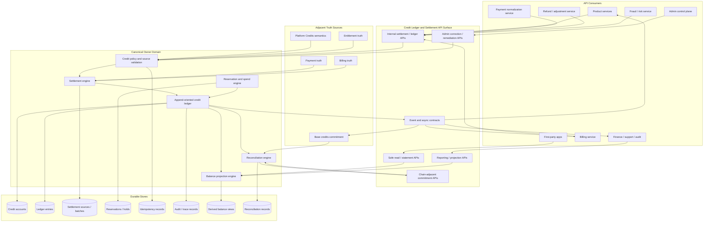
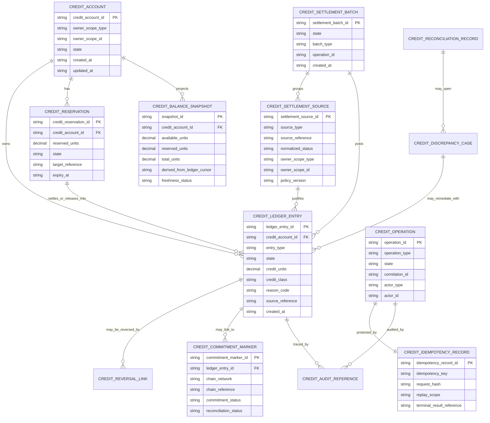
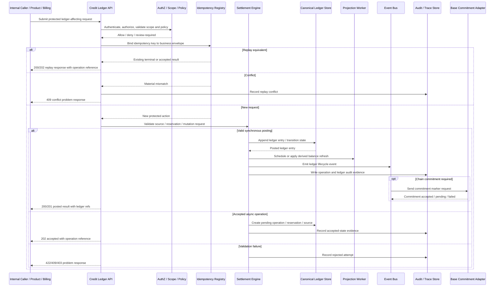

# CREDIT_LEDGER_AND_SETTLEMENT_API_SPEC.md

## Document Metadata

- **Document Name:** `CREDIT_LEDGER_AND_SETTLEMENT_API_SPEC.md`
- **Document Type:** FUZE API SPEC v2 / Production-Grade Interface Contract Specification
- **Status:** Draft for canonical API SPEC v2 inclusion
- **Version:** 2.0.0
- **Effective Date:** 2026-04-24
- **Last Updated:** 2026-04-24
- **Reviewed On:** 2026-04-24
- **Document Owner:** FUZE Platform Credits Ledger and Settlement Architecture
- **Approval Authority:** FUZE Platform Architecture and Governance Authority; formal approval workflow not yet attached
- **Review Cadence:** Quarterly and whenever Platform Credits semantics, ledger mutation posture, settlement behavior, payment normalization, billing posture, refund/reversal policy, Base commitment behavior, reconciliation posture, or financial-control requirements materially change
- **Governing Layer:** Platform core / shared commercial infrastructure / API contract layer for credit-ledger and settlement truth
- **Parent Registry:** `API_SPEC_INDEX.md`
- **Upstream Semantic Registry:** `REFINED_SYSTEM_SPEC_INDEX.md`
- **Upstream API Registry:** `API_SPEC_INDEX.md`
- **Primary Audience:** Platform architecture, backend engineering, credits and ledger engineering, payments engineering, billing engineering, product engineering, finance operations, support operations, security engineering, audit/compliance, API design, data engineering, platform operations, SDK/OpenAPI authors, AsyncAPI authors, implementation-contract authors
- **Primary Purpose:** Define the API contract posture for FUZE credit-ledger mutation, settlement intake, reservation, spend, release, reversal, adjustment, expiry, reconciliation, projection, audit, and Base commitment linkage without redefining Platform Credits semantic truth or downstream accounting/treasury truth
- **Primary Upstream References:** `REFINED_SYSTEM_SPEC_INDEX.md`; `DOCS_SPEC_INDEX.md`; `SYSTEM_SPEC_INDEX.md`; `API_SPEC_INDEX.md`; `CREDIT_LEDGER_AND_SETTLEMENT_SPEC.md`; `PLATFORM_CREDITS_SPEC.md`; `BASE_PLATFORM_CREDITS_LAYER_SPEC.md`; `PAYMENT_RAILS_INTEGRATION_SPEC.md`; `SUBSCRIPTIONS_AND_USAGE_BILLING_SPEC.md`; `INVOICING_AND_RECEIPTS_SPEC.md`; `REFUND_REVERSAL_AND_ADJUSTMENT_SPEC.md`; `PAYMENT_FRAUD_AND_ABUSE_PREVENTION_SPEC.md`; `PRICING_AND_MONETIZATION_MODEL_SPEC.md`; `AI_USAGE_METERING_SPEC.md`; `AUDIT_AND_ACCESS_TRACEABILITY_SPEC.md`; `SECURITY_AND_RISK_CONTROL_SPEC.md`; `IDEMPOTENCY_AND_VERSIONING_SPEC.md`; `EVENT_MODEL_AND_WEBHOOK_SPEC.md`; `INTERNAL_SERVICE_API_SPEC.md`; `MIGRATION_AND_BACKWARD_COMPATIBILITY_SPEC.md`; `ONCHAIN_OFFCHAIN_RESPONSIBILITY_SPEC.md`; `FUZE_ACCOUNT_ACCESS_AND_SESSION_CANONICAL_FINAL_SPEC.md`; `FUZE_WORKSPACE_ACCESS_CONTROL_BASICS_THESIS_FINAL_SPEC.md`
- **Primary Downstream Dependents:** `SUBSCRIPTIONS_AND_USAGE_BILLING_API_SPEC.md`; `PAYMENT_RAILS_INTEGRATION_API_SPEC.md`; `INVOICING_AND_RECEIPTS_API_SPEC.md`; `REFUND_REVERSAL_AND_ADJUSTMENT_API_SPEC.md`; `PAYMENT_FRAUD_AND_ABUSE_PREVENTION_API_SPEC.md`; `PRICING_AND_MONETIZATION_MODEL_API_SPEC.md`; `AI_USAGE_METERING_API_SPEC.md`; `BASE_PLATFORM_CREDITS_LAYER_API_SPEC.md`; product-specific monetization contracts; finance reconciliation contracts; support/control-plane contracts; OpenAPI, AsyncAPI, SDK, data-projection, and audit-contract layers
- **API Surface Families Covered:** Internal service APIs; first-party trusted read APIs where mediated by backend; admin/control-plane APIs; event and async interfaces; reporting/projection APIs; chain-adjacent commitment-linkage APIs
- **API Surface Families Excluded:** Unauthenticated public mutation APIs; public market/trading APIs; raw provider payment callbacks; exact accounting-book exports; exact smart-contract ABI; final UI rendering contracts; treasury/profit payout execution APIs
- **Canonical System Owner(s):** FUZE Platform Credits Ledger and Settlement Domain
- **Canonical API Owner:** FUZE Backend API / Credit Ledger and Settlement API surface
- **Supersedes:** Older v1 `CREDIT_LEDGER_SETTLEMENT_API_SPEC.md` naming and any weaker API interpretation that permits free-form balance mutation, product-local shadow ledgers, payment-state-as-ledger-truth, invoice-state-as-ledger-truth, or chain-commitment-as-sole-business-truth
- **Superseded By:** Not yet known
- **Related Decision Records:** Not yet linked in retrieved governing material
- **Canonical Status Note:** This API spec expresses interface contracts derived from refined credit-ledger and settlement semantics. It does not own the semantic truth of Platform Credits, payment rails, billing, invoices, refunds, token participation, treasury, or Base chain execution. Downstream contracts MUST preserve the truth separation and append-oriented ledger posture defined here.
- **Implementation Status:** Normative API SPEC v2 baseline for downstream route, schema, event, worker, audit, projection, OpenAPI, AsyncAPI, and SDK derivation
- **Approval Status:** Draft pending formal approval
- **Change Summary:** Upgraded the v1 credit-ledger settlement API draft into API SPEC v2 format; aligned naming to `CREDIT_LEDGER_AND_SETTLEMENT_API_SPEC.md`; added explicit truth taxonomy, surface-family rules, request/response/error/status models, idempotency, retry, replay, audit, migration, projection, diagrams, flow views, acceptance criteria, and test cases.

## Purpose

This document defines the FUZE API SPEC v2 contract for the Credit Ledger and Settlement API family.

The API family governs how Platform Credits mutations become durable, append-oriented ledger truth; how upstream payment, billing, pricing, product-consumption, refund, adjustment, promotion, migration, AI-usage, and support-correction signals are accepted into settlement; how balances are derived; how reservations become final spends or releases; how reversals, adjustments, expiry, and reassignment are represented; how reconciliation and discrepancy remediation are performed; and how Base commitment linkage is exposed without allowing chain state to replace platform-side ledger truth.

The upstream refined system spec owns the semantic architecture of credit-ledger and settlement truth. This API spec owns the interface-contract expression of that truth. It defines allowed route/resource families, request and response expectations, error/result/status semantics, authorization posture, idempotency and replay requirements, event and async behavior, admin/control-plane boundaries, projection rules, migration requirements, and downstream implementation guardrails.

## Scope

This API spec governs:

1. Internal service APIs for credit account lookup, ledger entry creation, settlement intake, settlement posting, reservation, spend, release, expiry, reversal, adjustment, migration/reassignment, and balance derivation.
2. First-party application read surfaces for safe balance, reservation, and statement summaries mediated by backend policy.
3. Admin/control-plane APIs for correction, remediation, account suspension, discrepancy review, settlement reprocessing, forced release, and reconciliation repair.
4. Event and async APIs for settlement received, settlement posted, ledger entry posted, reservation opened, reservation settled, reservation released, reversal posted, adjustment posted, expiry posted, discrepancy opened/resolved, and commitment status changed.
5. Reporting and projection surfaces for finance, support, reconciliation, dashboards, exports, and user-visible statements.
6. Chain-adjacent APIs for Base commitment linkage, commitment markers, commitment status, and reconciliation between platform ledger truth and Base operational representations.
7. API contract requirements for idempotency, retry safety, replay conflict handling, auditability, traceability, correlation, observability, versioning, migration, and compatibility.

## Out of Scope

This API spec does not govern:

- the high-level meaning of Platform Credits classes, ownership scope policy, transfer restrictions, or issuance categories beyond interface enforcement needed to preserve them;
- raw payment provider verification, rail-specific callback semantics, chargeback intake, or external payment initiation;
- subscription plan pricing, metering math, proration, invoicing, receipt rendering, tax logic, or accounting recognition;
- exact smart-contract ABI, signer implementation, transaction-batching internals, or treasury operations;
- public token ownership, profit participation, payout eligibility, payout execution, or stablecoin treasury movement;
- final user-interface copy, charts, statement PDF design, or product-local presentation;
- database table DDL, queue technology, cache vendor, or exact implementation internals, except where interface-contract guardrails are required.

## Design Goals

1. Preserve credit-ledger truth as append-oriented, attributable, auditable, scope-aware, idempotent, and reconcilable.
2. Prevent free-form mutable balance APIs from becoming hidden financial truth.
3. Make every economically material credits mutation traceable to a source event, reason code, actor or service identity, correlation ID, policy version, and settlement lineage.
4. Distinguish Platform Credits semantic truth from ledger mutation truth, payment truth, billing truth, invoice truth, entitlement truth, correction truth, Base commitment truth, accounting truth, treasury truth, and derived read-model truth.
5. Provide route families that are implementation-usable without reducing the spec to raw endpoint dumping.
6. Make reservation-backed and accepted-state flows deterministic, retry-safe, and failure-resilient.
7. Support safe OpenAPI, AsyncAPI, SDK, worker, projection, audit, and finance/reconciliation contract derivation.
8. Support clear production review through diagrams, flows, acceptance criteria, test cases, non-canonical pattern detection, and quality gates.

## Non-Goals

This API spec is not intended to:

- redefine Platform Credits policy semantics;
- make chain-visible state the sole business source of truth;
- allow products to implement private ledgers with platform meaning;
- allow payment, invoice, billing, or entitlement state to substitute for ledger entries;
- grant ordinary application APIs unrestricted balance mutation authority;
- provide operator super-admin powers outside bounded, audited correction paths;
- describe every persistence table, every queue message, or every implementation function;
- preserve v1 naming if it conflicts with API SPEC v2 registry naming.

## Core Principles

### 1. Ledger Entry as Economic Mutation Contract
Every material credits mutation exposed by this API family MUST terminate in an explicit ledger entry, settlement source, reservation record, reversal/correction record, or documented no-op state. A response MUST NOT imply economic change unless canonical ledger/settlement state exists or the request is explicitly in accepted-state pending finalization.

### 2. Append-Oriented Mutation
Ledger truth MUST be append-oriented. Correction MUST add reversal, adjustment, supersession, or remediation lineage. Destructive rewrite of historical economic truth is forbidden except for narrowly scoped operational repair that preserves equivalent audit lineage and does not alter business meaning.

### 3. Derived Balance Safety
Balances are derived from ledger truth. Materialized balance snapshots, account summaries, product counters, support dashboards, and exports are derived read models. They MUST NOT become mutation owners.

### 4. Owner-Scope Binding
Every ledger-affecting request MUST bind to a validated owner scope, such as account or workspace. Ambiguous scope, stale scope, wrong-scope resolution, or unauthorized cross-scope mutation MUST fail closed.

### 5. Settlement Lineage
Every settlement effect MUST link to an upstream economic reference and settlement path. Payment success, subscription renewal, invoice creation, usage completion, refund, reversal, adjustment, promotion, or support case may justify ledger mutation only through explicit settlement lineage.

### 6. Reservation Is Not Final Spend
Reservation holds reduce available credits but do not represent final consumption. Final spend requires explicit settlement. Release restores availability without erasing the reservation lineage.

### 7. Chain Commitment Is Linked Evidence
Base commitment state MAY provide operational and transparency evidence. It MUST remain linked to platform-side ledger truth and MUST NOT override canonical platform-side ledger interpretation by itself.

### 8. Idempotent Economic Mutation
All protected economic mutations MUST be idempotent at the business-action level. Duplicate delivery, retries, worker restarts, provider redelivery, and admin resubmission MUST NOT create duplicate economic effect.

### 9. Bounded Admin Correction
Admin/control-plane APIs may correct, remediate, suspend, reverse, or reprocess only through bounded, reason-coded, policy-constrained, privileged-session, and audit-heavy pathways.

### 10. No Shadow Ledger
Product, billing, payment, AI usage, entitlement, support, chain adapter, and reporting systems MUST consume canonical ledger outcomes or approved projections. They MUST NOT maintain platform-meaningful private credit balances.

## Canonical Definitions

- **Credit Account:** The canonical ledger-facing container for a balance-owning subject scope.
- **Owner Scope:** The canonical subject that owns ledger posture, typically an account, workspace, or other explicitly approved platform scope.
- **Ledger Entry:** An append-oriented record representing an economically material credit mutation or state transition.
- **Settlement Source:** A normalized reference to an upstream source event that justifies a ledger effect.
- **Settlement Batch:** A grouped finalization unit that turns one or more settlement sources into posted ledger entries.
- **Reservation / Hold:** A provisional claim against available credits pending work completion, cancellation, expiry, or final settlement.
- **Spend / Consumption:** A final settled reduction of credits for an approved commercial or product action.
- **Release:** Removal of a reservation without final consumption, including partial release after lower-than-reserved settlement.
- **Reversal:** An explicit undoing or negation of a prior ledger effect, usually linked to refund, payment invalidation, fraud response, or correction.
- **Adjustment:** A controlled corrective mutation that is not ordinary issuance, spend, release, reversal, or expiry.
- **Expiry:** A policy-driven terminal effect for eligible bonus or restricted credits.
- **Reassignment / Migration:** Controlled internal movement or reinterpretation across scopes, products, or versions where policy allows.
- **Commitment Marker:** A ledger-linked representation of Base commitment status or chain-adjacent synchronization state.
- **Balance Projection:** A derived read model computed from ledger truth for operational, product, support, or reporting use.
- **Reconciliation Record:** Evidence of consistency check, discrepancy, remediation, or repair across ledger, settlement, projection, payment, billing, and chain-adjacent layers.

## Truth Class Taxonomy

Downstream implementations MUST preserve the following truth classes.

### Semantic Truth
Owned primarily by `PLATFORM_CREDITS_SPEC.md`. Defines what credits are, what classes mean, what scopes are valid, which issuance categories exist, and which restrictions apply.

### API Contract Truth
Owned by this API spec for interface surfaces. Defines allowed route families, input envelopes, response envelopes, error semantics, idempotency posture, event posture, and downstream contract guardrails.

### Ledger / Storage Truth
Owned by the credit-ledger and settlement domain. Includes ledger entries, settlement sources, reservation records, reversal records, adjustment records, expiry records, reconciliation records, commitment markers, and idempotency bindings.

### Runtime Truth
Includes received, accepted, in-progress, posted, failed, replayed, conflicted, expired, reprocessed, reconciled, degraded, and remediated execution posture. Runtime truth may lag final business outcome but must remain correlated.

### Policy Truth
Includes credit class policy, expiry policy, spend policy, fraud/risk policy, correction policy, operator permission policy, migration policy, replay-window policy, and compatibility policy.

### Payment / Billing / Commerce Truth
Includes verified payment records, subscription state, billing obligation, invoice/receipt state, pricing outputs, usage records, refunds, reversals, and commercial correction records. These may justify settlement but do not replace ledger truth.

### Chain Commitment Truth
Includes Base commitment status, chain transaction references, commitment batches, and chain-adjacent reconciliation posture. This truth is linked evidence and operational state, not the sole business ledger.

### Audit / Traceability Truth
Includes correlation IDs, trace IDs, actor/service identity, policy versions, reason codes, operation references, support case references, privileged-session evidence, and immutable audit records.

### Derived Read-Model Truth
Includes balance snapshots, user-facing balances, statements, dashboards, finance reports, support summaries, exports, analytics, search indexes, and product quota views. These are derived and must remain subordinate.

### Presentation Truth
Includes UI strings, formatted statements, product warnings, dashboard cards, and user-visible history grouping. Presentation MUST NOT redefine ledger semantics.

## Architectural Position in the Spec Hierarchy

This API spec sits below the active refined system registry and the refined credit-ledger and settlement spec. It also consumes Platform Credits semantics, API architecture posture, internal service API rules, idempotency/versioning rules, event/webhook posture, audit/access traceability, security/risk controls, access/session foundations, and workspace access-control foundations.

It sits above downstream OpenAPI, AsyncAPI, SDK, backend service contracts, queue/worker contracts, projection contracts, reporting exports, admin tooling, support workflows, reconciliation runbooks, and chain adapter implementation contracts.

This API spec must not be used to override upstream refined semantics. It must be used to prevent downstream implementation drift.

## Upstream Semantic Owners

- `PLATFORM_CREDITS_SPEC.md` owns Platform Credits semantic truth.
- `CREDIT_LEDGER_AND_SETTLEMENT_SPEC.md` owns authoritative ledger mutation, settlement, balance derivation, reconciliation, and commitment-linkage semantics.
- `PAYMENT_RAILS_INTEGRATION_SPEC.md` owns payment intake and verification truth.
- `SUBSCRIPTIONS_AND_USAGE_BILLING_SPEC.md` owns subscription, usage billing, and billing-obligation truth.
- `INVOICING_AND_RECEIPTS_SPEC.md` owns invoice and receipt document truth.
- `REFUND_REVERSAL_AND_ADJUSTMENT_SPEC.md` owns typed commercial correction truth.
- `PAYMENT_FRAUD_AND_ABUSE_PREVENTION_SPEC.md` owns commercial risk containment and review posture.
- `ENTITLEMENT_AND_CAPABILITY_GATING_SPEC.md` owns product/capability eligibility truth.
- `BASE_PLATFORM_CREDITS_LAYER_SPEC.md` owns Base-side operational credits representation and commitment behavior.
- `AUDIT_AND_ACCESS_TRACEABILITY_SPEC.md` owns audit and traceability requirements.
- `IDEMPOTENCY_AND_VERSIONING_SPEC.md` owns cross-cutting replay and contract-version governance.

## API Surface Families

### Public API
No ordinary unauthenticated public mutation API exists for this domain. Public or external developer surfaces MAY expose narrow, stable, read-only summaries only if mediated by approved public API specs and redaction policy.

### First-Party Application API
First-party clients MAY read safe balance, reservation, statement, and transaction-summary views. They MUST NOT submit authoritative balances, ledger entries, settlement sources, correction instructions, or chain commitment truth.

### Internal Service API
Trusted internal services MAY request account lookup, settlement intake, reservations, spend finalization, release, reversal, expiry, and derived reads when authorized. Internal APIs are the ordinary implementation surface for billing, products, AI usage, payment normalization, refunds, and Base adapters.

### Admin / Control-Plane API
Admin/control-plane APIs MAY suspend accounts, correct ledger effects, resolve discrepancies, force-release holds, reprocess failed settlements, and trigger reconciliation under bounded operator policy. These APIs require privileged actor identity, privileged session where applicable, explicit permission, reason code, case linkage when required, idempotency key, correlation ID, and critical audit.

### Event / Webhook / Async API
Event APIs communicate ledger lifecycle changes to internal consumers. Public webhooks, if ever introduced, MUST expose only curated derived facts and MUST NOT reveal internal financial, risk, support, or correction details.

### Reporting / Projection API
Reporting APIs MAY expose derived summaries and exports to finance, support, product, and audit consumers. Reporting APIs MUST link to canonical ledger windows or export snapshots and MUST NOT create or mutate ledger truth.

### Chain-Adjacent API
Chain-adjacent APIs MAY expose commitment markers, Base synchronization posture, chain transaction references, and reconciliation status. They MUST preserve the rule that Base commitment state is linked evidence and not a substitute for platform-side ledger truth.

## System / API Boundaries

This API owns:

- credit account creation/lookup at ledger-contract level;
- settlement source intake and normalization references;
- ledger entry posting contracts;
- reservation, spend, release, reversal, adjustment, expiry, migration/reassignment, and commitment-marker route families;
- derived balance/statement read models;
- reconciliation and discrepancy route families;
- critical audit and operation-reference requirements;
- idempotency and replay semantics for protected economic mutations.

This API does not own:

- actor identity, login, session continuity, or provider linking;
- workspace membership or role semantics;
- pricing decision semantics;
- external provider payment truth;
- invoice/receipt document truth;
- refund rights and commercial correction classification outside ledger effects;
- entitlement eligibility;
- public token, payout, treasury, or governance execution;
- exact chain contract implementation.

## Adjacent API Boundaries

- `PLATFORM_CREDITS_API_SPEC.md` governs credit class, semantic balance posture, issuance/spend policy expression, and high-level credit usage contracts. This API records mutation and settlement lineage.
- `PAYMENT_RAILS_INTEGRATION_API_SPEC.md` governs payment initiation, provider callback normalization, and verified payment records. This API accepts only normalized settlement-eligible inputs.
- `SUBSCRIPTIONS_AND_USAGE_BILLING_API_SPEC.md` governs billing obligations and usage charging. This API records the resulting credit effects.
- `INVOICING_AND_RECEIPTS_API_SPEC.md` governs billing documents. This API may provide settlement references used by receipts but does not produce document truth.
- `REFUND_REVERSAL_AND_ADJUSTMENT_API_SPEC.md` governs correction classification and approval. This API records ledger effects of approved corrections.
- `PAYMENT_FRAUD_AND_ABUSE_PREVENTION_API_SPEC.md` governs risk cases and holds. This API applies ledger holds, suspensions, or reversals only through approved contracts.
- `BASE_PLATFORM_CREDITS_LAYER_API_SPEC.md` governs Base operational commitment. This API owns ledger-side commitment markers and reconciliation linkage.
- `AUDIT_LOG_AND_ACTIVITY_API_SPEC.md` governs broad audit/activity surfaces. This API emits credit-ledger audit events and trace roots.
- `IDEMPOTENCY_AND_VERSIONING_SPEC.md` governs cross-cutting replay and version behavior. This API provides domain-specific business-action envelopes.

## Conflict Resolution Rules

When sources or implementations conflict, FUZE MUST apply the following order unless a higher-order governance document explicitly overrides it:

1. Active refined registry and platform constitutional ownership documents.
2. `CREDIT_LEDGER_AND_SETTLEMENT_SPEC.md` for ledger/settlement semantics.
3. `PLATFORM_CREDITS_SPEC.md` for credit-class and credit-scope semantics.
4. Domain owner records for payment, billing, invoice, refund, risk, entitlement, and Base commitment inputs.
5. This API SPEC v2 for route, request, response, error, event, idempotency, and contract expression.
6. Downstream OpenAPI, AsyncAPI, SDK, worker, projection, admin tooling, and implementation contracts.

Additional conflict rules:

- Canonical ledger entries outrank balance projections, product counters, dashboard summaries, and UI statements.
- Payment success does not equal ledger issuance until settlement is posted.
- Billing obligation does not equal credit spend until ledger consumption is posted.
- Chain commitment does not outrank platform ledger interpretation.
- Admin correction does not erase prior truth; it adds bounded corrective lineage.
- Derived read models must be repaired when they diverge from canonical ledger truth.

## Default Decision Rules

- If a request could create duplicate economic effect, require idempotency and reject unsafe execution.
- If owner scope cannot be resolved deterministically, fail closed.
- If authorization or entitlement context is ambiguous, fail closed before economic mutation.
- If upstream source status is valid but not settlement-eligible, record no ledger effect and return a clear non-terminal or rejected status.
- If platform ledger and Base commitment diverge, mark reconciliation-required rather than allowing either layer to silently reinterpret the other.
- If a projected balance disagrees with ledger-derived balance, trust ledger and repair projection.
- If a corrective case could be modeled as reversal or adjustment, prefer the narrower typed correction with explicit link to the prior entry.
- If final cost is uncertain, prefer reservation/settlement over immediate spend.
- If replay identity is reused for materially different request semantics, return conflict.

## Roles / Actors / API Consumers

- **Account Actor:** Human account holder whose account-scoped credits may be displayed or spent through approved product flows.
- **Workspace Actor:** Member or administrator operating within a workspace-scoped commercial context.
- **Product Service:** Internal service that reserves or consumes credits for product actions.
- **Billing Service:** Internal service that supplies billing events and usage obligations.
- **Payment Normalization Service:** Internal service that supplies verified payment or refund source references.
- **AI Usage Metering Service:** Internal service that requests reservation/spend/finalization for AI usage.
- **Base Credits Adapter:** Internal chain-adjacent service that consumes ledger commitment markers and reports commitment status.
- **Reconciliation Worker:** Worker that compares ledger, projection, payment, billing, and chain-adjacent state.
- **Support Operator:** Privileged actor who may view and initiate bounded correction actions.
- **Finance Operator:** Privileged actor who may review settlement, reconciliation, and ledger discrepancy posture.
- **Security/Risk Operator:** Privileged actor who may trigger or approve holds, suspensions, reversals, or containment-linked remediation under policy.
- **Audit Consumer:** Internal consumer that inspects lineage, traceability, and change history.
- **Public Consumer:** External consumer limited to approved public read-model summaries where separately authorized.

## Resource / Entity Families

### Canonical Resource Families

- `credit_account`
- `credit_owner_scope`
- `credit_ledger_entry`
- `credit_settlement_source`
- `credit_settlement_batch`
- `credit_reservation`
- `credit_release`
- `credit_spend`
- `credit_reversal`
- `credit_adjustment`
- `credit_expiry`
- `credit_reassignment`
- `credit_commitment_marker`
- `credit_reconciliation_record`
- `credit_discrepancy_case`
- `credit_operation`
- `credit_idempotency_record`
- `credit_audit_event_reference`

### Derived Resource Families

- `credit_balance_snapshot`
- `credit_available_balance_view`
- `credit_reserved_balance_view`
- `credit_statement_view`
- `credit_history_view`
- `credit_finance_report_view`
- `credit_support_summary_view`
- `credit_public_summary_view`

Derived resource families MUST expose provenance or freshness metadata when used for financial, support, operational, or product-decision purposes.

## Ownership Model

The Credit Ledger and Settlement Domain owns canonical ledger mutation, settlement, reservation, reversal, adjustment, expiry, reassignment, reconciliation, commitment-marker, and ledger-derived balance posture.

Payment, billing, pricing, AI usage, refund, risk, entitlement, product, and Base adapter domains may initiate or consume ledger-affecting operations only through approved contracts. They do not own ledger truth. Admin/control-plane tooling may request correction or remediation but remains a privileged interface, not a semantic owner.

## Authority / Decision Model

### Ledger Mutation Authority
The ledger domain decides whether a ledger effect is posted, rejected, replayed, conflicted, reversed, adjusted, superseded, or marked reconciliation-required.

### Settlement Authority
The settlement path decides whether a normalized upstream source is eligible to become one or more ledger effects.

### Scope Authority
Identity, workspace, and membership domains validate subject scope. This API consumes scope validity but does not redefine it.

### Policy Authority
Platform Credits, fraud/risk, entitlement, and correction domains supply policy constraints. This API enforces the relevant constraints at mutation time.

### Operator Authority
Operators may act only through bounded admin/control-plane APIs with reason codes, explicit permission, privileged session where required, policy version, and audit lineage.

## Authentication Model

- First-party user-facing reads require authenticated account/session context and must validate subject relationship to the requested scope.
- Internal service mutations require service-to-service authentication, service identity, allowed caller class, and route-specific permission.
- Admin/control-plane mutations require authenticated operator identity, privileged-session posture when required, explicit operator permission, reason code, and audit context.
- Event consumers and workers require service identity and version-aware contract validation.
- Chain-adjacent adapters require service identity, environment binding, key/signer boundary verification where applicable, and no direct frontend invocation.

Authentication proves caller identity and runtime posture. It does not by itself authorize ledger mutation.

## Authorization / Scope / Permission Model

Every mutation-capable route MUST evaluate:

- caller identity or service principal;
- actor account and/or service actor class;
- target owner scope type and ID;
- caller authority for the route family;
- product/billing/payment/refund/risk source authority where applicable;
- effective permission for human or operator actions;
- workspace membership and role posture for workspace-scoped actions;
- whether the target account or scope is active, restricted, suspended, under review, or closed;
- whether policy allows the requested event type and credit class effect;
- whether idempotency and business-action envelope are valid.

Insufficient authorization MUST return a stable denial result without leaking sensitive ledger, finance, or risk details.

## Entitlement / Capability-Gating Model

Entitlement may be required before products reserve or spend credits for capability use, but entitlement truth remains separate from credit-ledger truth. A subject may have sufficient credits but lack entitlement, or have entitlement but insufficient credits. API consumers MUST evaluate both where product use requires both.

Credit-ledger routes MUST NOT grant entitlement. Entitlement routes MUST NOT mutate credits. Coordination occurs through explicit product, billing, and usage workflows.

## API State Model

### Credit Account State
- `active`
- `restricted`
- `suspended`
- `closed`
- `migration_pending`
- `reconciliation_required`

### Settlement Source State
- `received`
- `validated`
- `rejected`
- `pending_batch`
- `settled`
- `failed`
- `superseded`
- `reconciliation_required`

### Settlement Batch State
- `collecting`
- `ready`
- `posting`
- `posted`
- `partially_posted`
- `failed`
- `reprocessing`
- `superseded`
- `reconciliation_required`

### Ledger Entry State
- `pending`
- `posted`
- `held`
- `settled`
- `released`
- `expired`
- `reversed`
- `adjusted`
- `superseded`
- `voided_by_correction`
- `reconciliation_required`

### Reservation State
- `requested`
- `active`
- `partially_settled`
- `settled`
- `released`
- `expired`
- `cancelled`
- `failed`

### Operation State
- `received`
- `accepted`
- `in_progress`
- `applied`
- `replayed`
- `conflicted`
- `rejected`
- `failed`
- `requires_review`

## Lifecycle / Workflow Model

1. Caller authenticates and submits a protected ledger-affecting request with idempotency key, correlation ID, operation reference, and scoped target.
2. API validates caller, route family, source authority, owner scope, request schema, policy version, and idempotency envelope.
3. API resolves whether the request is new, replay, conflict, invalid, or currently in progress.
4. For new valid requests, API creates a durable operation record and, when appropriate, a settlement source or reservation record.
5. Synchronous operations may post ledger entries immediately if all business prerequisites are final and safe.
6. Long-running, variable-cost, dependency-sensitive, or chain-adjacent operations return accepted state and finalize asynchronously.
7. Posting creates append-oriented ledger entries and updates derived balance projections through controlled projection workers or transactional refresh.
8. Events are emitted after canonical state change, not before.
9. Audit records capture actor/service identity, route family, request envelope, idempotency result, policy version, operation reference, reason code, and state transition.
10. Reconciliation workers compare canonical ledger, projections, payment/billing references, and Base commitment records.
11. Discrepancy or failure enters review/remediation state, not silent correction.
12. Admin correction, if approved, creates additive reversal, adjustment, reprocess, or repair lineage.

## Architecture Diagram — Mermaid flowchart

## Data Design — Mermaid Diagram

## Flow View

### Synchronous Settlement Posting

1. Internal caller submits a normalized settlement request with source reference, owner scope, credit units, credit class, idempotency key, and correlation ID.
2. API authenticates service identity and validates route permission.
3. API validates owner scope, source type, source reference uniqueness, policy version, and credit class compatibility.
4. API checks idempotency record.
5. If replay-equivalent, API returns prior terminal result or accepted state with replay marker.
6. If materially conflicting, API returns conflict and emits audit evidence.
7. If new and valid, API creates operation record and settlement source.
8. Settlement engine posts ledger entry or settlement batch.
9. Projection engine updates or schedules derived balance refresh.
10. Event API emits ledger lifecycle event.
11. Audit and observability records are finalized.
12. Response returns posted settlement, ledger entry references, resulting balance summary, operation ID, and trace references.

### Reservation / Settlement Flow

1. Product or AI usage service requests reservation for an explicit owner scope and target action.
2. API validates entitlement/authorization context where required and confirms sufficient available balance.
3. Reservation is created as active and available balance is reduced in derived projection.
4. Product work executes.
5. Product reports completion with final cost and reservation reference.
6. API settles full or partial spend, releases remainder, or releases full reservation if work fails/cancels under policy.
7. Events and audit records preserve accepted-state versus final outcome.

### Failure / Retry Path

1. Caller retries with the same idempotency key after timeout or worker restart.
2. API resolves idempotency envelope.
3. If original operation is in progress, API returns accepted/in-progress status and operation reference.
4. If original operation applied, API returns stable replay response.
5. If new payload differs materially, API returns conflict.
6. If dependency is unavailable, API records failed or retryable state according to operation type and emits observability signal.

### Admin Correction Path

1. Operator opens a support, finance, risk, or reconciliation case.
2. Operator authenticates with privileged session and submits reason-coded correction request.
3. API verifies permission, policy, case linkage, target ledger entry, scope, and idempotency.
4. API creates additive reversal, adjustment, forced release, reprocess, or discrepancy resolution record.
5. API emits critical audit and lifecycle events.
6. Projection and reconciliation workers refresh derived state.
7. Response returns correction lineage, not silent historical rewrite.

### Degraded Mode

If projection storage, chain adapter, reporting pipeline, or non-critical event delivery is degraded, canonical ledger posting MAY proceed only if the ledger store, idempotency store, owner-scope validation, policy validation, and audit baseline are available. Derived refresh and chain commitment must enter pending/reconciliation-required state with explicit observability.

## Data Flows — Mermaid sequenceDiagram

## Request Model

Mutation requests MUST include, as applicable:

- `operation_type`
- `owner_scope_type`
- `owner_scope_id`
- `credit_account_id` or scope-resolvable subject reference
- `source_type`
- `source_reference`
- `credit_units`
- `credit_class`
- `ledger_entry_type`
- `reservation_id`
- `target_ledger_entry_id`
- `reason_code`
- `policy_version`
- `idempotency_key` header or body field according to route standard
- `correlation_id`
- `trace_context`
- `requested_by_actor_type`
- `requested_by_actor_id` or service principal
- `operator_case_id` for privileged correction actions where required
- `metadata_summary` containing non-authoritative descriptive context only

Requests MUST NOT include:

- frontend-authored authoritative balances;
- unvalidated raw provider payloads as ledger truth;
- free-form correction amounts without reason and target linkage;
- hidden override flags;
- public user assertions of settlement eligibility;
- chain transaction state as direct ledger mutation authority.

## Response Model

Successful mutation responses MUST distinguish:

- accepted state versus applied business result;
- canonical resource references;
- derived balance summary freshness;
- operation ID and idempotency disposition;
- audit/correlation references;
- event publication status where relevant;
- chain commitment status where relevant;
- reconciliation-required state where relevant.

Read responses MUST distinguish:

- canonical ledger entries;
- derived balance snapshots;
- reservation posture;
- correction/reversal lineage;
- settlement source linkage;
- chain commitment linkage;
- redaction or access limitations.

Representative response classes:

- `posted_result`
- `accepted_operation`
- `replay_result`
- `conflict_result`
- `rejected_result`
- `requires_review_result`
- `reconciliation_required_result`
- `degraded_projection_result`

## Error / Result / Status Model

All errors SHOULD use structured problem-details style with:

- `type`
- `title`
- `status`
- `code`
- `detail`
- `instance`
- `correlation_id`
- `operation_id` where available
- `retryable`
- `idempotency_disposition` where applicable
- `safe_user_message` where exposed to first-party clients

Required error code families:

- `CREDIT_LEDGER_AUTHENTICATION_REQUIRED`
- `CREDIT_LEDGER_PERMISSION_DENIED`
- `CREDIT_LEDGER_SCOPE_INVALID`
- `CREDIT_LEDGER_ACCOUNT_STATE_INVALID`
- `CREDIT_LEDGER_SOURCE_NOT_SETTLEMENT_ELIGIBLE`
- `CREDIT_LEDGER_DUPLICATE_SOURCE`
- `CREDIT_LEDGER_IDEMPOTENCY_KEY_REQUIRED`
- `CREDIT_LEDGER_IDEMPOTENCY_CONFLICT`
- `CREDIT_LEDGER_INSUFFICIENT_AVAILABLE_BALANCE`
- `CREDIT_LEDGER_RESERVATION_STATE_INVALID`
- `CREDIT_LEDGER_SETTLEMENT_STATE_INVALID`
- `CREDIT_LEDGER_CORRECTION_NOT_ALLOWED`
- `CREDIT_LEDGER_CHAIN_COMMITMENT_PENDING`
- `CREDIT_LEDGER_RECONCILIATION_REQUIRED`
- `CREDIT_LEDGER_PROJECTION_STALE`
- `CREDIT_LEDGER_DEPENDENCY_UNAVAILABLE`
- `CREDIT_LEDGER_RATE_LIMITED`
- `CREDIT_LEDGER_REQUEST_UNPROCESSABLE`

Status handling MUST distinguish:

- request validation failure;
- authorization denial;
- policy denial;
- insufficient balance;
- duplicate source;
- idempotent replay;
- idempotency conflict;
- accepted but not applied;
- applied;
- failed with no economic effect;
- failed after partial canonical effect requiring remediation;
- reconciliation-required.

## Idempotency / Retry / Replay Model

Protected mutations MUST require idempotency keys or approved domain replay anchors. This includes account create/locate, settlement intake, settlement batch posting, reservation, reservation settlement, release, reversal, adjustment, expiry jobs, reassignment/migration, commitment marker creation, discrepancy resolution, reprocess, force release, and admin correction.

Idempotency records MUST bind:

- idempotency key;
- route family;
- business action type;
- owner scope;
- caller identity or service class where required;
- normalized request hash or material payload fingerprint;
- source reference or target result binding;
- contract version;
- operation ID;
- terminal result reference;
- replay window metadata;
- audit reference.

Replay behavior MUST be stable per endpoint family. A repeated equivalent request MAY return original successful representation, current canonical representation with replay marker, or duplicate acknowledgment with result reference, but the chosen posture MUST be documented in downstream OpenAPI.

A materially different request using the same idempotency key or source reference MUST return conflict and MUST NOT mutate ledger state.

Retries after timeout MUST never create duplicate economic effect. Workers and event consumers MUST use operation IDs, source references, ledger entry IDs, and idempotency records to detect re-entry safely.

## Rate Limit / Abuse-Control Model

Rate limits MUST be stricter for ledger-affecting mutations than for reads. The API MUST rate-limit by service principal, actor, owner scope, source type, route family, and risk posture where applicable.

Sensitive admin/control-plane routes MUST include abuse controls such as privileged-session expiration, operator rate limits, case-linking requirements, maker/checker approval where policy requires, reason-code taxonomy validation, and anomaly detection.

First-party read APIs MUST protect against statement scraping, sensitive history enumeration, and cross-scope inference.

## Endpoint / Route Family Model

The following route families are canonical patterns. Final paths may be refined in OpenAPI, but downstream artifacts MUST preserve these boundaries.

### Internal Service Route Families

- `POST /internal/v1/credit-accounts:resolve`
- `GET /internal/v1/credit-accounts/{credit_account_id}`
- `POST /internal/v1/credit-settlement-sources`
- `POST /internal/v1/credit-settlement-batches`
- `POST /internal/v1/credit-reservations`
- `POST /internal/v1/credit-reservations/{credit_reservation_id}:settle`
- `POST /internal/v1/credit-reservations/{credit_reservation_id}:release`
- `POST /internal/v1/credit-ledger-entries`
- `POST /internal/v1/credit-ledger-reversals`
- `POST /internal/v1/credit-ledger-adjustments`
- `POST /internal/v1/credit-expiries:run`
- `POST /internal/v1/credit-reassignments`
- `GET /internal/v1/credit-accounts/{credit_account_id}/ledger`
- `GET /internal/v1/credit-accounts/{credit_account_id}/balance`
- `GET /internal/v1/credit-operations/{operation_id}`

### First-Party Application Route Families

- `GET /app/v1/credits/balance`
- `GET /app/v1/credits/statements`
- `GET /app/v1/credits/reservations`
- `GET /app/v1/credits/transactions/{transaction_id}`

These routes are read-only and derived/protected. They MUST not expose internal correction, risk, settlement, or provider details.

### Admin / Control-Plane Route Families

- `GET /admin/v1/credit-accounts/{credit_account_id}`
- `POST /admin/v1/credit-accounts/{credit_account_id}:suspend`
- `POST /admin/v1/credit-accounts/{credit_account_id}:restrict`
- `POST /admin/v1/credit-ledger-corrections`
- `POST /admin/v1/credit-ledger-reversals`
- `POST /admin/v1/credit-reservations/{credit_reservation_id}:force-release`
- `POST /admin/v1/credit-settlement-batches/{settlement_batch_id}:reprocess`
- `POST /admin/v1/credit-discrepancy-cases`
- `POST /admin/v1/credit-discrepancy-cases/{case_id}:resolve`
- `GET /admin/v1/credit-reconciliation-records`

### Reporting / Projection Route Families

- `GET /internal/v1/credit-reports/balance-windows`
- `GET /internal/v1/credit-reports/settlement-reconciliation`
- `GET /internal/v1/credit-reports/expiry`
- `GET /internal/v1/credit-reports/corrections`
- `POST /internal/v1/credit-exports`

### Chain-Adjacent Route Families

- `POST /internal/v1/credit-commitment-markers`
- `GET /internal/v1/credit-commitment-markers/{commitment_marker_id}`
- `POST /internal/v1/credit-commitment-markers/{commitment_marker_id}:acknowledge`
- `POST /internal/v1/credit-commitment-markers/{commitment_marker_id}:mark-reconciliation-required`

## Public API Considerations

Public APIs MUST default to narrow, stable, read-only exposure. Public surfaces MUST NOT expose:

- raw ledger entries with internal source references;
- provider payloads;
- risk/fraud markers;
- operator notes;
- internal reconciliation diagnostics;
- full support correction lineage;
- admin remediation capabilities;
- chain commitment details that could be misinterpreted as transferable market value.

If public credit status is exposed, it must be an approved derived view with clear scope, redaction, versioning, and freshness semantics.

## First-Party Application API Considerations

First-party clients may display balances, statements, reservation statuses, and safe transaction summaries. They MUST treat these as derived views. They MUST NOT calculate final available balance client-side for protected actions. Protected spending operations must route through backend product or billing services.

A first-party response MUST indicate if a balance is stale, pending reconciliation, restricted, suspended, or projection-refresh pending when that affects user action.

## Internal Service API Considerations

Internal service APIs are the primary mutation surface. They require service identity, route permission, scope binding, idempotency, source reference, and audit/correlation context. Internal service routes MUST NOT become hidden broad-write shortcuts. Each route family must restrict allowed caller classes and source types.

## Admin / Control-Plane API Considerations

Admin routes MUST be separate from ordinary internal service routes. They MUST require:

- privileged authenticated operator;
- explicit permission and effective authorization;
- privileged-session or step-up posture where policy requires;
- reason code;
- operator note;
- case link for sensitive correction;
- idempotency key;
- correlation ID;
- critical audit event;
- policy version;
- target ledger entry, reservation, settlement batch, or discrepancy case.

Admin APIs MUST NOT allow free-form balance setting. They must create correction, reversal, adjustment, force-release, reprocess, suspension, or discrepancy-resolution lineage.

## Event / Webhook / Async API Considerations

Domain events MUST be emitted after canonical state transition and MUST carry:

- event ID;
- event type;
- event version;
- occurred-at timestamp;
- operation ID;
- correlation ID;
- owner scope reference;
- canonical resource reference;
- idempotency disposition where relevant;
- non-sensitive summary;
- replay/duplicate delivery expectations.

Important internal event families:

- `credit.account.resolved`
- `credit.settlement_source.received`
- `credit.settlement_batch.posted`
- `credit.ledger_entry.posted`
- `credit.reservation.opened`
- `credit.reservation.settled`
- `credit.reservation.released`
- `credit.ledger_entry.reversed`
- `credit.ledger_entry.adjusted`
- `credit.expiry.posted`
- `credit.reassignment.posted`
- `credit.commitment_marker.created`
- `credit.commitment_marker.updated`
- `credit.reconciliation.required`
- `credit.discrepancy_case.opened`
- `credit.discrepancy_case.resolved`

Events are not commands unless explicitly defined by a command contract. Event duplicate delivery MUST NOT produce duplicate business mutation.

## Chain-Adjacent API Considerations

Chain-adjacent APIs MUST distinguish:

- platform ledger truth;
- Base commitment request;
- Base commitment accepted/pending/confirmed/failed state;
- commitment marker linkage;
- reconciliation-required state;
- chain transaction reference;
- public transparency projection.

A chain confirmation MAY update commitment status but MUST NOT create unrelated ledger mutation by itself. If chain and platform diverge, the API must enter reconciliation-required posture.

## Data Model / Storage Support Implications

Implementation storage must support:

- durable credit account records;
- append-oriented ledger entries;
- settlement source uniqueness and source lineage;
- reservation lifecycle;
- reversal/adjustment links to prior entries;
- expiry policy reference;
- commitment marker linkage;
- idempotency record binding;
- operation records;
- audit references;
- derived balance snapshots with ledger cursor/provenance;
- reconciliation and discrepancy records;
- migration/version compatibility metadata.

Physical schema may vary, but downstream databases MUST NOT collapse ledger entries into a single mutable balance without reconstructable history.

## Read Model / Projection / Reporting Rules

- Balance snapshots and statement views are derived.
- Derived views MUST include freshness, ledger cursor, or equivalent provenance when used for decisions.
- Product decisions involving spend MUST use canonical or sufficiently fresh authorized balance derivation, not stale UI summaries.
- Finance and reconciliation exports MUST identify source ledger windows and export generation time.
- Reporting views MUST NOT permit mutation.
- Public/user views MUST redact internal source references, risk markers, operator notes, and sensitive correction details.
- Projection divergence MUST trigger reconciliation or projection repair, not ledger reinterpretation.

## Security / Risk / Privacy Controls

The API MUST protect:

- cross-scope balance confidentiality;
- financial and commercial lineage;
- fraud/risk posture;
- operator notes and support case references;
- provider and payment source references;
- chain commitment details when sensitive;
- admin correction tooling;
- idempotency and replay metadata.

Security controls MUST include least privilege, route-family scoping, service-principal validation, operator privileged sessions, request signing or internal mTLS where applicable, audit-grade correlation, redaction by surface family, and anomaly monitoring for suspicious mutation patterns.

## Audit / Traceability / Observability Requirements

Every protected mutation MUST produce reconstructable evidence:

- who or what initiated it;
- route family;
- owner scope;
- source reference;
- policy version;
- idempotency key and disposition;
- request hash or material payload fingerprint;
- operation ID;
- ledger entry references;
- settlement batch references;
- reason code;
- privileged session and case link where applicable;
- event emission references;
- projection refresh status;
- chain commitment reference where applicable;
- correlation ID and trace ID.

Observability must distinguish validation failure, policy denial, insufficient balance, idempotent replay, idempotency conflict, accepted-state, posted, projection failure, event delivery failure, chain commitment pending, reconciliation-required, and admin remediation.

## Failure Handling / Edge Cases

### Duplicate Settlement Source
Return duplicate-source or replay result if equivalent; return conflict if materially different. Do not post duplicate ledger effect.

### Insufficient Available Balance
Return a stable insufficient-balance result. Do not create final spend. Reservation may fail or partially reserve only if policy explicitly allows partial reservation.

### Reservation Work Fails
Release all or part of the reservation according to final work status. Preserve reservation and release lineage.

### Settlement Partially Posts
Mark batch partially posted and reconciliation-required. Do not hide partial state. Admin/worker reprocess must preserve lineage.

### Projection Update Fails
Canonical ledger posting may remain valid if projection failure is isolated. Mark projection stale and schedule repair.

### Event Delivery Fails
Canonical state remains valid. Event delivery enters retry/dead-letter posture with idempotent consumer guarantees.

### Chain Commitment Fails
Ledger state remains canonical. Commitment marker enters failed or reconciliation-required state. Do not reverse ledger solely because chain commitment failed unless policy requires correction.

### Admin Correction Targets Wrong Entry
Reject if target entry, scope, correction type, or case linkage is invalid. Do not permit free-form balance rewrite.

### Provider or Upstream Source Reversal
Consume normalized correction from owning domain. Apply typed reversal or adjustment through ledger pathways; do not let raw provider callback mutate ledger directly.

### Negative Balance
Negative balance MUST NOT be permitted unless explicitly authorized by a refined negative-balance/debt policy. Otherwise fail closed or create restriction/review state.

## Migration / Versioning / Compatibility / Deprecation Rules

- Route families use explicit version prefixes such as `/internal/v1`, `/admin/v1`, and `/app/v1` until API SPEC v2 implementation chooses final versioning posture.
- Additive fields are preferred.
- Status values may be extended only with documented consumer behavior.
- Breaking changes include redefinition of balance, available balance, reserved balance, settlement finality, reversal semantics, idempotency response posture, source uniqueness, or chain commitment authority.
- Migration from v1 `CREDIT_LEDGER_SETTLEMENT_API_SPEC.md` naming to v2 `CREDIT_LEDGER_AND_SETTLEMENT_API_SPEC.md` MUST preserve backwards references and not create duplicate surface families.
- Deprecated routes must emit deprecation metadata and migration guidance where externally or cross-domain consumed.
- Historical ledger entries must remain interpretable under their original contract version.
- Correction lineage is not version evolution; contract version changes are not business corrections.

## OpenAPI / AsyncAPI / SDK Derivation Rules

OpenAPI artifacts MUST preserve:

- route family separation;
- request schemas with idempotency, correlation, owner scope, source reference, reason code, and policy version fields;
- response distinctions among accepted, applied, replayed, conflicted, rejected, and reconciliation-required;
- structured error codes;
- admin/control-plane security requirements;
- read-model freshness/provenance indicators;
- redaction differences by surface family.

AsyncAPI artifacts MUST preserve:

- event version;
- event identity;
- canonical resource references;
- operation ID;
- idempotency/replay expectations;
- duplicate delivery tolerance;
- causal ordering expectations where relevant;
- sensitive-field redaction.

SDKs MUST NOT expose admin/control-plane or internal service mutations to untrusted clients. SDK convenience methods must not hide accepted-state versus final outcome.

## Implementation-Contract Guardrails

- Do not implement `setBalance` or equivalent free-form mutation APIs.
- Do not let products write ledger entries directly without approved internal contract.
- Do not allow frontend-submitted balances, costs, or payment states to become authoritative.
- Do not collapse settlement source, settlement batch, ledger entry, and balance snapshot into one ambiguous object.
- Do not ignore idempotency on economic mutations.
- Do not treat event duplicate delivery as business duplicate mutation.
- Do not allow admin correction without reason code, case linkage where required, and audit.
- Do not expose internal ledger/risk/provider details through first-party or public surfaces.
- Do not treat chain commitment as sole business truth.
- Do not allow derived reporting views to mutate or redefine canonical ledger entries.

## Downstream Execution Staging

1. Confirm final route family names and security policies.
2. Define OpenAPI schemas for internal, app, admin, reporting, and chain-adjacent surfaces.
3. Define AsyncAPI schemas for ledger lifecycle events.
4. Implement idempotency record binding for protected actions.
5. Implement operation records and audit emission.
6. Implement canonical ledger posting and projection refresh contracts.
7. Implement reconciliation and discrepancy cases.
8. Implement admin/control-plane correction pathways.
9. Implement chain commitment marker lifecycle.
10. Build contract tests, replay tests, migration tests, redaction tests, and observability dashboards.

## Required Downstream Specs / Contract Layers

- Machine-readable OpenAPI for internal ledger APIs.
- Machine-readable OpenAPI for app read APIs.
- Machine-readable OpenAPI for admin/control-plane APIs.
- AsyncAPI for ledger lifecycle events.
- Worker contract for settlement batch posting, expiry, projection refresh, reconciliation, and chain commitment.
- Data projection contract for balance snapshots and statements.
- Audit event contract for economic mutation and admin correction.
- Migration contract from v1 naming and route families.
- Support/finance control-plane procedure contract.
- Security review checklist for service principals, privileged sessions, and redaction.

## Boundary Violation Detection / Non-Canonical API Patterns

The following patterns are forbidden:

- `POST /credits/set-balance`
- product-local credit balance tables with shared economic meaning;
- payment provider webhook directly posting credits without payment normalization and settlement validation;
- billing directly decrementing balances without ledger entry;
- admin UI writing balance deltas without correction lineage;
- treating invoice paid as ledger issuance without settlement source;
- treating chain confirmation as automatic business credit issuance without ledger linkage;
- SDK method that hides reservation versus final spend;
- reporting export used as mutation input;
- stale balance projection used for high-value spend approval;
- correction by deletion of historical entries;
- reuse of idempotency key for different scope or economic amount.

Boundary violations MUST be detectable through route review, schema review, audit review, code review, contract tests, and observability alerts.

## Canonical Examples / Anti-Examples

### Example: Paid Credit Issuance
A payment normalization service verifies a payment and submits a settlement source. The ledger API validates source uniqueness, owner scope, credit class, and policy version, posts issuance ledger entry, updates projection, emits event, and records audit.

### Anti-Example: Payment Callback Direct Balance Increment
A provider callback increments a balance field. This is forbidden because payment provider truth is not ledger truth and no settlement lineage exists.

### Example: AI Task Reservation
An AI usage service reserves credits before queued execution, then settles actual spend after completion and releases unused reservation. The initial accepted state is distinct from final spend.

### Anti-Example: Client-Side Balance Calculation
A web client computes available balance and submits it as authoritative for spend. This is forbidden.

### Example: Refund Reversal
Refund domain approves a partial correction. Ledger API posts reversal or adjustment linked to original entry and correction case, preserving historical truth.

### Anti-Example: Admin Deletes Ledger Entry
An operator deletes an incorrect ledger entry to make a balance look right. This is forbidden; correction must be additive and audited.

### Example: Base Commitment Pending
Ledger posts issuance and emits commitment marker. Base adapter later marks commitment pending, confirmed, failed, or reconciliation-required. Ledger truth remains platform-side.

## Acceptance Criteria

1. Every mutation-capable route requires authenticated caller identity and route-family authorization.
2. Every protected economic mutation requires idempotency binding and rejects materially different replay attempts.
3. Settlement sources cannot create duplicate effective ledger outcomes unless explicit supersession lineage exists.
4. Ledger entries preserve owner scope, source reference, entry type, credit class, amount, reason code, operation ID, policy version, and audit reference.
5. Reservation, final spend, partial release, full release, expiry, reversal, adjustment, reassignment, and commitment marker states are distinguishable.
6. First-party read APIs expose only derived/redacted views and cannot mutate ledger truth.
7. Admin/control-plane APIs require reason code, operator identity, privileged posture where required, and critical audit.
8. No API route permits free-form authoritative balance setting.
9. Derived balance projections include freshness or provenance metadata for decision-sensitive use.
10. Projection divergence triggers repair/reconciliation, not ledger reinterpretation.
11. Chain-adjacent APIs distinguish platform ledger truth from Base commitment status.
12. Events are emitted after canonical state transition and include version, event ID, operation ID, owner scope, and correlation ID.
13. Async accepted-state responses include operation reference and do not imply final business success.
14. Error responses distinguish authorization denial, policy denial, invalid scope, duplicate source, idempotency conflict, insufficient balance, stale projection, dependency failure, and reconciliation-required state.
15. Migration from v1 naming preserves historical interpretability and avoids duplicate route-family semantics.
16. OpenAPI, AsyncAPI, SDK, worker, projection, audit, and admin tooling contracts cannot redefine ledger ownership or truth classes.
17. Support and finance users can reconstruct why a balance changed using ledger, settlement, audit, and operation references.
18. Rate limits and abuse controls are applied to ledger-affecting and admin routes.
19. Degraded projection, event, or chain commitment paths are observable and do not silently corrupt canonical ledger state.
20. Boundary-violation tests fail builds or reviews when non-canonical patterns are introduced.

## Test Cases

### Positive Tests

1. **Paid issuance posts once:** Submit a verified payment settlement source and confirm a single issuance ledger entry, updated balance projection, emitted event, and audit record.
2. **Replay paid issuance:** Repeat the same request with same idempotency key and material payload; confirm no duplicate ledger entry and stable replay response.
3. **Reservation and final spend:** Reserve credits for a product action, settle lower actual cost, confirm spend entry and release of remainder.
4. **Full release after failed work:** Reserve credits, mark work failed, release full reservation, and confirm available balance restored with preserved lineage.
5. **Admin correction:** Submit reason-coded correction with valid case link and privileged session; confirm additive adjustment/reversal, critical audit, and projection refresh.
6. **Base commitment marker:** Post ledger entry requiring Base commitment, create marker, update commitment status, and confirm ledger truth remains canonical.

### Negative Tests

7. **Missing idempotency key:** Mutation without required key returns `CREDIT_LEDGER_IDEMPOTENCY_KEY_REQUIRED` and creates no economic effect.
8. **Idempotency conflict:** Reuse same key for different amount or scope; API returns conflict and no ledger mutation.
9. **Invalid owner scope:** Request references nonexistent or unauthorized scope; API fails closed.
10. **Insufficient balance:** Spend/reservation exceeds available balance; API returns insufficient-balance result and posts no spend.
11. **Duplicate settlement source:** Duplicate source with different semantic payload returns duplicate/conflict and creates no second effect.
12. **Forbidden admin balance set:** Attempt direct balance set route or payload; contract test rejects non-canonical route/pattern.

### Authorization / Entitlement / Scope Tests

13. **Workspace member lacks spend permission:** Authenticated actor lacks workspace spend permission; API denies before reservation.
14. **Service principal lacks caller class:** Unauthorized service attempts settlement posting; API returns service permission denial.
15. **Entitlement missing for capability:** Product action requiring entitlement is denied before credit reservation, preserving separate entitlement truth.
16. **Suspended account:** Credit account suspended by risk/control; spend attempt returns account-state invalid.

### Idempotency / Retry / Concurrency Tests

17. **Timeout retry after applied result:** Client times out, retries same key, receives applied result without duplicate ledger entry.
18. **In-progress replay:** Retry during long-running batch returns accepted/in-progress status with same operation ID.
19. **Concurrent reservations:** Two concurrent reservations cannot oversubscribe available credits; one succeeds and the other fails or waits according to locking policy.
20. **Worker restart:** Settlement worker restarts after posting but before event; idempotency and ledger state prevent duplicate posting while event delivery is retried.

### Rate Limit / Abuse / Policy Tests

21. **Admin rapid corrections:** Operator exceeds correction rate or missing case link; API denies or review-requires with audit.
22. **Suspicious repeated failed spend:** Abuse controls detect repeated insufficient-balance or invalid-scope attempts and emit observability signal.
23. **Risk hold blocks issuance:** Risk policy marks source review-required; settlement does not post until release/approval.

### Failure / Degraded Mode Tests

24. **Projection store unavailable:** Canonical ledger posting succeeds only if allowed; response marks projection pending/stale and repair job is queued.
25. **Ledger store unavailable:** Mutation fails safely with dependency error and no accepted final business effect.
26. **Event bus unavailable:** Ledger posting records event-delivery retry state; no duplicate ledger entry occurs.
27. **Chain adapter unavailable:** Commitment marker enters pending/failed state; ledger entry remains canonical with reconciliation posture.
28. **Partial settlement batch failure:** Batch enters partially posted/reconciliation-required state and exposes remediation path.

### Audit / Traceability / Migration Tests

29. **Audit reconstructability:** For a ledger entry, retrieve operation, source, policy, idempotency, actor/service, correlation, and event references.
30. **Correction lineage:** Reversal preserves link to original entry and support/finance case; original entry remains historically visible.
31. **V1 compatibility:** Existing v1 references to `CREDIT_LEDGER_SETTLEMENT_API_SPEC.md` map to v2 naming without semantic duplication.
32. **Deprecated status value:** Consumer contract test verifies unknown additive status handling does not reinterpret finality.

### Boundary-Violation Tests

33. **Product shadow ledger detection:** Product API attempting to maintain platform credit balances outside ledger fails architecture review.
34. **Provider callback direct mutation:** Raw provider callback cannot post ledger entry without normalized payment truth and settlement contract.
35. **Report-as-truth misuse:** Finance export cannot be used to mutate ledger state.
36. **Chain-as-truth misuse:** Chain transaction confirmation cannot create or alter ledger entry without platform commitment marker and reconciliation path.

## Dependencies / Cross-Spec Links

This API spec depends on the active refined system registry and must remain consistent with:

- `PLATFORM_CREDITS_API_SPEC.md`
- `PAYMENT_RAILS_INTEGRATION_API_SPEC.md`
- `SUBSCRIPTIONS_AND_USAGE_BILLING_API_SPEC.md`
- `INVOICING_AND_RECEIPTS_API_SPEC.md`
- `REFUND_REVERSAL_AND_ADJUSTMENT_API_SPEC.md`
- `PAYMENT_FRAUD_AND_ABUSE_PREVENTION_API_SPEC.md`
- `PRICING_AND_MONETIZATION_MODEL_API_SPEC.md`
- `AI_USAGE_METERING_API_SPEC.md`
- `BASE_PLATFORM_CREDITS_LAYER_API_SPEC.md`
- `AUDIT_LOG_AND_ACTIVITY_API_SPEC.md`
- `EVENT_MODEL_AND_WEBHOOK_SPEC.md`
- `IDEMPOTENCY_AND_VERSIONING_SPEC.md`
- `MIGRATION_AND_BACKWARD_COMPATIBILITY_SPEC.md`
- `INTERNAL_SERVICE_API_SPEC.md`
- `SECURITY_AND_RISK_CONTROL_SPEC.md`
- `MONITORING_ALERTING_AND_INCIDENT_RESPONSE_SPEC.md`

## Explicitly Deferred Items

- Exact OpenAPI path, schema, and enum finalization.
- Exact AsyncAPI event schema finalization.
- Exact database DDL and physical partitioning model.
- Exact accounting/export schema and finance system integration.
- Exact Base smart-contract ABI and signer implementation.
- Exact replay-window TTLs by route family.
- Exact public API exposure, if any, for credit summaries.
- Exact tax, invoice, and receipt allocation presentation.
- Exact support runbook and maker/checker approval matrix.

Deferred items MUST remain compatible with this spec and upstream refined semantics.

## Final Normative Summary

The Credit Ledger and Settlement API is the interface-contract layer for FUZE's authoritative Platform Credits mutation and settlement lineage. It MUST preserve append-oriented ledger truth, scope-bound ownership, settlement-source lineage, idempotent economic mutation, reservation/finalization separation, bounded admin correction, explicit auditability, derived read-model subordination, and Base commitment linkage without allowing payment, billing, product, frontend, admin, reporting, or chain-adjacent systems to become hidden ledger owners.

Downstream routes, schemas, events, workers, dashboards, SDKs, and runbooks MUST implement this API family as a conservative, auditable, reconciliation-grade economic contract. Convenience must not override ledger integrity.

## Quality Gate Checklist

- [x] Upstream refined semantic owners are explicit.
- [x] Canonical API owner is explicit.
- [x] API surface families are explicit.
- [x] Mutation boundaries are explicit.
- [x] Read boundaries are explicit.
- [x] Adjacent API boundaries are explicit.
- [x] Truth classes are explicit.
- [x] Conflict-resolution rules are explicit.
- [x] Default decision rules are explicit.
- [x] Public, first-party, internal, admin/control, event/webhook, reporting, and chain-adjacent distinctions are explicit.
- [x] Non-canonical API patterns are called out.
- [x] Operator/admin override paths are bounded, reason-coded, and audited.
- [x] Read-model, cache, reporting, and projection rules are explicit.
- [x] On-chain versus off-chain responsibilities are explicit.
- [x] Accepted-state versus final success semantics are explicit.
- [x] Idempotency and replay requirements are explicit.
- [x] Request, response, error, result, and status classes are implementation-usable.
- [x] Failure and degraded-mode behaviors are explicit.
- [x] Audit, traceability, and observability requirements are explicit.
- [x] Versioning, migration, compatibility, and deprecation rules are explicit.
- [x] OpenAPI / AsyncAPI / SDK guardrails are explicit.
- [x] Dependencies and downstream impacts are explicit.
- [x] Non-goals and deferred items are explicit.
- [x] Architecture Diagram uses Mermaid `flowchart` syntax.
- [x] Data Design diagram uses Mermaid syntax and distinguishes canonical from derived records.
- [x] Flow View includes synchronous, asynchronous, failure, retry, audit, admin/operator, and finalization paths.
- [x] Data Flows use Mermaid `sequenceDiagram` syntax and distinguish accepted state from final outcome.
- [x] Acceptance Criteria are concrete, testable, and aligned with the API domain.
- [x] Test Cases cover positive, negative, authorization, entitlement, idempotency, retry, conflict, rate-limit, degraded-mode, audit, migration, and boundary-violation behavior.
