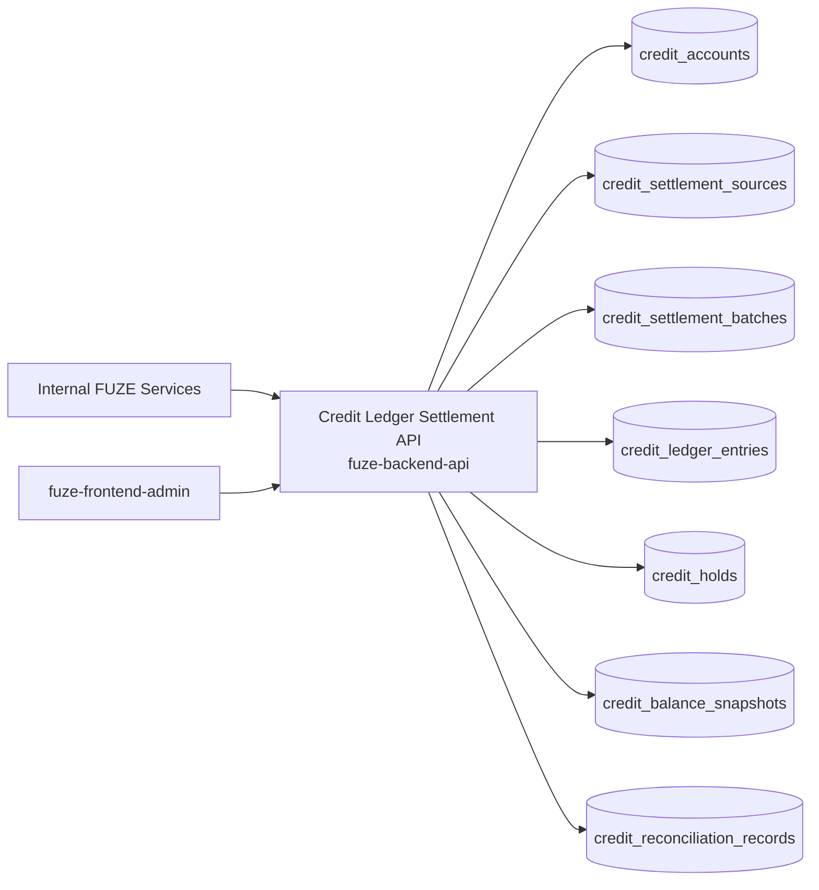
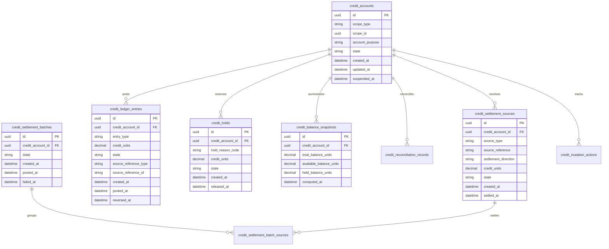
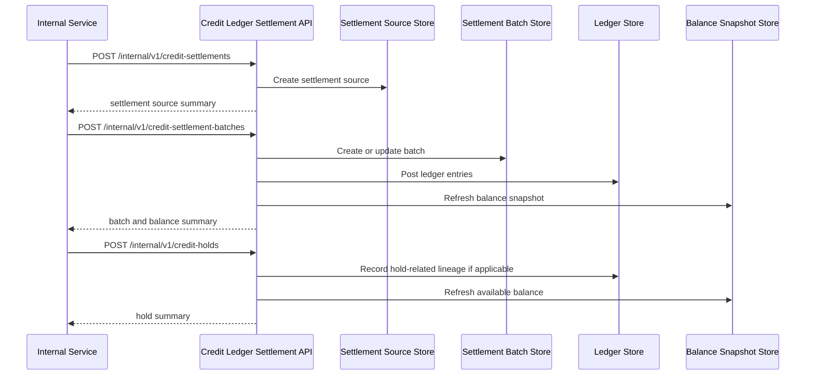

# CREDIT_LEDGER_SETTLEMENT_API_SPEC

## 1. Title

**CREDIT_LEDGER_SETTLEMENT_API_SPEC.md**

---

## 2. Document Metadata

- **Document Name:** CREDIT_LEDGER_SETTLEMENT_API_SPEC.md
- **API Classification:** internal, admin, event-driven, chain-adjacent
- **Owning Domain:** Credit Ledger and Settlement Domain
- **Primary Implementing Repo:** `fuze-backend-api`
- **Primary System of Record:** credit accounts, credit ledger entries, settlement batches, source-to-ledger settlement links, reconciliation records, and correction-safe settlement lineage in `fuze-backend-api`
- **Status:** Draft for canonical source-of-truth approval
- **Purpose:** Define the production-grade API contract architecture for FUZE Platform Credits ledger posting, settlement intake, source-to-ledger conversion, reconciliation-safe credit accounting, and controlled correction behavior across the platform
- **Canonical Folder:** `fuze.ac > docs > api-spec`

---

## 2.1 API Classification Header

- **API Classification:** internal | admin | event-driven | chain-adjacent
- **Owning Domain:** Credit Ledger and Settlement Domain
- **Primary Implementing Repo:** `fuze-backend-api`
- **Primary System of Record:** Platform Credits ledger and settlement-accounting domain

---

## 3. Purpose

This document defines the canonical API specification for FUZE credit ledger and settlement operations. It translates the governing FUZE platform architecture, Platform Credits rules, Base credits layer rules, payment rails rules, subscriptions and usage billing rules, refund/reversal/adjustment rules, on-chain/off-chain responsibility boundaries, audit requirements, and API architecture rules into an implementation-ready API contract.

This API exists because FUZE treats Platform Credits as a distinct platform consumption layer rather than an informal balance field attached to payments, subscriptions, wallets, or products. Credits must therefore be accounted for through a canonical ledger and a controlled settlement process that links upstream commercial or platform events to explicit ledger entries. Credits issuance, consumption, reversal, expiry, hold, release, and reconciliation must remain durable, attributable, and correction-safe. The domain cannot be collapsed into payment status, subscription state, invoice state, or token balances.

Accordingly, this specification defines how credit accounts and ledger entries are represented, how settlement inputs are accepted and normalized, how ledger postings are finalized, how balances are derived, how reconciliation and corrections are handled, and how Platform Credits accounting remains auditable, idempotent, and architecture-consistent across FUZE.

---

## 4. Scope

This specification covers:

- internal APIs for credit account and ledger posting operations
- internal APIs for settlement intake from approved upstream domains
- balance and ledger-summary read APIs for trusted consumers
- admin/control-plane APIs for credit correction, suspension, settlement remediation, and discrepancy resolution
- event emission requirements for credit-ledger and settlement lifecycle changes
- request, response, error, idempotency, versioning, audit, and database-shape rules for this domain

This specification does **not** redefine:

- public payment-rail initiation semantics
- subscriptions and invoicing semantics in full detail
- detailed Platform Credits user-facing entitlement semantics
- profit participation or payout execution semantics
- FUZE token behavior or treasury execution behavior
- wallet-linking identity semantics in full detail
- final consumer UI rendering of balances or statements

Those remain governed by their own source-of-truth specifications.

---

## 5. Source-of-Truth Inputs

### Primary FUZE docs and specs used

#### Highest-priority platform and ownership sources
- `SYSTEM_SPEC_INDEX.md`
- `SYSTEM_BOUNDARY_AND_OWNERSHIP_SPEC.md`
- `SYSTEM_OVERVIEW_AND_BOUNDARIES_SPEC.md`
- `PLATFORM_ARCHITECTURE_SPEC.md`
- `DOMAIN_OWNERSHIP_MATRIX_SPEC.md`
- `DATA_MODEL_AND_ENTITY_OWNERSHIP_SPEC.md`
- `ONCHAIN_OFFCHAIN_RESPONSIBILITY_SPEC.md`

#### Primary credits / financial / settlement sources
- `PLATFORM_CREDITS_SPEC.md`
- `BASE_PLATFORM_CREDITS_LAYER_SPEC.md`
- `CREDIT_LEDGER_AND_SETTLEMENT_SPEC.md`
- `PAYMENT_RAILS_INTEGRATION_SPEC.md`
- `SUBSCRIPTIONS_AND_USAGE_BILLING_SPEC.md`
- `INVOICING_AND_RECEIPTS_SPEC.md`
- `REFUND_REVERSAL_AND_ADJUSTMENT_SPEC.md`
- `PRICING_AND_MONETIZATION_MODEL_SPEC.md`
- `WALLET_AWARE_USER_SPEC.md`

#### API and runtime sources
- `API_ARCHITECTURE_SPEC.md`
- `INTERNAL_SERVICE_API_SPEC.md`
- `EVENT_MODEL_AND_WEBHOOK_SPEC.md`
- `IDEMPOTENCY_AND_VERSIONING_SPEC.md`
- `MIGRATION_AND_BACKWARD_COMPATIBILITY_SPEC.md`
- `AUDIT_LOG_AND_ACTIVITY_SPEC.md`

#### Security and operations sources
- `SECURITY_AND_RISK_CONTROL_SPEC.md`
- `MONITORING_ALERTING_AND_INCIDENT_RESPONSE_SPEC.md`
- `SECRETS_CONFIG_AND_ENVIRONMENT_SPEC.md`

#### Core docs inputs
- `DOCS_SPEC.md`
- `FUZE_PLATFORM_CREDITS.md`
- `FUZE_CHAIN_ARCHITECTURE.md`
- `STABLECOIN_PROFIT_PARTICIPATION.md`

#### Format guides
- `The_API_Specification_guide.md`
- `Database_Schemas_Guide.md`

### Highest-priority interpretation applied

For this file, the most important governing interpretation is:

1. Platform Credits are a distinct platform accounting layer and must remain separate from FUZE token balances, fiat/stablecoin payment settlements, subscriptions, and payouts
2. backend owns canonical credit-ledger and settlement truth
3. balances are derived from ledger truth, not directly mutated free-form fields
4. upstream payment, billing, refund, and adjustment outcomes may settle into credits only through explicit settlement lineage
5. admin/control-plane may correct or remediate under controlled policy but must preserve ledger integrity and immutable history
6. chain-adjacent credits behavior must remain explicit without collapsing off-chain control and on-chain reporting semantics into one ambiguous layer

### Supporting external standards used only as guidance

- HTTP semantics for internal read and mutation APIs
- structured problem-details error design
- general double-entry or ledger-lineage, reconciliation, and settlement-accounting patterns as supporting guidance

External guidance does not override FUZE source-of-truth documents.

---

## 6. Governing Architecture and Ownership Interpretation

This API belongs to the **Credit Ledger and Settlement Domain** because it owns the canonical accounting of Platform Credits issuance, deduction, hold, release, expiry, reversal, and settlement linkage to upstream source events.

This API is implemented primarily in `fuze-backend-api` because:

- backend owns durable ledger and settlement truth
- balances must be derived from canonical ledger entries under centralized control
- upstream domains require a shared and trusted credits-accounting interface
- correction, reconciliation, and settlement-review behavior must be backend-governed
- audit generation and operational remediation must be centralized

This API is **not** owned by:

- `fuze-frontend-webapp`, because frontend only reads bounded balance and history views
- `fuze-frontend-admin`, because admin may correct or remediate but must not own ledger truth
- payment-rail domain, because payment outcomes may settle into credits but do not own credit-ledger truth
- subscription/billing domain, because billing may request credits usage or issuance but does not own canonical ledger truth
- `fuze-contracts`, because chain-side representations or reporting references may exist, but canonical settlement-control and ledger truth remain in `fuze-backend-api`

### Architectural implications

- one credit account may receive many ledger postings over time
- one upstream settlement source may create one or more ledger entries
- balance is derived from posted entries in canonical state
- holds, expiries, reversals, and corrections must remain explicit ledger-side behavior
- settlement finalization must not silently mutate unrelated business truth outside owning domains
- reconciliation and remediation must preserve lineage rather than rewrite prior ledger history

---

## 7. Domain Responsibilities

The Credit Ledger and Settlement API domain is responsible for:

1. maintaining canonical credit accounts and ledger entries
2. accepting approved settlement requests from upstream domains
3. posting issued, consumed, held, released, expired, reversed, or adjusted credits
4. deriving balances and windowed summaries from ledger truth
5. recording settlement batches and reconciliation lineage
6. supporting admin correction, suspension, and remediation under controlled policy
7. emitting credit-ledger lifecycle events
8. generating audit lineage for sensitive credit actions
9. preserving separation between Platform Credits, payments, subscriptions, token balances, and payouts
10. supporting correctness-sensitive reconciliation and discrepancy handling

The domain is not responsible for:

- owning payment-rail truth
- owning invoice or subscription truth
- owning FUZE token supply or ERC-20 behavior
- owning payout or stablecoin profit participation settlement
- silently mutating upstream domain truth
- exposing raw internal ledger controls publicly by default

---

## 8. Out of Scope

The following are out of scope for this API specification:

- public retail balance APIs for unauthenticated consumers
- raw accounting export formats
- private treasury execution internals
- app-store provider-specific settlement mapping details
- wallet signing or contract-deployment detail
- final statement PDF rendering
- full quota/credits UI design for every product
- external accounting software integration specifics

Where later detailed specs are needed, they must remain compatible with this API.

---

## 9. Canonical Entities and Data Ownership

### Durable entities

#### 9.1 credit_accounts
- **Owner:** Credit Ledger and Settlement Domain
- **Purpose:** canonical credit-bearing account or scope container
- **Nature:** source-of-truth durable entity

#### 9.2 credit_ledger_entries
- **Owner:** Credit Ledger and Settlement Domain
- **Purpose:** immutable ledger postings for Platform Credits
- **Nature:** source-of-truth durable entity

#### 9.3 credit_settlement_sources
- **Owner:** Credit Ledger and Settlement Domain
- **Purpose:** normalized references to upstream payment, subscription, adjustment, or approved source events
- **Nature:** source-of-truth durable lineage entity

#### 9.4 credit_settlement_batches
- **Owner:** Credit Ledger and Settlement Domain
- **Purpose:** grouping/finalization records for settlement and ledger posting flows
- **Nature:** source-of-truth durable entity

#### 9.5 credit_balance_snapshots
- **Owner:** Credit Ledger and Settlement Domain
- **Purpose:** derived persisted balance snapshots for fast access and reconciliation windows
- **Nature:** durable derived entity with explicit lineage to ledger truth

#### 9.6 credit_holds
- **Owner:** Credit Ledger and Settlement Domain
- **Purpose:** explicit holds or reserved-credit state linked to ledger and settlement posture
- **Nature:** source-of-truth durable entity

#### 9.7 credit_expiry_policies
- **Owner:** Credit Ledger and Settlement Domain
- **Purpose:** policy bundles controlling expiry applicability and timing
- **Nature:** source-of-truth durable entity

#### 9.8 credit_reconciliation_records
- **Owner:** Credit Ledger and Settlement Domain
- **Purpose:** reconciliation results, exceptions, and review lineage for credit-ledger integrity
- **Nature:** durable review/remediation entity

#### 9.9 credit_settlement_discrepancy_cases
- **Owner:** Credit Ledger and Settlement Domain
- **Purpose:** review and remediation records for duplicate, failed, missing, or inconsistent settlement outcomes
- **Nature:** durable review/remediation entity

#### 9.10 credit_mutation_actions
- **Owner:** Credit Ledger and Settlement Domain
- **Purpose:** high-level action records for settle, post, hold, release, expire, reverse, correct, suspend, and close discrepancy
- **Nature:** durable action records with audit linkage

#### 9.11 credit_audit_events
- **Owner:** Audit / Activity domain, sourced by Credit Ledger and Settlement Domain
- **Purpose:** immutable trail for sensitive credit-ledger actions
- **Nature:** durable audit records

### Derived or cached entities

#### 9.12 credit_balance_views
- **Owner:** derived read-model layer
- **Purpose:** optimized current-balance and available-balance views
- **Nature:** derived

#### 9.13 credit_history_views
- **Owner:** derived read-model layer
- **Purpose:** bounded statement/history views for trusted surfaces
- **Nature:** derived

#### 9.14 credit_discrepancy_views
- **Owner:** derived ops read-model layer
- **Purpose:** visibility into stale, duplicate, or failed settlement/ledger conditions
- **Nature:** derived

---

## 10. State Model and Lifecycle

### 10.1 credit account lifecycle

Possible states:

- `active`
- `suspended`
- `closed`
- `restricted`

### 10.2 ledger entry lifecycle

Possible states:

- `pending`
- `posted`
- `held`
- `released`
- `expired`
- `reversed`
- `superseded_if_required`

### 10.3 settlement source lifecycle

Possible states:

- `received`
- `validated`
- `rejected`
- `settled`
- `failed`
- `superseded`

### 10.4 settlement batch lifecycle

Possible states:

- `collecting`
- `ready`
- `posted`
- `failed`
- `superseded`

### 10.5 hold lifecycle

Possible states:

- `opened`
- `active`
- `released`
- `expired`
- `cancelled`

### 10.6 discrepancy case lifecycle

Possible states:

- `opened`
- `under_review`
- `resolved`
- `failed`
- `closed`

Lifecycle notes:
- ledger entries are additive and immutable in principle; corrections occur through reversing or superseding actions, not silent mutation
- a settlement source becomes effective only after validation and posted ledger effect
- holds may reduce available balance without destroying total historical lineage
- expiry and reversal remain explicit ledger outcomes with preserved source linkage

---

## 11. API Surface Overview

The API surface is divided into three families:

### 11.1 Internal service APIs
Used by trusted internal services for:
- creating or locating credit accounts
- submitting settlement requests
- posting ledger entries
- reading balances and history
- recording holds, releases, expiries, and reversals
- reading reconciliation and discrepancy state

### 11.2 Admin / control-plane APIs
Used by `fuze-frontend-admin` through backend-only privileged routes for:
- correction, manual adjustment, or suspension actions
- settlement remediation and discrepancy resolution
- forced release or hold remediation
- replay/reprocess of failed settlement batches

### 11.3 Event-driven interfaces
Used for downstream side effects:
- billing and entitlement continuation
- audit generation
- transparency and reporting triggers
- reconciliation and anomaly detection
- monitoring and operational review

No ordinary unauthenticated public mutation surface exists for this domain.

---

## 12. Authentication and Authorization Model

### 12.1 Authentication posture by route family

#### Internal service routes
Require internal service identity with explicit least privilege:
- create accounts
- settle sources
- post ledger entries
- read balances and bounded history
- create/release holds
- read discrepancy and reconciliation state for authorized scopes

#### Admin routes
Require privileged operator identity plus reason-coded actions:
- suspend accounts
- correct or reverse entries
- remediate failed settlements
- force-release holds
- resolve discrepancies

### 12.2 Authorization checkpoints

Authorization must evaluate:
- caller service identity
- allowed scope or account access
- whether the caller has settle/post/read/remediate privilege
- whether admin/operator role is present for privileged actions
- whether the current ledger/account state allows requested mutation

### 12.3 Sensitive action rules

The following require heightened checks:
- settlement posting from monetizable upstream events
- manual correction or reversal
- account suspension
- force-release of held credits
- discrepancy-resolution actions
- replay or reprocessing of failed settlement batches

---

## 13. API Endpoints / Interface Contracts

## 13.1 Internal Service APIs

### 13.1.1 `POST /internal/v1/credit-accounts`
**Purpose:** create or locate canonical credit account for a scope  
**Caller Type:** internal trusted service  
**Auth Expectation:** service-to-service identity only  
**Request Body Summary:**
- `scope_type`
- `scope_id`
- optional `account_purpose`
- `idempotency_key`
**Response Summary:**
- credit account summary
- current state
- current balance snapshot if available
**Side Effects:** creates account if absent
**Idempotency Behavior:** required
**Audit Requirements:** account-creation audit where sensitivity requires
**Emitted Events:** `credits.account_created`

### 13.1.2 `POST /internal/v1/credit-settlements`
**Purpose:** submit validated upstream source for credit-ledger settlement  
**Caller Type:** internal trusted service  
**Request Body Summary:**
- `credit_account_id`
- `source_type`
- `source_reference`
- `settlement_direction`
- `credit_units`
- optional `expiry_policy_code`
- optional `metadata_summary`
- `idempotency_key`
**Response Summary:** settlement-source summary and pending/postable state
**Side Effects:** creates settlement source and may queue settlement batch
**Idempotency Behavior:** required
**Audit Requirements:** sensitive settlement-ingest audit
**Emitted Events:** `credits.settlement_received`

### 13.1.3 `POST /internal/v1/credit-settlement-batches`
**Purpose:** finalize settlement postings for one or more received settlement sources  
**Caller Type:** internal trusted service with settlement authority  
**Request Body Summary:**
- `credit_account_id`
- `settlement_source_ids[]` or selection criteria
- `idempotency_key`
**Response Summary:** settlement-batch summary, posted ledger-entry summaries, updated balance summary
**Side Effects:** creates settlement batch, posts ledger entries, updates balance snapshots
**Idempotency Behavior:** required
**Audit Requirements:** critical settlement-posting audit
**Emitted Events:** `credits.settlement_posted`

### 13.1.4 `POST /internal/v1/credit-holds`
**Purpose:** create credit hold or reservation against available credits  
**Caller Type:** internal trusted service with hold authority  
**Request Body Summary:**
- `credit_account_id`
- `hold_reason_code`
- `credit_units`
- optional `target_reference`
- `idempotency_key`
**Response Summary:** hold summary and updated available-balance summary
**Side Effects:** creates hold and may create hold-related ledger lineage
**Idempotency Behavior:** required
**Audit Requirements:** hold audit where sensitivity requires
**Emitted Events:** `credits.hold_opened`

### 13.1.5 `POST /internal/v1/credit-holds/{credit_hold_id}/release`
**Purpose:** release active credit hold under policy  
**Caller Type:** internal trusted service with release authority  
**Request Body Summary:**
- optional `release_reason_code`
- `idempotency_key`
**Response Summary:** released-hold summary and updated available-balance summary
**Side Effects:** hold transitions to released and balance availability refreshes
**Idempotency Behavior:** required
**Audit Requirements:** hold-release audit
**Emitted Events:** `credits.hold_released`

### 13.1.6 `POST /internal/v1/credit-ledger/reversals`
**Purpose:** create reversal or corrective ledger posting against prior ledger effect  
**Caller Type:** internal trusted service with correction authority  
**Request Body Summary:**
- `credit_account_id`
- `target_ledger_entry_id`
- `reversal_reason_code`
- optional `credit_units_override`
- `idempotency_key`
**Response Summary:** reversal summary and updated balance summary
**Side Effects:** creates reversal lineage and posts reversing ledger effect
**Idempotency Behavior:** required
**Audit Requirements:** critical correction audit
**Emitted Events:** `credits.ledger_reversed`

### 13.1.7 `GET /internal/v1/credit-accounts/{credit_account_id}`
**Purpose:** retrieve canonical credit-account truth  
**Caller Type:** internal trusted service  
**Response Summary:** full account summary, current balance, hold posture, state, and reconciliation metadata
**Side Effects:** none

### 13.1.8 `GET /internal/v1/credit-accounts/{credit_account_id}/ledger`
**Purpose:** retrieve canonical bounded ledger history for one account  
**Caller Type:** internal trusted service  
**Query Parameters Summary:**
- pagination
- optional date range
- optional entry-state filters
- optional source-type filters
**Response Summary:** ledger-entry summaries, source linkage, and balance-window metadata
**Side Effects:** none

## 13.2 Admin / Control-Plane APIs

### 13.2.1 `POST /admin/v1/credit-accounts/{credit_account_id}/suspend`
**Purpose:** suspend one credit account under controlled policy  
**Caller Type:** admin/operator  
**Request Body Summary:**
- `reason_code`
- `operator_note`
- `idempotency_key`
**Response Summary:** suspended-account summary
**Side Effects:** account transitions to suspended or restricted state
**Audit Requirements:** critical audit
**Emitted Events:** `credits.account_suspended`

### 13.2.2 `POST /admin/v1/credit-ledger/manual-corrections`
**Purpose:** apply controlled manual credit-ledger correction under policy  
**Caller Type:** admin/operator  
**Request Body Summary:**
- `credit_account_id`
- `correction_direction`
- `credit_units`
- `reason_code`
- `operator_note`
- optional `related_case_id`
- `idempotency_key`
**Response Summary:** correction summary and updated balance summary
**Side Effects:** creates corrective ledger entry or reversal lineage
**Audit Requirements:** critical audit
**Emitted Events:** `credits.ledger_corrected`

### 13.2.3 `POST /admin/v1/credit-settlements/{settlement_batch_id}/reprocess`
**Purpose:** reprocess failed or remediable settlement batch under controlled policy  
**Caller Type:** admin/operator  
**Request Body Summary:**
- `reprocess_profile`
- `reason_code`
- `operator_note`
- `idempotency_key`
**Response Summary:** reprocess action summary and updated batch state
**Side Effects:** may create superseding batch lineage and refresh ledger outcome
**Audit Requirements:** critical audit
**Emitted Events:** `credits.settlement_reprocessed`

### 13.2.4 `POST /admin/v1/credit-holds/{credit_hold_id}/force-release`
**Purpose:** force-release one active hold under controlled policy  
**Caller Type:** admin/operator  
**Request Body Summary:**
- `reason_code`
- `operator_note`
- `idempotency_key`
**Response Summary:** force-released hold summary
**Side Effects:** active hold transitions to released or cancelled
**Audit Requirements:** critical audit
**Emitted Events:** `credits.hold_force_released`

### 13.2.5 `POST /admin/v1/credit-ledger/discrepancies`
**Purpose:** resolve credit-ledger or settlement discrepancy under controlled policy  
**Caller Type:** admin/operator  
**Request Body Summary:**
- `target_reference_type`
- `target_reference_id`
- `resolution_code`
- `operator_note`
- `related_case_id`
- `idempotency_key`
**Response Summary:** discrepancy-resolution summary
**Side Effects:** may correct, reverse, reprocess, suspend, or close discrepancy posture with preserved lineage
**Audit Requirements:** critical audit
**Emitted Events:** `credits.discrepancy_resolved`

---

## 14. Request Rules

### 14.1 General request rules
- all mutation-capable routes must require JSON requests with explicit content type
- all mutation routes must carry correlation IDs
- sensitive credit-ledger mutations must carry idempotency keys
- admin mutations must require reason codes and operator notes
- no route may accept frontend-authored balance truth as authoritative input

### 14.2 Sensitive-action request requirements
The following requests require heightened validation:
- settlement intake from upstream financial events
- settlement batch posting
- hold creation/release affecting available credits
- reversal or manual correction
- account suspension
- discrepancy-resolution and reprocess actions

Heightened validation may include:
- source-reference integrity checks
- duplicate-settlement checks
- account-state checks
- hold and available-balance checks
- operator role confirmation
- finance/support/security case linkage for sensitive actions

### 14.3 Scope integrity rule
Credit-ledger mutations must target valid and authorized accounts, settlement sources, and ledger entries. Services and operators must not mutate unrelated or unauthorized ledger state.

### 14.4 Domain-separation rule
Ledger postings must reflect credit-domain truth only. Upstream payment, billing, or adjustment domains remain authoritative for their own source events even when those events settle into credits.

---

## 15. Response Rules

### 15.1 Success response rules
Successful responses must include:
- stable resource identifiers
- timestamps for created/updated state
- state/status values
- account, source, or ledger summaries where relevant
- balance summaries where relevant
- correlation references for mutations

### 15.2 Async-accepted response rules
If reprocessing, expiry processing, or discrepancy remediation is async, the response must:
- return accepted status
- include action or job ID
- provide follow-up status semantics

### 15.3 Terminal mutation response rules
Terminal mutation responses must clearly show:
- target account, settlement source, batch, hold, or ledger entry
- mutation type
- resulting ledger/balance/hold/account state
- correction, reversal, or reprocess effects where relevant
- whether consumer-visible summaries may refresh asynchronously

### 15.4 Read response rules
Read responses must distinguish:
- canonical ledger truth
- derived current balance
- held versus available balance posture
- correction/reversal lineage where relevant

---

## 16. Error Model

The API uses structured problem-details style error responses.

### 16.1 Required error fields
- `type`
- `title`
- `status`
- `code`
- `detail`
- `instance`
- `correlation_id`

### 16.2 Common error codes

#### Authorization / permission errors
- `CREDITS_PERMISSION_DENIED`
- `CREDITS_OPERATOR_PERMISSION_DENIED`
- `CREDITS_SERVICE_PERMISSION_DENIED`

#### State conflict errors
- `CREDITS_ACCOUNT_STATE_INVALID`
- `CREDITS_LEDGER_ENTRY_STATE_INVALID`
- `CREDITS_SETTLEMENT_STATE_INVALID`
- `CREDITS_HOLD_STATE_INVALID`
- `CREDITS_REPROCESS_CONFLICT`

#### Policy / safety errors
- `CREDITS_DUPLICATE_SETTLEMENT`
- `CREDITS_INSUFFICIENT_AVAILABLE_BALANCE`
- `CREDITS_ACCOUNT_SUSPENDED`
- `CREDITS_SETTLEMENT_FORBIDDEN`
- `CREDITS_CORRECTION_NOT_ALLOWED`

#### Request integrity errors
- `CREDITS_IDEMPOTENCY_KEY_REQUIRED`
- `CREDITS_REQUEST_INVALID`
- `CREDITS_REQUEST_UNPROCESSABLE`

#### Dependency or provider errors
- `CREDITS_SETTLEMENT_UNAVAILABLE`
- `CREDITS_LEDGER_STORAGE_UNAVAILABLE`
- `CREDITS_RECONCILIATION_UNAVAILABLE`

### 16.3 Error handling rules
- do not expose hidden internal finance/security detail to unauthorized consumers
- do not imply payment, subscription, or payout success from credit-ledger posting alone
- distinguish insufficient available balance from account suspension
- distinguish duplicate settlement from generic invalid state
- include retry guidance only where safe

---

## 17. Idempotency and Mutation Safety

### 17.1 Required idempotent mutations
The following mutation routes require idempotent behavior:
- credit-account create/locate
- settlement intake
- settlement-batch posting
- hold create/release
- reversal
- manual correction
- reprocess
- force-release
- discrepancy resolution

### 17.2 Idempotency key rules
- mutation requests must supply `Idempotency-Key`
- backend stores key scope, request hash, actor, and terminal result
- replay of same semantic request returns original terminal outcome
- replay of same key with different semantic request must fail with conflict

### 17.3 Mutation safety rules
- one upstream settlement source must not post duplicate effective ledger outcomes without explicit supersession lineage
- one ledger effect must be corrected by additive reversal/correction behavior, not in-place rewrite
- holds must not oversubscribe available credits
- reprocessing must preserve batch lineage
- discrepancy remediation must preserve immutable history rather than rewrite prior ledger records

---

## 18. Versioning and Compatibility Rules

### 18.1 Versioning
This API family is versioned under `/internal/v1` and `/admin/v1` route families.

### 18.2 Compatibility approach
- additive evolution preferred
- no silent semantic change to posted, held, released, expired, reversed, or suspended states
- new settlement-source types and credit-purpose codes may be added without breaking existing contracts
- response fields may be added but existing meanings must remain stable

### 18.3 Breaking-change rules
Breaking changes include:
- changing the meaning of balance, held, available, or reversed semantics
- changing settlement finalization semantics incompatibly
- removing critical source-linkage or ledger fields
- changing discrepancy or reprocess semantics incompatibly

Such changes require explicit migration planning and version evolution.

### 18.4 Deprecation
Deprecated routes or fields must:
- be documented explicitly
- carry deprecation metadata where supported
- preserve compatibility windows long enough for internal consumers

---

## 19. Event Emission and Webhook Behavior

This domain is event-capable.

### 19.1 Internal events
The Credit Ledger and Settlement domain must emit canonical internal events such as:
- `credits.account_created`
- `credits.settlement_received`
- `credits.settlement_posted`
- `credits.hold_opened`
- `credits.hold_released`
- `credits.hold_force_released`
- `credits.ledger_reversed`
- `credits.ledger_corrected`
- `credits.account_suspended`
- `credits.settlement_reprocessed`
- `credits.discrepancy_resolved`

### 19.2 Event payload minimums
Each event should contain:
- event ID
- event type
- occurred_at
- credit account ID
- source type/reference where relevant
- ledger entry or batch reference where relevant
- actor type
- correlation ID
- reason code where applicable

### 19.3 External webhook posture
This specification does not expose general third-party outbound credit-ledger webhooks by default. Any future outbound credits-related webhook surface must be narrow, security-reviewed, and governed by a separate contract.

---

## 20. Audit and Activity Requirements

The following actions must generate durable audit events:

- account creation for sensitive scopes
- settlement intake and posting
- hold create/release
- reversal and manual correction
- suspension and reprocess actions
- discrepancy resolution
- other sensitive credit-ledger mutations

### Required audit fields
- audit event ID
- actor type and actor reference
- target account / source / batch / hold / ledger entry / discrepancy reference as applicable
- action type
- before/after credit summary where applicable
- reason code
- correlation ID
- operator note if operator action
- occurred_at

User-facing activity may show selected credit-domain events through other bounded surfaces, but canonical internal audit truth remains durable and immutable.

---

## 21. Data Model and Database Schema View

### 21.1 `credit_accounts`
- `id` PK
- `scope_type`
- `scope_id`
- `account_purpose`
- `state`
- `created_at`
- `updated_at`
- `suspended_at` nullable
- `closed_at` nullable

**Constraints:**
- unique (`scope_type`, `scope_id`, `account_purpose`)
- index on `state`

### 21.2 `credit_ledger_entries`
- `id` PK
- `credit_account_id` FK -> `credit_accounts.id`
- `entry_type`
- `credit_units`
- `state`
- `running_balance_after` nullable
- `source_reference_type` nullable
- `source_reference_id` nullable
- `created_at`
- `posted_at` nullable
- `expired_at` nullable
- `reversed_at` nullable

**Constraints:**
- index on `credit_account_id`
- index on (`state`, `posted_at`)
- index on (`source_reference_type`, `source_reference_id`)

### 21.3 `credit_settlement_sources`
- `id` PK
- `credit_account_id` FK -> `credit_accounts.id`
- `source_type`
- `source_reference`
- `settlement_direction`
- `credit_units`
- `state`
- `created_at`
- `validated_at` nullable
- `settled_at` nullable

**Constraints:**
- unique (`source_type`, `source_reference`)
- index on `credit_account_id`
- index on `state`

### 21.4 `credit_settlement_batches`
- `id` PK
- `credit_account_id` FK -> `credit_accounts.id`
- `state`
- `created_at`
- `posted_at` nullable
- `failed_at` nullable

**Constraints:**
- index on `credit_account_id`
- index on `state`

### 21.5 `credit_settlement_batch_sources`
- `id` PK
- `credit_settlement_batch_id` FK -> `credit_settlement_batches.id`
- `credit_settlement_source_id` FK -> `credit_settlement_sources.id`
- `created_at`

**Constraints:**
- unique (`credit_settlement_batch_id`, `credit_settlement_source_id`)
- index on `credit_settlement_batch_id`

### 21.6 `credit_balance_snapshots`
- `id` PK
- `credit_account_id` FK -> `credit_accounts.id`
- `total_balance_units`
- `available_balance_units`
- `held_balance_units`
- `computed_at`
- `superseded_at` nullable

**Constraints:**
- index on `credit_account_id`
- index on `computed_at`

### 21.7 `credit_holds`
- `id` PK
- `credit_account_id` FK -> `credit_accounts.id`
- `hold_reason_code`
- `credit_units`
- `state`
- `target_reference` nullable
- `created_at`
- `released_at` nullable
- `expired_at` nullable

**Constraints:**
- index on `credit_account_id`
- index on `state`

### 21.8 `credit_expiry_policies`
- `id` PK
- `policy_code`
- `state`
- `expiry_rule_json`
- `created_at`
- `updated_at`

**Constraints:**
- unique `policy_code`
- index on `state`

### 21.9 `credit_reconciliation_records`
- `id` PK
- `credit_account_id` FK -> `credit_accounts.id`
- `state`
- `reconciliation_summary_json`
- `created_at`
- `closed_at` nullable

### 21.10 `credit_settlement_discrepancy_cases`
- `id` PK
- `target_reference_type`
- `target_reference_id`
- `state`
- `resolution_code` nullable
- `created_at`
- `updated_at`
- `closed_at` nullable

### 21.11 `credit_mutation_actions`
- `id` PK
- `target_reference_type`
- `target_reference_id`
- `action_type`
- `state`
- `reason_code`
- `operator_note` nullable
- `requested_by_actor_type`
- `requested_by_actor_id`
- `created_at`
- `executed_at` nullable
- `closed_at` nullable
- `correlation_id`

### 21.12 `idempotency_records`
- `id` PK
- `idempotency_key`
- `scope_family`
- `actor_reference`
- `request_hash`
- `response_hash`
- `terminal_status`
- `created_at`
- `expires_at`

### 21.13 `audit_log_entries`
Domain-sourced audit records written into the audit domain.

### Normalization notes
- canonical credit truth stays in accounts, settlement sources, settlement batches, ledger entries, holds, and reconciliation/discrepancy records
- balances are derived from ledger and hold truth, not primary mutable state fields
- upstream payment or billing truth remains external and referenced
- history views remain derived and bounded

### Reconciliation notes
- one settlement source should reconcile to zero or one effective settled outcome under current lineage
- balance snapshots must reconcile to posted ledger entries and active holds
- reversal and correction must preserve original-to-corrective linkage
- discrepancy cases must preserve visible review lineage for duplicate or failed settlement conditions

---

## 22. Architecture Diagram — Mermaid flowchart



---

## 23. Data Design — Mermaid Diagram



---

## 24. Flow View

### 24.1 Happy path — settlement to ledger
1. internal service submits validated upstream source for one credit account
2. backend records settlement source
3. settlement batch is created or selected
4. batch posting validates source eligibility and account state
5. ledger entries are posted
6. balance snapshot updates
7. audit and credits events are emitted

### 24.2 Happy path — hold and release
1. internal service creates hold against available credits
2. backend validates available balance and account state
3. hold becomes active and available balance decreases
4. later release request succeeds
5. hold transitions to released and available balance refreshes

### 24.3 Alternate path — reversal/correction
1. prior ledger effect is found to be incorrect or must be negated
2. internal service or admin requests reversal/correction
3. backend validates target ledger state
4. reversing or corrective posting is added
5. balances refresh with preserved original-to-correction lineage

### 24.4 Failure path — duplicate or invalid settlement
1. upstream service submits settlement source
2. backend detects duplicate, invalid, or forbidden source/account state
3. source is rejected or discrepancy case is opened
4. no effective duplicate ledger effect is posted

### 24.5 Failure and remediation path — failed batch or hold anomaly
1. settlement batch posting fails or hold state becomes inconsistent
2. admin opens remediation or discrepancy flow
3. backend preserves prior lineage
4. batch may be reprocessed or hold force-released
5. discrepancy closes with preserved history

### 24.6 Expiry path
1. credits subject to expiry policy reach expiry boundary
2. expiry process posts explicit expiry effect or marks entry expired per policy
3. balance snapshots update
4. historical ledger truth remains queryable

### 24.7 Retry behavior
- duplicate settlement source intake returns same canonical source result
- duplicate batch posting returns same terminal batch result
- duplicate hold release returns same terminal release result
- duplicate reversal/correction/reprocess/discrepancy actions return same terminal action result

---

## 25. Data Flows — Mermaid sequenceDiagram



---

## 26. Security and Risk Controls

1. **Credit-ledger truth is backend-owned**  
   Frontends and upstream domains may not directly author balances as canonical truth.

2. **Platform Credits are distinct from payments, subscriptions, token balances, and payouts**  
   The API must keep credit-ledger semantics explicitly separate from adjacent domains.

3. **Source-lineage-before-posting**  
   Ledger posting must require explicit validated settlement lineage or approved corrective authority.

4. **Least privilege**  
   Internal write and admin remediation routes must be limited to authorized services and operators.

5. **Immutable ledger lineage**  
   Corrections, reversals, expiry, and hold changes must preserve additive historical lineage rather than erase prior records.

6. **Available-balance integrity**  
   Holds and consumption-sensitive actions must validate available balance and account state.

7. **Problem-details discipline**  
   Error bodies must be structured and safe, without exposing hidden internal-only details.

8. **Audit immutability**  
   Sensitive credit-ledger actions require durable immutable audit lineage.

9. **Replay resistance**  
   Settlement, posting, hold, reversal, correction, and reprocess actions must be idempotent and replay-safe.

10. **Domain separation**  
    Credit-ledger posting must not silently imply invoice, subscription, payout, or token state changes outside those domains’ explicit actions.

---

## 27. Operational Considerations

- balance reads for trusted internal consumers should be highly available
- settlement posting and balance refresh are correctness-sensitive and must preserve ledger integrity
- failed batches, duplicate-settlement attempts, and hold anomalies should surface clearly to ops views
- expiry processing and correction throughput should be observable and retryable
- monitoring should alert on:
  - failed settlement-batch posting
  - duplicate-settlement spikes
  - balance snapshot drift
  - unusual manual correction or force-release volume
  - suspended-account mutation attempts
  - discrepancy-resolution spikes

---

## 28. Acceptance Criteria

1. The API preserves the distinction between Platform Credits ledger truth and payment, subscription, token, and payout truth.
2. Only `fuze-backend-api` owns canonical credit-ledger and settlement truth.
3. Credit accounts, settlement sources, batches, ledger entries, holds, and reconciliation state are durable and backend-owned.
4. Balances are derived from canonical ledger and hold truth.
5. Settlement posting requires explicit source lineage and account-state validation.
6. Corrections, reversals, expiry, and discrepancy remediation preserve immutable lineage.
7. Settlement, correction, hold, and reprocess actions are idempotent and auditable.
8. Internal and admin credit-ledger routes are least-privilege and backend-only.
9. Admin routes require reason-coded privileged authorization.
10. Event emissions exist for major credit-ledger mutations.
11. Response and error semantics are stable and machine-readable.
12. Database schema separates accounts, sources, batches, ledger entries, holds, snapshots, and discrepancy layers.
13. Upstream domains can settle into credits without redefining canonical credit-ledger semantics.
14. Discrepancy handling is supported and safely replayable.
15. Mermaid diagrams remain consistent with prose and data model.

---

## 29. Test Cases

### 29.1 Positive cases
1. Internal service creates or locates credit account successfully.
2. Internal service submits settlement source successfully.
3. Internal service posts settlement batch successfully.
4. Internal service creates credit hold successfully.
5. Internal service releases hold successfully.
6. Internal service creates reversal successfully.
7. Admin applies manual correction successfully.
8. Admin reprocesses failed settlement batch successfully.

### 29.2 Negative cases
9. Unauthorized service cannot settle credits for protected account scope.
10. Settlement of duplicate source returns `CREDITS_DUPLICATE_SETTLEMENT`.
11. Hold creation exceeding available balance returns `CREDITS_INSUFFICIENT_AVAILABLE_BALANCE`.
12. Posting into suspended account returns `CREDITS_ACCOUNT_SUSPENDED`.
13. Reversal against invalid target ledger state returns state conflict.
14. Reprocess against ineligible batch returns state conflict or `CREDITS_CORRECTION_NOT_ALLOWED`.

### 29.3 Authorization cases
15. Ordinary user cannot call credit-ledger admin APIs.
16. Internal service without settlement privilege cannot post settlement batch.
17. Internal service without hold privilege cannot create hold.
18. Upstream domain cannot infer payment success from credits posting or vice versa.

### 29.4 Idempotency and replay cases
19. Repeating settlement intake with same idempotency key returns original settlement-source result.
20. Repeating batch posting with same idempotency key returns original batch result.
21. Repeating hold release with same idempotency key returns original release result.
22. Repeating manual correction or discrepancy resolution with same idempotency key returns original terminal action result.

### 29.5 Concurrency cases
23. Concurrent duplicate settlement attempts on same source produce one canonical settled lineage and one duplicate-safe outcome.
24. Concurrent hold creation and correction preserve explicit balance-state ordering without hidden overwrite.
25. Concurrent release and force-release preserve one explicit terminal hold outcome.

### 29.6 Recovery / admin cases
26. Failed settlement batch can be reprocessed under controlled policy with explicit batch lineage.
27. Reversed ledger effect remains historically linked to original posting.
28. Discrepancy resolution closes duplicate or failed settlement conflict with preserved audit history.

### 29.7 Event and audit cases
29. Successful account creation emits `credits.account_created`.
30. Successful settlement intake emits `credits.settlement_received`.
31. Successful settlement posting emits `credits.settlement_posted`.
32. Successful hold release emits `credits.hold_released`.
33. Successful discrepancy resolution emits `credits.discrepancy_resolved` with critical audit lineage.

---

## 30. Open Questions or Explicit Deferred Decisions

1. Exact entry-type taxonomy for all credit-ledger posting classes is deferred.
2. Exact expiry-policy taxonomy and exceptions by product or account type are deferred.
3. Exact reconciliation cadence and window model are deferred.
4. Exact internal exposure level of balance history across product surfaces is deferred.
5. Exact batch-selection strategy for mixed-source settlement flows is deferred.
6. Exact discrepancy taxonomy for settlement and balance anomalies is deferred.

---

## 31. Implementation Notes for `fuze-backend-api`

Recommended backend module layout:

```text
modules/platform/
  credit-ledger-settlement/
  platform-credits/
  commerce-billing/
  audit-log/
  control-plane/
  integrations/
```

Implementation guidance:
- keep account identity, source intake, batch posting, ledger lineage, hold handling, and balance snapshot logic in one canonical domain service
- perform duplicate-source, account-state, and available-balance checks inside the commit boundary
- keep reversals, corrections, expiry, and remediation explicit and idempotent
- treat admin remediations as domain actions, not ad hoc row edits
- emit events only after canonical state commit succeeds
- publish trusted balance/history views from canonical truth; do not let derived views mutate ledger state

---

## 32. Frontend Consumption Notes

### For `fuze-frontend-webapp`
- no direct unauthenticated mutation surface is expected
- user-facing product credit displays should come from approved bounded balance/history views exposed by owning surfaces
- frontend must not infer canonical balance from client-side calculations alone
- frontend should distinguish total, held, and available credits when surfaced through approved read models

### For `fuze-frontend-admin`
- may trigger privileged suspend, correction, reprocess, force-release, and discrepancy actions only through backend admin APIs
- must require operator reason input for sensitive mutations
- must not directly mutate canonical credit-ledger truth client-side
- should present immutable ledger history and corrective lineage separately from current balance summaries

---

## 33. Contract Derivation Notes

### OpenAPI / AsyncAPI
This spec should later derive into:
- internal account create/locate, settlement, hold, release, reversal, and read operations
- internal batch posting and history read operations
- admin suspend / correction / reprocess / force-release / discrepancy operations
- shared problem-details schema
- credit-ledger lifecycle events in AsyncAPI

### Future `fuze-sdk`
Future `fuze-sdk` packages are unlikely to expose raw internal credit-ledger mutation surfaces to public or partner consumers by default. Any derived internal tooling helpers must come from approved internal contracts and must not become the source of truth over this narrative specification.
