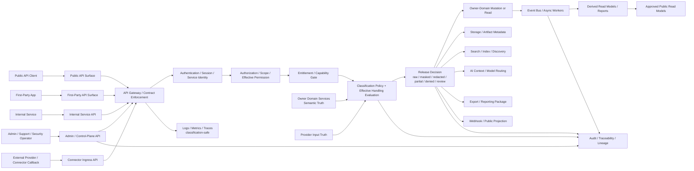
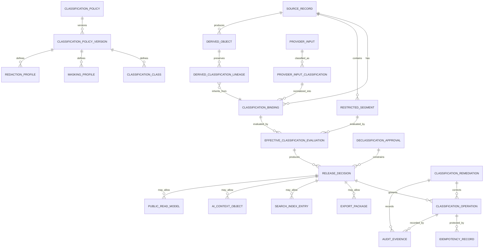
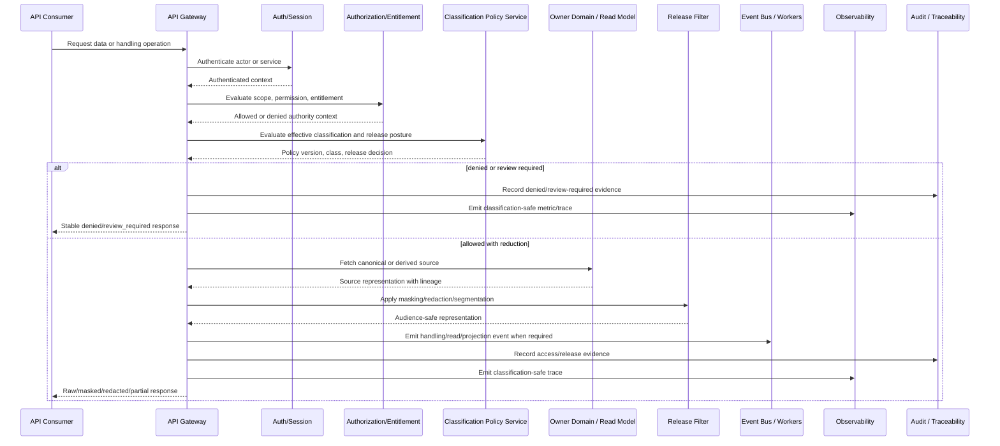

# FUZE Data Classification and Handling API Specification

## Document Metadata

- **Document Name:** `DATA_CLASSIFICATION_AND_HANDLING_API_SPEC.md`
- **Document Type:** FUZE API SPEC v2 / Production-grade interface-contract specification
- **Status:** Draft production API specification
- **Version:** 2.0.0
- **Effective Date:** 2026-04-24
- **Last Updated:** 2026-04-24
- **Reviewed On:** 2026-04-24
- **Document Owner:** FUZE Platform Data Governance and Security Architecture, with implementation obligations across platform, product, AI, integration, storage, search, audit, support, and operations domains
- **Approval Authority:** FUZE Platform Architecture and Governance Authority; named approver not yet specified
- **Review Cadence:** Quarterly, and whenever classification taxonomy, public exposure posture, connector import/export posture, AI context policy, storage/search posture, retention/deletion posture, or security/audit policy materially changes
- **Governing Layer:** API contract layer derived from the platform core / shared data governance / classification and handling refined system layer
- **Parent Registry:** `API_SPEC_INDEX.md` and the FUZE API SPEC v2 Canonical File Registry
- **Upstream Semantic Registry:** `REFINED_SYSTEM_SPEC_INDEX.md`
- **Upstream API Registry:** `API_SPEC_INDEX.md`
- **Primary Audience:** API architects, backend engineers, frontend and first-party client engineers, data governance engineers, security engineers, privacy/compliance reviewers, AI platform engineers, connector engineers, storage/search engineers, audit/compliance engineers, support/control-plane engineers, implementation-contract authors, OpenAPI/AsyncAPI/SDK authors
- **Primary Purpose:** Define the FUZE API contract for assigning, preserving, evaluating, exposing, redacting, remediating, and auditing data classification and handling posture without allowing API surfaces, clients, products, providers, storage systems, search systems, AI systems, exports, or support tools to redefine canonical classification semantics.
- **Primary Upstream References:**
  - `REFINED_SYSTEM_SPEC_INDEX.md`
  - `DOCS_SPEC_INDEX.md`
  - `SYSTEM_SPEC_INDEX.md`
  - `API_SPEC_INDEX.md`
  - `DATA_CLASSIFICATION_AND_HANDLING_SPEC.md`
  - `DATA_RETENTION_DELETION_AND_ARCHIVAL_SPEC.md`
  - `FILE_OBJECT_AND_ARTIFACT_STORAGE_SPEC.md`
  - `SEARCH_INDEXING_AND_DISCOVERY_SPEC.md`
  - `SECURITY_AND_RISK_CONTROL_SPEC.md`
  - `SECRETS_CONFIG_AND_ENVIRONMENT_SPEC.md`
  - `AUDIT_LOG_AND_ACTIVITY_SPEC.md`
  - `AUDIT_AND_ACCESS_TRACEABILITY_SPEC.md`
  - `PUBLIC_API_SPEC.md`
  - `INTERNAL_SERVICE_API_SPEC.md`
  - `EVENT_MODEL_AND_WEBHOOK_SPEC.md`
  - `IDEMPOTENCY_AND_VERSIONING_SPEC.md`
  - `MIGRATION_AND_BACKWARD_COMPATIBILITY_SPEC.md`
  - `INTEGRATION_CONNECTOR_FRAMEWORK_API_SPEC.md`
  - `FUZE_ACCOUNT_ACCESS_AND_SESSION_THESIS_FINAL_SPEC.md`
  - `FUZE_ACCOUNT_ACCESS_AND_SESSION_CANONICAL_FINAL_SPEC.md`
  - `FUZE_WORKSPACE_ACCESS_CONTROL_BASICS_THESIS_FINAL_SPEC.md`
- **Primary Downstream Dependents:**
  - `DATA_RETENTION_DELETION_AND_ARCHIVAL_API_SPEC.md`
  - `FILE_OBJECT_AND_ARTIFACT_STORAGE_API_SPEC.md`
  - `SEARCH_INDEXING_AND_DISCOVERY_API_SPEC.md`
  - public, internal, admin/control-plane, event, export, AI-context, connector, storage, search, support-tool, reporting, and implementation-contract APIs that carry or transform classified data
  - OpenAPI, AsyncAPI, SDK, policy bundle, schema field-classification matrix, DLP, redaction, observability, and audit-evidence contracts
- **API Surface Families Covered:** Public-read classification-safe views where explicitly approved; first-party application surfaces; internal service surfaces; admin/control-plane remediation surfaces; event/async surfaces; webhook payload governance; reporting/export surfaces; implementation-facing policy and evaluation surfaces
- **API Surface Families Excluded:** Raw secret retrieval APIs, exact encryption/KMS APIs, exact legal policy authoring APIs, exact database DDL, exact DLP engine internals, exact model-provider prompt redaction internals, and product-specific UI wording
- **Canonical System Owner(s):** Data classification and handling refined system domain; semantic owner domains remain canonical owners of data meaning
- **Canonical API Owner:** FUZE Platform API Architecture in coordination with Data Governance and Security Architecture
- **Supersedes:** Any weaker API interpretation that treats classification as a free-form label, allows API responses to leak restricted fields by default, lets clients or providers downgrade sensitivity, or treats redaction, masking, search indexing, exports, AI summaries, or logs as declassification
- **Superseded By:** None currently defined
- **Related Decision Records:** Not explicitly linked in retrieved governing materials
- **Canonical Status Note:** Refined system specs own semantic truth. This API spec owns the interface-contract expression of classification and handling truth. Downstream API, SDK, OpenAPI, AsyncAPI, storage, search, AI, export, connector, and support contracts MUST preserve the boundaries, truth classes, and conservative defaults defined here.
- **Implementation Status:** Normative API contract source; implementation work may require downstream route catalogs, schema contracts, policy bundles, and test fixtures
- **Approval Status:** Draft pending formal FUZE approval workflow
- **Change Summary:** Created the API SPEC v2 contract for FUZE data classification and handling, deriving from the active refined system specification and aligning with API, event, retention, storage, search, connector, audit, secrets, security, and migration posture.

## Purpose

This specification governs the API contract by which FUZE services assign, evaluate, propagate, expose, redact, remediate, and audit data classification and handling posture.

The API exists to make classification enforceable at interface boundaries. It does not redefine what classified data means inside owner domains. It ensures that data-bearing APIs, events, exports, search results, AI-context flows, connector payloads, files, artifacts, logs, traces, and public-read models preserve the canonical classification taxonomy, effective handling posture, lineage, and audience restrictions required by refined system semantics.

## Scope

This API specification governs:

1. classification policy and taxonomy read surfaces;
2. classification assignment and binding surfaces;
3. effective-classification evaluation surfaces;
4. field/segment classification and restricted-segment exposure surfaces;
5. data-release, masking, redaction, partial-disclosure, denial, and review-required response semantics;
6. classification propagation across APIs, events, storage, search, AI context, exports, reports, connectors, artifacts, logs, and traces;
7. reclassification, declassification, quarantine, supersession, and remediation API posture;
8. operator/admin override APIs for sensitive handling inspection and correction;
9. audit, lineage, correlation, and observability requirements for material handling operations;
10. OpenAPI, AsyncAPI, SDK, and implementation-contract derivation guardrails.

## Out of Scope

This API specification does not define:

- field-by-field classification for every FUZE domain schema;
- legal notices, privacy-law interpretations, or jurisdiction-specific wording;
- exact encryption algorithms, KMS provider details, DLP vendor internals, malware scanner internals, or secret-store implementation;
- exact UI copy for redaction, denial, export, or support disclosure notices;
- exact retention durations or deletion workflows;
- exact search ranking, embedding, or AI-provider prompt-redaction mechanics;
- database schema, queue schema, warehouse schema, or object-store bucket layout;
- product-specific business semantics.

Those concerns belong in domain specifications, downstream policy bundles, storage/search/retention/security specs, implementation contracts, and runbooks, provided they preserve this API contract.

## Design Goals

1. Preserve one platform-wide classification API language across products and shared services.
2. Keep semantic ownership and handling governance distinct at API boundaries.
3. Make effective classification, release eligibility, masking, redaction, and denial deterministic.
4. Prevent public APIs, internal APIs, exports, connectors, search, AI, logs, and support tools from becoming hidden downgrade paths.
5. Preserve classification lineage across transformations, projections, summaries, indexes, caches, artifacts, events, and reports.
6. Support implementation-grade OpenAPI/AsyncAPI/SDK derivation without collapsing into database schema detail.
7. Require idempotent, auditable, reason-coded handling for material classification mutations and remediation.
8. Provide concrete pass/fail expectations for production readiness.

## Non-Goals

This API spec is not intended to:

- let each product define local classification APIs as canonical truth;
- treat classification as a cosmetic metadata tag;
- allow clients to request arbitrary sensitivity downgrades;
- make authorization alone sufficient for exposure of all classes within a scope;
- make entitlement equivalent to permission to relax handling posture;
- let public-safe response rendering mutate source classification;
- expose secrets or restricted raw payloads through ordinary read APIs;
- treat masked, summarized, indexed, or AI-derived content as automatically declassified.

## Core Principles

### Refined-System Semantic Ownership

`DATA_CLASSIFICATION_AND_HANDLING_SPEC.md` owns the canonical classification taxonomy, handling posture, propagation rules, conflict rules, and baseline obligations. This API spec expresses those rules as interface contracts.

### Semantic Owner Versus Classification Governance

Owner domains decide what data means. The classification governance layer defines how that data is handled. API implementations MUST NOT allow semantic owners, client applications, storage systems, search systems, AI systems, or support tools to unilaterally weaken effective classification.

### Highest-Sensitivity-Wins

When one response, payload, export, event, artifact, search result, AI context, or derived view combines multiple source classes, the effective response posture MUST default to the most restrictive applicable class unless an approved segmentation or transformation rule safely narrows exposure.

### Derived-Data Inheritance

Summaries, indexes, caches, embeddings, reports, analytics extracts, feature stores, AI outputs, and search snippets inherit classification obligations from source data when they materially expose or enable reconstruction of restricted meaning.

### Transport Does Not Reclassify

Passing data through HTTP, queues, workers, connectors, logs, analytics, AI providers, object stores, or webhook dispatch does not change classification by itself.

### Exposure Must Be Intentional

Public, partner, support, admin, AI-context, export, and reporting exposure MUST be explicitly authorized, scoped, classification-aware, and auditable. Absence of denial is not approval.

## Canonical Definitions

- **Classification API Resource:** An API-facing resource that represents classification class, effective handling posture, release eligibility, redaction/masking decision, lineage, or policy binding.
- **Effective Classification Evaluation:** A deterministic API evaluation of the class and handling posture that governs a specific payload, segment, response, export, context admission, or release channel.
- **Release Decision:** A response-level decision indicating whether data is returned raw, returned masked, returned redacted, partially returned, denied, quarantined, or requires review.
- **Classification Policy Reference:** A stable reference to the policy/taxonomy version used to evaluate classification or release posture.
- **Classification Binding:** The API-visible attachment of classification posture to a source record, field, segment, artifact, event, provider payload, derived object, or export package.
- **Handling Operation:** Any API operation that may assign, modify, evaluate, release, export, redact, quarantine, supersede, or declassify classified data.
- **Declassification Approval:** A formal, policy-approved narrowing of exposure posture for a specific representation or channel. Ordinary masking, transformation, summarization, or caching is not declassification.

## Truth Class Taxonomy

The API MUST keep the following truth classes distinguishable:

1. **Semantic truth:** what the data means and which owner domain owns that meaning.
2. **API contract truth:** route families, envelopes, request fields, response fields, error classes, and compatibility promises.
3. **Policy truth:** classification policies, masking rules, release policies, audience constraints, and policy versions.
4. **Runtime truth:** current processor, worker, connector, model, export, or remediation execution state.
5. **Ledger / storage truth:** durable records, object metadata, classification lineage, idempotency records, operation records, and audit evidence.
6. **Provider-input truth:** raw provider payloads before FUZE normalization and classification.
7. **Projection / reporting truth:** summaries, reports, dashboards, search indexes, snippets, embeddings, and analytics extracts.
8. **Public read-model truth:** explicitly approved public-facing subset of information.
9. **Audit truth:** durable evidence of classification assignment, access, transformation, export, redaction, declassification, and remediation.
10. **Presentation truth:** UI copy, banners, icons, labels, summaries, and client rendering decisions.

No API route, SDK helper, generated schema, cache, or report may collapse these truth classes into one ambiguous “data visibility” concept.

## Architectural Position in the Spec Hierarchy

This API spec sits below:

- `REFINED_SYSTEM_SPEC_INDEX.md`
- `DATA_CLASSIFICATION_AND_HANDLING_SPEC.md`
- higher-order platform boundary and ownership specifications
- `API_ARCHITECTURE_SPEC.md`
- `PUBLIC_API_SPEC.md`
- `INTERNAL_SERVICE_API_SPEC.md`
- `EVENT_MODEL_AND_WEBHOOK_SPEC.md`
- `IDEMPOTENCY_AND_VERSIONING_SPEC.md`
- `MIGRATION_AND_BACKWARD_COMPATIBILITY_SPEC.md`

It sits above or constrains:

- route catalogs for classification evaluation, masking, redaction, export, and remediation;
- OpenAPI and AsyncAPI schemas carrying classification metadata;
- SDKs that expose data-bearing resources;
- storage, search, AI, connector, export, reporting, support-tool, and audit implementation contracts;
- field-classification matrices and policy bundles.

## Upstream Semantic Owners

- `DATA_CLASSIFICATION_AND_HANDLING_SPEC.md` owns classification taxonomy, handling posture, propagation, conflict defaults, and classification-state semantics.
- Semantic owner-domain specs own what each domain record means.
- `DATA_RETENTION_DELETION_AND_ARCHIVAL_SPEC.md` owns lifecycle semantics that interact with classification.
- `FILE_OBJECT_AND_ARTIFACT_STORAGE_SPEC.md` owns storage-backed object and artifact posture.
- `SEARCH_INDEXING_AND_DISCOVERY_SPEC.md` owns indexing and discovery mechanics, constrained by classification eligibility.
- `SECURITY_AND_RISK_CONTROL_SPEC.md` and `SECRETS_CONFIG_AND_ENVIRONMENT_SPEC.md` own stronger security and secret-custody requirements.
- `AUDIT_LOG_AND_ACTIVITY_SPEC.md` and `AUDIT_AND_ACCESS_TRACEABILITY_SPEC.md` own audit and evidence reconstruction posture.
- Account/session/workspace access-control foundation docs govern identity, session, scope, authorization, and effective permission inputs.

## API Surface Families

### Public API

Public APIs MAY expose only public-safe or explicitly audience-approved derived representations. Public APIs MUST NOT expose internal, sensitive, restricted, secret, provider-input, raw diagnostic, or unreduced audit evidence data unless a separate approved public-trust spec explicitly permits a narrowed representation.

### First-Party Application API

First-party application APIs MAY expose scoped user/workspace data only after authentication, authorization, entitlement where relevant, classification evaluation, and release-decision evaluation. They MUST support masked, redacted, partial, denied, and review-required responses where classification demands it.

### Internal Service API

Internal APIs MAY carry higher-sensitivity data only under service authentication, least-privilege service scopes, policy references, trace IDs, and audit obligations. Internal service access is not a classification downgrade.

### Admin / Control-Plane API

Admin/control-plane APIs MAY inspect, quarantine, reclassify, supersede, release, or remediate classified data only when explicitly authorized, reason-coded, policy-constrained, bounded by role/session posture, idempotent where effectful, and fully audited.

### Event / Webhook / Async API

Internal events MAY carry classification metadata and owner-domain facts. External webhooks MUST carry only approved audience-safe projections. Async handling operations MUST distinguish accepted intent from final handling outcome.

### Reporting / Export API

Reporting and export APIs MUST evaluate classification, authorization, entitlement, lifecycle, and release policy before producing packages. Export packages MUST carry classification metadata, lineage, policy reference, audit evidence, and cleanup/lifecycle obligations.

### Chain-Adjacent API

Chain-adjacent APIs MUST NOT publish sensitive, restricted, secret, private identity, workspace, provider-input, or audit evidence data onto public or immutable rails. Public chain references MUST be derived, approved, public-safe, and lineage-aware.

## System / API Boundaries

This API spec owns:

- API resource families for classification policy references, bindings, effective evaluations, release decisions, remediation operations, and audit evidence references;
- request/response/error/status semantics for handling operations;
- idempotency and replay rules for classification mutations and release/remediation actions;
- interface distinctions among public, first-party, internal, admin, event, webhook, reporting, and chain-adjacent surfaces;
- OpenAPI/AsyncAPI/SDK guardrails.

This API spec does not own:

- semantic data meaning;
- legal classification policy wording;
- exact field-level classification matrix for every product;
- exact storage schema or DLP engine internals;
- exact retention duration or deletion execution mechanics;
- exact UI text.

## Adjacent API Boundaries

- `PUBLIC_API_SPEC.md` governs public API posture; this spec governs which classified data may appear in public API responses.
- `INTERNAL_SERVICE_API_SPEC.md` governs service-to-service contract posture; this spec governs data handling metadata and release safety inside those contracts.
- `EVENT_MODEL_AND_WEBHOOK_SPEC.md` governs event/webhook semantics; this spec governs payload classification and exposure constraints.
- `IDEMPOTENCY_AND_VERSIONING_SPEC.md` governs common replay/versioning mechanics; this spec applies those rules to classification mutations and release decisions.
- `MIGRATION_AND_BACKWARD_COMPATIBILITY_SPEC.md` governs compatibility and contract evolution; this spec applies those rules to taxonomy, redaction, and release-policy evolution.
- `DATA_RETENTION_DELETION_AND_ARCHIVAL_API_SPEC.md` governs lifecycle APIs; this spec provides classification inputs and constraints.
- `FILE_OBJECT_AND_ARTIFACT_STORAGE_API_SPEC.md` governs file/object APIs; this spec governs classification-bearing object delivery.
- `SEARCH_INDEXING_AND_DISCOVERY_API_SPEC.md` governs search APIs; this spec governs eligibility, snippets, redaction, and result visibility.

## Conflict Resolution Rules

When conflict exists:

1. `REFINED_SYSTEM_SPEC_INDEX.md` and higher-order boundary specs win on source-of-truth routing and semantic precedence.
2. `DATA_CLASSIFICATION_AND_HANDLING_SPEC.md` wins on classification taxonomy, handling posture, propagation, conflict defaults, and classification-state semantics.
3. Owner-domain refined specs win on the meaning of source records.
4. `SECURITY_AND_RISK_CONTROL_SPEC.md` and `SECRETS_CONFIG_AND_ENVIRONMENT_SPEC.md` win where stronger security controls or secret custody are required.
5. `DATA_RETENTION_DELETION_AND_ARCHIVAL_SPEC.md`, `FILE_OBJECT_AND_ARTIFACT_STORAGE_SPEC.md`, and `SEARCH_INDEXING_AND_DISCOVERY_SPEC.md` win on their narrower operational semantics so long as they do not weaken classification obligations.
6. API architecture specs win on interface-family semantics when they do not contradict refined system truth.
7. Implementation contracts, SDKs, generated OpenAPI/AsyncAPI files, dashboards, reports, logs, caches, and UI layers never win over stronger refined or API contract truth.
8. When ambiguity remains, FUZE MUST choose the more restrictive architecture-consistent handling posture and escalate the ambiguity to recorded decision or refinement work.

## Default Decision Rules

1. Unknown, unclassified, or mixed-class payloads default to the more restrictive plausible class.
2. Provider input defaults to non-public and non-canonical until normalized and explicitly classified.
3. Search indexing defaults to deny for sensitive, restricted, or secret segments unless explicitly approved.
4. AI-context release defaults to bounded references, summaries, or denial rather than raw broad release.
5. Exports default to explicit authorization, classification-aware filtering, durable audit lineage, and cleanup obligations.
6. Logs and traces default to exclusion, masking, hashing, tokenization, or reference-only treatment for sensitive and secret data.
7. Support/operator visibility defaults to minimum necessary information with reason-coded access when required.
8. Public reporting defaults to approved public-safe read models rather than source records.
9. Any API unable to preserve source lineage, effective classification, audience boundary, policy reference, and audit linkage for sensitive handling MUST NOT be considered production-ready.

## Roles / Actors / API Consumers

### Human Actors

- end users
- workspace members
- workspace administrators
- product operators
- support operators
- security operators
- privacy/compliance reviewers
- governance and approval actors
- platform operators
- audit and incident-response actors

### System Actors

- public API clients
- first-party applications
- API gateway
- domain services
- classification policy/evaluation service
- authorization/effective-permission service
- entitlement/capability service
- internal service clients
- event publishers and consumers
- webhook dispatchers
- queue and worker systems
- connector/provider-boundary adapters
- storage and artifact services
- search/indexing systems
- AI orchestration and model-routing systems
- export/reporting systems
- audit and traceability systems
- observability systems

## Resource / Entity Families

The API model MUST support these resource families or equivalent contract-level representations:

- `classification_policy`
- `classification_class`
- `classification_binding`
- `field_classification_binding`
- `restricted_segment`
- `effective_classification_evaluation`
- `release_decision`
- `masking_profile`
- `redaction_profile`
- `classification_lineage`
- `declassification_approval`
- `classification_remediation_operation`
- `classification_quarantine`
- `classification_audit_reference`
- `classification_operation_reference`
- `classification_policy_version`
- `derived_object_classification`
- `export_handling_profile`
- `ai_context_handling_profile`
- `search_index_handling_profile`
- `provider_input_classification`

## Ownership Model

- Semantic owner domains own data meaning.
- Classification governance owns taxonomy, baseline handling posture, and release constraints.
- API architecture owns route/resource/envelope/error/version/idempotency expression.
- Security and secrets domains own stronger security controls and secret custody.
- Authorization owns permission decisions, not classification downgrades.
- Entitlement owns feature eligibility, not sensitivity relaxation.
- Storage owns persistence mechanics, not exposure eligibility.
- Search owns discovery mechanics, not release eligibility.
- AI owns context and routing mechanics, not release authority.
- Audit owns evidence posture, not business meaning.
- Public/reporting layers own approved derived read models only.

## Authority / Decision Model

### Shared Governance Authority

Defines canonical taxonomy, policy versions, baseline release requirements, and approved declassification pathways.

### Owner-Domain Authority

Defines source record meaning, field semantics, and business workflows. It may propose or bind classifications within the canonical taxonomy, but it may not locally redefine taxonomy or weaken baseline handling posture.

### Policy/Evaluation Authority

Evaluates effective classification, masking/redaction profiles, release decisions, AI-context eligibility, search eligibility, export eligibility, and support/admin access posture.

### Runtime Authority

Executes approved operations safely, emits events, writes audit evidence, preserves idempotency, and applies redaction/masking/enforcement.

## Authentication Model

- Public metadata read routes MAY be unauthenticated only when responses are public-safe and explicitly approved.
- First-party application routes MUST authenticate user/session context.
- Internal routes MUST authenticate service principals and environment context.
- Admin/control-plane routes MUST authenticate privileged actors and session posture and MAY require step-up authentication, policy approval, or break-glass procedures.
- Provider callback routes MUST authenticate provider/source identity before accepting provider-input classification.
- Secret-related handling MUST use secret-reference posture and must not expose raw secret material through ordinary API authentication flows.

## Authorization / Scope / Permission Model

Authorization and classification are complementary. A caller may be authorized to a workspace, account, service, or record family and still be denied access to restricted fields or raw payloads.

API routes MUST evaluate:

- actor identity or service principal;
- session posture;
- workspace/account/resource scope;
- role and permission;
- service scope;
- classification class;
- release channel;
- audience;
- policy version;
- field/segment restrictions;
- reason code or approval where required.

Denied, masked, redacted, partial, and review-required responses MUST be stable API outcomes, not ad hoc implementation behavior.

## Entitlement / Capability-Gating Model

Entitlement MAY allow access to features such as advanced export, AI analysis, connector sync, broader search, or premium reporting. Entitlement MUST NOT relax classification. When entitlement and classification conflict, the stricter classification posture wins.

## API State Model

The API MUST distinguish these states or equivalent response semantics:

- `unclassified`
- `classification_pending`
- `classified`
- `derived_with_inherited_classification`
- `segmented`
- `masked_or_redacted`
- `restricted_for_release`
- `release_denied`
- `review_required`
- `approved_for_specific_audience`
- `quarantined`
- `reclassification_pending`
- `declassification_approved`
- `superseded`
- `deletion_pending`
- `retention_restricted`
- `remediation_pending`
- `remediated`

State rules:

- classification state MUST remain distinct from business-object state;
- masking or redaction does not erase source sensitivity;
- declassification is exceptional, policy-approved, representation-specific, and auditable;
- derived objects must preserve source lineage and transformation reference;
- quarantine blocks ordinary release until resolved;
- deletion or retention state must coordinate with lifecycle APIs.

## Lifecycle / Workflow Model

1. A domain, provider callback, file import, user action, workflow, or internal process creates or receives data.
2. The producing or ingesting boundary binds initial classification or requests classification evaluation.
3. Storage, transport, logging, search, export, AI, and event posture are selected from effective classification and policy.
4. Read, export, search, AI-context, support, webhook, or reporting requests ask for release evaluation.
5. The policy/evaluation layer returns raw, masked, redacted, partial, denied, review-required, or quarantine outcomes.
6. Runtime systems execute allowed handling, emit events, write audit evidence, and preserve observability.
7. If classification is wrong or handling fails, admin/control-plane remediation applies quarantine, reclassification, supersession, revocation, export recall, search cleanup, or incident escalation.
8. Lifecycle operations coordinate deletion, retention, archival, and evidence preservation without weakening classification.

## Architecture Diagram — Mermaid flowchart

## Data Design — Mermaid Diagram

## Flow View

### Standard Classification-Aware Read

1. Caller sends a read request with actor/session/service context, resource scope, requested fields, requested audience, and correlation ID.
2. API gateway authenticates caller and validates request shape.
3. Authorization evaluates scope and permission.
4. Entitlement evaluates feature capability where relevant.
5. Classification evaluation resolves source binding, field/segment rules, lineage, policy version, and audience.
6. Release decision returns raw, masked, redacted, partial, denied, review-required, or quarantine outcome.
7. Owner domain or read model returns only allowed representation.
8. API response includes stable status, applied policy reference, redaction/masking indicators where safe, correlation ID, and operation reference where relevant.
9. Audit and observability capture classification-safe evidence without exposing sensitive or secret material.

### Classification Assignment / Mutation

1. Producing domain or ingesting service submits classification binding request with source reference, field/segment references, proposed class, policy reference, provenance, reason, and idempotency key.
2. API verifies caller authority and owner-domain context.
3. Policy service validates taxonomy, policy version, class constraints, and conflict posture.
4. Idempotency layer prevents duplicate binding or inconsistent replay.
5. Binding is persisted with lineage, audit evidence, correlation ID, and policy version.
6. Event is emitted for downstream storage/search/AI/export/read-model consumers.
7. Response returns accepted/applied status and binding reference.

### Export / AI / Search / Webhook Release

1. Request identifies audience, destination, data scope, transformation profile, and policy reference.
2. Classification evaluation computes effective release posture across all source classes.
3. If allowed, runtime builds bounded representation with redaction/masking/segmentation.
4. Output package, context object, index entry, or webhook payload stores classification lineage and cleanup obligations.
5. If denied or review-required, response uses stable error/status class and writes audit evidence.

### Admin Remediation

1. Authorized operator submits reason-coded remediation request with operation type, affected resources, proposed outcome, policy reference, and idempotency key.
2. System requires privileged authorization, session posture, and any required approval.
3. Remediation applies quarantine, reclassification, supersession, export recall, search cleanup, public notice coordination, or incident escalation.
4. All actions emit audit evidence and remediation events.
5. Response returns operation reference and accepted/applied/finalized state.

## Data Flows — Mermaid sequenceDiagram

## Request Model

Requests that materially affect or expose classified data MUST include, where relevant:

- authenticated actor or service principal context;
- workspace/account/resource scope;
- requested audience or release channel;
- requested fields or segments;
- source resource reference;
- policy version or accepted policy compatibility range;
- idempotency key for effectful operations;
- reason code for admin/support/security remediation or high-sensitivity access;
- correlation ID and trace context;
- operation reference for async flows;
- destination class for exports, webhooks, AI context, search indexing, or reporting;
- transformation/redaction/masking profile reference;
- provenance for provider input, derived objects, or imported artifacts.

Clients MUST NOT provide arbitrary class downgrades as trusted facts. Client-provided classification proposals are inputs requiring validation.

## Response Model

Responses MUST distinguish:

- `raw_returned`
- `masked_returned`
- `redacted_returned`
- `partial_returned`
- `denied`
- `review_required`
- `quarantined`
- `accepted`
- `applied`
- `pending_async_finalization`
- `superseded`
- `remediated`

Responses SHOULD include, where safe:

- resource reference;
- effective classification class or safe class indicator;
- release decision code;
- applied masking/redaction indicators;
- policy version reference;
- operation reference;
- correlation ID;
- audit reference or audit availability indicator;
- async status reference;
- compatibility/deprecation warnings where relevant.

Responses MUST NOT reveal restricted classification details to unauthorized callers when that detail itself is sensitive. For example, a public caller may receive `not_available` or `not_authorized` rather than a precise restricted-class explanation.

## Error / Result / Status Model

The API MUST support stable error/result classes:

- `classification_required`
- `classification_unknown`
- `classification_conflict`
- `policy_version_unsupported`
- `policy_version_deprecated`
- `release_denied_by_classification`
- `release_requires_review`
- `field_restricted`
- `segment_restricted`
- `redaction_required`
- `masking_required`
- `declassification_not_approved`
- `audience_not_approved`
- `scope_authorized_but_class_restricted`
- `entitlement_allows_feature_but_class_restricts_data`
- `secret_material_not_exposable`
- `provider_input_not_normalized`
- `lineage_required`
- `audit_required`
- `idempotency_conflict`
- `operation_in_progress`
- `quarantined`
- `remediation_required`
- `rate_limited`
- `abuse_control_triggered`

Error responses MUST be classification-safe and MUST NOT leak raw values, secret material, restricted field names, provider diagnostics, or sensitive lineage to unauthorized callers.

## Idempotency / Retry / Replay Model

Effectful operations MUST be idempotent when they assign, mutate, quarantine, declassify, remediate, export, publish, recall, or initiate async classification-related work.

Protected operations include:

- classification binding creation or update;
- field/segment classification mutation;
- declassification approval creation;
- export package creation;
- AI-context admission for sensitive content;
- search-index eligibility changes;
- quarantine and remediation operations;
- public release approval;
- callback normalization that binds provider input to classification posture.

Idempotency keys MUST bind to actor/service, scope, operation family, target resource, requested policy version, request hash, and intended effect. Replays with the same semantic request return the original outcome or current compatible operation state. Replays with conflicting effect MUST return `idempotency_conflict` and MUST NOT apply a second mutation.

## Rate Limit / Abuse-Control Model

APIs MUST enforce rate limits and abuse controls on:

- classification evaluation at high volume;
- export and reporting requests;
- support/admin inspection;
- redaction-bypass attempts;
- repeated denied/review-required probing;
- provider callback ingestion;
- public release and lookup routes;
- AI-context admission attempts;
- search/indexing release checks.

Rate-limit responses MUST avoid leaking whether sensitive records exist. Abuse controls SHOULD elevate repeated suspicious classification probing into security telemetry or incident review.

## Endpoint / Route Family Model

This spec does not freeze exact route paths. It permits the following route families:

### Policy and Taxonomy Read Routes

- read active taxonomy;
- read supported policy versions;
- read safe class descriptions;
- read allowed masking/redaction profiles for authorized implementers.

### Classification Binding Routes

- create/update/read classification binding;
- bind field or segment classification;
- bind provider-input classification after normalization;
- bind artifact/file/export classification metadata.

### Effective Evaluation Routes

- evaluate effective classification for data, segment, response, export, search, AI context, webhook, or report;
- evaluate release decision for an audience;
- evaluate masking/redaction/partial-return profile.

### Handling Operation Routes

- request export with classification evaluation;
- request AI-context admission evaluation;
- request search indexing eligibility;
- request public/partner/support release evaluation;
- request classification-aware disclosure package.

### Admin / Control-Plane Routes

- quarantine data or derived object;
- remediate misclassification;
- approve or revoke declassification;
- supersede classification binding;
- recall export or revoke delivery token;
- request cleanup of search/index/AI/export derivatives;
- inspect audit lineage under privileged policy.

### Event / Async Routes

- emit classification-binding events;
- emit release-decision events;
- emit remediation/quarantine events;
- consume classification policy update events;
- consume derivative cleanup events.

Forbidden route families:

- public raw-sensitive reads;
- generic “get full object” routes that bypass field/segment filtering;
- client-controlled `classification=public` downgrades;
- ordinary support routes exposing raw secret or restricted content;
- internal broad-write routes that mutate owner-domain classification without authority;
- SDK convenience methods that suppress release-denial semantics.

## Public API Considerations

Public APIs MUST default to public-safe read models and safe metadata. They MUST NOT expose:

- raw internal, sensitive, restricted, secret, or provider-input data;
- exact restricted field names where revealing them is unsafe;
- internal policy implementation detail;
- audit evidence beyond approved public transparency posture;
- unapproved search snippets, AI summaries, file previews, exports, or diagnostics.

Public response contracts SHOULD use stable generic status codes for unavailable or restricted data and expose explicit public-safe correction/supersession notices where required.

## First-Party Application API Considerations

First-party apps may access more contextual data than public clients but remain bound by user/session/workspace authorization, entitlement, classification, masking, and release posture. UI convenience MUST NOT cause default over-fetching of sensitive fields. Generated clients SHOULD expose redaction and partial-response semantics as first-class outcomes.

## Internal Service API Considerations

Internal service APIs MUST:

- authenticate service principals;
- enforce least-privilege service scopes;
- carry classification metadata where data is transmitted;
- preserve lineage and policy references;
- avoid logging sensitive/secret raw payloads;
- treat internal access as non-public and non-declassification;
- avoid broad-write shortcuts for classification mutation;
- emit audit evidence for material handling operations.

## Admin / Control-Plane API Considerations

Admin/control-plane APIs MUST be separate from ordinary application APIs. They MUST require:

- privileged role or service authority;
- session posture appropriate to sensitivity;
- reason code;
- policy/version reference;
- explicit target scope;
- idempotency key for effectful actions;
- audit lineage;
- bounded output;
- expiration or revocation where disclosure is temporary;
- approval or dual-control when required by policy.

Break-glass or emergency remediation MUST create durable audit evidence and MUST NOT become a general-purpose raw data read path.

## Event / Webhook / Async API Considerations

Internal events may carry classification metadata and binding/update/remediation signals. External webhooks MUST carry only approved audience-safe representations. Async operations MUST distinguish:

- accepted request;
- evaluation pending;
- release denied;
- release approved;
- output generated;
- cleanup pending;
- remediation pending;
- final applied outcome.

Event payloads MUST be classification-aware and MUST NOT use webhook convenience to bypass public API restrictions.

## Chain-Adjacent API Considerations

Any chain-adjacent reference MUST be public-safe by design or explicitly approved. FUZE MUST NOT place sensitive, restricted, secret, workspace-private, provider-input, support, audit, or recovery-capable material on public or immutable rails. Chain references SHOULD use hashes, opaque references, or bounded public metadata where appropriate, and must preserve off-chain audit lineage.

## Data Model / Storage Support Implications

Storage and schema implementations MUST support:

- classification binding by resource, field, segment, artifact, export, provider input, and derived object;
- policy version reference;
- source lineage;
- transformation lineage;
- effective classification cache with invalidation rules;
- redaction/masking profile references;
- release-decision records for material disclosures;
- idempotency records;
- operation records;
- audit evidence references;
- lifecycle coordination fields;
- quarantine/supersession/remediation state.

Derived caches MUST never become canonical classification truth. They must invalidate or recompute when source classification, policy version, authorization posture, lifecycle posture, or release policy changes.

## Read Model / Projection / Reporting Rules

Read models, search indexes, dashboards, analytics extracts, exports, public reports, and AI summaries are derived unless explicitly governed otherwise. They MUST:

- inherit or safely narrow source classification;
- preserve lineage;
- avoid hidden downgrades;
- support cleanup/suppression when source classification or lifecycle changes;
- avoid becoming hidden semantic owners;
- expose only approved public-safe data externally;
- record policy version and transformation reference where material.

## Security / Risk / Privacy Controls

The API MUST enforce:

- least privilege;
- classification-aware response filtering;
- secret-by-reference handling;
- log/trace minimization;
- sensitive-field redaction;
- export and support-tool controls;
- provider-input quarantine before normalization;
- public release review where required;
- anti-probing protections;
- bounded admin access;
- DLP/content scanning integration where implemented;
- incident escalation on suspected leakage or unsafe downgrade.

## Audit / Traceability / Observability Requirements

Material handling operations MUST create audit evidence that can reconstruct:

- actor or service principal;
- session/service context;
- resource and scope;
- source and derived lineage;
- classification policy version;
- effective classification;
- release decision;
- masking/redaction profile;
- reason code and approval where required;
- idempotency key and operation reference;
- correlation ID and trace ID;
- outcome and failure state;
- remediation/supersession linkage.

Observability MUST be classification-safe. Logs/traces MUST NOT contain raw sensitive or secret material except through explicitly approved bounded diagnostic paths.

## Failure Handling / Edge Cases

- If classification cannot be resolved, default to denied or review-required for exposure.
- If policy version is unknown or unsupported, reject mutation or use the most restrictive compatible read behavior.
- If lineage is missing for sensitive derived data, quarantine or deny release.
- If authorization succeeds but classification denies exposure, return stable classification-denial semantics.
- If entitlement allows a feature but classification denies data release, classification wins.
- If masking fails, deny release rather than return raw sensitive fields.
- If audit write fails for an audit-required operation, fail closed or enqueue durable compensation only when approved.
- If async release partially succeeds, mark operation as incomplete and initiate remediation/cleanup.
- If public exposure is found to be unsafe, supersede or recall the public artifact where possible and emit incident/remediation evidence.

## Migration / Versioning / Compatibility / Deprecation Rules

Classification API evolution MUST follow compatibility discipline:

- adding new classes, release states, redaction semantics, or error classes requires versioned contract treatment;
- clients MUST tolerate unknown future safe-denial states where documented;
- removing or weakening redaction fields requires migration review;
- public API changes must preserve stable external semantics or provide deprecation windows;
- policy versions must be auditable and tied to release decisions;
- old policy versions must remain reconstructable for audit and historical interpretation;
- corrections and supersessions must not silently rewrite prior handling history.

## OpenAPI / AsyncAPI / SDK Derivation Rules

OpenAPI, AsyncAPI, and SDK artifacts MUST preserve:

- explicit classification metadata fields where safe;
- release decision and redaction/masking outcomes;
- stable error/result/status classes;
- idempotency headers/fields for effectful operations;
- correlation and operation references;
- policy version references;
- audience/release-channel parameters;
- admin reason-code requirements;
- async accepted/finalized distinction;
- webhook payload classification constraints;
- generated SDK types for masked/redacted/partial/denied/review-required outcomes.

SDKs MUST NOT hide partial/denied/review-required outcomes by returning null as if the data did not exist.

## Implementation-Contract Guardrails

Implementation contracts MUST specify:

- policy service ownership and availability requirements;
- caching/invalidation rules for effective classification;
- field/segment classification mapping;
- release-decision evaluation order;
- masking/redaction implementation contract;
- audit evidence schema;
- idempotency store behavior;
- provider-input normalization posture;
- export/search/AI/webhook cleanup behavior;
- admin override approval posture;
- degraded-mode fail-closed behavior;
- incident/remediation workflow integration.

## Downstream Execution Staging

1. Define policy/taxonomy and version registry contract.
2. Define classification binding schemas and route families.
3. Define effective evaluation and release-decision service contract.
4. Integrate auth, authorization, entitlement, audit, and idempotency.
5. Update public, first-party, internal, admin, event, export, search, AI, connector, and storage routes to consume evaluation.
6. Generate OpenAPI/AsyncAPI/SDK artifacts.
7. Build test fixtures for all class families and release outcomes.
8. Validate failure, migration, audit, and degraded-mode behavior.
9. Roll out with observability and policy-version compatibility monitoring.

## Required Downstream Specs / Contract Layers

- route catalog for classification policy, binding, evaluation, release, and remediation;
- field-classification matrix per owner domain;
- masking/redaction profile registry;
- export handling contract;
- search-index classification contract;
- AI-context admission contract;
- provider-input classification contract;
- file/artifact metadata contract;
- audit evidence contract;
- admin/control-plane remediation contract;
- SDK type-mapping contract;
- migration and policy-version compatibility plan.

## Boundary Violation Detection / Non-Canonical API Patterns

The following are forbidden:

- public route returns raw sensitive or restricted fields;
- internal route omits classification metadata for sensitive payloads;
- client can force `public` classification without validation;
- support tool exposes raw secret or restricted payload without bounded reason-coded path;
- search snippet exposes restricted source content;
- AI prompt includes secret material through ordinary context admission;
- export package lacks classification, lineage, policy, and audit references;
- masked response is treated as declassified source truth;
- derived cache outlives source lifecycle or stricter classification posture;
- webhook payload widens exposure beyond approved audience;
- SDK collapses denied, redacted, masked, and absent data into the same value;
- admin remediation silently rewrites history without supersession lineage.

Detection mechanisms SHOULD include contract tests, schema linting, gateway policy checks, DLP scans, audit sampling, redaction snapshot tests, search snippet tests, SDK conformance tests, and public-exposure review gates.

## Canonical Examples / Anti-Examples

### Example: Workspace Record with Sensitive Segment

A workspace record contains public-safe metadata and a sensitive note. A first-party API may return metadata and a redacted note placeholder when the caller lacks sensitive-field permission. The source record remains sensitive for that segment.

### Example: Provider Callback

A provider callback is accepted as provider-input truth. It is authenticated, stored in restricted diagnostic posture, normalized, classified, and only then allowed to influence owner-domain records or downstream events.

### Example: Export Request

A workspace admin requests export. Authorization and entitlement allow the feature, but classification evaluation redacts restricted segments and excludes secret references. The export carries policy, lineage, and audit references.

### Anti-Example: Search Downgrade

A search service indexes restricted text and returns snippets because the caller can access the workspace. This is non-canonical: authorization to workspace scope does not authorize every data class or segment.

### Anti-Example: AI Summary as Declassification

An AI-generated summary of sensitive notes is published publicly because it does not include exact raw text. This is non-canonical unless a formal policy-approved declassification/release evaluation determines the summary is public-safe.

### Anti-Example: Support Raw Payload Path

A support tool exposes raw provider callback diagnostics to solve a ticket. This is non-canonical unless a bounded, reason-coded, policy-approved, auditable admin/control-plane path authorizes the specific access.

## Acceptance Criteria

1. Every data-bearing API route identifies whether classification evaluation is required before release.
2. Classification policy and binding routes reject unknown classes and unsupported policy versions.
3. Effectful classification mutations require idempotency keys and return stable replay outcomes.
4. Public APIs expose only public-safe or explicitly approved audience-safe representations.
5. Internal service APIs authenticate service principals and preserve classification metadata for sensitive payloads.
6. Authorization success does not bypass classification release checks.
7. Entitlement success does not bypass classification release checks.
8. Sensitive and restricted segments can produce masked, redacted, partial, denied, or review-required responses.
9. Secret material is never returned through ordinary read, log, search, AI-context, export, or support-summary APIs.
10. Provider input remains non-public and non-canonical until normalized and classified.
11. Search, AI, export, webhook, and reporting paths preserve classification lineage.
12. Classification changes emit events or invalidation signals to derived stores where needed.
13. Admin remediation APIs are separate, reason-coded, bounded, policy-constrained, idempotent where effectful, and audited.
14. Audit evidence can reconstruct actor/service, scope, policy version, release decision, operation reference, and outcome.
15. Logs and traces do not contain raw sensitive or secret payloads under ordinary operation.
16. Policy-version evolution is compatibility-safe and preserves historical reconstruction.
17. OpenAPI/AsyncAPI/SDK artifacts expose classification-aware result/error/status outcomes.
18. Boundary-violation tests fail builds when raw sensitive data appears in public, search, AI, export, or webhook outputs without approved release.

## Test Cases

### Positive Path Tests

1. **Public-safe read succeeds:** Public API returns approved public metadata with policy/version indicator and no restricted fields.
2. **First-party redacted read succeeds:** Authorized workspace user receives allowed fields and redacted placeholders for restricted segments.
3. **Internal service propagation succeeds:** Service-to-service call carries classification binding, source lineage, correlation ID, and audit reference.
4. **Export package succeeds with reductions:** Export request returns package excluding secret references and redacting restricted segments.
5. **Provider input classification succeeds:** Authenticated provider callback is stored as provider-input truth, classified, normalized, and emitted downstream only after validation.

### Negative / Boundary Tests

6. **Unknown classification denied:** Binding request with unsupported class fails with `classification_unknown`.
7. **Public sensitive leak blocked:** Public route attempting to return sensitive field fails with `release_denied_by_classification` or safe generic denial.
8. **Workspace permission insufficient:** Caller with workspace access but without sensitive-field permission receives partial/redacted response.
9. **Entitlement insufficient:** Premium export entitlement does not expose restricted segments without release approval.
10. **Secret exposure blocked:** Attempt to return API key or token through ordinary read API fails with `secret_material_not_exposable`.

### Idempotency / Retry / Conflict Tests

11. **Binding replay stable:** Same idempotency key and request hash returns original classification binding outcome.
12. **Binding conflict rejected:** Same idempotency key with different class returns `idempotency_conflict`.
13. **Export retry stable:** Retried export request returns same operation reference and current status.
14. **Remediation replay safe:** Retried quarantine action does not duplicate events or audit records beyond linked replay evidence.

### Async / Event / Derived Store Tests

15. **Classification update invalidates search:** Reclassification to restricted emits event and removes or suppresses search index entries.
16. **Webhook payload narrowed:** External webhook receives only audience-safe representation and not internal classification details.
17. **AI context denied:** Sensitive raw payload without explicit allowance is denied for ordinary AI context admission.
18. **Derived cache inherits class:** Summary cache keeps source lineage and does not become public-safe by default.

### Admin / Audit / Remediation Tests

19. **Admin reason required:** Admin reclassification without reason code fails.
20. **Admin access audited:** Support inspection records actor, session, reason, scope, policy version, and outcome.
21. **Misclassification remediation:** Remediation supersedes prior binding, quarantines affected exports, and emits cleanup events.
22. **Audit failure fail-closed:** Audit-required release fails closed when audit evidence cannot be persisted.

### Rate Limit / Abuse / Security Tests

23. **Probe throttling:** Repeated restricted-field discovery attempts trigger rate-limit or abuse-control response without leaking record existence.
24. **Log safety:** Automated log scanning confirms no raw sensitive/secret payload in ordinary traces.
25. **DLP guard:** Export containing secret-like material is blocked or routed to remediation.

### Migration / Compatibility Tests

26. **Unknown future status tolerated:** SDK handles new safe-denial status without returning raw data.
27. **Policy version reconstruction:** Historical release decision can be reconstructed using original policy version.
28. **Deprecated redaction profile warning:** Request using deprecated profile returns compatibility warning and approved fallback.
29. **Class taxonomy migration:** New class introduction does not downgrade older sensitive data.

### Degraded-Mode Tests

30. **Policy service unavailable:** Public and sensitive release paths fail closed or use approved restrictive cached policy.
31. **Derived cleanup incomplete:** Reclassification response surfaces cleanup-pending state for search/export derivatives.
32. **Provider normalization failure:** Provider payload remains provider-input truth and cannot trigger public or owner-domain release.

## Dependencies / Cross-Spec Links

- `DATA_CLASSIFICATION_AND_HANDLING_SPEC.md` — upstream semantic owner for taxonomy, handling posture, propagation, conflict defaults, and invariants.
- `REFINED_SYSTEM_SPEC_INDEX.md` — active refined system-spec registry and derivation authority.
- `API_SPEC_INDEX.md` — historical/current API registry and API family conventions.
- `PUBLIC_API_SPEC.md` — public exposure posture.
- `INTERNAL_SERVICE_API_SPEC.md` — service-to-service posture.
- `EVENT_MODEL_AND_WEBHOOK_SPEC.md` — event/webhook delivery posture.
- `IDEMPOTENCY_AND_VERSIONING_SPEC.md` — replay and contract evolution rules.
- `MIGRATION_AND_BACKWARD_COMPATIBILITY_SPEC.md` — compatibility, deprecation, and supersession posture.
- `DATA_RETENTION_DELETION_AND_ARCHIVAL_SPEC.md` — lifecycle posture for classified data and derivatives.
- `FILE_OBJECT_AND_ARTIFACT_STORAGE_SPEC.md` — object/artifact persistence posture.
- `SEARCH_INDEXING_AND_DISCOVERY_SPEC.md` — search/indexing/discovery posture.
- `SECRETS_CONFIG_AND_ENVIRONMENT_SPEC.md` — secret and environment safety posture.
- `AUDIT_LOG_AND_ACTIVITY_SPEC.md` and `AUDIT_AND_ACCESS_TRACEABILITY_SPEC.md` — audit evidence and traceability posture.
- `FUZE_ACCOUNT_ACCESS_AND_SESSION_THESIS_FINAL_SPEC.md`, `FUZE_ACCOUNT_ACCESS_AND_SESSION_CANONICAL_FINAL_SPEC.md`, and `FUZE_WORKSPACE_ACCESS_CONTROL_BASICS_THESIS_FINAL_SPEC.md` — authentication, account/session, workspace, and access-control foundations.

## Explicitly Deferred Items

- Exact canonical route paths and path parameters.
- Exact field-classification matrix for every owner domain.
- Exact masking/redaction transformation library.
- Exact DLP provider integration details.
- Exact KMS/secret-store implementation.
- Exact storage schema and warehouse schema.
- Exact UI wording and user-facing notice copy.
- Exact jurisdiction-specific privacy and legal rules.
- Exact incident-response runbook steps.

## Final Normative Summary

FUZE classification APIs MUST preserve the refined system distinction between semantic data ownership and platform-wide handling governance. APIs MUST express classification as enforceable contract truth: policy versions, effective classification, release decisions, masking/redaction outcomes, lineage, audit evidence, and idempotent handling operations. Public, first-party, internal, admin, event, webhook, export, AI, search, storage, connector, reporting, and chain-adjacent surfaces MUST NOT become hidden downgrade paths. When ambiguity exists, implementations MUST choose the more restrictive architecture-consistent posture and escalate the ambiguity for governance resolution.

## Quality Gate Checklist

- [x] Upstream refined semantic owners are explicit.
- [x] Canonical API owner is explicit.
- [x] API surface families are explicit.
- [x] Mutation boundaries are explicit.
- [x] Read boundaries are explicit.
- [x] Adjacent API boundaries are explicit.
- [x] Truth classes are explicit.
- [x] Conflict-resolution rules are explicit.
- [x] Default decision rules are explicit.
- [x] Public, first-party, internal, admin/control, event/webhook, reporting, and chain-adjacent distinctions are explicit.
- [x] Non-canonical API patterns are called out clearly.
- [x] Operator/admin override paths are bounded, reason-coded, and audited.
- [x] Read-model, cache, reporting, and projection rules are explicit.
- [x] On-chain/chain-adjacent responsibilities are explicit where relevant.
- [x] Accepted-state vs final success semantics are explicit for async flows.
- [x] Idempotency and replay requirements are explicit.
- [x] Request, response, error, result, and status classes are explicit.
- [x] Failure and degraded-mode behavior is explicit.
- [x] Audit, traceability, and observability requirements are explicit.
- [x] Versioning, migration, compatibility, and deprecation rules are explicit.
- [x] OpenAPI / AsyncAPI / SDK guardrails are explicit.
- [x] Dependencies and downstream impacts are explicit.
- [x] Non-goals and deferred items are explicit.
- [x] Architecture Diagram uses Mermaid `flowchart` syntax.
- [x] Architecture Diagram clarifies API consumers, surface families, owner domains, services, stores, event systems, workers, providers, and downstream consumers.
- [x] Data Design diagram uses Mermaid syntax and distinguishes canonical, derived, policy, audit, operation, provider-input, and public-read records.
- [x] Flow View includes synchronous, asynchronous, failure, retry, audit, admin/operator, and finalization paths.
- [x] Data Flows use Mermaid `sequenceDiagram` syntax and distinguish release decision outcomes.
- [x] Acceptance Criteria are concrete and testable.
- [x] Test Cases include positive, negative, authorization, entitlement, idempotency, retry, conflict, rate-limit, degraded-mode, audit, migration, and boundary-violation coverage.
