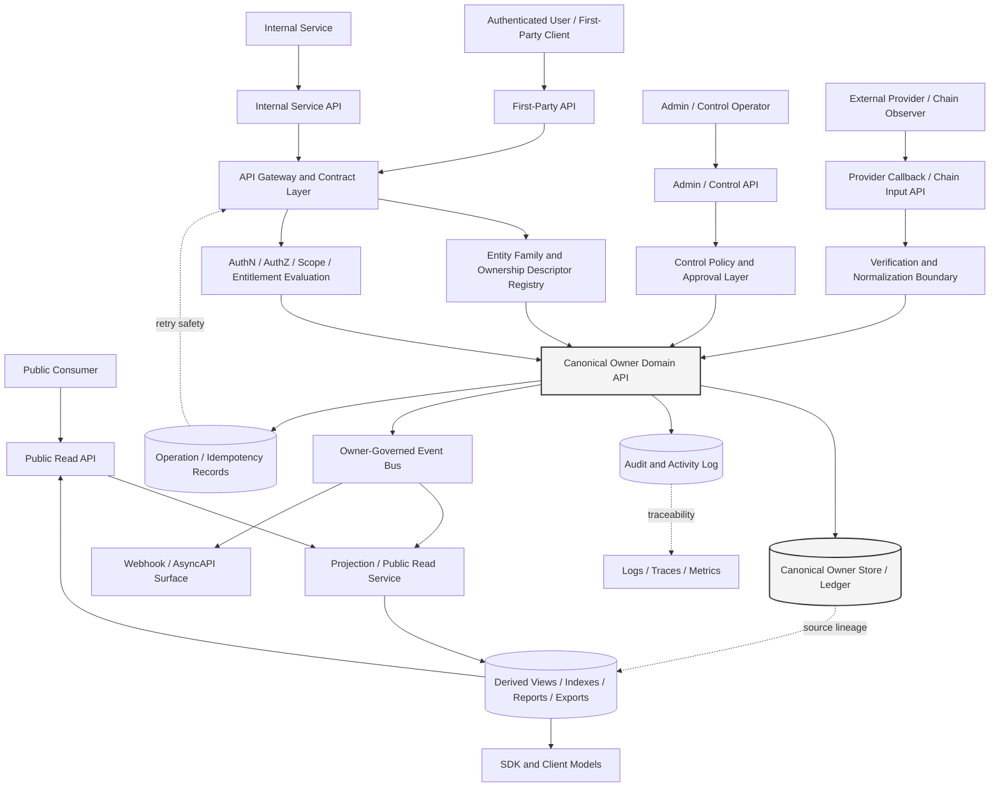
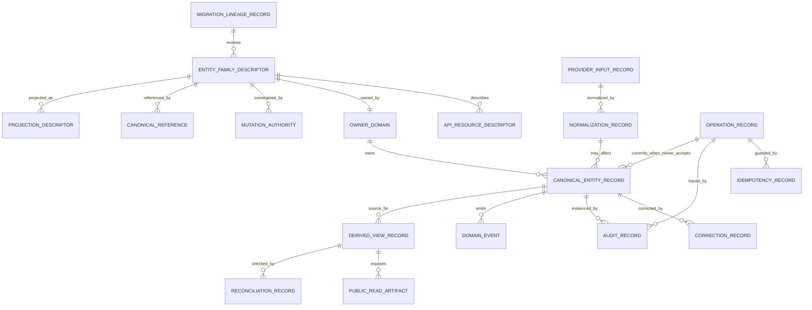
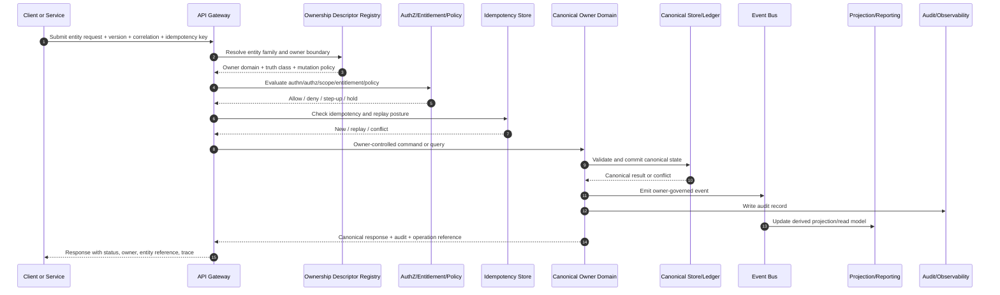

# FUZE Data Model and Entity Ownership API Specification

## Document Metadata

- **Document Name:** `DATA_MODEL_AND_ENTITY_OWNERSHIP_API_SPEC.md`
- **Document Type:** Production-grade FUZE API SPEC v2
- **Status:** Draft production API specification
- **Version:** 2.0.0
- **Effective Date:** 2026-04-24
- **Last Updated:** 2026-04-24
- **Reviewed On:** 2026-04-24
- **Document Owner:** FUZE Platform Architecture and Data/API Governance; named individual owner not explicitly specified in retrieved governing materials
- **Approval Authority:** Not explicitly specified in retrieved governing materials; approval authority remains governed by the active FUZE approval workflow and refined registry governance
- **Review Cadence:** Review whenever entity families, canonical ownership assignments, API surface-family posture, storage truth, projection truth, public-read exposure, migration posture, or cross-domain mutation pathways materially change; otherwise quarterly
- **Governing Layer:** API contract layer derived from platform constitution / data model / entity ownership semantics
- **Parent Registry:** FUZE API SPEC v2 Canonical File Registry
- **Upstream Semantic Registry:** `REFINED_SYSTEM_SPEC_INDEX.md`
- **Upstream API Registry:** `API_SPEC_INDEX.md`
- **Primary Audience:** Platform architecture, API governance, backend engineering, data engineering, product engineering, security, audit, runtime operations, public API authors, internal service API authors, implementation-contract authors, OpenAPI/AsyncAPI/SDK authors
- **Primary Purpose:** Define how FUZE API surfaces expose, mutate, reference, project, audit, migrate, and validate entity ownership and data-model truth without redefining the refined system semantics that own entity meaning
- **Primary Upstream References:** `REFINED_SYSTEM_SPEC_INDEX.md`, `DOCS_SPEC_INDEX.md`, `SYSTEM_SPEC_INDEX.md`, `API_SPEC_INDEX.md`, `SYSTEM_BOUNDARY_AND_OWNERSHIP_SPEC.md`, `SYSTEM_OVERVIEW_AND_BOUNDARIES_SPEC.md`, `PLATFORM_ARCHITECTURE_SPEC.md`, `DOMAIN_OWNERSHIP_MATRIX_SPEC.md`, `DATA_MODEL_AND_ENTITY_OWNERSHIP_SPEC.md`, `ONCHAIN_OFFCHAIN_RESPONSIBILITY_SPEC.md`, `PRODUCT_BOUNDARY_AND_DOMAIN_OWNERSHIP_SPEC.md`, `API_ARCHITECTURE_SPEC.md`, `PUBLIC_API_SPEC.md`, `INTERNAL_SERVICE_API_SPEC.md`, `EVENT_MODEL_AND_WEBHOOK_SPEC.md`, `IDEMPOTENCY_AND_VERSIONING_SPEC.md`, `MIGRATION_AND_BACKWARD_COMPATIBILITY_SPEC.md`, `AUDIT_LOG_AND_ACTIVITY_SPEC.md`, `SECURITY_AND_RISK_CONTROL_SPEC.md`, `FUZE_ACCOUNT_ACCESS_AND_SESSION_THESIS_FINAL_SPEC.md`, `FUZE_ACCOUNT_ACCESS_AND_SESSION_CANONICAL_FINAL_SPEC.md`, `FUZE_WORKSPACE_ACCESS_CONTROL_BASICS_THESIS_FINAL_SPEC.md`
- **Primary Downstream Dependents:** Entity registry APIs, domain mutation APIs, internal service APIs, public read APIs, projection/reporting APIs, audit APIs, migration/version registries, OpenAPI specifications, AsyncAPI specifications, SDK resource models, service implementation contracts, storage contracts, event catalogs, reconciliation runbooks
- **API Surface Families Covered:** Public read, authenticated first-party, internal service, admin/control-plane, event/webhook, reporting/projection, migration/supporting implementation surfaces
- **API Surface Families Excluded:** Raw database access, direct table mutation, low-level contract ABI, provider-native APIs, private data-pipeline internals, ad hoc console scripts, UI-only presentation models
- **Canonical System Owner(s):** Canonical entity owner domains as assigned by `DATA_MODEL_AND_ENTITY_OWNERSHIP_SPEC.md` and `DOMAIN_OWNERSHIP_MATRIX_SPEC.md`; top-level interpretation owned by FUZE Platform Architecture
- **Canonical API Owner:** FUZE Platform API Architecture / Interface Governance, with entity-family mutation ownership delegated only to the canonical owner domain for each entity family
- **Supersedes:** Any weaker API interpretation that lets read models, dashboards, caches, products, workers, providers, admin tools, or public surfaces mutate canonical entity truth outside owner-controlled contracts
- **Superseded By:** Not currently specified
- **Related Decision Records:** Not explicitly specified in retrieved governing materials
- **Canonical Status Note:** This API spec governs interface-contract expression only. Refined system specs own semantic truth. API surfaces MUST preserve entity ownership semantics, truth-class distinctions, lifecycle ownership, correction lineage, and canonical-vs-derived status.
- **Implementation Status:** Ready for downstream implementation-contract derivation; exact endpoint schemas and service/database internals remain downstream
- **Approval Status:** Draft pending explicit FUZE approval workflow
- **Change Summary:** Created API SPEC v2 document for data model and entity ownership API posture, including route-family constraints, request/response/error/idempotency/audit rules, diagrams, flow, acceptance criteria, tests, migration rules, and non-canonical pattern controls.

## Purpose

This specification defines the API contract posture for FUZE data model and entity ownership. It governs how APIs identify entity families, expose canonical and derived resources, enforce owner-domain mutation boundaries, preserve source-lineage, express conflict and projection status, support migration, and prevent storage or API convenience from becoming shadow truth.

This API spec does not define what FUZE entities mean. `DATA_MODEL_AND_ENTITY_OWNERSHIP_SPEC.md` owns entity semantics. This document defines how API surfaces must express those semantics safely.

## Scope

This document governs:

1. API-visible entity ownership metadata and classification.
2. Mutation route-family boundaries for canonical entities.
3. Read, projection, reporting, and public-read behavior for derived resources.
4. Cross-domain reference and identifier contracts.
5. Provider-input and chain-adjacent normalization rules at API boundaries.
6. Admin/control-plane correction, override, and reconciliation APIs.
7. Request, response, error, status, idempotency, audit, migration, observability, and compatibility requirements for entity ownership APIs.
8. OpenAPI, AsyncAPI, SDK, implementation-contract, and storage-contract guardrails.

## Out of Scope

This document does not govern:

- exact physical table schemas;
- full database topology;
- exact event payload field lists;
- exact queue, broker, or worker implementation;
- product-specific object schemas beyond ownership boundary rules;
- low-level contract ABI or chain storage layout;
- legal or accounting treatment detail;
- every domain-specific route path for identity, workspace, credits, billing, payout, registry, governance, or product-local entities.

Those belong in domain API specs, implementation-contract specs, storage specs, event catalogs, runbooks, and machine-readable OpenAPI/AsyncAPI artifacts, provided they preserve this API specification.

## Design Goals

1. Make every mutation-capable API declare and enforce canonical entity ownership.
2. Prevent hidden direct writes to foreign-domain canonical stores.
3. Preserve distinctions among canonical, policy-derived canonical, execution, provider-input, chain-native, derived, reporting, and presentation resources.
4. Allow read APIs to compose across domains without making composition layers semantic owners.
5. Make entity lineage, source references, idempotency, correlation, and audit evidence available to downstream implementation and review teams.
6. Support public, first-party, internal, admin/control, event/webhook, and reporting surfaces without collapsing their authority.
7. Preserve migration and compatibility safety when entity families evolve, split, merge, or are superseded.
8. Make API artifacts usable for OpenAPI, AsyncAPI, SDK, contract validation, regression testing, and production readiness review.

## Non-Goals

This API spec is not intended to:

- create a universal CRUD API over all FUZE entities;
- allow an entity registry to become a global write owner;
- replace domain-specific APIs for identity, workspace, credits, billing, payout, governance, registry, or products;
- expose internal data-model details publicly;
- allow SDK ergonomics to redefine canonical ownership;
- treat public/read/reporting projections as canonical business truth;
- provide direct admin mutation shortcuts around owner-domain validation.

## Core Principles

1. **Refined semantics own meaning.** API specs express, enforce, and expose semantics; they do not redefine them.
2. **One material fact, one canonical owner.** Every canonical entity family exposed through APIs MUST identify the owner domain that accepts canonical writes.
3. **Mutation follows the owner boundary.** A write API MUST terminate in the owning domain or an explicitly delegated owner-controlled component.
4. **Read composition is not ownership.** Aggregation, projection, dashboard, search, export, public-read, or SDK convenience layers MAY compose data but MUST NOT become write owners.
5. **Provider input is not owner truth.** External callbacks, provider records, chain observations, and connector payloads remain provider-input truth until normalized by an owner-controlled boundary.
6. **Execution success is not business success.** Jobs, retries, workers, and async operation records own execution lineage only unless the owning domain commits final business state.
7. **Admin authority is bounded.** Admin/control APIs MAY authorize, constrain, correct, or remediate but MUST remain reason-coded, policy-constrained, audited, and routed through owner-domain correction paths.
8. **Projection status must be visible.** Staleness, lag, reconciliation gaps, supersession, and derived status MUST be represented where material to API consumers.
9. **Migration preserves ownership.** Versioning, coexistence, compatibility, and cutover APIs MUST NOT create temporary or permanent ambiguous dual ownership.

## Canonical Definitions

- **Entity Family:** A coherent resource family whose records share ownership, lifecycle, mutation boundary, and truth-class posture.
- **Canonical Entity Resource:** API-visible representation of an entity family authoritative for a bounded fact and controlled by its owner domain.
- **Policy-Derived Canonical Resource:** API-visible representation of an authoritative pipeline output for a bounded purpose, derived under approved policy from other canonical truths.
- **Execution Resource:** API-visible representation of jobs, workflow runs, retries, submissions, callbacks, or processing attempts. It owns execution lineage, not ordinary business truth.
- **Provider-Input Resource:** API-visible representation of external or chain-adjacent input before owner-domain validation.
- **Derived Read Resource:** API-visible projection, report, dashboard, index, export, public view, or SDK summary that is subordinate to source truth.
- **Entity Ownership Descriptor:** Contract object identifying entity family, canonical owner domain, truth class, mutation boundary, lifecycle owner, allowed surfaces, source references, correction posture, and projection posture.
- **Owner-Controlled Contract:** API command, event, or service contract owned or approved by the canonical owner domain and permitted to change canonical state.
- **Ownership Violation:** Any API behavior that lets a non-owner mutate, redefine, overwrite, conceal, or supersede canonical entity truth outside approved owner-controlled boundaries.

## Truth Class Taxonomy

API responses and event payloads in this domain MUST preserve these truth classes where relevant:

1. **Semantic truth** — entity meaning and owner-domain authority.
2. **API contract truth** — route, request, response, status, version, idempotency, and compatibility semantics.
3. **Policy truth** — rules that govern creation, mutation, correction, publication, visibility, restriction, or interpretation.
4. **Runtime truth** — current API execution, request handling, worker progression, health, rate-limit, and availability posture.
5. **Ledger / storage truth** — durable owner-domain record, append ledger, current-state projection explicitly owned by the source domain, or storage lineage.
6. **Provider-input truth** — raw external provider, wallet, chain indexer, billing, or callback signals before owner-domain acceptance.
7. **Implementation-adapter truth** — normalization, translation, compatibility, schema-adapter, and connector state.
8. **Execution / async truth** — accepted requests, operation records, jobs, retries, callbacks, submissions, and completion attempts.
9. **Projection / reporting truth** — derived reads, dashboards, indexes, reports, exports, public registry views, analytics facts, and SDK summaries.
10. **Presentation truth** — user-facing labels, copy, UI grouping, and explanatory rendering.
11. **Audit truth** — immutable or append-oriented evidence of API requests, decisions, approvals, corrections, overrides, and lineage.

These truth classes MUST NOT be collapsed into a single `status`, `source`, or `entity` field when the distinction affects authorization, mutation authority, public trust, reconciliation, or migration.

## Architectural Position in the Spec Hierarchy

This document sits below:

- `REFINED_SYSTEM_SPEC_INDEX.md`
- `SYSTEM_BOUNDARY_AND_OWNERSHIP_SPEC.md`
- `SYSTEM_OVERVIEW_AND_BOUNDARIES_SPEC.md`
- `PLATFORM_ARCHITECTURE_SPEC.md`
- `DOMAIN_OWNERSHIP_MATRIX_SPEC.md`
- `DATA_MODEL_AND_ENTITY_OWNERSHIP_SPEC.md`

It sits alongside or above:

- domain API specs that expose concrete entity families;
- `PUBLIC_API_SPEC.md` for external exposure posture;
- `INTERNAL_SERVICE_API_SPEC.md` for service-to-service posture;
- `EVENT_MODEL_AND_WEBHOOK_SPEC.md` for event/webhook expression;
- `IDEMPOTENCY_AND_VERSIONING_SPEC.md` for replay and version classification;
- `MIGRATION_AND_BACKWARD_COMPATIBILITY_SPEC.md` for entity-family evolution;
- storage, event, OpenAPI, AsyncAPI, SDK, and implementation-contract artifacts.

This API spec is the interface-contract expression of entity ownership. It is not the semantic owner of entity meaning.

## Upstream Semantic Owners

The primary upstream semantic owner is `DATA_MODEL_AND_ENTITY_OWNERSHIP_SPEC.md`. Adjacent upstream semantic owners include:

- `SYSTEM_BOUNDARY_AND_OWNERSHIP_SPEC.md` for top-level ownership posture;
- `SYSTEM_OVERVIEW_AND_BOUNDARIES_SPEC.md` for ecosystem layer interpretation;
- `PLATFORM_ARCHITECTURE_SPEC.md` for plane and runtime boundary interpretation;
- `DOMAIN_OWNERSHIP_MATRIX_SPEC.md` for domain-owner assignment;
- `ONCHAIN_OFFCHAIN_RESPONSIBILITY_SPEC.md` for chain/off-chain entity distinction;
- identity, auth/session, workspace, access-control, entitlement, credits, billing, payout, audit, governance, treasury, transparency, registry, and product-domain specs for narrower entity-family semantics.

## API Surface Families

### Public Read Surface
MAY expose public-safe derived entity metadata, public registry entries, public product-catalog references, public transparency summaries, and public chain-reference metadata. It MUST NOT expose raw internal owner maps, private lineage, or mutation paths unless a public API spec explicitly approves them.

### Authenticated First-Party Surface
MAY expose caller-scoped canonical and derived views such as account, workspace, subscription, entitlement, credits, product objects, or payout status. Mutations MUST route to owning domain APIs; first-party frontend convenience MUST NOT create hidden ownership shortcuts.

### Internal Service Surface
MAY expose owner-controlled commands, reference validation, entity descriptors, lineage lookup, reconciliation operations, and projection invalidation. Internal access does not remove ownership boundaries.

### Admin / Control-Plane Surface
MAY expose correction, supersession, quarantine, reconciliation, migration, and ownership-policy administration. It MUST be separate from ordinary application APIs, policy-constrained, reason-coded, approval-aware, and audited.

### Event / Webhook / Async Surface
MAY publish owner-domain entity events, projection invalidation events, reconciliation events, correction events, and public/webhook notifications. Events communicate owner outcomes or execution progress; they do not become owner substitutes.

### Reporting / Projection Surface
MAY expose derived views, exports, dashboards, analytics views, and public-read models. These surfaces MUST preserve source references, derived status, freshness, and reconciliation posture.

### Implementation-Facing Surface
MAY expose contract metadata to OpenAPI/AsyncAPI/SDK generators, storage-contract validators, schema registries, and test harnesses. It MUST preserve owner-domain fields and truth-class markers.

## System / API Boundaries

1. APIs MUST distinguish entity ownership from storage location.
2. APIs MUST distinguish semantic owner from service that receives the HTTP request.
3. APIs MUST distinguish request acceptance from owner-domain mutation commitment.
4. APIs MUST distinguish provider input from normalized internal consequence.
5. APIs MUST distinguish execution lineage from final business state.
6. APIs MUST distinguish public-safe projections from internal canonical truth.
7. APIs MUST distinguish admin approval from owner-domain write.
8. APIs MUST distinguish canonical entity APIs from compatibility, migration, or projection APIs.

## Adjacent API Boundaries

- `SYSTEM_BOUNDARY_AND_OWNERSHIP_API_SPEC.md` governs top-level API boundary posture.
- `SYSTEM_OVERVIEW_AND_BOUNDARIES_API_SPEC.md` governs API expression of ecosystem layers.
- `PLATFORM_ARCHITECTURE_API_SPEC.md` governs plane-level API architecture.
- `DOMAIN_OWNERSHIP_MATRIX_API_SPEC.md` governs API expression of domain-owner mapping.
- This document governs entity-family, data-model, identifier, reference, projection, and persistence-discipline API posture.
- Domain-specific API specs govern concrete operations for their entity families.
- Implementation-contract specs govern exact route, schema, service, storage, and event details.

## Conflict Resolution Rules

1. Active refined registry and higher constitutional materials win over narrower documents on source-of-truth precedence.
2. `DATA_MODEL_AND_ENTITY_OWNERSHIP_SPEC.md` wins on entity ownership, truth-class, lifecycle, and canonical-vs-derived status.
3. `DOMAIN_OWNERSHIP_MATRIX_SPEC.md` wins on major domain ownership assignment.
4. This API spec wins on API contract expression of entity ownership, route-family posture, API-visible metadata, idempotency posture, and implementation guardrails, provided it does not contradict refined semantics.
5. Public, internal, admin, event, reporting, SDK, and implementation convenience never override canonical owner-domain semantics.
6. In conflict between provider input, chain observation, cache, report, and owner-domain state, owner-domain state wins unless a chain-native fact is explicitly committed on-chain for that exact meaning.
7. If ambiguity remains, choose the most conservative architecture-consistent API interpretation, block unsafe mutation, return a deterministic conflict/error status, and require recorded decision or spec refinement.

## Default Decision Rules

1. If an API mutates a canonical entity, it MUST be owner-domain owned or owner-domain delegated.
2. If an API aggregates multiple sources, it defaults to derived read status.
3. If an API receives external input, it defaults to provider-input status until normalization succeeds.
4. If an API exposes a current-state projection, it is canonical only if the owning domain explicitly designates it as canonical for that bounded concern.
5. If an API exposes a job, workflow, submission, or callback record, it defaults to execution truth.
6. If an API route cannot name the entity family, canonical owner, truth class, and mutation boundary, it is incomplete.
7. If a public API consumer could mistake a derived view for source truth, the response MUST include classification, source references, or freshness indicators.
8. If a migration changes entity representation, one representation remains canonical for writes at any given time.
9. If admin correction is required, the API MUST use owner-domain correction pathways and audit all approvals, reason codes, and lineage.

## Roles / Actors / API Consumers

- **External public consumer:** Reads public-safe entity descriptors or publication artifacts; no mutation authority over canonical entities.
- **Authenticated user:** Reads or requests owner-domain actions for caller-scoped entities.
- **Workspace member/operator:** Reads and requests actions within workspace scope subject to authorization and entitlement.
- **Product service:** Owns product-local entities and references platform canonical entities without re-owning them.
- **Platform owner-domain service:** Accepts canonical writes for its entity family.
- **Projection/reporting service:** Builds derived views from owner-domain events or reads.
- **Provider adapter:** Normalizes external input and requests owner-domain transition.
- **Chain-adjacent service:** Observes or submits chain-related artifacts and routes validated consequences through owner boundaries.
- **Admin/control operator:** Performs governed correction, quarantine, supersession, or migration actions through bounded control APIs.
- **OpenAPI/AsyncAPI/SDK generator:** Consumes contract metadata without redefining ownership.

## Resource / Entity Families

### Ownership Metadata Resources
- `EntityFamilyDescriptor`
- `OwnershipBoundaryDescriptor`
- `MutationAuthorityDescriptor`
- `CanonicalReferenceDescriptor`
- `ProjectionDescriptor`
- `CompatibilityLineageDescriptor`

### Canonical Entity Resource Families
- identity/account entities;
- linked login/session entities;
- workspace/membership/access entities;
- wallet-link and participation-context entities;
- payment, credits, subscription, entitlement, invoice, receipt, refund, adjustment entities;
- product-local entities;
- governance, treasury, registry, transparency, audit, and control-plane lineage entities.

### Policy-Derived Canonical Resource Families
- eligibility datasets;
- holder-rank classifications;
- payout entitlement inputs;
- other formally governed pipeline outputs explicitly designated canonical for a bounded concern.

### Execution and Provider-Input Families
- operation records;
- workflow/job/retry records;
- provider callback records;
- chain observation/submission records;
- reconciliation run records;
- migration run records.

### Derived / Reporting Families
- dashboards;
- search indexes;
- exports;
- public registry views;
- transparency summaries;
- analytics models;
- SDK convenience models;
- UI summaries.

## Ownership Model

Every API resource family MUST declare:

- `entity_family`;
- `truth_class`;
- `canonical_owner_domain`;
- `canonical_truth_location` or owner contract reference;
- `mutation_authority_boundary`;
- `lifecycle_owner`;
- `allowed_surfaces`;
- `allowed_non_owner_actions`;
- `source_reference_policy`;
- `correction_and_supersession_policy`;
- `projection_status`;
- `reconciliation_policy`;
- `idempotency_policy` for mutation-capable routes;
- `audit_policy` for material reads, writes, corrections, and exports.

Non-owner APIs MAY validate references, request owner-domain mutations, read projections, or display derived summaries. They MUST NOT accept canonical writes except through owner-controlled commands.

## Authority / Decision Model

### Canonical Owner Authority
The canonical owner domain controls creation, mutation, state transition, correction, closure, archival, and authoritative response semantics for its entity family.

### API Governance Authority
The API governance layer controls surface-family posture, route naming, request/response structure, error classes, idempotency classification, versioning posture, OpenAPI/SDK derivation, and cross-surface consistency.

### Policy Authority
Policy domains control eligibility, restriction, governance, visibility, retention, migration, and publication policy. Policy authorization may enable or block mutations but does not become the ordinary owner of the entity.

### Execution Authority
Execution systems may perform work and expose operation records. They do not own business state unless an owner-domain spec explicitly elevates a result.

### Admin / Control Authority
Admin/control APIs may correct, quarantine, supersede, migrate, or override under bounded policy. They MUST preserve owner-domain ownership, reason code, approval, audit, and lineage.

## Authentication Model

- Public unauthenticated reads MAY be allowed only for approved public-safe resources.
- Authenticated first-party APIs MUST use canonical account/session posture and MUST NOT treat session existence as sufficient authorization.
- Internal service APIs MUST use service identity, mTLS or equivalent service authentication, and explicit caller service authorization.
- Admin/control APIs MUST require elevated operator identity, step-up where appropriate, policy references, approval references, and reason codes.
- Provider callbacks MUST authenticate provider origin where possible, preserve raw input identity, and remain provider-input truth until owner normalization succeeds.

## Authorization / Scope / Permission Model

Authorization MUST be evaluated separately from identity, session, workspace scope, entitlement, and product capability. API mutation authorization requires:

1. authenticated actor or service identity;
2. allowed surface family;
3. owner-domain action permission;
4. object-level scope authorization;
5. workspace or organization scope where relevant;
6. entitlement or capability gating where relevant;
7. policy/risk clearance where relevant;
8. admin/control approval where elevated;
9. owner-domain validation of state transition.

Authorization to call an API route does not imply ownership of the entity being referenced.

## Entitlement / Capability-Gating Model

Entitlement MAY gate access to read, create, update, export, or operate on an entity, but entitlement does not own the entity unless the entitlement domain is the entity-family owner. Product capability exposure MUST NOT mutate platform entitlement truth unless routed through entitlement owner APIs.

## API State Model

API state classes:

- `accepted`: request accepted for processing; final business state not yet committed.
- `committed`: owner-domain canonical mutation committed.
- `rejected`: validation, authorization, policy, or conflict failure occurred before commitment.
- `pending_normalization`: provider/chain input received but not yet owner-normalized.
- `pending_reconciliation`: discrepancy exists between canonical source and derived/projection/external state.
- `derived_current`: projection current according to its freshness policy.
- `derived_stale`: projection stale or lagging.
- `corrected`: corrective or superseding lineage exists.
- `superseded`: prior representation no longer current but historically interpretable.
- `quarantined`: record or mutation isolated pending review.
- `degraded_read_only`: mutation temporarily unavailable; reads may continue with marked uncertainty.

## Lifecycle / Workflow Model

1. API request enters a public, first-party, internal, admin, event, or reporting surface.
2. Gateway resolves route family, API version, caller identity, trace ID, correlation ID, and idempotency key where required.
3. API layer loads or validates the `EntityFamilyDescriptor` and ownership boundary.
4. Authentication, authorization, scope, entitlement, and policy checks run independently.
5. For writes, request is routed to the canonical owner domain or explicitly delegated owner-controlled component.
6. Owner validates state transition, references, idempotency, and conflict posture.
7. Owner commits canonical state or returns deterministic rejection/conflict status.
8. Owner emits canonical event or lineage artifact if applicable.
9. Execution, projection, reporting, public-read, webhook, cache, and SDK surfaces update from owner-governed outputs.
10. Audit, observability, and trace records preserve request lineage, owner decision, response status, and any correction/supersession links.
11. Failure, retry, reconciliation, or admin remediation paths preserve owner-domain control and visible status.

## Architecture Diagram — Mermaid flowchart

## Data Design — Mermaid Diagram

## Flow View

### Synchronous Canonical Mutation
1. Client submits mutation with idempotency key, correlation ID, API version, requested entity family, and actor context.
2. API gateway authenticates caller and validates route-family posture.
3. Ownership descriptor identifies canonical owner and mutation boundary.
4. Authorization, scope, entitlement, and policy checks execute.
5. Owner-domain API validates transition, conflicts, references, and idempotency.
6. Owner commits canonical state or returns deterministic error.
7. Response includes canonical entity reference, status, owner domain, audit reference, and correlation reference.

### Accepted Async Mutation
1. Client submits request requiring async execution.
2. Owner validates request and records idempotent operation.
3. API returns `202 accepted` with stable `operation_id`, `entity_family`, owner domain, accepted status, polling/status route, and trace reference.
4. Worker processes execution state without becoming business owner.
5. Owner commits final state or records failure/correction requirement.
6. Projection/webhook/read surfaces update only from owner outcome.

### Provider Input Normalization
1. Provider callback enters provider/chain input API.
2. Raw input is authenticated, recorded, deduplicated, and classified as provider-input truth.
3. Normalization validates signature, source, replay, schema, and correlation.
4. Owner-domain command is invoked only after normalization.
5. Owner accepts or rejects resulting state transition.
6. Response and audit preserve raw input reference, normalization decision, owner outcome, and idempotency lineage.

### Admin Correction
1. Operator submits correction request through admin/control API.
2. API requires elevated authentication, reason code, policy reference, approval reference, scope, and target owner-domain reference.
3. Control policy authorizes or denies corrective action.
4. Owner-domain correction pathway writes adjustment, reversal, supersession, or quarantine record.
5. Audit records original state, corrective state, operator, approver, reason, policy version, trace ID, and correlation ID.

### Degraded / Reconciliation Path
1. API detects mismatch, stale projection, provider discrepancy, chain mismatch, or owner-store unavailability.
2. Mutations fail closed or move to owner-approved hold; reads mark uncertainty or stale status.
3. Reconciliation run links canonical owner state, derived state, provider input, and audit references.
4. Owner-domain decides correction, supersession, or no-op.

## Data Flows — Mermaid sequenceDiagram

## Request Model

Mutation-capable requests MUST include or derive:

- API version;
- route family and surface family;
- caller identity or service identity;
- entity family or route-implied entity family;
- target entity ID or creation context;
- requested operation class;
- idempotency key for non-safe operations;
- correlation ID and request ID;
- scope or workspace context where relevant;
- entitlement or capability context where relevant;
- policy version or evaluation reference where relevant;
- source/provider reference where external input is involved;
- reason code and approval reference for admin/control actions;
- expected state/version/etag where conflict protection is required;
- projection/read consistency preference where reads may be stale.

Requests MUST NOT include caller-supplied owner-domain overrides unless explicitly allowed by an admin/control spec and verified against the ownership registry.

## Response Model

Responses SHOULD include:

- `status` and `result_class`;
- `entity_family`;
- `entity_id` or `entity_reference`;
- `truth_class`;
- `canonical_owner_domain`;
- `operation_id` for async or accepted-state behavior;
- `idempotency_status` where applicable;
- `audit_reference` for material writes or admin actions;
- `correlation_id` and `trace_id`;
- `source_references` for derived or normalized responses;
- `projection_status` and `freshness` for derived reads;
- `conflict_details` where safe to expose;
- `supersession_reference` or `correction_reference` where relevant;
- `version` and compatibility metadata.

Public responses MUST minimize internal topology exposure while preserving enough classification to prevent consumers from mistaking derived state for canonical truth.

## Error / Result / Status Model

Required error classes:

- `AUTHENTICATION_REQUIRED`
- `AUTHORIZATION_DENIED`
- `ENTITLEMENT_DENIED`
- `ENTITY_FAMILY_UNKNOWN`
- `OWNER_DOMAIN_UNRESOLVED`
- `NON_OWNER_MUTATION_FORBIDDEN`
- `TRUTH_CLASS_MISMATCH`
- `PROVIDER_INPUT_NOT_NORMALIZED`
- `CHAIN_TRUTH_SCOPE_MISMATCH`
- `IDEMPOTENCY_REPLAY_CONFLICT`
- `VERSION_CONFLICT`
- `STATE_TRANSITION_INVALID`
- `REFERENCE_NOT_CANONICAL`
- `PROJECTION_STALE`
- `RECONCILIATION_REQUIRED`
- `CORRECTION_REQUIRES_CONTROL_PLANE`
- `ADMIN_REASON_CODE_REQUIRED`
- `MIGRATION_LINEAGE_REQUIRED`
- `RATE_LIMITED`
- `DEGRADED_READ_ONLY`
- `INTERNAL_CONTRACT_VIOLATION`

Status semantics:

- `200 OK` for successful reads or idempotent replay of an equivalent completed result.
- `201 Created` only when owner-domain canonical creation is committed synchronously.
- `202 Accepted` only when final business outcome is not yet committed and an operation reference is returned.
- `204 No Content` only when no response body is safe and audit/correlation still exists server-side.
- `400` for malformed request or invalid classification.
- `401` for missing/invalid authentication.
- `403` for authenticated but unauthorized or non-owner mutation attempts.
- `404` for missing resources where disclosure is safe; otherwise `403` MAY be used.
- `409` for canonical state, ownership, version, or idempotency conflicts.
- `422` for semantically invalid owner-domain transition.
- `423` for quarantine/hold states.
- `429` for rate limiting.
- `503` for degraded/unavailable owner or dependency states with safe retry guidance.

## Idempotency / Retry / Replay Model

1. All non-safe mutations MUST require idempotency keys at the surface boundary or derive them from a verified provider/event id.
2. Idempotency scope MUST include surface family, route, actor/service identity, owner domain, entity family, target entity or creation scope, request body hash, and API version.
3. Replays of the same equivalent request MUST return the original committed or accepted result.
4. Replays with the same key and materially different body MUST return `IDEMPOTENCY_REPLAY_CONFLICT`.
5. Provider callbacks MUST use provider event IDs and normalized replay keys before owner-domain effects.
6. Async operations MUST preserve stable operation references across retries and polling.
7. Retries MUST NOT create duplicate canonical entities, duplicate ledger mutations, duplicate correction records, duplicate public publication, or duplicate domain events.
8. Owner-domain idempotency wins over gateway convenience idempotency where they overlap.

## Rate Limit / Abuse-Control Model

- Public and first-party routes MUST enforce caller-aware rate limits by route family, sensitivity, mutation class, and abuse posture.
- Provider callback APIs MUST enforce signature, replay, source, volume, and anomaly controls.
- Admin/control APIs MUST enforce strict operator and action-class limits.
- Read APIs exposing derived or public-read entity metadata MUST prevent enumeration and inference where sensitive.
- Expensive projection, export, lineage, reconciliation, and migration APIs SHOULD use async accepted-state patterns and quota controls.

## Endpoint / Route Family Model

This specification defines route families, not final endpoint inventory.

### Allowed Route Families

- `GET /entity-families` — internal/admin descriptor inventory; public exposure only if explicitly curated.
- `GET /entity-families/{entity_family}` — descriptor lookup.
- `GET /entities/{entity_family}/{entity_id}` — owner-domain canonical read or routed owner read.
- `POST /entities/{entity_family}` — creation only through owner-domain route family.
- `PATCH /entities/{entity_family}/{entity_id}` — owner-domain state update only.
- `POST /entities/{entity_family}/{entity_id}:request-action` — non-owner request for owner-domain action where approved.
- `GET /entity-references/{reference}` — reference validation and classification.
- `GET /projections/{projection_family}/{id}` — derived read with source/freshness metadata.
- `POST /provider-inputs/{provider_family}` — provider input ingest; not canonical mutation by itself.
- `POST /reconciliation-runs` — internal/admin reconciliation initiation.
- `POST /corrections/{entity_family}` — admin/control owner-domain correction pathway.
- `POST /migrations/entity-families` — migration/compatibility initiation under migration governance.
- `GET /operations/{operation_id}` — async operation status.

### Forbidden Route Families

- generic `POST /admin/sql` or equivalent direct data edits;
- generic `PATCH /entities/{entity_id}` without entity-family owner resolution;
- public arbitrary credits, entitlement, payout, treasury, registry, or governance mutation endpoints;
- product-local routes that mutate platform identity, session, workspace, authorization, entitlement, credits, payout, registry, governance, or chain truth;
- projection write endpoints that overwrite canonical owner state;
- provider callbacks that directly change balances, entitlements, or owner-domain facts.

## Public API Considerations

Public APIs MUST default to narrow, stable, public-safe contracts. Public entity APIs MAY expose curated descriptors, public registry views, public product catalog metadata, public transparency or payout-status views, and chain-reference lookups only when approved by the relevant public/trust spec.

Public APIs MUST NOT expose:

- raw internal ownership maps that reveal sensitive infrastructure;
- generic mutation mechanisms;
- admin correction endpoints;
- private audit trails;
- unresolved provider-input records;
- internal reconciliation or migration run internals.

Public responses MUST mark derived/publication status where consumers could otherwise infer source truth incorrectly.

## First-Party Application API Considerations

First-party APIs MAY provide convenient UX-oriented resources. They MUST still:

- route writes to owner domains;
- maintain entity family classification;
- evaluate authorization, scope, entitlement, and policy distinctly;
- surface accepted vs final outcome for async actions;
- avoid local product copies becoming hidden write owners;
- disclose stale/derived status where material to user decisions.

## Internal Service API Considerations

Internal service APIs MAY expose richer contracts for reference validation, owner-domain commands, projection invalidation, reconciliation, and lineage lookup. They MUST NOT become broad write shortcuts. Every internal mutation route MUST be bound to an owner-domain contract and must be contract-tested for ownership compliance.

## Admin / Control-Plane API Considerations

Admin/control APIs MUST be separate, narrow, and auditable. They MUST require:

- elevated operator identity;
- action-specific permission;
- reason code;
- policy reference;
- approval reference where required;
- target owner-domain reference;
- before/after or correction-lineage details;
- trace, audit, and correlation IDs;
- explicit result classification.

Admin APIs MAY authorize or request correction but MUST NOT directly overwrite canonical owner state outside owner-controlled correction pathways.

## Event / Webhook / Async API Considerations

- Owner domains or explicitly delegated owner-controlled components publish canonical entity events.
- Projection services publish derived-status events only as derived events.
- Webhooks exposed externally MUST be versioned, retry-safe, deduplicated, and explicit about event truth class.
- Async APIs MUST return operation references and later owner-domain results.
- Provider-input events MUST be distinguishable from normalized owner-domain events.
- Event replay MUST NOT duplicate business mutations.

## Chain-Adjacent API Considerations

Chain-adjacent APIs MUST distinguish:

- chain-native truth explicitly committed on-chain;
- chain observations or indexer outputs;
- off-chain policy interpretation;
- owner-domain normalized consequences;
- public registry publication truth;
- reporting/projection outputs.

A chain observation API MUST NOT claim broader off-chain business truth unless an owner-domain API has committed that interpretation.

## Data Model / Storage Support Implications

Implementation storage MUST support:

- entity family descriptors;
- owner-domain mappings;
- canonical entity references;
- idempotency records;
- operation records;
- provider-input and normalization records;
- correction and supersession records;
- reconciliation records;
- projection descriptors and source references;
- audit records;
- migration lineage and compatibility records.

Storage design MUST not make a shared datastore imply shared ownership. Physical colocation does not alter owner-domain authority.

## Read Model / Projection / Reporting Rules

1. Read models MAY denormalize from canonical sources but MUST carry source references sufficient for reconciliation.
2. Derived reads MUST not accept writes that mutate canonical state.
3. Projection freshness MUST be represented where stale state could mislead consumers.
4. Reports and public views are canonical only as published artifacts, not as source truth for underlying business facts.
5. Rebuildable caches and indexes MUST remain rebuildable from canonical owner outputs.
6. Public trust outputs SHOULD preserve supersession and correction lineage when material.

## Security / Risk / Privacy Controls

- Enforce least privilege by surface family and entity sensitivity.
- Prevent horizontal object access across accounts, workspaces, products, and public/private scopes.
- Block non-owner mutation attempts at gateway and owner-domain layers.
- Prevent provider replay, spoofing, and duplicate effects.
- Mask internal topology and sensitive owner details in public errors.
- Protect audit, correction, migration, and control-plane records from unauthorized access.
- Apply stronger controls to identity, session, workspace, authorization, entitlement, credits, billing, payout, treasury, governance, wallet-link, registry, and public-trust entities.
- Treat unexpected cross-domain writes as security events.

## Audit / Traceability / Observability Requirements

Material requests MUST preserve:

- request ID, correlation ID, and trace ID;
- caller identity or service identity;
- surface family, route family, operation class, and API version;
- entity family and owner domain;
- authorization, entitlement, policy, and scope decisions;
- idempotency key and replay outcome;
- provider input reference where relevant;
- owner-domain decision and canonical entity reference;
- correction/supersession/reconciliation references;
- admin reason codes and approval references;
- projection freshness and source references for derived outputs.

Observability MUST allow investigation of owner-domain boundary violations, stale projections, duplicate submission attempts, failed normalization, and migration-lineage gaps.

## Failure Handling / Edge Cases

### Non-owner mutation attempt
Return `403 NON_OWNER_MUTATION_FORBIDDEN` or `409 OWNER_DOMAIN_UNRESOLVED` depending on whether the owner is known. Log as potential boundary violation.

### Provider callback replay
Deduplicate by provider event ID and normalized idempotency scope. Do not reapply owner-domain effects.

### Projection stale during read
Return derived response only with `projection_status=derived_stale`, source reference, and freshness metadata. If the user needs canonical state, route to owner read or return conflict/uncertainty.

### Owner-domain unavailable
Mutation routes fail closed or return `503` / accepted hold only if owner-approved. Derived reads may continue only with marked uncertainty.

### Admin correction without reason code
Reject with `ADMIN_REASON_CODE_REQUIRED`.

### Chain observation conflicts with off-chain projection
Treat chain-native truth as canonical only for explicitly committed chain meaning. Mark projection as requiring reconciliation and route off-chain interpretation to owner domain.

### Product creates local copy of platform entity
Treat as non-canonical. Require migration or refactor to canonical reference-based composition.

### Entity migration during compatibility window
One representation remains canonical for writes. API responses include migration lineage and version metadata.

## Migration / Versioning / Compatibility / Deprecation Rules

1. Entity-family API changes MUST preserve owner-domain identity and historical interpretability.
2. Entity family renames, splits, merges, deprecations, and supersessions MUST preserve lineage.
3. Compatibility windows MUST be explicit, scoped, and time-bounded where appropriate.
4. Public and partner-visible changes require stronger notice, deprecation, and historical readability posture.
5. SDK model changes MUST not hide ownership or truth-class changes.
6. During migration, old and new routes MUST not both accept canonical writes unless dual-write is explicitly approved, temporary, and one owner remains canonical.
7. Versioned APIs MUST classify whether changes are additive, representational, semantic, compatibility-affecting, or breaking.
8. Migration failure MUST not leave permanent dual ownership unresolved.

## OpenAPI / AsyncAPI / SDK Derivation Rules

OpenAPI artifacts MUST include, where applicable:

- `x-fuze-entity-family`;
- `x-fuze-canonical-owner-domain`;
- `x-fuze-truth-class`;
- `x-fuze-surface-family`;
- `x-fuze-mutation-boundary`;
- `x-fuze-idempotency-required`;
- `x-fuze-audit-required`;
- `x-fuze-projection-status`;
- `x-fuze-source-reference-required`;
- `x-fuze-admin-reason-code-required`;
- `x-fuze-compatible-until` or deprecation metadata where applicable.

AsyncAPI artifacts MUST distinguish owner-domain events, provider-input events, execution events, projection events, correction events, and public webhook events.

SDKs MUST NOT flatten canonical and derived models into indistinguishable client objects where mutation authority or public interpretation could be confused.

## Implementation-Contract Guardrails

Implementation contracts MUST preserve:

- explicit owner domain per entity family;
- explicit mutation boundary and owner-controlled command path;
- idempotency scope and replay behavior;
- truth-class classification in schemas and events;
- authorization/entitlement/policy separation;
- audit references and correlation lineage;
- source references for derived reads;
- projection freshness and reconciliation markers;
- admin reason codes and approval linkage;
- migration/supersession lineage;
- forbidden non-owner write tests.

Implementations MUST NOT optimize away ownership clarity for storage convenience, gateway convenience, SDK convenience, worker convenience, or dashboard convenience.

## Downstream Execution Staging

1. Validate entity-family descriptors against refined system specs.
2. Map all mutation routes to canonical owner domains.
3. Add idempotency and operation records for mutation and async routes.
4. Add audit, trace, correlation, and source-reference fields.
5. Classify projection/read APIs by truth class and freshness policy.
6. Build contract tests for non-owner mutation blocking.
7. Build migration-lineage support for renamed/split/merged entity families.
8. Generate OpenAPI/AsyncAPI/SDK artifacts with FUZE extensions.
9. Run boundary-violation, replay, stale projection, and admin correction tests before production readiness sign-off.

## Required Downstream Specs / Contract Layers

- Domain API specs for identity, session, workspace, access control, wallet-aware user, credits, billing, entitlement, payout, registry, governance, treasury, products, and reporting.
- Entity storage and schema contracts.
- Event catalogs and AsyncAPI contracts.
- OpenAPI artifacts and SDK models.
- Audit and observability contracts.
- Migration and compatibility plans.
- Reconciliation and correction runbooks.
- Admin/control-plane implementation contracts.

## Boundary Violation Detection / Non-Canonical API Patterns

Forbidden unless explicitly approved and bounded:

1. Generic CRUD over all entity families.
2. Direct database mutation through API routes.
3. Product-local identity/session/workspace/authorization/entitlement/credits/payout/registry/governance primitives.
4. Public or first-party routes that wrap admin/control actions without explicit control-plane classification.
5. Provider callbacks that directly mutate canonical business state.
6. Search indexes, dashboards, reports, exports, or SDK caches that accept canonical writes.
7. Worker retry records treated as final business state.
8. Chain-indexer outputs treated as broad off-chain policy truth.
9. Hidden dual-write migrations with no canonical owner.
10. Response models that hide whether state is canonical, derived, stale, superseded, or provider-input.

## Canonical Examples / Anti-Examples

### Canonical Examples

- A product creates a product-local object while storing `account_id` and `workspace_id` references, without copying account or workspace truth.
- A credits spend API routes to the credits ledger owner, returns an idempotent mutation record, and updates derived balance projection after owner commit.
- A public registry read API returns public-safe registry publication truth with source references and supersession status.
- A provider payment callback records raw provider input, normalizes it, and invokes payment/credits owner-domain commands before any credits mutation occurs.
- An eligibility dataset API exposes a policy-derived canonical resource for a payout cycle, while preserving token-balance and policy source references.

### Anti-Examples

- A dashboard endpoint updates entitlement state because a UI toggle was changed.
- A product API creates its own credits balance because the credits service is unavailable.
- A chain indexer table is returned as final payout eligibility without owner-domain policy interpretation.
- An admin endpoint directly edits canonical records without reason code, approval reference, or owner correction path.
- A worker status of `completed` is treated as final business success although the owner-domain mutation failed.

## Acceptance Criteria

1. Every mutation-capable route identifies exactly one canonical owner domain or approved owner-controlled delegate.
2. Non-owner mutation attempts are rejected deterministically and audited.
3. Every derived read response that could be mistaken for canonical truth includes truth class, owner/source reference, and freshness/projection status.
4. Provider-input APIs record raw input, apply replay controls, and do not mutate canonical truth before normalization.
5. Chain-adjacent APIs distinguish chain-native state, chain observations, off-chain policy interpretation, and public registry/reporting state.
6. Admin/control routes require elevated identity, permission, reason code, policy reference, approval reference where required, and audit lineage.
7. Idempotent mutation replays return the same result; mismatched replay bodies return deterministic conflict errors.
8. Async routes return stable operation IDs and distinguish accepted intent, execution progress, and final owner-domain outcome.
9. OpenAPI and AsyncAPI artifacts preserve owner-domain and truth-class metadata.
10. SDK generated models do not flatten canonical and derived resources in a way that hides mutation authority.
11. Migration or compatibility windows preserve a single canonical write owner.
12. Stale projections, reconciliation gaps, superseded records, and corrective records are visible where material.
13. Audit records allow reconstruction of caller, route, owner decision, idempotency outcome, source references, and correction lineage.
14. Public APIs expose only approved public-safe classifications and do not reveal private owner topology or admin controls.
15. Contract tests cover positive, negative, authorization, entitlement, idempotency, replay, conflict, projection, admin, migration, and boundary-violation scenarios.

## Test Cases

### Positive Path
1. Create product-local object through product owner API using `account_id` and `workspace_id` references; verify platform entities are not copied as canonical product state.
2. Mutate credits through credits owner API; verify idempotency record, canonical ledger mutation, audit record, event emission, and derived balance update.
3. Read dashboard summary; verify response includes derived status, source references, freshness, and no mutation fields.
4. Submit accepted async entity action; verify `202`, stable `operation_id`, owner-domain finalization, event emission, and status polling.

### Negative / Boundary Tests
5. Product route attempts to mutate workspace membership directly; expect `NON_OWNER_MUTATION_FORBIDDEN` and audit boundary-violation event.
6. Reporting route attempts to overwrite payout status; expect rejection and security/contract alert.
7. Public API attempts arbitrary registry correction; expect `403` and no owner mutation.
8. Provider callback without valid signature or replay key attempts balance effect; expect provider-input rejection and no canonical mutation.

### Authorization / Entitlement / Scope Tests
9. Authenticated user reads entity outside workspace scope; expect `403` or safe `404` according to disclosure policy.
10. User has workspace role but lacks entitlement for capability; expect `ENTITLEMENT_DENIED` without changing entity state.
11. Internal service has service identity but lacks owner-domain action permission; expect denial.
12. Admin correction without reason code or approval reference where required; expect deterministic validation error.

### Idempotency / Retry / Replay Tests
13. Replay same idempotency key and identical body after success; expect same canonical result.
14. Replay same idempotency key with changed body; expect `IDEMPOTENCY_REPLAY_CONFLICT`.
15. Provider callback replay with same provider event ID; verify no duplicate owner-domain effect.
16. Worker retry after accepted async action; verify no duplicate canonical entity or ledger mutation.

### Conflict / Concurrency Tests
17. Update with stale entity version; expect `VERSION_CONFLICT`.
18. Simultaneous owner and admin correction requests; verify owner-domain serialization and audit lineage.
19. Projection is stale while canonical owner changed; verify read marks stale or routes to owner read.
20. Chain observation conflicts with off-chain policy-derived output; verify reconciliation path and no silent overwrite.

### Rate Limit / Abuse / Security Tests
21. Public descriptor enumeration exceeds policy; expect rate limit and no sensitive leak.
22. Suspicious provider callback burst; expect throttling/quarantine.
23. Internal service attempts broad entity scan without allowed purpose; expect authorization denial or audit escalation.

### Degraded / Recovery Tests
24. Owner-domain unavailable for mutation; expect fail-closed or approved hold, not local product write.
25. Derived read available during owner outage; response marks uncertainty and source timestamp.
26. Reconciliation job detects mismatch; verify correction or supersession path remains owner-controlled.

### Migration / Compatibility Tests
27. Entity family rename preserves old-to-new lineage and one canonical write representation.
28. Public SDK version continues historical reads while new route accepts writes; verify deprecation metadata.
29. Hidden dual-write migration attempt without owner declaration fails quality gate.

### Audit / Observability Tests
30. Material mutation can be reconstructed from trace ID through gateway, auth, idempotency, owner decision, event, projection, and audit logs.
31. Admin correction audit includes operator, approver, reason code, policy version, before/after references, and supersession ID.
32. Boundary violation alert includes offending service, route, entity family, owner domain, and rejected action.

## Dependencies / Cross-Spec Links

Primary dependencies:

- `REFINED_SYSTEM_SPEC_INDEX.md`
- `SYSTEM_BOUNDARY_AND_OWNERSHIP_SPEC.md`
- `SYSTEM_OVERVIEW_AND_BOUNDARIES_SPEC.md`
- `PLATFORM_ARCHITECTURE_SPEC.md`
- `DOMAIN_OWNERSHIP_MATRIX_SPEC.md`
- `DATA_MODEL_AND_ENTITY_OWNERSHIP_SPEC.md`
- `ONCHAIN_OFFCHAIN_RESPONSIBILITY_SPEC.md`
- `PRODUCT_BOUNDARY_AND_DOMAIN_OWNERSHIP_SPEC.md`
- `API_ARCHITECTURE_SPEC.md`
- `PUBLIC_API_SPEC.md`
- `INTERNAL_SERVICE_API_SPEC.md`
- `EVENT_MODEL_AND_WEBHOOK_SPEC.md`
- `IDEMPOTENCY_AND_VERSIONING_SPEC.md`
- `MIGRATION_AND_BACKWARD_COMPATIBILITY_SPEC.md`
- `AUDIT_LOG_AND_ACTIVITY_SPEC.md`
- `SECURITY_AND_RISK_CONTROL_SPEC.md`
- identity, auth/session, workspace, access-control, entitlement, credits, billing, payout, governance, treasury, registry, transparency, and product-domain specifications.

## Explicitly Deferred Items

- Exact endpoint inventory by concrete domain.
- Full OpenAPI schemas for each entity family.
- Full AsyncAPI event payload schemas.
- Exact service/database partitioning and physical storage topology.
- Exact reason-code dictionaries and policy-version schema.
- Exact retention and archival periods per entity family.
- Exact public descriptor exposure policy.
- Exact SDK package layout and generated type names.

## Final Normative Summary

FUZE APIs MUST preserve the canonical data model and entity ownership semantics defined by refined system specifications. Every mutation-capable API MUST identify the entity family, canonical owner domain, mutation boundary, idempotency policy, authorization posture, and audit requirements. Read, projection, reporting, public, and SDK surfaces MAY compose or summarize owner-domain truth, but they MUST NOT become hidden semantic or mutation owners. Provider inputs, chain observations, execution records, admin approvals, caches, reports, exports, and presentation models remain distinct truth classes unless a governing specification explicitly elevates a bounded artifact. When ambiguity exists, APIs MUST choose the more conservative owner-preserving interpretation, fail closed for unsafe mutations, preserve lineage, and require explicit refinement.

## Quality Gate Checklist

- [x] Upstream refined semantic owners are explicit.
- [x] Canonical API owner is explicit.
- [x] API surface families are explicit.
- [x] Mutation boundaries are explicit.
- [x] Read boundaries are explicit.
- [x] Adjacent API boundaries are explicit.
- [x] Truth classes are explicit.
- [x] Conflict-resolution rules are explicit.
- [x] Default decision rules are explicit.
- [x] Public, first-party, internal, admin/control, event/webhook, reporting, and chain-adjacent distinctions are explicit.
- [x] Non-canonical API patterns are called out.
- [x] Operator/admin override paths are bounded, reason-coded, policy-constrained, and audited.
- [x] Read-model, cache, reporting, and projection rules are explicit.
- [x] On-chain versus off-chain responsibilities are explicit where relevant.
- [x] Accepted-state versus final success semantics are explicit.
- [x] Idempotency and replay requirements are explicit.
- [x] Request, response, error, result, and status classes are explicit.
- [x] Failure and degraded-mode behaviors are explicit.
- [x] Audit, traceability, and observability requirements are explicit.
- [x] Versioning, migration, compatibility, and deprecation rules are explicit.
- [x] OpenAPI, AsyncAPI, and SDK guardrails are explicit.
- [x] Dependencies and downstream impacts are explicit.
- [x] Non-goals and deferred items are explicit.
- [x] Architecture Diagram uses Mermaid `flowchart` syntax.
- [x] Architecture Diagram clarifies consumers, surfaces, owner domains, services, stores, event systems, async, providers, chain-adjacent, and downstream consumers where relevant.
- [x] Data Design diagram uses Mermaid syntax and distinguishes canonical, derived, provider-input, audit, operation, idempotency, and migration records.
- [x] Flow View includes synchronous, asynchronous, failure, retry, audit, admin/operator, and finalization paths.
- [x] Data Flow sequence diagram distinguishes accepted state, owner mutation, event, projection, and audit flow.
- [x] Acceptance Criteria are concrete and testable.
- [x] Test Cases cover positive, negative, authorization, entitlement, idempotency, retry, conflict, rate-limit, degraded-mode, audit, migration, and boundary-violation behavior.
