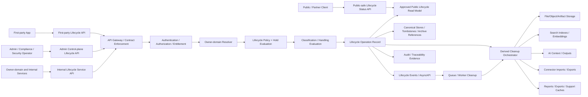
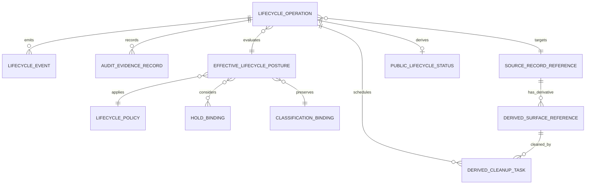
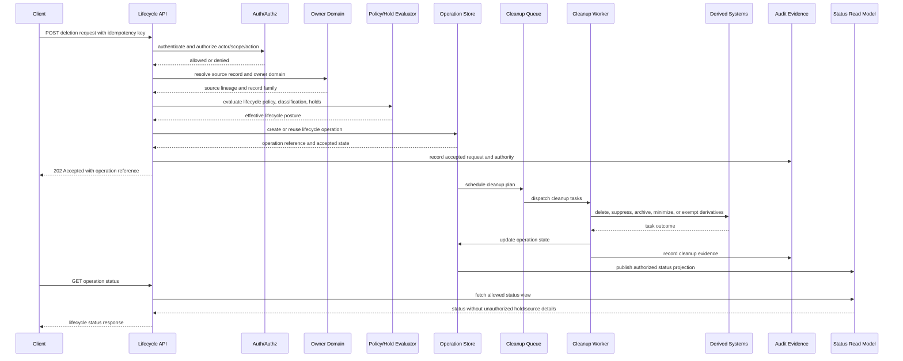

# FUZE Data Retention, Deletion, and Archival API Specification

## Document Metadata

- **Document Name:** `DATA_RETENTION_DELETION_AND_ARCHIVAL_API_SPEC.md`
- **Document Type:** API SPEC v2 — production-grade interface-contract specification
- **Status:** Draft canonical API specification
- **Version:** 2.0.0
- **Effective Date:** 2026-04-24
- **Last Updated:** 2026-04-24
- **Reviewed On:** 2026-04-24
- **Document Owner:** FUZE Platform Data Lifecycle Governance Domain, with shared implementation obligations across owner domains, storage, search, AI, integration, audit, security, support, and operations layers.
- **Approval Authority:** FUZE Platform Architecture and Governance Authority.
- **Review Cadence:** Quarterly and upon material change to lifecycle policy, storage/search/AI/connector cleanup, legal/security hold posture, audit obligations, public-trust publication, or API compatibility posture.
- **Governing Layer:** API contract layer derived from refined system semantics.
- **Parent Registry:** `API_SPEC_INDEX.md` and FUZE API SPEC v2 Canonical File Registry.
- **Upstream Semantic Registry:** `REFINED_SYSTEM_SPEC_INDEX.md`.
- **Upstream API Registry:** `API_SPEC_INDEX.md`.
- **Primary Audience:** API platform engineering, backend engineering, storage engineering, search/indexing engineering, AI platform engineering, integration engineering, security, privacy/compliance, audit/compliance, support/control-plane operations, SRE/reliability, frontend and first-party client teams, OpenAPI/AsyncAPI/SDK authors, and implementation-contract authors.
- **Primary Purpose:** Define the canonical FUZE API contract for lifecycle policy evaluation, retention binding, deletion request handling, archival transition, hold evaluation, derived-store cleanup orchestration, lifecycle status exposure, restore controls, evidence preservation, and public/first-party/internal/admin/event-facing lifecycle behavior.
- **Primary Upstream References:** `DATA_RETENTION_DELETION_AND_ARCHIVAL_SPEC.md`; `DATA_CLASSIFICATION_AND_HANDLING_SPEC.md`; `FILE_OBJECT_AND_ARTIFACT_STORAGE_SPEC.md`; `SEARCH_INDEXING_AND_DISCOVERY_SPEC.md`; `API_ARCHITECTURE_SPEC.md`; `PUBLIC_API_SPEC.md`; `INTERNAL_SERVICE_API_SPEC.md`; `EVENT_MODEL_AND_WEBHOOK_SPEC.md`; `IDEMPOTENCY_AND_VERSIONING_SPEC.md`; `MIGRATION_AND_BACKWARD_COMPATIBILITY_SPEC.md`; `SECURITY_AND_RISK_CONTROL_SPEC.md`; `SECRETS_CONFIG_AND_ENVIRONMENT_SPEC.md`; `AUDIT_LOG_AND_ACTIVITY_SPEC.md`; `AUDIT_AND_ACCESS_TRACEABILITY_SPEC.md`; `WORKFLOW_AND_AUTOMATION_SPEC.md`; `JOB_QUEUE_AND_WORKER_SPEC.md`; `INTEGRATION_CONNECTOR_FRAMEWORK_SPEC.md`; `AI_ORCHESTRATION_SPEC.md`; `MODEL_ROUTING_AND_CONTEXT_SPEC.md`; account/session and workspace access-control foundation documents.
- **Primary Downstream Dependents:** Lifecycle REST/OpenAPI route contracts, lifecycle AsyncAPI event catalogs, deletion request APIs, archival/restore APIs, hold-management APIs, internal cleanup worker contracts, search reaper contracts, storage cleanup contracts, AI context cleanup contracts, connector cleanup contracts, export cleanup contracts, audit evidence contracts, public lifecycle status surfaces, and SDKs.
- **API Surface Families Covered:** Public-safe status, first-party application, internal service, admin/control-plane, event/async, webhook-adjacent notification, reporting/read-model, and implementation-facing lifecycle operation contracts.
- **API Surface Families Excluded:** Raw storage-engine APIs, database schema APIs, vendor backup APIs, legal-system APIs, jurisdiction-specific retention schedule authoring, UI copy, incident command runbooks, cryptographic erasure implementation detail, direct public deletion of internal records, and broad public enumeration of deletion or hold state.
- **Canonical System Owner(s):** FUZE Platform Data Lifecycle Governance Domain; semantic owner domains retain business meaning of their records.
- **Canonical API Owner:** FUZE API Platform, in coordination with Platform Data Lifecycle Governance.
- **Supersedes:** Earlier or weaker API interpretations that treat deletion as simple row removal, allow local products to define hidden lifecycle APIs, expose storage deletion as final business deletion, let derived stores outlive source lifecycle policy silently, or collapse archival, deletion, hold, destruction, and evidence preservation into one ambiguous API outcome.
- **Superseded By:** None currently defined.
- **Related Decision Records:** Not explicitly linked in retrieved governing materials.
- **Canonical Status Note:** This API specification is canonical for interface-level expression of FUZE retention, deletion, archival, hold, lifecycle status, restore, cleanup, and evidence-preservation behavior. It does not own the semantic truth of domain records.
- **Implementation Status:** Normative API source; downstream route designs, service contracts, OpenAPI/AsyncAPI, SDKs, cleanup workers, and status surfaces MUST align.
- **Approval Status:** Draft pending explicit approval workflow.
- **Change Summary:** Initial API SPEC v2 version derived from active refined lifecycle governance semantics and adjacent storage, search, classification, API, event, migration, security, and audit posture.

## Purpose

This specification defines the FUZE API contract for retention, deletion, archival, hold, suppression, destruction, cleanup, restore, lifecycle status, and evidence-preservation behavior.

The API layer MUST express refined lifecycle semantics without redefining them. The refined system specification owns what retention, deletion, archival, hold, suppression, destruction, lifecycle policy, effective lifecycle posture, canonical source record, derived lifecycle surface, and evidence record mean. This API specification governs how those meanings are safely exposed, requested, accepted, processed, audited, versioned, observed, and validated across FUZE interface families.

## Scope

This specification governs lifecycle policy lookup, effective lifecycle evaluation, lifecycle binding APIs, deletion request handling, retention expiry, archival transition, suppression, destruction, restore, cleanup orchestration, lifecycle operation records, status resources, accepted-state/final-outcome semantics, owner-domain coordination, derived-store cleanup, public-safe status, first-party status, admin controls, event behavior, OpenAPI/AsyncAPI/SDK derivation, migration, observability, and testing guardrails.

## Out of Scope

This API specification does not define jurisdiction-specific retention durations, every domain retention schedule, exact database schemas, bucket policies, queue implementations, cryptographic erasure mechanics, legal advice, UI wording, backup vendor APIs, every product-local deletion workflow, public transparency copy, or storage implementation details.

Those concerns belong in downstream policy bundles, implementation contracts, storage/search/AI/connector specs, legal/compliance materials, and runbooks, provided they remain consistent with this API contract and upstream refined semantics.

## Design Goals

1. Preserve one lifecycle contract language across public, first-party, internal, admin, and async APIs.
2. Keep semantic owner truth, lifecycle policy truth, storage truth, runtime cleanup truth, audit truth, and public read-model truth distinct.
3. Ensure deletion and archival are explicit stateful API workflows with lineage rather than invisible storage side effects.
4. Prevent search indexes, AI stores, support caches, exports, reports, logs, connector artifacts, and file objects from becoming lifecycle escape paths.
5. Express hold evaluation and evidence minimization without broadening data visibility.
6. Make partial failure, retry, idempotency, replay, degraded mode, and cleanup finalization deterministic.
7. Provide stable contracts for OpenAPI/AsyncAPI/SDK generation without leaking internal lifecycle authority.
8. Provide testable acceptance criteria and implementation guardrails.

## Non-Goals

This API specification is not intended to make API convenience the owner of lifecycle truth, allow users/operators/workers/providers to bypass owner-domain and policy evaluation, treat HTTP success as final destructive completion when async cleanup remains pending, expose legal/security hold details broadly, make public status APIs canonical lifecycle truth, or replace implementation contracts for storage, search, AI, connector, or audit subsystems.

## Core Principles

### 1. API Expresses Lifecycle Semantics
The API MUST express the refined lifecycle model. It MUST NOT redefine semantic meaning, record ownership, hold meaning, archival meaning, destruction meaning, or evidence obligations.

### 2. Deletion Is Accepted Before It Is Final
Deletion requests and retention-expiry actions are often asynchronous. A successful request MAY mean the lifecycle operation was accepted, not that all source and derived cleanup is complete.

### 3. Derived Cleanup Is Part of the Contract
API completion semantics MUST account for governed derivatives, including search indexes, embeddings, AI context, exports, reports, support caches, connector artifacts, file objects, logs, and public/read-model surfaces.

### 4. Holds Narrow Deletion Without Broadening Visibility
A legal, audit, security, incident, finance, or governance hold MAY defer, deny, or narrow deletion. The API MUST NOT expose hold details to actors without explicit authority.

### 5. Storage Is Not API Truth
A storage delete, archive move, tombstone, object expiry, or backup purge is not final lifecycle truth by itself. The API MUST rely on canonical lifecycle operation and evidence records.

### 6. Public Status Is Derived
Public or partner-visible lifecycle status, where approved, MUST be derived from approved lifecycle read models and MUST NOT expose source records, internal hold posture, investigation posture, or implementation traces.

### 7. Retry Safety Is Mandatory
Lifecycle mutations MUST be idempotent, replay-safe, and traceable because deletion, archival, suppression, restore, and cleanup may be retried across distributed systems.

### 8. Evidence Must Survive Source Minimization
Where policy requires evidence, API contracts MUST preserve minimum durable evidence even when broader source content is deleted, destroyed, or minimized.

## Canonical Definitions

- **Lifecycle Operation:** API-visible operation record representing accepted lifecycle intent, evaluation, execution, cleanup, restoration, or finalization.
- **Lifecycle Policy Evaluation:** Effective policy decision produced after considering record family, owner domain, classification, scope, hold posture, evidence obligations, public-trust obligations, and lineage.
- **Deletion Request:** User-, system-, policy-, or operator-triggered request to evaluate and transition a source or derivative toward deletion, minimization, suppression, destruction, or denial.
- **Archive Request:** Request to transition active data into restricted archival posture with lineage and controlled retrieval.
- **Restore Request:** Request to return archived or suppressed data to an approved, bounded access posture without erasing prior lifecycle lineage.
- **Hold Binding:** Policy-bound lifecycle override attached to a scoped record family, subject, workspace, investigation, domain, or derivative set.
- **Derived Cleanup Plan:** Required cleanup, suppression, rebinding, archival, expiry, or exemption actions for governed derived surfaces.
- **Evidence Record:** Minimum durable audit evidence of lifecycle evaluation, action, actor, authority, reason, operation, correlation, and outcome.
- **Lifecycle Status Resource:** API-safe read model describing operation progress and outcome without exposing unauthorized source content or restricted hold details.

## Truth Class Taxonomy

The API MUST preserve semantic truth, API contract truth, policy truth, runtime truth, ledger/storage truth, provider-input truth, projection/reporting truth, public read-model truth, audit truth, and presentation truth. These truth classes MUST NOT collapse. A derived report is not lifecycle policy truth. A public status response is not storage truth. A storage object state is not semantic truth. Runtime success is not final outcome when cleanup remains pending.

## Architectural Position in the Spec Hierarchy

This API specification sits below `DATA_RETENTION_DELETION_AND_ARCHIVAL_SPEC.md` and adjacent refined semantic owners, and above concrete REST/OpenAPI route definitions, AsyncAPI event catalogs, SDK generation rules, storage/search/AI/connector cleanup contracts, legal-hold and deletion runbooks, database schema contracts, lifecycle operation dashboards, and QA/regression suites.

Refined system specs own lifecycle semantics. This API spec owns lifecycle interface expression.

## Upstream Semantic Owners

The primary upstream semantic owner is `DATA_RETENTION_DELETION_AND_ARCHIVAL_SPEC.md`.

Adjacent semantic owners include `DATA_CLASSIFICATION_AND_HANDLING_SPEC.md`, `FILE_OBJECT_AND_ARTIFACT_STORAGE_SPEC.md`, `SEARCH_INDEXING_AND_DISCOVERY_SPEC.md`, `SECURITY_AND_RISK_CONTROL_SPEC.md`, `SECRETS_CONFIG_AND_ENVIRONMENT_SPEC.md`, `AUDIT_LOG_AND_ACTIVITY_SPEC.md`, `AUDIT_AND_ACCESS_TRACEABILITY_SPEC.md`, `WORKFLOW_AND_AUTOMATION_SPEC.md`, `JOB_QUEUE_AND_WORKER_SPEC.md`, `INTEGRATION_CONNECTOR_FRAMEWORK_SPEC.md`, `AI_ORCHESTRATION_SPEC.md`, `MODEL_ROUTING_AND_CONTEXT_SPEC.md`, and identity/session/workspace/authorization/entitlement specs.

## API Surface Families

### Public APIs
Public APIs MAY expose only approved, minimal, stable lifecycle status or public-trust notices. They MUST NOT expose raw source lifecycle records, hold details, legal/investigation status, internal cleanup topology, worker errors, or unrestricted deletion capability.

### First-Party Application APIs
First-party APIs MAY support user or workspace deletion requests, archive requests, restore requests, and status views when the actor is authenticated, authorized, scoped, and entitled. Responses MUST distinguish accepted intent from final outcome.

### Internal Service APIs
Internal service APIs coordinate owner-domain evaluation, policy evaluation, cleanup planning, derived-store cleanup, audit, event emission, and finalization. They MUST NOT become hidden broad-write shortcuts.

### Admin / Control-Plane APIs
Admin APIs MAY manage holds, operator overrides, force-suppression, remediation, restore, or exceptional cleanup only with reason codes, policy authority, stronger authorization, dual control where required, and durable audit evidence.

### Event / Async APIs
Event APIs communicate lifecycle operation acceptance, evaluation, cleanup progress, partial failure, finalization, denial, hold application, archive transition, restore, and evidence preservation. Events are facts or accepted intents, not arbitrary commands to override owner domains.

### Webhook APIs
External webhook exposure is narrow and derived. Webhooks MAY notify approved external parties of lifecycle status classes but MUST NOT expose source content, hold details, or internal cleanup topology.

### Reporting APIs
Reporting APIs MAY expose lifecycle metrics, compliance posture, cleanup backlog, and evidence summaries to authorized internal audiences. Reports MUST remain derived and MUST NOT become lifecycle owners.

### Chain-Adjacent APIs
Where lifecycle status affects public-chain or chain-adjacent records, the API MUST preserve off-chain/on-chain responsibility separation. Off-chain deletion MUST NOT rewrite immutable external chain history; it MAY update off-chain availability, derived public references, and public notices where approved.

## System / API Boundaries

This API spec governs the interface contract for lifecycle operations. It does not own semantic business records, raw storage execution, legal duration policy, incident command, or UI presentation. Downstream APIs MUST preserve owner-domain mutation boundaries, policy evaluation before destructive execution, hold evaluation before final deletion, classification and access checks before response exposure, derived cleanup planning before finalization, evidence preservation after source minimization, and idempotent operation state.

## Adjacent API Boundaries

- `PUBLIC_API_SPEC.md` governs external API posture; this spec governs lifecycle content within those constraints.
- `INTERNAL_SERVICE_API_SPEC.md` governs service-to-service posture; this spec defines lifecycle-specific internal service requirements.
- `EVENT_MODEL_AND_WEBHOOK_SPEC.md` governs event and webhook semantics; this spec defines lifecycle event content and sequencing rules.
- `IDEMPOTENCY_AND_VERSIONING_SPEC.md` governs replay and compatibility; this spec defines lifecycle mutation idempotency domains and versioning constraints.
- `MIGRATION_AND_BACKWARD_COMPATIBILITY_SPEC.md` governs coexistence and cutover; this spec defines lifecycle behavior during migration and deprecated surface handling.
- `DATA_CLASSIFICATION_AND_HANDLING_API_SPEC.md` governs classification APIs; this spec consumes classification decisions.
- `FILE_OBJECT_AND_ARTIFACT_STORAGE_API_SPEC.md` governs object storage APIs; this spec constrains storage lifecycle interactions.
- `SEARCH_INDEXING_AND_DISCOVERY_API_SPEC.md` governs retrieval APIs; this spec constrains index suppression and cleanup obligations.

## Conflict Resolution Rules

When interface requirements appear to conflict: `REFINED_SYSTEM_SPEC_INDEX.md` and constitutional specs win; `DATA_RETENTION_DELETION_AND_ARCHIVAL_SPEC.md` wins on lifecycle semantics; owner-domain specs win on business meaning; classification, security, secrets, and audit specs win where they impose stronger restrictions; this API spec wins on lifecycle API contract expression; public/internal/event/idempotency/migration API specs win on narrower cross-cutting interface rules where they do not weaken lifecycle semantics; storage/search API specs win on technical surfaces only where they do not weaken lifecycle policy, hold, cleanup, or evidence obligations. Ambiguity MUST default to the more restrictive architecture-consistent interpretation and escalation.

## Default Decision Rules

1. Unknown record families default to retention-bound and non-public until explicit lifecycle policy exists.
2. Deletion APIs default to accepted async operation semantics unless the response can prove final cleanup.
3. Derived surfaces default to cleanup or suppression obligations no weaker than source policy.
4. Holds default to narrowing or deferring deletion while preserving minimum visibility.
5. Public responses default to minimal status classes rather than detailed reasons.
6. Provider deletion signals default to non-canonical until normalized and accepted by the owner domain.
7. Restore defaults to denied unless explicit authority, policy, lineage, and audit posture exist.
8. Final success MUST NOT be returned until source and required derivative outcomes are recorded or explicitly exempted with lineage.
9. Missing idempotency keys on protected lifecycle mutations default to rejection unless a narrower safe route explicitly permits no-key behavior.
10. If a service cannot name source lineage, lifecycle policy reference, hold posture, cleanup plan, and audit correlation, it MUST NOT finalize a lifecycle mutation.

## Roles / Actors / API Consumers

API consumers include end users, workspace administrators, product operators, support operators, security operators, privacy/compliance reviewers, legal/governance actors, owner-domain services, lifecycle policy services, storage/search/AI/connector/export/audit/reporting/worker services, and approved public or partner consumers.

## Resource / Entity Families

API-facing resource families SHOULD include `lifecyclePolicy`, `lifecyclePolicyBinding`, `effectiveLifecyclePosture`, `lifecycleOperation`, `deletionRequest`, `retentionExpiryEvaluation`, `archiveRequest`, `restoreRequest`, `holdBinding`, `suppressionRequest`, `destructionEvidence`, `derivedCleanupPlan`, `derivedCleanupTask`, `lifecycleStatus`, `lifecycleAuditReference`, `publicLifecycleNotice`, and `lifecycleWebhookDelivery`.

Resource names in concrete APIs MAY vary, but these semantic distinctions MUST be preserved.

## Ownership Model

Owner-domain services own business meaning and source record mutation rules. Lifecycle governance owns policy taxonomy, hold/deletion/archival semantics, effective posture, and lifecycle state transitions. API Platform owns interface contract consistency, idempotency, versioning, error classes, and compatibility behavior. Storage/search/AI/connector/export systems own execution mechanics for their governed derivatives. Audit systems own durable evidence capture. Public/reporting systems own approved derived read models only.

## Authority / Decision Model

Lifecycle API decisions MUST evaluate actor identity and session state; workspace, organization, account, or product scope; role, permission, and effective authorization; entitlement or capability gating; owner-domain record ownership and semantic availability; effective classification; effective lifecycle policy; legal, audit, security, incident, finance, governance, or public-trust holds; derivative footprint and cleanup plan; evidence requirements; public or reporting exposure constraints; and migration/version compatibility posture.

No single caller, service, or provider may force lifecycle finalization outside this decision model.

## Authentication Model

Public status APIs MAY be unauthenticated only when approved as public-safe and non-enumerating. User/workspace lifecycle requests MUST require authenticated actors. Internal lifecycle APIs MUST require service identity and service-to-service authentication. Admin/control-plane APIs MUST require stronger authentication posture and operator identity. Provider callbacks carrying deletion or retention signals MUST be authenticated, normalized, and treated as provider-input truth until accepted.

## Authorization / Scope / Permission Model

Lifecycle APIs MUST check actor identity, account/workspace/org scope, ownership or administrative rights, effective permission, purpose-bound capability, policy authority for deletion/archive/restore/hold/override/finalization, resource-family ownership, and visibility constraints for status and denial reasons.

Being able to read data does not imply permission to delete, archive, restore, suppress, export, override, or inspect lifecycle evidence.

## Entitlement / Capability-Gating Model

Entitlements MAY gate lifecycle features such as bulk export deletion, enterprise retention configuration, legal hold management, audit evidence export, archival restore, or admin remediation. Entitlement MUST NOT weaken legal, security, classification, lifecycle, or owner-domain restrictions.

## API State Model

Lifecycle APIs MUST distinguish `accepted`, `evaluating_policy`, `blocked_by_hold`, `denied`, `deletion_requested`, `deletion_pending`, `source_deleted`, `derived_cleanup_pending`, `derived_cleanup_partial_failure`, `archival_pending`, `archived`, `restore_pending`, `restored`, `suppressed`, `destroyed`, `minimized_for_evidence`, `completed`, `completed_with_exemptions`, `failed_retryable`, `failed_terminal`, and `cancelled`.

Lifecycle state MUST remain distinct from business-object state.

## Lifecycle / Workflow Model

1. Request is received with actor, scope, target, reason where required, idempotency key where required, and correlation ID.
2. Authentication and authorization are evaluated.
3. Owner-domain target and source lineage are resolved.
4. Classification and lifecycle policy are evaluated.
5. Holds and evidence obligations are evaluated.
6. API either rejects, denies, accepts synchronously, or creates a lifecycle operation.
7. Derived footprint is discovered across storage, search, AI, connector, export, reporting, logs, and public/read-model systems.
8. Cleanup, suppression, archival, minimization, destruction, or restore tasks are scheduled.
9. Audit evidence and lifecycle operation state are written.
10. Events are emitted to allowed consumers.
11. Derived systems complete, retry, fail, or declare policy-bound exemptions.
12. Final outcome is recorded and exposed through allowed status APIs.

## Architecture Diagram — Mermaid flowchart

## Data Design — Mermaid Diagram

## Flow View

### Primary deletion request flow

A client submits a deletion request with target reference, scope, reason where required, idempotency key, and correlation ID. The API authenticates the actor and checks effective permission, scope, entitlement, and policy authority. Owner-domain resolver validates the target and source record family. Lifecycle policy evaluator computes effective lifecycle posture. Hold evaluator determines whether deletion is allowed, narrowed, deferred, denied, or converted to minimization/suppression. The API creates or reuses a lifecycle operation. The API returns `202 Accepted` with operation reference unless the action is fully synchronous and final. Cleanup planner enumerates governed derived surfaces. Worker systems execute source transition and derived cleanup. Audit evidence is captured at acceptance, every material state transition, override, partial failure, exemption, and finalization. Status APIs expose authorized progress. Operation finalizes only when source and derived outcomes are recorded or exempted with lineage.

### Archival flow

Archive eligibility is evaluated from lifecycle policy and owner-domain state; actor authorization and archive authority are verified; active-use access is narrowed; archive reference and lineage are recorded; search, AI, exports, and support views are suppressed or rebound to archive-safe posture; retrieval requires explicit restore or approved archival-read path.

### Hold flow

An authorized actor creates, updates, or removes a hold with reason code and scope; the binding is audited; affected lifecycle operations are reevaluated; deletion, archival, destruction, restore, and disclosure outcomes are narrowed; hold visibility is restricted to authorized audiences.

### Failure and retry flow

Retryable failures remain attached to the same lifecycle operation. Idempotent retries MUST NOT duplicate destructive actions or erase prior failure history. Partial failures leave visible `derived_cleanup_partial_failure` or equivalent state. Admin remediation may resolve, exempt, or retry tasks with reason-coded audit evidence.

## Data Flows — Mermaid sequenceDiagram

## Request Model

Protected lifecycle mutation requests MUST include stable target reference and target type, actor context, workspace/account/org/product scope, lifecycle action type, reason code for admin/operator/sensitive actions, policy reference where authorized, requested effect, idempotency key, correlation ID or trace ID, client timestamp, optional dry-run/evaluation mode, optional expected version or policy version, and constrained metadata.

Requests MUST NOT rely on raw storage keys, URLs, search document IDs, or provider IDs as sole authority.

## Response Model

Lifecycle mutation responses MUST distinguish validation failure, authorization denial, policy denial, hold-blocked or hold-narrowed outcome, accepted async operation, synchronous no-op replay, final completed outcome, partial cleanup outcome, completed with policy exemptions, terminal failure, and public-safe status response.

Standard response fields SHOULD include `operation_id`, `status`, `status_class`, `target_ref` or redacted target reference, visible `policy_ref`, `accepted_at`, `finalized_at`, idempotency reference, `correlation_id`, `next_poll_after`, `retryable`, `public_message_code`, and `audit_ref` for authorized audiences.

## Error / Result / Status Model

Lifecycle APIs MUST define stable error classes including `authentication_required`, `authorization_denied`, `scope_invalid`, `entitlement_required`, `target_not_found_or_not_visible`, `target_not_lifecycle_managed`, `policy_not_found`, `policy_conflict`, `hold_blocks_action`, `classification_restricts_action`, `operation_already_exists`, `idempotency_key_missing`, `idempotency_conflict`, `state_conflict`, `derived_cleanup_pending`, `derived_cleanup_failed_retryable`, `derived_cleanup_failed_terminal`, `restore_not_allowed`, `archival_not_allowed`, `destruction_not_allowed`, `rate_limited`, `abuse_or_bulk_safety_denied`, `migration_version_unsupported`, `degraded_mode_read_only`, and `internal_policy_evaluation_failed`.

Errors MUST avoid leaking unauthorized information. Public and first-party errors SHOULD use stable public message codes and restricted details.

## Idempotency / Retry / Replay Model

Idempotency is mandatory for lifecycle mutations that create, alter, finalize, retry, cancel, or remediate lifecycle operations.

1. Idempotency scope MUST include actor or service identity, target, action type, scope, and policy-relevant request shape.
2. A replay with the same key and same request shape MUST return the original operation or equivalent current status.
3. A replay with the same key and different protected shape MUST return `idempotency_conflict`.
4. Destructive downstream tasks MUST be internally idempotent even when the outer API request is replayed.
5. Retry MUST append evidence or update operation state; it MUST NOT erase prior failures.
6. Operation references MUST support safe polling and retry without creating duplicate cleanup actions.
7. Replay after migration MUST preserve operation continuity or expose a compatibility-safe supersession reference.

## Rate Limit / Abuse-Control Model

Lifecycle APIs MUST apply stricter limits for public status lookup to prevent enumeration; per-actor, per-workspace, and per-target mutation limits; bulk deletion safety gates; anomaly detection for destructive or repetitive actions; challenge or approval for high-impact actions; queue backpressure for cleanup tasks; separate admin controls for emergency suppression; and clear safe rate-limit responses.

## Endpoint / Route Family Model

Concrete endpoints are downstream implementation details, but allowed route families include:

- First-party: `POST /lifecycle/deletion-requests`, `GET /lifecycle/operations/{operation_id}`, `POST /lifecycle/archive-requests`, `POST /lifecycle/restore-requests`, `POST /lifecycle/evaluations`, `GET /lifecycle/status/{target_type}/{target_id}`.
- Internal: `POST /internal/lifecycle/operations`, `POST /internal/lifecycle/operations/{operation_id}/cleanup-plan`, `POST /internal/lifecycle/cleanup-tasks/{task_id}/complete`, `POST /internal/lifecycle/cleanup-tasks/{task_id}/fail`, `POST /internal/lifecycle/effective-posture/evaluate`, `POST /internal/lifecycle/source-transition/confirm`.
- Admin/control: `POST /admin/lifecycle/holds`, `PATCH /admin/lifecycle/holds/{hold_id}`, `POST /admin/lifecycle/operations/{operation_id}/override`, `POST /admin/lifecycle/operations/{operation_id}/retry`, `POST /admin/lifecycle/operations/{operation_id}/exempt-derived-task`, `POST /admin/lifecycle/suppressions`.
- Public-safe: `GET /public/lifecycle/notices/{notice_id}`, `GET /public/lifecycle/status/{public_ref}`.

Public routes MUST be non-enumerating and minimal.

## Public API Considerations

Public APIs MUST expose only approved public read-model truth, avoid source identifiers unless explicitly public-safe, avoid hold/investigation/security/internal cleanup detail, use stable status classes and message codes, prevent enumeration, support compatibility windows, and never accept destructive lifecycle mutations for internal FUZE records unless a specific approved public API spec permits it.

## First-Party Application API Considerations

First-party APIs MUST provide accepted-vs-final outcome semantics, present user-visible status without leaking unauthorized policy or hold details, require idempotency for mutations, support pollable operation references, prevent target confusion across workspaces/accounts, support cancellation only where policy permits, and preserve audit/correlation IDs.

## Internal Service API Considerations

Internal APIs MUST require service identity and service authorization, carry correlation and operation references, never bypass owner-domain policy evaluation, expose deterministic cleanup task state, preserve retry safety, report partial failures, and write audit evidence for material state transitions.

## Admin / Control-Plane API Considerations

Admin/control APIs MUST be separate from ordinary application APIs, strongly authenticated, policy-constrained, permissioned by role and scope, reason-coded, optionally dual-controlled for high-impact actions, audit-recorded, visible to governance/compliance review, and unable to erase prior evidence. Admin override is a bounded lifecycle control action, not a semantic rewrite.

## Event / Webhook / Async API Considerations

Lifecycle events SHOULD include `lifecycle.operation.accepted`, `lifecycle.policy.evaluated`, `lifecycle.hold.applied`, `lifecycle.operation.denied`, `lifecycle.source.transitioned`, `lifecycle.derived_cleanup.scheduled`, `lifecycle.derived_cleanup.completed`, `lifecycle.derived_cleanup.failed`, `lifecycle.operation.completed`, `lifecycle.operation.completed_with_exemptions`, `lifecycle.archive.completed`, `lifecycle.restore.completed`, and `lifecycle.public_notice.updated`.

Events MUST preserve idempotent consumption, stable event IDs, operation references, trace IDs, policy version references, and minimal payloads. Webhooks MUST be derived external notifications, not internal lifecycle commands.

## Chain-Adjacent API Considerations

When lifecycle actions affect chain-adjacent records, off-chain data availability and public metadata may change according to policy, immutable chain history MUST NOT be represented as erasable FUZE storage, public chain references MUST distinguish source deletion from historical chain existence, user-facing status MUST avoid promising deletion of immutable third-party or on-chain facts, and audit evidence MUST preserve what changed off-chain versus what could not change on-chain.

## Data Model / Storage Support Implications

Implementations MUST maintain lifecycle operation store, lifecycle policy binding records, hold binding records, tombstone or deletion records, archival references, restore references, derived cleanup task records, source-to-derivative lineage, destruction/access-termination evidence, idempotency records, audit evidence records, public/read-model projections, and migration/supersession references where applicable.

Storage objects, URLs, and keys MUST remain implementation details and cannot substitute for lifecycle operation truth.

## Read Model / Projection / Reporting Rules

Read models MUST derive from lifecycle operation and policy truth, be scoped by actor visibility, suppress sensitive hold/legal/security/incident details unless authorized, distinguish pending cleanup from completed deletion, represent completed-with-exemptions separately from completed, never reactivate source truth through reporting, be invalidated or updated after lifecycle state transitions, and preserve public-read/internal-reporting separation.

## Security / Risk / Privacy Controls

Lifecycle APIs MUST apply least privilege; minimize source content in requests, responses, logs, traces, and events; restrict reason-code details by audience; treat holds and investigations as sensitive; prevent enumeration through status APIs; redact or tokenize target identifiers where appropriate; protect idempotency keys and operation references; reject raw secret material in lifecycle metadata; support incident suppression and containment; and preserve compliance evidence without retaining unnecessary source content.

## Audit / Traceability / Observability Requirements

Every material lifecycle action MUST produce audit and observability records including actor or service identity, authority and scope, target reference and source lineage, action type, reason code where required, policy and policy version references, classification posture, hold posture summary where authorized, operation ID, idempotency reference, correlation ID and trace ID, state transitions, derivative cleanup outcomes, override/exemption records, final outcome, and timestamps.

Observability MUST include backlog, retry, partial failure, cleanup latency, degraded-mode, and finalization metrics without exposing source content unnecessarily.

## Failure Handling / Edge Cases

The API MUST handle target missing or not visible; target exists but is not lifecycle-managed; missing policy binding; conflicting policies; hold blocks deletion; partial derived cleanup failure; source deleted but derivative cleanup pending; derivative cleanup complete but source transition failed; archive reference unavailable; restore requested by unauthorized actor; provider-originated deletion request without normalization; stale client version; concurrent deletion and restore request; migration cutover during active deletion; worker timeout; audit write failure; public status read during degraded mode; and evidence preserved after source destruction.

Degraded mode MUST default to safer non-destructive or read-only behavior unless an approved emergency control-plane path applies.

## Migration / Versioning / Compatibility / Deprecation Rules

Version changes MUST NOT redefine lifecycle semantics without refined-system approval. Removing a status class requires compatibility review and migration path. Deprecated lifecycle routes MUST preserve existing operation status visibility during compatibility windows. Operation references MUST remain resolvable or superseded by compatible references. Policy version changes MUST preserve historical evaluation lineage. Response additions SHOULD be additive and safe for older clients. Public status surfaces MUST be more stable and narrower than internal APIs. Migration MUST NOT hide unfinished cleanup or falsely report completed deletion.

## OpenAPI / AsyncAPI / SDK Derivation Rules

OpenAPI artifacts MUST preserve accepted-vs-final outcome distinctions, operation references, status enums, error classes, idempotency header requirements, correlation ID requirements, authorization scopes, public/internal/admin route separation, read-model visibility constraints, and stable compatibility annotations.

AsyncAPI artifacts MUST preserve event IDs, operation IDs, source lineage references, policy version references, status transition semantics, retry/replay rules, payload minimization, and subscriber visibility constraints.

SDKs MUST NOT hide async lifecycle semantics behind falsely synchronous helpers.

## Implementation-Contract Guardrails

Downstream implementations MUST NOT treat row deletion as lifecycle completion, let storage/search/AI/export/report/connector/support systems silently retain deleted source data, expose hold reasons to unauthorized actors, finalize operations without derivative outcome records, bypass policy evaluation through internal service routes, use raw storage keys as deletion authority, erase audit evidence during source deletion, implement non-idempotent destructive retries, publish public lifecycle status from internal worker state alone, allow archive restore without explicit authorization and lineage, or let migration hide active lifecycle operations.

## Downstream Execution Staging

Implementation SHOULD proceed in stages: lifecycle operation store and idempotency support; policy and hold evaluation API; deletion request and status API; derived cleanup planner; storage/search cleanup integrations; audit evidence and observability; admin hold and remediation APIs; archival and restore APIs; connector/AI/export/reporting cleanup integrations; public-safe status/read-model APIs; compatibility and migration hardening.

## Required Downstream Specs / Contract Layers

Required downstream materials include lifecycle OpenAPI route definitions, lifecycle AsyncAPI event catalog, lifecycle operation schema contract, lifecycle policy evaluation contract, hold-management contract, derived cleanup task contract, storage cleanup contract, search suppression/reaper contract, AI context cleanup contract, connector cleanup contract, export/report cleanup contract, public-safe lifecycle status contract, audit evidence contract, admin remediation runbook, and lifecycle regression suite.

## Boundary Violation Detection / Non-Canonical API Patterns

Forbidden patterns include `DELETE /records/{id}` returning final `deleted` while derived cleanup is pending; direct storage-object deletion exposed as business deletion; search reindex ignoring lifecycle state; AI context retaining deleted source content indefinitely; admin force-delete without reason code and audit evidence; public status exposing legal/security hold details; provider callback directly deleting owner-domain records; restore silently reactivating archived data; bulk deletion without policy evaluation, idempotency, and abuse controls; and migration scripts that drop operation history or cleanup lineage.

## Canonical Examples / Anti-Examples

### Canonical example: user deletion request
A user requests deletion of a workspace artifact through a first-party API. The API authenticates the user, verifies workspace permission, creates a lifecycle operation, evaluates policy and holds, schedules storage object cleanup, search suppression, export cleanup, and AI context cleanup, returns `202 Accepted`, and later reports `completed` only after required derived outcomes or policy-bound exemptions are recorded.

### Anti-example: storage-only delete
A service deletes an object-store key and returns `deleted` without creating a lifecycle operation, checking holds, cleaning search indexes, removing exports, or preserving evidence. This is forbidden.

### Canonical example: hold-blocked deletion
A deletion request is submitted for a record under legal hold. The API returns a restricted status indicating the request cannot complete at this time, logs authorized hold-blocking evidence, and avoids exposing legal-hold details to an actor who lacks permission.

### Anti-example: public hold leakage
A public API returns that a user record cannot be deleted because of a named investigation. This is forbidden.

## Acceptance Criteria

1. Lifecycle mutation APIs require authentication except for explicitly approved public-safe status routes.
2. Protected lifecycle mutations reject missing idempotency keys.
3. Replayed lifecycle requests return the original operation or current operation status.
4. Replayed requests with the same idempotency key and different protected body return `idempotency_conflict`.
5. Deletion request APIs distinguish accepted operation from final deletion.
6. Final completion is not reported while required derived cleanup remains pending.
7. Hold-blocked deletion returns an authorized denial or restricted status without leaking hold details.
8. Derived cleanup tasks are created for storage, search, AI, connectors, exports, reports, or support caches when materially applicable.
9. Audit evidence is created for acceptance, denial, hold application, override, cleanup failure, exemption, and finalization.
10. Public status APIs expose only approved read-model status and prevent enumeration.
11. Internal service APIs cannot finalize lifecycle operations without policy and operation references.
12. Admin override APIs require reason code and stronger authorization.
13. Restore APIs require explicit authorization and preserve archive lineage.
14. Search, AI, export, connector, and storage cleanup failures leave visible retryable or terminal operation state.
15. Migration preserves active operation references and historical policy evaluation lineage.
16. OpenAPI and SDK artifacts preserve async and status-class semantics.
17. Async events carry operation ID, event ID, trace/correlation ID, and minimal payload.
18. Rate limits and bulk safety controls apply to destructive or enumerating APIs.
19. Degraded mode defaults to safer non-destructive or read-only behavior unless an approved control-plane route is used.
20. Reports and public views are derived and do not become lifecycle owners.

## Test Cases

### Positive-path tests
1. Submit a valid deletion request with authorization and idempotency key; expect `202 Accepted`, operation ID, audit record, and cleanup tasks.
2. Complete all cleanup tasks; expect operation status `completed` and final audit evidence.
3. Submit an archive request for archive-eligible data; expect active access narrowed and archive reference recorded.
4. Submit an authorized restore request; expect restore operation, lineage preservation, and audit evidence.
5. Query first-party status for an authorized actor; expect scoped lifecycle status without unauthorized internals.

### Negative-path tests
6. Submit deletion without authentication; expect `authentication_required`.
7. Submit deletion without permission; expect `authorization_denied` or safe not-visible response.
8. Submit deletion for unknown target; expect non-enumerating `target_not_found_or_not_visible`.
9. Submit deletion for target with no lifecycle policy; expect safe denial or retention-bound evaluation.
10. Submit public status lookup for non-public target; expect non-enumerating denial.

### Authorization, entitlement, and scope tests
11. Workspace admin deletes workspace-scoped object in correct workspace; expect accepted.
12. Workspace admin attempts cross-workspace deletion; expect scope denial.
13. Actor lacks enterprise retention-management capability; hold-management API rejects with entitlement or permission denial.
14. Support operator can view restricted status but cannot force deletion.
15. Service principal without lifecycle finalization scope cannot finalize operation.

### Idempotency, retry, replay, and conflict tests
16. Replay same deletion request with same idempotency key; expect same operation ID.
17. Replay same idempotency key with different target; expect `idempotency_conflict`.
18. Retry cleanup task after worker timeout; expect no duplicate destructive side effect and appended retry evidence.
19. Concurrent delete and restore requests for same target; expect deterministic state conflict handling.
20. Migration during pending operation preserves operation reference or supersession pointer.

### Hold, policy, and conflict tests
21. Delete target under legal hold; expect hold-blocked outcome with restricted detail.
22. Delete target under security suppression; expect deletion narrowed or deferred according to policy.
23. Policy conflict between retention and deletion request; expect conservative resolution and escalation marker.
24. Public-trust evidence must remain after source minimization; expect `minimized_for_evidence` or equivalent outcome.
25. Provider-originated deletion signal is received; expect normalized input and no owner-domain deletion until accepted.

### Derived cleanup and boundary tests
26. Source deletion schedules search suppression; result no longer appears after cleanup.
27. Source deletion schedules AI context cleanup; deleted content cannot be retrieved into reusable prompt context.
28. Export package derived from deleted source is expired or suppressed according to policy.
29. Connector-imported artifact cleanup preserves provider-input versus FUZE-accepted truth separation.
30. Storage object cleanup cannot finalize business deletion without lifecycle operation update.

### Rate-limit, abuse, degraded-mode, and admin tests
31. Bulk deletion burst exceeds safety limits; expect rate-limit or bulk safety denial.
32. Admin override without reason code is rejected.
33. Admin override with valid authority and reason code succeeds and records evidence.
34. Audit service unavailable during destructive finalization; finalization is blocked or safely deferred.
35. Degraded mode public status route returns safe limited status without internal details.

### Migration, compatibility, and reporting tests
36. Old client polls deprecated status route; expect compatibility-safe operation status.
37. New status enum is additive and old SDK handles unknown status safely.
38. Reporting view shows cleanup backlog but cannot mutate lifecycle operations.
39. Public notice remains after source deletion without exposing source content.
40. Operation completed with policy exemption reports distinct `completed_with_exemptions` status.

## Dependencies / Cross-Spec Links

- `REFINED_SYSTEM_SPEC_INDEX.md`
- `API_SPEC_INDEX.md`
- `DATA_RETENTION_DELETION_AND_ARCHIVAL_SPEC.md`
- `DATA_CLASSIFICATION_AND_HANDLING_API_SPEC.md`
- `FILE_OBJECT_AND_ARTIFACT_STORAGE_API_SPEC.md`
- `SEARCH_INDEXING_AND_DISCOVERY_API_SPEC.md`
- `PUBLIC_API_SPEC.md`
- `INTERNAL_SERVICE_API_SPEC.md`
- `EVENT_MODEL_AND_WEBHOOK_SPEC.md`
- `IDEMPOTENCY_AND_VERSIONING_SPEC.md`
- `MIGRATION_AND_BACKWARD_COMPATIBILITY_SPEC.md`
- `SECURITY_AND_RISK_CONTROL_API_SPEC.md`
- `AUDIT_LOG_AND_ACTIVITY_API_SPEC.md`
- `INTEGRATION_CONNECTOR_FRAMEWORK_API_SPEC.md`
- identity, session, workspace, authorization, access-control, and entitlement API specs

## Explicitly Deferred Items

Deferred items include exact jurisdiction-specific retention duration matrices, exact field-level OpenAPI schemas, exact AsyncAPI topic names, exact bulk deletion limits and SLOs, exact cryptographic erasure implementation, exact backup expiry and snapshot purge mechanics, exact public notice copy, exact UI flow and confirmation wording, exact legal-hold approval workflow details, and exact storage/search/AI/connector vendor implementation contracts.

## Final Normative Summary

FUZE lifecycle APIs MUST express refined retention, deletion, archival, hold, suppression, destruction, cleanup, restore, and evidence-preservation semantics without redefining them. Deletion and archival are stateful, policy-evaluated, idempotent, auditable workflows. Accepted API requests are not final business outcomes unless all required source and derived outcomes are recorded or explicitly exempted with lineage. Public and reporting surfaces are derived and narrow. Internal and admin APIs must not become hidden write shortcuts. Storage, search, AI, connector, export, support, report, and public systems must preserve lifecycle policy and cleanup obligations. When ambiguity exists, the API must choose the more restrictive architecture-consistent outcome and preserve evidence.

## Quality Gate Checklist

- [x] Upstream refined semantic owners are explicit.
- [x] Canonical API owner is explicit.
- [x] API surface families are explicit.
- [x] Mutation boundaries are explicit.
- [x] Read boundaries are explicit.
- [x] Adjacent API boundaries are explicit.
- [x] Truth classes are explicit.
- [x] Conflict-resolution rules are explicit.
- [x] Default decision rules are explicit.
- [x] Public, first-party, internal, admin/control, event/webhook, reporting, and chain-adjacent distinctions are explicit.
- [x] Non-canonical API patterns are called out.
- [x] Operator/admin override paths are bounded, reason-coded, and audited.
- [x] Read-model, cache, reporting, and projection rules are explicit.
- [x] On-chain/off-chain responsibilities are explicit where relevant.
- [x] Accepted-state vs final success semantics are explicit.
- [x] Idempotency and replay requirements are explicit.
- [x] Request, response, error, result, and status classes are explicit.
- [x] Failure and degraded-mode behaviors are explicit.
- [x] Audit, traceability, and observability requirements are explicit.
- [x] Versioning, migration, compatibility, and deprecation rules are explicit.
- [x] OpenAPI / AsyncAPI / SDK guardrails are explicit.
- [x] Dependencies and downstream impacts are explicit.
- [x] Non-goals and deferred items are explicit.
- [x] Architecture Diagram uses Mermaid `flowchart` syntax.
- [x] Data Design diagram uses Mermaid syntax.
- [x] Flow View covers synchronous, asynchronous, failure, retry, audit, admin/operator, and finalization paths.
- [x] Data Flows use Mermaid `sequenceDiagram` syntax.
- [x] Acceptance Criteria are concrete and testable.
- [x] Test Cases cover positive, negative, authorization, entitlement, idempotency, retry, conflict, rate-limit, degraded-mode, audit, migration, and boundary-violation behavior.
