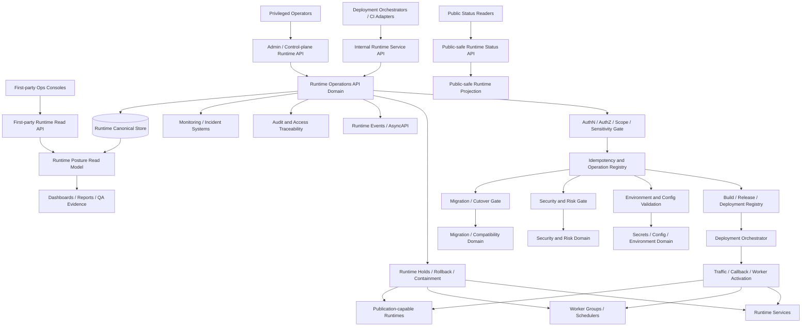
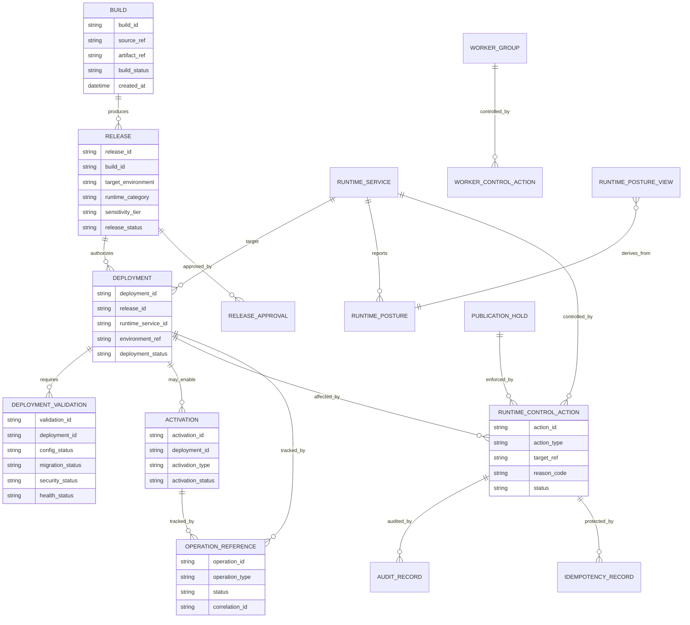
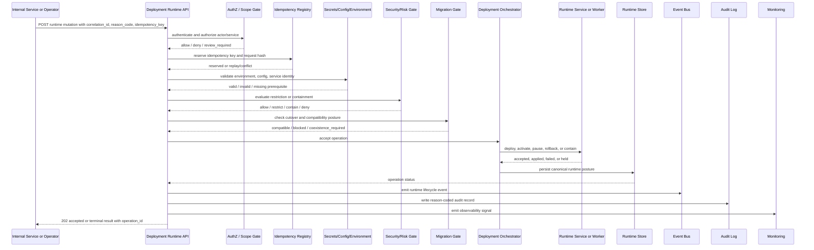

# FUZE Deployment and Runtime Operations API Specification

## Document Metadata

- **Document Name:** `DEPLOYMENT_AND_RUNTIME_OPERATIONS_API_SPEC.md`
- **Document Type:** FUZE API SPEC v2 production-grade interface-contract specification
- **Status:** Draft for canonical API SPEC v2 inclusion
- **Version:** 2.0.0
- **Effective Date:** 2026-04-24
- **Last Updated:** 2026-04-24
- **Reviewed On:** 2026-04-24
- **Document Owner:** FUZE Platform Runtime and Release Governance Domain; named individual owner is not yet specified
- **Approval Authority:** FUZE Platform Architecture and Specification Governance Authority through the active FUZE approval workflow; named approver is not yet specified
- **Review Cadence:** Quarterly and whenever platform-plane boundaries, secrets/config posture, monitoring and incident posture, migration/cutover posture, worker topology, publication-sensitive runtime paths, release-control tooling, or business-continuity assumptions materially change
- **Governing Layer:** API contract layer derived from refined deployment and runtime-operations semantics
- **Parent Registry:** FUZE API SPEC v2 Canonical File Registry
- **Upstream Semantic Registry:** `REFINED_SYSTEM_SPEC_INDEX.md`
- **Upstream API Registry:** `API_SPEC_INDEX.md`
- **Primary Audience:** Platform architecture, backend engineering, platform engineering, SRE/reliability engineering, security engineering, workflow/runtime engineering, AI engineering, product engineering, API authors, admin/control-plane authors, support/control-plane operators, audit/compliance, implementation-contract authors, OpenAPI/AsyncAPI authors, SDK authors, QA and production-readiness reviewers
- **Primary Purpose:** Define the canonical API contract posture for FUZE build, release, deployment, validation, activation, operation, scale, hold, pause, rollback, containment, worker-control, runtime-posture, and public-trust publication-runtime interfaces without allowing API convenience or deployment tooling to redefine refined runtime semantics or owner-domain truth
- **Primary Upstream References:**
  - `REFINED_SYSTEM_SPEC_INDEX.md`
  - `API_SPEC_INDEX.md`
  - `DEPLOYMENT_AND_RUNTIME_OPERATIONS_SPEC.md`
  - `SECRETS_CONFIG_AND_ENVIRONMENT_SPEC.md`
  - `MONITORING_ALERTING_AND_INCIDENT_RESPONSE_SPEC.md`
  - `SECURITY_AND_RISK_CONTROL_SPEC.md`
  - `BUSINESS_CONTINUITY_AND_RECOVERY_SPEC.md`
  - `MIGRATION_AND_BACKWARD_COMPATIBILITY_SPEC.md`
  - `FEATURE_FLAG_AND_ROLLOUT_CONTROL_SPEC.md`
  - `WORKFLOW_AND_AUTOMATION_SPEC.md`
  - `JOB_QUEUE_AND_WORKER_SPEC.md`
  - `API_ARCHITECTURE_SPEC.md`
  - `PUBLIC_API_SPEC.md`
  - `INTERNAL_SERVICE_API_SPEC.md`
  - `EVENT_MODEL_AND_WEBHOOK_SPEC.md`
  - `IDEMPOTENCY_AND_VERSIONING_SPEC.md`
  - `AUDIT_LOG_AND_ACTIVITY_SPEC.md`
  - `AUDIT_AND_ACCESS_TRACEABILITY_SPEC.md`
  - `PUBLIC_CONTRACT_AND_WALLET_REGISTRY_SPEC.md`
  - `TRANSPARENCY_REPORTING_SPEC.md`
- **Primary Downstream Dependents:**
  - deployment-orchestrator implementation contracts
  - release-registry implementation contracts
  - runtime-service descriptor contracts
  - worker-group control contracts
  - queue-consumption and replay-control contracts
  - traffic-activation and routing contracts
  - publication-hold and public-trust runtime contracts
  - internal admin/control-plane runtime consoles
  - service deployment, bootstrap, cutover, rollback, containment, and production-readiness runbooks
  - monitoring, incident, audit, and runtime reporting read models
  - OpenAPI, AsyncAPI, SDK, and implementation-contract derivations
- **API Surface Families Covered:** Internal service APIs, admin/control-plane APIs, first-party operational read APIs, limited public-safe status read APIs, event/async APIs, reporting/read-model APIs, and chain-adjacent/public-trust publication metadata APIs where runtime posture affects public-trust surfaces
- **API Surface Families Excluded:** Unauthenticated public mutation APIs, arbitrary external deployment APIs, raw cloud-provider APIs, raw CI/CD vendor APIs, direct secret-value APIs, direct database mutation APIs, unrestricted worker-shell APIs, direct smart-contract deployment APIs, and product-local bypass APIs
- **Canonical System Owner(s):** FUZE Platform Runtime and Release Governance Domain, with adjacent ownership retained by secrets/config, monitoring/incident, security/risk, migration, workflow/queue, audit, public-trust publication, and owner-domain specifications
- **Canonical API Owner:** FUZE Platform API Architecture / Deployment and Runtime Operations API Domain
- **Supersedes:** No same-name v1 API specification was found during targeted research. This document supersedes weaker runtime-control API interpretations, ad hoc deployment API patterns, and any local route designs that treat deployment as activation, activation as publication, or runtime controls as semantic truth owners.
- **Superseded By:** None currently defined
- **Related Decision Records:** Not yet known
- **Canonical Status Note:** This API specification expresses the refined deployment/runtime semantics at the interface-contract layer. Refined system specs own semantic truth; this API spec owns route-family posture, request/response/error/status rules, idempotency, event/async behavior, authorization posture, audit/observability requirements, and downstream contract guardrails.
- **Implementation Status:** Normative API contract baseline; downstream services, deployment tooling, runtime orchestrators, admin/control consoles, worker controls, OpenAPI/AsyncAPI artifacts, SDKs, tests, and runbooks must align before production reliance
- **Approval Status:** Draft pending formal FUZE API SPEC v2 approval workflow
- **Change Summary:** Created a production-grade API SPEC v2 document for deployment and runtime operations. The spec derives from the active refined deployment/runtime source, hardens build/release/deploy/activate/publish separation, runtime category boundaries, sensitivity tiers, control-plane authority, async worker control, environment validation, idempotency, audit, events, rollback/containment semantics, migration safety, and implementation QA requirements.

## Title

FUZE Deployment and Runtime Operations API Specification

## Purpose

This specification defines the API contract posture for FUZE deployment and runtime operations.

It governs how APIs expose or mutate runtime-operating facts such as builds, releases, deployments, validations, activations, runtime services, worker groups, traffic exposure, queue consumption, runtime holds, publication holds, scaling actions, rollback, containment, and runtime posture read models.

This API specification does not own the semantic truth of deployment and runtime operations. `DEPLOYMENT_AND_RUNTIME_OPERATIONS_SPEC.md` owns the refined system semantics. This API specification expresses those semantics as durable interface contracts that downstream teams may implement, validate, test, generate, monitor, and migrate without reinterpreting runtime ownership.

The core purpose is to make it impossible for API route convenience, deployment tooling, CI/CD automation, admin UI design, worker implementation, or operational shortcuts to collapse the required distinctions among:

- build
- release
- deployment
- validation
- activation
- operation
- publication
- rollback
- disablement
- containment
- migration cutover
- continuity recovery
- owner-domain correction

## Scope

This API specification governs:

- API surface families for build registration, release creation, release approval, deployment creation, runtime validation, activation, deactivation, hold, rollback, containment, worker pause/resume/quarantine/replay, publication hold, and runtime posture read models
- internal service APIs used by deployment orchestrators, release registries, runtime services, worker controllers, traffic routers, and publication systems
- admin/control-plane APIs used by authorized operators for sensitive runtime actions
- first-party operational read APIs used by trusted consoles and dashboards
- public-safe status APIs where runtime state may be exposed without leaking internal topology or semantic owner-domain truth
- event and async APIs related to runtime lifecycle changes
- request, response, error, result, status, idempotency, replay, rate-limit, authorization, audit, observability, and migration rules for deployment/runtime interfaces
- OpenAPI, AsyncAPI, SDK, and downstream implementation-contract derivation guardrails

## Out of Scope

This API specification does not define:

- exact cloud provider, container, Kubernetes, serverless, broker, DNS, CDN, or CI/CD vendor APIs
- raw infrastructure-as-code modules
- service-specific SLI/SLO numeric thresholds
- exact deployment pipeline implementation steps
- exact database schemas or storage-engine DDL
- exact secrets payloads or secret values
- exact feature-flag evaluation logic
- exact incident communication copy or public-status text
- exact business-domain mutation semantics
- exact smart-contract ABI behavior or chain deployment transaction mechanics
- exact disaster-recovery data restoration procedures

Those belong in adjacent refined specs, implementation-contract specs, runbooks, storage contracts, service contracts, and machine-readable API artifacts.

## Design Goals

1. Preserve refined runtime semantics at the API layer.
2. Keep build, release, deployment, activation, and publication distinct in every contract family.
3. Make runtime mutation boundaries explicit and auditable.
4. Support sensitivity-tiered release and runtime control.
5. Treat async workers, schedulers, queue consumers, dispatchers, and publication workers as first-class runtime subjects.
6. Separate runtime truth from business truth, security truth, migration truth, incident truth, execution truth, and audit truth.
7. Make accepted async intent distinct from final runtime outcome.
8. Preserve idempotency, retry safety, replay safety, and conflict safety for every mutation route.
9. Provide route-family models precise enough for OpenAPI, AsyncAPI, SDK, implementation-contract, and QA derivation.
10. Prevent unsafe shortcuts such as implicit queue activation, hidden admin scripts, product-local runtime mutation, or public-trust publication as a side effect of deployment.

## Non-Goals

This API specification is not intended to:

- replace the refined deployment/runtime system spec
- define exact vendor deployment workflows
- grant deployment systems semantic write authority over owner-domain truth
- make rollback a substitute for domain correction
- make public status APIs authoritative for business state
- expose full internal runtime topology publicly
- allow ad hoc operator shell access to become a supported API surface
- turn runtime config or feature flags into canonical business policy
- collapse deployment activation into public-trust publication
- guarantee exactly-once infrastructure execution where distributed reality requires idempotent at-least-once handling

## Core Principles

### 1. Refined-Semantics-First Principle

APIs MUST derive from refined deployment/runtime semantics. API route shape, admin convenience, frontend needs, or worker convenience MUST NOT redefine runtime truth or owner-domain truth.

### 2. Build-Release-Deploy-Activate-Publish Separation Principle

Each interface MUST preserve the difference among code artifact creation, release approval, infrastructure placement, live runtime activation, and public-trust publication.

### 3. Runtime-Controls-Do-Not-Own-Business-Truth Principle

Runtime controls MAY hold, pause, contain, route, scale, activate, deactivate, or roll back runtime behavior. They MUST NOT silently rewrite business, ledger, payout, governance, registry, billing, identity, entitlement, or workflow truth.

### 4. Environment-Identity Principle

Trust-sensitive runtime actions MUST verify environment identity, service identity, configuration posture, and secret prerequisites before execution or activation.

### 5. Async-Is-First-Class Principle

Worker groups, queue consumers, schedulers, replay processors, dispatchers, publication builders, AI execution workers, and export workers are first-class runtime resources and require explicit API control semantics.

### 6. Sensitivity-Tiered Interface Principle

Higher blast-radius or public-trust-sensitive runtime subjects require stricter authorization, validation, audit, release approval, rollback planning, and containment posture.

### 7. Accepted-Is-Not-Final Principle

APIs that initiate deployment, validation, activation, rollback, replay, or containment MAY return accepted-state operation references. Accepted state MUST NOT be represented as final runtime success.

### 8. Auditability and Observability Principle

Material runtime mutations MUST preserve actor or service-principal attribution, reason codes where applicable, correlation IDs, policy/version references, operation IDs, and audit lineage.

### 9. Conservative Failure Principle

If required runtime trust prerequisites cannot be proven, the API MUST fail closed, return hold/review-required status, or create a bounded accepted operation that does not activate unsafe behavior.

### 10. Public-Safe Status Principle

Public status surfaces MAY expose curated runtime availability or degradation state. They MUST NOT expose internal topology, control-plane detail, secret/config posture, unsupported incident detail, or owner-domain truth.

## Canonical Definitions

- **Build:** A traceable software artifact or deployable package created from governed source.
- **Release:** A governed designation that a build is approved for a target environment, runtime subject, rollout wave, or migration stage.
- **Deployment:** Placement of a released artifact into runtime infrastructure. Deployment alone does not imply activation.
- **Validation:** Runtime prerequisite evaluation, including environment identity, dependency readiness, config/secret posture, health checks, migration compatibility, and safety gates.
- **Activation:** Making a deployed capability live for traffic, queue consumption, callback handling, scheduled work, publication execution, or other real execution exposure.
- **Publication:** Governed exposure of public-trust artifacts or externally visible trust-sensitive state. Publication is not automatic activation.
- **Runtime Service:** A request-serving or long-lived runtime subject participating in FUZE production behavior.
- **Worker Group:** A governed async execution subject that consumes queues, jobs, schedules, replays, exports, publication tasks, or deferred work.
- **Runtime Control Action:** A bounded action that changes runtime behavior, such as pause, resume, scale, route, hold, deactivate, rollback, contain, quarantine, or replay.
- **Runtime Hold:** A state that prevents execution, activation, publication, or consumption pending validation, review, recovery, or policy decision.
- **Containment:** A bounded blast-radius control that narrows unsafe runtime behavior without claiming semantic correction.
- **Rollback:** A governed return to a prior approved runtime posture where safe.
- **Effective Runtime Posture:** The active combination of release identity, deployment identity, activation state, environment identity, config validation, capacity, routing, worker consumption, holds, restrictions, and containment state.
- **Operation Reference:** A stable ID returned for accepted async runtime work.

## Truth Class Taxonomy

This API specification preserves the following truth classes:

1. **Runtime truth** - build, release, deployment, activation, service posture, worker posture, routing, validation, scaling, rollback, hold, and containment state.
2. **Semantic / owner-domain truth** - canonical business, identity, billing, credits, payout, governance, registry, workflow, entitlement, and policy truth owned by adjacent domains.
3. **Configuration / environment truth** - environment identity, service identity, secret/config validation, and effective configuration governed by secrets/config/environment specs.
4. **Monitoring / incident truth** - signals, alerts, incident declaration, severity, containment coordination, and recovery validation governed by monitoring/incident specs.
5. **Security / risk truth** - restriction, challenge, containment, quarantine, or security intervention posture governed by security/risk specs.
6. **Migration truth** - coexistence, cutover, compatibility, supersession, and deprecation posture governed by migration specs.
7. **Execution truth** - workflow, queue, job, worker, retry, replay, and completion semantics governed by workflow and queue specs.
8. **Audit truth** - immutable evidence of material runtime actions.
9. **Projection / reporting truth** - dashboards, deployment summaries, status boards, runtime reports, and health views.
10. **Presentation truth** - labels, copy, UI explanations, console cards, status-page text, and support summaries.

APIs MUST keep these truth classes distinct in request fields, response fields, error/status classes, events, read models, and generated schemas.

## Architectural Position in the Spec Hierarchy

This API specification sits below:

- `REFINED_SYSTEM_SPEC_INDEX.md`
- `DEPLOYMENT_AND_RUNTIME_OPERATIONS_SPEC.md`
- `SECRETS_CONFIG_AND_ENVIRONMENT_SPEC.md`
- `MONITORING_ALERTING_AND_INCIDENT_RESPONSE_SPEC.md`
- `SECURITY_AND_RISK_CONTROL_SPEC.md`
- `MIGRATION_AND_BACKWARD_COMPATIBILITY_SPEC.md`
- `FEATURE_FLAG_AND_ROLLOUT_CONTROL_SPEC.md`
- `WORKFLOW_AND_AUTOMATION_SPEC.md`
- `JOB_QUEUE_AND_WORKER_SPEC.md`
- `API_ARCHITECTURE_SPEC.md`
- `PUBLIC_API_SPEC.md`
- `INTERNAL_SERVICE_API_SPEC.md`
- `EVENT_MODEL_AND_WEBHOOK_SPEC.md`
- `IDEMPOTENCY_AND_VERSIONING_SPEC.md`
- `AUDIT_LOG_AND_ACTIVITY_SPEC.md`

It governs API contracts only. It does not replace refined runtime semantics, implementation contracts, runbooks, DDL, CI/CD pipelines, or vendor adapters.

## Upstream Semantic Owners

- `DEPLOYMENT_AND_RUNTIME_OPERATIONS_SPEC.md` owns runtime semantics.
- `SECRETS_CONFIG_AND_ENVIRONMENT_SPEC.md` owns environment identity, secret/config posture, and runtime bootstrap trust inputs.
- `MONITORING_ALERTING_AND_INCIDENT_RESPONSE_SPEC.md` owns incident declaration, severity, detection, and recovery validation posture.
- `SECURITY_AND_RISK_CONTROL_SPEC.md` owns risk restrictions, containment, challenge, and protective posture.
- `MIGRATION_AND_BACKWARD_COMPATIBILITY_SPEC.md` owns coexistence, cutover, compatibility, and deprecation truth.
- `WORKFLOW_AND_AUTOMATION_SPEC.md` and `JOB_QUEUE_AND_WORKER_SPEC.md` own execution/queue semantics.
- `AUDIT_LOG_AND_ACTIVITY_SPEC.md` owns immutable audit evidence semantics.
- Owner-domain specs own underlying business truth affected by runtime changes.

## API Surface Families

### Public-Safe Status APIs

Used for curated runtime status or availability only. They MUST NOT expose internal deployment topology, privileged controls, secret/config metadata, release lineage, or unsupported incident detail.

### First-Party Operational Read APIs

Used by trusted FUZE consoles and dashboards to read bounded deployment/runtime posture. They may expose richer metadata than public APIs but remain read-only unless using admin/control routes.

### Internal Service APIs

Used by deployment orchestrators, release registries, service runtimes, traffic routers, worker controllers, publication systems, CI/CD adapters, and monitoring systems.

### Admin / Control-Plane APIs

Used by authorized operators for release approval, activation approval, hold, rollback, containment, worker control, publication hold, and emergency runtime actions. These require stronger authz, reason codes, idempotency, and audit.

### Event / Async APIs

Used for runtime lifecycle events, operation status, event-driven activation workflows, async deployment/rollback/containment jobs, and downstream projections.

### Reporting / Read-Model APIs

Used for derived dashboards, runtime reports, deployment summaries, compliance reviews, and post-incident reconstruction.

### Chain-Adjacent and Public-Trust Publication APIs

Used where runtime posture affects registry, transparency, payout publication, or other public-trust surfaces. These APIs expose runtime readiness/hold metadata only where approved and MUST NOT claim chain-native truth.

## System / API Boundaries

Runtime APIs may control placement, activation, traffic, worker consumption, routing, and containment. They MUST NOT:

- mutate owner-domain business state except through that domain's approved APIs
- create hidden business meaning through runtime flags
- authorize public-trust publication without publication-owner approval
- override migration or security holds
- expose raw secrets
- make a derived status board authoritative for runtime truth
- turn deployment metadata into policy truth

## Adjacent API Boundaries

- `SECRETS_CONFIG_AND_ENVIRONMENT_API_SPEC.md` governs secret metadata, config references, and environment identity APIs. This API consumes validation outcomes and references but does not expose secret values.
- `MONITORING_ALERTING_AND_INCIDENT_RESPONSE_API_SPEC.md` governs incident records, alert states, containment coordination, and recovery validation APIs. This API exposes runtime controls and posture used during incidents.
- `SECURITY_AND_RISK_CONTROL_API_SPEC.md` governs risk decisions, challenge/review/restriction/containment APIs. This API consumes security decisions and must not redefine them.
- `MIGRATION_AND_BACKWARD_COMPATIBILITY_SPEC`-derived APIs govern cutover, coexistence, and compatibility decisions. This API expresses runtime activation/rollback constraints under those decisions.
- `WORKFLOW_AND_AUTOMATION_API_SPEC.md` and `JOB_QUEUE_AND_WORKER_API_SPEC.md` govern job/workflow semantics. This API controls worker runtime posture, not workflow meaning.
- `EVENT_MODEL_AND_WEBHOOK_SPEC.md` governs event semantics. This API emits runtime lifecycle events but does not redefine event ownership.

## Conflict Resolution Rules

1. Refined system specs win on semantic meaning.
2. This API spec wins on deployment/runtime route-family contract posture within the boundaries of the refined semantics.
3. Secrets/config specs win on environment identity, secret/config classification, bootstrap validation, and trust-input posture.
4. Security/risk specs win when protective restrictions or containment apply.
5. Monitoring/incident specs win on incident declaration, severity, and recovery validation semantics.
6. Migration specs win on coexistence, cutover, deprecation, and compatibility posture.
7. Workflow/queue specs win on job, queue, workflow, retry, and execution semantics.
8. Owner-domain specs win on the semantic meaning of business state and domain corrections.
9. Public dashboards, status pages, release notes, and reports never win over canonical runtime records or owner-domain truth.
10. If ambiguity remains, the API MUST choose the more conservative architecture-consistent interpretation and return a review-required, hold, conflict, or policy-denied outcome.

## Default Decision Rules

1. Deployment is not activation.
2. Activation is not publication.
3. Accepted runtime operation is not final runtime success.
4. Unknown or mixed runtime sensitivity defaults to the stricter plausible tier.
5. Missing environment identity, invalid config, or missing secret prerequisites defaults to fail-closed.
6. Worker consumption defaults to disabled until explicitly activated for materially risky changes.
7. Runtime rollback must not be used where it would corrupt semantic truth; containment and forward-fix win.
8. Public status defaults to narrower, public-safe, and non-sensitive.
9. Admin/control actions require reason codes and audit lineage.
10. Runtime read models are derived and cannot become mutation authority.

## Roles / Actors / API Consumers

- **Public Status Reader:** Reads curated public-safe runtime status.
- **First-Party Operator Console:** Reads deployment/runtime posture and operation status.
- **Deployment Orchestrator:** Creates deployments and coordinates validation/activation.
- **Release Registry Service:** Registers builds, releases, approvals, and rollout metadata.
- **Runtime Service:** Reports heartbeat, health, effective posture, and validation state.
- **Worker Controller:** Controls queue consumption, pause/resume, quarantine, replay, and worker group activation.
- **Traffic Router / Gateway:** Activates or routes public/internal API exposure according to approved runtime posture.
- **Publication Runtime:** Builds or exposes public-trust artifacts under explicit publication hold/release controls.
- **Security / Incident Controller:** Applies runtime containment, hold, or recovery validation under adjacent authority.
- **Admin / Control-Plane Operator:** Performs privileged runtime actions under least privilege, reason codes, and audit.
- **Audit / Compliance Reviewer:** Reads evidence and lineage without gaining runtime mutation authority.

## Resource / Entity Families

- `build`
- `release`
- `release_approval`
- `deployment`
- `deployment_validation`
- `activation`
- `runtime_service`
- `runtime_service_posture`
- `runtime_environment`
- `runtime_category`
- `sensitivity_tier`
- `traffic_route`
- `worker_group`
- `queue_binding`
- `worker_consumption_state`
- `runtime_control_action`
- `runtime_hold`
- `publication_hold`
- `rollback_plan`
- `rollback_operation`
- `containment_action`
- `operation_reference`
- `idempotency_record`
- `audit_record`
- `runtime_event`
- `runtime_posture_view`

## Ownership Model

The Deployment and Runtime Operations API owns interface contract truth for runtime route families. It does not own all runtime-related semantics.

### API-Owned

- route families and endpoint posture
- request/response/error/status classes
- idempotency and operation references
- admin/control-plane separation
- public-safe read-model constraints
- audit/correlation/observability requirements
- event/async API posture
- downstream OpenAPI/AsyncAPI/SDK derivation guardrails

### Not API-Owned

- refined runtime semantics
- business-domain truth
- secret/config truth
- incident truth
- security/risk truth
- migration truth
- execution/queue truth
- public-trust publication truth
- raw infrastructure mechanics

## Authority / Decision Model

Runtime API mutations require layered authority:

1. Caller identity is authenticated.
2. Caller permission, scope, and role are authorized.
3. Target runtime subject and environment are resolved.
4. Sensitivity tier is evaluated.
5. Secrets/config/environment validation is checked.
6. Security/risk posture is checked.
7. Migration/cutover compatibility is checked.
8. Owner-domain readiness is checked where material.
9. Idempotency and conflict checks are applied.
10. Runtime operation is accepted, denied, held, or executed.
11. Audit and event lineage are emitted.

No caller receives owner-domain semantic mutation authority merely because it can invoke runtime APIs.

## Authentication Model

- Public-safe status APIs MAY be unauthenticated only for explicitly approved public status fields.
- First-party operational reads require authenticated FUZE actor/session or service identity.
- Internal service APIs require service-to-service authentication, declared service principal, environment identity, and least-privilege grants.
- Admin/control-plane APIs require authenticated privileged actor identity, appropriate runtime-control role, optional step-up/recent-auth where sensitivity requires, and reason-coded request bodies.
- Emergency/break-glass routes, if implemented, MUST be time-bounded, policy-constrained, reason-coded, and strongly audited.

## Authorization / Scope / Permission Model

Authorization MUST evaluate:

- actor or service principal
- caller type
- environment scope
- runtime category
- sensitivity tier
- owning domain
- service or worker group target
- action type
- release approval status
- migration/cutover posture
- security/risk posture
- incident/containment posture
- publication-sensitive classification
- required reason-code and approval references

Visibility into runtime state MUST NOT imply mutation authority.

## Entitlement / Capability-Gating Model

User commercial entitlement does not define runtime authority. Entitlement MAY influence product exposure, rollout eligibility, or customer-facing feature visibility through adjacent domains, but runtime operations MUST NOT use entitlement as a shadow runtime-control or business-policy system.

Product capability gating and runtime activation remain distinct.

## API State Model

### Build States

- `registered`
- `validated`
- `release_candidate`
- `rejected`
- `retired`

### Release States

- `draft`
- `pending_approval`
- `approved`
- `blocked`
- `superseded`
- `retired`

### Deployment States

- `requested`
- `accepted`
- `deploying`
- `deployed_dark`
- `validation_pending`
- `validation_failed`
- `ready_for_activation`
- `active`
- `held`
- `deactivated`
- `rolled_back`
- `contained`
- `failed`
- `superseded`

### Worker Group States

- `registered`
- `inactive`
- `activation_pending`
- `consuming`
- `paused`
- `quarantined`
- `replay_pending`
- `draining`
- `stopped`
- `failed`

### Runtime Control Action States

- `requested`
- `accepted`
- `policy_blocked`
- `in_progress`
- `succeeded`
- `failed`
- `partially_applied`
- `superseded`
- `rolled_back`
- `requires_review`

### Publication Hold States

- `not_required`
- `hold_active`
- `release_pending`
- `released`
- `superseded`

## Lifecycle / Workflow Model

1. Build is registered.
2. Release is created from a build.
3. Release target, environment, runtime category, sensitivity tier, and rollout plan are declared.
4. Required review and approval gates are completed.
5. Deployment is requested and accepted.
6. Deployment places artifact into target runtime infrastructure.
7. Validation checks environment identity, config/secret posture, dependency readiness, migration compatibility, security posture, and health.
8. Activation is requested separately.
9. Activation enables traffic, worker consumption, callback handling, schedule execution, or publication runtime only after gates pass.
10. Runtime operates under observable posture and controls.
11. Holds, rollback, disablement, containment, scaling, pause/resume, or replay actions are applied as bounded runtime controls.
12. Derived read models, events, audit records, and dashboards are refreshed from canonical runtime records.
13. Migration, retirement, supersession, and archival proceed through compatibility-safe paths.

## Architecture Diagram - Mermaid flowchart

## Data Design - Mermaid Diagram

## Flow View

### Standard Deployment and Activation Flow

1. Caller submits build or release metadata.
2. API authenticates caller and validates service principal or privileged actor.
3. API resolves target runtime subject, environment, runtime category, and sensitivity tier.
4. API stores idempotency record and operation reference.
5. Release is created or approved under sensitivity-tier policy.
6. Deployment request is accepted and recorded.
7. Runtime orchestrator places artifact into target environment.
8. Validation checks environment identity, secrets/config readiness, dependency compatibility, health, security posture, and migration gates.
9. API returns `ready_for_activation` or a precise blocking status.
10. Activation request separately enables traffic, callback intake, queue consumption, schedule execution, or publication execution.
11. Events, audit records, read-model updates, and monitoring signals are emitted.
12. Post-activation observation verifies runtime posture.

### Failure Flow

1. Validation fails or a policy gate blocks activation.
2. API returns structured problem details or accepted hold status.
3. Runtime remains dark, held, paused, or contained.
4. Audit records and events record blocked posture.
5. Operators may remediate, supersede, roll back, or keep hold active.

### Admin / Emergency Control Flow

1. Operator submits reason-coded hold, rollback, containment, pause, resume, quarantine, or publication hold request.
2. API requires privileged authorization and idempotency.
3. API checks incident/security/migration/owner-domain constraints.
4. Control action is accepted and tracked by operation reference.
5. Runtime behavior changes without claiming owner-domain semantic correction.
6. Audit and observability records are emitted.
7. Recovery or release requires explicit validation and reasoned closure.

## Data Flows - Mermaid sequenceDiagram

## Request Model

All mutation requests MUST include or derive:

- `correlation_id`
- `idempotency_key`
- authenticated actor or service principal
- target environment reference
- target runtime subject reference
- action type
- sensitivity tier or resolvable sensitivity profile
- reason code for privileged/admin actions
- operation intent
- policy version references where applicable
- validation evidence references where applicable
- change window or rollout wave reference where applicable
- rollback or containment plan reference where required
- migration/cutover reference where applicable
- publication hold reference where applicable

Mutation requests MUST NOT include raw secret values or unsupported business-domain truth mutations.

## Response Model

Responses MUST distinguish:

- synchronous success
- accepted async operation
- held state
- validation failure
- policy denial
- review required
- security containment
- migration blocked
- rollback unsafe
- not found
- permission denied
- idempotency replay
- idempotency conflict
- degraded-mode accepted posture
- partial application requiring remediation

Accepted async responses MUST include:

- `operation_id`
- `operation_type`
- `operation_status`
- `target_reference`
- `correlation_id`
- expected status route
- accepted-at timestamp
- current non-final status

## Error / Result / Status Model

Structured problem details MUST include:

- `type`
- `title`
- `status`
- `code`
- `detail`
- `instance`
- `correlation_id`
- `operation_id` when applicable
- `retry_after` when safe
- `blocking_gate` when disclosure is permitted

Canonical error codes include:

- `RUNTIME_AUTHENTICATION_REQUIRED`
- `RUNTIME_PERMISSION_DENIED`
- `RUNTIME_ADMIN_PRIVILEGE_REQUIRED`
- `RUNTIME_SERVICE_PRINCIPAL_DENIED`
- `RUNTIME_IDEMPOTENCY_KEY_REQUIRED`
- `RUNTIME_IDEMPOTENCY_CONFLICT`
- `RUNTIME_REQUEST_INVALID`
- `RUNTIME_TARGET_NOT_FOUND`
- `RUNTIME_ENVIRONMENT_UNTRUSTED`
- `RUNTIME_CONFIG_INVALID`
- `RUNTIME_SECRET_PREREQUISITE_MISSING`
- `RUNTIME_DEPLOYMENT_NOT_READY`
- `RUNTIME_ACTIVATION_BLOCKED`
- `RUNTIME_PUBLICATION_HOLD_ACTIVE`
- `RUNTIME_SECURITY_CONTAINMENT_ACTIVE`
- `RUNTIME_MIGRATION_HOLD`
- `RUNTIME_WORKER_ENABLEMENT_BLOCKED`
- `RUNTIME_ROLLBACK_UNSAFE`
- `RUNTIME_OPERATION_ALREADY_FINAL`
- `RUNTIME_RATE_LIMITED`
- `RUNTIME_DEGRADED_MODE`
- `RUNTIME_DEPENDENCY_UNAVAILABLE`

## Idempotency / Retry / Replay Model

Idempotency is required for all mutation routes. The API MUST store:

- idempotency key
- request hash
- actor or service principal
- target reference
- operation type
- correlation ID
- terminal result
- expiry policy

Rules:

1. Same key and same request returns the original accepted or terminal result.
2. Same key and different semantic request returns conflict.
3. Retried accepted operations MUST NOT duplicate deployment, activation, rollback, worker replay, publication, or containment side effects.
4. Replay of worker groups or event consumers requires explicit replay operation references and audit.
5. Redelivery or retry cannot create false runtime truth.
6. Idempotency records MUST be scoped narrowly enough to prevent cross-environment or cross-service collisions.

## Rate Limit / Abuse-Control Model

- Public status APIs MAY be broadly rate limited and cached.
- First-party operational reads SHOULD be rate limited by actor, workspace/admin context, and service family.
- Internal service mutations MUST be bounded by service principal and action class.
- Admin/control actions MUST be strongly rate limited and may require step-up, change-window controls, incident linkage, or dual-control where policy requires.
- Worker replay, rollback, containment, and publication release routes require stronger abuse detection.
- Repeated denied attempts against critical runtime controls MUST emit security/audit signals.

## Endpoint / Route Family Model

### Public-Safe Status APIs

- `GET /v2/status/runtime`
- `GET /v2/status/runtime/components/{component_slug}`

Allowed data:
- public availability
- degraded/unavailable states
- public-safe maintenance windows
- public-safe updated-at timestamp

Forbidden data:
- internal service names unless approved
- deployment IDs
- release IDs
- secret/config posture
- operator identity
- incident-sensitive detail
- private topology

### First-Party Operational Read APIs

- `GET /v2/runtime/services`
- `GET /v2/runtime/services/{runtime_service_id}`
- `GET /v2/runtime/services/{runtime_service_id}/posture`
- `GET /v2/runtime/worker-groups`
- `GET /v2/runtime/worker-groups/{worker_group_id}`
- `GET /v2/runtime/operations/{operation_id}`

These are read-only unless routed through admin/control endpoints.

### Internal Service APIs

- `POST /internal/v2/runtime/builds/register`
- `POST /internal/v2/runtime/releases`
- `POST /internal/v2/runtime/deployments`
- `POST /internal/v2/runtime/deployments/{deployment_id}/validations`
- `POST /internal/v2/runtime/activations`
- `POST /internal/v2/runtime/services/{runtime_service_id}/posture-reports`
- `POST /internal/v2/runtime/worker-groups/{worker_group_id}/posture-reports`
- `POST /internal/v2/runtime/events/consume-state`
- `GET /internal/v2/runtime/environments/{environment_id}/readiness`
- `GET /internal/v2/runtime/deployments/{deployment_id}`
- `GET /internal/v2/runtime/operations/{operation_id}`

### Admin / Control-Plane APIs

- `POST /admin/v2/runtime/releases/{release_id}/approve`
- `POST /admin/v2/runtime/releases/{release_id}/block`
- `POST /admin/v2/runtime/deployments/{deployment_id}/hold`
- `POST /admin/v2/runtime/deployments/{deployment_id}/activate`
- `POST /admin/v2/runtime/services/{runtime_service_id}/deactivate`
- `POST /admin/v2/runtime/services/{runtime_service_id}/rollback`
- `POST /admin/v2/runtime/services/{runtime_service_id}/contain`
- `POST /admin/v2/runtime/services/{runtime_service_id}/scale`
- `POST /admin/v2/runtime/worker-groups/{worker_group_id}/pause`
- `POST /admin/v2/runtime/worker-groups/{worker_group_id}/resume`
- `POST /admin/v2/runtime/worker-groups/{worker_group_id}/quarantine`
- `POST /admin/v2/runtime/worker-groups/{worker_group_id}/replay`
- `POST /admin/v2/runtime/publication-holds`
- `POST /admin/v2/runtime/publication-holds/{hold_id}/release`
- `GET /admin/v2/runtime/audit-lineage`
- `GET /admin/v2/runtime/changes`

### Reporting / Projection APIs

- `GET /admin/v2/runtime/reports/deployments`
- `GET /admin/v2/runtime/reports/releases`
- `GET /admin/v2/runtime/reports/worker-posture`
- `GET /admin/v2/runtime/reports/holds`
- `GET /admin/v2/runtime/reports/rollback-readiness`

## Public API Considerations

Public runtime APIs MUST be narrow, stable, cache-safe, and public-safe. They MUST NOT expose raw internal runtime truth. Public status may lag canonical runtime truth but MUST not contradict it knowingly. Public APIs MUST disclose stale/unavailable/degraded status rather than fabricate certainty.

## First-Party Application API Considerations

First-party consoles MAY expose detailed runtime posture to authorized users. They MUST distinguish canonical runtime records from derived dashboards and must not let read views mutate runtime state through hidden client shortcuts.

## Internal Service API Considerations

Internal APIs require authenticated service identity, environment identity, least-privilege grants, idempotency, and correlation. Internal service APIs MUST NOT become hidden broad-write shortcuts for unrelated owner domains.

## Admin / Control-Plane API Considerations

Admin APIs are privileged and must be separated from ordinary application APIs. Admin mutations require:

- explicit operator identity
- permission and sensitivity-tier authorization
- reason code
- idempotency key
- correlation ID
- policy references where relevant
- audit record
- operation reference for async work
- bounded status and recovery semantics

## Event / Webhook / Async API Considerations

Runtime lifecycle events SHOULD include:

- `runtime.build.registered`
- `runtime.release.created`
- `runtime.release.approved`
- `runtime.release.blocked`
- `runtime.deployment.accepted`
- `runtime.deployment.deployed`
- `runtime.validation.completed`
- `runtime.activation.accepted`
- `runtime.activation.completed`
- `runtime.activation.blocked`
- `runtime.worker_consumption.changed`
- `runtime.worker_group.quarantined`
- `runtime.hold.applied`
- `runtime.hold.released`
- `runtime.rollback.accepted`
- `runtime.rollback.completed`
- `runtime.containment.applied`
- `runtime.publication_hold.applied`
- `runtime.publication_hold.released`
- `runtime.posture.degraded`

Public outbound webhooks are not provided by default for internal runtime events. If exposed later, they must be curated, public-safe projections.

## Chain-Adjacent API Considerations

Runtime APIs may coordinate services that support chain-adjacent publication, registry, payout, or transparency workflows. Runtime APIs MUST NOT claim chain-native truth, sign chain transactions by convenience, or expose contract-control semantics outside approved chain/governance specifications.

## Data Model / Storage Support Implications

Implementations MUST preserve durable records for:

- builds
- releases
- release approvals
- deployments
- validation results
- activations
- runtime services
- worker groups
- worker controls
- runtime control actions
- holds
- rollback plans
- containment actions
- operation references
- idempotency records
- audit records
- events
- derived runtime posture views

Runtime control stores must be separate from owner-domain business stores.

## Read Model / Projection / Reporting Rules

Read models may summarize runtime posture, but they are derived. They MUST:

- trace back to canonical runtime records
- distinguish active, held, contained, degraded, rolled back, and superseded posture
- distinguish deployment from activation
- distinguish activation from publication
- show staleness where relevant
- prevent mutation from reporting views unless routed through approved control APIs
- avoid exposing secret/config internals

## Security / Risk / Privacy Controls

- Restricted control-plane routes require least privilege.
- Environment crossing defaults to deny.
- Critical runtime actions require stronger review and audit.
- Public status must minimize internal detail.
- Operator scripts and shell access are not API substitutes.
- Secret/config values must never appear in request/response payloads.
- Sensitive diagnostics must be redacted.
- Security containment must outrank stale activation state.

## Audit / Traceability / Observability Requirements

Every material runtime mutation MUST emit audit lineage containing:

- actor or service principal
- target runtime subject
- environment
- action type
- sensitivity tier
- reason code where applicable
- correlation ID
- idempotency key reference
- policy version references
- before/after posture summary
- operation ID
- timestamp
- related incident/security/migration references where applicable

Observability MUST support operation status, latency, failure class, validation gate, rollback readiness, worker consumption posture, event emission, and degraded-mode markers.

## Failure Handling / Edge Cases

- Invalid config or missing secret prerequisite: fail closed; do not activate.
- Deployment succeeds but validation fails: remain deployed-dark or held.
- Activation request during migration hold: return `RUNTIME_MIGRATION_HOLD`.
- Security containment becomes active after activation: runtime control must narrow or deactivate as required.
- Worker enablement would consume incompatible queue version: block activation.
- Rollback would corrupt business semantics: reject rollback and require containment/forward-fix.
- Public status projection fails: canonical runtime truth remains intact.
- Duplicate activation request: idempotent replay returns original result.
- Partial containment: expose `partially_applied` and remediation operation.

## Migration / Versioning / Compatibility / Deprecation Rules

- Route families are versioned under `/v2`, `/internal/v2`, and `/admin/v2`.
- Additive fields are preferred.
- Runtime state meaning must not change silently.
- Breaking changes require new versions or explicit migration windows.
- Public status schemas must maintain stability.
- Internal runtime routes may evolve faster, but must preserve compatibility windows for dependent services.
- Decommissioned routes must preserve historical audit and operation references.
- Migration/cutover APIs must coordinate with activation and rollback semantics.

## OpenAPI / AsyncAPI / SDK Derivation Rules

OpenAPI derivations MUST preserve:

- separate route families
- mutation vs read-only distinction
- operation references for async operations
- idempotency headers
- correlation IDs
- structured problem details
- enum stability for state/status classes
- sensitivity-tier and runtime-category fields
- reason-code requirements for admin/control mutations

AsyncAPI derivations MUST preserve event timing meaning and accepted-vs-final distinctions.

SDKs MUST NOT hide accepted async operations as synchronous success.

## Implementation-Contract Guardrails

Downstream implementations MUST NOT:

- auto-activate deployed services unless explicitly allowed
- auto-enable worker consumption for risky worker groups
- use runtime controls to mutate owner-domain business truth
- expose secret/config values through runtime APIs
- treat dashboards as mutation owners
- bypass security, migration, or publication holds
- erase audit lineage during rollback or supersession
- treat public status as canonical internal runtime truth
- collapse rollback, disablement, and containment into one generic action

## Downstream Execution Staging

1. Stabilize runtime canonical records and operation references.
2. Stabilize internal build/release/deployment APIs.
3. Stabilize validation gates with secrets/config/security/migration integration.
4. Stabilize activation APIs for services, traffic, callbacks, and workers.
5. Stabilize admin/control APIs for hold, rollback, containment, and worker controls.
6. Stabilize event catalog and AsyncAPI.
7. Stabilize public-safe status read models.
8. Stabilize migration/deprecation and production-readiness test suites.

## Required Downstream Specs / Contract Layers

- runtime service descriptor contract
- deployment orchestrator implementation contract
- release registry implementation contract
- worker group control contract
- traffic activation/routing contract
- publication runtime hold/release contract
- runtime event catalog
- runtime audit event schema
- OpenAPI and AsyncAPI artifacts
- production readiness and release gate test suites
- rollback/containment runbooks

## Boundary Violation Detection / Non-Canonical API Patterns

Forbidden patterns include:

- treating deployment as activation
- treating activation as publication
- creating unscoped admin super-routes
- allowing internal service APIs to mutate unrelated owner-domain truth
- hiding policy decisions in runtime variables
- activating worker consumption through deployment side effects
- using runtime status pages as source-of-truth records
- exposing secret/config values
- shipping public-trust publication without explicit publication release
- treating rollback as semantic correction
- allowing break-glass actions without reason code and audit

## Canonical Examples / Anti-Examples

### Canonical Example - Dark Deployment Then Activation

A build is released to staging, deployed to production-dark posture, validated against config/security/migration gates, then separately activated for a 10 percent traffic wave.

### Canonical Example - Worker Hold

A new worker group is deployed but queue consumption remains held until schema compatibility and migration posture are confirmed.

### Canonical Example - Public-Trust Publication Hold

A transparency builder deployment succeeds, but publication remains held until the publication owner confirms source-domain readiness.

### Anti-Example - Deployment Equals Live

A CI/CD pipeline deploys a service and automatically enables production traffic and queue consumption without activation gates. This is forbidden.

### Anti-Example - Runtime Flag as Business Policy

A runtime config variable changes entitlement or payout eligibility semantics without owner-domain approval. This is forbidden.

### Anti-Example - Admin Shell Rollback

An operator manually edits production runtime state outside the API, with no reason code, idempotency, or audit lineage. This is forbidden.

## Acceptance Criteria

1. Every mutation route requires idempotency and correlation.
2. Deployment and activation are separate API concepts.
3. Activation and public-trust publication are separate API concepts.
4. Every admin/control mutation requires reason-coded audit lineage.
5. Environment/config/secret validation blocks activation when invalid.
6. Security containment outranks stale activation state.
7. Migration holds block incompatible activation.
8. Worker queue consumption is explicitly controlled.
9. Runtime read models are traceable to canonical records.
10. Public status APIs expose only curated public-safe fields.
11. Operation references distinguish accepted from final outcomes.
12. Rollback, disablement, and containment are separate statuses.
13. Error classes distinguish auth, permission, validation, security, migration, idempotency, and dependency failures.
14. OpenAPI artifacts preserve enum/status semantics.
15. AsyncAPI artifacts preserve accepted-vs-final events.
16. Tests cover positive, negative, authz, idempotency, retry, conflict, degraded-mode, migration, audit, and boundary-violation behavior.

## Test Cases

### Positive Path

1. Register build and create release with valid metadata.
2. Approve high-sensitivity release with authorized operator and reason code.
3. Deploy approved release into production-dark posture.
4. Validate deployment with valid environment/config/security/migration posture.
5. Activate traffic for staged rollout.
6. Enable worker consumption after compatibility validation.
7. Read runtime posture from first-party console.
8. Emit runtime lifecycle events and audit records.

### Negative Path

1. Attempt activation without deployment validation; expect `RUNTIME_ACTIVATION_BLOCKED`.
2. Attempt deployment to unknown environment; expect `RUNTIME_ENVIRONMENT_UNTRUSTED`.
3. Attempt admin rollback without permission; expect `RUNTIME_ADMIN_PRIVILEGE_REQUIRED`.
4. Attempt activation while security containment is active; expect `RUNTIME_SECURITY_CONTAINMENT_ACTIVE`.
5. Attempt public status read for internal release IDs; ensure fields are omitted.

### Idempotency and Retry

1. Retry same activation request with same idempotency key; expect original operation result.
2. Reuse same idempotency key with different target; expect `RUNTIME_IDEMPOTENCY_CONFLICT`.
3. Retry containment request after partial network failure; expect no duplicate containment action.

### Worker and Async

1. Enable worker group with incompatible queue binding; expect blocked.
2. Pause worker group and verify queue consumption stops without deleting queued work.
3. Replay worker group with reason code and audit lineage.
4. Quarantine worker group during incident and verify status projection.

### Migration and Compatibility

1. Activate new API runtime during coexistence window and verify both versions remain routable.
2. Attempt activation after deprecation cutoff without migration approval; expect migration hold.
3. Roll back runtime while preserving compatibility status.

### Audit and Observability

1. Verify every material mutation emits audit record with actor, reason, target, correlation, idempotency, and operation ID.
2. Verify validation failure emits monitoring signal but does not claim incident truth.
3. Verify public status stale projection is marked stale and not canonical.

### Boundary Violation

1. Attempt to publish transparency artifact through deployment activation alone; expect publication hold.
2. Attempt to mutate business entitlement through runtime API; expect forbidden.
3. Attempt to expose raw secret/config value in response; test fails if present.

## Dependencies / Cross-Spec Links

- `REFINED_SYSTEM_SPEC_INDEX.md`
- `DEPLOYMENT_AND_RUNTIME_OPERATIONS_SPEC.md`
- `SECRETS_CONFIG_AND_ENVIRONMENT_SPEC.md`
- `MONITORING_ALERTING_AND_INCIDENT_RESPONSE_SPEC.md`
- `SECURITY_AND_RISK_CONTROL_SPEC.md`
- `BUSINESS_CONTINUITY_AND_RECOVERY_SPEC.md`
- `MIGRATION_AND_BACKWARD_COMPATIBILITY_SPEC.md`
- `FEATURE_FLAG_AND_ROLLOUT_CONTROL_SPEC.md`
- `WORKFLOW_AND_AUTOMATION_SPEC.md`
- `JOB_QUEUE_AND_WORKER_SPEC.md`
- `API_ARCHITECTURE_SPEC.md`
- `PUBLIC_API_SPEC.md`
- `INTERNAL_SERVICE_API_SPEC.md`
- `EVENT_MODEL_AND_WEBHOOK_SPEC.md`
- `IDEMPOTENCY_AND_VERSIONING_SPEC.md`
- `AUDIT_LOG_AND_ACTIVITY_SPEC.md`
- `AUDIT_AND_ACCESS_TRACEABILITY_SPEC.md`
- `PUBLIC_CONTRACT_AND_WALLET_REGISTRY_SPEC.md`
- `TRANSPARENCY_REPORTING_SPEC.md`

## Explicitly Deferred Items

- Exact OpenAPI component schemas
- Exact AsyncAPI channel definitions
- Exact DDL for runtime stores
- Exact vendor deployment adapters
- Exact service SLI/SLO thresholds
- Exact CI/CD pipeline implementation
- Exact incident runbook steps
- Exact public-status page copy
- Exact chain transaction or contract deployment mechanics

## Final Normative Summary

Deployment and runtime operations APIs govern interface contracts for build, release, deploy, validate, activate, operate, hold, pause, roll back, contain, scale, and report runtime posture. They do not own business truth, security truth, migration truth, incident truth, workflow truth, queue truth, public-trust truth, or secret/config truth.

Every implementation MUST preserve separation between deployment and activation, activation and publication, runtime controls and semantic correction, accepted async intent and final outcome, canonical runtime records and derived read models, internal control surfaces and public-safe status surfaces.

## Quality Gate Checklist

- [x] Upstream refined semantic owner is explicit.
- [x] Canonical API owner is explicit.
- [x] API surface families are explicit.
- [x] Mutation boundaries are explicit.
- [x] Read boundaries are explicit.
- [x] Adjacent API boundaries are explicit.
- [x] Truth classes are explicit.
- [x] Conflict-resolution rules are explicit.
- [x] Default decision rules are explicit.
- [x] Public, first-party, internal, admin/control, event/webhook, reporting, and chain-adjacent distinctions are explicit where relevant.
- [x] Non-canonical API patterns are explicit.
- [x] Operator/admin override paths are bounded, reason-coded, and audited.
- [x] Read-model, cache, reporting, and projection rules are explicit.
- [x] Accepted-state vs final success semantics are explicit.
- [x] Idempotency and replay requirements are explicit.
- [x] Request, response, error, result, and status classes are explicit.
- [x] Failure and degraded-mode behaviors are explicit.
- [x] Audit, traceability, and observability requirements are explicit.
- [x] Versioning, migration, compatibility, and deprecation rules are explicit.
- [x] OpenAPI / AsyncAPI / SDK guardrails are explicit.
- [x] Dependencies and downstream impacts are explicit.
- [x] Non-goals and deferred items are explicit.
- [x] Architecture Diagram uses Mermaid flowchart syntax.
- [x] Data Design diagram uses Mermaid syntax.
- [x] Flow View is included.
- [x] Data Flows sequence diagram is included.
- [x] Acceptance Criteria are concrete and testable.
- [x] Test Cases cover positive, negative, authorization, idempotency, retry, conflict, rate-limit/abuse, degraded-mode, audit, migration, and boundary-violation behavior.
