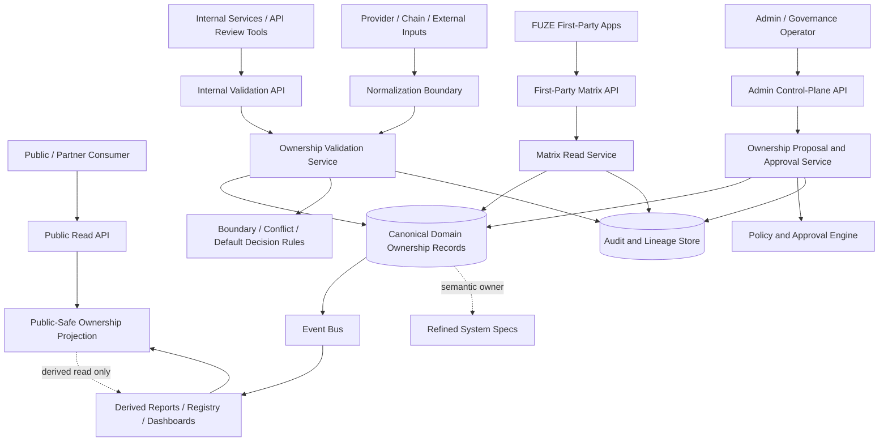
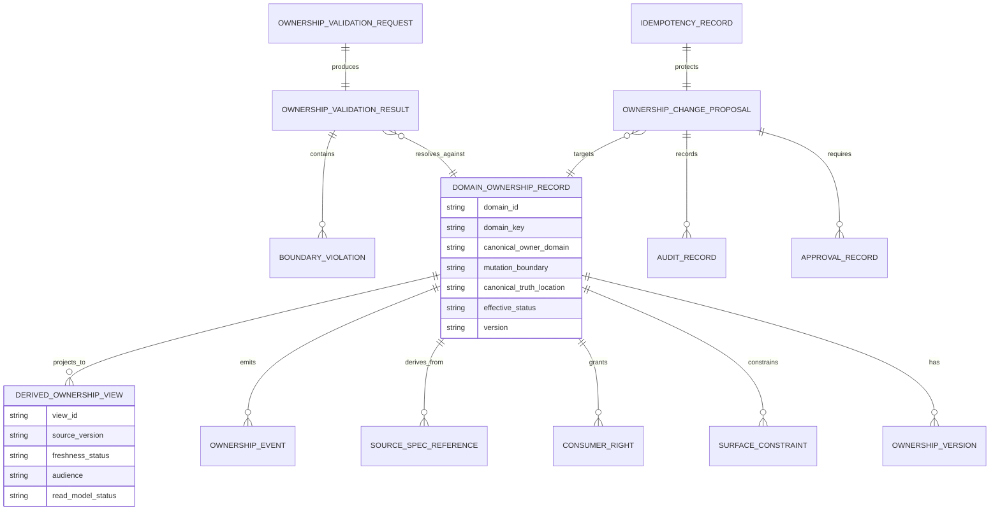
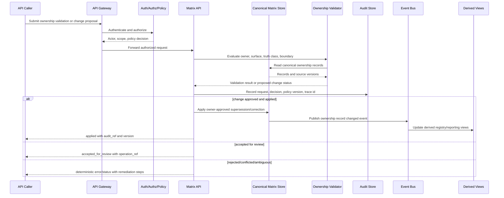

# FUZE Domain Ownership Matrix API Specification

## Document Metadata

- **Document Name:** `DOMAIN_OWNERSHIP_MATRIX_API_SPEC.md`
- **Document Type:** FUZE API SPEC v2 / Production-grade interface-contract specification
- **Status:** Draft production API specification
- **Version:** 2.0.0
- **Effective Date:** 2026-04-24
- **Last Updated:** 2026-04-24
- **Reviewed On:** 2026-04-24
- **Document Owner:** FUZE Platform API Architecture / Interface Governance Domain
- **Approval Authority:** Not explicitly specified in retrieved governing materials; governed by the active FUZE approval workflow and canonical registries
- **Review Cadence:** Review whenever domain ownership classes, platform/product boundaries, entity ownership, public/internal/admin API posture, economic rails, governance controls, or chain-adjacent responsibility changes
- **Governing Layer:** API contract layer derived from platform constitution / domain ownership matrix
- **Parent Registry:** `API_SPEC_INDEX.md` and the API SPEC v2 canonical registry
- **Upstream Semantic Registry:** `REFINED_SYSTEM_SPEC_INDEX.md`
- **Upstream API Registry:** `API_SPEC_INDEX.md`
- **Primary Audience:** Platform architecture, API design, backend engineering, service owners, product engineering, data engineering, security, audit, operations, governance, reporting, OpenAPI / AsyncAPI / SDK authors, implementation-contract authors
- **Primary Purpose:** Define the API contract posture through which FUZE exposes, validates, enforces, queries, audits, and evolves the canonical domain ownership matrix without redefining the refined system semantics that own domain truth
- **Primary Upstream References:** `DOMAIN_OWNERSHIP_MATRIX_SPEC.md`; `SYSTEM_BOUNDARY_AND_OWNERSHIP_SPEC.md`; `SYSTEM_OVERVIEW_AND_BOUNDARIES_SPEC.md`; `PLATFORM_ARCHITECTURE_SPEC.md`; `DATA_MODEL_AND_ENTITY_OWNERSHIP_SPEC.md`; `ONCHAIN_OFFCHAIN_RESPONSIBILITY_SPEC.md`; `PRODUCT_BOUNDARY_AND_DOMAIN_OWNERSHIP_SPEC.md`; `API_ARCHITECTURE_SPEC.md`; `PUBLIC_API_SPEC.md`; `INTERNAL_SERVICE_API_SPEC.md`; `EVENT_MODEL_AND_WEBHOOK_SPEC.md`; `IDEMPOTENCY_AND_VERSIONING_SPEC.md`; `MIGRATION_AND_BACKWARD_COMPATIBILITY_SPEC.md`; `FUZE_ACCOUNT_ACCESS_AND_SESSION_THESIS_FINAL_SPEC.md`; `FUZE_ACCOUNT_ACCESS_AND_SESSION_CANONICAL_FINAL_SPEC.md`; `FUZE_WORKSPACE_ACCESS_CONTROL_BASICS_THESIS_FINAL_SPEC.md`
- **Primary Downstream Dependents:** `DATA_MODEL_AND_ENTITY_OWNERSHIP_API_SPEC.md`; `ONCHAIN_OFFCHAIN_RESPONSIBILITY_API_SPEC.md`; `PRODUCT_BOUNDARY_AND_DOMAIN_OWNERSHIP_API_SPEC.md`; `PRODUCT_ADMISSION_AND_EXPANSION_GATE_API_SPEC.md`; all domain API specs that expose mutation-capable route families; OpenAPI / AsyncAPI / SDK contract artifacts; service implementation contracts; audit and observability contracts
- **API Surface Families Covered:** First-party application reads; internal service reads and validation; admin/control-plane corrections and override requests; reporting/read-model surfaces; event and webhook publication of ownership changes; chain-adjacent ownership classification reads where relevant
- **API Surface Families Excluded:** Ordinary product-local API details; raw database schemas; direct smart-contract ABI definitions; provider-specific callback payloads except as normalized input; endpoint-by-endpoint implementation listings
- **Canonical System Owner(s):** FUZE Platform Architecture for canonical domain ownership semantics; individual domain owners for their domain-specific truth; on-chain contracts for explicitly committed contract truth only
- **Canonical API Owner:** FUZE Platform API Architecture / Interface Governance Domain
- **Supersedes:** Earlier or weaker API interpretations that allow route ownership, dashboard ownership, public registry convenience, workflow execution, or admin convenience to replace canonical owner-domain truth
- **Superseded By:** None currently defined
- **Related Decision Records:** Not explicitly specified in retrieved governing materials
- **Canonical Status Note:** This API specification is contract-level and derivative. It MUST preserve the refined domain ownership matrix and MUST NOT redefine semantic ownership assignments.
- **Implementation Status:** Ready for downstream implementation-contract, OpenAPI, AsyncAPI, SDK, and service planning derivation after approval
- **Approval Status:** Draft pending formal FUZE approval workflow
- **Change Summary:** Initial API SPEC v2 production document for the domain ownership matrix; introduces API surface posture, resource families, request/response/error/idempotency/audit/migration rules, diagrams, flow view, acceptance criteria, and test cases.

## Purpose

This API specification defines how FUZE API surfaces expose and enforce the canonical domain ownership matrix.

The purpose is to ensure that any API, service contract, route family, event family, admin action, reporting surface, public artifact, SDK method, or implementation contract that touches ownership can answer the following questions deterministically:

1. Which domain owns this category of truth?
2. Which API boundary may accept canonical mutation?
3. Which surfaces may read, derive, present, validate, or govern the domain without becoming the owner?
4. Which truth class is being returned, changed, published, or audited?
5. What happens when two sources, surfaces, domains, providers, reports, or chain observations disagree?

This specification does not own the semantic domain matrix. The refined `DOMAIN_OWNERSHIP_MATRIX_SPEC.md` owns the semantics. This API specification owns the interface-contract expression of those semantics.

## Scope

This specification governs API contract behavior for:

- querying the active domain ownership matrix
- validating proposed API, service, entity, event, workflow, report, product, provider, or chain-adjacent designs against the matrix
- exposing canonical ownership, mutation boundary, read boundary, and rights semantics to trusted downstream implementation systems
- handling owner-domain mutation routing requirements
- representing derived, reporting, public, and presentation views of ownership without promoting those views to semantic truth
- emitting events when ownership classifications, effective status, compatibility posture, or deprecation posture changes
- auditing ownership-sensitive API actions
- deriving OpenAPI / AsyncAPI / SDK artifacts without route drift or ownership drift

## Out of Scope

This specification does not define:

- the full contents of the domain ownership matrix itself
- every domain-specific route path
- every database table, field, or enum
- every product-local domain object
- exact service deployment topology
- exact chain contract ABI or storage layout
- exact provider callback payloads
- human staffing ownership
- generic API best practices that do not affect FUZE ownership semantics

## Design Goals

1. Preserve the refined domain ownership matrix as canonical semantic truth.
2. Make ownership discoverable and enforceable through stable API contracts.
3. Prevent non-owner APIs from becoming hidden mutation paths.
4. Keep public, first-party, internal, admin/control, event/webhook, reporting, and chain-adjacent surfaces distinct.
5. Ensure ownership validation can be integrated into API review, service design, OpenAPI generation, SDK generation, migration review, and production readiness gates.
6. Make ambiguous ownership a blocking validation outcome rather than a runtime surprise.
7. Preserve auditability, idempotency, traceability, and migration safety for ownership-sensitive changes.

## Non-Goals

This specification does not aim to:

- create a broad public API for internal ownership governance
- replace the refined ownership matrix with API-owned semantics
- allow admin or control-plane users to mutate arbitrary business truth through matrix APIs
- turn derived reporting, registry, search, dashboard, or AI explanation surfaces into canonical owners
- make provider or chain observations authoritative before owner-controlled normalization
- enumerate every downstream domain API endpoint

## Core Principles

### Refined-First Semantic Principle

The refined system specification owns semantic truth. This API specification expresses that truth as interface contract. If API convenience conflicts with refined ownership semantics, refined ownership wins.

### Owner-Domain Mutation Principle

Every mutation-capable API MUST identify the owner domain for the truth it changes. Canonical mutations MUST terminate in the owner domain or an explicitly delegated owner-controlled component.

### Consumer-Does-Not-Own Principle

An API surface that reads, validates, summarizes, presents, reports, exports, indexes, caches, or explains ownership does not own the underlying business meaning.

### Surface Separation Principle

Public, first-party, internal, admin/control, reporting, event/webhook, and chain-adjacent APIs MUST be separately modeled because they carry different trust and compatibility obligations.

### Normalization-Before-Influence Principle

Provider callbacks, chain observations, third-party inputs, and external system outputs MUST remain input truth until verified and normalized through the owner-controlled boundary.

### Conservative Default Principle

When ownership cannot be identified, the API MUST reject production readiness or return a deterministic ambiguous/incomplete result rather than inferring ownership from route location, database location, UI context, workflow executor, or caller preference.

## Canonical Definitions

- **Domain Ownership Matrix API:** The API contract family that exposes, validates, and audits ownership classifications and boundary rules derived from the canonical matrix.
- **Domain Ownership Record:** API-facing representation of a canonical domain classification, owner, truth location, mutation boundary, rights model, and status.
- **Ownership Validation Request:** A request asking whether a proposed route, entity, event, workflow, report, product feature, provider integration, or chain-adjacent behavior is aligned with the matrix.
- **Canonical Owner Domain:** The domain authoritative for semantic meaning, valid transitions, mutation acceptance, and canonical events for a category of truth.
- **Mutation Boundary:** The API or service boundary through which canonical changes MUST be accepted or delegated.
- **Rights Model:** The bounded set of read, derive, present, execute-against, govern, approve, remediate, or publish rights available to non-owners.
- **Derived Ownership View:** A read-optimized, reporting, registry, dashboard, SDK, or documentation representation of ownership that is downstream from canonical matrix truth.
- **Ownership Conflict:** A condition where multiple sources claim incompatible ownership, mutation authority, truth location, or effective rights.

## Truth Class Taxonomy

This API specification preserves the following truth classes:

1. **Semantic truth** — canonical domain ownership and meaning defined by refined system specs.
2. **API contract truth** — allowed surface families, request/response/error/status rules, route-family posture, and machine-readable contract obligations.
3. **Policy truth** — current rules for exposure, validation, escalation, approval, restriction, and deprecation.
4. **Runtime truth** — request handling state, evaluation execution, accepted async operations, retries, failures, and degraded-mode state.
5. **Ledger / storage truth** — durable ownership records, version records, audit records, idempotency records, validation results, and correction lineage.
6. **Provider-input truth** — external signals or chain observations used as inputs to classification or validation but not themselves matrix truth.
7. **Event / async execution truth** — event publication, webhook delivery, workflow execution, and validation job progression.
8. **Projection / reporting truth** — derived registries, dashboard views, exports, readiness reports, and public-safe summaries.
9. **Presentation truth** — labels, summaries, human-readable explanations, and UI grouping.

These classes MUST NOT be collapsed. In particular, API contract truth does not own semantic truth; projection truth does not own API contract truth; runtime truth does not own business truth.

## Architectural Position in the Spec Hierarchy

This document sits below:

- `REFINED_SYSTEM_SPEC_INDEX.md`
- `DOMAIN_OWNERSHIP_MATRIX_SPEC.md`
- `SYSTEM_BOUNDARY_AND_OWNERSHIP_SPEC.md`
- `SYSTEM_OVERVIEW_AND_BOUNDARIES_SPEC.md`
- `PLATFORM_ARCHITECTURE_SPEC.md`
- `DATA_MODEL_AND_ENTITY_OWNERSHIP_SPEC.md`
- `ONCHAIN_OFFCHAIN_RESPONSIBILITY_SPEC.md`

It sits alongside or above downstream API contract work for:

- domain API specifications
- public API specifications
- internal service API specifications
- admin/control-plane API specifications
- event and webhook contracts
- implementation contracts
- OpenAPI / AsyncAPI / SDK derivation

## Upstream Semantic Owners

- **Domain Ownership Matrix:** owns major-domain classification, owner assignment, truth location, rights semantics, and default ownership decisions.
- **System Boundary and Ownership:** owns top-level ownership philosophy, truth-family boundaries, and mutation-owner interpretation.
- **System Overview and Boundaries:** owns ecosystem framing and top-level layer interpretation.
- **Platform Architecture:** owns platform plane separation and runtime interaction posture.
- **Data Model and Entity Ownership:** owns entity-family ownership, persistence discipline, and canonical-versus-derived interpretation.
- **On-Chain / Off-Chain Responsibility:** owns division between chain-committed truth and off-chain policy, accounting, orchestration, and reporting truth.
- **Product Boundary and Domain Ownership:** owns the product/platform extension boundary.

## API Surface Families

### Public API

Public exposure of the domain ownership matrix MUST be narrow and read-only by default. Public APIs MAY expose approved ownership summaries, public registry references, compatibility status, or transparency-safe domain descriptions. Public APIs MUST NOT expose internal policy details, unresolved ownership disputes, internal control notes, or privileged validation metadata unless explicitly approved.

### First-Party Application API

First-party application APIs MAY support internal FUZE consoles, product review tools, and architecture review workflows. They MAY expose richer read models than public APIs, but they MUST NOT bypass authorization, scope, entitlement, policy, or audit requirements.

### Internal Service API

Internal service APIs MAY validate service designs, route ownership, event ownership, entity ownership, and migration plans. Internal service APIs MUST preserve owner-domain separation and MUST NOT provide broad write shortcuts into other domains.

### Admin / Control-Plane API

Admin/control-plane APIs MAY propose, approve, restrict, supersede, or remediate ownership records only through explicit policy-constrained workflows. They MUST be separated from ordinary application APIs, reason-coded, audited, scope-limited, and reversible or supersession-traceable where applicable.

### Event / Webhook / Async API

Event APIs MAY publish ownership record changes, validation decisions, deprecations, supersessions, and compatibility window changes. Events MUST describe owner-approved changes or validation outcomes; they MUST NOT become a parallel source of ownership truth.

### Reporting / Registry API

Reporting APIs MAY expose derived matrix views, review readiness reports, migration reports, and API boundary violation dashboards. They MUST remain derived unless a narrower specification explicitly elevates a publication artifact for its own bounded reporting domain.

### Chain-Adjacent API

Chain-adjacent APIs MAY classify chain-boundary ownership categories and expose whether a category is on-chain, off-chain, or hybrid. They MUST NOT reinterpret contract truth or expand on-chain ownership beyond explicitly committed categories.

## System / API Boundaries

The API boundary for this domain is a governance and contract boundary, not a business-domain mutation boundary for every FUZE object. It may accept changes to ownership matrix records only through the matrix governance path. It may validate proposed cross-domain designs, but it may not mutate the underlying domains being classified.

For example, a validation API may determine that a proposed billing route belongs to the billing domain. It MUST NOT mutate billing records. It may block or flag the proposed route design until the billing domain exposes the correct owner-controlled contract.

## Adjacent API Boundaries

- `SYSTEM_BOUNDARY_AND_OWNERSHIP_API_SPEC.md` owns top-level API boundary and ownership expression.
- `SYSTEM_OVERVIEW_AND_BOUNDARIES_API_SPEC.md` owns ecosystem and top-level boundary API expression.
- `PLATFORM_ARCHITECTURE_API_SPEC.md` owns platform plane and shared runtime API expression.
- `DATA_MODEL_AND_ENTITY_OWNERSHIP_API_SPEC.md` owns entity-level ownership API expression and persistence implications.
- `ONCHAIN_OFFCHAIN_RESPONSIBILITY_API_SPEC.md` owns chain-adjacent API split and hybrid execution posture.
- `PRODUCT_BOUNDARY_AND_DOMAIN_OWNERSHIP_API_SPEC.md` owns product/platform boundary API expression.
- `PUBLIC_API_SPEC.md`, `INTERNAL_SERVICE_API_SPEC.md`, and `EVENT_MODEL_AND_WEBHOOK_SPEC.md` own narrower surface details for their surface families.

## Conflict Resolution Rules

1. Refined semantic specs win over API contract convenience.
2. `DOMAIN_OWNERSHIP_MATRIX_SPEC.md` wins on major-domain classification, owner assignment, rights semantics, and matrix interpretation.
3. `SYSTEM_BOUNDARY_AND_OWNERSHIP_SPEC.md` wins on top-level ownership and mutation-owner rules.
4. `DATA_MODEL_AND_ENTITY_OWNERSHIP_SPEC.md` wins on entity-family ownership and persistence discipline.
5. `API_ARCHITECTURE_SPEC.md` wins on shared API surface-family posture and accepted-state semantics.
6. Domain-specific API specs win on domain-specific route details only when they preserve the matrix.
7. Public, reporting, SDK, dashboard, event, workflow, worker, provider, and chain-indexer representations never win over the canonical owner-domain interpretation.
8. Admin/control-plane approvals may authorize or constrain ownership changes, but they do not silently mutate business truth outside owner-controlled pathways.
9. If ambiguity remains, the API MUST return `ownership_ambiguous` or `design_incomplete` and require escalation.

## Default Decision Rules

1. Cross-product capabilities default to platform ownership.
2. Product-local capabilities default to product ownership only if they do not redefine shared platform primitives.
3. Identity, session, workspace, authorization, entitlement, credits, billing, payout, registry, treasury, governance, audit, and chain-boundary interpretation default to platform or explicitly defined chain owners, not products.
4. Provider inputs default to external input truth until normalized.
5. Reports, dashboards, search indexes, exports, AI explanations, SDK summaries, and public registry views default to derived truth.
6. Jobs, workflows, queues, schedulers, and workers default to execution truth.
7. Control actions default to policy restriction, approval, or remediation state, not ordinary domain ownership.
8. If an API contract cannot name owner domain, surface family, canonical truth location, mutation boundary, and derived-read posture, it is not production-grade.

## Roles / Actors / API Consumers

- Platform architects reviewing ownership model changes
- API architects reviewing route family ownership
- Backend services validating domain contracts
- Product services checking product/platform boundaries
- Data services checking entity ownership and derived-read status
- Event and webhook systems checking event owner and consumer rights
- Workflow and worker systems checking execution vs domain ownership
- Admin/control-plane operators proposing or approving ownership corrections
- Security and audit systems reviewing sensitive-path lineage
- Reporting and registry systems producing derived ownership views
- Public or partner readers consuming approved safe summaries

## Resource / Entity Families

### Domain Ownership Record

Represents an owner-approved domain classification.

Required contract-level fields:

- `domain_id`
- `domain_key`
- `domain_name`
- `domain_class`
- `canonical_owner_domain`
- `canonical_truth_location`
- `mutation_boundary`
- `allowed_consumer_rights`
- `surface_family_constraints`
- `truth_classes`
- `governance_sensitivity`
- `chain_adjacent_posture`
- `derived_read_posture`
- `effective_status`
- `version`
- `supersedes_record_id`
- `source_spec_refs`
- `audit_refs`

### Ownership Validation Result

Represents a deterministic validation outcome for a proposed API, entity, event, report, product, workflow, provider, or chain-adjacent design.

Required contract-level fields:

- `validation_id`
- `subject_type`
- `subject_ref`
- `proposed_owner_domain`
- `resolved_owner_domain`
- `mutation_boundary_result`
- `read_boundary_result`
- `surface_family_result`
- `truth_class_result`
- `decision`
- `blocking_violations`
- `warnings`
- `required_followups`
- `policy_version`
- `correlation_id`
- `audit_ref`

### Ownership Change Proposal

Represents a controlled request to add, supersede, deprecate, correct, or restrict a matrix record.

Required contract-level fields:

- `proposal_id`
- `proposal_type`
- `target_domain_id`
- `proposed_change`
- `reason_code`
- `requesting_actor_ref`
- `review_scope`
- `required_approvals`
- `risk_classification`
- `compatibility_impact`
- `migration_impact`
- `status`
- `operation_ref`
- `audit_ref`

## Ownership Model

The API architecture domain owns the interface contracts for matrix reads, validation, proposals, approvals, events, and derived views. It does not own the semantic meaning of the matrix rows. The matrix semantic owner remains the refined domain ownership specification and the platform architecture owner.

Domain-specific APIs own their own business routes only within the matrix. They may expose domain-local details but MUST NOT redefine who owns shared primitives.

## Authority / Decision Model

### Read Authority

Read authority determines which actor or system may view ownership information. Public read authority is narrow; internal and admin read authority may be broader under policy.

### Validation Authority

Validation authority determines whether a proposed design complies with the matrix. Validation APIs MAY block production readiness but do not mutate business records.

### Change Authority

Change authority for matrix records is privileged and MUST occur through admin/control-plane proposal and approval workflows.

### Owner-Domain Authority

Owner-domain authority remains with the canonical domain for any business object described by the matrix. The matrix API cannot bypass that owner.

## Authentication Model

All non-public matrix APIs MUST require authenticated actors or service principals. Authentication proves caller identity only. It MUST NOT imply authority to view restricted ownership records, validate production designs, approve changes, or mutate governance-sensitive records.

Public read APIs MAY support unauthenticated access only for explicitly approved public-safe ownership summaries and MUST apply abuse controls.

## Authorization / Scope / Permission Model

Authorization MUST evaluate:

- caller identity or service principal
- workspace or organizational scope if the request concerns product-local or tenant-scoped designs
- domain sensitivity
- surface family requested
- operation type
- policy version
- approval requirements
- whether the caller is requesting read, validate, propose, approve, supersede, deprecate, or export behavior

Unscoped grants are non-canonical for mutation or approval behavior.

## Entitlement / Capability-Gating Model

Entitlement does not own domain authority. Capability access to review tools, product-builder workflows, public registry features, or API governance consoles MAY be gated by entitlement, but entitlement cannot grant mutation rights to canonical ownership records without authorization and policy approval.

## API State Model

Matrix API operations MUST use explicit states:

- `requested`
- `validated`
- `accepted_for_review`
- `approved`
- `rejected`
- `applied`
- `previously_applied`
- `conflicted`
- `ownership_ambiguous`
- `design_incomplete`
- `failed_retryable`
- `failed_terminal`
- `deprecated`
- `superseded`

`accepted_for_review` is not `approved`. `approved` is not `applied`. `previously_applied` is not a new mutation. `ownership_ambiguous` is a blocking result for production readiness.

## Lifecycle / Workflow Model

1. A caller submits a read, validation, proposal, or admin/control request.
2. The API authenticates the caller or applies public-safe request handling.
3. The API resolves scope, surface family, and operation type.
4. The API evaluates authorization, entitlement if applicable, policy restrictions, rate limits, and abuse controls.
5. For reads, the API returns canonical or derived ownership data with explicit truth-class and freshness metadata.
6. For validation, the API evaluates the proposal against the matrix, conflict rules, default decision rules, and adjacent boundary rules.
7. For changes, the API records an idempotent proposal and returns accepted-for-review unless the request is invalid or unauthorized.
8. Admin/control approvals apply only through a policy-bound workflow and create auditable lineage.
9. Applied matrix changes emit owner-approved events and update derived views.
10. Reporting/public views lag canonical records and MUST expose freshness or version metadata.
11. Failures, conflicts, and ambiguities are returned using deterministic error/status classes.

## Architecture Diagram — Mermaid flowchart

## Data Design — Mermaid Diagram

## Flow View

### Synchronous Read Flow

1. Caller requests a matrix record or filtered ownership view.
2. API authenticates the caller unless the route is explicitly public-safe.
3. API resolves allowed visibility and projection level.
4. API returns canonical record or derived view with `truth_class`, `source_version`, `freshness_status`, and `canonical_owner_domain`.
5. Audit is recorded for privileged reads.

### Validation Flow

1. Caller submits proposed route/entity/event/workflow/report/provider/chain-adjacent design.
2. API validates request schema and subject type.
3. API evaluates surface family, mutation boundary, read boundary, truth class, owner domain, and rights model.
4. API returns `valid`, `valid_with_conditions`, `rejected`, `ownership_ambiguous`, or `design_incomplete`.
5. Blocking violations include machine-readable codes and required owner-domain follow-up.

### Admin Proposal Flow

1. Authorized admin submits an ownership change proposal with reason code and source references.
2. API creates or reuses an idempotency record.
3. API records `accepted_for_review` and routes to policy approval.
4. Approval service applies or rejects the proposal.
5. Applied changes supersede prior records, emit events, update derived views, and persist audit lineage.

### Failure / Retry Flow

1. Duplicate submissions with the same idempotency key return the prior result.
2. Retryable failures return stable operation references.
3. Conflicts return explicit conflict details without partial hidden writes.
4. Degraded derived views disclose stale or unavailable projection state instead of pretending canonical freshness.

## Data Flows — Mermaid sequenceDiagram

## Request Model

All non-public mutation, validation, proposal, export, or privileged read requests MUST include:

- authenticated actor or service principal context
- operation type
- subject type and subject reference
- requested surface family
- proposed or queried owner domain if known
- request purpose
- correlation ID
- idempotency key for mutation, proposal, async validation, export, or approval-affecting requests
- policy context where required
- source references for proposed ownership changes
- reason code for admin/control operations

Requests MUST NOT infer owner domain solely from URL path, database table, product namespace, event topic, workflow executor, provider name, or UI label.

## Response Model

Responses MUST distinguish:

- canonical matrix record responses
- derived view responses
- validation result responses
- accepted async/proposal responses
- applied mutation responses
- previously applied idempotent responses
- rejection responses
- conflict responses
- ambiguity/incomplete design responses
- degraded/stale projection responses

All meaningful responses MUST include:

- `request_id`
- `correlation_id`
- `trace_id` where available
- `source_version` or `matrix_version`
- `truth_class`
- `effective_status`
- `audit_ref` for privileged or mutating behavior
- `operation_ref` for accepted async or proposal workflows

## Error / Result / Status Model

Required status and error classes:

- `invalid_request`
- `unauthenticated`
- `unauthorized`
- `scope_mismatch`
- `entitlement_required`
- `policy_denied`
- `domain_owner_missing`
- `ownership_ambiguous`
- `boundary_violation`
- `non_owner_mutation_attempt`
- `derived_write_forbidden`
- `provider_input_not_normalized`
- `chain_boundary_misclassified`
- `conflict_detected`
- `idempotency_conflict`
- `rate_limited`
- `dependency_unavailable`
- `projection_stale`
- `migration_required`
- `deprecated_contract`

Errors MUST identify whether the failure is authentication, authorization, policy, validation, ownership, conflict, dependency, migration, or projection related.

## Idempotency / Retry / Replay Model

Idempotency is mandatory for:

- ownership change proposals
- approval or rejection actions
- supersession, deprecation, correction, and migration-affecting operations
- async validation jobs
- export/report generation jobs
- event replay or webhook redelivery commands

Idempotency records MUST bind actor, scope, operation type, target record, payload hash, policy version, and resulting operation reference. Replays MUST return `previously_applied` or the prior accepted result when the payload matches. Payload mismatches under the same key MUST return `idempotency_conflict`.

## Rate Limit / Abuse-Control Model

Public read APIs MUST use stricter limits, narrow response fields, and anti-scraping protections. Internal validation APIs SHOULD be rate-limited by service principal and operation class. Admin/control APIs MUST use stricter throttles and alerting for repeated sensitive operations, rejected approvals, or conflict-producing changes.

## Endpoint / Route Family Model

This specification permits route families, not final endpoint paths. Downstream OpenAPI may derive concrete paths from these families.

### Read Families

- `read domain ownership record`
- `list domain ownership records`
- `read allowed consumer rights`
- `read surface-family constraints`
- `read source references and version lineage`

### Validation Families

- `validate proposed API route family`
- `validate proposed entity family`
- `validate proposed event/webhook family`
- `validate proposed workflow or worker behavior`
- `validate proposed reporting/public-read surface`
- `validate provider or chain-adjacent integration boundary`

### Admin / Control Families

- `propose domain record addition`
- `propose ownership supersession`
- `propose deprecation`
- `propose correction`
- `approve or reject ownership proposal`
- `apply emergency restriction`
- `release restriction through approved path`

### Reporting / Export Families

- `generate ownership readiness report`
- `export matrix view for implementation review`
- `read boundary violation report`
- `read migration impact report`

### Event / Webhook Families

- `ownership_record.created`
- `ownership_record.updated`
- `ownership_record.superseded`
- `ownership_record.deprecated`
- `ownership_validation.completed`
- `ownership_violation.detected`
- `ownership_policy.changed`

## Public API Considerations

Public APIs MUST expose only approved stable summaries. Public responses MUST avoid internal dispute details, admin notes, security-sensitive ownership mappings, unpublished product boundaries, policy internals, and provider-sensitive metadata. Public APIs MUST be compatible and stable but narrower than internal capabilities.

## First-Party Application API Considerations

First-party APIs MAY expose workflow-specific validation detail for FUZE product and platform review tools. They MUST not allow product teams to self-assign shared ownership without admin/control approval and source references.

## Internal Service API Considerations

Internal services MAY call validation APIs as production-readiness gates. Internal service APIs MUST be authenticated as service principals, scoped, traceable, and least-privileged. Internal validation results MAY block deployment, OpenAPI publication, AsyncAPI publication, or SDK release.

## Admin / Control-Plane API Considerations

Admin/control APIs MUST be:

- separated from ordinary app routes
- strongly authenticated and authorized
- policy-constrained
- reason-coded
- idempotent
- auditable
- traceable
- reversible or supersession-recorded where feasible
- protected by review/approval for material changes

Emergency restrictions MAY temporarily suppress exposure or mark records restricted, but they MUST NOT silently rewrite underlying semantic ownership.

## Event / Webhook / Async API Considerations

Events are downstream of owner-approved matrix changes or validation outcomes. Event consumers MUST treat events as notification and synchronization mechanisms, not as permission to mutate unrelated owner domains. Webhook payloads MUST include event ID, event type, matrix version, source record ID, occurred time, and replay metadata.

## Chain-Adjacent API Considerations

Matrix APIs MAY classify ownership records as on-chain, off-chain, or hybrid. They MUST distinguish contract-native truth from off-chain policy, accounting, entitlement, reporting, or orchestration meaning. Chain observations MUST pass through normalized validation before affecting matrix records or domain-specific API posture.

## Data Model / Storage Support Implications

Storage support MUST include canonical records, versions, idempotency records, proposals, approvals, audit records, validation results, violation records, event outbox records, and derived views. Derived stores MUST preserve source references and matrix versions. Destructive updates to ownership-sensitive history are non-canonical; supersession and correction lineage are required.

## Read Model / Projection / Reporting Rules

1. Read models are derived unless explicitly elevated for their own bounded reporting domain.
2. Derived views MUST expose source version and freshness state.
3. Stale projections MUST not be presented as canonical freshness.
4. Reports and dashboards MUST not accept writes that mutate canonical matrix records.
5. Public-safe projections MUST be narrower than internal matrix records.
6. Reconciliation gaps MUST be visible to internal reviewers.

## Security / Risk / Privacy Controls

Security controls MUST protect:

- ownership-sensitive internal mappings
- unpublished product boundaries
- governance-sensitive control notes
- economic, treasury, payout, entitlement, and chain-boundary classifications
- provider integration details
- admin proposal and approval metadata
- audit lineage

Sensitive reads and all writes MUST be logged. High-risk changes SHOULD require multi-party review or explicit policy approval.

## Audit / Traceability / Observability Requirements

The API implementation MUST record:

- actor or service principal
- scope
- operation type
- target record
- previous and new versions for changes
- policy version
- reason code for admin/control operations
- idempotency key and payload hash for protected operations
- correlation ID and trace ID
- approval records
- validation outcome and blocking violations
- emitted events and derived view update references

Metrics MUST track request volume, validation outcomes, rejected boundary violations, ambiguous ownership results, proposal latency, approval latency, stale projection rates, event delivery failures, and deprecated contract usage.

## Failure Handling / Edge Cases

### Missing Owner

Return `domain_owner_missing` or `design_incomplete`. Do not infer from route or database ownership.

### Conflicting Owners

Return `conflict_detected` with conflict references and required escalation. Do not choose the more convenient route owner.

### Product Claims Platform Primitive

Return `boundary_violation` or `non_owner_mutation_attempt` unless a higher approved exception exists.

### Reporting Layer Attempts Write

Return `derived_write_forbidden`.

### Provider Callback Claims Truth

Return `provider_input_not_normalized` unless owner-controlled normalization has succeeded.

### Chain Indexer Expands Chain Truth

Return `chain_boundary_misclassified` if off-chain policy or business meaning is presented as contract-native truth.

### Projection Is Stale

Return a successful derived read only if the response exposes stale/freshness metadata. Otherwise return `projection_stale`.

### Admin Emergency Restriction

Accept only through control-plane policy, reason code, idempotency, audit, and subsequent review requirements.

## Migration / Versioning / Compatibility / Deprecation Rules

Matrix record changes MUST preserve version lineage. Breaking changes to ownership interpretation require compatibility review, migration impact analysis, and explicit communication to downstream contract owners. Deprecated records MUST remain traceable until all dependent contracts have migrated. Superseded records MUST identify the successor and effective date. SDK and OpenAPI artifacts MUST preserve deprecation metadata.

## OpenAPI / AsyncAPI / SDK Derivation Rules

OpenAPI derivations MUST preserve:

- surface family
- operation class
- owner-domain fields
- truth-class fields
- status and error classes
- idempotency key requirements
- audit and correlation references
- version and source references
- public/internal/admin separation

AsyncAPI derivations MUST preserve event owner, source record version, event ID, replay behavior, and consumer non-ownership rules.

SDKs MUST not hide ambiguity, conflict, stale projection status, or accepted-vs-applied distinctions behind convenience boolean fields.

## Implementation-Contract Guardrails

Implementation contracts MUST NOT:

- infer owner from path prefix alone
- let route hosts become semantic owners
- let product services write shared platform primitives
- let workers or workflows own long-lived business truth
- let admin APIs bypass owner validation and audit
- let dashboards, reports, exports, public registry views, or AI summaries patch canonical records
- let provider callbacks directly mutate matrix records
- let chain observations redefine off-chain ownership
- omit idempotency on proposal, approval, or mutation-like operations
- omit source version and truth class from ownership responses

## Downstream Execution Staging

1. Define canonical matrix record contract.
2. Implement internal read and validation APIs.
3. Add idempotent proposal and approval workflow.
4. Add audit, correlation, trace, and event outbox support.
5. Add derived internal reporting and boundary violation dashboards.
6. Add narrow public-safe read projections only after review.
7. Generate OpenAPI, AsyncAPI, and SDK artifacts with compatibility metadata.
8. Add deployment gates requiring validation for new domain APIs and entity families.

## Required Downstream Specs / Contract Layers

- Concrete OpenAPI contract for matrix read/validation/proposal/admin route families
- AsyncAPI event contract for ownership record and validation outcome events
- Service implementation contract for validation engine
- Audit/event outbox implementation contract
- Internal dashboard/reporting contract
- Public-safe projection contract if public exposure is approved
- Migration plan for legacy ownership assumptions

## Boundary Violation Detection / Non-Canonical API Patterns

Forbidden patterns include:

- product-local route mutating platform-owned identity, session, workspace, authorization, entitlement, credits, payout, registry, treasury, or governance truth
- public API exposing broad internal ownership matrix internals
- admin API directly patching business-domain state while claiming matrix correction
- reporting dashboard closing ownership gaps by editing canonical records
- SDK collapsing `ownership_ambiguous` into `false`
- workflow engine marking domain ownership as applied without owner approval
- provider callback auto-creating ownership records
- event consumer treating `ownership_record.updated` as a command to mutate unrelated business truth
- chain indexer classifying off-chain policy as on-chain truth

## Canonical Examples / Anti-Examples

### Canonical Example: Validate a New Product Route

A product team submits a proposed route that mutates a product-local object. The validation API confirms the object is product-owned, checks that it does not redefine shared platform capabilities, and returns `valid_with_conditions` requiring platform entitlement checks at the boundary.

### Anti-Example: Product Route Creates Credits

A product route attempts to create product-local credits for shared usage. The validation API returns `boundary_violation` because shared credits are platform-owned and must be handled through platform credits APIs.

### Canonical Example: Public Ownership Summary

A public registry shows that a public trust artifact is derived from platform reporting records. The response includes source version and derived/public-read status.

### Anti-Example: Dashboard Corrects Owner Truth

An internal dashboard attempts to edit the canonical owner for an economic domain without a proposal, approval, source reference, reason code, or audit lineage. The API rejects the request with `derived_write_forbidden` or `unauthorized`.

## Acceptance Criteria

1. Every mutation-capable matrix API identifies owner domain, operation type, surface family, and mutation boundary.
2. Public APIs expose only approved public-safe fields and reject mutation attempts.
3. Internal validation APIs return deterministic `valid`, `valid_with_conditions`, `rejected`, `ownership_ambiguous`, or `design_incomplete` outcomes.
4. Admin/control APIs require reason codes, authorization, policy evaluation, idempotency keys, and audit references.
5. Duplicate proposal submissions with the same idempotency key return the same operation result.
6. Payload mismatch under the same idempotency key returns `idempotency_conflict`.
7. Non-owner mutation attempts return `non_owner_mutation_attempt` or `boundary_violation`.
8. Derived/reporting write attempts return `derived_write_forbidden`.
9. Provider-input proposals cannot influence matrix truth without normalized owner-controlled validation.
10. Chain-adjacent responses distinguish contract-native truth from off-chain policy or reporting truth.
11. Derived reads include source version and freshness metadata.
12. Stale projections are labeled stale or rejected as `projection_stale`.
13. Applied matrix changes emit versioned events with replay-safe identifiers.
14. Events do not grant consumer mutation rights.
15. Validation results include blocking violations and required follow-up domains.
16. Audit records exist for privileged reads, validations used as release gates, proposals, approvals, supersessions, deprecations, and emergency restrictions.
17. OpenAPI artifacts preserve idempotency, status classes, error classes, truth-class fields, and surface-family separation.
18. AsyncAPI artifacts preserve event ownership, source version, replay semantics, and consumer non-ownership rules.
19. Migration of deprecated ownership records preserves supersession lineage.
20. The implementation blocks production readiness when owner domain cannot be named.

## Test Cases

### Positive Tests

1. **Read canonical matrix record:** Authenticated internal caller reads a domain record and receives owner, truth location, mutation boundary, rights model, source version, and audit metadata where required.
2. **Validate product-local route:** Proposed product route that affects only product-owned objects returns `valid` or `valid_with_conditions`.
3. **Validate platform primitive route:** Proposed platform API route identifies platform owner and required owner-domain mutation boundary.
4. **Public summary read:** Public caller receives narrow approved fields with public-safe projection metadata.
5. **Admin proposal accepted:** Authorized admin submits complete proposal with reason code and idempotency key; API returns `accepted_for_review` with operation reference.

### Negative Tests

6. **Unauthenticated internal read:** Missing authentication returns `unauthenticated`.
7. **Unauthorized proposal:** Authenticated user without control-plane permission receives `unauthorized`.
8. **Scope mismatch:** Caller attempts workspace-scoped validation outside their scope and receives `scope_mismatch`.
9. **Product claims platform identity ownership:** Validation returns `boundary_violation`.
10. **Report attempts canonical mutation:** Reporting surface receives `derived_write_forbidden`.

### Idempotency / Retry Tests

11. **Duplicate proposal replay:** Same idempotency key and same payload returns prior operation result.
12. **Idempotency payload conflict:** Same idempotency key with changed payload returns `idempotency_conflict`.
13. **Retry after dependency timeout:** Retryable dependency failure returns stable operation reference and does not duplicate proposal records.
14. **Event replay:** Replayed ownership update event carries same event ID and does not create duplicate derived updates.

### Conflict / Ambiguity Tests

15. **Missing owner:** Proposed design with no owner returns `design_incomplete`.
16. **Two owner claims:** Conflicting owner references return `conflict_detected` with escalation requirement.
17. **Ambiguous chain boundary:** Hybrid chain/off-chain subject without explicit classification returns `ownership_ambiguous` or `chain_boundary_misclassified`.
18. **Provider callback direct truth:** Provider-originated payload attempting to set domain ownership returns `provider_input_not_normalized`.

### Authorization / Entitlement / Policy Tests

19. **Entitled but unauthorized:** Product-builder entitlement without admin permission cannot approve matrix changes.
20. **Policy-denied high-risk change:** Control-plane policy blocks a governance-sensitive ownership change and returns `policy_denied`.
21. **Emergency restriction:** Authorized operator applies restriction with reason code; audit and event records are created.
22. **Emergency restriction missing reason:** Request is rejected as `invalid_request`.

### Rate Limit / Abuse Tests

23. **Public scraping attempt:** Excessive public reads return `rate_limited`.
24. **Repeated invalid validation:** Service principal exceeding invalid validation threshold is throttled and flagged for monitoring.

### Degraded Mode / Projection Tests

25. **Stale projection disclosed:** Derived dashboard response includes stale freshness metadata and canonical source version.
26. **Canonical store unavailable:** API returns `dependency_unavailable` for canonical reads rather than falling back silently to stale projection as canonical.

### Migration / Compatibility Tests

27. **Deprecated record read:** Deprecated ownership record returns successor reference and deprecation metadata.
28. **Superseded record validation:** Validation uses effective successor record while preserving lineage to superseded record.
29. **SDK generation check:** SDK preserves `ownership_ambiguous` and `accepted_for_review` as distinct states.
30. **OpenAPI compatibility check:** Breaking field removal fails compatibility review unless migration metadata is present.

### Boundary Violation Tests

31. **Worker owns business truth:** Workflow/worker proposal claiming domain ownership returns boundary violation.
32. **Dashboard patch:** Dashboard write to canonical record without admin proposal path is rejected.
33. **Event consumer command drift:** Event consumer attempting side effects in unrelated domain without owner command is rejected by downstream validation.
34. **Public API mutation:** Public request attempting proposal creation is rejected unless an explicitly approved public submission workflow exists.

## Dependencies / Cross-Spec Links

- `DOMAIN_OWNERSHIP_MATRIX_SPEC.md` — semantic owner for major-domain ownership classification
- `SYSTEM_BOUNDARY_AND_OWNERSHIP_SPEC.md` — top-level ownership and mutation-owner rules
- `SYSTEM_OVERVIEW_AND_BOUNDARIES_SPEC.md` — ecosystem framing
- `PLATFORM_ARCHITECTURE_SPEC.md` — plane separation
- `DATA_MODEL_AND_ENTITY_OWNERSHIP_SPEC.md` — entity ownership and persistence discipline
- `ONCHAIN_OFFCHAIN_RESPONSIBILITY_SPEC.md` — chain/off-chain split
- `PRODUCT_BOUNDARY_AND_DOMAIN_OWNERSHIP_SPEC.md` — product/platform boundary
- `API_ARCHITECTURE_SPEC.md` — shared API surface posture
- `PUBLIC_API_SPEC.md` — public exposure posture
- `INTERNAL_SERVICE_API_SPEC.md` — service-to-service posture
- `EVENT_MODEL_AND_WEBHOOK_SPEC.md` — events and webhooks
- `IDEMPOTENCY_AND_VERSIONING_SPEC.md` — replay safety and contract versioning
- `MIGRATION_AND_BACKWARD_COMPATIBILITY_SPEC.md` — coexistence, cutover, deprecation, and supersession
- `AUDIT_LOG_AND_ACTIVITY_SPEC.md` — immutable activity and audit lineage
- `SECURITY_AND_RISK_CONTROL_SPEC.md` — sensitive-path controls and abuse resistance

## Explicitly Deferred Items

- Final endpoint paths and method names
- Complete OpenAPI schemas
- Complete AsyncAPI schemas
- Exact admin approval policy graph
- Exact public-safe field list
- Exact internal dashboard layout
- Exact storage engine and indexing topology
- Exact migration plan for legacy ownership assumptions

## Final Normative Summary

The `DOMAIN_OWNERSHIP_MATRIX_API_SPEC.md` defines how APIs must expose, validate, audit, and evolve FUZE domain ownership without redefining it. Every mutation-capable API must name the canonical owner domain and terminate canonical changes in owner-controlled boundaries. Public, internal, admin/control, reporting, event/webhook, and chain-adjacent surfaces must remain distinct. Derived views, reports, dashboards, SDKs, events, workers, workflows, provider callbacks, and chain observations must never become hidden semantic owners. Ambiguity is a blocking outcome, not an implementation detail. Idempotency, authorization, auditability, version lineage, migration safety, and truth-class separation are mandatory for production readiness.

## Quality Gate Checklist

- [x] Upstream refined semantic owners are explicit.
- [x] Canonical API owner is explicit.
- [x] API surface families are explicit.
- [x] Mutation boundaries are explicit.
- [x] Read boundaries are explicit.
- [x] Adjacent API boundaries are explicit.
- [x] Truth classes are explicit.
- [x] Conflict-resolution rules are explicit.
- [x] Default decision rules are explicit.
- [x] Public, first-party, internal, admin/control, event/webhook, reporting, and chain-adjacent distinctions are explicit.
- [x] Non-canonical API patterns are called out.
- [x] Operator/admin paths are bounded, reason-coded, and audited.
- [x] Read-model, cache, reporting, and projection rules are explicit.
- [x] Chain-adjacent responsibilities are explicit.
- [x] Accepted-state vs final application semantics are explicit.
- [x] Idempotency and replay requirements are explicit.
- [x] Request, response, error, result, and status classes are explicit.
- [x] Failure and degraded-mode behaviors are explicit.
- [x] Audit, traceability, and observability requirements are explicit.
- [x] Versioning, migration, compatibility, and deprecation rules are explicit.
- [x] OpenAPI / AsyncAPI / SDK guardrails are explicit.
- [x] Dependencies and downstream impacts are explicit.
- [x] Non-goals and deferred items are explicit.
- [x] Architecture Diagram using Mermaid `flowchart` syntax is included.
- [x] Data Design diagram using Mermaid syntax is included.
- [x] Flow View is included.
- [x] Data Flows using Mermaid `sequenceDiagram` syntax are included.
- [x] Acceptance Criteria are concrete and testable.
- [x] Test Cases include positive, negative, authorization, entitlement, idempotency, retry, conflict, rate-limit, degraded-mode, audit, migration, and boundary-violation coverage.
