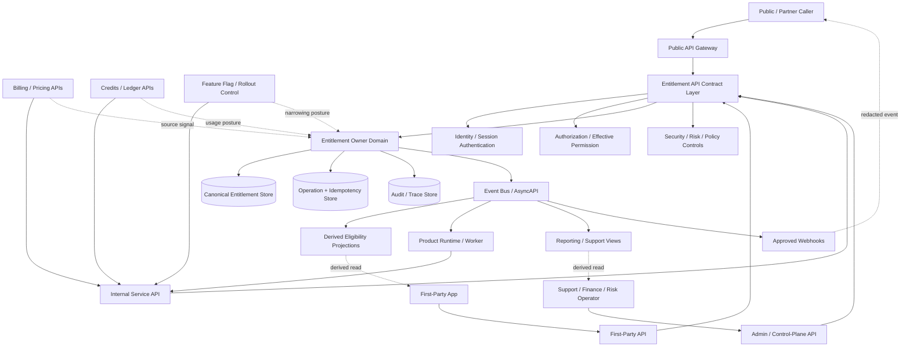
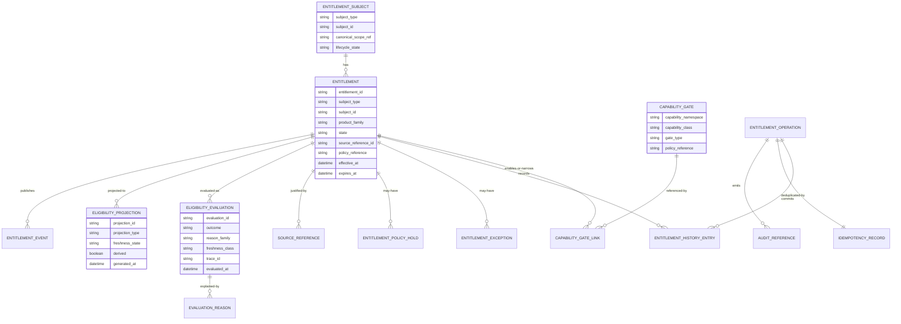
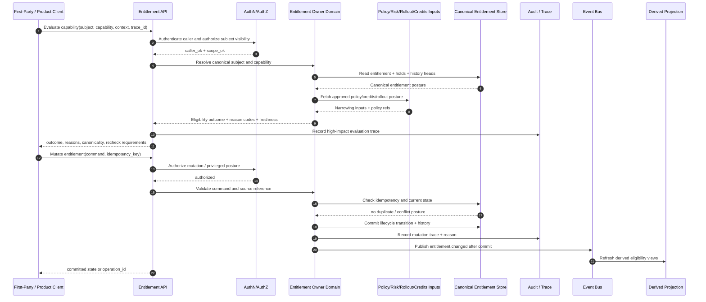

# FUZE Entitlement and Capability Gating API Specification

## Document Metadata

- **Document Name:** `ENTITLEMENT_AND_CAPABILITY_GATING_API_SPEC.md`
- **Document Type:** Production-grade API SPEC v2 / interface-contract specification
- **Status:** Draft for production API-spec inclusion
- **Version:** 2.0.0
- **Effective Date:** 2026-04-24
- **Last Updated:** 2026-04-24
- **Reviewed On:** 2026-04-24
- **Document Owner:** FUZE Platform Entitlement, Commerce, and Capability Architecture
- **Approval Authority:** FUZE Platform Architecture and Governance Authority
- **Review Cadence:** Quarterly or upon material change to entitlement semantics, product capability taxonomy, pricing, billing, credits, authorization, rollout, feature flags, audit, public API exposure, or support/control-plane remediation posture
- **Governing Layer:** API SPEC v2 / entitlement and capability-gating interface-contract layer
- **Parent Registry:** `API_SPEC_INDEX.md`
- **Upstream Semantic Registry:** `REFINED_SYSTEM_SPEC_INDEX.md`
- **Upstream API Registry:** `API_SPEC_INDEX.md`
- **Primary Audience:** Platform architecture, API design, backend engineering, product engineering, commerce and billing engineering, credits/ledger engineering, runtime/service authors, public API authors, support/control-plane tooling authors, audit, security, and implementation-contract authors
- **Primary Purpose:** Define FUZE API contracts for entitlement subject lookup, capability eligibility evaluation, entitlement mutation, entitlement history, exception/hold handling, and entitlement event propagation without redefining entitlement semantics or adjacent authorization, billing, credits, rollout, or product truth.
- **Primary Upstream References:**
  - `REFINED_SYSTEM_SPEC_INDEX.md`
  - `API_SPEC_INDEX.md`
  - `DOCS_SPEC_INDEX.md`
  - `SYSTEM_SPEC_INDEX.md`
  - `ENTITLEMENT_AND_CAPABILITY_GATING_SPEC.md`
  - `ACCESS_EVALUATION_AND_EFFECTIVE_PERMISSION_SPEC.md`
  - `ROLE_PERMISSION_AND_ACCESS_CONTROL_SPEC.md`
  - `SCOPED_AUTHORIZATION_MODEL_SPEC.md`
  - `WORKSPACE_AND_ORGANIZATION_SPEC.md`
  - `FUZE_WORKSPACE_ACCESS_CONTROL_BASICS_THESIS_FINAL_SPEC.md`
  - `FUZE_ACCOUNT_ACCESS_AND_SESSION_THESIS_FINAL_SPEC.md`
  - `FUZE_ACCOUNT_ACCESS_AND_SESSION_CANONICAL_FINAL_SPEC.md`
  - `SUBSCRIPTIONS_AND_USAGE_BILLING_SPEC.md`
  - `PLATFORM_CREDITS_SPEC.md`
  - `CREDIT_LEDGER_AND_SETTLEMENT_SPEC.md`
  - `PRICING_AND_MONETIZATION_MODEL_SPEC.md`
  - `PRODUCT_BOUNDARY_AND_DOMAIN_OWNERSHIP_SPEC.md`
  - `PRODUCT_ADMISSION_AND_EXPANSION_GATE_SPEC.md`
  - `FEATURE_FLAG_AND_ROLLOUT_CONTROL_SPEC.md`
  - `API_ARCHITECTURE_SPEC.md`
  - `PUBLIC_API_SPEC.md`
  - `INTERNAL_SERVICE_API_SPEC.md`
  - `EVENT_MODEL_AND_WEBHOOK_SPEC.md`
  - `IDEMPOTENCY_AND_VERSIONING_SPEC.md`
  - `MIGRATION_AND_BACKWARD_COMPATIBILITY_SPEC.md`
  - `AUDIT_LOG_AND_ACTIVITY_SPEC.md`
  - `SECURITY_AND_RISK_CONTROL_SPEC.md`
- **Primary Downstream Dependents:**
  - `PLATFORM_CREDITS_API_SPEC.md`
  - `CREDIT_LEDGER_AND_SETTLEMENT_API_SPEC.md`
  - `SUBSCRIPTIONS_AND_USAGE_BILLING_API_SPEC.md`
  - `PRICING_AND_MONETIZATION_MODEL_API_SPEC.md`
  - `AI_ORCHESTRATION_API_SPEC.md`
  - `MODEL_ROUTING_AND_CONTEXT_API_SPEC.md`
  - `AI_USAGE_METERING_API_SPEC.md`
  - `WORKFLOW_AND_AUTOMATION_API_SPEC.md`
  - `FEATURE_FLAG_AND_ROLLOUT_CONTROL_API_SPEC.md`
  - product-specific API contracts
  - entitlement-aware SDK/OpenAPI derivation
  - support/control-plane implementation contracts
  - audit/reporting projections
- **API Surface Families Covered:** first-party application APIs, internal service APIs, admin/control-plane APIs, event/async APIs, reporting/derived read APIs, limited public API exposure for caller-safe eligibility summaries where approved.
- **API Surface Families Excluded:** raw billing-provider callbacks, payment mutation APIs, credits-ledger mutation APIs, role/permission mutation APIs, identity/session mutation APIs, product-local UI state APIs, raw pricing-table management APIs, unrestricted public entitlement introspection.
- **Canonical System Owner(s):** FUZE Platform Entitlement, Commerce, and Capability Architecture for entitlement semantics; adjacent canonical owners remain authoritative for identity, session, workspace, authorization, billing, credits, rollout, audit, security, and product admission semantics.
- **Canonical API Owner:** FUZE Platform API Governance with FUZE Entitlement API owner-domain stewardship.
- **Supersedes:** Earlier entitlement, capability-access, plan-gating, and product-enablement API notes to the extent they conflict with this document.
- **Superseded By:** Not yet known.
- **Related Decision Records:** Not yet known.
- **Canonical Status Note:** This API specification expresses entitlement and capability-gating semantics as interface contracts. It does not create new business truth beyond the upstream refined entitlement specification.
- **Implementation Status:** Normative API baseline; downstream OpenAPI, AsyncAPI, SDK, storage, runtime, worker, and admin/control-plane contracts must conform.
- **Approval Status:** Drafted for architecture review; formal approval record not yet attached.
- **Change Summary:** Introduces API SPEC v2 structure for entitlement evaluation, subject lookup, mutation lifecycle, reason-coded outcomes, idempotency, public/internal/admin separation, event propagation, read-model discipline, and production-readiness tests.

## Purpose

This API specification defines how FUZE exposes, evaluates, mutates, observes, and propagates entitlement and capability-gating posture through API contracts.

It governs interface expression of the upstream entitlement model. The upstream refined entitlement specification owns the semantic truth that product eligibility, commercial eligibility, policy-based capability availability, credits-sensitive posture, rollout narrowing, operational restriction posture, and exception grants are not identity, authentication, session, membership, permission, billing, credits-ledger, feature-flag, or product-local UI truth.

This API specification exists so downstream services can ask and answer precise questions such as:

1. Which canonical subject is being evaluated?
2. Which product or capability class is being gated?
3. Is the subject eligible, ineligible, restricted, suspended, exhausted, review-required, or policy-blocked?
4. What reason family and policy/version references explain the result?
5. Is the answer canonical, derived, cached, stale, public-safe, or operator-only?
6. Is the API call merely accepting an entitlement mutation request, or has the canonical entitlement state changed?
7. Which surfaces may expose the outcome to users, services, operators, webhooks, SDKs, and reports?
8. Which adjacent domain remains authoritative where billing, credits, authorization, rollout, pricing, or product state is involved?

## Scope

This API spec governs:

- entitlement subject lookup APIs
- product and capability eligibility summary APIs
- high-fidelity capability evaluation APIs
- entitlement lifecycle mutation APIs where this domain owns the mutation
- policy hold, suspension, restriction, expiry, revocation, exception grant, and restoration API posture
- entitlement reason-code and history read APIs
- internal-service coordination APIs for billing, credits, product runtime, AI, workflow, rollout, and support systems
- admin/control-plane APIs for bounded, reason-coded entitlement intervention
- event and webhook posture for entitlement changes and eligibility-impacting outcomes
- request, response, error, status, idempotency, audit, migration, versioning, and SDK derivation requirements

## Out of Scope

This API spec does not govern:

- account identity creation or linking
- session issuance, refresh, invalidation, or privileged-session semantics
- workspace or organization lifecycle mutation
- role assignment, permission mapping, or final effective-permission evaluation
- subscription billing truth, invoice truth, payment provider truth, refund truth, or pricing catalog ownership
- credits-ledger balances, entries, accrual, burn, reservations, settlement, or reconciliation truth
- raw feature-flag or rollout assignment ownership
- product admission and expansion approval
- every numeric quota, price, plan, or product-specific capability definition
- raw data warehouse schemas or user-interface copy

## Design Goals

1. Preserve entitlement truth as separate from authorization, billing, credits, rollout, and UI truth.
2. Provide deterministic eligibility responses with stable machine-readable outcome and reason codes.
3. Ensure entitlement mutations are explicit, scoped, idempotent, auditable, and reason-coded.
4. Support account, workspace, organization, and approved platform-operational subject classes.
5. Support capability-class gating that is narrower than product enablement.
6. Distinguish accepted async mutation intent from final entitlement state.
7. Permit public or first-party summaries only where safe and bounded.
8. Ensure internal services can re-check eligibility safely before cost-bearing, sensitive, or deferred execution.
9. Prevent product-local shadow entitlement systems and hard-coded plan bypasses.
10. Provide enough contract detail to drive OpenAPI, AsyncAPI, SDK, runtime, audit, and QA implementation.

## Non-Goals

- Treating paid status as sufficient entitlement.
- Treating entitlement as authorization.
- Treating credits balance as permission or entitlement.
- Treating feature flags as commercial truth.
- Letting public APIs expose unrestricted entitlement detail.
- Providing generic update endpoints that can rewrite entitlement state without lifecycle semantics.
- Replacing implementation-contract specs, machine-readable OpenAPI/AsyncAPI definitions, database schemas, or runbooks.

## Core Principles

### Eligibility Is Not Authority

Entitlement APIs determine whether a subject is eligible for a product or capability class. They MUST NOT decide whether a specific actor has role/permission authority to execute a concrete action.

### Explicit Subject Attachment

Every entitlement API request MUST name or resolve a canonical subject class and subject identifier. Subjectless entitlement is forbidden.

### Product Enablement Is Not Full Capability Enablement

Product-level eligibility does not imply every premium, sensitive, cost-bearing, automation, export, admin, AI, chain-aware, or usage-banded capability.

### Commerce Basis Is Not Entitlement Truth

Billing, subscriptions, pricing, invoices, payment outcomes, and commercial contracts may justify entitlement mutation, but API consumers MUST NOT treat those upstream signals as canonical entitlement state until accepted by entitlement owner-domain APIs.

### Credits Posture Is Adjacent Truth

Credits balance, reservation, burn, and settlement truth remain owned by credits and ledger APIs. Entitlement APIs may return `exhausted`, `restricted`, or `usage_limited` posture only when a capability contract explicitly consumes credits posture.

### Rollout Narrows; It Does Not Grant Entitlement

Feature flags and rollout control may suppress or narrow exposure, but rollout APIs MUST NOT create hidden entitlement truth.

### Derived Views Are Not Canonical

Eligibility summaries, UI plan cards, dashboard views, SDK helpers, cached bundles, exports, analytics, and public-safe labels are derived unless explicitly documented as canonical reads from the entitlement owner domain.

### Fail Closed for Sensitive and Cost-Bearing Use

When required subject, capability, policy, freshness, or source lineage cannot be resolved safely, entitlement APIs MUST return a non-enable outcome for sensitive or cost-bearing behavior.

### Auditability and Traceability

Material entitlement mutations and high-impact evaluations MUST carry correlation, trace, actor, policy, source, and reason-code references.

## Canonical Definitions

- **Entitlement API:** An owner-domain or governed interface that reads, evaluates, mutates, or reports entitlement posture.
- **Entitlement Subject:** The canonical account, workspace, organization, or explicitly approved platform subject to which eligibility attaches.
- **Capability Gate:** A contract-level rule family for whether a capability class is eligible for a subject.
- **Eligibility Evaluation:** A deterministic API operation that converts subject, product/capability, entitlement state, policy, credits-aware posture, rollout narrowing, and freshness rules into an outcome.
- **Eligibility Outcome:** A machine-readable result such as `eligible`, `ineligible`, `restricted`, `suspended`, `expired`, `revoked`, `exhausted`, `review_required`, `policy_blocked`, or `subject_unresolved`.
- **Entitlement Mutation:** A canonical lifecycle transition such as create, activate, restrict, suspend, expire, revoke, restore, close, supersede, or attach exception.
- **Exception Grant:** A bounded, auditable, terminable eligibility grant whose source, reason, duration, approver, and subject scope are explicit.
- **Eligibility Summary:** A derived or bounded read model summarizing eligibility posture for UX, product runtime, or support usage.
- **Eligibility Operation:** A request tracked through `operation_id` when mutation, async validation, reconciliation, or workflow execution is required.

## Truth Class Taxonomy

API implementations MUST preserve these truth classes:

1. **Semantic Truth** — upstream entitlement and capability semantics owned by `ENTITLEMENT_AND_CAPABILITY_GATING_SPEC.md`.
2. **API Contract Truth** — request/response/error/status/idempotency/event contracts owned by this document.
3. **Canonical Entitlement Truth** — durable entitlement records, state transitions, subject attachments, capability links, policy holds, reason codes, source references, and history.
4. **Authorization Truth** — role, permission, scoped grant, and effective-permission outcomes owned by authorization/evaluation domains.
5. **Policy Truth** — risk, governance, abuse, compliance, containment, rollout, and review rules that may narrow or block eligibility.
6. **Commerce/Billing Truth** — subscription, invoice, payment, pricing, renewal, cancellation, grace, delinquency, and adjustment source signals.
7. **Credits/Ledger Truth** — credits balance, reservation, burn, accrual, settlement, and ledger lineage.
8. **Runtime Truth** — service execution, worker re-check, queue acceptance, cached evaluation state, and fallback posture.
9. **Provider/Input Truth** — raw provider, billing processor, external system, chain, or product inputs before owner-domain validation.
10. **Event/Async Truth** — accepted operations, event publication, delivery state, replay state, and workflow progression.
11. **Derived Read-Model Truth** — eligibility summaries, dashboards, support views, search indexes, exports, and cached bundles.
12. **Public/Reporting Truth** — bounded user-facing, partner-facing, or public-trust summaries.
13. **Presentation Truth** — UI copy, badge labels, disabled-state explanations, and operator display wording.

## Architectural Position in the Spec Hierarchy

This document is below the refined system registry and upstream entitlement semantics. It is beside the API architecture, public API, internal service API, event/webhook, idempotency/versioning, and migration/backward-compatibility API specs. It is upstream of machine-readable OpenAPI/AsyncAPI contracts, SDK helpers, product integration specs, runtime adapters, support/control-plane tooling, and derived reporting contracts.

## Upstream Semantic Owners

- `ENTITLEMENT_AND_CAPABILITY_GATING_SPEC.md` owns entitlement and capability-gating semantics.
- `ACCESS_EVALUATION_AND_EFFECTIVE_PERMISSION_SPEC.md` owns final action-level authorization outcomes.
- `ROLE_PERMISSION_AND_ACCESS_CONTROL_SPEC.md` owns structural authority and permission semantics.
- `WORKSPACE_AND_ORGANIZATION_SPEC.md` owns workspace/organization scope truth.
- `SUBSCRIPTIONS_AND_USAGE_BILLING_SPEC.md`, `PRICING_AND_MONETIZATION_MODEL_SPEC.md`, and payment-related specs own commercial basis signals.
- `PLATFORM_CREDITS_SPEC.md` and `CREDIT_LEDGER_AND_SETTLEMENT_SPEC.md` own credits and ledger truth.
- `FEATURE_FLAG_AND_ROLLOUT_CONTROL_SPEC.md` owns rollout and kill-switch semantics.
- `AUDIT_AND_ACCESS_TRACEABILITY_SPEC.md` and `AUDIT_LOG_AND_ACTIVITY_SPEC.md` own access and activity evidence posture.
- `SECURITY_AND_RISK_CONTROL_SPEC.md` owns risk, abuse, containment, and elevated security posture.

## API Surface Families

### Public API Surface

Public API exposure MUST be narrow. It MAY expose caller-safe eligibility summaries only for authenticated subjects and only when the caller is authorized to view the subject and the payload is public-safe or caller-scoped. It MUST NOT expose internal commercial basis, support exception lineage, policy-hold detail, abuse signals, or operator-only reason codes.

### First-Party Application API Surface

First-party applications MAY consume eligibility summaries and fine-grained capability evaluation outcomes for rendering, navigation, and safe action preflight. They MUST treat summaries as derived unless explicitly marked canonical and MUST re-check before sensitive or cost-bearing execution.

### Internal Service API Surface

Internal services MAY call high-fidelity evaluation APIs, subject lookup APIs, and mutation APIs only under explicit service identity, bounded scopes, on-behalf-of context where relevant, and trace/correlation requirements.

### Admin / Control-Plane API Surface

Admin/control APIs MAY create, suspend, restrict, restore, revoke, or correct entitlement posture only through bounded workflows with privileged authorization, reason codes, policy references, approval references where required, and durable audit lineage.

### Event / Webhook / Async API Surface

Entitlement changes SHOULD publish canonical events after owner-domain commits. Public webhooks MAY expose narrow downstream notifications only when approved and redacted. Events MUST NOT become mutation owners.

### Reporting / Derived API Surface

Reporting APIs MAY expose entitlement posture summaries, history projections, and support views. They MUST indicate derivedness, lag, and redaction and MUST NOT mutate canonical entitlement truth.

### Chain-Adjacent API Surface

Entitlement APIs MAY consume chain-adjacent or wallet-aware inputs only through normalized upstream domains. Raw chain observation MUST NOT create entitlement until owner-domain validation succeeds.

## System / API Boundaries

### This API Spec Governs

- allowed entitlement route families
- required request and response classes
- eligibility outcome and reason-code contract posture
- mutation lifecycle and accepted-state semantics
- event and webhook contract expectations
- audit, trace, idempotency, versioning, migration, security, and observability requirements

### Upstream Refined Specs Govern

- meaning of entitlement, capability, subject, product enablement, policy hold, credits-aware gating, exception, and derived view
- truth separation among entitlement, permission, billing, credits, rollout, and UI state
- canonical state transition posture and semantic invariants

### Adjacent API Specs Govern

- identity/account, auth/session, workspace/organization, role/permission, access evaluation, billing, credits, pricing, feature flag, workflow, event/webhook, audit, security, and public API contracts within their own domains

### Implementation-Contract Specs Govern

- exact OpenAPI schemas
- database tables and indexes
- service internals
- policy-engine expression syntax
- job queue mechanics
- storage partitioning
- observability pipeline implementation
- exact UI wording

## Adjacent API Boundaries

- Entitlement APIs MUST NOT mutate subscriptions, invoices, payment methods, prices, credits-ledger entries, role assignments, scoped grants, sessions, or workspace memberships.
- Billing and pricing APIs may request entitlement activation, restriction, or suspension but MUST do so through explicit entitlement command contracts.
- Credits APIs may provide usage posture inputs but MUST NOT be treated as entitlement mutation endpoints.
- Effective-permission APIs may consume entitlement outcomes but MUST NOT redefine eligibility.
- Feature-flag APIs may suppress exposure but MUST NOT create or rewrite entitlement records.
- Product APIs may request capability evaluation and cache derived results under policy but MUST NOT create shadow entitlement truth.

## Conflict Resolution Rules

When API inputs, sources, or surfaces conflict:

1. `REFINED_SYSTEM_SPEC_INDEX.md` and upstream refined entitlement semantics win.
2. Entitlement owner-domain canonical records outrank billing labels, pricing bundles, plan strings, frontend route availability, cache summaries, and product-local toggles.
3. Active policy hold, restriction, suspension, review, containment, or governance posture outranks ordinary active entitlement.
4. Credits-aware usage posture applies only where the capability contract explicitly requires it.
5. Rollout and feature-flag posture may narrow availability but cannot grant entitlement.
6. Effective-permission success cannot create entitlement.
7. Entitlement success cannot create role/permission authority.
8. Derived/read/reporting/public views cannot mutate or repair canonical entitlement state.
9. Ambiguous subject, scope, capability, source, or freshness MUST resolve conservatively.
10. Public contract convenience MUST NOT widen internal or canonical eligibility meaning.

## Default Decision Rules

- Missing or unresolved subject defaults to `subject_unresolved`, not eligibility.
- Wrong-subject evaluation is a contract error or denial-class outcome.
- Unknown capability defaults to `capability_unknown` or `ineligible`, not implicit access.
- Missing entitlement for a gated capability defaults to `ineligible` or `entitlement_missing`.
- Suspended, restricted, expired, revoked, or policy-held posture defaults to non-enable outcome even where stale cache says active.
- Organization-level entitlement does not automatically grant workspace capability unless inheritance is explicit.
- Workspace entitlement does not automatically grant personal account entitlement.
- Account entitlement does not automatically grant workspace-wide usage.
- Internal service calls default to least-privilege and must preserve actor-on-behalf-of context where user authority matters.
- Admin correction defaults to explicit, audited, reason-coded mutation rather than destructive rewrite.

## Roles / Actors / API Consumers

- **End User:** Authenticated user viewing or using eligible capabilities.
- **Workspace Member / Owner / Admin:** Actor operating inside a workspace or organization scope.
- **Product Runtime:** First-party or product service enforcing capability eligibility.
- **Internal Service Principal:** Service identity requesting high-fidelity evaluations or consuming events.
- **Commerce/Billing Service:** Adjacent domain requesting entitlement changes based on commercial state.
- **Credits/Ledger Service:** Adjacent domain providing credits-aware posture or consuming entitlement outcomes.
- **Feature Flag / Rollout Service:** Adjacent domain narrowing exposure.
- **Workflow / Worker Runtime:** Deferred executor re-checking eligibility at execution time.
- **Support Operator:** Privileged operator with bounded view/correction authority.
- **Finance Operator:** Privileged operator coordinating commercial remediation.
- **Risk / Security Reviewer:** Actor applying or reviewing holds and restrictions.
- **API / SDK Consumer:** Public or partner caller using approved external eligibility surfaces.
- **Audit / Reporting Consumer:** Read-only consumer of entitlement lineage or projections.

## Resource / Entity Families

### Canonical API Resources

- `entitlement_subject`
- `entitlement`
- `capability_gate`
- `capability_evaluation`
- `eligibility_summary`
- `entitlement_operation`
- `entitlement_event`
- `entitlement_history_entry`
- `entitlement_exception`
- `entitlement_policy_hold`
- `entitlement_source_reference`
- `entitlement_audit_reference`
- `eligibility_projection`

### Non-Canonical / Derived Resources

- `plan_badge`
- `feature_card`
- `support_summary`
- `capability_cache`
- `dashboard_metric`
- `eligibility_export`
- `public_eligibility_label`

Derived resources MUST include lineage, freshness, and derivedness indicators where material.

## Ownership Model

The entitlement API owner domain owns entitlement record mutation, subject attachment, capability eligibility evaluation, reason-code taxonomy, lifecycle status semantics, source-reference capture, and event publication after commit.

Adjacent domains own the facts they provide. The entitlement API MAY consume those facts through explicit references but MUST NOT mutate or redefine them.

## Authority / Decision Model

A successful entitlement API evaluation answers eligibility, not actor authority. Final action execution generally requires:

1. identity/session validity
2. resolved subject and scope
3. effective permission where actor authority matters
4. entitlement/capability eligibility where capability gating applies
5. product/object preconditions
6. policy/risk/rollout checks
7. runtime freshness checks

The API contract MUST allow downstream systems to distinguish each failure class when internal correctness or audit requires it.

## Authentication Model

- Public and first-party APIs require authenticated caller context unless a separately approved public-safe eligibility endpoint is defined.
- Internal APIs require service identity and explicit caller/service authorization.
- Admin/control APIs require privileged session posture or equivalent service-control assurance where applicable.
- Event consumers require subscription identity and delivery authentication.
- Webhooks MUST use approved signing or authentication posture and must not expose operator-only fields.

## Authorization / Scope / Permission Model

Entitlement API access is subject to authorization:

- Reading personal entitlement requires caller-self or delegated authorization.
- Reading workspace entitlement requires workspace-scope permission.
- Reading organization entitlement requires organization-scope permission or approved admin/service posture.
- Mutating entitlement requires entitlement-domain command permission plus any upstream commercial/control approval.
- Admin correction requires privileged control-plane permissions, reason code, and audit linkage.
- Internal service evaluation requires service identity scoped to the requesting use case.
- Public eligibility summaries require a narrowly approved contract and must not leak other subjects' commercial posture.

Entitlement success MUST NOT imply any of these permissions are granted.

## Entitlement / Capability-Gating Model

The API MUST represent:

- subject class and subject identifier
- product family
- capability namespace and capability class
- entitlement state
- capability state
- eligibility outcome
- reason family and reason code
- source references
- policy references
- credits-aware posture where relevant
- rollout narrowing posture where relevant
- exception and hold lineage
- evaluation timestamp and freshness metadata

## API State Model

### Entitlement States

- `pending_activation`
- `active`
- `restricted`
- `suspended`
- `expired`
- `revoked`
- `closed`
- `superseded`

### Capability Outcomes

- `eligible`
- `ineligible`
- `restricted`
- `suspended`
- `expired`
- `revoked`
- `exhausted`
- `review_required`
- `policy_blocked`
- `subject_unresolved`
- `capability_unknown`
- `source_unverified`

### Operation States

- `accepted`
- `validating`
- `awaiting_approval`
- `committed`
- `partially_committed`
- `rejected`
- `failed`
- `cancelled`
- `superseded`

Accepted operation state MUST NOT be presented as final entitlement success.

## Lifecycle / Workflow Model

1. Source domain identifies a possible entitlement change.
2. Entitlement API receives a command with source reference, subject, capability, intended lifecycle transition, reason, idempotency key, and correlation IDs.
3. API authenticates caller and authorizes the command.
4. API validates subject, capability namespace, source reference, policy posture, and conflict state.
5. API either commits synchronously or creates an `entitlement_operation`.
6. For async flows, validators, approvals, or workers finalize the operation.
7. Canonical state changes are appended with history and audit references.
8. Events are emitted after canonical commit.
9. Derived read models and caches refresh from events or owner-domain reads.
10. Product runtimes and workers re-check eligibility before sensitive/cost-bearing action.

## Architecture Diagram — Mermaid flowchart

## Data Design — Mermaid Diagram

## Flow View

### Synchronous Eligibility Evaluation

1. Caller submits subject, product/capability, action context, trace/correlation ID, and requested fidelity.
2. API authenticates caller and checks permission to evaluate or view the subject.
3. API resolves canonical subject and validates capability namespace.
4. API loads canonical entitlement records and relevant active holds/restrictions.
5. API consumes policy, credits-aware posture, and rollout narrowing only through approved interfaces or cached policy-safe references.
6. API constructs eligibility outcome and reason codes.
7. API emits audit/trace record for high-impact or sensitive evaluations.
8. API returns response with outcome, reason family, canonical/derived indicator, freshness, policy references, and recheck requirements.

### Entitlement Mutation

1. Caller submits command with transition, subject, capability, source reference, reason code, idempotency key, trace ID, and optional approval reference.
2. API authenticates and authorizes caller/service/control-plane actor.
3. API checks idempotency store.
4. API validates subject, capability namespace, source reference, policy constraints, existing state, and conflict rules.
5. API either commits synchronously or creates an accepted operation.
6. Canonical mutation appends history; destructive rewrite is forbidden except through explicit supersession/correction semantics.
7. API emits events after commit and updates derived projections.
8. API returns final state or operation reference.

### Failure / Retry / Degraded Mode

- Duplicate idempotency key returns the original result or current operation state.
- Missing source reference denies mutation.
- Stale derived caches are bypassed for sensitive/cost-bearing evaluation.
- If canonical entitlement store is unavailable, sensitive evaluation fails closed or returns degraded non-enable posture.
- If async finalization fails, operation state remains queryable with failure reason and remediation path.

### Admin / Operator Path

- Operator actions require privileged authorization, stronger session posture where applicable, reason code, policy reference, approval reference when required, and audit linkage.
- Admin APIs must be separate from ordinary first-party and public APIs.
- Support exceptions must be bounded by subject, capability, duration, reason, and termination conditions.

## Data Flows — Mermaid sequenceDiagram

## Request Model

### Common Headers

- `Authorization`
- `X-FUZE-Request-ID`
- `X-FUZE-Correlation-ID`
- `X-FUZE-Trace-ID`
- `Idempotency-Key` for side-effecting or replay-sensitive operations
- `X-FUZE-API-Version`
- `X-FUZE-Actor-On-Behalf-Of` for approved service-to-service actions
- `X-FUZE-Client-Surface` where surface-family enforcement is required

### Common Evaluation Request Fields

- `subject.type`
- `subject.id`
- `subject.scope_ref`
- `product_family`
- `capability.namespace`
- `capability.class`
- `evaluation_purpose`
- `requested_fidelity`
- `action_context`
- `freshness_requirement`
- `include_reason_detail`
- `include_operator_detail` only for authorized internal/admin callers
- `correlation_id`
- `trace_id`

### Common Mutation Request Fields

- `subject.type`
- `subject.id`
- `product_family`
- `capability.namespace`
- `capability.class`
- `transition`
- `desired_state`
- `source_reference`
- `reason_code`
- `policy_reference`
- `approval_reference`
- `effective_at`
- `expires_at`
- `supersedes_entitlement_id`
- `exception_bounds`
- `correlation_id`
- `trace_id`
- `idempotency_key`

## Response Model

### Common Success Response Fields

- `request_id`
- `correlation_id`
- `trace_id`
- `api_version`
- `resource_type`
- `canonicality` (`canonical`, `derived`, `projection`, `presentation`)
- `freshness`
- `subject`
- `product_family`
- `capability`
- `outcome` or `state`
- `reason_family`
- `reason_codes`
- `policy_references`
- `source_references`
- `audit_reference`
- `operation_id` where async
- `recheck_required`
- `expires_at` where applicable
- `warnings`

### Public-Safe Response Rules

Public or external responses MUST collapse sensitive details and MAY return:

- coarse outcome
- public-safe reason family
- retry/recheck posture
- documentation reference
- correlation/request reference

They MUST NOT expose internal policy IDs, abuse indicators, support exception detail, billing delinquency detail, operator notes, or other protected fields unless explicitly approved for the surface.

## Error / Result / Status Model

### Error Classes

- `authentication_required`
- `authorization_denied`
- `subject_unresolved`
- `subject_scope_mismatch`
- `capability_unknown`
- `entitlement_missing`
- `entitlement_restricted`
- `entitlement_suspended`
- `entitlement_expired`
- `entitlement_revoked`
- `entitlement_exhausted`
- `policy_blocked`
- `review_required`
- `source_reference_invalid`
- `transition_invalid`
- `state_conflict`
- `idempotency_conflict`
- `rate_limited`
- `surface_not_allowed`
- `derived_view_stale`
- `canonical_store_unavailable`
- `operation_pending`
- `operation_failed`

### Status Semantics

- `200 OK` for successful reads/evaluations.
- `201 Created` for synchronous creation where canonical resource is created.
- `202 Accepted` only when operation is accepted but final state is not complete.
- `207 Multi-Status` MAY be used for batch evaluations with mixed outcomes.
- `400 Bad Request` for structurally invalid requests.
- `401 Unauthorized` for missing/invalid authentication.
- `403 Forbidden` for caller not authorized to read/mutate/evaluate.
- `404 Not Found` only when not leaking subject existence; otherwise use safe denial class.
- `409 Conflict` for state or idempotency conflicts.
- `422 Unprocessable Entity` for semantically invalid transition or source reference.
- `429 Too Many Requests` for rate limits.
- `503 Service Unavailable` for degraded canonical dependencies with fail-closed posture.

## Idempotency / Retry / Replay Model

- All entitlement mutations MUST require idempotency keys.
- Idempotency scope MUST include caller/service identity, subject, transition, product/capability, and source reference.
- Replayed equivalent commands MUST return the original result or current operation state.
- Replayed conflicting commands with the same idempotency key MUST return `idempotency_conflict`.
- Event publication MUST be replay-safe and include stable event IDs.
- Async finalizers MUST be idempotent and must not produce duplicate entitlement state transitions.
- Evaluation reads MAY be retryable without idempotency keys but MUST not mutate canonical state except trace/audit records where configured.

## Rate Limit / Abuse-Control Model

- Public and first-party eligibility summary APIs MUST be rate-limited by caller, subject, workspace/org, capability, and IP/device where relevant.
- Internal service APIs MUST be quota-governed by service identity and purpose.
- Admin/control mutation APIs MUST have stricter throttles, anomaly detection, and approval gates.
- Enumeration-resistant behavior is required for subject and capability lookups.
- Suspicious probing of plan/capability boundaries MUST be observable and enforceable.

## Endpoint / Route Family Model

Exact paths are implementation-contract details, but route families MUST follow these patterns.

### Evaluation Routes

- `POST /entitlements/evaluations`
- `POST /entitlements/evaluations:batch`
- `GET /subjects/{subject_type}/{subject_id}/eligibility-summary`
- `GET /subjects/{subject_type}/{subject_id}/capabilities/{capability_namespace}/{capability_class}`

### Canonical Entitlement Read Routes

- `GET /subjects/{subject_type}/{subject_id}/entitlements`
- `GET /entitlements/{entitlement_id}`
- `GET /entitlements/{entitlement_id}/history`

### Mutation Routes

- `POST /entitlements`
- `POST /entitlements/{entitlement_id}:activate`
- `POST /entitlements/{entitlement_id}:restrict`
- `POST /entitlements/{entitlement_id}:suspend`
- `POST /entitlements/{entitlement_id}:restore`
- `POST /entitlements/{entitlement_id}:revoke`
- `POST /entitlements/{entitlement_id}:expire`
- `POST /entitlements/{entitlement_id}:close`
- `POST /entitlements/{entitlement_id}:supersede`

### Exception / Hold Routes

- `POST /entitlements/{entitlement_id}/exceptions`
- `POST /entitlements/{entitlement_id}/exceptions/{exception_id}:terminate`
- `POST /entitlements/{entitlement_id}/policy-holds`
- `POST /entitlements/{entitlement_id}/policy-holds/{hold_id}:clear`

### Operation Routes

- `GET /entitlement-operations/{operation_id}`
- `POST /entitlement-operations/{operation_id}:cancel` where cancellation is policy-allowed

### Admin / Control Routes

Admin routes MUST live under a separate control-plane namespace, for example:

- `POST /admin/entitlements/{entitlement_id}:correct`
- `POST /admin/entitlements/{entitlement_id}:emergency-suspend`
- `POST /admin/entitlements/{entitlement_id}:attach-source-reference`
- `GET /admin/entitlements/{entitlement_id}/operator-history`

### Reporting / Projection Routes

- `GET /reports/entitlements/summary`
- `GET /reports/entitlements/changes`
- `GET /support/subjects/{subject_type}/{subject_id}/eligibility-inspection`

Reporting and support routes MUST be marked derived or privileged as applicable.

## Public API Considerations

Public eligibility APIs MUST be narrow, stable, and safe. They SHOULD avoid exposing detailed commercial reasons unless a product contract requires it. They MUST NOT include operator notes, internal source references, exception details, or protected policy-hold data. Public APIs MUST return stable error classes without enabling subject enumeration or commercial-status inference beyond approved caller scope.

## First-Party Application API Considerations

First-party apps MAY use eligibility summaries for rendering disabled states, upgrade prompts, and safe navigation. First-party UI MUST NOT treat rendered availability as final authority. Before cost-bearing or sensitive execution, backend services MUST use high-fidelity evaluation or canonical owner-domain checks.

## Internal Service API Considerations

Internal service APIs MUST preserve service identity, actor-on-behalf-of context, correlation ID, trace ID, purpose, and subject/capability specificity. Services MUST NOT use entitlement APIs as broad write shortcuts. Internal APIs may request richer reason detail than public APIs but only within least-privilege bounds.

## Admin / Control-Plane API Considerations

Admin APIs MUST:

- be separate from ordinary application routes
- require stronger authorization and privileged posture
- require reason codes
- capture policy and approval references
- preserve audit lineage
- support bounded correction, not hidden destructive rewrite
- avoid broad generic update endpoints
- enforce dual control where policy requires it
- produce events and trace records after material commits

## Event / Webhook / Async API Considerations

### Canonical Event Families

- `entitlement.created`
- `entitlement.activated`
- `entitlement.restricted`
- `entitlement.suspended`
- `entitlement.restored`
- `entitlement.expired`
- `entitlement.revoked`
- `entitlement.closed`
- `entitlement.superseded`
- `entitlement.exception_granted`
- `entitlement.exception_terminated`
- `entitlement.policy_hold_applied`
- `entitlement.policy_hold_cleared`
- `entitlement.capability_outcome_changed`

Events MUST include stable identifiers, subject reference, product/capability reference, state transition, reason family, source reference, correlation ID, audit reference, version, and redaction class. Public webhook payloads MUST be narrower and explicitly approved.

## Chain-Adjacent API Considerations

Where entitlement construction depends on wallet-aware or chain-adjacent inputs, APIs MUST consume normalized upstream outputs such as wallet-link truth, snapshot/eligibility pipeline outputs, registry publication truth, or payout-cycle eligibility references. Raw chain observations, token balances, or wallet claims MUST NOT become entitlement state without owner-domain validation.

## Data Model / Storage Support Implications

Canonical storage MUST support:

- durable entitlement records
- subject references
- capability gate references
- lifecycle state history
- policy holds
- exception grants
- source references
- idempotency records
- operation records
- audit references
- event publication outbox
- projection lineage
- migration/supersession metadata

Storage implementation MUST NOT make derived views or product-local caches authoritative.

## Read Model / Projection / Reporting Rules

Derived read models MAY exist for product UX, support consoles, billing reconciliation, credits-aware capacity summaries, audit review, public-safe summaries, analytics, and migration dashboards.

They MUST:

- identify derivedness where material
- preserve source lineage
- represent lag/freshness
- avoid merging entitlement, permission, billing, credits, and rollout into one ambiguous status
- be regenerable from canonical owner-domain records
- not mutate canonical state
- preserve correction and supersession lineage

## Security / Risk / Privacy Controls

- Entitlement detail may reveal sensitive commercial, operational, or policy information and MUST be protected by surface-specific data minimization.
- Admin/operator detail MUST be shielded from public and first-party payloads.
- Internal service calls MUST be least-privileged and observable.
- Enumeration resistance is required for subject and capability lookups.
- Sensitive mutation routes require anomaly detection and reason-code completeness.
- Policy holds and abuse/risk states must use protected response detail.
- Fail-closed behavior is mandatory when canonical safety cannot be determined.

## Audit / Traceability / Observability Requirements

Material mutations MUST record:

- actor/service identity
- on-behalf-of actor where relevant
- subject
- product/capability
- transition
- previous and new state
- reason code
- source reference
- policy reference
- approval reference
- idempotency key hash/reference
- correlation ID
- trace ID
- timestamp
- event IDs emitted

High-impact evaluations MUST produce audit or trace records sufficient to reconstruct decision inputs, freshness, and outcome.

Metrics SHOULD include evaluation volume, denial reasons, stale-cache avoidance, mutation success/failure, idempotency replays, policy holds, admin interventions, event delivery, projection lag, and degraded-mode outcomes.

## Failure Handling / Edge Cases

- Missing subject: `subject_unresolved`
- Subject mismatch: `subject_scope_mismatch`
- Capability unknown: `capability_unknown`
- Entitlement exists for account but request is workspace scoped: deny or explicit no-borrow outcome
- Workspace entitlement exists but actor lacks permission: entitlement may be eligible; final action must deny via effective-permission layer
- Billing is paid but entitlement not active: non-enable until entitlement owner-domain state is active
- Credits balance depleted for credits-sensitive capability: `exhausted` where capability contract requires it
- Rollout disabled: ineligible or restricted due to rollout narrowing without changing entitlement truth
- Cache stale: re-check canonical owner-domain state before sensitive execution
- Concurrent mutation: return conflict or accepted operation with deterministic ordering
- Policy hold present: return non-enable outcome and protected reason detail
- Canonical store unavailable: fail closed for sensitive/cost-bearing execution

## Migration / Versioning / Compatibility / Deprecation Rules

- API versions MUST preserve outcome classes and reason families or provide explicit migration mapping.
- Deprecated plan-label or feature-toggle endpoints MUST be migrated to entitlement summary/evaluation APIs.
- Breaking changes to capability namespace, outcome semantics, subject model, or error classes require compatibility window and migration guide.
- Legacy product-local entitlement stores must be reconciled into canonical entitlement records or explicitly classified as non-canonical derived inputs.
- New capability classes must be registered with durable namespace and ownership metadata before public or first-party exposure.
- Public APIs must evolve more conservatively than internal APIs and must not expose unstable internal reason codes.

## OpenAPI / AsyncAPI / SDK Derivation Rules

OpenAPI/SDK derivation MUST preserve:

- surface family classification
- canonical vs derived read markers
- subject typing
- capability namespace/class
- outcome enums
- reason-family enums
- error classes
- idempotency headers
- correlation and trace IDs
- `202 Accepted` vs final success semantics
- redaction classes
- authorization scopes
- versioning metadata

AsyncAPI derivation MUST preserve event IDs, event type, subject, product/capability, state transition, reason family, source reference, audit reference, correlation/trace IDs, schema version, and redaction/public-safety classification.

SDK helpers MUST NOT collapse `restricted`, `suspended`, `exhausted`, `review_required`, `policy_blocked`, and `ineligible` into a single boolean where the caller needs deterministic handling.

## Implementation-Contract Guardrails

- No generic `PATCH /entitlements/{id}` for sensitive state mutation unless it maps to explicit lifecycle transition semantics.
- No hidden admin toggle may activate a product or capability without source, reason, policy, and audit references.
- No UI route availability may act as entitlement truth.
- No product-local allow-list may bypass canonical entitlement APIs for shared platform capabilities.
- No internal service may infer entitlement solely from plan name, invoice status, pricing bundle, feature flag, or credits balance.
- No async worker may execute cost-bearing capability solely from enqueue-time eligibility when policy requires re-check.
- No reporting projection may “correct” entitlement state by rewriting canonical meaning.

## Downstream Execution Staging

1. Define capability namespace registry and subject model contract.
2. Implement read/evaluation APIs before broad product integration.
3. Implement mutation workflows with idempotency and source references.
4. Add admin/control routes with reason-coded audit posture.
5. Add event publication and projection refresh.
6. Migrate legacy product gating and plan-badge assumptions.
7. Harden SDK/OpenAPI/AsyncAPI artifacts.
8. Add contract validation and regression test suites.
9. Gate public API exposure until redaction and abuse controls pass review.

## Required Downstream Specs / Contract Layers

- Machine-readable OpenAPI for entitlement read/evaluation/mutation/admin surfaces
- AsyncAPI for entitlement lifecycle events
- Capability namespace registry contract
- Entitlement reason-code catalog
- Public-safe response redaction guide
- Admin/control-plane workflow implementation contract
- Product runtime enforcement adapter contract
- Billing-to-entitlement source-reference contract
- Credits-to-entitlement posture contract
- Rollout-to-entitlement narrowing contract
- Audit evidence mapping contract

## Boundary Violation Detection / Non-Canonical API Patterns

Forbidden patterns include:

- `isPaid=true` used as entitlement truth
- plan-name string checks in product runtime
- frontend feature-bundle inference as canonical eligibility
- support-only hidden allow-list
- product-local permanent entitlement table for shared capabilities
- direct billing webhook activating product without entitlement owner-domain validation
- credits balance used as permission
- role assignment used as entitlement
- entitlement success used as authorization success
- public API exposing internal policy-hold detail
- async worker skipping required eligibility re-check
- derived reporting table used as mutation source
- generic admin update endpoint without reason-coded lifecycle semantics

## Canonical Examples / Anti-Examples

### Canonical Example — Workspace Premium Export

A workspace has active product entitlement and a narrower `export.premium` capability. A workspace member requests export. The product backend calls effective-permission for actor authority and entitlement evaluation for workspace capability eligibility. Both must pass before export proceeds.

### Anti-Example — Billing Plan Name Shortcut

A product reads `plan_name = "pro"` from a billing projection and enables premium export without entitlement evaluation. This is forbidden because billing/projection truth is not entitlement truth.

### Canonical Example — Credits-Sensitive AI Capability

A workspace has AI product entitlement, but a high-cost model route is credits-sensitive. Entitlement evaluation returns `exhausted` when credits posture does not meet the capability contract. The AI runtime must not execute the high-cost request.

### Anti-Example — Entitlement as Permission

A user is in a workspace with active entitlement but lacks permission to run an admin-level capability. The action must be denied by effective-permission evaluation. Entitlement MUST NOT create actor authority.

### Canonical Example — Support Exception

Support creates a temporary, bounded capability exception for a workspace after approval. The API records subject, capability, reason, source, approver, expiry, audit reference, and event emission. The exception terminates automatically at expiry.

## Acceptance Criteria

1. Entitlement evaluation APIs return stable outcome enums and reason families for eligible, ineligible, restricted, suspended, expired, revoked, exhausted, review-required, policy-blocked, subject-unresolved, and capability-unknown cases.
2. Public and first-party APIs never expose operator-only reason detail, internal policy-hold detail, abuse signals, or sensitive commercial source references.
3. Mutation APIs require idempotency keys and return deterministic results for equivalent replay.
4. Conflicting replay with the same idempotency key returns `idempotency_conflict`.
5. Entitlement mutations cannot proceed without explicit subject, product/capability, transition, source reference, reason code, and trace/correlation references.
6. Admin/control mutations are isolated from ordinary application routes and require privileged authorization.
7. Billing paid status alone cannot activate entitlement without owner-domain mutation.
8. Credits balance alone cannot produce actor authority or entitlement except through an explicit capability contract.
9. Feature-flag rollout may narrow exposure but cannot create entitlement.
10. Workspace entitlement and account entitlement remain distinguishable in request/response schemas.
11. Organization-level entitlement inheritance requires explicit API-represented linkage.
12. Derived eligibility summaries identify freshness and canonicality.
13. Sensitive and cost-bearing execution uses fresh evaluation or documented policy-safe cache limits.
14. Events are emitted only after canonical commit.
15. Async accepted mutation responses include `operation_id` and do not claim final business success.
16. Batch evaluation returns per-target outcomes and does not collapse mixed results into a broad allow.
17. Audit records can reconstruct material mutation lineage.
18. OpenAPI/SDK artifacts preserve outcome classes and do not collapse them into unsafe booleans.
19. Migration plans map legacy plan-gating endpoints to canonical entitlement route families.
20. Boundary-violation tests reject product-local shadow entitlement shortcuts.

## Test Cases

### Positive Path

1. Active workspace entitlement and active capability returns `eligible` with canonical freshness.
2. Account-scoped entitlement evaluates eligible only for the account subject.
3. Workspace-scoped entitlement evaluates eligible for workspace subject and does not imply personal account entitlement.
4. Bounded exception grant returns eligible until expiry and then returns expired/restricted outcome.
5. Billing service submits activation command with valid source reference and idempotency key; canonical entitlement becomes active and event emits.

### Negative Path

6. Missing subject returns `subject_unresolved`.
7. Unknown capability returns `capability_unknown`.
8. Suspended entitlement returns `suspended` even if cached summary says active.
9. Revoked entitlement cannot be treated as active by derived projection.
10. Public caller querying another workspace subject receives authorization denial or safe not-found behavior.

### Authorization / Scope Tests

11. User with entitlement but without required permission is blocked by effective-permission layer.
12. User with permission but missing entitlement receives entitlement-missing/ineligible outcome for gated capability.
13. Internal service call without approved service identity is denied.
14. Admin correction without privileged posture is denied.
15. Organization entitlement without explicit workspace inheritance does not grant workspace capability.

### Idempotency / Retry / Replay Tests

16. Duplicate activation command with same idempotency key returns original result.
17. Same idempotency key with different subject returns `idempotency_conflict`.
18. Async finalizer replay does not duplicate state history.
19. Event replay uses same event ID and does not duplicate projection state.
20. Network retry after `202 Accepted` can query operation by `operation_id`.

### Conflict / Concurrency Tests

21. Concurrent suspend and restore operations resolve deterministically or return conflict.
22. Activation attempted against revoked/closed entitlement fails unless supersession workflow is used.
23. Policy hold added during evaluation causes non-enable outcome.
24. Derived cache stale beyond policy threshold forces canonical re-check.
25. Batch evaluation returns mixed per-capability outcomes.

### Rate Limit / Abuse Tests

26. Repeated public subject probing is rate-limited and observable.
27. Capability enumeration attempt receives safe errors without leaking protected catalog data.
28. Admin mass mutation attempt triggers stricter throttling or approval.
29. Internal service exceeds purpose quota and is denied/rate-limited.
30. Suspicious support exception volume creates audit/security signal.

### Failure / Degraded Mode Tests

31. Canonical entitlement store unavailable returns fail-closed for sensitive execution.
32. Projection service lag does not change canonical evaluation.
33. Billing source unavailable prevents activation from unsupported source.
34. Credits posture unavailable returns non-enable for credits-required capability unless policy explicitly allows degraded mode.
35. Event bus outage preserves outbox for later replay and does not claim external delivery success.

### Audit / Observability Tests

36. Material mutation includes actor, source, reason, policy, idempotency, audit, correlation, and trace references.
37. High-impact evaluation trace can reconstruct outcome inputs.
38. Admin emergency suspension produces protected operator history.
39. Public response includes request/correlation reference without exposing sensitive internal detail.
40. Metrics capture evaluation outcomes, denial families, projection lag, idempotency replay, and mutation failures.

### Migration / Compatibility Tests

41. Legacy `plan_name` gate cannot be used as canonical eligibility in contract tests.
42. Deprecated capability alias maps to canonical namespace or returns compatibility error.
43. New API version preserves reason-family mapping.
44. SDK helper preserves non-boolean outcome detail.
45. Public API versioning prevents breaking enum changes without migration window.

### Boundary-Violation Tests

46. Product-local allow-list for shared capability is rejected in architecture review.
47. Direct payment callback cannot activate entitlement without entitlement command.
48. Role assignment cannot create entitlement.
49. Entitlement cannot grant workspace admin permission.
50. Reporting projection cannot mutate canonical entitlement state.

## Dependencies / Cross-Spec Links

- Depends on refined entitlement semantics for truth ownership.
- Depends on access evaluation for action-level authority.
- Depends on role/permission API for structural authorization.
- Depends on workspace/org API for subject scope.
- Depends on billing/pricing APIs for commercial source signals.
- Depends on credits/ledger APIs for credits-aware posture.
- Depends on feature-flag/rollout API for narrowing posture.
- Depends on API architecture, public/internal API, event/webhook, idempotency/versioning, and migration API specs for cross-cutting interface rules.
- Depends on audit/security specs for evidence and risk posture.

## Explicitly Deferred Items

- Exact numeric plan, quota, and pricing values.
- Exact implementation of capability namespace registry storage.
- Exact policy-engine DSL.
- Exact vendor/payment-provider callback schema.
- Exact UI copy for upgrade, denial, suspension, or exhaustion messaging.
- Exact BI warehouse schemas.
- Exact OpenAPI/AsyncAPI machine-readable files.
- Exact support staffing and approval roster.

## Final Normative Summary

Entitlement and capability-gating APIs MUST expose eligibility truth without collapsing it into identity, authentication, session, membership, authorization, billing, credits, rollout, feature flags, product UI, or reporting projections.

Entitlement APIs MUST be subject-explicit, capability-explicit, reason-coded, auditable, idempotent for mutation, fail-closed for sensitive ambiguity, and clear about canonical vs derived reads.

Public and first-party API surfaces MUST remain narrower than internal and admin surfaces. Admin/control APIs MUST be separate, privileged, bounded, reason-coded, policy-constrained, and audited. Events and webhooks communicate committed outcomes; they do not become mutation owners.

Downstream OpenAPI, AsyncAPI, SDK, product runtime, worker, admin, reporting, and migration contracts MUST preserve these boundaries.

## Quality Gate Checklist

- [x] Upstream refined semantic owners are explicit.
- [x] Canonical API owner is explicit.
- [x] API surface families are explicit.
- [x] Mutation boundaries are explicit.
- [x] Read boundaries are explicit.
- [x] Adjacent API boundaries are explicit.
- [x] Truth classes are explicit.
- [x] Conflict-resolution rules are explicit.
- [x] Default decision rules are explicit.
- [x] Public, first-party, internal, admin/control, event/webhook, reporting, and chain-adjacent distinctions are explicit where relevant.
- [x] Non-canonical API patterns are called out.
- [x] Operator/admin override paths are bounded, reason-coded, and audited.
- [x] Read-model, cache, reporting, and projection rules are explicit.
- [x] Chain-adjacent responsibilities are explicit where relevant.
- [x] Accepted-state vs final success semantics are explicit.
- [x] Idempotency and replay requirements are explicit.
- [x] Request, response, error, result, and status classes are explicit.
- [x] Failure and degraded-mode behaviors are explicit.
- [x] Audit, traceability, and observability requirements are explicit.
- [x] Versioning, migration, compatibility, and deprecation rules are explicit.
- [x] OpenAPI / AsyncAPI / SDK guardrails are explicit.
- [x] Dependencies and downstream impacts are explicit.
- [x] Non-goals and deferred items are explicit.
- [x] Architecture Diagram uses Mermaid `flowchart`.
- [x] Architecture Diagram clarifies consumers, surfaces, owner domains, services, stores, events, projections, and downstream consumers.
- [x] Data Design diagram uses Mermaid syntax.
- [x] Data Design distinguishes canonical and derived objects.
- [x] Flow View includes synchronous, async, failure, retry, audit, admin/operator, and finalization paths.
- [x] Data Flow uses Mermaid `sequenceDiagram`.
- [x] Data Flow distinguishes accepted-state responses from final outcomes.
- [x] Acceptance Criteria are concrete and testable.
- [x] Test Cases cover positive, negative, authorization, entitlement, idempotency, retry, conflict, rate-limit, degraded-mode, audit, migration, and boundary-violation behavior.
