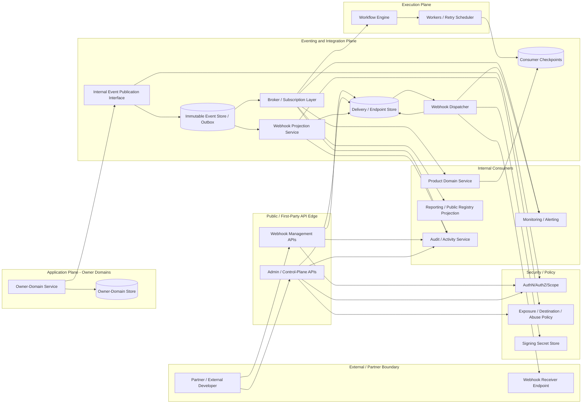
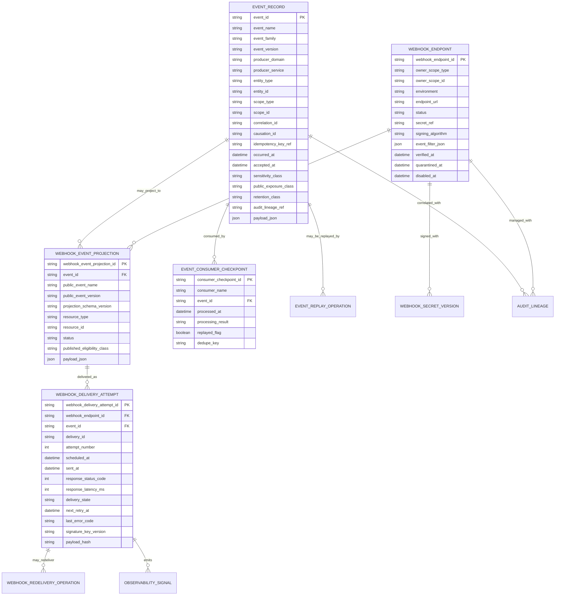
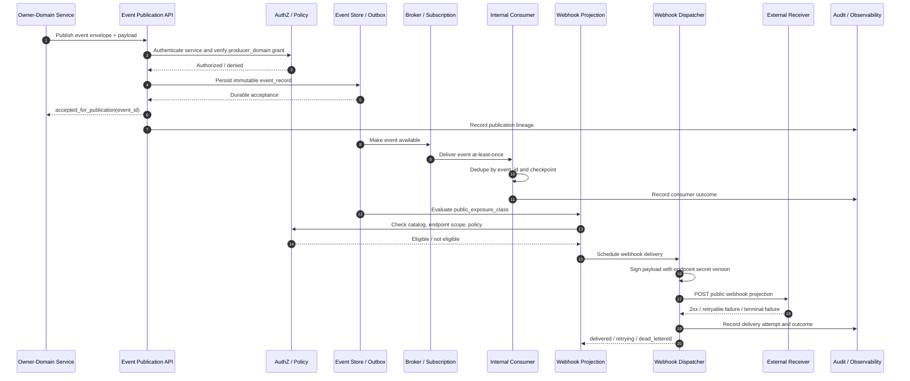

# FUZE Event Model and Webhook API Specification

## Document Metadata

- **Document Name:** `EVENT_MODEL_AND_WEBHOOK_SPEC.md`
- **Document Type:** FUZE API SPEC v2 / production-grade interface-contract specification
- **Status:** Draft production API specification pending FUZE approval workflow
- **Version:** 2.0.0
- **Effective Date:** 2026-04-24
- **Last Updated:** 2026-04-24
- **Reviewed On:** 2026-04-24
- **Document Owner:** FUZE Platform Eventing and Webhook Governance Domain; named individual owner not explicitly specified in retrieved governing materials
- **Approval Authority:** FUZE platform architecture / API governance approval workflow; named approval authority not explicitly specified in retrieved governing materials
- **Review Cadence:** Review whenever event semantics, webhook exposure posture, public API posture, internal service posture, replay/idempotency posture, migration/versioning posture, security controls, delivery infrastructure, or public trust publication rules materially change
- **Governing Layer:** API SPEC v2 interface-contract layer for event-driven APIs, webhook-management APIs, internal event interfaces, outbound webhook contracts, and AsyncAPI/OpenAPI derivation guardrails
- **Parent Registry:** `API_SPEC_INDEX.md` for v1 API-family source material and the API SPEC v2 canonical file registry supplied in the production prompt
- **Upstream Semantic Registry:** `REFINED_SYSTEM_SPEC_INDEX.md`
- **Upstream API Registry:** `API_SPEC_INDEX.md`
- **Primary Audience:** Platform architecture, backend engineering, integration engineering, API contract authors, AsyncAPI/OpenAPI authors, SDK authors, workflow/runtime engineering, queue/worker engineering, public API governance, security, audit, operations, support/control-plane operators, product integration teams
- **Primary Purpose:** Define the production-grade FUZE API contract posture for internal events, integration events, operational events, webhook management APIs, outbound webhook delivery contracts, replay/redelivery controls, event projection boundaries, and implementation-contract derivation without redefining refined event semantics or owner-domain truth
- **Primary Upstream References:** `REFINED_SYSTEM_SPEC_INDEX.md`, `API_SPEC_INDEX.md`, `DOCS_SPEC_INDEX.md`, `SYSTEM_SPEC_INDEX.md`, `EVENT_MODEL_AND_WEBHOOK_SPEC.md`, `API_ARCHITECTURE_SPEC.md`, `PUBLIC_API_SPEC.md`, `INTERNAL_SERVICE_API_SPEC.md`, `IDEMPOTENCY_AND_VERSIONING_SPEC.md`, `MIGRATION_AND_BACKWARD_COMPATIBILITY_SPEC.md`, `WORKFLOW_AND_AUTOMATION_SPEC.md`, `JOB_QUEUE_AND_WORKER_SPEC.md`, `AUDIT_LOG_AND_ACTIVITY_SPEC.md`, `SECURITY_AND_RISK_CONTROL_SPEC.md`, `MONITORING_ALERTING_AND_INCIDENT_RESPONSE_SPEC.md`, `SECRETS_CONFIG_AND_ENVIRONMENT_SPEC.md`, `PUBLIC_CONTRACT_AND_WALLET_REGISTRY_SPEC.md`, `TRANSPARENCY_REPORTING_SPEC.md`, `FUZE_ACCOUNT_ACCESS_AND_SESSION_THESIS_FINAL_SPEC.md`, `FUZE_ACCOUNT_ACCESS_AND_SESSION_CANONICAL_FINAL_SPEC.md`, `FUZE_WORKSPACE_ACCESS_CONTROL_BASICS_THESIS_FINAL_SPEC.md`
- **Primary Downstream Dependents:** domain event catalogs, webhook event catalogs, internal broker contracts, event outbox implementations, webhook dispatchers, webhook endpoint-management APIs, delivery-attempt stores, consumer checkpoint implementations, replay/redelivery tooling, AsyncAPI files, OpenAPI files for webhook management APIs, public SDKs, partner integration contracts, observability dashboards, support tooling, migration plans, contract validation suites
- **API Surface Families Covered:** internal event publication, internal event consumption, event outbox/store access, event projection, webhook endpoint management, outbound webhook delivery, redelivery/replay control, delivery-observability reads, admin/control remediation APIs, AsyncAPI derivation, OpenAPI derivation for management routes
- **API Surface Families Excluded:** arbitrary public subscription to all internal events, ordinary public REST resource APIs outside webhook management, domain-specific business mutation APIs, workflow-state APIs, queue lease APIs, audit-log APIs, full notification-copy APIs, direct database schemas, exact broker-vendor configuration, smart-contract ABI definitions
- **Canonical System Owner(s):** Owner domains own business event meaning; Platform Eventing and Webhook Governance owns shared event/webhook contract posture; Integration/Webhook domain owns external webhook projection and delivery posture; Audit domain owns audit records; Security/Risk owns destination, secret, and abuse controls; Migration/Versioning owns contract evolution posture
- **Canonical API Owner:** FUZE Platform Eventing and Webhook API Governance Domain
- **Supersedes:** API v1 / pre-v2 interpretations that treat events as transport-only messages, mirror internal events as public webhooks, treat audit/activity records as event contracts, let queue/workflow infrastructure redefine business event meaning, or treat webhook delivery success/failure as owner-domain business success/failure
- **Superseded By:** None currently defined
- **Related Decision Records:** Not explicitly specified in retrieved materials
- **Canonical Status Note:** This document is the API SPEC v2 interface-contract expression of the refined FUZE event and webhook semantics. Refined system specs remain authoritative for semantic truth. This API spec governs the API contract layer and downstream machine-readable contract derivation.
- **Implementation Status:** Normative target for implementation planning and contract validation; downstream implementation status not explicitly specified
- **Approval Status:** Draft pending explicit FUZE approval workflow
- **Change Summary:** Converts the refined FUZE Event Model and Webhook system specification into a production-grade API SPEC v2 contract document; adds route/resource family posture, request/response/error/status classes, idempotency/replay rules, public/internal/admin/event distinctions, diagrams, flow views, acceptance criteria, test cases, and derivation guardrails.

---

## Purpose

This API specification defines how FUZE expresses the refined event model and webhook architecture at the interface-contract layer.

It governs how FUZE APIs, internal services, brokers, outboxes, webhook-management routes, dispatchers, replay tooling, AsyncAPI artifacts, OpenAPI artifacts, SDKs, and partner contracts MUST represent event and webhook behavior while preserving refined system semantics.

This document does **not** own the semantic meaning of domain events. The refined system specifications and owner-domain specifications own semantic truth. This document owns the API contract expression of that truth.

The event and webhook API layer exists to ensure that:

1. owner-domain events are emitted only by the domains that own the business meaning;
2. event records are durable, immutable, classified, versioned, traceable, and replay-safe;
3. internal event consumers receive contracts that are richer than public webhooks but still bounded by least privilege;
4. public webhooks are curated outbound projections, not raw mirrors of internal event truth;
5. webhook endpoint-management APIs are authenticated, authorized, idempotent, audited, scoped, and abuse-resistant;
6. redelivery and replay create lineage-bearing operational effects, not new business facts;
7. downstream OpenAPI, AsyncAPI, SDK, broker, worker, and dispatcher contracts cannot reinterpret event meaning, exposure class, or mutation authority.

---

## Scope

This specification governs the API contract posture for:

- internal event publication interfaces;
- internal event-consumption contracts;
- event envelopes and minimum contract metadata;
- event outbox / event store interaction contracts;
- consumer checkpoint and replay-safe consumption requirements;
- event classification, versioning, payload discipline, exposure classification, and timing semantics;
- webhook projection eligibility and projection contract rules;
- webhook endpoint-registration, verification, update, disablement, secret-rotation, delivery-list, and redelivery route families;
- outbound webhook delivery envelope, signing, retry, and delivery-attempt posture;
- admin/control-plane remediation APIs for quarantine, disablement, replay, redelivery, and policy override;
- error/result/status classes for event and webhook APIs;
- idempotency, retry, replay, deduplication, ordering, and compatibility rules;
- audit, traceability, correlation, observability, and migration requirements;
- AsyncAPI/OpenAPI/SDK derivation guardrails.

---

## Out of Scope

This specification does not define:

- every domain-specific event payload field;
- every event name in every FUZE domain event catalog;
- the exact broker product, queue vendor, storage engine, signature library, or infrastructure topology;
- queue lease, heartbeat, backoff, dead-letter, or worker implementation details beyond interface contract implications;
- workflow-instance meaning or workflow-step semantics;
- audit-log schema beyond required correlation and lineage references;
- public notification copy, email copy, or frontend activity-feed wording;
- exact SDK package structure;
- exact OpenAPI or AsyncAPI files;
- direct database DDL;
- smart-contract ABI definitions or chain-native event definitions.

These concerns belong in adjacent implementation contracts, provided they preserve this document's normative rules.

---

## Design Goals

1. Preserve owner-domain mutation and event-publication boundaries.
2. Make event and webhook contracts durable, versioned, replay-safe, and auditable.
3. Distinguish domain events, integration events, operational events, and public webhook projections.
4. Prevent public webhooks from becoming broad external mirrors of internal events.
5. Prevent event receipt from becoming hidden write authority.
6. Represent accepted async intent separately from final business outcomes.
7. Treat at-least-once delivery, duplicate delivery, and replay as expected conditions.
8. Ensure webhook-management APIs are idempotent, scoped, policy-governed, and auditable.
9. Support future AsyncAPI/OpenAPI/SDK generation without semantic drift.
10. Provide enough testable contract detail for implementation QA, production readiness, and regression validation.

---

## Non-Goals

This specification is not intended to:

- make every internal event externally subscribable;
- promise exactly-once delivery;
- replace owner-domain APIs with event publication;
- allow consumers to mutate foreign owner-domain state merely because an event was received;
- convert audit records, activity feeds, reporting rows, or dashboards into canonical event contracts;
- expose governance-sensitive, treasury-sensitive, fraud-sensitive, payout-sensitive, or unpublished economic internals through public webhooks by default;
- allow queue/workflow/broker implementation details to define business event meaning;
- guarantee global total ordering across FUZE event families;
- use webhook delivery success or failure to determine whether the underlying business fact occurred.

---

## Core Principles

### Owner-Domain Event Principle

Only the domain that owns a business fact or accepted intent MAY emit the canonical event describing that fact or accepted intent.

### Event-Is-Not-Write-Authority Principle

Receiving an event does not grant mutation authority over the underlying domain truth. Consumers MUST use owner-domain APIs or approved internal contracts for any downstream mutation.

### Internal-Is-Broader-Than-Public Principle

Internal event families MAY be richer than public webhooks. Public webhook exposure MUST remain narrower, explicitly approved, stable, and public-safe.

### Accepted-vs-Final Principle

Accepted intent, in-progress operational state, and final business outcome are different meanings and MUST NOT be collapsed in event names, payloads, statuses, responses, or webhook projections.

### Immutable-Envelope Principle

Accepted event envelopes are immutable historical records. Corrections occur through later events or explicit correction/remediation lineage, not through destructive rewrite.

### Derived-Public-Projection Principle

Webhook payloads are derived, externally supported projections of internal truth. They are not the canonical owner-domain record and MUST NOT become hidden mutation owners.

### Normalization-Before-Influence Principle

Provider callbacks, partner signals, chain observations, and other external inputs MUST remain provider-input truth until normalized and accepted by the appropriate owner domain.

### Replay-Safe Principle

Replay, retry, duplicate delivery, and redelivery are ordinary operating conditions. Contracts MUST be safe under at-least-once handling.

### Sensitive-Surface Restraint Principle

Control-sensitive, fraud-sensitive, treasury-sensitive, governance-sensitive, payout-sensitive, and unpublished economic event families default to internal-only exposure and narrower consumption grants.

### Auditability Principle

Publication, projection, dispatch, replay, redelivery, quarantine, disablement, secret rotation, and override actions MUST be reconstructible through durable lineage.

---

## Canonical Definitions

- **Domain Event:** A canonical event emitted by the owner domain to represent an accepted intent or business fact under that domain's semantic ownership.
- **Integration Event:** A stable internal coordination event derived from owner-domain truth for downstream collaboration without ownership transfer.
- **Operational Event:** An event describing execution-plane or operational progression, such as queued, running, retrying, failed, canceled, quarantined, or completed operational states.
- **Public Webhook Event:** A curated external projection of an approved internal event or owner-domain outcome.
- **Event Envelope:** The metadata wrapper that gives an event identity, classification, lineage, timing, version, and handling context.
- **Event Payload:** The event body describing the fact, accepted intent, operational transition, or projection content.
- **Webhook Projection:** The externally supported representation of internal event truth after public-safety filtering, schema shaping, and version assignment.
- **Consumer Checkpoint:** A durable consumer-local record used for dedupe, progress tracking, and replay-safe consumption.
- **Replay:** Bounded reprocessing of previously accepted event records while preserving original event identity and marking replay lineage.
- **Redelivery:** Bounded re-attempt of outbound webhook dispatch for an already projected external event. Redelivery creates new delivery attempts, not new business events.
- **Public Exposure Class:** Contract classification determining whether and how an internal event may be externally projected.
- **Delivery Attempt:** A single outbound attempt to deliver a webhook projection to a registered endpoint.
- **Webhook Endpoint:** A registered external destination owned by an account, workspace, or partner scope.
- **Webhook Event Catalog:** The approved externally supported event-family list, schema versions, exposure rules, and compatibility posture.

---

## Truth Class Taxonomy

This API spec MUST preserve these truth classes:

| Truth Class | Owner | API Contract Treatment |
|---|---|---|
| Semantic truth | Owner domain and refined system specs | API contracts express but do not redefine event meaning. |
| API contract truth | Event/Webhook API governance | Defines surfaces, envelopes, errors, versions, route families, and derivation rules. |
| Policy truth | Security, public API, event governance, migration/versioning, owner domains | Determines exposure class, subscription eligibility, retention, replay, compatibility, and destination rules. |
| Runtime truth | Dispatcher, broker, workflow, queue, worker, and eventing implementations | Exposed as status, delivery, retry, checkpoint, and operation records without redefining business truth. |
| Ledger / storage truth | Event store, outbox, delivery store, checkpoint store | Durable event, projection, delivery, replay, and idempotency records. |
| Provider-input truth | Integration/provider normalization domains | Raw callbacks/signals before owner-domain validation; not canonical business events. |
| Event / async execution truth | Eventing, workflow, queue, and worker domains | Distinguishes accepted, queued, running, completed, failed, and replayed operational meanings. |
| Projection/reporting truth | Reporting, transparency, public registry, dashboards | Derived and read-only unless a narrower spec grants a write path. |
| Public read-model truth | Public API / publication domains | Public webhook payloads and registry outputs are curated projections, not raw owner-domain storage. |
| Presentation truth | UI/SDK/support views | Labels and copy are non-canonical. |

Truth classes MUST remain separate. No broker, gateway, SDK, dashboard, webhook, activity feed, or reporting view may become the owner of semantic truth.

---

## Architectural Position in the Spec Hierarchy

This API spec sits below the refined semantic layer and expresses its requirements at the API contract layer.

### Upstream Semantic Owners

- `EVENT_MODEL_AND_WEBHOOK_SPEC.md` owns canonical event and webhook system semantics.
- `API_ARCHITECTURE_SPEC.md` owns shared interface-family posture, accepted-state semantics, and API boundary discipline.
- `PUBLIC_API_SPEC.md` owns public/external contract posture and external exposure constraints.
- `INTERNAL_SERVICE_API_SPEC.md` owns service-to-service caller identity, internal authorization, and internal contract posture.
- `IDEMPOTENCY_AND_VERSIONING_SPEC.md` owns replay-safe handling, version classes, conflict interpretation, and contract evolution posture.
- `MIGRATION_AND_BACKWARD_COMPATIBILITY_SPEC.md` owns coexistence, cutover, deprecation, sunset, supersession, and historical interpretability.
- Owner-domain refined specs own domain-specific business meaning and lifecycle semantics.
- Security, audit, monitoring, secrets, workspace access, account/session, and entitlement specs own their respective cross-cutting policy meanings.

### What This API Spec Governs

This document governs API contract expression: route families, event envelope requirements, webhook-management contracts, delivery contracts, error/status semantics, idempotency/replay treatment, authorization expectations, audit references, derived/public projection limits, and implementation-contract derivation guardrails.

### What Adjacent API Specs Govern

- `PUBLIC_API_SPEC.md` governs non-webhook public route families and external API publication posture.
- `INTERNAL_SERVICE_API_SPEC.md` governs synchronous service-to-service APIs and owner-domain service collaboration.
- `IDEMPOTENCY_AND_VERSIONING_SPEC.md` governs cross-cutting replay and version semantics.
- `MIGRATION_AND_BACKWARD_COMPATIBILITY_SPEC.md` governs version transitions and coexistence.
- `INTEGRATION_CONNECTOR_FRAMEWORK_API_SPEC.md` governs connector/provider integration families beyond the event/webhook contract layer.

### What Implementation-Contract Specs Govern

Implementation-contract specs MAY define broker topics, storage schemas, TTLs, exact retry schedules, SDK package shapes, route-by-route payload schemas, and operational runbooks, but they MUST preserve the semantic and API contract rules here.

---

## API Surface Families

### 1. Internal Event Publication Surface

Used by authenticated owner-domain services and approved worker classes to publish accepted event records.

- **Surface Type:** internal service / eventing capability
- **Allowed Callers:** owner-domain services or delegated services with explicit publish grants
- **Forbidden Callers:** public clients, frontend clients, unscoped internal services, reporting dashboards, external providers before normalization
- **Canonical Write Owner:** producer owner domain for event meaning; eventing platform for envelope and persistence contract
- **Contract Mode:** internal, durable, replay-aware, non-public

### 2. Internal Event Consumption Surface

Used by authenticated services/workers to consume event families under least-privilege grants.

- **Surface Type:** internal broker/pull/subscription contract
- **Allowed Callers:** internal services and workers with family/topic grants
- **Delivery Posture:** at-least-once; duplicate delivery expected
- **Consumer Obligation:** idempotent handling and checkpointing

### 3. Event Store / Outbox Surface

Durable persistence and retrieval for accepted event records, replay windows, and publication lineage.

- **Surface Type:** internal implementation-facing contract
- **Allowed Callers:** eventing infrastructure, replay tooling, authorized admin/control surfaces, observability readers
- **Forbidden Use:** direct domain-state mutation or public raw event-store access

### 4. Webhook Projection Surface

Transforms approved internal event truth into externally supported public webhook payloads.

- **Surface Type:** internal projection contract
- **Allowed Callers:** webhook projection service and approved publication services
- **Canonical Owner:** webhook/integration governance for projection shape; owner domain for underlying semantic meaning
- **Projection Rule:** public payloads MUST be derived and filtered; not raw event payload mirrors

### 5. Webhook Management API Surface

Authenticated API route family for endpoint registration, verification, update, disablement, secret rotation, delivery visibility, and redelivery.

- **Surface Type:** public/authenticated public/partner/admin route family
- **Allowed Callers:** account/workspace/partner owners with scope grants, first-party clients, approved admin/control actors
- **Mutation Posture:** idempotent, audited, reason-coded where sensitive
- **Authorization:** owner scope or explicit admin/control authorization

### 6. Outbound Webhook Delivery Surface

FUZE-to-external HTTP delivery contract for approved webhook projections.

- **Surface Type:** outbound external delivery contract
- **Allowed Sender:** FUZE webhook dispatcher
- **Receiver Obligation:** verify signature, tolerate duplicate delivery, handle unknown additive fields according to version rules
- **Delivery Posture:** at-least-once with bounded retry and delivery attempt tracking

### 7. Admin / Control-Plane Eventing Surface

Privileged API families for quarantine, forced disablement, bounded replay, redelivery, policy override, endpoint suspension, and emergency suppression.

- **Surface Type:** admin/control-plane
- **Allowed Callers:** approved support/security/platform operators or automation under policy
- **Requirements:** reason code, actor attribution, policy version, audit record, correlation ID, bounded scope

### 8. Event / Webhook Catalog Surface

Internal and public-safe contract artifacts describing supported event families, versions, exposure classes, and lifecycle status.

- **Surface Type:** documentation / catalog / machine-readable contract artifact
- **Allowed Consumers:** internal services, contract generators, SDKs, partner docs where public-safe
- **Rule:** catalogs describe supported contracts; they do not confer mutation authority.

---

## System / API Boundaries

### Public vs Internal Boundary

Internal events are not public APIs. Public webhook payloads are curated derived projections and MUST NOT expose all internal event metadata, sensitive fields, raw policy evaluation, provider internals, workflow internals, fraud indicators, treasury controls, governance-sensitive state, or unpublished economic details.

### Event vs Internal Service API Boundary

Events are asynchronous notifications of accepted intents, facts, or operational state. They are not substitutes for owner-domain APIs. If a consumer must mutate another domain's truth, it MUST call an approved owner-domain API or submit an approved accepted intent.

### Event vs Audit Boundary

Events and audit records are correlated but not interchangeable. Events coordinate downstream behavior; audit records preserve evidentiary lineage for actions, policy decisions, and privileged operations. Audit logs may reference events, but an audit entry is not an event contract.

### Event vs Workflow / Queue Boundary

Workflow and queue systems MAY emit operational events, but they do not own business-event meaning unless they are the owner domain for that operational truth. Queue retry does not define business retry semantics.

### Event vs Reporting / Projection Boundary

Reports, dashboards, status pages, public registries, and transparency artifacts MAY derive from events. They MUST NOT become hidden mutation owners or redefine event truth.

### Event vs Provider / Chain Boundary

Provider callbacks and chain observations are provider-input truth until normalized and accepted by the owner domain. Chain-native facts remain chain-native; off-chain event projections MUST NOT misrepresent on-chain truth.

---

## Adjacent API Boundaries

- `PUBLIC_API_SPEC.md` governs external route exposure; this spec governs outbound webhook projection and delivery.
- `INTERNAL_SERVICE_API_SPEC.md` governs synchronous service collaboration; this spec governs asynchronous event collaboration.
- `IDEMPOTENCY_AND_VERSIONING_SPEC.md` governs replay identity and version compatibility; this spec applies those rules to events and webhooks.
- `MIGRATION_AND_BACKWARD_COMPATIBILITY_SPEC.md` governs coexistence/cutover/deprecation for event and webhook versions.
- `WORKFLOW_AND_AUTOMATION_SPEC.md` governs workflow meaning; this spec governs event notifications emitted around workflow states.
- `JOB_QUEUE_AND_WORKER_SPEC.md` governs queue mechanics; this spec governs contract-level event implications of queue-driven execution.
- `SECURITY_AND_RISK_CONTROL_SPEC.md` governs destination restrictions, secret handling, sensitive topic classification, and abuse response.
- `AUDIT_LOG_AND_ACTIVITY_SPEC.md` governs immutable audit evidence and activity-feed derivations.

---

## Conflict Resolution Rules

1. Active refined registry and constitutional/spec-index materials win over narrower API documents.
2. Owner-domain refined specs win on domain business meaning and mutation authority.
3. `EVENT_MODEL_AND_WEBHOOK_SPEC.md` wins on event classification, envelope immutability, webhook projection posture, replay/redelivery semantics, and public-exposure discipline.
4. This API spec wins on interface-contract requirements for event/webhook APIs and downstream OpenAPI/AsyncAPI derivation.
5. `PUBLIC_API_SPEC.md` wins on external route exposure outside webhook-specific outbound contracts.
6. `INTERNAL_SERVICE_API_SPEC.md` wins on synchronous service-to-service API semantics.
7. `IDEMPOTENCY_AND_VERSIONING_SPEC.md` wins on replay identity, conflict semantics, and version taxonomy.
8. `MIGRATION_AND_BACKWARD_COMPATIBILITY_SPEC.md` wins on coexistence, cutover, sunset, and migration lineage.
9. Workflow, queue, dashboard, SDK, gateway, broker, or frontend convenience never wins over owner-domain truth or event contract rules.
10. When ambiguity remains, FUZE MUST choose the more conservative architecture-consistent interpretation and escalate the ambiguity into downstream refinement or a recorded decision.

---

## Default Decision Rules

1. Event publication defaults to internal-only unless public exposure is explicitly approved.
2. Canonical business events default to owner-domain publication after acceptance or commit.
3. Public webhooks default to minimal, stable, identifier-forward projections.
4. Delivery defaults to at-least-once, never exactly-once.
5. Consumers default to idempotent and replay-safe behavior.
6. Webhook endpoint mutations default to idempotency-required.
7. Redelivery defaults to creating a new delivery attempt for the same event/projection lineage.
8. Replay defaults to preserving original event identity with explicit replay context.
9. Sensitive event families default to non-public exposure and restricted internal grants.
10. If an event contract cannot name owner domain, event class, truth class, version, exposure class, payload stability posture, retention posture, and replay posture, it is incomplete and MUST NOT ship as production-grade.

---

## Roles / Actors / API Consumers

### Human Actors

- account owners
- workspace owners and administrators
- partner operators
- support operators
- security operators
- product operators
- governance or approval actors
- external developers consuming webhook contracts

### System Actors

- owner-domain services
- product domain services
- integration adapters
- provider normalization services
- workflow engines
- queues and workers
- AI orchestration services
- event outbox/store
- internal event consumers
- webhook projection service
- webhook dispatcher
- delivery retry scheduler
- audit service
- monitoring and alerting systems
- public registry and transparency systems
- admin/control-plane tooling
- SDK and contract-generation pipelines

### Caller Classes

- `owner_domain_service`
- `delegated_domain_service`
- `internal_consumer_service`
- `workflow_worker`
- `webhook_endpoint_owner`
- `partner_integrator`
- `support_operator`
- `security_operator`
- `control_plane_automation`
- `contract_generator`

---

## Resource / Entity Families

### Event Resources

- `event_record`
- `event_envelope`
- `event_payload`
- `event_family`
- `event_version`
- `event_catalog_entry`
- `event_publication_attempt`
- `event_replay_operation`

### Consumer Resources

- `event_subscription`
- `event_consumer_checkpoint`
- `event_consumer_failure`
- `consumer_deduplication_record`

### Webhook Resources

- `webhook_endpoint`
- `webhook_endpoint_secret_version`
- `webhook_endpoint_verification`
- `webhook_subscription_filter`
- `webhook_event_projection`
- `webhook_delivery`
- `webhook_delivery_attempt`
- `webhook_redelivery_operation`
- `webhook_quarantine`

### Governance / Lineage Resources

- `correlation_reference`
- `causation_reference`
- `audit_lineage_reference`
- `policy_version_reference`
- `idempotency_reference`
- `contract_version_reference`
- `migration_reference`
- `operator_reason_code`

---

## Ownership Model

### Owner Domain Owns

- event semantic meaning;
- accepted intent or business fact represented by domain events;
- domain-specific payload fields;
- domain-specific equivalence rules for idempotent publication;
- domain-specific event timing semantics;
- authoritative lifecycle meaning.

### Eventing Governance Owns

- event envelope structure;
- shared publication discipline;
- event class taxonomy;
- event persistence posture;
- shared replay and consumer checkpoint expectations;
- event catalog governance;
- contract-level event version posture.

### Webhook / Integration Governance Owns

- webhook projection eligibility;
- public webhook payload shape conventions;
- endpoint-management route posture;
- delivery-attempt semantics;
- outbound signing and delivery contract rules;
- redelivery posture;
- webhook catalog governance.

### Security / Risk Owns

- destination allow/deny policy;
- signing secret constraints;
- sensitive topic restrictions;
- abuse response;
- endpoint quarantine policy;
- rate-limit and threat controls.

### Audit Owns

- immutable audit records for management actions, privileged reads, replay, redelivery, quarantine, endpoint changes, secret rotation, and policy overrides.

### Consumer Domains Own

- consumer checkpoint state;
- idempotent processing decisions;
- downstream side effects within their domain;
- failure handling for their own event handlers.

---

## Authority / Decision Model

### Authority to Publish Events

A caller MAY publish an event only when all conditions hold:

1. caller authenticates as a service principal or approved worker class;
2. caller is the owner domain or has explicit delegated publish authority;
3. owner-domain action has been accepted or committed;
4. required envelope fields are present;
5. event class, version, sensitivity, exposure, retention, and replay posture are known;
6. publication can be durably persisted before acknowledgement.

### Authority to Consume Events

A service MAY consume an event family only when:

1. service identity is authenticated;
2. service has explicit event-family, domain, topic, or exposure-class grants;
3. consumer contract is compatible with event version;
4. consumer accepts idempotent and replay-safe processing obligations;
5. sensitive topics are permitted by trust tier and policy.

### Authority to Project Public Webhooks

An event MAY be projected into a public webhook only when:

1. exposure class explicitly permits external projection;
2. public webhook catalog contains the event family and version;
3. payload can be filtered into a stable public contract;
4. projection does not expose restricted internals;
5. target endpoint is registered, verified, active, scoped, and eligible;
6. subscription filters match;
7. delivery policy permits dispatch.

### Authority to Administer Endpoints / Deliveries

Endpoint disablement, forced quarantine, forced redelivery, forced replay, and policy override MUST be admin/control-plane actions requiring reason code, actor attribution, policy version, audit lineage, and bounded scope.

---

## Authentication Model

### Internal Publication

- MUST authenticate using service principal identity.
- MUST NOT rely solely on network location, broker access, or shared infrastructure trust.
- MUST include `producer_service`, `producer_domain`, environment, and contract version context.

### Internal Consumption

- MUST authenticate using service principal identity or worker identity.
- MUST enforce event-family/topic grants.
- MUST enforce sensitivity and exposure-class constraints.

### Webhook Management APIs

- User or partner callers MUST authenticate through approved account/session/public API mechanisms.
- Admin/control callers MUST authenticate through privileged admin/control mechanisms.
- Workspace-scoped endpoint operations MUST resolve workspace membership, role, permission, and effective scope.

### Outbound Webhook Delivery

- FUZE MUST sign outbound webhook requests.
- Receivers authenticate FUZE by verifying the signature and timestamp against the endpoint secret.
- Secret rotation MUST support explicit key-version metadata and configured overlap windows.

---

## Authorization / Scope / Permission Model

Webhook-management permissions MUST distinguish:

- endpoint create;
- endpoint read;
- endpoint update;
- endpoint verify;
- endpoint disable;
- endpoint secret rotate;
- delivery list/read;
- delivery redeliver;
- quarantine read;
- quarantine override;
- endpoint force-disable;
- sensitive diagnostic view.

Required scope dimensions include, where applicable:

- `account_id`;
- `workspace_id`;
- `partner_id`;
- `environment` (`sandbox`, `production`);
- `event_family`;
- `public_event_name`;
- `sensitivity_class`;
- `operation_class`;
- `admin_control_tier`.

Authorization MUST be evaluated before side effects occur. Delivery reads MUST redact sensitive headers, response bodies, secrets, provider internals, and unsupported internal diagnostics.

---

## Entitlement / Capability-Gating Model

Entitlement MAY determine whether a workspace, account, product, or partner can register webhook endpoints or subscribe to specific webhook families. Entitlement does not redefine event meaning.

- A caller without entitlement MUST receive a structured denial.
- Loss of entitlement MAY disable future deliveries according to policy but MUST NOT rewrite historical event records.
- Entitlement changes MUST be auditable when they affect webhook eligibility or delivery.

---

## API State Model

### Event Lifecycle

`candidate -> accepted_for_publication -> persisted -> available_for_consumption -> consumed | replayed | archived`

### Publication Attempt Lifecycle

`received -> validated -> durably_persisted -> acknowledged | rejected | conflicted | failed_retryable | failed_terminal`

### Consumer Processing Lifecycle

`available -> claimed | delivered -> processing -> checkpointed_success | checkpointed_failure | retry_pending | dead_lettered`

### Webhook Endpoint Lifecycle

`draft -> verification_pending -> verified -> active -> quarantined | disabled | retired`

### Webhook Projection Lifecycle

`not_eligible -> eligible -> projected -> scheduled -> dispatched -> delivered | retrying | suppressed | dead_lettered | expired`

### Delivery Attempt Lifecycle

`scheduled -> sent -> acknowledged | retryable_failure | terminal_failure | expired`

### Redelivery Operation Lifecycle

`requested -> authorized -> accepted -> scheduled -> attempted -> completed | rejected | expired`

### Contract Version Lifecycle

`draft -> active -> deprecated -> sunset_scheduled -> retired -> historical_readable_only`

---

## Lifecycle / Workflow Model

1. Owner domain accepts or commits a meaningful fact or accepted intent.
2. Owner domain calls internal event publication interface with envelope, payload, classification, version, and lineage.
3. Eventing layer authenticates caller, validates publish authority, validates envelope, deduplicates where applicable, and persists `event_record` durably.
4. Eventing layer acknowledges durable acceptance, not universal downstream completion.
5. Internal consumers receive or pull the event under service identity and event-family grants.
6. Consumers process idempotently, checkpoint result, and emit downstream events only within their own owner-domain authority.
7. Projection layer evaluates exposure class, catalog eligibility, endpoint subscriptions, policy, and payload filter rules.
8. Webhook projection is created for eligible events.
9. Dispatcher signs and delivers payload to verified active endpoints.
10. Delivery attempts are tracked with retry, failure, quarantine, and redelivery eligibility state.
11. Audit and observability records preserve lineage across publication, projection, delivery, redelivery, replay, and admin/control actions.
12. Migration/versioning rules govern changes to event versions, webhook versions, and deprecation/sunset posture.

---

## Architecture Diagram — Mermaid flowchart

---

## Data Design — Mermaid Diagram

---

## Flow View

### A. Internal Event Publication Flow

1. Owner-domain service completes or accepts a meaningful domain action.
2. Service builds event envelope with `event_id`, `event_name`, `event_version`, `producer_domain`, lineage, timestamps, entity references, classification, and payload.
3. Publication interface authenticates the service principal.
4. Eventing layer verifies producer authority for the declared domain.
5. Eventing layer validates envelope, payload class, version, retention, exposure, and idempotency reference.
6. Eventing layer persists event record before acknowledgement.
7. API returns durable publication acknowledgement.
8. Broker/subscription layer makes event available to internal consumers.
9. Audit and observability signals are emitted.

### B. Internal Consumption Flow

1. Consumer authenticates as service/worker principal.
2. Consumer requests/pulls/subscribes to authorized event family.
3. Eventing layer enforces event-family grants and sensitivity constraints.
4. Consumer receives event under at-least-once semantics.
5. Consumer dedupes by `event_id` and consumer-specific dedupe key.
6. Consumer applies idempotent side effects only within its own domain authority.
7. Consumer writes checkpoint and emits audit/observability signals where required.
8. On retryable failure, event remains eligible for retry according to policy.
9. On terminal failure, failure is recorded and escalated/dead-lettered according to implementation contract.

### C. Webhook Endpoint Registration Flow

1. Authenticated caller submits endpoint registration with idempotency key.
2. Public/authenticated API resolves account/workspace/partner scope.
3. Authorization, entitlement, destination policy, event subscription catalog, environment separation, and abuse controls are evaluated.
4. Endpoint record is created in `verification_pending` or `active` state according to verification policy.
5. Secret reference is created; raw secret is returned only when policy explicitly allows one-time reveal.
6. Audit and activity records are written.
7. Verification challenge MAY be queued.
8. Response returns endpoint summary, status, secret metadata, and verification requirements.

### D. Webhook Delivery Flow

1. Event projection service determines event is externally eligible.
2. Projection payload is generated using public webhook catalog version.
3. Endpoint subscriptions and filters are matched.
4. Dispatcher schedules delivery attempts.
5. Dispatcher signs payload with active endpoint secret version.
6. Receiver response is recorded.
7. Success marks delivery attempt acknowledged; retryable failure schedules retry; terminal failure may suppress, dead-letter, or quarantine according to policy.
8. Delivery failure does not roll back the event or underlying business fact.

### E. Redelivery Flow

1. Authorized caller requests redelivery for an eligible delivery/event projection.
2. API checks scope, retention window, endpoint status, delivery state, idempotency key, and policy.
3. API records redelivery operation and audit lineage.
4. Dispatcher creates a new delivery attempt referencing the original event/projection.
5. Response returns accepted redelivery operation reference.

### F. Admin / Control Flow

1. Operator authenticates through control-plane mechanism.
2. Operator submits reason-coded request to quarantine, force-disable, suppress, redeliver, or replay within bounded scope.
3. Policy evaluates sensitivity class, actor authority, risk state, and required approvals.
4. Action is recorded with actor, reason code, policy version, correlation ID, and audit lineage.
5. Operational state changes without rewriting underlying event meaning.

---

## Data Flows — Mermaid sequenceDiagram

---

## Request Model

### Shared Request Requirements

All mutation-capable event/webhook APIs MUST support:

- authenticated caller identity;
- scope context;
- operation class;
- idempotency key where required;
- correlation ID;
- trace ID where available;
- contract version;
- request timestamp;
- reason code for admin/control actions;
- policy version reference where policy affects result.

### Event Publication Request

Minimum contract fields:

- `event_id`
- `event_name`
- `event_family`
- `event_version`
- `producer_domain`
- `producer_service`
- `entity_type`
- `entity_id`
- `scope_type`
- `scope_id`
- `correlation_id`
- `causation_id`
- `idempotency_key_ref`
- `occurred_at`
- `sensitivity_class`
- `public_exposure_class`
- `retention_class`
- `payload`

Publication request MUST NOT include secrets or raw credentials.

### Webhook Endpoint Create / Update Request

Minimum contract fields:

- endpoint URL;
- environment;
- owner scope;
- event subscription filters;
- label or display name;
- verification mode where applicable;
- idempotency key for create/update/disable/rotation;
- optional delivery policy class where allowed.

Endpoint URL MUST be HTTPS in production. Localhost, loopback, RFC1918, link-local, metadata-service, and otherwise blocked destinations MUST be rejected unless explicitly allowed by non-production sandbox policy.

### Webhook Redelivery Request

Minimum contract fields:

- `delivery_id` or `webhook_delivery_attempt_id`;
- endpoint scope context;
- reason code where required;
- idempotency key;
- optional operator notes for admin/control paths.

Redelivery request MUST NOT create a new business event.

---

## Response Model

### Event Publication Response

MUST return publication acceptance state, not downstream-consumer completion.

Minimum fields:

- `event_id`
- `status` (`accepted_for_publication`, `previously_accepted`, `rejected`, `conflicted`, `failed_retryable`, `failed_terminal`)
- `event_version`
- `producer_domain`
- `accepted_at`
- `correlation_id`
- `audit_lineage_ref` where available
- `idempotency_result` where applicable

### Webhook Endpoint Response

MUST return redacted endpoint representation.

Minimum fields:

- `webhook_endpoint_id`
- `owner_scope_type`
- `owner_scope_id`
- `environment`
- `endpoint_url_redacted_or_normalized`
- `status`
- `event_filter_summary`
- `signing_algorithm`
- `secret_version_metadata`
- `verified_at`
- `created_at`
- `updated_at`
- `correlation_id`

Raw secrets MUST NOT be returned after initial creation/rotation confirmation unless explicitly allowed as one-time reveal by implementation policy.

### Webhook Delivery Response / Delivery Read

Minimum fields:

- `delivery_id`
- `event_id`
- `public_event_name`
- `public_event_version`
- `webhook_endpoint_id`
- `attempt_number`
- `delivery_state`
- `scheduled_at`
- `sent_at`
- `response_status_code`
- `response_latency_ms`
- `next_retry_at`
- `last_error_code`
- `last_error_detail_redacted`
- `payload_hash`

Raw response bodies and sensitive headers MUST be redacted unless a narrower admin/control policy permits access.

### Outbound Webhook Payload Envelope

Outbound webhook delivery MUST include:

- `id` / delivery identifier;
- `event_id`;
- public event name;
- public event version;
- event timestamp;
- resource type;
- resource ID;
- scope context where public-safe;
- payload data;
- correlation reference where public-safe;
- delivery attempt metadata where public-safe.

Headers MUST include signed timestamp, signature, signature key version, event ID, delivery ID, public event name, and version.

---

## Error / Result / Status Model

### HTTP Status Classes

- `200 OK` for successful reads and idempotent replay returning prior state.
- `201 Created` for new endpoint creation when synchronous creation completes.
- `202 Accepted` for accepted verification, redelivery, replay, or async endpoint actions.
- `400 Bad Request` for malformed requests.
- `401 Unauthorized` for missing/invalid authentication.
- `403 Forbidden` for authenticated but unauthorized or forbidden scope.
- `404 Not Found` for resources not visible in caller scope.
- `409 Conflict` for state conflicts or idempotency conflicts.
- `410 Gone` for retired/sunset contract access where applicable.
- `422 Unprocessable Entity` for structurally valid but policy-invalid content.
- `429 Too Many Requests` for rate-limit or abuse throttling.
- `500 Internal Server Error` for unexpected failures.
- `503 Service Unavailable` for degraded or temporarily unavailable dependencies.

### Canonical Error Codes

- `invalid_request`
- `authentication_required`
- `authorization_failed`
- `forbidden_scope`
- `entitlement_required`
- `unsupported_event_subscription`
- `event_family_not_public`
- `event_version_unsupported`
- `endpoint_destination_blocked`
- `endpoint_verification_required`
- `endpoint_verification_failed`
- `endpoint_secret_rotation_conflict`
- `endpoint_quarantined`
- `endpoint_disabled`
- `delivery_not_found`
- `redelivery_not_allowed`
- `replay_window_expired`
- `idempotency_conflict`
- `conflict_state`
- `rate_limited`
- `abuse_control_denied`
- `migration_version_retired`
- `contract_deprecated`
- `internal_error`
- `temporarily_unavailable`

Problem responses MUST include:

- `type`
- `title`
- `status`
- `detail`
- `instance`
- `error_code`
- `correlation_id`
- `retryable`
- `field_errors` where applicable
- `policy_reference` where policy drives denial and exposure is safe

---

## Idempotency / Retry / Replay Model

### Idempotency Requirements

Idempotency protection is REQUIRED for:

- webhook endpoint creation;
- endpoint verification mutation;
- endpoint update;
- endpoint disablement;
- secret rotation;
- delivery redelivery requests;
- admin/control quarantine and suppression mutations;
- event publication where producer-domain idempotency risk exists;
- accepted async eventing operations.

### Publication Deduplication

Event publication MUST be deduplicable by `event_id` and, where applicable, owner-domain idempotency reference. A duplicate equivalent publication request MAY return `previously_accepted`. A materially different request reusing the same event ID or replay identity MUST return conflict.

### Consumer Deduplication

Consumers MUST handle duplicate event delivery. Consumers SHOULD checkpoint by `event_id`, `consumer_name`, and consumer-local dedupe key. Duplicate event delivery MUST NOT create duplicate economic, publication, governance, or external side effects.

### Webhook Delivery Retry

Outbound webhook delivery MUST assume at-least-once semantics. Delivery retry policies MUST be bounded, observable, and policy-governed. Retryable response classes SHOULD include network timeout, temporary DNS failure, 408, 409 where documented, 425, 429 where retry-after applies, and 5xx. Terminal failure SHOULD include 400, 401, 403, 404, 410, unsupported content-type, signature rejection caused by endpoint misconfiguration, or policy-suppressed delivery.

### Replay

Replay of internal events MUST preserve original `event_id`, `occurred_at`, producer lineage, and payload meaning. Replay MUST mark replay context explicitly and MUST NOT rewrite the original event record.

### Redelivery

Webhook redelivery creates a new delivery attempt referencing the same event/projection lineage. It MUST NOT create a new domain event, change `occurred_at`, or imply a new business fact.

---

## Rate Limit / Abuse-Control Model

Webhook-management APIs MUST enforce rate limits by caller, owner scope, endpoint, operation class, event family, and environment where applicable.

Abuse controls MUST include:

- endpoint creation throttles;
- URL destination validation;
- verification attempt limits;
- redelivery request throttles;
- secret rotation throttles;
- delivery list pagination and access controls;
- quarantine on repeated terminal delivery failures or suspicious behavior;
- suppression of deliveries to blocked destinations;
- protection against SSRF, credential exfiltration, internal network targeting, and metadata-service targeting.

Rate-limit denials MUST be structured and SHOULD include retry-after guidance where safe.

---

## Endpoint / Route Family Model

This document defines route-family posture, not final exhaustive endpoint schemas.

### Webhook Management Route Families

#### `POST /v1/webhooks/endpoints`

- **Purpose:** Register webhook endpoint for account, workspace, or partner scope.
- **Surface:** authenticated public / partner / first-party.
- **Authorization:** owner-scoped or approved admin scope.
- **Idempotency:** required.
- **Audit:** required.
- **Side Effects:** creates endpoint record and secret metadata; may initiate verification.

#### `POST /v1/webhooks/endpoints/{webhook_endpoint_id}/verify`

- **Purpose:** Verify endpoint ownership/reachability.
- **Authorization:** endpoint owner or admin override.
- **Idempotency:** required for mutation.
- **Audit:** required.
- **Side Effects:** updates verification status; may enqueue probe delivery.

#### `GET /v1/webhooks/endpoints`

- **Purpose:** List caller-visible endpoints.
- **Authorization:** scope-limited read.
- **Side Effects:** none.
- **Audit:** optional for ordinary self-scope; required for sensitive admin access.

#### `GET /v1/webhooks/endpoints/{webhook_endpoint_id}`

- **Purpose:** Retrieve endpoint detail.
- **Authorization:** endpoint owner/admin.
- **Response:** redacted endpoint metadata; never raw secret.

#### `PATCH /v1/webhooks/endpoints/{webhook_endpoint_id}`

- **Purpose:** Update label, filters, active status, retry policy class where allowed, or URL.
- **Authorization:** owner/admin; URL changes may require re-verification.
- **Idempotency:** required.
- **Audit:** required.

#### `POST /v1/webhooks/endpoints/{webhook_endpoint_id}/rotate-secret`

- **Purpose:** Rotate signing secret.
- **Authorization:** elevated owner/admin scope.
- **Idempotency:** required.
- **Audit:** required with high sensitivity.
- **Response:** secret metadata and one-time secret reveal only if policy allows.

#### `POST /v1/webhooks/endpoints/{webhook_endpoint_id}/disable`

- **Purpose:** Disable endpoint delivery.
- **Authorization:** owner/admin.
- **Idempotency:** required.
- **Audit:** required.
- **Request:** reason code required for admin/control disablement.

#### `GET /v1/webhooks/endpoints/{webhook_endpoint_id}/deliveries`

- **Purpose:** List recent delivery attempts.
- **Authorization:** endpoint owner/admin.
- **Side Effects:** none.
- **Audit:** required for admin/sensitive scopes.
- **Response:** redacted diagnostics.

#### `GET /v1/webhooks/deliveries/{delivery_id}`

- **Purpose:** Retrieve one delivery attempt.
- **Authorization:** scope-limited.
- **Response:** redacted diagnostics, event/projection metadata, status.

#### `POST /v1/webhooks/deliveries/{delivery_id}/redeliver`

- **Purpose:** Request bounded redelivery.
- **Authorization:** owner/admin.
- **Idempotency:** required.
- **Audit:** required.
- **Response:** `202 Accepted` with operation/delivery-attempt reference.

### Internal Event Publication Route / Capability Family

Internal publication MAY be implemented as HTTP, gRPC, SDK, broker outbox call, or service capability. Regardless of transport, it MUST express:

- authenticated service principal;
- producer-domain authorization;
- durable persistence before acknowledgement;
- immutable envelope;
- event version;
- sensitivity and exposure classification;
- idempotency/dedupe rules;
- audit/trace references.

### Internal Event Subscription Family

Internal subscriptions MUST express:

- service identity;
- authorized event families/topics;
- event version compatibility;
- checkpoint/dedupe expectations;
- failure/dead-letter semantics;
- replay eligibility;
- sensitive topic restrictions.

### Admin / Control Route Families

Admin/control APIs MAY include:

- force-disable endpoint;
- quarantine endpoint;
- release quarantine;
- suppress event projection;
- bounded replay request;
- bounded redelivery batch;
- delivery policy override;
- event-family exposure hold;
- contract version emergency sunset.

All such routes MUST be reason-coded, policy-constrained, strongly authorized, audited, and operationally observable.

---

## Public API Considerations

Public webhook delivery is an outbound external contract. It MUST be narrower than internal event families.

Public-facing webhook management APIs MUST:

- treat authenticated external callers as public/external consumers, not internal services;
- require explicit scope resolution;
- expose only supported public event catalog families;
- avoid raw internal event envelopes;
- avoid raw delivery internals;
- preserve public compatibility and deprecation posture;
- return accepted-state responses for async redelivery or verification;
- support rate limiting and abuse controls.

---

## First-Party Application API Considerations

First-party applications MAY use webhook management APIs for user or workspace administration, but frontend convenience does not justify broader exposure.

First-party clients MUST NOT:

- access internal event stores directly;
- bypass scope checks;
- access raw secrets after initial reveal;
- reinterpret endpoint status labels as canonical event truth;
- use frontend-local state as canonical event state.

---

## Internal Service API Considerations

Internal services MAY publish and consume event contracts only with explicit identity and grants.

Internal service APIs and events MUST remain distinct:

- internal APIs request or query owner-domain behavior;
- events notify accepted facts/intents or operational states;
- neither grants foreign mutation authority by implication.

Internal services MUST prefer owner-domain APIs for cross-domain mutations and use events for asynchronous reaction, projection, reporting, and coordination.

---

## Admin / Control-Plane API Considerations

Admin/control eventing APIs are exceptional and sensitive.

They MUST:

- use separate route families or operation classes;
- require stronger authentication and authorization;
- include reason codes;
- include actor attribution;
- include policy version reference;
- include correlation ID and audit linkage;
- support approval workflow where sensitivity requires;
- never rewrite event meaning destructively;
- never bypass owner-domain validation for business truth.

---

## Event / Webhook / Async API Considerations

AsyncAPI derivation MUST preserve:

- event class;
- event name;
- event version;
- public vs internal exposure distinction;
- envelope metadata;
- timing semantics;
- payload compatibility rules;
- replay/redelivery semantics;
- consumer checkpoint obligations;
- at-least-once delivery posture;
- correlation/causation references;
- sensitivity and retention classification.

Webhook contracts MUST include delivery headers, payload envelope, signature verification rules, event version, retry expectations, and duplicate-handling guidance.

---

## Chain-Adjacent API Considerations

Chain-adjacent event and webhook contracts MUST distinguish:

- chain-native fact;
- FUZE off-chain interpretation;
- indexer observation;
- provider callback;
- owner-domain accepted event;
- public projection.

A chain observation MUST NOT become an owner-domain event until normalized and accepted. Public chain-reference webhooks MUST NOT imply off-chain policy ownership over chain-native state.

---

## Data Model / Storage Support Implications

### Canonical Storage Records

Implementation storage MUST support, at minimum:

- immutable `event_record`;
- consumer checkpoint records;
- endpoint records;
- secret version metadata references;
- webhook event projection records;
- delivery attempt records;
- replay/redelivery operation records;
- quarantine/suppression records;
- audit lineage references;
- contract version references.

### Storage Rules

- Event records are immutable event history, not mutable domain state rows.
- Webhook projections are derived records, not owner-domain truth.
- Delivery attempts are operational records, not business facts.
- Consumer checkpoints are consumer-local processing truth, not event semantic truth.
- Redelivery records are operational lineage, not new events.
- Caches and dashboards are derived and MUST NOT drive canonical redelivery/replay decisions without durable source records.

---

## Read Model / Projection / Reporting Rules

- Delivery dashboards MAY aggregate success rate, backlog, latency, retries, and failure codes.
- Activity feeds MAY summarize endpoint creation, verification, disablement, quarantine, and secret rotation.
- Reporting views MAY summarize event throughput, failure rates, and consumer lag.
- Public registry/transparency surfaces MAY consume approved publication events.
- Derived views MUST identify their source records and MUST NOT become hidden owners.
- Reporting APIs MUST be read-only unless a narrower approved control-plane spec grants mutation.

---

## Security / Risk / Privacy Controls

Security controls MUST include:

- strict destination validation;
- HTTPS requirement for production endpoints;
- signing secret storage through secrets management;
- signing key versioning and rotation;
- replay-attack protection through timestamps and signature verification windows;
- payload minimization;
- sensitive field redaction;
- endpoint quarantine on abuse or repeated terminal failure;
- scoped access to delivery logs;
- SSRF prevention;
- PII minimization and classification;
- rate limiting and abuse throttling;
- restricted exposure for fraud, treasury, governance, payout, and unpublished economic events.

Webhook payloads MUST NOT include raw credentials, session tokens, private keys, signing secrets, unredacted provider credentials, unsupported fraud indicators, or unrelated owner-domain data.

---

## Audit / Traceability / Observability Requirements

### Required Correlation Fields

- `correlation_id`
- `causation_id`
- `trace_id` where available
- `event_id`
- `delivery_id`
- `webhook_endpoint_id`
- `idempotency_key_ref` where applicable
- `audit_lineage_ref`
- `policy_version_ref` where policy affects result
- `contract_version_ref`

### Required Audit Events

Audit is required for:

- endpoint creation;
- endpoint verification mutation;
- endpoint update;
- endpoint disablement;
- secret rotation;
- redelivery request;
- admin/control replay;
- quarantine and quarantine release;
- forced suppression;
- exposure policy override;
- privileged delivery-log access;
- sensitive event publication failures.

### Observability

Implementations MUST emit metrics for:

- event publication count/failure;
- event persistence latency;
- consumer lag;
- consumer failure rate;
- projection eligibility count;
- delivery success/failure rate;
- retry queue size;
- dead-letter volume;
- endpoint quarantine count;
- redelivery volume;
- signature verification failures reported by receivers where known;
- version adoption and deprecated-version usage.

---

## Failure Handling / Edge Cases

### Publication Failure

If event persistence fails before durable acceptance, the publication MUST NOT be acknowledged as accepted. The caller MAY retry under idempotency rules.

### Consumer Failure

Consumer failure MUST NOT mutate the original event record. Retry, checkpoint failure, dead-letter, and escalation behavior MUST be explicit.

### Projection Failure

Projection failure MUST NOT roll back the underlying event or business fact. It MUST be observable and eligible for remediation where policy permits.

### Webhook Delivery Failure

Delivery failure MUST NOT roll back the underlying event or business fact. Retryable failures MAY schedule retries. Terminal failures MAY suppress future deliveries, dead-letter, or quarantine endpoint according to policy.

### Duplicate Delivery

Duplicate internal event delivery and duplicate webhook delivery are expected. Consumers and receivers MUST dedupe.

### Out-of-Order Delivery

Unless a specific event contract defines ordering, consumers MUST NOT rely on global ordering. Where order matters, the event contract MUST define partition key, sequence reference, and consumer expectations.

### Endpoint Secret Rotation Race

Delivery signature validation during rotation MUST include key-version metadata and overlap-window rules. Rotation conflict MUST return structured conflict or accepted rotation state, not silent failure.

### Endpoint URL Change

URL change MAY require re-verification and MAY pause delivery until verification succeeds.

### Replay Window Expired

Replay or redelivery outside retention window MUST be denied with `replay_window_expired` or `redelivery_not_allowed`. Historical audit records remain preserved.

### Contract Version Retired

Requests or subscriptions to retired versions MUST return version-specific errors or historical-read-only behavior according to migration policy.

---

## Migration / Versioning / Compatibility / Deprecation Rules

1. Every event MUST have explicit `event_version`.
2. Every public webhook projection MUST have explicit `public_event_version`.
3. Breaking changes require new versions.
4. Additive compatible fields are preferred.
5. Consumers SHOULD ignore unknown additive fields unless a narrower contract forbids it.
6. Public webhook changes require stronger compatibility, notice, and deprecation posture than internal-only events.
7. Deprecated event/webhook versions MUST preserve historical interpretability.
8. Migration between event versions MUST define coexistence, cutover, replay, projection, and consumer-compatibility behavior.
9. Event/webhook migration MUST be replay-safe and version-explicit.
10. Public webhook sunset MUST not occur without required notice unless emergency security/correctness policy explicitly authorizes it.

---

## OpenAPI / AsyncAPI / SDK Derivation Rules

### OpenAPI Derivation

OpenAPI artifacts for webhook management APIs MUST preserve:

- route-family classification;
- auth and scope requirements;
- idempotency requirements;
- structured error model;
- response redaction rules;
- accepted-state responses;
- pagination and filtering rules;
- rate-limit errors;
- audit/correlation fields;
- deprecated/sunset version annotations.

### AsyncAPI Derivation

AsyncAPI artifacts MUST preserve:

- internal vs public event distinction;
- event envelope schema;
- payload schema references;
- event version;
- sensitivity/exposure classes;
- topic/channel authorization expectations;
- at-least-once delivery posture;
- replay/redelivery semantics;
- ordering and partition statements;
- consumer checkpoint obligations;
- migration/deprecation metadata.

### SDK Derivation

SDKs MUST:

- expose webhook-management operations as scoped, idempotent operations;
- surface accepted-state vs final-state distinction;
- help verify signatures but not hide security semantics;
- document duplicate delivery expectations;
- expose stable error codes;
- avoid exposing internal-only event families as public SDK subscriptions.

---

## Implementation-Contract Guardrails

Downstream implementations MUST NOT:

- publish events without owner-domain authority;
- mirror internal events as public webhooks by default;
- mutate foreign domain truth from event handlers without owner-domain APIs;
- treat event delivery as exactly-once;
- treat webhook delivery success as business success;
- expose raw event envelopes publicly;
- return raw secrets after creation/rotation except one-time reveal under policy;
- allow endpoint URLs targeting internal networks in production;
- let delivery dashboards make canonical replay decisions without durable records;
- let workflow/queue states redefine accepted/final business meaning;
- silently change event or webhook meaning without version change;
- bypass audit for admin/control actions;
- use frontend, SDK, or gateway convenience as a reason to weaken boundaries.

---

## Downstream Execution Staging

Implementation SHOULD stage delivery as:

1. event catalog and envelope schema registration;
2. internal publication contract implementation;
3. event store/outbox durability;
4. internal consumer checkpoint contract;
5. projection eligibility engine;
6. webhook endpoint management APIs;
7. signing-secret and destination-policy controls;
8. dispatcher and retry scheduler;
9. delivery observability and support tooling;
10. redelivery/replay tooling;
11. AsyncAPI/OpenAPI/SDK derivation;
12. contract validation and production readiness testing;
13. migration/deprecation runbooks for version evolution.

---

## Required Downstream Specs / Contract Layers

The following downstream artifacts SHOULD exist or be produced:

- event envelope schema contract;
- domain event catalog;
- public webhook catalog;
- webhook-management OpenAPI specification;
- outbound webhook AsyncAPI specification;
- internal event AsyncAPI specification;
- event consumer checkpoint implementation contract;
- dispatcher retry and dead-letter runbook;
- endpoint verification implementation contract;
- signing secret rotation contract;
- replay/redelivery operator runbook;
- event/webhook migration and deprecation runbook;
- contract validation suite.

---

## Boundary Violation Detection / Non-Canonical API Patterns

The following patterns are non-canonical and forbidden unless a narrower approved spec creates an explicit exception:

1. Publicly exposing all internal event topics.
2. Treating an event handler as a broad-write shortcut into another domain.
3. Using broker authorization as a substitute for producer-domain authority.
4. Rewriting accepted event envelopes to correct history.
5. Emitting final-success events for work that is only accepted or queued.
6. Treating webhook projection payloads as canonical owner-domain records.
7. Retrying webhook delivery by minting new business events.
8. Allowing public clients to submit arbitrary event payloads.
9. Returning raw webhook signing secrets after initial reveal/rotation confirmation.
10. Exposing raw delivery response bodies with sensitive data to ordinary users.
11. Allowing loopback/internal-network webhook destinations in production.
12. Using audit logs or activity feeds as event-contract substitutes.
13. Letting migration coexistence create two canonical event meanings.
14. Silently breaking public webhook payloads without new version and notice.
15. Claiming exactly-once delivery.

---

## Canonical Examples / Anti-Examples

### Canonical Example: Accepted Async Workflow

A product request is accepted for later processing. The owner domain emits `product.request.accepted.v1`. The event payload includes request ID, scope, accepted timestamp, and operation reference. A later event `product.request.completed.v1` represents final completion. Public webhook projection MAY expose both if catalog-approved. Accepted is not completion.

### Canonical Example: Redelivery

A webhook delivery failed with a timeout. The endpoint owner requests redelivery. FUZE creates a new delivery attempt referencing the original `event_id` and projection. No new business event is created.

### Canonical Example: Internal Consumer Side Effect

Billing consumes a product-completed event. Billing may create a billing-side record only under its own domain rules and idempotency guards. It may not mutate product truth directly.

### Anti-Example: Public Mirror

An engineer exposes the internal event topic `treasury.vault.policy_override.requested` as a public webhook because a partner wants visibility. This is forbidden unless a narrower approved public trust or governance disclosure spec explicitly creates a redacted projection.

### Anti-Example: Queue Completion as Business Completion

A worker emits `payout.completed` when a queue task finishes sending a provider request, before payout owner-domain validation confirms final payout state. This is forbidden because operational completion is not business completion.

### Anti-Example: Duplicate Side Effect

A consumer receives the same event twice and issues credits twice because it does not checkpoint `event_id`. This violates replay-safe consumer obligations.

---

## Acceptance Criteria

1. Every event publication contract requires authenticated service identity and producer-domain authorization.
2. Event publication acknowledgement occurs only after durable event persistence.
3. Event envelopes include event ID, name, family, version, producer domain, lineage, entity/scope references, timestamps, sensitivity, exposure class, and retention class.
4. Public webhook payloads are generated only from catalog-approved event families and versions.
5. Public webhooks never expose raw internal event envelopes by default.
6. Webhook endpoint creation, update, verification mutation, disablement, secret rotation, and redelivery require idempotency protection.
7. Endpoint registration rejects blocked production destinations such as loopback, link-local, RFC1918, metadata-service, or otherwise forbidden internal network targets.
8. Delivery failure does not roll back the underlying event or business fact.
9. Redelivery creates a new delivery attempt for the same event/projection lineage and does not mint a new business event.
10. Replay preserves original event identity, occurrence time, and producer lineage while marking replay context.
11. Internal event consumers are required to tolerate at-least-once delivery and duplicate events.
12. Sensitive event families are inaccessible unless the consumer has explicit trust-tier and event-family grants.
13. Webhook delivery requests are signed and include key-version/timestamp metadata sufficient for receiver verification.
14. Secret rotation supports explicit key-version metadata and overlap-window behavior where configured.
15. Delivery-list APIs redact sensitive headers, secrets, payload internals, and response bodies according to policy.
16. Admin/control actions require reason code, actor attribution, policy reference, correlation ID, and audit lineage.
17. Public webhook versions and event versions are explicit in payloads and contract artifacts.
18. Deprecated or retired versions preserve historical interpretability according to migration rules.
19. OpenAPI derivation for webhook management routes preserves idempotency, scope, error, accepted-state, and redaction requirements.
20. AsyncAPI derivation preserves internal/public distinction, envelope metadata, delivery semantics, replay posture, and version information.
21. Observability exposes publication failure, consumer lag, delivery success/failure, retry, dead-letter, quarantine, and deprecated-version metrics.
22. Contract tests fail any implementation that mirrors internal event families publicly without explicit exposure approval.
23. Contract tests fail any implementation that conflates accepted intent with final business success.
24. Contract tests fail any implementation that applies duplicate consumer side effects for duplicate event delivery.

---

## Test Cases

### Positive Path Tests

1. **Owner-domain publication accepted:** Authenticated owner-domain service publishes valid event; event persists; response returns `accepted_for_publication` with event ID and correlation ID.
2. **Internal consumer receives event:** Authorized consumer receives event, processes it once, writes checkpoint, and records success.
3. **Webhook endpoint created:** Workspace owner creates HTTPS endpoint with approved filters and idempotency key; endpoint enters verification state and audit record exists.
4. **Webhook delivery succeeds:** Approved event projects to public payload; dispatcher signs request; receiver returns 2xx; delivery attempt is acknowledged.
5. **Redelivery accepted:** Owner requests redelivery within retention window; API returns `202 Accepted` and creates new delivery attempt referencing original event.
6. **Secret rotation overlap:** Endpoint owner rotates secret; deliveries include key version; both old and new keys verify during overlap according to policy.

### Negative Path Tests

7. **Non-owner publication denied:** Service without producer-domain grant attempts to publish event; API returns authorization failure and no event persists.
8. **Premature final event rejected:** Worker attempts to publish final-completion event for accepted-only work; validation rejects based on event class/timing policy.
9. **Blocked destination rejected:** Endpoint registration targets `127.0.0.1`, RFC1918, link-local, or metadata service; API returns `endpoint_destination_blocked`.
10. **Unsupported public event subscription denied:** Caller subscribes to internal-only event; API returns `unsupported_event_subscription` or `event_family_not_public`.
11. **Raw secret not returned:** Endpoint detail request after creation does not return raw secret.
12. **Unauthorized delivery read hidden:** Caller outside owner scope requests delivery detail; API returns not found or forbidden according to visibility policy.

### Authorization / Scope Tests

13. **Workspace-scoped permissions:** Workspace member without webhook-management permission cannot create endpoint.
14. **Admin read audit:** Admin reads sensitive delivery diagnostics; audit record includes actor, reason, correlation, and scope.
15. **Sensitive topic grant:** Consumer lacking sensitive topic trust tier cannot subscribe to treasury/governance/payout-sensitive internal events.

### Idempotency / Retry / Replay Tests

16. **Create endpoint replay:** Same idempotency key and equivalent payload returns prior endpoint result, not duplicate endpoint.
17. **Create endpoint conflict:** Same idempotency key with different URL returns `idempotency_conflict`.
18. **Duplicate event delivery:** Consumer receives same event twice and applies side effect only once.
19. **Publication duplicate:** Equivalent publish using same event ID returns `previously_accepted`; materially different payload returns conflict.
20. **Webhook retry:** Receiver returns 503; dispatcher schedules retry and does not create new event.
21. **Replay lineage:** Replay operation preserves original event ID and occurrence time and marks replay context.

### Conflict / Concurrency Tests

22. **Secret rotation conflict:** Concurrent rotations produce deterministic winner or conflict state with no ambiguous active secret.
23. **Endpoint disable vs delivery:** Endpoint is disabled while delivery scheduled; dispatcher suppresses future deliveries according to policy and records lineage.
24. **Version conflict:** Consumer requests retired public webhook version; API returns version-retired behavior or historical-readable response according to migration policy.

### Rate-Limit / Abuse-Control Tests

25. **Verification throttling:** Repeated failed verification attempts trigger rate limit or quarantine.
26. **Redelivery throttling:** Excess redelivery requests return `rate_limited` and no duplicate business events.
27. **Suspicious endpoint quarantine:** Repeated terminal failures or abuse signals move endpoint to quarantined state under policy.

### Degraded-Mode / Failure Tests

28. **Event store unavailable:** Publication cannot persist event; API does not acknowledge durable acceptance.
29. **Projection failure:** Event remains persisted; projection failure is observable and eligible for remediation.
30. **Dispatcher outage:** Projection remains scheduled/retryable; delivery status reflects degraded runtime state.
31. **Audit write failure for admin action:** Sensitive admin/control mutation fails closed or enters safe pending state if audit lineage cannot be guaranteed.

### Migration / Compatibility Tests

32. **Additive webhook field:** Receiver contract tolerates unknown additive field; version remains compatible.
33. **Breaking payload change:** Contract generator requires new public event version.
34. **Deprecated version delivery:** Deprecated version carries deprecation metadata and remains historically interpretable.
35. **Sunset enforcement:** Retired public event version no longer accepts new subscription but historical delivery reads remain interpretable.

### Boundary-Violation Tests

36. **Public mirror prevention:** Attempt to expose all internal events as public webhooks fails governance validation.
37. **Event-as-write-authority prevention:** Consumer attempts foreign-domain mutation without owner-domain API; contract validation rejects design.
38. **Audit-as-event prevention:** Implementation tries to use activity-feed record as event source; validation fails.
39. **Queue-as-business-truth prevention:** Queue-completed operational event cannot substitute for owner-domain business-completed event.
40. **Public projection as canonical truth prevention:** Webhook payload cannot be used as canonical storage update source in owner domain.

---

## Dependencies / Cross-Spec Links

This API spec depends on:

- `REFINED_SYSTEM_SPEC_INDEX.md`
- `DOCS_SPEC_INDEX.md`
- `SYSTEM_SPEC_INDEX.md`
- `API_SPEC_INDEX.md`
- `API_ARCHITECTURE_SPEC.md`
- `PUBLIC_API_SPEC.md`
- `INTERNAL_SERVICE_API_SPEC.md`
- `EVENT_MODEL_AND_WEBHOOK_SPEC.md`
- `IDEMPOTENCY_AND_VERSIONING_SPEC.md`
- `MIGRATION_AND_BACKWARD_COMPATIBILITY_SPEC.md`
- `WORKFLOW_AND_AUTOMATION_SPEC.md`
- `JOB_QUEUE_AND_WORKER_SPEC.md`
- `AUDIT_LOG_AND_ACTIVITY_SPEC.md`
- `SECURITY_AND_RISK_CONTROL_SPEC.md`
- `SECRETS_CONFIG_AND_ENVIRONMENT_SPEC.md`
- `MONITORING_ALERTING_AND_INCIDENT_RESPONSE_SPEC.md`
- `FUZE_ACCOUNT_ACCESS_AND_SESSION_CANONICAL_FINAL_SPEC.md`
- `FUZE_WORKSPACE_ACCESS_CONTROL_BASICS_THESIS_FINAL_SPEC.md`
- domain-specific event catalogs and future webhook catalogs.

---

## Explicitly Deferred Items

The following are intentionally deferred to downstream implementation contracts:

1. exact broker and topic naming;
2. exact outbox schema DDL;
3. exact retry intervals and maximum retry counts;
4. exact retention windows by event family;
5. full domain event catalogs;
6. full public webhook catalog;
7. exact endpoint verification challenge mechanism;
8. exact signature algorithm parameters;
9. exact SDK method names;
10. exact OpenAPI and AsyncAPI file structure;
11. detailed support runbooks;
12. exact alert thresholds;
13. exact pricing/entitlement packaging for webhook access;
14. exact public documentation examples for every event family.

Deferred items MUST remain consistent with this specification.

---

## Final Normative Summary

FUZE event and webhook APIs MUST preserve owner-domain truth, API surface separation, and event/webhook contract discipline. Domain events originate from owner domains. Internal consumers receive at-least-once event contracts and must process idempotently. Public webhooks are curated, versioned, signed, externally supported projections, not raw internal event mirrors. Webhook management APIs are scoped, authenticated, authorized, idempotent, audited, rate-limited, and abuse-resistant. Replay and redelivery preserve lineage and do not create new business facts. Admin/control eventing actions are exceptional, reason-coded, policy-constrained, and audited. Downstream OpenAPI, AsyncAPI, SDK, broker, dispatcher, and support implementations MUST preserve these rules and MUST NOT reinterpret event meaning, public exposure posture, mutation authority, or delivery guarantees.

---

## Quality Gate Checklist

- [x] Upstream refined semantic owners are explicit.
- [x] Canonical API owner is explicit.
- [x] API surface families are explicit.
- [x] Mutation boundaries are explicit.
- [x] Read and projection boundaries are explicit.
- [x] Adjacent API boundaries are explicit.
- [x] Truth classes are explicit.
- [x] Conflict-resolution rules are explicit.
- [x] Default decision rules are explicit.
- [x] Public, first-party, internal, admin/control, event/webhook, reporting, and chain-adjacent distinctions are explicit.
- [x] Non-canonical API patterns are called out.
- [x] Operator/admin override paths are bounded, reason-coded, and audited.
- [x] Read-model, cache, reporting, and projection rules are explicit.
- [x] On-chain vs off-chain responsibilities are explicit where relevant.
- [x] Accepted-state vs final-success semantics are explicit.
- [x] Idempotency, retry, replay, and redelivery requirements are explicit.
- [x] Request, response, error, result, and status classes are explicit enough for implementation.
- [x] Failure and degraded-mode behavior are explicit.
- [x] Audit, traceability, and observability requirements are explicit.
- [x] Versioning, migration, compatibility, and deprecation rules are explicit.
- [x] OpenAPI, AsyncAPI, and SDK guardrails are explicit.
- [x] Dependencies and downstream impacts are explicit.
- [x] Non-goals and deferred items are explicit.
- [x] Architecture Diagram uses Mermaid `flowchart` syntax.
- [x] Data Design diagram uses Mermaid syntax and distinguishes canonical vs derived records.
- [x] Flow View includes synchronous, asynchronous, failure, retry, audit, admin/operator, and finalization paths.
- [x] Data Flows use Mermaid `sequenceDiagram` syntax and distinguish accepted publication from downstream outcomes.
- [x] Acceptance Criteria are concrete and testable.
- [x] Test Cases cover positive, negative, authorization, entitlement, idempotency, retry, conflict, rate-limit, degraded-mode, audit, migration, and boundary-violation behavior.
