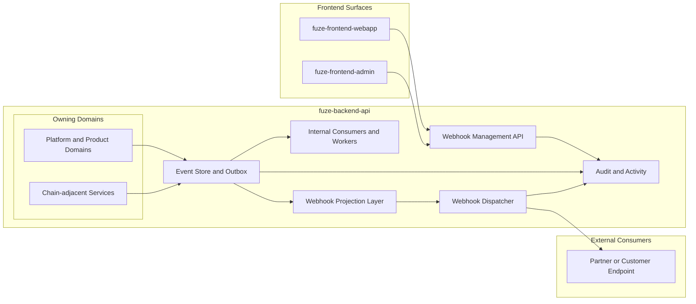
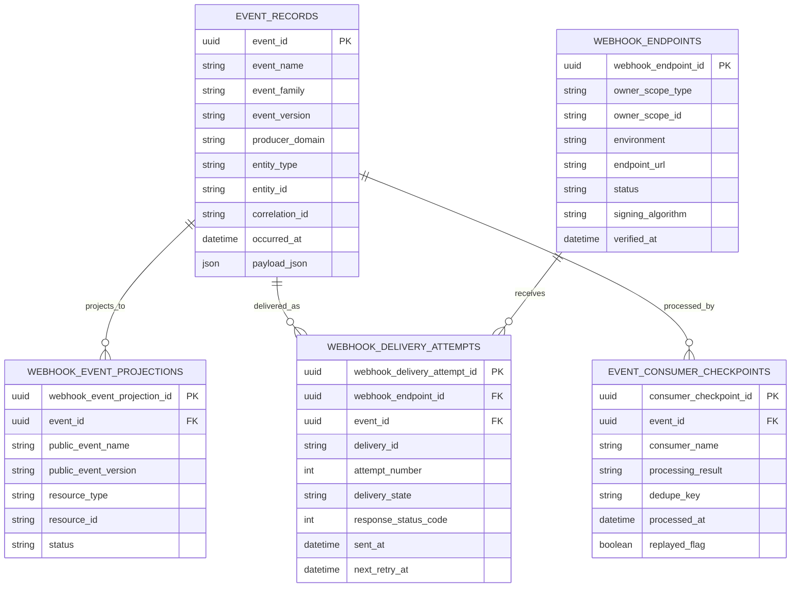
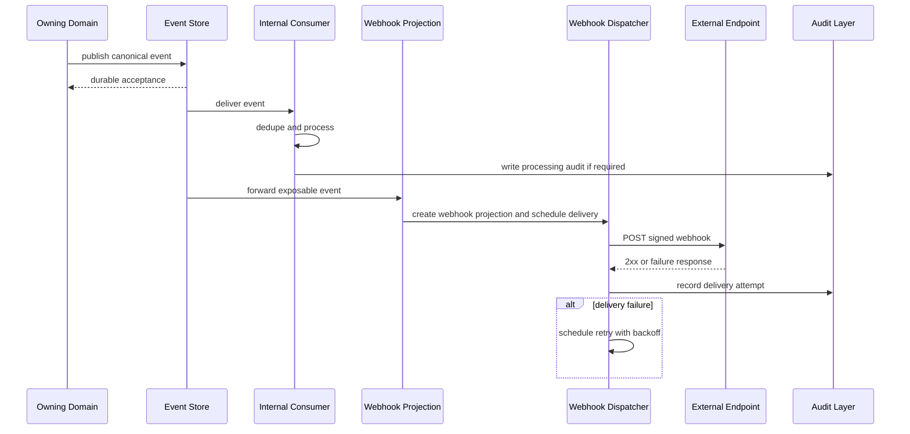

# EVENT_MODEL_AND_WEBHOOK_SPEC.md

## 1. Title
FUZE Event Model and Webhook Specification

## 2. Document Metadata
- Document Name: EVENT_MODEL_AND_WEBHOOK_SPEC.md
- Status: Active Draft for Approval
- API Classification: event-driven, internal coordination, derived-public, and controlled external webhook contract
- Owning Domain: Platform Eventing / Integration Architecture
- Primary Implementing Repo: `fuze-backend-api`
- Supporting Repos: `fuze-frontend-webapp`, `fuze-frontend-admin`, `fuze-public-registry`, future `fuze-sdk`
- Supporting System Components: worker runtime, scheduler, webhook dispatcher, event store / outbox, retry and delivery observability services
- Primary System of Record: owning backend domains inside `fuze-backend-api`, with explicit chain-native truth in `fuze-contracts` where applicable
- Canonical Folder Target: `fuze.ac > docs > api-spec`
- Interpretation Mode: canonical event and webhook contract source of truth

## 3. Purpose
This document defines the canonical event model and webhook contract architecture for FUZE. Its purpose is to establish how meaningful domain outcomes are emitted, classified, versioned, persisted, consumed, retried, replayed, and exposed externally where allowed, while preserving domain ownership, mutation safety, auditability, transparency discipline, and strict separation among FUZE token participation, Platform Credits, stablecoin profit participation, treasury controls, and governance controls.

FUZE is a platform-first, multi-product system with shared identity, workspaces, billing, Platform Credits, AI orchestration, workflow automation, async jobs, chain-adjacent execution, transparency reporting, governance-sensitive controls, and payout-sensitive operations. In such an environment, request-response APIs alone are insufficient. The platform requires a formal event model to coordinate durable side effects across domains and a narrower, more stable webhook layer for approved external integrations.

## 4. Scope
This specification covers:
- the canonical role of events in FUZE
- the distinction among events, APIs, audit records, activity feeds, jobs, and derived public artifacts
- event ownership, classification, timing semantics, and payload discipline
- internal event contracts for platform, product, chain-adjacent, workflow, and reporting domains
- public webhook contract boundaries and delivery behavior
- retry, replay, deduplication, idempotency, and ordering expectations
- authentication, authorization, signing, and destination-safety requirements for webhook delivery
- event-oriented governance entities and delivery-tracking schema
- implementation expectations for `fuze-backend-api`
- downstream consumption expectations for `fuze-frontend-webapp`, `fuze-frontend-admin`, and future `fuze-sdk`

This specification does not define every domain-specific payload field, every broker technology detail, or every exact OpenAPI / AsyncAPI machine-readable schema. Those are derived from this narrative source of truth and the narrower domain API specifications.

## 5. Source-of-Truth Inputs
### Governing FUZE indexes
- `DOCS_SPEC.md`
- `SYSTEM_SPEC_INDEX.md`

### Highest-priority FUZE system specifications used
- `SYSTEM_BOUNDARY_AND_OWNERSHIP_SPEC.md`
- `SYSTEM_OVERVIEW_AND_BOUNDARIES_SPEC.md`
- `PLATFORM_ARCHITECTURE_SPEC.md`
- `DOMAIN_OWNERSHIP_MATRIX_SPEC.md`
- `DATA_MODEL_AND_ENTITY_OWNERSHIP_SPEC.md`
- `ONCHAIN_OFFCHAIN_RESPONSIBILITY_SPEC.md`

### Additional FUZE system specifications used
- `EVENT_MODEL_AND_WEBHOOK_SPEC_refreshed.md`
- `API_ARCHITECTURE_SPEC.md`
- `PUBLIC_API_SPEC.md`
- `INTERNAL_SERVICE_API_SPEC.md`
- `IDEMPOTENCY_AND_VERSIONING_SPEC.md`
- `AUTH_SESSION_AND_LINKED_LOGIN_SPEC.md`
- `ROLE_PERMISSION_AND_ACCESS_CONTROL_SPEC.md`
- `WORKFLOW_AND_AUTOMATION_SPEC.md`
- `JOB_QUEUE_AND_WORKER_SPEC.md`
- `AUDIT_LOG_AND_ACTIVITY_SPEC.md`
- `PLATFORM_CREDITS_SPEC.md`
- `CREDIT_LEDGER_AND_SETTLEMENT_SPEC.md`
- `SUBSCRIPTIONS_AND_USAGE_BILLING_SPEC.md`
- `PROFIT_PARTICIPATION_SYSTEM_SPEC.md`
- `PAYOUT_LEDGER_SPEC.md`
- `PAYMENT_RAILS_INTEGRATION_SPEC.md`
- `TRANSPARENCY_REPORTING_SPEC.md`
- `PUBLIC_CONTRACT_AND_WALLET_REGISTRY_SPEC.md`
- `MULTISIG_AND_TIMELOCK_SPEC.md`
- `GOVERNANCE_MODEL_SPEC.md`
- `TREASURY_CONTROL_POLICY_SPEC.md`
- `VAULT_ACTION_POLICY_SPEC.md`

### FUZE core docs used for architectural alignment
- `FUZE_WHITEPAPER_v.2026.3.0.1.pdf`
- `FUZE_CHAIN_ARCHITECTURE.md`
- `FUZE_PLATFORM_CREDITS.md`
- `STABLECOIN_PROFIT_PARTICIPATION.md`
- `TOKEN_CONTRACT_ARCHITECTURE_.md`
- `ALLOCATION_WALLET_MAP.md`

### Supporting format and quality guides
- `The_API_Specification_guide.md`
- `Database_Schemas_Guide.md`

### External standards used only as supporting design guidance
- RFC 9110 for HTTP semantics and idempotent method meaning
- RFC 9457 for structured problem details in HTTP error responses
- CloudEvents core event-envelope design guidance for stable event metadata shape
- official webhook-signature validation guidance patterns reflected by GitHub and Stripe documentation

### Source priority interpretation
Where ambiguity exists, platform-wide ownership and architecture documents override narrower local or product assumptions. Docs-level conflicts follow `DOCS_SPEC.md`. System-spec conflicts follow `SYSTEM_SPEC_INDEX.md`. Internal events and public webhooks must never collapse FUZE token, Platform Credits, payout execution, treasury, or governance into one ambiguous economic surface.

## 6. Governing Architecture and Ownership Interpretation
Events in FUZE belong primarily to `fuze-backend-api` because the backend owns business truth, orchestration, workers, schedulers, integration ingress, and domain-controlled side effects. `fuze-frontend-webapp` and `fuze-frontend-admin` may display event-driven status and trigger privileged actions through backend APIs, but neither frontend owns durable truth, canonical event production, or webhook delivery authority by itself. `fuze-contracts` owns on-chain execution truth where state is explicitly committed to Ethereum or Base. `fuze-public-registry` exposes derived trust artifacts and public publication outputs, but does not originate upstream business truth.

The governing architecture rules for this specification are:
- only the owning domain emits canonical domain events for its truth
- events communicate accepted or completed domain outcomes, not speculative UI intentions
- webhook exposure is narrower than internal event production
- audit logs and activity feeds are downstream correlated outputs, not substitutes for event contracts
- chain-adjacent events may describe observed contract-native state or accepted orchestration outcomes, but may not misrepresent off-chain policy as on-chain truth
- public webhooks must not expose sensitive governance, treasury, fraud, or internal support-control internals

## 7. Domain Responsibilities
### Platform eventing domain responsibilities
- define event taxonomy and stable naming rules
- define the canonical envelope for event metadata
- govern retry, replay, deduplication, and delivery-attempt lineage
- govern webhook registration, signing, verification, and destination health handling
- ensure event-driven behavior respects canonical entity ownership and control-plane constraints

### Domain responsibilities by event owner
- **Identity and account domains** own account, session, and linked-login lifecycle events.
- **Workspace and access domains** own workspace, membership, role, and entitlement-scope events.
- **Wallet-aware domain** owns wallet-link and holder-context events.
- **Billing and payment domains** own payment verification, subscription, invoice, receipt, and entitlement-change events.
- **Platform Credits domain** owns credits issuance, spend, adjustment, hold, release, settlement, and balance-affecting events.
- **AI orchestration domain** owns AI request acceptance, routing, execution-progress, and result-completion events.
- **Workflow and job domains** own workflow-run and job-lifecycle events.
- **Governance, treasury, vault, and payout domains** own sensitive control-path and payout-cycle events.
- **Transparency and public-registry domains** own derived publication events once publication has been accepted by the publishing domain.
- **Product domains** own product-specific request, job, and result events without redefining shared platform primitives.

## 8. Out of Scope
This specification does not:
- define the exact transport vendor or broker product
- guarantee exactly-once delivery semantics
- make every internal event publicly consumable
- let event consumers bypass canonical write ownership
- define every domain-specific payload field in full
- replace audit or activity specifications
- replace queue / worker implementation details
- expose governance-, treasury-, fraud-, or payout-sensitive internals by default
- treat frontend local state transitions as canonical platform events

## 9. Canonical Entities and Data Ownership
### Canonical business entities referenced by events
These entities remain owned by their home domains and are only referenced by event payloads:
- `account`
- `session`
- `linked_login_method`
- `workspace`
- `workspace_membership`
- `role_assignment`
- `wallet_link`
- `payment_record`
- `subscription`
- `entitlement`
- `invoice`
- `receipt`
- `credits_account`
- `credits_ledger_entry`
- `workflow_instance`
- `workflow_step_execution`
- `job`
- `audit_event`
- `payout_cycle`
- `payout_execution`
- `transparency_publication`
- `public_registry_entry`
- product-domain request / result entities

### Event-governance entities
#### `event_record`
Canonical persistent event envelope representing a domain-originated event accepted for downstream consumption.

Owner:
- platform eventing infrastructure under backend control, storing events emitted by the owning domain

Durable facts:
- `event_id`
- `event_name`
- `event_family`
- `event_version`
- `producer_domain`
- `producer_service`
- `entity_type`
- `entity_id`
- `scope_type`
- `scope_id`
- `correlation_id`
- `causation_id`
- `idempotency_key_ref`
- `occurred_at`
- `accepted_at`
- `partition_key`
- `sequence_ref` nullable
- `payload_json`
- `sensitivity_class`
- `public_exposure_class`
- `audit_lineage_ref`
- `replayable_until`
- `retention_class`

#### `event_consumer_checkpoint`
Tracks last-processed or deduplicated state for a consumer.

Owner:
- eventing / consuming service domain

Durable facts:
- `consumer_checkpoint_id`
- `consumer_name`
- `event_id`
- `event_name`
- `entity_type`
- `entity_id`
- `processed_at`
- `processing_result`
- `replayed_flag`
- `dedupe_key`

#### `webhook_endpoint`
Represents a registered external delivery target.

Owner:
- integration / control-plane domain

Durable facts:
- `webhook_endpoint_id`
- `owner_scope_type`
- `owner_scope_id`
- `environment`
- `endpoint_url`
- `status`
- `secret_ref`
- `signing_algorithm`
- `event_subscription_mode`
- `event_filter_json`
- `verified_at`
- `disabled_at`
- `quarantined_at`
- `created_at`
- `updated_at`

#### `webhook_delivery_attempt`
Represents one outbound delivery attempt to a webhook endpoint.

Owner:
- webhook dispatcher infrastructure

Durable facts:
- `webhook_delivery_attempt_id`
- `webhook_endpoint_id`
- `event_id`
- `delivery_id`
- `attempt_number`
- `scheduled_at`
- `sent_at`
- `response_status_code`
- `response_latency_ms`
- `delivery_state`
- `next_retry_at`
- `last_error_code`
- `last_error_detail_redacted`
- `signature_key_version`
- `payload_hash`
- `archived_headers_json`

#### `webhook_event_projection`
Represents the externally supported webhook representation of an internal event.

Owner:
- integration / webhook publication layer

Durable facts:
- `webhook_event_projection_id`
- `event_id`
- `public_event_name`
- `public_event_version`
- `projection_schema_version`
- `resource_type`
- `resource_id`
- `status`
- `payload_json`
- `published_eligibility_class`

### Ownership interpretation
- `event_record` is durable eventing infrastructure, but the meaning of the fact still belongs to the producer domain.
- `webhook_event_projection` is derived from canonical events and does not replace them.
- `webhook_delivery_attempt` records delivery behavior, not business truth.
- `event_consumer_checkpoint` is consumer-local durability for idempotent processing.

## 10. State Model and Lifecycle
### A. Canonical event lifecycle
`pending_domain_commit -> committed -> emitted -> persisted -> available_for_consumption -> consumed | replayed | archived`

### B. Async accepted-work lifecycle
`requested -> accepted -> queued -> running -> completed | failed | canceled`

### C. Webhook publication lifecycle
`candidate -> projected -> scheduled -> delivered | retrying | dead_lettered | disabled`

### D. Endpoint lifecycle
`draft -> verified -> active -> quarantined | disabled | retired`

### Lifecycle rules
- canonical domain events must be emitted only after the owning domain has accepted or committed the underlying mutation or accepted the async workflow request
- webhook projection may occur only for event classes explicitly marked externally exposable
- webhook delivery failure must not roll back the canonical event or the underlying business fact
- replay must preserve original `event_id`, `occurred_at`, and producer lineage while marking replay context explicitly

## 11. API Surface Overview
This specification governs five related but distinct interface surfaces:

1. **Internal domain events** used for backend coordination across platform and product domains.
2. **Integration events** used for stable downstream service reactions and derived materializations.
3. **Operational lifecycle events** used for workflow, worker, retry, and report-build progress.
4. **Webhook management APIs** used by privileged clients to register and manage external endpoints.
5. **Webhook delivery contracts** used by FUZE to send approved event projections to third-party destinations.

The canonical model is event-first internally, webhook-selective externally.

## 12. Authentication and Authorization Model
### Internal event production
- only authenticated backend services or worker classes with domain-appropriate scopes may emit events
- the emitting service must authenticate as a service principal
- the eventing layer must verify that the emitting principal is authorized for the declared `producer_domain`

### Internal event consumption
- internal consumers authenticate with service identity
- consumer scopes are least-privilege and may be limited by event family, domain, or topic class
- sensitive governance, treasury, fraud, and payout topics require elevated internal trust tier and explicit grants

### Webhook management
- webhook endpoint registration and management are authenticated backend APIs exposed through user/admin edge surfaces
- registration requires ownership of the target account / workspace / partner scope
- admin-only override operations require stronger admin scopes and must be audited

### Webhook delivery authentication
- outbound webhooks must be signed
- the receiver authenticates FUZE by verifying the signature against the current endpoint secret
- secret rotation must support overlapping validation windows when configured

## 13. API Endpoints / Interface Contracts
The following contracts are canonical for webhook management and operational visibility. Internal event publication itself is not a public REST contract; it is an internal backend capability exposed to approved services.

### Webhook management APIs
#### `POST /v1/webhooks/endpoints`
- Purpose: register a webhook endpoint for an account, workspace, or partner scope
- Caller Type: authenticated first-party client or approved admin flow
- Auth Expectation: owner-scoped auth or admin-scoped auth
- Request Body Summary: endpoint URL, environment, subscription mode, event filters, optional label
- Response Summary: created endpoint record with verification status and secret metadata reference only
- Side Effects: creates `webhook_endpoint`, may initiate verification challenge
- Idempotency Behavior: required via idempotency key for endpoint registration requests
- Audit Requirements: create audit entry and activity entry where user-visible
- Emitted Events: `integration.webhook_endpoint.created`, optionally `integration.webhook_endpoint.verification_requested`

#### `POST /v1/webhooks/endpoints/{webhook_endpoint_id}/verify`
- Purpose: verify endpoint ownership / reachability according to FUZE verification policy
- Caller Type: authenticated owner or admin
- Auth Expectation: same owner scope or admin override
- Request Body Summary: verification confirmation parameters if applicable
- Response Summary: verification result and resulting endpoint status
- Side Effects: updates endpoint status, may enqueue probe delivery
- Idempotency Behavior: required
- Audit Requirements: required
- Emitted Events: `integration.webhook_endpoint.verified` or `integration.webhook_endpoint.verification_failed`

#### `GET /v1/webhooks/endpoints`
- Purpose: list webhook endpoints for the caller scope
- Caller Type: authenticated owner or admin
- Auth Expectation: scope-limited read access
- Response Summary: endpoint summaries, statuses, event filters, created / updated metadata
- Side Effects: none
- Idempotency Behavior: not applicable
- Audit Requirements: optional access audit for sensitive admin use
- Emitted Events: none

#### `PATCH /v1/webhooks/endpoints/{webhook_endpoint_id}`
- Purpose: update event subscriptions, label, active status, or retry policy class where allowed
- Caller Type: authenticated owner or admin
- Auth Expectation: scope owner or admin override
- Request Body Summary: allowed mutable endpoint attributes only
- Response Summary: updated endpoint record
- Side Effects: may trigger re-verification if URL changes; may rotate delivery configuration version
- Idempotency Behavior: required for mutation
- Audit Requirements: required
- Emitted Events: `integration.webhook_endpoint.updated`

#### `POST /v1/webhooks/endpoints/{webhook_endpoint_id}/rotate-secret`
- Purpose: rotate webhook signing secret
- Caller Type: authenticated owner or admin
- Auth Expectation: elevated scope
- Request Body Summary: optional overlap policy and effective time
- Response Summary: secret rotation acknowledgment and validation window metadata
- Side Effects: creates new secret version reference
- Idempotency Behavior: required
- Audit Requirements: required and high sensitivity
- Emitted Events: `integration.webhook_endpoint.secret_rotated`

#### `POST /v1/webhooks/endpoints/{webhook_endpoint_id}/disable`
- Purpose: disable delivery to an endpoint
- Caller Type: authenticated owner or admin
- Auth Expectation: scope owner or admin
- Request Body Summary: reason code
- Response Summary: disabled endpoint record
- Side Effects: stops future deliveries
- Idempotency Behavior: required
- Audit Requirements: required
- Emitted Events: `integration.webhook_endpoint.disabled`

#### `GET /v1/webhooks/endpoints/{webhook_endpoint_id}/deliveries`
- Purpose: view recent delivery attempts for support and debugging
- Caller Type: authenticated owner or admin
- Auth Expectation: scope-limited read access
- Response Summary: delivery attempts, statuses, timestamps, response codes, redacted diagnostics
- Side Effects: none
- Idempotency Behavior: not applicable
- Audit Requirements: access audit for admin and sensitive scopes
- Emitted Events: none

#### `POST /v1/webhooks/deliveries/{delivery_id}/redeliver`
- Purpose: request redelivery of a prior eligible webhook delivery
- Caller Type: authenticated owner or admin
- Auth Expectation: scope owner or admin
- Request Body Summary: optional reason code
- Response Summary: redelivery accepted response with new delivery-attempt reference
- Side Effects: queues redelivery attempt
- Idempotency Behavior: required
- Audit Requirements: required
- Emitted Events: `integration.webhook_delivery.redelivery_requested`

### Internal interface contracts
#### Internal event publication interface
- Surface Type: internal service capability
- Allowed Callers: authenticated backend services and workers with publish permission for the producer domain
- Required Inputs: canonical envelope metadata, payload, correlation lineage, sensitivity classification, public exposure class
- Required Guarantees: event persists durably before being acknowledged as published

#### Internal subscription / consumption interface
- Surface Type: internal broker or pull-consumer contract
- Allowed Callers: authenticated services / workers with read grants for the event family or topic
- Required Guarantees: at-least-once delivery semantics, consumer-level dedupe responsibility, checkpointing support

### Webhook delivery contract
Each delivery must include:
- stable delivery identifier
- event identifier
- public event name and version
- event timestamp
- resource type and resource id
- status
- signed request headers
- payload body as the supported webhook contract projection

## 14. Request Rules
### Internal publication rules
- the producer must not emit an event before the underlying domain action is accepted or committed
- event names must follow `<domain>.<entity_or_scope>.<action_or_state>`
- payloads must prefer stable identifiers over full mutable object snapshots
- the publication request must include correlation and causation lineage where available

### Webhook registration rules
- endpoint URLs must be HTTPS and must pass destination-validation policy
- local, loopback, RFC1918, link-local, or otherwise blocked destinations are rejected unless explicitly allowed in non-production sandbox policy
- event filters must be validated against the supported public webhook catalog
- environment separation is mandatory between sandbox and production where both exist

### Redelivery rules
- only eligible deliveries within retention window may be redelivered
- redelivery creates a new delivery attempt but references the original `event_id`
- redelivery does not mint a new business event

## 15. Response Rules
- mutation APIs return canonical endpoint state or accepted-redelivery state, never secret raw values after creation/rotation confirmation
- failed requests use a structured problem-details style error model
- list and detail APIs return redacted delivery diagnostics rather than raw sensitive internals
- internal publication acknowledgment returns whether the event was durably accepted, not whether every downstream consumer has already completed work

## 16. Error Model
The webhook-management HTTP layer uses structured problem details with these canonical classes:
- `invalid_request`
- `authorization_failed`
- `forbidden_scope`
- `unsupported_event_subscription`
- `endpoint_verification_failed`
- `endpoint_destination_blocked`
- `endpoint_secret_rotation_conflict`
- `delivery_not_found`
- `redelivery_not_allowed`
- `replay_window_expired`
- `conflict_state`
- `rate_limited`
- `internal_error`

Problem objects should include:
- `type`
- `title`
- `status`
- `detail`
- `instance`
- FUZE extension members such as `error_code`, `correlation_id`, `field_errors`, and `retryable`

## 17. Idempotency and Mutation Safety
- webhook endpoint creation, verification, update, disable, and secret rotation are mutation-capable and require idempotency protection
- internal event publication must be deduplicable by `event_id` and, where relevant, by domain idempotency reference
- consumer handling must tolerate duplicate delivery and must not duplicate economic or publication side effects
- webhook redelivery is operationally idempotent with respect to business meaning: it produces new delivery attempts, not new business facts
- at-least-once delivery is assumed across internal events and outbound webhook attempts

## 18. Versioning and Compatibility Rules
- every event has an explicit `event_version`
- every public webhook projection has an explicit `public_event_version`
- breaking payload changes require a new event version
- additive fields are preferred over destructive field mutation
- internal consumers should ignore unknown additive fields unless their contract forbids it
- public webhook deprecations require overlap periods and clear migration guidance
- event names should remain stable unless the business meaning changes materially

## 19. Event Emission and Webhook Behavior
### Event families
- **Domain events**: canonical business outcomes from the owning domain
- **Integration events**: stable downstream coordination events derived from domain truth
- **Operational events**: workflow, worker, and report-build progress
- **Public webhook events**: intentionally exposed external contract projections

### Canonical event timing
- **Fact events** describe something that is now true
- **Accepted events** describe that async work was accepted
- **Operational state events** describe in-progress execution changes

### Webhook exposure rules
Webhook exposure is allowed only when:
- the event is meaningful to an external consumer
- the event does not leak restricted control-path internals
- the payload can be supported as a stable contract
- destination ownership and security can be reasonably enforced

### Example externally supportable webhook classes
- `product.request.completed`
- `credits.purchase.completed`
- `billing.subscription.changed`
- `transparency.report.published`
- `public.registry.updated`
- `payout.cycle.opened` only if explicitly approved as public contract surface

### Restricted default internal-only classes
- treasury approval internals
- governance review internals
- fraud and abuse signals
- internal support overrides
- signer or secret-control internals
- payout preparation internals before approved publication state

## 20. Audit and Activity Requirements
- every mutation-capable webhook management action must create an audit record
- secret rotation, disable, quarantine, and admin override actions are high-sensitivity audit events
- every delivery attempt must preserve delivery timestamp, response status, and redacted failure detail
- activity feeds may expose endpoint created / disabled / verified summaries to owners where product UX requires it, but activity feed entries remain derived from canonical audit and event records
- audit lineage references should connect endpoint mutations, event projections, and delivery attempts to the underlying actor and request

## 21. Data Model and Database Schema View
### Core tables
#### `event_records`
- PK: `event_id`
- Unique: `producer_domain + producer_service + correlation_id + event_name + entity_type + entity_id + event_version + occurred_at` may be indexed for reconciliation but should not replace `event_id`
- Major indexes:
  - `(producer_domain, occurred_at desc)`
  - `(event_name, occurred_at desc)`
  - `(entity_type, entity_id, occurred_at desc)`
  - `(correlation_id)`
  - `(public_exposure_class, occurred_at desc)`
- State columns: none beyond immutable envelope metadata; logical availability is determined by persistence and retention policy
- Audit columns: `accepted_at`, `audit_lineage_ref`
- Reconciliation columns: `sequence_ref`, `replayable_until`, `retention_class`

#### `event_consumer_checkpoints`
- PK: `consumer_checkpoint_id`
- Unique: `(consumer_name, event_id)`
- Major indexes:
  - `(consumer_name, processed_at desc)`
  - `(dedupe_key)`
- State columns: `processing_result`
- Audit columns: `processed_at`
- Reconciliation columns: `replayed_flag`

#### `webhook_endpoints`
- PK: `webhook_endpoint_id`
- Unique: `(owner_scope_type, owner_scope_id, environment, endpoint_url)`
- Major indexes:
  - `(owner_scope_type, owner_scope_id, status)`
  - `(environment, status)`
- State columns: `status`
- Audit columns: `created_at`, `updated_at`, `verified_at`, `disabled_at`, `quarantined_at`
- Reconciliation columns: `event_subscription_mode`, `event_filter_json`

#### `webhook_delivery_attempts`
- PK: `webhook_delivery_attempt_id`
- Unique: `(delivery_id, attempt_number)`
- FKs:
  - `webhook_endpoint_id -> webhook_endpoints.webhook_endpoint_id`
  - `event_id -> event_records.event_id`
- Major indexes:
  - `(webhook_endpoint_id, sent_at desc)`
  - `(event_id)`
  - `(delivery_state, next_retry_at)`
- State columns: `delivery_state`
- Audit columns: `scheduled_at`, `sent_at`
- Reconciliation columns: `attempt_number`, `response_status_code`, `response_latency_ms`, `payload_hash`

#### `webhook_event_projections`
- PK: `webhook_event_projection_id`
- Unique: `(event_id, public_event_version)`
- FKs:
  - `event_id -> event_records.event_id`
- Major indexes:
  - `(public_event_name, occurred_at desc)` if projected timestamp stored
- State columns: `status`
- Audit columns: publication timestamp if stored
- Reconciliation columns: `projection_schema_version`, `published_eligibility_class`

### Normalization and derived-data notes
- `event_records` are immutable event envelopes, not mutable state rows
- `webhook_event_projections` are derived from `event_records`
- `webhook_delivery_attempts` are operational records and do not redefine event truth
- cached UI summaries may exist, but canonical delivery truth remains in the delivery-attempt table

## 22. Architecture Diagram — Mermaid flowchart

## 23. Data Design — Mermaid Diagram

## 24. Flow View
### Happy path flow
1. An owning domain commits or accepts a business outcome.
2. The domain emits a canonical event into the event store / outbox.
3. Internal consumers process the event idempotently for downstream coordination, reporting, or async work.
4. If the event class is approved for external exposure, the webhook projection layer maps it to a stable webhook payload.
5. The dispatcher signs and sends the webhook to subscribed verified endpoints.
6. Delivery attempts are recorded and surfaced for support and owner visibility.

### Alternate path flow
1. An async workflow request is accepted.
2. The producer emits an accepted-state event rather than a completion event.
3. Workers execute the long-running work.
4. Completion or failure emits a later fact or operational event.
5. Only the externally approved completion-state event may be projected to webhooks.

### Failure and recovery flow
1. Event delivery to an internal consumer fails.
2. Consumer retries using dedupe keys and checkpoints.
3. Webhook dispatch fails due to timeout or non-2xx response.
4. Dispatcher schedules bounded retries with backoff.
5. Persistently failing endpoints are quarantined or disabled according to policy.
6. Business truth remains committed even if delivery fails.

### Retry behavior
- internal events: at-least-once delivery, consumer-side dedupe
- webhook deliveries: bounded retries, attempt tracking, redelivery API
- replay: explicit operator or system action, marked as replay without changing original event meaning

### Admin override / review flow
- admin may disable, quarantine, or redeliver a webhook endpoint through privileged backend APIs
- admin actions never rewrite the underlying business event
- all such actions create high-sensitivity audit records

## 25. Data Flows — Mermaid sequenceDiagram

## 26. Security and Risk Controls
- webhook endpoints must use HTTPS
- endpoint destination validation must mitigate SSRF and unsafe target classes
- webhook signing must use strong keyed signatures and constant-time verification guidance for receivers
- secrets must be stored as secret references, not returned in raw read APIs after creation or rotation
- secret rotation must be auditable and support overlap only under explicit policy
- event payloads must exclude internal-only sensitive fields and secrets
- governance-, treasury-, fraud-, and payout-sensitive topics default to internal-only exposure
- rate limiting and anomaly detection apply to webhook management APIs
- delivery logs exposed to customers must be redacted to avoid leaking secrets or internal infrastructure detail

## 27. Operational Considerations
- event retention must distinguish replayable operational windows from long-term audit retention
- dead-letter handling must exist for repeated webhook-delivery failure and, where required, for internal consumer failure
- support tooling must allow search by `event_id`, `delivery_id`, `correlation_id`, `entity_id`, and endpoint id
- observability should cover publish latency, consumer lag, retry rates, endpoint failure rates, and quarantine rates
- environment separation between sandbox and production is mandatory for endpoint registration and delivery
- incident response must preserve ability to pause outbound delivery without losing canonical event records

## 28. Acceptance Criteria
1. FUZE emits canonical domain events only from the domain that owns the underlying fact.
2. No public webhook exists unless its event class is explicitly approved for external exposure.
3. Every emitted event carries a stable event identifier, version, producer domain, correlation lineage, and entity reference.
4. Internal consumers can process at-least-once delivery safely without duplicating economic or publication side effects.
5. Webhook endpoints can be created, verified, updated, disabled, and redelivered through authenticated backend APIs with audit coverage.
6. Webhook deliveries are signed, tracked, retryable with bounded backoff, and visible in delivery history.
7. Secret rotation is supported without exposing raw stored secrets through read APIs.
8. Governance-, treasury-, fraud-, and payout-sensitive internals are not exposed externally by default.
9. Replay and redelivery preserve original business meaning and do not mint duplicate domain facts.
10. The architecture, schema, and diagrams remain consistent with backend ownership and FUZE economic-layer separation.

## 29. Test Cases
### Positive cases
1. A credits issuance mutation emits exactly one canonical `credits.issued` event record after ledger commit.
2. A supported completion event is projected and delivered successfully to an active verified endpoint.
3. Endpoint secret rotation issues a new secret version and subsequent deliveries validate against the new secret.
4. Redelivery of a recent webhook creates a new delivery attempt while keeping the original `event_id`.

### Negative cases
5. A frontend-originated local UI transition cannot publish a canonical platform event directly.
6. An attempt to register an HTTP or blocked destination endpoint is rejected.
7. A request to subscribe to an unsupported or restricted event class is rejected.
8. A duplicate delivery attempt without idempotent consumer protection does not create duplicate economic side effects because the consumer dedupes by event identity.

### Authorization cases
9. A workspace owner can manage only endpoints belonging to that workspace scope.
10. An admin can quarantine an endpoint, and the action is separately audited.
11. A service principal without publish permission for the credits domain cannot emit `credits.*` events.

### Idempotency and concurrency cases
12. Retrying `POST /v1/webhooks/endpoints` with the same idempotency key does not create duplicate endpoint rows.
13. Two concurrent secret-rotation requests do not leave ambiguous active-secret state.
14. A consumer receiving the same event twice records only one successful processing checkpoint.

### Replay / reconciliation cases
15. Replaying an event does not create a second business mutation in credits, billing, payout, or registry publication domains.
16. A delivery history query shows both failed and successful attempts for the same delivery lineage.
17. A quarantined endpoint receives no new deliveries until reactivated.

### Webhook-signature cases
18. A receiver can validate the signature using the active shared secret and reject tampered payloads.
19. Payloads altered in transit fail signature verification.
20. Redelivery uses the correct active key version according to the effective rotation policy.

## 30. Open Questions or Explicit Deferred Decisions
- exact broker technology and topic / partition implementation remain implementation choices provided the contract rules here are preserved
- exact external webhook event catalog should be finalized per product and public integration policy
- whether CloudEvents wire format is adopted directly or only used as metadata-shape inspiration remains a contract-derivation decision
- exact replay retention window by event family should be finalized with operational and compliance input
- whether public payout-cycle webhook exposure should exist in v1 remains subject to trust and policy review

## 31. Implementation Notes for `fuze-backend-api`
- implement event publication through an ownership-respecting outbox or equivalent durable publication pattern
- keep event envelope types shared across domains but producer authorization domain-specific
- separate canonical event records from webhook projection objects and delivery attempts
- centralize webhook signature generation, delivery retry policy, destination validation, and redelivery tooling
- ensure credits-, billing-, payout-, and governance-sensitive consumers have explicit dedupe and audit logic
- provide searchable operator tooling by event and delivery identifiers

## 32. Frontend Consumption Notes for:
### `fuze-frontend-webapp`
- consumes webhook-management APIs and event-driven status read models only
- must not construct canonical platform events locally
- may display endpoint status, recent deliveries, and async job progress derived from backend truth

### `fuze-frontend-admin`
- consumes privileged management and observability APIs for endpoint quarantine, redelivery, and delivery diagnostics
- may trigger control-plane actions but does not own event truth or delivery truth by itself
- should expose high-sensitivity action confirmation flows and audit visibility

## 33. Contract Derivation Notes for:
### OpenAPI / AsyncAPI
- derive webhook-management HTTP contracts into OpenAPI groups under an integration / webhooks tag family
- derive internal event and public webhook payload catalogs into AsyncAPI or equivalent machine-readable event contracts
- preserve stable names for `event_name`, `event_version`, `public_event_name`, and error families
- use structured problem-details-compatible error schemas for webhook-management HTTP endpoints

### future `fuze-sdk`
- future SDK packages should derive webhook registration, delivery-history, and redelivery clients from the approved HTTP contracts
- event payload types for public webhooks should derive from the approved projected webhook event schemas, not from internal event payloads
- SDK generation must not invent or broaden externally supported event classes beyond the approved webhook catalog in this specification and subsequent derived contracts
