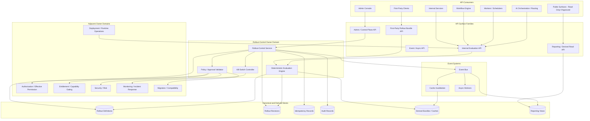
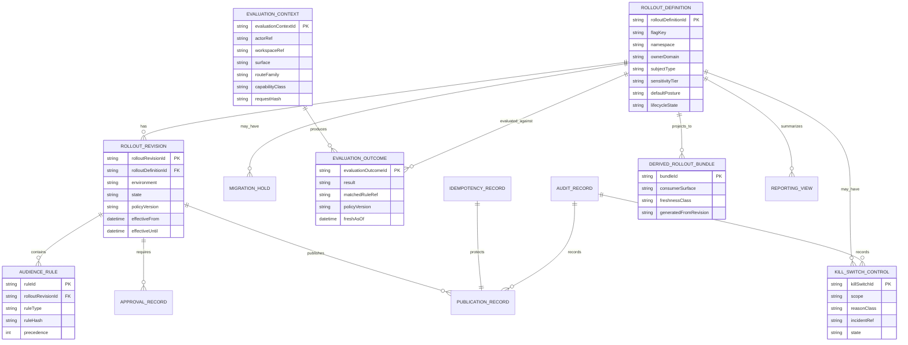
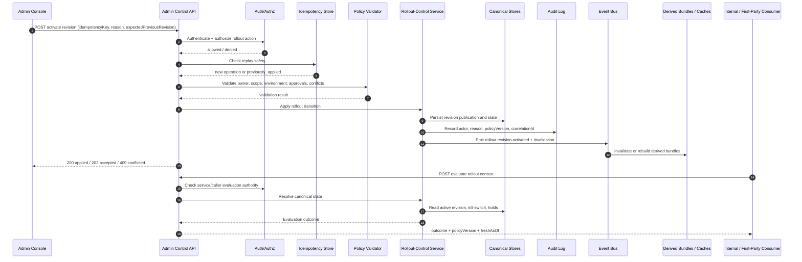

# FUZE Feature Flag and Rollout Control API Specification

## Document Metadata

- **Document Name:** `FEATURE_FLAG_AND_ROLLOUT_CONTROL_API_SPEC.md`
- **Document Type:** Production-grade API SPEC v2 interface-contract specification
- **Status:** Draft production-grade API specification
- **Version:** 2.0.0
- **Effective Date:** 2026-04-24
- **Last Updated:** 2026-04-24
- **Reviewed On:** 2026-04-24
- **Document Owner:** FUZE Control / Governance-Aware Operations Domain for rollout-control semantics; named individual owner not yet specified
- **Approval Authority:** FUZE Platform Architecture and Governance Authority; explicit approval workflow not yet attached
- **Review Cadence:** Quarterly and whenever shared rollout-control posture, product-admission posture, entitlement interaction, AI/workflow runtime control, public/internal API exposure, incident response, migration posture, or operator override policy materially changes
- **Governing Layer:** API SPEC v2 / shared platform control-plane interface-contract layer
- **Parent Registry:** API SPEC v2 Canonical File Registry
- **Upstream Semantic Registry:** `REFINED_SYSTEM_SPEC_INDEX.md`
- **Upstream API Registry:** `API_SPEC_INDEX.md`
- **Primary Audience:** Platform architecture, backend engineering, API authors, frontend/admin console authors, product engineering, AI engineering, workflow/runtime engineering, security, audit, operations, support/control-plane operators, OpenAPI/AsyncAPI/SDK authors, implementation-contract authors
- **Primary Purpose:** Define the canonical FUZE API contract posture for feature flags, rollout definitions, rollout revisions, kill switches, migration holds, evaluation outcomes, cache invalidation, admin/control actions, internal rollout evaluation, event propagation, derived read models, and audit lineage without redefining refined rollout-control semantics.
- **Primary Upstream References:** `FEATURE_FLAG_AND_ROLLOUT_CONTROL_SPEC.md`; `REFINED_SYSTEM_SPEC_INDEX.md`; `API_SPEC_INDEX.md`; `API_ARCHITECTURE_SPEC.md`; `PUBLIC_API_SPEC.md`; `INTERNAL_SERVICE_API_SPEC.md`; `EVENT_MODEL_AND_WEBHOOK_SPEC.md`; `IDEMPOTENCY_AND_VERSIONING_SPEC.md`; `MIGRATION_AND_BACKWARD_COMPATIBILITY_SPEC.md`; `WORKFLOW_AND_AUTOMATION_SPEC.md`; `JOB_QUEUE_AND_WORKER_SPEC.md`; `AI_ORCHESTRATION_SPEC.md`; `MODEL_ROUTING_AND_CONTEXT_SPEC.md`; `AI_USAGE_METERING_SPEC.md`; `ENTITLEMENT_AND_CAPABILITY_GATING_SPEC.md`; `ACCESS_EVALUATION_AND_EFFECTIVE_PERMISSION_SPEC.md`; `AUDIT_LOG_AND_ACTIVITY_SPEC.md`; `SECURITY_AND_RISK_CONTROL_SPEC.md`; `MONITORING_ALERTING_AND_INCIDENT_RESPONSE_SPEC.md`; `SECRETS_CONFIG_AND_ENVIRONMENT_SPEC.md`; `FRONTEND_FEATURE_FLAGS_SPEC.md`; historical `FEATURE_FLAGS_ADMIN_API_SPEC.md`.
- **Primary Downstream Dependents:** admin/control-plane feature-flag APIs; internal rollout-evaluation services; first-party feature-consumption APIs; frontend/admin rollout consoles; worker/runtime rollout adapters; AI/workflow control adapters; event consumers; rollout read models; audit/logging systems; OpenAPI/AsyncAPI/SDK derivation layers; implementation-contract specs.
- **API Surface Families Covered:** Admin/control-plane APIs; internal service evaluation APIs; first-party application read APIs; event/async APIs; reporting/derived read APIs; limited public-safe status posture where explicitly approved.
- **API Surface Families Excluded:** Broad public mutation APIs; unauthenticated feature-gating APIs; raw environment-variable APIs; secret/config APIs; generalized runtime operations APIs; generalized incident-command APIs; entitlement/authorization APIs; workflow/queue/AI/domain business mutation APIs.
- **Canonical System Owner(s):** FUZE Control / Governance-Aware Operations Domain owns rollout-control semantics; adjacent owner domains own authorization, entitlement, workflow, queue, AI, metering, runtime operations, security, monitoring, and product business semantics.
- **Canonical API Owner:** FUZE Platform API Architecture / Interface Governance with shared implementation ownership by the rollout-control domain.
- **Supersedes:** Historical `FEATURE_FLAGS_ADMIN_API_SPEC.md` where it is narrower, BKK.ac-specific, or structurally weaker than API SPEC v2; ad hoc admin toggles; environment-variable-only rollout controls; undocumented kill-switch APIs; spreadsheet-driven rollout state; frontend-only or worker-only flag truth.
- **Superseded By:** None currently defined.
- **Related Decision Records:** Not explicitly specified in the retrieved governing materials.
- **Canonical Status Note:** This document is the canonical API SPEC v2 contract for FUZE feature flag and rollout control APIs. Downstream route definitions, OpenAPI/AsyncAPI artifacts, SDKs, admin consoles, workers, frontend clients, events, caches, dashboards, and operator runbooks MUST preserve the ownership, truth-separation, and control-plane discipline defined here.
- **Implementation Status:** Normative source for downstream implementation contracts; implementation readiness pending route-level OpenAPI/AsyncAPI derivation and service-specific contract validation.
- **Approval Status:** Draft pending FUZE approval workflow.
- **Change Summary:** Upgrades historical feature-flag admin API material into a FUZE production-grade API SPEC v2 document; aligns API contract posture with refined rollout-control semantics; hardens admin/control separation, internal evaluation contracts, kill-switch lineage, idempotency, conflict resolution, stale-cache behavior, events, read-model rules, migration guardrails, and implementation QA coverage.

## Purpose

This API specification defines the canonical FUZE interface-contract layer for feature flags and rollout control.

The specification governs how APIs create, read, validate, approve, schedule, activate, narrow, kill-switch, suspend, clear, retire, evaluate, cache, publish, and audit rollout-control state. It converts refined system semantics into implementation-usable API contract rules while preserving the principle that refined system specifications own semantic truth and API specifications own interface-contract expression.

Feature flags and rollout controls are control-plane policy artifacts. They may constrain exposure, presentation, runtime behavior, provider-lane availability, migration exposure, AI capability availability, workflow entry, worker continuation, or public-surface visibility. They MUST NOT become authorization truth, entitlement truth, workflow truth, queue truth, pricing truth, runtime configuration truth, incident truth, or product business truth.

## Scope

This API spec governs:

- admin/control-plane APIs for rollout definition, revision, approval, activation, narrowing, suspension, kill-switching, clearing, rollback, retirement, and lineage inspection
- internal service APIs for deterministic rollout evaluation and evaluation-bundle distribution
- first-party application APIs for viewer-safe rollout posture where needed by FUZE-owned products
- event and async contracts for rollout changes, kill switches, cache invalidation, migration holds, and incident-linked containment
- request, response, error, result, status, idempotency, replay, versioning, migration, audit, observability, and rate-limit posture
- derived read models, reporting exports, dashboards, and admin-console views of rollout posture
- contract guardrails for OpenAPI, AsyncAPI, SDK, worker adapter, frontend adapter, and implementation-contract derivation

## Out of Scope

This API spec does not govern:

- canonical identity, account, session, or linked-login truth
- role, permission, authorization, effective-permission, or access-correction semantics
- commercial entitlement or capability-gating semantics
- workflow definition, workflow instance, approval, retry, or compensation meaning
- queue placement, worker claim, lease, heartbeat, retry, dead-letter, or execution truth
- AI run lifecycle, model-routing/context, or AI usage metering truth
- pricing, billing, credits, ledger, payment, invoice, refund, treasury, governance, payout, or public registry truth
- secret/config custody or environment configuration semantics
- full experimentation-statistics methodology
- generalized deployment/runtime operations or incident-command APIs
- database schema, storage-engine internals, frontend component implementation, or vendor-specific flag-engine details

Adjacent owners may consume rollout outcomes but MUST NOT reinterpret rollout-control semantics locally.

## Design Goals

1. Define one shared FUZE API contract for rollout-control and feature-flag posture.
2. Preserve control-plane ownership for rollout definitions, revisions, kill switches, migration holds, and evaluation outcomes.
3. Prevent flags from becoming authorization, entitlement, workflow, pricing, environment, or product-local business truth.
4. Support deterministic evaluation for first-party, internal, worker, workflow, AI, integration, and frontend consumers.
5. Make kill-switch and emergency-disablement fast, conservative, auditable, reason-coded, and safe under stale-cache conditions.
6. Make rollout changes idempotent, replay-safe, versioned, observable, and reconstructible.
7. Support staged release, migration narrowing, product admission, provider-lane restriction, AI/workflow controls, and public-surface containment without broadening exposure.
8. Provide enough contract detail for route derivation, OpenAPI/AsyncAPI generation, SDK constraints, QA, regression tests, and production-readiness review.

## Non-Goals

This API spec is not intended to:

- expose broad public mutation routes for feature-flag state
- permit frontend-only or local-storage rollout truth
- permit environment variables to serve as ordinary production rollout controls
- create hidden support/admin write shortcuts
- conflate rollout-enabled with authorized, entitled, paid, approved, complete, healthy, or safe
- let caches, bundles, dashboards, reports, or SDKs outrank canonical rollout state
- replace implementation-contract specs, service internals, or machine-readable OpenAPI/AsyncAPI files

## Core Principles

### Control-Plane Ownership

Rollout definitions, revisions, audience rules, kill-switch state, migration holds, and override lineage are control-plane policy truth. API consumers may request or consume outcomes; they do not own rollout truth.

### Rollout Is Not Authorization

A rollout outcome never proves that an actor is permitted to perform an action. Authorization and effective-permission APIs remain mandatory where actor authority matters.

### Rollout Is Not Entitlement

A rollout outcome may narrow or suppress exposure, but it cannot grant commercial eligibility or product capability entitlement.

### Rollout Is Not Workflow or Queue Truth

Rollout APIs may block entry, continuation, enqueue, claim, replay, or publication under explicit policy. They do not own workflow state or execution substrate state.

### Fail Closed on Sensitive Ambiguity

When canonical rollout posture is unavailable, stale, conflicted, or unknown for a sensitive, cost-bearing, AI-bearing, public, financial, governance, or trust-bearing surface, the API outcome MUST default to restrictive posture.

### Derived-View Discipline

Read models, viewer bundles, dashboards, analytics, exports, cache materializations, and presentation labels are downstream to canonical rollout records and MUST NOT become hidden mutation owners.

### Explicit Override Discipline

Operator overrides, kill switches, clears, and emergency changes MUST be bounded, policy-constrained, reason-coded, audited, and separated from ordinary application routes.

### Compatibility and Migration Discipline

Rollout APIs may gate migration exposure, but migration status, compatibility windows, deprecation posture, and cutover lineage remain governed by migration/backward-compatibility semantics.

## Canonical Definitions

- **Feature Flag:** A governed control-plane object representing a feature, behavior, route family, provider lane, capability class, product surface, workflow entry, AI surface, integration path, or other approved rollout subject.
- **Rollout Definition:** The canonical object that defines the governed subject, owner domain, allowed audience model, default posture, policy references, sensitivity tier, and lifecycle constraints.
- **Rollout Revision:** An immutable or versioned snapshot of targeting rules, windows, percentage allocation, environment scope, policy references, and approval posture.
- **Rollout Evaluation:** A deterministic API operation that resolves a concrete request or runtime context into a canonical rollout outcome.
- **Evaluation Context:** The bounded, validated input supplied to evaluation, such as workspace, actor class, surface, environment, route family, product family, workflow family, capability class, provider lane, and approved cohort references.
- **Evaluation Outcome:** A canonical result such as `enabled`, `disabled`, `narrowed`, `hidden`, `degraded`, `kill_switched`, `migration_held`, `stale_denied`, or `unsupported_context`.
- **Kill Switch:** A high-priority control-plane posture that disables or restricts a governed subject for safety, incident response, containment, provider instability, cost containment, or policy violation.
- **Migration Hold:** A rollout posture that bounds exposure during migration, compatibility, data-shape transition, API-version coexistence, or phased replacement.
- **Rollout Bundle:** A derived, viewer-safe, surface-specific collection of evaluation results or evaluation hints for first-party clients.
- **Stale Rollout View:** A cached or derived projection whose freshness cannot be trusted for the requested decision.
- **Control Override:** A privileged control-plane action that changes, narrows, clears, or temporarily overrides rollout outcome under explicit policy.

## Truth Class Taxonomy

The API contract MUST preserve the following truth classes:

1. **Semantic truth** — meaning of rollout-control concepts and owner-domain boundaries, owned by refined system specs.
2. **API contract truth** — allowed surfaces, routes, request/response shapes, errors, versioning, idempotency, and compatibility posture, owned by this API spec and downstream contracts.
3. **Policy truth** — rollout definitions, revisions, audience rules, approval requirements, kill-switch policies, migration holds, and override policies.
4. **Runtime truth** — evaluated outcomes for concrete contexts, cache freshness, current request status, and dependency posture.
5. **Ledger / storage truth** — durable rollout definitions, revisions, approvals, transitions, idempotency records, audit records, evaluation references, and publication records.
6. **Execution truth** — workflow, job, worker, async, retry, replay, and in-flight progression state influenced by rollout outcome but not owned by rollout APIs.
7. **Provider-input truth** — provider status, model availability, connector health, environment observations, or external signals before canonical validation.
8. **Projection / reporting truth** — rollout dashboards, exposure summaries, analytics, exports, stale-view indicators, and incident-support summaries.
9. **Presentation truth** — user/admin-visible labels explaining hidden, disabled, unavailable, kill-switched, or degraded states.

These truth classes MUST NOT collapse. In particular, rollout-control API truth MUST NOT be interpreted as authorization, entitlement, workflow, queue, AI, billing, pricing, security, incident, environment, or product business truth.

## Architectural Position in the Spec Hierarchy

This document sits below:

- `REFINED_SYSTEM_SPEC_INDEX.md`
- `API_SPEC_INDEX.md`
- `FEATURE_FLAG_AND_ROLLOUT_CONTROL_SPEC.md`
- `API_ARCHITECTURE_SPEC.md`
- `PUBLIC_API_SPEC.md`
- `INTERNAL_SERVICE_API_SPEC.md`
- `EVENT_MODEL_AND_WEBHOOK_SPEC.md`
- `IDEMPOTENCY_AND_VERSIONING_SPEC.md`
- `MIGRATION_AND_BACKWARD_COMPATIBILITY_SPEC.md`

It sits above or alongside:

- route-level OpenAPI contracts for rollout admin and evaluation APIs
- AsyncAPI contracts for rollout events and cache invalidation
- SDK evaluation contracts
- frontend/admin consumption contracts
- worker/runtime rollout adapter contracts
- AI/workflow/queue rollout integration contracts
- incident and operator runbooks

## Upstream Semantic Owners

The primary upstream semantic owner is `FEATURE_FLAG_AND_ROLLOUT_CONTROL_SPEC.md`. That refined specification owns rollout-control meaning, kill-switch semantics, audience narrowing, migration-hold semantics, stale-cache handling posture, and truth-class separation.

Adjacent upstream owners include:

- `ENTITLEMENT_AND_CAPABILITY_GATING_SPEC.md` for capability eligibility
- `ACCESS_EVALUATION_AND_EFFECTIVE_PERMISSION_SPEC.md` for authorization outcomes
- `WORKFLOW_AND_AUTOMATION_SPEC.md` for workflow progression meaning
- `JOB_QUEUE_AND_WORKER_SPEC.md` for execution substrate semantics
- `AI_ORCHESTRATION_SPEC.md`, `MODEL_ROUTING_AND_CONTEXT_SPEC.md`, and `AI_USAGE_METERING_SPEC.md` for AI lifecycle, route/context, and usage truth
- `SECURITY_AND_RISK_CONTROL_SPEC.md` and `MONITORING_ALERTING_AND_INCIDENT_RESPONSE_SPEC.md` for security containment and incident truth
- `SECRETS_CONFIG_AND_ENVIRONMENT_SPEC.md` and `DEPLOYMENT_AND_RUNTIME_OPERATIONS_SPEC.md` for environment/config and runtime operations truth
- `MIGRATION_AND_BACKWARD_COMPATIBILITY_SPEC.md` for migration status and compatibility truth

## API Surface Families

### Admin / Control-Plane APIs

Admin/control APIs own creation, revision, validation, approval, activation, narrowing, suspension, rollback, kill-switch, clear, retirement, and operator lineage. They MUST be privileged, reason-coded, policy-constrained, idempotent where mutating, and fully audited.

### Internal Service APIs

Internal service APIs provide deterministic evaluation, batch evaluation, rollout-bundle generation, cache invalidation consumption, and runtime-safe control lookup for services, workers, AI systems, workflow systems, provider adapters, and first-party API backends.

### First-Party Application APIs

First-party APIs MAY expose viewer-safe rollout posture or bundles to FUZE-controlled clients. These APIs MUST be read-only, scope-bound, non-authoritative over authorization/entitlement, and safe under stale-cache conditions.

### Public APIs

Public APIs MUST NOT expose feature-flag mutation. Public read exposure is excluded by default and MAY only exist for approved public platform-status or public-product-catalog posture where the public API spec and product/public-trust specs explicitly approve narrow disclosure.

### Event / Webhook / Async APIs

Events communicate rollout lifecycle changes, kill-switch activation, kill-switch clear, revision activation, cache invalidation, migration hold, retirement, and evaluation-policy changes. External webhooks are excluded by default unless a future approved public/partner contract explicitly permits a narrow projection.

### Reporting / Derived APIs

Reporting APIs MAY expose rollout history, exposure summaries, stale-cache metrics, incident-linked actions, and evaluation-volume summaries. They MUST remain read-only and downstream to canonical rollout state.

## System / API Boundaries

- The rollout-control API terminates canonical rollout mutations in the control-plane owner domain.
- Internal services may request evaluation but cannot create hidden local rollout state.
- First-party clients may render viewer-safe outcomes but cannot override backend enforcement.
- Worker and workflow systems may consume control posture but do not own the meaning of rollout state.
- Runtime operations may deliver and protect rollout-control infrastructure but do not define rollout meaning.
- Security and incident systems may trigger or require containment, but rollout APIs record the explicit control-plane action and lineage.
- Derived read models, caches, analytics, and dashboards may project state but cannot become mutation owners.

## Adjacent API Boundaries

- **Identity/Auth/Session APIs:** authenticate actors and service identities before rollout API access.
- **Authorization APIs:** determine whether the actor or service can read/mutate rollout-control resources.
- **Entitlement APIs:** determine capability eligibility; rollout APIs may narrow but never grant eligibility.
- **Workflow APIs:** own workflow state; rollout APIs may gate workflow entry/step exposure.
- **Job/Worker APIs:** own queue/worker mechanics; rollout APIs may block enqueue, claim, continuation, replay, or completion publication under policy.
- **AI APIs:** own AI run/routing/metering; rollout APIs may gate AI feature families, model lanes, or tool families.
- **Security/Incident APIs:** own risk/incident truth; rollout APIs provide containment mechanisms and audit evidence.
- **Migration APIs:** own migration status and compatibility posture; rollout APIs implement exposure controls.
- **Public/Internal/Event API specs:** govern surface-family constraints and machine-readable contract derivation.

## Conflict Resolution Rules

1. `REFINED_SYSTEM_SPEC_INDEX.md` and higher-order constitutional specs win over this API spec.
2. `FEATURE_FLAG_AND_ROLLOUT_CONTROL_SPEC.md` wins on rollout-control semantics.
3. This API spec wins on API surface families, route-family posture, request/response/error/status semantics, idempotency, audit, event, and OpenAPI/AsyncAPI derivation for rollout-control APIs.
4. Authorization specs win on actor authority and effective permission.
5. Entitlement specs win on commercial and capability eligibility.
6. Workflow, queue, AI, model-routing, and metering specs win on their respective domain truths.
7. Security and incident specs win where stronger protective containment is required.
8. Migration specs win on compatibility, coexistence, cutover, and deprecation truth; rollout APIs only gate exposure.
9. Frontend, SDK, cache, local configuration, dashboard, or report interpretations never win over canonical rollout definitions.
10. When ambiguity remains, FUZE MUST prefer the more conservative architecture-consistent interpretation and escalate the ambiguity into recorded decision or refinement work.

## Default Decision Rules

When no narrower approved exception exists:

1. Public mutation defaults to forbidden.
2. Sensitive unknown or stale evaluation defaults to restrictive outcome.
3. Kill-switch state outranks active, scheduled, narrowed, or cached enablement.
4. Backend/internal evaluation outranks frontend-local or SDK-local evaluation.
5. Rollout narrowing is preferred over silent widening.
6. Admin/control changes require reason codes, actor/service identity, authorization evidence, and audit lineage.
7. Evaluation contexts missing required owner, subject, scope, or policy reference are invalid.
8. Derived bundles are safe hints, not authorization, entitlement, or business truth.
9. Activation/cutover requires explicit revision/version lineage.
10. If an API cannot name its surface family, owner domain, mutation boundary, and compatibility posture, it MUST NOT be treated as production-grade.

## Roles / Actors / API Consumers

### Human Actors

- platform administrators
- release managers
- product operators
- security reviewers
- incident responders
- support/control-plane operators
- governance approvers
- product engineers and platform engineers using approved admin tooling

### System Actors

- first-party web, mobile, mini-app, dashboard, and admin clients
- API gateway and first-party backend services
- rollout-control service
- authorization/effective-permission service
- entitlement/capability-gating service
- workflow engine
- job queue and workers
- AI orchestration and model-routing services
- internal service consumers
- cache and bundle distribution systems
- monitoring and incident systems
- audit and activity systems
- reporting/analytics read models

## Resource / Entity Families

- `RolloutDefinition`
- `RolloutRevision`
- `RolloutSubject`
- `RolloutAudienceRule`
- `RolloutEvaluationContext`
- `RolloutEvaluationOutcome`
- `RolloutBundle`
- `KillSwitchControl`
- `MigrationHold`
- `ControlOverride`
- `RolloutApproval`
- `RolloutPublication`
- `RolloutCacheInvalidation`
- `RolloutAuditRecord`
- `RolloutIdempotencyRecord`
- `RolloutEvent`
- `DerivedRolloutSummary`

## Ownership Model

### Rollout-Control API Owns

- rollout-definition API contracts
- rollout-revision API contracts
- admin/control lifecycle transition contracts
- kill-switch and clear contracts
- migration-hold exposure-control contracts
- internal evaluation API contracts
- rollout-bundle contract posture
- rollout event families and invalidation contract posture
- audit and idempotency contract requirements for rollout-control actions

### Rollout-Control API Consumes

- identity/session assertions
- authorization/effective-permission decisions
- entitlement/capability-gating outcomes
- workflow and queue state references
- AI capability, route, and metering references
- security/risk and incident references
- migration/version references
- environment/config health posture

### Rollout-Control API Must Not Own

- account/session truth
- permission or entitlement truth
- workflow or queue truth
- AI run/routing/metering truth
- pricing, billing, payment, ledger, or credit truth
- product business truth
- deployment/runtime configuration truth
- incident truth
- public-reporting truth

## Authority / Decision Model

### Ordinary Evaluation

Ordinary evaluation resolves a canonical rollout outcome for a supplied context. It is authoritative only for rollout posture and MUST be combined with authorization, entitlement, and owner-domain validation before sensitive action proceeds.

### Administrative Mutation

Administrative mutation creates or changes rollout-control state. It requires authenticated identity/service identity, authorization, policy validation, idempotency, reason code, optional approval evidence, audit lineage, and version lineage.

### Emergency Kill Switch

Emergency kill-switch actions are high-priority control-plane transitions. They MAY be invoked by incident/security authority or approved automation, MUST be reason-coded, MUST invalidate stale permissive caches, and MUST fail closed where consumers cannot refresh.

### Clear / Re-enable

Clearing or re-enabling after a kill switch or migration hold requires explicit validation evidence, policy approval where required, lineage to the original action, and audit records. Re-enable MUST NOT silently restore stale cached enablement.

## Authentication Model

- Admin/control APIs require authenticated human or service identity with strong session posture, step-up or privileged session posture where required, and explicit surface identification.
- Internal service APIs require authenticated service identity and service-to-service authorization.
- First-party rollout-bundle APIs require authenticated or otherwise approved first-party context appropriate to the product surface.
- Public read APIs are excluded by default and require separately approved external contract posture if introduced.

## Authorization / Scope / Permission Model

Every mutating admin/control route MUST check:

- actor or service identity
- workspace / organization / platform scope where applicable
- rollout namespace authority
- environment authority
- subject-family authority
- sensitivity tier
- action-specific permission
- approval requirement
- incident/security authority where emergency controls are invoked

Evaluation routes MUST check whether the caller is authorized to evaluate the requested subject and whether the returned outcome is safe for that caller. Evaluation response must not leak hidden flag names, sensitive rule structure, incident details, or restricted future rollout plans to unauthorized consumers.

## Entitlement / Capability-Gating Model

Rollout APIs MUST consume entitlement results when a rollout subject maps to a gated capability. They MUST NOT create capability eligibility. Evaluation order for gated capabilities SHOULD be:

1. resolve identity/session/service context
2. check authorization for evaluation
3. resolve entitlement/capability eligibility where action exposure depends on it
4. resolve rollout posture
5. apply owner-domain validation before mutation

For user-facing surfaces, rollout-enabled plus entitlement-denied must produce a distinct result from rollout-disabled plus entitlement-eligible.

## API State Model

Canonical lifecycle states for `RolloutDefinition` or environment-specific rollout posture include:

- `draft`
- `pending_approval`
- `approved`
- `scheduled`
- `active`
- `narrowed`
- `migration_held`
- `kill_switched`
- `suspended`
- `retiring`
- `retired`
- `superseded`
- `rejected`

Evaluation outcome classes include:

- `enabled`
- `disabled`
- `hidden`
- `narrowed`
- `degraded`
- `kill_switched`
- `migration_held`
- `stale_denied`
- `not_authorized_to_evaluate`
- `entitlement_blocked`
- `unsupported_context`
- `conflicted`

State transitions MUST be explicit. `kill_switched` outranks permissive states. `retired` cannot be reactivated without a governed restore or new definition lineage. `superseded` preserves lineage to the replacement.

## Lifecycle / Workflow Model

1. A rollout definition is created in `draft` with owner, subject, namespace, sensitivity, default posture, and policy references.
2. A rollout revision is authored with environment scope, audience rules, targeting logic, windows, and reason code.
3. Validation checks schema, targetability, owner-domain alignment, environment safety, authorization, entitlement dependencies, migration references, rule conflicts, and risk posture.
4. Approval moves the revision to `approved` or `scheduled` if required by policy.
5. Activation publishes a canonical revision, records lineage, emits events, and invalidates stale derived views.
6. Evaluation resolves outcomes for concrete contexts, preserving freshness and policy references.
7. Consumers enforce the outcome only as rollout posture, then continue authorization, entitlement, and owner-domain checks as applicable.
8. Narrowing, migration hold, suspension, rollback, or kill-switch may alter effective posture.
9. Clear or re-enable requires validation, approval if needed, event emission, cache invalidation, and audit lineage.
10. Retirement preserves historical records and prevents future activation unless a governed restore process exists.

## Architecture Diagram — Mermaid flowchart

## Data Design — Mermaid Diagram

## Flow View

### Standard Admin Activation Flow

1. Admin client submits create/update/activation request with idempotency key, correlation ID, reason code, environment, expected prior revision, and change reference.
2. API authenticates the actor and validates privileged session or service identity.
3. Authorization checks platform/control-plane permission, rollout namespace, environment, subject family, and action type.
4. Policy validator checks owner-domain alignment, entitlement dependencies, migration posture, sensitivity tier, approval requirements, conflicting rules, and stale prior-state assumptions.
5. Idempotency layer returns `previously_applied` for exact repeat or rejects conflicting replay.
6. Rollout-control service records definition/revision/transition, publication record, and audit evidence.
7. Event bus emits rollout lifecycle event and cache invalidation event.
8. Derived bundles and reporting views update asynchronously.
9. Response returns canonical state, revision, operation reference, audit reference, and freshness requirements.

### Runtime Evaluation Flow

1. Internal or first-party consumer submits evaluation context or requests a rollout bundle.
2. API authenticates caller and checks permission to evaluate the subject/context.
3. API validates context shape and removes disallowed raw fields.
4. Evaluation engine loads canonical definition/revision and applies kill-switch, migration-hold, narrowing, and freshness precedence.
5. Response returns canonical rollout outcome, policy version, matched-rule reference where safe, freshness class, and consumer-safe denial reason.
6. Consumer applies rollout outcome as rollout posture only, then applies authorization, entitlement, and owner-domain validation before sensitive action.

### Emergency Kill-Switch Flow

1. Authorized incident/security/control actor submits kill-switch request with reason class, reason text, scope, incident reference, idempotency key, and correlation ID.
2. API authenticates, authorizes, and applies stronger policy requirements.
3. Rollout-control service records kill-switch state and audit lineage.
4. Event bus emits `rollout.kill_switch.activated` and high-priority cache invalidation.
5. Consumers must fail closed if unable to refresh sensitive decisions.
6. Clear/re-enable is separate, explicitly authorized, reason-coded, and audited.

## Data Flows — Mermaid sequenceDiagram

## Request Model

All mutating requests MUST include:

- `idempotencyKey` for create, transition, publish, rollback, kill-switch, clear, suspend, retire, and override actions
- `correlationId` or accepted platform correlation header
- `reasonCode` or `reasonClass` where meaningful
- `reason` for operator-visible explanation
- actor or service identity provided by authenticated context
- `environment` where environment scope is relevant
- expected prior state or revision for concurrency-sensitive transitions
- optional `changeTicketRef`, `incidentRef`, `migrationRef`, `approvalRef`, or `policyVersion` when applicable

Evaluation requests MUST include:

- `subjectRef` or `flagKey`
- `environment`
- `consumerSurface`
- `evaluationContext` with only allowed bounded fields
- requested response detail level
- correlation ID

Unknown fields MUST be rejected for mutating/admin routes unless explicitly marked extension-safe by a downstream contract. Evaluation APIs MUST reject raw secret/config blobs, unrestricted user payloads, arbitrary local booleans, and context fields that could leak hidden surfaces.

## Response Model

Responses MUST distinguish:

- applied synchronous mutations
- accepted async mutations or publication work
- previously applied idempotent repeats
- rejected validation or authorization decisions
- conflicted state/version conditions
- stale or degraded evaluation
- terminal failure versus retryable failure

Canonical response fields SHOULD include:

- `operationRef`
- `rolloutDefinitionId`
- `rolloutRevisionId`
- `flagKey`
- `environment`
- `state`
- `result`
- `policyVersion`
- `effectiveFrom`
- `freshAsOf`
- `idempotencyStatus`
- `auditRef`
- `eventRefs`
- `cacheInvalidationRef`
- `warnings[]`
- `nextAllowedActions[]` for admin/control reads

## Error / Result / Status Model

Required error/result classes:

- `authentication_required`
- `authorization_denied`
- `scope_denied`
- `entitlement_dependency_blocked`
- `invalid_request`
- `invalid_context`
- `invalid_transition`
- `unsupported_subject`
- `unknown_flag`
- `retired_flag`
- `conflicting_revision`
- `approval_required`
- `policy_denied`
- `kill_switch_active`
- `migration_hold_active`
- `stale_rollout_view`
- `idempotency_conflict`
- `rate_limited`
- `dependency_degraded`
- `evaluation_unavailable_fail_closed`
- `internal_error_retryable`
- `internal_error_terminal`

Evaluation APIs MUST return consumer-safe reason classes. Admin APIs may expose richer diagnostic detail to authorized callers. Public or first-party non-admin surfaces MUST NOT expose hidden rule structure, sensitive incident details, or unreleased feature roadmap detail.

## Idempotency / Retry / Replay Model

- Mutating rollout-control routes MUST require idempotency keys.
- Idempotency scope MUST include actor/service identity, tenant/workspace/platform scope, action type, flag key, environment, target revision, reason class, and canonical request hash.
- Exact retries MUST return `previously_applied` with original operation reference.
- Conflicting replays MUST return `idempotency_conflict` and MUST NOT partially apply.
- Kill-switch activation, clear, rollback, activation, suspend, and retirement MUST be safe to retry.
- Event emission MUST be linked to the original operation reference and avoid duplicate semantic events for exact replay.
- Evaluation APIs MAY be cacheable/read-only but MUST preserve freshness semantics and fail-closed rules.

## Rate Limit / Abuse-Control Model

- Admin mutation routes require strict per-actor, per-scope, per-action throttles.
- Kill-switch and clear routes require special incident-safe limits that prevent abuse but do not block authorized emergency response.
- Evaluation APIs require higher-volume service limits with bounded payload size, subject allowlists, and anti-enumeration controls.
- First-party bundle APIs require per-session/surface throttles and stale-bundle safeguards.
- Reporting APIs require bounded pagination, export controls, and privileged access for sensitive rollout history.
- Repeated unauthorized evaluation of hidden subjects SHOULD trigger security/risk signals.

## Endpoint / Route Family Model

The following route families are normative. Exact paths may be refined by downstream OpenAPI contracts, but semantics MUST remain stable.

### Admin / Control-Plane Route Families

- `GET /api/v2/admin/rollout-controls`
- `POST /api/v2/admin/rollout-controls`
- `GET /api/v2/admin/rollout-controls/{flagKey}`
- `PATCH /api/v2/admin/rollout-controls/{flagKey}`
- `POST /api/v2/admin/rollout-controls/{flagKey}/revisions`
- `POST /api/v2/admin/rollout-controls/{flagKey}/revisions/{revisionId}/validate`
- `POST /api/v2/admin/rollout-controls/{flagKey}/revisions/{revisionId}/approve`
- `POST /api/v2/admin/rollout-controls/{flagKey}/revisions/{revisionId}/schedule`
- `POST /api/v2/admin/rollout-controls/{flagKey}/revisions/{revisionId}/activate`
- `POST /api/v2/admin/rollout-controls/{flagKey}/narrow`
- `POST /api/v2/admin/rollout-controls/{flagKey}/suspend`
- `POST /api/v2/admin/rollout-controls/{flagKey}/rollback`
- `POST /api/v2/admin/rollout-controls/{flagKey}/kill-switches`
- `POST /api/v2/admin/rollout-controls/{flagKey}/kill-switches/{killSwitchId}/clear`
- `POST /api/v2/admin/rollout-controls/{flagKey}/migration-holds`
- `POST /api/v2/admin/rollout-controls/{flagKey}/retire`
- `POST /api/v2/admin/rollout-controls/{flagKey}/preview`
- `GET /api/v2/admin/rollout-controls/{flagKey}/audit-lineage`

### Internal Service Route Families

- `POST /internal/v2/rollout-controls/evaluate`
- `POST /internal/v2/rollout-controls/evaluate:batch`
- `GET /internal/v2/rollout-controls/{flagKey}/effective-state`
- `POST /internal/v2/rollout-controls/bundles:resolve`
- `POST /internal/v2/rollout-controls/cache-invalidation:ack`
- `GET /internal/v2/rollout-controls/policy-versions/{policyVersion}`

### First-Party Application Route Families

- `GET /api/v2/app/rollout-bundle`
- `POST /api/v2/app/rollout-controls/evaluate-viewer-safe`

These are read-only, viewer-safe, and MUST NOT expose hidden rule structure or admin controls.

### Reporting / Derived Route Families

- `GET /api/v2/admin/rollout-controls/reports/exposure-summary`
- `GET /api/v2/admin/rollout-controls/reports/change-history`
- `GET /api/v2/admin/rollout-controls/reports/stale-cache`
- `GET /api/v2/admin/rollout-controls/reports/incident-actions`

## Public API Considerations

Public mutation APIs for rollout control are forbidden. Public read APIs are excluded by default. If a public-facing product catalog, platform-status page, or public transparency surface needs rollout-related posture, it MUST expose only curated public-safe derived state governed by public API and relevant publication specs. Public surfaces MUST NOT expose unreleased feature names, internal targeting rules, incident-sensitive kill-switch detail, or operator identities.

## First-Party Application API Considerations

First-party APIs may expose rollout bundles to FUZE-owned clients. They MUST:

- remain read-only
- scope results to the authenticated or otherwise approved viewer/session/surface
- preserve distinct states for rollout-hidden, permission-blocked, entitlement-blocked, workflow-blocked, unavailable, and kill-switched
- avoid leaking hidden feature internals
- include freshness indicators
- fail closed for sensitive stale posture
- require backend enforcement for sensitive actions

## Internal Service API Considerations

Internal service APIs are the preferred contract for authoritative runtime evaluation. They MUST:

- require service identity and internal authorization
- accept bounded evaluation context
- provide deterministic outcomes and policy versions
- support batch evaluation without overexposing hidden subjects
- preserve trace/correlation and audit references where meaningful
- return freshness posture
- enforce kill-switch and migration-hold precedence
- avoid serving as a broad internal write shortcut

## Admin / Control-Plane API Considerations

Admin/control APIs MUST be separated from ordinary app routes and MUST require stronger controls. They MUST include reason codes, audit references, idempotency keys, expected prior revision/state for concurrency, approval references where required, and policy versions. Operator overrides MUST be explicit, bounded, reason-coded, and reversible only through audited clear/re-enable actions.

## Event / Webhook / Async API Considerations

Required internal event families include:

- `rollout.definition.created`
- `rollout.revision.created`
- `rollout.revision.validated`
- `rollout.revision.approved`
- `rollout.revision.scheduled`
- `rollout.revision.activated`
- `rollout.narrowed`
- `rollout.suspended`
- `rollout.rollback.applied`
- `rollout.kill_switch.activated`
- `rollout.kill_switch.cleared`
- `rollout.migration_hold.applied`
- `rollout.migration_hold.cleared`
- `rollout.retired`
- `rollout.cache_invalidation.requested`
- `rollout.cache_invalidation.completed`

Events MUST include operation reference, rollout definition/revision reference, environment, policy version, correlation ID, event version, and safe reason class. Events MUST NOT expose sensitive rule internals beyond authorized internal audiences. External webhooks are excluded by default.

## Chain-Adjacent API Considerations

This spec has no direct chain-native mutation role. If rollout controls affect chain-adjacent surfaces, public registry exposure, payout execution interfaces, governance actions, or chain-reference publication, the rollout API may narrow or suppress off-chain API exposure but MUST NOT redefine chain truth or on-chain execution truth. Chain-adjacent suppression must be audit-linked and, where public trust is affected, coordinated with the relevant public-transparency or registry APIs.

## Data Model / Storage Support Implications

Implementation storage must support:

- durable rollout definitions and immutable or versioned revisions
- lifecycle state and environment-scoped effective posture
- rule hashes and policy version references
- kill-switch records and clear lineage
- migration holds and compatibility references
- approval records and operator reason codes
- idempotency records for mutation routes
- audit records and correlation IDs
- publication records and event references
- cache invalidation records and acknowledgements
- derived bundle/version references
- reporting projections with non-canonical status

Storage MUST preserve history. It MUST NOT rewrite prior rollout revisions or erase kill-switch/override evidence.

## Read Model / Projection / Reporting Rules

Derived read models may exist for admin consoles, first-party clients, reporting dashboards, incident support, analytics, or cache efficiency. They MUST:

- identify canonical source revision/policy version
- include freshness posture
- remain read-only
- never become mutation owners
- distinguish public-safe, first-party-safe, internal-safe, and admin-safe details
- avoid leaking hidden subjects to unauthorized callers
- be invalidated on kill switch, activation, clear, suspension, migration hold, retirement, and policy-version change
- preserve stale/unknown posture rather than pretending stale data is current

## Security / Risk / Privacy Controls

- Sensitive rollout subjects require least-privilege access and stronger approval.
- Kill-switch and clear actions require privileged authorization and reason classes.
- Evaluation APIs must prevent hidden-feature enumeration.
- First-party bundles must minimize hidden details.
- Admin APIs must protect unreleased feature names, incident references, operator identity, and sensitive targeting logic.
- Security/risk posture may force stricter suppression than ordinary rollout rules.
- Raw context fields must be data-classified and minimized.
- Logs must avoid storing secrets, raw tokens, or overly broad user payloads.

## Audit / Traceability / Observability Requirements

Every meaningful admin/control mutation MUST record:

- actor/service identity
- authenticated session or service context
- authorization result reference
- rollout definition/revision/subject
- environment and scope
- old state and new state
- reason class and reason text
- policy version
- approval reference where applicable
- idempotency key hash
- correlation ID and trace ID
- event references
- cache invalidation references
- incident or migration reference where applicable

Observability MUST include evaluation latency, cache freshness, stale-denial counts, kill-switch propagation time, failed cache invalidation, unauthorized evaluation attempts, mutation conflicts, approval denials, and event-delivery lag.

## Failure Handling / Edge Cases

- Unknown or unsupported flag key: return `unknown_flag` or `unsupported_subject`, not implicit enabled.
- Retired flag: return `retired_flag`, not automatic disabled unless viewer-safe presentation requires hidden.
- Stale cache: sensitive surfaces fail closed; low-risk surfaces may show degraded/unknown where approved.
- Partial event failure: canonical state remains durable; event replay must use operation reference.
- Cache invalidation failure: alert and fail closed for sensitive contexts.
- Conflicting revision activation: reject with `conflicting_revision`.
- Kill switch during in-flight work: consumers must stop, block continuation, or defer publication where safe-stop contracts exist.
- Clear while consumers stale: clear does not grant immediate local enablement until fresh evaluation is observed.
- Authorization degradation: deny admin mutation and fail closed for sensitive evaluation.
- Entitlement degradation: do not let rollout enablement bypass eligibility.
- Batch evaluation partial failure: return per-subject results and conservative default for failed sensitive subjects.

## Migration / Versioning / Compatibility / Deprecation Rules

- API versions MUST preserve semantic state meanings across compatible releases.
- Adding new outcome classes requires explicit compatibility notes and SDK handling.
- Removing or renaming flag keys requires retirement/supersession lineage.
- Migration holds MUST reference migration/compatibility authority where applicable.
- Public or first-party clients must tolerate unknown non-permissive states by failing closed.
- Admin route deprecations require compatibility windows and migration guidance.
- Event versions must support overlap and replay during migration.
- Historical v1 BKK.ac-specific naming and route shapes may inform implementation, but FUZE API SPEC v2 naming and semantics are canonical.

## OpenAPI / AsyncAPI / SDK Derivation Rules

OpenAPI artifacts MUST preserve:

- surface family separation
- admin/control route security schemes
- idempotency requirements on mutations
- explicit error/result classes
- lifecycle state enums
- concurrency headers or expected-state fields
- correlation IDs and audit references
- response distinctions among applied, accepted, previously applied, rejected, conflicted, and degraded

AsyncAPI artifacts MUST preserve:

- event versions
- operation references
- policy versions
- event ordering and replay posture
- cache invalidation semantics
- safe reason classes

SDKs MUST NOT expose local booleans as authoritative rollout truth. SDK methods must represent freshness, unknown, stale, kill-switched, and denied states explicitly.

## Implementation-Contract Guardrails

- Do not implement feature flags as product-local booleans.
- Do not implement ordinary production rollout through environment variables.
- Do not allow frontend flags to bypass backend enforcement.
- Do not allow worker-local cached enablement to continue after kill-switch invalidation.
- Do not conflate rollout hidden with permission denied or entitlement denied.
- Do not expose admin mutation through first-party application routes.
- Do not treat evaluation preview as state mutation.
- Do not store raw secrets or unrestricted context payloads in evaluation records.
- Do not let reporting dashboards perform state transitions.
- Do not allow internal service APIs to bypass control-plane policy.

## Downstream Execution Staging

1. Define canonical OpenAPI for admin/control route families.
2. Define internal evaluation OpenAPI and service-to-service authorization contract.
3. Define AsyncAPI event families and invalidation behavior.
4. Define frontend/admin bundle-consumption contracts.
5. Define worker/workflow/AI adapter contract requirements.
6. Define cache freshness and fail-closed implementation contracts.
7. Define audit/logging schema and observability dashboards.
8. Define migration plan from historical feature-flag routes and local conventions.
9. Validate implementation against acceptance criteria and test cases below.

## Required Downstream Specs / Contract Layers

- Rollout admin OpenAPI contract
- Internal rollout-evaluation OpenAPI contract
- Rollout event AsyncAPI contract
- Rollout-bundle and frontend consumption contract
- Admin-console implementation contract
- Worker/workflow/AI rollout adapter contract
- Cache invalidation and freshness contract
- Audit and observability implementation contract
- Migration guide from v1/admin feature flag APIs

## Boundary Violation Detection / Non-Canonical API Patterns

The following patterns are forbidden:

- public mutation of rollout-control state
- feature flags used as permission checks
- feature flags used as entitlement grants
- environment variables used as ordinary production rollout controls
- frontend-local flags treated as canonical
- worker-local or model-local rollout shadow systems
- hidden admin support scripts that bypass API audit
- rollout dashboards that mutate canonical state
- analytics/reporting projections that override effective state
- kill-switch clear without reason, validation, and audit lineage
- silently rewriting rollout history
- exposing hidden feature names or rules to unauthorized viewers
- treating accepted activation as propagated/final without invalidation evidence where propagation matters

## Canonical Examples / Anti-Examples

### Canonical Example — AI Tool Family Rollout

A release manager creates a rollout definition for `ai.tool_family.autodraft`, schedules a 5% production rollout for approved workspaces, and activates it after validation. Internal AI orchestration evaluates the flag before starting a tool family. Authorization and entitlement still run separately. Metering truth remains owned by AI usage metering.

### Canonical Example — Incident Kill Switch

An incident responder activates a kill switch for a provider lane with `reasonClass=provider_instability` and `incidentRef`. The API records audit lineage, emits invalidation events, and consumers fail closed until fresh evaluation returns a non-kill-switched state.

### Anti-Example — Frontend Boolean as Authority

A frontend client reads `localStorage.aiFeatureEnabled=true` and shows the feature without backend evaluation. This is forbidden because local state is not rollout truth and cannot satisfy authorization, entitlement, or freshness requirements.

### Anti-Example — Flag as Permission

An API allows a user to perform an admin action because `admin_console_v2` is enabled. This is forbidden. The flag may expose the route, but authorization APIs decide action authority.

## Acceptance Criteria

1. Admin mutation routes reject unauthenticated callers with `authentication_required`.
2. Admin mutation routes reject callers lacking rollout namespace/environment/action permission with `authorization_denied` or `scope_denied`.
3. Feature-flag activation requires idempotency key, reason, environment, target revision, expected prior state, and audit lineage.
4. Exact replay of an activation returns `previously_applied` and does not emit a duplicate semantic activation event.
5. Conflicting replay of a mutation returns `idempotency_conflict` and leaves canonical state unchanged.
6. Kill-switch activation outranks active rollout revisions in evaluation results.
7. Sensitive evaluation with stale canonical or cache posture returns restrictive `stale_denied` or equivalent fail-closed result.
8. First-party bundle APIs distinguish rollout-hidden, permission-blocked, entitlement-blocked, workflow-blocked, unavailable, and kill-switched states.
9. Evaluation APIs do not leak hidden flag names or targeting-rule detail to unauthorized consumers.
10. Admin preview is read-only and never mutates rollout state.
11. Activation, rollback, suspension, kill-switch, clear, migration-hold, and retirement events include operation reference, policy version, event version, and correlation ID.
12. Derived caches are invalidated after activation, rollback, kill switch, clear, suspension, migration hold, retirement, and policy-version changes.
13. Reporting APIs remain read-only and cannot perform rollout state transitions.
14. Public mutation routes for rollout control do not exist.
15. Authorization, entitlement, workflow, queue, AI, metering, migration, security, and incident truth are not redefined by rollout APIs.
16. OpenAPI derivation preserves lifecycle state enums, error/result classes, idempotency requirements, and surface-family separation.
17. AsyncAPI derivation preserves event-versioning, replay safety, and invalidation semantics.
18. Audit records include actor/service identity, authorization evidence, reason, old/new state, policy version, idempotency hash, correlation ID, and event references.
19. Migration from historical v1 naming preserves lineage and rejects ambiguous or shadow flag states.
20. Quality gate checklist passes before production release.

## Test Cases

### Positive Path

1. Create a draft rollout definition with valid owner, subject, namespace, default posture, and policy references; expect `201 created` and audit record.
2. Create a production revision with valid targeting rules; expect `201 created` in `draft` or `pending_approval`.
3. Validate and approve a revision with required approval authority; expect state `approved`.
4. Activate approved revision with idempotency key and expected prior state; expect state `active`, event emission, invalidation request, and audit record.
5. Evaluate an active flag for an eligible authorized context; expect `enabled` with policy version and freshness.
6. Generate a viewer-safe rollout bundle; expect no admin-only rule details and correct freshness posture.

### Negative / Validation

7. Create a definition with missing owner domain; expect `invalid_request`.
8. Submit unknown targeting rule type; expect `invalid_request`.
9. Activate retired flag; expect `retired_flag`.
10. Activate revision with stale expected prior revision; expect `conflicting_revision`.
11. Evaluate unknown flag for a non-admin caller; expect safe `unsupported_context` or hidden-safe response without roadmap leakage.

### Authentication / Authorization / Entitlement

12. Unauthenticated admin mutation fails with `authentication_required`.
13. Authenticated non-admin mutation fails with `authorization_denied`.
14. Authorized rollout-enabled but entitlement-denied capability returns distinct entitlement-blocked posture at consuming layer.
15. Service without evaluation authority cannot batch-evaluate hidden admin-only subjects.

### Idempotency / Retry / Replay

16. Repeat exact activation with same idempotency key returns original operation and no duplicate semantic event.
17. Reuse idempotency key with different revision returns `idempotency_conflict`.
18. Retry kill-switch activation during network timeout returns stable kill-switch record.
19. Replay event delivery does not create duplicate canonical state changes.

### Conflict / Concurrency

20. Two admins activate different revisions concurrently; one succeeds and the other receives `conflicting_revision`.
21. Kill-switch activation during scheduled activation causes evaluation to return `kill_switched` until cleared.
22. Clear kill switch without validation/authorization fails with `policy_denied` or `authorization_denied`.

### Rate Limit / Abuse / Privacy

23. High-volume unauthorized evaluation of hidden subjects triggers rate limit/security signal.
24. Admin mutation burst exceeds limits and returns `rate_limited` without partial state change.
25. Viewer bundle response excludes incident references and operator identities.

### Failure / Degraded Mode

26. Evaluation cache is stale for sensitive AI tool; response is restrictive `stale_denied`.
27. Cache invalidation fails after kill switch; alert is emitted and sensitive consumers fail closed.
28. Authorization service degraded for admin mutation; mutation is denied or held rather than allowed.
29. Event bus temporarily unavailable after durable mutation; event replay uses operation reference and does not duplicate mutation.

### Audit / Observability / Migration

30. Every mutating route emits audit record with required lineage fields.
31. Observability shows kill-switch propagation latency and stale-cache counts.
32. Historical `FEATURE_FLAGS_ADMIN_API_SPEC.md` route migration maps old flag keys to canonical rollout definitions with lineage.
33. SDK receiving unknown non-permissive state fails closed.
34. Reporting export cannot mutate state and includes non-canonical projection marker.

### Boundary Violation

35. Attempt to use rollout evaluation as permission decision is rejected in implementation contract review.
36. Frontend local override cannot enable a backend-blocked action.
37. Worker using stale permissive cache after kill switch is blocked by freshness contract.
38. Environment variable production toggle is rejected as ordinary rollout source of truth.

## Dependencies / Cross-Spec Links

- `FEATURE_FLAG_AND_ROLLOUT_CONTROL_SPEC.md`
- `REFINED_SYSTEM_SPEC_INDEX.md`
- `API_SPEC_INDEX.md`
- `API_ARCHITECTURE_SPEC.md`
- `PUBLIC_API_SPEC.md`
- `INTERNAL_SERVICE_API_SPEC.md`
- `EVENT_MODEL_AND_WEBHOOK_SPEC.md`
- `IDEMPOTENCY_AND_VERSIONING_SPEC.md`
- `MIGRATION_AND_BACKWARD_COMPATIBILITY_SPEC.md`
- `WORKFLOW_AND_AUTOMATION_SPEC.md`
- `JOB_QUEUE_AND_WORKER_SPEC.md`
- `AI_ORCHESTRATION_SPEC.md`
- `MODEL_ROUTING_AND_CONTEXT_SPEC.md`
- `AI_USAGE_METERING_SPEC.md`
- `ENTITLEMENT_AND_CAPABILITY_GATING_SPEC.md`
- `ACCESS_EVALUATION_AND_EFFECTIVE_PERMISSION_SPEC.md`
- `SECURITY_AND_RISK_CONTROL_SPEC.md`
- `MONITORING_ALERTING_AND_INCIDENT_RESPONSE_SPEC.md`
- `SECRETS_CONFIG_AND_ENVIRONMENT_SPEC.md`
- `DEPLOYMENT_AND_RUNTIME_OPERATIONS_SPEC.md`
- `AUDIT_LOG_AND_ACTIVITY_SPEC.md`
- `FRONTEND_FEATURE_FLAGS_SPEC.md`
- historical `FEATURE_FLAGS_ADMIN_API_SPEC.md`

## Explicitly Deferred Items

- exact database schema
- exact vendor/flag-engine implementation
- exact percentage-bucket hashing algorithm
- exact admin console screen design
- exact incident-command workflow UI
- machine-readable OpenAPI and AsyncAPI files
- SDK method signatures and language-specific bindings
- experimentation statistics methodology
- future partner/public webhook exposure, if ever approved

## Final Normative Summary

FUZE feature flag and rollout-control APIs are control-plane contracts for governing exposure, staged rollout, migration narrowing, kill switches, and evaluated rollout posture. They MUST preserve the refined rollout-control semantics and MUST NOT redefine authorization, entitlement, workflow, queue, AI, metering, pricing, environment, security, incident, or product business truth.

Admin/control-plane mutations MUST be privileged, idempotent, reason-coded, policy-constrained, audited, versioned, and observable. Internal evaluation APIs MUST be deterministic, scoped, freshness-aware, and fail closed under sensitive ambiguity. First-party rollout bundles MUST be viewer-safe, read-only, and distinct from authorization or entitlement outcomes. Events and derived read models MUST remain downstream to canonical rollout-control state and MUST NOT become hidden mutation owners.

## Quality Gate Checklist

- [x] Upstream refined semantic owners are explicit.
- [x] Canonical API owner is explicit.
- [x] API surface families are explicit.
- [x] Mutation boundaries are explicit.
- [x] Read boundaries are explicit.
- [x] Adjacent API boundaries are explicit.
- [x] Truth classes are explicit.
- [x] Conflict-resolution rules are explicit.
- [x] Default decision rules are explicit.
- [x] Public, first-party, internal, admin/control, event/webhook, reporting, and chain-adjacent distinctions are explicit where relevant.
- [x] Non-canonical API patterns are called out.
- [x] Operator/admin override paths are bounded, reason-coded, and audited.
- [x] Read-model, cache, reporting, and projection rules are explicit.
- [x] On-chain vs off-chain responsibilities are explicit where relevant.
- [x] Accepted-state vs final success semantics are explicit where relevant.
- [x] Idempotency and replay requirements are explicit.
- [x] Request, response, error, result, and status classes are explicit.
- [x] Failure and degraded-mode behaviors are explicit.
- [x] Audit, traceability, and observability requirements are explicit.
- [x] Versioning, migration, compatibility, and deprecation rules are explicit.
- [x] OpenAPI / AsyncAPI / SDK guardrails are explicit.
- [x] Dependencies and downstream impacts are explicit.
- [x] Non-goals and deferred items are explicit.
- [x] Architecture Diagram uses Mermaid `flowchart` syntax.
- [x] Architecture Diagram clarifies consumers, surface families, owner domains, services, stores, events, async workers, and derived consumers.
- [x] Data Design diagram uses Mermaid syntax.
- [x] Data Design distinguishes canonical data from derived/cache/reporting data.
- [x] Flow View includes synchronous, async, failure, retry, audit, admin/operator, and finalization paths where relevant.
- [x] Data Flows use Mermaid `sequenceDiagram` syntax.
- [x] Acceptance Criteria are concrete and testable.
- [x] Test Cases cover positive, negative, authorization, entitlement, idempotency, retry, conflict, rate-limit, degraded-mode, audit, migration, and boundary-violation behavior.
