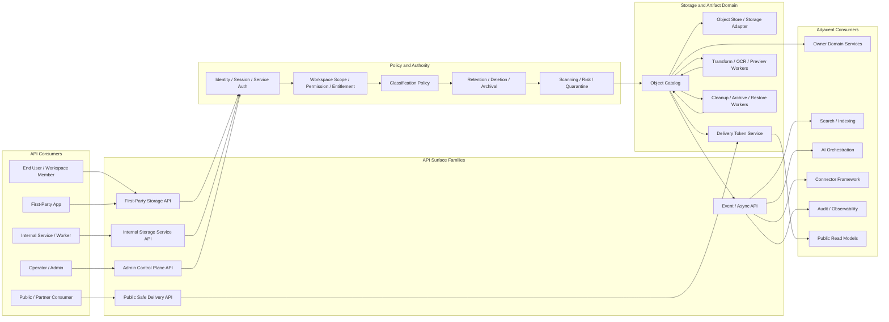
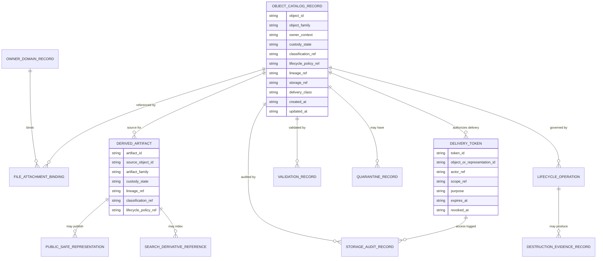
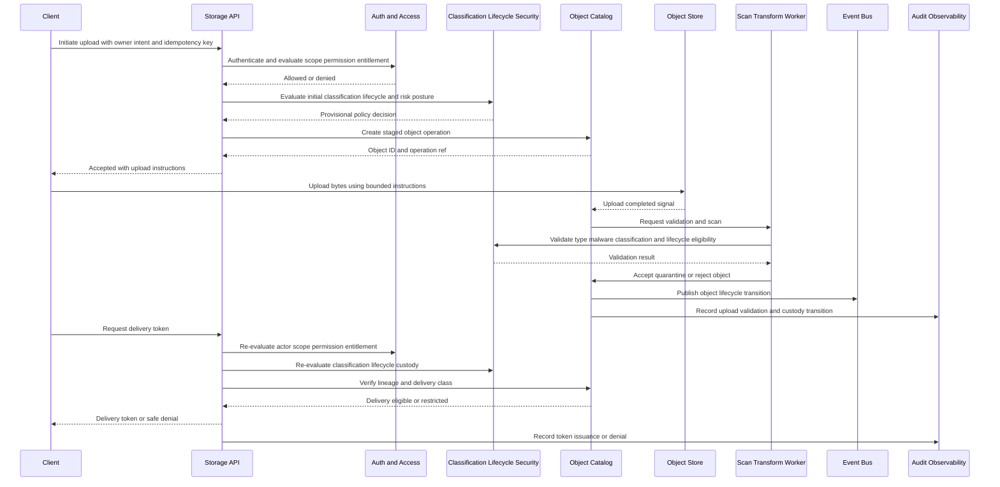

# FUZE File Object and Artifact Storage API Specification

## Document Metadata

- **Document Name:** `FILE_OBJECT_AND_ARTIFACT_STORAGE_API_SPEC.md`
- **Document Type:** API SPEC v2 / Production-grade interface-contract specification
- **Status:** Draft canonical API specification
- **Version:** 1.0.0
- **Effective Date:** 2026-04-24
- **Last Updated:** 2026-04-24
- **Reviewed On:** Not yet formally reviewed after API SPEC v2 generation
- **Document Owner:** FUZE Platform Storage and Artifact Architecture Domain for canonical storage semantics; FUZE API Architecture Domain for API contract expression
- **Approval Authority:** FUZE Platform Architecture and Governance Authority; explicit approval workflow not yet attached
- **Review Cadence:** Quarterly and whenever storage delivery, classification, lifecycle, object catalog, connector, AI artifact, search/indexing, public-media, CDN, delivery-token, malware scanning, archival, or restore posture materially changes
- **Governing Layer:** API contract layer derived from refined platform storage and artifact governance semantics
- **Parent Registry:** `API_SPEC_INDEX.md` and the FUZE API SPEC v2 Canonical File Registry
- **Upstream Semantic Registry:** `REFINED_SYSTEM_SPEC_INDEX.md`
- **Upstream API Registry:** `API_SPEC_INDEX.md`
- **Primary Audience:** API platform engineers, backend engineers, storage engineers, product engineers, AI platform engineers, connector engineers, search engineers, security engineers, privacy/compliance reviewers, SRE, support/control-plane operators, SDK/OpenAPI authors, AsyncAPI authors, and implementation-contract authors
- **Primary Purpose:** Define the API contract posture for FUZE file objects, storage object references, artifacts, derivatives, delivery tokens, staging/quarantine states, validation, transformation, export packages, public-safe representations, archival, restore, deletion coordination, and storage-action auditability while preserving refined storage semantics as the source of truth
- **Primary Upstream References:** `FILE_OBJECT_AND_ARTIFACT_STORAGE_SPEC.md`, `DATA_CLASSIFICATION_AND_HANDLING_SPEC.md`, `DATA_RETENTION_DELETION_AND_ARCHIVAL_SPEC.md`, `SEARCH_INDEXING_AND_DISCOVERY_SPEC.md`, `API_ARCHITECTURE_SPEC.md`, `PUBLIC_API_SPEC.md`, `INTERNAL_SERVICE_API_SPEC.md`, `EVENT_MODEL_AND_WEBHOOK_SPEC.md`, `IDEMPOTENCY_AND_VERSIONING_SPEC.md`, `MIGRATION_AND_BACKWARD_COMPATIBILITY_SPEC.md`, `INTEGRATION_CONNECTOR_FRAMEWORK_SPEC.md`, `SECURITY_AND_RISK_CONTROL_SPEC.md`, `SECRETS_CONFIG_AND_ENVIRONMENT_SPEC.md`, `AUDIT_LOG_AND_ACTIVITY_SPEC.md`, `AUDIT_AND_ACCESS_TRACEABILITY_SPEC.md`, `FUZE_ACCOUNT_ACCESS_AND_SESSION_THESIS_FINAL_SPEC.md`, `FUZE_ACCOUNT_ACCESS_AND_SESSION_CANONICAL_FINAL_SPEC.md`, `FUZE_WORKSPACE_ACCESS_CONTROL_BASICS_THESIS_FINAL_SPEC.md`
- **Primary Downstream Dependents:** Upload and attachment API contracts, object catalog schemas, delivery-token contracts, resumable-upload contracts, CDN/object-delivery adapters, malware-scanning contracts, media-processing contracts, OCR/extraction contracts, export package contracts, AI file-admission and artifact-return contracts, connector import/export contracts, search file-ingestion contracts, artifact cleanup contracts, archival/restore runbooks, support/operator inspection tooling, SDKs, OpenAPI documents, AsyncAPI event contracts
- **API Surface Families Covered:** First-party application APIs, internal service APIs, admin/control-plane APIs, event/async APIs, implementation-facing storage service contracts, limited public/partner-safe delivery APIs, reporting/read-model APIs where storage catalog status is exposed
- **API Surface Families Excluded:** Raw object-store vendor APIs, bucket configuration APIs, database DDL, CDN vendor configuration APIs, UI file-picker behavior, product-local business attachment approval APIs, exact malware-scanner engine APIs, exact transcoder/OCR implementation APIs, exact legal retention schedule APIs
- **Canonical System Owner(s):** FUZE Platform Storage and Artifact Architecture Domain; adjacent classification, lifecycle, security, search, connector, AI, and audit domains retain their own canonical semantic ownership
- **Canonical API Owner:** FUZE API Architecture Domain in coordination with FUZE Platform Storage and Artifact Architecture Domain
- **Supersedes:** Earlier or weaker API interpretations that expose files as anonymous blobs, treat signed URLs or object keys as authority, allow derived artifacts to escape lineage/lifecycle/classification, or let public delivery bypass approved public-safe representation rules
- **Superseded By:** None currently defined
- **Related Decision Records:** Not explicitly linked in retrieved governing materials
- **Canonical Status Note:** This API spec is canonical for interface-contract expression of FUZE file/object/artifact storage semantics. It does not supersede refined system semantics. Downstream endpoint, schema, SDK, worker, storage, CDN, and operational contracts MUST preserve the rules in this document and the upstream refined system spec.
- **Implementation Status:** Normative API contract source for downstream implementation planning; machine-readable OpenAPI/AsyncAPI artifacts remain downstream derivations
- **Approval Status:** Draft pending formal FUZE architecture approval
- **Change Summary:** Created API SPEC v2 contract for file/object/artifact storage, normalizing object catalog resources, upload and delivery flows, derived artifact lineage, public-safe representation rules, staging/quarantine behavior, archival/restore/deletion coordination, idempotency, audit, observability, migration, and implementation guardrails.

## Purpose

This API specification defines how FUZE APIs expose and consume storage-backed file objects, object catalog records, artifacts, derivatives, delivery tokens, public-safe representations, and storage lifecycle operations.

The API layer MUST express the refined storage semantics without redefining them. The refined storage specification owns what a file object, artifact, object catalog record, custody state, public-safe representation, and delivery token mean. This API spec owns how those concepts appear at FUZE API boundaries, what route families are allowed, what request and response classes must be distinguished, what errors are mandatory, what surfaces may mutate or read storage state, and what downstream contracts may not reinterpret.

## Scope

This specification governs API contracts for:

- registering and binding file-bearing objects into FUZE governance;
- upload initiation, upload completion, validation, scanning, staging, and quarantine state exposure;
- object catalog reads and storage-reference reads;
- file attachment bindings to owner-domain records;
- derived artifact, preview, thumbnail, OCR/extracted-text artifact, transformation, and export-package metadata;
- bounded delivery-token creation, validation, use, revocation, and expiry;
- public-safe or partner-safe media representation exposure;
- internal storage-service operations used by owner domains, workers, AI systems, connectors, search systems, and export services;
- admin/control-plane remediation for quarantines, failed transformations, orphaned objects, stuck cleanup, and restore operations;
- event publication for material object lifecycle transitions;
- audit, traceability, observability, idempotency, retry, replay, migration, and compatibility requirements.

## Out of Scope

This specification does not define:

- exact object-store bucket names, prefixes, replication strategies, shard keys, storage vendors, or CDN vendor mechanics;
- exact media scanning, malware scanning, transcoding, OCR, thumbnailing, or multipart-upload implementation detail;
- product-local business approval semantics attached to a file;
- exact UI flows for upload progress, previews, downloads, or file picker behavior;
- every domain-specific attachment schema;
- exact legal retention duration matrices;
- raw database schema or object-store IAM policy;
- final OpenAPI/AsyncAPI files, SDK implementation code, or service runbooks.

Those belong in downstream implementation-contracts, provided they do not weaken this specification.

## Design Goals

1. Preserve explicit separation between semantic owner truth and storage/object API truth.
2. Prevent object keys, blob existence, CDN cache entries, or signed URLs from becoming hidden authority.
3. Make all production-governed file-bearing objects addressable through governed object catalog records or equivalent metadata resources.
4. Ensure object APIs carry enough lineage, classification, lifecycle, owner context, custody state, and audit references for safe implementation.
5. Make uploads, imports, generated artifacts, exports, previews, delivery tokens, archive/restore, cleanup, and public-safe media compatible with idempotency, replay, and migration rules.
6. Keep public and partner storage exposure narrow, stable, and derived from approved public-safe representations only.
7. Provide downstream teams with implementation-ready contract rules without replacing lower-level storage implementation details.

## Non-Goals

- Make storage APIs the owner of business meaning, workflow completion, approval status, entitlement, or public publication truth.
- Let product teams invent incompatible attachment or artifact semantics outside the shared storage model.
- Treat upload completion as final business acceptance.
- Treat delivery-token possession as canonical authorization.
- Treat previews, OCR, embeddings-linked artifacts, generated files, or exports as exempt from classification and lifecycle posture.
- Allow admin or support APIs to become broad disclosure shortcuts.

## Core Principles

### Storage API Is Subordinate

The API MUST expose storage state as a governed support layer. It MUST NOT make file presence, URL availability, derived preview existence, or delivery-token issuance equivalent to business approval, workflow completion, public publication, or authorization truth.

### Every Governed Object Has Catalog Lineage

Every production-governed file-bearing object exposed through FUZE APIs MUST have an object catalog record or equivalent canonical metadata record before ordinary use. The catalog record MUST identify owner context, object family, custody state, lineage, classification posture, lifecycle posture, and delivery posture.

### Delivery Is a Governed Read

Downloads, previews, redirects, inline rendering, export retrieval, connector-bound transfer, and public-safe media access are governed read operations. APIs MUST evaluate identity, scope, authorization, effective permission, entitlement where applicable, classification, lifecycle, quarantine, and delivery policy before issuing or honoring delivery credentials.

### Derivatives Inherit Governance

Generated previews, thumbnails, OCR outputs, extracted text, transformed media, export packages, AI-generated file outputs, and public-safe representations MUST preserve source lineage and inherit governance unless a narrower approved rule applies.

### Temporary Is Still Governed

Staging uploads, temporary chunks, processing buffers, incomplete exports, and worker intermediates MUST remain access-restricted, cleanup-bound, auditable, and policy-aware. Temporary status does not exempt an API from classification, lifecycle, audit, or security constraints.

## Canonical Definitions

- **File object:** A FUZE-governed persisted object representing uploaded, imported, attached, or stored file-bearing content with metadata for governance.
- **Artifact:** A file-bearing output produced by FUZE systems, including export packages, reports, previews, thumbnails, OCR outputs, transformed media, generated AI assets, and evidence packages.
- **Object catalog record:** The canonical API-facing metadata resource binding a storage object to owner context, lineage, classification, lifecycle, custody state, and delivery posture.
- **Storage reference:** A non-semantic pointer to stored content. It MUST NOT be interpreted as business truth or access truth by itself.
- **Delivery token:** A bounded authorization artifact permitting a specific governed delivery operation for a specific object or representation, actor, scope, purpose, and duration.
- **Public-safe representation:** An explicitly approved representation eligible for public or broadly partner-safe delivery. It is distinct from the private/internal source object.
- **Custody state:** The API-visible storage-governance state for staged, validating, quarantined, accepted, active, delivery-restricted, public-safe-published, archived, cleanup-pending, destroyed, restore-pending, or superseded objects.

## Truth Class Taxonomy

The API MUST preserve the following truth classes:

1. **Semantic truth:** Owned by the domain record or workflow that gives a file or artifact business meaning.
2. **API contract truth:** Route, resource, request, response, error, status, idempotency, and compatibility commitments defined here and in derived OpenAPI/AsyncAPI artifacts.
3. **Policy truth:** Classification, lifecycle, public-delivery, transformation, disclosure, and security rules.
4. **Runtime truth:** Upload, scan, transform, delivery, cleanup, archival, restore, retry, replication, or job execution state.
5. **Storage truth:** Object catalog records, storage bindings, custody state, lifecycle state, lineage records, and integrity metadata.
6. **Provider-input truth:** Raw imported files, callback-linked file references, or connector-provided copies before FUZE normalization and owner-domain acceptance.
7. **Projection/reporting truth:** File lists, preview cards, storage dashboards, activity feeds, usage summaries, and read models.
8. **Public read-model truth:** Approved public-safe or partner-safe representations and publication-safe notices.
9. **Audit truth:** Durable evidence of uploads, access, token issuance, transforms, exports, restores, deletion, override, or disclosure.
10. **Implementation-adapter truth:** Storage-vendor metadata, CDN cache state, multipart upload fragments, scanner outputs, and transformation job internals.

These classes MUST remain distinguishable in schemas, events, logs, and SDKs.

## Architectural Position in the Spec Hierarchy

This API spec sits below refined system specifications and above downstream endpoint listings, OpenAPI/AsyncAPI artifacts, SDKs, storage schemas, service contracts, worker contracts, runbooks, and vendor adapters.

The upstream refined storage spec owns storage semantics. This API spec translates those semantics into interface constraints for public, first-party, internal, admin/control-plane, event, reporting, and implementation-facing surfaces.

## Upstream Semantic Owners

- `FILE_OBJECT_AND_ARTIFACT_STORAGE_SPEC.md` owns file, object, artifact, object catalog, delivery-token, custody-state, storage-lineage, and public-safe representation semantics.
- `DATA_CLASSIFICATION_AND_HANDLING_SPEC.md` owns classification taxonomy, release posture, and handling obligations.
- `DATA_RETENTION_DELETION_AND_ARCHIVAL_SPEC.md` owns retention, deletion, archival, hold, suppression, destruction, restore, and derived cleanup obligations.
- `SEARCH_INDEXING_AND_DISCOVERY_SPEC.md` owns indexing, retrieval, snippets, embeddings, and discovery behavior derived from file content.
- `INTEGRATION_CONNECTOR_FRAMEWORK_SPEC.md` owns provider-boundary normalization and connector lifecycle, while this API spec governs file-object custody for provider-imported and connector-exported file payloads.
- `AI_ORCHESTRATION_SPEC.md` and `MODEL_ROUTING_AND_CONTEXT_SPEC.md` own AI execution semantics, while this spec governs stored AI file inputs and generated file artifacts.
- `PUBLIC_API_SPEC.md`, `INTERNAL_SERVICE_API_SPEC.md`, `EVENT_MODEL_AND_WEBHOOK_SPEC.md`, `IDEMPOTENCY_AND_VERSIONING_SPEC.md`, and `MIGRATION_AND_BACKWARD_COMPATIBILITY_SPEC.md` govern cross-cutting API-family behavior.

## API Surface Families

### Public API

Public APIs MAY expose only narrow public-safe metadata, public-safe representation delivery, stable asset identifiers, lifecycle-safe status, and approved download/preview mechanisms. Public APIs MUST NOT expose private source objects, raw storage keys, internal object lineage, scanner details, quarantine reasons that leak security state, or delivery-token internals.

### First-Party Application API

First-party application APIs MAY support upload initiation, upload completion, attachment binding, object status, preview access, user download, generated artifact retrieval, and object lifecycle status for authenticated product users. These APIs MUST enforce workspace scope, effective permission, entitlement where applicable, classification, lifecycle posture, and custody-state rules.

### Internal Service API

Internal APIs MAY expose richer object catalog operations, scan results, transformation requests, lineage binding, cleanup coordination, storage copy/restore operations, and worker coordination. Internal APIs MUST remain owner-scoped, purpose-scoped, authenticated through service principals, authorized through service scopes, audited, and idempotency-safe.

### Admin / Control-Plane API

Admin APIs MAY support quarantine override, remediation, stuck cleanup repair, orphan-object containment, delivery-token revocation, restore approval execution, public-safe representation removal, and incident containment. Admin APIs MUST be separated from ordinary application APIs, reason-coded, policy-constrained, audited, and traceable to actor, authority, and change ticket where applicable.

### Event / Webhook / Async API

Event APIs MAY emit internal events for object lifecycle transitions, validation outcomes, transformation completion, artifact generation, delivery-token revocation, public-safe publication, archive, restore, deletion, cleanup, and quarantine. External webhooks MUST expose only approved derived event payloads and MUST NOT embed raw file content or private object storage references.

### Reporting / Read-Model API

Reporting APIs MAY expose lifecycle-safe aggregate or per-object status read models, storage usage, delivery metrics, transform status, cleanup backlog, or audit-safe summaries. Reporting APIs MUST NOT become mutation owners or bypass classification, lifecycle, and access posture.

### Chain-Adjacent API

This spec has no direct on-chain mutation authority. Chain-adjacent references MAY include immutable content hashes, public-safe artifact references, or evidence pointers only if approved by public-trust and chain-adjacent specifications. Raw private files and mutable internal storage references MUST NOT be treated as chain truth.

## System / API Boundaries

This API spec owns:

- resource-family posture for object catalog records, attachments, artifacts, delivery tokens, transforms, public-safe representations, and storage lifecycle operations;
- allowed public/first-party/internal/admin/event distinctions;
- contract-level request, response, error, status, idempotency, audit, and observability requirements;
- implementation guardrails that prevent route drift and schema drift.

This API spec does not own:

- business meaning of attached files;
- final workflow acceptance of generated artifacts;
- canonical classification taxonomy;
- exact lifecycle schedules;
- exact scanner engine verdict logic;
- exact object-store topology;
- raw storage vendor API details;
- UI rendering behavior.

## Adjacent API Boundaries

- `PUBLIC_API_SPEC.md` governs general external contract posture; this spec governs storage-specific public-safe exposure.
- `INTERNAL_SERVICE_API_SPEC.md` governs service-to-service norms; this spec governs storage-specific internal route families.
- `EVENT_MODEL_AND_WEBHOOK_SPEC.md` governs event semantics; this spec governs storage lifecycle events and payload constraints.
- `IDEMPOTENCY_AND_VERSIONING_SPEC.md` governs cross-domain idempotency/versioning; this spec identifies storage actions requiring those protections.
- `MIGRATION_AND_BACKWARD_COMPATIBILITY_SPEC.md` governs deprecation and migration; this spec identifies storage-object compatibility, delivery-token compatibility, and lineage migration constraints.
- `DATA_CLASSIFICATION_AND_HANDLING_API_SPEC.md` governs classification APIs; this spec consumes effective classification and enforces handling posture.
- `DATA_RETENTION_DELETION_AND_ARCHIVAL_API_SPEC.md` governs lifecycle APIs; this spec executes and reports storage-level lifecycle effects.
- `SEARCH_INDEXING_AND_DISCOVERY_API_SPEC.md` governs search APIs; this spec supplies extracted-text and file-lineage contract constraints.

## Conflict Resolution Rules

1. Refined system specifications win over API convenience.
2. Owner-domain semantics win on business meaning of an attached file or generated deliverable.
3. Classification, lifecycle, security, and public-trust rules win over storage convenience and delivery performance.
4. Storage semantics win on object catalog lineage, custody state, delivery-token posture, and derivative lineage.
5. API architecture specs win on cross-cutting interface-family behavior where they do not weaken storage semantics.
6. If a public or first-party API cannot prove effective authorization, classification posture, lifecycle posture, custody state, and lineage, it MUST deny or return a safe pending/restricted status.
7. If ambiguity remains, the API MUST choose the more restrictive architecture-consistent interpretation and emit a reviewable policy or governance issue.

## Default Decision Rules

- Unknown file-bearing objects default to private, non-public, governed, retention-bound, and non-indexed.
- Raw storage keys, bucket paths, CDN URLs, and vendor identifiers are implementation details and MUST NOT be exposed as stable business identifiers.
- Derived artifacts inherit source classification, lifecycle, access constraints, and owner context unless a narrower approved policy applies.
- Staged or quarantined objects default to no ordinary delivery.
- Public delivery defaults to approved public-safe representations, not source objects.
- Download and preview access defaults to explicit authorization plus a bounded delivery token or equivalent governed access mechanism.
- Object deletion defaults to policy evaluation, hold evaluation, derivative cleanup planning, and delivery-token invalidation.
- Restore defaults to explicit authorization, reason code, audit lineage, and restricted scope.
- Objects missing lineage, owner context, effective classification, lifecycle posture, or custody state MUST NOT be treated as production-ready.

## Roles / Actors / API Consumers

- End users uploading, previewing, downloading, or retrieving generated artifacts.
- Workspace members and administrators managing authorized attachments.
- Product services binding file objects to domain records.
- Upload and object catalog services coordinating storage state.
- Malware scanning and validation services returning validation outcomes.
- Media processors, OCR/extraction services, and transformation workers creating derivatives.
- AI orchestration and artifact-generation services storing inputs and outputs.
- Connector services importing provider files and exporting governed objects.
- Search/indexing services consuming extracted representations.
- Lifecycle cleanup, archive, restore, and deletion workers.
- Public-safe publication services.
- Support, security, privacy, compliance, and platform operators.
- Audit, monitoring, and incident-response systems.

## Resource / Entity Families

The API model MUST distinguish at least:

- `ObjectCatalogRecord`
- `StorageReference`
- `SourceFileObject`
- `ImportedFileObject`
- `FileAttachmentBinding`
- `StagingObject`
- `QuarantineRecord`
- `ValidationRecord`
- `DerivedArtifact`
- `PreviewArtifact`
- `ThumbnailArtifact`
- `TranscodedMediaObject`
- `OcrOrExtractedTextArtifact`
- `ExportPackage`
- `AiGeneratedArtifact`
- `AuditAttachmentOrEvidencePackage`
- `PublicSafeRepresentation`
- `DeliveryToken`
- `TransformJobReference`
- `ArchiveObjectReference`
- `CleanupOperation`
- `RestoreOperation`
- `DestructionEvidenceRecord`
- `ObjectLifecycleEvent`
- `ObjectAccessAuditRecord`

## Ownership Model

The storage/artifact API domain owns storage API contract expression, object catalog route posture, storage-reference access, custody-state exposure, delivery-token posture, derived-artifact lineage, and storage-action audit obligations.

Semantic owner domains own the meaning and business acceptance of attached or generated files. Classification owns handling posture. Lifecycle owns retention/deletion/archival posture. Security owns stronger containment. Search owns retrieval behavior. Integration owns provider normalization. AI owns model execution and context semantics. Public/reporting layers own approved derived read models only.

## Authority / Decision Model

### Storage API May Decide

- Whether an object catalog record is complete enough for ordinary storage use.
- Whether a delivery token can be issued after upstream authorization and policy checks succeed.
- Whether a requested transformation or derivative generation is storage-contract-valid.
- Whether a storage operation is accepted, pending, rejected, quarantined, cleanup-pending, or complete.

### Storage API Must Not Decide

- Whether a file has business approval.
- Whether a user has domain-level permission except through the canonical authorization/effective-permission systems.
- Whether classification or lifecycle obligations can be weakened.
- Whether provider input has become canonical without normalization and owner-domain acceptance.
- Whether public publication is allowed outside approved public-trust/public-read rules.

## Authentication Model

- Public-safe delivery endpoints MAY be unauthenticated only when they rely on approved public-safe representations and non-secret stable identifiers or bounded delivery credentials approved for public distribution.
- First-party APIs MUST authenticate a canonical user/session through the FUZE identity/auth/session model.
- Internal APIs MUST authenticate service principals and MUST be purpose-scoped.
- Admin APIs MUST authenticate named operators or privileged service principals and SHOULD require stronger session posture for sensitive actions.
- Delivery tokens MUST NOT replace authentication for APIs that require actor identity; they may authorize a specific delivery action after upstream checks.

## Authorization / Scope / Permission Model

Object access MUST be checked against workspace scope, owner-domain permission, effective permission, classification posture, lifecycle posture, custody state, and entitlement where applicable.

APIs MUST distinguish:

- authority to upload into a scope;
- authority to bind an object to a domain record;
- authority to preview or download;
- authority to request transformation/export;
- authority to publish public-safe representation;
- authority to archive, restore, delete, or remediate;
- authority to view audit or operational details.

Possession of an object ID, storage reference, preview ID, or delivery token MUST NOT grant broader access than the checked operation allows.

## Entitlement / Capability-Gating Model

Entitlements MAY limit maximum upload size, allowed media types, export formats, transformation families, AI artifact generation, public-safe publication, connector-bound transfer, retention tier, delivery volume, or storage quotas. Entitlement denial MUST be distinct from permission denial and policy denial.

## API State Model

API-visible custody states MUST include or map to:

- `staged`
- `awaiting_validation`
- `quarantined`
- `accepted`
- `active`
- `delivery_restricted`
- `public_safe_published`
- `archive_pending`
- `archived`
- `deletion_pending`
- `cleanup_pending`
- `destroyed`
- `minimized_for_evidence`
- `restore_pending`
- `superseded`
- `failed_validation`
- `failed_transformation`
- `failed_delivery_preparation`

State rules:

- `accepted` means accepted into storage governance, not user visibility.
- `active` means ordinary governed availability, not universal accessibility.
- `public_safe_published` applies only to approved representations.
- `cleanup_pending` MUST remain visible to operations and governance surfaces.
- `destroyed` requires evidence or access-termination lineage required by policy.

## Lifecycle / Workflow Model

1. A client initiates upload/import/artifact generation with owner-context intent.
2. API returns upload or operation acceptance with an operation reference.
3. Runtime stores staged content and creates provisional catalog metadata.
4. Validation, scanning, policy checks, classification binding, and metadata completion occur.
5. Object becomes accepted/active or failed/quarantined/rejected.
6. Owner-domain binding occurs if authorized and semantically valid.
7. Derivatives are generated with source lineage.
8. Delivery tokens are issued only for authorized, policy-allowed, lifecycle-allowed, custody-safe representations.
9. Events and audit records are emitted for material transitions.
10. Lifecycle operations drive archival, deletion, cleanup, restore, suppression, and delivery-token invalidation.

## Architecture Diagram — Mermaid flowchart

## Data Design — Mermaid Diagram

## Flow View

### Upload and Acceptance Flow

1. Client requests upload initiation with target scope, owner-context intent, file metadata, expected size/hash where available, and idempotency key.
2. API authenticates actor and evaluates upload capability, scope, entitlement, and initial policy.
3. API creates staged object/operation reference and returns bounded upload instructions.
4. Client completes upload or import.
5. API or worker validates integrity, type, size, malware/scanner posture, classification hints, metadata completeness, and owner-context eligibility.
6. API records accepted, quarantined, rejected, or failed-validation state.
7. If accepted, object catalog record becomes eligible for authorized binding and ordinary governed use.
8. Events, audit records, and observability metrics are emitted.

### Delivery Flow

1. Actor requests preview/download/redirect/export retrieval.
2. API authenticates actor unless the route is explicitly public-safe.
3. API evaluates owner-domain permission, workspace scope, entitlement, classification, lifecycle posture, custody state, and delivery class.
4. API denies, returns restricted status, or issues a bounded delivery token.
5. Delivery service validates token purpose, actor/scope binding where applicable, expiry, revocation, object custody state, and representation identity.
6. Access is logged with correlation ID, request ID, object ID, representation ID, actor/service, and policy references.

### Transform / Derivative Flow

1. Service requests derivative generation with source object ID, transform family, purpose, and idempotency key.
2. API verifies source lineage, custody state, classification, lifecycle, entitlement, and transform policy.
3. Worker generates derivative and registers artifact with lineage.
4. Derived artifact inherits governance by default.
5. Search, AI, export, or public-safe consumers receive events only if approved.

### Failure / Retry / Remediation Flow

- Duplicate upload initiation with same idempotency key MUST return the original operation or deterministic conflict.
- Scanner or transform failure MUST set a safe failed/quarantined state rather than silently enabling delivery.
- Delivery-token issuance failure MUST NOT expose raw storage reference.
- Stuck cleanup or orphaned object states MUST be remediated through admin/control-plane APIs with reason codes and audit.

## Data Flows — Mermaid sequenceDiagram

## Request Model

All mutating or operation-creating requests MUST include or derive:

- actor or service principal;
- target workspace/account/organization scope;
- owner-context intent or existing owner binding where applicable;
- object family or artifact family;
- purpose code;
- idempotency key for material upload, import, transform, export, restore, delete, cleanup, and token-issuance requests where replay may occur;
- correlation ID/request ID;
- client contract version;
- file metadata, expected size/hash/content type where applicable;
- classification hints only as input hints, not final classification truth;
- lifecycle policy reference when available or resolvable;
- operation reason code for admin/control-plane actions.

Requests MUST NOT require or expose raw storage keys to ordinary clients. Storage references used internally MUST be opaque, non-semantic, and purpose-scoped.

## Response Model

Responses MUST distinguish:

- synchronous success from accepted async intent;
- accepted storage governance from business-domain acceptance;
- ordinary active availability from public-safe publication;
- restricted/quarantined/failed states from missing objects;
- delivery-token issuance from actual delivery completion;
- deletion/archive/restore acceptance from final cleanup/destruction.

Common response classes:

- `200 OK` for completed safe read or deterministic idempotent replay;
- `201 Created` for created catalog records or derived artifacts when immediately complete;
- `202 Accepted` for upload, scan, transform, export, cleanup, restore, delete, or archive operations pending final outcome;
- `204 No Content` for completed revocation or metadata-only lifecycle update where no body is needed;
- `304 Not Modified` where safe caching semantics are approved;
- safe status payloads for `staged`, `awaiting_validation`, `quarantined`, `active`, `delivery_restricted`, `archived`, `cleanup_pending`, and `destroyed`.

## Error / Result / Status Model

Required error classes:

- `AUTHENTICATION_REQUIRED`
- `SERVICE_AUTHENTICATION_REQUIRED`
- `PERMISSION_DENIED`
- `SCOPE_MISMATCH`
- `ENTITLEMENT_REQUIRED`
- `CLASSIFICATION_RESTRICTED`
- `LIFECYCLE_RESTRICTED`
- `OBJECT_NOT_FOUND`
- `OBJECT_NOT_DELIVERABLE`
- `OBJECT_QUARANTINED`
- `OBJECT_VALIDATION_FAILED`
- `OBJECT_LINEAGE_INCOMPLETE`
- `OWNER_CONTEXT_REQUIRED`
- `UNSUPPORTED_OBJECT_FAMILY`
- `UNSUPPORTED_MEDIA_TYPE`
- `SIZE_LIMIT_EXCEEDED`
- `HASH_MISMATCH`
- `IDEMPOTENCY_CONFLICT`
- `TOKEN_EXPIRED`
- `TOKEN_REVOKED`
- `PUBLIC_REPRESENTATION_REQUIRED`
- `POLICY_VERSION_CONFLICT`
- `RATE_LIMITED`
- `ABUSE_SUSPECTED`
- `OPERATION_ALREADY_FINALIZED`
- `ADMIN_REASON_REQUIRED`
- `MIGRATION_REQUIRED`
- `DEGRADED_MODE_RESTRICTED`

Errors MUST be safe to expose for the surface family. Public and partner APIs MUST avoid leaking scanner internals, object existence across scopes, or hidden private file metadata.

## Idempotency / Retry / Replay Model

Idempotency is mandatory for:

- upload initiation and completion finalization;
- import acceptance;
- owner binding operations;
- delivery-token issuance where retries are expected;
- derivative generation;
- export package generation;
- archive, restore, deletion, suppression, cleanup, and token revocation;
- admin remediation actions;
- event replay and worker retry.

Idempotency keys MUST be scoped by actor/service, operation family, target object or owner context, request fingerprint, and contract version. Replays MUST return the original result, current operation state, or deterministic `IDEMPOTENCY_CONFLICT` when request fingerprint differs.

Retries MUST NOT create duplicate artifacts, duplicate delivery tokens beyond approved token policy, duplicate public-safe representations, duplicate lifecycle operations, or duplicate audit evidence that obscures lineage.

## Rate Limit / Abuse-Control Model

APIs MUST enforce abuse controls for:

- upload initiation and byte volume;
- failed validation/malware scanning patterns;
- high-frequency delivery-token requests;
- public-safe media requests;
- preview generation and transformation workload;
- export package creation;
- connector import/export file movement;
- admin bulk remediation;
- suspicious object enumeration.

Rate-limit responses MUST preserve safe error semantics and SHOULD include retry-after or operation references where safe. Abuse controls MUST be auditable and SHOULD emit security/risk events where material.

## Endpoint / Route Family Model

Allowed route families include:

### First-Party Application Routes

- `POST /storage/objects:initiate-upload`
- `POST /storage/objects/{object_id}:complete-upload`
- `GET /storage/objects/{object_id}`
- `GET /storage/objects/{object_id}/status`
- `POST /storage/objects/{object_id}:bind-owner`
- `GET /storage/objects/{object_id}/attachments`
- `POST /storage/objects/{object_id}/delivery-tokens`
- `GET /storage/artifacts/{artifact_id}`
- `POST /storage/objects/{object_id}:request-preview`
- `POST /storage/objects/{object_id}:request-export`

### Internal Service Routes

- `POST /internal/storage/catalog-records`
- `PATCH /internal/storage/catalog-records/{object_id}`
- `POST /internal/storage/objects/{object_id}:record-validation-result`
- `POST /internal/storage/objects/{object_id}:quarantine`
- `POST /internal/storage/objects/{object_id}:generate-derivative`
- `POST /internal/storage/artifacts/{artifact_id}:finalize`
- `POST /internal/storage/objects/{object_id}:schedule-cleanup`
- `POST /internal/storage/objects/{object_id}:invalidate-delivery`

### Admin / Control Plane Routes

- `POST /admin/storage/objects/{object_id}:remediate`
- `POST /admin/storage/objects/{object_id}:release-quarantine`
- `POST /admin/storage/objects/{object_id}:force-restrict-delivery`
- `POST /admin/storage/objects/{object_id}:restore`
- `POST /admin/storage/objects/{object_id}:mark-destruction-evidence`
- `GET /admin/storage/objects/{object_id}/lineage`
- `GET /admin/storage/objects/{object_id}/audit`

### Public-Safe Routes

- `GET /public/storage/representations/{representation_id}`
- `GET /public/storage/representations/{representation_id}/metadata`
- `GET /public/storage/downloads/{delivery_token}` where approved by public-delivery policy

Route names are canonical families, not final exhaustive endpoint listings. Downstream OpenAPI files MAY refine route naming only if semantics remain intact.

## Public API Considerations

Public APIs MUST:

- expose only public-safe representations or approved public metadata;
- avoid raw source object IDs unless the identifier is explicitly public-safe;
- avoid raw storage keys, bucket names, internal lineage, scanner details, private classification labels, or lifecycle internals;
- support stable compatibility and cache-control rules where public access is approved;
- revoke or suppress public access when lifecycle, classification, security, governance, or public-trust posture changes.

## First-Party Application API Considerations

First-party APIs MAY expose richer user/workspace status but MUST preserve safe distinctions among staged, validating, quarantined, active, restricted, archived, deletion pending, and cleanup pending. User-facing status MUST NOT imply business approval unless the owner-domain API also says so.

## Internal Service API Considerations

Internal APIs MUST NOT become hidden broad-write shortcuts. Each route MUST identify the calling service, purpose, owner context, object family, and operation. Internal services MUST consume policy decisions rather than locally inventing release rules.

## Admin / Control-Plane API Considerations

Admin/control-plane APIs MUST be explicit, bounded, reason-coded, policy-constrained, and audited. Bulk operations MUST support dry-run or preview where practical. Operator access to stored content MUST be narrower than technical retrievability and MUST require appropriate authority and traceability.

## Event / Webhook / Async API Considerations

Internal events SHOULD be emitted for:

- object staged;
- upload completed;
- validation passed/failed;
- object quarantined/released;
- object accepted/active;
- derivative requested/completed/failed;
- delivery token issued/revoked/expired where material;
- public-safe representation published/suppressed;
- object archived/restored/deletion-pending/destroyed;
- cleanup pending/completed;
- orphan or lineage failure detected.

Webhook payloads MUST NOT include private file content, raw storage references, or unapproved internal metadata. Webhook receivers may receive references only to approved public/partner-safe resources.

## Chain-Adjacent API Considerations

Where hashes or public evidence references are used in chain-adjacent systems, APIs MUST distinguish hash/evidence reference from source object, public-safe representation, and business truth. Chain-adjacent exposure MUST NOT reveal private file content or mutable internal storage references.

## Data Model / Storage Support Implications

Downstream storage contracts MUST support:

- immutable object IDs distinct from vendor storage keys;
- owner context and provisional owner intent;
- object family and artifact family;
- custody state;
- classification and lifecycle policy references;
- source and derivative lineage;
- validation/scanner posture;
- storage integrity metadata;
- delivery class and public-safe representation flags;
- audit references and correlation IDs;
- operation references for async flows;
- idempotency records;
- cleanup and destruction evidence.

## Read Model / Projection / Reporting Rules

Read models MAY expose file lists, preview cards, storage usage, delivery status, transform status, cleanup status, and audit-safe activity. They MUST NOT become mutation owners or hidden permission authorities.

Read models MUST honor filter-before-expose rules. If policy cannot be resolved for a result, the result MUST be omitted or reduced to safe metadata, depending on approved surface rules.

## Security / Risk / Privacy Controls

- Objects requiring validation MUST remain staged or quarantined until checks pass.
- Scanner failures MUST fail closed for ordinary delivery.
- Secret-bearing or sensitive files MUST follow stronger classification and secrets policy.
- Delivery tokens MUST be bounded, expiring, scoped, revocable, and auditable.
- Public-safe representations MUST be approved separately from source objects.
- Admin access MUST be reason-coded and traceable.
- Incident response MUST be able to revoke tokens, suppress representations, quarantine objects, and force cleanup.

## Audit / Traceability / Observability Requirements

APIs MUST record:

- actor/service principal;
- workspace/account/organization scope;
- owner context;
- object ID and artifact ID;
- operation reference;
- idempotency key reference;
- policy versions;
- classification and lifecycle decision references;
- delivery token ID where applicable;
- reason code for admin/control actions;
- request ID, correlation ID, trace ID;
- timestamp and final/accepted/pending outcome;
- failure class and safe remediation reference.

Observability MUST cover upload latency, validation backlog, quarantine rates, transform backlog, token issuance, delivery failures, cleanup backlog, archive/restore operations, public-safe representation suppression, and policy-denial rates.

## Failure Handling / Edge Cases

- Upload completed but validation failed: object MUST remain failed/quarantined, not active.
- Catalog record created but bytes missing: object MUST remain staged or failed, not active.
- Bytes exist without catalog record: object MUST be contained and remediated; ordinary delivery forbidden.
- Owner binding fails after upload: object remains staged/accepted without ordinary owner use until remediated or cleaned up.
- Derived artifact completed after source deletion request: derivative MUST be suppressed or cleaned according to lifecycle policy.
- Delivery token issued before policy change: token MUST be revocable or invalidated when policy requires.
- Public-safe representation becomes unsafe: public access MUST be suppressed and audit/incident flow triggered if material.
- Restore requested while hold or security restriction exists: restore MUST be denied, narrowed, or remain pending according to policy.
- Search or AI derivative exists after source cleanup: cleanup_pending MUST remain visible until remediated.

## Migration / Versioning / Compatibility / Deprecation Rules

- Object IDs and artifact IDs MUST remain stable across API version migrations unless an explicit migration mapping exists.
- Storage-key formats MUST NOT be part of public compatibility contracts.
- Delivery-token format changes MUST preserve validation, expiry, revocation, and audit semantics or require explicit migration.
- Public-safe representation contracts require stricter compatibility guarantees than internal metadata contracts.
- Deprecated object families or delivery classes MUST remain readable or explicitly mapped until approved sunset.
- Migration must preserve lineage, classification, lifecycle posture, custody state, audit evidence, and idempotency history.

## OpenAPI / AsyncAPI / SDK Derivation Rules

OpenAPI derivations MUST:

- model object status and operation status separately;
- distinguish catalog record, source object, artifact, public-safe representation, and delivery token schemas;
- include explicit error classes and safe exposure rules;
- mark idempotency headers/fields on all mutating routes;
- avoid exposing raw storage keys to ordinary clients;
- encode admin reason-code requirements;
- preserve public/internal/admin route separation.

AsyncAPI derivations MUST:

- include object lifecycle events with source lineage and policy references;
- avoid raw file content in events;
- distinguish accepted intent events from finalized outcome events;
- include event idempotency/replay metadata.

SDKs MUST not wrap delivery tokens or object IDs in helper abstractions that imply authorization beyond the specific checked operation.

## Implementation-Contract Guardrails

Downstream implementation MUST NOT:

- use object storage path as authorization truth;
- expose signed URLs without policy and custody-state checks;
- mark upload completion as business-domain success;
- generate derivatives without lineage;
- index or AI-ingest file content without explicit eligibility;
- let public delivery use private source objects by default;
- let temporary objects escape cleanup;
- let admin access bypass reason codes and audit;
- let provider-imported files become FUZE-governed active objects without normalization and owner acceptance;
- keep derived artifacts after source lifecycle policy requires cleanup or suppression.

## Downstream Execution Staging

Implementation SHOULD stage rollout as:

1. Object catalog schema and metadata contract.
2. Upload initiation/completion and validation state machine.
3. Delivery-token service and governed read path.
4. Derived artifact registration and transform worker contracts.
5. Classification/lifecycle integration and cleanup orchestration.
6. Public-safe representation publication/suppression.
7. Admin remediation and audit tooling.
8. Search, AI, connector, export, and reporting integrations.
9. OpenAPI/AsyncAPI/SDK generation and compatibility gates.

## Required Downstream Specs / Contract Layers

- Object catalog schema contract
- Delivery-token contract
- Upload/resumable upload contract
- Validation/scanning result contract
- Transformation and derivative artifact contract
- Public-safe representation contract
- Storage lifecycle cleanup contract
- Archive/restore storage contract
- Storage audit event contract
- Search file-ingestion contract
- AI file-admission and generated artifact contract
- Connector file import/export custody contract
- Admin remediation runbook

## Boundary Violation Detection / Non-Canonical API Patterns

Forbidden patterns:

- returning raw object-store keys to users or partners;
- authorizing by possession of object ID alone;
- issuing public delivery for private source objects without approved representation;
- treating scanner success as business acceptance;
- generating unregistered exports or previews;
- storing AI artifacts or connector copies without object catalog lineage;
- indexing extracted text before source eligibility is resolved;
- hiding cleanup failures from governance and operations;
- allowing support tools to fetch arbitrary blobs without reason code and audit;
- treating archived objects as ordinary active objects.

Detection controls SHOULD flag orphaned blobs, catalog records without bytes, derivatives without source lineage, tokens issued for restricted objects, public representations linked to private sources without approval, long-lived staging objects, cleanup_pending objects beyond SLA, and delivery attempts after lifecycle suppression.

## Canonical Examples / Anti-Examples

### Canonical Example: User Uploads a Workspace Attachment

A user initiates upload in a workspace. The API authenticates the user, evaluates workspace permission and entitlement, creates a staged object, validates the uploaded file, records accepted custody state, binds the object to the owner-domain record only after owner-domain authorization succeeds, and issues preview delivery only through bounded delivery tokens.

### Anti-Example: Blob URL as Permission

A service returns a signed object-store URL because the user knows the object ID. This is forbidden. Delivery must be governed by authorization, scope, classification, lifecycle, custody state, and token posture.

### Canonical Example: Generated Export Package

A worker creates an export package as a derived artifact. It records source lineage, classification, lifecycle policy, operation reference, and cleanup policy. Delivery requires authorization and a bounded token. Deletion of source records triggers export suppression or cleanup according to lifecycle policy.

### Anti-Example: Public Thumbnail from Private Source

A thumbnail generated from a private file is placed on a public CDN because it is visually small. This is forbidden unless the thumbnail is explicitly approved as a public-safe representation.

## Acceptance Criteria

1. Every ordinary delivery path verifies object catalog record, owner context, custody state, classification posture, lifecycle posture, authorization, and delivery class before returning content or token.
2. Upload completion does not mark an object active until validation/scanning/metadata binding is complete or the object family explicitly allows a narrower accepted state.
3. Object IDs are stable API identifiers distinct from storage vendor keys.
4. Public routes expose only approved public-safe representations or public-safe metadata.
5. First-party APIs distinguish staged, awaiting_validation, quarantined, active, delivery_restricted, archived, deletion_pending, cleanup_pending, and destroyed states.
6. Internal APIs require service principal authentication and purpose-scoped authorization.
7. Admin APIs require reason codes and produce audit records.
8. Derived artifacts cannot be created without source lineage.
9. Search, AI, connector, export, and preview integrations cannot consume source content unless object eligibility is resolved.
10. Deletion, archival, restore, cleanup, transformation, and export operations are idempotent and replay-safe.
11. Delivery tokens are bounded, expiring, scoped, revocable, and auditable.
12. Lifecycle changes invalidate, suppress, or narrow delivery and derivatives according to policy.
13. Error responses distinguish permission denial, entitlement denial, classification restriction, lifecycle restriction, quarantine, validation failure, idempotency conflict, and not-found conditions safely.
14. OpenAPI derivations preserve public/first-party/internal/admin route separation.
15. AsyncAPI derivations distinguish accepted intent events from final outcome events.
16. Observability captures upload, validation, quarantine, transform, delivery, cleanup, archive, restore, and public-suppression outcomes.
17. Migration preserves lineage, custody state, lifecycle posture, classification posture, object IDs or explicit mappings, and audit evidence.

## Test Cases

### Positive Path

1. Initiate upload with valid workspace permission and entitlement; expect staged object and operation reference.
2. Complete upload with matching hash and valid type; expect awaiting_validation followed by accepted/active after scanner success.
3. Bind accepted object to authorized owner-domain record; expect binding record and audit event.
4. Request preview for active object with valid permission; expect bounded delivery token and audit record.
5. Generate thumbnail derivative; expect derived artifact with source lineage and inherited classification/lifecycle posture.
6. Publish approved public-safe representation; expect public-safe representation ID distinct from source object ID.

### Negative Path

7. Request delivery for quarantined object; expect `OBJECT_QUARANTINED` or safe restricted status.
8. Request delivery with object ID but no workspace permission; expect `PERMISSION_DENIED` without leaking private metadata.
9. Attempt to generate derivative without source lineage; expect `OBJECT_LINEAGE_INCOMPLETE`.
10. Attempt public delivery of private source object; expect `PUBLIC_REPRESENTATION_REQUIRED`.
11. Complete upload with hash mismatch; expect `HASH_MISMATCH` and failed/staged-safe state.
12. Attempt unsupported media type; expect `UNSUPPORTED_MEDIA_TYPE`.

### Authorization / Entitlement / Scope

13. User with read permission but no export entitlement requests export package; expect `ENTITLEMENT_REQUIRED`.
14. Service principal calls internal catalog route without purpose scope; expect service authorization denial.
15. Admin remediation without reason code; expect `ADMIN_REASON_REQUIRED`.
16. Cross-workspace object binding attempt; expect `SCOPE_MISMATCH`.

### Idempotency / Retry / Replay

17. Replay upload initiation with same idempotency key and same fingerprint; expect original staged object reference.
18. Replay upload initiation with same idempotency key and different file metadata; expect `IDEMPOTENCY_CONFLICT`.
19. Retry derivative generation after worker timeout; expect one derivative artifact, not duplicates.
20. Retry cleanup operation; expect deterministic current cleanup state.
21. Replay event delivery; consumers deduplicate by event ID and object transition reference.

### Lifecycle / Cleanup / Restore

22. Delete source object with preview and OCR derivative; expect cleanup_pending then derivative suppression/cleanup evidence.
23. Archive active object; expect archived state, delivery restriction, and audit evidence.
24. Restore archived object with valid authority; expect restore_pending then active or delivery_restricted according to policy.
25. Attempt restore without authority; expect permission/policy denial and audit record.
26. Delete source under hold; expect deletion narrowed/deferred/denied according to lifecycle policy.

### Public / Partner / Webhook

27. Public route requests approved representation; expect public-safe metadata/content only.
28. Public route requests private object ID; expect safe not-found or restricted response.
29. Webhook for artifact generated includes artifact reference but not raw storage key or file content.
30. Suppress public representation after policy change; expect public access denied and event/audit emitted.

### Rate Limit / Abuse / Degraded Mode

31. Excessive upload initiations; expect rate limit and audit/security signal where material.
32. Repeated failed validation from one actor; expect abuse controls and possible quarantine escalation.
33. Policy service degraded during delivery request; expect fail-closed restricted response unless explicit cached policy permits safe read.
34. Object catalog unavailable during delivery-token validation; expect delivery denial rather than raw storage fallback.

### Migration / Compatibility

35. Migrate object catalog schema; expect object IDs, lineage, classification, lifecycle, custody state, and audit references preserved.
36. Deprecate delivery-token format; old tokens remain verifiable until approved sunset or are safely invalidated with compatible error semantics.
37. SDK upgrade does not expose storage keys or collapse public/internal/admin distinctions.

### Boundary Violation

38. Attempt to index extracted text for object lacking index eligibility; expect denial and audit.
39. Attempt connector export of object without delivery authorization; expect policy denial.
40. Attempt support tool raw blob fetch without reason code; expect admin authorization failure.

## Dependencies / Cross-Spec Links

- `REFINED_SYSTEM_SPEC_INDEX.md`
- `API_SPEC_INDEX.md`
- `FILE_OBJECT_AND_ARTIFACT_STORAGE_SPEC.md`
- `DATA_CLASSIFICATION_AND_HANDLING_SPEC.md`
- `DATA_RETENTION_DELETION_AND_ARCHIVAL_SPEC.md`
- `SEARCH_INDEXING_AND_DISCOVERY_SPEC.md`
- `PUBLIC_API_SPEC.md`
- `INTERNAL_SERVICE_API_SPEC.md`
- `EVENT_MODEL_AND_WEBHOOK_SPEC.md`
- `IDEMPOTENCY_AND_VERSIONING_SPEC.md`
- `MIGRATION_AND_BACKWARD_COMPATIBILITY_SPEC.md`
- `INTEGRATION_CONNECTOR_FRAMEWORK_SPEC.md`
- `AI_ORCHESTRATION_SPEC.md`
- `MODEL_ROUTING_AND_CONTEXT_SPEC.md`
- `SECURITY_AND_RISK_CONTROL_SPEC.md`
- `SECRETS_CONFIG_AND_ENVIRONMENT_SPEC.md`
- `AUDIT_LOG_AND_ACTIVITY_SPEC.md`
- `AUDIT_AND_ACCESS_TRACEABILITY_SPEC.md`
- `FUZE_ACCOUNT_ACCESS_AND_SESSION_THESIS_FINAL_SPEC.md`
- `FUZE_ACCOUNT_ACCESS_AND_SESSION_CANONICAL_FINAL_SPEC.md`
- `FUZE_WORKSPACE_ACCESS_CONTROL_BASICS_THESIS_FINAL_SPEC.md`

## Explicitly Deferred Items

- Exact object catalog physical schema.
- Exact resumable-upload protocol.
- Exact storage vendor topology and replication model.
- Exact CDN configuration and byte-range delivery behavior.
- Exact scanner/transcoder/OCR implementation details.
- Product-local attachment schemas and UI details.
- Legal retention duration matrices.
- Final OpenAPI/AsyncAPI schema files.
- SDK implementation details.
- Operational runbook steps and SLO targets.

## Final Normative Summary

FUZE file/object/artifact storage APIs MUST treat stored content as governed platform assets subordinate to owner-domain truth, classification, lifecycle, security, authorization, audit, and public-trust posture. Every production-governed object MUST be represented by an object catalog record or equivalent metadata record with owner context, lineage, custody state, classification, lifecycle posture, and delivery posture. APIs MUST distinguish source objects, derived artifacts, public-safe representations, delivery tokens, storage references, and audit evidence. Public exposure MUST use approved public-safe representations, not raw private source objects. Delivery is a governed read, not a storage convenience. Derivatives inherit source governance. Temporary objects remain governed. Admin overrides must be bounded, reason-coded, and audited. Downstream OpenAPI, AsyncAPI, SDK, storage, worker, and operational contracts MUST preserve these boundaries and MUST NOT reinterpret storage accessibility as business authority.

## Quality Gate Checklist

- [x] Upstream refined semantic owners are explicit.
- [x] Canonical API owner is explicit.
- [x] API surface families are explicit.
- [x] Mutation boundaries are explicit.
- [x] Read boundaries are explicit.
- [x] Adjacent API boundaries are explicit.
- [x] Truth classes are explicit.
- [x] Conflict-resolution rules are explicit.
- [x] Default decision rules are explicit.
- [x] Public, first-party, internal, admin/control, event/webhook, reporting, and chain-adjacent distinctions are explicit where relevant.
- [x] Non-canonical API patterns are called out.
- [x] Operator/admin override paths are bounded, reason-coded, and audited.
- [x] Read-model, cache, reporting, and projection rules are explicit.
- [x] On-chain vs off-chain responsibilities are explicit where relevant.
- [x] Accepted-state vs final success semantics are explicit.
- [x] Idempotency and replay requirements are explicit.
- [x] Request, response, error, result, and status classes are explicit.
- [x] Failure and degraded-mode behaviors are explicit.
- [x] Audit, traceability, and observability requirements are explicit.
- [x] Versioning, migration, compatibility, and deprecation rules are explicit.
- [x] OpenAPI / AsyncAPI / SDK guardrails are explicit.
- [x] Dependencies and downstream impacts are explicit.
- [x] Non-goals and deferred items are explicit.
- [x] Architecture diagram uses Mermaid `flowchart` syntax.
- [x] Data design diagram uses Mermaid syntax.
- [x] Flow view is included.
- [x] Data flows use Mermaid `sequenceDiagram` syntax.
- [x] Acceptance criteria are concrete and testable.
- [x] Test cases cover positive, negative, authorization, entitlement, idempotency, retry, conflict, rate-limit, degraded-mode, audit, migration, and boundary-violation behavior.
