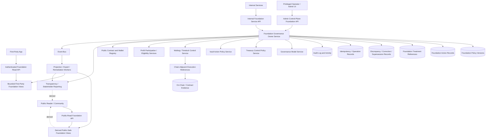

# FOUNDATION_GOVERNANCE_API_SPEC.md

## Document Metadata

- **Document Name:** `FOUNDATION_GOVERNANCE_API_SPEC.md`
- **Document Type:** FUZE API SPEC v2 — Production-grade API specification
- **Status:** Draft canonical API specification for production review
- **Version:** 2.0.0
- **Effective Date:** 2026-04-25
- **Last Updated:** 2026-04-25
- **Reviewed On:** 2026-04-25
- **Document Owner:** FUZE Foundation Governance Domain; named individual owner not specified in retrieved governing materials
- **Approval Authority:** FUZE architecture and governance approval workflow; named approval body not explicitly specified in retrieved governing materials
- **Review Cadence:** Quarterly and whenever Foundation role definition, governance-model posture, treasury-control posture, vault-action posture, multisig/timelock posture, profit-participation posture, transparency posture, or public-trust publication posture materially changes
- **Governing Layer:** API contract expression layer for Foundation governance, stewardship, protected-capital governance, and Foundation-specific control pathways
- **Parent Registry:** `API_SPEC_INDEX.md` and the FUZE API SPEC v2 canonical registry
- **Upstream Semantic Registry:** `REFINED_SYSTEM_SPEC_INDEX.md`
- **Upstream API Registry:** `API_SPEC_INDEX.md`
- **Primary Audience:** Backend engineering, platform architecture, contracts engineering, treasury and finance stakeholders, governance/control-plane authors, security engineering, audit/compliance, public-trust/reporting authors, implementation-contract authors, OpenAPI/AsyncAPI/SDK authors, QA and production-readiness reviewers
- **Primary Purpose:** Define the production-grade API contract for FUZE Foundation governance, including Foundation policy versions, Foundation-sensitive action records, principal-protection posture, allowed/disallowed-use treatment, control-path linkage, explicit profit-participation treatment, correction/supersession lineage, public-safe Foundation visibility, and downstream implementation guardrails
- **Primary Upstream References:** `REFINED_SYSTEM_SPEC_INDEX.md`, `DOCS_SPEC_INDEX.md`, `SYSTEM_SPEC_INDEX.md`, `API_SPEC_INDEX.md`, `SYSTEM_BOUNDARY_AND_OWNERSHIP_SPEC.md`, `SYSTEM_OVERVIEW_AND_BOUNDARIES_SPEC.md`, `PLATFORM_ARCHITECTURE_SPEC.md`, `DOMAIN_OWNERSHIP_MATRIX_SPEC.md`, `DATA_MODEL_AND_ENTITY_OWNERSHIP_SPEC.md`, `ONCHAIN_OFFCHAIN_RESPONSIBILITY_SPEC.md`, `GOVERNANCE_MODEL_SPEC.md`, `FOUNDATION_GOVERNANCE_SPEC.md`, `TREASURY_CONTROL_POLICY_SPEC.md`, `VAULT_ACTION_POLICY_SPEC.md`, `MULTISIG_AND_TIMELOCK_SPEC.md`, `PROFIT_PARTICIPATION_SYSTEM_SPEC.md`, `SNAPSHOT_AND_ELIGIBILITY_PIPELINE_SPEC.md`, `PAYOUT_LEDGER_SPEC.md`, `TRANSPARENCY_MODEL_SPEC.md`, `TRANSPARENCY_REPORTING_SPEC.md`, `PUBLIC_CONTRACT_AND_WALLET_REGISTRY_SPEC.md`, `CHAIN_ARCHITECTURE_SPEC.md`, `API_ARCHITECTURE_SPEC.md`, `PUBLIC_API_SPEC.md`, `INTERNAL_SERVICE_API_SPEC.md`, `EVENT_MODEL_AND_WEBHOOK_SPEC.md`, `IDEMPOTENCY_AND_VERSIONING_SPEC.md`, `MIGRATION_AND_BACKWARD_COMPATIBILITY_SPEC.md`, `AUDIT_LOG_AND_ACTIVITY_SPEC.md`, `AUDIT_AND_ACCESS_TRACEABILITY_SPEC.md`, `SECURITY_AND_RISK_CONTROL_SPEC.md`, `MONITORING_ALERTING_AND_INCIDENT_RESPONSE_SPEC.md`, `SECRETS_CONFIG_AND_ENVIRONMENT_SPEC.md`
- **Primary Downstream Dependents:** Foundation governance implementation contracts, Foundation-sensitive admin/control-plane tooling, treasury-control integration contracts, vault-action integration contracts, multisig/timelock control references, profit-participation treatment contracts, transparency/reporting/public-safe Foundation views, discrepancy and correction runbooks, OpenAPI/AsyncAPI/SDK derivation layers
- **API Surface Families Covered:** Public-read, first-party authenticated read, internal service, admin/control-plane, event/async, reporting/export, chain-adjacent reference surfaces
- **API Surface Families Excluded:** Raw smart-contract ABI interfaces, signer key-management APIs, direct treasury accounting APIs, direct payout claim APIs, raw transparency report composition APIs, product-local budget workflows, generic governance APIs outside Foundation-specific posture
- **Canonical System Owner(s):** Foundation Governance Domain owns Foundation stewardship semantics, principal-protection posture, allowed/disallowed-use governance, Foundation-sensitive action meaning, explicit profit-participation treatment posture, and Foundation-specific correction/supersession lineage
- **Canonical API Owner:** Foundation Governance API Domain, implemented through backend-owned API and service contracts
- **Supersedes:** API SPEC v1 `FOUNDATION_GOVERNANCE_API_SPEC.md` where it conflicts with this v2 production-grade API specification; weaker interpretations that treat Foundation APIs as treasury aliases, generic reserve administration, unrestricted operator controls, or public narrative pages
- **Superseded By:** None currently defined
- **Related Decision Records:** Not explicitly specified in retrieved governing materials
- **Canonical Status Note:** This API spec is the API-contract expression of the active refined Foundation governance semantics. It does not own system semantics. `FOUNDATION_GOVERNANCE_SPEC.md` and higher refined system specifications own semantic truth.
- **Implementation Status:** Normative API contract target; downstream implementation MUST align before production-grade activation
- **Approval Status:** Draft pending explicit FUZE approval workflow
- **Change Summary:** Upgrades the existing v1 Foundation governance API material into API SPEC v2 format; reinforces Foundation-specific stewardship and principal-preservation semantics; separates Foundation governance from treasury, vault, multisig/timelock, payout, reporting, and public registry truth; adds explicit route-family posture, request/response/error/idempotency/audit/migration/event rules, diagrams, acceptance criteria, and test cases

---

## Purpose

This document defines the FUZE API SPEC v2 contract for Foundation governance APIs.

The Foundation Governance API exists because the FUZE Foundation is not an ordinary treasury category, not a generic operator wallet, not a casual reserve label, and not a narrative-only trust device. It is a distinct long-horizon stewardship and protected-capital governance structure. API contracts that create, review, approve, link, expose, correct, or supersede Foundation-sensitive records MUST preserve that distinction.

This specification governs how API surfaces represent and enforce:

1. Foundation policy versions.
2. Foundation-sensitive action records.
3. Foundation principal-protection posture.
4. Allowed-use and disallowed-use classifications.
5. Stewardship consistency evaluation.
6. Foundation-specific destination and use-rationale treatment.
7. Control-path references to governance, multisig, timelock, emergency, or exceptional mechanisms.
8. Explicit Foundation treatment in profit-participation, eligibility-adjacent, reporting, and transparency surfaces.
9. Correction, supersession, discrepancy, and historical-intelligibility lineage.
10. Public-safe Foundation visibility without unsafe exposure of internal control detail.

This API specification does not redefine Foundation semantics. It expresses refined Foundation semantics as enforceable interface-contract rules.

---

## Scope

This specification covers API contract rules for:

- public-safe reads of active Foundation policy and published Foundation action summaries;
- first-party authenticated reads of bounded Foundation-related views where approved;
- internal service APIs for creating, classifying, validating, linking, and reading Foundation-governance records;
- admin/control-plane APIs for approving, rejecting, pausing, escalating, declaring exceptional treatment, superseding, correcting, and resolving Foundation-governance discrepancies;
- event and async APIs for Foundation lifecycle publication, projection refresh, discrepancy remediation, reporting linkage, and downstream coordination;
- reporting/export contracts that expose public-safe or restricted Foundation summaries without becoming canonical mutation owners;
- chain-adjacent API references that link Foundation governance actions to on-chain or multisig/timelock execution without collapsing off-chain governance truth into chain-native truth.

---

## Out of Scope

This specification does not govern:

- low-level Foundation Vault contract ABIs;
- signer roster, private key custody, safe module configuration, or exact quorum mechanics;
- final treasury control policy tables for every reserve or wallet;
- full vault-by-vault allowed-action catalogs;
- exact payout-cycle funding, claim, or eligibility execution logic;
- raw financial accounting exports;
- final transparency-report composition;
- final public registry composition for all contracts and wallets;
- generic governance APIs outside Foundation-specific action semantics;
- product-local budget approval workflows;
- user-interface layout or copywriting beyond API-visible status and summary fields;
- legal, tax, or regulatory determinations.

Where any of those areas affect Foundation-governance API behavior, this specification defines only the Foundation-governance interface contract and reference boundaries.

---

## Design Goals

1. Preserve the Foundation as a distinct long-horizon stewardship domain.
2. Prevent API routes from treating Foundation capital as ordinary treasury liquidity.
3. Make principal-protection posture explicit in every material Foundation-sensitive action.
4. Require narrow allowed-use interpretation and explicit restricted-use treatment.
5. Preserve separation between Foundation approval, downstream execution, public reporting, and final business outcome.
6. Provide deterministic request, response, error, idempotency, event, audit, and migration behavior.
7. Enable safe OpenAPI, AsyncAPI, SDK, admin tooling, and implementation-contract derivation.
8. Ensure public-safe Foundation visibility is useful, correction-aware, and bounded.
9. Make exceptions narrow, reason-coded, audited, and post-reviewed.
10. Prevent route, schema, ownership, projection, public exposure, and reporting drift.

---

## Non-Goals

This API spec does not attempt to:

- make the Foundation a general treasury interface;
- expose all Foundation-governance internals publicly;
- turn public dashboards into canonical Foundation truth;
- let internal service APIs become hidden broad-write shortcuts;
- allow admin/control-plane convenience to bypass policy, authorization, idempotency, or audit requirements;
- make chain execution the sole source of Foundation-governance meaning;
- make Foundation participation in profit participation implicit or inferred;
- replace downstream machine-readable OpenAPI, AsyncAPI, database schema, service runbook, or contract ABI documents.

---

## Core Principles

### 1. Refined Semantics Own Truth

`FOUNDATION_GOVERNANCE_SPEC.md` and higher refined system specifications own Foundation semantics. This API spec owns the interface-contract expression of those semantics.

### 2. Foundation Is Not Treasury Convenience

Foundation-governance APIs MUST NOT allow Foundation assets, actions, or policies to degrade into ordinary treasury movement, generic liquidity support, discretionary operator control, or informal market-support behavior.

### 3. Principal Preservation by Default

Foundation principal begins from preservation, not flexibility. Any material impairment, repurposing, destination change, or policy exception MUST be explicit, reviewable, reason-coded, and governance-constrained.

### 4. Approval Is Not Execution

Foundation approval authorizes a controlled path. It does not itself prove downstream execution, settlement, report publication, payout treatment, or final business outcome.

### 5. Explicit Treatment in Adjacent Systems

Foundation treatment in profit participation, eligibility-adjacent datasets, reporting artifacts, transparency reports, public registry surfaces, and chain-adjacent execution MUST be explicit and versioned. It MUST NOT be inferred from wallet labels or public narrative.

### 6. Public-Safe Visibility Is Derived

Public Foundation summaries, dashboards, exports, registry references, and reporting views are derived from canonical Foundation governance truth. They MUST NOT mutate Foundation truth or override canonical records.

### 7. Exceptions Are Narrow

Exceptional Foundation handling MAY exist only as a bounded, reason-coded, policy-constrained, audited, time-limited, and post-reviewed pathway.

### 8. Historical Intelligibility Is Mandatory

Correction, supersession, discrepancy, restricted publication, and exceptional treatment MUST preserve prior meaning and lineage. Silent overwrites are forbidden.

---

## Canonical Definitions

- **Foundation:** FUZE’s distinct long-horizon stewardship structure for continuity, credibility, and trust-sensitive capital discipline.
- **Foundation Principal:** Protected long-horizon Foundation capital subject to stronger preservation logic and exceptional-use thresholds.
- **Foundation Policy Version:** Canonical policy record that defines Foundation governance rules and their version lineage.
- **Foundation-Sensitive Action:** Any action that materially affects Foundation principal, Foundation treatment, Foundation-controlled destinations, Foundation role meaning, or Foundation-specific public interpretation.
- **Principal-Sensitive Action:** A Foundation-sensitive action that may impair, repurpose, reduce, move, encumber, reclassify, or publicly reinterpret Foundation principal.
- **Allowed Use:** A narrowly interpreted Foundation use category consistent with long-horizon stewardship and institutional continuity.
- **Restricted or Disallowed Use:** A use category that would cause Foundation capital to behave like ordinary operating treasury, discretionary liquidity, market support, shortfall reservoir, generic campaign spend, or unbounded backstop pool.
- **Stewardship Consistency:** API-visible classification of whether the action is consistent with Foundation purpose, policy version, principal protection, and public-trust posture.
- **Foundation Control Reference:** A reference to governance approval, multisig, timelock, emergency, exceptional, or execution-control mechanism associated with a Foundation-sensitive action.
- **Foundation Treatment Reference:** A structured reference describing how Foundation-held assets or balances are treated in profit participation, eligibility-adjacent, reporting, or transparency contexts.
- **Public-Safe Foundation View:** A derived read model that exposes bounded Foundation information suitable for public consumption.

---

## Truth Class Taxonomy

The API MUST preserve the following truth classes:

1. **Semantic truth:** Foundation stewardship, principal-protection, allowed-use, restricted-use, and Foundation-sensitive action meaning owned by the refined Foundation governance spec.
2. **API contract truth:** Route families, request/response structures, error classes, idempotency behavior, events, and compatibility rules owned by this API spec.
3. **Policy truth:** Foundation policy versions, governance policy references, approval rules, and allowed-use policies.
4. **Approval truth:** Records showing whether a Foundation-sensitive action was proposed, reviewed, approved, rejected, paused, escalated, or superseded.
5. **Execution truth:** Downstream execution, multisig/timelock, vault, chain, or operational records that carry out an approved path.
6. **Ledger/storage truth:** Durable Foundation governance records, idempotency records, operation records, and audit records.
7. **Profit-participation treatment truth:** Explicit Foundation inclusion/exclusion/treatment references consumed by profit-participation and eligibility-adjacent systems.
8. **Public read-model truth:** Derived public-safe views, summaries, exports, and reports generated from canonical records.
9. **Audit truth:** Immutable evidence of Foundation-sensitive mutations, operator actions, policy decisions, and correction/supersession lineage.
10. **Runtime truth:** Async operations, projection jobs, retry state, dead-letter state, discrepancy remediation state, and degraded-mode state.
11. **Presentation truth:** UI labels, copy, status text, and summaries derived from canonical and public-safe read models.
12. **Chain-adjacent truth:** Chain observations, transaction hashes, safe transactions, timelock queue records, or contract execution references, which are not full substitutes for Foundation governance meaning.

These truth classes MUST NOT be collapsed into a single Foundation dashboard, wallet label, contract event, admin screen, public article, or reporting export.

---

## Architectural Position in the Spec Hierarchy

This API specification sits below:

- `REFINED_SYSTEM_SPEC_INDEX.md`
- `SYSTEM_BOUNDARY_AND_OWNERSHIP_SPEC.md`
- `SYSTEM_OVERVIEW_AND_BOUNDARIES_SPEC.md`
- `PLATFORM_ARCHITECTURE_SPEC.md`
- `DOMAIN_OWNERSHIP_MATRIX_SPEC.md`
- `DATA_MODEL_AND_ENTITY_OWNERSHIP_SPEC.md`
- `ONCHAIN_OFFCHAIN_RESPONSIBILITY_SPEC.md`
- `GOVERNANCE_MODEL_SPEC.md`
- `FOUNDATION_GOVERNANCE_SPEC.md`
- shared API architecture specs including `API_ARCHITECTURE_SPEC.md`, `PUBLIC_API_SPEC.md`, `INTERNAL_SERVICE_API_SPEC.md`, `EVENT_MODEL_AND_WEBHOOK_SPEC.md`, `IDEMPOTENCY_AND_VERSIONING_SPEC.md`, and `MIGRATION_AND_BACKWARD_COMPATIBILITY_SPEC.md`

It sits above or alongside:

- Foundation governance implementation contracts;
- admin/control-plane implementation contracts;
- Foundation policy database schemas;
- Foundation public-safe projection contracts;
- Foundation reporting/export contracts;
- Foundation discrepancy/remediation runbooks;
- downstream OpenAPI/AsyncAPI/SDK artifacts.

---

## Upstream Semantic Owners

- **Foundation Governance Domain:** owns Foundation stewardship, principal protection, allowed-use/restricted-use interpretation, Foundation-sensitive action meaning, Foundation treatment posture, and correction/supersession lineage.
- **Governance Model Domain:** owns higher-order governance scope classification, governance action lifecycle, approval posture, exceptional-governance posture, and bounded future participation rules.
- **Treasury Control Policy Domain:** owns treasury-sensitive reserve controls and treasury-action policy. Foundation governance consumes treasury references but does not become ordinary treasury.
- **Vault Action Policy Domain:** owns what each vault category may do. Foundation governance adds stricter stewardship interpretation for Foundation-controlled or Foundation-sensitive actions.
- **Multisig and Timelock Domain:** owns threshold, delay, queued action, ready-for-execution, cancellation, expiry, and control-path semantics. Foundation governance links to those controls but does not own their technical internals.
- **Profit Participation Domain:** owns payout and participation truth. Foundation governance owns only explicit Foundation treatment policy consumed by that domain.
- **Transparency and Reporting Domains:** own public-trust interpretation and recurring report artifacts. Foundation governance provides source truth and references but does not compose final reports.
- **Public Contract and Wallet Registry Domain:** owns public designation truth for contracts and wallets. Foundation governance may require or reference registry changes but does not own registry publication truth.
- **Audit Domain:** owns immutable audit-record semantics and evidence-access posture.

---

## API Surface Families

### Public-Read Surface

Public-read APIs MAY expose bounded Foundation policy summaries, published Foundation-action summaries, public-safe correction/supersession information, public-safe reporting references, and public-safe treatment explanations. They MUST NOT expose internal approval notes, operator identity details, unsafe control-path details, raw internal financial logic, private treasury data, or unapproved Foundation-sensitive action drafts.

### First-Party Authenticated Surface

First-party authenticated APIs MAY expose caller-scoped or first-party-safe Foundation views where policy allows. Authentication alone does not grant access to privileged Foundation governance truth.

### Internal Service Surface

Internal service APIs MAY create and update Foundation-governance records only through owner-domain controlled routes. They MUST require service identity, explicit scope, idempotency keys for mutations, correlation IDs, and audit lineage.

### Admin / Control-Plane Surface

Admin/control-plane APIs MAY approve, reject, pause, escalate, declare exceptional treatment, supersede, or resolve discrepancies only under privileged operator authorization, reason codes, policy checks, idempotency, and critical audit logging.

### Event / Webhook / Async Surface

Internal events MAY publish Foundation lifecycle transitions and projection triggers. External webhooks MUST NOT be introduced unless a narrower approved public/partner contract explicitly allows them. Async APIs MUST distinguish accepted intent from final outcome.

### Reporting / Export Surface

Reporting/export APIs MAY expose derived public-safe or restricted Foundation reporting artifacts. They MUST preserve source lineage and must not become canonical mutation owners.

### Chain-Adjacent Surface

Chain-adjacent APIs MAY store and read references to transaction hashes, safes, timelock queue IDs, contract addresses, explorer references, and execution statuses. They MUST NOT treat chain observation alone as complete Foundation-governance meaning.

---

## System / API Boundaries

### Canonical Write Boundary

Only the Foundation Governance API owner-domain surface may mutate Foundation policy versions, Foundation-sensitive action records, Foundation classifications, Foundation treatment references, Foundation correction/supersession lineage, and Foundation discrepancy records.

### Canonical Read Boundary

Canonical internal reads come from owner-domain Foundation governance records. Public, reporting, and first-party views are derived projections.

### Derived Read Boundary

Derived Foundation views MAY exist for public pages, transparency reports, stakeholder reports, search, dashboards, and exports. Derived views MUST include source references, freshness indicators, publication state, and correction/supersession posture where relevant.

### Admin Boundary

Admin/control-plane APIs constrain privileged action; they do not own Foundation truth separately from the owner-domain service. Admin UI and admin orchestration MUST call owner-domain APIs rather than writing local truth.

### Chain Boundary

On-chain transactions, safe approvals, timelock queues, and contract events are execution or control evidence. They do not replace off-chain Foundation policy, approval, classification, treatment, reporting, or correction records.

---

## Adjacent API Boundaries

- `GOVERNANCE_MODEL_API_SPEC.md` governs cross-cutting governance action, policy, scope, review, and exceptional-governance APIs. Foundation APIs consume or specialize governance posture for Foundation-specific meaning.
- `TREASURY_CONTROL_POLICY_API_SPEC.md` governs treasury-control APIs and reserve-sensitive treasury actions. It MUST NOT absorb Foundation-specific principal-preservation semantics.
- `VAULT_ACTION_POLICY_API_SPEC.md` governs vault-category action APIs. It MUST NOT weaken Foundation governance where Foundation vaults or Foundation-sensitive destinations are involved.
- `MULTISIG_AND_TIMELOCK_API_SPEC.md` governs control-profile and queued-action APIs. Foundation APIs link to control references but do not redefine threshold or delay mechanics.
- `PROFIT_PARTICIPATION_API_SPEC.md` governs participation-period, allocation, and payout-intent APIs. Foundation APIs provide explicit Foundation treatment references only.
- `TRANSPARENCY_MODEL_API_SPEC.md` and `TRANSPARENCY_REPORTING_API_SPEC.md` govern public-trust interpretation and recurring reporting APIs. Foundation APIs supply source-grounded Foundation facts and public-safe summaries.
- `PUBLIC_CONTRACT_AND_WALLET_REGISTRY_API_SPEC.md` governs registry entries. Foundation APIs may require registry linkage for Foundation wallets or contracts but do not own registry publication truth.

---

## Conflict Resolution Rules

1. Active refined registry and higher constitutional materials win over narrower API text.
2. Top-level boundary, ownership, architecture, domain ownership, and data ownership specifications win on ownership and boundary interpretation.
3. `FOUNDATION_GOVERNANCE_SPEC.md` wins on Foundation stewardship, principal protection, allowed/disallowed-use interpretation, explicit treatment posture, and Foundation-specific correction/supersession semantics.
4. `GOVERNANCE_MODEL_SPEC.md` wins on higher-order governance semantics, governance-scope classification, approval-path posture, exceptional-governance posture, and future participation boundaries.
5. Treasury, vault, multisig/timelock, profit participation, registry, transparency, payout, audit, and chain specs win inside their own narrower source domains.
6. This API spec wins on Foundation Governance API route-family posture, request/response/error/idempotency/event/audit/migration behavior, unless it conflicts with a higher semantic source.
7. Public pages, dashboards, exports, caches, SDKs, and admin screens never win over canonical Foundation governance records.
8. When ambiguity remains, implementations MUST choose the more conservative trust-preserving interpretation and open a discrepancy or decision-record process.

---

## Default Decision Rules

1. Foundation capital is distinct from ordinary treasury by default.
2. Foundation principal is preserved by default.
3. Ambiguous use classes default to restricted or review-required.
4. Ambiguous destination classes default to rejection or escalation, not silent approval.
5. Ambiguous Foundation treatment in profit participation defaults to incomplete until explicit policy treatment is recorded.
6. Public visibility defaults to public-safe summaries, not full internal disclosure.
7. Admin override defaults to unavailable unless a route explicitly permits it with reason code, idempotency, authorization, and audit.
8. Exceptional Foundation handling defaults to narrow duration, post-review, and remediation closure.
9. If policy version, governance scope, principal sensitivity, approval path, or control reference is missing for a material action, the action MUST NOT proceed to approval or execution linkage.
10. Historical Foundation meaning defaults to preserved lineage rather than overwrite.

---

## Roles / Actors / API Consumers

### Human Actors

- Foundation stewards where applicable.
- Governance reviewers.
- Privileged operators.
- Treasury and finance stakeholders.
- Public-trust and reporting authors.
- Security and incident operators.
- Audit and compliance reviewers.
- Community/public readers of public-safe outputs.

### System Actors

- Foundation governance service.
- Governance model service.
- Treasury-control service.
- Vault-action policy service.
- Multisig/timelock control service.
- Profit-participation service.
- Snapshot/eligibility service.
- Payout-ledger service.
- Public registry service.
- Transparency/reporting services.
- Audit and activity service.
- Event bus and projection workers.
- Monitoring and alerting systems.

### API Consumers

- `fuze-backend-api` services through owner-domain and internal APIs.
- Approved admin/control-plane clients through backend-mediated privileged routes.
- Public web and public API consumers through public-safe reads.
- First-party product clients through bounded authenticated reads.
- Reporting/export systems through derived read contracts.
- Async workers through internal events and job references.

---

## Resource / Entity Families

### Canonical Resources

- `foundation_policy_version`
- `foundation_principal_treatment_profile`
- `foundation_sensitive_action`
- `foundation_action_classification`
- `foundation_allowed_use_classification`
- `foundation_destination`
- `foundation_approval_path`
- `foundation_control_reference`
- `foundation_profit_participation_treatment_reference`
- `foundation_reporting_reference`
- `foundation_exception_record`
- `foundation_discrepancy_case`
- `foundation_correction_record`
- `foundation_supersession_record`
- `foundation_operation_record`
- `foundation_idempotency_record`

### Derived Resources

- `foundation_public_policy_view`
- `foundation_public_action_view`
- `foundation_internal_status_view`
- `foundation_reporting_export`
- `foundation_projection_status`
- `foundation_public_interpretation_view`

### Audit and Runtime Resources

- `foundation_audit_event`
- `foundation_async_operation`
- `foundation_projection_job`
- `foundation_dead_letter_record`
- `foundation_remediation_case`

---

## Ownership Model

The Foundation Governance API owner owns mutation authority for canonical Foundation-governance resources. No public page, reporting service, treasury tool, vault tool, contract watcher, admin UI, payout service, registry service, or transparency surface may mutate Foundation truth directly.

Adjacent systems MAY submit candidate inputs, references, or evidence to Foundation-governance APIs. Those inputs remain provider/input/reference truth until validated and accepted by Foundation Governance.

---

## Authority / Decision Model

Foundation-sensitive decisions require explicit separation of:

1. source-domain meaning;
2. governance classification;
3. Foundation policy version;
4. principal-sensitivity classification;
5. allowed-use/restricted-use determination;
6. review/approval path;
7. control-path reference;
8. downstream execution reference;
9. reporting/public interpretation reference;
10. correction/supersession lineage.

Admin/control-plane actors MAY initiate or approve bounded operations only when authorized. They do not own semantic truth. Internal services MAY create and link records only where their service identity and scope allow. Chain observers MAY provide evidence, but they do not decide Foundation-governance validity.

---

## Authentication Model

Public-read routes MAY allow unauthenticated access where records are explicitly published. Authenticated first-party reads require valid session authentication. Internal service routes require service-to-service identity with environment-bound credentials. Admin/control-plane routes require authenticated privileged operator identity, step-up controls where policy requires, and a reason-coded operation request.

Authentication MUST NOT be confused with authorization. A valid session or service identity is never sufficient by itself to approve Foundation-sensitive action.

---

## Authorization / Scope / Permission Model

Authorization MUST evaluate:

- caller type and route family;
- Foundation-governance permission or service scope;
- current resource state;
- policy version applicability;
- principal-sensitivity level;
- allowed-use/restricted-use classification;
- destination category and destination legitimacy;
- control-path requirements;
- reporting and public exposure constraints;
- whether the requested mutation is legal for the current lifecycle state;
- whether entitlement/capability gating applies to the consuming client or integration.

Privileged admin operations MUST require explicit reason codes and MUST generate critical audit records.

---

## Entitlement / Capability-Gating Model

Foundation-governance APIs are not ordinary product capabilities. Public reads MAY be generally available after publication. Internal, admin, export, and privileged report APIs MUST be gated by explicit service or operator capability. Future partner or authenticated stakeholder views MUST be explicitly enabled by policy and MUST NOT infer access from ordinary account or workspace membership.

---

## API State Model

### Foundation Policy Version States

- `draft`
- `active`
- `deprecated`
- `superseded`
- `archived`

### Foundation-Sensitive Action States

- `draft`
- `proposed`
- `under_review`
- `approved`
- `rejected`
- `ready_for_execution`
- `executed_reference_linked`
- `reported_if_applicable`
- `paused`
- `superseded`
- `closed`

### Approval Path States

- `proposal_recorded`
- `approval_pending`
- `approved`
- `rejected`
- `execution_linked`
- `closed`

### Exceptional Treatment States

- `declared`
- `containment_active`
- `post_review_pending`
- `closed`
- `superseded`

### Discrepancy States

- `opened`
- `under_review`
- `resolved`
- `failed`
- `closed`

### Projection States

- `not_projected`
- `projection_pending`
- `projected`
- `projection_failed`
- `stale`
- `withheld`
- `superseded`

---

## Lifecycle / Workflow Model

1. A Foundation-sensitive change is identified by an internal service, governance reviewer, treasury/vault service, control-plane operator, reporting service, or discrepancy detector.
2. The candidate input is submitted to Foundation Governance as a draft or proposed action.
3. Foundation Governance validates policy version, governance scope, principal sensitivity, use class, destination category, and stewardship consistency.
4. The API records a Foundation action classification and, where applicable, destination, treatment, control, reporting, and execution-reference placeholders.
5. The action enters review and requires an approval path appropriate to sensitivity.
6. The action is approved, rejected, paused, escalated, or declared exceptional.
7. Approved actions MAY link to multisig/timelock, vault, treasury, registry, reporting, payout, or chain-adjacent execution references.
8. Execution references are recorded as references, not as proof of Foundation semantic validity beyond the recorded control path.
9. Public-safe views and reporting exports refresh asynchronously where policy allows.
10. Corrections, supersessions, discrepancy closures, and exceptional post-reviews preserve lineage and audit evidence.

---

## Architecture Diagram — Mermaid flowchart



---

## Data Design — Mermaid Diagram

```mermaid
erDiagram
  FOUNDATION_POLICY_VERSION ||--o{ FOUNDATION_ACTION : governs
  FOUNDATION_ACTION ||--o{ FOUNDATION_ACTION_CLASSIFICATION : has
  FOUNDATION_ACTION ||--o{ FOUNDATION_DESTINATION : targets
  FOUNDATION_ACTION ||--o{ FOUNDATION_APPROVAL_PATH : requires
  FOUNDATION_ACTION ||--o{ FOUNDATION_CONTROL_REFERENCE : links
  FOUNDATION_ACTION ||--o{ FOUNDATION_TREATMENT_REFERENCE : defines
  FOUNDATION_ACTION ||--o{ FOUNDATION_REPORTING_REFERENCE : publishes
  FOUNDATION_ACTION ||--o{ FOUNDATION_EXECUTION_REFERENCE : references
  FOUNDATION_ACTION ||--o{ FOUNDATION_EXCEPTION_RECORD : may_have
  FOUNDATION_ACTION ||--o{ FOUNDATION_DISCREPANCY_CASE : may_have
  FOUNDATION_ACTION ||--o{ FOUNDATION_CORRECTION_RECORD : corrected_by
  FOUNDATION_ACTION ||--o{ FOUNDATION_SUPERSESSION_RECORD : superseded_by
  FOUNDATION_ACTION ||--o{ FOUNDATION_OPERATION_RECORD : mutated_by
  FOUNDATION_OPERATION_RECORD ||--|| FOUNDATION_IDEMPOTENCY_RECORD : protected_by
  FOUNDATION_OPERATION_RECORD ||--o{ FOUNDATION_AUDIT_EVENT : emits
  FOUNDATION_ACTION ||--o{ FOUNDATION_PUBLIC_VIEW : projects_to

  FOUNDATION_POLICY_VERSION {
    string foundation_policy_version_id PK
    string state
    string policy_version
    datetime effective_at
    datetime superseded_at
  }
  FOUNDATION_ACTION {
    string foundation_action_id PK
    string action_class
    string principal_sensitivity
    string lifecycle_state
    string policy_version_id FK
    datetime created_at
    datetime updated_at
  }
  FOUNDATION_ACTION_CLASSIFICATION {
    string classification_id PK
    string use_classification
    string stewardship_consistency
    string sensitivity_tier
    string validation_state
  }
  FOUNDATION_DESTINATION {
    string destination_id PK
    string destination_category
    string destination_reference
    string destination_validation_state
  }
  FOUNDATION_CONTROL_REFERENCE {
    string control_reference_id PK
    string control_type
    string external_reference
    string control_state
  }
  FOUNDATION_TREATMENT_REFERENCE {
    string treatment_reference_id PK
    string adjacent_domain
    string treatment_mode
    string treatment_state
  }
  FOUNDATION_PUBLIC_VIEW {
    string public_view_id PK
    string publication_state
    string freshness_state
    string source_action_id FK
  }
```



---

## Flow View

### Main Foundation Action Flow

1. **Create candidate action:** Internal service submits a candidate Foundation-sensitive action with policy version, action class, principal sensitivity, and idempotency key.
2. **Validate context:** Owner service validates policy version, caller scope, action class, principal sensitivity, destination category, allowed-use posture, and stewardship consistency.
3. **Record canonical draft/proposal:** The service creates a canonical action and operation record.
4. **Attach required references:** Destination, approval-path, control, profit-participation treatment, reporting, and execution-reference placeholders are attached as required.
5. **Review and approve/reject:** Admin/control-plane or governance workflow approves, rejects, pauses, escalates, or declares exceptional handling.
6. **Accepted async behavior:** If control-path or reporting updates are async, the API returns accepted state and an operation reference, not final outcome.
7. **Execution/reference linkage:** Approved action links to downstream execution or control artifacts without making those artifacts Foundation semantic owners.
8. **Projection and reporting:** Public-safe views and reporting references are generated asynchronously where policy permits.
9. **Audit and observability:** Every mutation writes audit, correlation, trace, operation, and idempotency records.
10. **Correction/supersession:** If records become stale, invalid, or unsafe, discrepancy/correction/supersession workflows preserve historical lineage.

### Failure / Retry / Degraded-Mode Flow

1. If validation fails, return deterministic problem details and do not create partial canonical state unless explicitly recorded as a rejected input.
2. If idempotency replay occurs, return the original compatible result.
3. If downstream control or reporting linkage fails after accepted response, keep the Foundation action in a pending or degraded state and expose remediation status internally.
4. If public projection fails, mark derived views stale or withheld rather than publishing incomplete Foundation meaning.
5. If ambiguity cannot be resolved, open discrepancy review and block approval/execution progression.

### Admin / Exceptional Flow

1. Privileged operator submits reason-coded exceptional action.
2. API validates privilege, state, policy, and emergency constraints.
3. API records exceptional action and audit evidence.
4. Ordinary action path is paused or constrained where required.
5. Post-review is required before closure.
6. Public-safe reporting occurs only where policy allows and MUST preserve safety and lineage.

---

## Data Flows — Mermaid sequenceDiagram

```mermaid
sequenceDiagram
  participant IS as Internal Service
  participant FG as Foundation Governance API
  participant Auth as AuthZ / Policy Engine
  participant Store as Foundation Canonical Store
  participant Audit as Audit Service
  participant Bus as Event Bus
  participant Worker as Projection Worker
  participant Public as Public-Safe View
  participant Ctrl as Multisig / Timelock Service
  participant Report as Transparency Reporting

  IS->>FG: POST /internal/v1/foundation-governance/actions + idempotency_key
  FG->>Auth: Validate service scope, policy version, sensitivity, allowed use
  Auth-->>FG: Authorized + policy decision
  FG->>Store: Create action, classification, operation, idempotency record
  FG->>Audit: Write action_created audit event
  FG->>Bus: Emit foundation_governance.action_created
  FG-->>IS: 201 Created canonical action

  IS->>FG: POST /actions/{id}/approval-paths
  FG->>Auth: Validate lifecycle and approval-path completeness
  Auth-->>FG: Authorized
  FG->>Store: Record approval path; state under_review
  FG->>Audit: Write approval_path_recorded
  FG->>Bus: Emit foundation_governance.approval_path_recorded
  FG-->>IS: 200 Approval path summary

  IS->>FG: POST /actions/{id}/control-references
  FG->>Ctrl: Validate control reference exists or is acceptable
  Ctrl-->>FG: Control reference accepted
  FG->>Store: Link control reference
  FG->>Audit: Write control_linked
  FG->>Bus: Emit foundation_governance.control_linked
  FG-->>IS: 202 Accepted if async validation continues

  Bus-->>Worker: Projection refresh requested
  Worker->>Store: Read canonical Foundation state
  Worker->>Public: Update public-safe view if publishable
  Worker->>Report: Link reporting reference if policy permits
  Worker->>Audit: Write projection/reporting lineage
```

---

## Request Model

### Required Headers

- `X-Correlation-ID` on all mutation and privileged read routes.
- `Idempotency-Key` on all mutation routes.
- Service identity headers or equivalent mTLS/service-auth context on internal routes.
- Operator identity context on admin/control-plane routes.
- API version or negotiated contract version where applicable.

### Common Mutation Fields

Mutation requests SHOULD include, where relevant:

- `foundation_policy_version_id`
- `foundation_action_id`
- `action_class`
- `principal_sensitivity`
- `use_classification`
- `destination_category`
- `destination_reference`
- `stewardship_rationale`
- `treatment_mode`
- `control_reference`
- `reporting_reference`
- `reason_code`
- `operator_note`
- `source_reference`
- `requested_effective_at`
- `idempotency_key`

### Validation Rules

- Missing policy version on a material action is invalid.
- Missing principal-sensitivity classification on a material action is invalid.
- Missing reason code on admin/control-plane mutation is invalid.
- Destination changes after `under_review` require explicit mutation route, reason code, and audit.
- Profit-participation treatment changes require explicit treatment reference and policy version.
- Ambiguous allowed-use classification MUST block approval until resolved.

---

## Response Model

### Success Responses

Successful responses MUST include:

- stable resource identifier;
- lifecycle state;
- policy version reference;
- principal-sensitivity summary;
- use-classification summary;
- control-reference summary where applicable;
- treatment-reference summary where applicable;
- reporting-reference summary where applicable;
- correction/supersession summary where applicable;
- timestamps;
- correlation ID;
- operation ID for mutation responses.

### Accepted Responses

Accepted async responses MUST include:

- `operation_id`;
- accepted lifecycle state;
- pending work type;
- status URL or internal status reference;
- retry guidance;
- clear statement that accepted state is not final business outcome.

### Public Read Responses

Public responses MUST be bounded and MUST distinguish:

- published Foundation policy summary;
- public-safe action summary;
- source reference and publication state;
- supersession/correction state;
- freshness or last-derived timestamp;
- withheld or restricted fields, if represented.

---

## Error / Result / Status Model

Errors MUST use structured problem-details style with:

- `type`
- `title`
- `status`
- `code`
- `detail`
- `instance`
- `correlation_id`
- optional `operation_id`
- optional `field_errors`
- optional `policy_decision_reference`

### Required Error Codes

- `FOUNDATION_GOVERNANCE_PERMISSION_DENIED`
- `FOUNDATION_GOVERNANCE_OPERATOR_SCOPE_REQUIRED`
- `FOUNDATION_POLICY_VERSION_REQUIRED`
- `FOUNDATION_POLICY_VERSION_NOT_ACTIVE`
- `FOUNDATION_ACTION_NOT_FOUND`
- `FOUNDATION_ACTION_STATE_CONFLICT`
- `FOUNDATION_PRINCIPAL_SENSITIVITY_REQUIRED`
- `FOUNDATION_USE_CLASSIFICATION_AMBIGUOUS`
- `FOUNDATION_USE_RESTRICTED`
- `FOUNDATION_DESTINATION_INVALID`
- `FOUNDATION_CONTROL_REFERENCE_REQUIRED`
- `FOUNDATION_TREATMENT_REFERENCE_REQUIRED`
- `FOUNDATION_APPROVAL_PATH_INCOMPLETE`
- `FOUNDATION_EXCEPTION_NOT_ALLOWED`
- `FOUNDATION_IDEMPOTENCY_CONFLICT`
- `FOUNDATION_RATE_LIMITED`
- `FOUNDATION_PUBLICATION_WITHHELD`
- `FOUNDATION_PROJECTION_STALE`
- `FOUNDATION_DISCREPANCY_OPEN`
- `FOUNDATION_MIGRATION_INCOMPLETE`

### Status Semantics

- `approved` means governance approval exists, not downstream execution completion.
- `ready_for_execution` means required API-side and control-path preconditions are met, not that execution happened.
- `executed_reference_linked` means a downstream execution reference is linked, not that public reporting is complete.
- `reported_if_applicable` means reporting linkage has been performed where policy requires, not that all public surfaces have refreshed.
- `superseded` means a newer record controls current interpretation while historical lineage remains preserved.

---

## Idempotency / Retry / Replay Model

All Foundation-governance mutation APIs MUST be idempotent.

- Clients MUST send an idempotency key for every mutation.
- Idempotency scope MUST include caller, route, target resource, payload fingerprint, and relevant policy version.
- Exact replay MUST return the original compatible response.
- Conflicting replay MUST return `FOUNDATION_IDEMPOTENCY_CONFLICT`.
- Retry after accepted async response MUST not duplicate action records, audit events, control references, treatment references, or reporting references.
- Idempotency records MUST be retained long enough to protect retries across client, worker, network, queue, and projection failure windows.
- Admin/control-plane idempotency MUST preserve reason-code and operator identity lineage.

---

## Rate Limit / Abuse-Control Model

Public-read APIs MUST be rate limited to protect public-trust surfaces from scraping, denial-of-service, and stale projection amplification. Admin/control-plane and internal routes MUST be protected by service-level limits, anomaly detection, replay detection, and sensitive-operation throttles.

Repeated failed attempts to mutate principal-sensitive, exceptional, destination-changing, or treatment-changing actions SHOULD trigger security review or operator-alert workflows.

---

## Endpoint / Route Family Model

### Public-Read APIs

- `GET /v1/foundation-governance/policies`
- `GET /v1/foundation-governance/policies/{foundation_policy_version_id}`
- `GET /v1/foundation-governance/actions`
- `GET /v1/foundation-governance/actions/{foundation_action_id}`
- `GET /v1/foundation-governance/public-views/{public_view_id}`

### First-Party Authenticated APIs

- `GET /v1/foundation-governance/me/actions`
- `GET /v1/foundation-governance/me/treatment-references`

These routes are optional and MUST remain bounded by policy and audience-scope rules.

### Internal Service APIs

- `POST /internal/v1/foundation-governance/actions`
- `GET /internal/v1/foundation-governance/actions/{foundation_action_id}`
- `POST /internal/v1/foundation-governance/actions/{foundation_action_id}/classifications`
- `POST /internal/v1/foundation-governance/actions/{foundation_action_id}/destinations`
- `POST /internal/v1/foundation-governance/actions/{foundation_action_id}/approval-paths`
- `POST /internal/v1/foundation-governance/actions/{foundation_action_id}/control-references`
- `POST /internal/v1/foundation-governance/actions/{foundation_action_id}/profit-participation-treatment`
- `POST /internal/v1/foundation-governance/actions/{foundation_action_id}/reporting-references`
- `POST /internal/v1/foundation-governance/actions/{foundation_action_id}/execution-references`
- `GET /internal/v1/foundation-governance/discrepancies/{foundation_discrepancy_case_id}`

### Admin / Control-Plane APIs

- `POST /admin/v1/foundation-governance/actions/{foundation_action_id}/approve`
- `POST /admin/v1/foundation-governance/actions/{foundation_action_id}/reject`
- `POST /admin/v1/foundation-governance/actions/{foundation_action_id}/pause`
- `POST /admin/v1/foundation-governance/actions/{foundation_action_id}/escalate`
- `POST /admin/v1/foundation-governance/actions/{foundation_action_id}/exceptional`
- `POST /admin/v1/foundation-governance/actions/{foundation_action_id}/supersede`
- `POST /admin/v1/foundation-governance/discrepancies`
- `POST /admin/v1/foundation-governance/discrepancies/{foundation_discrepancy_case_id}/resolve`
- `POST /admin/v1/foundation-governance/publication/{public_view_id}/withhold`

### Reporting / Export APIs

- `GET /internal/v1/foundation-governance/exports/actions`
- `POST /internal/v1/foundation-governance/exports/actions`
- `GET /internal/v1/foundation-governance/exports/{export_id}`

Exports MUST be derived and source-linked.

---

## Public API Considerations

Public APIs MUST default to narrower, safer, stable read contracts. They MAY expose only published Foundation records. They MUST include correction/supersession signals when relevant and MUST NOT expose internal operator details, full control-path internals, private financial data, non-public destinations, or unapproved drafts.

Public API consumers MUST NOT be allowed to infer that a Foundation action is fully executed merely because it is approved or linked to a control reference.

---

## First-Party Application API Considerations

First-party application APIs MUST preserve audience-scope limits and public-safe boundaries. First-party UI convenience MUST NOT introduce broader reads, broader filters, or local labels that reinterpret Foundation truth.

---

## Internal Service API Considerations

Internal APIs MUST enforce owner-domain mutation discipline. Trusted services MAY submit inputs and references, but Foundation Governance must validate and accept them before they become canonical Foundation truth.

Internal service APIs MUST NOT become hidden broad-write shortcuts. Every internal mutation requires service identity, idempotency, authorization, validation, audit, and correlation.

---

## Admin / Control-Plane API Considerations

Admin/control-plane APIs are high-risk privileged pathways. They MUST be:

- route-separated from ordinary application APIs;
- least-privilege authorized;
- reason-coded;
- idempotent;
- audited as critical activity;
- correlated with policy version and operation ID;
- constrained by lifecycle state;
- observable through monitoring;
- reviewable after exceptional use.

Admin APIs MUST NOT silently override Foundation policy, erase history, or treat emergency conditions as standing discretion.

---

## Event / Webhook / Async API Considerations

### Internal Events

The API SHOULD emit internal events for:

- `foundation_governance.policy_version_activated`
- `foundation_governance.action_created`
- `foundation_governance.action_classified`
- `foundation_governance.destination_validated`
- `foundation_governance.approval_path_recorded`
- `foundation_governance.control_linked`
- `foundation_governance.treatment_linked`
- `foundation_governance.reporting_linked`
- `foundation_governance.action_approved`
- `foundation_governance.action_rejected`
- `foundation_governance.action_paused`
- `foundation_governance.action_escalated`
- `foundation_governance.exception_declared`
- `foundation_governance.execution_linked`
- `foundation_governance.public_view_projected`
- `foundation_governance.action_superseded`
- `foundation_governance.discrepancy_opened`
- `foundation_governance.discrepancy_resolved`

Events MUST include event ID, schema version, aggregate ID, event type, occurred time, correlation ID, causation ID, actor/service identity class, policy version reference, and source state transition.

### External Webhooks

External webhooks are not enabled by default. If later approved, they MUST expose only public-safe, versioned, stable events and MUST preserve replay safety, signature verification, delivery retries, and supersession/correction semantics.

---

## Chain-Adjacent API Considerations

Foundation Governance APIs MAY record chain-adjacent references, including contract addresses, safe transaction IDs, timelock queue IDs, transaction hashes, explorer references, and execution status snapshots. These references are evidence and linkage, not full Foundation governance truth.

A chain transaction that appears valid at the contract layer MUST NOT automatically create a valid Foundation action unless it is linked to an approved Foundation governance record or discrepancy/remediation process.

---

## Data Model / Storage Support Implications

Storage design MUST support:

- immutable operation records;
- idempotency records;
- policy versioning;
- Foundation-sensitive action lifecycle history;
- principal-sensitivity and allowed-use classifications;
- destination and treatment references;
- approval, control, execution, reporting, correction, and supersession linkage;
- public-safe projection status;
- audit-event references;
- migration and compatibility metadata;
- discrepancy remediation state.

Historical records MUST remain queryable for audit and public interpretation where policy allows.

---

## Read Model / Projection / Reporting Rules

Derived views MUST:

1. reference canonical Foundation action or policy IDs;
2. include projection timestamp and freshness state;
3. include correction/supersession state;
4. avoid private operator/control details;
5. preserve distinction between approval, execution reference, and reporting completion;
6. never mutate canonical Foundation governance records;
7. become stale or withheld rather than publish unsafe or incomplete information;
8. preserve public-safe interpretation after corrections.

Reporting exports MUST be source-linked and must not become independent Foundation truth.

---

## Security / Risk / Privacy Controls

Foundation-governance APIs are trust-sensitive and MUST enforce:

- least privilege;
- service identity;
- privileged operator access controls;
- environment-bound execution controls;
- secrets and configuration separation;
- structured audit logging;
- request signing or equivalent controls for internal service routes where appropriate;
- anomaly detection for repeated denied, conflicted, or sensitive requests;
- safe redaction for public and first-party reads;
- restricted field-level access for internal/private fields;
- degraded-mode constraints that prevent unsafe publication or mutation.

---

## Audit / Traceability / Observability Requirements

Every mutation MUST produce audit evidence containing:

- actor or service identity;
- route family;
- operation ID;
- idempotency key reference;
- correlation ID;
- trace ID;
- policy version;
- target resource;
- previous state;
- new state;
- reason code where applicable;
- validation decision reference;
- control reference where applicable;
- source reference where applicable.

Observability MUST include metrics for mutation success/failure, validation denial, idempotency replay, projection lag, stale public views, discrepancy queues, exceptional actions, and control-reference failures.

---

## Failure Handling / Edge Cases

- **Missing policy version:** block mutation.
- **Ambiguous use classification:** block approval and open review or discrepancy.
- **Invalid destination:** reject or escalate; do not auto-correct.
- **Principal-sensitive action without control reference:** block approval or readiness.
- **Profit-participation treatment missing:** block adjacent participation linkage.
- **Execution reference mismatch:** open discrepancy and prevent public-final wording.
- **Projection lag:** mark public view stale or withhold.
- **Duplicate submission:** use idempotency replay semantics.
- **Conflicting retry:** return idempotency conflict.
- **Admin emergency route misuse:** deny and alert security/audit.
- **Legacy record lacks lineage:** preserve historical record but require migration normalization before production-grade mutation.

---

## Migration / Versioning / Compatibility / Deprecation Rules

This v2 API spec supersedes v1 interface posture where conflicts exist. Migration MUST:

1. map legacy Foundation action records to explicit policy versions, principal-sensitivity classifications, and lifecycle states;
2. preserve historical IDs or provide stable aliases;
3. preserve correction and supersession lineage;
4. normalize any legacy Foundation-as-treasury aliases into explicit Foundation-governance records;
5. reject or quarantine legacy records that lack required policy, classification, or approval-path data;
6. maintain compatibility adapters only as temporary read or redirect layers;
7. prevent old admin routes from mutating canonical records after cutover;
8. publish deprecation notices for public or partner-facing route changes where applicable;
9. keep public/trust-sensitive interpretations historically readable.

API versions MUST remain explicit. Breaking changes require migration plan, compatibility period, audit evidence, and approval.

---

## OpenAPI / AsyncAPI / SDK Derivation Rules

OpenAPI, AsyncAPI, and SDK artifacts MUST preserve:

- route-family separation;
- public/internal/admin namespace separation;
- request idempotency requirements;
- structured problem-details errors;
- accepted-state versus final-outcome semantics;
- lifecycle enum meanings;
- source/correlation/operation IDs;
- public-safe field redaction;
- correction/supersession fields;
- event schema versioning;
- chain-adjacent reference fields as references, not canonical truth.

SDKs MUST NOT flatten admin, internal, and public routes into one generic client without explicit capability separation.

---

## Implementation-Contract Guardrails

1. Foundation governance remains distinct from ordinary treasury control.
2. Foundation principal-protection posture remains explicit.
3. Foundation-sensitive actions remain classified by policy version, action class, principal sensitivity, use class, and destination category.
4. Approval remains distinct from execution and reporting.
5. Foundation treatment in profit participation remains explicit and source-linked.
6. Public-safe summaries remain derived and bounded.
7. Admin/control-plane mutations remain reason-coded, audited, and policy-constrained.
8. Exceptional actions remain narrow and post-reviewed.
9. Chain-adjacent references remain evidence, not full semantic ownership.
10. Corrections and supersessions preserve historical meaning.
11. Idempotency and replay safety are mandatory for all mutations.
12. Downstream systems MUST NOT create shadow Foundation truth.

---

## Downstream Execution Staging

1. Stabilize Foundation policy version resource model.
2. Stabilize Foundation action lifecycle and classification enums.
3. Implement internal create/classify/link/read APIs.
4. Implement admin approve/reject/pause/escalate/exception/supersede/discrepancy APIs.
5. Implement idempotency, operation, audit, and correlation records.
6. Integrate governance, treasury, vault, multisig/timelock, profit-participation, registry, transparency, and reporting references.
7. Implement public-safe projections and stale/withheld states.
8. Implement event schemas and projection workers.
9. Add migration adapters for v1 records.
10. Add QA, contract validation, and production-readiness gates.

---

## Required Downstream Specs / Contract Layers

- Foundation governance implementation contract.
- Foundation policy database schema.
- Foundation action classification schema.
- Admin/control-plane authorization matrix.
- Foundation idempotency and operation-record schema.
- Foundation event schema catalog.
- Foundation public-safe projection contract.
- Foundation reporting/export contract.
- Foundation discrepancy/remediation runbook.
- Foundation migration plan from v1 API posture.
- OpenAPI and AsyncAPI contract files.

---

## Boundary Violation Detection / Non-Canonical API Patterns

Forbidden patterns include:

1. Public route that mutates Foundation truth.
2. Admin UI writing directly to Foundation tables.
3. Treasury route reclassifying Foundation principal as ordinary reserve.
4. Vault route bypassing Foundation allowed-use checks for Foundation-sensitive action.
5. Multisig execution automatically marking Foundation action approved.
6. Chain transaction hash treated as complete Foundation governance truth.
7. Profit participation logic inferring Foundation inclusion/exclusion from wallet label alone.
8. Public report overwriting Foundation action state.
9. Cache or projection used as canonical source.
10. Exception route without reason code or post-review requirement.
11. Migration silently overwriting historical Foundation meaning.
12. SDK hiding route-family distinction between public, internal, and admin APIs.

Detection SHOULD use contract tests, schema linting, audit checks, route namespace checks, owner-domain mutation checks, and projection-source validation.

---

## Canonical Examples / Anti-Examples

### Canonical Example — Foundation Principal-Sensitive Action

A proposal to move Foundation principal to a long-term approved custody or strategy destination is submitted through the internal API with policy version, principal sensitivity, destination category, allowed-use rationale, approval path, control reference, and idempotency key. It enters `under_review`, receives explicit approval, links to multisig/timelock execution, and later projects a public-safe summary after reporting review.

### Canonical Example — Profit-Participation Treatment

A Foundation-held balance treatment for a profit-participation cycle is recorded as an explicit Foundation treatment reference. Profit-participation APIs consume the treatment reference instead of inferring treatment from wallet labels.

### Anti-Example — Foundation as Operating Treasury

An admin route transfers Foundation-held assets to cover a short-term operating shortfall under a generic reason note. This is forbidden unless explicitly classified, approved, control-linked, exceptional if necessary, audited, and consistent with Foundation policy.

### Anti-Example — Chain Event as Truth

A contract event shows a Foundation-related transfer. A reporting surface marks the Foundation action completed without a canonical Foundation action record, approval path, or execution reference. This is forbidden.

---

## Acceptance Criteria

1. All Foundation-governance mutation routes require idempotency keys and correlation IDs.
2. Admin/control-plane mutation routes require privileged operator identity, reason code, and critical audit record.
3. Public routes expose only records with public-safe publication state.
4. Public routes never expose internal operator notes, raw control-path internals, private financial data, or unpublished drafts.
5. Foundation-sensitive actions cannot advance to approval without policy version, principal sensitivity, use classification, and approval path.
6. Principal-sensitive actions cannot become `ready_for_execution` without required control reference.
7. Profit-participation treatment cannot be inferred from wallet label; it requires explicit treatment reference.
8. Destination changes after `under_review` produce audit lineage and require explicit route authorization.
9. Idempotent replay of the same mutation returns the original compatible response.
10. Conflicting replay with the same idempotency key returns `FOUNDATION_IDEMPOTENCY_CONFLICT`.
11. Chain-adjacent execution references never overwrite Foundation approval state.
12. Public projections show stale, withheld, corrected, or superseded status when applicable.
13. Reporting exports include source Foundation action IDs and projection timestamps.
14. Migration adapters cannot mutate canonical records after cutover.
15. Event emissions include schema version, aggregate ID, correlation ID, causation ID, and policy version reference.
16. Discrepancy cases block unsafe public-final wording until resolved.
17. Exceptional actions require post-review state before closure.
18. SDK/OpenAPI/AsyncAPI derivation preserves public/internal/admin route-family separation.
19. Contract tests fail if a derived view becomes the source for canonical mutation.
20. Observability exposes projection lag, discrepancy counts, idempotency conflicts, exceptional action counts, and control-reference failures.

---

## Test Cases

### Positive Path Tests

1. Create Foundation action with valid policy version, principal sensitivity, use class, destination, and idempotency key; expect `201 Created` and audit event.
2. Attach approval path to proposed action; expect transition to `under_review` and event emission.
3. Approve Foundation action with privileged operator, reason code, and valid control path; expect `approved` state and critical audit record.
4. Link multisig/timelock control reference; expect control reference recorded without marking execution complete.
5. Link profit-participation treatment reference; expect explicit treatment record and event emission.
6. Generate public-safe projection for published action; expect bounded fields and source lineage.

### Negative Path Tests

7. Create action without policy version; expect `FOUNDATION_POLICY_VERSION_REQUIRED`.
8. Approve action without principal-sensitivity classification; expect validation failure.
9. Approve action with ambiguous use classification; expect `FOUNDATION_USE_CLASSIFICATION_AMBIGUOUS`.
10. Use public route to mutate Foundation action; expect method not allowed or permission denied.
11. Internal service without scope attempts classification mutation; expect permission denied.
12. Admin mutation without reason code; expect validation error.

### Authorization / Entitlement Tests

13. Public unauthenticated caller can read published public-safe policy summaries.
14. Public unauthenticated caller cannot read unpublished action.
15. Authenticated user without approved visibility cannot read restricted first-party view.
16. Operator with insufficient privilege cannot declare exceptional treatment.
17. Service identity scoped to reporting cannot mutate canonical Foundation action state.

### Idempotency / Retry / Replay Tests

18. Repeat identical create request with same idempotency key; expect original response.
19. Repeat create request with same key and different payload; expect idempotency conflict.
20. Retry after accepted projection operation; expect no duplicate projection job or audit event.
21. Retry admin approval after network timeout; expect stable approved result and no duplicate approval record.

### Conflict / Concurrency Tests

22. Two services attempt conflicting destination updates after `under_review`; only authorized mutation succeeds, second returns state conflict.
23. Supersede action while projection job is running; projection produces superseded or stale view, not false current view.
24. Execution reference arrives before approval; API opens discrepancy or rejects linkage.

### Rate Limit / Abuse-Control Tests

25. Burst public reads beyond threshold; expect rate-limit response.
26. Repeated denied admin actions trigger monitoring alert.
27. Repeated invalid control-reference attempts are captured in audit/security telemetry.

### Degraded-Mode / Failure Tests

28. Projection worker fails; public view remains stale or withheld.
29. Audit service unavailable for critical mutation; mutation fails closed or enters safe retry state according to implementation contract.
30. Event bus unavailable after canonical write; operation records pending event emission and remediation alert fires.
31. Control-reference service times out; action remains pending, not approved for execution.

### Migration / Compatibility Tests

32. Legacy Foundation action without principal sensitivity is quarantined for normalization.
33. Legacy route redirected to v2 read adapter preserves historical ID and lineage.
34. Legacy admin mutation route is disabled after cutover.
35. Public read response preserves supersession lineage for migrated records.

### Boundary Violation Tests

36. Treasury API tries to mutate Foundation principal classification; test fails.
37. Reporting export tries to become canonical source for Foundation action; test fails.
38. Chain watcher tries to mark Foundation action approved without API approval; test fails.
39. SDK generated client collapses admin and public routes; generation gate fails.
40. Public registry label change attempts to change Foundation treatment in profit participation; test fails.

---

## Dependencies / Cross-Spec Links

This API specification depends on:

- `REFINED_SYSTEM_SPEC_INDEX.md`
- `DOCS_SPEC_INDEX.md`
- `SYSTEM_SPEC_INDEX.md`
- `API_SPEC_INDEX.md`
- `SYSTEM_BOUNDARY_AND_OWNERSHIP_SPEC.md`
- `SYSTEM_OVERVIEW_AND_BOUNDARIES_SPEC.md`
- `PLATFORM_ARCHITECTURE_SPEC.md`
- `DOMAIN_OWNERSHIP_MATRIX_SPEC.md`
- `DATA_MODEL_AND_ENTITY_OWNERSHIP_SPEC.md`
- `ONCHAIN_OFFCHAIN_RESPONSIBILITY_SPEC.md`
- `GOVERNANCE_MODEL_SPEC.md`
- `FOUNDATION_GOVERNANCE_SPEC.md`
- `TREASURY_CONTROL_POLICY_SPEC.md`
- `VAULT_ACTION_POLICY_SPEC.md`
- `MULTISIG_AND_TIMELOCK_SPEC.md`
- `PROFIT_PARTICIPATION_SYSTEM_SPEC.md`
- `SNAPSHOT_AND_ELIGIBILITY_PIPELINE_SPEC.md`
- `PAYOUT_LEDGER_SPEC.md`
- `TRANSPARENCY_MODEL_SPEC.md`
- `TRANSPARENCY_REPORTING_SPEC.md`
- `PUBLIC_CONTRACT_AND_WALLET_REGISTRY_SPEC.md`
- `CHAIN_ARCHITECTURE_SPEC.md`
- `API_ARCHITECTURE_SPEC.md`
- `PUBLIC_API_SPEC.md`
- `INTERNAL_SERVICE_API_SPEC.md`
- `EVENT_MODEL_AND_WEBHOOK_SPEC.md`
- `IDEMPOTENCY_AND_VERSIONING_SPEC.md`
- `MIGRATION_AND_BACKWARD_COMPATIBILITY_SPEC.md`
- `AUDIT_LOG_AND_ACTIVITY_SPEC.md`
- `SECURITY_AND_RISK_CONTROL_SPEC.md`
- `MONITORING_ALERTING_AND_INCIDENT_RESPONSE_SPEC.md`
- `SECRETS_CONFIG_AND_ENVIRONMENT_SPEC.md`

---

## Explicitly Deferred Items

- Exact Foundation policy approval authority names.
- Exact principal-sensitivity thresholds by asset class or reserve structure.
- Exact allowed-use matrix for every Foundation destination.
- Exact quorum and timelock values.
- Exact public disclosure thresholds for every Foundation-sensitive action.
- Exact database schema names and indexes.
- Exact OpenAPI/AsyncAPI machine-readable artifacts.
- Exact public website presentation copy.
- Exact external webhook activation policy, if any.

Deferred items MUST NOT be implemented through ad hoc local assumptions. They require downstream contracts, runbooks, or explicit decisions.

---

## Final Normative Summary

The Foundation Governance API is the production-grade interface-contract layer for FUZE Foundation governance. It MUST preserve the Foundation as a distinct long-horizon stewardship and protected-capital governance domain. It MUST express, not redefine, refined Foundation semantics. It MUST keep Foundation truth separate from ordinary treasury, vault, multisig/timelock, profit participation, public registry, transparency, reporting, audit, chain, and presentation truth. It MUST require explicit policy versioning, principal sensitivity, allowed-use interpretation, treatment references, approval paths, control references, idempotency, audit lineage, and correction/supersession discipline for material actions. Public views and reports MUST be bounded derived surfaces. Admin and internal APIs MUST be privileged, reason-coded, auditable, and owner-domain controlled. Chain references are evidence and execution linkage, not a replacement for Foundation governance meaning.

---

## Quality Gate Checklist

- [x] Upstream refined semantic owners are explicit.
- [x] Canonical API owner is explicit.
- [x] API surface families are explicit.
- [x] Mutation boundaries are explicit.
- [x] Read boundaries are explicit.
- [x] Adjacent API boundaries are explicit.
- [x] Truth classes are explicit.
- [x] Conflict-resolution rules are explicit.
- [x] Default decision rules are explicit.
- [x] Public, first-party, internal, admin/control, event/webhook, reporting, and chain-adjacent distinctions are explicit.
- [x] Non-canonical API patterns are called out.
- [x] Operator/admin override paths are bounded, reason-coded, and audited.
- [x] Read-model, cache, reporting, and projection rules are explicit.
- [x] On-chain/off-chain responsibilities are explicit where relevant.
- [x] Accepted-state versus final success semantics are explicit.
- [x] Idempotency and replay requirements are explicit.
- [x] Request, response, error, result, and status classes are implementation-usable.
- [x] Failure and degraded-mode behavior is explicit.
- [x] Audit, traceability, and observability requirements are explicit.
- [x] Versioning, migration, compatibility, and deprecation rules are explicit.
- [x] OpenAPI, AsyncAPI, and SDK guardrails are explicit.
- [x] Dependencies and downstream impacts are explicit.
- [x] Non-goals and deferred items are explicit.
- [x] Architecture Diagram uses Mermaid `flowchart` syntax.
- [x] Data Design diagram uses Mermaid syntax and distinguishes canonical and derived data.
- [x] Flow View includes synchronous, asynchronous, failure, retry, audit, admin/operator, and finalization paths where relevant.
- [x] Data Flows use Mermaid `sequenceDiagram` syntax.
- [x] Acceptance Criteria are concrete and testable.
- [x] Test Cases cover positive, negative, authorization, entitlement, idempotency, retry, conflict, rate-limit, degraded-mode, audit, migration, and boundary-violation behavior.
