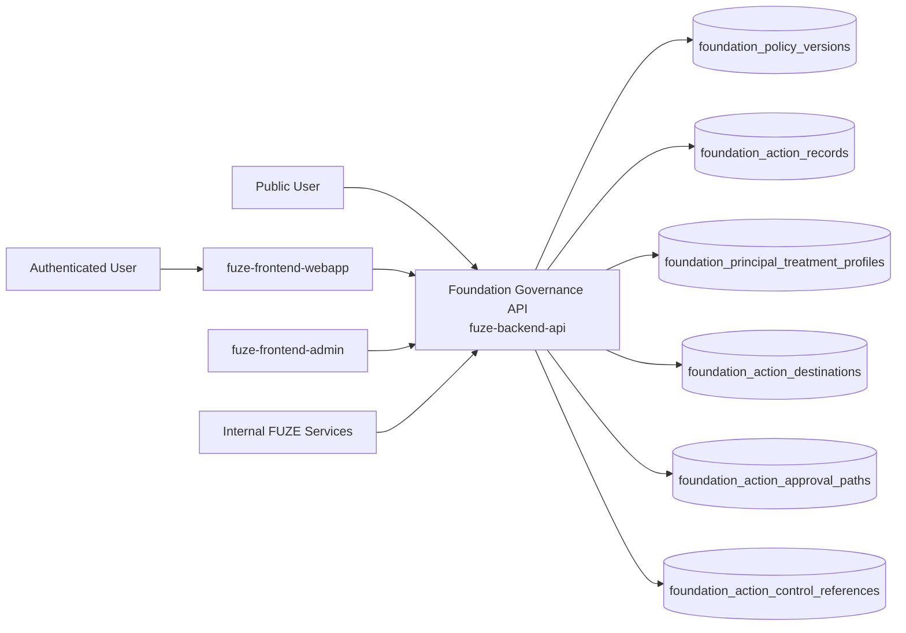
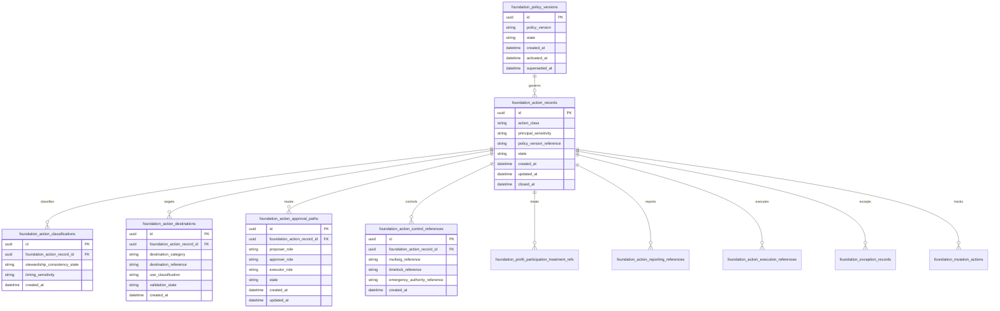
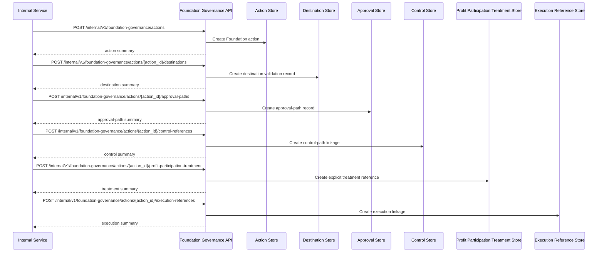

# FOUNDATION_GOVERNANCE_API_SPEC

## 1. Title

**FOUNDATION_GOVERNANCE_API_SPEC.md**

---

## 2. Document Metadata

- **Document Name:** FOUNDATION_GOVERNANCE_API_SPEC.md
- **API Classification:** internal, admin, event-driven, public-read, chain-adjacent
- **Owning Domain:** Foundation Governance Domain
- **Primary Implementing Repo:** `fuze-backend-api`
- **Primary Chain-Adjacent Dependency:** `fuze-contracts`
- **Primary System of Record:** Foundation policy versions, Foundation action records, principal-protection interpretations, allowed-use and restricted-use records, Foundation control-path records, profit-participation treatment references, reporting references, and correction-safe Foundation governance lineage in `fuze-backend-api`
- **Status:** Draft for canonical source-of-truth approval
- **Purpose:** Define the production-grade API contract architecture for FUZE Foundation governance, including Foundation-sensitive policy interpretation, principal-protection enforcement, category-aware allowed-use handling, bounded control pathways, explicit profit-participation treatment, and structured audit/reporting-safe lifecycle management across the platform
- **Canonical Folder:** `fuze.ac > docs > api-spec`

---

## 2.1 API Classification Header

- **API Classification:** internal | admin | event-driven | public-read | chain-adjacent
- **Owning Domain:** Foundation Governance Domain
- **Primary Implementing Repo:** `fuze-backend-api`
- **Primary Chain-Adjacent Dependency:** `fuze-contracts`
- **Primary System of Record:** Foundation governance and Foundation-sensitive action domain

---

## 3. Purpose

This document defines the canonical API specification for FUZE Foundation governance operations. It translates the governing FUZE platform architecture, Foundation governance rules, Foundation Vault rules, vault action policy, treasury control policy, multisig and timelock expectations, profit participation treatment expectations, transparency expectations, audit requirements, and API architecture rules into an implementation-ready API contract.

This API exists because the FUZE Foundation is not an ordinary treasury category and not a generic operator wallet. It is a distinct long-horizon stewardship structure intended to reinforce institutional continuity, protected capital meaning, and public trust. Foundation governance therefore cannot be treated as a minor subclass of treasury administration. It must preserve:

- a distinct governance domain,
- principal-preservation logic,
- stronger restraint than ordinary treasury,
- explicit allowed-use and disallowed-use treatment,
- explicit treatment in holder-facing profit-participation systems,
- stronger governance-path legibility,
- and stronger reporting compatibility.

Accordingly, this specification defines how Foundation policy versions, Foundation-sensitive action records, principal-protection classifications, use-treatment records, approval paths, control references, profit-participation treatment references, and reporting references are represented, and how Foundation governance remains auditable, idempotent, and architecture-consistent across FUZE.

---

## 4. Scope

This specification covers:

- internal APIs for Foundation policy versioning and Foundation-sensitive action lifecycle management
- internal APIs for principal-protection classification, allowed-use handling, disallowed-use treatment, and stewardship-consistency evaluation
- internal APIs for approval-path, multisig/timelock, emergency, reporting, and profit-participation-treatment linkage
- internal read APIs for canonical Foundation governance truth
- admin/control-plane APIs for approve, reject, pause, escalate, exceptional treatment, supersede, and discrepancy resolution
- public-read APIs for bounded public-safe Foundation governance summaries and public-safe Foundation action reporting summaries where policy allows
- event emission requirements for Foundation governance lifecycle changes
- request, response, error, idempotency, versioning, audit, and database-shape rules for this domain

This specification does **not** redefine:

- low-level Foundation Vault contract mechanics in full detail
- the full treasury-control policy domain
- the full vault-action policy domain
- the full multisig signer set or timelock configuration detail
- raw treasury accounting exports
- final transparency-report composition
- exact claimant-facing payout interfaces
- low-level contract ABI implementations

Those remain governed by their own source-of-truth specifications.

---

## 5. Source-of-Truth Inputs

### Primary FUZE docs and specs used

#### Highest-priority platform and ownership sources
- `SYSTEM_SPEC_INDEX.md`
- `DOCS_SPEC.md`
- `SYSTEM_BOUNDARY_AND_OWNERSHIP_SPEC.md`
- `SYSTEM_OVERVIEW_AND_BOUNDARIES_SPEC.md`
- `PLATFORM_ARCHITECTURE_SPEC.md`
- `DOMAIN_OWNERSHIP_MATRIX_SPEC.md`
- `DATA_MODEL_AND_ENTITY_OWNERSHIP_SPEC.md`
- `ONCHAIN_OFFCHAIN_RESPONSIBILITY_SPEC.md`

#### Primary Foundation / governance / control sources
- `FOUNDATION_GOVERNANCE_SPEC.md`
- `FOUNDATION_VAULT_SPEC.md`
- `MULTISIG_AND_TIMELOCK_SPEC.md`
- `GOVERNANCE_MODEL_SPEC.md`
- `TREASURY_CONTROL_POLICY_SPEC.md`
- `VAULT_ACTION_POLICY_SPEC.md`
- `PROFIT_PARTICIPATION_SYSTEM_SPEC.md`
- `TRANSPARENCY_REPORTING_SPEC.md`
- `TRANSPARENCY_MODEL_SPEC.md`
- `PUBLIC_CONTRACT_AND_WALLET_REGISTRY_SPEC.md`
- `CHAIN_ARCHITECTURE_SPEC.md`

#### Core docs inputs
- `FUZE_WHITEPAPER_v.2026.3.0.1.pdf`
- `FUZE_CHAIN_ARCHITECTURE.md`
- `TOKEN_CONTRACT_ARCHITECTURE_.md`
- `FUZE_TOKENOMICS_TABLES.md`
- `ALLOCATION_WALLET_MAP.md`
- `tokenomics/FOUNDATION_VAULT.md`

#### API and runtime sources
- `API_ARCHITECTURE_SPEC.md`
- `PUBLIC_API_SPEC.md`
- `INTERNAL_SERVICE_API_SPEC.md`
- `EVENT_MODEL_AND_WEBHOOK_SPEC.md`
- `IDEMPOTENCY_AND_VERSIONING_SPEC.md`
- `MIGRATION_AND_BACKWARD_COMPATIBILITY_SPEC.md`
- `AUDIT_LOG_AND_ACTIVITY_SPEC.md`

#### Security and operations sources
- `SECURITY_AND_RISK_CONTROL_SPEC.md`
- `MONITORING_ALERTING_AND_INCIDENT_RESPONSE_SPEC.md`
- `SECRETS_CONFIG_AND_ENVIRONMENT_SPEC.md`

#### Format guides
- `The_API_Specification_guide.md`
- `Database_Schemas_Guide.md`

### Highest-priority interpretation applied

For this file, the most important governing interpretation is:

1. the Foundation is a distinct governance domain and not a disguised extension of ordinary treasury
2. backend owns canonical Foundation governance policy truth and Foundation-sensitive action truth
3. the Foundation principal should begin from preservation rather than flexibility
4. Foundation-sensitive actions require stronger restraint, stronger review quality, and stronger reporting legibility than ordinary treasury-sensitive actions
5. Foundation treatment in profit participation must be explicit rather than silent or inferred
6. Foundation governance must remain structurally legible to the market and auditable over time

### Supporting external standards used only as guidance

- HTTP semantics for internal mutation and bounded public-read APIs
- structured problem-details error design
- general policy-versioning, stewardship-governance, and correction-lineage patterns as supporting guidance

External guidance does not override FUZE source-of-truth documents.

---

## 6. Governing Architecture and Ownership Interpretation

This API belongs to the **Foundation Governance Domain** because it owns the canonical lifecycle of:

- Foundation policy version interpretation,
- Foundation-sensitive action records,
- principal-protection and stewardship-consistency evaluation,
- allowed-use and restricted-use classification,
- explicit profit-participation treatment references,
- governance-path and control-reference linkage,
- and correction-safe Foundation governance history.

This API is implemented primarily in `fuze-backend-api` because:

- backend owns durable Foundation governance truth
- Foundation-sensitive actions require centralized rule enforcement and stronger review discipline
- Foundation trust value depends on explicit off-chain governance-path records in addition to contract constraints
- multiple adjacent governance and reporting domains depend on one canonical Foundation-governance truth source
- public trust requires structured explanation and lineage, not only contract-level prohibition

This API is **not** owned by:

- `fuze-frontend-webapp`, because frontend only reads bounded public-safe or first-party-safe summaries
- `fuze-frontend-admin`, because admin may propose, approve, pause, or escalate Foundation-sensitive actions but must not own canonical policy truth
- `fuze-contracts`, because Foundation contracts enforce some capital constraints but do not own the full governance interpretation of what Foundation-sensitive actions mean
- treasury-control domain, because treasury control governs treasury-sensitive control posture while Foundation governance governs the Foundation as a distinct stewardship structure
- vault-action-policy domain, because vault policy governs category action meaning broadly while Foundation governance adds stronger stewardship-specific restrictions and interpretation
- profit-participation domain, because Foundation participation in that system must be explicit but the Foundation domain owns its treatment policy

### Architectural implications

- every material Foundation-sensitive action must preserve explicit Foundation context
- every material Foundation-sensitive action must preserve principal-protection meaning, allowed-use meaning, sensitivity classification, and governance-path meaning
- principal-sensitive actions must be explicitly distinguished from ordinary Foundation-adjacent reporting or administrative actions
- Foundation profit-participation treatment references must remain explicit and versioned
- destination ambiguity is a governance risk and must be modeled explicitly
- corrections and supersession must preserve historical stewardship meaning rather than silently rewriting records

---

## 7. Domain Responsibilities

The Foundation Governance API domain is responsible for:

1. maintaining canonical Foundation policy versions and Foundation-sensitive action records
2. classifying Foundation actions by principal sensitivity, stewardship consistency, use class, destination class, and reporting expectations
3. validating whether a proposed action remains consistent with the Foundation’s long-horizon stewardship purpose
4. preserving distinct treatment between Foundation principal, Foundation operations flows, and ordinary treasury capital
5. recording proposal, approval, execution, emergency, and reporting-path linkage for Foundation-sensitive actions
6. linking Foundation actions to public reporting, registry, payout-cycle, eligibility-treatment, and exception references where applicable
7. supporting admin approve, reject, pause, escalate, exceptional treatment, supersede, and discrepancy workflows
8. emitting Foundation governance lifecycle events
9. generating audit lineage for sensitive Foundation governance mutations
10. preserving separation between Foundation governance, treasury control, vault action policy, and downstream execution truth

The domain is not responsible for:

- owning raw Foundation Vault contract execution state
- replacing treasury control policy
- replacing multisig/timelock technical enforcement
- replacing transparency reports
- replacing profit participation logic
- allowing broad discretionary reuse of Foundation capital outside stewardship meaning

---

## 8. Out of Scope

The following are out of scope for this API specification:

- low-level signer-management or quorum configuration
- raw token transfer execution APIs
- final Foundation Vault ABI design
- generic product budget approvals
- end-user UI design for Foundation reporting
- external explorer integration specifics
- exact blocked-destination registry model
- exact disclosure thresholds for every public report surface

---

## 9. Canonical Entities and Data Ownership

### Durable entities

#### 9.1 foundation_policy_versions
- **Owner:** Foundation Governance Domain
- **Purpose:** canonical policy versions governing Foundation-sensitive actions
- **Nature:** source-of-truth durable entity

#### 9.2 foundation_action_records
- **Owner:** Foundation Governance Domain
- **Purpose:** canonical Foundation-sensitive action records
- **Nature:** source-of-truth durable entity

#### 9.3 foundation_principal_treatment_profiles
- **Owner:** Foundation Governance Domain
- **Purpose:** principal-protection interpretations and treatment profiles
- **Nature:** source-of-truth durable entity

#### 9.4 foundation_action_classifications
- **Owner:** Foundation Governance Domain
- **Purpose:** explicit classification of stewardship consistency, principal sensitivity, use class, and timing sensitivity
- **Nature:** source-of-truth durable entity

#### 9.5 foundation_action_destinations
- **Owner:** Foundation Governance Domain
- **Purpose:** destination category, destination reference, use rationale, and destination-legibility validation posture
- **Nature:** source-of-truth durable lineage entity

#### 9.6 foundation_action_approval_paths
- **Owner:** Foundation Governance Domain
- **Purpose:** explicit proposal, approval, and execution role-path records
- **Nature:** source-of-truth durable lineage entity

#### 9.7 foundation_action_control_references
- **Owner:** Foundation Governance Domain
- **Purpose:** structured references to multisig, timelock, emergency authority, or other bounded control paths
- **Nature:** source-of-truth durable lineage entity

#### 9.8 foundation_profit_participation_treatment_refs
- **Owner:** Foundation Governance Domain
- **Purpose:** explicit treatment references for Foundation inclusion, exclusion, or bounded participation in profit participation systems
- **Nature:** source-of-truth durable lineage entity

#### 9.9 foundation_action_reporting_references
- **Owner:** Foundation Governance Domain
- **Purpose:** references to transparency reports, public registry references, payout references, and exception records
- **Nature:** durable reporting-lineage entity

#### 9.10 foundation_exception_records
- **Owner:** Foundation Governance Domain
- **Purpose:** exceptional or emergency Foundation-action records with post-incident review requirements
- **Nature:** durable exceptional-case entity

#### 9.11 foundation_discrepancy_cases
- **Owner:** Foundation Governance Domain
- **Purpose:** review and remediation records for invalid, stale, misclassified, or misreported Foundation-sensitive actions
- **Nature:** durable review/remediation entity

#### 9.12 foundation_mutation_actions
- **Owner:** Foundation Governance Domain
- **Purpose:** high-level action records for create, approve, reject, pause, escalate, exceptional, supersede, and resolve discrepancy
- **Nature:** durable action records with audit linkage

#### 9.13 foundation_audit_events
- **Owner:** Audit / Activity domain, sourced by Foundation Governance Domain
- **Purpose:** immutable trail for sensitive Foundation governance actions
- **Nature:** durable audit records

### Derived or cached entities

#### 9.14 foundation_public_policy_views
- **Owner:** derived read-model layer
- **Purpose:** public-safe Foundation policy and Foundation-action summaries
- **Nature:** derived

#### 9.15 foundation_internal_status_views
- **Owner:** derived read-model layer
- **Purpose:** trusted Foundation-action and approval-path operational summaries
- **Nature:** derived

#### 9.16 foundation_discrepancy_views
- **Owner:** derived ops read-model layer
- **Purpose:** visibility into stale, invalid, or misclassified Foundation-sensitive conditions
- **Nature:** derived

---

## 10. State Model and Lifecycle

### 10.1 Foundation policy version lifecycle

Possible states:

- `draft`
- `active`
- `deprecated`
- `superseded`
- `archived`

### 10.2 Foundation action lifecycle

Possible states:

- `draft`
- `proposed`
- `under_review`
- `approved`
- `rejected`
- `ready_for_execution`
- `executed_reference_linked`
- `reported`
- `paused`
- `superseded`
- `closed`

### 10.3 approval-path lifecycle

Possible states:

- `proposal_recorded`
- `approval_pending`
- `approved`
- `rejected`
- `execution_linked`
- `closed`

### 10.4 exceptional-action lifecycle

Possible states:

- `declared`
- `containment_active`
- `post_review_pending`
- `closed`
- `superseded`

### 10.5 discrepancy lifecycle

Possible states:

- `opened`
- `under_review`
- `resolved`
- `failed`
- `closed`

Lifecycle notes:
- Foundation approval is distinct from execution linkage
- reported is distinct from executed_reference_linked
- exceptional treatment must remain explicitly narrower than normal authorization
- supersession must preserve prior stewardship meaning and public explanation

---

## 11. API Surface Overview

The API surface is divided into four families:

### 11.1 Public-read APIs
Used by public users, holders, and community observers for:
- reading bounded Foundation-governance summaries
- reading public-safe Foundation-action summaries
- reading category-aware public explanations of Foundation treatment where policy allows

### 11.2 First-party authenticated read APIs
Used by `fuze-frontend-webapp` and approved first-party clients for:
- reading bounded Foundation-related public-safe and first-party-safe summaries where policy allows
- reading linked payout or reporting references without exposing internal-only governance detail

### 11.3 Internal service APIs
Used by trusted internal services for:
- creating Foundation actions
- validating principal sensitivity, allowed-use posture, destinations, and profit-participation treatment
- recording approval paths and control references
- linking execution and reporting references
- reading canonical truth

### 11.4 Admin / control-plane APIs
Used by `fuze-frontend-admin` through backend-only privileged routes for:
- approve, reject, pause, escalate, exceptional treatment, supersede, and discrepancy actions
- stewardship-path repair and policy-governed remediation workflows

---

## 12. Authentication and Authorization Model

### 12.1 Authentication posture by route family

#### Public-read routes
No authentication required:
- list public-safe Foundation policy summaries
- read public-safe Foundation-action summaries and references where published

#### Authenticated read routes
Require valid authenticated session:
- read bounded first-party-safe Foundation-related summaries where actor has visibility under policy

#### Internal service routes
Require internal service identity with explicit least privilege:
- create Foundation actions
- classify actions
- record destinations, approval paths, control references, profit-participation treatment references, and reporting links
- read canonical truth

#### Admin routes
Require privileged operator identity plus reason-coded actions:
- approve, reject, pause, escalate, declare exceptional treatment, supersede, and resolve discrepancy cases

### 12.2 Authorization checkpoints

Authorization must evaluate:
- caller identity and route family
- whether target action is public-safe, first-party-safe, or privileged internal state
- whether internal service has create/classify/link/read privilege
- whether admin/operator role is present for sensitive governance actions
- whether current action state allows requested mutation
- whether principal sensitivity, use class, or payout treatment require stronger control-path validation

### 12.3 Sensitive action rules

The following require heightened checks:
- approval of material Foundation-sensitive actions
- any action that materially affects Foundation principal or principal treatment
- changes to Foundation treatment in profit participation
- destination changes after action enters under_review or approved state
- escalation or exceptional treatment
- discrepancy-resolution actions

---

## 13. API Endpoints / Interface Contracts

## 13.1 Public-Read APIs

### 13.1.1 `GET /v1/foundation-governance/policies`
**Purpose:** list published public-safe Foundation policy summaries  
**Caller Type:** public  
**Auth Expectation:** none  
**Query Parameters Summary:**
- optional `state`
- pagination
**Response Summary:**
- policy version summaries
- active/superseded posture
- public-safe stewardship and principal-treatment summaries
- timestamps
**Side Effects:** none
**Audit Requirements:** access logging optional
**Emitted Events:** none required

### 13.1.2 `GET /v1/foundation-governance/actions`
**Purpose:** list published public-safe Foundation-action summaries  
**Caller Type:** public  
**Query Parameters Summary:**
- optional `action_class`
- optional `principal_sensitivity`
- pagination
**Response Summary:**
- public-safe action summaries
- stewardship class, sensitivity, and status
- bounded reporting and registry references
**Side Effects:** none

### 13.1.3 `GET /v1/foundation-governance/actions/{foundation_action_id}`
**Purpose:** retrieve one public-safe Foundation-action detail  
**Caller Type:** public  
**Response Summary:**
- public-safe action detail
- stewardship and principal-sensitivity summary
- destination-category summary
- payout-treatment summary where published
- reporting and public registry references where published
- correction or supersession guidance where relevant
**Side Effects:** none

## 13.2 First-Party Authenticated Read APIs

### 13.2.1 `GET /v1/foundation-governance/me/actions`
**Purpose:** retrieve bounded first-party-safe Foundation-related action summaries where actor has policy visibility  
**Caller Type:** authenticated user  
**Auth Expectation:** valid authenticated session  
**Query Parameters Summary:**
- optional `reference_type`
- pagination
**Response Summary:**
- bounded Foundation-related summaries
- linked public reporting or payout guidance where applicable
**Side Effects:** none

## 13.3 Internal Service APIs

### 13.3.1 `POST /internal/v1/foundation-governance/actions`
**Purpose:** create draft Foundation-sensitive action record  
**Caller Type:** internal trusted service  
**Auth Expectation:** service-to-service identity only  
**Request Body Summary:**
- `action_class`
- `principal_sensitivity`
- `policy_version_reference`
- optional `proposal_summary`
- `idempotency_key`
**Response Summary:** Foundation-action summary
**Side Effects:** creates draft/proposed Foundation action and classification record
**Idempotency Behavior:** required
**Audit Requirements:** sensitive Foundation-action creation audit
**Emitted Events:** `foundation_governance.action_created`

### 13.3.2 `POST /internal/v1/foundation-governance/actions/{foundation_action_id}/destinations`
**Purpose:** attach destination and use-rationale metadata to one Foundation action  
**Caller Type:** internal trusted service  
**Request Body Summary:**
- `destination_category`
- `destination_reference`
- `use_classification`
- optional `timing_reference`
- `idempotency_key`
**Response Summary:** destination summary and validation posture
**Side Effects:** creates destination linkage and destination-legibility validation record
**Idempotency Behavior:** required
**Audit Requirements:** destination-link audit
**Emitted Events:** `foundation_governance.destination_validated`

### 13.3.3 `POST /internal/v1/foundation-governance/actions/{foundation_action_id}/approval-paths`
**Purpose:** record proposal, approval, and execution-path structure for one Foundation action  
**Caller Type:** internal trusted service  
**Request Body Summary:**
- `proposer_role`
- `approver_role`
- `executor_role`
- optional `approval_path_summary`
- `idempotency_key`
**Response Summary:** approval-path summary
**Side Effects:** creates approval-path lineage and may move action into under_review
**Idempotency Behavior:** required
**Audit Requirements:** approval-path audit
**Emitted Events:** `foundation_governance.approval_path_recorded`

### 13.3.4 `POST /internal/v1/foundation-governance/actions/{foundation_action_id}/control-references`
**Purpose:** attach multisig, timelock, emergency, or exceptional control references to one action  
**Caller Type:** internal trusted service  
**Request Body Summary:**
- optional `multisig_reference`
- optional `timelock_reference`
- optional `emergency_authority_reference`
- optional `control_summary`
- `idempotency_key`
**Response Summary:** control-reference summary
**Side Effects:** creates control-path linkage
**Idempotency Behavior:** required
**Audit Requirements:** control-reference audit
**Emitted Events:** `foundation_governance.control_linked`

### 13.3.5 `POST /internal/v1/foundation-governance/actions/{foundation_action_id}/profit-participation-treatment`
**Purpose:** attach explicit Foundation treatment reference for profit participation or holder-facing eligibility systems  
**Caller Type:** internal trusted service  
**Request Body Summary:**
- `treatment_mode`
- `treatment_reference`
- optional `treatment_summary`
- `idempotency_key`
**Response Summary:** treatment-reference summary
**Side Effects:** creates explicit Foundation treatment lineage
**Idempotency Behavior:** required
**Audit Requirements:** treatment-reference audit
**Emitted Events:** `foundation_governance.profit_participation_treatment_linked`

### 13.3.6 `POST /internal/v1/foundation-governance/actions/{foundation_action_id}/reporting-references`
**Purpose:** attach transparency, registry, payout, or exception references to one Foundation action  
**Caller Type:** internal trusted service  
**Request Body Summary:**
- optional `transparency_report_reference`
- optional `public_registry_reference`
- optional `payout_cycle_reference`
- optional `exception_reference`
- `idempotency_key`
**Response Summary:** reporting-reference summary
**Side Effects:** creates reporting and trust-surface linkage
**Idempotency Behavior:** required
**Audit Requirements:** reporting-link audit
**Emitted Events:** `foundation_governance.reporting_linked`

### 13.3.7 `POST /internal/v1/foundation-governance/actions/{foundation_action_id}/execution-references`
**Purpose:** link downstream execution reference to one Foundation action  
**Caller Type:** internal trusted service  
**Request Body Summary:**
- `execution_reference_type`
- `execution_reference_id`
- optional `execution_summary`
- `idempotency_key`
**Response Summary:** execution-reference summary and updated action state
**Side Effects:** creates execution linkage and may move action into executed_reference_linked
**Idempotency Behavior:** required
**Audit Requirements:** execution-link audit
**Emitted Events:** `foundation_governance.execution_linked`

### 13.3.8 `GET /internal/v1/foundation-governance/actions/{foundation_action_id}`
**Purpose:** retrieve canonical Foundation-governance truth  
**Caller Type:** internal trusted service  
**Response Summary:** full Foundation action, policy version, principal-treatment profile, classification, destination, approval-path, control references, profit-participation treatment references, reporting references, and discrepancy lineage
**Side Effects:** none

## 13.4 Admin / Control-Plane APIs

### 13.4.1 `POST /admin/v1/foundation-governance/actions/{foundation_action_id}/approve`
**Purpose:** approve Foundation-sensitive action under controlled policy  
**Caller Type:** admin/operator  
**Request Body Summary:**
- `reason_code`
- `operator_note`
- `idempotency_key`
**Response Summary:** approved action summary
**Side Effects:** action moves to approved or ready_for_execution if checks pass
**Audit Requirements:** critical audit
**Emitted Events:** `foundation_governance.action_approved`

### 13.4.2 `POST /admin/v1/foundation-governance/actions/{foundation_action_id}/reject`
**Purpose:** reject Foundation-sensitive action under controlled policy  
**Caller Type:** admin/operator  
**Request Body Summary:**
- `reason_code`
- `operator_note`
- `idempotency_key`
**Response Summary:** rejected action summary
**Side Effects:** action moves to rejected
**Audit Requirements:** critical audit
**Emitted Events:** `foundation_governance.action_rejected`

### 13.4.3 `POST /admin/v1/foundation-governance/actions/{foundation_action_id}/pause`
**Purpose:** pause Foundation-sensitive action under controlled policy  
**Caller Type:** admin/operator  
**Request Body Summary:**
- `reason_code`
- `operator_note`
- `idempotency_key`
**Response Summary:** paused action summary
**Side Effects:** action moves to paused
**Audit Requirements:** critical audit
**Emitted Events:** `foundation_governance.action_paused`

### 13.4.4 `POST /admin/v1/foundation-governance/actions/{foundation_action_id}/escalate`
**Purpose:** escalate Foundation-sensitive action to stronger governance/control path  
**Caller Type:** admin/operator  
**Request Body Summary:**
- `escalation_type`
- `reason_code`
- `operator_note`
- `idempotency_key`
**Response Summary:** escalation summary
**Side Effects:** action control path strengthens, for example through stronger timelock or approval posture
**Audit Requirements:** critical audit
**Emitted Events:** `foundation_governance.action_escalated`

### 13.4.5 `POST /admin/v1/foundation-governance/actions/{foundation_action_id}/exceptional`
**Purpose:** declare emergency or exceptional Foundation treatment under controlled policy  
**Caller Type:** admin/operator  
**Request Body Summary:**
- `exception_type`
- `public_or_internal_summary`
- `reason_code`
- `operator_note`
- `idempotency_key`
**Response Summary:** exceptional-action summary
**Side Effects:** creates exception record and may restrict ordinary action path until review completes
**Audit Requirements:** critical audit
**Emitted Events:** `foundation_governance.exception_declared`

### 13.4.6 `POST /admin/v1/foundation-governance/actions/{foundation_action_id}/supersede`
**Purpose:** supersede one Foundation-sensitive action with a replacement record under controlled policy  
**Caller Type:** admin/operator  
**Request Body Summary:**
- `replacement_foundation_action_id`
- `reason_code`
- `operator_note`
- `idempotency_key`
**Response Summary:** supersession summary
**Side Effects:** creates old-to-new supersession linkage and updates current policy-visible preference
**Audit Requirements:** critical audit
**Emitted Events:** `foundation_governance.action_superseded`

### 13.4.7 `POST /admin/v1/foundation-governance/discrepancies`
**Purpose:** resolve Foundation-governance discrepancy under controlled policy  
**Caller Type:** admin/operator  
**Request Body Summary:**
- `target_reference_type`
- `target_reference_id`
- `resolution_code`
- `operator_note`
- `related_case_id`
- `idempotency_key`
**Response Summary:** discrepancy-resolution summary
**Side Effects:** may correct, supersede, pause, escalate, or close discrepancy posture with preserved lineage
**Audit Requirements:** critical audit
**Emitted Events:** `foundation_governance.discrepancy_resolved`

---

## 14. Request Rules

### 14.1 General request rules
- all mutation-capable routes must require JSON requests with explicit content type
- all mutation routes must carry correlation IDs
- sensitive Foundation-governance mutations must carry idempotency keys
- admin mutations must require reason codes and operator notes
- no route may accept frontend-authored Foundation-governance truth as authoritative input

### 14.2 Sensitive-action request requirements
The following requests require heightened validation:
- proposal or approval of material Foundation-sensitive actions
- any action affecting principal-preservation logic
- any change to Foundation treatment in profit participation
- destination or use changes after action enters under_review or approved state
- escalation or exceptional treatment
- discrepancy-resolution actions

Heightened validation may include:
- principal-sensitivity and stewardship-consistency checks
- destination-category restriction checks
- allowed-use versus disallowed-use checks
- control-path completeness checks
- operator role confirmation
- governance/finance/security case linkage for sensitive actions

### 14.3 Scope integrity rule
Foundation-governance mutations must target valid and authorized policy versions, action records, destination records, control references, treatment references, and discrepancy records. Services and operators must not mutate unrelated or unauthorized Foundation-governance state.

### 14.4 Layer-separation rule
Foundation governance must remain the stewardship-and-principal-protection layer for the Foundation. It must not collapse:
- treasury-control meaning,
- vault-action-policy meaning,
- multisig/timelock execution,
- profit-participation execution,
- or transparency reporting
into one ambiguous state object.

---

## 15. Response Rules

### 15.1 Success response rules
Successful responses must include:
- stable resource identifiers
- timestamps for created/updated state
- state/status values
- action, principal-treatment, or destination summaries where relevant
- control-path, treatment-reference, and reporting-reference summaries where relevant
- correlation references for mutations

### 15.2 Async-accepted response rules
If escalation, exceptional review, or discrepancy remediation is async, the response must:
- return accepted status
- include action or job ID
- provide follow-up status semantics

### 15.3 Terminal mutation response rules
Terminal mutation responses must clearly show:
- target action or discrepancy
- mutation type
- resulting policy/action/control-path state
- pause, escalation, exceptional, supersession, or closure effects where relevant
- whether public-safe views may refresh asynchronously

### 15.4 Read response rules
Read responses must distinguish:
- canonical internal Foundation-governance truth
- public-safe Foundation policy summaries
- public-safe Foundation-action reporting views
- execution references versus final downstream execution outcomes

---

## 16. Error Model

The API uses structured problem-details style error responses.

### 16.1 Required error fields
- `type`
- `title`
- `status`
- `code`
- `detail`
- `instance`
- `correlation_id`

### 16.2 Common error codes

#### Authorization / permission errors
- `FOUNDATION_GOVERNANCE_PERMISSION_DENIED`
- `FOUNDATION_GOVERNANCE_OPERATOR_PERMISSION_DENIED`
- `FOUNDATION_GOVERNANCE_SERVICE_PERMISSION_DENIED`
- `FOUNDATION_GOVERNANCE_AUDIENCE_PERMISSION_DENIED`

#### State conflict errors
- `FOUNDATION_GOVERNANCE_ACTION_STATE_INVALID`
- `FOUNDATION_GOVERNANCE_POLICY_STATE_INVALID`
- `FOUNDATION_GOVERNANCE_APPROVAL_PATH_INVALID`
- `FOUNDATION_GOVERNANCE_SUPERSESSION_CONFLICT`
- `FOUNDATION_GOVERNANCE_ESCALATION_CONFLICT`

#### Policy / safety errors
- `FOUNDATION_GOVERNANCE_DESTINATION_NOT_ALLOWED`
- `FOUNDATION_GOVERNANCE_POLICY_VERSION_REQUIRED`
- `FOUNDATION_GOVERNANCE_APPROVAL_REQUIRED`
- `FOUNDATION_GOVERNANCE_EXCEPTION_NOT_ALLOWED`
- `FOUNDATION_GOVERNANCE_PRINCIPAL_RESTRICTION`

#### Request integrity errors
- `FOUNDATION_GOVERNANCE_IDEMPOTENCY_KEY_REQUIRED`
- `FOUNDATION_GOVERNANCE_REQUEST_INVALID`
- `FOUNDATION_GOVERNANCE_REQUEST_UNPROCESSABLE`

#### Dependency or provider errors
- `FOUNDATION_GOVERNANCE_EXECUTION_UNAVAILABLE`
- `FOUNDATION_GOVERNANCE_STORAGE_UNAVAILABLE`
- `FOUNDATION_GOVERNANCE_RECONCILIATION_UNAVAILABLE`

### 16.3 Error handling rules
- do not expose hidden internal governance, treasury, or security detail in public or low-privilege responses
- do not imply permitted execution merely because a draft or proposed Foundation action exists
- distinguish principal-preservation restriction failure from generic invalid state
- distinguish policy-version-required from generic invalid request
- include retry guidance only where safe

---

## 17. Idempotency and Mutation Safety

### 17.1 Required idempotent mutations
The following mutation routes require idempotent behavior:
- Foundation-action creation
- destination attachment
- approval-path recording
- control-reference attachment
- profit-participation treatment attachment
- reporting-reference attachment
- execution-reference linking
- approve
- reject
- pause
- escalate
- exceptional
- supersede
- discrepancy resolution

### 17.2 Idempotency key rules
- mutation requests must supply `Idempotency-Key`
- backend stores key scope, request hash, actor, and terminal result
- replay of same semantic request returns original terminal outcome
- replay of same key with different semantic request must fail with conflict

### 17.3 Mutation safety rules
- one canonical visible Foundation action per current action lineage unless explicit supersession exists
- destination and control-path records must remain referentially consistent with principal sensitivity, stewardship class, and treatment references
- approval, execution linkage, and reporting linkage must preserve proposal/approval/execution separation
- corrections and supersession must preserve prior Foundation-action lineage
- exceptional treatment must not silently normalize into routine Foundation behavior

---

## 18. Versioning and Compatibility Rules

### 18.1 Versioning
This API family is versioned under `/v1`, `/internal/v1`, and `/admin/v1` route families.

### 18.2 Compatibility approach
- additive evolution preferred
- no silent semantic change to proposed, approved, ready_for_execution, executed_reference_linked, reported, paused, or superseded states
- new action classes, treatment modes, destination types, or control-reference types may be added without breaking existing contracts
- response fields may be added but existing meanings must remain stable

### 18.3 Breaking-change rules
Breaking changes include:
- changing the meaning of Foundation-action lifecycle states
- changing public-safe Foundation-governance visibility semantics incompatibly
- removing critical principal-treatment, destination, or control-path fields
- changing exceptional-treatment or supersession semantics incompatibly

Such changes require explicit migration planning and version evolution.

### 18.4 Deprecation
Deprecated routes or fields must:
- be documented explicitly
- carry deprecation metadata where supported
- preserve compatibility windows long enough for public, first-party, and internal consumers

---

## 19. Event Emission and Webhook Behavior

This domain is event-capable.

### 19.1 Internal events
The Foundation Governance domain must emit canonical internal events such as:
- `foundation_governance.action_created`
- `foundation_governance.destination_validated`
- `foundation_governance.approval_path_recorded`
- `foundation_governance.control_linked`
- `foundation_governance.profit_participation_treatment_linked`
- `foundation_governance.reporting_linked`
- `foundation_governance.execution_linked`
- `foundation_governance.action_approved`
- `foundation_governance.action_rejected`
- `foundation_governance.action_paused`
- `foundation_governance.action_escalated`
- `foundation_governance.exception_declared`
- `foundation_governance.action_superseded`
- `foundation_governance.discrepancy_resolved`

### 19.2 Event payload minimums
Each event should contain:
- event ID
- event type
- occurred_at
- Foundation action ID
- action class
- principal sensitivity
- actor type
- correlation ID
- reason code where applicable

### 19.3 External webhook posture
This specification does not expose general third-party outbound Foundation-governance webhooks by default. Any future outbound Foundation-status webhook surface must be narrow, security-reviewed, and governed by a separate contract.

---

## 20. Audit and Activity Requirements

The following actions must generate durable audit events:

- Foundation-action creation
- destination validation
- approval-path recording
- profit-participation treatment linkage
- approve, reject, pause, escalate, and exceptional treatment
- execution-reference and reporting-reference linkage for material actions
- supersession and discrepancy-resolution actions
- other sensitive Foundation-governance mutations

### Required audit fields
- audit event ID
- actor type and actor reference
- target action / principal-treatment / destination / control path / discrepancy reference as applicable
- action type
- before/after summary where applicable
- reason code
- correlation ID
- operator note if operator action
- occurred_at

---

## 21. Data Model and Database Schema View

### 21.1 `foundation_policy_versions`
- `id` PK
- `policy_version`
- `state`
- `policy_summary_json`
- `created_at`
- `activated_at` nullable
- `superseded_at` nullable

**Constraints:**
- unique `policy_version`
- index on `state`

### 21.2 `foundation_action_records`
- `id` PK
- `action_class`
- `principal_sensitivity`
- `policy_version_reference`
- `state`
- `created_at`
- `updated_at`
- `closed_at` nullable

**Constraints:**
- index on (`action_class`, `principal_sensitivity`)
- index on `state`

### 21.3 `foundation_principal_treatment_profiles`
- `id` PK
- `treatment_mode`
- `allowed_profile_json`
- `restricted_profile_json`
- `disallowed_profile_json`
- `created_at`
- `updated_at`

**Constraints:**
- unique `treatment_mode`

### 21.4 `foundation_action_classifications`
- `id` PK
- `foundation_action_record_id` FK -> `foundation_action_records.id`
- `stewardship_consistency_state`
- `timing_sensitivity`
- `classification_summary_json`
- `created_at`

**Constraints:**
- index on `foundation_action_record_id`

### 21.5 `foundation_action_destinations`
- `id` PK
- `foundation_action_record_id` FK -> `foundation_action_records.id`
- `destination_category`
- `destination_reference`
- `use_classification`
- `timing_reference` nullable
- `validation_state`
- `created_at`

**Constraints:**
- index on `foundation_action_record_id`
- index on `validation_state`

### 21.6 `foundation_action_approval_paths`
- `id` PK
- `foundation_action_record_id` FK -> `foundation_action_records.id`
- `proposer_role`
- `approver_role`
- `executor_role`
- `state`
- `created_at`
- `updated_at`

**Constraints:**
- index on `foundation_action_record_id`
- index on `state`

### 21.7 `foundation_action_control_references`
- `id` PK
- `foundation_action_record_id` FK -> `foundation_action_records.id`
- `multisig_reference` nullable
- `timelock_reference` nullable
- `emergency_authority_reference` nullable
- `created_at`

**Constraints:**
- index on `foundation_action_record_id`

### 21.8 `foundation_profit_participation_treatment_refs`
- `id` PK
- `foundation_action_record_id` FK -> `foundation_action_records.id`
- `treatment_mode`
- `treatment_reference`
- `treatment_summary_json`
- `created_at`

**Constraints:**
- index on `foundation_action_record_id`

### 21.9 `foundation_action_reporting_references`
- `id` PK
- `foundation_action_record_id` FK -> `foundation_action_records.id`
- `transparency_report_reference` nullable
- `public_registry_reference` nullable
- `payout_cycle_reference` nullable
- `exception_reference` nullable
- `created_at`

**Constraints:**
- index on `foundation_action_record_id`

### 21.10 `foundation_action_execution_references`
- `id` PK
- `foundation_action_record_id` FK -> `foundation_action_records.id`
- `execution_reference_type`
- `execution_reference_id`
- `execution_summary_json`
- `created_at`

**Constraints:**
- index on `foundation_action_record_id`
- index on (`execution_reference_type`, `execution_reference_id`)

### 21.11 `foundation_exception_records`
- `id` PK
- `foundation_action_record_id` FK -> `foundation_action_records.id`
- `exception_type`
- `summary_json`
- `state`
- `created_at`
- `closed_at` nullable

### 21.12 `foundation_discrepancy_cases`
- `id` PK
- `target_reference_type`
- `target_reference_id`
- `state`
- `resolution_code` nullable
- `created_at`
- `updated_at`
- `closed_at` nullable

### 21.13 `foundation_mutation_actions`
- `id` PK
- `target_reference_type`
- `target_reference_id`
- `action_type`
- `state`
- `reason_code`
- `operator_note` nullable
- `requested_by_actor_type`
- `requested_by_actor_id`
- `created_at`
- `executed_at` nullable
- `closed_at` nullable
- `correlation_id`

### 21.14 `idempotency_records`
- `id` PK
- `idempotency_key`
- `scope_family`
- `actor_reference`
- `request_hash`
- `response_hash`
- `terminal_status`
- `created_at`
- `expires_at`

### 21.15 `audit_log_entries`
Domain-sourced audit records written into the audit domain.

### Normalization notes
- canonical Foundation-governance truth stays in policy versions, action records, principal-treatment profiles, classifications, destinations, approval paths, control references, treatment references, execution references, and discrepancy records
- treasury-control, vault-action-policy, and multisig/timelock truth remain external and are referenced rather than duplicated
- public-safe views must derive from canonical Foundation-governance truth filtered by disclosure policy
- execution and reporting references remain explicit rather than embedded as opaque strings

### Reconciliation notes
- one visible Foundation action should reconcile to one current action lineage under current preference
- destination restrictions and use classes must reconcile with Foundation stewardship meaning
- approval paths must reconcile to required control-path posture
- Foundation profit-participation treatment references must reconcile to reporting and holder-facing explanation where applicable
- discrepancy cases must preserve review lineage for failed or conflicting Foundation-governance conditions

---

## 22. Architecture Diagram — Mermaid flowchart



---

## 23. Data Design — Mermaid Diagram



---

## 24. Flow View

### 24.1 Happy path — propose, approve, execute, report
1. internal service creates draft Foundation-sensitive action
2. destination and use rationale are attached and validated
3. proposal, approval, and execution roles are recorded
4. control references such as multisig and timelock are linked where required
5. explicit profit-participation treatment reference is attached if relevant
6. admin approves the action
7. downstream execution reference is linked after execution path proceeds
8. reporting and public registry references are attached
9. public-safe Foundation-action view becomes explainable and historically traceable

### 24.2 Happy path — explicit profit-participation treatment
1. Foundation-sensitive action affects Foundation treatment in holder-facing payout logic
2. system requires explicit treatment reference rather than implied inclusion or exclusion
3. approval path and control references are recorded
4. admin approves action after treatment basis is clear
5. reporting reference is attached for holder-facing explanation
6. public-safe Foundation-action summary preserves treatment clarity

### 24.3 Alternate path — principal-sensitive escalation
1. action touches principal-sensitive Foundation capital
2. stewardship and destination validation require stronger restraint
3. operator escalates to stronger governance/control path
4. additional review or stronger timelock/multisig posture is linked
5. action proceeds only if higher-control requirements are satisfied

### 24.4 Failure path — destination or principal-preservation violation
1. Foundation action is created or modified
2. backend detects destination-category mismatch, principal-preservation conflict, or disallowed use classification
3. request is rejected or paused
4. no effective approval or public reporting is produced

### 24.5 Failure and remediation path — discrepancy or misreporting
1. Foundation action, destination, treatment, or reporting linkage becomes stale or inconsistent
2. admin opens discrepancy-resolution flow
3. backend preserves existing lineage
4. corrected or superseding Foundation action or linkage is created
5. discrepancy closes with preserved history

### 24.6 Exceptional-action path
1. emergency or exceptional condition is detected
2. operator declares exceptional treatment with explicit reason and narrow containment posture
3. ordinary governance shortcuts are not normalized into standing authority
4. post-incident review remains required
5. exceptional record closes only after structured review

### 24.7 Retry behavior
- duplicate Foundation-action creation returns same canonical action result
- duplicate destination or control-reference attachment returns same lineage result where applicable
- duplicate approve/reject/pause/escalate/exceptional/supersede/discrepancy actions return same terminal action result

---

## 25. Data Flows — Mermaid sequenceDiagram



---

## 26. Security and Risk Controls

1. **Foundation-governance truth is backend-owned**  
   Frontends and informal channels may not authoritatively define Foundation-sensitive action truth.

2. **Stewardship over convenience**  
   Foundation decisions must prioritize long-term institutional coherence over short-term operational ease.

3. **Principal-preservation first**  
   Material Foundation principal actions must begin from preservation logic rather than ordinary deployment flexibility.

4. **Distinct governance domain**  
   Foundation governance must remain visibly distinct from ordinary treasury operation and routine platform administration.

5. **Explicit authority over implied discretion**  
   Foundation powers should be visible, bounded, and policy-defined.

6. **Profit-participation treatment explicitness**  
   Foundation treatment in holder-facing payout systems must be explicit, not hidden or inferred.

7. **Least privilege**  
   Internal write and admin approve/pause/escalate routes must be limited to authorized services and operators.

8. **Emergency narrowness**  
   Emergency controls should protect the Foundation without becoming a backdoor for ordinary discretionary use.

9. **Audit immutability**  
   Sensitive Foundation governance actions require durable immutable audit lineage.

10. **Reporting compatibility**  
    Material Foundation actions must remain compatible with transparency reporting and reserve-architecture visibility.

---

## 27. Operational Considerations

- Foundation-action and approval-path reads for trusted operators should be highly available
- destination validation, stewardship consistency, principal-sensitivity treatment, and control-reference integrity are correctness-sensitive
- principal-sensitive and payout-treatment-sensitive actions should surface clearly to ops views
- exceptional-treatment and discrepancy workflows should be observable and reviewable
- monitoring should alert on:
  - missing approval-path records for material Foundation actions
  - destination mismatches or principal-preservation violations
  - control-reference omissions for high-sensitivity actions
  - unusual exceptional-treatment frequency
  - reporting-link gaps for executed material Foundation actions
  - public-safe view inconsistency versus canonical Foundation-governance state

---

## 28. Acceptance Criteria

1. The API preserves the distinction between Foundation-governance truth, treasury-control truth, vault-action-policy truth, execution truth, and transparency-report truth.
2. Only `fuze-backend-api` owns canonical Foundation policy version and Foundation-action truth.
3. Foundation policy versions, action records, principal-treatment profiles, classifications, destinations, approval paths, control references, treatment references, execution references, and discrepancy records are durable and backend-owned.
4. Public and first-party routes expose only bounded safe Foundation-governance views.
5. Principal-preservation, stewardship-consistency, and destination restrictions are explicit and validated.
6. Proposal, approval, and execution separation is preserved for material Foundation actions.
7. Principal-sensitive and profit-participation-treatment-sensitive actions are handled with stronger policy sensitivity.
8. Approval, escalation, exceptional treatment, correction, and discrepancy actions preserve immutable lineage.
9. Foundation-governance mutation actions are idempotent and auditable.
10. Internal and admin Foundation-governance routes are least-privilege and backend-only.
11. Admin routes require reason-coded privileged authorization.
12. Event emissions exist for major Foundation-governance mutations.
13. Database schema separates policy versions, actions, principal-treatment profiles, classifications, destinations, approval paths, control references, treatment references, execution references, and discrepancy layers.
14. Public-safe consumers can rely on Foundation-governance views without needing hidden internal governance detail.
15. Mermaid diagrams remain consistent with prose and data model.

---

## 29. Test Cases

### 29.1 Positive cases
1. Internal service creates draft Foundation action successfully.
2. Internal service validates destination successfully.
3. Internal service records approval path successfully.
4. Internal service links control references successfully.
5. Internal service links explicit profit-participation treatment successfully.
6. Admin approves Foundation action successfully.
7. Admin escalates principal-sensitive Foundation action successfully.
8. Public actor reads published public-safe Foundation-action summary successfully.

### 29.2 Negative cases
9. Public user cannot access internal Foundation-governance truth or discrepancy detail.
10. Internal service without write privilege cannot create Foundation action.
11. Foundation action without policy version returns `FOUNDATION_GOVERNANCE_POLICY_VERSION_REQUIRED`.
12. Disallowed destination returns `FOUNDATION_GOVERNANCE_DESTINATION_NOT_ALLOWED`.
13. Principal-sensitive action violating stronger restraint returns `FOUNDATION_GOVERNANCE_PRINCIPAL_RESTRICTION`.
14. Exceptional treatment in ineligible state returns `FOUNDATION_GOVERNANCE_EXCEPTION_NOT_ALLOWED`.

### 29.3 Authorization cases
15. Ordinary public or authenticated user cannot call Foundation-governance admin APIs.
16. Internal service without destination-validation privilege cannot attach destination records.
17. Operator without approval privilege cannot approve Foundation action.
18. Approved Foundation action does not prove downstream execution or payout completion by itself.

### 29.4 Idempotency and replay cases
19. Repeating Foundation-action creation with same idempotency key returns original action result.
20. Repeating control-reference attachment with same idempotency key returns original linkage result.
21. Repeating approve or pause with same idempotency key returns original terminal action result.
22. Repeating exceptional or discrepancy resolution with same idempotency key returns original terminal action result.

### 29.5 Concurrency cases
23. Concurrent destination updates preserve one explicit current validation lineage and duplicate-safe outcomes where appropriate.
24. Concurrent approve and escalate actions preserve explicit lifecycle ordering without hidden overwrite.
25. Concurrent supersede and pause actions preserve explicit visible lineage without ambiguity.

### 29.6 Recovery / admin cases
26. Stale or misreported Foundation action can be corrected under controlled policy with explicit lineage.
27. Superseded Foundation action remains historically linked to the original record.
28. Discrepancy resolution closes principal-treatment, destination, or reporting conflict with preserved audit history.

### 29.7 Event and audit cases
29. Successful Foundation action creation emits `foundation_governance.action_created`.
30. Successful destination validation emits `foundation_governance.destination_validated`.
31. Successful approval emits `foundation_governance.action_approved`.
32. Successful exceptional declaration emits `foundation_governance.exception_declared`.
33. Successful discrepancy resolution emits `foundation_governance.discrepancy_resolved` with critical audit lineage.

---

## 30. Open Questions or Explicit Deferred Decisions

1. Exact Foundation action-class taxonomy code sets are deferred.
2. Exact destination-category taxonomy and validation matrix are deferred.
3. Exact principal-sensitive versus non-principal-sensitive classification thresholds are deferred.
4. Exact public-safe disclosure depth for Foundation actions is deferred.
5. Exact exceptional-treatment rollback taxonomy is deferred.
6. Exact discrepancy taxonomy for Foundation-governance conflicts is deferred.

---

## 31. Implementation Notes for `fuze-backend-api`

Recommended backend module layout:

```text
modules/platform/
  foundation-governance/
  treasury-control/
  vault-action-policy/
  profit-participation/
  transparency-reporting/
  audit-log/
  control-plane/
  integrations/
```

Implementation guidance:
- keep policy versions, Foundation actions, principal/destination validation, classification logic, approval-path logic, and control-reference linkage in one canonical domain service
- perform stewardship, destination, principal-sensitivity, timing, and control-path completeness checks inside the commit boundary
- keep approve, reject, pause, escalate, exceptional, supersede, and discrepancy actions explicit and idempotent
- treat admin remediations as domain actions, not ad hoc row edits
- emit events only after canonical state commit succeeds
- publish public-safe Foundation-governance views from canonical truth; do not let derived views mutate Foundation-governance state

---

## 32. Frontend Consumption Notes

### For `fuze-frontend-webapp`
- may read public-safe Foundation policy and Foundation-action summaries where approved
- must not infer Foundation permissibility from isolated contract transfers alone
- must treat backend Foundation-governance responses as authoritative for structured Foundation-governance status
- should clearly distinguish proposed, approved, executed-reference-linked, reported, paused, corrected, and superseded states when visible

### For `fuze-frontend-admin`
- may trigger privileged approve, reject, pause, escalate, exceptional, supersede, and discrepancy actions only through backend admin APIs
- must require operator reason input for sensitive mutations
- must not directly mutate canonical Foundation-governance truth client-side
- should present immutable Foundation-action history and correction lineage separately from current visible state

---

## 33. Contract Derivation Notes

### OpenAPI / AsyncAPI
This spec should later derive into:
- public policy/action read operations and bounded first-party-safe summary operations
- internal Foundation-action creation, destination, approval-path, control-reference, treatment-reference, reporting-reference, and execution-reference operations
- admin approve / reject / pause / escalate / exceptional / supersede / discrepancy operations
- shared problem-details schema
- Foundation-governance lifecycle events in AsyncAPI

### Future `fuze-sdk`
Future `fuze-sdk` packages may derive:
- public Foundation-policy lookup helpers
- public-safe Foundation-action summary helpers
- typed Foundation-action, principal-sensitivity, and stewardship summary models
- problem-error models for Foundation-governance outcomes

The SDK must derive from approved API contracts and must not become the source of truth over this narrative specification.
