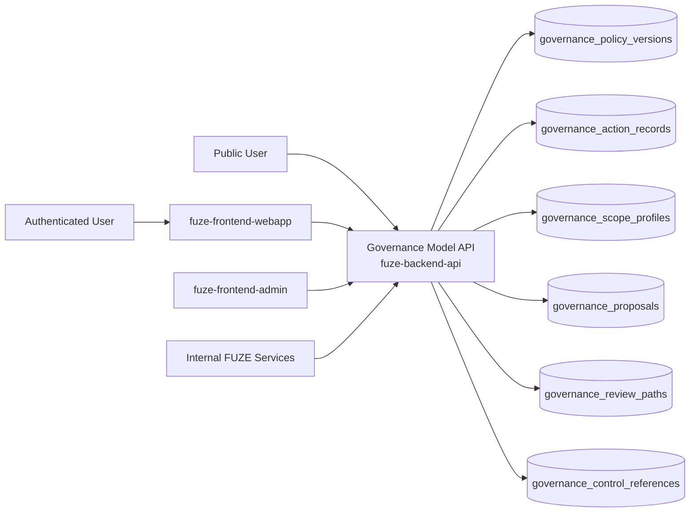
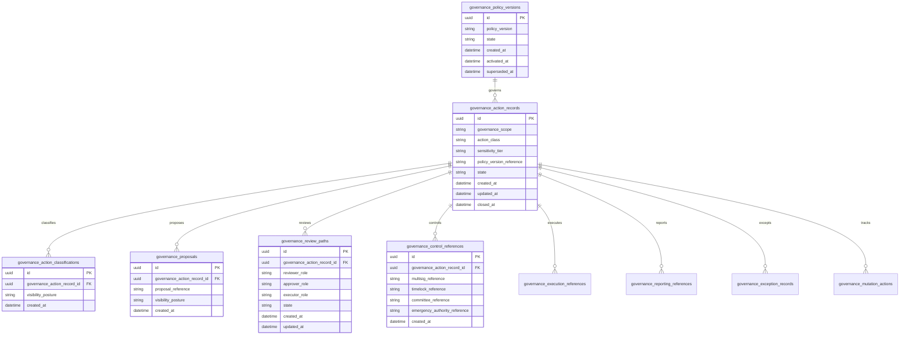
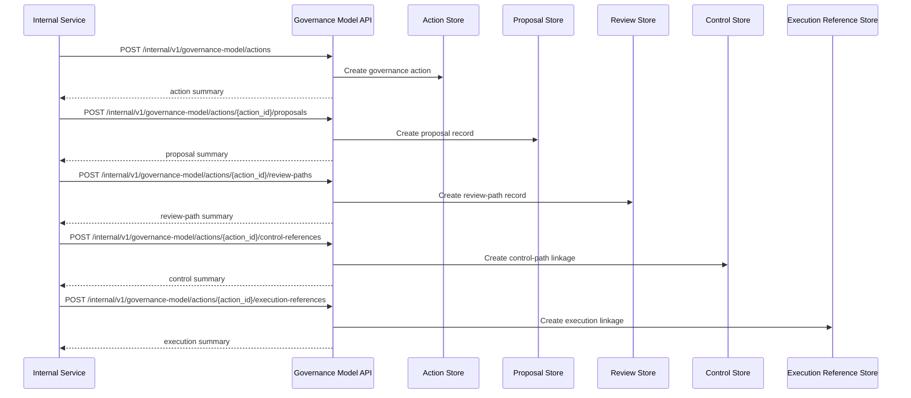

# GOVERNANCE_MODEL_API_SPEC

## 1. Title

**GOVERNANCE_MODEL_API_SPEC.md**

---

## 2. Document Metadata

- **Document Name:** GOVERNANCE_MODEL_API_SPEC.md
- **API Classification:** internal, admin, public-read, event-driven, chain-adjacent
- **Owning Domain:** Governance Model Domain
- **Primary Implementing Repo:** `fuze-backend-api`
- **Primary Chain-Adjacent Dependency:** `fuze-contracts`
- **Primary System of Record:** governance policy versions, governance action records, governance-scope classifications, proposal records, review and approval-path records, execution references, public reporting references, and correction-safe governance lineage in `fuze-backend-api`
- **Status:** Draft for canonical source-of-truth approval
- **Purpose:** Define the production-grade API contract architecture for the FUZE governance model, including governance-scope interpretation, proposal and approval lifecycle management, bounded control-path linkage, explicit public-governance visibility, and structured audit/reporting-safe lifecycle management across the platform
- **Canonical Folder:** `fuze.ac > docs > api-spec`

---

## 2.1 API Classification Header

- **API Classification:** internal | admin | public-read | event-driven | chain-adjacent
- **Owning Domain:** Governance Model Domain
- **Primary Implementing Repo:** `fuze-backend-api`
- **Primary Chain-Adjacent Dependency:** `fuze-contracts`
- **Primary System of Record:** governance model and governance-action domain

---

## 3. Purpose

This document defines the canonical API specification for FUZE governance model operations. It translates the governing FUZE platform architecture, governance model rules, treasury control policy, Foundation governance rules, vault action policy, multisig and timelock expectations, transparency expectations, audit requirements, and API architecture rules into an implementation-ready API contract.

This API exists because FUZE governance is broader than one vault, one contract, one payout cycle, or one admin approval screen. It is the structured layer that explains how material platform decisions become legible, reviewable, bounded, and historically traceable across different governance scopes. Governance must therefore remain distinct from treasury control, distinct from Foundation-only stewardship, distinct from product operations, and distinct from raw contract execution. It must preserve:

- explicit governance scopes,
- explicit proposal and review structure,
- explicit approval-path meaning,
- separation between governance decision and downstream execution,
- public-safe governance visibility where appropriate,
- and durable historical lineage for corrected or superseded decisions.

Accordingly, this specification defines how governance policy versions, governance action records, governance-scope classifications, proposal and approval-path records, execution references, and reporting references are represented, and how governance-model behavior remains auditable, idempotent, and architecture-consistent across FUZE.

---

## 4. Scope

This specification covers:

- internal APIs for governance policy versioning and governance-action lifecycle management
- internal APIs for governance-scope classification, proposal capture, review/approval-path recording, and execution-linkage recording
- internal APIs for governance-related reporting and registry linkage
- internal read APIs for canonical governance-model truth
- admin/control-plane APIs for approve, reject, pause, escalate, supersede, exceptional-governance handling, and discrepancy resolution
- public-read APIs for bounded public-safe governance policy summaries and governance-action reporting summaries where policy allows
- event emission requirements for governance-model lifecycle changes
- request, response, error, idempotency, versioning, audit, and database-shape rules for this domain

This specification does **not** redefine:

- treasury-control policy in full detail
- Foundation governance in full detail
- vault-action policy in full detail
- DAO-lite future-state mechanics in full detail
- low-level multisig signer management
- final public transparency-report composition
- low-level contract ABI implementations

Those remain governed by their own source-of-truth specifications.

---

## 5. Source-of-Truth Inputs

### Primary FUZE docs and specs used

#### Highest-priority platform and ownership sources
- `SYSTEM_SPEC_INDEX.md`
- `DOCS_SPEC.md`
- `SYSTEM_BOUNDARY_AND_OWNERSHIP_SPEC.md`
- `SYSTEM_OVERVIEW_AND_BOUNDARIES_SPEC.md`
- `PLATFORM_ARCHITECTURE_SPEC.md`
- `DOMAIN_OWNERSHIP_MATRIX_SPEC.md`
- `DATA_MODEL_AND_ENTITY_OWNERSHIP_SPEC.md`
- `ONCHAIN_OFFCHAIN_RESPONSIBILITY_SPEC.md`

#### Primary governance / control sources
- `GOVERNANCE_MODEL_SPEC.md`
- `FOUNDATION_GOVERNANCE_SPEC.md`
- `TREASURY_CONTROL_POLICY_SPEC.md`
- `VAULT_ACTION_POLICY_SPEC.md`
- `DAO_LITE_GOVERNANCE_FUTURE_SPEC.md`
- `MULTISIG_AND_TIMELOCK_SPEC.md`
- `TRANSPARENCY_MODEL_SPEC.md`
- `TRANSPARENCY_REPORTING_SPEC.md`
- `CHAIN_ARCHITECTURE_SPEC.md`
- `PUBLIC_CONTRACT_AND_WALLET_REGISTRY_SPEC.md`

#### Core docs inputs
- `FUZE_WHITEPAPER_v.2026.3.0.1.pdf`
- `FUZE_CHAIN_ARCHITECTURE.md`
- `TOKEN_CONTRACT_ARCHITECTURE_.md`
- `FUZE_TOKENOMICS_TABLES.md`
- `ALLOCATION_WALLET_MAP.md`

#### API and runtime sources
- `API_ARCHITECTURE_SPEC.md`
- `PUBLIC_API_SPEC.md`
- `INTERNAL_SERVICE_API_SPEC.md`
- `EVENT_MODEL_AND_WEBHOOK_SPEC.md`
- `IDEMPOTENCY_AND_VERSIONING_SPEC.md`
- `MIGRATION_AND_BACKWARD_COMPATIBILITY_SPEC.md`
- `AUDIT_LOG_AND_ACTIVITY_SPEC.md`

#### Security and operations sources
- `SECURITY_AND_RISK_CONTROL_SPEC.md`
- `MONITORING_ALERTING_AND_INCIDENT_RESPONSE_SPEC.md`
- `SECRETS_CONFIG_AND_ENVIRONMENT_SPEC.md`

#### Format guides
- `The_API_Specification_guide.md`
- `Database_Schemas_Guide.md`

### Highest-priority interpretation applied

For this file, the most important governing interpretation is:

1. governance is a distinct cross-cutting policy and decision layer, not a synonym for treasury or contract execution
2. backend owns canonical governance policy truth and governance-action truth
3. governance scopes must remain explicit because different domains require different degrees of openness, restraint, and review
4. governance decision, governance approval, and downstream execution must remain structurally distinct
5. public-safe governance visibility matters for trust, but not all governance internals are public-safe
6. future-state DAO-lite concepts must not overwrite or weaken current governance controls unless explicitly activated

### Supporting external standards used only as guidance

- HTTP semantics for internal mutation and bounded public-read APIs
- structured problem-details error design
- general policy-versioning, proposal-lifecycle, and correction-lineage patterns as supporting guidance

External guidance does not override FUZE source-of-truth documents.

---

## 6. Governing Architecture and Ownership Interpretation

This API belongs to the **Governance Model Domain** because it owns the canonical lifecycle of:

- governance policy version interpretation,
- governance-scope classification,
- governance action records,
- proposal and review-path capture,
- approval-path and control-reference linkage,
- public-safe governance reporting linkage,
- and correction-safe governance history.

This API is implemented primarily in `fuze-backend-api` because:

- backend owns durable governance policy and governance-action truth
- governance actions require centralized rule interpretation and historical traceability
- multiple adjacent domains require one shared governance reference layer without collapsing into one another
- public trust requires structured governance lineage beyond isolated contract actions
- audit generation and discrepancy handling must be centralized

This API is **not** owned by:

- `fuze-frontend-webapp`, because frontend only reads bounded public-safe or first-party-safe governance summaries
- `fuze-frontend-admin`, because admin may propose, approve, pause, or escalate governance actions but must not own canonical governance truth
- `fuze-contracts`, because contracts may execute downstream outcomes but do not own governance interpretation
- treasury-control domain, because treasury control is one governed domain, not the whole governance model
- Foundation governance domain, because Foundation governance is one stricter governance area within the broader model
- product domains, because product operations do not define platform governance truth

### Architectural implications

- every material governance action must preserve explicit governance-scope context
- every material governance action must preserve proposal, review, approval, and execution separation where policy requires
- governance visibility must distinguish public-safe from internal-only details
- governance history must remain corrigible through supersession, not through silent rewrite
- future-state DAO-lite signals may be referenced, but current-state governance remains controlling until explicitly changed

---

## 7. Domain Responsibilities

The Governance Model API domain is responsible for:

1. maintaining canonical governance policy versions and governance-action records
2. classifying governance actions by governance scope, action class, and sensitivity tier
3. preserving explicit proposal, review, approval, and execution-path meaning
4. linking governance actions to treasury, Foundation, vault, payout, or other governed domains where relevant
5. exposing public-safe governance summaries and reporting-safe action lineage
6. supporting admin approve, reject, pause, escalate, supersede, exceptional-governance handling, and discrepancy workflows
7. emitting governance-model lifecycle events
8. generating audit lineage for sensitive governance-model mutations
9. preserving separation between governance truth and downstream domain execution truth
10. supporting continuity between current governance controls and future-state governance evolution without conflation

The domain is not responsible for:

- owning raw contract execution state
- replacing treasury control policy
- replacing Foundation governance policy
- replacing transparency reports
- replacing DAO-lite future-state implementation
- allowing unstructured operator discretion to stand in for governance

---

## 8. Out of Scope

The following are out of scope for this API specification:

- on-chain voting implementation details
- signer-management or quorum mechanics
- end-user UI design for governance portals
- raw accounting or treasury exports
- low-level ABI implementations
- exact public disclosure thresholds for every governance event
- final DAO-lite rollout mechanics
- external explorer integrations

---

## 9. Canonical Entities and Data Ownership

### Durable entities

#### 9.1 governance_policy_versions
- **Owner:** Governance Model Domain
- **Purpose:** canonical policy versions governing cross-domain governance behavior
- **Nature:** source-of-truth durable entity

#### 9.2 governance_action_records
- **Owner:** Governance Model Domain
- **Purpose:** canonical governance-action records
- **Nature:** source-of-truth durable entity

#### 9.3 governance_scope_profiles
- **Owner:** Governance Model Domain
- **Purpose:** explicit profiles for governance scopes and their review/visibility posture
- **Nature:** source-of-truth durable entity

#### 9.4 governance_action_classifications
- **Owner:** Governance Model Domain
- **Purpose:** explicit classification of governance scope, action class, sensitivity tier, and visibility posture
- **Nature:** source-of-truth durable entity

#### 9.5 governance_proposals
- **Owner:** Governance Model Domain
- **Purpose:** proposal records and proposal summaries for governance actions
- **Nature:** source-of-truth durable lineage entity

#### 9.6 governance_review_paths
- **Owner:** Governance Model Domain
- **Purpose:** review and approval-path records for governance actions
- **Nature:** source-of-truth durable lineage entity

#### 9.7 governance_control_references
- **Owner:** Governance Model Domain
- **Purpose:** structured references to multisig, timelock, emergency authority, committee, or other bounded control paths
- **Nature:** source-of-truth durable lineage entity

#### 9.8 governance_execution_references
- **Owner:** Governance Model Domain
- **Purpose:** bounded references to downstream execution artifacts
- **Nature:** durable execution-lineage entity

#### 9.9 governance_reporting_references
- **Owner:** Governance Model Domain
- **Purpose:** references to transparency reports, public registry references, or governed-domain reporting artifacts
- **Nature:** durable reporting-lineage entity

#### 9.10 governance_exception_records
- **Owner:** Governance Model Domain
- **Purpose:** exceptional or emergency governance-treatment records with post-incident review requirements
- **Nature:** durable exceptional-case entity

#### 9.11 governance_discrepancy_cases
- **Owner:** Governance Model Domain
- **Purpose:** review and remediation records for invalid, stale, misclassified, or misreported governance actions
- **Nature:** durable review/remediation entity

#### 9.12 governance_mutation_actions
- **Owner:** Governance Model Domain
- **Purpose:** high-level action records for create, approve, reject, pause, escalate, exceptional, supersede, and resolve discrepancy
- **Nature:** durable action records with audit linkage

#### 9.13 governance_audit_events
- **Owner:** Audit / Activity domain, sourced by Governance Model Domain
- **Purpose:** immutable trail for sensitive governance-model actions
- **Nature:** durable audit records

### Derived or cached entities

#### 9.14 governance_public_policy_views
- **Owner:** derived read-model layer
- **Purpose:** public-safe governance policy and governance-action summaries
- **Nature:** derived

#### 9.15 governance_internal_status_views
- **Owner:** derived read-model layer
- **Purpose:** trusted governance-action and approval-path operational summaries
- **Nature:** derived

#### 9.16 governance_discrepancy_views
- **Owner:** derived ops read-model layer
- **Purpose:** visibility into stale, invalid, or misclassified governance conditions
- **Nature:** derived

---

## 10. State Model and Lifecycle

### 10.1 governance policy version lifecycle

Possible states:

- `draft`
- `active`
- `deprecated`
- `superseded`
- `archived`

### 10.2 governance action lifecycle

Possible states:

- `draft`
- `proposed`
- `under_review`
- `approved`
- `rejected`
- `ready_for_execution`
- `executed_reference_linked`
- `reported`
- `paused`
- `superseded`
- `closed`

### 10.3 review-path lifecycle

Possible states:

- `proposal_recorded`
- `review_pending`
- `approved`
- `rejected`
- `execution_linked`
- `closed`

### 10.4 exceptional-governance lifecycle

Possible states:

- `declared`
- `containment_active`
- `post_review_pending`
- `closed`
- `superseded`

### 10.5 discrepancy lifecycle

Possible states:

- `opened`
- `under_review`
- `resolved`
- `failed`
- `closed`

Lifecycle notes:
- governance proposal is distinct from approval
- approval is distinct from execution linkage
- reported is distinct from executed_reference_linked
- exceptional treatment must remain explicitly narrower than normal governance authorization
- supersession must preserve prior governance meaning and public explanation

---

## 11. API Surface Overview

The API surface is divided into four families:

### 11.1 Public-read APIs
Used by public users, holders, and community observers for:
- reading bounded governance-policy summaries
- reading public-safe governance-action summaries
- reading category-aware public explanations of governance handling where policy allows

### 11.2 First-party authenticated read APIs
Used by `fuze-frontend-webapp` and approved first-party clients for:
- reading bounded governance-related public-safe and first-party-safe summaries where policy allows
- reading linked reporting or governed-domain references without exposing internal-only governance detail

### 11.3 Internal service APIs
Used by trusted internal services for:
- creating governance actions
- validating governance scope, proposal posture, visibility posture, and downstream references
- recording review paths and control references
- linking execution and reporting references
- reading canonical truth

### 11.4 Admin / control-plane APIs
Used by `fuze-frontend-admin` through backend-only privileged routes for:
- approve, reject, pause, escalate, exceptional treatment, supersede, and discrepancy actions
- governance-path repair and policy-governed remediation workflows

---

## 12. Authentication and Authorization Model

### 12.1 Authentication posture by route family

#### Public-read routes
No authentication required:
- list public-safe governance policy summaries
- read public-safe governance-action summaries and references where published

#### Authenticated read routes
Require valid authenticated session:
- read bounded first-party-safe governance-related summaries where actor has visibility under policy

#### Internal service routes
Require internal service identity with explicit least privilege:
- create governance actions
- classify actions
- record proposals, review paths, control references, and reporting links
- read canonical truth

#### Admin routes
Require privileged operator identity plus reason-coded actions:
- approve, reject, pause, escalate, declare exceptional treatment, supersede, and resolve discrepancy cases

### 12.2 Authorization checkpoints

Authorization must evaluate:
- caller identity and route family
- whether target action is public-safe, first-party-safe, or privileged internal state
- whether internal service has create/classify/link/read privilege
- whether admin/operator role is present for sensitive governance actions
- whether current action state allows requested mutation
- whether governance scope and sensitivity tier require stronger control-path validation

### 12.3 Sensitive action rules

The following require heightened checks:
- approval of material governance actions
- governance actions spanning treasury, Foundation, or payout-related implications
- visibility changes after action enters under_review or approved state
- escalation or exceptional treatment
- discrepancy-resolution actions

---

## 13. API Endpoints / Interface Contracts

## 13.1 Public-Read APIs

### 13.1.1 `GET /v1/governance-model/policies`
**Purpose:** list published public-safe governance policy summaries  
**Caller Type:** public  
**Auth Expectation:** none  
**Query Parameters Summary:**
- optional `state`
- pagination
**Response Summary:**
- policy version summaries
- active/superseded posture
- public-safe governance-scope summaries
- timestamps
**Side Effects:** none
**Audit Requirements:** access logging optional
**Emitted Events:** none required

### 13.1.2 `GET /v1/governance-model/actions`
**Purpose:** list published public-safe governance-action summaries  
**Caller Type:** public  
**Query Parameters Summary:**
- optional `governance_scope`
- optional `action_class`
- optional `sensitivity_tier`
- pagination
**Response Summary:**
- public-safe action summaries
- governance scope, action class, and status
- bounded reporting and public references
**Side Effects:** none

### 13.1.3 `GET /v1/governance-model/actions/{governance_action_id}`
**Purpose:** retrieve one public-safe governance-action detail  
**Caller Type:** public  
**Response Summary:**
- public-safe action detail
- governance-scope and sensitivity summary
- linked reporting and governed-domain references where published
- correction or supersession guidance where relevant
**Side Effects:** none

## 13.2 First-Party Authenticated Read APIs

### 13.2.1 `GET /v1/governance-model/me/actions`
**Purpose:** retrieve bounded first-party-safe governance-related action summaries where actor has policy visibility  
**Caller Type:** authenticated user  
**Auth Expectation:** valid authenticated session  
**Query Parameters Summary:**
- optional `reference_type`
- pagination
**Response Summary:**
- bounded governance-related summaries
- linked public reporting or governance guidance where applicable
**Side Effects:** none

## 13.3 Internal Service APIs

### 13.3.1 `POST /internal/v1/governance-model/actions`
**Purpose:** create draft governance-action record  
**Caller Type:** internal trusted service  
**Auth Expectation:** service-to-service identity only  
**Request Body Summary:**
- `governance_scope`
- `action_class`
- `sensitivity_tier`
- `policy_version_reference`
- optional `proposal_summary`
- `idempotency_key`
**Response Summary:** governance-action summary
**Side Effects:** creates draft/proposed governance action and classification record
**Idempotency Behavior:** required
**Audit Requirements:** sensitive governance-action creation audit
**Emitted Events:** `governance_model.action_created`

### 13.3.2 `POST /internal/v1/governance-model/actions/{governance_action_id}/proposals`
**Purpose:** attach proposal record and proposal summary to one governance action  
**Caller Type:** internal trusted service  
**Request Body Summary:**
- `proposal_reference`
- `proposal_summary`
- optional `visibility_posture`
- `idempotency_key`
**Response Summary:** proposal summary
**Side Effects:** creates proposal lineage and may move action into proposed or under_review state
**Idempotency Behavior:** required
**Audit Requirements:** proposal-record audit
**Emitted Events:** `governance_model.proposal_recorded`

### 13.3.3 `POST /internal/v1/governance-model/actions/{governance_action_id}/review-paths`
**Purpose:** record review and approval-path structure for one governance action  
**Caller Type:** internal trusted service  
**Request Body Summary:**
- `reviewer_role`
- `approver_role`
- `executor_role`
- optional `review_path_summary`
- `idempotency_key`
**Response Summary:** review-path summary
**Side Effects:** creates review-path lineage and may move action into under_review
**Idempotency Behavior:** required
**Audit Requirements:** review-path audit
**Emitted Events:** `governance_model.review_path_recorded`

### 13.3.4 `POST /internal/v1/governance-model/actions/{governance_action_id}/control-references`
**Purpose:** attach multisig, timelock, emergency, committee, or other control references to one action  
**Caller Type:** internal trusted service  
**Request Body Summary:**
- optional `multisig_reference`
- optional `timelock_reference`
- optional `committee_reference`
- optional `emergency_authority_reference`
- optional `control_summary`
- `idempotency_key`
**Response Summary:** control-reference summary
**Side Effects:** creates control-path linkage
**Idempotency Behavior:** required
**Audit Requirements:** control-reference audit
**Emitted Events:** `governance_model.control_linked`

### 13.3.5 `POST /internal/v1/governance-model/actions/{governance_action_id}/reporting-references`
**Purpose:** attach transparency, registry, or governed-domain reporting references to one governance action  
**Caller Type:** internal trusted service  
**Request Body Summary:**
- optional `transparency_report_reference`
- optional `public_registry_reference`
- optional `domain_reporting_reference`
- optional `exception_reference`
- `idempotency_key`
**Response Summary:** reporting-reference summary
**Side Effects:** creates reporting and trust-surface linkage
**Idempotency Behavior:** required
**Audit Requirements:** reporting-link audit
**Emitted Events:** `governance_model.reporting_linked`

### 13.3.6 `POST /internal/v1/governance-model/actions/{governance_action_id}/execution-references`
**Purpose:** link downstream execution reference to one governance action  
**Caller Type:** internal trusted service  
**Request Body Summary:**
- `execution_reference_type`
- `execution_reference_id`
- optional `execution_summary`
- `idempotency_key`
**Response Summary:** execution-reference summary and updated action state
**Side Effects:** creates execution linkage and may move action into executed_reference_linked
**Idempotency Behavior:** required
**Audit Requirements:** execution-link audit
**Emitted Events:** `governance_model.execution_linked`

### 13.3.7 `GET /internal/v1/governance-model/actions/{governance_action_id}`
**Purpose:** retrieve canonical governance-model truth  
**Caller Type:** internal trusted service  
**Response Summary:** full governance action, policy version, scope profile, classification, proposal, review path, control references, reporting references, execution references, and discrepancy lineage
**Side Effects:** none

## 13.4 Admin / Control-Plane APIs

### 13.4.1 `POST /admin/v1/governance-model/actions/{governance_action_id}/approve`
**Purpose:** approve governance action under controlled policy  
**Caller Type:** admin/operator  
**Request Body Summary:**
- `reason_code`
- `operator_note`
- `idempotency_key`
**Response Summary:** approved action summary
**Side Effects:** action moves to approved or ready_for_execution if checks pass
**Audit Requirements:** critical audit
**Emitted Events:** `governance_model.action_approved`

### 13.4.2 `POST /admin/v1/governance-model/actions/{governance_action_id}/reject`
**Purpose:** reject governance action under controlled policy  
**Caller Type:** admin/operator  
**Request Body Summary:**
- `reason_code`
- `operator_note`
- `idempotency_key`
**Response Summary:** rejected action summary
**Side Effects:** action moves to rejected
**Audit Requirements:** critical audit
**Emitted Events:** `governance_model.action_rejected`

### 13.4.3 `POST /admin/v1/governance-model/actions/{governance_action_id}/pause`
**Purpose:** pause governance action under controlled policy  
**Caller Type:** admin/operator  
**Request Body Summary:**
- `reason_code`
- `operator_note`
- `idempotency_key`
**Response Summary:** paused action summary
**Side Effects:** action moves to paused
**Audit Requirements:** critical audit
**Emitted Events:** `governance_model.action_paused`

### 13.4.4 `POST /admin/v1/governance-model/actions/{governance_action_id}/escalate`
**Purpose:** escalate governance action to stronger governance/control path  
**Caller Type:** admin/operator  
**Request Body Summary:**
- `escalation_type`
- `reason_code`
- `operator_note`
- `idempotency_key`
**Response Summary:** escalation summary
**Side Effects:** action control path strengthens, for example through stronger review or timelock posture
**Audit Requirements:** critical audit
**Emitted Events:** `governance_model.action_escalated`

### 13.4.5 `POST /admin/v1/governance-model/actions/{governance_action_id}/exceptional`
**Purpose:** declare emergency or exceptional governance treatment under controlled policy  
**Caller Type:** admin/operator  
**Request Body Summary:**
- `exception_type`
- `public_or_internal_summary`
- `reason_code`
- `operator_note`
- `idempotency_key`
**Response Summary:** exceptional-governance summary
**Side Effects:** creates exception record and may restrict ordinary governance path until review completes
**Audit Requirements:** critical audit
**Emitted Events:** `governance_model.exception_declared`

### 13.4.6 `POST /admin/v1/governance-model/actions/{governance_action_id}/supersede`
**Purpose:** supersede one governance action with a replacement record under controlled policy  
**Caller Type:** admin/operator  
**Request Body Summary:**
- `replacement_governance_action_id`
- `reason_code`
- `operator_note`
- `idempotency_key`
**Response Summary:** supersession summary
**Side Effects:** creates old-to-new supersession linkage and updates current policy-visible preference
**Audit Requirements:** critical audit
**Emitted Events:** `governance_model.action_superseded`

### 13.4.7 `POST /admin/v1/governance-model/discrepancies`
**Purpose:** resolve governance-model discrepancy under controlled policy  
**Caller Type:** admin/operator  
**Request Body Summary:**
- `target_reference_type`
- `target_reference_id`
- `resolution_code`
- `operator_note`
- `related_case_id`
- `idempotency_key`
**Response Summary:** discrepancy-resolution summary
**Side Effects:** may correct, supersede, pause, escalate, or close discrepancy posture with preserved lineage
**Audit Requirements:** critical audit
**Emitted Events:** `governance_model.discrepancy_resolved`

---

## 14. Request Rules

### 14.1 General request rules
- all mutation-capable routes must require JSON requests with explicit content type
- all mutation routes must carry correlation IDs
- sensitive governance-model mutations must carry idempotency keys
- admin mutations must require reason codes and operator notes
- no route may accept frontend-authored governance truth as authoritative input

### 14.2 Sensitive-action request requirements
The following requests require heightened validation:
- proposal or approval of material governance actions
- governance actions spanning treasury, Foundation, or payout-related implications
- visibility changes after action enters under_review or approved state
- escalation or exceptional treatment
- discrepancy-resolution actions

Heightened validation may include:
- governance-scope consistency checks
- public-safe versus internal-only visibility checks
- control-path completeness checks
- operator role confirmation
- governance/finance/security case linkage for sensitive actions

### 14.3 Scope integrity rule
Governance-model mutations must target valid and authorized policy versions, action records, proposal records, control references, and discrepancy records. Services and operators must not mutate unrelated or unauthorized governance state.

### 14.4 Layer-separation rule
Governance model must remain the cross-domain decision-and-legibility layer. It must not collapse:
- treasury-control meaning,
- Foundation-governance meaning,
- vault-policy meaning,
- multisig/timelock execution,
- or transparency reporting
into one ambiguous state object.

---

## 15. Response Rules

### 15.1 Success response rules
Successful responses must include:
- stable resource identifiers
- timestamps for created/updated state
- state/status values
- action, scope, or proposal summaries where relevant
- control-path and reporting-reference summaries where relevant
- correlation references for mutations

### 15.2 Async-accepted response rules
If escalation, exceptional review, or discrepancy remediation is async, the response must:
- return accepted status
- include action or job ID
- provide follow-up status semantics

### 15.3 Terminal mutation response rules
Terminal mutation responses must clearly show:
- target action or discrepancy
- mutation type
- resulting policy/action/control-path state
- pause, escalation, exceptional, supersession, or closure effects where relevant
- whether public-safe views may refresh asynchronously

### 15.4 Read response rules
Read responses must distinguish:
- canonical internal governance truth
- public-safe governance-policy summaries
- public-safe governance-action reporting views
- execution references versus final downstream execution outcomes

---

## 16. Error Model

The API uses structured problem-details style error responses.

### 16.1 Required error fields
- `type`
- `title`
- `status`
- `code`
- `detail`
- `instance`
- `correlation_id`

### 16.2 Common error codes

#### Authorization / permission errors
- `GOVERNANCE_MODEL_PERMISSION_DENIED`
- `GOVERNANCE_MODEL_OPERATOR_PERMISSION_DENIED`
- `GOVERNANCE_MODEL_SERVICE_PERMISSION_DENIED`
- `GOVERNANCE_MODEL_AUDIENCE_PERMISSION_DENIED`

#### State conflict errors
- `GOVERNANCE_MODEL_ACTION_STATE_INVALID`
- `GOVERNANCE_MODEL_POLICY_STATE_INVALID`
- `GOVERNANCE_MODEL_REVIEW_PATH_INVALID`
- `GOVERNANCE_MODEL_SUPERSESSION_CONFLICT`
- `GOVERNANCE_MODEL_ESCALATION_CONFLICT`

#### Policy / safety errors
- `GOVERNANCE_MODEL_SCOPE_INVALID`
- `GOVERNANCE_MODEL_POLICY_VERSION_REQUIRED`
- `GOVERNANCE_MODEL_APPROVAL_REQUIRED`
- `GOVERNANCE_MODEL_EXCEPTION_NOT_ALLOWED`
- `GOVERNANCE_MODEL_VISIBILITY_RESTRICTION`

#### Request integrity errors
- `GOVERNANCE_MODEL_IDEMPOTENCY_KEY_REQUIRED`
- `GOVERNANCE_MODEL_REQUEST_INVALID`
- `GOVERNANCE_MODEL_REQUEST_UNPROCESSABLE`

#### Dependency or provider errors
- `GOVERNANCE_MODEL_EXECUTION_UNAVAILABLE`
- `GOVERNANCE_MODEL_STORAGE_UNAVAILABLE`
- `GOVERNANCE_MODEL_RECONCILIATION_UNAVAILABLE`

### 16.3 Error handling rules
- do not expose hidden internal governance, treasury, or security detail in public or low-privilege responses
- do not imply permitted execution merely because a draft or proposed governance action exists
- distinguish governance-scope restriction failure from generic invalid state
- distinguish policy-version-required from generic invalid request
- include retry guidance only where safe

---

## 17. Idempotency and Mutation Safety

### 17.1 Required idempotent mutations
The following mutation routes require idempotent behavior:
- governance-action creation
- proposal attachment
- review-path recording
- control-reference attachment
- reporting-reference attachment
- execution-reference linking
- approve
- reject
- pause
- escalate
- exceptional
- supersede
- discrepancy resolution

### 17.2 Idempotency key rules
- mutation requests must supply `Idempotency-Key`
- backend stores key scope, request hash, actor, and terminal result
- replay of same semantic request returns original terminal outcome
- replay of same key with different semantic request must fail with conflict

### 17.3 Mutation safety rules
- one canonical visible governance action per current action lineage unless explicit supersession exists
- proposal, review, control-path, and reporting records must remain referentially consistent with governance scope and sensitivity tier
- approval, execution linkage, and reporting linkage must preserve proposal/approval/execution separation
- corrections and supersession must preserve prior governance-action lineage
- exceptional treatment must not silently normalize into routine governance behavior

---

## 18. Versioning and Compatibility Rules

### 18.1 Versioning
This API family is versioned under `/v1`, `/internal/v1`, and `/admin/v1` route families.

### 18.2 Compatibility approach
- additive evolution preferred
- no silent semantic change to proposed, approved, ready_for_execution, executed_reference_linked, reported, paused, or superseded states
- new governance scopes, action classes, destination types, or control-reference types may be added without breaking existing contracts
- response fields may be added but existing meanings must remain stable

### 18.3 Breaking-change rules
Breaking changes include:
- changing the meaning of governance-action lifecycle states
- changing public-safe governance visibility semantics incompatibly
- removing critical scope, proposal, or control-path fields
- changing exceptional-treatment or supersession semantics incompatibly

Such changes require explicit migration planning and version evolution.

### 18.4 Deprecation
Deprecated routes or fields must:
- be documented explicitly
- carry deprecation metadata where supported
- preserve compatibility windows long enough for public, first-party, and internal consumers

---

## 19. Event Emission and Webhook Behavior

This domain is event-capable.

### 19.1 Internal events
The Governance Model domain must emit canonical internal events such as:
- `governance_model.action_created`
- `governance_model.proposal_recorded`
- `governance_model.review_path_recorded`
- `governance_model.control_linked`
- `governance_model.reporting_linked`
- `governance_model.execution_linked`
- `governance_model.action_approved`
- `governance_model.action_rejected`
- `governance_model.action_paused`
- `governance_model.action_escalated`
- `governance_model.exception_declared`
- `governance_model.action_superseded`
- `governance_model.discrepancy_resolved`

### 19.2 Event payload minimums
Each event should contain:
- event ID
- event type
- occurred_at
- governance action ID
- governance scope
- action class
- sensitivity tier
- actor type
- correlation ID
- reason code where applicable

### 19.3 External webhook posture
This specification does not expose general third-party outbound governance-model webhooks by default. Any future outbound governance-status webhook surface must be narrow, security-reviewed, and governed by a separate contract.

---

## 20. Audit and Activity Requirements

The following actions must generate durable audit events:

- governance-action creation
- proposal recording
- review-path recording
- approve, reject, pause, escalate, and exceptional treatment
- execution-reference and reporting-reference linkage for material actions
- supersession and discrepancy-resolution actions
- other sensitive governance-model mutations

### Required audit fields
- audit event ID
- actor type and actor reference
- target action / scope / proposal / control path / discrepancy reference as applicable
- action type
- before/after summary where applicable
- reason code
- correlation ID
- operator note if operator action
- occurred_at

---

## 21. Data Model and Database Schema View

### 21.1 `governance_policy_versions`
- `id` PK
- `policy_version`
- `state`
- `policy_summary_json`
- `created_at`
- `activated_at` nullable
- `superseded_at` nullable

**Constraints:**
- unique `policy_version`
- index on `state`

### 21.2 `governance_action_records`
- `id` PK
- `governance_scope`
- `action_class`
- `sensitivity_tier`
- `policy_version_reference`
- `state`
- `created_at`
- `updated_at`
- `closed_at` nullable

**Constraints:**
- index on (`governance_scope`, `action_class`)
- index on `state`

### 21.3 `governance_scope_profiles`
- `id` PK
- `governance_scope`
- `visibility_profile_json`
- `review_profile_json`
- `execution_profile_json`
- `created_at`
- `updated_at`

**Constraints:**
- unique `governance_scope`

### 21.4 `governance_action_classifications`
- `id` PK
- `governance_action_record_id` FK -> `governance_action_records.id`
- `visibility_posture`
- `classification_summary_json`
- `created_at`

**Constraints:**
- index on `governance_action_record_id`

### 21.5 `governance_proposals`
- `id` PK
- `governance_action_record_id` FK -> `governance_action_records.id`
- `proposal_reference`
- `proposal_summary_json`
- `visibility_posture`
- `created_at`

**Constraints:**
- index on `governance_action_record_id`

### 21.6 `governance_review_paths`
- `id` PK
- `governance_action_record_id` FK -> `governance_action_records.id`
- `reviewer_role`
- `approver_role`
- `executor_role`
- `state`
- `created_at`
- `updated_at`

**Constraints:**
- index on `governance_action_record_id`
- index on `state`

### 21.7 `governance_control_references`
- `id` PK
- `governance_action_record_id` FK -> `governance_action_records.id`
- `multisig_reference` nullable
- `timelock_reference` nullable
- `committee_reference` nullable
- `emergency_authority_reference` nullable
- `created_at`

**Constraints:**
- index on `governance_action_record_id`

### 21.8 `governance_execution_references`
- `id` PK
- `governance_action_record_id` FK -> `governance_action_records.id`
- `execution_reference_type`
- `execution_reference_id`
- `execution_summary_json`
- `created_at`

**Constraints:**
- index on `governance_action_record_id`
- index on (`execution_reference_type`, `execution_reference_id`)

### 21.9 `governance_reporting_references`
- `id` PK
- `governance_action_record_id` FK -> `governance_action_records.id`
- `transparency_report_reference` nullable
- `public_registry_reference` nullable
- `domain_reporting_reference` nullable
- `exception_reference` nullable
- `created_at`

**Constraints:**
- index on `governance_action_record_id`

### 21.10 `governance_exception_records`
- `id` PK
- `governance_action_record_id` FK -> `governance_action_records.id`
- `exception_type`
- `summary_json`
- `state`
- `created_at`
- `closed_at` nullable

### 21.11 `governance_discrepancy_cases`
- `id` PK
- `target_reference_type`
- `target_reference_id`
- `state`
- `resolution_code` nullable
- `created_at`
- `updated_at`
- `closed_at` nullable

### 21.12 `governance_mutation_actions`
- `id` PK
- `target_reference_type`
- `target_reference_id`
- `action_type`
- `state`
- `reason_code`
- `operator_note` nullable
- `requested_by_actor_type`
- `requested_by_actor_id`
- `created_at`
- `executed_at` nullable
- `closed_at` nullable
- `correlation_id`

### 21.13 `idempotency_records`
- `id` PK
- `idempotency_key`
- `scope_family`
- `actor_reference`
- `request_hash`
- `response_hash`
- `terminal_status`
- `created_at`
- `expires_at`

### 21.14 `audit_log_entries`
Domain-sourced audit records written into the audit domain.

### Normalization notes
- canonical governance truth stays in policy versions, action records, scope profiles, classifications, proposals, review paths, control references, execution references, reporting references, and discrepancy records
- treasury-control, Foundation-governance, and vault-policy truth remain external and are referenced rather than duplicated
- public-safe views must derive from canonical governance truth filtered by disclosure policy
- execution and reporting references remain explicit rather than embedded as opaque strings

### Reconciliation notes
- one visible governance action should reconcile to one current action lineage under current preference
- review and control paths must reconcile to governance scope and sensitivity tier
- proposal visibility posture must reconcile to public-safe disclosure posture
- discrepancy cases must preserve review lineage for failed or conflicting governance-model conditions

---

## 22. Architecture Diagram — Mermaid flowchart



---

## 23. Data Design — Mermaid Diagram



---

## 24. Flow View

### 24.1 Happy path — propose, approve, execute, report
1. internal service creates draft governance action
2. proposal record is attached with visibility posture
3. review and approval roles are recorded
4. control references such as multisig, timelock, or committee links are attached where required
5. admin approves the action
6. downstream execution reference is linked after execution path proceeds
7. reporting and public registry references are attached
8. public-safe governance-action view becomes explainable and historically traceable

### 24.2 Happy path — cross-domain governance action
1. governance action spans treasury, Foundation, vault, or payout-related implications
2. system records explicit governance scope and sensitivity tier
3. proposal and review path are recorded
4. admin approves action after scope-specific checks pass
5. downstream domain references are linked
6. public-safe governance summary preserves cross-domain legibility without collapsing domain ownership

### 24.3 Alternate path — escalated governance treatment
1. action carries heightened cross-domain or sensitivity implications
2. operator escalates to stronger review/control path
3. additional review or stronger timelock/multisig posture is linked
4. action proceeds only if stronger-control requirements are satisfied

### 24.4 Failure path — scope or visibility violation
1. governance action is created or modified
2. backend detects governance-scope mismatch, visibility inconsistency, or disallowed governance posture
3. request is rejected or paused
4. no effective approval or public reporting is produced

### 24.5 Failure and remediation path — discrepancy or misreporting
1. governance action, proposal, or reporting linkage becomes stale or inconsistent
2. admin opens discrepancy-resolution flow
3. backend preserves existing lineage
4. corrected or superseding governance action or linkage is created
5. discrepancy closes with preserved history

### 24.6 Exceptional-governance path
1. emergency or exceptional condition is detected
2. operator declares exceptional treatment with explicit reason and narrow containment posture
3. ordinary governance shortcuts are not normalized into standing authority
4. post-incident review remains required
5. exceptional record closes only after structured review

### 24.7 Retry behavior
- duplicate governance-action creation returns same canonical action result
- duplicate proposal or control-reference attachment returns same lineage result where applicable
- duplicate approve/reject/pause/escalate/exceptional/supersede/discrepancy actions return same terminal action result

---

## 25. Data Flows — Mermaid sequenceDiagram



---

## 26. Security and Risk Controls

1. **Governance-model truth is backend-owned**  
   Frontends and informal channels may not authoritatively define governance-action truth.

2. **Governance scope clarity is mandatory**  
   A governance action must preserve explicit governance-scope meaning rather than relying on vague “important decision” language.

3. **Proposal, review, approval, and execution separation**  
   Material governance decisions must preserve meaningful decision-path structure rather than collapsing into ad hoc execution.

4. **Visibility discipline**  
   Public-safe visibility and internal-only governance detail must remain explicitly separated.

5. **Cross-domain non-collapse**  
   A governance action may relate to treasury, Foundation, vault, or payout domains without collapsing those domains into one governance object.

6. **Least privilege**  
   Internal write and admin approve/pause/escalate routes must be limited to authorized services and operators.

7. **Emergency narrowness**  
   Exceptional governance paths should remain narrow and recovery-oriented rather than becoming standing discretionary shortcuts.

8. **Audit immutability**  
   Sensitive governance-model actions require durable immutable audit lineage.

9. **Reporting compatibility**  
   Material governance actions must remain compatible with public-safe reporting and registry linkage where policy allows.

10. **Historical intelligibility**  
    Corrections and supersession must preserve why a governance decision changed, not only that it changed.

---

## 27. Operational Considerations

- governance-action and review-path reads for trusted operators should be highly available
- proposal capture, scope classification, visibility handling, and control-reference integrity are correctness-sensitive
- cross-domain governance actions should surface clearly to ops views
- exceptional-treatment and discrepancy workflows should be observable and reviewable
- monitoring should alert on:
  - missing review-path records for material governance actions
  - visibility mismatches or scope violations
  - control-reference omissions for high-sensitivity actions
  - unusual exceptional-treatment frequency
  - reporting-link gaps for executed material governance actions
  - public-safe view inconsistency versus canonical governance state

---

## 28. Acceptance Criteria

1. The API preserves the distinction between governance-model truth, treasury-control truth, Foundation-governance truth, vault-policy truth, execution truth, and transparency-report truth.
2. Only `fuze-backend-api` owns canonical governance policy version and governance-action truth.
3. Governance policy versions, action records, scope profiles, classifications, proposals, review paths, control references, execution references, reporting references, and discrepancy records are durable and backend-owned.
4. Public and first-party routes expose only bounded safe governance-model views.
5. Governance-scope, proposal, review, and visibility posture are explicit and validated.
6. Proposal, approval, and execution separation is preserved for material governance actions.
7. Cross-domain governance-sensitive actions are handled with stronger policy sensitivity where required.
8. Approval, escalation, exceptional treatment, correction, and discrepancy actions preserve immutable lineage.
9. Governance-model mutation actions are idempotent and auditable.
10. Internal and admin governance-model routes are least-privilege and backend-only.
11. Admin routes require reason-coded privileged authorization.
12. Event emissions exist for major governance-model mutations.
13. Database schema separates policy versions, actions, scope profiles, classifications, proposals, review paths, control references, execution references, reporting references, and discrepancy layers.
14. Public-safe consumers can rely on governance-model views without needing hidden internal governance detail.
15. Mermaid diagrams remain consistent with prose and data model.

---

## 29. Test Cases

### 29.1 Positive cases
1. Internal service creates draft governance action successfully.
2. Internal service records proposal successfully.
3. Internal service records review path successfully.
4. Internal service links control references successfully.
5. Internal service links reporting references successfully.
6. Admin approves governance action successfully.
7. Admin escalates high-sensitivity governance action successfully.
8. Public actor reads published public-safe governance-action summary successfully.

### 29.2 Negative cases
9. Public user cannot access internal governance truth or discrepancy detail.
10. Internal service without write privilege cannot create governance action.
11. Governance action without policy version returns `GOVERNANCE_MODEL_POLICY_VERSION_REQUIRED`.
12. Governance action with invalid governance scope returns `GOVERNANCE_MODEL_SCOPE_INVALID`.
13. Visibility posture violating policy returns `GOVERNANCE_MODEL_VISIBILITY_RESTRICTION`.
14. Exceptional treatment in ineligible state returns `GOVERNANCE_MODEL_EXCEPTION_NOT_ALLOWED`.

### 29.3 Authorization cases
15. Ordinary public or authenticated user cannot call governance-model admin APIs.
16. Internal service without proposal-record privilege cannot attach proposal records.
17. Operator without approval privilege cannot approve governance action.
18. Approved governance action does not prove downstream execution completion by itself.

### 29.4 Idempotency and replay cases
19. Repeating governance-action creation with same idempotency key returns original action result.
20. Repeating control-reference attachment with same idempotency key returns original linkage result.
21. Repeating approve or pause with same idempotency key returns original terminal action result.
22. Repeating exceptional or discrepancy resolution with same idempotency key returns original terminal action result.

### 29.5 Concurrency cases
23. Concurrent proposal updates preserve one explicit current proposal lineage and duplicate-safe outcomes where appropriate.
24. Concurrent approve and escalate actions preserve explicit lifecycle ordering without hidden overwrite.
25. Concurrent supersede and pause actions preserve explicit visible lineage without ambiguity.

### 29.6 Recovery / admin cases
26. Stale or misreported governance action can be corrected under controlled policy with explicit lineage.
27. Superseded governance action remains historically linked to the original record.
28. Discrepancy resolution closes scope, proposal, or reporting conflict with preserved audit history.

### 29.7 Event and audit cases
29. Successful governance action creation emits `governance_model.action_created`.
30. Successful proposal recording emits `governance_model.proposal_recorded`.
31. Successful approval emits `governance_model.action_approved`.
32. Successful exceptional declaration emits `governance_model.exception_declared`.
33. Successful discrepancy resolution emits `governance_model.discrepancy_resolved` with critical audit lineage.

---

## 30. Open Questions or Explicit Deferred Decisions

1. Exact governance-scope taxonomy code sets are deferred.
2. Exact proposal-visibility taxonomy is deferred.
3. Exact sensitivity-tier to committee/timelock mapping rules are deferred.
4. Exact public-safe disclosure depth for governance actions is deferred.
5. Exact exceptional-governance rollback taxonomy is deferred.
6. Exact discrepancy taxonomy for governance-model conflicts is deferred.

---

## 31. Implementation Notes for `fuze-backend-api`

Recommended backend module layout:

```text
modules/platform/
  governance-model/
  treasury-control/
  foundation-governance/
  vault-action-policy/
  transparency-reporting/
  audit-log/
  control-plane/
  integrations/
```

Implementation guidance:
- keep policy versions, governance actions, scope/proposal validation, classification logic, review-path logic, and control-reference linkage in one canonical domain service
- perform scope, visibility, sensitivity, timing, and control-path completeness checks inside the commit boundary
- keep approve, reject, pause, escalate, exceptional, supersede, and discrepancy actions explicit and idempotent
- treat admin remediations as domain actions, not ad hoc row edits
- emit events only after canonical state commit succeeds
- publish public-safe governance-model views from canonical truth; do not let derived views mutate governance state

---

## 32. Frontend Consumption Notes

### For `fuze-frontend-webapp`
- may read public-safe governance policy and governance-action summaries where approved
- must not infer governance permissibility from isolated contract transfers or admin actions alone
- must treat backend governance-model responses as authoritative for structured governance status
- should clearly distinguish proposed, approved, executed-reference-linked, reported, paused, corrected, and superseded states when visible

### For `fuze-frontend-admin`
- may trigger privileged approve, reject, pause, escalate, exceptional, supersede, and discrepancy actions only through backend admin APIs
- must require operator reason input for sensitive mutations
- must not directly mutate canonical governance truth client-side
- should present immutable governance-action history and correction lineage separately from current visible state

---

## 33. Contract Derivation Notes

### OpenAPI / AsyncAPI
This spec should later derive into:
- public policy/action read operations and bounded first-party-safe summary operations
- internal governance-action creation, proposal, review-path, control-reference, reporting-reference, and execution-reference operations
- admin approve / reject / pause / escalate / exceptional / supersede / discrepancy operations
- shared problem-details schema
- governance-model lifecycle events in AsyncAPI

### Future `fuze-sdk`
Future `fuze-sdk` packages may derive:
- public governance-policy lookup helpers
- public-safe governance-action summary helpers
- typed governance-action, governance-scope, and sensitivity summary models
- problem-error models for governance-model outcomes

The SDK must derive from approved API contracts and must not become the source of truth over this narrative specification.
