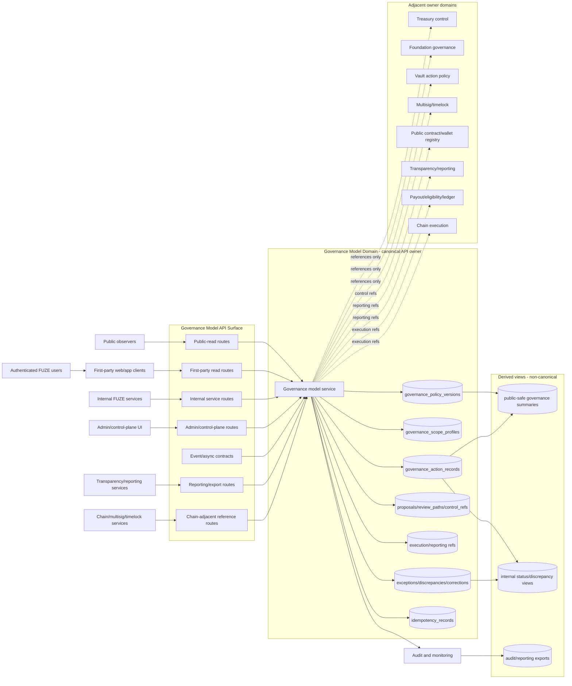

# GOVERNANCE_MODEL_API_SPEC.md

## Document Metadata

- **Document Name:** `GOVERNANCE_MODEL_API_SPEC.md`
- **Document Type:** API SPEC v2 / Production-Grade Interface Contract Specification
- **Status:** Draft production-grade API specification
- **Version:** 2.0.0
- **Effective Date:** 2026-04-25
- **Last Updated:** 2026-04-25
- **Reviewed On:** 2026-04-25
- **Document Owner:** FUZE Governance Model Domain; named individual owner not explicitly specified in retrieved governing materials
- **Approval Authority:** FUZE constitutional approval workflow; exact named approval authority not explicitly specified in retrieved governing materials
- **Review Cadence:** Quarterly and whenever governance scope, treasury/control posture, Foundation stewardship, vault-action posture, multisig/timelock rules, public-trust posture, chain-adjacent execution, or formally activated participation policy changes materially
- **Governing Layer:** API contract layer derived from refined platform governance semantics
- **Parent Registry:** `API_SPEC_INDEX.md` and FUZE API SPEC v2 Canonical File Registry
- **Upstream Semantic Registry:** `REFINED_SYSTEM_SPEC_INDEX.md`
- **Upstream API Registry:** `API_SPEC_INDEX.md`
- **Primary Audience:** Platform architecture, backend API engineering, governance/control-plane engineering, contracts engineering, security engineering, audit/compliance, treasury/finance stakeholders, Foundation stewards, public-trust/reporting authors, implementation-contract authors, OpenAPI/AsyncAPI/SDK maintainers, QA and production-readiness reviewers
- **Primary Purpose:** Define the production-grade API contract for FUZE governance-model operations, including governance policy versions, governance scopes, governance action lifecycle, proposal/review/approval separation, execution linkage, public-safe visibility, correction/supersession lineage, exceptional-governance handling, events, idempotency, auditability, and implementation guardrails.
- **Primary Upstream References:** `REFINED_SYSTEM_SPEC_INDEX.md`, `API_SPEC_INDEX.md`, `DOCS_SPEC_INDEX.md`, `SYSTEM_SPEC_INDEX.md`, `GOVERNANCE_MODEL_SPEC.md`, `FOUNDATION_GOVERNANCE_SPEC.md`, `TREASURY_CONTROL_POLICY_SPEC.md`, `VAULT_ACTION_POLICY_SPEC.md`, `MULTISIG_AND_TIMELOCK_SPEC.md`, `TRANSPARENCY_MODEL_SPEC.md`, `TRANSPARENCY_REPORTING_SPEC.md`, `PUBLIC_CONTRACT_AND_WALLET_REGISTRY_SPEC.md`, `ONCHAIN_OFFCHAIN_RESPONSIBILITY_SPEC.md`, `API_ARCHITECTURE_SPEC.md`, `PUBLIC_API_SPEC.md`, `INTERNAL_SERVICE_API_SPEC.md`, `EVENT_MODEL_AND_WEBHOOK_SPEC.md`, `IDEMPOTENCY_AND_VERSIONING_SPEC.md`, `MIGRATION_AND_BACKWARD_COMPATIBILITY_SPEC.md`, `AUDIT_LOG_AND_ACTIVITY_SPEC.md`, `AUDIT_AND_ACCESS_TRACEABILITY_SPEC.md`, `SECURITY_AND_RISK_CONTROL_SPEC.md`, `MONITORING_ALERTING_AND_INCIDENT_RESPONSE_SPEC.md`, `CHAIN_ARCHITECTURE_SPEC.md`, `PROFIT_PARTICIPATION_SYSTEM_SPEC.md`, `SNAPSHOT_AND_ELIGIBILITY_PIPELINE_SPEC.md`, `PAYOUT_LEDGER_SPEC.md`
- **Primary Downstream Dependents:** `FOUNDATION_GOVERNANCE_API_SPEC.md`, `TREASURY_CONTROL_POLICY_API_SPEC.md`, `VAULT_ACTION_POLICY_API_SPEC.md`, `MULTISIG_AND_TIMELOCK_API_SPEC.md`, `PUBLIC_API_SPEC.md`, `INTERNAL_SERVICE_API_SPEC.md`, `EVENT_MODEL_AND_WEBHOOK_SPEC.md`, governance/control-plane tooling, public-safe governance reporting surfaces, discrepancy and correction runbooks, OpenAPI/AsyncAPI/SDK artifacts, future DAO-lite participation contracts if formally activated
- **API Surface Families Covered:** Public-read, first-party authenticated read, internal service, admin/control-plane, event/async, reporting/export, chain-adjacent reference surfaces
- **API Surface Families Excluded:** Raw contract ABI execution, direct signer/key custody APIs, full treasury movement APIs, Foundation-specific governance APIs, vault-action policy APIs, final transparency report composition APIs, generic product administration APIs, unactivated DAO-lite participation APIs
- **Canonical System Owner(s):** Governance Model Domain for governance-model semantics, governance-scope classification, governance-action lineage, proposal/review/approval posture, exceptional-governance semantics, correction/supersession semantics, public-safe governance visibility posture, and governance reporting linkage posture
- **Canonical API Owner:** FUZE API Platform / Governance Model API family
- **Supersedes:** Earlier v1 `GOVERNANCE_MODEL_API_SPEC.md` where weaker, less structured, endpoint-list-driven, or not aligned to API SPEC v2; all implementation interpretations that treat governance as treasury execution, raw admin discretion, symbolic token voting, or unbounded operator convenience
- **Superseded By:** Not currently specified
- **Related Decision Records:** Not explicitly specified in retrieved governing materials
- **Canonical Status Note:** This API specification expresses, but does not redefine, the refined governance model semantics. Refined system specs own semantic truth; this API spec owns interface-contract expression of that truth.
- **Implementation Status:** Contract-ready specification for downstream implementation planning; concrete route, schema, OpenAPI, AsyncAPI, SDK, and storage implementations must be derived consistently from this document
- **Approval Status:** Draft pending FUZE approval workflow
- **Change Summary:** Upgrades governance-model API posture into API SPEC v2 format; normalizes surface families, truth classes, route-family posture, mutation/read boundaries, idempotency, audit, event, public-safe projection, correction/supersession, exceptional-governance, diagram, acceptance, and test coverage.

---

## Purpose

This specification defines the FUZE Governance Model API as the interface-contract layer for governance-model truth. It translates the refined governance semantics into API obligations for creating, classifying, reviewing, approving, rejecting, pausing, escalating, superseding, correcting, linking, reporting, and publicly summarizing governance-sensitive actions.

The API exists because FUZE governance is a cross-cutting platform control and public-trust discipline. It is not a treasury subroutine, not a contract-execution primitive, not a product-local admin workflow, and not a symbolic token-voting promise. The API MUST make governance decisions legible, bounded, reviewable, auditable, and historically reconstructable while preserving separation from downstream source-domain truth and execution truth.

This specification governs API contracts only. It does not own the refined semantic meaning of governance. `GOVERNANCE_MODEL_SPEC.md` owns governance semantics. This API specification expresses those semantics as stable routes, resource families, request/response rules, error/status rules, idempotency behavior, audit requirements, event behavior, and downstream implementation guardrails.

---

## Scope

This API specification governs:

1. Public-safe governance policy and governance-action read APIs.
2. First-party authenticated read APIs for bounded governance summaries where policy permits.
3. Internal APIs for governance-policy versions, governance-scope profiles, governance-action records, proposals, review paths, control references, execution references, reporting references, discrepancy cases, and exception records.
4. Admin/control-plane APIs for approve, reject, pause, escalate, declare exceptional treatment, close post-review, supersede, correct, restrict, restore, and resolve discrepancies.
5. Event and async APIs for governance lifecycle synchronization.
6. Reporting/export APIs for governance evidence, audit, public-trust, compliance, and implementation review.
7. Chain-adjacent reference APIs that link approved governance decisions to multisig, timelock, contract, vault, treasury, registry, payout, or other downstream execution artifacts without becoming execution owners.
8. Request, response, error, status, result, idempotency, rate-limit, audit, observability, migration, versioning, and SDK derivation rules for this domain.

---

## Out of Scope

This API specification does not govern:

1. Final treasury movement semantics, reserve-policy tables, or financial accounting truth.
2. Foundation-specific stewardship, principal-preservation, and Foundation-sensitive action truth beyond cross-domain governance references.
3. Vault-action category-specific allowed/disallowed action catalogs.
4. Multisig signer management, key custody, quorum internals, or timelock parameter authority.
5. Low-level smart-contract ABIs or raw chain transaction construction.
6. Final public transparency report composition.
7. Product-local routine administration unless the action is governance-sensitive.
8. DAO-lite voting or participation mechanics unless explicitly activated by governance policy and specified in a downstream contract.
9. End-user UI rendering, dashboard copy, or investor/community narrative beyond bounded public-safe API data.

Out-of-scope domains may be referenced, but their canonical truth remains with their owner specs and services.

---

## Design Goals

1. Preserve refined governance semantics as stable API contracts.
2. Keep governance-model truth distinct from treasury truth, Foundation truth, vault truth, registry truth, chain-native truth, transparency truth, audit truth, and presentation truth.
3. Require explicit governance scope, action class, sensitivity tier, policy version, proposal lineage, review path, approval state, control reference, execution reference, reporting reference, and correction/supersession lineage where relevant.
4. Make public-safe governance visibility useful without exposing unsafe internal control details.
5. Make privileged mutation routes reason-coded, least-privilege, idempotent, audited, and policy-constrained.
6. Support OpenAPI, AsyncAPI, SDK, audit, monitoring, migration, and production-readiness derivation without allowing downstream reinterpretation.
7. Prevent hidden broad-write paths, local shadow approval stores, unstructured operator discretion, and derived public/reporting views from becoming canonical governance owners.

---

## Non-Goals

1. This API does not make token ownership automatic governance authority.
2. This API does not convert all product operations into governance events.
3. This API does not let governance approval become downstream execution success.
4. This API does not let public dashboards, exports, reports, or static pages become write owners of governance truth.
5. This API does not expose all internal governance details publicly.
6. This API does not replace Foundation, treasury, vault, multisig/timelock, payout, registry, or transparency APIs.
7. This API does not create full DAO mechanics before formal activation.

---

## Core Principles

### 1. Governance Is Architecture, Not Slogan

Governance quality in FUZE comes from explicit policy, bounded authority, scope classification, approval discipline, auditability, and control-path separation. API contracts MUST encode those controls rather than relying on narrative claims.

### 2. Governance Is Cross-Cutting, Not Omnibus Ownership

The Governance Model API provides a shared governance reference layer across platform, treasury, reserve, Foundation, payout, contract-control, and public-trust-sensitive areas. It does not absorb those domains.

### 3. Approval Is Not Execution

Governance approval authorizes a path. It does not itself execute treasury movement, vault action, contract call, registry publication, payout cycle, or reporting publication. API responses MUST distinguish approval truth from execution truth.

### 4. Policy-Defined Actions Over Undefined Discretion

Sensitive actions MUST be tied to explicit policy categories, action classes, sensitivity tiers, and out-of-scope conditions. Generic `admin_override` semantics are forbidden.

### 5. Public-Safe Visibility Over Unsafe Transparency

Public APIs MAY expose bounded governance summaries, but MUST NOT expose signer strategy, emergency response detail, security-sensitive control internals, privileged operator notes, or other unsafe control detail.

### 6. Historical Intelligibility

Corrections, supersessions, retractions, exceptional treatment, changed interpretations, and discrepancy resolutions MUST preserve lineage. Silent overwrite is forbidden.

---

## Canonical Definitions

- **Governance Model:** Cross-cutting FUZE domain that defines how sensitive actions are categorized, proposed, reviewed, approved, constrained, linked to execution, publicly interpreted, corrected, and superseded.
- **Governance Policy Version:** Canonical versioned policy artifact that governs governance classification, approval, visibility, exceptional-treatment, correction, and execution-reference posture.
- **Governance Scope:** Explicit governance area such as platform, treasury, Foundation, vault/reserve, payout, registry, contract-role, reporting, public-trust, security/incident, or formally activated participation scope.
- **Governance Action:** Canonical governance-domain record representing a governance-sensitive action through draft, proposal, review, approval, rejection, pause, execution-linkage, reporting, supersession, discrepancy, and closure.
- **Governance Proposal:** Candidate governance action before required review and approval posture is complete.
- **Governance Review Path:** Structured record of required review, approval, escalation, and control-path checks for a governance action.
- **Governance Control Reference:** Bounded reference to control mechanisms such as multisig, timelock, committee approval, emergency authority, security case, or other approved control path.
- **Governance Execution Reference:** Bounded reference to a downstream execution artifact. It is not proof of final execution success unless the owner domain confirms it.
- **Governance Reporting Reference:** Reference to transparency, public registry, investor/community reporting, audit, or governed-domain reporting artifact.
- **Exceptional Governance:** Narrow emergency or exceptional pathway used when ordinary governance timelines or paths are insufficient for safety, containment, or trust preservation.
- **DAO-lite Participation:** Future, bounded participation model that MAY inform selected governance categories only after explicit activation. Until activated, it has no canonical authority.

---

## Truth Class Taxonomy

The Governance Model API MUST preserve these truth classes as distinct API concerns:

1. **Semantic truth:** Owned by refined system specs, primarily `GOVERNANCE_MODEL_SPEC.md`.
2. **API contract truth:** Owned by this specification; expressed as route/resource/request/response/event/error/idempotency/versioning rules.
3. **Governance-model truth:** Governance policy versions, scope profiles, action records, proposal/review paths, control references, execution references, reporting references, exception records, discrepancy cases, correction/supersession lineage.
4. **Source-domain truth:** Treasury, Foundation, vault, payout, registry, chain, security, or reporting domain truth owned by narrower source domains.
5. **Approval truth:** Whether a governance action received required approval under the governing policy version and review path.
6. **Execution truth:** Downstream execution state owned by treasury, vault, contract, registry, payout, runtime, or other execution owner.
7. **Policy truth:** Effective policy version and classification rules governing the action.
8. **Runtime truth:** Operation records, async jobs, retries, worker state, projection refresh, failure handling, and remediation state.
9. **Audit truth:** Immutable audit/activity records of governance-sensitive reads and mutations where required.
10. **Public read-model truth:** Public-safe governance summaries derived from canonical governance truth and disclosure policy.
11. **Projection/reporting truth:** Internal dashboards, reports, exports, discrepancy views, transparency linkages, and investor/community surfaces derived from canonical or source-domain truths.
12. **Presentation truth:** Labels, copy, UI grouping, and explanatory text; never canonical mutation truth.
13. **Future-participation truth:** Records linked to formally activated participation mechanisms; inactive until explicit activation.

No API route, SDK model, cache, report, dashboard, or event consumer may collapse these truth classes into one undifferentiated governance state.

---

## Architectural Position in the Spec Hierarchy

This API specification sits below:

- `REFINED_SYSTEM_SPEC_INDEX.md`
- `DOCS_SPEC_INDEX.md`
- `SYSTEM_SPEC_INDEX.md`
- `API_SPEC_INDEX.md`
- `SYSTEM_BOUNDARY_AND_OWNERSHIP_SPEC.md`
- `SYSTEM_OVERVIEW_AND_BOUNDARIES_SPEC.md`
- `PLATFORM_ARCHITECTURE_SPEC.md`
- `DOMAIN_OWNERSHIP_MATRIX_SPEC.md`
- `DATA_MODEL_AND_ENTITY_OWNERSHIP_SPEC.md`
- `ONCHAIN_OFFCHAIN_RESPONSIBILITY_SPEC.md`
- `GOVERNANCE_MODEL_SPEC.md`

It coordinates with:

- `FOUNDATION_GOVERNANCE_API_SPEC.md`
- `TREASURY_CONTROL_POLICY_API_SPEC.md`
- `VAULT_ACTION_POLICY_API_SPEC.md`
- `MULTISIG_AND_TIMELOCK_API_SPEC.md`
- `TRANSPARENCY_MODEL_API_SPEC.md`
- `TRANSPARENCY_REPORTING_API_SPEC.md`
- `PUBLIC_CONTRACT_AND_WALLET_REGISTRY_API_SPEC.md`
- `PUBLIC_API_SPEC.md`
- `INTERNAL_SERVICE_API_SPEC.md`
- `EVENT_MODEL_AND_WEBHOOK_SPEC.md`
- `IDEMPOTENCY_AND_VERSIONING_SPEC.md`
- `MIGRATION_AND_BACKWARD_COMPATIBILITY_SPEC.md`

This document governs API expression of governance-model truth. It does not redefine narrower source-domain semantics.

---

## Upstream Semantic Owners

- **Governance Model Domain:** Owns governance policy semantics, governance-scope classification, governance-action lifecycle, proposal/review/approval posture, control-reference semantics, execution-reference semantics, exceptional-governance semantics, correction/supersession, and public-safe governance visibility posture.
- **Foundation Governance Domain:** Owns Foundation stewardship, principal-protection, allowed/restricted Foundation use, Foundation-sensitive action meaning, and Foundation-specific correction lineage.
- **Treasury Control Policy Domain:** Owns treasury-sensitive action meaning, reserve restrictions, treasury control posture, and treasury policy truth.
- **Vault Action Policy Domain:** Owns vault-category allowed/disallowed action semantics.
- **Multisig and Timelock Domain:** Owns signer/quorum/timelock enforcement semantics and technical control-path truth.
- **On-Chain / Off-Chain Responsibility Domain:** Owns chain-native versus off-chain decision/reporting separation.
- **Transparency and Reporting Domains:** Own public-trust interpretation, report composition, publication, correction, and supersession rules.
- **Audit and Activity Domains:** Own immutable audit record semantics and long-term activity traceability.

---

## API Surface Families

### Public-Read Surface

Public-read routes expose only bounded public-safe policy and action summaries. They MUST be read-only, stable, cache-safe with invalidation rules, and narrow enough to avoid unsafe disclosure.

### First-Party Authenticated Surface

First-party routes expose bounded summaries to authenticated FUZE clients where policy allows. Authentication does not grant privileged governance visibility by default.

### Internal Service Surface

Internal service routes create, classify, link, and read canonical governance truth. They require service identity, least privilege, correlation IDs, idempotency keys for mutations, and policy validation.

### Admin / Control-Plane Surface

Admin/control-plane routes perform sensitive state transitions. They require privileged operator identity, reason codes, operator notes where permitted, policy checks, state checks, idempotency, and critical audit logging.

### Event / Async Surface

Event surfaces emit post-commit governance lifecycle events. Events synchronize consumers but do not replace canonical read APIs.

### Reporting / Export Surface

Reporting/export routes produce governance evidence packages, discrepancy exports, public-safe reporting references, and internal audit views. They are derived outputs, not mutation owners.

### Chain-Adjacent Surface

Chain-adjacent APIs link governance actions to multisig, timelock, contract, vault, or chain transaction references. They MUST distinguish governance approval from chain execution and confirmation.

---

## System / API Boundaries

This API owns:

- Governance policy version API contracts.
- Governance action API contracts.
- Governance scope and action-class API contracts.
- Proposal, review-path, control-reference, execution-reference, and reporting-reference API contracts.
- Exceptional governance, discrepancy, correction, supersession, and lineage API contracts.
- Public-safe governance summary API contracts.
- Governance lifecycle event contracts.

This API does not own:

- Final treasury movement.
- Foundation principal treatment beyond references.
- Vault execution legality.
- Multisig signer/quorum configuration.
- Raw chain transaction construction.
- Public transparency report publication truth.
- Registry designation truth.
- Payout eligibility or ledger truth.

---

## Adjacent API Boundaries

### Foundation Governance API

Foundation Governance API owns Foundation-specific stewardship and principal-protection APIs. Governance Model API may classify an action as Foundation-sensitive or link to a Foundation governance action, but MUST NOT decide Foundation allowed-use truth.

### Treasury Control Policy API

Treasury Control Policy API owns treasury reserve restrictions and treasury-sensitive action truth. Governance Model API may record governance review and approval posture for treasury-sensitive actions, but MUST NOT move funds or reinterpret reserves.

### Vault Action Policy API

Vault Action Policy API owns vault-category allowed/disallowed action semantics. Governance Model API may require a vault-policy reference but MUST NOT convert a disallowed vault action into an allowed one.

### Multisig and Timelock API

Multisig and Timelock API owns technical enforcement path truth. Governance Model API may require or link a multisig/timelock reference but MUST NOT treat a multisig as sufficient governance if policy-defined action context is missing.

### Public Contract and Wallet Registry API

Registry API owns public designation truth for official contracts and wallets. Governance Model API may record governance approval for registry-sensitive changes, but registry publication truth remains with the registry domain.

### Transparency / Reporting APIs

Transparency APIs own report composition and public-trust interpretation. Governance Model API may link public-safe governance summaries and reporting references, but final report publication remains outside this API.

---

## Conflict Resolution Rules

1. Active refined registry and constitutional platform documents override narrower or older API materials.
2. Refined system specs own semantic truth; API specs own interface-contract expression.
3. `GOVERNANCE_MODEL_SPEC.md` wins on governance-model semantics.
4. Narrower source-domain specs win on their own canonical truths: Foundation, treasury, vault, registry, payout, chain, audit, transparency, and security.
5. This API spec wins on governance-model API contracts where it does not conflict with upstream semantic owners.
6. API v1 material may inform route and entity structure but MUST NOT override refined semantics.
7. Public dashboards, reports, SDK models, caches, exports, and static pages never override canonical governance records.
8. If ambiguity remains, choose the more conservative trust-preserving interpretation and require explicit recorded refinement before widening authority or public exposure.

---

## Default Decision Rules

1. Ambiguous governance actions default to review-required.
2. Ambiguous sensitivity tiers default to the higher sensitivity treatment.
3. Ambiguous public visibility defaults to non-public or public-safe summary only.
4. Missing policy version, scope, action class, or review path makes a governance action incomplete.
5. Approval does not imply execution success.
6. Execution reference does not imply final source-domain success unless the owner domain confirms it.
7. Public summaries lagging canonical truth MUST reconcile to canonical truth, not redefine it.
8. Exceptional governance defaults to narrow, temporary, reason-coded, and post-review-required.
9. DAO-lite participation defaults to inactive.
10. Historical interpretation changes require correction/supersession lineage, not overwrite.

---

## Roles / Actors / API Consumers

- **Public observers:** Read public-safe policy and governance-action summaries.
- **Authenticated FUZE users:** Read policy-permitted first-party-safe summaries.
- **Governance reviewers:** Review and approve governance-sensitive actions through controlled workflows.
- **Privileged operators:** Perform reason-coded control-plane transitions.
- **Treasury and finance stakeholders:** Provide source-domain context and receive governance references.
- **Foundation stewards:** Participate in Foundation-sensitive governance paths without making this API Foundation truth owner.
- **Security and incident operators:** Initiate or review exceptional-governance and containment-related paths.
- **Internal services:** Create/link/read governance records under least privilege.
- **Contracts/chain services:** Provide downstream execution references and status links.
- **Reporting/transparency services:** Consume public-safe governance references and publish derived surfaces.
- **Audit/monitoring services:** Record, observe, and reconcile governance-sensitive activity.
- **Future participation actors:** No mutation authority unless a formally activated policy and API contract grants bounded authority.

---

## Resource / Entity Families

Canonical resources:

- `governance_policy_version`
- `governance_scope_profile`
- `governance_action`
- `governance_action_classification`
- `governance_proposal`
- `governance_review_path`
- `governance_control_reference`
- `governance_execution_reference`
- `governance_reporting_reference`
- `governance_exception_record`
- `governance_discrepancy_case`
- `governance_correction_record`
- `governance_supersession_record`
- `governance_operation`
- `idempotency_record`
- `governance_audit_reference`

Derived resources:

- `governance_public_policy_summary`
- `governance_public_action_summary`
- `governance_internal_status_view`
- `governance_discrepancy_view`
- `governance_reporting_export`
- `governance_public_interpretation_view`

Derived resources MUST remain subordinate to canonical governance resources and source-domain truths.

---

## Ownership Model

The Governance Model Domain owns canonical write authority for governance-policy versions, governance-scope profiles, governance-action records, proposal/review/approval posture, governance control references, execution-reference linkage, reporting-reference linkage, governance exception records, governance discrepancy cases, correction records, and supersession records.

It does not own final execution state in adjacent domains. Adjacent APIs MUST reference governance IDs where governance approval is required, but MUST NOT store local shadow governance decisions as canonical truth.

---

## Authority / Decision Model

A governance-sensitive action MAY proceed only when all required authority dimensions are satisfied:

1. **Semantic authority:** Action is recognized by the relevant refined source-domain semantics.
2. **Governance authority:** Scope, action class, sensitivity tier, policy version, and review path are valid.
3. **Operator/service authority:** Caller has least-privilege access for the route and transition.
4. **Control authority:** Required multisig, timelock, committee, security, or emergency references are present where policy requires.
5. **State authority:** Current action state permits the requested transition.
6. **Visibility authority:** Public or first-party exposure is allowed by policy and safety posture.
7. **Execution authority:** Downstream owner accepts the governance reference and controls final execution.

No single authority dimension MAY substitute for the others.

---

## Authentication Model

- Public-read routes MAY be unauthenticated but MUST expose only public-safe derived summaries.
- First-party routes MUST require valid FUZE authentication and session continuity.
- Internal service routes MUST require service-to-service authentication, explicit service identity, and allowed route scopes.
- Admin/control-plane routes MUST require privileged operator authentication, session strength appropriate to risk, reason code, and audit context.
- Chain-adjacent callbacks or observations MUST be authenticated as provider/input signals and normalized before they influence governance records.

Authentication confirms actor identity. It does not decide authorization, scope, entitlement, or governance authority by itself.

---

## Authorization / Scope / Permission Model

Authorization MUST evaluate:

1. Route family and caller type.
2. Actor identity, service identity, and session strength.
3. Required permission for the target governance action and transition.
4. Governance scope and action class.
5. Sensitivity tier.
6. Policy version and review-path requirements.
7. Current state and allowed transition matrix.
8. Public-safe or internal-only visibility posture.
9. Required reason code and operator note rules.
10. Source-domain authority requirements where adjacent domain truth is implicated.

Access failures on mutation paths MUST fail closed. A source-domain operator does not automatically gain governance-model mutation authority.

---

## Entitlement / Capability-Gating Model

Entitlements MAY control access to future participation features, premium governance analytics, stakeholder-specific visibility, or first-party experience features. Entitlements MUST NOT redefine governance truth, approval authority, policy version, or canonical action state.

Token status, product subscription, workspace membership, or investor status MUST NOT imply governance mutation authority unless explicitly granted by governance policy and downstream API contract.

---

## API State Model

### Governance Policy Version States

- `draft`
- `active`
- `deprecated`
- `superseded`
- `archived`

### Governance Action States

- `draft`
- `proposed`
- `under_review`
- `approved`
- `rejected`
- `ready_for_execution`
- `execution_reference_linked`
- `reported_if_applicable`
- `paused`
- `superseded`
- `corrected`
- `restricted`
- `closed`

### Review Path States

- `proposal_recorded`
- `review_pending`
- `approved`
- `rejected`
- `escalated`
- `execution_ready`
- `closed`

### Exceptional Governance States

- `declared`
- `containment_active`
- `post_review_pending`
- `post_review_complete`
- `closed`
- `superseded`

### Discrepancy States

- `opened`
- `under_review`
- `remediation_pending`
- `resolved`
- `failed`
- `closed`

State names MAY be represented differently in implementation contracts only if these semantic distinctions remain expressible and unambiguous.

---

## Lifecycle / Workflow Model

1. A service or operator identifies a governance-sensitive action.
2. The Governance Model API validates scope, action class, sensitivity tier, and policy version.
3. A governance action is created with idempotency and correlation references.
4. Proposal details and source-domain references are attached.
5. Review path and required control references are recorded.
6. Admin/control-plane actor approves, rejects, pauses, escalates, or declares exceptional treatment.
7. If approved, downstream execution owner receives a governance reference.
8. Execution reference is linked only after downstream owner produces a valid execution artifact.
9. Events are emitted after canonical commit.
10. Public-safe and internal read models refresh asynchronously.
11. Reporting references are attached where policy requires.
12. Discrepancies, corrections, supersessions, restrictions, or retractions preserve lineage.
13. Exceptional cases enter post-review and closure discipline.

Accepted async state and final business outcome MUST remain distinct.

---

## Architecture Diagram — Mermaid flowchart



---

## Data Design — Mermaid Diagram

```mermaid
erDiagram
    GOVERNANCE_POLICY_VERSION ||--o{ GOVERNANCE_ACTION : governs
    GOVERNANCE_SCOPE_PROFILE ||--o{ GOVERNANCE_ACTION : scopes
    GOVERNANCE_ACTION ||--o{ GOVERNANCE_ACTION_CLASSIFICATION : classifies
    GOVERNANCE_ACTION ||--o{ GOVERNANCE_PROPOSAL : proposes
    GOVERNANCE_ACTION ||--o{ GOVERNANCE_REVIEW_PATH : reviews
    GOVERNANCE_ACTION ||--o{ GOVERNANCE_CONTROL_REFERENCE : controls
    GOVERNANCE_ACTION ||--o{ GOVERNANCE_EXECUTION_REFERENCE : links_execution
    GOVERNANCE_ACTION ||--o{ GOVERNANCE_REPORTING_REFERENCE : links_reporting
    GOVERNANCE_ACTION ||--o{ GOVERNANCE_EXCEPTION_RECORD : excepts
    GOVERNANCE_ACTION ||--o{ GOVERNANCE_DISCREPANCY_CASE : disputes
    GOVERNANCE_ACTION ||--o{ GOVERNANCE_CORRECTION_RECORD : corrects
    GOVERNANCE_ACTION ||--o{ GOVERNANCE_SUPERSESSION_RECORD : supersedes
    GOVERNANCE_ACTION ||--o{ GOVERNANCE_OPERATION : mutates
    GOVERNANCE_OPERATION ||--|| IDEMPOTENCY_RECORD : protected_by
    GOVERNANCE_OPERATION ||--o{ AUDIT_REFERENCE : audited_by

    GOVERNANCE_POLICY_VERSION {
        uuid id PK
        string policy_version
        string state
        string lineage_reference
        datetime effective_at
        datetime superseded_at
    }

    GOVERNANCE_SCOPE_PROFILE {
        uuid id PK
        string governance_scope
        string visibility_profile
        string review_profile
        string execution_profile
        string sensitivity_default
    }

    GOVERNANCE_ACTION {
        uuid id PK
        string governance_scope
        string action_class
        string sensitivity_tier
        string state
        uuid policy_version_id FK
        string source_domain_reference
        datetime created_at
        datetime updated_at
        datetime closed_at
    }

    GOVERNANCE_ACTION_CLASSIFICATION {
        uuid id PK
        uuid governance_action_id FK
        string classification_basis
        string visibility_posture
        string risk_flags
    }

    GOVERNANCE_PROPOSAL {
        uuid id PK
        uuid governance_action_id FK
        string proposal_reference
        string proposal_summary
        string proposed_by_actor
    }

    GOVERNANCE_REVIEW_PATH {
        uuid id PK
        uuid governance_action_id FK
        string reviewer_role
        string approver_role
        string executor_role
        string state
    }

    GOVERNANCE_CONTROL_REFERENCE {
        uuid id PK
        uuid governance_action_id FK
        string control_type
        string control_reference_id
        string control_status
    }

    GOVERNANCE_EXECUTION_REFERENCE {
        uuid id PK
        uuid governance_action_id FK
        string execution_owner_domain
        string execution_reference_type
        string execution_reference_id
        string execution_status_observed
    }

    GOVERNANCE_REPORTING_REFERENCE {
        uuid id PK
        uuid governance_action_id FK
        string reporting_owner_domain
        string reporting_reference_type
        string reporting_reference_id
        string visibility_posture
    }

    GOVERNANCE_EXCEPTION_RECORD {
        uuid id PK
        uuid governance_action_id FK
        string exception_type
        string reason_code
        string state
        datetime post_review_due_at
    }

    GOVERNANCE_DISCREPANCY_CASE {
        uuid id PK
        string target_reference_type
        string target_reference_id
        string state
        string resolution_code
    }

    GOVERNANCE_CORRECTION_RECORD {
        uuid id PK
        uuid governance_action_id FK
        string correction_reason
        string corrected_field_set
        uuid supersedes_record_id
    }

    GOVERNANCE_SUPERSESSION_RECORD {
        uuid id PK
        uuid old_governance_action_id FK
        uuid replacement_governance_action_id FK
        string reason_code
    }

    GOVERNANCE_OPERATION {
        uuid id PK
        string operation_type
        string actor_reference
        string reason_code
        string correlation_id
        datetime created_at
    }

    IDEMPOTENCY_RECORD {
        uuid id PK
        string idempotency_key
        string request_hash
        string actor_reference
        string terminal_status
    }

    AUDIT_REFERENCE {
        uuid id PK
        string audit_event_id
        string action_type
        string correlation_id
    }
```



Canonical resources are represented by `GOVERNANCE_*` records except derived views. Derived public, internal, reporting, cache, export, and presentation objects MUST be generated from canonical records and stronger source-domain truth.

---

## Flow View

### Standard Governance Action Flow

1. Internal service submits a governance action creation request with policy version, scope, action class, sensitivity tier, source-domain reference, idempotency key, and correlation ID.
2. Governance Model API authenticates service identity and authorizes create scope.
3. API validates policy version, scope profile, action class, sensitivity tier, source-domain reference shape, and required classification fields.
4. Idempotency layer either returns a prior terminal result or stores the request hash.
5. Canonical action and classification records are committed.
6. Proposal and review-path records are attached.
7. Control references are attached where required.
8. Admin/control-plane reviewer approves, rejects, pauses, escalates, or declares exceptional treatment.
9. Approval creates approval truth only; it does not mark downstream execution complete.
10. Execution owner receives or pulls governance reference and performs its own validation.
11. Execution reference is linked after execution owner creates a traceable artifact.
12. Events emit post-commit.
13. Public/internal derived views refresh asynchronously under visibility policy.
14. Reporting references are attached when required.
15. Action is closed, superseded, corrected, or remains open according to lifecycle rules.

### Exceptional Governance Flow

1. Privileged actor submits exceptional-governance request with reason code, risk case, expected duration, containment intent, and idempotency key.
2. API validates exceptional treatment is allowed for the scope and sensitivity tier.
3. API records exception state and required post-review deadline.
4. Containment or emergency execution reference MAY be linked without ordinary full path only where policy allows.
5. Public-safe disclosure is evaluated separately.
6. Post-review must close, correct, supersede, or escalate the case.
7. Exceptional treatment cannot become standing broad discretion.

### Discrepancy / Correction Flow

1. Discrepancy is opened because governance scope, action class, approval path, execution reference, public summary, or reporting linkage appears stale, invalid, or conflicting.
2. Canonical governance truth and source-domain truth are compared.
3. Derived views are paused or restricted if public confusion or unsafe disclosure risk exists.
4. Resolution records correction, supersession, restoration, or rejection with reason code.
5. Events and audit records preserve the lineage.
6. Derived views reconcile after canonical correction.

---

## Data Flows — Mermaid sequenceDiagram

```mermaid
sequenceDiagram
    autonumber
    participant Svc as Internal Service
    participant API as Governance Model API
    participant Auth as AuthZ/Policy Engine
    participant Idem as Idempotency Store
    participant Gov as Governance Store
    participant Audit as Audit Service
    participant Event as Event Bus
    participant Exec as Downstream Execution Owner
    participant View as Public/Internal Projections

    Svc->>API: POST /internal/v1/governance-model/actions
    API->>Auth: Authenticate service and authorize scope/action
    Auth-->>API: Allow with policy context
    API->>Idem: Check Idempotency-Key and request hash
    Idem-->>API: New request accepted
    API->>Gov: Validate policy version, scope, action class, sensitivity
    API->>Gov: Commit governance action + classification
    API->>Audit: Record governance.action_created audit
    API->>Event: Emit governance_model.action_created after commit
    API-->>Svc: 201 Created with governance_action_id and state=proposed

    Svc->>API: POST review paths and control references
    API->>Auth: Validate service permission and state transition
    API->>Idem: Check idempotency
    API->>Gov: Commit proposal/review/control references
    API->>Audit: Record lineage audit
    API->>Event: Emit proposal/review/control events

    participant Admin as Privileged Operator
    Admin->>API: POST /admin/v1/.../approve reason_code + idempotency
    API->>Auth: Validate operator, session strength, policy, state
    Auth-->>API: Allow
    API->>Gov: Commit approval truth
    API->>Audit: Critical audit with reason_code
    API->>Event: Emit governance_model.action_approved
    API-->>Admin: 200 Approved; execution not complete

    Exec->>API: POST execution reference
    API->>Auth: Validate execution owner service
    API->>Gov: Link execution reference only
    API->>Audit: Record execution-link audit
    API->>Event: Emit governance_model.execution_linked
    API-->>Exec: 200 Linked; final execution truth remains downstream

    Event->>View: Trigger projection refresh
    View->>Gov: Read canonical truth
    View-->>API: Derived public/internal view updated if policy allows
```

---

## Request Model

All mutation requests MUST include:

- `Idempotency-Key` header.
- `X-Correlation-ID` or equivalent correlation reference.
- Actor/service identity from authentication layer.
- `policy_version_reference` where action or classification depends on policy.
- `governance_scope` and `action_class` where creating or classifying actions.
- `sensitivity_tier` where material action classification occurs.
- `reason_code` for admin/control-plane transitions.
- `operator_note` for privileged actions where policy allows internal notes.
- Source-domain references for actions that touch treasury, Foundation, vault, registry, payout, chain, reporting, or security domains.

Requests MUST NOT accept frontend-authored governance truth as authoritative. Public and first-party clients MAY request reads but MUST NOT author canonical governance state.

---

## Response Model

Success responses MUST distinguish:

- Resource ID and canonical state.
- Policy version and scope context.
- Action class and sensitivity tier.
- Proposal/review/control/execution/reporting references.
- Public-safe versus internal-only fields.
- Accepted async state versus terminal result.
- Approval truth versus downstream execution truth.
- Correction or supersession pointers where applicable.
- Correlation ID and operation reference for mutations.

Public responses MUST omit privileged details and MAY include redacted or summarized status explanations. Internal responses MAY include canonical details subject to authorization. Admin responses MUST include mutation result, reason code reference, and audit/correlation reference.

---

## Error / Result / Status Model

Errors MUST use structured problem-details style fields:

- `type`
- `title`
- `status`
- `code`
- `detail`
- `instance`
- `correlation_id`
- `operation_id` where applicable
- `retry_after` where safe and applicable

Required error code families:

- `GOVERNANCE_MODEL_AUTHENTICATION_REQUIRED`
- `GOVERNANCE_MODEL_PERMISSION_DENIED`
- `GOVERNANCE_MODEL_OPERATOR_PERMISSION_DENIED`
- `GOVERNANCE_MODEL_SERVICE_PERMISSION_DENIED`
- `GOVERNANCE_MODEL_SCOPE_INVALID`
- `GOVERNANCE_MODEL_ACTION_CLASS_INVALID`
- `GOVERNANCE_MODEL_SENSITIVITY_TIER_INVALID`
- `GOVERNANCE_MODEL_POLICY_VERSION_REQUIRED`
- `GOVERNANCE_MODEL_POLICY_STATE_INVALID`
- `GOVERNANCE_MODEL_ACTION_STATE_INVALID`
- `GOVERNANCE_MODEL_REVIEW_PATH_INCOMPLETE`
- `GOVERNANCE_MODEL_APPROVAL_REQUIRED`
- `GOVERNANCE_MODEL_CONTROL_REFERENCE_REQUIRED`
- `GOVERNANCE_MODEL_EXECUTION_REFERENCE_INVALID`
- `GOVERNANCE_MODEL_VISIBILITY_RESTRICTED`
- `GOVERNANCE_MODEL_EXCEPTION_NOT_ALLOWED`
- `GOVERNANCE_MODEL_SUPERSESSION_CONFLICT`
- `GOVERNANCE_MODEL_CORRECTION_CONFLICT`
- `GOVERNANCE_MODEL_DISCREPANCY_OPEN`
- `GOVERNANCE_MODEL_IDEMPOTENCY_KEY_REQUIRED`
- `GOVERNANCE_MODEL_IDEMPOTENCY_CONFLICT`
- `GOVERNANCE_MODEL_RATE_LIMITED`
- `GOVERNANCE_MODEL_DEPENDENCY_UNAVAILABLE`
- `GOVERNANCE_MODEL_PROJECTION_STALE`

Public errors MUST NOT reveal unsafe internal governance, security, signer, treasury, or control-path detail.

---

## Idempotency / Retry / Replay Model

Idempotency is mandatory for:

- Creating governance actions.
- Attaching proposals, review paths, control references, execution references, and reporting references.
- Approving, rejecting, pausing, escalating, declaring exceptional treatment, closing post-review, superseding, correcting, restricting, restoring, and resolving discrepancies.
- Starting exports or async reconciliation operations.

Rules:

1. Idempotency scope MUST include actor/service, route family, target resource where applicable, request hash, and policy version where relevant.
2. Replay of the same key and same semantic request returns the original terminal outcome.
3. Replay of the same key with a different request hash fails with `GOVERNANCE_MODEL_IDEMPOTENCY_CONFLICT`.
4. Idempotency records MUST survive retries long enough for worker, network, queue, and client retry windows.
5. Retrying accepted async requests MUST NOT duplicate governance actions or duplicate critical audit events.
6. Supersession and correction operations MUST be idempotent by target lineage, not just by HTTP request.

---

## Rate Limit / Abuse-Control Model

- Public-read routes SHOULD be rate-limited by IP, user agent, API key where applicable, and abuse signals.
- Authenticated reads SHOULD be rate-limited by user/account/session.
- Internal service routes MUST be rate-limited or quota-controlled by service identity and route family.
- Admin/control-plane mutation routes MUST be protected against brute-force, accidental replay, and bulk unsafe transitions.
- Export routes MUST be separately limited because they may reveal sensitive operational patterns.
- Rate limits MUST fail safe and MUST NOT mutate governance state.

---

## Endpoint / Route Family Model

Route names below are normative route-family guidance, not a complete OpenAPI file.

### Public-Read Routes

- `GET /v1/governance-model/policies`
- `GET /v1/governance-model/policies/{policy_version_id}`
- `GET /v1/governance-model/actions`
- `GET /v1/governance-model/actions/{governance_action_id}`
- `GET /v1/governance-model/scopes`
- `GET /v1/governance-model/scopes/{governance_scope}`

Public routes MUST expose only public-safe summaries and MUST NOT expose internal review notes, operator identities where unsafe, signer details, security-case details, or non-public source-domain references.

### First-Party Authenticated Routes

- `GET /v1/governance-model/me/actions`
- `GET /v1/governance-model/me/references`
- `GET /v1/governance-model/me/reporting-links`

These routes require authenticated user context and policy visibility checks.

### Internal Service Routes

- `POST /internal/v1/governance-model/actions`
- `GET /internal/v1/governance-model/actions/{governance_action_id}`
- `POST /internal/v1/governance-model/actions/{governance_action_id}/proposals`
- `POST /internal/v1/governance-model/actions/{governance_action_id}/review-paths`
- `POST /internal/v1/governance-model/actions/{governance_action_id}/control-references`
- `POST /internal/v1/governance-model/actions/{governance_action_id}/execution-references`
- `POST /internal/v1/governance-model/actions/{governance_action_id}/reporting-references`
- `POST /internal/v1/governance-model/discrepancies`
- `GET /internal/v1/governance-model/discrepancies/{case_id}`
- `POST /internal/v1/governance-model/reconciliation-runs`

### Admin / Control-Plane Routes

- `POST /admin/v1/governance-model/actions/{governance_action_id}/approve`
- `POST /admin/v1/governance-model/actions/{governance_action_id}/reject`
- `POST /admin/v1/governance-model/actions/{governance_action_id}/pause`
- `POST /admin/v1/governance-model/actions/{governance_action_id}/escalate`
- `POST /admin/v1/governance-model/actions/{governance_action_id}/exceptional`
- `POST /admin/v1/governance-model/actions/{governance_action_id}/post-review-close`
- `POST /admin/v1/governance-model/actions/{governance_action_id}/supersede`
- `POST /admin/v1/governance-model/actions/{governance_action_id}/correct`
- `POST /admin/v1/governance-model/actions/{governance_action_id}/restrict-public-view`
- `POST /admin/v1/governance-model/discrepancies/{case_id}/resolve`

### Reporting / Export Routes

- `POST /internal/v1/governance-model/exports`
- `GET /internal/v1/governance-model/exports/{export_id}`
- `GET /internal/v1/governance-model/actions/{governance_action_id}/audit-lineage`

---

## Public API Considerations

Public APIs MUST be stable, narrow, read-only, and derived. Public responses MAY include:

- Public-safe policy summaries.
- Public-safe governance action status.
- Governance scope and action class labels where safe.
- Reporting or transparency references where published.
- Correction and supersession guidance.
- High-level execution-reference status only where the source owner has made it public-safe.

Public APIs MUST NOT include:

- Internal approval notes.
- Security incident detail.
- Exact emergency response details where unsafe.
- Signer strategy, quorum internals, or private control-path details.
- Internal-only treasury/Foundation/vault/payout data.
- Unpublished source-domain references.

---

## First-Party Application API Considerations

First-party clients MAY display richer policy-permitted summaries, but MUST NOT become governance authors. UI state MUST not be treated as canonical state. First-party clients MUST handle:

- `accepted` and async pending states.
- Stale public/internal projection indicators.
- Correction/supersession references.
- Visibility restriction errors.
- Explicit “approval not execution” wording.

---

## Internal Service API Considerations

Internal service APIs are the primary mutation surface. They MUST:

- Require service identity and least privilege.
- Validate source-domain references.
- Require idempotency and correlation IDs.
- Preserve proposal/review/approval/execution separation.
- Emit events after commit.
- Write audit records for sensitive operations.
- Reject local shadow governance truth.

Internal service APIs MUST NOT become hidden broad-write shortcuts for source domains.

---

## Admin / Control-Plane API Considerations

Admin/control-plane APIs are privileged and high risk. They MUST:

- Require privileged authenticated operator identity.
- Validate route-specific permission and session strength.
- Require `reason_code` and policy-specific fields.
- Record audit events with before/after summaries.
- Use idempotency keys.
- Enforce transition state rules.
- Fail closed on missing policy, approval path, or control reference.
- Preserve public-safe and internal-only separation.
- Make exceptional governance narrow and post-review-required.

Admin APIs MUST NOT allow generic override, silent rewrite, informal approval, or direct downstream execution bypass.

---

## Event / Webhook / Async API Considerations

Internal event families SHOULD include:

- `governance_model.policy_activated`
- `governance_model.policy_deprecated`
- `governance_model.action_created`
- `governance_model.action_proposed`
- `governance_model.review_path_recorded`
- `governance_model.control_reference_linked`
- `governance_model.action_approved`
- `governance_model.action_rejected`
- `governance_model.action_paused`
- `governance_model.action_escalated`
- `governance_model.exception_declared`
- `governance_model.exception_post_review_closed`
- `governance_model.execution_reference_linked`
- `governance_model.reporting_reference_linked`
- `governance_model.action_corrected`
- `governance_model.action_superseded`
- `governance_model.discrepancy_opened`
- `governance_model.discrepancy_resolved`
- `governance_model.public_view_restricted`
- `governance_model.public_view_restored`

Event payloads MUST include event ID, event type, occurred_at, governance action ID where applicable, policy version, governance scope, action class, sensitivity tier, actor/service class, correlation ID, operation ID, and reason code where applicable.

General third-party governance webhooks are not exposed by default. Future webhooks MUST be specified separately and limited to public-safe event summaries.

---

## Chain-Adjacent API Considerations

Governance Model API MAY link to chain-adjacent artifacts such as:

- multisig proposal IDs
- timelock operation IDs
- contract transaction hashes
- contract role-change references
- vault action execution IDs
- public registry change references

Rules:

1. Chain references are execution references, not governance truth.
2. Chain-native success does not retroactively fix missing governance approval.
3. Governance approval does not imply chain execution success.
4. Provider or chain observations are normalized-input truth until validated.
5. Public chain references MUST be exposed only when safe and policy-approved.

---

## Data Model / Storage Support Implications

Implementation SHOULD support durable storage for:

- `governance_policy_versions`
- `governance_scope_profiles`
- `governance_action_records`
- `governance_action_classifications`
- `governance_proposals`
- `governance_review_paths`
- `governance_control_references`
- `governance_execution_references`
- `governance_reporting_references`
- `governance_exception_records`
- `governance_discrepancy_cases`
- `governance_correction_records`
- `governance_supersession_records`
- `governance_operations`
- `idempotency_records`
- `audit_log_entries` or audit-domain references
- derived public/internal projection tables

Storage MUST support lineage queries, point-in-time reconstruction, current-state reads, and correction/supersession traversal.

---

## Read Model / Projection / Reporting Rules

1. Public governance summaries are derived.
2. Internal dashboards are derived.
3. Reporting exports are derived unless explicitly described as canonical audit extracts.
4. Projections MAY lag but MUST be reconcilable to canonical governance truth.
5. Public views MUST include stale/restricted/superseded/corrected indications where applicable.
6. A projection MUST NOT be used as source for mutation decisions unless revalidated against canonical records.
7. Cache invalidation MUST occur after approval, pause, restriction, correction, supersession, discrepancy resolution, and visibility changes.

---

## Security / Risk / Privacy Controls

The API MUST protect against:

- Unauthorized approval or rejection.
- Hidden broad-write internal service routes.
- Silent governance history rewrite.
- Misclassification of action scope or sensitivity.
- Unsafe public exposure of internal control detail.
- Public confusion between approval and execution.
- Exceptional-governance normalization.
- DAO-lite authority implication before activation.
- Derived views becoming canonical truth.
- Source-domain references being accepted without validation.
- Replay or duplicate governance mutations.
- Cross-domain authority escalation.

Sensitive fields MUST be redacted or withheld from public and low-privilege responses. Audit trails MUST preserve enough data for reconstruction while respecting internal privacy and security constraints.

---

## Audit / Traceability / Observability Requirements

The API MUST record audit events for:

- Policy version creation, activation, deprecation, supersession, and archive.
- Governance action creation and classification.
- Proposal and review-path recording.
- Control-reference, execution-reference, and reporting-reference linkage.
- Approve, reject, pause, escalate, exceptional treatment, post-review closure.
- Correction, supersession, discrepancy open/resolve, public view restriction/restoration.
- Export generation and privileged reads where required.

Audit records MUST include actor/service, target, action type, before/after summary where applicable, policy version, governance scope, sensitivity tier, reason code, operation ID, correlation ID, occurred_at, and source IP/device/session where available and appropriate.

Observability MUST include metrics for mutation rate, error rate, denied transitions, idempotency conflicts, projection lag, event lag, public-view staleness, discrepancy backlog, exceptional-governance age, and audit-write failures.

---

## Failure Handling / Edge Cases

### Proposal Exists but Review Path Is Missing

The action remains incomplete and MUST NOT proceed to approval.

### Approval Exists but Execution Fails

Approval remains governance truth. Execution failure remains source-domain or execution-domain truth and must be linked separately.

### Execution Occurs Without Governance Approval

A discrepancy case MUST be opened. Derived public views MAY be restricted. The source domain must remediate under its own rules.

### Governance Scope Is Misclassified

A correction or supersession path MUST preserve lineage. Silent relabeling is forbidden.

### Public Summary Lags Behind Canonical Truth

Public summary is stale derived truth. It MUST refresh or show stale/restricted state and MUST NOT redefine canonical truth.

### Emergency Action Taken

Exceptional-governance record MUST include reason code, declared scope, containment state, and post-review deadline.

### Idempotency Store Unavailable

Mutation routes requiring idempotency MUST fail closed unless a formally approved degraded-mode runbook supplies equivalent duplicate-prevention guarantees.

### Audit Write Fails

Critical mutations MUST fail closed unless an approved emergency path records durable compensating audit evidence.

---

## Migration / Versioning / Compatibility / Deprecation Rules

- Route families are versioned under `/v1`, `/internal/v1`, and `/admin/v1` until a future major version is approved.
- Additive fields are preferred.
- Lifecycle-state meanings MUST NOT change silently.
- Public-safe visibility semantics MUST NOT be widened without explicit review.
- Legacy admin approvals that acted as hidden governance truth MUST be migrated into canonical governance action records or retired.
- Local shadow approval stores MUST be deprecated.
- Existing v1 route shapes MAY remain temporarily through compatibility adapters, but semantic interpretation MUST follow this v2 spec.
- Deprecation MUST include documented replacement routes, migration windows, and compatibility notes for public, first-party, internal, and admin consumers.

Breaking changes include:

- Changing approval/execution separation.
- Widening public exposure.
- Removing lineage fields.
- Changing idempotency behavior.
- Reinterpreting lifecycle states.
- Allowing DAO-lite mutation authority without formal activation.

---

## OpenAPI / AsyncAPI / SDK Derivation Rules

OpenAPI schemas MUST:

- Distinguish canonical resources from derived views.
- Represent public/internal/admin response variants separately.
- Include explicit enum descriptions for states, scopes, action classes, sensitivity tiers, reason codes, and visibility posture.
- Include idempotency and correlation headers for mutations.
- Model accepted async responses separately from terminal responses.
- Preserve structured problem-details errors.

AsyncAPI schemas MUST:

- Mark events as post-commit synchronization signals.
- Include event IDs, causation/correlation IDs, governance action IDs, policy versions, scope, action class, sensitivity tier, operation IDs, and lineage references.
- State that events do not replace canonical read APIs.

SDKs MUST:

- Prevent accidental use of admin routes from public or first-party clients.
- Surface correction/supersession and stale projection indicators.
- Make approval-vs-execution distinction explicit in types and docs.
- Preserve idempotency-key and correlation-ID ergonomics for mutations.

---

## Implementation-Contract Guardrails

Downstream implementation MUST preserve:

1. Governance remains distinct from source-domain and execution truth.
2. Scope, action class, sensitivity tier, and policy version remain explicit.
3. Proposal, review, approval, execution, reporting, correction, and supersession remain distinct lifecycle concepts.
4. Public-safe views are derived and bounded.
5. Privileged routes are reason-coded, audited, idempotent, and least-privilege.
6. Exceptional governance is narrow and post-review-required.
7. DAO-lite authority is inactive until explicitly activated.
8. Events synchronize but do not own canonical truth.
9. Idempotency and replay safety cannot be optimized away.
10. Local governance truth in adjacent domains is forbidden unless explicitly identified as derived reference data.

---

## Downstream Execution Staging

1. Stabilize governance scope taxonomy and action classes.
2. Stabilize policy version and state-transition model.
3. Implement canonical governance actions, proposals, review paths, control references, and idempotency.
4. Implement admin/control-plane transitions and audit.
5. Implement execution/reporting references and adjacent-domain validation.
6. Implement event contracts and projection refresh.
7. Implement public-safe read models.
8. Implement discrepancy, correction, supersession, exceptional-governance, and post-review tooling.
9. Implement exports and production-readiness monitoring.
10. Derive OpenAPI, AsyncAPI, SDK, and regression tests.

---

## Required Downstream Specs / Contract Layers

- Governance Model OpenAPI contract.
- Governance Model AsyncAPI event contract.
- Governance Model admin/control-plane implementation contract.
- Governance Model idempotency and operation-record contract.
- Governance Model audit mapping contract.
- Governance Model projection/read-model contract.
- Governance Model discrepancy/correction/supersession runbook.
- Governance Model source-domain linkage contracts for Foundation, treasury, vault, multisig/timelock, registry, transparency, payout, and chain services.

---

## Boundary Violation Detection / Non-Canonical API Patterns

Forbidden patterns:

1. `POST /admin/.../override` without reason code, policy version, lineage, and bounded transition.
2. Treating multisig approval as sufficient governance without policy-defined action context.
3. Treating token ownership as automatic governance authority.
4. Treating public dashboard state as canonical governance truth.
5. Treating an execution transaction hash as proof of governance approval.
6. Changing public visibility through frontend configuration alone.
7. Allowing source-domain services to write governance approval state directly.
8. Silently editing historical governance records.
9. Merging treasury, Foundation, vault, registry, and payout meanings into one generic governance action.
10. Exposing emergency control details publicly without safety review.
11. Emitting events before canonical commit.
12. Omitting idempotency for privileged transitions.

Detection SHOULD include reconciliation jobs, policy conformance checks, audit anomaly detection, projection lag alerts, route-family permission scans, and event/read-model consistency tests.

---

## Canonical Examples / Anti-Examples

### Canonical Example: Treasury-Sensitive Reserve Action

A treasury service creates a governance action with treasury scope, action class, sensitivity tier, policy version, and treasury source reference. Governance approval is recorded after review. Treasury execution occurs separately and returns execution reference. Public summary is derived only if policy permits.

### Canonical Example: Foundation-Sensitive Action

Governance Model API records higher-order governance review posture and links to Foundation Governance API for Foundation-specific principal and stewardship truth. Governance does not reinterpret Foundation principal policy.

### Canonical Example: Registry Change Approval

Governance Model API records approval path for a registry-sensitive change. Public Contract and Wallet Registry API owns final publication and designation truth.

### Anti-Example: Multisig Means Governance

A multisig transaction is submitted and executed without governance scope, policy version, and review path. This is non-canonical; it creates a discrepancy and potential incident.

### Anti-Example: Public Dashboard as Source

A public governance page changes a status from `approved` to `executed` without canonical execution reference. This is non-canonical and must be corrected.

### Anti-Example: Emergency Shortcut Becomes Normal

Operators repeatedly use exceptional-governance routes to bypass ordinary review. This violates exceptional-governance discipline and must trigger governance review.

---

## Acceptance Criteria

1. The API rejects creation of governance actions without governance scope, action class, sensitivity tier, policy version, and idempotency key.
2. The API rejects approval when required review path or control reference is missing.
3. Approval responses explicitly indicate that downstream execution is not complete.
4. Execution-reference linking does not change source-domain execution truth.
5. Public routes return only public-safe derived summaries and omit internal control details.
6. Admin/control-plane mutations require privileged operator identity, reason code, idempotency key, and audit record.
7. Replaying the same idempotency key and same request returns the original terminal response.
8. Replaying the same idempotency key with a different request fails with idempotency conflict.
9. Events are emitted only after canonical commit.
10. Events include governance action ID, scope, action class, policy version, sensitivity tier, correlation ID, and operation ID.
11. Public/internal projections refresh after approval, pause, correction, supersession, visibility restriction, and discrepancy resolution.
12. Public projections can represent stale, restricted, corrected, or superseded states without redefining canonical truth.
13. Discrepancy cases preserve lineage and cannot be resolved through silent overwrite.
14. Exceptional-governance routes create post-review obligations.
15. DAO-lite participation APIs are absent or disabled unless explicitly activated by approved policy.
16. Adjacent source-domain services cannot directly mutate governance approval state.
17. Audit records can reconstruct who/what created, reviewed, approved, rejected, paused, escalated, exceptionally handled, corrected, superseded, linked, or resolved a governance action.
18. Migration tooling identifies legacy hidden approvals and maps or retires them.
19. OpenAPI schemas distinguish public, internal, and admin response shapes.
20. AsyncAPI events are documented as synchronization signals, not canonical source truth.

---

## Test Cases

### Positive Path Tests

1. Create governance action with valid scope/action/policy/idempotency and receive `201 Created` with `state=proposed`.
2. Attach proposal, review path, and control references; verify lineage records and audit events.
3. Approve action with privileged operator and reason code; verify `state=approved`, audit event, post-commit event, and no execution-complete flag.
4. Link downstream execution reference from authorized execution owner; verify reference is linked without changing source-domain truth.
5. Publish public-safe summary; verify public route returns redacted summary with correction/supersession fields where applicable.

### Negative / Boundary Tests

6. Create action without policy version; expect `GOVERNANCE_MODEL_POLICY_VERSION_REQUIRED`.
7. Approve action with incomplete review path; expect `GOVERNANCE_MODEL_REVIEW_PATH_INCOMPLETE`.
8. Approve with non-privileged actor; expect `GOVERNANCE_MODEL_OPERATOR_PERMISSION_DENIED`.
9. Link execution reference from unauthorized service; expect `GOVERNANCE_MODEL_SERVICE_PERMISSION_DENIED`.
10. Request public action detail for internal-only action; expect not found or visibility-restricted response without leaking existence where unsafe.

### Idempotency / Retry Tests

11. Replay identical create request with same key; verify original result returned.
12. Replay same key with different action class; verify idempotency conflict.
13. Retry approval after network timeout; verify no duplicate audit event and same terminal result.
14. Retry async export request; verify one export operation.

### Conflict / Concurrency Tests

15. Concurrent approve and reject requests for same action; verify one wins according to state transition and the other receives state conflict.
16. Attempt supersession while discrepancy case is unresolved; verify policy-defined conflict handling.
17. Attempt correction that changes historical meaning without correction record; reject.

### Authorization / Entitlement Tests

18. Authenticated user with product entitlement tries admin mutation; reject.
19. Token holder tries future participation mutation before activation; reject and verify no governance state change.
20. Source-domain treasury operator tries governance approval outside granted governance role; reject.

### Public / Projection Tests

21. Public summary lags after correction; verify stale marker or projection refresh within SLA.
22. Public route omits signer and internal emergency detail.
23. Public route shows supersession pointer after approved supersession.

### Event / Async Tests

24. Verify no event emitted when transaction rolls back.
25. Verify event payload contains required lineage and correlation fields.
26. Verify event replay does not create duplicate projection records.

### Failure / Degraded Mode Tests

27. Idempotency store unavailable during mutation; mutation fails closed.
28. Audit service unavailable during critical admin mutation; mutation fails closed or follows approved emergency durable-audit runbook.
29. Projection refresh fails; canonical mutation succeeds and projection lag alert fires.

### Migration / Compatibility Tests

30. Legacy v1 action imported with missing policy version; migration marks incomplete and requires remediation.
31. Deprecated field remains readable during compatibility window.
32. Older client receiving additive response field remains compatible.

### Boundary Violation Tests

33. Direct database update to derived public view does not change canonical governance action.
34. Multisig execution hash without governance action opens discrepancy.
35. Registry publication reference without governance approval is flagged where policy requires governance.
36. Dashboard attempts to set `executed` based on approval only; reject.

---

## Dependencies / Cross-Spec Links

This API spec depends on:

- `REFINED_SYSTEM_SPEC_INDEX.md`
- `API_SPEC_INDEX.md`
- `DOCS_SPEC_INDEX.md`
- `SYSTEM_SPEC_INDEX.md`
- `GOVERNANCE_MODEL_SPEC.md`
- `FOUNDATION_GOVERNANCE_SPEC.md`
- `TREASURY_CONTROL_POLICY_SPEC.md`
- `VAULT_ACTION_POLICY_SPEC.md`
- `MULTISIG_AND_TIMELOCK_SPEC.md`
- `ONCHAIN_OFFCHAIN_RESPONSIBILITY_SPEC.md`
- `PUBLIC_CONTRACT_AND_WALLET_REGISTRY_SPEC.md`
- `TRANSPARENCY_MODEL_SPEC.md`
- `TRANSPARENCY_REPORTING_SPEC.md`
- `PROFIT_PARTICIPATION_SYSTEM_SPEC.md`
- `SNAPSHOT_AND_ELIGIBILITY_PIPELINE_SPEC.md`
- `PAYOUT_LEDGER_SPEC.md`
- `CHAIN_ARCHITECTURE_SPEC.md`
- `PUBLIC_API_SPEC.md`
- `INTERNAL_SERVICE_API_SPEC.md`
- `EVENT_MODEL_AND_WEBHOOK_SPEC.md`
- `IDEMPOTENCY_AND_VERSIONING_SPEC.md`
- `MIGRATION_AND_BACKWARD_COMPATIBILITY_SPEC.md`
- `AUDIT_LOG_AND_ACTIVITY_SPEC.md`
- `AUDIT_AND_ACCESS_TRACEABILITY_SPEC.md`
- `SECURITY_AND_RISK_CONTROL_SPEC.md`
- `MONITORING_ALERTING_AND_INCIDENT_RESPONSE_SPEC.md`

---

## Explicitly Deferred Items

1. Exact signer and quorum management.
2. Exact timelock parameter matrix.
3. Full DAO-lite participation route design.
4. Final public disclosure thresholds for every governance action class.
5. Exact source-domain route mappings for every treasury, Foundation, vault, registry, payout, and chain execution reference.
6. Machine-readable OpenAPI and AsyncAPI files.
7. Storage migration scripts and backfill runbooks.
8. UI copy and dashboard layout.

Deferred items MUST NOT be implemented in a way that weakens this specification’s normative boundaries.

---

## Final Normative Summary

The Governance Model API is FUZE’s canonical API contract for governance-model interface behavior. It MUST preserve the refined rule that governance is explicit, bounded, policy-defined, auditable, public-safe where appropriate, and distinct from downstream execution. Governance scope, action class, policy version, review path, approval truth, execution references, public-safe summaries, correction lineage, and auditability MUST remain explicit. Privileged mutations MUST be least-privilege, reason-coded, idempotent, audited, and state-constrained. Public, reporting, dashboard, event, cache, and SDK surfaces MUST remain subordinate to canonical governance truth and stronger source-domain truth. Convenience, urgency, public narrative, admin UI, multisig execution, or token rhetoric MUST NOT override governance discipline.

---

## Quality Gate Checklist

- [x] Upstream refined semantic owners are explicit.
- [x] Canonical API owner is explicit.
- [x] API surface families are explicit.
- [x] Mutation boundaries are explicit.
- [x] Read boundaries are explicit.
- [x] Adjacent API boundaries are explicit.
- [x] Truth classes are explicit.
- [x] Conflict-resolution rules are explicit.
- [x] Default decision rules are explicit.
- [x] Public, first-party, internal, admin/control, event/webhook, reporting/export, and chain-adjacent distinctions are explicit.
- [x] Non-canonical API patterns are called out.
- [x] Operator/admin override paths are bounded, reason-coded, audited, and not generic.
- [x] Read-model, cache, reporting, projection, and public-read rules are explicit.
- [x] On-chain/off-chain responsibilities are explicit where relevant.
- [x] Accepted-state versus final success semantics are explicit.
- [x] Idempotency and replay requirements are explicit.
- [x] Request, response, error, result, and status classes are explicit.
- [x] Failure and degraded-mode behavior is explicit.
- [x] Audit, traceability, and observability requirements are explicit.
- [x] Versioning, migration, compatibility, and deprecation rules are explicit.
- [x] OpenAPI, AsyncAPI, and SDK derivation guardrails are explicit.
- [x] Dependencies and downstream impacts are explicit.
- [x] Non-goals and deferred items are explicit.
- [x] Architecture Diagram uses Mermaid `flowchart` syntax.
- [x] Architecture Diagram clarifies consumers, surfaces, owner domains, stores, event/async/reporting, chain-adjacent systems, and derived boundaries.
- [x] Data Design diagram uses Mermaid `erDiagram` syntax.
- [x] Data Design distinguishes canonical, derived, operation, idempotency, audit, and reference records.
- [x] Flow View includes synchronous, async, failure, retry, audit, admin/operator, exceptional, and finalization paths.
- [x] Data Flows use Mermaid `sequenceDiagram` syntax.
- [x] Data Flows distinguish accepted governance approval from final downstream execution.
- [x] Acceptance Criteria are concrete and testable.
- [x] Test Cases cover positive, negative, authorization, entitlement, idempotency, retry, conflict, rate-limit/degraded-mode, audit, migration, and boundary-violation behavior.
