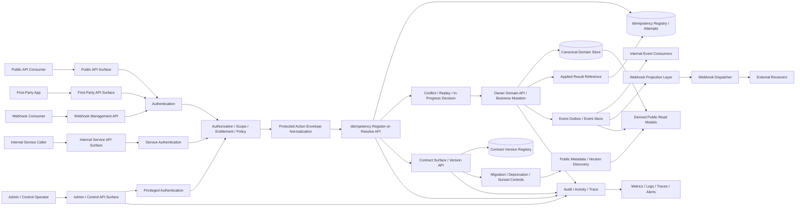
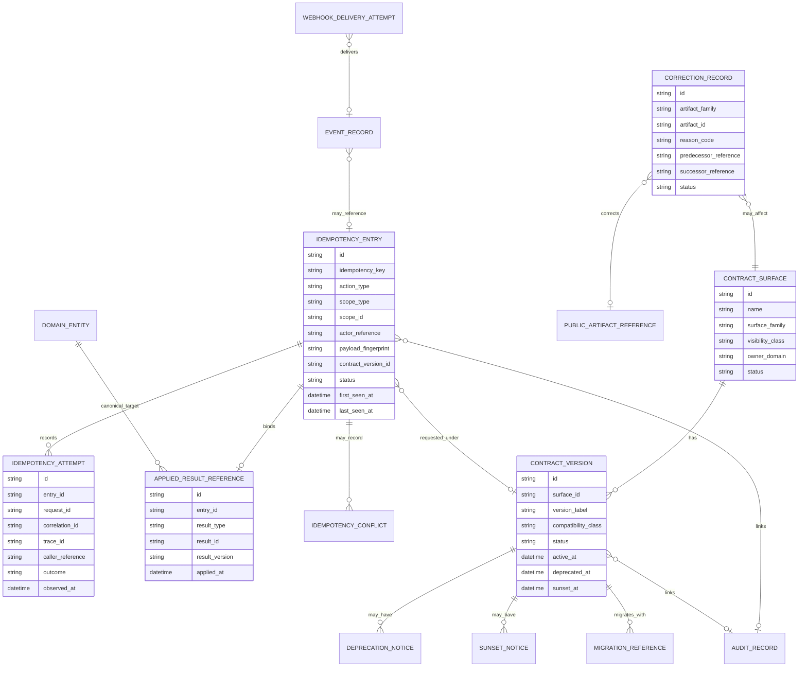
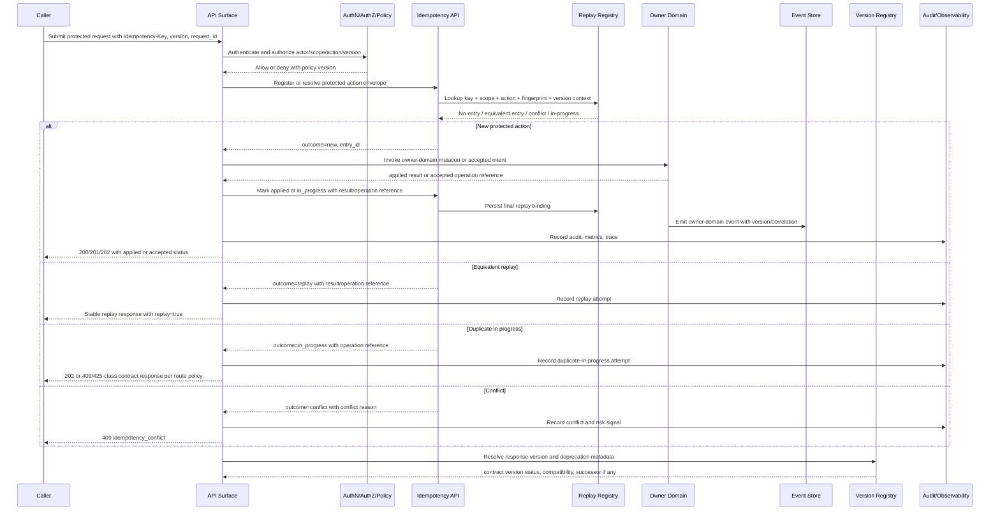

# FUZE Idempotency and Versioning API Specification

## Document Metadata

- **Document Name:** `IDEMPOTENCY_AND_VERSIONING_SPEC.md`
- **Document Type:** FUZE API SPEC v2 production-grade interface-contract specification
- **Status:** Draft for production-grade API source-of-truth review
- **Version:** 2.0.0-api-v2
- **Effective Date:** 2026-04-24
- **Last Updated:** 2026-04-24
- **Reviewed On:** 2026-04-24
- **Document Owner:** FUZE Platform Idempotency and Contract Governance Domain; named individual owner not yet specified
- **Approval Authority:** FUZE platform architecture and specification governance approval workflow; named approver not yet specified
- **Review Cadence:** Review whenever public/internal contract posture, replay-safety requirements, workflow/queue retry behavior, event/webhook delivery behavior, migration policy, public trust artifact posture, or operator override policy materially changes; otherwise quarterly
- **Governing Layer:** API SPEC v2 / shared replay-safety and contract-evolution API contract layer
- **Parent Registry:** `API_SPEC_INDEX.md` for API-family history and `REFINED_SYSTEM_SPEC_INDEX.md` for active semantic routing
- **Upstream Semantic Registry:** `REFINED_SYSTEM_SPEC_INDEX.md`
- **Upstream API Registry:** `API_SPEC_INDEX.md`
- **Primary Audience:** Platform architecture, backend engineering, API authors, event and webhook authors, workflow/runtime engineering, queue/worker engineering, AI platform engineering, security, audit, operations, finance/ledger engineering, support/control-plane engineering, OpenAPI/AsyncAPI/SDK authors, implementation-contract authors
- **Primary Purpose:** Define the FUZE API contract model for idempotent mutation handling, replay interpretation, conflict detection, contract version governance, compatibility signaling, correction lineage, deprecation posture, and downstream implementation guardrails across public APIs, internal service APIs, admin/control APIs, async jobs, events, webhooks, public registries, reports, and chain-adjacent/public-trust artifacts
- **Primary Upstream References:** `REFINED_SYSTEM_SPEC_INDEX.md`; `IDEMPOTENCY_AND_VERSIONING_SPEC.md`; `API_ARCHITECTURE_SPEC.md`; `PUBLIC_API_SPEC.md`; `INTERNAL_SERVICE_API_SPEC.md`; `EVENT_MODEL_AND_WEBHOOK_SPEC.md`; `MIGRATION_AND_BACKWARD_COMPATIBILITY_SPEC.md`; `AUDIT_LOG_AND_ACTIVITY_SPEC.md`; `SECURITY_AND_RISK_CONTROL_SPEC.md`; `MONITORING_ALERTING_AND_INCIDENT_RESPONSE_SPEC.md`; `FUZE_ACCOUNT_ACCESS_AND_SESSION_THESIS_FINAL_SPEC.md`; `FUZE_ACCOUNT_ACCESS_AND_SESSION_CANONICAL_FINAL_SPEC.md`; `FUZE_WORKSPACE_ACCESS_CONTROL_BASICS_THESIS_FINAL_SPEC.md`
- **Primary Downstream Dependents:** domain API specifications; public API route contracts; internal service API contracts; event catalogs; webhook catalogs; workflow and worker contracts; ledger/billing/payout/registry/trust-artifact API contracts; OpenAPI shared components; AsyncAPI envelope conventions; SDK retry and migration behavior; audit/support tooling; implementation-contract specs
- **API Surface Families Covered:** public API; first-party application API; internal service API; admin/control-plane API; event API; webhook API; async/job API; reporting/public-trust artifact API; chain-adjacent API where replay/version posture applies
- **API Surface Families Excluded:** raw database schema; raw broker implementation; raw provider transport; smart-contract nonce logic except as chain-adjacent input; frontend presentation-only retry messages; UI-only deprecation banners; legal/accounting interpretation outside source-domain specifications
- **Canonical System Owner(s):** FUZE Platform Idempotency and Contract Governance Domain; domain owners for protected business-action equivalence; publishing domains for correction lineage of trust-sensitive artifacts
- **Canonical API Owner:** FUZE Platform API Governance and Reliability Architecture / Idempotency and Contract Governance API Owner
- **Supersedes:** Earlier API v1 interpretations of `IDEMPOTENCY_AND_VERSIONING_SPEC.md` that treated idempotency as mostly endpoint/header convention, allowed deduplication to stand in for business replay safety, blurred correction lineage with version evolution, or under-specified accepted-state, conflict, audit, and migration behavior
- **Superseded By:** Not yet known
- **Related Decision Records:** Not yet linked in retrieved governing materials
- **Canonical Status Note:** This API spec derives interface-contract obligations from the active refined system semantics. Refined system specs own semantic truth; this document owns API contract expression, route-family posture, envelope expectations, status/error behavior, idempotency/version fields, and downstream OpenAPI/AsyncAPI/SDK guardrails.
- **Implementation Status:** Not yet implemented as a complete machine-readable contract; intended to govern downstream route, schema, SDK, event, webhook, audit, support, and implementation-contract work
- **Approval Status:** Draft pending formal approval workflow
- **Change Summary:** Upgraded idempotency and versioning from refined system semantics and earlier API material into an API SPEC v2 interface-contract document with explicit surface families, boundaries, request/response/error/status rules, idempotency/retry/replay rules, versioning and migration guardrails, diagrams, flow views, acceptance criteria, and concrete test cases

## Purpose

This document defines the production-grade API contract for FUZE idempotency and versioning.

The purpose is to make replay safety and contract evolution deterministic at the interface layer without allowing the API layer to redefine system semantics. The API layer MUST express the refined semantic rule that a protected business action may be observed multiple times but MUST be applied at most once in business meaning. The API layer MUST also express the refined semantic rule that externally or cross-domain consumed contract surfaces evolve deliberately, with durable version identity, compatibility posture, and historical interpretability.

This specification governs the interface contract that downstream public, first-party, internal, admin/control, event, webhook, async, reporting, public-trust, and chain-adjacent APIs must preserve when they expose or consume replay-sensitive mutations or versioned contracts.

## Scope

This API specification governs:

- API-level idempotency contract requirements for protected business mutations.
- API-level replay, duplicate, in-flight, conflict, rejection, expiration, and applied-result semantics.
- API-level version registry and compatibility posture for public APIs, internal multi-consumer APIs, events, webhooks, public registries, reports, ledger artifacts, and async result contracts.
- Shared request headers, metadata fields, resource families, operation references, status classes, error classes, audit references, and observability fields.
- Allowed route/resource families for idempotency validation, register-or-resolve, finalization, conflict inspection, contract-surface registration, version registration, deprecation/sunset, metadata exposure, and correction lineage.
- How public, first-party, internal, admin/control, event, webhook, reporting, and chain-adjacent surfaces consume the shared replay/version model without becoming semantic owners.
- OpenAPI, AsyncAPI, SDK, implementation-contract, audit, and migration guardrails.

## Out of Scope

This document does not govern:

- Domain-specific business validity for credits issuance, subscription transition, refund approval, payout execution, governance approval, treasury execution, AI execution, report generation, registry publication, or wallet linkage.
- Exact database schema, index definitions, broker vendor, queue implementation, cache implementation, or retention periods unless explicitly required as API contract support.
- Raw provider callback semantics before provider-input normalization.
- Exact smart-contract nonce, signer, multisig, timelock, or chain transaction implementation.
- UI copy for retry banners, duplicate warnings, deprecation banners, or migration prompts.
- Full OpenAPI or AsyncAPI machine-readable artifacts; this document governs what those artifacts MUST preserve.

## Design Goals

1. Preserve owner-domain semantic truth while standardizing API-level replay and version contracts.
2. Prevent duplicate business mutation under retries, duplicate submissions, event redelivery, worker restarts, provider redelivery, and operator retry.
3. Distinguish valid replay from idempotency conflict, in-flight duplicate, expired replay scope, and independently invalid request.
4. Preserve accepted-state versus final-success semantics for asynchronous and long-running work.
5. Make public and multi-consumer contract evolution explicit, compatible, observable, and historically interpretable.
6. Keep correction lineage distinct from contract version evolution.
7. Make audit, support, monitoring, migration, rollback, and SDK behavior deterministic.
8. Reduce route drift, schema drift, error drift, replay drift, version drift, migration drift, and public-trust artifact drift.

## Non-Goals

- This spec does not make every read require idempotency.
- This spec does not imply that any repeated payload is a valid replay.
- This spec does not let transport-level deduplication, queue retry, gateway retries, or provider event IDs decide business equivalence without owner-domain validation.
- This spec does not freeze every API forever.
- This spec does not permit silent breaking changes merely because a surface is internal.
- This spec does not allow a correction record to disguise a breaking contract version change.

## Core Principles

1. **Refined-system ownership:** refined system specs own semantic truth; this API spec owns interface contract expression.
2. **Owner-domain equivalence:** only the action-owning domain may define what makes two attempts the same protected business action.
3. **Business replay over transport replay:** API keys, request IDs, event IDs, provider references, and job IDs are anchors; they are not by themselves full semantic proof.
4. **At-most-once business effect:** protected business actions MUST be applied at most once in business meaning within the valid replay scope.
5. **Explicit conflict:** materially different reuse of the same replay identity MUST become a conflict, not an inferred replay.
6. **Accepted is not applied:** accepted async intent, in-progress processing, and final applied result MUST be distinct.
7. **Versioning is contract governance:** contract version, compatibility class, deprecation, sunset, and successor references are interface obligations.
8. **Correction is not version:** repair or supersession of a published artifact MUST remain distinct from schema/contract version evolution.
9. **Public and trust-sensitive surfaces are stricter:** public, financial, payout, governance, registry, transparency, and chain-adjacent surfaces require narrower compatibility, audit, and lineage posture.
10. **Implementation convenience does not override safety:** frontend, gateway, SDK, worker, queue, provider, cache, or operator convenience MUST NOT weaken domain ownership, replay safety, auditability, or compatibility.

## Canonical Definitions

- **Protected Business Action:** A mutation or accepted-state initiation whose duplicate application would be unsafe, confusing, financially harmful, trust-damaging, or operationally misleading.
- **Idempotency Key:** A caller- or system-provided opaque replay identity used by API contracts to help bind attempts to a protected action envelope.
- **Protected Action Envelope:** The normalized contract-level tuple used for replay evaluation, including action type, scope, actor/caller class where required, material payload fingerprint, target result reference where relevant, and contract version context where material.
- **Replay:** A later equivalent attempt that maps to the same protected action envelope and returns a stable replay response without duplicate business application.
- **Idempotency Conflict:** A later attempt that reuses a replay identity or protected action anchor for a materially different action, scope, payload, result target, or contract-version meaning.
- **Duplicate In Progress:** A later equivalent attempt observed while the first attempt is still received or in progress.
- **Applied Result Reference:** The canonical owner-domain result pointer bound when the protected action has been applied exactly once.
- **Contract Surface:** A version-governed interface family consumed externally or across domains.
- **Contract Version:** A durable identifier for a contract shape or interpretation boundary.
- **Compatibility Class:** A classification of consumer impact: additive-compatible, behaviorally-compatible-with-notice, breaking-with-migration, or historical-correction-only.
- **Correction Lineage:** A record that repairs, supersedes, annotates, or withdraws a previously published artifact while preserving historical interpretability.
- **Replay Window:** The duration or policy interval during which replay authority remains active for a protected action envelope.

## Truth Class Taxonomy

| Truth Class | API Contract Meaning | Canonical Owner |
| --- | --- | --- |
| Semantic truth | Whether two attempts are the same protected business action | Owner domain |
| API contract truth | Required headers, fields, status classes, error classes, resource families, response forms | This API spec and downstream API contracts |
| Policy truth | Which surfaces require idempotency, compatibility, deprecation, sunset, and approval posture | Platform policy/security/governance domains plus this shared layer |
| Runtime truth | Received, in-progress, replayed, conflicted, rejected, expired, retryable, terminal states | Runtime/service implementation under this contract |
| Storage truth | Durable replay registry, attempt record, version registry, correction record | Platform idempotency/versioning implementation layer |
| Provider-input truth | Raw provider callback IDs, payment refs, chain observation IDs before normalization | Integration/provider-adapter domains |
| Event/async truth | Event IDs, event versions, consumer checkpoints, webhook delivery attempts, job submission refs | Event/webhook/workflow/worker domains |
| Projection/reporting truth | Dashboards, reports, public metadata, exports, support views | Reporting/public-read domains |
| Public read-model truth | Public metadata and trust artifact views derived from canonical records | Publishing/public-read domains |
| Presentation truth | UI copy, labels, warning text, SDK helper wording | Frontend/SDK layers; never semantic owner |

These truth classes MUST NOT be collapsed. The idempotency registry is not business truth; the contract-version registry is not domain behavior; a public metadata endpoint is not migration authority by itself.

## Architectural Position in the Spec Hierarchy

This API spec sits below the active refined system registry and the refined `IDEMPOTENCY_AND_VERSIONING_SPEC.md`. It is adjacent to `PUBLIC_API_SPEC.md`, `INTERNAL_SERVICE_API_SPEC.md`, `EVENT_MODEL_AND_WEBHOOK_SPEC.md`, and `MIGRATION_AND_BACKWARD_COMPATIBILITY_SPEC.md` in the API backbone family.

It sits above downstream:

- domain-specific API specs that expose replay-sensitive mutations;
- OpenAPI shared components for idempotency, version, error, and correlation headers;
- AsyncAPI event envelope and webhook delivery conventions;
- SDK retry and replay behavior;
- internal service implementation contracts;
- support/admin tools for replay and version lineage;
- migration plans that change contract surfaces.

## Upstream Semantic Owners

The upstream semantic owners include:

- `IDEMPOTENCY_AND_VERSIONING_SPEC.md` for replay-safety semantics, idempotency/conflict distinctions, contract-version discipline, and correction-lineage distinction.
- `API_ARCHITECTURE_SPEC.md` for API surface family boundaries, accepted-state semantics, request/response/error posture, and derived-read discipline.
- `PUBLIC_API_SPEC.md` for public external contract posture, compatibility commitments, and public-safe exposure limits.
- `INTERNAL_SERVICE_API_SPEC.md` for service-to-service replay safety, service identity, and internal multi-consumer compatibility.
- `EVENT_MODEL_AND_WEBHOOK_SPEC.md` for event identity, event version, replay/redelivery, webhook projection, and at-least-once delivery posture.
- `MIGRATION_AND_BACKWARD_COMPATIBILITY_SPEC.md` for coexistence, cutover, compatibility windows, deprecation, sunset, rollback, supersession, and historical interpretability.
- Domain owner specs for the business meaning of protected actions.
- Security, audit, monitoring, account/session, workspace/access-control, and entitlement specs for auth, permission, policy, audit, observability, and capability gates.

## API Surface Families

### Covered Surfaces

- **Public API:** External retriable mutations, public metadata, public version/deprecation discovery, and public-safe problem metadata.
- **First-party Application API:** FUZE client and product-app mutations that need retry-safe behavior and version awareness.
- **Internal Service API:** Service-to-service register-or-resolve, mark-applied, mark-rejected, version registry, migration, and contract-surface interactions.
- **Admin / Control-Plane API:** Privileged inspection, conflict remediation, forced expiration/quarantine, correction issuance, deprecation/sunset, and migration controls.
- **Event API:** Internal events emitted for replay, conflict, version, deprecation, correction, and migration transitions.
- **Webhook API:** Webhook envelope versioning, redelivery semantics, idempotent webhook management, delivery metadata, and public-safe projection evolution.
- **Async / Job API:** Accepted-state job/workflow submissions, duplicate job resolution, retry-safe finalization, and versioned result contracts.
- **Reporting / Public-Trust API:** Trust artifact version metadata, correction lineage, public registry/report references, and historical-readability rules.
- **Chain-Adjacent API:** Off-chain replay and version posture for chain-observation normalization, payout publication, registry publication, and chain-reference artifact evolution.

### Excluded Surfaces

- UI-only local retry indicators.
- Raw database mutation APIs not exposed as approved service contracts.
- Raw provider callback endpoints before normalization.
- Low-level smart-contract ABI or nonce systems except as referenced inputs.
- Non-contractual analytics dashboards.

## System / API Boundaries

The idempotency and versioning API layer is a cross-cutting interface layer. It MUST NOT become the owner of any domain’s business truth. Its boundary is to provide a durable replay/version contract that owner domains consume.

- Owner domains own protected-action meaning and final result references.
- The shared idempotency API owns replay-entry lifecycle contracts and conflict classification conventions.
- The shared contract-version API owns surface/version lifecycle contracts and compatibility classifications.
- Migration APIs own cutover execution posture only through `MIGRATION_AND_BACKWARD_COMPATIBILITY_SPEC.md`.
- Public metadata APIs expose derived version/deprecation/correction information but do not own the migration plan or domain truth.

## Adjacent API Boundaries

- `PUBLIC_API_SPEC.md` governs external route safety and public contract curation; this spec supplies idempotency/version obligations used by those routes.
- `INTERNAL_SERVICE_API_SPEC.md` governs service collaboration; this spec supplies shared internal replay/version resources and required contract fields.
- `EVENT_MODEL_AND_WEBHOOK_SPEC.md` governs event/webhook semantics; this spec supplies replay/version classification and consumer-facing version requirements.
- `MIGRATION_AND_BACKWARD_COMPATIBILITY_SPEC.md` governs migration execution; this spec supplies version-surface classification and replay-safe behavior during coexistence.
- Domain API specs own domain-specific route families and business invariants; they MUST consume this spec for replay/version posture.
- Implementation-contract specs may define schemas, indexes, locks, TTLs, message topics, or SDK code, but MUST preserve this API contract.

## Conflict Resolution Rules

1. `REFINED_SYSTEM_SPEC_INDEX.md` wins on active refined-library membership and precedence.
2. Refined domain specs win on semantic truth, business meaning, owner-domain mutation authority, and lifecycle meaning.
3. `API_ARCHITECTURE_SPEC.md` wins on broad surface-family posture unless a narrower public/internal/event/migration spec governs the exact surface.
4. This API spec wins on API-level idempotency, replay, conflict, contract-version, compatibility-class, and correction-lineage contract expression.
5. `MIGRATION_AND_BACKWARD_COMPATIBILITY_SPEC.md` wins on migration execution, coexistence, cutover, rollback, and supersession posture.
6. Public trust and reporting specs win on artifact publication semantics while preserving this spec’s version/correction distinctions.
7. Transport, gateway, SDK, queue, cache, dashboard, and provider convenience never win over owner-domain truth or replay/version governance.
8. If ambiguity remains, choose the more conservative architecture-consistent interpretation that prevents duplicate business mutation and preserves historical interpretability.

## Default Decision Rules

- Protected write endpoints default to requiring idempotency unless the owning domain explicitly classifies them as safe without it.
- Reuse of the same idempotency key with materially different action, scope, payload, actor/caller class, result target, or material version context defaults to `idempotency_conflict`.
- Equivalent duplicate while first attempt is still processing defaults to `duplicate_processing_in_progress` or an accepted-state replay response, not a second mutation.
- Public and multi-consumer surfaces default to explicit versioning, deprecation metadata, and migration posture.
- Internal does not mean unversioned or unreplayable when the surface has multiple consumers, economic sensitivity, control sensitivity, or long-lived compatibility needs.
- Correction lineage defaults to explicit linked records rather than destructive replacement.
- Expiration of replay authority does not delete audit history.
- Derived/public/reporting APIs default to read-only and non-canonical posture.
- Provider or chain references default to normalized-input anchors until owner-domain validation succeeds.

## Roles / Actors / API Consumers

- **Public API consumer:** external or partner client that submits retriable mutations or reads version metadata.
- **First-party app client:** FUZE-owned frontend/app using retry-safe mutations and versioned response contracts.
- **Internal service caller:** service principal invoking owner-domain or shared replay/version APIs.
- **Owner-domain service:** domain service authorized to register protected actions, apply or reject results, and define material equivalence.
- **Workflow / worker / orchestration service:** initiates or resumes accepted async work and MUST preserve replay-safe action identity.
- **Event publisher / consumer:** emits or consumes versioned events and deduplicates by event identity and version-aware checkpoints.
- **Webhook dispatcher / external receiver:** dispatches or receives at-least-once versioned webhook deliveries.
- **Admin / support operator:** inspects, remediates, expires, deprecates, or corrects under privileged and audited controls.
- **Migration operator:** executes version coexistence, cutover, rollback, deprecation, sunset, and successor rules under migration governance.
- **SDK / OpenAPI / AsyncAPI generator:** derives client/server contracts while preserving replay and version semantics.

## Resource / Entity Families

### API-Facing Resources

- `IdempotencyEntry`
- `IdempotencyAttempt`
- `IdempotencyResolution`
- `ProtectedActionEnvelope`
- `AppliedResultReference`
- `IdempotencyConflict`
- `ReplayWindow`
- `ContractSurface`
- `ContractVersion`
- `CompatibilityPolicy`
- `DeprecationNotice`
- `SunsetNotice`
- `CorrectionRecord`
- `MigrationReference`
- `OperationReference`

### Canonical Support Entities

- domain-owned business entities;
- event records and consumer checkpoints;
- webhook projections and delivery attempts;
- audit/activity records;
- public registry/report artifacts;
- migration/coexistence records;
- policy versions and authorization decisions.

## Ownership Model

### Shared Idempotency/Versioning API Owns

- replay-entry API contract shape;
- protected-action envelope contract requirements;
- replay/conflict/status/error classifications;
- contract-surface/version API contract shape;
- compatibility-class taxonomy at API level;
- correction-lineage API contract requirements;
- shared OpenAPI/AsyncAPI/SDK idempotency/version components;
- audit/correlation/trace fields required for replay and version decisions.

### Owner Domains Own

- protected business-action meaning;
- material-equivalence rules;
- scope rules;
- whether replay returns original response, current canonical representation, or duplicate acknowledgment;
- applied result reference;
- domain-specific replay window and retention policy within platform constraints.

### Publishing Domains Own

- artifact publication truth;
- correction/supersession reason and lineage;
- public visibility posture;
- source-domain references that support public interpretation.

### Downstream Layers MUST NOT

- redefine business equivalence;
- use idempotency entries as business objects;
- use contract-version records as domain behavior truth;
- silently remap compatibility classes;
- mutate owner-domain truth through derived read models, event consumers, SDK retry helpers, or admin shortcuts.

## Authority / Decision Model

- The platform API governance owner defines API-level envelope, error, status, version, and compatibility requirements.
- The action-owning domain decides if an attempt is equivalent, conflicting, invalid, or a new protected action.
- The public API owner decides external exposure and compatibility posture within refined constraints.
- The internal service API owner decides service-to-service contract posture within owner-domain constraints.
- The event/webhook owner decides event/webhook envelope and delivery semantics within this replay/version posture.
- Migration governance decides coexistence, cutover, and deprecation execution.
- Security/access-control owners decide auth, scope, permission, entitlement, policy, and control-plane eligibility.

No actor may use a replay identity, version label, SDK helper, or operator tool to override owner-domain semantic authority.

## Authentication Model

All mutation-capable idempotency/version APIs MUST authenticate the caller unless a public metadata read is explicitly anonymous-safe.

- Public mutation calls authenticate as account, workspace, partner, or scoped API principal.
- First-party app calls authenticate as a user/session/account/workspace context.
- Internal calls authenticate as service principals with environment identity.
- Admin/control calls authenticate as named operator or accountable automation identity.
- Webhook management calls authenticate to the owning account/workspace/partner scope.
- Public metadata/version reads MAY be anonymous only if they expose no privileged or sensitive details.

Authentication proves caller identity only. It does not establish action authority, replay equivalence, or version activation authority.

## Authorization / Scope / Permission Model

Every protected action MUST be authorized before owner-domain side effects occur. Replay handling MUST NOT allow a caller to retrieve or confirm a prior result outside its allowed scope.

Required checks include:

1. caller may access the declared scope;
2. caller may perform the business action type;
3. caller may use or inspect the target resource/result reference;
4. caller may invoke the relevant surface family;
5. caller may use the requested contract version, if version selection is explicit;
6. internal service principal may call the target owner-domain operation;
7. admin/operator may inspect, expire, correct, deprecate, sunset, or remediate under policy.

A different actor, service, or broader scope reusing an idempotency key MUST NOT be treated as valid replay by default.

## Entitlement / Capability-Gating Model

Entitlement and capability gates determine whether a caller may initiate an action. They do not define replay semantics.

- If the original action was accepted while entitlement was valid, a later equivalent replay MAY return the prior allowed result if policy permits visibility.
- If entitlement is revoked before a duplicate arrives, the system MUST NOT create a new action, but it MAY deny result retrieval depending on domain policy.
- If a caller lacks entitlement for a new protected action, the request MUST be rejected without creating applied business effect.
- Version access may be gated for private beta, partner, or staged migration surfaces, but the version registry remains canonical for surface lifecycle posture.

## API State Model

### Idempotency Entry States

- `received`: replay envelope created, no business outcome established.
- `in_progress`: owner-domain or execution system is processing.
- `applied`: protected action produced one canonical business result.
- `replayed`: later equivalent attempt resolved to prior received/in-progress/applied state.
- `conflicted`: later attempt reused replay identity for materially different action.
- `rejected`: invalid or unauthorized request failed without applied effect.
- `expired`: replay authority ended; audit history remains.
- `quarantined`: privileged containment state for suspected abuse, ambiguity, incident, or migration risk.

### Contract Version States

- `draft`
- `active`
- `deprecated`
- `sunsetting`
- `retired`
- `superseded`
- `withdrawn`

### Correction States

- `issued`
- `linked`
- `effective`
- `superseded`
- `withdrawn`
- `historically_preserved`

### Operation States

- `accepted`
- `pending`
- `running`
- `applied`
- `previously_applied`
- `failed_retryable`
- `failed_terminal`
- `conflicted`
- `canceled`
- `compensated`

## Lifecycle / Workflow Model

1. Caller submits protected action through a recognized API surface.
2. API gateway/edge validates transport shape and captures request/correlation identifiers.
3. Authentication establishes caller identity.
4. Authorization, scope, entitlement, policy, and contract-version checks run before owner-domain side effects.
5. The protected action envelope is normalized.
6. Shared idempotency logic performs register-or-resolve.
7. If the attempt is new, owner-domain validation and mutation/accepted-state creation proceed.
8. If the attempt is a replay, the endpoint returns its documented stable replay response.
9. If the attempt is in progress, the endpoint returns duplicate-in-progress or accepted-state semantics.
10. If the attempt is conflicting, the endpoint returns `idempotency_conflict` with no new mutation.
11. Owner domain binds applied result reference or rejection reason.
12. Events, audit records, metrics, and read-model projections are emitted downstream.
13. Contract version metadata and deprecation/sunset/correction details are exposed where relevant.
14. Migration, deprecation, sunset, rollback, correction, or operator remediation preserves lineage.

## Architecture Diagram — Mermaid flowchart

## Data Design — Mermaid Diagram

## Flow View

### Synchronous New Mutation

1. Caller sends a mutation with `Idempotency-Key`, version context, request ID, and correlation ID.
2. API authenticates and authorizes the caller.
3. API normalizes the protected action envelope.
4. Register-or-resolve returns `new`.
5. Owner domain validates and applies the mutation.
6. Owner domain binds `AppliedResultReference`.
7. API returns `201 Created` or `200 OK` with `idempotency.outcome = applied` and contract version metadata.
8. Audit, event, metrics, and projection updates are emitted.

### Equivalent Replay

1. Caller retries with same key and materially equivalent envelope.
2. Register-or-resolve returns `replay`.
3. API returns the endpoint’s documented stable replay response: original representation, current canonical representation with replay marker, or duplicate acknowledgment with result reference.
4. No new owner-domain mutation occurs.
5. Attempt history and replay metrics are recorded.

### Duplicate In Progress

1. Caller retries while first attempt remains `received` or `in_progress`.
2. API returns accepted-state / in-progress response with operation reference, retry guidance, and correlation metadata.
3. No second mutation starts unless owner-domain contract explicitly allows parallel new-run intent.

### Conflict

1. Caller reuses replay identity with materially different envelope.
2. Register-or-resolve returns `conflict`.
3. API returns `409 Conflict` with `idempotency_conflict` details.
4. No new domain mutation occurs.
5. Conflict is audited and may emit internal risk/ops event.

### Async Accepted-State

1. Caller submits a protected async action.
2. API creates/reuses idempotency entry and returns `202 Accepted` with operation/job reference.
3. Worker processes through owner-domain contracts.
4. Final outcome binds result reference or failure status.
5. Replays before finalization return the same operation reference; replays after finalization return endpoint-defined replay response.

### Version Deprecation / Sunset

1. Governance tool registers or updates contract version status.
2. Version API records compatibility class, successor, timeline, and reason.
3. Public/internal metadata and SDK derivation layers expose deprecation or sunset posture.
4. Requests against deprecated versions receive warnings until sunset.
5. Requests after sunset receive `version_not_supported` or `sunset_elapsed` unless a migration exception exists.

### Correction Lineage

1. Publishing domain identifies a public artifact correction.
2. Admin/control API issues reason-coded correction record.
3. Historical artifact remains interpretable.
4. Public metadata/read models expose current interpretation plus lineage links.
5. Correction does not silently change schema version unless a separate version event occurs.

## Data Flows — Mermaid sequenceDiagram

## Request Model

### Required Shared Headers / Metadata

Mutation-capable protected endpoints MUST support or explicitly map:

- `Idempotency-Key` for caller-supplied public/first-party/partner retries where applicable.
- `X-Request-Id` for per-attempt request lineage.
- `X-Correlation-Id` for cross-domain traceability.
- `traceparent` or equivalent distributed tracing context where supported.
- API version route segment or version header for version-governed surfaces.
- Actor and scope references through authenticated context or explicit service metadata.

### Protected Action Envelope Fields

At contract level, protected mutations MUST be capable of binding:

- `business_action_type`
- `scope_type`
- `scope_id`
- `caller_reference` or `actor_reference` where material
- `source_surface_family`
- `idempotency_key` or approved replay anchor
- `payload_fingerprint` or materially significant normalized fields
- `target_reference` or expected result binding where applicable
- `contract_surface_id` / `contract_version`
- `policy_version` where authorization or compatibility policy matters
- `operation_reference` for accepted async actions

### Public Request Rules

- Public callers MUST NOT be required to understand internal entry IDs before submitting protected mutations.
- Public idempotency keys MUST be opaque and scoped.
- Public version selection MUST be explicit or discoverable.
- Public requests MUST NOT include raw internal policy or domain implementation fields.

### Internal Request Rules

- Internal requests MUST include service identity and correlation context.
- Internal replay registration MUST include enough normalized business action data to prevent false equivalence.
- Internal service callers MUST NOT use idempotency keys as authorization credentials.

### Admin / Control Request Rules

Admin and control-plane correction, expiration, quarantine, deprecation, or sunset requests MUST include:

- operator/service identity;
- reason code;
- affected scope/surface/artifact;
- approval/reference where required;
- expected current status for concurrency control;
- idempotency key for mutation-capable operations.

## Response Model

### Required Response Classes

Protected endpoint responses MUST distinguish:

- `applied`: new business effect applied.
- `accepted`: work durably accepted but not final.
- `previously_applied`: equivalent replay of already applied action.
- `duplicate_in_progress`: equivalent replay while prior attempt is unresolved.
- `conflicted`: materially different reuse of replay identity.
- `rejected`: invalid, unauthorized, forbidden, or policy-denied without applied effect.
- `expired`: replay key no longer valid for replay authority.
- `version_deprecated`: usable with notice.
- `version_not_supported`: rejected because version is unsupported or sunset.

### Replay Response Patterns

Each route family MUST document one stable replay response posture:

1. **Original representation:** return the originally successful response payload or equivalent immutable response reference.
2. **Current canonical representation:** return current owner-domain representation with `replay = true` and result reference.
3. **Duplicate acknowledgment:** return a compact envelope with `previously_applied`, result reference, and retrieval link.
4. **Accepted duplicate:** return the original operation reference when final result is not yet available.

Route families MUST NOT switch replay response pattern unpredictably.

### Version Metadata

Where material, responses MUST expose:

- contract version;
- deprecation state;
- sunset date or successor link if applicable;
- compatibility class where useful for automation;
- correction/supersession reference for trust artifacts;
- request/correlation IDs;
- idempotency outcome.

## Error / Result / Status Model

### Error Categories

- `invalid_request`
- `unauthorized`
- `forbidden`
- `not_found`
- `idempotency_key_missing`
- `idempotency_key_invalid`
- `idempotency_scope_mismatch`
- `idempotency_conflict`
- `duplicate_processing_in_progress`
- `replay_window_expired`
- `version_required`
- `version_not_supported`
- `version_deprecated`
- `surface_deprecated`
- `sunset_elapsed`
- `compatibility_policy_violation`
- `correction_not_allowed`
- `migration_required`
- `rate_limited`
- `abuse_suspected`
- `dependency_failure`
- `internal_error`

### Error Envelope Fields

Errors SHOULD follow a problem-details-compatible structure and MUST include:

- `type`
- `title`
- `status`
- `code`
- `detail`
- `request_id`
- `correlation_id`
- `retryable`

Where relevant, include:

- `idempotency_key`
- `idempotency_entry_id` for privileged/internal contexts only
- `conflict_reason`
- `existing_result_reference`
- `operation_reference`
- `contract_version`
- `replacement_version`
- `deprecation_notice`
- `sunset_at`
- `migration_reference`

### HTTP Status Posture

- `200 OK`: successful read, replay returning existing result, or idempotent operation returning current representation.
- `201 Created`: new synchronous protected result created.
- `202 Accepted`: accepted async intent or duplicate accepted work in progress.
- `400 Bad Request`: malformed request or invalid idempotency key structure.
- `401 Unauthorized`: missing/invalid authentication.
- `403 Forbidden`: authenticated but unauthorized.
- `404 Not Found`: no accessible resource or hidden privileged resource.
- `409 Conflict`: idempotency conflict or business state conflict.
- `410 Gone`: retired/sunset version or artifact no longer accessible for new use, where appropriate.
- `422 Unprocessable Entity`: valid shape but semantically invalid request.
- `425 Too Early` or documented equivalent: duplicate processing still in progress where client should retry later.
- `429 Too Many Requests`: rate limit/abuse control.
- `500/502/503/504`: infrastructure or dependency failures with retryability metadata.

## Idempotency / Retry / Replay Model

### Required Protection

Strong idempotency protection is mandatory for:

- economic writes such as credits issuance, reversal, refund-linked adjustment, subscription transition, invoicing mutation, payment-linked flow, and support compensation;
- payout, treasury, governance, vault, registry, and transparency publication actions;
- workflow/job submissions that may duplicate cost, artifacts, billing, notifications, or public state;
- external/public write APIs subject to client retries;
- internal service calls with retry-capable infrastructure and non-idempotent side effects;
- admin/control corrections, overrides, deprecations, and remediation actions.

### Replay Identity Sources

Allowed replay anchors include:

- caller-supplied `Idempotency-Key`;
- provider transaction/reference after normalization;
- owner-domain mutation request ID;
- workflow operation reference;
- job submission reference;
- event ID plus event version and consumer scope;
- webhook event/delivery identity for dispatch attempts;
- payout cycle or registry publication action reference;
- governance action/proposal/reference ID.

Replay anchors MUST be scoped and normalized. Scope-free replay identity is non-canonical for production-grade mutation safety.

### Equivalence Rules

Two attempts MAY be equivalent only when the owner-domain protected action envelope matches on all material dimensions:

- business action type;
- scope;
- actor/caller class where material;
- resource target/result target;
- economically or security-significant payload fields;
- provider/chain reference where used;
- contract version context where materially different;
- policy version where policy materially changes meaning.

### Retry Rules

- Clients MAY retry retryable failures using the same idempotency key only for the same intended action.
- SDKs MUST preserve idempotency keys across automatic retries.
- SDKs MUST NOT auto-generate a new key for retry of the same protected action.
- SDKs MUST generate or require a new key when the caller intentionally starts a new action or new run.
- Internal services MUST carry replay anchors through workflow/worker retries.

## Rate Limit / Abuse-Control Model

- Idempotency validation endpoints MUST be rate limited to prevent key-probing.
- High-conflict rates SHOULD trigger risk signals and possible scoped throttling.
- Public key reuse across scopes SHOULD be treated as suspicious unless an explicit domain rule allows it.
- Version metadata endpoints MAY be publicly cacheable but MUST not leak private surface state.
- Admin/control version or correction operations MUST have stricter rate limits and approval checks.
- Webhook redelivery APIs MUST be bounded to prevent replay abuse.
- Abuse-control actions MUST be auditable and SHOULD preserve reason codes.

## Endpoint / Route Family Model

This spec defines route families, not final raw endpoint inventories. Downstream API contracts MUST instantiate these families consistently.

### Public / First-Party Idempotency Validation

`POST /v1/idempotency/validate`

Purpose: validate key structure and replay-safety posture before a protected action.

- Side effects: none or audit/rate-limit record only.
- Auth: required except explicitly public-safe use cases.
- Response: key validity, allowed use class, optional existing-known signal if policy permits.
- Forbidden: exposing cross-scope key existence to untrusted callers.

### Internal Register-or-Resolve

`POST /internal/idempotency/register-or-resolve`

Purpose: atomically create or resolve a protected action envelope.

- Auth: service identity required.
- Required outcome classes: `new`, `replay`, `in_progress`, `conflict`, `rejected`, `expired`.
- MUST be concurrency-safe.
- MUST write an attempt record for meaningful attempts.

### Internal Finalization

`POST /internal/idempotency/{entryId}/mark-applied`

Purpose: bind the canonical owner-domain result reference.

- Same result reference repeated is safe.
- Different result reference for applied entry is conflict unless a bounded correction/remediation path applies.

`POST /internal/idempotency/{entryId}/mark-rejected`

Purpose: record non-applied final failure without implying business mutation.

### Privileged Inspection / Remediation

`GET /internal/idempotency/entries/{entryId}`

`POST /admin/idempotency/entries/{entryId}/expire`

`POST /admin/idempotency/entries/{entryId}/quarantine`

`POST /admin/idempotency/entries/{entryId}/annotate`

All privileged routes MUST be scoped, reason-coded, policy-constrained, audited, and non-public.

### Contract Surface Registry

`POST /internal/contract-surfaces`

`GET /internal/contract-surfaces/{surfaceId}`

`POST /internal/contract-surfaces/{surfaceId}/versions`

`POST /internal/contract-versions/{versionId}/activate`

`POST /internal/contract-versions/{versionId}/deprecate`

`POST /internal/contract-versions/{versionId}/sunset`

`POST /internal/contract-versions/{versionId}/retire`

Version-changing operations MUST be reason-coded, approval-linked where required, audited, and idempotent.

### Public Metadata

`GET /v1/meta/version`

`GET /v1/meta/versions/{surfaceName}`

`GET /v1/meta/problems/{problemType}`

These routes expose stable public metadata without granting mutation authority or leaking internal-only versions.

### Correction Lineage

`POST /internal/public-artifacts/{artifactFamily}/{artifactId}/corrections`

`GET /v1/public-artifacts/{artifactFamily}/{artifactId}/lineage`

Correction mutation is admin/internal and reason-coded. Public lineage read is derived/public-safe where approved.

## Public API Considerations

Public APIs MUST default to narrower and more stable contracts than internal APIs.

- Public protected mutations MUST document idempotency key requirements, replay response pattern, conflict behavior, retryability, and version metadata.
- Public APIs MUST NOT expose internal idempotency entry IDs unless an approved support-safe abstraction is used.
- Public version metadata MUST expose only supported, deprecated, sunsetting, or retired public-safe versions.
- Public APIs MUST avoid ambiguous result wording that hides accepted-state versus final success.
- Public APIs MUST include migration/deprecation guidance where versions are deprecated or sunsetting.

## First-Party Application API Considerations

First-party app APIs MAY use richer internal metadata than public APIs, but MUST still preserve:

- explicit idempotency keys for retriable mutations;
- stable replay response behavior;
- accepted-state operation references;
- scope-safe result retrieval;
- version/deprecation metadata when relevant;
- no frontend-only reinterpretation of duplicate, conflict, or final success.

## Internal Service API Considerations

Internal service APIs MUST be as strict as public APIs for economic, governance, payout, registry, and control-sensitive mutations.

- Internal retry-capable calls MUST carry replay anchors.
- Internal services MUST not assume trusted network equals safe duplicate mutation.
- Service-to-service compatibility MUST be versioned for multi-consumer or long-lived contracts.
- Internal broad-write shortcuts that bypass owner domains are forbidden.
- Implementation contracts MUST define atomicity/locking expectations for register-or-resolve and mark-applied flows.

## Admin / Control-Plane API Considerations

Admin and control-plane APIs MUST be explicitly separate from ordinary application APIs.

- Expiration, quarantine, annotation, correction, deprecation, sunset, retirement, and withdrawal operations MUST be privileged.
- Operator actions MUST include reason code, actor identity, policy/approval reference where needed, and audit linkage.
- Admin tools MUST NOT mutate domain truth through idempotency registry manipulation.
- Remediation that changes business outcome MUST use domain-owned correction/remediation APIs.
- Admin replay or redelivery must preserve historical lineage.

## Event / Webhook / Async API Considerations

- Event envelopes MUST carry event identity and event version.
- Event consumers MUST deduplicate by event identity plus consumer scope and preserve original version interpretation during replay.
- Webhook redelivery MUST create delivery-attempt lineage, not new business events.
- Webhook payload versions MUST be explicit and public-compatible.
- Async submissions MUST distinguish same submitted job from intentionally new run.
- Accepted-state APIs SHOULD emit accepted events when downstream coordination is required, but the accepted event MUST NOT masquerade as final business success.

## Chain-Adjacent API Considerations

- Provider callbacks and chain observations are provider-input truth until normalized and owner-domain validated.
- Chain transaction IDs, block references, signatures, or contract events MAY serve as replay anchors only after normalization.
- Off-chain idempotency registry MUST NOT claim to be chain-native truth.
- Public registry, payout, and chain-reference artifact corrections MUST preserve historical interpretability.
- Chain-adjacent versioning MUST distinguish contract ABI/version, off-chain API version, report/export version, and public artifact correction lineage.

## Data Model / Storage Support Implications

Implementation layers MUST support:

- atomic register-or-resolve under concurrency;
- unique scoped replay identity constraints;
- durable attempt history;
- immutable material envelope fingerprint once accepted, except explicit annotation/correction fields;
- final result reference binding with conflict detection;
- contract-surface and contract-version registry records;
- deprecation/sunset/successor metadata;
- correction lineage records;
- audit and observability links;
- retention and privacy controls appropriate to data classification.

The database schema remains downstream implementation detail, but it MUST preserve these contract-level facts.

## Read Model / Projection / Reporting Rules

- Replay status views are derived from idempotency registry and audit records.
- Version metadata views are derived from contract-surface/version registry.
- Public metadata routes are derived/public-safe views, not canonical mutation owners.
- Reporting dashboards MUST NOT change replay outcomes or version lifecycle states.
- Cache layers MUST preserve deprecation/sunset correctness and MUST not keep stale active-version claims past policy tolerance.
- Public trust artifact lineage views MUST show correction/supersession without rewriting history.

## Security / Risk / Privacy Controls

- Idempotency keys are not secrets, but they can reveal behavior and MUST be protected from cross-scope probing.
- Request fingerprints MUST avoid storing raw sensitive payloads unless governed by data classification and retention policy.
- Public metadata MUST not disclose private/internal contract families.
- Admin/control routes MUST require privileged authorization and audit.
- High-conflict or cross-scope key reuse patterns SHOULD trigger abuse/risk signals.
- Replay and version records MUST be retained and redacted according to data classification, privacy, legal, and audit requirements.
- Webhook signing, secret rotation, endpoint verification, and delivery retry constraints are governed by event/webhook and security specs and MUST preserve version identity.

## Audit / Traceability / Observability Requirements

Protected operations MUST capture:

- actor/service identity;
- scope;
- action type;
- source surface family;
- idempotency key or replay anchor;
- request ID;
- correlation ID;
- trace ID;
- contract version;
- policy/authorization decision reference where material;
- outcome status;
- applied result reference or rejection/conflict reason;
- timestamps for first seen, last seen, applied, rejected, expired, deprecated, sunset, or corrected.

Metrics SHOULD include:

- register-or-resolve outcome counts;
- conflict rates by action/surface/scope;
- duplicate-in-progress rates;
- replay-window-expired rates;
- version usage by consumer;
- deprecated/sunsetting version usage;
- correction issuance counts;
- migration cutover and sunset errors;
- SDK retry behavior and idempotency preservation.

Alerts SHOULD exist for spikes in conflicts, unauthorized inspection attempts, deprecated version usage after cutoff, high-value duplicate submissions, or registry integrity failures.

## Failure Handling / Edge Cases

### Lost Response After Applied Mutation

If a caller times out after the owner domain applied a mutation, retry with the same key MUST resolve to replay and return the documented stable result or result reference.

### Crash After Register Before Owner Mutation

The entry remains `received` or `in_progress`. Recovery MUST either resume safely, reject without applied effect, or expose duplicate-in-progress until terminal resolution.

### Crash After Owner Mutation Before Mark-Applied

Implementation MUST reconcile using owner-domain result reference and audit/event lineage before permitting a second mutation.

### Different Payload Same Key

Return `idempotency_conflict`. Do not mutate.

### Same Payload Different Key

Treat as a new protected action unless the owner domain has a stronger business-reference uniqueness rule.

### Expired Key

Return `replay_window_expired` or treat as new only if owner-domain policy explicitly permits and duplicate business effect is impossible or intentionally allowed.

### Deprecated Version

Allow with warning and metadata until sunset unless policy requires earlier denial.

### Sunset Version

Reject new use with `version_not_supported` or `sunset_elapsed`, except approved migration exceptions.

### Correction After Public Publication

Create correction lineage; do not destructively overwrite public history.

### Degraded Idempotency Store

Protected high-risk mutations MUST fail closed or enter controlled degraded mode. They MUST NOT proceed without replay safety unless a domain-specific emergency procedure explicitly permits it and records compensating audit/risk acceptance.

## Migration / Versioning / Compatibility / Deprecation Rules

- Every contract surface MUST have a visibility class and owner domain.
- Public and multi-consumer surfaces MUST have explicit version lifecycle states.
- Breaking changes require a new version or a governed migration contract.
- Additive-compatible changes MAY remain within the same version when consumers can safely ignore new fields.
- Behaviorally compatible changes require notice when consumer interpretation may change.
- Deprecated versions MUST expose successor/migration metadata where applicable.
- Sunset dates MUST be enforced consistently across API, SDK, event, webhook, and documentation layers.
- Migration cutover MUST preserve idempotency keys and replay interpretation across compatible version transitions, or explicitly document non-transferability.
- Rollback MUST preserve version and replay lineage; silent rollback that changes historical interpretation is forbidden.

## OpenAPI / AsyncAPI / SDK Derivation Rules

### OpenAPI

OpenAPI artifacts MUST include:

- shared `Idempotency-Key`, `X-Request-Id`, `X-Correlation-Id`, and version components;
- reusable problem/error schemas for idempotency and version errors;
- response schemas that distinguish applied, accepted, previously_applied, duplicate_in_progress, conflicted, rejected, and version-not-supported outcomes;
- deprecation and sunset metadata where applicable;
- endpoint-specific replay response pattern documentation.

### AsyncAPI

AsyncAPI artifacts MUST include:

- event identity;
- event version;
- producer domain;
- correlation/causation IDs;
- replay/redelivery metadata;
- consumer idempotency guidance;
- webhook projection version and delivery attempt lineage.

### SDK

SDKs MUST:

- preserve idempotency keys across retries;
- avoid automatic new-key generation for retried same actions;
- expose replay/conflict/accepted/final statuses distinctly;
- surface deprecation/sunset warnings;
- provide migration helpers without hiding breaking changes;
- avoid retrying non-retryable conflicts;
- avoid logging sensitive payload fingerprints or keys unsafely.

## Implementation-Contract Guardrails

Downstream implementation contracts MUST specify:

- atomic register-or-resolve behavior;
- concurrency control and isolation requirements;
- material payload fingerprint strategy;
- retention/redaction policy;
- replay window policy;
- result binding and reconciliation behavior;
- conflict reason taxonomy;
- exact route paths and schemas;
- audit event schemas;
- metrics and alert names;
- migration and version registry storage model;
- cache invalidation rules for public version metadata;
- access-control policies for privileged inspection/remediation.

They MUST NOT reinterpret owner-domain equivalence or turn shared replay/version tables into business truth.

## Downstream Execution Staging

1. Define shared OpenAPI components for idempotency/version headers and problem envelopes.
2. Implement internal register-or-resolve and finalization APIs behind service authentication.
3. Apply protected-action envelope rules to highest-risk economic, payout, governance, and publication mutations first.
4. Add public/first-party idempotency semantics to retriable external mutations.
5. Implement version registry and public metadata surfaces.
6. Align event/webhook versioning and replay/redelivery metadata.
7. Add SDK retry/replay helpers.
8. Add admin/support inspection and remediation tooling.
9. Add observability, alerting, and audit dashboards.
10. Migrate older routes into explicit version/replay posture under migration governance.

## Required Downstream Specs / Contract Layers

- domain protected-action equivalence specs;
- shared OpenAPI idempotency/version component spec;
- shared error catalog;
- idempotency registry implementation contract;
- contract-version registry implementation contract;
- SDK retry/replay behavior spec;
- event envelope and webhook projection version spec;
- admin/control remediation contract;
- migration/version cutover runbook;
- audit/observability implementation contract;
- data retention/redaction implementation contract.

## Boundary Violation Detection / Non-Canonical API Patterns

The following are forbidden unless explicitly approved, bounded, and audited:

1. Treating idempotency keys as authorization tokens.
2. Using request ID alone as business idempotency identity for high-risk actions.
3. Treating queue deduplication as complete business replay safety.
4. Treating webhook delivery ID as proof of new business fact.
5. Reusing idempotency keys across scopes without conflict checks.
6. Returning final success for accepted async work.
7. Silently creating a second job/run when caller retried same accepted action.
8. Allowing public APIs to expose internal version registry state.
9. Treating correction lineage as a schema version change or vice versa.
10. Letting SDK retry helpers hide idempotency conflicts.
11. Letting internal services bypass owner-domain mutations because they are trusted.
12. Mutating business outcome by editing idempotency registry rows.
13. Hiding deprecation/sunset in docs only without machine-readable metadata.
14. Allowing derived reports or caches to decide active version truth.
15. Deleting historical public artifact references during correction.

## Canonical Examples / Anti-Examples

### Example: Payment-Linked Credits Issuance

A verified payment callback is normalized to a provider transaction reference. Credits issuance uses the provider transaction reference plus account/workspace/commercial scope as a replay anchor. If the callback is delivered twice, only one credits ledger entry is created. A materially different amount under the same provider transaction reference becomes a conflict or fraud/risk case.

### Example: Async Report Generation

A caller submits a transparency report generation request with an idempotency key. The first request returns `202 Accepted` with an operation reference. A retry before completion returns the same operation reference. A new run requires a new action identity or explicit new-run mode.

### Example: Webhook Redelivery

A webhook delivery timeout creates a new delivery attempt for the same webhook event projection. It does not create a new business event and does not alter the original event version.

### Example: Deprecated Public API Version

A request to a deprecated but not sunset version succeeds with warning metadata and successor reference. After sunset, the same version returns `version_not_supported` unless the migration spec allows a bounded exception.

### Anti-Example: Frontend Duplicate Suppression

A browser disables a submit button and assumes duplicate prevention is complete. This is non-canonical because network retry, page reload, worker retry, provider redelivery, and internal service retry still require backend replay safety.

### Anti-Example: Silent Public Artifact Rewrite

A public registry entry is edited in place after correction. This is non-canonical because historical interpretability is lost. A correction record and lineage link are required.

## Acceptance Criteria

1. Every protected mutation route declares whether idempotency is required, optional, or not applicable.
2. Every protected mutation route documents its stable replay response pattern.
3. Register-or-resolve is atomic under concurrent duplicate submissions.
4. A materially different payload under the same key/scope/action returns `idempotency_conflict` and creates no new business mutation.
5. Equivalent replay after successful application returns the documented result/reference and does not duplicate domain records.
6. Equivalent replay while work is pending returns accepted/in-progress status and operation reference.
7. High-risk economic, payout, governance, registry, and correction mutations fail closed or enter controlled degraded mode if replay registry is unavailable.
8. Public APIs expose version/deprecation/sunset metadata where material.
9. Internal multi-consumer APIs define contract version posture and migration behavior.
10. Events and webhooks include explicit version identity and replay/redelivery metadata.
11. SDK retry behavior preserves idempotency keys across retries.
12. Admin/control remediation routes require privileged authorization, reason code, and audit records.
13. Correction lineage is represented separately from contract version evolution.
14. Public/trust artifact historical references remain accessible or interpretable after correction/supersession.
15. Error envelopes include request ID, correlation ID, code, status, and retryability.
16. Audit records can reconstruct first seen, replayed, conflicted, applied, deprecated, sunset, and corrected decisions.
17. Version sunset enforcement is consistent across API behavior, SDK behavior, and public metadata.
18. Derived read models and dashboards cannot mutate replay or version canonical state.
19. Boundary-violation anti-patterns are covered by tests or implementation review checks.
20. OpenAPI/AsyncAPI derivations preserve required idempotency/version fields and status classes.

## Test Cases

### Positive Path

1. **New protected synchronous mutation:** Submit a valid protected mutation with a new key. Expect `201 Created`, `applied`, result reference, audit record, and one domain record.
2. **Valid replay after success:** Retry same request with same key/envelope. Expect replay response, no new domain record, attempt history updated.
3. **Accepted async submission:** Submit async job with key. Expect `202 Accepted`, operation reference, idempotency entry `in_progress` or equivalent.
4. **Async replay before completion:** Retry same async request. Expect same operation reference and no duplicate job.
5. **Version metadata read:** Read public version metadata. Expect active/deprecated/sunset states for public-safe surfaces only.

### Negative / Conflict Path

6. **Same key different payload:** Submit materially different payload under same key/scope/action. Expect `409 idempotency_conflict`, no mutation.
7. **Same key different scope:** Reuse key in unauthorized or mismatched scope. Expect conflict or forbidden according to policy, no mutation.
8. **Missing required key:** Submit high-risk mutation without required key. Expect `idempotency_key_missing`.
9. **Expired replay key:** Retry after replay window. Expect `replay_window_expired` or domain-defined new-action behavior; audit preserved.
10. **Unsupported version:** Request sunset version. Expect `version_not_supported` or `sunset_elapsed`.

### Auth / Authorization / Entitlement

11. **Unauthenticated protected mutation:** Expect `401`, no idempotency-applied effect.
12. **Forbidden scope:** Authenticated caller lacks scope permission. Expect `403`, no mutation.
13. **Entitlement denied:** Caller lacks capability for new action. Expect policy denial and no applied effect.
14. **Privileged inspection without permission:** Expect `403`, audit/security event for attempted access where policy requires.
15. **Admin correction with missing reason:** Expect validation failure, no correction record.

### Concurrency / Retry / Replay

16. **Concurrent identical submissions:** Fire two identical requests with same key concurrently. Expect one applied or accepted, one replay/in-progress, not two mutations.
17. **Crash after register:** Simulate crash after `received`; recovery resolves to resume/reject without duplicate mutation.
18. **Crash after owner mutation before mark-applied:** Reconcile with owner-domain result and bind one result; no second mutation.
19. **SDK automatic retry:** Simulate timeout and retry with same key. Expect replay-safe behavior.
20. **Retryable dependency failure:** Return retryable failure without applied effect; retry with same key resolves correctly.

### Rate Limit / Abuse

21. **Key probing:** Rapid validation attempts across scopes are rate-limited and do not reveal cross-scope existence.
22. **Conflict spike:** Many conflicts from same actor triggers risk metrics/alert.
23. **Webhook redelivery abuse:** Excess redelivery requests are bounded and audited.

### Event / Webhook / Async

24. **Duplicate event consumption:** Same event delivered twice to consumer. Expect one side effect and checkpointed duplicate handling.
25. **Event replay preserves version:** Replay old event after new version exists. Consumer uses original event version.
26. **Webhook redelivery:** Delivery timeout schedules another attempt for same event/projection; no new business event.
27. **Webhook version change:** Breaking webhook payload change creates new version or migration path; old version remains interpretable until sunset.

### Migration / Versioning / Correction

28. **Additive compatible change:** Add optional response field. Existing clients continue passing contract tests.
29. **Breaking change without new version:** Contract validation fails.
30. **Deprecated version warning:** Request deprecated version before sunset. Response succeeds with deprecation metadata.
31. **Sunset enforcement:** Request version after sunset. Response rejects consistently.
32. **Correction lineage:** Correct public artifact; old artifact remains historically linked and current interpretation is explicit.
33. **Rollback:** Rollback preserves version and replay lineage; public metadata does not falsely claim a never-active version.

### Boundary Violation

34. **Gateway-only dedupe:** Implementation that dedupes at gateway but allows worker duplicate mutation fails review.
35. **Derived dashboard mutation:** Attempt to mark version active from reporting dashboard fails authorization/boundary check.
36. **Idempotency registry business edit:** Editing applied result to alter business truth without owner-domain correction is rejected.

## Dependencies / Cross-Spec Links

- `REFINED_SYSTEM_SPEC_INDEX.md`
- `API_SPEC_INDEX.md`
- `DOCS_SPEC_INDEX.md`
- `SYSTEM_SPEC_INDEX.md`
- `IDEMPOTENCY_AND_VERSIONING_SPEC.md`
- `API_ARCHITECTURE_SPEC.md`
- `PUBLIC_API_SPEC.md`
- `INTERNAL_SERVICE_API_SPEC.md`
- `EVENT_MODEL_AND_WEBHOOK_SPEC.md`
- `MIGRATION_AND_BACKWARD_COMPATIBILITY_SPEC.md`
- `WORKFLOW_AND_AUTOMATION_SPEC.md`
- `JOB_QUEUE_AND_WORKER_SPEC.md`
- `AUDIT_LOG_AND_ACTIVITY_SPEC.md`
- `AUDIT_AND_ACCESS_TRACEABILITY_SPEC.md`
- `SECURITY_AND_RISK_CONTROL_SPEC.md`
- `MONITORING_ALERTING_AND_INCIDENT_RESPONSE_SPEC.md`
- `DATA_CLASSIFICATION_AND_HANDLING_SPEC.md`
- `DATA_RETENTION_DELETION_AND_ARCHIVAL_SPEC.md`
- `PUBLIC_CONTRACT_AND_WALLET_REGISTRY_SPEC.md`
- `TRANSPARENCY_MODEL_SPEC.md`
- `TRANSPARENCY_REPORTING_SPEC.md`
- `PAYOUT_LEDGER_SPEC.md`
- domain API specs for economic, billing, payout, governance, AI, workflow, and registry actions

## Explicitly Deferred Items

- Exact database DDL for replay and version registries.
- Exact replay-window TTL per domain.
- Exact payload fingerprint algorithm per protected action.
- Complete OpenAPI/AsyncAPI files.
- SDK package implementation details.
- Exact migration timelines for each public API version.
- Exact public documentation copy for deprecation and correction notices.
- Exact incident runbooks for replay registry outage.

Deferred items MUST NOT be used as a reason to omit the contract-level requirements in this document.

## Final Normative Summary

FUZE APIs MUST treat idempotency and versioning as first-class platform safety contracts. Protected business actions MUST be replay-safe in business meaning, not merely deduplicated by transport. The owner domain MUST define material equivalence, while the shared API contract MUST standardize how replay identities, envelopes, statuses, errors, audit lineage, and response patterns are expressed. Public, internal, admin, async, event, webhook, reporting, and chain-adjacent surfaces MUST preserve accepted-vs-applied distinction, domain ownership, public/internal/control separation, correction-vs-version distinction, and historical interpretability. Contract evolution MUST be deliberate, versioned where material, compatibility-classified, migratable, observable, and testable. No downstream implementation, SDK, worker, queue, gateway, dashboard, or operator shortcut may weaken these requirements.

## Quality Gate Checklist

- [x] Upstream refined semantic owners are explicit.
- [x] Canonical API owner is explicit.
- [x] API surface families are explicit.
- [x] Mutation boundaries are explicit.
- [x] Read boundaries are explicit.
- [x] Adjacent API boundaries are explicit.
- [x] Truth classes are explicit.
- [x] Conflict-resolution rules are explicit.
- [x] Default decision rules are explicit.
- [x] Public, first-party, internal, admin/control, event/webhook, reporting, and chain-adjacent distinctions are explicit.
- [x] Non-canonical API patterns are called out.
- [x] Operator/admin override paths are bounded, reason-coded, policy-constrained, and audited.
- [x] Read-model, cache, reporting, and projection rules are explicit.
- [x] On-chain versus off-chain responsibilities are explicit where relevant.
- [x] Accepted-state versus final success semantics are explicit.
- [x] Idempotency and replay requirements are explicit.
- [x] Request, response, error, result, and status classes are explicit.
- [x] Failure and degraded-mode behaviors are explicit.
- [x] Audit, traceability, and observability requirements are explicit.
- [x] Versioning, migration, compatibility, and deprecation rules are explicit.
- [x] OpenAPI / AsyncAPI / SDK guardrails are explicit.
- [x] Dependencies and downstream impacts are explicit.
- [x] Non-goals and deferred items are explicit.
- [x] Architecture Diagram uses Mermaid `flowchart` syntax.
- [x] Architecture Diagram clarifies consumers, surfaces, owner domains, stores, events, webhooks, audit, and derived/public-read boundaries.
- [x] Data Design diagram uses Mermaid syntax.
- [x] Data Design distinguishes canonical, derived, event, webhook, audit, and public artifact records.
- [x] Flow View includes synchronous, async, failure, retry, audit, admin/operator, and finalization paths where relevant.
- [x] Data Flows use Mermaid `sequenceDiagram` syntax.
- [x] Sequence diagram distinguishes accepted-state responses from final outcomes where relevant.
- [x] Acceptance Criteria are concrete and testable.
- [x] Acceptance Criteria include observable pass/fail conditions.
- [x] Test Cases cover positive, negative, authorization, entitlement, idempotency, retry, conflict, rate-limit, degraded-mode, audit, migration, and boundary-violation behavior.
