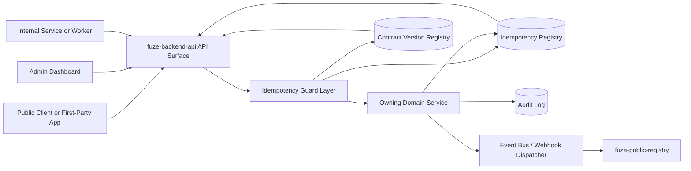
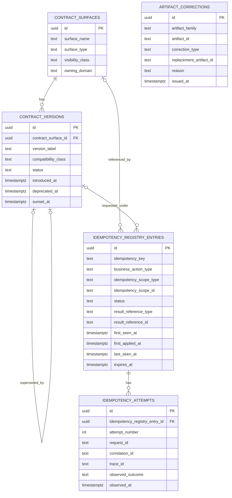
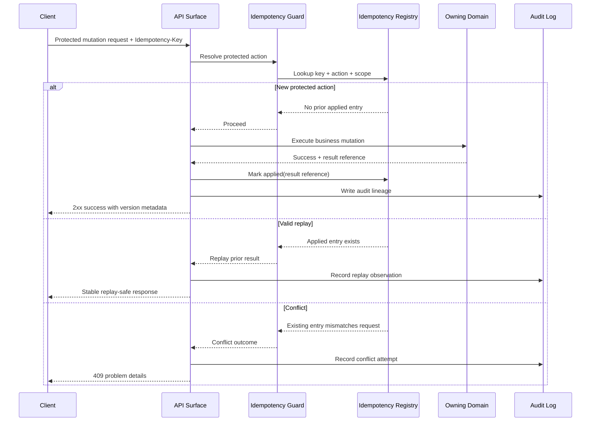

# IDEMPOTENCY_AND_VERSIONING_SPEC.md
Canonical API Specification for Idempotency and Versioning in FUZE

## 1. Title
**IDEMPOTENCY_AND_VERSIONING_SPEC.md**

---

## 2. Document Metadata
- Document Name: `IDEMPOTENCY_AND_VERSIONING_SPEC.md`
- Document Type: Canonical API specification
- Status: Draft for source-of-truth use
- API Classification: cross-cutting | internal | public | admin | event-driven | chain-adjacent
- Owning Domain: Platform API Governance and Reliability Architecture
- Primary Implementing Repo: `fuze-backend-api`
- Supporting Repos:
  - `fuze-frontend-webapp`
  - `fuze-frontend-admin`
  - `fuze-specs`
  - `fuze-public-registry`
  - future `fuze-sdk`
- Primary Systems of Record:
  - domain-owned mutation tables in `fuze-backend-api`
  - canonical idempotency registry tables in `fuze-backend-api`
  - contract/version registries in `fuze-backend-api` and `fuze-specs`
  - published artifact metadata in `fuze-public-registry` where applicable
- Governing Registries:
  - `DOCS_SPEC.md`
  - `SYSTEM_SPEC_INDEX.md`
- Intended Folder: `fuze.ac > docs > api-spec`
- Machine-readable contract outputs derived later:
  - OpenAPI shared headers/components
  - error catalog
  - AsyncAPI event metadata conventions
  - SDK retry and replay guidance

---

## 3. Purpose

This document defines the canonical API-level idempotency and versioning model for the FUZE platform.

Its purpose is to establish how FUZE prevents unintended duplicate mutation, how it distinguishes safe repetition from conflict, how it evolves interfaces and payloads without breaking platform trust, and how these rules apply consistently across public APIs, internal service APIs, admin actions, async jobs, domain events, webhooks, public registry artifacts, transparency reports, and payout-sensitive records.

This specification is required because FUZE is not a single-interface application. FUZE is a multi-product platform with shared identity, shared workspaces, Platform Credits, billing, AI orchestration, workflows, async execution, auditability requirements, public trust artifacts, and payout- or governance-sensitive operations. In that environment, duplicate execution and uncontrolled interface change are platform-level risks.

This file turns the broader FUZE idempotency and versioning architecture into an implementation-ready API source-of-truth document.

---

## 4. Scope

This specification covers:

- canonical idempotency behavior for API-triggered mutations
- business-level idempotency identity and scope rules
- retry-safe mutation handling across public, internal, admin, async, and chain-adjacent surfaces
- conflict semantics when a repeated idempotency identity is reused for a materially different action
- replay safety for jobs, events, and webhooks
- canonical contract versioning across APIs, events, webhooks, reports, registries, and payout artifacts
- backward compatibility, correction lineage, and deprecation rules
- data model requirements for idempotency and version references
- audit, activity, observability, and support trace requirements
- implementation expectations for `fuze-backend-api`
- frontend consumption expectations for `fuze-frontend-webapp` and `fuze-frontend-admin`
- future derivation implications for OpenAPI, AsyncAPI, and `fuze-sdk`

This specification does **not** replace domain-specific mutation rules such as credits issuance policy, subscription lifecycle policy, refund approval policy, payout execution policy, or governance authority. Those remain owned by their canonical domains. This document defines the cross-cutting safety and evolution rules those domains must apply when exposing or consuming API contracts.

---

## 5. Source-of-Truth Inputs

### Primary FUZE docs and registries used
- `DOCS_SPEC.md`
- `SYSTEM_SPEC_INDEX.md`
- `FUZE_WHITEPAPER_v.2026.3.0.1.pdf`
- `FUZE_CHAIN_ARCHITECTURE.md`
- `FUZE_PLATFORM_CREDITS.md`
- `STABLECOIN_PROFIT_PARTICIPATION.md`

### Primary FUZE system specifications used
- `SYSTEM_BOUNDARY_AND_OWNERSHIP_SPEC.md`
- `SYSTEM_OVERVIEW_AND_BOUNDARIES_SPEC.md`
- `PLATFORM_ARCHITECTURE_SPEC.md`
- `DOMAIN_OWNERSHIP_MATRIX_SPEC.md`
- `DATA_MODEL_AND_ENTITY_OWNERSHIP_SPEC.md`
- `ONCHAIN_OFFCHAIN_RESPONSIBILITY_SPEC.md`
- `API_ARCHITECTURE_SPEC.md`
- `EVENT_MODEL_AND_WEBHOOK_SPEC_refreshed.md`
- `INTERNAL_SERVICE_API_SPEC.md`
- `PUBLIC_API_SPEC.md`
- `JOB_QUEUE_AND_WORKER_SPEC.md`
- `WORKFLOW_AND_AUTOMATION_SPEC.md`
- `CREDIT_LEDGER_AND_SETTLEMENT_SPEC.md`
- `SUBSCRIPTIONS_AND_USAGE_BILLING_SPEC.md`
- `REFUND_REVERSAL_AND_ADJUSTMENT_SPEC.md`
- `PAYOUT_LEDGER_SPEC.md`
- `TRANSPARENCY_REPORTING_SPEC.md`
- `PUBLIC_CONTRACT_AND_WALLET_REGISTRY_SPEC.md`
- `AUDIT_LOG_AND_ACTIVITY_SPEC.md`
- `MONITORING_ALERTING_AND_INCIDENT_RESPONSE_SPEC.md`
- `SECURITY_AND_RISK_CONTROL_SPEC.md`
- `MIGRATION_AND_BACKWARD_COMPATIBILITY_SPEC.md`
- upstream conceptual source: `IDEMPOTENCY_AND_VERSIONING_SPEC.md`

### Highest-priority governing interpretation used here
1. system boundaries and ownership documents
2. platform architecture and domain ownership documents
3. on-chain/off-chain separation and core financial/platform-rail documents
4. shared API, workflow, event, audit, security, and runtime documents
5. migration and compatibility documents

### External standards used only as supporting guidance
- HTTP semantics and idempotent method semantics
- Problem Details for HTTP APIs
- OpenAPI-oriented contract discipline

External standards support transport and contract quality, but FUZE business rules control the final design.

---

## 6. Governing Architecture and Ownership Interpretation

### 6.1 Why this API belongs to a cross-cutting platform domain

Idempotency and versioning are not owned by a product frontend, a single product module, or a single transport surface. They are cross-cutting concerns that govern how all important mutation-capable or externally consumed FUZE interfaces behave.

The owning architectural center is therefore the platform API governance and reliability layer implemented in `fuze-backend-api`, with domain-specific application by each owning domain.

### 6.2 Why frontends do not own this behavior

`fuze-frontend-webapp` may generate client-side idempotency keys and display version metadata, but it does not decide authoritative replay safety or contract compatibility.

`fuze-frontend-admin` may trigger privileged mutations and correction flows, but it does not become the source of truth for whether a mutation was already applied or which contract version remains active.

All authoritative outcomes remain backend-owned.

### 6.3 Why contracts do not fully own this behavior

`fuze-contracts` can enforce certain chain-side replay protections or nonce/uniqueness semantics, but FUZE idempotency and versioning are broader than smart-contract execution. They cover off-chain business logic, public API evolution, event payload evolution, transparency artifact lineage, and admin correction pathways.

### 6.4 Architectural interpretation applied

This specification therefore applies the following platform rules:
- backend domains own durable mutation truth
- public and internal APIs consume shared idempotency and versioning conventions
- each domain remains responsible for defining what constitutes “the same intended business action” within its scope
- chain-side execution remains distinct from off-chain idempotency registry handling
- correction lineage must not be confused with ordinary version evolution
- public artifacts must remain historically interpretable

---

## 7. Domain Responsibilities

### 7.1 Cross-cutting platform governance responsibilities
The cross-cutting platform layer in `fuze-backend-api` is responsible for:
- defining shared idempotency key conventions
- defining idempotency registry schema conventions
- defining version registry conventions
- defining standard conflict/error envelopes
- defining standard retry headers and trace fields
- defining public deprecation and compatibility publication rules
- defining observability and audit correlation requirements

### 7.2 Domain-owned mutation responsibilities
Each mutation-owning domain is responsible for:
- deciding which operations require idempotency protection
- defining the business action identity for those operations
- defining the scope in which a repeated action is considered equivalent
- recording result references to canonical domain entities
- deciding how long idempotency records remain authoritative
- deciding whether a replay returns the original representation, a normalized current representation, or an acknowledged duplicate outcome envelope

### 7.3 Public API governance responsibilities
The public API surface is responsible for:
- exposing explicit retry-safe behavior where applicable
- publishing version and deprecation information
- preventing accidental silent breaking changes
- ensuring idempotency semantics are documented for mutation endpoints

### 7.4 Internal API responsibilities
Internal service APIs are responsible for:
- preserving mutation safety under retries and worker recovery
- carrying correlation and version references
- avoiding fragile hidden assumptions that make repeated internal calls unsafe

### 7.5 Event and webhook responsibilities
Event and webhook producers are responsible for:
- carrying event identifiers and version identifiers
- preserving replay and audit interpretability
- ensuring duplicate deliveries do not imply duplicate business application

### 7.6 Audit and support responsibilities
Audit and support layers are responsible for:
- making duplicate versus new attempts explainable
- showing which contract version a consumer or operation received
- preserving correction lineage where published artifacts change

---

## 8. Out of Scope

This specification is out of scope for:
- the exact economic approval policy for credits, refund, treasury, or payout decisions
- UI copy for retry prompts or version banners
- exact smart-contract nonce and signer implementation details
- the complete schema of every public API resource
- internal message broker implementation details
- rate limiting policy details not directly tied to idempotency semantics
- exact retention windows for every domain unless explicitly required by audit or legal policy
- domain-specific reconciliation playbooks beyond cross-cutting requirements

---

## 9. Canonical Entities and Data Ownership

### 9.1 Core durable entities

#### `idempotency_registry_entry`
Cross-cutting durable record of a protected business action submission.
- Owner: platform reliability/governance layer in `fuze-backend-api`
- Purpose: prevent duplicate business application and preserve replay interpretation
- Truth class: source-of-truth for replay handling only; not the source-of-truth for the business object itself

#### `idempotency_attempt`
Per-attempt record linked to an idempotency registry entry.
- Owner: platform reliability/governance layer
- Purpose: preserve request/retry history, headers, actor, and timing
- Truth class: source-of-truth for support/audit attempt history

#### `contract_surface`
Registry entry for a versioned interface family.
- Owner: platform API governance layer
- Purpose: identify what is versioned, for whom, and under which visibility class
- Truth class: source-of-truth for surface-level version governance

#### `contract_version`
Specific version instance for an API, event, webhook, report, registry schema, or payout artifact shape.
- Owner: platform API governance layer or relevant publishing domain
- Purpose: record active/deprecated/superseded lifecycle and compatibility policy
- Truth class: source-of-truth for contract evolution lineage

#### `artifact_correction`
Correction or supersession lineage for trust-sensitive published artifacts.
- Owner: publishing domain; common conventions owned cross-cuttingly
- Purpose: distinguish correction history from schema version change
- Truth class: source-of-truth for historical repair lineage

### 9.2 Domain-linked references
The following references are domain-owned elsewhere and only linked here:
- `account_id`
- `workspace_id`
- `wallet_link_id`
- `subscription_id`
- `invoice_id`
- `payment_id`
- `credits_ledger_entry_id`
- `refund_id`
- `payout_cycle_id`
- `governance_action_id`
- `job_id`
- `event_id`
- `webhook_delivery_id`
- `report_publication_id`
- `registry_entry_id`

### 9.3 Field ownership classes

#### Source-of-truth fields
- `idempotency_registry_entry.idempotency_key`
- `idempotency_registry_entry.idempotency_scope_type`
- `idempotency_registry_entry.idempotency_scope_id`
- `idempotency_registry_entry.business_action_type`
- `idempotency_registry_entry.status`
- `idempotency_registry_entry.result_reference_type`
- `idempotency_registry_entry.result_reference_id`
- `contract_surface.surface_type`
- `contract_surface.visibility_class`
- `contract_version.version_label`
- `contract_version.status`
- `contract_version.compatibility_class`

#### Derived or denormalized fields
- normalized response hash or cache references
- replay outcome summary labels
- latest active version display fields
- frontend convenience deprecation flags

#### Audit-sensitive fields
- `actor_id`
- `actor_type`
- `request_id`
- `correlation_id`
- `trace_id`
- `source_interface`
- `submitted_at`
- `first_applied_at`
- `last_seen_at`
- `deprecated_at`
- `sunset_at`
- `correction_reason`

---

## 10. State Model and Lifecycle

### 10.1 Idempotency registry lifecycle

#### `received`
The platform accepted a protected mutation request and created a registry envelope, but the business result has not yet been conclusively applied.

#### `in_progress`
The platform has begun domain-side processing and the protected action is being executed or coordinated.

#### `applied`
The protected business action was successfully applied exactly once in business meaning.

#### `replayed`
A later equivalent attempt reused the same valid idempotency identity and was mapped to the already-established result.

#### `conflicted`
The same idempotency identity was reused for a materially different action, incompatible payload, or invalid scope.

#### `rejected`
The request failed independently of replay semantics and did not create an applied business effect.

#### `expired`
The replay authority window ended according to domain policy. Expiration must not erase historical audit meaning.

### 10.2 Contract version lifecycle

#### `draft`
Defined internally but not active for production consumers.

#### `active`
Supported and authoritative.

#### `deprecated`
Still interpretable or supported for a defined period, but consumers should migrate away.

#### `sunsetting`
Near end-of-support state with explicit retirement deadline.

#### `retired`
No longer active for new use, but historical references remain interpretable.

#### `superseded`
Replaced by a newer contract or artifact lineage entry.

### 10.3 Correction lifecycle

#### `issued`
A correction record has been published.

#### `linked`
The corrected artifact has explicit linkage to the prior artifact.

#### `effective`
The corrected artifact is the preferred current interpretation.

#### `historically_preserved`
Earlier artifact remains visible for lineage and audit purposes.

---

## 11. API Surface Overview

FUZE must apply idempotency and versioning rules differently by surface family.

### 11.1 Public mutation APIs
- explicit caller-supplied idempotency key where mutation may be retried
- explicit API version in path, header, or both as platform standard
- stable duplicate outcome behavior
- explicit deprecation and sunset metadata

### 11.2 Internal service APIs
- service-to-service idempotency references where retries or orchestration are likely
- correlation-first tracing
- stronger tolerance for coordinated additive evolution, but no casual breaking changes for multi-consumer services

### 11.3 Admin/control-plane APIs
- idempotency required for privileged mutations that may be replayed by operator retry or automation
- mandatory audit linkage and reason fields for correction or override actions
- stricter conflict and authorization checks

### 11.4 Async job submission APIs
- idempotent job-submission identity based on business action, not just request transport
- separate handling for “same request, same job” versus “same request, newer execution intentionally requested”

### 11.5 Events and webhooks
- immutable event identity
- explicit event contract version
- duplicate delivery tolerated by consumers
- replay-safe consumer semantics

### 11.6 Public trust artifacts
- version or publication reference required
- correction lineage distinct from schema versioning
- public historical readability preserved

---

## 12. Authentication and Authorization Model

### 12.1 Authentication
Authentication follows the owning API surface rules defined elsewhere. This specification adds the following mandatory overlays:
- authenticated principal identity must be captured for mutation attempts unless the surface is explicitly public-anonymous
- internal service callers must be attributable to service identity, not generic shared credentials alone
- admin actors must be attributable to named operator identity or accountable automation identity

### 12.2 Authorization
Authorization remains domain-owned, but the following are mandatory for replay-safe handling:
- a replay of the same protected action must not bypass authorization boundaries if scope or actor meaning changed materially
- a duplicate attempt from the same authorized context may resolve to prior result if business-equivalent
- a different actor or broader scope using the same idempotency key must not be treated as a valid replay by default
- correction and deprecation operations on public artifacts require stronger permissions than ordinary reads

### 12.3 Permission checkpoints
Required checkpoints include:
- caller may use the target scope
- caller may perform the business action type
- caller is allowed to trigger correction or deprecation where applicable
- internal services are allowed to invoke versioned internal surfaces they consume

---

## 13. API Endpoints / Interface Contracts

The following routes and interfaces define the canonical cross-cutting contract family. They do not replace domain APIs; they standardize shared behavior.

### 13.1 Public and first-party mutation conventions

#### `POST /v1/idempotency/validate`
- Purpose: validate whether a caller-supplied idempotency key is structurally acceptable before a high-value mutation is submitted
- Caller Type: first-party apps, partner-safe clients, privileged tooling
- Auth: required
- Request Summary:
  - `idempotency_key`
  - `business_action_type`
  - `scope_type`
  - `scope_id`
  - optional normalized payload hash metadata
- Response Summary:
  - validity result
  - duplicate/known indication if policy allows lookup
  - replay safety guidance code
- Side Effects: none
- Idempotency: naturally idempotent read-like validation
- Audit: optional, rate-limited
- Events: none

#### `GET /v1/idempotency/entries/{idempotencyEntryId}`
- Purpose: inspect an idempotency registry entry for support, admin, or workflow recovery
- Caller Type: admin or internal support surfaces
- Auth: privileged
- Response Summary:
  - status
  - owning business action type
  - result reference
  - attempt history summary
- Side Effects: none
- Audit: required on privileged access

### 13.2 Internal service interfaces

#### `POST /internal/idempotency/register-or-resolve`
- Purpose: create or resolve an idempotency registry entry for a protected business mutation
- Caller Type: internal service or workflow orchestrator
- Auth: service identity required
- Request Summary:
  - `idempotency_key`
  - `business_action_type`
  - `scope_type`
  - `scope_id`
  - `actor_reference`
  - `request_hash`
  - `requested_contract_version`
  - optional `expected_result_reference_type`
- Response Summary:
  - outcome: `new`, `replay`, `conflict`, `rejected`
  - registry entry reference
  - prior result reference if replay
  - conflict reason if conflict
- Side Effects:
  - may create registry entry
  - may increment attempt history
- Idempotency: operation itself must be idempotent by composite uniqueness on key + scope + action type
- Audit: required
- Events: internal audit event only where configured

#### `POST /internal/idempotency/{idempotencyEntryId}/mark-applied`
- Purpose: mark a protected action as applied and bind the canonical result reference
- Caller Type: owning domain service
- Auth: service identity required
- Request Summary:
  - `result_reference_type`
  - `result_reference_id`
  - response representation hash or pointer
  - optional replay metadata
- Response Summary:
  - updated status
  - result binding confirmation
- Side Effects:
  - updates idempotency registry entry
  - finalizes replay-safe state
- Idempotency: safe repeated finalize if same result reference; conflict if different result reference for same applied entry
- Audit: required

#### `POST /internal/idempotency/{idempotencyEntryId}/mark-rejected`
- Purpose: record non-applied failure outcome without falsely implying applied mutation
- Caller Type: owning domain service
- Auth: service identity required
- Request Summary:
  - failure code
  - retryability class
  - optional problem type
- Response Summary:
  - updated status
- Side Effects:
  - preserves failure lineage
- Audit: required

### 13.3 Contract version registry interfaces

#### `POST /internal/contract-surfaces`
- Purpose: register a contract surface family
- Caller Type: platform governance tooling or controlled automation
- Auth: privileged internal
- Request Summary:
  - `surface_name`
  - `surface_type` (`public_api`, `internal_api`, `event`, `webhook`, `report`, `registry_schema`, `ledger_artifact`, `job_result_contract`)
  - `visibility_class`
  - owning domain
- Response Summary:
  - created surface reference
- Side Effects: creates a durable registry entry
- Audit: required

#### `POST /internal/contract-surfaces/{surfaceId}/versions`
- Purpose: create a new version entry
- Caller Type: platform governance tooling
- Auth: privileged internal
- Request Summary:
  - `version_label`
  - compatibility class
  - change summary
  - introduction timestamp
  - optional predecessor reference
- Response Summary:
  - version reference
  - active/deprecated status
- Side Effects: creates version record
- Audit: required

#### `POST /internal/contract-versions/{versionId}/deprecate`
- Purpose: mark a contract version deprecated or sunsetting
- Caller Type: privileged governance/admin tooling
- Auth: required
- Request Summary:
  - `deprecation_reason`
  - `deprecated_at`
  - optional `sunset_at`
  - optional replacement version reference
- Response Summary:
  - updated lifecycle status
- Side Effects: updates consumer-visible metadata
- Audit: required

### 13.4 Public metadata interfaces

#### `GET /v1/meta/version`
- Purpose: return current public API version family metadata and deprecation notices
- Caller Type: public or authenticated consumers
- Auth: not required unless surface-specific
- Response Summary:
  - active version family
  - supported versions
  - deprecation/sunset notices
- Side Effects: none
- Audit: optional aggregate only

#### `GET /v1/meta/problems/{problemType}`
- Purpose: human-readable or machine-readable reference for problem types and migration/deprecation notes
- Caller Type: public or authenticated consumers
- Response Summary:
  - problem type metadata
  - contract version applicability
  - migration guidance if relevant
- Side Effects: none

### 13.5 Trust-artifact correction interfaces

#### `POST /internal/public-artifacts/{artifactFamily}/{artifactId}/corrections`
- Purpose: publish a correction or supersession record for a report, registry artifact, or payout artifact
- Caller Type: privileged admin/governance tooling
- Auth: required and strongly privileged
- Request Summary:
  - correction reason
  - replacement artifact reference or annotation only
  - whether historical artifact remains visible
- Response Summary:
  - correction record reference
  - effective lineage
- Side Effects:
  - creates correction record
  - updates artifact metadata
- Idempotency: protected by action-specific idempotency key
- Audit: mandatory with operator reason

### 13.6 Required shared headers and metadata fields
All mutation-capable relevant surfaces should support, as applicable:
- `Idempotency-Key`
- `X-Request-Id`
- `X-Correlation-Id`
- explicit API version route segment and/or version header
- deprecation and sunset response metadata where applicable

---

## 14. Request Rules

### 14.1 Idempotency key rules
- required for externally retriable mutation endpoints designated by owning domain policy
- required for privileged admin mutations involving public artifacts, credits adjustments, payout publication steps, or governance-sensitive records
- optional or forbidden on naturally idempotent reads
- key must be opaque to consumers and treated as case-sensitive unless documented otherwise
- keys must not be interpreted as authorization credentials

### 14.2 Business action binding rules
A key is not valid in isolation. The platform must bind it to:
- business action type
- scope type and scope identifier
- caller identity or caller class where relevant
- normalized payload fingerprint where needed
- contract surface version context if the surface can materially alter semantics

### 14.3 Conflict rules
A replay must be rejected as conflict when any of the following differs materially beyond allowed tolerance:
- business action type
- protected scope
- economically significant payload semantics
- result-binding target
- actor or authorization context where policy requires fixed identity

### 14.4 Version request rules
- public APIs must expose explicit version selection or version clarity
- internal service APIs must carry enough version information for consumer/provider compatibility where the interface is multi-consumer or long-lived
- events and webhooks must include explicit version fields in payload envelope or metadata
- public artifacts must carry publication reference and, where applicable, schema version reference

---

## 15. Response Rules

### 15.1 Idempotent mutation outcomes
Responses for protected mutation endpoints must distinguish among:
- newly applied mutation
- accepted and still processing
- replay of an already applied mutation
- conflict due to non-equivalent reuse
- rejected non-applied request

### 15.2 Replay response behavior
A valid replay should return one of the following according to endpoint policy:
- the original successful response representation
- the current canonical representation plus replay indicator
- an acknowledged duplicate envelope with result reference

The chosen pattern must be stable per endpoint family.

### 15.3 Version response behavior
Responses must be able to expose:
- current contract version
- deprecated status where applicable
- successor version or migration target where applicable
- correction linkage for trust artifacts where relevant

### 15.4 Public trust artifact responses
When an artifact has corrections or supersession:
- current view must not silently erase historical lineage
- response should indicate whether the artifact is original, corrected, or superseded
- machine-readable correction references should exist for controlled consumers

---

## 16. Error Model

FUZE should use a consistent problem-details-compatible envelope for API errors.

### 16.1 Required error categories
- `invalid_request`
- `unauthorized`
- `forbidden`
- `not_found`
- `version_not_supported`
- `version_deprecated`
- `idempotency_conflict`
- `idempotency_key_missing`
- `idempotency_scope_mismatch`
- `duplicate_processing_in_progress`
- `surface_deprecated`
- `sunset_elapsed`
- `correction_not_allowed`
- `internal_error`
- `dependency_failure`

### 16.2 Required problem fields
- `type`
- `title`
- `status`
- `detail`
- `instance`
- `code`
- `request_id`
- `correlation_id`
- optional `idempotency_key`
- optional `contract_version`
- optional `replacement_version`
- optional `retryable`

### 16.3 Specific idempotency conflict meaning
`idempotency_conflict` means the provided idempotency identity matches a previously observed protected action envelope, but the current request materially differs from that envelope in a way the domain must not treat as the same intended action.

### 16.4 Specific deprecation meaning
`version_deprecated` does not always mean failure. It may be exposed as response metadata or warning semantics until sunset policy requires rejection.

---

## 17. Idempotency and Mutation Safety

### 17.1 Canonical principle
A protected business action may be observed multiple times at the transport layer, but it must be applied once in business meaning.

### 17.2 Operations requiring strongest protection
- credits issuance after verified payment
- credits reversal or adjustment
- subscription renewal/create/change transitions with billing consequence
- refund creation against a single approved refund decision
- payout-cycle publication and ledger-finalization steps
- treasury/governance-sensitive record creation or execution requests
- public registry publication and correction issuance

### 17.3 Async submission safety
For long-running jobs, idempotency must distinguish between:
- same request intended as same job submission
- same logical request but intentionally new run

Where a product supports both, the API must require an explicit mode or explicit new-run flag rather than guessing.

### 17.4 Event consumption safety
Consumers must deduplicate by event identity and preserve version-aware handling. Event replay must not cause duplicate business mutation in downstream domains.

### 17.5 Webhook safety
Webhook producers may retry delivery. Consumers must treat webhook delivery duplication as normal transport behavior, not as proof that business state changed twice.

---

## 18. Versioning and Compatibility Rules

### 18.1 Surfaces requiring explicit version discipline
- public APIs
- internal multi-consumer APIs
- domain events
- public webhooks
- public registry schemas
- transparency reports with machine-readable structure
- payout ledger export formats
- async job result contracts consumed beyond one module

### 18.2 Compatibility classes
- `additive_compatible`
- `behaviorally_compatible_with_notice`
- `breaking_with_migration`
- `historical_correction_only`

### 18.3 Breaking-change discipline
Breaking changes must not be introduced silently for public or multi-consumer surfaces. They require:
- explicit new version or explicit controlled migration contract
- deprecation notice where applicable
- consumer-visible timeline where appropriate

### 18.4 Correction versus version evolution
- a new schema or endpoint behavior is a version evolution
- a repair to previously published content or interpretation is a correction event
- a trust-sensitive artifact may involve both, but they must remain distinct in lineage

### 18.5 Historical readability rule
Public artifacts and payout-sensitive records must remain historically interpretable even after schema evolution or correction.

---

## 19. Event Emission and Webhook Behavior

### 19.1 Internal events from idempotency and versioning flows
FUZE may emit internal events such as:
- `platform.idempotency.entry_created`
- `platform.idempotency.applied`
- `platform.idempotency.replayed`
- `platform.idempotency.conflicted`
- `platform.contract_version.created`
- `platform.contract_version.deprecated`
- `platform.public_artifact.corrected`

### 19.2 Public webhooks
Public webhooks that expose lifecycle change should include:
- event ID
- event type
- event version
- produced-at timestamp
- resource reference
- correction linkage where relevant

### 19.3 Replay behavior
- events may be delivered more than once
- consumers must use event identity and version identity together for safe interpretation
- replay must preserve original version meaning

---

## 20. Audit and Activity Requirements

### 20.1 Mandatory audit capture
For protected mutation operations the platform must preserve:
- idempotency key or equivalent protected identity
- action type
- scope type and scope identifier
- actor identity
- request and correlation IDs
- first-seen timestamp
- final outcome
- result reference if applied
- conflict reason if conflicted
- contract version used

### 20.2 Operator activity requirements
Operator-initiated deprecations, corrections, or version status changes must capture:
- operator identity
- reason
- approval linkage where required
- before/after status
- affected surface or artifact references

### 20.3 User-facing activity feed note
End-user activity feeds may summarize replay-safe behavior, but the durable truth remains in audit and domain-owned records.

---

## 21. Data Model and Database Schema View

### 21.1 Core relational tables

#### `idempotency_registry_entries`
- `id` UUID PK
- `idempotency_key` text not null
- `business_action_type` text not null
- `idempotency_scope_type` text not null
- `idempotency_scope_id` text not null
- `actor_type` text null
- `actor_id` UUID null
- `source_interface` text not null
- `request_hash` text null
- `contract_surface_id` UUID null FK -> `contract_surfaces.id`
- `requested_version_id` UUID null FK -> `contract_versions.id`
- `status` text not null
- `result_reference_type` text null
- `result_reference_id` text null
- `conflict_reason_code` text null
- `first_seen_at` timestamptz not null
- `first_applied_at` timestamptz null
- `last_seen_at` timestamptz not null
- `expires_at` timestamptz null
- `created_at` timestamptz not null
- `updated_at` timestamptz not null

Indexes and constraints:
- unique composite index on (`idempotency_key`, `business_action_type`, `idempotency_scope_type`, `idempotency_scope_id`)
- index on `status`
- index on `result_reference_type`, `result_reference_id`
- index on `actor_id`
- partial index on `expires_at` where not null

#### `idempotency_attempts`
- `id` UUID PK
- `idempotency_registry_entry_id` UUID not null FK -> `idempotency_registry_entries.id`
- `request_id` text null
- `correlation_id` text null
- `trace_id` text null
- `attempt_number` integer not null
- `source_ip_hash` text null
- `user_agent_hash` text null
- `submitted_headers_json` jsonb null
- `submitted_payload_hash` text null
- `observed_outcome` text not null
- `observed_at` timestamptz not null
- `created_at` timestamptz not null

Indexes and constraints:
- unique (`idempotency_registry_entry_id`, `attempt_number`)
- index on `request_id`
- index on `correlation_id`

#### `contract_surfaces`
- `id` UUID PK
- `surface_name` text not null unique
- `surface_type` text not null
- `visibility_class` text not null
- `owning_domain` text not null
- `description` text null
- `created_at` timestamptz not null
- `updated_at` timestamptz not null

#### `contract_versions`
- `id` UUID PK
- `contract_surface_id` UUID not null FK -> `contract_surfaces.id`
- `version_label` text not null
- `semantic_class` text not null
- `compatibility_class` text not null
- `status` text not null
- `change_summary` text null
- `introduced_at` timestamptz not null
- `deprecated_at` timestamptz null
- `sunset_at` timestamptz null
- `superseded_by_version_id` UUID null FK -> `contract_versions.id`
- `created_at` timestamptz not null
- `updated_at` timestamptz not null

Indexes and constraints:
- unique (`contract_surface_id`, `version_label`)
- index on `status`
- index on `deprecated_at`
- index on `sunset_at`

#### `artifact_corrections`
- `id` UUID PK
- `artifact_family` text not null
- `artifact_id` text not null
- `correction_type` text not null
- `replacement_artifact_id` text null
- `reason` text not null
- `issued_by_actor_id` UUID null
- `issued_at` timestamptz not null
- `historical_visibility_mode` text not null
- `created_at` timestamptz not null

Indexes and constraints:
- index on (`artifact_family`, `artifact_id`)
- index on `replacement_artifact_id`

### 21.2 Normalization notes
- idempotency registry entries must not duplicate the full business object; they reference it
- contract version records must not embed full external docs; they reference or summarize lineage
- artifact corrections must preserve explicit linkage rather than overwrite historical records in place

### 21.3 Reconciliation notes
- periodic reconciliation should detect applied business records that lack expected idempotency linkage for protected operations
- periodic reconciliation should detect deprecated versions still exposed beyond allowed sunset window where policy forbids that

---

## 22. Architecture Diagram — Mermaid flowchart

---

## 23. Data Design — Mermaid Diagram

---

## 24. Flow View

### 24.1 Happy path — protected public mutation
1. client submits mutation request with `Idempotency-Key`
2. API surface authenticates and authorizes caller
3. idempotency guard resolves or creates registry entry using key + action + scope
4. if new, owning domain executes mutation
5. owning domain persists canonical business result
6. owning domain marks registry entry `applied` with result reference
7. response returns success plus request and version metadata

### 24.2 Alternate path — valid replay
1. repeated equivalent request arrives with same protected identity
2. idempotency guard finds applied registry entry
3. platform classifies request as valid replay
4. response returns stable replay-safe outcome without reapplying mutation
5. attempt history records the replay observation

### 24.3 Failure path — conflict
1. request arrives with existing idempotency identity
2. scope, action, or payload fingerprint differs materially
3. platform rejects request as `idempotency_conflict`
4. no new business mutation is applied
5. conflict is auditable and support-visible

### 24.4 Failure path — in-progress duplicate
1. protected action has not yet completed
2. duplicate request arrives
3. platform returns accepted/in-progress or duplicate-processing signal per endpoint policy
4. later retries can resolve to final result once available

### 24.5 Version deprecation flow
1. owning governance/admin workflow creates or updates contract version metadata
2. version becomes `deprecated` or `sunsetting`
3. public and internal surfaces emit metadata or warnings
4. after policy window, unsupported version may be rejected
5. audit preserves why and when version status changed

### 24.6 Trust-artifact correction flow
1. operator identifies correction need for report, registry entry, or payout artifact
2. privileged correction API creates correction lineage
3. public metadata updates current interpretation while preserving historical artifact link
4. consumers can observe corrected status and lineage explicitly

---

## 25. Data Flows — Mermaid sequenceDiagram

---

## 26. Security and Risk Controls

- idempotency keys must not reveal sensitive business meaning
- keys must not be accepted as replay-safe across materially different scopes
- duplicate processing windows must resist race conditions using durable uniqueness constraints or equivalent transactional protection
- correction and version deprecation operations require privileged authorization and mandatory audit reason capture
- public metadata must not leak internal-only contract details unnecessarily
- internal services must use accountable service identity rather than generic unaudited shared credentials
- replay handling must not allow unauthorized retrieval of prior result data outside the caller’s permitted scope
- expired idempotency windows must not silently erase historical auditability

---

## 27. Operational Considerations

### 27.1 Observability
Metrics should include:
- idempotency replay rate by endpoint family
- idempotency conflict rate by domain
- in-progress duplicate rate
- deprecated-version traffic rate
- unsupported-version rejection rate
- artifact correction issuance rate

### 27.2 Retention
- idempotency registry retention should vary by domain sensitivity
- economic and payout-sensitive operations require longer retention than low-risk product jobs
- historical version and correction lineage should persist beyond active operational windows when trust-sensitive

### 27.3 Recovery
- reconciliation jobs should detect protected operations applied without expected registry linkage
- incident recovery must preserve duplicate-versus-new semantics rather than masking them through manual mutation
- correction workflows must prefer lineage-preserving updates over destructive replacement

### 27.4 Degraded mode
If version registry or idempotency support systems degrade:
- protected economic mutations may need to fail closed rather than proceed unsafely
- low-risk non-mutating reads may continue
- domain policy should define which mutations are blocked without safe replay protection

---

## 28. Acceptance Criteria

1. Every public or internal mutation endpoint designated as retry-sensitive defines whether `Idempotency-Key` is required, optional, or unsupported.
2. Protected actions are keyed by business action type plus scope, not by raw transport request alone.
3. Repeated equivalent protected requests produce at-most-once business application.
4. Repeated non-equivalent requests using the same protected identity return explicit conflict outcomes.
5. Applied protected actions persist result references that can explain replay outcomes.
6. In-progress duplicates are distinguishable from applied replays.
7. Public APIs expose explicit version identity and deprecation visibility for supported surfaces.
8. Internal multi-consumer surfaces preserve controlled version evolution and compatibility state.
9. Events and webhooks carry explicit event identity and version identity.
10. Public trust artifacts preserve correction lineage separately from schema/version evolution.
11. Audit logs preserve actor, request, correlation, version, and replay lineage for protected operations.
12. `fuze-frontend-webapp` and `fuze-frontend-admin` consume backend-declared replay and version metadata instead of inventing local truth.
13. Contract metadata is sufficient for later OpenAPI, AsyncAPI, and SDK derivation.

---

## 29. Test Cases

### 29.1 Positive cases
- create protected mutation with valid idempotency key and receive successful applied result
- repeat exact request and receive replay-safe duplicate outcome without second mutation
- submit protected admin correction with valid key and get one correction record only
- request public metadata and receive active version plus deprecation fields

### 29.2 Negative cases
- omit required idempotency key on protected endpoint and receive validation error
- reuse same key for different scope and receive conflict
- reuse same key for materially different payload and receive conflict
- request unsupported version and receive version-related error

### 29.3 Authorization cases
- unauthorized actor attempts to inspect idempotency entry and is rejected
- non-privileged actor attempts to deprecate contract version and is rejected
- non-privileged actor attempts artifact correction and is rejected

### 29.4 Idempotency cases
- duplicate request arrives after initial apply and reuses prior result
- duplicate request arrives while initial operation is still processing and returns in-progress duplicate outcome
- repeated mark-applied call with same result reference remains safe
- repeated mark-applied call with different result reference becomes conflict

### 29.5 Concurrency and replay cases
- two identical protected requests race concurrently and only one applied business result is created
- event delivery is repeated and downstream consumer applies mutation once
- webhook delivery retry does not create duplicate business effect in consuming domain

### 29.6 Reconciliation cases
- business record created without required idempotency linkage is detected by reconciliation
- deprecated public version still receiving traffic remains visible in metrics and support tools
- corrected public artifact preserves both prior artifact reference and correction linkage

### 29.7 Ledger and trust-sensitive cases
- credits issuance protected by verified-payment reference cannot issue twice under retry
- payout publication step cannot create duplicate cycle-publication record under replay
- transparency artifact correction does not silently overwrite prior publication lineage

---

## 30. Open Questions or Explicit Deferred Decisions

1. exact retention windows for idempotency registry entries by domain family
2. exact standard header names beyond the baseline `Idempotency-Key`, `X-Request-Id`, and `X-Correlation-Id`
3. whether public API versioning uses path-only, header-only, or hybrid signaling across all surface families
4. exact policy for replaying original response bodies versus canonical latest representations by endpoint family
5. exact event schema registry publication mechanics for external consumers
6. exact public correction metadata format for transparency and payout artifact exports

These are implementation details or downstream contract refinements and do not weaken the governing architecture in this file.

---

## 31. Implementation Notes for `fuze-backend-api`

- implement shared middleware/guard library for idempotency envelope resolution
- keep domain-specific equivalence checks pluggable; do not over-centralize business meaning
- use transactional uniqueness or equivalent durable concurrency control for protected write paths
- expose common problem-details-compatible error utilities
- keep contract version registry in a durable store, not in ephemeral runtime config only
- provide observability hooks for replay, conflict, deprecation, and correction metrics
- keep public artifact correction logic lineage-preserving and auditable
- use generated shared types only after the narrative spec is approved; do not allow code generation to become the source of truth

---

## 32. Frontend Consumption Notes

### 32.1 `fuze-frontend-webapp`
- may generate idempotency keys for protected public mutations
- must treat backend replay/conflict/version metadata as authoritative
- must not retry mutation endpoints blindly without respecting protected outcome semantics
- should display deprecation notices and migration hints when exposed by backend metadata
- must not assume duplicate submission means duplicate business success

### 32.2 `fuze-frontend-admin`
- must supply idempotency identity for privileged mutation flows where required
- must require operator reason input for correction/deprecation flows where policy demands it
- must display artifact correction lineage clearly
- must not represent itself as authority for contract status or correction truth; it consumes backend truth

---

## 33. Contract Derivation Notes

### 33.1 OpenAPI / AsyncAPI derivation
This narrative specification should later derive into:
- shared OpenAPI headers/components for `Idempotency-Key`, request IDs, and correlation IDs
- standard problem-details-compatible error schemas
- standard version/deprecation response headers or fields
- AsyncAPI event envelope conventions containing event ID and version ID

### 33.2 Future `fuze-sdk`
Future SDK packages should:
- expose helpers for idempotency key generation and safe retry policy
- expose version-aware client metadata handling
- avoid hiding conflict and replay semantics behind ambiguous convenience methods
- keep SDK behavior derived from approved contracts rather than inventing new mutation assumptions

### 33.3 Narrative versus machine-readable contract rule
This document remains the canonical narrative source of truth. Machine-readable contracts derived later must not introduce business semantics, replay behavior, correction logic, or compatibility claims that are absent from or inconsistent with this specification.
