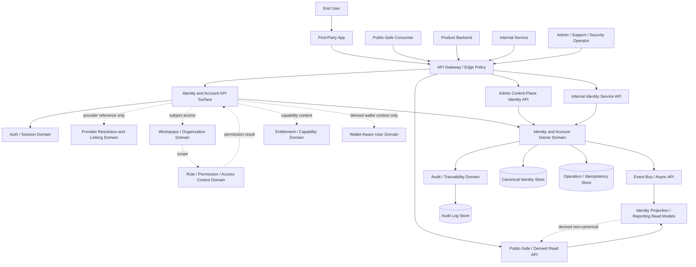
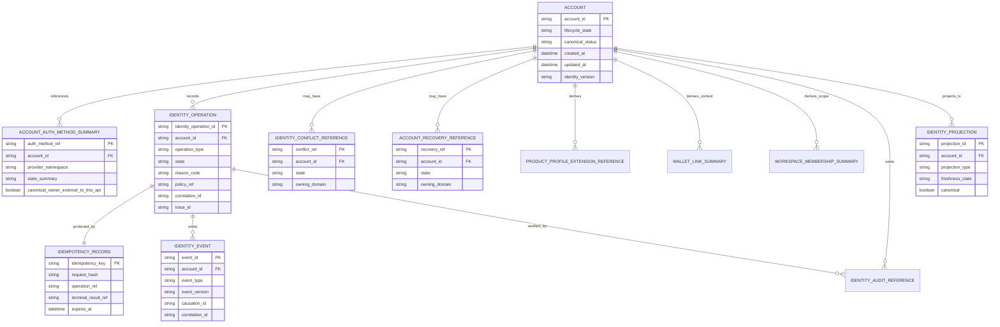
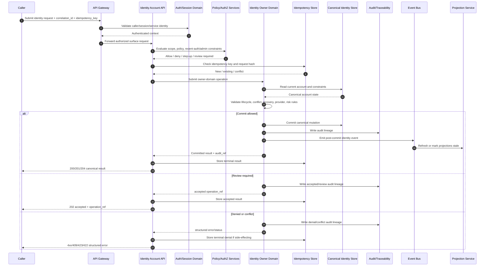

# IDENTITY_AND_ACCOUNT_API_SPEC.md

## Document Metadata

- Document Name: `IDENTITY_AND_ACCOUNT_API_SPEC.md`
- Document Type: FUZE API SPEC v2 / production-grade interface-contract specification
- Status: Draft for API SPEC v2 library inclusion
- Version: 1.0.0
- Effective Date: 2026-04-24
- Last Updated: 2026-04-24
- Reviewed On: 2026-04-24
- Document Owner: FUZE Platform Identity and Account Domain
- Approval Authority: FUZE Platform Architecture and Governance Authority
- Review Cadence: Quarterly or upon material change to account identity, account lifecycle, provider resolution, recovery, linked-login, session, authorization sequencing, wallet-aware participation, or identity-sensitive admin controls
- Governing Layer: API contract layer derived from refined platform identity semantics
- Parent Registry: `API_SPEC_INDEX.md` and FUZE API SPEC v2 Canonical File Registry
- Upstream Semantic Registry: `REFINED_SYSTEM_SPEC_INDEX.md`
- Upstream API Registry: `API_SPEC_INDEX.md`
- Primary Audience: Platform architecture, API design, backend engineering, product engineering, frontend engineering, security engineering, support operations, audit, reliability engineering, implementation-contract authors, OpenAPI/SDK maintainers
- Primary Purpose: Define the production API contract posture for canonical FUZE identity and account resources without redefining refined identity/account semantics.
- Primary Upstream References:
  - `REFINED_SYSTEM_SPEC_INDEX.md`
  - `API_SPEC_INDEX.md`
  - `DOCS_SPEC_INDEX.md`
  - `SYSTEM_SPEC_INDEX.md`
  - `SYSTEM_BOUNDARY_AND_OWNERSHIP_SPEC.md`
  - `SYSTEM_OVERVIEW_AND_BOUNDARIES_SPEC.md`
  - `PLATFORM_ARCHITECTURE_SPEC.md`
  - `DOMAIN_OWNERSHIP_MATRIX_SPEC.md`
  - `DATA_MODEL_AND_ENTITY_OWNERSHIP_SPEC.md`
  - `IDENTITY_AND_ACCOUNT_SPEC.md`
  - `FUZE_ACCOUNT_ACCESS_AND_SESSION_THESIS_FINAL_SPEC.md`
  - `FUZE_ACCOUNT_ACCESS_AND_SESSION_CANONICAL_FINAL_SPEC.md`
  - `AUTH_SESSION_AND_LINKED_LOGIN_SPEC.md`
  - `FUZE_PROVIDER_RESOLUTION_AND_LINKING_SPEC.md`
  - `FUZE_ACCOUNT_ACCESS_CONTINUITY_SPEC.md`
  - `FUZE_SESSION_LIFECYCLE_AND_SECURITY_SPEC.md`
  - `FUZE_ACCOUNT_RECOVERY_AND_CONFLICT_HANDLING_SPEC.md`
  - `WALLET_AWARE_USER_SPEC.md`
  - `WORKSPACE_AND_ORGANIZATION_SPEC.md`
  - `ROLE_PERMISSION_AND_ACCESS_CONTROL_SPEC.md`
  - `ENTITLEMENT_AND_CAPABILITY_GATING_SPEC.md`
  - `AUDIT_AND_ACCESS_TRACEABILITY_SPEC.md`
- Primary Downstream Dependents:
  - `AUTH_SESSION_AND_LINKED_LOGIN_API_SPEC.md`
  - `WALLET_AWARE_USER_API_SPEC.md`
  - `ACCOUNT_ACCESS_AND_SESSION_THESIS_API_SPEC.md`
  - `ACCOUNT_ACCESS_AND_SESSION_CANONICAL_API_SPEC.md`
  - `ACCOUNT_ACCESS_CONTINUITY_API_SPEC.md`
  - `PROVIDER_RESOLUTION_AND_LINKING_API_SPEC.md`
  - `SESSION_LIFECYCLE_AND_SECURITY_API_SPEC.md`
  - `ACCOUNT_RECOVERY_AND_CONFLICT_HANDLING_API_SPEC.md`
  - `KEY_MANAGEMENT_AND_USER_RECOVERY_API_SPEC.md`
  - `WORKSPACE_AND_ORGANIZATION_API_SPEC.md`
  - `ROLE_PERMISSION_AND_ACCESS_CONTROL_API_SPEC.md`
  - `ACCESS_EVALUATION_AND_EFFECTIVE_PERMISSION_API_SPEC.md`
  - `ENTITLEMENT_AND_CAPABILITY_GATING_API_SPEC.md`
  - `AUDIT_AND_ACCESS_TRACEABILITY_API_SPEC.md`
  - `SECURITY_AND_RISK_CONTROL_API_SPEC.md`
  - product implementation contracts
  - first-party application API contracts
  - internal service contracts
  - support/control-plane contracts
  - OpenAPI, AsyncAPI, SDK, and contract-test artifacts
- API Surface Families Covered: First-party application APIs, internal service APIs, admin/control-plane APIs, reporting/read-model APIs, event/async APIs, implementation-facing APIs, limited public-safe derived identity surfaces where explicitly approved.
- API Surface Families Excluded: Full session issuance APIs, full provider callback/linking APIs, full workspace/authorization APIs, full entitlement APIs, wallet verification APIs, billing/credits/payout APIs, public registry APIs, chain-native APIs, raw database schemas, provider-specific SDK contracts.
- Canonical System Owner(s): FUZE Platform Identity and Account Domain; adjacent owners remain authoritative for session, provider-link lifecycle, wallet-aware truth, authorization, entitlement, security/risk, and audit truth.
- Canonical API Owner: FUZE Platform API Architecture in coordination with FUZE Platform Identity and Account Domain.
- Supersedes: Earlier identity/account API sketches, auth-identity interface notes, or product-local user API assumptions to the extent they conflict with this API SPEC v2 document.
- Superseded By: Not yet known.
- Related Decision Records: Not yet known.
- Canonical Status Note: This API spec expresses refined identity/account semantics at the API layer. It MUST NOT be used to redefine the canonical account model, identity lifecycle, provider-resolution semantics, session semantics, workspace/authorization semantics, wallet semantics, or entitlement semantics.
- Implementation Status: Normative API contract baseline; endpoint-level OpenAPI, service contracts, data schemas, SDKs, QA tests, and operational runbooks must derive from and conform to this document.
- Approval Status: Drafted for API SPEC v2 library inclusion; formal approval record not yet attached.
- Change Summary:
  - Created the API SPEC v2 identity/account contract layer.
  - Normalized API surface-family posture around canonical account ownership and identity-domain mutation boundaries.
  - Explicitly separated identity APIs from auth/session, provider-linking, workspace, authorization, entitlement, wallet-aware, support, reporting, and public-read surfaces.
  - Added request, response, error, status, idempotency, audit, event, projection, migration, OpenAPI/AsyncAPI/SDK, acceptance, and test guardrails.
  - Added Mermaid architecture, data design, and sequence diagrams.

---

## Purpose

This specification defines the FUZE API contract posture for canonical identity and account APIs.

The purpose of this document is to make the API layer preserve the refined identity/account model in a way that backend services, frontend clients, internal service consumers, support tooling, reporting systems, event consumers, SDKs, and contract validators can implement without inventing contradictory semantics.

This API spec governs how APIs expose and mutate the canonical FUZE account, account lifecycle state, identity-domain read models, identity-sensitive operation records, identity conflicts, recovery references, and controlled admin/operator actions. It does not define identity semantics from scratch. `IDENTITY_AND_ACCOUNT_SPEC.md` owns semantic truth for the canonical account and the identity domain. This API spec owns interface-contract expression of that truth.

The API layer MUST preserve the central FUZE identity rule: the durable platform actor anchor is `account_id`; provider subjects, emails, usernames, wallet addresses, sessions, workspace memberships, entitlements, reports, and product-local profiles are not replacements for canonical account identity.

## Scope

This API spec governs:

1. API surface families for canonical account identity and identity-domain resources.
2. Route/resource-family posture for account creation, account reads, account lifecycle transitions, identity-sensitive operations, conflict references, recovery references, account restriction, account closure, and derived identity views.
3. Mutation boundaries for canonical identity truth.
4. Read boundaries for canonical identity reads versus derived, reporting, support, public-safe, and product-local identity views.
5. Request, response, error, result, and status classes for identity/account APIs.
6. Idempotency, retry, replay, and duplicate-submission behavior for side-effecting identity operations.
7. Authentication, authorization, scope, permission, entitlement, policy, and recent-auth requirements at the API layer.
8. Admin/control-plane constraints for high-risk identity correction and lifecycle transitions.
9. Audit, traceability, correlation, observability, and operation-lineage requirements.
10. Event, async, webhook, and projection behavior triggered by identity-domain commits.
11. Migration, versioning, compatibility, and deprecation posture for identity/account APIs.
12. OpenAPI, AsyncAPI, SDK, and implementation-contract derivation guardrails.
13. Acceptance criteria and test cases for production readiness.

## Out of Scope

This API spec does not govern:

- detailed session issuance, refresh, rotation, logout, or revocation APIs;
- provider-specific OAuth, OIDC, Telegram, Line, Facebook, wallet-auth, or future federation callback details;
- full provider resolution and provider-link lifecycle APIs;
- workspace membership, organization scope, role, permission, scoped authorization, or effective permission APIs;
- entitlement or capability-gating APIs;
- wallet verification, wallet-link, token balance, or chain-observation APIs;
- billing, credits, ledger, payment, payout, treasury, or governance APIs;
- exact credential storage, MFA catalog, key material, recovery evidence, or support queue implementation;
- product-local profile schemas except for rules that prevent product-local profiles from becoming platform identity truth;
- raw database table design, queue implementation, provider SDK wiring, or service deployment topology.

## Design Goals

1. Preserve one canonical FUZE actor anchor across products, providers, workspaces, wallets, sessions, and reports.
2. Make identity-domain write ownership explicit at the API layer.
3. Prevent product-local, provider-local, frontend-local, report-local, and support-dashboard identity drift.
4. Provide enough route/resource-family clarity to support OpenAPI, SDKs, implementation contracts, and contract tests.
5. Preserve identity/auth/session/authorization/workspace/wallet/entitlement separation.
6. Support controlled account lifecycle operations without bypassing policy, audit, reason-code, or idempotency requirements.
7. Distinguish canonical identity reads from derived projections and presentation surfaces.
8. Make identity-sensitive APIs deterministic, auditable, replay-safe, migration-safe, and fail-closed for high-impact ambiguity.
9. Provide explicit event and async posture without making event consumers semantic owners.
10. Support future provider, product, workspace, wallet-aware, and security expansion without changing the canonical account rule.

## Non-Goals

This API spec is not intended to:

- make login providers platform identity owners;
- treat sessions as account identity;
- treat workspace membership as account identity;
- treat wallet ownership as account identity;
- treat email as the only account resolution key;
- allow products to create alternate platform actor IDs;
- expose broad public identity mutation APIs;
- collapse recovery, provider linking, session lifecycle, authorization, and entitlement into one identity endpoint family;
- replace implementation-level OpenAPI, database schemas, service contracts, runbooks, or provider-specific protocol documents.

## Core Principles

### 1. Refined Semantics First

Identity/account APIs MUST derive from refined identity/account semantics. API convenience MUST NOT override canonical system ownership.

### 2. Canonical Account Anchor

`account_id` is the durable platform actor anchor. Any API that accepts another identifier MUST treat that identifier as a lookup, hint, filter, provider input, or derived reference unless an approved spec explicitly says otherwise.

### 3. Owner-Domain Mutation

Canonical identity truth MAY be mutated only through owner-controlled identity-domain pathways. Public, product, frontend, reporting, event, cache, SDK, or support convenience surfaces MUST NOT become hidden write owners.

### 4. Identity Is Not Authentication

Identity APIs answer who the actor is in FUZE. Auth/session APIs answer how the actor proved access and what runtime session exists. Identity APIs MUST NOT issue sessions except through explicitly delegated auth/session contracts.

### 5. Identity Is Not Authorization

A resolved account or valid session does not prove workspace membership, role, permission, entitlement, or product capability. Identity APIs provide the subject anchor for downstream authorization and entitlement evaluation.

### 6. Provider Inputs Are Evidence

Provider subjects, callback claims, emails, names, avatars, and external identifiers are evidence inputs and attached relationships. They MUST NOT override canonical account ownership by themselves.

### 7. Recovery Preserves Identity

Recovery and remediation APIs, where referenced by this spec, restore or correct access to the same canonical account. They MUST NOT silently create substitute accounts or orphan downstream relationships.

### 8. Derived Views Remain Derived

Support views, reporting views, search indexes, public-safe identity summaries, analytics exports, and product-local profiles MAY summarize identity state but MUST remain regenerable and non-authoritative for mutation.

### 9. Privileged Changes Are Bounded

Admin/control-plane identity APIs MUST be policy-constrained, reason-coded, actor-attributed, correlation-linked, idempotent where repeatable, and durably audited.

### 10. Conservative Conflict Handling

Ambiguous, contested, duplicate, conflicting, or high-risk identity situations MUST default to explicit review, denial, or containment rather than silent merge, reassignment, fragmentation, or destructive overwrite.

## Canonical Definitions

### Account

The canonical FUZE identity record for a person or system actor at the platform level.

### Account ID

The durable unique platform actor anchor, represented as `account_id` in API contracts.

### Canonical Identity

The authoritative answer to “who is this actor in FUZE?”

### Identity Operation

A side-effecting identity-domain API action, such as account creation, lifecycle transition, restriction, reactivation, closure, merge/remediation reference, conflict routing, or identity-sensitive profile mutation.

### Identity Operation Reference

A durable API-visible reference, such as `identity_operation_id` or `operation_ref`, used to trace accepted, completed, rejected, failed, retried, or remediated identity operations.

### Linked Authentication Method

A durable relationship between an account and an approved authentication method or provider subject. This API spec references linked auth methods only as identity-adjacent account relationships; detailed lifecycle APIs belong to auth/session and provider-linking specs.

### Provider Input

External evidence from a login provider, adapter, or future approved identity proof. Provider input is not canonical identity truth.

### Account Lifecycle State

The identity-domain-owned account state, at minimum able to express `pending_setup`, `active`, `restricted`, `suspended`, `deactivated`, `merged`, and `closed`.

### Identity Conflict

A case where available evidence does not safely resolve to one canonical account or one permitted identity operation outcome.

### Recovery Case Reference

A reference to a controlled process for restoring access to a canonical account. Detailed recovery evidence and workflow APIs belong to account recovery and key/user recovery specs.

### Product Profile Extension

A product-local profile, setting, preference, or UX object derived from the canonical account. It is not canonical identity truth.

### Derived Identity View

A read model, support view, reporting view, analytics projection, public-safe summary, or search index generated from canonical identity truth.

## Truth Class Taxonomy

### 1. Semantic Truth

Owned by refined system specs. `IDENTITY_AND_ACCOUNT_SPEC.md` owns the meaning of canonical account identity, account lifecycle, identity continuity, and identity-domain boundaries.

### 2. API Contract Truth

Owned by this API spec and downstream OpenAPI/AsyncAPI/service contracts. It defines allowed route families, request/response/error/status expectations, idempotency posture, audit requirements, and surface-family exposure rules.

### 3. Canonical Identity Truth

Owned by the Identity and Account Domain. Includes account, account lifecycle state, uniqueness/anti-fragmentation rules, identity conflict/remediation references, and canonical identity read models.

### 4. Access-Path Truth

Owned by auth/session and provider-linking domains. Includes linked login and provider-subject binding lifecycle. Identity APIs may reference this truth but MUST NOT absorb detailed access-path ownership.

### 5. Runtime Session Truth

Owned by auth/session lifecycle APIs. Includes active sessions, refresh/rotation, revocation, recent-auth posture, and session containment.

### 6. Policy Truth

Owned by security/risk, recovery, provider-approval, admin-control, entitlement, and higher-order platform policies. Policy truth constrains identity APIs but is not itself the account record.

### 7. Authorization Truth

Owned by workspace/organization, role/permission, and effective-permission domains. Identity APIs supply the subject anchor.

### 8. Entitlement Truth

Owned by entitlement/capability-gating domains. Identity APIs do not determine product eligibility.

### 9. Wallet-Aware Context Truth

Owned by wallet-aware user APIs and chain-adjacent domains. Wallet links are account-attached context, not canonical account identity.

### 10. Provider-Input Truth

Owned by provider adapters until normalized and accepted by owner domains. Provider input may inform account resolution, conflict review, or linked-auth records but does not become identity truth by itself.

### 11. Storage Truth

Durable records supporting canonical identity truth, identity operation lineage, idempotency records, audit references, conflict records, and projections. Storage truth MUST support but not redefine semantic truth.

### 12. Event / Async Execution Truth

Identity-domain events and async operation records describe accepted work, post-commit notifications, and completion outcomes. They are not independent semantic owners.

### 13. Derived Read-Model Truth

Support views, read models, dashboards, exports, search indexes, and public-safe summaries generated from canonical identity state.

### 14. Presentation Truth

Frontend labels, display names, avatars, profile cards, and UI-local interpretations. Presentation truth MUST NOT drive canonical identity mutation.

## Architectural Position in the Spec Hierarchy

This document sits below the refined system-spec hierarchy and expresses the identity/account portion at the API contract layer.

Upstream semantic owners:

- `IDENTITY_AND_ACCOUNT_SPEC.md` owns canonical account semantics.
- `FUZE_ACCOUNT_ACCESS_AND_SESSION_CANONICAL_FINAL_SPEC.md` owns cross-domain ordering between account identity, access paths, sessions, workspace, authorization, entitlement, wallet-aware context, and reporting.
- `FUZE_PROVIDER_RESOLUTION_AND_LINKING_SPEC.md` owns provider normalization and provider-linking semantics.
- `AUTH_SESSION_AND_LINKED_LOGIN_SPEC.md` and `FUZE_SESSION_LIFECYCLE_AND_SECURITY_SPEC.md` own runtime session and linked-login lifecycle semantics.
- `WORKSPACE_AND_ORGANIZATION_SPEC.md`, `ROLE_PERMISSION_AND_ACCESS_CONTROL_SPEC.md`, and `ENTITLEMENT_AND_CAPABILITY_GATING_SPEC.md` own post-auth access and capability decisions.
- `AUDIT_AND_ACCESS_TRACEABILITY_SPEC.md` and audit/logging specs own durable reconstructability requirements.

Downstream implementation layers:

- endpoint-level OpenAPI definitions;
- AsyncAPI/event schemas;
- SDK models and client libraries;
- service-to-service contracts;
- database schema docs;
- migration plans;
- integration tests and contract tests;
- security and support runbooks.

These downstream layers MUST preserve this document’s interface boundaries and MUST NOT reinterpret identity semantics.

## Upstream Semantic Owners

| Semantic Area | Upstream Owner | API Consumption Rule |
| --- | --- | --- |
| Canonical account identity | Identity and Account Domain | APIs expose and mutate only through owner-controlled identity routes. |
| Account lifecycle | Identity and Account Domain | API state transitions must be explicit, auditable, and policy-constrained. |
| Provider resolution | Provider Resolution / Auth-Session Domains | Identity APIs may consume normalized outcomes but must not implement provider shortcuts. |
| Linked login lifecycle | Auth / Session / Linked Login Domain | Identity APIs may show references; detailed mutations belong to auth/session specs. |
| Runtime session | Session Lifecycle Domain | Identity APIs do not issue, refresh, or revoke sessions except through delegated contracts. |
| Workspace scope | Workspace / Organization Domain | Account reads may include derived scope summaries only when marked derived. |
| Authorization | Role / Permission / Access-Control Domain | Identity APIs do not grant permission. |
| Entitlement | Entitlement / Capability-Gating Domain | Identity APIs do not decide capability eligibility. |
| Wallet-aware context | Wallet-Aware User Domain | Identity APIs may include derived wallet-link summaries only as non-canonical context. |
| Audit lineage | Audit / Traceability Domain | Identity APIs must emit and reference durable audit lineage. |

## API Surface Families

### Public API

Public identity APIs MUST be narrow and read-oriented. They MAY expose public-safe account profile references only if an approved public-read spec allows it. Public APIs MUST NOT expose canonical identity mutation, recovery evidence, provider-link details, account conflict details, account restriction reasons, security posture, or private lifecycle history.

### First-Party Application API

First-party application APIs MAY expose authenticated account self-read, limited account preferences, profile-extension linkage, account state summaries, and user-initiated identity operations where policy permits. They MUST require authenticated session context and must not treat session validity as authorization for all account operations.

### Internal Service API

Internal service APIs MAY read account anchors, resolve account references, and request owner-domain identity operations under least-privileged service identity. Internal services MUST NOT bypass identity-domain mutation validation.

### Admin / Control-Plane API

Admin/control APIs MAY initiate high-risk lifecycle, restriction, remediation, conflict, merge-reference, closure, reactivation, and correction operations only through bounded control-plane routes. They MUST require stronger authorization, reason codes, policy references, correlation IDs, audit lineage, and operation records.

### Event / Async API

Identity-domain events and async operations MAY notify downstream services after canonical commits or accepted reviewable operations. Event consumers MUST NOT mutate identity truth based solely on event receipt.

### Reporting / Read-Model API

Reporting APIs MAY expose derived identity summaries, counts, aggregates, and operational views. They MUST be marked as derived, regenerable, and non-authoritative for mutation.

### Implementation-Facing API

Implementation-facing APIs include internal resource contracts, validation responses, operation references, and service-to-service call models. They MUST preserve owner-domain semantics even when hidden from public consumers.

## System / API Boundaries

### What This API Spec Governs

- Canonical account resource exposure.
- Identity-domain account lifecycle operation contracts.
- Identity operation references and accepted-state behavior.
- Identity conflict and recovery reference handling at the account API boundary.
- Derived identity read-model constraints.
- Admin/control-plane identity operation containment.
- Audit and observability requirements for identity APIs.

### What Upstream Refined Specs Govern

- The meaning of account identity.
- The meaning of identity continuity.
- The distinction between identity, access paths, sessions, workspaces, authorization, entitlements, wallets, product profiles, and reports.
- Conflict-resolution ordering and canonical owner-domain boundaries.

### What Adjacent API Specs Govern

- `AUTH_SESSION_AND_LINKED_LOGIN_API_SPEC.md`: linked-login orchestration, auth challenges, session issuance, session revocation, and runtime session state.
- `PROVIDER_RESOLUTION_AND_LINKING_API_SPEC.md`: provider start/callback/resolution/link/unlink/disable/restore/review APIs.
- `SESSION_LIFECYCLE_AND_SECURITY_API_SPEC.md`: detailed session state, rotation, inspection, containment, and invalidation APIs.
- `ACCOUNT_RECOVERY_AND_CONFLICT_HANDLING_API_SPEC.md`: detailed recovery and remediation evidence workflows.
- `WORKSPACE_AND_ORGANIZATION_API_SPEC.md`: workspace membership and organization scope APIs.
- `ROLE_PERMISSION_AND_ACCESS_CONTROL_API_SPEC.md`: role/permission grant and evaluation APIs.
- `ENTITLEMENT_AND_CAPABILITY_GATING_API_SPEC.md`: product capability and entitlement APIs.
- `WALLET_AWARE_USER_API_SPEC.md`: wallet-link and participation-aware context APIs.

### What Implementation Contracts Govern

- Concrete endpoint paths and method names.
- Field-level schemas.
- Provider adapter payloads.
- Database schema and migration scripts.
- Retry queue implementation.
- Observability dashboards and runbook procedures.

## Adjacent API Boundaries

### Identity vs Auth / Session

Identity APIs may return `account_id`, account lifecycle state, and identity operation references. They MUST NOT return session tokens, refresh tokens, or token rotation semantics except through approved delegated auth/session endpoints.

### Identity vs Provider Linking

Identity APIs may expose linked-auth summaries only when safe and marked as access-path references. Provider resolution, subject normalization, callback handling, and link lifecycle mutations belong to provider-linking and auth/session APIs.

### Identity vs Workspace / Authorization

Identity APIs may include workspace or permission summaries only as derived or embedded convenience views when explicitly requested and authorized. They MUST NOT grant membership, roles, permissions, or effective access.

### Identity vs Entitlement

Identity APIs may expose an account anchor used by entitlement systems. They MUST NOT embed product capability truth as identity truth.

### Identity vs Wallet

Identity APIs may reference wallet-aware context only as derived adjacent context. Wallet addresses MUST NOT become account IDs or account ownership keys.

### Identity vs Product Profiles

Product-local profile APIs may reference `account_id` and maintain product-local fields. They MUST NOT create alternate platform actor roots or mutate account lifecycle.

### Identity vs Reporting

Reporting identity APIs may summarize but not decide identity. If reporting disagrees with canonical account state, canonical identity-domain records win.

## Conflict Resolution Rules

When identity/account API layers disagree, the following precedence applies:

1. canonical identity-domain records and account lifecycle state;
2. explicit security, recovery, restriction, remediation, and policy constraints;
3. validated provider-input evidence interpreted through approved owner-domain resolution rules;
4. auth/session runtime state;
5. workspace, authorization, entitlement, and wallet-aware adjacent context;
6. product-local profiles and first-party client state;
7. derived views, reports, caches, exports, search indexes, support displays, and public summaries.

Mandatory conflict rules:

- Provider profile data MUST NOT override canonical account ownership.
- Email similarity MUST NOT justify silent account merge or reassignment.
- Wallet linkage MUST NOT justify identity reassignment.
- Active session presence MUST NOT override account restriction, suspension, recovery, or remediation state.
- Workspace membership MUST NOT substitute for account identity.
- Product-local user tables MUST NOT override `account_id`.
- Reporting mismatches MUST resolve in favor of canonical identity-domain records.
- Support dashboard convenience actions MUST NOT mutate account state outside owner-controlled operations.
- Unknown or ambiguous account evidence MUST create explicit conflict/review or denial posture.

## Default Decision Rules

1. Default actor anchor: `account_id`.
2. Default semantic owner of person-level identity: Identity and Account Domain.
3. Default API owner for canonical account mutations: identity/account API owner-controlled pathways.
4. Default treatment of email: contact, hint, or review signal; not sole canonical key.
5. Default treatment of provider subject: evidence/access-path binding; not account identity by itself.
6. Default treatment of session: temporary authenticated runtime state; not identity or authorization truth.
7. Default treatment of wallet: account-attached context; not identity root.
8. Default treatment of product profile: downstream extension; not platform identity.
9. Default treatment of derived view: non-authoritative and regenerable.
10. Default resolution for duplicate-account risk: explicit conflict/review; not silent merge or silent fragmentation.
11. Default resolution for high-impact identity mutation: require stronger authorization, recent-auth or admin authorization, reason code, idempotency, policy reference, and audit.
12. Default failure posture under uncertainty: fail closed for mutation and avoid destructive canonical writes.

## Roles / Actors / API Consumers

### End User

May call first-party self-service account APIs through authenticated application surfaces, subject to policy, recent-auth, and authorization requirements.

### First-Party Application Client

May initiate account reads and permitted self-service operations. It renders outcomes but does not own canonical state.

### Product Backend

May consume account anchors, canonical account state, and identity events. It may create product-local extensions but may not mutate canonical identity directly.

### Internal Service

May call internal identity APIs under service identity and explicit scope. It must use owner-approved mutation endpoints.

### Admin / Support Operator

May initiate bounded control-plane operations under stronger authorization. Operator actions must be reason-coded, policy-referenced, attributable, audited, and non-repudiable.

### Security / Risk Service

May request restriction, containment, review, or remediation workflows under explicit policy. It does not become the identity owner.

### Audit / Compliance Consumer

May read identity operation lineage and audit references. It may not mutate account identity.

### Reporting / Analytics Consumer

May read derived projections and aggregates. It may not use derived data as identity write input.

### Event Consumer

May consume post-commit identity-domain events. It must treat events as notifications or triggers for downstream work, not as ownership transfer.

## Resource / Entity Families

### Canonical API-Facing Resources

- `account`
- `account_identity_summary`
- `account_lifecycle_state`
- `identity_operation`
- `identity_operation_result`
- `identity_conflict_reference`
- `account_recovery_reference`
- `identity_audit_reference`
- `identity_policy_reference`
- `identity_projection_status`

### Adjacent Reference Resources

- `linked_auth_method_summary`
- `session_summary_reference`
- `workspace_membership_summary`
- `wallet_link_summary`
- `entitlement_summary`
- `product_profile_extension_reference`

Adjacent reference resources MUST be marked as derived or externally owned unless the relevant adjacent API spec declares a canonical ownership transfer, which this document does not do.

### Operation Resources

Identity operation resources SHOULD include:

- `operation_ref` or `identity_operation_id`;
- `operation_type`;
- `requested_by`;
- `request_surface`;
- `authorization_context_ref`;
- `policy_ref`;
- `reason_code` where privileged or high-risk;
- `idempotency_key_ref` where side-effecting;
- `correlation_id`;
- `trace_id`;
- `state`;
- `accepted_at`;
- `completed_at` or `terminal_at` when terminal;
- `audit_ref`.

## Ownership Model

### Canonical API Owner

The canonical API owner for account identity routes is FUZE Platform API Architecture in coordination with the Identity and Account Domain.

### Canonical Mutation Owner

Only the Identity and Account Domain may perform canonical account mutations. API routes may expose mutation requests, but the mutation must terminate in the owner domain.

### Read Ownership

Canonical account reads are owned by the Identity and Account Domain. Derived identity reads are owned by the projection/reporting domain that publishes them but remain non-canonical.

### Admin Ownership

Admin/control-plane APIs do not own identity truth. They request bounded owner-domain operations and must preserve domain validation, policy, audit, and idempotency requirements.

### Event Ownership

Events describe owner-domain committed outcomes or accepted operations. Event consumers must not become mutation owners.

## Authority / Decision Model

Identity/account APIs MUST enforce the following decision sequence for side-effecting operations:

1. authenticate the caller or service identity;
2. resolve the actor and request surface;
3. evaluate account state and policy restrictions;
4. evaluate authorization for the requested identity action;
5. evaluate recent-auth, step-up, or admin-control requirements when applicable;
6. validate request shape and semantic constraints;
7. evaluate idempotency and duplicate-submission posture;
8. evaluate conflict, recovery, security, and provider-link constraints;
9. submit mutation to the Identity and Account Domain owner pathway;
10. persist operation, audit, and idempotency records;
11. emit post-commit events or accepted async references;
12. update or enqueue projection refresh;
13. return a canonical response or accepted operation response.

The API layer MUST NOT decide canonical identity outcomes using frontend state, provider claims alone, product-local rows, reports, caches, or support displays.

## Authentication Model

Identity/account APIs require one of the following authentication contexts, depending on surface:

- authenticated end-user session for first-party self-service reads and low-risk updates;
- authenticated session plus recent-auth or step-up for sensitive self-service actions;
- service identity with explicit internal API scope for service-to-service reads or owner-approved requests;
- admin/operator identity with privileged control-plane scope for support/security operations;
- unauthenticated or weakly authenticated access only for narrowly approved pre-account bootstrap or public-safe discovery endpoints, never for canonical account mutation.

Authentication proves access to the API surface; it does not by itself prove authorization to mutate identity.

## Authorization / Scope / Permission Model

Authorization MUST be explicit for every identity/account route family.

Minimum scope classes:

- `identity.account.read:self`
- `identity.account.read:service`
- `identity.account.read:admin`
- `identity.account.create:platform`
- `identity.account.update:self_limited`
- `identity.account.lifecycle:admin`
- `identity.account.restrict:security`
- `identity.account.recover:workflow`
- `identity.account.conflict:review`
- `identity.account.audit:read`
- `identity.account.projection:read`

Authorization rules:

- A user may read their own account summary when authenticated and not blocked by higher-order policy.
- A user may not mutate lifecycle state directly except through explicit self-service flows allowed by policy.
- An internal service may call identity APIs only with least-privileged service scope and purpose-specific route authorization.
- Admins may not bypass owner-domain validation, reason-code, policy, audit, and operation recording.
- Authorization for workspace or product actions must be evaluated by adjacent domains after identity resolution.

## Entitlement / Capability-Gating Model

Entitlements are downstream of identity. Identity APIs MAY provide the canonical subject anchor required for entitlement evaluation but MUST NOT decide product capability eligibility.

When identity APIs expose entitlement summaries for first-party convenience, such fields MUST be:

- clearly marked derived;
- traceable to the entitlement/capability-gating domain;
- omitted from canonical identity mutation inputs;
- excluded from identity-domain conflict resolution.

## API State Model

### Account States

APIs MUST preserve at least the following semantic account states:

- `pending_setup`
- `active`
- `restricted`
- `suspended`
- `deactivated`
- `merged`
- `closed`

Additional implementation states MAY exist if they map cleanly to these semantics and do not leak contradictory meaning.

### Identity Operation States

Side-effecting operations SHOULD use:

- `received`
- `accepted`
- `validation_failed`
- `authorization_denied`
- `policy_denied`
- `conflict_review_required`
- `risk_review_required`
- `processing`
- `committed`
- `completed`
- `failed_retryable`
- `failed_terminal`
- `cancelled`
- `superseded`

### Conflict / Recovery Reference States

Identity APIs may expose reference states such as:

- `none`
- `open`
- `awaiting_evidence`
- `under_review`
- `contained`
- `approved`
- `denied`
- `resolved`
- `closed`

Detailed evidence and workflow state belong to recovery/conflict APIs.

## Lifecycle / Workflow Model

### Account Creation

Account creation may be synchronous or async depending on provider/bootstrap complexity. The API MUST guarantee that a successful terminal account creation creates exactly one canonical account record and one durable `account_id`.

### Account Read

Account read APIs must distinguish canonical identity fields from derived summaries. Clients must not infer permissions, entitlements, wallet ownership, or session validity solely from account read success.

### Limited Self-Service Update

Low-risk account attributes may be updated through first-party routes only if those attributes are identity-domain-owned or explicitly delegated. Updates that affect access, recovery, provider links, or lifecycle state require stronger workflows.

### Lifecycle Transition

Restriction, suspension, deactivation, closure, merge-reference, and reactivation operations are high-impact. They must be owner-domain validated, reason-coded, auditable, and policy-constrained.

### Conflict / Remediation

Ambiguous or contested identity evidence must open a conflict/review pathway. Identity APIs may return a reference to that pathway but must not silently merge, split, or reassign identity.

### Projection Refresh

Post-commit identity changes must trigger projection refresh or mark derived views stale until refreshed. Derived views must not override canonical account state.

## Architecture Diagram — Mermaid flowchart

## Data Design — Mermaid Diagram

## Flow View

### Main Synchronous Account Read Flow

1. Caller authenticates through an approved surface.
2. API gateway validates session or service identity.
3. Identity API checks route scope and caller permission.
4. Identity owner domain retrieves canonical account state.
5. Optional derived summaries are fetched only if requested and authorized.
6. Response marks canonical fields and derived fields distinctly.
7. Audit/observability records request lineage where required.

### Side-Effecting Identity Operation Flow

1. Caller submits identity operation with correlation ID and idempotency key where required.
2. API authenticates caller or service identity.
3. API validates authorization, recent-auth, admin control, or policy requirements.
4. API validates request schema and operation preconditions.
5. API checks idempotency record and request hash.
6. API routes the operation to the Identity and Account Domain owner pathway.
7. Owner domain evaluates conflict, recovery, risk, provider-link, session, and lifecycle constraints.
8. Operation is committed, denied, accepted for review, or rejected.
9. Operation, audit, and idempotency records are persisted.
10. Post-commit events are emitted after canonical commit.
11. Projections are refreshed or marked stale.
12. Response returns canonical result or accepted operation reference.

### Async / Review Flow

1. API accepts a high-risk identity operation as `accepted` or `conflict_review_required`.
2. Operation record captures actor, reason, policy, idempotency, correlation, and evidence references.
3. Review workflow evaluates required policy and evidence.
4. Owner domain commits, denies, cancels, supersedes, or contains the operation.
5. Events and audit are emitted after terminal decision.
6. Clients poll operation status or receive approved webhook/event notifications through adjacent specs.

### Failure / Retry Flow

1. Client retries with same idempotency key.
2. API compares request hash to original operation.
3. If identical, API returns the existing accepted or terminal operation result.
4. If mismatched, API returns `idempotency_conflict`.
5. Retryable infrastructure failures do not create duplicate account records or duplicate lifecycle transitions.

### Admin / Operator Flow

1. Operator authenticates with privileged session and required scope.
2. API requires explicit target account, operation type, reason code, policy reference, and correlation ID.
3. API validates that operation is allowed through control-plane route family.
4. Owner domain performs canonical validation and conflict checks.
5. Operation produces durable audit lineage and post-commit event if committed.
6. Derived/support views are updated after canonical commit.

## Data Flows — Mermaid sequenceDiagram

## Request Model

Identity/account API requests MUST include enough contract-level information for deterministic handling.

### Common Request Requirements

- `correlation_id` SHOULD be required for all mutating identity operations and SHOULD be accepted for reads.
- `idempotency_key` MUST be required for side-effecting operations that create accounts, transition lifecycle state, initiate review, or modify identity-sensitive data.
- `request_actor` MUST be inferable from authenticated context; it MUST NOT be trusted from client-provided body fields alone.
- `request_surface` SHOULD be recorded as public, first-party, internal, admin, event, reporting, or implementation-facing.
- `reason_code` MUST be required for privileged/admin lifecycle operations, restriction, reactivation, merge/remediation reference operations, and destructive/corrective actions.
- `policy_ref` or `policy_version` MUST be captured where policy materially determines the outcome.
- `target_account_id` MUST be used for canonical identity mutation when the account already exists.
- Provider, email, wallet, or product-local identifiers MAY appear only as lookup hints, evidence references, or adjacent resource references unless the appropriate adjacent spec permits otherwise.

### Forbidden Request Patterns

- Client-provided `account_id` for new canonical account creation unless issued by the owner domain.
- Direct write of `lifecycle_state` without an operation type and policy path.
- Direct write of `provider_subject` as account identity.
- Direct write of `workspace_role`, `permission`, `entitlement`, or `wallet_link` through identity routes.
- Mutation requests sourced from reporting/export projections.
- Admin mutation without reason code and actor attribution.

## Response Model

### Canonical Account Response

Canonical account responses SHOULD include:

- `account_id`;
- `lifecycle_state`;
- `canonical_status`;
- `identity_version` or equivalent optimistic/version marker where applicable;
- `created_at` and `updated_at`;
- `state_reason_summary` only when safe and authorized;
- `derived_sections` explicitly marked when included;
- `audit_ref` for sensitive operations;
- `operation_ref` for accepted or async operations.

### Operation Response

Side-effecting operations SHOULD return one of:

- `201 created` with canonical account result when creation completes synchronously;
- `200 ok` with canonical operation result for idempotent repeat or completed update;
- `202 accepted` with `operation_ref` when review, async finalization, or downstream processing is required;
- `204 no_content` only for safe terminal no-body operations where audit and operation references remain retrievable;
- structured 4xx/5xx errors for denial, conflict, policy failure, or retryable infrastructure failure.

### Derived Field Marking

Any included linked-auth, session, workspace, entitlement, wallet, product-profile, reporting, or projection field MUST be marked with:

- `truth_class`;
- `owning_domain`;
- `freshness_state` where applicable;
- `canonical: false` unless explicitly canonical within this API domain.

## Error / Result / Status Model

Identity/account APIs MUST use structured error classes with stable machine-readable codes.

### Required Error Families

- `authentication_required`
- `recent_auth_required`
- `step_up_required`
- `authorization_denied`
- `scope_denied`
- `policy_denied`
- `entitlement_not_applicable`
- `account_not_found`
- `account_state_blocks_operation`
- `account_restricted`
- `account_suspended`
- `account_closed`
- `identity_conflict_required`
- `duplicate_account_risk`
- `provider_evidence_not_canonical`
- `workspace_context_not_identity`
- `wallet_context_not_identity`
- `idempotency_key_required`
- `idempotency_conflict`
- `operation_already_completed`
- `operation_superseded`
- `validation_failed`
- `rate_limited`
- `abuse_control_denied`
- `projection_stale`
- `migration_version_unsupported`
- `dependency_unavailable`
- `degraded_mode_mutation_blocked`
- `internal_error_retryable`
- `internal_error_terminal`

### Conflict Responses

Where ambiguity exists, APIs MUST prefer `409 conflict` or `202 accepted` with review reference over silent mutation. The response MUST avoid revealing sensitive account existence or recovery details to unauthorized callers.

### Accepted-State vs Final Success

`202 accepted` means the request has been accepted for processing or review. It MUST NOT be represented as final business success. Clients MUST inspect operation status or await approved notification.

## Idempotency / Retry / Replay Model

Idempotency is mandatory for:

- account creation;
- lifecycle transitions;
- restriction/suspension/reactivation requests;
- deactivation/closure requests;
- conflict or review initiation;
- recovery reference initiation from identity APIs;
- admin/control-plane corrections;
- identity-sensitive profile or contact changes where duplicate processing could alter state.

Rules:

1. Idempotency keys MUST be scoped to actor, surface, operation type, and target resource where applicable.
2. Reuse of a key with identical request hash MUST return the existing accepted or terminal result.
3. Reuse of a key with a different request hash MUST return `idempotency_conflict`.
4. Terminal results SHOULD remain retrievable for the configured retention period.
5. Retryable infrastructure failure MUST NOT create duplicate accounts or duplicate lifecycle transitions.
6. Provider callback replay protection is owned by provider-linking specs, but identity APIs consuming provider outcomes MUST preserve replay-safe boundaries.
7. Admin retries MUST not duplicate audit-visible semantic actions; they may append retry attempt telemetry while preserving one canonical operation result.

## Rate Limit / Abuse-Control Model

Identity/account APIs are security-sensitive and MUST support abuse controls appropriate to surface and action.

- Public and unauthenticated bootstrap-adjacent routes MUST be tightly rate-limited.
- Self-service reads SHOULD use user/session-based rate controls.
- Sensitive operations MUST use stricter rate limits and anomaly detection.
- Admin/control routes MUST be monitored for unusual action rates, bulk changes, and reason-code anomalies.
- Rate-limit errors MUST be structured and MUST NOT disclose sensitive account existence details.
- Abuse controls MAY force review or deny operations without redefining identity truth.

## Endpoint / Route Family Model

This document defines allowed route families, not exact endpoint paths.

### Allowed Route Families

- Account self-read and canonical identity summary.
- Internal account lookup by `account_id`.
- Controlled account creation/bootstrap outcome acceptance when identity owner domain controls creation.
- Limited self-service identity-domain-owned field update.
- Account lifecycle operation request.
- Account restriction/suspension/reactivation request.
- Account closure/deactivation request.
- Identity operation status read.
- Identity conflict/recovery reference read.
- Derived identity projection read.
- Admin/control-plane identity operation request.
- Audit/reference read for authorized audit consumers.

### Disallowed Route Families

- Public arbitrary account lookup exposing private identity details.
- Product-local direct account creation that bypasses identity owner domain.
- Direct lifecycle state overwrite endpoints.
- Direct provider-subject-to-account mutation in identity routes.
- Direct session token issuance in identity routes.
- Direct workspace role or entitlement grant in identity routes.
- Direct wallet-link mutation in identity routes.
- Reporting-projection repair endpoints that mutate canonical account records.
- Bulk identity mutation without explicit approved migration/control-plane spec.

## Public API Considerations

Public identity exposure MUST default to minimal, stable, and privacy-safe surfaces.

Public APIs MAY expose:

- opaque public profile reference where approved;
- public display name/avatar only if explicitly public and governed by presentation/profile specs;
- public-safe account existence abstraction only where no enumeration risk exists;
- derived identity status for public trust surfaces only where separately approved.

Public APIs MUST NOT expose:

- private account lifecycle history;
- provider links;
- recovery/conflict state;
- restriction or suspension reasons;
- audit lineage details;
- workspace membership unless public by another spec;
- wallet links unless wallet/public registry specs explicitly permit;
- canonical identity mutation.

## First-Party Application API Considerations

First-party application APIs MAY expose authenticated self-service account views and low-risk profile operations. They MUST:

- require valid authenticated context;
- preserve account-state and risk-state precedence over session continuation;
- require recent-auth or step-up for sensitive updates;
- distinguish identity-owned fields from product-local profile fields;
- route provider-link, session, recovery, wallet, workspace, and entitlement operations to adjacent APIs;
- avoid treating account read success as permission grant.

## Internal Service API Considerations

Internal identity APIs MUST use explicit service identity and least-privileged scopes. They MAY support:

- account anchor resolution;
- canonical account state checks;
- owner-approved lifecycle operation requests;
- identity event reconciliation;
- projection rebuild support;
- audit/reference lookup.

Internal APIs MUST NOT become hidden broad-write shortcuts. Any internal mutation must route through the same owner-domain validation and audit posture as external or admin mutations, adjusted for service identity.

## Admin / Control-Plane API Considerations

Admin/control-plane APIs are permitted only for bounded, high-risk operations that ordinary product or self-service APIs cannot safely perform.

They MUST require:

- privileged operator authentication;
- explicit authorization scope;
- target account reference;
- reason code;
- policy reference;
- correlation ID;
- operation reference;
- idempotency key;
- audit emission;
- review or approval workflow where policy requires;
- non-repudiable actor attribution.

Admin/control APIs MUST NOT:

- silently merge accounts;
- silently reassign provider subjects;
- mutate wallet links, workspaces, roles, entitlements, billing, or chain state through identity routes;
- hide destructive changes behind support notes;
- use derived/support views as write authority.

## Event / Webhook / Async API Considerations

Identity-domain events SHOULD be emitted after canonical commits or durable accepted operation state changes.

Candidate event families:

- `identity.account.created`
- `identity.account.activated`
- `identity.account.restricted`
- `identity.account.suspended`
- `identity.account.reactivated`
- `identity.account.deactivated`
- `identity.account.closed`
- `identity.account.merged_reference_recorded`
- `identity.operation.accepted`
- `identity.operation.completed`
- `identity.operation.denied`
- `identity.conflict.opened`
- `identity.conflict.resolved`
- `identity.recovery.reference_created`
- `identity.projection.refresh_requested`

Rules:

- Events MUST include event ID, event version, account reference, causation ID, correlation ID, occurred-at timestamp, and owner-domain source.
- Events MUST NOT expose sensitive provider, recovery, or restriction details to unauthorized subscribers.
- Webhooks, if later exposed, MUST be narrower than internal events and versioned separately.
- Event consumers MUST treat events as notifications, not permission to mutate identity truth.
- Async operations MUST distinguish accepted state from final success.

## Chain-Adjacent API Considerations

Identity/account APIs are not chain-native APIs. Wallet-aware and chain-adjacent context may attach to an account, but the account remains the identity root.

Identity APIs MUST NOT:

- treat wallet address as the canonical account ID;
- infer identity reassignment from wallet movement;
- write token-balance truth;
- expose chain-derived eligibility as identity truth;
- mutate payout, treasury, credits, or governance state.

Where wallet or chain context is returned for convenience, it must be marked derived/adjacent and owned by the wallet-aware or chain-adjacent domain.

## Data Model / Storage Support Implications

Storage designs derived from this API spec MUST support:

- durable `account` records;
- durable lifecycle state and versioning;
- operation records for side-effecting identity changes;
- idempotency records;
- audit references;
- conflict and recovery references;
- derived projection state;
- event outbox or equivalent post-commit event guarantees;
- policy reference capture;
- correlation and trace identifiers;
- non-destructive lineage for high-risk corrections.

Storage implementations MUST NOT require destructive overwrite to represent remediation, restriction, supersession, or correction. They SHOULD prefer explicit state transitions and lineage-preserving records.

## Read Model / Projection / Reporting Rules

Derived identity read models MAY exist for:

- first-party account dashboard summaries;
- support views;
- security/risk review views;
- reporting aggregates;
- analytics projections;
- search indexes;
- public-safe profile summaries where approved.

Rules:

1. Derived views MUST be marked as derived.
2. Derived views MUST be regenerable from canonical owner-domain truth.
3. Derived views MUST NOT mutate canonical account records.
4. Derived views MUST expose freshness state when stale identity state could mislead clients.
5. Derived views MUST NOT invent lifecycle states unsupported by canonical semantics.
6. Derived views MUST NOT coalesce multiple accounts into one identity unless a canonical remediation result exists.
7. Reporting mismatches MUST not be used as repair inputs without owner-domain review.

## Security / Risk / Privacy Controls

Identity/account APIs protect a core security boundary.

Security-sensitive operations include:

- account creation under high-risk provider or bootstrap paths;
- primary contact or identity-owned profile changes;
- lifecycle restriction, suspension, reactivation, deactivation, closure;
- recovery reference initiation;
- conflict/remediation initiation;
- merge reference or supersession recording;
- admin/control-plane identity correction;
- derived/public exposure changes where privacy risk exists.

Controls MUST include:

- recent-auth or step-up for sensitive self-service operations;
- privileged authorization for admin/control operations;
- policy and risk evaluation;
- rate limiting and anomaly detection;
- audit lineage;
- privacy-safe response shaping;
- prevention of account enumeration;
- careful redaction of provider, recovery, and conflict details.

## Audit / Traceability / Observability Requirements

Identity APIs MUST produce enough evidence to reconstruct:

- who initiated the request;
- which surface family was used;
- which account was affected;
- what operation was requested;
- what policy, authorization, and risk checks applied;
- whether idempotency affected the result;
- what canonical state changed;
- what event was emitted;
- what derived projections were refreshed or left stale;
- what operator reason code applied;
- what correlation and trace IDs connect the request to downstream work.

Audit records for high-risk identity operations MUST be durable, non-repudiable, reason-coded, actor-attributed, timestamped, correlation-linked, and policy-referenced.

Observability MUST include route family, operation type, result class, latency, dependency failure, idempotency replay, conflict/review rate, policy denial rate, projection lag, and event emission success.

## Failure Handling / Edge Cases

### Provider Evidence Conflicts

Identity APIs must route to provider-resolution or conflict/recovery APIs rather than silently deciding based on provider data.

### Duplicate Account Risk

The API MUST return conflict/review posture and not create duplicate accounts when evidence is ambiguous.

### Stale Session

A stale but valid-looking session MUST NOT override account restriction, suspension, or recovery state.

### Account Closed

Operations against closed accounts MUST be denied or routed to approved reactivation/remediation flows.

### Derived Projection Stale

The API may return canonical account state while marking derived projection stale. It MUST NOT use stale projection to overwrite canonical state.

### Admin Retry

Admin retries with the same idempotency key return the same operation result. They MUST NOT duplicate semantic mutation.

### Dependency Degraded

If authorization, policy, audit, idempotency, or owner-domain validation is unavailable, high-impact mutations MUST fail closed or be accepted only into a durable review-safe state if policy explicitly permits.

### Account Merge Reference

A `merged` state must be explicit and remediation-owned. APIs MUST NOT hide merge semantics by rewriting historical account references without lineage.

### Product-Local Profile Missing

A broken product-local profile does not invalidate the canonical account.

### Wallet Link Changed

Wallet changes do not change account identity unless an approved wallet-aware/recovery spec routes a reviewed operation through the identity domain.

## Migration / Versioning / Compatibility / Deprecation Rules

Identity/account APIs are high-compatibility surfaces.

Rules:

1. `account_id` semantics MUST remain stable across API versions.
2. Deprecated product-local user IDs may be mapped to `account_id` only through explicit compatibility layers.
3. Compatibility layers MUST NOT preserve old semantics that treat product-local IDs as platform identity truth.
4. New account lifecycle states MUST map to canonical semantic state families or require upstream refined spec update.
5. Versioned responses MUST avoid removing fields required for audit, idempotency, or conflict handling without migration plan.
6. SDK migrations MUST not collapse derived and canonical fields.
7. Bulk migrations of account identity require migration-specific operation records, idempotency, audit, rollback posture, and reconciliation reports.
8. Public exposure expansion requires explicit spec approval and security/privacy review.

## OpenAPI / AsyncAPI / SDK Derivation Rules

OpenAPI artifacts MUST:

- preserve canonical/derived field distinctions;
- include stable error codes;
- model `202 accepted` separately from success;
- require idempotency headers for side-effecting operations;
- include correlation ID support;
- represent operation references as first-class resources;
- model lifecycle states explicitly;
- mark admin/control routes separately;
- avoid generic `user` schemas that obscure `account` semantics.

AsyncAPI artifacts MUST:

- version identity events;
- include causation/correlation metadata;
- avoid sensitive data leakage;
- distinguish post-commit events from requested/accepted operations;
- document consumer non-ownership rules.

SDKs MUST:

- expose account identity as `account_id`;
- avoid silently treating email/provider/wallet identifiers as account IDs;
- expose idempotency and operation polling helpers;
- distinguish canonical account objects from derived summaries;
- avoid hiding `202 accepted` behind synchronous success abstractions.

## Implementation-Contract Guardrails

Downstream implementations MUST preserve:

1. `account_id` as the durable actor anchor.
2. Identity-domain owner mutation boundaries.
3. Explicit separation from auth/session, provider-linking, workspace, authorization, entitlement, wallet, and reporting domains.
4. Account lifecycle state semantics.
5. Idempotency for side-effecting operations.
6. Reason-coded and audited admin/control operations.
7. Derived read-model marking and freshness handling.
8. Conflict/review posture for ambiguous identity evidence.
9. Accepted-state versus final success distinction.
10. Stable error/result/status semantics.
11. Post-commit event discipline.
12. Migration compatibility for account references and lineage.

These guardrails MUST NOT be optimized away for frontend convenience, support convenience, product-local speed, SDK simplification, or migration shortcuts.

## Downstream Execution Staging

Recommended execution order:

1. Stabilize canonical account resource model.
2. Define endpoint-level OpenAPI for account read and limited self-service operations.
3. Define side-effecting operation and idempotency contracts.
4. Define admin/control-plane operation contracts.
5. Define identity event schemas and projection refresh behavior.
6. Integrate provider-resolution and linked-login APIs.
7. Integrate session lifecycle APIs.
8. Integrate workspace/authorization/entitlement/wallet-aware consumers.
9. Build reporting/support projections.
10. Add contract tests, migration tests, and production-readiness gates.

## Required Downstream Specs / Contract Layers

This API spec requires compatible downstream work in:

- `AUTH_SESSION_AND_LINKED_LOGIN_API_SPEC.md`
- `WALLET_AWARE_USER_API_SPEC.md`
- `ACCOUNT_ACCESS_AND_SESSION_CANONICAL_API_SPEC.md`
- `ACCOUNT_ACCESS_CONTINUITY_API_SPEC.md`
- `PROVIDER_RESOLUTION_AND_LINKING_API_SPEC.md`
- `SESSION_LIFECYCLE_AND_SECURITY_API_SPEC.md`
- `ACCOUNT_RECOVERY_AND_CONFLICT_HANDLING_API_SPEC.md`
- `KEY_MANAGEMENT_AND_USER_RECOVERY_API_SPEC.md`
- `WORKSPACE_AND_ORGANIZATION_API_SPEC.md`
- `ROLE_PERMISSION_AND_ACCESS_CONTROL_API_SPEC.md`
- `SCOPED_AUTHORIZATION_MODEL_API_SPEC.md`
- `ACCESS_EVALUATION_AND_EFFECTIVE_PERMISSION_API_SPEC.md`
- `ENTITLEMENT_AND_CAPABILITY_GATING_API_SPEC.md`
- `AUDIT_AND_ACCESS_TRACEABILITY_API_SPEC.md`
- `SECURITY_AND_RISK_CONTROL_API_SPEC.md`
- identity service implementation contracts
- OpenAPI/AsyncAPI/SDK artifacts
- migration and compatibility contracts

## Boundary Violation Detection / Non-Canonical API Patterns

The following API patterns are forbidden unless a future approved spec explicitly permits a narrow exception:

- product-specific canonical user APIs that replace `account_id`;
- direct account lifecycle overwrite endpoint;
- email-as-primary-account-ID route semantics;
- provider callback directly creating or merging accounts without owner-domain normalization;
- wallet-address-as-account-ID semantics;
- session-token issuance from identity routes;
- workspace role grants through identity routes;
- entitlement grants through identity routes;
- admin “fix user” APIs without reason code, policy reference, audit, and idempotency;
- support dashboard writes to canonical account fields;
- reporting/export-based canonical identity repair;
- SDK helper that hides `202 accepted` as final success;
- derived projection writes back into canonical account state.

Detection SHOULD include alerting or review when:

- a product creates account-like IDs not mapped as product-local extensions;
- provider subjects appear attached to multiple accounts;
- lifecycle transitions occur without operation records;
- admin actions lack reason code or audit reference;
- derived projections diverge materially from canonical records;
- identity mutations occur from non-owner service pathways.

## Canonical Examples / Anti-Examples

### Canonical Example 1 — Account Self-Read

A user opens a FUZE product dashboard. The first-party client calls an authenticated account summary route. The response returns `account_id`, account lifecycle state, and derived workspace/product summaries marked as derived. The product then calls authorization and entitlement APIs separately before enabling product actions.

### Canonical Example 2 — Provider Change Without Identity Change

A user adds another approved login method through provider-linking APIs. Identity APIs continue to expose the same `account_id`. Provider subjects remain access-path evidence, not replacement identity.

### Canonical Example 3 — Security Restriction

A security service requests account restriction through an internal/control-plane route with policy reference, correlation ID, idempotency key, and reason code. The Identity Domain commits `restricted`, emits an event, and session APIs later contain sessions.

### Canonical Example 4 — Conflict Review

A signup attempt includes evidence that could map to an existing account but is not safe to auto-resolve. The API returns `conflict_review_required` or accepted review reference instead of creating a duplicate account or merging silently.

### Anti-Example 1 — Product-Local User Root

A product creates its own `user_id` and treats it as the platform identity. This is forbidden.

### Anti-Example 2 — Email Merge

A provider returns a matching email and the API silently merges two accounts. This is forbidden.

### Anti-Example 3 — Session Equals Authorization

A product reads a valid account/session and assumes the actor has workspace admin permission. This is forbidden.

### Anti-Example 4 — Wallet as Identity

A product treats wallet possession as the complete FUZE account identity. This is forbidden.

### Anti-Example 5 — Support Dashboard Surgery

A support operator edits canonical account lifecycle state directly from a dashboard row without owner-domain validation, reason code, idempotency, or audit. This is forbidden.

## Acceptance Criteria

1. Account APIs expose `account_id` as the durable canonical actor anchor and do not expose email, provider subject, wallet address, session ID, or product-local user ID as equivalent identity roots.
2. Side-effecting account operations require idempotency keys and return deterministic repeat results for identical retries.
3. Admin/control-plane identity operations require privileged authorization, reason code, policy reference, correlation ID, and audit reference.
4. Account lifecycle transitions can express at least `pending_setup`, `active`, `restricted`, `suspended`, `deactivated`, `merged`, and `closed`.
5. Account read responses distinguish canonical identity fields from derived workspace, wallet, entitlement, product, reporting, or support summaries.
6. APIs deny or route to review when provider evidence, email similarity, wallet context, or product-local data conflicts with canonical account state.
7. Identity APIs do not issue or refresh sessions through identity routes.
8. Identity APIs do not grant workspace roles, permissions, or entitlements through identity routes.
9. Derived projections are marked derived and can be regenerated from canonical records.
10. Public identity APIs expose only approved public-safe fields and never expose recovery/conflict/provider/security-sensitive state.
11. `202 accepted` responses include operation references and are not treated as final success.
12. Event payloads include event ID, version, account reference, causation ID, correlation ID, and owner-domain source.
13. Operation audit lineage can reconstruct actor, surface, policy, request, result, idempotency, and state transition.
14. Migration compatibility tests prove legacy product-local user references map to `account_id` without becoming canonical identity.
15. Boundary-violation monitors detect account-like product IDs, non-owner mutations, provider-subject collisions, unaudited admin actions, and projection divergence.

## Test Cases

### Positive Path Tests

1. **Self account read**: Authenticated user reads own account summary and receives canonical `account_id` plus derived summaries marked derived.
2. **Internal service account lookup**: Service with `identity.account.read:service` reads canonical account state by `account_id` and receives no unauthorized private recovery/provider details.
3. **Account creation idempotency**: Account creation request retried with same idempotency key and identical request hash returns same account or operation result.
4. **Lifecycle restriction**: Security service requests restriction with policy reference, reason code, and idempotency key; account transitions to `restricted`, audit is emitted, event is published.
5. **Accepted review operation**: Ambiguous identity operation returns `202 accepted` with operation reference and later terminal review outcome.

### Negative Path Tests

6. **Email merge forbidden**: API receives request to merge accounts based only on matching email and returns conflict/policy denial.
7. **Provider subject direct write forbidden**: Product attempts to write provider subject to account identity route and receives validation or boundary violation error.
8. **Wallet-as-account-ID forbidden**: Client attempts account lookup/mutation using wallet address as canonical identity and receives appropriate denial or lookup-only behavior.
9. **Session-only authorization denied**: User with valid session attempts privileged lifecycle operation without required scope/recent-auth; API denies.
10. **Product-local ID mutation denied**: Product backend attempts canonical identity mutation using product-local user ID without mapped `account_id` and owner-domain path; API denies.

### Authorization / Entitlement / Scope Tests

11. **Self vs admin read**: Self-scope caller cannot read another account; admin-scope caller can read only allowed fields with audit.
12. **Entitlement not identity**: Missing entitlement does not alter account lifecycle state; entitlement denial is returned by entitlement API, not identity API.
13. **Workspace context not identity**: Removed workspace membership does not deactivate the canonical account.

### Idempotency / Retry / Replay Tests

14. **Idempotent retry same body**: Retry returns same accepted/terminal result.
15. **Idempotent retry different body**: Same key with different request hash returns `idempotency_conflict`.
16. **Retry after timeout**: Timeout after commit returns terminal operation result and does not duplicate event or state transition.
17. **Admin retry**: Operator retry does not create duplicate lifecycle changes or duplicate semantic audit actions.

### Conflict / Boundary Tests

18. **Duplicate account risk**: Ambiguous provider/email evidence routes to conflict review and creates no duplicate account.
19. **Provider collision**: Provider subject already linked elsewhere cannot be silently reassigned through identity API.
20. **Derived projection divergence**: Projection mismatch is detected; canonical account state remains authoritative.
21. **Support-dashboard write**: Direct support projection write to canonical field is blocked and logged as boundary violation.

### Rate Limit / Abuse Tests

22. **Bootstrap rate limit**: Excessive account creation attempts return privacy-safe `rate_limited` without account enumeration.
23. **Sensitive operation anomaly**: Multiple lifecycle requests trigger abuse-control review or denial.

### Failure / Degraded-Mode Tests

24. **Policy unavailable**: High-impact lifecycle mutation fails closed when policy service is unavailable.
25. **Audit unavailable**: High-risk admin mutation is blocked or accepted only into durable safe queue if approved policy permits.
26. **Projection service degraded**: Canonical mutation commits, projection is marked stale, and response does not use stale projection as truth.

### Migration / Compatibility Tests

27. **Legacy user mapping**: Legacy product-local user ID maps to `account_id` through compatibility layer without becoming canonical identity.
28. **Versioned lifecycle state**: New internal state maps to approved canonical semantic family or API rejects unsupported state in older version.
29. **SDK accepted-state handling**: SDK exposes `202 accepted` as operation reference, not synchronous completion.

### Audit / Observability Tests

30. **Audit completeness**: High-risk operation audit record includes actor, scope, reason, policy, correlation, operation reference, target account, and outcome.
31. **Trace continuity**: Request trace connects gateway, identity API, owner domain, idempotency store, audit, event, and projection refresh.
32. **Event metadata**: Identity event contains event ID, version, account ID, causation ID, correlation ID, and owner source.

## Dependencies / Cross-Spec Links

This API spec depends on:

- `REFINED_SYSTEM_SPEC_INDEX.md`
- `API_SPEC_INDEX.md`
- `DOCS_SPEC_INDEX.md`
- `SYSTEM_SPEC_INDEX.md`
- `IDENTITY_AND_ACCOUNT_SPEC.md`
- `FUZE_ACCOUNT_ACCESS_AND_SESSION_CANONICAL_FINAL_SPEC.md`
- `FUZE_ACCOUNT_ACCESS_AND_SESSION_THESIS_FINAL_SPEC.md`
- `AUTH_SESSION_AND_LINKED_LOGIN_SPEC.md`
- `FUZE_PROVIDER_RESOLUTION_AND_LINKING_SPEC.md`
- `FUZE_ACCOUNT_ACCESS_CONTINUITY_SPEC.md`
- `FUZE_SESSION_LIFECYCLE_AND_SECURITY_SPEC.md`
- `FUZE_ACCOUNT_RECOVERY_AND_CONFLICT_HANDLING_SPEC.md`
- `WORKSPACE_AND_ORGANIZATION_SPEC.md`
- `ROLE_PERMISSION_AND_ACCESS_CONTROL_SPEC.md`
- `ENTITLEMENT_AND_CAPABILITY_GATING_SPEC.md`
- `WALLET_AWARE_USER_SPEC.md`
- `AUDIT_AND_ACCESS_TRACEABILITY_SPEC.md`
- `SECURITY_AND_RISK_CONTROL_SPEC.md`
- `IDEMPOTENCY_AND_VERSIONING_SPEC.md`
- `MIGRATION_AND_BACKWARD_COMPATIBILITY_SPEC.md`
- `EVENT_MODEL_AND_WEBHOOK_SPEC.md`

## Explicitly Deferred Items

The following are intentionally deferred:

- exact endpoint paths and HTTP method definitions;
- concrete JSON schemas;
- exact provider callback and SDK implementation;
- detailed session token behavior;
- detailed recovery evidence workflows;
- exact workspace/authorization/entitlement algorithms;
- exact wallet verification and wallet-auth rules;
- public profile exposure policy;
- exact audit store schema;
- exact retention/redaction/privacy policy;
- exact operator approval matrix;
- exact migration runbooks.

## Final Normative Summary

`IDENTITY_AND_ACCOUNT_API_SPEC.md` defines the API contract layer for FUZE canonical identity and account resources. The API layer MUST preserve `account_id` as the durable actor anchor, keep identity mutations inside owner-domain pathways, distinguish canonical identity from provider input, sessions, workspaces, authorization, entitlements, wallets, product profiles, reports, and presentations, and require deterministic request/response/error/status/idempotency/audit behavior for all identity-sensitive surfaces.

No public API, first-party client, internal service, admin tool, event consumer, SDK, projection, report, or product-local implementation may reinterpret identity truth. Ambiguous identity evidence must route to explicit review or denial. Admin corrections must be bounded, reason-coded, policy-constrained, idempotent where repeatable, and audited. Derived views remain derived. Accepted async operations are not final success. Downstream contracts must preserve these rules.

## Quality Gate Checklist

- [x] Upstream refined semantic owners are explicit.
- [x] Canonical API owner is explicit.
- [x] API surface families are explicit.
- [x] Mutation boundaries are explicit.
- [x] Read boundaries are explicit.
- [x] Adjacent API boundaries are explicit.
- [x] Truth classes are explicit.
- [x] Conflict-resolution rules are explicit.
- [x] Default decision rules are explicit.
- [x] Public, first-party, internal, admin/control, event/webhook, reporting, and implementation-facing distinctions are explicit.
- [x] Non-canonical API patterns are called out.
- [x] Operator/admin override paths are bounded, reason-coded, and audited.
- [x] Read-model, cache, reporting, and projection rules are explicit.
- [x] On-chain/wallet-adjacent responsibilities are explicit where relevant.
- [x] Accepted-state versus final success semantics are explicit.
- [x] Idempotency and replay requirements are explicit.
- [x] Request, response, error, result, and status classes are explicit.
- [x] Failure and degraded-mode behavior are explicit.
- [x] Audit, traceability, and observability requirements are explicit.
- [x] Versioning, migration, compatibility, and deprecation rules are explicit.
- [x] OpenAPI / AsyncAPI / SDK guardrails are explicit.
- [x] Dependencies and downstream impacts are explicit.
- [x] Non-goals and deferred items are explicit.
- [x] Architecture Diagram uses Mermaid `flowchart` syntax.
- [x] Architecture Diagram clarifies consumers, surfaces, owner domains, stores, events, projections, and adjacent systems.
- [x] Data Design diagram uses Mermaid `erDiagram` syntax.
- [x] Data Design distinguishes canonical data, operation records, idempotency records, audit records, events, projections, and adjacent summaries.
- [x] Flow View includes synchronous, async, failure, retry, audit, admin/operator, and finalization paths.
- [x] Data Flows use Mermaid `sequenceDiagram` syntax.
- [x] Data Flows distinguish accepted-state responses from final outcomes.
- [x] Acceptance Criteria are concrete and testable.
- [x] Test Cases include positive, negative, authorization, entitlement, idempotency, retry, conflict, rate-limit, degraded-mode, audit, migration, and boundary-violation coverage.
