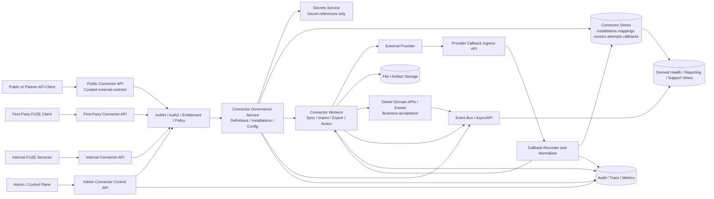
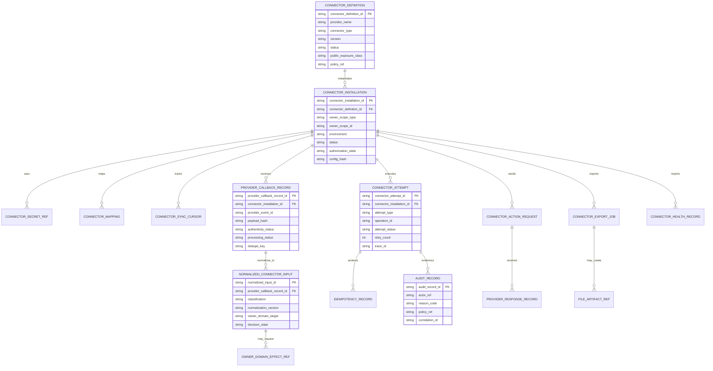
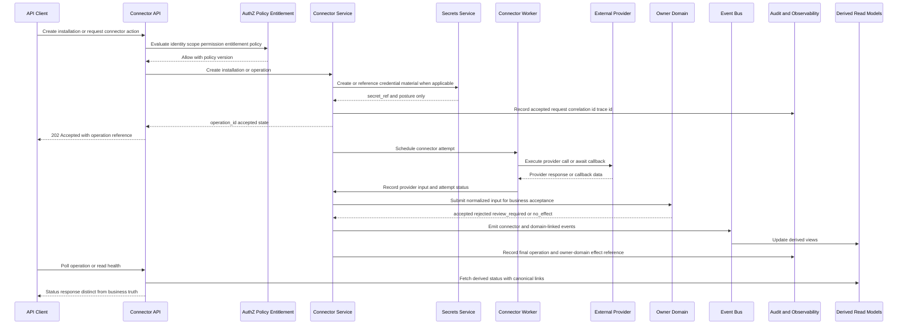

# FUZE Integration Connector Framework API Specification

## Document Metadata

- **Document Name:** `INTEGRATION_CONNECTOR_FRAMEWORK_API_SPEC.md`
- **Document Type:** FUZE API SPEC v2 / production-grade interface-contract specification
- **Status:** Draft production API specification
- **Version:** 2.0.0
- **Effective Date:** 2026-04-24
- **Last Updated:** 2026-04-24
- **Reviewed On:** 2026-04-24
- **Document Owner:** FUZE Platform Integration Architecture / Connector Governance Domain; named individual owner not explicitly specified in retrieved governing materials
- **Approval Authority:** FUZE Platform Architecture and Specification Governance Authority; formal named approver not yet specified
- **Review Cadence:** Quarterly and whenever provider portfolio, credential posture, callback routing, public or partner exposure, connector event contracts, security posture, data-handling obligations, workflow coupling, queue/runtime execution, or migration policy materially changes
- **Governing Layer:** API contract layer derived from the refined integration connector framework system specification
- **Parent Registry:** `API_SPEC_INDEX.md` / FUZE API SPEC v2 Canonical File Registry
- **Upstream Semantic Registry:** `REFINED_SYSTEM_SPEC_INDEX.md`
- **Upstream API Registry:** `API_SPEC_INDEX.md`
- **Primary Audience:** API platform engineers, integration engineers, backend engineers, workflow/runtime engineers, security engineers, data-governance engineers, public API authors, provider-adapter authors, control-plane implementers, QA/contract-test authors, SDK/OpenAPI/AsyncAPI authors, support tooling owners, and architecture reviewers
- **Primary Purpose:** Define the production API contract posture for FUZE connector definition, installation, authorization, callback ingress, provider normalization, connector actions, sync/import/export execution, health reporting, replay/remediation, and public/partner-safe connector exposure without redefining refined connector semantics or allowing provider state to become canonical FUZE business truth.
- **Primary Upstream References:** `REFINED_SYSTEM_SPEC_INDEX.md`; `API_SPEC_INDEX.md`; `DOCS_SPEC_INDEX.md`; `SYSTEM_SPEC_INDEX.md`; `INTEGRATION_CONNECTOR_FRAMEWORK_SPEC.md`; `API_ARCHITECTURE_SPEC.md`; `PUBLIC_API_SPEC.md`; `INTERNAL_SERVICE_API_SPEC.md`; `EVENT_MODEL_AND_WEBHOOK_SPEC.md`; `IDEMPOTENCY_AND_VERSIONING_SPEC.md`; `MIGRATION_AND_BACKWARD_COMPATIBILITY_SPEC.md`; `WORKFLOW_AND_AUTOMATION_SPEC.md`; `JOB_QUEUE_AND_WORKER_SPEC.md`; `AUTH_SESSION_AND_LINKED_LOGIN_SPEC.md`; `FUZE_PROVIDER_RESOLUTION_AND_LINKING_SPEC.md`; `WORKSPACE_AND_ORGANIZATION_SPEC.md`; `SCOPED_AUTHORIZATION_MODEL_SPEC.md`; `ACCESS_EVALUATION_AND_EFFECTIVE_PERMISSION_SPEC.md`; `ENTITLEMENT_AND_CAPABILITY_GATING_SPEC.md`; `SECURITY_AND_RISK_CONTROL_SPEC.md`; `SECRETS_CONFIG_AND_ENVIRONMENT_SPEC.md`; `AUDIT_LOG_AND_ACTIVITY_SPEC.md`; `AUDIT_AND_ACCESS_TRACEABILITY_SPEC.md`; `DATA_CLASSIFICATION_AND_HANDLING_SPEC.md`; `DATA_RETENTION_DELETION_AND_ARCHIVAL_SPEC.md`; `FILE_OBJECT_AND_ARTIFACT_STORAGE_SPEC.md`; `SEARCH_INDEXING_AND_DISCOVERY_SPEC.md`; `MONITORING_ALERTING_AND_INCIDENT_RESPONSE_SPEC.md`
- **Primary Downstream Dependents:** Connector-management OpenAPI contracts; provider-specific connector API contracts; provider webhook/callback contracts; connector event AsyncAPI artifacts; connector worker and sync/import/export implementation contracts; secrets and credential-rotation workflows; support/control-plane tooling; SDK surfaces for approved public connector management; migration plans for legacy product-local integrations
- **API Surface Families Covered:** First-party connector management APIs; internal service APIs; admin/control-plane APIs; provider callback ingress APIs; event/AsyncAPI surfaces; curated public or partner connector-management APIs where explicitly approved; reporting/read-model APIs for connector status and health; implementation-facing provider-adapter contracts
- **API Surface Families Excluded:** Unapproved raw provider pass-through APIs; generic provider SDK mirrors; product-local shadow integration APIs; provider-specific business-domain APIs not routed through connector governance; direct database/service shortcuts; public exposure of raw callback payloads or secret material
- **Canonical System Owner(s):** FUZE Platform Integration Architecture / Connector Governance Domain for connector framework semantics; owner domains retain final authority over business effects resulting from normalized connector input; security/secrets domains retain final authority over secret custody and trust controls; access/entitlement domains retain final authority over permission and capability gating
- **Canonical API Owner:** FUZE API Platform / Integration API Contract Domain
- **Supersedes:** Earlier or weaker API interpretations that expose providers directly, treat connector success as business success, use product-local credential or mapping APIs as canonical truth, permit raw callbacks to mutate domains directly, or blur internal/admin/public connector surfaces
- **Superseded By:** Not currently defined
- **Related Decision Records:** Not explicitly linked in retrieved governing materials
- **Canonical Status Note:** This API specification derives from the active refined integration connector framework system specification. It governs interface-contract expression only. It MUST NOT redefine connector truth classes, provider-boundary rules, owner-domain mutation authority, secret posture, access posture, or lifecycle meaning already owned by the refined system-spec layer.
- **Implementation Status:** Ready for downstream OpenAPI, AsyncAPI, provider-adapter, worker, storage, audit, and QA contract derivation
- **Approval Status:** Draft pending formal FUZE API governance approval
- **Change Summary:** Created API SPEC v2 contract for connector framework APIs, including surface-family boundaries, route families, request/response/error/status models, idempotency/replay posture, provider callback ingress, secret-by-reference requirements, normalized-input handling, admin remediation boundaries, event/webhook behavior, compatibility posture, diagrams, acceptance criteria, and test cases.

## Purpose

This specification defines the FUZE API contract for the integration connector framework.

It converts the refined connector framework semantics into implementation-usable API rules for:

1. connector definition discovery and governance;
2. connector installation, configuration, authorization, verification, reauthorization, pause/resume, quarantine, and retirement;
3. provider callback ingress and provider input recording;
4. normalization of provider input before domain effect;
5. connector action dispatch, polling, sync, import, export, and file-transfer execution;
6. connector health, attempt, cursor, mapping, and diagnostics reads;
7. control-plane repair, replay, requeue, rotation, revocation, and containment;
8. connector events and webhook-facing implications;
9. public or partner-safe connector-management exposure where approved; and
10. downstream OpenAPI, AsyncAPI, SDK, provider-adapter, and implementation-contract derivation.

This API spec does not own the semantic meaning of connectors. The refined integration connector framework system specification owns semantic truth. This API spec owns the interface-contract expression of that truth.

## Scope

This API specification governs API behavior for:

- connector definitions and supported provider/capability discovery;
- scope-bound connector installations;
- connector authorization initiation, callback completion, and reauthorization;
- connector configuration updates and verification;
- connector credential references and secret-state exposure boundaries;
- inbound provider callback ingress and raw-provider-input recording;
- normalized connector-input reads and owner-domain handoff references;
- connector outbound actions and accepted async operation contracts;
- connector sync/import/export jobs and attempts;
- connector mappings, cursors, health, diagnostics, and derived status read models;
- admin/control-plane repair, replay, quarantine, revoke, rotate, requeue, and retire APIs;
- connector lifecycle, health, attempt, mapping, callback, sync, export, and remediation events;
- public/partner-safe connector management surfaces where approved;
- compatibility, versioning, deprecation, and migration posture for connector APIs.

## Out of Scope

This API specification does not define:

- every provider-specific OAuth/OIDC/API-key/SFTP/webhook/file-transfer implementation detail;
- provider-specific field mapping tables;
- every domain-specific business consequence of normalized connector input;
- final database schema, physical queue topology, scheduler implementation, or worker autoscaling design;
- user-interface copy or installation wizard design;
- exact compliance-by-jurisdiction text for provider relationships;
- provider-specific SDK internals;
- machine-readable OpenAPI/AsyncAPI artifacts themselves;
- detailed runbook steps for incident response or provider outage response.

Those belong in provider-specific connector specs, implementation-contract specs, machine-readable API artifacts, security/runbook documents, and owner-domain specs, provided they remain consistent with this specification.

## Design Goals

1. Preserve the refined rule that raw provider input is never canonical FUZE business truth.
2. Provide durable API route families for connector definition, installation, callback, action, sync, export, health, diagnostics, and remediation flows.
3. Keep public, first-party, internal, admin/control-plane, event/webhook, reporting, and implementation-facing connector surfaces distinct.
4. Make idempotency, retry, replay, dedupe, and accepted-async behavior explicit for connector paths.
5. Ensure credential and secret material remains secret-by-reference and never ordinary API payload data.
6. Ensure connector APIs consume authentication, authorization, scope, entitlement, policy, data-classification, retention, audit, and security controls rather than redefining them.
7. Make provider callback ingress safe under duplicate, delayed, spoofed, malformed, or out-of-order provider behavior.
8. Provide a clear foundation for OpenAPI, AsyncAPI, SDK, contract-test, and provider-adapter derivation.
9. Prevent provider pass-through drift, product-local shadow connector APIs, and hidden broad-write internal APIs.
10. Provide testable API acceptance criteria and regression scenarios.

## Non-Goals

This API specification is not intended to:

- expose every provider capability as a FUZE public route;
- mirror provider APIs one-to-one;
- let connector workers bypass owner-domain APIs or events;
- let connector health substitute for owner-domain correctness;
- let provider authorization imply FUZE authorization, workspace membership, entitlement, or business acceptance;
- promise exactly-once delivery from providers, networks, queues, or webhooks;
- hide provider ambiguity behind success-shaped API responses;
- make reporting/projection APIs canonical mutation owners;
- merge connector lifecycle, workflow lifecycle, queue lifecycle, and owner-domain lifecycle into one state model.

## Core Principles

### 1. Refined-System Derivation Principle

Connector API contracts MUST derive from `INTEGRATION_CONNECTOR_FRAMEWORK_SPEC.md`. API convenience MUST NOT redefine connector meaning, truth classes, ownership boundaries, lifecycle posture, or conflict-resolution rules.

### 2. Provider-Boundary API Principle

Provider-facing ingress and egress APIs are boundary APIs. They MUST authenticate or validate provider signals where possible, record provider-input lineage, normalize input, and route business effects through owner-domain acceptance. Raw provider payload acceptance MUST NOT equal business-state mutation.

### 3. Owner-Domain Mutation Principle

Connector APIs may create connector framework records and may request connector work. They MUST NOT directly mutate owner-domain business state except through approved owner-domain APIs or event contracts.

### 4. Secret-by-Reference API Principle

Connector APIs MUST never expose access tokens, refresh tokens, signing secrets, API keys, or equivalent secret material as ordinary request or response fields. They MAY expose secret reference IDs, credential posture, rotation status, or verification status when authorized and safe.

### 5. Surface Separation Principle

Public/partner, first-party, internal, admin/control-plane, provider-callback, event/webhook, reporting, and implementation-facing connector APIs MUST be separated by route family, authority, authentication posture, authorization checks, payload exposure, compatibility guarantees, and audit requirements.

### 6. Accepted-State Explicitness Principle

Connector operations often require asynchronous execution. APIs MUST distinguish `accepted` or `scheduled` operation state from final provider success, final connector success, and final owner-domain effect.

### 7. Idempotency and Replay Principle

Mutation-capable connector APIs, provider callback handling, connector actions, imports, exports, sync continuations, credential rotations, replays, and admin remediations MUST be safe under duplicate submission, retry, replay, timeout, and partial failure.

### 8. Curated Public Exposure Principle

Approved public or partner connector APIs MUST expose stable FUZE connector abstractions, not raw provider-specific internals. Provider-specific data appears only through approved, normalized, public-safe fields.

### 9. Audit and Lineage Principle

Material connector API behavior MUST preserve initiator, service identity, connector installation, provider, owner scope, environment, correlation, trace, idempotency, policy, audit, attempt, mapping, callback, and owner-domain effect references where applicable.

### 10. Conservative Ambiguity Principle

When provider behavior is ambiguous, delayed, duplicated, inconsistent, downgraded, or unverifiable, connector APIs MUST prefer deny, quarantine, review, no-effect, or accepted-for-investigation over silent mutation.

## Canonical Definitions

- **Connector Definition:** Platform-governed metadata and policy describing a supported provider family, connector class, capabilities, configuration schema, exposure posture, supported scopes, and operational constraints.
- **Connector Installation:** A scope-bound instance of a connector definition for an account, workspace, organization, partner, product, or platform context.
- **Connector Authorization Flow:** The API-mediated process through which FUZE establishes provider authorization posture, credential references, callback endpoints, and verification state.
- **Connector Secret Reference:** A non-secret API-visible pointer to governed secret custody. It is not a secret value.
- **Provider Callback Record:** Durable record of provider-originated traffic before or during normalization. It is provider-input truth, not business truth.
- **Normalized Connector Input:** FUZE-interpretable provider input prepared for owner-domain decisioning.
- **Connector Action:** A governed outbound request from FUZE toward a provider.
- **Connector Attempt:** Runtime record for one callback processing, action, sync, import, export, verification, replay, or remediation attempt.
- **Connector Mapping:** Governed association between provider identifiers and FUZE-recognized entities or external-object references.
- **Connector Sync Cursor:** Durable checkpoint for incremental provider traversal.
- **Connector Health View:** Derived operational view summarizing connector installation state, degradation, reauthorization need, lag, error posture, or quarantine posture.
- **Connector Operation Reference:** API-visible reference for accepted asynchronous connector work.
- **Owner-Domain Effect Reference:** Reference to the downstream domain acceptance, rejection, correction, or no-effect result caused by normalized connector input.

## Truth Class Taxonomy

Connector APIs MUST preserve these truth classes:

1. **Semantic truth:** Owner-domain meaning of business effects; owned by the relevant domain, not the connector API.
2. **API contract truth:** Route family, request/response/error/status, compatibility, and surface-family obligations defined here and downstream OpenAPI/AsyncAPI artifacts.
3. **Policy truth:** Provider eligibility, capability posture, public exposure, scope, entitlement, data-handling, retry/replay, remediation, and connector approval rules.
4. **Runtime truth:** Callback processing, job status, attempt status, retry/backoff, timeout, and operation progress.
5. **Ledger/storage truth:** Durable connector definitions, installations, credential references, mappings, cursors, callback records, attempts, and audit-linked records.
6. **Provider-input truth:** Raw callbacks, provider response codes, fetched payloads, provider snapshots, provider IDs, and untrusted external signals.
7. **Event/async truth:** Accepted intent, emitted event facts, webhook delivery attempts, and async finalization results.
8. **Projection/reporting truth:** Dashboards, support summaries, health views, lag indicators, analytics, and operational reports.
9. **Presentation truth:** UI labels, installation prompts, warning text, and status badges.

These truth classes MUST NOT collapse. Provider success is not owner-domain acceptance. API acceptance is not final success. Health views are not canonical business truth. Secret references are not secret values.

## Architectural Position in the Spec Hierarchy

This API spec sits below `REFINED_SYSTEM_SPEC_INDEX.md` and `INTEGRATION_CONNECTOR_FRAMEWORK_SPEC.md`. It also depends on the shared API, event, idempotency, migration, security, access, entitlement, data, storage, and audit specifications.

It sits above downstream:

- connector OpenAPI contracts;
- provider-specific connector implementation contracts;
- connector callback contracts;
- connector AsyncAPI/event catalogs;
- connector worker/sync/import/export contracts;
- connector SDK surfaces;
- contract-test suites;
- support/admin tooling contracts.

Downstream layers MUST preserve this API spec. They MAY narrow or specialize behavior for provider-specific contracts but MUST NOT weaken provider-boundary normalization, owner-domain mutation, secret custody, audit, idempotency, security, or compatibility rules.

## Upstream Semantic Owners

- `INTEGRATION_CONNECTOR_FRAMEWORK_SPEC.md` owns connector framework semantics.
- `REFINED_SYSTEM_SPEC_INDEX.md` owns refined-library routing, activation, refined-over-legacy precedence, and downstream derivation rules.
- `API_ARCHITECTURE_SPEC.md` owns cross-API family posture.
- `PUBLIC_API_SPEC.md` owns external/public exposure posture.
- `INTERNAL_SERVICE_API_SPEC.md` owns service-to-service posture.
- `EVENT_MODEL_AND_WEBHOOK_SPEC.md` owns event and webhook semantics outside connector-specific provider-boundary handling.
- `IDEMPOTENCY_AND_VERSIONING_SPEC.md` owns shared idempotency and contract versioning posture.
- `MIGRATION_AND_BACKWARD_COMPATIBILITY_SPEC.md` owns migration, compatibility, deprecation, supersession, and rollout rules.
- `WORKFLOW_AND_AUTOMATION_SPEC.md` owns workflow meaning.
- `JOB_QUEUE_AND_WORKER_SPEC.md` owns queue/worker execution substrate semantics.
- `AUTH_SESSION_AND_LINKED_LOGIN_SPEC.md`, account/session canonical materials, and provider-resolution specs own identity, authentication, account-provider linkage, and session posture.
- `SCOPED_AUTHORIZATION_MODEL_SPEC.md`, `ACCESS_EVALUATION_AND_EFFECTIVE_PERMISSION_SPEC.md`, and workspace access-control materials own scope and permission evaluation.
- `ENTITLEMENT_AND_CAPABILITY_GATING_SPEC.md` owns capability eligibility.
- `SECURITY_AND_RISK_CONTROL_SPEC.md` and `SECRETS_CONFIG_AND_ENVIRONMENT_SPEC.md` own security and secret posture.
- `DATA_CLASSIFICATION_AND_HANDLING_SPEC.md`, `DATA_RETENTION_DELETION_AND_ARCHIVAL_SPEC.md`, `FILE_OBJECT_AND_ARTIFACT_STORAGE_SPEC.md`, and `SEARCH_INDEXING_AND_DISCOVERY_SPEC.md` own data-handling, lifecycle, storage, and discovery posture.

## API Surface Families

### Public / Partner API Surface

Public or partner connector APIs MAY expose:

- approved connector definition catalog reads;
- connector installation summary reads;
- install/initiate/authorize flows for approved connector classes;
- configuration update surfaces for explicitly supported provider-safe fields;
- reauthorization initiation;
- connectivity verification status;
- approved sync or export request initiation;
- connector health summaries;
- approved operation status reads.

Public or partner APIs MUST NOT expose raw provider callback payloads, secret values, internal attempt internals, unapproved provider-specific fields, internal replay controls, broad diagnostic logs, hidden mapping repair tools, or admin containment controls.

### First-Party Application API Surface

First-party APIs MAY support richer installation UX, guided configuration, provider authorization handoff, status display, approved operation initiation, and support-safe diagnostics. They MUST still enforce scope, permission, entitlement, data-classification, and secret-boundary rules.

### Internal Service API Surface

Internal APIs MAY support normalized input handoff, owner-domain effect requests, service-to-service connector actions, sync scheduling, worker coordination, event emission, and read-model updates. Internal APIs MUST NOT become hidden broad-write shortcuts that bypass owner-domain APIs or events.

### Admin / Control-Plane API Surface

Admin/control APIs MAY support pause, resume, quarantine, unquarantine, rotate, revoke, repair, replay, requeue, retire, cursor correction, mapping correction, diagnostic bundle creation, and incident containment. These APIs MUST be separated from ordinary application APIs, strongly authorized, reason-coded, policy-referenced, audited, and monitored.

### Provider Callback / Ingress API Surface

Provider ingress APIs receive callbacks or provider-delivered events. They MUST authenticate/validate origin where possible, verify environment and route eligibility, record provider-input lineage, dedupe/replay-protect, normalize input, and prevent direct owner-domain mutation.

### Event / Webhook / Async API Surface

Connector APIs SHOULD emit events for material lifecycle, authorization, callback, action, sync, export, health, quarantine, reauthorization, replay, and retirement transitions. Connector-originated public webhooks require explicit public-contract approval and MUST expose only curated, normalized payloads.

### Reporting / Read-Model API Surface

Reporting APIs MAY expose connector health, lag, attempts, sync status, export history, and operational summaries. They are derived and MUST NOT become mutation owners.

### Implementation-Facing Provider Adapter Surface

Provider-adapter contracts MAY specify provider-specific transport, mapping, signature, pagination, retry, and transformation behavior. They are implementation-facing and MUST preserve the canonical connector API model.

## System / API Boundaries

Connector API boundaries are defined as follows:

- The connector framework API owns connector contract expression, not provider truth or business-domain truth.
- Provider systems remain outside FUZE trust boundaries.
- Connector installation APIs own connector installation state, not workspace membership or entitlement truth.
- Connector authorization APIs own provider authorization posture, not user authentication or account identity.
- Connector callback APIs own provider-input recording and normalization pathways, not final domain mutation.
- Connector action APIs own outbound action request and operation state, not final provider or domain result.
- Connector read APIs expose canonical connector records or derived connector views only within their declared truth class.
- Admin connector APIs own bounded remediation mechanisms, not underlying business meaning.
- Event APIs publish facts or accepted intents but do not create new semantic ownership.

## Adjacent API Boundaries

- **Public API:** Owns generic public API governance; connector APIs may expose approved public connector abstractions only.
- **Internal Service API:** Owns internal service invocation; connector APIs use it for owner-domain effect and runtime coordination.
- **Event Model / Webhook:** Owns event delivery and webhook posture; connector APIs publish connector-specific events and consume provider callbacks under connector-specific ingress rules.
- **Idempotency / Versioning:** Owns idempotency keys, dedupe windows, replay semantics, compatibility posture, and contract evolution rules applied by this spec.
- **Migration / Backward Compatibility:** Owns deprecation/sunset/migration posture for legacy connector APIs and provider capability changes.
- **Workflow / Automation:** Owns workflow state; connectors may trigger workflows but do not own workflow progression.
- **Job Queue / Worker:** Owns queue execution; connector APIs may create jobs but queue state is runtime truth.
- **Data / Storage / Search:** Own handling, lifecycle, storage lineage, file custody, and index exposure for connector-originated data.

## Conflict Resolution Rules

When connector API contract rules appear to conflict, FUZE MUST resolve them in this order:

1. `REFINED_SYSTEM_SPEC_INDEX.md` wins on refined source-of-truth routing and refined-over-legacy precedence.
2. Higher-order platform boundary and ownership specs win on platform-wide ownership and truth boundaries.
3. `INTEGRATION_CONNECTOR_FRAMEWORK_SPEC.md` wins on connector semantics.
4. Owner-domain refined specs win on final business meaning and canonical domain mutation.
5. Security, secrets, access, entitlement, data-classification, retention, storage, and audit specs win where they impose stricter constraints.
6. API architecture, public API, internal API, event/webhook, idempotency/versioning, and migration specs win on cross-cutting API family posture outside connector-specific scope.
7. This API spec wins on connector API route-family, request/response/error/status, and interface-contract expression where it does not contradict upstream semantics.
8. Provider-specific implementation contracts may narrow but MUST NOT weaken these rules.
9. If ambiguity remains, FUZE MUST choose the more conservative architecture-consistent behavior and require explicit review.

## Default Decision Rules

1. Provider input defaults to non-canonical until normalized and owner-domain accepted.
2. Connector capabilities default to internal and scope-bound unless explicit public/partner exposure is approved.
3. Mutating connector routes default to idempotency-required.
4. Async connector operations default to `202 Accepted` with operation reference, not final success.
5. Unknown or unverifiable callbacks default to deny, quarantine, or review-required.
6. Secret material defaults to non-returnable and non-loggable.
7. Connector installation defaults to least-privilege, one owning scope, and explicit environment binding.
8. Export/import defaults to classification-aware, retention-aware, and audit-linked handling.
9. Admin remediation defaults to reason-coded, policy-referenced, high-audit posture.
10. Provider-specific fields default to private/internal unless normalized and approved for exposure.

## Roles / Actors / API Consumers

- **End User:** May initiate approved personal-scope connector flows.
- **Workspace Admin / Owner:** May manage workspace-scoped connector installations within permission and entitlement constraints.
- **Organization Admin:** May manage organization-scoped connector posture where organization semantics exist.
- **Partner Integration Owner:** May manage partner-approved connectors under partner contract posture.
- **First-Party Client:** Provides installation, configuration, authorization, status, and remediation UI within approved scope.
- **Public API Client:** Uses approved stable connector abstractions only.
- **Internal Service:** Requests connector work, consumes normalized input, emits/consumes events, and coordinates owner-domain effects.
- **Connector Worker:** Executes sync, callback processing, outbound actions, import/export, verification, and retry work.
- **Provider:** Sends callbacks and receives outbound connector actions, but remains outside FUZE trust.
- **Support Operator:** Views support-safe summaries and may initiate limited remediation where authorized.
- **Security / Platform Operator:** Executes quarantine, revocation, rotation, containment, replay, and emergency actions under high-audit controls.
- **Audit / Monitoring System:** Consumes events, logs, traces, metrics, and immutable evidence.

## Resource / Entity Families

Canonical connector API resources include:

- `connector_definition`
- `connector_installation`
- `connector_authorization_session`
- `connector_secret_ref`
- `connector_configuration`
- `connector_capability`
- `connector_mapping`
- `connector_sync_cursor`
- `provider_callback_record`
- `normalized_connector_input`
- `connector_action_request`
- `connector_attempt`
- `connector_operation`
- `connector_export_job`
- `connector_import_batch`
- `connector_health_record`
- `connector_diagnostic_bundle`
- `connector_remediation_action`
- `connector_event`
- `connector_public_summary` derived

## Ownership Model

### Connector Governance Domain Owns

- connector definition catalog semantics;
- connector installation lifecycle;
- connector capability and exposure posture;
- connector configuration contract posture;
- callback ingress posture;
- normalized connector-input framework;
- connector action and runtime-attempt contract semantics;
- connector mapping, cursor, health, and remediation contract posture.

### Owner Domains Own

- whether normalized connector input changes canonical business state;
- business validation and conflict resolution for affected entities;
- correction/supersession of domain facts caused by connector interpretation changes;
- domain event facts created after owner-domain acceptance.

### Security / Secrets Domains Own

- secret custody, secret references, rotation, revocation, environment posture, callback trust, destination restrictions, and containment controls.

### Access / Entitlement Domains Own

- whether a caller or service may install, configure, use, export from, replay, or remediate a connector;
- connector availability by plan, capability, rollout, workspace, product, partner, or policy.

### Reporting / Projection Domains Do Not Own

- connector semantic truth;
- provider input truth;
- owner-domain business truth;
- mutation authority.

## Authority / Decision Model

API decisions MUST follow this authority model:

1. **Connector API Contract Authority** controls route-family shape, request/response envelopes, error/status classes, surface separation, idempotency contract application, and compatibility posture for connector APIs.
2. **Connector Governance Authority** controls connector taxonomy, installation semantics, provider-boundary normalization, and connector lifecycle semantics.
3. **Owner-Domain Authority** controls final business effect acceptance and rejection.
4. **Security Authority** controls secret exposure, trust validation, destination safety, abuse response, and emergency containment.
5. **Access/Entitlement Authority** controls caller eligibility and capability gating.
6. **Control-Plane Authority** controls bounded remediation without becoming semantic owner.
7. **Provider Authority** applies only inside provider systems; FUZE decides FUZE consequences.

## Authentication Model

Connector APIs MUST require authentication appropriate to surface:

- Public/partner APIs require authenticated API clients or OAuth/client credentials with approved scopes.
- First-party APIs require authenticated FUZE user/session posture plus scope context.
- Internal APIs require authenticated service identity and mutual trust posture.
- Admin/control APIs require privileged operator identity, step-up where applicable, and policy-bound authorization.
- Provider callback ingress requires provider-origin authenticity validation where provider supports it, such as signatures, shared secrets, mTLS, callback URL binding, provider event IDs, replay windows, allowlists, or equivalent controls.

Authentication alone MUST NOT imply authorization, connector use eligibility, entitlement, workspace membership, or owner-domain acceptance.

## Authorization / Scope / Permission Model

Connector APIs MUST evaluate:

- authenticated actor or service identity;
- owner scope type and ID;
- requested connector definition and capability;
- route-family authority;
- operation sensitivity;
- permission, role, and effective access;
- policy version;
- environment;
- data classification;
- entitlement/capability gating;
- provider-specific risk posture;
- admin/control-plane privilege and reason code where applicable.

Viewing a connector installation MUST NOT imply authority to configure, rotate, export, replay, retire, or inspect raw diagnostics. Authorization MUST be re-evaluated for each material action.

## Entitlement / Capability-Gating Model

Entitlement may gate:

- connector availability;
- provider class;
- number of installations;
- sync frequency;
- export capability;
- automation trigger capability;
- premium provider features;
- diagnostic depth;
- public API access;
- partner API access.

Successful provider authorization MUST NOT imply FUZE entitlement. Entitlement denial MUST produce explicit API errors and MUST NOT silently downgrade into partial hidden behavior unless a documented degraded-mode contract exists.

## API State Model

### Connector Definition State

Allowed states SHOULD include:

- `draft`
- `approved`
- `restricted`
- `deprecated`
- `retired`

### Connector Installation State

Allowed states SHOULD include:

- `pending_configuration`
- `pending_authorization`
- `verifying`
- `active`
- `degraded`
- `paused`
- `reauthorization_required`
- `quarantined`
- `retiring`
- `retired`

### Connector Authorization State

Allowed states SHOULD include:

- `not_started`
- `authorization_url_issued`
- `provider_callback_received`
- `credential_exchange_pending`
- `secret_ref_created`
- `verification_pending`
- `authorized`
- `failed`
- `expired`
- `revoked`

### Connector Operation / Attempt State

Allowed states SHOULD include:

- `accepted`
- `queued`
- `in_progress`
- `waiting_on_provider`
- `retry_scheduled`
- `succeeded`
- `partially_succeeded`
- `failed_retryable`
- `failed_terminal`
- `quarantined`
- `canceled`

### Callback Processing State

Allowed states SHOULD include:

- `received`
- `authenticity_failed`
- `duplicate_detected`
- `recorded`
- `normalization_pending`
- `normalized`
- `owner_domain_pending`
- `owner_domain_accepted`
- `owner_domain_rejected`
- `quarantined`
- `failed_terminal`

State transitions MUST be explicit, auditable, and deterministic. Critical lifecycle state MUST NOT be represented solely by ambiguous booleans.

## Lifecycle / Workflow Model

1. Connector definition is approved and versioned.
2. Caller discovers eligible definitions for a scope.
3. Caller creates a connector installation or starts an installation operation.
4. API validates authentication, authorization, entitlement, scope, environment, connector availability, and data-handling posture.
5. API creates or updates connector installation state and returns an operation or authorization reference.
6. Authorization proceeds through provider flow; secret material is stored by reference.
7. Verification determines readiness without exposing secrets.
8. Installation becomes active or enters failure/degraded/reauthorization-required state.
9. Runtime operations process callbacks, syncs, imports, exports, actions, and file transfers under idempotency and audit posture.
10. Normalized connector input is handed to owner domains for business effect where applicable.
11. Events and derived read models update after canonical state transitions.
12. Failures are retried, quarantined, remediated, or terminally failed according to policy.
13. Admin/control-plane actions may repair, replay, requeue, pause, rotate, revoke, quarantine, or retire installations.
14. Retirement preserves historical lineage and compatibility obligations.

## Architecture Diagram — Mermaid flowchart

## Data Design — Mermaid Diagram

## Flow View

### Installation and Authorization Flow

1. Client requests eligible connector definitions for a scope.
2. API filters by authorization, entitlement, rollout, provider class, environment, and public exposure posture.
3. Client creates an installation with `connector_definition_id`, scope, environment, and configuration values.
4. API validates schema, policy, data classification, and permission.
5. API creates `connector_installation` in `pending_authorization` or `pending_configuration` state.
6. API returns `201 Created` or `202 Accepted` with installation ID, operation ID, and authorization instructions.
7. Provider authorization completes through a callback or token exchange; secrets are stored by reference.
8. API verifies connectivity and updates installation state to `active`, `degraded`, or `reauthorization_required`.
9. Events and audit records are emitted.

### Provider Callback Flow

1. Provider calls the callback ingress endpoint.
2. Callback API verifies route, connector, environment, authenticity proof, timestamp, and replay/dedupe posture.
3. Callback record is stored with payload hash and trace/correlation references.
4. Duplicate callbacks return a safe duplicate/accepted response without duplicate business effect.
5. Normalizer transforms provider input into FUZE normalized connector input.
6. Owner-domain API or event receives the normalized input where business effect is requested.
7. Owner domain accepts, rejects, quarantines, or requests review.
8. Connector attempt, callback state, audit, events, metrics, and derived views update.

### Outbound Action / Sync / Import / Export Flow

1. Caller requests action, sync, import, or export.
2. API validates identity, scope, permission, entitlement, policy, data classification, idempotency key, and connector state.
3. API creates operation and attempt records.
4. Worker executes provider call, polling, file retrieval, or export under retry/backoff and rate-limit policy.
5. Provider response is recorded as provider-input truth.
6. Any domain effect is routed through owner-domain acceptance.
7. Operation finalizes as succeeded, partially succeeded, retry scheduled, review required, failed terminal, or quarantined.
8. Derived health/reporting views update asynchronously.

### Admin Remediation Flow

1. Authorized operator initiates pause, quarantine, rotate, revoke, replay, requeue, cursor repair, mapping correction, or retirement.
2. API requires reason code, policy reference, scope, target, expected current state, and idempotency key where applicable.
3. API validates high-privilege authorization and risk policy.
4. API records remediation action and updates connector state or schedules remediation worker.
5. Events, audit, metrics, and support-safe views update.
6. Owner-domain effects, if any, remain owner-domain decisions.

### Degraded / Failure Flow

1. Provider outage, invalid payload, expired credential, rate limit, mapping conflict, or policy denial occurs.
2. API/worker classifies error as retryable, terminal, review required, reauthorization required, throttled, or quarantined.
3. API exposes explicit status rather than false success.
4. Retry/replay follows idempotency and policy posture.
5. Severe trust, abuse, or compromise signals trigger quarantine or containment.

## Data Flows — Mermaid sequenceDiagram

## Request Model

All connector API requests MUST use stable envelopes appropriate to their surface and MUST include or derive:

- `request_id` where accepted by API infrastructure;
- `idempotency_key` for mutation-capable and material effect routes;
- `correlation_id` and `trace_context` where available;
- authenticated actor or service identity;
- `owner_scope_type` and `owner_scope_id` when scope-bound;
- `environment`;
- `connector_definition_id` or `connector_installation_id`;
- route-specific requested capability;
- policy-relevant fields such as `reason_code`, `policy_ref`, `expected_state`, or `dry_run` where applicable;
- explicit payload version for provider-specific or normalized payload contracts;
- data-classification hints where imported/exported data requires handling posture.

### Installation Create Request Requirements

A create-installation request MUST include:

- `connector_definition_id`;
- `owner_scope_type`;
- `owner_scope_id`;
- `environment`;
- configuration object limited to approved fields;
- requested capabilities if narrower than connector default;
- idempotency key;
- client-visible redirect/callback hints where public/first-party flows require them.

It MUST NOT include secret values except through a dedicated secure credential establishment flow that writes directly to governed secret custody and returns only a reference/status.

### Configuration Update Request Requirements

Configuration updates MUST include:

- target installation;
- config patch or full replacement with schema version;
- expected current version or ETag equivalent;
- idempotency key for material changes;
- reason code for sensitive changes;
- explicit handling for validation-only / dry-run where supported.

### Callback Ingress Request Requirements

Provider callback ingress MUST include or derive:

- installation or connector route binding;
- provider event identifier where provided;
- timestamp where provided;
- signature/proof headers where supported;
- raw payload hash;
- environment;
- source network/protocol metadata where safe;
- dedupe key;
- correlation/trace context generated by FUZE if absent.

### Admin Remediation Request Requirements

Admin actions MUST include:

- target connector resource;
- action type;
- reason code;
- policy reference;
- expected current state;
- idempotency key;
- scope and environment;
- optional dry-run flag;
- remediation payload bounded to the action family.

## Response Model

Connector APIs MUST distinguish:

- `200 OK` for successful read or synchronous safe validation;
- `201 Created` for synchronously created canonical connector records;
- `202 Accepted` for accepted async operations;
- `204 No Content` for completed state transitions where no body is needed;
- `207 Multi-Status` or equivalent structured partial result only where contract-approved for bulk import/export or diagnostic use;
- `4xx` for caller, authorization, validation, policy, conflict, rate-limit, or idempotency errors;
- `5xx` only for FUZE-side unexpected or unavailable conditions;
- provider failure classes as structured connector errors, not raw unbounded provider response bodies.

### Standard Response Fields

Responses SHOULD include:

- `resource_id` or `operation_id`;
- `status`;
- `state`;
- `status_reason`;
- `connector_installation_id` where applicable;
- `connector_definition_id` where applicable;
- `owner_scope_ref`;
- `environment`;
- `operation_ref` for async work;
- `attempt_ref` where safe;
- `idempotency_ref` where applicable;
- `correlation_id`;
- `trace_id`;
- `policy_ref` where material;
- `links` to safe related resources;
- `warnings` for degraded, lagging, or partial states.

Responses MUST NOT expose raw secrets, unsafe raw provider payloads, internal-only provider diagnostics, or unapproved mapping internals.

## Error / Result / Status Model

Connector APIs MUST provide typed error classes. Required error families include:

- `authentication_required`
- `authorization_denied`
- `scope_not_allowed`
- `entitlement_required`
- `connector_definition_not_found`
- `connector_definition_unavailable`
- `connector_installation_not_found`
- `connector_state_conflict`
- `invalid_connector_configuration`
- `credential_establishment_failed`
- `reauthorization_required`
- `provider_authenticity_failed`
- `provider_callback_duplicate`
- `provider_callback_malformed`
- `provider_callback_expired`
- `provider_rate_limited`
- `provider_unavailable`
- `provider_response_ambiguous`
- `mapping_conflict`
- `normalization_failed`
- `owner_domain_rejected`
- `policy_denied`
- `classification_denied`
- `retention_policy_denied`
- `export_not_allowed`
- `idempotency_key_missing`
- `idempotency_replay_conflict`
- `version_unsupported`
- `migration_required`
- `quarantined`
- `operation_not_replayable`
- `admin_reason_required`
- `rate_limit_exceeded`

### Status Semantics

- `accepted` means the request was accepted for processing; it does not mean provider success or business success.
- `succeeded` means the connector operation completed according to connector rules; it does not necessarily mean owner-domain mutation occurred unless `owner_domain_effect_ref` says so.
- `partially_succeeded` requires structured sub-results and explicit retry/reconciliation posture.
- `owner_domain_rejected` is a valid final state and MUST NOT be disguised as connector failure unless the connector contract failed.
- `quarantined` means ordinary execution is blocked pending review or remediation.

## Idempotency / Retry / Replay Model

Idempotency keys are REQUIRED for:

- create installation;
- update configuration when material;
- initiate authorization or reauthorization when material;
- verify connectivity where provider side effects are possible;
- rotate/revoke credentials;
- pause/resume/quarantine/unquarantine/retire;
- request connector action;
- request sync/import/export;
- replay/requeue/repair;
- mapping correction;
- callback processing where provider event IDs or payload hashes are available.

### Idempotency Rules

1. A repeated request with the same idempotency key and semantically equivalent body MUST return the original result or current operation state.
2. A repeated request with the same key and conflicting body MUST return `idempotency_replay_conflict`.
3. Idempotency scope MUST include route family, owner scope, connector installation, environment, actor/service identity where appropriate, and action type.
4. Provider duplicate callback delivery MUST NOT create duplicate owner-domain effect.
5. Replay APIs MUST only replay eligible operations and MUST preserve original lineage plus replay lineage.
6. Retried provider actions MUST be safe under provider uncertainty; if provider action outcome is unknown, API MUST expose reconciliation posture rather than pretending success.

## Rate Limit / Abuse-Control Model

Connector APIs MUST enforce rate limits and abuse controls across:

- public/partner connector APIs;
- authorization initiation and reauthorization flows;
- provider callback ingress;
- sync/import/export actions;
- outbound provider actions;
- diagnostic bundle creation;
- admin replay/requeue/repair operations;
- failed credential attempts;
- high-volume provider event storms;
- bulk file imports/exports;
- sensitive domains such as payment, identity, access, billing, credits, payouts, governance, and treasury.

Rate-limit responses MUST distinguish caller throttling, provider throttling, connector worker throttling, and policy throttling where material.

## Endpoint / Route Family Model

Exact route paths belong to downstream OpenAPI artifacts, but route families MUST preserve these distinctions.

### Connector Definition Routes

- `GET /connector-definitions`
- `GET /connector-definitions/{connector_definition_id}`
- `GET /connector-definitions/{connector_definition_id}/capabilities`
- `GET /connector-definitions/{connector_definition_id}/configuration-schema`

Public variants MUST return only approved public fields.

### Connector Installation Routes

- `POST /connector-installations`
- `GET /connector-installations`
- `GET /connector-installations/{connector_installation_id}`
- `PATCH /connector-installations/{connector_installation_id}/configuration`
- `POST /connector-installations/{connector_installation_id}/verify`
- `POST /connector-installations/{connector_installation_id}/pause`
- `POST /connector-installations/{connector_installation_id}/resume`
- `POST /connector-installations/{connector_installation_id}/retire`

### Authorization / Credential Posture Routes

- `POST /connector-installations/{connector_installation_id}/authorization-sessions`
- `GET /connector-installations/{connector_installation_id}/authorization-state`
- `POST /connector-installations/{connector_installation_id}/reauthorize`
- `POST /connector-installations/{connector_installation_id}/credentials/rotate`
- `POST /connector-installations/{connector_installation_id}/credentials/revoke`

Secret values MUST NOT be returned.

### Provider Callback Routes

- `POST /provider-callbacks/{provider_or_connector_route}`
- `GET /connector-installations/{connector_installation_id}/callbacks/{provider_callback_record_id}` internal/admin only

Callback routes MUST be provider-boundary ingress, not public business mutation APIs.

### Connector Action / Sync / Import / Export Routes

- `POST /connector-installations/{connector_installation_id}/actions`
- `POST /connector-installations/{connector_installation_id}/syncs`
- `POST /connector-installations/{connector_installation_id}/imports`
- `POST /connector-installations/{connector_installation_id}/exports`
- `GET /connector-operations/{operation_id}`
- `GET /connector-installations/{connector_installation_id}/attempts`
- `GET /connector-installations/{connector_installation_id}/sync-cursors` internal/admin only unless safely summarized

### Mapping and Normalization Routes

- `GET /connector-installations/{connector_installation_id}/mappings`
- `POST /connector-installations/{connector_installation_id}/mappings:resolve` internal/admin or approved owner-domain flow
- `POST /connector-installations/{connector_installation_id}/mappings:correct` admin/control or owner-approved flow
- `GET /normalized-connector-inputs/{normalized_input_id}` internal/owner-domain/admin only unless safe public summary is approved

### Health / Reporting Routes

- `GET /connector-installations/{connector_installation_id}/health`
- `GET /connector-installations/{connector_installation_id}/status-history`
- `GET /connector-installations/{connector_installation_id}/exports`
- `GET /connector-installations/{connector_installation_id}/sync-status`

These are derived or mixed canonical/derived reads and MUST label lag or projection status.

### Admin / Control-Plane Routes

- `POST /admin/connector-installations/{connector_installation_id}/quarantine`
- `POST /admin/connector-installations/{connector_installation_id}/unquarantine`
- `POST /admin/connector-installations/{connector_installation_id}/replay`
- `POST /admin/connector-installations/{connector_installation_id}/requeue`
- `POST /admin/connector-installations/{connector_installation_id}/repair-cursor`
- `POST /admin/connector-installations/{connector_installation_id}/repair-mapping`
- `POST /admin/connector-installations/{connector_installation_id}/diagnostic-bundles`

Admin routes MUST be separated from ordinary APIs, reason-coded, policy-referenced, and high-audit.

## Public API Considerations

Public connector APIs MUST:

- expose only approved connector abstractions;
- avoid raw provider payloads, secrets, internal attempts, internal mappings, and unsafe diagnostics;
- preserve stable versioned contracts;
- return operation references for async work;
- enforce scope, entitlement, data classification, and rate-limit posture;
- provide safe error classes rather than raw provider errors;
- avoid promising provider availability or exactly-once behavior;
- document accepted-state versus final outcome semantics;
- support compatibility and deprecation windows according to migration governance.

## First-Party Application API Considerations

First-party APIs MAY expose richer UX-supporting details such as setup steps, required configuration fields, reauthorization prompts, health warnings, support-safe diagnostics, and remediation suggestions. They MUST still avoid secrets, raw unsafe payloads, unapproved provider fields, and admin-only capabilities.

## Internal Service API Considerations

Internal connector APIs MUST:

- use service identity and service scopes;
- avoid hidden broad writes;
- hand owner-domain changes to owner-domain APIs/events;
- preserve idempotency, trace, correlation, operation, attempt, and audit references;
- distinguish connector runtime state from owner-domain state;
- enforce data-handling and secret boundaries even inside service mesh.

## Admin / Control-Plane API Considerations

Admin/control-plane connector APIs MUST:

- require privileged identity and high-assurance authorization;
- include reason codes and policy references;
- record before/after state and target identifiers;
- support dry-run where destructive or high-risk;
- enforce expected-current-state checks;
- emit high-signal audit events;
- preserve historical lineage;
- avoid becoming ordinary self-service shortcuts.

## Event / Webhook / Async API Considerations

Connector event families SHOULD include:

- `connector.definition.approved`
- `connector.definition.deprecated`
- `connector.installation.created`
- `connector.installation.authorized`
- `connector.installation.active`
- `connector.installation.degraded`
- `connector.installation.reauthorization_required`
- `connector.installation.paused`
- `connector.installation.quarantined`
- `connector.installation.retired`
- `connector.callback.received`
- `connector.callback.normalized`
- `connector.callback.quarantined`
- `connector.action.accepted`
- `connector.action.completed`
- `connector.action.failed`
- `connector.sync.started`
- `connector.sync.completed`
- `connector.sync.failed`
- `connector.export.requested`
- `connector.export.completed`
- `connector.mapping.corrected`
- `connector.credentials.rotated`
- `connector.credentials.revoked`
- `connector.replay.requested`
- `connector.remediation.completed`

Events MUST identify connector installation, owner scope, environment, operation/attempt, correlation/trace, policy/audit references, and safe status classes. Public webhooks derived from connector events require explicit public-contract approval and payload curation.

## Chain-Adjacent API Considerations

Where connectors observe chain-adjacent providers, explorers, indexers, wallets, custody systems, or settlement-related providers:

- provider observations remain provider-input truth until accepted by the rightful owner domain;
- chain-native truth remains governed by chain-specific specs;
- connector APIs MUST NOT make chain observations canonical merely because a provider reported them;
- financial, payout, treasury, governance, or wallet-related connector actions require stricter policy, audit, idempotency, and reconciliation posture.

## Data Model / Storage Support Implications

Implementations MUST support durable records for:

- connector definitions;
- connector installations;
- connector secret references;
- connector configuration versions;
- connector mappings;
- connector sync cursors;
- provider callback records;
- normalized connector input records;
- connector actions and attempts;
- operation records;
- idempotency records;
- export/import records;
- health records;
- audit records;
- diagnostic bundles;
- derived read-model records.

Storage MUST preserve lineage from API request to connector installation to provider input/action to normalized input to owner-domain effect where applicable.

## Read Model / Projection / Reporting Rules

Connector read models MUST:

- state whether a field is canonical connector data, derived health data, lagging projection, provider-input-derived, support-only, or presentation-only;
- link derived status back to canonical connector installation, attempt, callback, operation, or audit records;
- mark stale/lagging data explicitly;
- avoid exposing raw provider internals publicly;
- avoid mutating canonical connector records directly from projection APIs;
- respect data classification, retention, suppression, export, and deletion policies;
- distinguish connector health from business-domain correctness.

## Security / Risk / Privacy Controls

Connector APIs MUST enforce:

- least-privilege connector capability scopes;
- secret-by-reference only;
- callback authenticity validation where supported;
- environment isolation;
- destination and callback allowlisting where applicable;
- replay resistance;
- provider-rate-limit safety;
- abuse controls for exports, destructive actions, sync storms, and credential retries;
- malware/content safety scanning for imported files where required;
- data classification propagation;
- sensitive domain escalation;
- containment and quarantine controls;
- no secret values in logs, analytics, traces, errors, or responses;
- strict access for raw callback diagnostics and diagnostic bundles.

## Audit / Traceability / Observability Requirements

Material connector API actions MUST preserve:

- actor or service identity;
- route family and surface family;
- owner scope;
- connector definition and installation IDs;
- environment;
- provider reference;
- idempotency key/reference;
- operation and attempt IDs;
- correlation and trace IDs;
- policy and authorization result references;
- entitlement decision where material;
- callback authenticity result;
- provider response class;
- normalized input reference;
- owner-domain effect reference;
- reason code for admin/sensitive actions;
- before/after state for material transitions;
- error/status class;
- metric dimensions for health, lag, retry, replay, rate limit, and degradation.

## Failure Handling / Edge Cases

### Duplicate Provider Callback

API MUST dedupe by provider event ID, payload hash, route, installation, timestamp window, or provider-specific dedupe rules. Duplicate delivery MUST NOT create duplicate owner-domain effect.

### Callback Fails Authenticity

API MUST reject, quarantine, or record as authenticity failed according to policy. It MUST NOT proceed to owner-domain mutation.

### Callback Arrives Before Mapping Exists

API MUST hold, quarantine, or route to approved provisional mapping/review. It MUST NOT guess silently.

### Provider Returns Success But Owner Domain Rejects

API MUST expose provider success and owner-domain rejection as distinct outcomes.

### Credential Expires Mid-Sync

API MUST transition to `reauthorization_required` or `degraded`, preserve partial progress and cursor posture, and avoid false completion.

### Provider Rate Limit

API MUST classify provider throttling distinctly from FUZE caller throttling and schedule retry/backoff where allowed.

### Partial Export

API MUST return structured partial result, operation state, retry posture, and audit lineage. It MUST NOT expose unclassified partial artifacts.

### Mapping Corruption

API MUST support correction/supersession lineage and avoid silent overwrite.

### Scope Permission Revoked

API MUST block further connector execution or reduce capability according to policy while preserving history.

### Provider Compromise Suspected

API MUST support quarantine, callback rejection, credential revocation/rotation, diagnostic preservation, and incident traceability.

### Legacy Product-Local Connector Migrated

API MUST preserve lineage and compatibility only as approved. Product-local credentials or mappings must not remain canonical.

## Migration / Versioning / Compatibility / Deprecation Rules

1. Connector API versions MUST preserve refined connector semantics.
2. Provider-specific contract versions MAY evolve independently but MUST remain mapped to stable FUZE connector abstractions.
3. Deprecated connector definitions MUST expose deprecation and sunset posture explicitly.
4. Public/partner APIs require stronger compatibility guarantees than internal/admin APIs.
5. Migration from legacy product-local connectors MUST create explicit installation, mapping, secret-reference, and audit lineage.
6. Temporary compatibility aliases MUST not become new canonical route families.
7. Removed provider capabilities MUST produce explicit version/deprecation/policy errors rather than silent no-op behavior.
8. Contract-breaking changes require migration plan, versioned schema, compatibility window, and test coverage.

## OpenAPI / AsyncAPI / SDK Derivation Rules

OpenAPI artifacts derived from this spec MUST:

- preserve surface-family tags;
- mark public/internal/admin/provider-callback/reporting routes distinctly;
- include idempotency header requirements on protected routes;
- model accepted async operation responses explicitly;
- include typed error classes;
- prevent secret values from appearing in schemas;
- mark derived views and lag fields;
- include compatibility/version metadata;
- include correlation/trace response fields;
- include security schemes per surface.

AsyncAPI artifacts MUST:

- distinguish connector facts from owner-domain facts;
- include connector installation, operation, attempt, correlation, trace, and policy references;
- avoid raw provider payload exposure in public webhook payloads;
- version event payloads;
- define retry, delivery, dedupe, and dead-letter posture where applicable.

SDKs MUST:

- make accepted async operations explicit;
- avoid hiding idempotency requirements;
- not expose admin-only or internal-only methods in public SDKs;
- not flatten provider-specific raw errors into misleading success/failure booleans.

## Implementation-Contract Guardrails

Downstream implementation contracts MUST preserve:

- connector definition vs installation vs provider input vs normalized input vs owner-domain effect separation;
- one canonical owner scope and environment per installation;
- secret-by-reference handling;
- no raw provider input as business truth;
- idempotency and replay protection;
- explicit operation/attempt records;
- callback authenticity and dedupe posture;
- mapping correction/supersession lineage;
- derived read-model labeling;
- admin reason codes and audit lineage;
- migration and compatibility posture.

Downstream implementations MUST NOT:

- create product-local canonical connector tables;
- directly write owner-domain databases from connector workers;
- expose provider tokens in API responses;
- publicize internal provider payloads;
- use booleans instead of explicit state for critical lifecycle;
- treat green connector health as business-domain correctness;
- optimize away audit/correlation/trace fields;
- silently rewrite history after normalization errors.

## Downstream Execution Staging

1. Confirm connector definition governance and provider-specific review.
2. Define OpenAPI route families and surface segmentation.
3. Define AsyncAPI event families.
4. Define storage and idempotency records.
5. Implement secret-reference integration.
6. Implement callback ingress and normalization.
7. Implement action/sync/import/export workers.
8. Implement owner-domain handoff contracts.
9. Implement audit, metrics, traces, and support views.
10. Implement admin remediation and incident containment.
11. Run contract, security, idempotency, and migration tests.
12. Launch limited-scope rollout before public/partner exposure.

## Required Downstream Specs / Contract Layers

- Provider-specific connector specs;
- connector OpenAPI contracts;
- connector AsyncAPI/event catalogs;
- provider callback validation contracts;
- connector worker and queue contracts;
- connector import/export contracts;
- connector storage and idempotency schemas;
- connector secret-reference and rotation contracts;
- owner-domain handoff contracts;
- support/admin runbooks;
- migration plans for legacy connectors;
- public SDK documentation where public exposure is approved.

## Boundary Violation Detection / Non-Canonical API Patterns

The following are forbidden unless a narrower approved exception explicitly allows them:

1. Public API mirrors raw provider API.
2. Provider callback directly mutates business records.
3. Product-local connector credentials become canonical.
4. Connector worker writes owner-domain database directly.
5. Secret values appear in API response, logs, traces, analytics, or errors.
6. Connector installation implies entitlement or permission.
7. Provider success implies business success.
8. Admin replay has no reason code or audit record.
9. Mapping correction silently overwrites prior mapping.
10. Reporting view mutates canonical connector state.
11. Callback dedupe is skipped because provider promises uniqueness.
12. Bulk import/export bypasses data classification or retention rules.
13. Connector state represented by ambiguous booleans only.
14. Public SDK exposes internal/admin connector operations.

## Canonical Examples / Anti-Examples

### Canonical Example — Workspace Connector Installation

A workspace admin creates an approved connector installation. The API validates workspace authority, entitlement, connector availability, configuration schema, and idempotency key. It creates an installation in `pending_authorization`, returns an authorization session, stores credentials by reference after provider completion, verifies connectivity, and transitions to `active` with audit/event lineage.

### Canonical Example — Provider Callback Normalized Before Effect

A provider sends a signed callback. FUZE validates signature, records callback payload hash, dedupes event ID, normalizes the payload, and sends normalized input to the rightful owner domain. The owner domain accepts or rejects the business effect. Connector API status shows both connector processing and owner-domain outcome.

### Canonical Example — Admin Quarantine

A security operator quarantines an installation after suspected provider compromise. The API requires privileged authorization, reason code, policy reference, expected state, and idempotency key. It blocks ordinary execution, emits audit and events, and preserves history.

### Anti-Example — Public Provider Mirror

A team exposes raw provider fields and actions as `/public/provider-x/*` because the provider already supports them. This violates curated exposure and provider-boundary rules.

### Anti-Example — Product-Local Mapping Table

A product stores provider IDs and FUZE entity IDs in a product-local table and treats it as canonical. This violates connector mapping ownership and lineage rules.

### Anti-Example — Secret in Diagnostic API

A diagnostic endpoint returns OAuth refresh tokens to help support debug a connector. This violates secret-by-reference and security rules.

## Acceptance Criteria

1. Every connector installation create/update route requires explicit owner scope, environment, authorization evaluation, entitlement evaluation, and idempotency posture.
2. No API response schema exposes provider access tokens, refresh tokens, signing secrets, API keys, or cleartext secret material.
3. Provider callback ingress records provider-input lineage and rejects/quarantines unverifiable callbacks before normalization.
4. Duplicate provider callbacks cannot create duplicate owner-domain effects.
5. Connector action/sync/import/export APIs return accepted operation references for async work and distinguish final connector result from owner-domain effect.
6. Public connector APIs expose only curated connector abstractions and exclude raw provider payloads, internal mappings, internal attempts, and admin controls.
7. Internal service APIs cannot bypass owner-domain acceptance for business mutations.
8. Admin remediation APIs require privileged authorization, reason code, policy reference, expected state, idempotency, audit, and event emission.
9. Derived health/reporting APIs label lag and do not mutate canonical connector records.
10. All material connector state transitions emit audit records with correlation and trace references.
11. Mapping correction preserves supersession lineage and does not silently overwrite history.
12. Export/import APIs enforce data-classification, retention, authorization, and audit controls.
13. Rate-limit responses distinguish caller throttling, provider throttling, and policy throttling where material.
14. OpenAPI artifacts generated from this spec distinguish public, first-party, internal, admin, provider-callback, reporting, and event surfaces.
15. AsyncAPI artifacts distinguish connector events from owner-domain events and do not expose unsafe raw provider payloads.
16. Migration from legacy product-local connectors creates canonical installation, mapping, secret-reference, and audit lineage.

## Test Cases

### Positive Path Tests

1. **Create workspace connector installation:** Authorized workspace admin creates installation with valid idempotency key; API returns `201` or `202`, installation ID, operation ID, and authorization state.
2. **Complete OAuth authorization:** Provider authorization completes; secret stored by reference; API returns authorized state without secret values.
3. **Verify active connector:** Verification succeeds; installation transitions to `active`; event and audit records exist.
4. **Process valid callback:** Signed callback is recorded, normalized, deduped, sent to owner domain, and finalized with owner-domain effect reference.
5. **Run incremental sync:** Sync request returns accepted operation; worker uses cursor; operation finalizes with attempt and cursor references.
6. **Export through connector:** Authorized export request creates operation, classifies output, stores artifact reference, and records audit.

### Negative Path Tests

7. **Unauthorized installation:** Caller without scope authority receives `authorization_denied`; no installation created.
8. **Entitlement denied:** Caller with permission but no entitlement receives `entitlement_required`; provider authorization is not initiated.
9. **Invalid config:** Configuration with unsupported provider field receives `invalid_connector_configuration`.
10. **Secret in request/response:** Contract test fails if schema permits cleartext secret return.
11. **Spoofed callback:** Callback with invalid signature returns/records `provider_authenticity_failed`; no normalization or domain effect occurs.
12. **Malformed callback:** Malformed payload returns/records `provider_callback_malformed` and preserves safe diagnostic evidence.

### Idempotency / Retry / Replay Tests

13. **Duplicate create idempotency:** Same create request/key returns same installation or operation.
14. **Conflicting idempotency replay:** Same key with different config returns `idempotency_replay_conflict`.
15. **Duplicate callback:** Duplicate provider event does not create duplicate owner-domain effect.
16. **Retry provider timeout:** Unknown provider outcome produces reconciliation/retry posture, not false success.
17. **Replay eligible callback:** Admin replay requires reason/policy/idempotency and links original and replay records.
18. **Replay ineligible operation:** API returns `operation_not_replayable`.

### Authorization / Entitlement / Scope Tests

19. **View vs rotate:** User allowed to view connector cannot rotate credentials.
20. **Scope revoked:** Previously active installation blocks new actions after scope permission is revoked.
21. **High-risk connector:** Payment/identity/governance connector requires stronger policy and access tier.
22. **Service identity:** Internal service lacking service scope cannot request connector action.

### Failure / Degraded-Mode Tests

23. **Credential expires mid-sync:** Installation transitions to `reauthorization_required`; partial progress and cursor lineage are preserved.
24. **Provider rate limit:** API records provider throttling and schedules backoff without caller-throttling error.
25. **Mapping conflict:** Normalization enters review/quarantine; no guessed owner-domain mutation.
26. **Partial export:** API returns structured partial state and does not expose unsafe artifact.
27. **Provider compromise:** Quarantine blocks execution, revokes/rotates credentials as authorized, and records audit.

### Migration / Compatibility Tests

28. **Deprecated definition:** Deprecated connector definition returns explicit deprecation metadata and sunset date where applicable.
29. **Legacy migration:** Product-local connector import creates canonical installation, mapping, secret reference, and audit lineage.
30. **Unsupported version:** Old client receives `version_unsupported` or migration guidance without semantic reinterpretation.
31. **Public SDK boundary:** Public SDK excludes admin replay and raw callback diagnostic methods.

### Boundary-Violation Tests

32. **Direct domain DB write blocked:** Connector worker cannot mutate owner-domain store except through approved API/event contract.
33. **Provider mirror route blocked:** Unapproved public provider pass-through route fails API governance review.
34. **Derived view mutation blocked:** Reporting API cannot change connector installation state.
35. **Raw provider payload public exposure blocked:** Public route omits raw payload and returns only approved safe fields.
36. **Boolean-only state rejected:** Schema review fails critical lifecycle resources that lack explicit state enums.

## Dependencies / Cross-Spec Links

This spec depends on:

- `REFINED_SYSTEM_SPEC_INDEX.md`
- `API_SPEC_INDEX.md`
- `DOCS_SPEC_INDEX.md`
- `SYSTEM_SPEC_INDEX.md`
- `INTEGRATION_CONNECTOR_FRAMEWORK_SPEC.md`
- `API_ARCHITECTURE_SPEC.md`
- `PUBLIC_API_SPEC.md`
- `INTERNAL_SERVICE_API_SPEC.md`
- `EVENT_MODEL_AND_WEBHOOK_SPEC.md`
- `IDEMPOTENCY_AND_VERSIONING_SPEC.md`
- `MIGRATION_AND_BACKWARD_COMPATIBILITY_SPEC.md`
- `WORKFLOW_AND_AUTOMATION_SPEC.md`
- `JOB_QUEUE_AND_WORKER_SPEC.md`
- `AUTH_SESSION_AND_LINKED_LOGIN_SPEC.md`
- `FUZE_PROVIDER_RESOLUTION_AND_LINKING_SPEC.md`
- `WORKSPACE_AND_ORGANIZATION_SPEC.md`
- `SCOPED_AUTHORIZATION_MODEL_SPEC.md`
- `ACCESS_EVALUATION_AND_EFFECTIVE_PERMISSION_SPEC.md`
- `ENTITLEMENT_AND_CAPABILITY_GATING_SPEC.md`
- `SECURITY_AND_RISK_CONTROL_SPEC.md`
- `SECRETS_CONFIG_AND_ENVIRONMENT_SPEC.md`
- `AUDIT_LOG_AND_ACTIVITY_SPEC.md`
- `AUDIT_AND_ACCESS_TRACEABILITY_SPEC.md`
- `DATA_CLASSIFICATION_AND_HANDLING_SPEC.md`
- `DATA_RETENTION_DELETION_AND_ARCHIVAL_SPEC.md`
- `FILE_OBJECT_AND_ARTIFACT_STORAGE_SPEC.md`
- `SEARCH_INDEXING_AND_DISCOVERY_SPEC.md`
- `MONITORING_ALERTING_AND_INCIDENT_RESPONSE_SPEC.md`

## Explicitly Deferred Items

- exact provider list and rollout order;
- exact provider OAuth/OIDC/API-key/SFTP/webhook algorithm details;
- exact provider-specific payload schemas;
- exact UI flow and copy;
- exact physical database schema and indexes;
- exact queue topology and worker scaling;
- exact provider-specific rate-limit strategies;
- exact jurisdiction-specific provider compliance text;
- final machine-readable OpenAPI/AsyncAPI artifacts;
- final provider-specific SDK implementations.

Deferral does not permit downstream teams to weaken canonical connector API boundaries.

## Final Normative Summary

FUZE connector APIs are the governed interface layer for installing, authorizing, configuring, executing, observing, and remediating external-provider integrations. They MUST preserve the refined connector framework distinction among connector definitions, installations, provider input, normalized connector input, owner-domain effects, runtime attempts, derived views, and audit evidence. Provider systems remain outside FUZE trust. Raw provider input is not business truth. Public connector exposure is curated, not automatic. Secrets remain secret-by-reference. Mutation-capable and material connector APIs require idempotency, audit, authorization, policy, and traceability. Admin controls are bounded, reason-coded, and separated. Downstream OpenAPI, AsyncAPI, SDK, provider-adapter, worker, storage, and QA contracts MUST preserve these rules.

## Quality Gate Checklist

- [x] Upstream refined semantic owners are explicit.
- [x] Canonical API owner is explicit.
- [x] API surface families are explicit.
- [x] Mutation boundaries are explicit.
- [x] Read boundaries are explicit.
- [x] Adjacent API boundaries are explicit.
- [x] Truth classes are explicit.
- [x] Conflict-resolution rules are explicit.
- [x] Default decision rules are explicit.
- [x] Public, first-party, internal, admin/control, event/webhook, reporting, provider-callback, and chain-adjacent distinctions are explicit.
- [x] Non-canonical API patterns are called out.
- [x] Admin override paths are bounded, reason-coded, and audited.
- [x] Read-model, cache, reporting, and projection rules are explicit.
- [x] Provider-boundary and chain-adjacent responsibilities are explicit.
- [x] Accepted-state vs final success semantics are explicit.
- [x] Idempotency and replay requirements are explicit.
- [x] Request, response, error, result, and status classes are explicit.
- [x] Failure and degraded-mode behavior is explicit.
- [x] Audit, traceability, and observability requirements are explicit.
- [x] Versioning, migration, compatibility, and deprecation rules are explicit.
- [x] OpenAPI, AsyncAPI, and SDK guardrails are explicit.
- [x] Dependencies and downstream impacts are explicit.
- [x] Non-goals and deferred items are explicit.
- [x] Architecture Diagram uses Mermaid `flowchart` syntax.
- [x] Architecture Diagram clarifies consumers, surfaces, owner domains, services, stores, events, workers, providers, and downstream consumers.
- [x] Data Design diagram uses Mermaid syntax and distinguishes canonical, derived, provider-input, operation, idempotency, audit, and artifact records.
- [x] Flow View includes synchronous, asynchronous, failure, retry, audit, admin/operator, and finalization paths.
- [x] Data Flows use Mermaid `sequenceDiagram` syntax.
- [x] Sequence diagram distinguishes accepted-state responses from final business outcomes.
- [x] Acceptance Criteria are concrete and testable.
- [x] Test Cases include positive, negative, authorization, entitlement, idempotency, retry, conflict, rate-limit, degraded-mode, audit, migration, and boundary-violation coverage.
