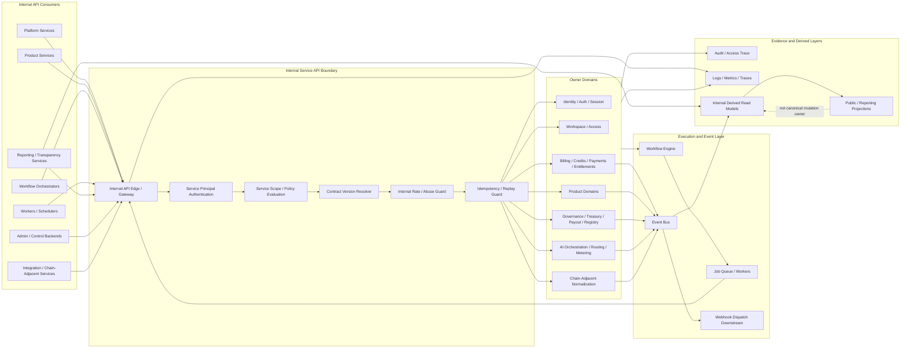
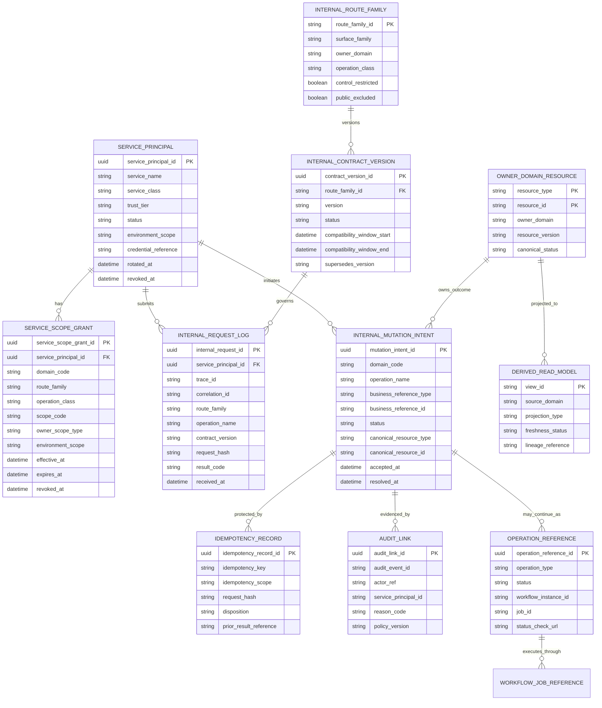
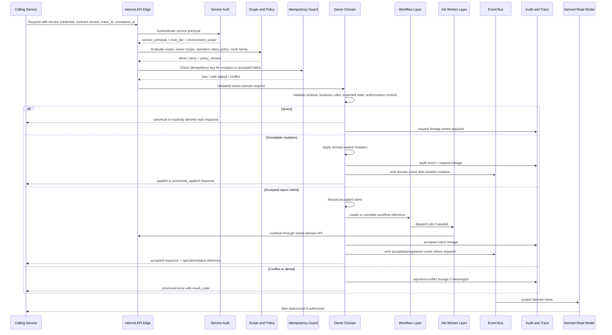

# FUZE Internal Service API Specification

## Document Metadata

- **Document Name:** `INTERNAL_SERVICE_API_SPEC.md`
- **Document Type:** FUZE API SPEC v2 / Production-Grade Interface Contract Specification
- **Status:** Draft API SPEC v2 for implementation review
- **Version:** 2.0.0
- **Effective Date:** 2026-04-24
- **Last Updated:** 2026-04-24
- **Reviewed On:** 2026-04-24
- **Document Owner:** FUZE Platform Internal API Governance Domain; named individual owner not yet specified.
- **Approval Authority:** FUZE platform architecture / API governance approval workflow; explicit named authority not yet specified.
- **Review Cadence:** Review whenever platform plane boundaries, internal service topology, domain ownership, service-principal posture, workflow/queue coupling, AI-runtime coupling, internal/public/admin separation, audit posture, migration posture, or security posture materially changes; at minimum quarterly while the API SPEC v2 library is being stabilized.
- **Governing Layer:** API contract layer / internal service-to-service interface governance.
- **Parent Registry:** `API_SPEC_INDEX.md`
- **Upstream Semantic Registry:** `REFINED_SYSTEM_SPEC_INDEX.md`
- **Upstream API Registry:** `API_SPEC_INDEX.md`
- **Primary Audience:** Platform architecture, backend engineering, service owners, product engineering, workflow/runtime engineering, AI platform engineering, API contract authors, security, audit, operations, finance/control-plane engineering, SDK/OpenAPI/AsyncAPI authors, implementation-contract authors, QA and production-readiness reviewers.
- **Primary Purpose:** Define the FUZE production-grade internal service API contract posture for service-to-service collaboration, owner-domain mutation discipline, internal read posture, accepted-state initiation, explicit service identity, internal authorization, idempotency, audit lineage, observability, compatibility, and downstream implementation derivation.
- **Primary Upstream References:**
  - `REFINED_SYSTEM_SPEC_INDEX.md`
  - `API_SPEC_INDEX.md`
  - `DOCS_SPEC_INDEX.md`
  - `SYSTEM_SPEC_INDEX.md`
  - `SYSTEM_BOUNDARY_AND_OWNERSHIP_SPEC.md`
  - `SYSTEM_OVERVIEW_AND_BOUNDARIES_SPEC.md`
  - `PLATFORM_ARCHITECTURE_SPEC.md`
  - `DOMAIN_OWNERSHIP_MATRIX_SPEC.md`
  - `DATA_MODEL_AND_ENTITY_OWNERSHIP_SPEC.md`
  - `ONCHAIN_OFFCHAIN_RESPONSIBILITY_SPEC.md`
  - `PRODUCT_BOUNDARY_AND_DOMAIN_OWNERSHIP_SPEC.md`
  - `PRODUCT_ADMISSION_AND_EXPANSION_GATE_SPEC.md`
  - `API_ARCHITECTURE_SPEC.md`
  - `PUBLIC_API_SPEC.md`
  - `EVENT_MODEL_AND_WEBHOOK_SPEC.md`
  - `IDEMPOTENCY_AND_VERSIONING_SPEC.md`
  - `MIGRATION_AND_BACKWARD_COMPATIBILITY_SPEC.md`
  - `WORKFLOW_AND_AUTOMATION_SPEC.md`
  - `JOB_QUEUE_AND_WORKER_SPEC.md`
  - `AI_ORCHESTRATION_SPEC.md`
  - `MODEL_ROUTING_AND_CONTEXT_SPEC.md`
  - `AI_USAGE_METERING_SPEC.md`
  - `FEATURE_FLAG_AND_ROLLOUT_CONTROL_SPEC.md`
  - `AUDIT_LOG_AND_ACTIVITY_SPEC.md`
  - `AUDIT_AND_ACCESS_TRACEABILITY_SPEC.md`
  - `SECURITY_AND_RISK_CONTROL_SPEC.md`
  - `SECRETS_CONFIG_AND_ENVIRONMENT_SPEC.md`
  - `MONITORING_ALERTING_AND_INCIDENT_RESPONSE_SPEC.md`
  - `FUZE_ACCOUNT_ACCESS_AND_SESSION_THESIS_FINAL_SPEC.md`
  - `FUZE_ACCOUNT_ACCESS_AND_SESSION_CANONICAL_FINAL_SPEC.md`
  - `FUZE_WORKSPACE_ACCESS_CONTROL_BASICS_THESIS_FINAL_SPEC.md`
- **Primary Downstream Dependents:**
  - domain-specific internal API contracts
  - `EVENT_MODEL_AND_WEBHOOK_SPEC.md`
  - `IDEMPOTENCY_AND_VERSIONING_SPEC.md`
  - `MIGRATION_AND_BACKWARD_COMPATIBILITY_SPEC.md`
  - workflow integration contracts
  - queue / worker API contracts
  - AI platform API contracts
  - admin/control backend integration contracts
  - internal OpenAPI and AsyncAPI artifacts
  - service-principal registry and service-scope implementation contracts
  - internal request-lineage, audit, and observability contracts
- **API Surface Families Covered:** Internal service APIs, owner-domain mutation APIs, internal domain query APIs, control-restricted internal APIs, orchestration-support APIs, internal derived-read APIs, chain-adjacent coordination APIs, internal status APIs, internal contract-version registry APIs.
- **API Surface Families Excluded:** Public/external APIs, first-party browser/mobile app APIs, external partner APIs, external webhooks, human admin UX, event catalog payloads in full detail, queue broker implementation APIs, database schemas in full detail, service mesh vendor configuration, smart-contract ABI surfaces, public-read companion APIs.
- **Canonical System Owner(s):** Owner domains retain canonical semantic ownership for their own business truth; FUZE Platform Internal API Governance owns shared internal interface-family posture.
- **Canonical API Owner:** FUZE Platform Internal API Governance Domain.
- **Supersedes:** Earlier or weaker internal API interpretations that treat internal APIs as private convenience transport, allow hidden cross-domain writes, conflate internal APIs with public/admin/event/workflow surfaces, rely on network adjacency as authority, or let workflows/workers/reporting layers become silent mutation owners.
- **Superseded By:** None currently defined.
- **Related Decision Records:** Not explicitly linked in retrieved governing material.
- **Canonical Status Note:** This API SPEC v2 document expresses interface-contract truth derived from refined system semantics. It does not redefine owner-domain semantics. Downstream services, internal route families, request/response envelopes, auth layers, retry behavior, audit hooks, service-principal registries, OpenAPI/AsyncAPI artifacts, and migration plans MUST preserve the ownership, truth-separation, service-identity, and contract-discipline rules defined here.
- **Implementation Status:** Normative API contract specification pending downstream implementation-contract derivation.
- **Approval Status:** Draft pending explicit FUZE approval workflow.
- **Change Summary:** Upgraded the refined internal-service architecture into an API SPEC v2 contract document; normalized route-family posture, service-principal authentication, scope evaluation, owner-domain mutation, accepted-state behavior, idempotency, audit, event, migration, and downstream OpenAPI/AsyncAPI/SDK derivation requirements.

---

## Purpose

This specification defines the production-grade FUZE **internal service API** contract layer.

The purpose of this document is to make explicit how FUZE services communicate inside the platform boundary without weakening canonical ownership, auditability, security, retry safety, migration discipline, or truth-class separation. Internal APIs are not casual private routes. They are governed service-to-service contracts that allow one FUZE domain to request, observe, coordinate, or continue work owned by another domain through explicit, authenticated, authorized, versioned, traceable, and retry-safe interfaces.

This API spec governs interface-contract expression only. Refined system specs own semantic truth. Domain specs own business meaning. This API spec owns how those truths are safely exposed to other FUZE services through internal contracts.

---

## Scope

This specification governs:

1. the shared internal service API layer across FUZE platform and product domains;
2. service-to-service route families and allowed operation classes;
3. owner-domain mutation and query exposure rules;
4. internal request, response, error, status, correlation, idempotency, and audit envelope requirements;
5. accepted-state patterns for async initiation through internal APIs;
6. explicit authenticated service identity and internal service-scope authorization posture;
7. idempotency, replay-safety, retry, conflict, and compensation rules for internal writes;
8. event-emission implications when internal APIs trigger meaningful owner-domain state transitions;
9. derived internal read posture and its limits;
10. control-restricted internal routes for privileged remediation, approval, quarantine, correction, and emergency action;
11. chain-adjacent coordination APIs for normalized chain reads and action preparation;
12. downstream implementation-contract, OpenAPI, AsyncAPI, SDK, QA, and production-readiness guardrails.

---

## Out of Scope

This specification does not define:

- public, partner, or external consumer APIs;
- exact endpoint-by-endpoint schemas for every domain-specific internal contract;
- the complete event catalog or webhook delivery catalog;
- full workflow-state semantics;
- full queue lease, heartbeat, retry, or dead-letter implementation details;
- complete AI routing, context, metering, or output-governance semantics;
- full human admin screen behavior or operator console UX;
- direct database schemas for every domain entity;
- service mesh, gateway vendor, container network, or infrastructure-specific configuration;
- smart-contract ABIs or on-chain storage layout;
- public reporting, public registry, transparency, or public-read companion semantics except where internal APIs feed them.

Those concerns belong in narrower API, event, workflow, queue, AI, admin/control, security, data, and implementation-contract documents. They MUST remain consistent with this specification.

---

## Design Goals

The design goals of FUZE internal service APIs are to:

1. preserve owner-domain boundaries while enabling practical service collaboration;
2. make internal writes explicit, typed, domain-owned, idempotent, and auditable;
3. prevent hidden cross-domain mutation, table coupling, and broad private patch surfaces;
4. distinguish internal service APIs from public APIs, first-party application APIs, admin/control surfaces, events, workflows, queues, reporting views, and caches;
5. support synchronous answers where appropriate and accepted-state async initiation where work is long-running or retry-heavy;
6. enforce explicit service identity, service scopes, trust tier, environment posture, and owner-scope evaluation;
7. harden sensitive economic, governance, payout, treasury, registry, and control operations;
8. preserve event, audit, workflow, job, and projection lineage after meaningful internal API actions;
9. support contract evolution without allowing unstable internal routes to break production workflows;
10. provide enough precision for downstream OpenAPI, AsyncAPI, SDK, implementation, QA, monitoring, and migration work.

---

## Non-Goals

This specification is not intended to:

- force every cross-domain interaction to be synchronous;
- mirror public APIs internally or mirror internal APIs publicly;
- let internal APIs become broad escape hatches around domain ownership;
- let workflows, workers, AI runtimes, dashboards, or reports mutate owner-domain truth through undocumented private paths;
- treat network location, deployment adjacency, or private routing as sufficient authority;
- turn internal dashboards, exports, or reconciliation views into hidden source-of-truth systems;
- collapse accepted async initiation into final business completion;
- create general-purpose internal root routes for sensitive domains;
- replace domain-specific implementation contracts, OpenAPI files, AsyncAPI schemas, database migrations, or runbooks.

---

## Core Principles

### 1. Ownership-Respecting Collaboration

Internal APIs exist so that one FUZE domain may request or observe another domain’s behavior through explicit contracts without taking over that domain’s truth.

### 2. Owner-Domain Mutation

Canonical writes MUST terminate in the owning domain’s boundary even when the request originates from another service, workflow, worker, scheduler, admin backend, integration adapter, or chain-adjacent service.

### 3. Internal Is Not Public

Internal service APIs are distinct from public APIs. They MAY expose richer internal semantics, but they MUST remain non-public, service-authenticated, platform-bounded, and covered by internal compatibility posture.

### 4. Internal Is Not Control Plane

A privileged control action is not an ordinary internal mutation. Governance-aware, treasury-sensitive, payout-sensitive, incident-sensitive, registry-sensitive, commercially sensitive, or emergency-sensitive actions require narrower route families, stronger policy, reason codes, and stronger audit lineage.

### 5. Accepted-State Honesty

When an internal API only admits work for later execution, it MUST return accepted-state semantics rather than representing work as complete.

### 6. Explicit Service Identity

Being inside FUZE infrastructure is not authority. Every internal caller MUST present an explicit, authenticated, auditable service identity.

### 7. Bounded Non-Owner Rights

Non-owning services MAY read, derive, request mutation, coordinate work, or observe status only to the degree explicitly granted by contract and policy.

### 8. Derived-Read Discipline

Internal dashboards, reconciliation views, support views, reporting views, and publication-preparation views MAY exist, but they MUST identify themselves as derived and MUST NOT become hidden mutation owners.

### 9. Retry-Safe Collaboration

Internal APIs MUST be designed for duplicate delivery, network retry, workflow replay, job restart, and partial failure without silently creating duplicate business effects.

### 10. Future-Safe Interface Discipline

Internal contracts MAY evolve faster than public contracts, but they remain production-governed artifacts. They MUST preserve explicit compatibility, migration, deprecation, and version lineage.

---

## Canonical Definitions

### Internal Service API

A service-authenticated FUZE interface used for service-to-service collaboration inside the platform boundary.

### Owner-Domain Internal API

An internal contract owned by the domain that owns the meaning, lifecycle, validation, and mutation of the underlying truth.

### Internal Mutation API

A contract by which an owning domain accepts a meaningful state change or accepted mutation intent from a service caller.

### Internal Query API

A contract by which another service requests current canonical or tightly owned read data from an owning domain.

### Internal Derived Read API

A read-only internal contract exposing a composed, operationally optimized, or publication-preparation projection that is explicitly downstream of canonical owner truth.

### Control-Restricted Internal API

A privileged internal route family used for governance-sensitive, treasury-sensitive, payout-sensitive, incident-sensitive, commercially sensitive, emergency, remediation, approval, quarantine, or correction actions.

### Orchestration-Support API

An internal route family used by workflow orchestrators, schedulers, job workers, product services, or platform services to begin, continue, or correlate bounded work while preserving owner-domain semantics.

### Chain-Adjacent Coordination API

An internal route family that normalizes chain observations, prepares chain actions, or exposes chain-derived context without redefining contract-native truth or off-chain policy truth.

### Accepted Internal Intent

A durable internal record that the target owner domain admitted an action for later processing. It is not final business success.

### Service Principal

The authenticated identity of an internal caller, such as a platform core service, product domain service, workflow orchestrator, worker class, scheduler, reporting service, integration adapter, chain-adjacent service, or control-plane backend.

### Service Scope Grant

A bounded grant allowing a service principal to call a specific route family, operation class, domain, and owner scope under explicit environment and trust-tier constraints.

---

## Truth Class Taxonomy

This API spec MUST preserve the following truth classes:

1. **Semantic truth** — domain meaning, entity lifecycle, state transition meaning, and canonical ownership.
2. **API contract truth** — route family, request/response/error/status semantics, version posture, and interface obligations.
3. **Policy truth** — access rules, control restrictions, rollout constraints, compatibility windows, and deprecation status.
4. **Runtime truth** — current request processing, dependency health, execution progress, pending state, and service availability.
5. **Ledger / storage truth** — durable owner-domain records, internal request logs, mutation intents, idempotency records, contract versions, and audit references.
6. **Provider-input truth** — raw external input before normalization and owner-domain validation.
7. **Implementation-adapter truth** — gateway, auth adapter, protocol mediation, and service translation state.
8. **Event / async execution truth** — workflow, job, queue, retry, scheduler, event, and delivery state.
9. **Projection / reporting truth** — operational dashboards, support summaries, reconciliation outputs, publication-preparation views, caches, exports, and reports.
10. **Presentation truth** — labels, UI messages, support/operator renderings, and explanatory text.

Internal service APIs do not absorb business-domain truth, workflow meaning, queue meaning, reporting ownership, public-read truth, or control-plane ownership.

---

## Architectural Position in the Spec Hierarchy

This document is downstream of:

- `REFINED_SYSTEM_SPEC_INDEX.md`
- `SYSTEM_BOUNDARY_AND_OWNERSHIP_SPEC.md`
- `SYSTEM_OVERVIEW_AND_BOUNDARIES_SPEC.md`
- `PLATFORM_ARCHITECTURE_SPEC.md`
- `DOMAIN_OWNERSHIP_MATRIX_SPEC.md`
- `DATA_MODEL_AND_ENTITY_OWNERSHIP_SPEC.md`
- `ONCHAIN_OFFCHAIN_RESPONSIBILITY_SPEC.md`
- `API_ARCHITECTURE_SPEC.md`

This document is alongside or upstream of:

- domain-specific internal API specifications;
- workflow, job, and worker integration contracts;
- AI platform internal API contracts;
- admin/control backend contracts;
- event and webhook implementation contracts;
- internal OpenAPI and AsyncAPI artifacts;
- internal SDK/service-client derivation layers;
- QA, monitoring, incident, and migration runbooks.

This document governs internal service contract posture. It does not replace adjacent public, event, workflow, queue, AI, security, audit, migration, or domain-owner specifications.

---

## Upstream Semantic Owners

The upstream semantic owners include:

- platform boundary and ownership specs for top-level domain boundaries;
- API architecture specs for surface-family posture;
- identity, account, authentication, and session specs for actor, account, authentication, and session semantics;
- workspace, role, permission, access-control, effective-permission, and entitlement specs for scoped authorization;
- domain owner specs for business actions, lifecycle, state transitions, and canonical mutation rules;
- workflow and queue specs for execution-state semantics;
- AI orchestration, routing/context, and metering specs for AI run, model routing, context, and metering truth;
- credits, billing, payment, ledger, payout, treasury, and governance specs for economic and control-sensitive truth;
- chain architecture and on-chain/off-chain specs for chain-adjacent posture;
- audit and access-traceability specs for durable evidence;
- security/risk and secrets/config/environment specs for service identity, least privilege, and runtime trust posture;
- migration and backward compatibility specs for coexistence, cutover, deprecation, sunset, and historical interpretability.

---

## API Surface Families

Internal service APIs are divided into canonical surface families.

### 1. Canonical Domain Mutation APIs

Owner-domain routes that apply or admit meaningful state changes. Examples include credit issuance, subscription transition, workspace membership change, payout-cycle preparation, governance-action creation, registry-publication preparation, and AI-run state transition.

### 2. Domain Query APIs

Read routes exposing current canonical state or tightly owned read state required by other services. They MUST NOT create hidden side effects.

### 3. Control-Restricted APIs

Privileged routes for governance-sensitive, treasury-sensitive, payout-sensitive, commercially sensitive, security-sensitive, or emergency-sensitive actions. They require stronger identity, scopes, reason codes, policy versions, audit lineage, and often approval references.

### 4. Orchestration-Support APIs

Routes used by workflows, schedulers, workers, and async runtimes to create, continue, or correlate bounded work. They MUST preserve owner-domain mutation boundaries.

### 5. Internal Derived-Read APIs

Read-only internal projections for operational dashboards, reconciliation views, support views, reporting views, and publication-preparation views. They are derived, not canonical.

### 6. Chain-Adjacent Coordination APIs

Routes for chain reads, chain-event normalization, snapshot context, contract-action preparation, and chain-reference verification. They MUST distinguish chain-native truth, normalized input truth, off-chain policy truth, and owner-domain validation.

### 7. Internal Status APIs

Routes that expose status of accepted internal intents, workflow references, job references, migration states, contract-version states, and control restrictions. They do not themselves finalize business outcomes unless owned by the relevant domain.

### 8. Internal Contract Governance APIs

Routes or registries that govern internal contract version, surface family, route family, compatibility window, deprecation, block, and migration posture.

---

## System / API Boundaries

Internal service APIs sit primarily across the FUZE application plane and execution plane, with bounded interaction into integration, control, reporting, and chain-adjacent planes.

- The **application plane** is the default home for owner-domain mutations and canonical domain reads.
- The **execution plane** may continue accepted work through workflows, jobs, schedulers, and workers but does not become owner of business semantics.
- The **integration plane** may normalize provider callbacks, chain signals, and third-party inputs; raw inputs remain provider-input truth until validated by owner domains.
- The **control plane** may invoke control-restricted routes for approvals, restrictions, overrides, quarantine, or emergency action, but does not convert ordinary internal routes into broad privileged shortcuts.
- The **reporting plane** may consume internal query and derived-read APIs but MUST NOT mutate canonical owner truth.
- The **experience / edge layer** and public clients MUST NOT call internal service APIs directly.
- The **on-chain contract layer** remains separately bounded; internal APIs may observe, coordinate, prepare, or reconcile but MUST NOT misrepresent off-chain interpretation as contract-native truth.

---

## Adjacent API Boundaries

- `API_ARCHITECTURE_SPEC.md` governs shared API architecture and surface-family posture.
- `PUBLIC_API_SPEC.md` governs external contracts; authenticated external APIs remain public/external, not internal.
- `EVENT_MODEL_AND_WEBHOOK_SPEC.md` governs durable events, event identity, webhook contracts, delivery attempts, subscriptions, and replay posture.
- `IDEMPOTENCY_AND_VERSIONING_SPEC.md` governs replay-safety and version semantics applied by internal APIs.
- `MIGRATION_AND_BACKWARD_COMPATIBILITY_SPEC.md` governs coexistence, cutover, migration, deprecation, sunset, rollback, and supersession.
- `WORKFLOW_AND_AUTOMATION_SPEC.md` owns workflow-state meaning and cross-domain progression.
- `JOB_QUEUE_AND_WORKER_SPEC.md` owns execution substrate semantics.
- `AI_ORCHESTRATION_SPEC.md`, `MODEL_ROUTING_AND_CONTEXT_SPEC.md`, and `AI_USAGE_METERING_SPEC.md` own AI run, routing, context, and metering meaning.
- `FEATURE_FLAG_AND_ROLLOUT_CONTROL_SPEC.md` may constrain exposure or behavior but does not override owner-domain meaning.
- `SECURITY_AND_RISK_CONTROL_SPEC.md` governs least privilege, sensitive-path hardening, and security posture.
- `AUDIT_LOG_AND_ACTIVITY_SPEC.md` and `AUDIT_AND_ACCESS_TRACEABILITY_SPEC.md` govern immutable evidence and access reconstruction.
- Domain API specs govern domain-specific route families, schemas, and accepted-state contracts under this shared posture.

---

## Conflict Resolution Rules

When materials, implementations, generated contracts, or operational interpretations conflict:

1. `REFINED_SYSTEM_SPEC_INDEX.md` and higher constitutional materials win over narrower API texts.
2. `PLATFORM_ARCHITECTURE_SPEC.md` wins on plane separation and runtime-surface role.
3. `DOMAIN_OWNERSHIP_MATRIX_SPEC.md` and ownership specs win on canonical owner interpretation.
4. `API_ARCHITECTURE_SPEC.md` wins on shared API surface-family posture.
5. This document wins on service-to-service contract posture.
6. `EVENT_MODEL_AND_WEBHOOK_SPEC.md` wins on event and webhook semantics.
7. `WORKFLOW_AND_AUTOMATION_SPEC.md` wins on workflow meaning.
8. `JOB_QUEUE_AND_WORKER_SPEC.md` wins on queue, lease, retry, and dead-letter semantics.
9. Domain owner specifications win on domain meaning, lifecycle, and mutation rules.
10. Reporting, dashboards, caches, SDKs, workers, workflows, and public-read views never win over canonical owner-domain contracts.
11. When ambiguity remains, FUZE MUST choose the more conservative architecture-consistent interpretation and record the ambiguity for refinement.

---

## Default Decision Rules

When ambiguity exists and no approved exception applies:

1. canonical writes default to owner-domain internal APIs in the application plane;
2. service-to-service access defaults to non-public, authenticated, scope-limited access;
3. privileged actions default to control-restricted route families;
4. accepted async work defaults to explicit accepted-state response semantics;
5. derived internal reads default to read-only posture;
6. workflows and workers default to using owner-domain APIs rather than private persistence writes;
7. products default to consuming shared platform APIs rather than reinventing shared primitives locally;
8. provider callbacks and chain observations default to normalized-input truth until owner validation succeeds;
9. if an internal route cannot name its owner domain, surface family, caller class, scope model, version posture, idempotency posture, audit posture, and mutation boundary, the route is incomplete and MUST NOT proceed as production-grade.

---

## Roles / Actors / API Consumers

### Human-Originated Actors

- support operators;
- product operators;
- finance/control-plane operators;
- governance or approval actors;
- security reviewers;
- incident responders.

Human-originated actions MUST be mediated by backend/admin/control services and MUST preserve initiating human actor attribution where applicable.

### System Consumers

- platform core services;
- product domain services;
- workflow orchestrators;
- job workers;
- schedulers;
- reporting and publication services;
- integration adapter services;
- chain-adjacent services;
- AI orchestration, routing, metering, and context services;
- control-plane / admin backend services;
- migration, backfill, and reconciliation workers.

### Caller Classification Rules

Each caller MUST be classified by `service_principal`, `service_class`, `trust_tier`, `environment_scope`, `allowed_domain_codes`, `allowed_operation_classes`, and active/restricted/revoked state.

---

## Resource / Entity Families

### Internal Governance Resources

- `service_principal`
- `service_scope_grant`
- `internal_request_log`
- `internal_mutation_intent`
- `internal_operation_reference`
- `internal_contract_version`
- `internal_route_family`
- `internal_error_code`
- `internal_idempotency_record`
- `internal_audit_reference`
- `internal_trace_reference`
- `internal_deprecation_notice`
- `internal_control_restriction`

### Referenced Business Resources

Business resources remain owned by their domain, including:

- `account`
- `linked_login_method`
- `session`
- `workspace`
- `workspace_membership`
- `role_assignment`
- `permission_evaluation`
- `wallet_link`
- `payment_record`
- `subscription`
- `entitlement`
- `credits_account`
- `credits_ledger_entry`
- `invoice`
- `receipt`
- `workflow_instance`
- `job`
- `audit_event`
- `ai_run`
- `model_routing_decision`
- `usage_metering_record`
- `payout_cycle`
- `eligibility_dataset`
- `snapshot_reference`
- `governance_action`
- `registry_entry`
- product-domain resources.

### Derived Resources

Derived resources MAY include internal dashboards, reconciliation views, read models, exports, support views, and publication-preparation objects. They MUST remain downstream to canonical owner truth.

---

## Ownership Model

### Internal Service API Governance Owns

- internal surface-family taxonomy;
- service-to-service route-family posture;
- service-principal and service-scope contract posture;
- shared request, response, error, result, and status requirements;
- accepted-state semantics at API-contract level;
- internal idempotency and replay contract requirements;
- internal audit and traceability envelope requirements;
- contract version, deprecation, and compatibility posture for internal APIs;
- non-canonical internal API pattern detection.

### Internal Service API Governance Does Not Own

- business-domain truth;
- workflow-state meaning;
- queue, lease, heartbeat, retry, or dead-letter truth;
- AI run, routing/context, or usage-metering truth;
- billing, credits, payment, ledger, entitlement, governance, treasury, payout, or registry semantics;
- reporting or publication truth;
- public API exposure;
- on-chain contract-native truth.

### Owner Domains MUST

- expose approved internal mutation and read routes where cross-domain collaboration is required;
- validate domain rules, policy, idempotency, expected state, and authorization before applying mutation or admitting intent;
- emit sufficient lineage for audit, event, workflow, status, and observability correlation;
- prevent non-owner services from mutating domain truth through private storage shortcuts.

### Non-Owners MAY

- request owner-domain action through approved internal contracts;
- query current owner-domain state through approved internal query APIs;
- consume accepted references, status APIs, events, and derived views;
- coordinate work through workflow/job layers without taking ownership of domain truth.

### Non-Owners MUST NOT

- directly mutate owner-domain tables or private storage;
- infer broad authority from infrastructure location;
- treat derived internal reads as mutation authority;
- turn workflows, workers, dashboards, reports, migration scripts, or support tools into hidden write paths.

---

## Authority / Decision Model

- **Platform Internal API Governance Authority:** Owns shared internal interface-family rules, service-principal posture, and internal contract governance.
- **Domain Authority:** Owns meaning, validation, lifecycle, mutation, and finalization for domain entities.
- **Product Authority:** Owns product-local internal contracts within platform rules but does not own shared platform primitives.
- **Control / Governance Authority:** Approves, restricts, quarantines, overrides, or suspends sensitive operations through bounded control-restricted routes.
- **External / Provider / Chain Authority:** Owns provider-native or contract-native facts only. Internal APIs consume such facts only after normalization and validation.

---

## Authentication Model

Every internal request MUST authenticate an explicit `service_principal`.

Acceptable authentication mechanisms MAY include:

- mTLS service identity;
- signed short-lived service JWT or equivalent bearer credential;
- workload identity bound to runtime environment;
- rotation-aware credential pairs governed by secrets/config/environment posture.

Authentication MUST produce at minimum:

- `service_principal_id`
- `service_name`
- `service_class`
- `trust_tier`
- `environment_scope`
- credential version or key reference
- authenticated-at timestamp
- revoked/restricted status
- trace correlation context.

Network location, private routing, cluster membership, IP allowlisting, or deployment adjacency alone MUST NOT grant internal API authority.

---

## Authorization / Scope / Permission Model

Internal authorization MUST evaluate:

- authenticated service principal;
- target domain;
- route family;
- operation class;
- service scope grant;
- owner scope such as account, workspace, product, tenant, payout cycle, governance action, registry entry, subscription, or workflow;
- environment posture;
- trust tier;
- rollout or migration state;
- whether the operation is governance-, treasury-, payout-, billing-, credits-, registry-, security-, or control-sensitive;
- initiating human actor, if applicable;
- policy version and approval reference where applicable.

Authorization MUST be operation-specific. A service authorized to read a domain is not thereby authorized to mutate that domain. A workflow orchestrator is not broadly authorized to all owner-domain mutations. A reporting service usually receives read/derive rights, not mutation rights. A product service may request Platform Credits spend through the credits domain but MUST NOT issue arbitrary credits.

---

## Entitlement / Capability-Gating Model

Internal APIs MAY consume entitlement and capability-gating outputs where capability eligibility matters, but they do not own entitlement meaning.

Rules:

1. Internal route presence does not imply capability eligibility.
2. Entitlement results MUST remain owner-domain aligned.
3. Authorization, entitlement, rollout, policy, workflow state, and business-domain state MUST remain distinct.
4. Internal APIs MUST NOT encode plan meaning or capability entitlement solely through route naming or product-local assumptions.
5. Capability denial MUST produce explicit result classes and audit posture when the request is meaningful or sensitive.

---

## API State Model

Internal operations MUST distinguish:

- `received`
- `authenticated`
- `authorized`
- `validated`
- `accepted`
- `applied`
- `previously_applied`
- `rejected`
- `conflicted`
- `rate_limited`
- `failed_retryable`
- `failed_terminal`
- `compensated`
- `blocked`
- `deprecated`
- `retired`

State rules:

- `accepted` MUST remain distinct from `applied`.
- `previously_applied` MUST remain distinct from a newly applied mutation.
- `conflicted` MUST remain distinct from generic failure.
- `failed_retryable` MUST remain distinct from terminal denial.
- `compensated` MUST preserve linkage to original accepted/applied action.
- `blocked` MUST be available for emergency route or contract-version restrictions.

---

## Lifecycle / Workflow Model

### Synchronous Query Lifecycle

1. Caller authenticates as a service principal.
2. Internal API edge resolves contract version and request context.
3. Target domain validates caller scope and owner scope.
4. Domain returns canonical read or tightly owned read object.
5. Request log and observability records preserve trace and correlation.

### Synchronous Mutation Lifecycle

1. Caller submits a business action, not a generic storage patch.
2. Target domain authenticates and authorizes service principal.
3. Target domain validates schema, policy, owner scope, expected state, and idempotency.
4. Target domain applies mutation or returns conflict/rejection.
5. Domain emits audit lineage and business event where required.
6. Response returns explicit `applied`, `previously_applied`, `conflicted`, or `rejected` status.

### Accepted Async Lifecycle

1. Caller submits mutation or operation intent.
2. Target owner domain validates and records accepted intent.
3. Response returns `accepted` with operation/workflow/job/status reference.
4. Workflow/job layer continues execution through owner-domain contracts.
5. Final result is exposed through owner-domain read/status API or domain event.
6. Retried submissions return prior accepted or applied reference where safe.

### Control-Restricted Lifecycle

1. Admin/control backend authenticates as a restricted service principal.
2. Request includes initiating human actor, reason code, policy version, approval reference if required, target resource, and idempotency key.
3. Control route validates control policy and owner-domain boundaries.
4. Owner domain applies, admits, rejects, or escalates the action.
5. Full audit lineage records service, human actor, approval, policy, reason, outcome, and resulting references.

---

## Architecture Diagram — Mermaid flowchart

---

## Data Design — Mermaid Diagram

---

## Flow View

### Main Internal Request Flow

1. The calling service sends an internal request with service credential, route family, operation name, contract version or version negotiation hint, trace ID, correlation ID, owner scope, and payload.
2. Internal API edge authenticates the service principal and rejects revoked, blocked, expired, or environment-incompatible credentials.
3. Authorization evaluates service scope grants, target domain, operation class, owner scope, trust tier, policy posture, rollout posture, and control restrictions.
4. Rate and abuse controls evaluate caller class, route family, operation sensitivity, and burst posture.
5. Contract resolver identifies active schema, version, and compatibility behavior.
6. The target owner domain validates schema, business preconditions, idempotency, expected state, and policy constraints.
7. For reads, the domain returns canonical/tightly owned read data or a derived-read response clearly marked as derived.
8. For immediate mutations, the owner domain applies the change, records audit lineage, emits domain events where required, and returns `applied` or `previously_applied`.
9. For async operations, the owner domain records accepted intent, links workflow/job/status references, emits accepted/progression events where required, and returns `accepted`.
10. Observability records traces, metrics, logs, result codes, latency, and dependency status.
11. Audit/access trace records meaningful operations separately from generic logs.
12. Downstream events, derived read models, webhook delivery, public-read projections, or reporting outputs remain downstream to owner-domain truth.

### Failure Flow

1. Authentication failure returns explicit `authentication_failed`.
2. Service-scope mismatch returns `scope_denied`.
3. Owner-scope or permission mismatch returns `authorization_denied`.
4. Schema or precondition failure returns `validation_error` or `state_conflict`.
5. Idempotency-key reuse with different intent returns `idempotency_conflict`.
6. Retryable dependency failure returns `failed_retryable` with safe retry guidance where possible.
7. Terminal policy denial returns `terminal_policy_denial`.
8. Control-restricted denial returns `control_plane_restriction` or `governance_restriction`.
9. Audit and observability records MUST distinguish rejections, conflicts, dependency failures, and terminal denials.

### Retry Flow

1. Caller repeats a request with the same idempotency key, business reference, and materially equivalent payload.
2. Target domain resolves prior idempotency record.
3. Safe repeat returns `previously_applied`, same accepted reference, or same final result reference.
4. Payload mismatch with same idempotency key returns explicit conflict.
5. Retried workflow/job continuations preserve original business reference identity.

### Admin / Operator Flow

1. Admin UI calls backend-admin edge, not arbitrary internal domain routes.
2. Backend-admin service authenticates as a restricted service principal.
3. Request includes human actor attribution, target, reason code, policy reference, approval reference if required, and idempotency key.
4. Control-restricted route evaluates policy and owner-domain posture.
5. Owner domain applies, admits, rejects, or escalates the action.
6. Audit records both service principal and human actor.

---

## Data Flows — Mermaid sequenceDiagram

---

## Request Model

### Required Base Request Metadata

Every internal request MUST include or resolve:

- `trace_id`
- `correlation_id`
- authenticated `service_principal`
- `route_family`
- `operation_name`
- `operation_class`
- `target_domain`
- `contract_version`
- `environment_scope`
- owner scope where applicable
- request timestamp
- payload hash or request digest for meaningful mutation and audit cases.

### Required Mutation / Accepted Intent Metadata

Retry-sensitive writes and accepted-state submissions MUST include:

- `idempotency_key`
- `idempotency_scope`
- `business_reference_type`
- `business_reference_id`
- intended business action / transition
- expected current state or resource version where state-machine safety matters
- reason code for sensitive or control-restricted operations
- initiating human actor reference where human-originated
- workflow/job reference if continuing work
- policy version or approval reference where required.

### Request Design Rules

- Query requests MUST NOT silently mutate owner truth.
- Mutation requests MUST name business action or explicit domain transition, not generic data patch semantics.
- Partial updates MUST be explicit, domain-safe, and schema-governed.
- Bulk mutation MUST be rare, owner-domain approved, idempotent, rate-limited, audited, and observable.
- Requests MUST NOT expose raw persistence internals such as arbitrary SQL patch shapes, table names, or unbounded JSON patches across domains.
- Internal request payloads MUST NOT assume provider input is canonical until normalization and owner validation occur.

---

## Response Model

### Response Classes

Internal APIs MUST distinguish:

- immediate read response;
- immediate applied mutation response;
- accepted-state response;
- previously-applied idempotent replay response;
- conflict response;
- rejection response;
- retryable-failure response;
- terminal-failure response;
- control-restricted denial response;
- deprecated/blocked contract response.

### Base Response Requirements

Responses MUST include:

- `trace_id`
- `correlation_id`
- `contract_version`
- stable `result_code`
- status class
- target domain code
- resource version or operation version where meaningful
- audit or request lineage reference where meaningful and safe.

### Accepted-State Response Requirements

Accepted-state responses MUST include:

- operation reference;
- current operation status;
- status-check route or status family;
- workflow/job reference where applicable;
- accepted-at timestamp;
- owner-domain business reference;
- finalization expectations;
- warning that accepted does not mean applied/finalized.

### Derived-Read Response Requirements

Derived-read responses MUST include, where practical:

- `derived: true`;
- source domain lineage;
- projection timestamp;
- freshness or lag indicator;
- cache/projection constraints;
- statement that the view is not mutation authority.

---

## Error / Result / Status Model

Internal APIs MUST use structured error payloads compatible with problem-details style HTTP APIs while preserving FUZE-specific domain result codes.

### Base Error Shape

- `type`
- `title`
- `status`
- `detail`
- `instance`
- `trace_id`
- `correlation_id`
- `result_code`
- `domain_code`
- `route_family`
- `contract_version`
- optional `retryable`
- optional `idempotency_disposition`
- optional `conflict_reference`
- optional `field_errors`
- optional `policy_reference`
- optional `audit_reference`
- optional `migration_guidance`.

### Canonical Error Categories

- `validation_error`
- `authentication_failed`
- `authorization_denied`
- `scope_denied`
- `entitlement_denied`
- `resource_not_found`
- `state_conflict`
- `idempotency_conflict`
- `already_applied`
- `contract_version_deprecated`
- `contract_version_blocked`
- `dependency_unavailable`
- `rate_limited_internal`
- `abuse_control_restriction`
- `governance_restriction`
- `control_plane_restriction`
- `chain_dependency_unavailable`
- `provider_input_not_normalized`
- `terminal_policy_denial`
- `migration_required`.

### Error Rules

- Errors MUST explain interface-level failure without exposing raw implementation internals.
- Retryable and non-retryable failures MUST be distinguishable.
- Authorization failures MUST remain explicit for auditability.
- State conflicts and idempotency conflicts MUST NOT collapse into generic 500-class failures.
- Sensitive denial reasons MAY be redacted in detail but MUST preserve stable result codes and audit references.

---

## Idempotency / Retry / Replay Model

Internal APIs require strong idempotency because workflows, workers, service calls, provider callbacks, and network requests are retry-prone.

### Mandatory Idempotency Domains

Strong idempotency is mandatory for:

- credits issuance, reserve, spend, release, reverse, and adjustment;
- subscription, entitlement, and billing transitions;
- payment normalization downstream mutations;
- payout-cycle creation, eligibility processing, and publication preparation;
- governance or control-action creation;
- registry and transparency publication actions;
- workflow and job submission;
- AI run creation where duplicate work or billing impact is possible;
- chain-adjacent action preparation;
- migration, backfill, replay, or reconciliation writes.

### Idempotency Rules

1. The target owner domain MUST enforce business-level idempotency.
2. Caller-side deduplication is helpful but never sufficient.
3. Equivalent retry MUST return `previously_applied`, the same accepted reference, or the same final result reference.
4. Reuse of an idempotency key for materially different intent MUST return `idempotency_conflict`.
5. Idempotency scope MUST be tied to correct business boundary.
6. Idempotency records MUST preserve payload digest or comparable intent fingerprint.
7. Retry behavior MUST be safe across service restart, workflow replay, worker retry, and deployment cutover.

---

## Rate Limit / Abuse-Control Model

Internal traffic is trusted only in the sense that it originates from authenticated services. It is not exempt from abuse controls.

Rate and abuse controls MUST consider:

- service principal;
- route family;
- operation class;
- sensitivity tier;
- owner domain;
- environment;
- burst behavior;
- dependency health;
- retry storm detection;
- workflow/job replay volume;
- migration/backfill posture;
- control-plane emergency restrictions.

Sensitive mutations MUST have stricter limits than ordinary internal reads. Rate limits MUST fail safely and observably. Internal rate-limit failures MUST NOT trigger unsafe local mutation by callers.

---

## Endpoint / Route Family Model

This section defines route families for downstream OpenAPI derivation. It is not an exhaustive endpoint list.

### `/internal/identity/...`

Owner: Identity/Auth/Session domains.  
Purpose: account/session/linkage reads and service-to-service identity context.  
Rules: no mutation outside owner-domain routes; security and privacy redaction rules apply.

### `/internal/workspaces/...`

Owner: Workspace/Organization/Access domains.  
Purpose: resolve workspace context, membership, effective access, and scoped authorization.  
Rules: access resolution is not entitlement truth and MUST NOT mutate as a side effect.

### `/internal/credits/mutations`

Owner: Platform Credits / Credit Ledger domains.  
Purpose: issue, reserve, spend, release, reverse, adjust, and reconcile credit mutations.  
Rules: idempotency, ledger append discipline, audit, and reason codes are mandatory.

### `/internal/billing/...`

Owner: Billing, subscription, payment, invoice, receipt, and entitlement domains.  
Purpose: payment-normalized transitions, subscription lifecycle, invoice/receipt references, entitlement updates.  
Rules: payment provider input must be normalized before downstream mutation.

### `/internal/workflows`

Owner: Workflow and Automation domain.  
Purpose: create/correlate workflow instances for domain-owned business processes.  
Rules: workflow truth does not replace domain business truth.

### `/internal/jobs`

Owner: Job Queue and Worker domain.  
Purpose: submit or continue deferred work.  
Rules: job state is execution truth, not business finality.

### `/internal/ai/...`

Owner: AI orchestration, routing/context, and metering domains.  
Purpose: create AI runs, request routing/context decisions, and report metering-relevant outcomes.  
Rules: AI execution does not own product-domain or billing-domain truth.

### `/internal/control/...`

Owner: Control-plane/governance plus target owner domain.  
Purpose: restricted approvals, overrides, quarantine, emergency locks, remediation, correction.  
Rules: reason codes, actor attribution, policy versions, approval references, idempotency, and audit are mandatory.

### `/internal/chain/...`

Owner: Chain-adjacent normalization / chain architecture domains.  
Purpose: normalized chain reads, snapshot references, contract event ingestion, action preparation.  
Rules: distinguish contract-native truth from off-chain policy and internal interpretation.

### `/internal/reporting/...`

Owner: Reporting/transparency/publication-preparation domains.  
Purpose: derived operational summaries and publication-readiness views.  
Rules: read-only; derived; source lineage required where practical.

### `/internal/contracts/...`

Owner: Platform API governance.  
Purpose: route-family registry, contract version, compatibility window, deprecation, block, and migration status.  
Rules: contract governance does not own domain business truth.

---

## Public API Considerations

Public clients MUST NOT call internal service APIs directly. Public APIs may be implemented by calling internal owner-domain APIs behind the boundary, but the public contract remains narrower, more stable, more privacy-preserving, and external-consumer-safe.

Internal route existence MUST NOT imply public exposure. Public exposure requires explicit public API specification approval.

---

## First-Party Application API Considerations

First-party frontend and edge surfaces MAY consume backend application APIs that internally invoke service APIs. Frontend convenience MUST NOT override domain ownership, authorization, entitlement, idempotency, audit, or accepted-state semantics.

A first-party route that initiates a meaningful internal action MUST preserve user/account/workspace context and the service-principal lineage of the backend caller.

---

## Internal Service API Considerations

Internal APIs are service-authenticated, scope-bound, non-public, versioned, observable, and audited interfaces. They MAY expose richer semantics than public APIs, but they MUST NOT become undocumented persistence shortcuts or unstable coupling points.

---

## Admin / Control-Plane API Considerations

Admin/control APIs MUST use separate route families or explicit control-restricted operation classes. Operator and admin actions MUST include:

- authenticated service principal;
- initiating human actor where applicable;
- target domain and resource;
- reason code;
- policy version;
- approval reference where required;
- idempotency key;
- audit reference;
- expected current state for sensitive transitions.

Control actions do not become ordinary internal mutations and do not transfer business ownership away from owner domains.

---

## Event / Webhook / Async API Considerations

Internal APIs that cause meaningful owner-domain state changes MUST record or emit durable domain events where adjacent specs require them.

Rules:

- internal API acceptance may produce accepted/progression events;
- final owner-domain mutation may produce outcome events;
- workflow/job events are execution truth, not necessarily business finality;
- external webhook delivery is downstream to internal business events and has separate delivery identity;
- events are at-least-once and consumers must be idempotent;
- event schema versions and internal API versions MUST remain coordinated when representing the same business action family.

---

## Chain-Adjacent API Considerations

Chain-adjacent internal APIs MUST distinguish:

- chain-native facts;
- provider or RPC observations;
- normalized chain input;
- snapshot references;
- off-chain policy interpretation;
- owner-domain validated state;
- derived public-read or reporting projection.

Internal APIs MAY prepare, observe, or reconcile chain-adjacent actions but MUST NOT misrepresent off-chain policy as on-chain truth or bypass governance/treasury controls for chain-related operations.

---

## Data Model / Storage Support Implications

Internal API architecture requires durable support for:

- service-principal registry;
- service-scope grants;
- internal request logs;
- internal mutation intents;
- idempotency records;
- operation/status references;
- internal contract version registry;
- route-family registry;
- control-restriction records;
- audit/access-trace links;
- workflow/job/event correlation links.

These records support API governance. They do not own business truth. Owner-domain entities remain in owner-domain storage.

---

## Read Model / Projection / Reporting Rules

Internal derived reads MAY support:

- operational dashboards;
- reconciliation summaries;
- support overviews;
- governance queues;
- payout review views;
- registry/publication readiness;
- transparency preparation views;
- migration readiness views;
- AI run operational summaries.

Rules:

1. Derived reads MUST remain read-only.
2. Derived reads MUST identify source domains and freshness where practical.
3. Staleness is projection lag, not proof of source truth change.
4. Derived views MUST NOT silently correct source truth.
5. Reporting exports MUST NOT become mutation authority.
6. Public-read projections are downstream and must preserve lineage and publication governance.

---

## Security / Risk / Privacy Controls

Internal APIs MUST preserve:

- explicit service identity;
- least privilege for service scopes;
- no broad trust from network adjacency;
- stronger controls for sensitive domains;
- safe degradation;
- replay safety;
- auditability;
- emergency route/contract blocking;
- environment isolation;
- secret and credential rotation posture;
- data minimization for internal reads;
- redaction where sensitive data is not required;
- restricted disclosure of failure details where necessary.

Sensitive operations MUST be monitored more aggressively than routine internal queries.

---

## Audit / Traceability / Observability Requirements

Meaningful internal operations MUST be reconstructible.

At minimum, significant internal requests MUST preserve:

- service principal;
- initiating human actor if applicable;
- route family;
- operation class;
- target domain;
- trace ID;
- correlation ID;
- request digest;
- idempotency key where applicable;
- owner scope;
- business reference;
- result code;
- resource or operation reference;
- workflow/job/event references where applicable;
- policy/control references where applicable;
- contract version;
- latency and dependency state.

Observability MUST support route-family inventory, service-principal inventory, error-rate monitoring, accepted-state backlog monitoring, retry-storm detection, dependency degradation, migration state, and control-restricted action review.

---

## Failure Handling / Edge Cases

### Dependency Failure

If an owner domain is unavailable, callers MUST fail clearly or remain in pending/accepted posture. They MUST NOT locally mutate owner-domain truth.

### Duplicate Submission

Equivalent duplicate business actions MUST return prior accepted/final result or `previously_applied`.

### Idempotency Mismatch

Same idempotency key with materially different intent MUST return conflict.

### Accepted but Not Finalized

Accepted intent MUST expose stable status references and MUST NOT be treated as final business success.

### Reporting Degradation

Reporting degradation MUST NOT block canonical mutation unless a narrower spec explicitly requires publication gating.

### Workflow / Worker Degradation

Workflow or worker degradation MUST NOT fabricate final domain outcomes.

### Contract Version Block

Blocked or deprecated contract versions MUST return explicit version or migration response.

### Provider / Chain Ambiguity

Unnormalized provider or chain data MUST remain input truth until owner-domain validation succeeds.

### Partial Effects

Partial effects MUST be compensated or corrected through explicit owner-domain actions with lineage.

---

## Migration / Versioning / Compatibility / Deprecation Rules

Internal APIs may evolve faster than public APIs but MUST remain governed.

Rules:

1. Route families and payloads MUST be explicitly versioned when change would break callers.
2. Compatible additive evolution is preferred.
3. Breaking changes require a migration plan, compatibility window, or parallel contract where dependent services exist.
4. Deprecated versions MUST have clear status and guidance.
5. Emergency block or rollback MUST be available for correctness or security threats.
6. Internal API schemas and event schemas MUST not drift independently when representing the same business action family.
7. Accepted-state and workflow/job contracts MUST remain stable enough for resumability across deployments.
8. Historical request and audit records MUST remain interpretable after migration.

---

## OpenAPI / AsyncAPI / SDK Derivation Rules

Downstream machine-readable contracts MUST preserve:

- surface family;
- owner domain;
- operation class;
- authentication and service-principal requirements;
- scope requirements;
- owner-scope parameters;
- required correlation and trace metadata;
- idempotency requirements;
- request/response/result/error/status classes;
- accepted-state semantics;
- derived-read classification;
- audit and event linkage requirements;
- contract version and deprecation state;
- retry and conflict semantics;
- control-restricted markers;
- non-public classification.

SDK/service-client generation MUST NOT hide accepted-state vs final-success semantics, idempotency requirements, or control-restricted route posture.

---

## Implementation-Contract Guardrails

Implementation contracts MUST NOT:

- create broad internal root routes;
- expose generic cross-domain patch APIs;
- bypass owner-domain mutation;
- allow workers/workflows to mutate private storage directly;
- treat reporting, caches, or exports as canonical;
- omit service-principal evaluation;
- omit idempotency on retry-sensitive actions;
- return ambiguous success for accepted work;
- collapse authorization, entitlement, rollout, and business precondition failures into one code;
- expose internal APIs publicly;
- log secrets or sensitive payloads;
- omit audit lineage for sensitive actions;
- deploy breaking internal changes without migration posture.

---

## Downstream Execution Staging

Implementation SHOULD proceed in stages:

1. internal route-family registry and contract taxonomy;
2. service-principal registry and service-scope grants;
3. common request/response/error/result envelope;
4. idempotency and internal mutation intent support;
5. audit and observability integration;
6. domain-specific internal route family implementation;
7. event and accepted-state correlation;
8. contract-version registry and deprecation controls;
9. control-restricted route hardening;
10. OpenAPI/AsyncAPI/service-client derivation;
11. QA, regression, migration, and production-readiness review.

---

## Required Downstream Specs / Contract Layers

The following downstream layers are required or expected:

- internal route-family catalog;
- service-principal and service-scope contract;
- common internal API envelope schema;
- internal error/result catalog;
- internal idempotency and replay contract;
- internal audit lineage contract;
- internal observability contract;
- domain-specific internal API specs;
- internal OpenAPI artifacts;
- accepted-state/status API specs;
- event and webhook mapping specs;
- workflow/job integration contracts;
- control-restricted route contracts;
- migration/deprecation registry.

---

## Boundary Violation Detection / Non-Canonical API Patterns

The following are forbidden unless explicitly approved by narrower authority:

1. direct cross-domain table mutation;
2. product-local mutation of shared economic truth;
3. workflow/worker private writes to owner-domain state;
4. reporting/dashboard write ownership;
5. broad internal god routes;
6. generic patch endpoints for sensitive domains;
7. network-location-only authorization;
8. accepted intent treated as final success;
9. hidden control-plane override without reason/audit;
10. internal routes exposed publicly by gateway misconfiguration;
11. provider callbacks promoted directly to canonical truth;
12. chain observations treated as policy decisions;
13. unversioned breaking route changes;
14. SDKs that suppress idempotency or accepted-state semantics;
15. migration scripts that bypass domain APIs without approved migration spec.

---

## Canonical Examples / Anti-Examples

### Example: Product Requests Credit Spend

Canonical: product service calls `/internal/credits/mutations` with operation-specific scope, amount, owner scope, business reference, idempotency key, and reason code. Credits domain validates, applies or accepts, and records ledger/audit/event lineage.

Anti-example: product service directly updates credits ledger tables or creates product-local “credit balance” truth.

### Example: Workflow Continues Payout Preparation

Canonical: workflow worker resumes payout preparation through owner-domain internal APIs using original business reference and idempotency identity.

Anti-example: worker marks payout-cycle state complete directly in payout storage because a job finished.

### Example: Admin Quarantines Registry Publication

Canonical: admin backend calls control-restricted internal route with human actor, reason code, approval/policy reference, target registry entry, and idempotency key.

Anti-example: admin UI calls generic internal patch route that updates registry status without policy or audit lineage.

### Example: Chain Event Ingestion

Canonical: chain-adjacent service ingests event, records normalized input, then owner domain validates and updates platform state.

Anti-example: raw provider callback directly mutates payout, registry, or credits truth.

---

## Acceptance Criteria

1. Every production internal route declares owner domain, surface family, operation class, version, auth requirement, scope requirement, and owner-scope model.
2. Every retry-sensitive mutation requires an idempotency key and enforces domain-side idempotency.
3. Equivalent retries return prior result or accepted reference; mismatched retries return explicit conflict.
4. Every accepted async response includes operation/status reference and does not represent final success.
5. Every control-restricted action requires reason code, service principal, human actor where applicable, policy/approval reference where applicable, and mandatory audit lineage.
6. Internal query routes do not mutate owner truth.
7. Derived-read APIs are marked derived and remain read-only.
8. Public clients cannot access internal route families directly.
9. Service-principal authentication is mandatory; network adjacency alone is insufficient.
10. Authorization evaluates service scope, target domain, operation class, owner scope, trust tier, and environment posture.
11. Sensitive economic, governance, payout, registry, treasury, security, and control routes have stricter scopes and audit posture than routine reads.
12. Internal request logs preserve trace ID, correlation ID, route family, service principal, contract version, result code, and latency.
13. Domain mutations emit or record required events with correlation to internal request and mutation intent.
14. OpenAPI/AsyncAPI/service-client artifacts preserve accepted-state, idempotency, error, version, and control-restricted semantics.
15. Breaking internal route changes have declared migration, compatibility, deprecation, or block posture.
16. Boundary-violation checks detect private cross-domain table writes, generic sensitive patch routes, and reporting-layer write ownership.
17. Degraded owner-domain behavior fails clearly or remains pending; dependent services do not fabricate owner truth.
18. Chain-adjacent APIs distinguish chain-native truth, normalized input, and owner-domain validated state.
19. Audit and observability allow reconstruction of which service requested which mutation, why, under what policy/version, and with what outcome.
20. Test suites cover positive, negative, auth, scope, entitlement/capability, idempotency, retry, conflict, rate-limit, degraded-mode, audit, migration, and boundary-violation behavior.

---

## Test Cases

### Positive Path

1. **Canonical internal read:** authorized product service calls identity read; receives canonical account status and trace/correlation metadata; no side effects occur.
2. **Canonical internal mutation:** payment normalization service requests credits issuance with valid scope and idempotency key; credits domain applies ledger entry, returns `applied`, emits event, writes audit.
3. **Accepted async operation:** product service requests long-running export; domain returns `accepted` with operation reference; final status later resolves through status API.
4. **Derived read:** support dashboard requests reconciliation view; response is marked derived with source lineage and freshness.

### Authentication / Authorization / Scope

5. Missing service credential returns `authentication_failed`.
6. Revoked service principal returns `authentication_failed` or `service_principal_revoked`.
7. Valid service principal without route scope returns `scope_denied`.
8. Reporting service attempts mutation and receives explicit authorization denial.
9. Workflow worker attempts unauthorized domain action and is denied.
10. Control-restricted route without required trust tier or approval reference is denied.

### Entitlement / Capability

11. Internal route consuming entitlement result receives denial and returns explicit capability/entitlement result without redefining entitlement semantics.
12. Product service attempts plan-derived operation based solely on route name; validation rejects missing entitlement/capability evidence.

### Idempotency / Retry / Replay

13. Duplicate equivalent credits spend returns `previously_applied` or same accepted reference.
14. Same idempotency key with different amount returns `idempotency_conflict`.
15. Worker replay preserves original business reference and does not duplicate mutation.
16. Network retry after timeout resolves to previous operation reference.

### Conflict / Concurrency

17. Mutation with stale `expected_current_state` returns `state_conflict`.
18. Parallel requests for same business reference converge to one accepted/applied outcome.
19. Deprecated contract version returns migration guidance.
20. Blocked contract version returns explicit blocked response.

### Rate Limit / Abuse / Degraded Mode

21. Retry storm triggers internal rate-limit response without local fallback mutation.
22. Owner-domain unavailable returns `dependency_unavailable` or accepted/pending status only if safe.
23. Reporting service unavailable does not block canonical domain mutation unless publication gating explicitly applies.
24. Chain dependency unavailable returns `chain_dependency_unavailable` without fabricating chain truth.

### Audit / Traceability / Observability

25. Sensitive mutation records service principal, human actor where applicable, reason code, policy version, idempotency key, business reference, and result.
26. Query-only request records request lineage when sensitivity requires it but does not create mutation audit.
27. Observability can correlate request log, audit event, emitted event, workflow reference, and resulting owner-domain resource.

### Migration / Compatibility

28. Additive schema change remains compatible under current version.
29. Breaking schema change requires parallel version and migration window.
30. Contract deprecation generates detectable warnings and caller inventory.
31. Emergency block prevents use of unsafe route version and emits operational signal.

### Boundary Violation

32. Direct table mutation across owner domains is rejected by review and test instrumentation.
33. Generic internal patch route for credits is rejected as non-canonical.
34. Admin UI cannot call arbitrary internal owner-domain routes directly.
35. Public gateway exposure of `/internal/...` route fails security test.
36. Derived reporting table cannot act as mutation source for owner-domain truth.

---

## Dependencies / Cross-Spec Links

This API spec depends on:

- `REFINED_SYSTEM_SPEC_INDEX.md` for semantic routing;
- `API_SPEC_INDEX.md` for API registry posture;
- `API_ARCHITECTURE_SPEC.md` for surface-family architecture;
- `PUBLIC_API_SPEC.md` for external boundary separation;
- `EVENT_MODEL_AND_WEBHOOK_SPEC.md` for event/webhook behavior;
- `IDEMPOTENCY_AND_VERSIONING_SPEC.md` for replay and version semantics;
- `MIGRATION_AND_BACKWARD_COMPATIBILITY_SPEC.md` for migration and deprecation;
- domain owner specs for business truth;
- identity/session and workspace/access specs for auth and scope truth;
- security/audit/monitoring/secrets specs for operational hardening.

---

## Explicitly Deferred Items

The following items are deferred to downstream specifications:

- exact OpenAPI path lists for each internal domain;
- exact JSON schemas for every domain-specific payload;
- service mesh implementation and network policy details;
- credential provider implementation;
- route-level SLOs for every internal contract;
- full event catalog and webhook payload registry;
- per-domain migration timelines;
- concrete database migrations;
- admin UI workflow implementation;
- provider-specific chain/RPC adapter implementation;
- SDK package layout and generator configuration.

Deferred items MUST NOT weaken normative API rules in this document.

---

## Final Normative Summary

FUZE internal service APIs are the governed service-to-service interface layer of the platform. They enable domains to collaborate without weakening canonical ownership. Every meaningful internal API MUST be owner-domain aligned, explicitly authenticated, scope-authorized, versioned, traceable, idempotent where retry risk exists, audit-capable where meaningful, and clear about whether it returns a canonical read, applied mutation, accepted async intent, prior result, conflict, rejection, retryable failure, or terminal failure.

Internal APIs are not public APIs, not admin shortcuts, not event substitutes, not workflow truth, not queue truth, not reporting truth, not direct table access, and not hidden broad write authority. Downstream implementation, OpenAPI/AsyncAPI contracts, SDK/service clients, workers, workflows, admin backends, events, projections, monitoring, and migration plans MUST preserve these boundaries.

---

## Quality Gate Checklist

- [x] Upstream refined semantic owners are explicit.
- [x] Canonical API owner is explicit.
- [x] API surface families are explicit.
- [x] Mutation boundaries are explicit.
- [x] Read boundaries are explicit.
- [x] Adjacent API boundaries are explicit.
- [x] Truth classes are explicit.
- [x] Conflict-resolution rules are explicit.
- [x] Default decision rules are explicit.
- [x] Public, first-party, internal, admin/control, event/webhook, reporting, and chain-adjacent distinctions are explicit where relevant.
- [x] Non-canonical API patterns are called out.
- [x] Operator/admin override paths are bounded, reason-coded, and audited.
- [x] Read-model, cache, reporting, and projection rules are explicit.
- [x] On-chain vs off-chain responsibilities are explicit where relevant.
- [x] Accepted-state vs final success semantics are explicit.
- [x] Idempotency and replay requirements are explicit.
- [x] Request, response, error, result, and status classes are explicit.
- [x] Failure and degraded-mode behaviors are explicit.
- [x] Audit, traceability, and observability requirements are explicit.
- [x] Versioning, migration, compatibility, and deprecation rules are explicit.
- [x] OpenAPI / AsyncAPI / SDK guardrails are explicit.
- [x] Dependencies and downstream impacts are explicit.
- [x] Non-goals and deferred items are explicit.
- [x] Architecture Diagram uses Mermaid `flowchart` syntax.
- [x] Architecture Diagram clarifies consumers, surfaces, owner domains, services, event systems, async workers, chain-adjacent systems, and downstream derived consumers.
- [x] Data Design diagram uses Mermaid syntax.
- [x] Data Design distinguishes canonical owner-domain data from support records and derived read models.
- [x] Flow View includes synchronous, asynchronous, failure, retry, audit, admin/operator, and finalization paths.
- [x] Data Flows use Mermaid `sequenceDiagram`.
- [x] Data Flows distinguish accepted-state responses from final business outcomes.
- [x] Acceptance Criteria are concrete and testable.
- [x] Test Cases cover positive, negative, authorization, entitlement/capability, idempotency, retry, conflict, rate-limit, degraded-mode, audit, migration, and boundary-violation behavior.
