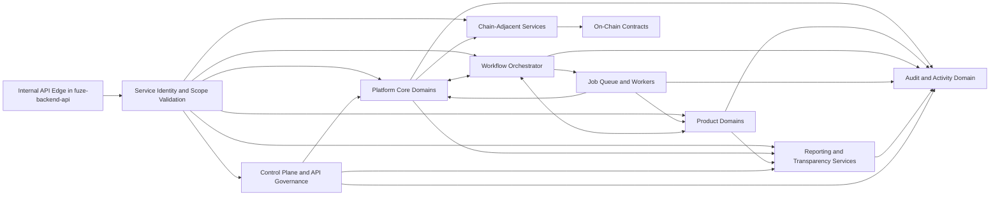
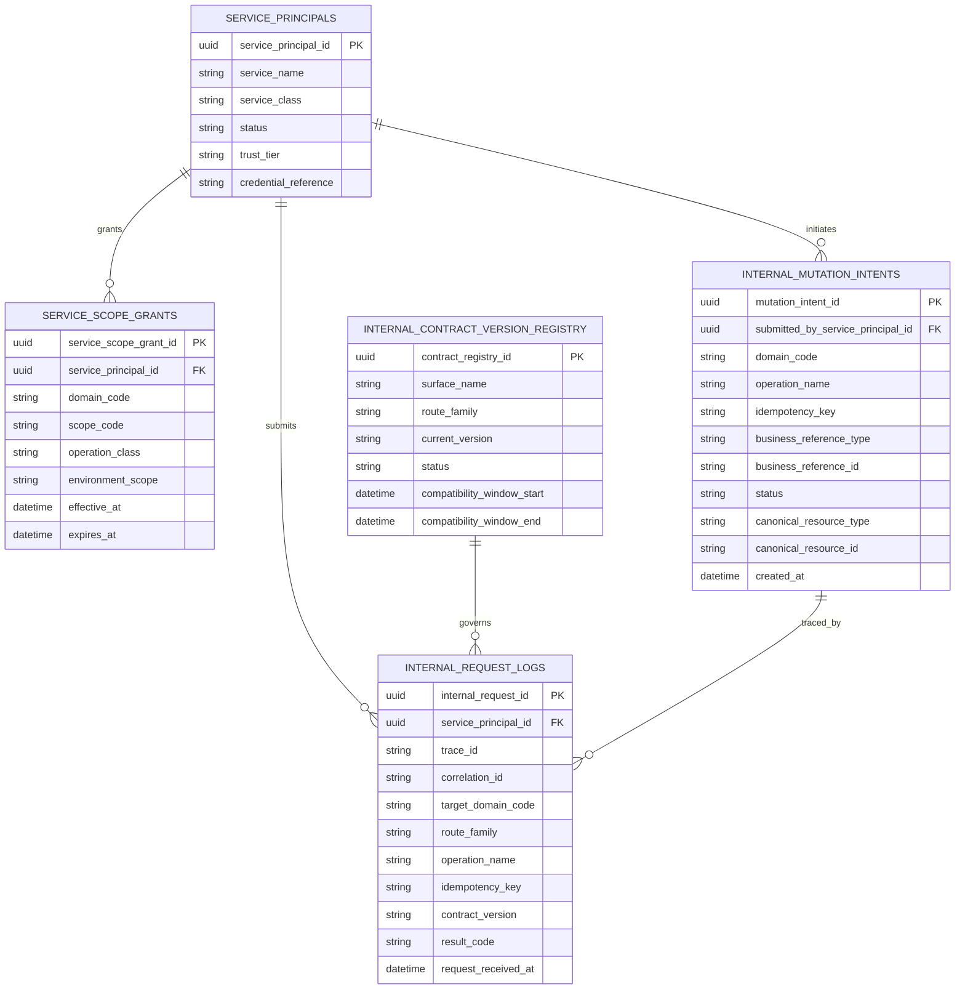
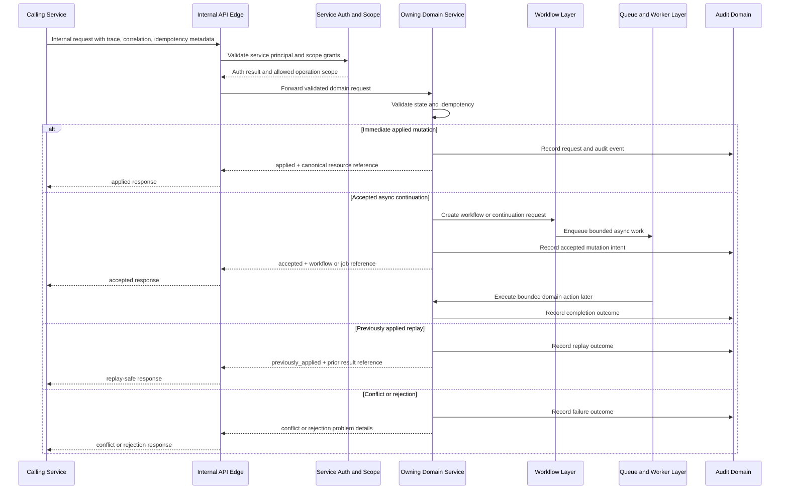

# INTERNAL_SERVICE_API_SPEC.md

## 1. Title
FUZE Internal Service API Specification

## 2. Document Metadata
- Document Name: `INTERNAL_SERVICE_API_SPEC.md`
- Status: Active Draft for Approval
- API Classification: `internal`
- Owning Domain: Platform API governance / internal service contract governance
- Primary Implementing Repo: `fuze-backend-api`
- Supporting Repos: `fuze-frontend-webapp`, `fuze-frontend-admin`, `fuze-contracts`, `fuze-public-registry`, future `fuze-sdk`
- Primary System of Record: domain-owned service contracts and domain-owned canonical data stores inside `fuze-backend-api`, with explicit contract truth where on-chain execution is involved
- Canonical Folder Target: `fuze.ac > docs > api-spec`
- Interpretation Mode: internal service contract source of truth
- Related Specifications:
  - `API_ARCHITECTURE_SPEC.md`
  - `PUBLIC_API_SPEC.md`
  - `EVENT_MODEL_AND_WEBHOOK_SPEC.md`
  - `IDEMPOTENCY_AND_VERSIONING_SPEC.md`
  - `MIGRATION_AND_BACKWARD_COMPATIBILITY_SPEC.md`

## 3. Purpose
This document defines the canonical internal service API architecture of the FUZE platform. Its purpose is to establish how FUZE services communicate with one another inside the platform boundary, how internal write and coordination paths align with domain ownership, how internal interfaces differ from public APIs and admin edge surfaces, and how service-to-service contracts preserve correctness across shared identity, workspaces, Platform Credits, billing, AI orchestration, workflows, payout preparation, transparency, governance-sensitive controls, and product-specific domains.

FUZE is a platform-first ecosystem with shared platform primitives, product extension domains, asynchronous execution, chain-adjacent operations, and derived public reporting surfaces. In this environment, internal service APIs are not incidental implementation detail. They are a core enforcement layer for ownership boundaries, mutation authority, traceability, retry safety, and operational isolation. A weak internal contract model would allow hidden cross-domain writes, direct table coupling, ambiguous service responsibilities, and economic errors in credits, billing, payouts, and governance-sensitive actions.

## 4. Scope
This specification covers:
- the canonical role of internal service APIs in FUZE
- the distinction between internal service APIs, public APIs, admin/control interfaces, events, jobs, and webhooks
- the internal API surface families used across platform, product, reporting, workflow, async execution, and chain-adjacent coordination
- ownership-aligned rules for synchronous mutation and query APIs
- accepted-state patterns for async work initiation
- authentication, authorization, service identity, and scope rules for internal callers
- request, response, error, correlation, and audit architecture for service-to-service traffic
- idempotency and versioning expectations for cross-domain contracts
- event emission expectations when internal APIs cause meaningful state transitions
- database-oriented contract support entities needed to govern internal API execution
- implementation expectations for `fuze-backend-api`

This specification does not define every endpoint field for each domain-specific contract, every event payload, or every deployment-network control detail. Those belong in narrower API SPEC files and machine-readable contracts for specific domains.

## 5. Source-of-Truth Inputs
### Governing FUZE indexes
- `DOCS_SPEC.md`
- `SYSTEM_SPEC_INDEX.md`

### Highest-priority FUZE system specifications used
- `SYSTEM_BOUNDARY_AND_OWNERSHIP_SPEC.md`
- `PLATFORM_ARCHITECTURE_SPEC.md`
- `DOMAIN_OWNERSHIP_MATRIX_SPEC.md`
- `DATA_MODEL_AND_ENTITY_OWNERSHIP_SPEC.md`
- `ONCHAIN_OFFCHAIN_RESPONSIBILITY_SPEC.md`

### Additional FUZE system specifications used
- `SERVICE_TOPOLOGY_SPEC.md`
- `WORKFLOW_AND_AUTOMATION_SPEC.md`
- `JOB_QUEUE_AND_WORKER_SPEC.md`
- `EVENT_MODEL_AND_WEBHOOK_SPEC_refreshed.md`
- `IDEMPOTENCY_AND_VERSIONING_SPEC.md`
- `AUTH_SESSION_AND_LINKED_LOGIN_SPEC.md`
- `ROLE_PERMISSION_AND_ACCESS_CONTROL_SPEC.md`
- `AUDIT_LOG_AND_ACTIVITY_SPEC.md`
- `PLATFORM_CREDITS_SPEC.md`
- `CREDIT_LEDGER_AND_SETTLEMENT_SPEC.md`
- `SUBSCRIPTIONS_AND_USAGE_BILLING_SPEC.md`
- `PROFIT_PARTICIPATION_SYSTEM_SPEC.md`
- `TRANSPARENCY_REPORTING_SPEC.md`

### FUZE core docs used for architectural alignment
- `FUZE_WHITEPAPER_v.2026.3.0.1.pdf`
- `FUZE_CHAIN_ARCHITECTURE.md`
- `FUZE_PLATFORM_CREDITS.md`
- `STABLECOIN_PROFIT_PARTICIPATION.md`
- `TOKEN_CONTRACT_ARCHITECTURE_.md`

### Supporting format and quality guides
- `The_API_Specification_guide.md`
- `Database_Schemas_Guide.md`

### External standards used only as supporting design guidance
- RFC 9110 for HTTP semantics and idempotent method meaning
- RFC 9457 for structured problem details for HTTP APIs
- OpenAPI Specification 3.1 conventions for contract derivation
- AsyncAPI conventions for event and webhook contract derivation

### Source priority interpretation
Where ambiguity exists, platform-wide ownership and architecture documents override narrower local API assumptions. Docs-level conflicts follow `DOCS_SPEC.md`. System-spec conflicts follow `SYSTEM_SPEC_INDEX.md`. Internal API convenience must not override platform ownership, on-chain/off-chain separation, or the non-negotiable distinction among FUZE token, Platform Credits, stablecoin payout execution, treasury, and governance.

## 6. Governing Architecture and Ownership Interpretation
Internal service APIs belong primarily to `fuze-backend-api` because the backend owns business truth, orchestration, workflow coordination, worker-triggered domain actions, integration normalization, and control-plane backend behavior. `fuze-frontend-webapp` and `fuze-frontend-admin` may consume backend APIs through edge surfaces, but they do not own durable domain truth by themselves. `fuze-contracts` owns contract behavior where state is explicitly committed on-chain. `fuze-public-registry` exposes derived public trust artifacts and must not be treated as canonical internal mutation authority.

The governing interpretation for internal service APIs is therefore:
- internal service APIs are ownership-respecting collaboration boundaries
- canonical writes must terminate in the domain that owns the fact
- public edge surfaces must not become a shortcut for internal service-to-service mutation
- workflow and worker infrastructure may coordinate and execute, but do not own the ultimate meaning of the underlying domain state
- chain-facing operations must remain isolated behind explicit chain-adjacent services or adapters
- reporting and transparency services may read, derive, and publish but must not redefine canonical truth

This specification therefore assigns internal service APIs to one of several families rather than collapsing all service traffic into one undifferentiated private REST layer.

## 7. Domain Responsibilities
### Platform core domains with internal service API ownership
The following platform domains own canonical internal service APIs for their truth categories:
- Identity
- Auth and Session
- Workspace and Organization
- Role and Access Control
- Wallet-Aware Participation
- Commerce and Billing
- Platform Credits
- Invoicing and Receipts
- Payment Verification and Normalization
- AI Orchestration
- Workflow and Automation
- Job Queue and Worker Coordination
- Audit Log and Activity
- Transparency Reporting
- Payout Orchestration
- Control Plane / Admin Controls
- Integration Adapter Layer

### Product domains with internal service API ownership
Each FUZE product domain owns internal contracts for product-specific truth and workflows:
- QTB
- AIMM
- ZAGA
- AIE
- HerHelp
- Botmad
- future product domains following the same rule

### On-chain and chain-adjacent domain responsibility
Internal services may query, coordinate, validate, or prepare actions around chain state, but they do not redefine contract-native truth. Internal chain-adjacent services exist for:
- Ethereum token state reads and enrichment
- Base credits commitment interaction
- Base payout execution coordination
- snapshot ingestion and eligibility preparation
- contract event ingestion and normalization

### Reporting and derived domains
Reporting services own derived outputs such as transparency summaries, payout-ledger materialization, and public registry artifacts. They are allowed to read, derive, and present. They are not allowed to silently mutate canonical billing, credits, payout, or governance truth.

## 8. Out of Scope
The following are out of scope for this specification:
- public partner APIs and public consumer contracts
- browser-facing API ergonomics except where they influence shared contract boundaries
- human operator workflow detail for every admin screen
- exact queue broker selection, service mesh selection, or vendor-specific network controls
- exact OpenAPI and AsyncAPI YAML syntax for each domain
- smart-contract ABI and storage layout detail
- frontend state management design inside `fuze-frontend-webapp` or `fuze-frontend-admin`
- private database-to-database shortcuts between services
- any design that allows products to own shared platform primitives or chain truth indirectly

## 9. Canonical Entities and Data Ownership
Internal service APIs require a small set of cross-domain governance entities in addition to the canonical business entities already owned by their domains.

### Canonical business entities referenced through internal APIs
These remain canonically owned by their home domains:
- `account`
- `linked_login_method`
- `session`
- `workspace`
- `workspace_membership`
- `role_assignment`
- `wallet_link`
- `payment_record`
- `subscription`
- `entitlement`
- `credits_account`
- `credits_ledger_entry`
- `invoice`
- `receipt`
- `workflow_instance`
- `job`
- `audit_event`
- product-domain entities such as `qtb_analysis_request`, `aimm_strategy_config`, `zaga_utility_program`, `aie_event_profile`, `herhelp_generation_project`, and `botmad_scan_run`
- policy-derived entities such as `eligibility_dataset` and `payout_cycle`

### Internal API governance entities
These entities exist to govern internal service-to-service behavior:

#### `service_principal`
Represents an authenticated internal caller such as a platform service, product service, worker class, scheduler, reporting service, admin control service, or integration adapter.

Canonical owner:
- Platform auth/session and internal API governance layer

Durable facts:
- `service_principal_id`
- `service_name`
- `service_class`
- `status`
- `trust_tier`
- `credential_reference`
- `created_at`
- `rotated_at`
- `revoked_at`

#### `service_scope_grant`
Represents the set of internal actions or query scopes granted to a given service principal.

Canonical owner:
- Role and Access / Control Plane domains

Durable facts:
- `service_scope_grant_id`
- `service_principal_id`
- `scope_code`
- `domain_code`
- `operation_class`
- `environment_scope`
- `approved_by_actor_ref`
- `effective_at`
- `expires_at`
- `revoked_at`

#### `internal_request_log`
Represents the canonical record of an internal API request for traceability and replay interpretation. This is not a replacement for application logs. It is the structured contract-level request record for meaningful internal interactions.

Canonical owner:
- Audit Log and Activity domain

Durable facts:
- `internal_request_id`
- `trace_id`
- `correlation_id`
- `service_principal_id`
- `caller_service_name`
- `target_domain_code`
- `route_family`
- `operation_name`
- `request_hash`
- `idempotency_key`
- `owner_scope_ref`
- `request_received_at`
- `response_status_class`
- `result_code`
- `latency_ms`

#### `internal_mutation_intent`
Represents a domain-owned mutation request reference used where the internal API begins a meaningful write or accepted async action.

Canonical owner:
- Target owning domain, with audit linkage

Durable facts:
- `mutation_intent_id`
- `domain_code`
- `operation_name`
- `idempotency_key`
- `business_reference_type`
- `business_reference_id`
- `submitted_by_service_principal_id`
- `status`
- `workflow_instance_id` nullable
- `job_id` nullable
- `resolved_at`

#### `internal_contract_version_registry`
Represents version lineage for internal route families and payload contracts.

Canonical owner:
- Platform API governance / control-plane governance

Durable facts:
- `contract_registry_id`
- `surface_name`
- `route_family`
- `current_version`
- `compatibility_window_start`
- `compatibility_window_end` nullable
- `status`
- `supersedes_contract_registry_id` nullable

### Ownership rules
- business entities remain owned by their canonical domains
- internal API governance entities exist only to authenticate, authorize, trace, version, and protect cross-domain collaboration
- derived dashboards, caches, and exports do not own internal API truth
- the existence of a service principal or scope grant does not transfer business ownership away from the target domain

## 10. State Model and Lifecycle
### Internal mutation lifecycle
For meaningful internal write operations, the canonical lifecycle is:
- `received`
- `validated`
- `accepted`
- `applied`
- `previously_applied`
- `rejected`
- `conflicted`
- `failed_retryable`
- `failed_terminal`
- `compensated` where applicable

### Internal request semantics
- `received`: target service accepted request transport and correlation context
- `validated`: authentication, authorization, schema, and domain precondition checks passed
- `accepted`: async work or domain-owned processing was admitted but final outcome is pending
- `applied`: the target domain newly mutated canonical truth
- `previously_applied`: an equivalent prior request already applied the business action
- `rejected`: request was unauthorized, malformed, or policy-denied
- `conflicted`: request is not a safe repeat and is incompatible with current state or prior use of the idempotency identity
- `failed_retryable`: transient failure occurred after admission; safe retry remains possible under idempotency rules
- `failed_terminal`: no safe automatic continuation is allowed
- `compensated`: partial work required explicit release, reversal, or cleanup

### Internal contract lifecycle
Each internal contract family should be tracked through:
- `draft`
- `active`
- `deprecated`
- `retired`
- `blocked` where emergency disablement or security posture requires it

### Service principal lifecycle
Each service principal should support:
- `provisioned`
- `active`
- `restricted`
- `rotating`
- `revoked`

## 11. API Surface Overview
FUZE internal service APIs are divided into six canonical surface families.

### 11.1 Canonical domain mutation APIs
These are the only approved synchronous or accepted-state internal write paths for canonical domain state.

Examples:
- issue credits after verified payment
- transition subscription renewal state
- record workspace membership change
- submit payout-cycle publication preparation
- create governance action record

### 11.2 Domain query APIs
These expose current canonical state or tightly owned reads needed by other services.

Examples:
- resolve account status
- fetch workspace membership authorization context
- get current entitlement state
- fetch current credits balance projection
- fetch payout cycle status

### 11.3 Control and policy APIs
These are more restricted internal surfaces for sensitive operations.

Examples:
- governance approval registration
n- treasury action preflight
- registry publication gating
- emergency control-plane restriction activation

### 11.4 Orchestration support APIs
These are used by workflows, schedulers, and async execution to begin or correlate bounded work.

Examples:
- request AI task routing
- begin workflow step advancement
- request heavy export generation
- initiate payout preparation batch

### 11.5 Internal derived read APIs
These expose composed read models for operational use.

Examples:
- reconciliation summary
- payout review dashboard view
- governance queue overview
- transparency publication readiness view

### 11.6 Chain-adjacent coordination APIs
These isolate chain reads, contract event normalization, and contract-side action preparation.

Examples:
- resolve Ethereum token holding snapshot reference
- submit Base credits commitment preparation
- ingest contract event batch
- validate payout funding readiness

### Surface rules
- public clients never call internal service APIs directly
- admin UIs do not bypass owning domains; they reach backend-admin edge routes which in turn invoke internal domain APIs
- workflows and workers use the same domain-owned APIs rather than privileged private table writes
- internal query APIs must not become a license for hidden broad read access across unrelated domains

## 12. Authentication and Authorization Model
### Internal authentication model
All internal service APIs must use explicit authenticated service identity. Network adjacency alone is insufficient.

Supported internal caller classes:
- platform core service
- product domain service
- workflow orchestrator
- job worker class
- scheduler
- reporting/transparency service
- control-plane/admin service
- integration adapter service
- chain-adjacent service

Authentication mechanisms may be implemented through one or more of the following, provided the service identity remains explicit and auditable:
- mTLS service identity
- signed service JWT or equivalent short-lived bearer credential
- workload identity bound to runtime environment
- rotation-aware credential pair managed through secrets and config policy

### Internal authorization model
Authorization must evaluate:
- authenticated `service_principal`
- allowed `service_scope_grant`
- target domain
- operation class (query, mutation, control, orchestration, derived-read)
- owner scope where applicable (account, workspace, product, payout cycle, governance action)
- trust tier and environment
- whether the target operation is governance-sensitive, treasury-sensitive, payout-sensitive, or commercially sensitive

### Authorization principles
- trusted caller does not imply unrestricted caller
- workflow orchestrators and workers may invoke only the operations they are explicitly allowed to coordinate
- reporting services usually receive read/derive rights, not write rights
- product services may request Platform Credits spends through the credits domain, but may not issue arbitrary credits
- services may not obtain broad access merely because they are deployed inside the same infrastructure boundary

## 13. API Endpoints / Interface Contracts
The following endpoint families are canonical architectural patterns for FUZE internal service APIs. These are normative route families for downstream OpenAPI derivation, not exhaustive domain-specific endpoint lists.

### 13.1 Identity query family
**Method:** `GET`  
**Path family:** `/internal/identity/accounts/{accountId}`  
**Purpose:** resolve canonical account state for another internal service  
**Caller type:** platform services, product services, workflow orchestrator, control-plane service  
**Auth expectation:** authenticated service principal with `identity.read` scope  
**Request summary:** path identifier; optional projection flags; correlation headers  
**Response summary:** canonical account status, risk state, linkage summary, mutation version, timestamps  
**Side effects:** none  
**Idempotency behavior:** natural read  
**Audit requirements:** structured request log only  
**Emitted events:** none

### 13.2 Workspace authorization family
**Method:** `POST`  
**Path family:** `/internal/workspaces/{workspaceId}:resolveAccess`  
**Purpose:** resolve account or service access in a workspace context  
**Caller type:** product services, workflow orchestrator, admin backend  
**Auth expectation:** `workspace.access.resolve` scope  
**Request summary:** actor reference, workspace reference, requested permission set, correlation metadata  
**Response summary:** allow/deny, effective roles, restrictions, reason codes, cacheability hint  
**Side effects:** none  
**Idempotency behavior:** query-style action; safe repeat  
**Audit requirements:** structured request log only  
**Emitted events:** none

### 13.3 Credits mutation family
**Method:** `POST`  
**Path family:** `/internal/credits/mutations`  
**Purpose:** create a domain-owned credits mutation intent such as issue, reserve, spend, release, reverse, or adjust  
**Caller type:** payment normalization service, billing service, product services, workflow orchestrator, support control-plane service  
**Auth expectation:** operation-specific scope such as `credits.issue.request`, `credits.reserve.request`, or `credits.adjust.request`  
**Request summary:** mutation class, owner scope, business reference, amount, currency/credits class reference, reason code, idempotency key  
**Response summary:** mutation intent reference, accepted/applied state, resulting ledger reference if applied, outcome semantics  
**Side effects:** may create ledger entries or accepted-state mutation intents  
**Idempotency behavior:** required; business-key scoped  
**Audit requirements:** mandatory internal request log plus domain audit event  
**Emitted events:** `credits.mutation.accepted`, `credits.issued`, `credits.reserved`, `credits.spent`, `credits.released`, `credits.reversed`, or `credits.adjusted` as applicable

### 13.4 Subscription transition family
**Method:** `POST`  
**Path family:** `/internal/billing/subscriptions/{subscriptionId}:transition`  
**Purpose:** perform domain-owned subscription or entitlement state transition  
**Caller type:** billing service, workflow orchestrator, verified admin control-plane service  
**Auth expectation:** `billing.subscription.transition` scope  
**Request summary:** target transition action, business reference, expected current state, idempotency key  
**Response summary:** new state or accepted-state continuation reference  
**Side effects:** may update subscription, entitlement, invoice, or workflow references through owning domain logic  
**Idempotency behavior:** required  
**Audit requirements:** mandatory  
**Emitted events:** `subscription.transitioned`, `entitlement.updated`, or accepted-state event

### 13.5 Workflow dispatch family
**Method:** `POST`  
**Path family:** `/internal/workflows`  
**Purpose:** create a workflow instance for a domain-owned business process  
**Caller type:** platform services, product services, scheduler, control-plane backend  
**Auth expectation:** `workflow.instance.create` plus domain-specific initiation scope  
**Request summary:** workflow class, business action reference, owner scope, initial context, idempotency key  
**Response summary:** workflow instance reference, current lifecycle state, job/work item links where already created  
**Side effects:** may instantiate workflow and dispatch jobs  
**Idempotency behavior:** required; repeat returns same workflow reference for same intended business action  
**Audit requirements:** mandatory  
**Emitted events:** `workflow.created`, `workflow.accepted`, optional domain-specific start event

### 13.6 Job dispatch family
**Method:** `POST`  
**Path family:** `/internal/jobs`  
**Purpose:** submit deferred work for execution when request-response is inappropriate  
**Caller type:** workflow orchestrator, platform services, product services, scheduler  
**Auth expectation:** `job.submit` plus job-class-specific scope  
**Request summary:** job class, owning domain reference, business action reference, idempotency context, priority class, retry policy reference  
**Response summary:** job reference, queue assignment, accepted state  
**Side effects:** creates queued execution intent  
**Idempotency behavior:** required  
**Audit requirements:** structured request record plus workflow/job audit where applicable  
**Emitted events:** `job.created`, `job.queued`

### 13.7 Chain-read family
**Method:** `GET`  
**Path family:** `/internal/chain/{chainContext}/...`  
**Purpose:** retrieve normalized chain-derived context without granting direct chain interpretation ownership to the caller  
**Caller type:** wallet-aware service, payout orchestration, transparency reporting, products consuming derived holder context  
**Auth expectation:** domain-specific read scope  
**Request summary:** chain context, contract reference, wallet or snapshot reference, consistency mode  
**Response summary:** normalized chain read model with source block or snapshot metadata  
**Side effects:** none, except optional cache refresh inside owning chain-adjacent service  
**Idempotency behavior:** natural read  
**Audit requirements:** request log for sensitive or high-volume queries  
**Emitted events:** none

### 13.8 Control-plane restricted family
**Method:** `POST`  
**Path family:** `/internal/control/...`  
**Purpose:** execute or register a governance-sensitive or operations-sensitive control action through the owning domain  
**Caller type:** admin backend service, governance service, emergency control-plane workflow  
**Auth expectation:** restricted service principal plus explicit control scope  
**Request summary:** control action reference, reason code, actor attribution, target domain and resource, idempotency key  
**Response summary:** accepted/applied status, approval requirements, resulting control action record  
**Side effects:** may create control record, policy lock, approval request, or domain state transition  
**Idempotency behavior:** required and strict  
**Audit requirements:** mandatory with actor and approval attribution  
**Emitted events:** control and audit events only

### 13.9 Derived-read family
**Method:** `GET` or `POST` for complex query bodies  
**Path family:** `/internal/reporting/...`  
**Purpose:** provide internal operational summaries and derived views  
**Caller type:** admin backend, transparency/reporting services, support dashboards  
**Auth expectation:** reporting read scopes only  
**Request summary:** filter set, owner scope, time range, projection preferences  
**Response summary:** derived, non-canonical view objects with lineage references  
**Side effects:** none  
**Idempotency behavior:** natural read  
**Audit requirements:** request log when data sensitivity warrants it  
**Emitted events:** none

## 14. Request Rules
All internal service API requests must follow these rules:

### Required request metadata
- `trace_id`
- `correlation_id`
- authenticated service identity
- operation route family
- environment / tenant / owner scope where applicable
- schema version or compatible contract version resolution where relevant

### Idempotency and mutation metadata
The following are required for retry-sensitive writes and accepted-state submissions:
- `idempotency_key`
- `business_reference_type`
- `business_reference_id`
- optional `expected_current_state`
- optional `workflow_instance_id` or `job_id` if the request is a continuation

### Request design rules
- query requests must not silently mutate domain truth
- mutation requests must name the intended business action, not just generic data patch semantics
- partial update semantics must remain domain-safe and explicit
- bulk internal mutation must be rare and domain-owned, with stricter safeguards than ordinary single-record requests
- requests must not expose raw persistence internals such as arbitrary SQL-oriented patch shapes across domains

## 15. Response Rules
Responses from internal service APIs must be explicit, typed, and stable enough for cross-domain consumption.

### Response classes
- immediate read response
- immediate applied mutation response
- accepted-state response for async continuation
- previously-applied idempotent replay response
- conflict response
- rejection response
- retryable-failure response where transport succeeded but domain continuation failed transiently

### Response requirements
- include `trace_id` and `correlation_id`
- include `contract_version`
- include stable `result_code`
- include `resource_version` or comparable concurrency/version information where meaningful
- for accepted-state results, include the next status-check or correlated workflow/job reference
- for previously-applied responses, include the prior canonical result reference where safe and useful
- for derived reads, include lineage hints to canonical domains where practical

### Response semantics rules
- internal APIs must not force consumers to infer whether a repeated mutation applied newly or not
- accepted-state responses must not pretend async work already completed
- chain-derived reads must distinguish source block/snapshot context from platform policy interpretation context

## 16. Error Model
Internal service APIs must use a structured error model compatible with RFC 9457-style problem details for HTTP transport while preserving FUZE-specific internal error semantics.

### Base error shape
At minimum, error responses should include:
- `type`
- `title`
- `status`
- `detail`
- `instance`
- `trace_id`
- `correlation_id`
- `result_code`
- `domain_code`
- optional `retryable`
- optional `idempotency_disposition`
- optional `conflict_reference`
- optional `field_errors` for validation failures

### Canonical error categories
- `validation_error`
- `authentication_failed`
- `authorization_denied`
- `scope_denied`
- `resource_not_found`
- `state_conflict`
- `idempotency_conflict`
- `already_applied`
- `dependency_unavailable`
- `rate_limited_internal`
- `governance_restriction`
- `control_plane_restriction`
- `chain_dependency_unavailable`
- `terminal_policy_denial`

### Error rules
- internal error payloads must explain interface-level failure, not expose raw implementation internals
- callers must be able to distinguish retryable failure from non-retryable failure
- state conflicts and idempotency conflicts must not be collapsed into generic 500-class failures
- authorization failures for internal callers must remain explicit for auditability

## 17. Idempotency and Mutation Safety
Internal service APIs require strong idempotency because retries are common across service-to-service calls, workflows, and workers.

### Required idempotency classes
The strongest mandatory protection applies to:
- credits issuance, spend, reserve, release, reverse, and adjust requests
- subscription or entitlement transitions
- payment-normalization downstream mutations
- payout-cycle creation and publication preparation
- governance or control action creation
- registry and transparency publication actions
- async workflow and job submission where duplicate creation would be harmful

### Idempotency rules
- the owning target domain must enforce business-level idempotency
- calling service-side deduplication is helpful but never sufficient by itself
- a valid repeat of the same intended business action must result in `previously_applied` or the same accepted reference rather than duplicate mutation
- reuse of an idempotency key for materially different business intent must yield conflict
- idempotency identity must be scoped to the correct business boundary, such as account, workspace, subscription cycle, payment transaction, payout cycle, governance action, or workflow run

### Mutation safety rules
- internal APIs must prefer append-oriented economic records and explicit correction records over silent destructive rewrite for sensitive domains
- mutation APIs must validate expected current state where state-machine safety matters
- workflow and worker continuation must preserve original business reference identity during retries

## 18. Versioning and Compatibility Rules
Internal APIs require deliberate versioning, but their stability expectations are narrower than public APIs.

### Versioning principles
- route families and payload contracts must be explicitly versioned when change would break cross-domain callers
- compatible additive evolution is preferred within a supported version window
- breaking changes require parallel support period or migration path for dependent callers
- internal event schemas and internal API schemas must not drift independently when they represent the same business action family

### Contract version rules
- version identifiers must be recorded in `internal_contract_version_registry`
- internal callers must send or resolve a contract version for version-sensitive route families
- deprecated versions may remain active only within a declared compatibility window
- emergency block or rollback of a contract version must be possible through control-plane governance if correctness or security requires it

### Compatibility expectations
- internal APIs may evolve faster than public APIs, but not casually
- sensitive financial or governance-related routes require stricter compatibility discipline than low-risk internal derived reads
- async and accepted-state contracts must remain stable enough for workflows and workers to resume correctly after deployment changes

## 19. Event Emission and Webhook Behavior
Internal service APIs that cause meaningful state changes must emit or record the appropriate business events through the event model rather than relying on hidden side effects.

### Event rules
- canonical domain mutation APIs must emit domain-owned events after durable acceptance or durable mutation
- event emission must preserve correlation to the internal request, mutation intent, workflow instance, or job where relevant
- events are at-least-once by design and therefore consumers must be idempotent
- events should reflect business meaning, not transport detail

### When to emit events
Emit domain events for:
- credits mutation outcomes
- subscription transition outcomes
- entitlement changes
- workflow creation and key transitions
- job lifecycle transitions where cross-domain consumers rely on them
- payout orchestration milestones
- registry and transparency publication milestones
- governance or control action milestones

### Webhook relation
Internal service APIs do not directly imply external webhook delivery. External webhooks are downstream exposure mechanisms governed by the event and webhook model. When an internal mutation ultimately causes external delivery, the platform must preserve the distinction among:
- the internal business event
- the webhook event identity
- the webhook delivery attempt identity

## 20. Audit and Activity Requirements
Internal service APIs must create structured audit lineage for meaningful operations.

### Mandatory audit triggers
Audit records are mandatory for:
- credits and billing mutations
- payout-cycle creation, publication, and correction
- governance-sensitive control actions
- admin-triggered overrides or corrections
- wallet-link state changes
- internal permission or scope changes
- workflow approval outcomes
- registry and transparency publication actions

### Audit requirements
- record authenticated service principal
- record impersonated human actor if an admin/control action is executed on behalf of an operator
- record request identity, idempotency identity, business reference, and resulting canonical entity references
- distinguish query-only access from write actions in audit classification
- preserve prior state reference and resulting state reference where meaningful and safe

### Activity feed distinction
User-facing or operator-facing activity views may be derived from audit and business events, but they are not themselves the source of truth for internal API execution.

## 21. Data Model and Database Schema View
The platform should maintain the following schema-level support for internal service API governance. This is an architectural schema view, not a full migration file.

### `service_principals`
- `service_principal_id` UUID PK
- `service_name` text unique not null
- `service_class` text not null
- `status` text not null
- `trust_tier` text not null
- `credential_reference` text not null
- `created_at` timestamptz not null
- `rotated_at` timestamptz null
- `revoked_at` timestamptz null
- `created_by_actor_ref` text null
- indexes:
  - unique on `service_name`
  - index on `status`
  - index on `service_class`

### `service_scope_grants`
- `service_scope_grant_id` UUID PK
- `service_principal_id` UUID FK -> `service_principals.service_principal_id`
- `domain_code` text not null
- `scope_code` text not null
- `operation_class` text not null
- `environment_scope` text not null
- `approved_by_actor_ref` text null
- `effective_at` timestamptz not null
- `expires_at` timestamptz null
- `revoked_at` timestamptz null
- uniqueness:
  - unique active grant on (`service_principal_id`, `scope_code`, `environment_scope`, `revoked_at` null semantics enforced at application layer or partial unique index)
- indexes:
  - index on `service_principal_id`
  - index on `scope_code`
  - index on `domain_code`

### `internal_request_logs`
- `internal_request_id` UUID PK
- `trace_id` text not null
- `correlation_id` text not null
- `service_principal_id` UUID FK -> `service_principals.service_principal_id`
- `caller_service_name` text not null
- `target_domain_code` text not null
- `route_family` text not null
- `operation_name` text not null
- `request_hash` text not null
- `idempotency_key` text null
- `owner_scope_type` text null
- `owner_scope_id` text null
- `contract_version` text not null
- `request_received_at` timestamptz not null
- `response_status_class` text not null
- `result_code` text not null
- `latency_ms` integer not null
- `workflow_instance_id` UUID null
- `job_id` UUID null
- indexes:
  - index on `trace_id`
  - index on `correlation_id`
  - index on (`target_domain_code`, `route_family`, `request_received_at` desc)
  - index on `idempotency_key`

### `internal_mutation_intents`
- `mutation_intent_id` UUID PK
- `domain_code` text not null
- `operation_name` text not null
- `idempotency_key` text not null
- `business_reference_type` text not null
- `business_reference_id` text not null
- `owner_scope_type` text null
- `owner_scope_id` text null
- `submitted_by_service_principal_id` UUID FK -> `service_principals.service_principal_id`
- `status` text not null
- `canonical_resource_type` text null
- `canonical_resource_id` text null
- `workflow_instance_id` UUID null
- `job_id` UUID null
- `resolved_at` timestamptz null
- `created_at` timestamptz not null
- uniqueness:
  - unique on (`domain_code`, `operation_name`, `idempotency_key`, `business_reference_type`, `business_reference_id`, coalesce(owner_scope_type,''), coalesce(owner_scope_id,''))
- indexes:
  - index on `status`
  - index on (`domain_code`, `created_at` desc)
  - index on `canonical_resource_type`, `canonical_resource_id`

### `internal_contract_version_registry`
- `contract_registry_id` UUID PK
- `surface_name` text not null
- `route_family` text not null
- `current_version` text not null
- `status` text not null
- `compatibility_window_start` timestamptz not null
- `compatibility_window_end` timestamptz null
- `supersedes_contract_registry_id` UUID null FK -> self
- `change_summary` text not null
- indexes:
  - unique on (`surface_name`, `route_family`, `current_version`)
  - index on (`surface_name`, `route_family`, `status`)

### Relationship notes
- these schema objects support internal API governance but do not replace domain canonical schemas
- economic domain tables such as credits ledger, subscriptions, and payout cycle records remain owned by their own domains
- workflow and job tables remain canonical for execution coordination, not for domain meaning
- reporting tables remain derived even if they reference internal mutation intents for lineage

## 22. Architecture Diagram — Mermaid flowchart

## 23. Data Design — Mermaid Diagram

## 24. Flow View
### Happy path flow
1. Caller service authenticates as a `service_principal`.
2. Internal API edge validates credential, resolves scope grants, and attaches `trace_id` and `correlation_id`.
3. Target domain validates request schema, owner scope, and state preconditions.
4. For reads, the domain returns current canonical state or a domain-owned query projection.
5. For write actions, the domain validates `idempotency_key`, creates or reuses a `internal_mutation_intent`, and applies or accepts the business action.
6. Domain records audit lineage and emits the appropriate business event.
7. If async continuation is needed, a workflow or job reference is returned.
8. Caller receives explicit result semantics: `applied`, `accepted`, or `previously_applied`.

### Alternate flow view
1. Caller is authorized to initiate work but the action is naturally async.
2. Domain validates and returns `accepted` together with workflow or job reference.
3. Workflow orchestrator dispatches jobs through queue/worker infrastructure.
4. Jobs invoke domain-owned APIs rather than mutating domain tables directly.
5. Final status becomes visible through domain read APIs, workflow APIs, or emitted events.

### Failure and recovery flow
1. Caller sends a mutation request with valid authentication.
2. Target domain detects conflict, missing scope, invalid state, or dependency failure.
3. If retry is unsafe, response is `conflicted`, `rejected`, or `failed_terminal`.
4. If retry is safe, response is `failed_retryable` or accepted work moves to retry-scheduled state within workflow/job layer.
5. If partial effects occurred, owning domain records compensation or release actions explicitly.
6. Audit and observability remain intact so operators can distinguish duplicate attempts, conflicts, and compensations.

### Retry behavior
- safe repeats of the same business action return prior result or prior accepted reference
- retries never create duplicate credits, subscription transitions, payout-cycle steps, or governance records
- workflow and worker retries preserve original business reference identity

### Admin override and review flow
- admin surfaces never call unrelated domains directly with hidden write authority
- `fuze-frontend-admin` uses backend-admin edge routes
- backend-admin edge invokes restricted internal control APIs
- resulting action still terminates in the owning domain and preserves audit attribution for the human actor and the control-plane service principal

## 25. Data Flows — Mermaid sequenceDiagram

## 26. Security and Risk Controls
Internal service APIs must enforce the following controls:
- explicit service identity for every internal caller
- least-privilege service scopes by operation class and domain
- environment-aware credential separation
- route-family allowlists for sensitive domains
- stricter authentication and authorization for governance-, treasury-, payout-, and credits-sensitive operations
- structured problem details without leaking raw internals
- replay-safe idempotency enforcement for sensitive mutations
- request hashing and correlation logging for forensic analysis
- emergency contract version block or service principal revocation through control-plane controls
- chain dependency isolation so chain RPC or indexer instability does not silently corrupt platform-owned truth

Internal APIs must also avoid these anti-patterns:
- direct cross-domain database writes
- generic superuser service identities shared across many unrelated services
- hidden product-local private APIs that mutate shared platform truth
- background workers with implicit unrestricted write access
- reporting services mutating canonical financial or governance state

## 27. Operational Considerations
Operationally, FUZE internal service APIs must support:
- correlation tracing across sync and async paths
- metrics by route family, domain, result code, and latency band
- visibility into rejected, conflicted, replayed, and compensated outcomes
- service principal rotation without contract drift
- compatibility windows for internal contract versions
- degraded-mode handling when downstream domains or chain adapters are unavailable
- replay tooling for workflows and jobs that preserves idempotency safety
- dead-letter visibility for async work that depends on internal domain APIs
- audit search by trace, correlation, idempotency key, business reference, workflow ID, and job ID

Recommended operational topology inside `fuze-backend-api`:
- edge services terminate internal calls and attach tracing
- platform core modules own their canonical contract handlers
- workflow and worker modules call domain contracts rather than internal private tables
- chain-adjacent modules remain isolated from ordinary request traffic
- control-plane modules gate emergency and governance-sensitive operations

## 28. Acceptance Criteria
This specification is acceptable only if all of the following are true:
1. Every internal write path terminates in the domain that canonically owns the mutated fact.
2. No internal API contract implies that `fuze-frontend-webapp` or `fuze-frontend-admin` owns durable business truth.
3. Product domains consume shared platform domains instead of redefining identity, workspace, credits, billing, payout, or governance semantics.
4. Internal service authentication uses explicit service identity rather than implicit network trust alone.
5. Sensitive internal operations support least-privilege authorization and domain-scoped control.
6. Retry-sensitive internal mutations support business-level idempotency.
7. Accepted async work returns explicit continuation references and does not pretend to be synchronously completed.
8. Audit lineage exists for all economically sensitive, governance-sensitive, payout-sensitive, and admin-sensitive actions.
9. Reporting and transparency services remain derived and do not silently redefine canonical state.
10. Chain-adjacent APIs do not collapse on-chain truth and off-chain policy interpretation into one ambiguous owner.
11. Internal contract versioning supports controlled evolution and compatibility windows.
12. Mermaid diagrams remain consistent with prose ownership, data, and flow rules.

## 29. Test Cases
### Positive cases
1. A payment normalization service calls credits issuance with a valid idempotency key and receives `applied`; one credits ledger mutation is created.
2. A product service requests a credits reserve through the credits domain and receives a valid mutation intent reference.
3. A workflow service submits a report-generation workflow and receives `accepted` with workflow and job references.
4. A reporting service calls an internal derived-read route and receives a derived summary with lineage references.
5. A chain-adjacent service returns normalized Ethereum holder context with source snapshot metadata.

### Negative cases
6. A product service attempts to issue arbitrary credits without the required scope and is denied.
7. A reporting service attempts to call a canonical billing mutation route and is denied.
8. An internal request is structurally invalid; the target domain returns validation problem details and no mutation occurs.
9. A control action is attempted without governance-sensitive scope and is rejected.

### Authorization cases
10. A workflow worker with allowed `credits.reserve.request` scope can reserve credits but cannot perform `credits.issue.request`.
11. An admin backend service can initiate a restricted control action only through control routes and not through direct unrelated domain bypass.
12. A product service can query workspace access context for a workspace-scoped request but cannot query unrelated broad platform role data without scope.

### Idempotency cases
13. The same credits issuance request is retried with identical business reference and idempotency key; the domain returns `previously_applied` and does not create a duplicate ledger entry.
14. The same workflow submission is retried; the platform returns the same workflow reference.
15. An idempotency key is reused for a materially different credits mutation; the domain returns conflict.

### Concurrency and replay cases
16. Two internal callers race to perform incompatible subscription transitions; one succeeds and the other receives state conflict.
17. A worker crashes after dispatching a retry-safe domain request; replay does not duplicate the business effect.
18. An event-driven continuation re-enters the same mutation path after partial failure; domain idempotency prevents duplicate application.

### Reconciliation and ledger integrity cases
19. A credits mutation request succeeds but downstream reporting generation fails; canonical credits truth remains correct and reporting is retried separately.
20. A payout preparation step is accepted, but chain dependency is unavailable; no duplicate cycle creation occurs under retry.

### Event emission cases
21. A successfully applied subscription transition emits exactly one business event, while duplicate retries do not emit duplicate semantic transitions.
22. A previously applied replay still records request lineage but does not emit a second canonical mutation event.

## 30. Open Questions or Explicit Deferred Decisions
1. Whether FUZE should standardize mTLS plus short-lived JWT together for all internal services, or allow workload identity plus service JWT as the primary mixed model.
2. The final internal route naming conventions for domain action suffixes such as `:transition`, `:resolveAccess`, or action-resource subcollections.
3. Whether internal version negotiation will be header-based, path-family-based, or registry-resolved through client generation and deployment policy.
4. The final persistence strategy for `internal_request_logs` versus ordinary observability logs when data volume becomes large.
5. Whether certain high-volume derived-read APIs should use asynchronous materialization and query snapshots rather than synchronous derived reads.
6. The exact compatibility policy for internal contract retirement in fast-moving product domains versus sensitive platform financial domains.

## 31. Implementation Notes for `fuze-backend-api`
`fuze-backend-api` should implement internal service APIs as domain-owned modules with explicit route families and typed contract handlers.

Recommended structure:
- `apps/api-edge` for request termination, service identity validation, and route dispatch
- `apps/admin-edge` for backend-admin restricted entry points that in turn call internal domain APIs
- `apps/webhook-ingest` for provider ingress normalization
- `apps/worker` and `apps/scheduler` for async execution that reuses the same domain-owned internal contracts
- `modules/platform/*` for shared platform domains
- `modules/products/*` for product domains
- `modules/chain/*` for chain-adjacent services
- `modules/reporting/*` for derived visibility services
- `modules/control/*` for control-plane and governance-sensitive services

Implementation rules:
- do not allow one domain module to mutate another domain’s persistence layer directly
- prefer typed internal client interfaces generated from approved internal contracts
- store idempotency and mutation intent logic with the owning target domain, not just at the caller edge
- ensure workers and workflows call the same domain mutation interfaces as ordinary internal callers where practical

## 32. Frontend Consumption Notes for `fuze-frontend-webapp` and `fuze-frontend-admin`
### `fuze-frontend-webapp`
- must consume only first-party app-facing backend routes, never raw internal service APIs
- may indirectly trigger internal domain activity through public or authenticated app APIs implemented in `fuze-backend-api`
- must treat internal accepted-state references as surfaced workflow/job state, not as domain ownership transfer

### `fuze-frontend-admin`
- may trigger sensitive operations only through backend-admin edge routes and control-plane APIs
- must not assume UI privilege equals direct domain authority
- should expose explicit state for approval, retry, conflict, and compensation outcomes returned by backend-controlled internal APIs
- should present internal derived reads and audit-backed status views without redefining business meaning locally

## 33. Contract Derivation Notes for OpenAPI / AsyncAPI and future `fuze-sdk`
### OpenAPI derivation
This narrative spec should derive into one or more internal OpenAPI contracts grouped by route family and target domain, including:
- shared internal headers and correlation schemas
- service-auth security schemes
- problem detail schemas
- idempotent mutation request schemas
- accepted-state response schemas

### AsyncAPI derivation
Internal API contracts that emit business events should align with AsyncAPI definitions for:
- workflow lifecycle events
- job lifecycle events
- credits and billing mutation events
- payout orchestration milestones
- registry and reporting publication milestones

### Future `fuze-sdk`
Future internal or partner-facing SDK generation must derive from approved machine-readable contracts rather than from frontend convenience wrappers. Product or platform SDK helpers must not invent business rules, idempotency semantics, or ownership assumptions absent from the approved narrative and machine-readable contracts.
