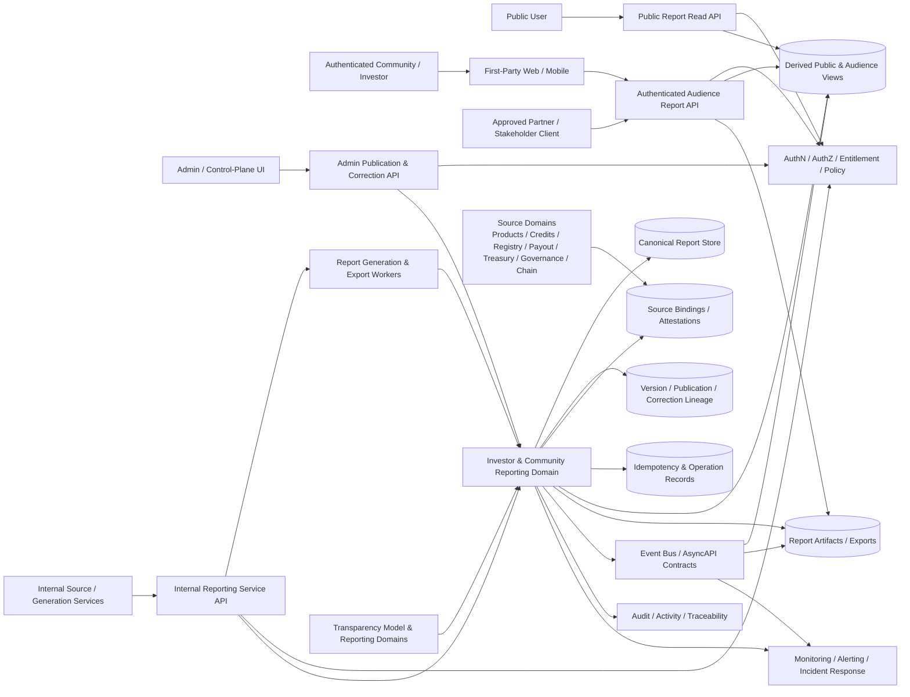
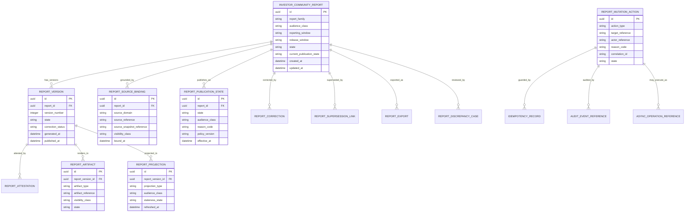
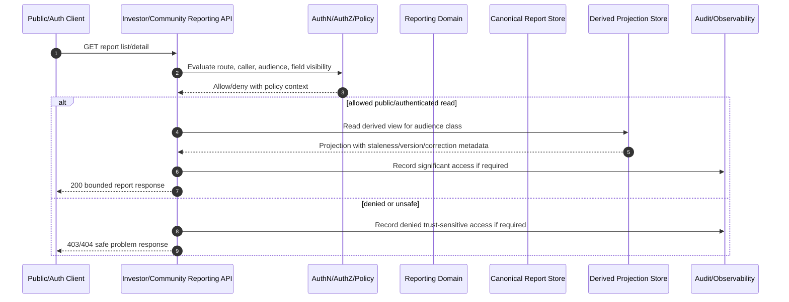
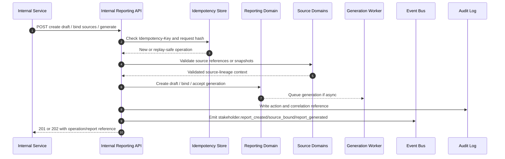
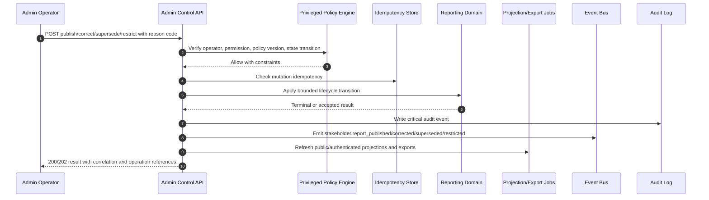

# FUZE Investor and Community Reporting API Specification

## Document Metadata

- **Document Name:** `INVESTOR_AND_COMMUNITY_REPORTING_API_SPEC.md`
- **Document Type:** API SPEC v2 / Production-grade interface-contract specification
- **Status:** Draft for canonical API SPEC v2 approval
- **Version:** 2.0.0
- **Effective Date:** 2026-04-25
- **Last Updated:** 2026-04-25
- **Reviewed On:** 2026-04-25
- **Document Owner:** FUZE Investor and Community Reporting Domain; named individual owner not yet specified in the retrieved governing materials
- **Approval Authority:** Not yet explicitly specified; constitutional and registry approval remains governed by `REFINED_SYSTEM_SPEC_INDEX.md` and the active FUZE approval workflow
- **Review Cadence:** Quarterly, and whenever investor/community disclosure posture, transparency posture, public API posture, governance/treasury posture, payout architecture, product portfolio posture, audience strategy, or correction policy materially changes
- **Governing Layer:** API contract expression layer for stakeholder-facing reporting and publication APIs
- **Parent Registry:** FUZE API SPEC v2 Canonical File Registry
- **Upstream Semantic Registry:** `REFINED_SYSTEM_SPEC_INDEX.md`
- **Upstream API Registry:** `API_SPEC_INDEX.md`
- **Primary Audience:** Platform architecture, backend engineering, API authors, public API authors, investor/community reporting authors, finance/operations, governance/treasury reviewers, audit/compliance, security/runtime teams, frontend teams, OpenAPI/AsyncAPI/SDK authors, implementation-contract authors
- **Primary Purpose:** Define production-grade API contracts for FUZE investor and community reporting surfaces, including public and authenticated report reads, internal report preparation, admin/control-plane publication and correction workflows, source lineage, report exports, events, auditability, idempotency, and migration posture
- **Primary Upstream References:** `INVESTOR_AND_COMMUNITY_REPORTING_SPEC.md`, `TRANSPARENCY_MODEL_SPEC.md`, `TRANSPARENCY_REPORTING_SPEC.md`, `PUBLIC_CONTRACT_AND_WALLET_REGISTRY_SPEC.md`, `PUBLIC_API_SPEC.md`, `API_ARCHITECTURE_SPEC.md`, `INTERNAL_SERVICE_API_SPEC.md`, `EVENT_MODEL_AND_WEBHOOK_SPEC.md`, `IDEMPOTENCY_AND_VERSIONING_SPEC.md`, `MIGRATION_AND_BACKWARD_COMPATIBILITY_SPEC.md`, `AUDIT_LOG_AND_ACTIVITY_SPEC.md`, `AUDIT_AND_ACCESS_TRACEABILITY_SPEC.md`, `SECURITY_AND_RISK_CONTROL_SPEC.md`, `MONITORING_ALERTING_AND_INCIDENT_RESPONSE_SPEC.md`, `PAYOUT_LEDGER_SPEC.md`, `PROFIT_PARTICIPATION_SYSTEM_SPEC.md`, `SNAPSHOT_AND_ELIGIBILITY_PIPELINE_SPEC.md`, `TREASURY_CONTROL_POLICY_SPEC.md`, `VAULT_ACTION_POLICY_SPEC.md`, `MULTISIG_AND_TIMELOCK_SPEC.md`, `GOVERNANCE_MODEL_SPEC.md`, `FOUNDATION_GOVERNANCE_SPEC.md`, `CHAIN_ARCHITECTURE_SPEC.md`
- **Primary Downstream Dependents:** Public stakeholder-report APIs, authenticated stakeholder-report APIs, investor/community report generation services, report attestation services, stakeholder-facing report sites, export pipelines, admin publication tooling, correction/remediation tooling, OpenAPI contracts, SDK read surfaces, AsyncAPI event contracts, reporting runbooks
- **API Surface Families Covered:** Public read, first-party authenticated read, internal service, admin/control-plane, event, async operation, reporting/export, implementation-facing contract surfaces
- **API Surface Families Excluded:** Raw treasury execution APIs, payout execution APIs, governance action APIs, raw chain-indexer APIs, generic analytics dashboards, CRM/contact APIs, email campaign delivery APIs, private board/data-room APIs, static rendering internals
- **Canonical System Owner(s):** Investor and Community Reporting Domain for stakeholder-reporting truth; stronger source domains retain their own canonical truth
- **Canonical API Owner:** Investor and Community Reporting API owner under FUZE Platform API Architecture governance
- **Supersedes:** `INVESTOR_COMMUNITY_REPORTING_API_SPEC.md` as historical/v1 naming and route material; any weaker API interpretation that treats investor/community reports as ad hoc documents, marketing copy, raw transparency exports, or uncontrolled audience-specific disclosures
- **Superseded By:** Not currently defined
- **Related Decision Records:** Not explicitly specified in retrieved governing materials
- **Canonical Status Note:** This API specification expresses API-contract truth only. It does not redefine investor/community reporting semantics, transparency semantics, payout truth, governance truth, treasury truth, registry truth, audit truth, or chain-native truth.
- **Implementation Status:** Normative API contract draft; downstream OpenAPI, AsyncAPI, SDK, backend implementation, frontend consumption, export, and admin tooling MUST align before production use
- **Approval Status:** Pending explicit FUZE API SPEC v2 approval workflow
- **Change Summary:** Upgrades the historical investor/community reporting API material into the API SPEC v2 format, aligns canonical filename with the v2 registry, separates public/authenticated/internal/admin/event/export surfaces, formalizes truth classes, request/response/error/status/idempotency rules, adds explicit diagrams, flow views, acceptance criteria, test cases, and boundary-violation guardrails

## Purpose

This specification defines the FUZE API contracts for investor and community reporting. It governs how APIs expose, create, prepare, publish, correct, supersede, restrict, retract, export, and observe stakeholder-facing reports without allowing API convenience, frontend needs, investor-relations workflow, public-site rendering, or admin tooling to redefine canonical reporting semantics.

The API exists because investor/community reporting is not informal content. It is FUZE's structured external explanation layer for stakeholders evaluating FUZE as a business, platform, ecosystem, and governed architecture. Reports may explain products, Platform Credits, token participation, reserves, treasury, governance, profit participation, payout posture, risks, safeguards, and structural updates, but reports remain derived stakeholder-explanation artifacts subordinate to stronger source-domain truth.

## Scope

This API specification governs:

- public list/detail APIs for reports approved for public visibility;
- authenticated first-party APIs for audience-scoped investor/community report access where explicitly approved;
- internal service APIs for report draft creation, source binding, generation, attestation, export preparation, and canonical report retrieval;
- admin/control-plane APIs for publish, correct, supersede, restrict, retract, re-scope, archive, and discrepancy remediation actions;
- event and async operation contracts for report lifecycle changes, export jobs, correction propagation, and projection refresh;
- request, response, error, result, status, idempotency, rate-limit, audit, observability, and versioning requirements;
- read-model, cache, export, and stakeholder surface rules for report-derived views;
- OpenAPI, AsyncAPI, SDK, and implementation-contract derivation guardrails.

## Out of Scope

This specification does not govern:

- canonical truth of contracts, wallets, balances, payouts, governance actions, reserve movements, treasury actions, chain-native facts, or accounting records;
- transparency-reporting schema and generation in full depth;
- public contract/wallet registry lifecycle in full depth;
- payout-ledger schema, claim execution, funding, or eligibility finalization;
- private board decks, diligence rooms, confidential investor portals, or private investor-only document-room permissioning beyond report audience class;
- CRM/contact management, outbound email campaign delivery, social scheduling, or newsletter list mechanics;
- exact static-site rendering, PDF rendering, deck rendering, document templating, or frontend composition;
- legal disclaimer wording, accounting policy wording, investor-relations staffing, or final human editorial workflows;
- database schema as a substitute for API contract semantics.

## Design Goals

1. Preserve investor/community reporting as a governed stakeholder-explanation layer, not a marketing or ad hoc document channel.
2. Make public, authenticated, internal, admin/control, event, async, and export surfaces explicit and non-overlapping.
3. Preserve clear separation among products, Platform Credits, token participation, reserves/treasury, governance, and profit participation.
4. Ensure reports remain source-grounded, versioned, audience-scoped, correction-safe, and historically intelligible.
5. Prevent public sites, portals, dashboards, exports, SDKs, or frontend views from becoming shadow owners of report truth.
6. Provide deterministic API behavior for publication, correction, supersession, restriction, retraction, idempotent retry, and conflict handling.
7. Support OpenAPI/AsyncAPI/SDK derivation without allowing machine-readable contracts to weaken domain ownership or public-safety rules.
8. Make auditability, traceability, observability, and migration safety reviewable before production use.

## Non-Goals

- This API is not a generic content-management API.
- This API is not an investor data-room API.
- This API is not a public transparency-reporting API in full depth.
- This API is not a governance, treasury, payout, contract registry, chain-indexer, accounting, or analytics API.
- This API does not make all stakeholder groups receive identical detail or timing.
- This API does not permit materially different architectural stories to be told to different external audiences.
- This API does not authorize silent correction, silent unpublish, silent audience broadening, or silent historical rewrite.

## Core Principles

### 1. Reporting-Is-Not-Source-Truth Principle

Investor/community reports are derived stakeholder-explanation artifacts. They MUST NOT replace transparency-report truth, registry truth, payout truth, governance truth, treasury-control truth, audit truth, chain truth, accounting truth, or product-domain truth.

### 2. API-Contract-Expression Principle

This API expresses refined system semantics at the interface layer. It MUST NOT redefine report-family meaning, audience-class meaning, publication-state meaning, correction lineage, source-domain truth, or transparency/public-trust semantics.

### 3. Audience-Separation Principle

Public community visibility, authenticated community visibility, authenticated investor visibility, partner/stakeholder visibility, and internal-only preparation states MUST remain explicit. Audience ambiguity defaults to the narrower or less-disclosive class.

### 4. Source-Grounded Publication Principle

Material report publication MUST require approved source lineage and, where policy requires, review or attestation lineage. Source references that are not public-safe or audience-safe MUST remain internal even when reports cite them indirectly.

### 5. Correction-Visibility Principle

Material report corrections, supersessions, restrictions, and retractions MUST preserve historical intelligibility and successor guidance. Silent overwrites are forbidden.

### 6. Derived-Surface Subordination Principle

Public pages, authenticated portals, dashboards, exports, feeds, caches, SDK objects, and generated artifacts are derived from canonical report truth. They MUST NOT become mutation owners or reinterpret current report meaning.

### 7. Privileged Action Boundary Principle

Publication, audience broadening, correction, supersession, restriction, retraction, and discrepancy resolution are privileged actions. They MUST be reason-coded, policy-constrained, least-privilege authorized, idempotent where mutation-capable, audited, and observable.

## Canonical Definitions

- **Investor and Community Report:** A stakeholder-facing report artifact produced under FUZE investor/community reporting rules for one or more approved external audiences.
- **Report Family:** Governed category of report with structural focus, cadence posture, and linkage expectations. Canonical families include Investor and Community Letter, Platform Progress Report, Token/Reserve/Governance Brief, Profit Participation and Payout Brief, Platform Credits and Internal Economics Brief, and Ecosystem Structure Update / Special Situation Note.
- **Audience Class:** Governed visibility classification for a report or variant, such as public community, authenticated community, authenticated investor, mixed public investor-community, partner/stakeholder, or internal-only.
- **Release Window:** Bounded publication window or distribution timing record associated with a report family, report variant, or version.
- **Stakeholder Reporting Window:** Recurring period, cycle, or material event window anchoring report meaning.
- **Source Lineage:** Durable linkage between a report and approved structured sources, snapshots, references, attestations, and source-domain records used to produce or validate it.
- **Correction Lineage:** Durable lineage showing how a report was corrected, superseded, restricted, supplemented, retracted, or archived.
- **Stakeholder Trust Surface:** Public or authenticated API, site, document, feed, export, or metadata surface exposing investor/community reporting artifacts or derived views.
- **Public Interpretation State:** The current public-facing or audience-facing meaning of a report after correction, supersession, restriction, and retraction rules are applied.

## Truth Class Taxonomy

1. **Semantic Truth:** Owned by refined system specs, especially `INVESTOR_AND_COMMUNITY_REPORTING_SPEC.md` for stakeholder-reporting semantics and stronger source-domain specs for underlying facts.
2. **API Contract Truth:** Owned by this API spec; defines interface families, route/resource posture, request/response/error/status semantics, idempotency, audit, versioning, and derivation constraints.
3. **Policy Truth:** Owned by access-control, public API, security, transparency, governance, and disclosure policy layers; consumed by API authorization and publication checks.
4. **Investor/Community Reporting Truth:** Canonical report records, families, audience classes, release windows, versions, publication states, correction/supersession lineage, source-lineage posture, and report-owned read/export source truth.
5. **Source-Domain Truth:** Registry, payout, governance, treasury, chain-native, product/platform, accounting, policy, audit, and other stronger canonical truths referenced by reports.
6. **Source-Lineage Truth:** Source snapshots, references, validations, review/attestation records, and linkage used for report grounding.
7. **Runtime Truth:** Generation jobs, export jobs, projection refreshes, retries, accepted operation references, discrepancy cases, and remediation status.
8. **Event / Async Execution Truth:** Durable lifecycle events and async outcomes emitted after owner-domain transitions.
9. **Projection / Read-Model Truth:** Public list/detail views, authenticated audience views, exports, feeds, search indexes, public pages, and caches.
10. **Presentation Truth:** Labels, summaries, explanatory copy, charts, decks, formatting, and frontend rendering.
11. **Audit Truth:** Immutable audit/activity records for sensitive report generation, publication, correction, audience-scope, and remediation actions.
12. **Public Interpretation Truth:** Current external meaning of a report version after publication, correction, supersession, and restriction rules.

These truth classes MUST NOT be collapsed into one table, route family, content blob, export, dashboard, or public page.

## Architectural Position in the Spec Hierarchy

This API spec sits below the refined system registry, API architecture, public/internal/event/idempotency/migration specs, transparency model, transparency reporting, public registry, audit/security/runtime specs, and the investor/community reporting refined spec. It sits above implementation-specific OpenAPI files, AsyncAPI contracts, SDK types, backend route handlers, frontend views, report generation jobs, export jobs, and admin tooling.

Refined system specs own semantic truth. This API spec owns interface-contract expression. Implementation-contract specs and machine-readable artifacts MUST preserve both.

## Upstream Semantic Owners

- `INVESTOR_AND_COMMUNITY_REPORTING_SPEC.md` owns stakeholder-report-family semantics, audience-class posture, release-window semantics, report publication-state truth, source-lineage grounding, correction/supersession discipline, and stakeholder-report read/export source truth.
- `TRANSPARENCY_MODEL_SPEC.md` owns higher-order public-legibility, transparency coherence, and cross-artifact public-trust interpretation.
- `TRANSPARENCY_REPORTING_SPEC.md` owns recurring transparency-reporting semantics.
- `PUBLIC_CONTRACT_AND_WALLET_REGISTRY_SPEC.md` owns registry publication truth for official contracts and wallets.
- Payout, profit participation, snapshot, treasury, vault, multisig/timelock, governance, chain, accounting, product, credits, and billing specs own their respective source-domain truths.
- Audit/security/runtime specs own audit, risk, operational, and observability requirements consumed by this API.

## API Surface Families

### Public Read Surface

Public read APIs expose only published public-safe report summaries, details, artifact metadata, correction/supersession guidance, and availability metadata. They MUST be narrow, stable, cache-aware, rate-limited, and public-safe.

### First-Party Authenticated Surface

Authenticated APIs expose audience-scoped report summaries, details, and artifacts only where the caller is authorized for that audience class. These APIs MUST preserve report visibility, publication state, version/correction guidance, and field-level public/audience-safety rules.

### Internal Service Surface

Internal service APIs support draft creation, source binding, generation, attestation, canonical report retrieval, export preparation, projection refresh, and discrepancy ingestion. They MUST use service identity and least-privilege scopes. They MUST NOT become hidden broad-write shortcuts.

### Admin / Control-Plane Surface

Admin/control-plane APIs support publish, correct, supersede, restrict, retract, re-scope, archive, retry export, and resolve discrepancy actions. They require privileged operator authorization, reason codes, operator notes, policy checks, idempotency, audit, and observability.

### Event / Webhook / Async Surface

The domain emits internal lifecycle events and MAY expose narrow external webhook surfaces only if separately approved. Events communicate owner-domain outcomes; they do not become ownership substitutes.

### Reporting / Export Surface

Export APIs and feeds provide derived report artifacts and synchronization views. They MUST remain subordinate to canonical report truth and preserve lineage, current/superseded status, audience visibility, and stale/unavailable posture.

### Chain-Adjacent Surface

This API may reference chain-adjacent facts, registry entries, payout cycles, treasury actions, or governance references only as source-linked explanatory material. It MUST NOT expose raw chain-native truth as report-owned truth.

## System / API Boundaries

The API governs interface contracts for report lifecycle and report-derived read surfaces. It does not own stronger source-domain facts. When a report includes payout, governance, reserve, chain, credits, token, product, or registry information, the report API MUST represent it as source-linked explanation, not as canonical source truth.

Public routes MUST NOT expose internal-only source references, private investor materials, signer/control topology, private workspace/customer data, secrets, raw ledger details, raw audit records, or unsafe operational detail.

Admin/control routes MUST NOT be mirrored into public or first-party surfaces by gateway shortcuts, SDK convenience, or frontend assumptions.

## Adjacent API Boundaries

- `PUBLIC_CONTRACT_AND_WALLET_REGISTRY_API_SPEC.md` owns public registry lookup and official contract/wallet designation APIs.
- `TRANSPARENCY_MODEL_API_SPEC.md` owns API expression of higher-order transparency model semantics.
- `TRANSPARENCY_REPORTING_API_SPEC.md` owns recurring transparency-report APIs.
- `PUBLIC_METADATA_API_SPEC.md`, `PUBLIC_TRANSPARENCY_API_SPEC.md`, and public-read companion specs own narrower public metadata and trust surfaces.
- Payout, treasury, governance, and chain API specs own execution, status, and control APIs in those domains.
- `AUDIT_LOG_AND_ACTIVITY_API_SPEC.md` owns canonical audit log APIs; this domain supplies audit events but does not expose raw audit truth broadly.
- `NOTIFICATION_AND_USER_COMMUNICATION_API_SPEC.md` owns outbound delivery mechanics where separately integrated.

## Conflict Resolution Rules

1. Refined semantic specs win over API v1 material and implementation convenience.
2. Source-domain specs win on the meaning of underlying facts referenced by reports.
3. Investor/community reporting wins only on report-family, audience-class, publication-state, release-window, source-lineage, correction/supersession, and stakeholder-report read/export semantics.
4. Transparency model wins on higher-order public-trust interpretation and coherence.
5. Transparency reporting wins on recurring transparency-report semantics.
6. Public registry wins on official contract/wallet publication truth.
7. Payout/governance/treasury/chain specs win on payout, governance, treasury-control, and chain-native meanings.
8. Public/API architecture specs win on surface-family, external contract, accepted-state, idempotency, versioning, and public exposure discipline.
9. When ambiguity remains, the API MUST choose the conservative trust-preserving interpretation and fail closed or stale rather than improvise broader disclosure.

## Default Decision Rules

- Audience ambiguity defaults to narrower visibility.
- Missing source lineage blocks publication.
- Missing required attestation blocks publication where policy requires attestation.
- Public-safe ambiguity excludes the field or marks it unavailable rather than exposing it.
- Report-family ambiguity defaults to the narrower, more structurally disciplined family.
- Stale projection defaults to explicit stale/unavailable posture rather than inferred report meaning.
- Material inaccuracy defaults to correction or supersession, not overwrite.
- Source-domain conflict blocks publication or marks the report as under review until resolved.
- Admin override cannot bypass source truth, audit, reason-code, or correction-lineage requirements.
- Derived views cannot claim canonical current meaning unless they reconcile to canonical report truth and current publication state.

## Roles / Actors / API Consumers

- **Public users:** Read public-approved reports and artifacts.
- **Authenticated community members:** Read reports approved for their audience class.
- **Authenticated investors / stakeholders:** Read reports approved for their audience class and policy posture.
- **First-party frontend clients:** Consume public and authenticated reporting APIs without owning report truth.
- **Internal services:** Create drafts, bind sources, generate reports/artifacts, attach attestations, refresh projections, and open discrepancy cases.
- **Admin/operators:** Publish, correct, supersede, restrict, retract, re-scope, archive, retry, and remediate under bounded privileged APIs.
- **Audit/compliance reviewers:** Review audit lineage and discrepancy/remediation outcomes through separate audit/control surfaces.
- **Report generation workers:** Execute accepted generation/export jobs and return runtime outcomes.
- **Stakeholder surfaces / exports:** Consume derived report views and artifacts.

## Resource / Entity Families

Canonical API resource families include:

- `investor_community_report`
- `investor_community_report_family`
- `report_audience_class`
- `report_release_window`
- `stakeholder_reporting_window`
- `investor_community_report_version`
- `report_publication_state`
- `report_source_binding`
- `report_attestation`
- `report_correction`
- `report_supersession_link`
- `report_artifact`
- `report_export`
- `report_projection`
- `investor_community_reporting_discrepancy_case`
- `investor_community_reporting_mutation_action`
- `idempotency_record`
- `audit_event_reference`
- `async_operation_reference`

## Ownership Model

The Investor and Community Reporting Domain owns:

- report records;
- report-family classification;
- audience-class and release-window semantics within this domain;
- report version lineage;
- publication-state truth;
- source-lineage binding semantics for stakeholder reports;
- correction, supersession, restriction, retraction, and archive semantics;
- report-owned public and authenticated read/export source truth.

It does not own:

- transparency-model truth;
- transparency-reporting truth;
- public registry truth;
- payout, eligibility, claim, funding, or ledger truth;
- treasury/governance/vault/multisig/timelock truth;
- chain-native contract state;
- account/session/workspace/access-control truth;
- billing/credits/accounting truth;
- audit truth;
- analytics truth;
- confidential board/private investor data-room truth.

## Authority / Decision Model

Source domains validate the meaning of underlying facts. The transparency model validates public-legibility and coherence. Investor/community reporting decides the report family, audience class, release window, publication state, version/correction lineage, and stakeholder-safe packaging. API surfaces enforce this authority model and MUST NOT allow clients, workers, portals, dashboards, or admin tools to bypass it.

## Authentication Model

- Public read routes MAY be unauthenticated.
- Authenticated read routes require a valid FUZE session or approved first-party authentication context.
- Partner/stakeholder routes, if introduced, require approved partner/client authentication and explicit audience-policy authorization.
- Internal service routes require service identity, scoped service authorization, and request lineage.
- Admin/control routes require operator authentication, privileged role/permission, step-up or elevated confirmation where policy requires, reason code, and correlation ID.
- Event consumers and webhook endpoints require service/webhook authentication and replay protections where exposed.

Authentication only establishes caller identity. It does not grant report visibility or mutation authority by itself.

## Authorization / Scope / Permission Model

Authorization MUST evaluate:

- route family;
- caller type and identity;
- report publication state;
- report audience class;
- caller audience eligibility;
- field-level and artifact-level visibility;
- source-reference public/audience safety;
- operator role and privileged action permission;
- service scope for internal mutation;
- current lifecycle state and requested transition;
- policy version and disclosure rules.

Forbidden cases MUST fail closed. Public APIs SHOULD avoid revealing whether restricted reports exist unless the endpoint is explicitly designed to expose availability metadata.

## Entitlement / Capability-Gating Model

Entitlement MAY gate value-added authenticated views, investor/stakeholder artifact access, API quota tiers, or partner integrations only where approved. Entitlement MUST NOT redefine what is canonically public, override report publication state, broaden audience class, or change source-domain meaning. Product-local entitlements MUST NOT relabel canonical investor/community reports.

## API State Model

### Report Lifecycle

- `draft`
- `generated`
- `verified_if_required`
- `published`
- `restricted`
- `deprecated`
- `superseded`
- `retracted_if_required`
- `archived`

### Report Version Lifecycle

- `draft`
- `generated`
- `verified_if_required`
- `published`
- `superseded`
- `archived`

### Publication Lifecycle

- `unpublished`
- `published_public`
- `published_authenticated_if_approved`
- `restricted`
- `withdrawn`

### Audience-Class Lifecycle

- `active`
- `restricted`
- `deprecated`
- `superseded`

### Release-Window Lifecycle

- `scheduled`
- `open`
- `closed`
- `cancelled`

### Correction Lifecycle

- `identified`
- `under_review`
- `approved`
- `published_correction`
- `closed`

### Discrepancy Lifecycle

- `opened`
- `under_review`
- `resolved`
- `failed`
- `closed`

### Async Operation Lifecycle

- `accepted`
- `queued`
- `running`
- `waiting_for_dependency`
- `completed`
- `failed_retryable`
- `failed_terminal`
- `cancelled`

## Lifecycle / Workflow Model

1. A reporting period, cycle, release window, or material structural event becomes eligible for stakeholder reporting.
2. Internal services assemble approved source references and stakeholder-safe explanatory material.
3. A report draft is created with report family, audience class, reporting window, release window, and source-binding expectations.
4. Source lineage, confidentiality posture, report-family fit, audience safety, and adjacent trust-surface compatibility are validated.
5. Report generation may create report versions and artifacts asynchronously.
6. Required review/attestation metadata is attached.
7. A privileged admin/control action publishes, restricts, supersedes, corrects, retracts, re-scopes, or archives the report.
8. Public/authenticated projections, feeds, exports, and stakeholder surfaces refresh from canonical report truth.
9. Internal events are emitted after owner-domain transitions.
10. Discrepancy cases handle stale, conflicting, missing, mis-scoped, or failed report/projection states.
11. Historical meaning remains intelligible through correction and supersession lineage.

## Architecture Diagram — Mermaid flowchart

## Data Design — Mermaid Diagram

## Flow View

### Public Read Flow

1. Caller requests a public report list or detail.
2. API applies public route rate limits and abuse controls.
3. API reads only public-approved projections or artifacts.
4. API returns report family, reporting window, publication state, version, correction/supersession guidance, and artifact availability.
5. If projection is stale, API returns explicit stale metadata or unavailable posture.
6. API MUST NOT disclose restricted reports, internal source references, or private audience-only fields.

### Authenticated Audience Read Flow

1. Caller authenticates through first-party or approved client context.
2. API evaluates caller audience eligibility, policy, entitlement if applicable, and object-level report visibility.
3. API reads audience-scoped projection or canonical report-derived view.
4. API filters source references and artifacts by audience-safety classification.
5. API returns bounded report detail with publication, version, correction, supersession, and source-linkage summaries where allowed.
6. Authorization failures fail closed.

### Internal Draft / Generate Flow

1. Internal service creates a draft with report family, audience class, reporting window, release window, and idempotency key.
2. Internal service binds source references and source snapshots.
3. Generation worker creates a report version and artifacts, possibly asynchronously.
4. Required attestation/review lineage is attached.
5. API records operation, idempotency, audit references, and lifecycle events.
6. Generated state does not imply publication.

### Admin Publish Flow

1. Operator requests publication with reason code, operator note, idempotency key, and correlation ID.
2. API authenticates and authorizes privileged action.
3. API validates report state, audience class, release window, source lineage, required attestations, public/audience safety, and conflicts with current visible reports.
4. API transitions publication state or returns a structured conflict/error.
5. API emits lifecycle event, writes audit, updates projections asynchronously, and returns accepted or terminal publication result.
6. If projection refresh fails, canonical publication truth remains intact and public surfaces show stale/unavailable posture until refreshed.

### Correction / Supersession / Restriction Flow

1. Discrepancy, material error, audience issue, or successor report is identified.
2. Admin/control route creates correction, supersession, restriction, retraction, or re-scope action with reason code.
3. API validates state transition and source-domain implications.
4. API preserves old-to-new lineage and historical intelligibility.
5. Derived public/authenticated views refresh with successor guidance.
6. Audit and observability records are written.

### Failure / Retry / Degraded-Mode Flow

1. Request fails validation, authorization, source-lineage, policy, state, idempotency, dependency, or projection check.
2. API returns structured problem-details error with safe detail and correlation ID.
3. Retryable async failures preserve operation references.
4. Duplicate retries with the same semantic idempotency key return original terminal outcome.
5. Duplicate retries with conflicting payloads fail with idempotency conflict.
6. Degraded mode favors stale/unavailable/restricted posture over unsafe disclosure or invented report meaning.

## Data Flows — Mermaid sequenceDiagram

## Request Model

### Required Cross-Cutting Request Headers

- `Authorization` for authenticated, internal, admin, and partner routes.
- `Idempotency-Key` for all mutation routes.
- `X-Correlation-Id` for all mutation routes and SHOULD be accepted for read routes.
- `X-Request-Id` for gateway/request tracing.
- `Accept-Version` or route version where supported.
- `Content-Type: application/json` for JSON mutations.

### Public Read Request Fields

Public read routes MAY accept:

- `report_family`
- `reporting_window`
- `year`
- `publication_state` limited to public-safe values
- `include_superseded` where public historical lookup is approved
- pagination and sorting parameters

### Authenticated Read Request Fields

Authenticated reads MAY accept public fields plus:

- `audience_class` where caller is eligible;
- `artifact_type`;
- `include_corrections`;
- `include_source_summary` where policy allows.

### Internal Mutation Request Fields

Internal create/generate/bind requests MUST include or derive:

- report family;
- audience class;
- reporting window and/or release window;
- source references or planned source requirements;
- generation profile where applicable;
- idempotency key;
- correlation ID;
- service actor reference.

### Admin Mutation Request Fields

Admin/control actions MUST include:

- target report/version/artifact/reference;
- action type;
- reason code;
- operator note;
- policy version or policy context where available;
- idempotency key;
- correlation ID;
- optional public/audience explanation summary for correction, restriction, retraction, or supersession actions.

Frontend-authored report truth MUST NOT be accepted as canonical. Client-provided summaries are proposals or draft inputs until validated by the owner domain.

## Response Model

### Common Response Fields

Responses SHOULD include:

- stable resource identifiers;
- report family;
- audience class where safe;
- reporting/release window summary;
- publication state;
- version reference;
- correction/supersession status;
- artifact availability;
- timestamps;
- correlation ID;
- operation reference for async actions;
- staleness status for projections.

### Read Responses

Public reads return public-safe projections only. Authenticated reads return audience-scoped projections only. Internal reads MAY return canonical report truth and internal source-lineage detail when authorized. Admin reads MAY return privileged lifecycle state needed for remediation.

### Mutation Responses

Mutation responses MUST distinguish:

- accepted async intent from final business outcome;
- terminal state transition from queued work;
- canonical report mutation from derived projection refresh;
- publication success from artifact/export availability;
- correction/supersession/restriction effects from source-domain changes.

### Async Accepted Response

Async mutation or export responses MUST return:

- `operation_id`;
- `operation_status`;
- target resource reference;
- accepted timestamp;
- polling/status route where applicable;
- correlation ID;
- retry guidance where safe.

## Error / Result / Status Model

Errors use structured problem-details style objects:

- `type`
- `title`
- `status`
- `code`
- `detail`
- `instance`
- `correlation_id`
- `retryable`
- `policy_reference` where safe
- `operation_id` where applicable

### Required Error Classes

- `INVESTOR_COMMUNITY_REPORT_NOT_FOUND`
- `INVESTOR_COMMUNITY_REPORT_FORBIDDEN`
- `INVESTOR_COMMUNITY_REPORT_AUDIENCE_FORBIDDEN`
- `INVESTOR_COMMUNITY_REPORT_OPERATOR_FORBIDDEN`
- `INVESTOR_COMMUNITY_REPORT_SERVICE_FORBIDDEN`
- `INVESTOR_COMMUNITY_REPORT_STATE_INVALID`
- `INVESTOR_COMMUNITY_REPORT_SOURCE_LINEAGE_REQUIRED`
- `INVESTOR_COMMUNITY_REPORT_ATTESTATION_REQUIRED`
- `INVESTOR_COMMUNITY_REPORT_PUBLICATION_FORBIDDEN`
- `INVESTOR_COMMUNITY_REPORT_AUDIENCE_SCOPE_CONFLICT`
- `INVESTOR_COMMUNITY_REPORT_SUPERSESSION_CONFLICT`
- `INVESTOR_COMMUNITY_REPORT_CORRECTION_CONFLICT`
- `INVESTOR_COMMUNITY_REPORT_IDEMPOTENCY_REQUIRED`
- `INVESTOR_COMMUNITY_REPORT_IDEMPOTENCY_CONFLICT`
- `INVESTOR_COMMUNITY_REPORT_RATE_LIMITED`
- `INVESTOR_COMMUNITY_REPORT_ABUSE_DETECTED`
- `INVESTOR_COMMUNITY_REPORT_EXPORT_UNAVAILABLE`
- `INVESTOR_COMMUNITY_REPORT_PROJECTION_STALE`
- `INVESTOR_COMMUNITY_REPORT_DEPENDENCY_UNAVAILABLE`
- `INVESTOR_COMMUNITY_REPORT_DEGRADED_MODE`

Public responses MUST avoid leaking restricted report existence, source-domain sensitive detail, internal topology, privileged policy internals, or security-sensitive operational information.

## Idempotency / Retry / Replay Model

The following actions MUST be idempotent:

- draft report creation;
- source binding;
- generation requests;
- attestation creation;
- export generation;
- projection refresh requests where exposed;
- publish;
- correct;
- supersede;
- restrict;
- retract/unpublish;
- re-scope;
- archive;
- discrepancy resolution.

Idempotency records MUST bind key, actor/service, route family, target resource, request hash, semantic operation type, terminal result, operation reference, correlation ID, and expiration policy. Replays of the same semantic request return the original terminal or accepted outcome. Replays with the same key and materially different payload MUST fail with idempotency conflict.

Retries MUST NOT duplicate report versions, correction records, audit records, publication transitions, exports, events, or public projection state. Event consumers MUST deduplicate by event ID and source operation reference.

## Rate Limit / Abuse-Control Model

- Public read APIs MUST enforce route-family-specific rate limits and caching strategy.
- Authenticated read APIs MUST enforce caller/account/client limits and object-level authorization.
- Export/artifact routes SHOULD use stricter limits than simple list/detail metadata routes.
- Admin/control-plane and internal service routes MUST enforce privileged call-rate controls and anomaly detection.
- Suspicious scraping, enumeration, audience probing, stale artifact scraping, or report visibility probing SHOULD trigger safe throttling or denial.
- Rate-limit responses MUST be safe and SHOULD avoid disclosing restricted report existence.

## Endpoint / Route Family Model

Canonical route names below are contract families, not final OpenAPI exhaustiveness.

### Public Read Routes

- `GET /v2/investor-community-reports`
- `GET /v2/investor-community-reports/{report_id}`
- `GET /v2/investor-community-reports/{report_id}/versions/{version_id}` where public historical lookup is approved
- `GET /v2/investor-community-reports/{report_id}/artifacts/{artifact_id}` for public-safe artifacts
- `GET /v2/investor-community-report-families`
- `GET /v2/investor-community-report-release-windows` with public-safe metadata only

### First-Party / Authenticated Routes

- `GET /v2/me/investor-community-reports`
- `GET /v2/me/investor-community-reports/{report_id}`
- `GET /v2/me/investor-community-reports/{report_id}/artifacts/{artifact_id}`
- `GET /v2/me/investor-community-report-availability`

### Internal Service Routes

- `POST /internal/v2/investor-community-reports`
- `GET /internal/v2/investor-community-reports/{report_id}`
- `POST /internal/v2/investor-community-reports/{report_id}/source-bindings`
- `POST /internal/v2/investor-community-reports/{report_id}/generate`
- `POST /internal/v2/investor-community-report-versions/{version_id}/attestations`
- `POST /internal/v2/investor-community-report-versions/{version_id}/exports`
- `POST /internal/v2/investor-community-reports/{report_id}/projections/refresh`
- `POST /internal/v2/investor-community-reporting/discrepancies`
- `GET /internal/v2/investor-community-reporting/operations/{operation_id}`

### Admin / Control-Plane Routes

- `POST /admin/v2/investor-community-reports/{report_id}/publish`
- `POST /admin/v2/investor-community-reports/{report_id}/correct`
- `POST /admin/v2/investor-community-reports/{report_id}/supersede`
- `POST /admin/v2/investor-community-reports/{report_id}/restrict`
- `POST /admin/v2/investor-community-reports/{report_id}/retract`
- `POST /admin/v2/investor-community-reports/{report_id}/rescope`
- `POST /admin/v2/investor-community-reports/{report_id}/archive`
- `POST /admin/v2/investor-community-reporting/discrepancies/{case_id}/resolve`
- `POST /admin/v2/investor-community-report-versions/{version_id}/exports/retry`
- `GET /admin/v2/investor-community-reporting/operations/{operation_id}`

### Event Families

- `stakeholder.report_created`
- `stakeholder.report_source_bound`
- `stakeholder.report_generated`
- `stakeholder.report_verified`
- `stakeholder.report_published`
- `stakeholder.report_corrected`
- `stakeholder.report_superseded`
- `stakeholder.report_restricted`
- `stakeholder.report_retracted`
- `stakeholder.report_archived`
- `stakeholder.report_export_generated`
- `stakeholder.report_projection_refreshed`
- `stakeholder.discrepancy_opened`
- `stakeholder.discrepancy_resolved`

## Public API Considerations

Public APIs MUST default to narrow, stable, public-safe contracts. They MAY expose report metadata, approved summaries, artifact references, source-linkage summaries, correction/supersession guidance, and publication timestamps. They MUST NOT expose private audience fields, internal review notes, restricted source references, raw audit entries, private workspace/customer data, secret material, control topology, or broad internal state.

Public APIs MUST preserve supersession/correction lineage where material to interpretation. Public views MAY lag canonical truth operationally, but stale views MUST be detectable and reconcilable.

## First-Party Application API Considerations

First-party clients consume report APIs but do not own report truth. Client-side rendering MUST preserve publication state, audience class, version, correction/supersession guidance, and stale/unavailable posture. First-party convenience routes MUST NOT bypass internal or admin controls.

## Internal Service API Considerations

Internal APIs may coordinate report generation, source binding, attestation, export, projection, and discrepancy workflows. They MUST use service identity, scoped permissions, idempotency, correlation IDs, and audit/event emission where required. Internal service APIs MUST NOT permit arbitrary content mutation or unrestricted report publication.

## Admin / Control-Plane API Considerations

Admin routes are not ordinary application routes. They MUST be separately inventoried, permissioned, monitored, reason-coded, audited, and policy-constrained. They MUST support emergency restriction/retraction flows but cannot erase history, bypass correction lineage, or broaden audience without explicit policy validation.

## Event / Webhook / Async API Considerations

Internal events are required for lifecycle and projection synchronization. Events MUST include event ID, event type, occurred timestamp, source operation ID, report ID, version ID where relevant, audience class where safe, lifecycle transition, actor/service reference, reason code where applicable, and correlation ID.

External webhooks are not enabled by default. Any external stakeholder-report webhook MUST be narrow, versioned, deduplicated, retry-safe, security-reviewed, and separately approved.

## Chain-Adjacent API Considerations

Reports may cite chain references, registry entries, payout-cycle references, treasury/governance references, or public contract/wallet references. These references remain source-lineage or explanatory material. The API MUST NOT make report publication equivalent to on-chain state, payout eligibility, treasury approval, governance action, or registry designation.

## Data Model / Storage Support Implications

Implementation storage SHOULD support:

- canonical report records;
- report-family records;
- audience-class records;
- release-window and stakeholder-reporting-window records;
- report versions;
- publication states;
- source bindings and snapshots;
- attestations;
- corrections;
- supersession links;
- artifact records;
- export records;
- derived projections;
- discrepancy cases;
- mutation actions;
- idempotency records;
- async operation records;
- audit event references.

Storage convenience MUST NOT collapse canonical report truth with derived public projections or raw source-domain truth.

## Read Model / Projection / Reporting Rules

- Public and authenticated views are derived from canonical report truth.
- Derived views MUST preserve report family, audience class, publication state, version, correction status, supersession status, and stale/unavailable posture where relevant.
- Projections MUST be refreshable and reconcilable to canonical report records.
- Exports MUST preserve current/superseded/retracted context and visibility class.
- Search indexes and caches MUST NOT outlive correction or restriction policy without stale markers or invalidation.
- Reports MUST NOT become stronger truth than source-domain records.

## Security / Risk / Privacy Controls

The API MUST protect against:

- unauthorized publication;
- unauthorized audience broadening;
- silent correction or history rewrite;
- restricted report enumeration;
- exposure of private workspace/customer data;
- exposure of confidential investor-only or board materials;
- exposure of secrets, signer/control topology, raw internal ledgers, or unsafe operational detail;
- unsupported claims presented as stakeholder-report truth;
- stale caches treated as current truth;
- frontend/admin/SDK route shortcuts that bypass policy.

Sensitive actions require privileged authorization, reason codes, operator notes, policy-version context where available, idempotency, audit, and observability.

## Audit / Traceability / Observability Requirements

The system MUST reconstruct:

- who or what created, generated, verified, published, corrected, superseded, restricted, retracted, archived, re-scoped, exported, refreshed, or resolved a discrepancy;
- report family, audience class, reporting window, release window, version, and publication state at the time of action;
- source references and attestations supporting publication;
- correction/supersession/restriction/retraction lineage;
- public/authenticated views and exports that consumed a version;
- policy/ruleset version governing trust-sensitive actions;
- operation ID, idempotency key, correlation ID, request ID, actor/service, and timestamp.

Observability MUST cover public/authenticated read health, projection freshness, export status, generation jobs, event delivery, failed corrections, stale-publication conditions, unauthorized mutation attempts, rate-limit anomalies, and trust-sensitive incidents.

## Failure Handling / Edge Cases

- Absence of a stakeholder report does not erase stronger source-domain truth.
- Published report plus failed projection means canonical report truth exists but derived view is stale/unavailable.
- Source-domain change faster than report update requires stale/partial posture or event-driven structural update, not improvised narrative.
- Mis-scoped visibility requires explicit restriction/re-scope/correction with lineage.
- Material error requires correction/supersession, not overwrite.
- Artifact failure blocks artifact availability but does not necessarily invalidate canonical report publication.
- If report/source conflict exists, publication is blocked or moved to under-review posture.
- If an admin action partially succeeds, the API MUST expose operation state and remediation path without losing audit lineage.
- If degraded mode is active, public/authenticated outputs MUST prefer restricted/unavailable/stale posture over unsafe continuation.

## Migration / Versioning / Compatibility / Deprecation Rules

- Canonical v2 filename is `INVESTOR_AND_COMMUNITY_REPORTING_API_SPEC.md`.
- Historical v1 naming `INVESTOR_COMMUNITY_REPORTING_API_SPEC.md` may remain as migration source material but MUST NOT override v2 semantics.
- Public and authenticated route versions MUST preserve stable meanings for audience class, publication state, current/superseded/retracted status, correction lineage, and source-linkage summary.
- Breaking changes include changing audience visibility semantics, removing version/correction/supersession fields, changing historical lookup behavior, weakening source-lineage requirements, or changing public-safe field meaning.
- Deprecated routes or fields MUST include deprecation metadata and compatibility windows.
- Legacy investor letters, ad hoc decks, newsletters, and dashboard exports that acted as report truth MUST be migrated, retired, or explicitly marked derived.

## OpenAPI / AsyncAPI / SDK Derivation Rules

OpenAPI artifacts MUST preserve:

- route-family separation;
- public/authenticated/internal/admin distinctions;
- resource identifiers and stable schemas;
- required idempotency and correlation headers;
- structured problem-details errors;
- publication/version/correction/supersession fields;
- safe field-level visibility distinctions;
- accepted-state versus terminal outcome semantics.

AsyncAPI artifacts MUST preserve event IDs, event types, operation references, deduplication keys, lifecycle transitions, and safe audience/source metadata.

SDKs MUST NOT hide current/superseded/retracted status, public/authenticated distinctions, stale/unavailable posture, or correction lineage behind overly convenient helpers.

## Implementation-Contract Guardrails

1. APIs express report truth; they do not create source-domain truth.
2. Public and authenticated surfaces cannot become canonical mutation owners.
3. Admin routes cannot be exposed as hidden public or first-party application routes.
4. Generated artifacts cannot become source truth.
5. Report publication cannot imply governance, treasury, payout, registry, chain, credits, billing, accounting, or product-domain action.
6. Audience broadening requires explicit privileged action and policy validation.
7. Corrections and supersessions preserve lineage.
8. Idempotency, audit, operation references, and correlation IDs cannot be optimized away.
9. Derived read models must remain reconcilable to canonical report truth.
10. Client/SDK convenience must not obscure boundary, status, or visibility semantics.

## Downstream Execution Staging

1. Stabilize canonical report families, audience classes, lifecycle states, and reason-code taxonomy.
2. Implement canonical report, version, source-binding, attestation, publication, correction, supersession, artifact, export, discrepancy, idempotency, and operation stores.
3. Implement public/authenticated read projections with visibility checks and staleness metadata.
4. Implement internal generation/source-binding/attestation APIs.
5. Implement admin/control publication/correction/supersession/restriction/retraction APIs.
6. Emit lifecycle events and projection/export refresh workflows.
7. Add audit, observability, rate-limit, abuse, and degraded-mode handling.
8. Derive OpenAPI/AsyncAPI/SDK contracts and contract tests.
9. Migrate legacy report routes and artifacts to canonical v2 semantics.

## Required Downstream Specs / Contract Layers

- OpenAPI v2 route definitions for public, authenticated, internal, and admin surfaces.
- AsyncAPI event definitions for stakeholder report lifecycle events.
- Report generation implementation contract.
- Source-binding and attestation implementation contract.
- Projection/export implementation contract.
- Admin reason-code and privileged-action contract.
- Audit event mapping contract.
- Migration plan from v1 route naming and legacy stakeholder artifacts.
- Frontend rendering and stale/superseded/retracted display contract.

## Boundary Violation Detection / Non-Canonical API Patterns

Forbidden patterns include:

- using reports as source of truth for payout, governance, treasury, registry, chain, accounting, credits, or product facts;
- publishing ad hoc decks, PDFs, dashboards, newsletters, or static pages as canonical reports without lineage;
- silently overwriting public or audience-visible report content;
- exposing internal source references through public APIs;
- broadening investor/community audience through entitlement or frontend configuration alone;
- using admin/control routes as general content-management endpoints;
- hiding report correction behind a new artifact without supersession lineage;
- letting public sites, SDKs, search indexes, or exports become write owners;
- telling materially different architectural stories to different external audiences;
- returning raw private audit, security, signer, treasury, or customer data in stakeholder-report APIs.

## Canonical Examples / Anti-Examples

### Canonical Example: Public Platform Progress Report

A `Platform Progress Report` is published for public community visibility. The public API returns report family, reporting window, current version, public artifact links, source-summary references where public-safe, and correction/supersession status. Private source notes remain hidden.

### Canonical Example: Authenticated Investor Brief

An `Investor and Community Letter` variant is published to an authenticated investor audience. The authenticated route verifies actor eligibility, returns the investor-approved artifact and audience-safe source summaries, and preserves the same core architectural truth as public packaging.

### Anti-Example: Token Narrative Override

A frontend page states that product usage automatically produces payout rights because a stakeholder report mentions product growth. This is forbidden. Payout eligibility and execution truth remain with payout/profit-participation/source domains.

### Anti-Example: Silent Correction

An admin replaces a published report artifact without correction metadata or supersession link. This is forbidden. Material correction must preserve lineage and public/audience interpretability.

### Anti-Example: Broad Internal Route Exposure

A gateway exposes `/admin/v2/investor-community-reports/{id}/publish` to first-party clients because frontend needs a button. This is forbidden. Admin routes remain separate and privileged.

## Acceptance Criteria

1. Public routes return only reports in public-approved publication states and never expose restricted source references.
2. Authenticated routes deny access when actor audience eligibility does not match report audience class.
3. Internal service routes require service identity and scoped permission before draft, source-binding, generation, attestation, export, or projection mutation.
4. Admin publication requires operator privilege, valid state transition, reason code, operator note, idempotency key, correlation ID, source lineage, and required attestation.
5. Audience broadening after publication fails unless performed through explicit admin/control route with policy validation and audit.
6. Material correction creates correction or supersession lineage and updates derived views with successor guidance.
7. Repeating the same idempotent mutation with the same key and semantic payload returns the same terminal or accepted outcome.
8. Reusing an idempotency key with a materially different payload returns idempotency conflict.
9. Report generation accepted asynchronously returns operation ID and does not imply publication.
10. Projection/export failure does not mutate canonical report truth and produces stale/unavailable posture.
11. Public read responses distinguish current, corrected, superseded, restricted, retracted, and unavailable states where relevant.
12. API errors use structured problem-details format with safe detail and correlation ID.
13. Significant read and all sensitive mutation actions produce traceable audit/observability records according to policy.
14. Events emitted after lifecycle transitions contain stable event IDs, report references, operation references, correlation IDs, and transition metadata.
15. SDK/OpenAPI derivation preserves route-family separation and does not hide correction/supersession or audience-class semantics.
16. Legacy v1 naming can coexist only as migration material and cannot override v2 semantics.

## Test Cases

### Positive Tests

1. Public user lists public reports and receives only `published_public` current reports with public-safe fields.
2. Public user retrieves a superseded public report and receives successor guidance.
3. Authenticated investor retrieves an investor-approved report and receives only audience-approved artifacts.
4. Internal service creates a draft report with valid idempotency key and receives a stable report ID.
5. Internal service binds approved source lineage and receives updated source-binding summary.
6. Generation request returns `202 accepted` with operation ID, then completes with generated version and artifact metadata.
7. Admin publishes a verified report with valid source lineage and receives terminal publication result.
8. Admin supersedes a report and public projection shows the new current version with historical link.
9. Export retry succeeds without duplicating artifacts when retried with the same idempotency key.

### Negative / Authorization Tests

10. Public user requests restricted report and receives safe `404` or `403` according to endpoint policy without hidden detail.
11. Authenticated community user requests investor-only report and is denied.
12. Internal service without source-binding scope cannot attach sources.
13. Admin without privileged publication permission cannot publish.
14. Admin attempts to broaden audience class without required permission and policy validation; request fails closed.
15. Public route attempts to include internal source references; contract test fails.

### Idempotency / Retry / Conflict Tests

16. Duplicate publish request with same key returns same result and does not emit duplicate publication event.
17. Duplicate correction request with same key and different correction body fails with idempotency conflict.
18. Generation worker retries after transient failure and produces one version/artifact set.
19. Event consumer receives duplicate lifecycle event and deduplicates by event ID.

### State / Lifecycle Tests

20. Publication before required source lineage fails with `SOURCE_LINEAGE_REQUIRED`.
21. Publication before required attestation fails with `ATTESTATION_REQUIRED`.
22. Correction of archived report fails unless policy explicitly allows archival correction route.
23. Retraction preserves historical audit and public/audience explanation summary.
24. Projection stale state appears when projection refresh fails after canonical publication.

### Rate Limit / Abuse Tests

25. Public report enumeration exceeding limit returns safe rate-limit response.
26. Repeated restricted-report probing triggers abuse controls without revealing restricted report inventory.
27. Admin mutation burst triggers privileged route anomaly alert.

### Degraded-Mode / Failure Tests

28. Source-domain dependency unavailable blocks publication and returns dependency error.
29. Export store unavailable returns artifact unavailable while canonical report remains intact.
30. Public projection unavailable returns stale/unavailable posture, not improvised report content.
31. Partial admin operation failure exposes operation status and remediation path without losing audit lineage.

### Audit / Observability Tests

32. Publish, correct, supersede, restrict, retract, and re-scope actions write audit records with actor, reason code, before/after summary, operation ID, and correlation ID.
33. Significant authenticated report access is traceable where policy requires.
34. Monitoring alert fires for failed correction propagation or stale public projection beyond threshold.

### Migration / Compatibility Tests

35. Legacy `INVESTOR_COMMUNITY_REPORTING_API_SPEC` route alias maps to canonical v2 semantics or is explicitly deprecated.
36. Removing correction-status field from public response fails compatibility test.
37. SDK helper preserves current/superseded/retracted status and does not flatten audience classes.

### Boundary-Violation Tests

38. Report API cannot mutate payout cycle, treasury action, governance approval, registry designation, or chain-native state.
39. Public site cannot write canonical report truth.
40. Authenticated investor artifact cannot expose internal-only source references.
41. Report publication cannot be interpreted as payout, governance, treasury, registry, or chain execution.

## Dependencies / Cross-Spec Links

- `REFINED_SYSTEM_SPEC_INDEX.md`
- `API_SPEC_INDEX.md`
- `DOCS_SPEC_INDEX.md`
- `SYSTEM_SPEC_INDEX.md`
- `INVESTOR_AND_COMMUNITY_REPORTING_SPEC.md`
- `TRANSPARENCY_MODEL_SPEC.md`
- `TRANSPARENCY_REPORTING_SPEC.md`
- `PUBLIC_CONTRACT_AND_WALLET_REGISTRY_SPEC.md`
- `API_ARCHITECTURE_SPEC.md`
- `PUBLIC_API_SPEC.md`
- `INTERNAL_SERVICE_API_SPEC.md`
- `EVENT_MODEL_AND_WEBHOOK_SPEC.md`
- `IDEMPOTENCY_AND_VERSIONING_SPEC.md`
- `MIGRATION_AND_BACKWARD_COMPATIBILITY_SPEC.md`
- `AUDIT_LOG_AND_ACTIVITY_SPEC.md`
- `AUDIT_AND_ACCESS_TRACEABILITY_SPEC.md`
- `SECURITY_AND_RISK_CONTROL_SPEC.md`
- `MONITORING_ALERTING_AND_INCIDENT_RESPONSE_SPEC.md`
- `DATA_CLASSIFICATION_AND_HANDLING_SPEC.md`
- `DATA_RETENTION_DELETION_AND_ARCHIVAL_SPEC.md`
- `FILE_OBJECT_AND_ARTIFACT_STORAGE_SPEC.md`
- `SEARCH_INDEXING_AND_DISCOVERY_SPEC.md`
- `PAYOUT_LEDGER_SPEC.md`
- `PROFIT_PARTICIPATION_SYSTEM_SPEC.md`
- `SNAPSHOT_AND_ELIGIBILITY_PIPELINE_SPEC.md`
- `TREASURY_CONTROL_POLICY_SPEC.md`
- `VAULT_ACTION_POLICY_SPEC.md`
- `MULTISIG_AND_TIMELOCK_SPEC.md`
- `GOVERNANCE_MODEL_SPEC.md`
- `FOUNDATION_GOVERNANCE_SPEC.md`
- `CHAIN_ARCHITECTURE_SPEC.md`

## Explicitly Deferred Items

- Exact legal disclaimer wording.
- Exact rendering templates for HTML/PDF/deck artifacts.
- Private investor-room and board-deck permissioning beyond approved stakeholder-report audience classes.
- Full CRM/contact-management and outbound delivery design.
- Final OpenAPI and AsyncAPI machine-readable schema files.
- Final report-family cadence policy and report-specific editorial workflow.
- Final external webhook approval, if any.
- Final named human owner and approval authority.

## Final Normative Summary

The Investor and Community Reporting API is the interface-contract layer for governed stakeholder reporting. It MUST preserve investor/community reporting semantics from the refined system spec, keep stakeholder reports subordinate to stronger source-domain truth, separate public and authenticated audiences, require source lineage and correction visibility, protect confidential and unsafe detail, and ensure that internal/admin/report-generation/export surfaces do not become hidden truth owners. Publication, correction, supersession, restriction, retraction, and re-scope actions are privileged, reason-coded, idempotent, audited, observable, and policy-constrained. Public and authenticated APIs expose derived views only and MUST preserve current, stale, corrected, superseded, restricted, and retracted meaning accurately.

## Quality Gate Checklist

- [x] Upstream refined semantic owners are explicit.
- [x] Canonical API owner is explicit.
- [x] API surface families are explicit.
- [x] Mutation boundaries are explicit.
- [x] Read boundaries are explicit.
- [x] Adjacent API boundaries are explicit.
- [x] Truth classes are explicit.
- [x] Conflict-resolution rules are explicit.
- [x] Default decision rules are explicit.
- [x] Public, first-party, internal, admin/control, event/webhook, reporting/export, and chain-adjacent distinctions are explicit.
- [x] Non-canonical API patterns are called out.
- [x] Operator/admin override paths are bounded, reason-coded, and audited.
- [x] Read-model, cache, reporting, and projection rules are explicit.
- [x] Chain-adjacent responsibilities are explicit.
- [x] Accepted-state versus final success semantics are explicit.
- [x] Idempotency and replay requirements are explicit.
- [x] Request, response, error, result, and status classes are explicit.
- [x] Failure and degraded-mode behaviors are explicit.
- [x] Audit, traceability, and observability requirements are explicit.
- [x] Versioning, migration, compatibility, and deprecation rules are explicit.
- [x] OpenAPI, AsyncAPI, and SDK guardrails are explicit.
- [x] Dependencies and downstream impacts are explicit.
- [x] Non-goals and deferred items are explicit.
- [x] Architecture Diagram uses Mermaid `flowchart` syntax.
- [x] Architecture Diagram clarifies consumers, surface families, owner domains, services, stores, event systems, async workers, source domains, and downstream consumers.
- [x] Data Design diagram uses Mermaid syntax.
- [x] Data Design distinguishes canonical, derived, projected, artifact, audit, idempotency, and async records.
- [x] Flow View includes synchronous, asynchronous, failure, retry, audit, admin/operator, and finalization paths.
- [x] Data Flows use Mermaid `sequenceDiagram` syntax and distinguish accepted async intent from final business outcome.
- [x] Acceptance Criteria are concrete and testable.
- [x] Test Cases include positive, negative, authorization, entitlement, idempotency, retry, conflict, rate-limit, degraded-mode, audit, migration, and boundary-violation coverage.
