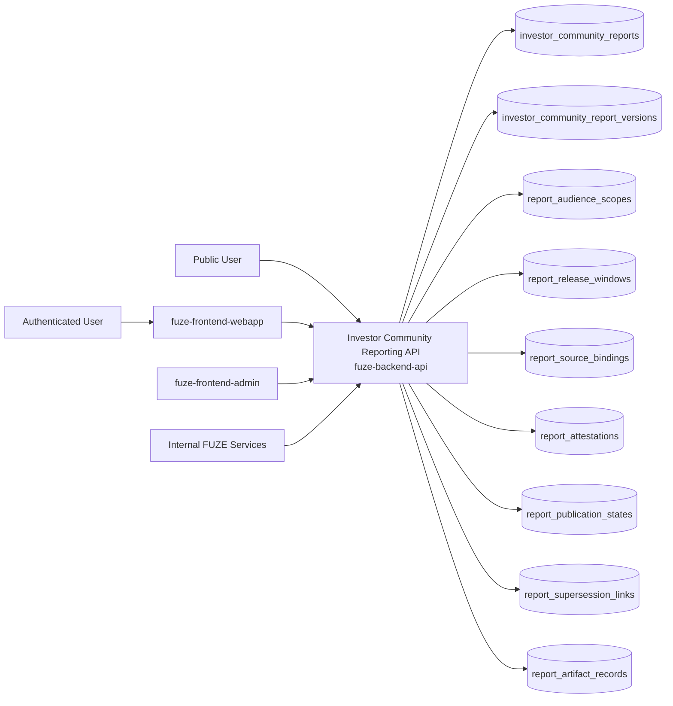
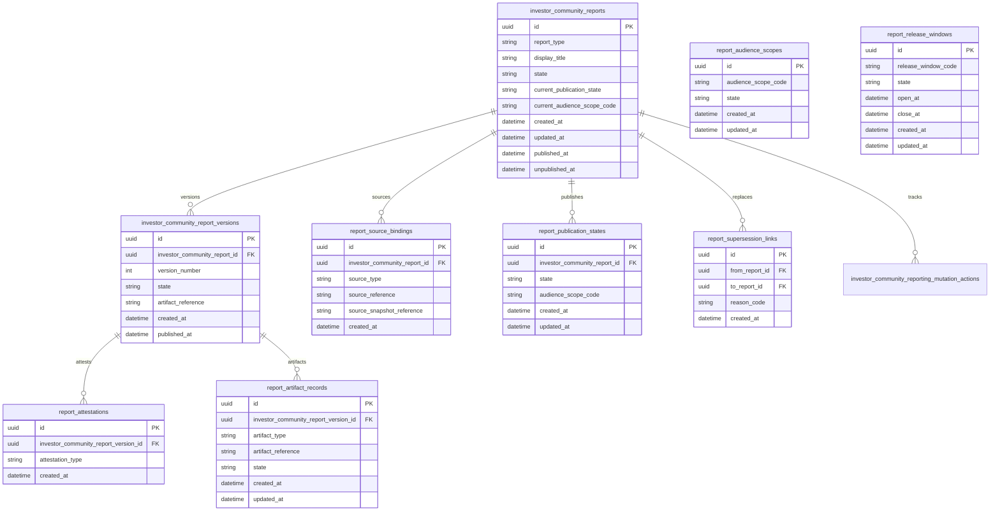
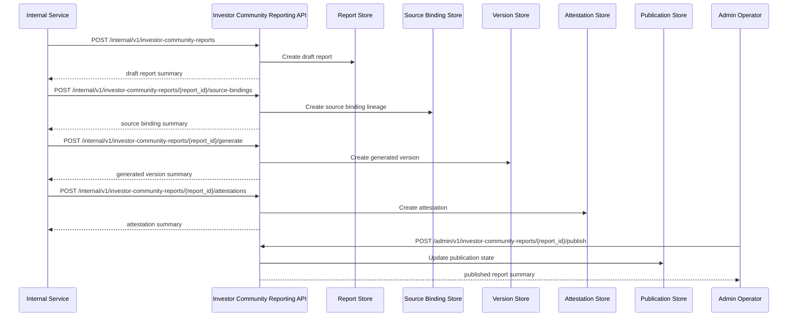

# INVESTOR_COMMUNITY_REPORTING_API_SPEC

## 1. Title

**INVESTOR_COMMUNITY_REPORTING_API_SPEC.md**

---

## 2. Document Metadata

- **Document Name:** INVESTOR_COMMUNITY_REPORTING_API_SPEC.md
- **API Classification:** public, authenticated, internal, admin, event-driven
- **Owning Domain:** Investor and Community Reporting Domain
- **Primary Implementing Repo:** `fuze-backend-api`
- **Primary System of Record:** investor/community report definitions, audience scopes, report versions, publication state, distribution windows, source-lineage metadata, and correction/remediation records in `fuze-backend-api`
- **Status:** Draft for canonical source-of-truth approval
- **Purpose:** Define the production-grade API contract architecture for FUZE investor and community reporting, audience-scoped publication, source-linked disclosure artifacts, and controlled correction-safe communication across public and permissioned reporting surfaces
- **Canonical Folder:** `fuze.ac > docs > api-spec`

---

## 2.1 API Classification Header

- **API Classification:** public | authenticated | internal | admin | event-driven
- **Owning Domain:** Investor and Community Reporting Domain
- **Primary Implementing Repo:** `fuze-backend-api`
- **Primary System of Record:** investor/community reporting and publication-control domain

---

## 3. Purpose

This document defines the canonical API specification for FUZE investor and community reporting operations. It translates the governing FUZE platform architecture, investor/community reporting rules, transparency rules, public registry rules, reporting and rollout expectations, governance-adjacent disclosure boundaries, audit requirements, and API architecture rules into an implementation-ready API contract.

This API exists because FUZE communicates with multiple audiences that do not always receive the same level of detail. Public community updates, ecosystem progress reports, roadmap-aligned product summaries, reporting digests, investor-oriented disclosures, and controlled audience-specific materials must therefore be governed carefully. These reports cannot be handled as loose blog posts, ad hoc PDFs, or uncontrolled chat attachments. They must be versioned, audience-scoped, source-linked, publication-safe, and correction-safe.

Accordingly, this specification defines how investor/community reports are represented, how audience scope and release class are managed, how source-linked reporting artifacts are generated and published, how public versus authenticated views are separated, how admin/internal flows create and publish reports safely, and how reporting behavior remains auditable, idempotent, and architecture-consistent across FUZE.

---

## 4. Scope

This specification covers:

- public list and detail APIs for publicly released community/investor reports
- authenticated list and detail APIs for permissioned report audiences where policy allows
- internal service APIs for report draft creation, source binding, audience-scope configuration, and publication preparation
- admin/control-plane APIs for publish, unpublish, supersede, correct, audience-scope change, and discrepancy resolution
- report version, release-window, and artifact metadata APIs
- event emission requirements for investor/community reporting lifecycle changes
- request, response, error, idempotency, versioning, audit, and database-shape rules for this domain

This specification does **not** redefine:

- transparency reporting semantics in full detail
- full investor-relations workflow outside approved FUZE reporting surfaces
- full token, treasury, payout, or governance execution semantics
- private board-only materials or confidential investor documents not approved for platform distribution
- rendering implementation details for every report artifact type
- final CRM/contact-management system behavior
- external email campaign mechanics

Those remain governed by their own source-of-truth specifications.

---

## 5. Source-of-Truth Inputs

### Primary FUZE docs and specs used

#### Highest-priority platform and ownership sources
- `SYSTEM_SPEC_INDEX.md`
- `SYSTEM_BOUNDARY_AND_OWNERSHIP_SPEC.md`
- `SYSTEM_OVERVIEW_AND_BOUNDARIES_SPEC.md`
- `PLATFORM_ARCHITECTURE_SPEC.md`
- `DOMAIN_OWNERSHIP_MATRIX_SPEC.md`
- `DATA_MODEL_AND_ENTITY_OWNERSHIP_SPEC.md`

#### Primary reporting / communication / trust sources
- `INVESTOR_AND_COMMUNITY_REPORTING_SPEC.md`
- `TRANSPARENCY_MODEL_SPEC.md`
- `TRANSPARENCY_REPORTING_SPEC.md`
- `PRODUCT_ROLLOUT_DEPENDENCY_SPEC.md`
- `ROLLOUT_STRATEGY_SPEC.md`
- `PRODUCT_INTEGRATION_ARCHITECTURE_SPEC.md`
- `PUBLIC_CONTRACT_AND_WALLET_REGISTRY_SPEC.md`
- `GOVERNANCE_MODEL_SPEC.md`
- `FOUNDATION_GOVERNANCE_SPEC.md`

#### API and runtime sources
- `API_ARCHITECTURE_SPEC.md`
- `PUBLIC_API_SPEC.md`
- `INTERNAL_SERVICE_API_SPEC.md`
- `EVENT_MODEL_AND_WEBHOOK_SPEC.md`
- `IDEMPOTENCY_AND_VERSIONING_SPEC.md`
- `MIGRATION_AND_BACKWARD_COMPATIBILITY_SPEC.md`
- `AUDIT_LOG_AND_ACTIVITY_SPEC.md`

#### Security and operations sources
- `SECURITY_AND_RISK_CONTROL_SPEC.md`
- `MONITORING_ALERTING_AND_INCIDENT_RESPONSE_SPEC.md`
- `SECRETS_CONFIG_AND_ENVIRONMENT_SPEC.md`
- `ROLE_PERMISSION_AND_ACCESS_CONTROL_SPEC.md`

#### Core docs inputs
- `DOCS_SPEC.md`
- `ONEPAGE_PAPER.md`
- `FUZE_WHITEPAPER_v.2026.3.0.1.pdf`
- `FUZE_TOKENOMICS_TABLES.md`
- `FUZE_CHAIN_ARCHITECTURE.md`
- `STABLECOIN_PROFIT_PARTICIPATION.md`

#### Format guides
- `The_API_Specification_guide.md`
- `Database_Schemas_Guide.md`

### Highest-priority interpretation applied

For this file, the most important governing interpretation is:

1. investor/community reports are governed communication artifacts, not informal content blobs
2. backend owns canonical report truth, audience scope, and publication state
3. public community disclosure and permissioned investor disclosure must remain explicitly separated
4. reports must remain linked to approved source material and version lineage
5. admin/control-plane may publish, supersede, correct, or restrict under controlled policy but must preserve audit lineage
6. published investor/community outputs must remain distinct from raw transparency ledgers, private operational documents, and confidential internal records

### Supporting external standards used only as guidance

- HTTP semantics for public and authenticated read APIs plus controlled mutation APIs
- structured problem-details error design
- general audience-scoped report publication, versioning, and correction-lineage patterns as supporting guidance

External guidance does not override FUZE source-of-truth documents.

---

## 6. Governing Architecture and Ownership Interpretation

This API belongs to the **Investor and Community Reporting Domain** because it owns the publication layer for investor/community-facing reports, audience scope, report versions, release windows, and correction-safe reporting disclosure.

This API is implemented primarily in `fuze-backend-api` because:

- backend owns durable reporting and audience-scope truth
- reports require controlled separation between public and restricted audiences
- publication, supersession, correction, and access gating must be centralized
- audit generation and discrepancy handling must be backend-governed
- product and platform source data must be resolved into controlled reporting artifacts rather than directly exposed

This API is **not** owned by:

- `fuze-frontend-webapp`, because webapp only reads and displays published reports
- `fuze-frontend-admin`, because admin may publish or correct reports but must not own reporting truth
- `fuze-public-registry`, because that surface stores derived public artifacts while canonical mutable investor/community reporting truth is owned by `fuze-backend-api`
- product domains, because they may provide source material but do not own cross-audience reporting semantics
- transparency reporting domain, because transparency reports are a separate public trust reporting class even when some source data overlaps

### Architectural implications

- one reporting cycle or campaign may contain multiple report variants for different audiences
- one report may have multiple versions over time
- one version may have one or more artifact outputs
- public community reports and authenticated investor reports must remain explicitly separated by audience scope and release class
- superseded or corrected reports must preserve lineage to prior versions
- publication is a communication action, not itself a governance, treasury, or payout action

---

## 7. Domain Responsibilities

The Investor and Community Reporting API domain is responsible for:

1. maintaining canonical investor/community report records
2. exposing public and authenticated list/detail views according to audience policy
3. tracking report type, audience scope, release window, version, and publication state
4. recording source-linkage and attestation-safe preparation metadata
5. supporting internal report generation and artifact export preparation
6. supporting admin publish, supersede, correct, restrict, and unpublish workflows
7. emitting reporting lifecycle events
8. generating audit lineage for sensitive publication and correction actions
9. preserving separation between public community reports, authenticated investor reports, and private internal-only drafts
10. supporting safe historical lookup for published and superseded report artifacts

The domain is not responsible for:

- executing treasury, token, payout, or governance actions
- owning source-domain business truth
- replacing CRM or investor-contact systems
- exposing confidential board/private investor documents not approved for this channel
- acting as the raw accounting or transparency ledger source of truth
- sending outbound communications itself unless explicitly integrated through separate delivery domains

---

## 8. Out of Scope

The following are out of scope for this API specification:

- private board deck management
- confidential data-room permissions
- full subscriber/contact database design
- email campaign delivery tooling
- final PDF/HTML rendering implementation detail
- social-post scheduling or newsletter copy workflows
- private diligence-room artifact access control beyond explicit report audience scope
- third-party investor portal integration specifics

Where later detailed specs are needed, they must remain compatible with this API.

---

## 9. Canonical Entities and Data Ownership

### Durable entities

#### 9.1 investor_community_reports
- **Owner:** Investor and Community Reporting Domain
- **Purpose:** canonical report records for community, investor, or mixed-audience reporting classes
- **Nature:** source-of-truth durable entity

#### 9.2 investor_community_report_versions
- **Owner:** Investor and Community Reporting Domain
- **Purpose:** immutable version lineage for report variants
- **Nature:** source-of-truth durable entity

#### 9.3 report_audience_scopes
- **Owner:** Investor and Community Reporting Domain
- **Purpose:** canonical audience-scope definitions such as public, authenticated community, authenticated investor, or other approved distribution classes
- **Nature:** source-of-truth durable entity

#### 9.4 report_release_windows
- **Owner:** Investor and Community Reporting Domain
- **Purpose:** controlled publication timing and window metadata
- **Nature:** source-of-truth durable entity

#### 9.5 report_source_bindings
- **Owner:** Investor and Community Reporting Domain
- **Purpose:** approved references to source documents, snapshots, product progress summaries, transparency reports, or other governed source inputs
- **Nature:** durable source-lineage entity

#### 9.6 report_attestations
- **Owner:** Investor and Community Reporting Domain
- **Purpose:** preparation, verification, approval, or review metadata linked to report versions
- **Nature:** durable attestation lineage entity

#### 9.7 report_publication_states
- **Owner:** Investor and Community Reporting Domain
- **Purpose:** publication lifecycle and visibility state for reports and versions
- **Nature:** source-of-truth durable entity

#### 9.8 report_supersession_links
- **Owner:** Investor and Community Reporting Domain
- **Purpose:** links between superseded, corrected, or replaced reports and versions
- **Nature:** durable lineage entity

#### 9.9 report_artifact_records
- **Owner:** Investor and Community Reporting Domain
- **Purpose:** generated artifact metadata for markdown, HTML, PDF, JSON, or other approved release formats
- **Nature:** durable artifact lineage entity

#### 9.10 investor_community_reporting_discrepancy_cases
- **Owner:** Investor and Community Reporting Domain
- **Purpose:** review and remediation records for missing, stale, conflicting, or incorrectly scoped reports
- **Nature:** durable review/remediation entity

#### 9.11 investor_community_reporting_mutation_actions
- **Owner:** Investor and Community Reporting Domain
- **Purpose:** high-level action records for create, bind, publish, correct, supersede, restrict, unpublish, and resolve discrepancy
- **Nature:** durable action records with audit linkage

#### 9.12 investor_community_reporting_audit_events
- **Owner:** Audit / Activity domain, sourced by Investor and Community Reporting Domain
- **Purpose:** immutable trail for sensitive publication and correction actions
- **Nature:** durable audit records

### Derived or cached entities

#### 9.13 investor_community_public_views
- **Owner:** derived read-model layer
- **Purpose:** public-safe list and detail representations
- **Nature:** derived

#### 9.14 investor_community_authenticated_views
- **Owner:** derived read-model layer
- **Purpose:** authenticated audience-scoped list and detail representations
- **Nature:** derived

#### 9.15 investor_community_discrepancy_views
- **Owner:** derived ops read-model layer
- **Purpose:** visibility into stale, conflicting, or mis-scoped reporting conditions
- **Nature:** derived

---

## 10. State Model and Lifecycle

### 10.1 report lifecycle

Possible states:

- `draft`
- `generated`
- `verified_if_required`
- `published`
- `restricted`
- `deprecated`
- `superseded`
- `unpublished_if_required`

### 10.2 report version lifecycle

Possible states:

- `draft`
- `generated`
- `published`
- `superseded`
- `archived`

### 10.3 audience-scope lifecycle

Possible states:

- `active`
- `restricted`
- `deprecated`
- `superseded`

### 10.4 release-window lifecycle

Possible states:

- `scheduled`
- `open`
- `closed`
- `cancelled`

### 10.5 publication lifecycle

Possible states:

- `unpublished`
- `published`
- `hidden`
- `restricted`
- `archived`

Lifecycle notes:
- generated does not imply external visibility
- a report may be published to one audience scope while withheld from another
- supersession and correction must preserve lineage to prior versions
- unpublish/restrict actions are exceptional and must preserve trust-oriented explanation metadata where public or authenticated visibility existed previously

---

## 11. API Surface Overview

The API surface is divided into four families:

### 11.1 Public read APIs
Used by general public/community readers for:
- listing public community or public investor/community reports
- retrieving one public report detail
- accessing currently published public artifacts

### 11.2 Authenticated read APIs
Used by `fuze-frontend-webapp` and approved first-party authenticated clients for:
- listing and retrieving audience-scoped reports when actor is authorized
- reading bounded authenticated investor/community report detail
- accessing release-window and version summaries where policy allows

### 11.3 Internal service APIs
Used by trusted internal services for:
- creating drafts
- binding source material and audience scope
- generating versions and artifacts
- attaching attestations
- reading canonical report truth

### 11.4 Admin / control-plane APIs
Used by `fuze-frontend-admin` through backend-only privileged routes for:
- publish, supersede, correct, restrict, and unpublish actions
- audience-scope correction
- export/artifact remediation
- discrepancy resolution

---

## 12. Authentication and Authorization Model

### 12.1 Authentication posture by route family

#### Public read routes
No authentication required:
- list published public reports
- retrieve public report detail
- access public artifact references where exposed

#### Authenticated read routes
Require valid authenticated session:
- read audience-scoped reports for which the actor has authorization
- read bounded authenticated detail and artifact references where allowed

#### Internal service routes
Require internal service identity with explicit least privilege:
- create drafts
- attach source bindings, attestations, and audience scopes
- generate versions and artifacts
- read canonical report records

#### Admin routes
Require privileged operator identity plus reason-coded actions:
- publish, supersede, correct, restrict, unpublish
- change audience scope for report variants
- retry artifact generation or resolve discrepancies

### 12.2 Authorization checkpoints

Authorization must evaluate:
- caller identity and route family
- whether target report is public, authenticated, or internal-only
- actor’s account/workspace/investor-community access entitlement where applicable
- whether internal service has write privilege for report mutations
- whether admin/operator role is present for publication or restriction actions
- whether current state allows requested mutation

### 12.3 Sensitive action rules

The following require heightened checks:
- publication of new investor/community reports
- broadening audience scope from restricted to wider visibility
- correction, supersession, or unpublish of already visible reports
- source-binding changes after generation
- discrepancy-resolution actions

---

## 13. API Endpoints / Interface Contracts

## 13.1 Public Read APIs

### 13.1.1 `GET /v1/reports/community`
**Purpose:** list published public community/investor-community reports  
**Caller Type:** public  
**Auth Expectation:** none  
**Query Parameters Summary:**
- optional `report_type`
- optional `year`
- pagination
**Response Summary:**
- public report summaries
- release-window summary
- publication timestamp
- current/deprecated/superseded status
- artifact availability summary
**Side Effects:** none
**Audit Requirements:** access logging optional
**Emitted Events:** none required

### 13.1.2 `GET /v1/reports/community/{report_id}`
**Purpose:** retrieve one published public report detail  
**Caller Type:** public  
**Response Summary:**
- public detail view
- audience scope summary
- publication/version summary
- supersession/correction guidance where relevant
- public artifact references
**Side Effects:** none

## 13.2 Authenticated Read APIs

### 13.2.1 `GET /v1/reports/audience`
**Purpose:** list reports visible to current authenticated actor under audience-scope policy  
**Caller Type:** authenticated user  
**Auth Expectation:** valid authenticated session  
**Query Parameters Summary:**
- optional `report_type`
- optional `audience_scope_code`
- optional `year`
- pagination
**Response Summary:**
- visible report summaries
- audience scope summary
- version/publication status
- artifact availability summary
**Side Effects:** none

### 13.2.2 `GET /v1/reports/audience/{report_id}`
**Purpose:** retrieve one audience-scoped report detail for authorized actor  
**Caller Type:** authenticated user with report visibility  
**Response Summary:**
- bounded report detail
- audience scope metadata
- release-window summary
- version/publication/supersession guidance
- artifact references allowed for that actor
**Side Effects:** none

## 13.3 Internal Service APIs

### 13.3.1 `POST /internal/v1/investor-community-reports`
**Purpose:** create draft investor/community report  
**Caller Type:** internal trusted service  
**Auth Expectation:** service-to-service identity only  
**Request Body Summary:**
- `report_type`
- `display_title`
- `audience_scope_code`
- optional `release_window_code`
- optional `draft_summary`
- `idempotency_key`
**Response Summary:** draft report summary and current version summary
**Side Effects:** creates report draft and initial version lineage
**Idempotency Behavior:** required
**Audit Requirements:** sensitive reporting-ingest audit
**Emitted Events:** `investor_community_report.report_created`

### 13.3.2 `POST /internal/v1/investor-community-reports/{report_id}/source-bindings`
**Purpose:** attach approved source lineage to report draft or generated version  
**Caller Type:** internal trusted service  
**Request Body Summary:**
- `source_type`
- `source_reference`
- optional `source_snapshot_reference`
- optional `source_summary`
- `idempotency_key`
**Response Summary:** source-binding summary and updated report-state summary
**Side Effects:** creates source-binding lineage
**Idempotency Behavior:** required
**Audit Requirements:** source-lineage audit
**Emitted Events:** `investor_community_report.source_bound`

### 13.3.3 `POST /internal/v1/investor-community-reports/{report_id}/generate`
**Purpose:** generate report version and artifact set from bound sources  
**Caller Type:** internal trusted service  
**Request Body Summary:**
- optional `generation_profile`
- `idempotency_key`
**Response Summary:** generated version summary and artifact summary
**Side Effects:** creates or updates generated version and artifact lineage
**Idempotency Behavior:** required
**Audit Requirements:** report-generation audit
**Emitted Events:** `investor_community_report.report_generated`

### 13.3.4 `POST /internal/v1/investor-community-reports/{report_id}/attestations`
**Purpose:** attach attestation or review metadata to report version  
**Caller Type:** internal trusted service  
**Request Body Summary:**
- `attestation_type`
- `attestation_summary`
- `idempotency_key`
**Response Summary:** attestation summary
**Side Effects:** creates attestation lineage and may advance verification state
**Idempotency Behavior:** required
**Audit Requirements:** attestation audit
**Emitted Events:** `investor_community_report.report_attested`

### 13.3.5 `GET /internal/v1/investor-community-reports/{report_id}`
**Purpose:** retrieve canonical report truth for trusted services  
**Caller Type:** internal trusted service  
**Response Summary:** full report, versions, source bindings, audience scope, attestations, publication, supersession, and artifact lineage
**Side Effects:** none

## 13.4 Admin / Control-Plane APIs

### 13.4.1 `POST /admin/v1/investor-community-reports/{report_id}/publish`
**Purpose:** publish report to its configured audience scope  
**Caller Type:** admin/operator  
**Request Body Summary:**
- `reason_code`
- `operator_note`
- `idempotency_key`
**Response Summary:** published report summary
**Side Effects:** publication state moves to published and report becomes visible to allowed audience
**Audit Requirements:** critical audit
**Emitted Events:** `investor_community_report.report_published`

### 13.4.2 `POST /admin/v1/investor-community-reports/{report_id}/supersede`
**Purpose:** supersede one visible report with a corrected or newer report  
**Caller Type:** admin/operator  
**Request Body Summary:**
- `replacement_report_id`
- `reason_code`
- `operator_note`
- `idempotency_key`
**Response Summary:** supersession summary
**Side Effects:** creates supersession linkage and updates audience-visible current/preferred state
**Audit Requirements:** critical audit
**Emitted Events:** `investor_community_report.report_superseded`

### 13.4.3 `POST /admin/v1/investor-community-reports/{report_id}/correct`
**Purpose:** apply correction-safe metadata or bounded correction note to one report  
**Caller Type:** admin/operator  
**Request Body Summary:**
- `correction_type`
- `correction_summary`
- `reason_code`
- `operator_note`
- `idempotency_key`
**Response Summary:** corrected report summary
**Side Effects:** may create new version or attach bounded correction lineage according to policy
**Audit Requirements:** critical audit
**Emitted Events:** `investor_community_report.report_corrected`

### 13.4.4 `POST /admin/v1/investor-community-reports/{report_id}/restrict`
**Purpose:** restrict or narrow audience visibility for a visible report under controlled policy  
**Caller Type:** admin/operator  
**Request Body Summary:**
- `target_audience_scope_code`
- `reason_code`
- `operator_note`
- `idempotency_key`
**Response Summary:** restricted report summary
**Side Effects:** audience visibility narrows according to policy with preserved publication lineage
**Audit Requirements:** critical audit
**Emitted Events:** `investor_community_report.report_restricted`

### 13.4.5 `POST /admin/v1/investor-community-reports/{report_id}/unpublish`
**Purpose:** unpublish a visible report under exceptional controlled policy  
**Caller Type:** admin/operator  
**Request Body Summary:**
- `reason_code`
- `public_or_audience_explanation_summary`
- `operator_note`
- `idempotency_key`
**Response Summary:** unpublished report summary
**Side Effects:** publication state moves to hidden/unpublished according to policy with preserved lineage
**Audit Requirements:** critical audit
**Emitted Events:** `investor_community_report.report_unpublished`

### 13.4.6 `POST /admin/v1/investor-community-reporting/discrepancies`
**Purpose:** resolve investor/community reporting discrepancy under controlled policy  
**Caller Type:** admin/operator  
**Request Body Summary:**
- `target_reference_type`
- `target_reference_id`
- `resolution_code`
- `operator_note`
- `related_case_id`
- `idempotency_key`
**Response Summary:** discrepancy-resolution summary
**Side Effects:** may publish, supersede, correct, restrict, unpublish, or retry artifact handling with preserved lineage
**Audit Requirements:** critical audit
**Emitted Events:** `investor_community_report.discrepancy_resolved`

---

## 14. Request Rules

### 14.1 General request rules
- all mutation-capable routes must require JSON requests with explicit content type
- all mutation routes must carry correlation IDs
- sensitive reporting mutations must carry idempotency keys
- admin mutations must require reason codes and operator notes
- no route may accept frontend-authored report truth as authoritative input

### 14.2 Sensitive-action request requirements
The following requests require heightened validation:
- report generation for wider audiences
- audience-scope widening or narrowing after publication
- source-binding changes after generation
- publish, correct, supersede, restrict, or unpublish
- discrepancy-resolution actions

Heightened validation may include:
- audience-scope integrity checks
- report completeness and source-lineage checks
- publication-state checks
- role and operator confirmation
- product/governance/finance case linkage for sensitive reports

### 14.3 Scope integrity rule
Investor/community-report mutations must target valid and authorized reports, audience scopes, release windows, and source references. Services and operators must not mutate unrelated or unauthorized reporting state.

### 14.4 Audience-separation rule
Public and authenticated audience outputs must remain explicitly separated. Restricting or widening visibility must preserve lineage and must never silently merge public-safe content with permissioned-only content.

---

## 15. Response Rules

### 15.1 Success response rules
Successful responses must include:
- stable resource identifiers
- timestamps for created/updated state
- state/status values
- audience-scope and release-window summaries
- publication/version summaries where relevant
- correlation references for mutations

### 15.2 Async-accepted response rules
If generation, artifact export, or discrepancy remediation is async, the response must:
- return accepted status
- include action or job ID
- provide follow-up status semantics

### 15.3 Terminal mutation response rules
Terminal mutation responses must clearly show:
- target report, version, or artifact
- mutation type
- resulting report/publication/audience state
- correction, supersession, restriction, or unpublish effects where relevant
- whether reader-visible views may refresh asynchronously

### 15.4 Read response rules
Read responses must distinguish:
- canonical report truth on internal routes
- public-safe views on public routes
- audience-scoped views on authenticated routes
- version/publication/supersession guidance where relevant

---

## 16. Error Model

The API uses structured problem-details style error responses.

### 16.1 Required error fields
- `type`
- `title`
- `status`
- `code`
- `detail`
- `instance`
- `correlation_id`

### 16.2 Common error codes

#### Authorization / permission errors
- `INVESTOR_COMMUNITY_REPORT_PERMISSION_DENIED`
- `INVESTOR_COMMUNITY_REPORT_OPERATOR_PERMISSION_DENIED`
- `INVESTOR_COMMUNITY_REPORT_SERVICE_PERMISSION_DENIED`
- `INVESTOR_COMMUNITY_REPORT_AUDIENCE_PERMISSION_DENIED`

#### State conflict errors
- `INVESTOR_COMMUNITY_REPORT_STATE_INVALID`
- `INVESTOR_COMMUNITY_REPORT_ALREADY_PUBLISHED`
- `INVESTOR_COMMUNITY_REPORT_ALREADY_UNPUBLISHED`
- `INVESTOR_COMMUNITY_REPORT_SUPERSESSION_CONFLICT`
- `INVESTOR_COMMUNITY_REPORT_AUDIENCE_SCOPE_CONFLICT`

#### Policy / safety errors
- `INVESTOR_COMMUNITY_REPORT_SOURCE_BINDING_REQUIRED`
- `INVESTOR_COMMUNITY_REPORT_VERIFICATION_REQUIRED`
- `INVESTOR_COMMUNITY_REPORT_PUBLICATION_FORBIDDEN`
- `INVESTOR_COMMUNITY_REPORT_SCOPE_NOT_ALLOWED`
- `INVESTOR_COMMUNITY_REPORT_PRIVATE_METADATA_FORBIDDEN`

#### Request integrity errors
- `INVESTOR_COMMUNITY_REPORT_IDEMPOTENCY_KEY_REQUIRED`
- `INVESTOR_COMMUNITY_REPORT_REQUEST_INVALID`
- `INVESTOR_COMMUNITY_REPORT_REQUEST_UNPROCESSABLE`

#### Dependency or provider errors
- `INVESTOR_COMMUNITY_REPORT_STORAGE_UNAVAILABLE`
- `INVESTOR_COMMUNITY_REPORT_GENERATION_UNAVAILABLE`
- `INVESTOR_COMMUNITY_REPORT_ARTIFACT_UNAVAILABLE`

### 16.3 Error handling rules
- do not expose hidden internal finance/security/private-audience detail in public responses
- do not imply treasury, governance, or payout execution from report publication
- distinguish unpublished/no-match from forbidden audience visibility
- distinguish source-binding-required from generic invalid state
- include retry guidance only where safe

---

## 17. Idempotency and Mutation Safety

### 17.1 Required idempotent mutations
The following mutation routes require idempotent behavior:
- report creation
- source binding
- report generation
- attestation creation
- publish
- supersede
- correct
- restrict
- unpublish
- discrepancy resolution

### 17.2 Idempotency key rules
- mutation requests must supply `Idempotency-Key`
- backend stores key scope, request hash, actor, and terminal result
- replay of same semantic request returns original terminal outcome
- replay of same key with different semantic request must fail with conflict

### 17.3 Mutation safety rules
- one current visible report per report type and audience scope under current-publication policy unless explicit supersession lineage exists
- publication must not occur before required source lineage and verification state
- corrections, supersession, and audience-scope changes must preserve old-to-new lineage
- unpublish must preserve trust-oriented historical trace
- authenticated audience views must derive from canonical reporting truth, not bypass it

---

## 18. Versioning and Compatibility Rules

### 18.1 Versioning
This API family is versioned under `/v1`, `/internal/v1`, and `/admin/v1` route families.

### 18.2 Compatibility approach
- additive evolution preferred
- no silent semantic change to published, restricted, superseded, corrected, or unpublished states
- new report types, audience scopes, and artifact references may be added without breaking existing contracts
- response fields may be added but existing meanings must remain stable

### 18.3 Breaking-change rules
Breaking changes include:
- changing the meaning of public versus authenticated audience visibility
- changing supersession or unpublish semantics incompatibly
- removing critical audience-scope or version fields
- changing historical lookup semantics incompatibly

Such changes require explicit migration planning and version evolution.

### 18.4 Deprecation
Deprecated routes or fields must:
- be documented explicitly
- carry deprecation metadata where supported
- preserve compatibility windows long enough for public and first-party consumers

---

## 19. Event Emission and Webhook Behavior

This domain is event-capable.

### 19.1 Internal events
The Investor and Community Reporting domain must emit canonical internal events such as:
- `investor_community_report.report_created`
- `investor_community_report.source_bound`
- `investor_community_report.report_generated`
- `investor_community_report.report_attested`
- `investor_community_report.report_published`
- `investor_community_report.report_superseded`
- `investor_community_report.report_corrected`
- `investor_community_report.report_restricted`
- `investor_community_report.report_unpublished`
- `investor_community_report.discrepancy_resolved`

### 19.2 Event payload minimums
Each event should contain:
- event ID
- event type
- occurred_at
- report ID
- report type
- audience scope summary
- version reference where relevant
- actor type
- correlation ID
- reason code where applicable

### 19.3 External webhook posture
This specification does not expose general third-party outbound investor/community-report webhooks by default. Any future outbound reporting webhook surface must be narrow, security-reviewed, and governed by a separate contract.

---

## 20. Audit and Activity Requirements

The following actions must generate durable audit events:

- report creation and generation
- source binding for visible or publishable reports
- attestation creation
- publication
- correction, supersession, restriction, or unpublish
- discrepancy resolution
- other sensitive investor/community-reporting mutations

### Required audit fields
- audit event ID
- actor type and actor reference
- target report / version / artifact / discrepancy reference as applicable
- action type
- before/after reporting summary where applicable
- reason code
- correlation ID
- operator note if operator action
- occurred_at

Public or authenticated activity may show selected publication events, but canonical internal audit truth remains durable and immutable.

---

## 21. Data Model and Database Schema View

### 21.1 `investor_community_reports`
- `id` PK
- `report_type`
- `display_title`
- `state`
- `current_publication_state`
- `current_audience_scope_code`
- `public_summary_json`
- `created_at`
- `updated_at`
- `published_at` nullable
- `unpublished_at` nullable

**Constraints:**
- index on (`report_type`, `state`)
- index on (`current_publication_state`, `current_audience_scope_code`)

### 21.2 `investor_community_report_versions`
- `id` PK
- `investor_community_report_id` FK -> `investor_community_reports.id`
- `version_number`
- `state`
- `artifact_reference`
- `created_at`
- `published_at` nullable
- `superseded_at` nullable

**Constraints:**
- unique (`investor_community_report_id`, `version_number`)
- index on `state`

### 21.3 `report_audience_scopes`
- `id` PK
- `audience_scope_code`
- `state`
- `scope_policy_json`
- `created_at`
- `updated_at`

**Constraints:**
- unique `audience_scope_code`
- index on `state`

### 21.4 `report_release_windows`
- `id` PK
- `release_window_code`
- `state`
- `open_at`
- `close_at`
- `created_at`
- `updated_at`

**Constraints:**
- unique `release_window_code`
- index on `state`

### 21.5 `report_source_bindings`
- `id` PK
- `investor_community_report_id` FK -> `investor_community_reports.id`
- `source_type`
- `source_reference`
- `source_snapshot_reference` nullable
- `source_summary_json` nullable
- `created_at`

**Constraints:**
- index on `investor_community_report_id`
- index on (`source_type`, `source_reference`)

### 21.6 `report_attestations`
- `id` PK
- `investor_community_report_version_id` FK -> `investor_community_report_versions.id`
- `attestation_type`
- `attestation_summary_json`
- `created_at`

**Constraints:**
- index on `investor_community_report_version_id`

### 21.7 `report_publication_states`
- `id` PK
- `investor_community_report_id` FK -> `investor_community_reports.id`
- `state`
- `audience_scope_code`
- `reason_code` nullable
- `created_at`
- `updated_at`

**Constraints:**
- index on `investor_community_report_id`
- index on (`state`, `audience_scope_code`)

### 21.8 `report_supersession_links`
- `id` PK
- `from_report_id` FK -> `investor_community_reports.id`
- `to_report_id` FK -> `investor_community_reports.id`
- `reason_code`
- `created_at`

**Constraints:**
- unique (`from_report_id`, `to_report_id`)
- index on `from_report_id`
- index on `to_report_id`

### 21.9 `report_artifact_records`
- `id` PK
- `investor_community_report_version_id` FK -> `investor_community_report_versions.id`
- `artifact_type`
- `artifact_reference`
- `state`
- `created_at`
- `updated_at`

**Constraints:**
- index on `investor_community_report_version_id`
- index on (`artifact_type`, `state`)

### 21.10 `investor_community_reporting_discrepancy_cases`
- `id` PK
- `target_reference_type`
- `target_reference_id`
- `state`
- `resolution_code` nullable
- `created_at`
- `updated_at`
- `closed_at` nullable

### 21.11 `investor_community_reporting_mutation_actions`
- `id` PK
- `target_reference_type`
- `target_reference_id`
- `action_type`
- `state`
- `reason_code`
- `operator_note` nullable
- `requested_by_actor_type`
- `requested_by_actor_id`
- `created_at`
- `executed_at` nullable
- `closed_at` nullable
- `correlation_id`

### 21.12 `idempotency_records`
- `id` PK
- `idempotency_key`
- `scope_family`
- `actor_reference`
- `request_hash`
- `response_hash`
- `terminal_status`
- `created_at`
- `expires_at`

### 21.13 `audit_log_entries`
Domain-sourced audit records written into the audit domain.

### Normalization notes
- canonical reporting truth stays in reports, versions, audience scopes, release windows, source bindings, attestations, publication states, and supersession links
- public and authenticated routes must derive from canonical current published state filtered by audience policy
- private preparation notes or raw sensitive source data must remain outside reader-visible response shapes
- artifact delivery remains derived from canonical reporting truth

### Reconciliation notes
- one current visible report should reconcile to one audience-scope and report-type under current-publication policy
- superseded or corrected reports must preserve replacement lineage
- artifact records must reconcile to canonical report versions
- missing, stale, or conflicting audience-scope conditions must be explicitly reviewable

---

## 22. Architecture Diagram — Mermaid flowchart



---

## 23. Data Design — Mermaid Diagram



---

## 24. Flow View

### 24.1 Happy path — generate and publish report
1. internal service creates draft investor/community report
2. approved source bindings are attached
3. report version and artifacts are generated
4. attestation metadata is attached if required
5. admin publishes the report to its configured audience scope
6. report becomes visible on public or authenticated routes as appropriate
7. audit and reporting events are emitted

### 24.2 Happy path — public and authenticated lookup
1. public actor lists public community reports
2. authenticated actor lists audience-scoped reports available to them
3. backend filters current published records by audience scope and release window
4. actor opens one visible report detail
5. allowed artifact references and bounded metadata are returned
6. if superseded or corrected, replacement guidance is included

### 24.3 Alternate path — correct and supersede
1. visible report later requires correction
2. corrected report version or replacement report is generated
3. admin supersedes prior visible report
4. older report remains historically visible according to audience policy with supersession guidance
5. new report becomes current visible reference

### 24.4 Failure path — missing source lineage or invalid scope
1. generate or publish action is attempted
2. backend detects missing source binding, required attestation gap, or invalid audience scope
3. request is rejected
4. no reader-visible state changes occur

### 24.5 Failure and remediation path — discrepancy or artifact issue
1. report becomes stale, mis-scoped, conflicting, or artifact delivery fails
2. admin opens discrepancy resolution
3. backend preserves existing lineage
4. report may be corrected, restricted, unpublished, or regenerated
5. discrepancy closes with preserved history

### 24.6 Restrict/unpublish path
1. visible report must be narrowed to a smaller audience or removed from visible surfaces
2. admin applies restrict or unpublish action
3. publication state changes with preserved lineage
4. readers no longer see the report outside allowed scope, and explanation metadata remains available where policy requires

### 24.7 Retry behavior
- duplicate report creation returns same draft report result
- duplicate source binding returns same lineage result where applicable
- duplicate generate/publish/supersede/correct/restrict/unpublish returns same terminal action result
- duplicate discrepancy actions return same terminal action result

---

## 25. Data Flows — Mermaid sequenceDiagram



---

## 26. Security and Risk Controls

1. **Reporting truth is backend-owned**  
   Frontends and informal channels may not authoritatively define investor/community reporting truth.

2. **Public and authenticated scopes are distinct**  
   The API must keep public community views separate from permissioned audience views.

3. **Source-lineage-before-publication**  
   Publication must require explicit source binding and required verification/attestation state according to policy.

4. **Least privilege**  
   Internal write and admin publication routes must be limited to authorized services and operators.

5. **Immutable lineage for communication changes**  
   Corrections, supersession, restrictions, and unpublish actions must preserve historical lineage rather than erase prior disclosures.

6. **Public-private field separation**  
   Public routes must never expose internal notes, raw sensitive source data, or operator/security details.

7. **Problem-details discipline**  
   Error bodies must be structured and safe, without exposing hidden internal-only details.

8. **Audit immutability**  
   Sensitive reporting actions require durable immutable audit lineage.

9. **Replay resistance**  
   Report creation, source binding, generation, publication, correction, scope restriction, and artifact actions must be idempotent and replay-safe.

10. **Audience-trust messaging control**  
    Superseded, restricted, or unpublished reports must guide readers clearly according to policy without silently disappearing when historical visibility is still required.

---

## 27. Operational Considerations

- public and authenticated report list/detail routes should be highly available and cache-friendly
- publication and correction flows are correctness-sensitive and must preserve trust integrity
- artifact generation and sync should be observable and retryable
- missing-source-lineage and audience-scope anomalies should surface clearly to ops views
- monitoring should alert on:
  - failed report generation attempts
  - publication failures
  - artifact generation failures
  - unusual supersession, restriction, or unpublish volume
  - authenticated visibility mismatch incidents
  - canonical report vs artifact drift

---

## 28. Acceptance Criteria

1. The API preserves the distinction between public community reporting, authenticated audience reporting, and private internal draft state.
2. Only `fuze-backend-api` owns canonical investor/community reporting and publication truth.
3. Reports, versions, audience scopes, release windows, source bindings, attestations, and publication state are durable and backend-owned.
4. Public and authenticated routes expose only audience-safe report metadata and artifacts.
5. Source lineage and required verification are enforced before publication.
6. Correction, supersession, restriction, and unpublish preserve immutable lineage.
7. Publication, correction, scope-change, and artifact actions are idempotent and auditable.
8. Internal and admin reporting routes are least-privilege and backend-only.
9. Admin routes require reason-coded privileged authorization.
10. Event emissions exist for major investor/community-reporting mutations.
11. Response and error semantics are stable and machine-readable.
12. Database schema separates reports, versions, audience scopes, release windows, source bindings, attestations, publication states, and supersession layers.
13. Public and authenticated consumers can rely on canonical published report routes without needing hidden internal context.
14. Discrepancy handling is supported and safely replayable.
15. Mermaid diagrams remain consistent with prose and data model.

---

## 29. Test Cases

### 29.1 Positive cases
1. Internal service creates draft investor/community report successfully.
2. Internal service attaches source binding successfully.
3. Internal service generates report version successfully.
4. Internal service attaches attestation successfully.
5. Admin publishes verified/generated report successfully.
6. Public actor lists public community reports successfully.
7. Authenticated authorized actor reads audience-scoped report successfully.
8. Admin supersedes old report successfully.

### 29.2 Negative cases
9. Public user cannot access authenticated-only report detail.
10. Internal service without write privilege cannot create report.
11. Publish without required source binding returns `INVESTOR_COMMUNITY_REPORT_SOURCE_BINDING_REQUIRED`.
12. Publish without required verification returns `INVESTOR_COMMUNITY_REPORT_VERIFICATION_REQUIRED`.
13. Attempt to supersede with invalid replacement state returns state conflict.
14. Authenticated actor without audience entitlement receives audience-permission error or no-match-safe response.

### 29.3 Authorization cases
15. Ordinary public or authenticated user cannot call admin publish/correct/restrict routes.
16. Internal service without generation privilege cannot generate report.
17. Operator without publication privilege cannot publish report.
18. Report publication does not authorize treasury, governance, or payout execution.

### 29.4 Idempotency and replay cases
19. Repeating report creation with same idempotency key returns original draft report result.
20. Repeating source-binding attachment with same idempotency key returns original source-lineage result.
21. Repeating publish with same idempotency key returns original publish result.
22. Repeating discrepancy resolution with same idempotency key returns original action result.

### 29.5 Concurrency cases
23. Concurrent publish and restrict actions preserve one explicit current visible lineage.
24. Concurrent duplicate draft creation attempts on same report type/audience scope produce one canonical current draft lineage and one duplicate-safe outcome where policy requires uniqueness.
25. Concurrent correct and unpublish actions preserve explicit lineage without hidden overwrite.

### 29.6 Recovery / admin cases
26. Superseded report remains historically queryable with replacement guidance according to audience policy.
27. Artifact generation failure can be retried under controlled policy with explicit artifact lineage.
28. Discrepancy resolution closes audience-scope or publication conflict with preserved audit history.

### 29.7 Event and audit cases
29. Successful report creation emits `investor_community_report.report_created`.
30. Successful source binding emits `investor_community_report.source_bound`.
31. Successful publication emits `investor_community_report.report_published`.
32. Successful supersession emits `investor_community_report.report_superseded`.
33. Successful discrepancy resolution emits `investor_community_report.discrepancy_resolved` with critical audit lineage.

---

## 30. Open Questions or Explicit Deferred Decisions

1. Exact report-type taxonomy for all future investor/community disclosures is deferred.
2. Exact audience-scope taxonomy and entitlement model are deferred.
3. Exact attestation requirements by report class are deferred.
4. Exact artifact export format and sync cadence to public or authenticated surfaces are deferred.
5. Exact historical visibility policy for unpublished or restricted reports is deferred.
6. Exact discrepancy taxonomy for investor/community-reporting conflicts is deferred.

---

## 31. Implementation Notes for `fuze-backend-api`

Recommended backend module layout:

```text
modules/platform/
  investor-community-reporting/
  transparency-reporting/
  public-registry/
  audit-log/
  control-plane/
  integrations/
```

Implementation guidance:
- keep report identity, audience scope, release window, version lineage, source binding, attestation, publication, and supersession lineage in one canonical domain service
- perform audience-scope integrity and source-lineage completeness checks inside the commit boundary
- keep publication, correction, supersession, restriction, and unpublish actions explicit and idempotent
- treat admin remediations as domain actions, not ad hoc row edits
- emit events only after canonical state commit succeeds
- publish reader-visible report views from canonical truth; do not let derived artifacts mutate canonical reporting state

---

## 32. Frontend Consumption Notes

### For `fuze-frontend-webapp`
- may read public report lists, detail pages, and authenticated audience-scoped report views
- must not infer unpublished or draft reporting truth from frontend configuration alone
- must treat backend reporting responses as authoritative
- should clearly distinguish public, authenticated, superseded, corrected, restricted, and unpublished report states when visible

### For `fuze-frontend-admin`
- may trigger privileged publish, supersede, correct, restrict, unpublish, and discrepancy actions only through backend admin APIs
- must require operator reason input for sensitive mutations
- must not directly mutate canonical reporting truth client-side
- should present immutable publication lineage and correction history separately from current audience-visible view

---

## 33. Contract Derivation Notes

### OpenAPI / AsyncAPI
This spec should later derive into:
- public report list/detail operations
- authenticated audience-scoped report list/detail operations
- internal report creation, source binding, generation, and attestation operations
- admin publish / supersede / correct / restrict / unpublish / discrepancy operations
- shared problem-details schema
- investor/community-report lifecycle events in AsyncAPI

### Future `fuze-sdk`
Future `fuze-sdk` packages may derive:
- public and authenticated report lookup helpers
- typed report, audience scope, and status models
- supersession/correction guidance helpers
- problem-error models for reporting outcomes

The SDK must derive from approved API contracts and must not become the source of truth over this narrative specification.
