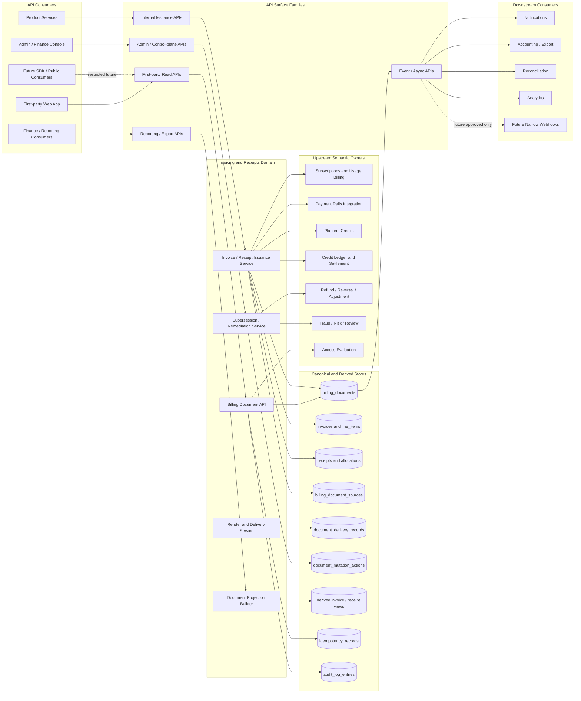
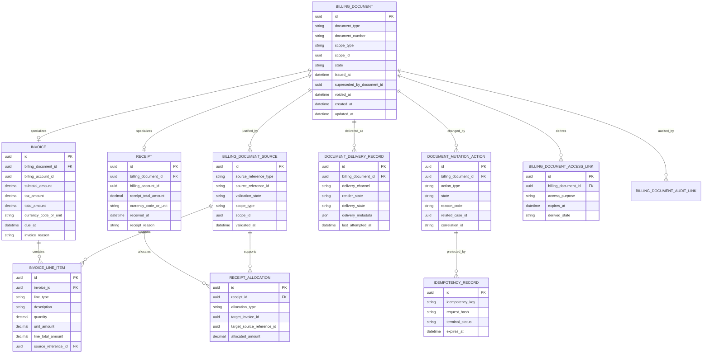
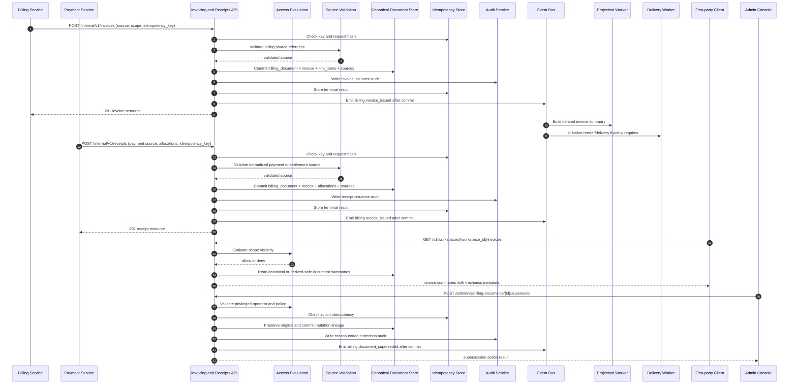

# INVOICING_AND_RECEIPTS_API_SPEC.md

## Document Metadata

- **Document Name:** `INVOICING_AND_RECEIPTS_API_SPEC.md`
- **Document Type:** API SPEC v2 — Production-grade interface-contract specification
- **Status:** Draft for canonical API SPEC v2 inclusion
- **Version:** 2.0.0
- **Effective Date:** 2026-04-24
- **Last Updated:** 2026-04-24
- **Reviewed On:** 2026-04-24
- **Document Owner:** FUZE Platform Invoicing and Billing Documents Architecture
- **Approval Authority:** FUZE Platform Architecture and Governance Authority
- **Review Cadence:** Quarterly or upon material change to billing truth, payment normalization, Platform Credits semantics, credit-ledger settlement posture, refund/correction policy, document delivery controls, tax/compliance posture, audit/traceability requirements, or public/document visibility posture
- **Governing Layer:** API contract layer derived from platform core / shared commercial infrastructure / invoicing and receipts
- **Parent Registry:** `API_SPEC_INDEX.md` and FUZE API SPEC v2 Canonical File Registry
- **Upstream Semantic Registry:** `REFINED_SYSTEM_SPEC_INDEX.md`
- **Upstream API Registry:** `API_SPEC_INDEX.md`
- **Primary Audience:** API architecture, backend engineering, billing engineering, payments engineering, credits and ledger engineering, finance operations, support operations, security engineering, audit/compliance, data engineering, product engineering, frontend engineering, SDK/OpenAPI authors, QA, platform operations, and implementation-contract authors
- **Primary Purpose:** Define the production-grade FUZE API contract for canonical invoice and receipt resources, issuance, visibility, delivery, access-link generation, supersession-safe correction, event emission, audit lineage, read models, and implementation guardrails while preserving refined invoicing and receipts semantics.
- **Primary Upstream References:** `REFINED_SYSTEM_SPEC_INDEX.md`; `API_SPEC_INDEX.md`; `DOCS_SPEC_INDEX.md`; `SYSTEM_SPEC_INDEX.md`; `INVOICING_AND_RECEIPTS_SPEC.md`; `SUBSCRIPTIONS_AND_USAGE_BILLING_SPEC.md`; `PAYMENT_RAILS_INTEGRATION_SPEC.md`; `PLATFORM_CREDITS_SPEC.md`; `CREDIT_LEDGER_AND_SETTLEMENT_SPEC.md`; `REFUND_REVERSAL_AND_ADJUSTMENT_SPEC.md`; `PAYMENT_FRAUD_AND_ABUSE_PREVENTION_SPEC.md`; `PRICING_AND_MONETIZATION_MODEL_SPEC.md`; `ROLE_PERMISSION_AND_ACCESS_CONTROL_SPEC.md`; `SCOPED_AUTHORIZATION_MODEL_SPEC.md`; `ACCESS_EVALUATION_AND_EFFECTIVE_PERMISSION_SPEC.md`; `AUDIT_AND_ACCESS_TRACEABILITY_SPEC.md`; `SECURITY_AND_RISK_CONTROL_SPEC.md`; `API_ARCHITECTURE_SPEC.md`; `PUBLIC_API_SPEC.md`; `INTERNAL_SERVICE_API_SPEC.md`; `EVENT_MODEL_AND_WEBHOOK_SPEC.md`; `IDEMPOTENCY_AND_VERSIONING_SPEC.md`; `MIGRATION_AND_BACKWARD_COMPATIBILITY_SPEC.md`
- **Primary Downstream Dependents:** OpenAPI contracts for invoice and receipt routes; AsyncAPI contracts for billing-document lifecycle events; first-party billing UI; workspace billing UI; admin finance/support console; product billing-document visibility surfaces; accounting/export workflows; reconciliation workflows; support/control-plane document remediation workflows; reporting and analytics projections; SDK models for billing documents
- **API Surface Families Covered:** First-party application APIs; internal service APIs; admin/control-plane APIs; event/async APIs; reporting/export-facing read APIs; limited public-read companion posture only where separately approved
- **API Surface Families Excluded:** Raw payment-provider APIs; raw tax-engine APIs; full accounting-system export schemas; unrestricted third-party webhooks; chain execution APIs; generic contract-document APIs; product-local billing-note APIs
- **Canonical System Owner(s):** FUZE Invoicing and Receipts Domain for invoice, receipt, billing-document, source-reference, receipt-allocation, delivery, and mutation-lineage truth
- **Canonical API Owner:** FUZE Platform API Architecture, in coordination with FUZE Platform Invoicing and Billing Documents Architecture
- **Supersedes:** `INVOICING_RECEIPTS_API_SPEC.md` API v1 draft and any weaker invoicing/receipt API guidance that does not preserve refined system boundaries
- **Superseded By:** Not yet known
- **Related Decision Records:** Not yet known
- **Canonical Status Note:** This API spec is the authoritative API SPEC v2 contract for FUZE invoicing and receipts. It does not redefine the refined system semantics; it expresses those semantics through stable API surface, request, response, error, event, audit, idempotency, migration, and implementation-contract requirements.
- **Implementation Status:** Normative API baseline; downstream route specifications, OpenAPI files, AsyncAPI files, SDKs, services, workers, projections, and tests must conform
- **Approval Status:** Drafted for architecture review and canonical API SPEC v2 approval
- **Change Summary:** Upgrades the earlier `INVOICING_RECEIPTS_API_SPEC.md` into the registry filename `INVOICING_AND_RECEIPTS_API_SPEC.md`; strengthens public/first-party/internal/admin/event separation; derives route-family posture from the active refined v1.1.0 invoicing spec; hardens source-reference validation, document lineage, delivery-state separation, derived-read safety, idempotency, auditability, and implementation QA coverage.

---

## Purpose

This document defines the FUZE API SPEC v2 contract for invoicing and receipts.

The API exists to expose FUZE canonical billing-document truth safely across first-party clients, internal services, admin/control-plane tools, event consumers, reporting systems, and implementation-contract layers. It governs how invoices and receipts are read, issued, linked to approved upstream commercial sources, delivered, superseded, voided, remediated, audited, projected, and represented through API contracts.

Invoices and receipts are commercial and finance-sensitive artifacts. They MUST remain distinct from subscription truth, usage-billing truth, payment-rail truth, Platform Credits truth, credit-ledger truth, refund/reversal truth, entitlement truth, product-local UI summaries, provider UI state, token/payout/treasury truth, and final accounting-book interpretation.

This API spec owns interface-contract expression only. `INVOICING_AND_RECEIPTS_SPEC.md` owns semantic truth.

---

## Scope

This API specification governs:

- invoice list, detail, status, source-linkage, and access-link contract posture;
- receipt list, detail, allocation, source-linkage, and access-link contract posture;
- billing-document supertype route families and API-facing resource identity;
- account-scoped and workspace-scoped billing-document visibility;
- internal invoice issuance APIs from approved billing or commercial source references;
- internal receipt issuance APIs from approved payment or settlement source references;
- document delivery, render, access-link, and remediation API posture;
- admin/control-plane void, supersede, regenerate, discrepancy, and delivery remediation actions;
- event/async lifecycle signals for invoice, receipt, delivery, supersession, remediation, and discrepancy flows;
- request, response, error, status, idempotency, replay, authorization, audit, observability, migration, and compatibility rules;
- derived read-model, reporting, export, dashboard, and product-display guardrails.

---

## Out of Scope

This API specification does not govern:

- raw payment-provider verification protocols;
- recurring subscription state machines in full detail;
- usage-rating math in full detail;
- Platform Credits class semantics or credit-balance truth;
- credit-ledger append-only mutation mechanics;
- refund/reversal/adjustment workflow semantics in full detail;
- fraud/risk scoring semantics in full detail;
- tax-engine internals, jurisdictional tax advice, or legal language for every document;
- PDF rendering internals or final document layout implementation;
- external accounting/export schema in full detail;
- token, payout, treasury, governance, or profit-participation statements;
- unsupported peer-to-peer invoicing;
- generic contract-document management outside billing documents.

---

## Design Goals

1. Preserve invoices and receipts as distinct document classes with distinct API contracts.
2. Expose stable, scope-aware document reads for first-party clients without allowing frontend or product-local systems to author document truth.
3. Ensure invoice and receipt issuance is backend-owned, source-reference-validated, idempotent, auditable, and lineage-preserving.
4. Preserve the separation of document lifecycle state, delivery/render state, mutation-action state, and upstream commercial state.
5. Support account and workspace billing scopes without scope guessing or wrong-scope document assignment.
6. Support explicit correction through voiding, supersession, cancellation, regeneration, or remediation rather than destructive overwrite.
7. Enable finance, support, reconciliation, reporting, and compliance workflows without creating alternate truth owners.
8. Provide route-family and contract guardrails suitable for OpenAPI, AsyncAPI, SDK, QA, monitoring, and migration planning.
9. Prevent provider UI, payment summaries, billing summaries, ledger rows, product notes, cached PDFs, or dashboard projections from outranking canonical document records.
10. Make failure, ambiguity, replay, duplicate-source, and degraded-mode behavior deterministic.

---

## Non-Goals

This API specification is not intended to:

- make invoices and receipts interchangeable;
- make invoices proof of payment by themselves;
- make receipts substitutes for invoices where invoice semantics are required;
- allow payment-provider UI state to become receipt truth;
- allow billing summary rows or ledger entries to become invoice truth;
- allow frontend, product, admin, or provider systems to create canonical documents outside backend-owned pathways;
- define all jurisdiction-specific tax fields or local document language;
- replace detailed implementation-contract, database-schema, rendering, tax, accounting-export, or runbook specifications.

---

## Core Principles

### Invoice / Receipt Separation Principle

Invoices represent approved billing obligations, charge summaries, or commercial billing records. Receipts confirm approved payment or value-settlement outcomes. APIs MUST NOT collapse them into a generic `transaction` model.

### Backend-Owned Billing-Document Truth Principle

Canonical billing-document truth is owned by the FUZE backend invoicing and receipts domain. Frontend, product, provider, admin, and reporting surfaces consume or trigger bounded workflows; they do not own document semantics.

### Approved Source Reference Principle

Every invoice or receipt MUST originate from at least one approved and durable source reference. Ad hoc document creation from UI assumptions, operator notes, provider dashboard state, or product-local rows is forbidden.

### Document-Is-Not-Billing Principle

Billing truth determines commercial obligations, cycles, usage-rated outcomes, seat commercial state, and billing corrections. Documents represent approved billing truth but do not replace it.

### Document-Is-Not-Payment Principle

Payment verification can justify receipt issuance and invoice settlement posture, but payment-provider UI state and raw payment callbacks are not themselves receipt truth.

### Document-Is-Not-Credits-or-Ledger Principle

Platform Credits semantics and credit-ledger mutation truth may be referenced by invoices and receipts, but documents are not balances, ledger entries, settlement records, payout records, or treasury records.

### Scope-Attached Document Principle

Every canonical invoice or receipt MUST attach to exactly one explicit commercial scope, normally account or workspace. Wrong-scope assignment MUST fail closed or enter explicit correction.

### Supersession-Safe Correction Principle

Void, supersession, cancellation, regeneration, and remediation actions MUST preserve historical lineage. Destructive rewrite of issued commercial documents is forbidden.

### Derived-View Subordination Principle

Invoice summaries, receipt summaries, access links, download metadata, dashboards, exports, analytics, email content, cached PDFs, and presentation views are derived and subordinate.

### Auditability Principle

Sensitive document issuance, correction, voiding, supersession, delivery remediation, and discrepancy resolution MUST be attributable, reason-coded where privileged, correlation-linked, and auditable.

---

## Canonical Definitions

- **Billing Document:** Canonical API-facing supertype for invoice or receipt records, including document identity, scope, lifecycle, source-linkage, delivery posture, and lineage metadata.
- **Invoice:** Canonical billing document representing an approved billing obligation, charge summary, or commercial billing record.
- **Receipt:** Canonical billing document confirming an approved payment or value-settlement event according to FUZE policy.
- **Invoice Line Item:** Canonical line-level component of an invoice tied to product, plan, usage, seat, add-on, credit funding, correction, discount, tax, or approved grouped commercial reason.
- **Receipt Allocation:** Explicit linkage from a receipt to an invoice, billing cycle, credits top-up, verified payment, settlement event, or other approved commercial source.
- **Billing Document Source:** Durable normalized source reference that justifies document issuance.
- **Document Delivery Record:** Durable record of render, delivery, access-link, channel, and remediation state.
- **Document Mutation Action:** Durable record of issuance, voiding, supersession, cancellation, regeneration, discrepancy handling, or remediation action.
- **Supersession:** Replacement of one billing document by another while retaining original lineage and explicit replacement linkage.
- **Document Access Link:** Short-lived derived access metadata for display or download. It is not canonical document truth and must not replace authorization checks.

---

## Truth Class Taxonomy

API contracts MUST distinguish the following truth classes:

1. **Identity Truth:** canonical actor identity and account anchoring.
2. **Session Truth:** runtime authenticated session or privileged-session posture.
3. **Workspace / Organization Scope Truth:** canonical workspace, organization, and membership scope state.
4. **Authorization Truth:** role, permission, scope, and effective-permission outcomes.
5. **Entitlement Truth:** commercial/policy eligibility for product or capability use.
6. **Pricing Truth:** product/package/rate/promotion policy and monetization posture.
7. **Billing Truth:** subscription cycles, usage charges, billing owner, billing scope, seat state, overage state, renewal/recovery state, and commercial obligations.
8. **Payment-Rail Truth:** verified external value ingress, provider-event normalization, settlement/dispute/reversal posture, and rail-specific constraints.
9. **Platform Credits Semantic Truth:** credit classes, spend semantics, issuance categories, restrictions, and ownership scope.
10. **Credit Ledger and Settlement Truth:** append-oriented credits mutation, balance derivation, settlement linkage, and reconciliation truth.
11. **Invoice / Receipt Truth:** canonical billing-document identity, source-linkage, lifecycle, line-item/allocation, delivery, mutation, supersession, and remediation state owned by this API domain.
12. **Refund / Reversal / Adjustment Truth:** exception-case correction state that may trigger document supersession or voiding but does not rewrite original documents.
13. **Risk / Policy Truth:** fraud, abuse, compliance, review, restriction, and containment posture that may constrain visibility, issuance, or correction.
14. **Audit / Traceability Truth:** immutable evidence of who did what, why, under which scope, correlation, policy, and before/after posture.
15. **Derived Read-Model Truth:** summaries, dashboards, exports, access metadata, rendered views, cached display fields, and analytics derived from canonical document records.
16. **Presentation Truth:** UI labels, localized formatting, PDF layout, email text, and display ordering.

---

## Architectural Position in the Spec Hierarchy

This API spec sits below refined system semantics and expresses them as interface contract.

### Upstream Semantic Owners

- `INVOICING_AND_RECEIPTS_SPEC.md` owns invoice and receipt semantics.
- `SUBSCRIPTIONS_AND_USAGE_BILLING_SPEC.md` owns recurring billing, usage billing, billing cycle, seat billing, and billing-scope commercial truth.
- `PAYMENT_RAILS_INTEGRATION_SPEC.md` owns normalized payment truth and provider-event intake.
- `PLATFORM_CREDITS_SPEC.md` owns credit semantic truth.
- `CREDIT_LEDGER_AND_SETTLEMENT_SPEC.md` owns credits ledger, settlement, balance derivation, and reconciliation truth.
- `REFUND_REVERSAL_AND_ADJUSTMENT_SPEC.md` owns refund, reversal, adjustment, and exception-case correction truth.
- `PAYMENT_FRAUD_AND_ABUSE_PREVENTION_SPEC.md` owns commercial risk, dispute, fraud, review, and containment posture.
- `PRICING_AND_MONETIZATION_MODEL_SPEC.md` owns pricing, package, rate, promotion, and monetization policy truth.
- `ACCESS_EVALUATION_AND_EFFECTIVE_PERMISSION_SPEC.md` owns final action-level access decisions.
- `AUDIT_AND_ACCESS_TRACEABILITY_SPEC.md` and `AUDIT_LOG_AND_ACTIVITY_SPEC.md` own audit and traceability posture.

### Downstream Contract Layers

- route-level OpenAPI files MUST preserve the resource and state distinctions in this document;
- AsyncAPI files MUST preserve event identity, ordering, lineage, and canonical-vs-derived distinctions;
- SDKs MUST not collapse invoices and receipts into generic transaction records;
- service implementation specs MUST not replace source-reference validation with local heuristics;
- reporting/export specs MUST remain traceable to canonical document records;
- rendering/PDF specs MUST not define document truth.

---

## API Surface Families

### First-Party Application APIs

Used by FUZE web and approved first-party clients to read visible billing documents and request bounded access-link metadata. These APIs are read-dominant and MUST NOT create canonical invoices or receipts.

### Internal Service APIs

Used by trusted FUZE backend services to issue invoices and receipts from approved source references, update delivery state, resolve canonical status, and coordinate reconciliation. These APIs require service identity, least privilege, idempotency keys, and source validation.

### Admin / Control-Plane APIs

Used by privileged support/finance/operator tools for voiding, supersession, regeneration, delivery remediation, discrepancy case handling, and restricted visibility. These APIs require reason codes, case references where material, privileged authorization, stronger audit, and bounded policy checks.

### Event / Async APIs

Used for post-commit synchronization, audit, notification, export, reconciliation, reporting, and projection updates. Events are synchronization signals, not canonical truth substitutes.

### Reporting / Export APIs

Used by finance, support, analytics, reconciliation, and customer-facing views. Reporting surfaces MUST distinguish canonical records from derived summaries and MUST be traceable to source document IDs.

### Public API Considerations

No broad third-party public invoice/receipt mutation API is approved by this spec. Future external document webhooks or public APIs MUST be narrow, stable, security-reviewed, commercially safe, and separately governed.

### Chain-Adjacent API Considerations

Invoices and receipts are off-chain commercial documents. They MAY reference chain-adjacent settlement or Base-linked credit events only as approved source references or reconciliation metadata. They MUST NOT become on-chain truth, token truth, payout truth, treasury truth, or governance truth.

---

## System / API Boundaries

This API governs billing-document contracts only. It consumes approved truth from billing, payment, credits, ledger, refund, pricing, fraud, authorization, and audit domains.

It MUST NOT:

- infer billing truth from invoice presentation;
- infer payment truth from receipt display without normalized payment reference;
- mutate credits balances;
- mutate billing subscriptions directly;
- execute refunds directly;
- transform provider callbacks into documents before normalization;
- expose admin correction as ordinary user mutation;
- create hidden broad-write internal shortcuts;
- allow derived summaries, cached documents, reports, or PDFs to become canonical mutation sources.

---

## Adjacent API Boundaries

- `SUBSCRIPTIONS_AND_USAGE_BILLING_API_SPEC.md` governs subscription and usage billing state. This spec may expose invoices derived from approved billing events but does not own those billing events.
- `PAYMENT_RAILS_INTEGRATION_API_SPEC.md` governs payment initiation, provider-event intake, normalization, verification, dispute, and payment-state posture. This spec may issue receipts from approved normalized payment outcomes but does not own payment truth.
- `PLATFORM_CREDITS_API_SPEC.md` governs credits semantics and credit-facing resources. This spec may document credits purchases but does not own credit balances.
- `CREDIT_LEDGER_AND_SETTLEMENT_API_SPEC.md` governs append-oriented ledger mutation and settlement. This spec may reference ledger lineage but does not own ledger entries.
- `REFUND_REVERSAL_AND_ADJUSTMENT_API_SPEC.md` governs exception-case financial correction. This spec may void or supersede documents because of an approved correction but does not decide final refund policy.
- `PAYMENT_FRAUD_AND_ABUSE_PREVENTION_API_SPEC.md` governs risk holds, review, and release posture. This spec consumes risk posture to hold, restrict, or remediate document visibility or issuance.
- `PRICING_AND_MONETIZATION_MODEL_API_SPEC.md` governs pricing/rate/promotion policy. This spec may expose pricing-derived line items but does not determine pricing.
- `AUDIT_AND_ACCESS_TRACEABILITY_API_SPEC.md` and `AUDIT_LOG_AND_ACTIVITY_API_SPEC.md` govern audit record structure and visibility.

---

## Conflict Resolution Rules

When document-related layers disagree, APIs MUST resolve conflicts in the following order unless a higher-order governance policy explicitly overrides:

1. canonical account/workspace scope and billing-owner truth;
2. canonical upstream billing truth for invoices or normalized payment/settlement truth for receipts;
3. canonical invoice or receipt record and explicit mutation lineage;
4. active risk, fraud, compliance, review, or restriction posture;
5. delivery/render/access-link state;
6. derived summaries, reports, exports, UI fields, cached PDFs, email content, provider UI, and product-local views.

Additional rules:

- Provider UI MUST NOT outrank canonical receipt state.
- Billing summaries MUST NOT outrank canonical invoice state.
- Credits balances or ledger rows MUST NOT substitute for invoices or receipts.
- Corrective document actions MUST preserve lineage.
- Ambiguous scope, source, allocation, or document class MUST resolve to no issuance, hold, review, or explicit correction.
- If API v1 and refined semantics disagree, refined semantics win; the v2 API contract MUST use the conservative architecture-consistent interpretation.

---

## Default Decision Rules

When ambiguity exists and no narrower rule applies:

- default to no invoice/receipt issuance without an approved source reference;
- default to explicit account/workspace scope assignment before issuance;
- default to no destructive rewrite;
- default to source-reference conflict rather than duplicate issuance;
- default to canonical backend record over provider/frontend/report/cache/display record;
- default to redacted or denied visibility rather than widened access;
- default to hold or review for tax-sensitive, dispute-sensitive, high-value, wrong-scope, or correction-sensitive cases;
- default to reason-coded admin remediation for privileged changes;
- default to event emission only after canonical commit;
- default to derived projections lagging canonical truth rather than creating truth.

---

## Roles / Actors / API Consumers

- **Authenticated Account Actor:** signed-in user requesting account-scoped billing documents.
- **Workspace Member Actor:** authenticated user requesting workspace-scoped documents subject to effective permission.
- **Billing Owner / Billing Admin:** user or workspace role authorized to view broader commercial documents for a scope.
- **Internal Billing Service:** service that owns approved billing-source creation and invoice trigger workflows.
- **Internal Payment Service:** service that owns normalized payment outcomes and receipt trigger workflows.
- **Credits / Ledger Service:** service that may provide credits purchase or ledger settlement source references.
- **Document Rendering Worker:** worker that renders, stores, delivers, or retries document display assets.
- **Projection / Reporting Consumer:** internal consumer that builds derived summaries and exports.
- **Admin / Finance Operator:** privileged actor performing bounded correction/remediation.
- **Audit Service:** service that records immutable lineage.
- **Notification Service:** downstream consumer of document-delivery or issuance events.
- **External Provider:** payment, tax, delivery, or rendering provider; never canonical document owner.

---

## Resource / Entity Families

### Canonical API Resources

- `billing_document`
- `invoice`
- `invoice_line_item`
- `receipt`
- `receipt_allocation`
- `billing_document_source`
- `document_delivery_record`
- `document_mutation_action`
- `document_discrepancy_case`

### Derived API Resources

- `invoice_summary`
- `receipt_summary`
- `billing_document_access_link`
- `billing_document_export_row`
- `billing_document_dashboard_view`
- `billing_document_activity_view`

### External / Provider Input Objects

- normalized payment references;
- verified settlement references;
- billing source references;
- tax computation references;
- delivery-provider references;
- fraud/risk case references.

External/provider input objects MUST be normalized before they influence canonical document mutation.

---

## Ownership Model

The Invoicing and Receipts Domain owns canonical billing-document API resources and their lifecycle. It owns:

- `billing_documents`;
- `invoices`;
- `invoice_line_items`;
- `receipts`;
- `receipt_allocations`;
- `billing_document_sources` as document-domain source-linkage records;
- `document_delivery_records`;
- `document_mutation_actions`;
- document-level supersession lineage;
- document access-link generation posture.

It does not own upstream billing, payment, credits, ledger, refund, risk, pricing, entitlement, authorization, audit, tax-provider, or accounting-book truth.

---

## Authority / Decision Model

### Document Authority

This API domain decides whether an invoice or receipt exists, which document class it is, which source references support it, which lifecycle state it has, and how it is exposed.

### Upstream Source Authority

Billing, payment, credits, ledger, refund, pricing, and risk domains decide whether source facts exist. This API MUST validate but not reinterpret those facts.

### Delivery Authority

This API domain decides render, delivery, access-link, and remediation state while keeping delivery state separate from issuance truth.

### Correction Authority

This API domain decides document-level void, supersession, regeneration, and remediation posture when authorized policy and source evidence support it. It MUST preserve linkage to upstream correction/refund/reversal truth where applicable.

### Product Authority

Product domains may reference documents and display approved views but do not decide document semantics.

---

## Authentication Model

- First-party read routes require valid authenticated user session.
- Workspace document routes require authenticated session plus workspace-scoped visibility.
- Access-link creation requires authenticated session and fresh authorization against the document scope.
- Internal issuance and delivery routes require service identity with explicit least privilege.
- Admin/control routes require privileged operator session, stronger risk posture where configured, reason code, and case linkage where material.
- Async workers require workload identity and scoped capabilities.
- External providers MUST NOT call canonical document mutation routes directly unless routed through a provider-normalization boundary.

---

## Authorization / Scope / Permission Model

Authorization MUST evaluate:

- actor identity;
- session validity and freshness;
- target scope type and scope ID;
- workspace membership and role when scope is workspace;
- billing owner or billing administrator role where required;
- read vs mutation vs privileged correction action;
- document sensitivity, restriction, fraud/review, or compliance posture;
- internal service identity and granted API capability;
- admin/operator role and policy allowance;
- effective permission at time of action, not only cached UI state.

Rules:

- document visibility does not imply mutation authority;
- workspace visibility does not imply account-level visibility;
- account-level billing ownership does not automatically imply workspace document mutation authority;
- access-link generation MUST re-check authorization;
- admin override MUST be bounded, audited, and reason-coded;
- degraded authorization dependency MUST fail closed for sensitive reads and all mutations.

---

## Entitlement / Capability-Gating Model

Entitlements do not create document truth. This API MAY use entitlement/capability gates to determine whether a client can access a document-management feature, export feature, or premium reporting surface, but invoice/receipt existence, scope, source references, and lifecycle remain document-domain truth.

Entitlement denial MUST NOT erase canonical document truth. It may restrict display, export, delivery, or feature access.

---

## API State Model

### Invoice Lifecycle State

Allowed contract states SHOULD include:

- `draft_if_supported`
- `issued`
- `voided`
- `superseded`
- `cancelled_if_supported`

### Receipt Lifecycle State

Allowed contract states SHOULD include:

- `issued`
- `voided_if_supported`
- `superseded_if_supported`

### Delivery / Render State

Allowed contract states SHOULD include:

- `pending_render`
- `rendered`
- `delivered`
- `delivery_failed`
- `expired`
- `remediation_required`

### Mutation Action State

Allowed contract states SHOULD include:

- `requested`
- `validated`
- `accepted`
- `executing`
- `executed`
- `failed`
- `closed`
- `rejected`

### Source Validation State

Allowed contract states SHOULD include:

- `pending_validation`
- `validated`
- `invalid`
- `restricted`
- `already_applied`
- `requires_review`

State meanings MUST be stable across API versions unless versioned migration explicitly changes them.

---

## Lifecycle / Workflow Model

### Invoice Issuance

Invoice issuance begins only after an approved billing or commercial source reference exists. The API validates the source, scope, duplicate-source constraints, idempotency key, line-item mapping, and policy posture. On success, it commits canonical invoice records, source linkage, delivery initialization where applicable, audit records, and post-commit events.

### Receipt Issuance

Receipt issuance begins only after an approved payment or value-settlement source reference exists. The API validates payment/settlement source, scope, duplicate-source constraints, allocation semantics, idempotency key, and policy posture. On success, it commits canonical receipt records, allocation records, source linkage, delivery initialization where applicable, audit records, and post-commit events.

### Document Read

Document reads authenticate actor, evaluate effective scope visibility, return canonical detail or derived summary with freshness markers, and MUST NOT expose unauthorized scope, operator notes, or hidden risk details.

### Access-Link Generation

Access-link generation is a mutation-like derived action. It MUST re-check authorization, create short-lived derived metadata, avoid exposing canonical storage paths, and log or audit based on sensitivity.

### Correction / Supersession / Void

Privileged correction actions validate operator authority, reason code, case linkage, original document state, source evidence, policy posture, idempotency key, and lineage rules. Actions MUST preserve original records.

### Delivery Remediation

Delivery remediation updates delivery/render state without altering issuance truth. It may enqueue rendering or delivery jobs and emit delivery events.

---

## Architecture Diagram — Mermaid flowchart

---

## Data Design — Mermaid Diagram

### Data Design Rules

- `BILLING_DOCUMENT` is canonical; summary views, access links, cached PDFs, exports, and dashboard rows are derived.
- `INVOICE` and `RECEIPT` are not interchangeable subtypes.
- `BILLING_DOCUMENT_SOURCE` records document-domain source linkage; it does not own upstream billing/payment/credits truth.
- `DOCUMENT_DELIVERY_RECORD` MUST NOT change issuance truth.
- `DOCUMENT_MUTATION_ACTION` preserves correction lineage.
- `IDEMPOTENCY_RECORD` protects mutation routes and MUST not be treated as business truth.

---

## Flow View

### A. First-Party Invoice/Receipt Read

1. Client requests invoice, receipt, or summary route.
2. API authenticates session.
3. API evaluates account/workspace scope visibility using effective-permission service.
4. API reads canonical document records or derived summaries.
5. API redacts fields based on scope, sensitivity, and policy.
6. API returns stable resource identifiers, state, source summaries, delivery summaries, and freshness metadata.
7. No canonical mutation occurs.

### B. Internal Invoice Issuance

1. Billing service identifies approved billing obligation or commercial source.
2. Billing service calls internal invoice issuance route with source reference, scope, line items, correlation ID, and idempotency key.
3. API validates service identity and privilege.
4. API validates source reference with upstream owner.
5. API checks duplicate issuance and idempotency.
6. API commits billing document, invoice, line items, source linkage, optional delivery record, audit lineage, and idempotency terminal result.
7. API emits `billing.invoice_issued` after commit.
8. Projection and delivery workers process asynchronously.

### C. Internal Receipt Issuance

1. Payment/settlement service identifies approved normalized payment or settlement outcome.
2. Service calls internal receipt issuance route with source reference, scope, allocations, correlation ID, and idempotency key.
3. API validates service identity, source, scope, allocation semantics, duplicate issuance, and risk posture.
4. API commits billing document, receipt, allocations, source linkage, optional delivery record, audit lineage, and idempotency terminal result.
5. API emits `billing.receipt_issued` after commit.
6. Downstream notifications, export, and reconciliation consumers process the event.

### D. Access-Link Generation

1. Actor requests access metadata for a billing document.
2. API authenticates actor and re-evaluates document visibility.
3. API checks document state and policy restrictions.
4. API generates short-lived access metadata or returns safe denial.
5. API logs or audits the access-link creation according to sensitivity.
6. Access-link expiration does not change document truth.

### E. Admin Supersession / Void / Regeneration

1. Operator opens approved finance/support/risk case.
2. Operator calls admin route with target document, reason code, operator note, related case, correlation ID, and idempotency key.
3. API validates privileged session, operator permission, policy, source evidence, and target document state.
4. API creates mutation action record and executes allowed transition.
5. Original document remains preserved.
6. Replacement document is linked if generated.
7. Audit and event records are emitted after canonical commit.

### F. Delivery Failure and Remediation

1. Rendering or delivery worker fails to render/deliver document.
2. Delivery record transitions to `delivery_failed` or `remediation_required`.
3. Internal service or admin operator triggers remediation with idempotency key.
4. API updates delivery record and queues safe retry.
5. Audit/event emission captures remediation.
6. Document lifecycle remains `issued` unless separate correction action changes it.

### G. Degraded Dependency Behavior

- If authorization service is degraded, sensitive reads and all mutations fail closed.
- If projection is lagging, canonical reads remain authoritative.
- If rendering is degraded, issuance may remain valid while delivery state reflects failure.
- If upstream source validation is unavailable, issuance enters safe retry/review or fails without creating document.

---

## Data Flows — Mermaid sequenceDiagram

---

## Request Model

### Common Request Requirements

All mutation-capable routes MUST require:

- `Content-Type: application/json`;
- authenticated user or service identity as appropriate;
- `X-Correlation-ID` or server-generated correlation ID;
- `Idempotency-Key` for issuance, delivery mutation, access-link generation where configured, void, supersession, regeneration, discrepancy, and remediation actions;
- explicit `scope_type` and `scope_id` where creating or filtering scope-sensitive records;
- explicit source reference fields for issuance routes;
- reason code for privileged admin/control-plane actions;
- related case ID for high-impact corrections where policy requires.

### Invoice Issuance Request Fields

Internal invoice issuance requests MUST include:

- `scope_type`;
- `scope_id`;
- `source_references[]`;
- `line_items[]`;
- `invoice_reason`;
- `currency_code_or_unit`;
- `total_amount` or computed line-item input sufficient for backend calculation;
- `idempotency_key`;
- `correlation_id`;
- optional `delivery_preferences`;
- optional `tax_context_reference` where policy requires.

Frontend-computed totals MUST NOT be accepted as authoritative without backend validation.

### Receipt Issuance Request Fields

Internal receipt issuance requests MUST include:

- `scope_type`;
- `scope_id`;
- `source_references[]`;
- `receipt_allocations[]`;
- `receipt_reason`;
- `currency_code_or_unit`;
- `receipt_total_amount`;
- `received_at` or normalized source timestamp;
- `idempotency_key`;
- `correlation_id`;
- optional `delivery_preferences`.

Receipt allocation MUST NOT silently exceed approved source meaning.

### Admin Correction Request Fields

Admin/control-plane requests MUST include:

- `reason_code`;
- `operator_note` when policy permits/needs it;
- `related_case_id` where material;
- `target_document_id`;
- requested action;
- `idempotency_key`;
- `correlation_id`;
- optional replacement document source references.

---

## Response Model

### Common Success Response Fields

Responses SHOULD include:

- stable `id`;
- `document_type`;
- `document_number` where exposed;
- `scope_type` and `scope_id` where authorized;
- lifecycle `state`;
- source-reference summary;
- delivery summary;
- `created_at`, `issued_at`, `updated_at` as applicable;
- `correlation_id` for mutations;
- `operation_id` for async accepted work;
- `is_derived` and freshness metadata for summaries/projections.

### Invoice Detail Response

Invoice detail responses SHOULD include:

- invoice identity and lifecycle state;
- billing scope;
- billing account reference if allowed;
- line items;
- subtotal, tax, total, and currency/unit fields;
- due date where applicable;
- source reference summaries;
- supersession/void lineage where visible;
- delivery/access availability summary;
- redaction markers where some fields are restricted.

### Receipt Detail Response

Receipt detail responses SHOULD include:

- receipt identity and lifecycle state;
- billing scope;
- receipt total and currency/unit fields;
- received/settled timestamp;
- allocation summaries;
- payment or settlement source summaries where visible;
- supersession/void lineage where visible;
- delivery/access availability summary.

### Async Accepted Response

When processing is asynchronous, response MUST include:

- `status: accepted`;
- `operation_id`;
- current action state;
- polling/status route or event expectation;
- `correlation_id`;
- clear distinction that acceptance is not final business success.

### Derived Summary Response

Derived responses MUST include enough metadata for consumers to know they are not canonical mutation sources:

- `is_derived: true`;
- `source_document_id` or source linkage;
- `projection_generated_at`;
- `projection_lag_hint` where relevant;
- redaction markers.

---

## Error / Result / Status Model

Errors MUST use machine-readable structure with at least:

- `type`;
- `title`;
- `status`;
- `code`;
- `detail`;
- `instance`;
- `correlation_id`;
- optional `retryable`;
- optional `operation_id`;
- optional `policy_reference` when safe.

### Required Error Classes

#### Authentication / Authorization

- `DOCUMENT_SESSION_REQUIRED`
- `DOCUMENT_PERMISSION_DENIED`
- `DOCUMENT_SCOPE_FORBIDDEN`
- `DOCUMENT_OPERATOR_PERMISSION_DENIED`
- `DOCUMENT_SERVICE_PERMISSION_DENIED`
- `DOCUMENT_PRIVILEGED_SESSION_REQUIRED`

#### Source / Scope / Validation

- `DOCUMENT_SOURCE_REQUIRED`
- `DOCUMENT_SOURCE_NOT_VALIDATED`
- `DOCUMENT_SOURCE_INVALID`
- `DOCUMENT_SOURCE_ALREADY_APPLIED`
- `DOCUMENT_SCOPE_INVALID`
- `DOCUMENT_SCOPE_MISMATCH`
- `DOCUMENT_SCOPE_RESTRICTED`
- `DOCUMENT_ALLOCATION_INVALID`
- `DOCUMENT_ALLOCATION_OVER_APPLIED`

#### Lifecycle / Conflict

- `DOCUMENT_NOT_FOUND`
- `DOCUMENT_STATE_INVALID`
- `DOCUMENT_ALREADY_TERMINAL`
- `DOCUMENT_ALREADY_VOIDED`
- `DOCUMENT_SUPERSESSION_CONFLICT`
- `DOCUMENT_DELIVERY_STATE_INVALID`
- `DOCUMENT_RENDER_STATE_INVALID`

#### Policy / Risk

- `DOCUMENT_REVIEW_REQUIRED`
- `DOCUMENT_RISK_HOLD_ACTIVE`
- `DOCUMENT_VOID_FORBIDDEN`
- `DOCUMENT_SUPERSESSION_REQUIRED`
- `DOCUMENT_REMEDIATION_FORBIDDEN`
- `DOCUMENT_ACCESS_LINK_FORBIDDEN`

#### Idempotency / Replay

- `DOCUMENT_IDEMPOTENCY_KEY_REQUIRED`
- `DOCUMENT_IDEMPOTENCY_CONFLICT`
- `DOCUMENT_REPLAY_REJECTED`

#### Dependency / Degraded Mode

- `DOCUMENT_SOURCE_VALIDATION_UNAVAILABLE`
- `DOCUMENT_AUTHORIZATION_UNAVAILABLE`
- `DOCUMENT_RENDER_UNAVAILABLE`
- `DOCUMENT_DELIVERY_UNAVAILABLE`
- `DOCUMENT_PROJECTION_STALE`

### Error Handling Rules

- Do not expose hidden provider, fraud, operator, or tax internals to unauthorized clients.
- Distinguish missing source from invalid source and duplicate source.
- Distinguish document issuance failure from delivery failure.
- Distinguish permission denial from risk/review hold when safe; otherwise return bounded denial.
- Do not imply credits, token, payout, treasury, or ledger semantics from document errors.

---

## Idempotency / Retry / Replay Model

Idempotency is mandatory for:

- invoice issuance;
- receipt issuance;
- document delivery record creation/update;
- document access-link creation where configured;
- document void;
- document supersession;
- document regeneration;
- delivery remediation;
- discrepancy resolution;
- admin correction actions.

Rules:

- Idempotency scope MUST include route family, caller identity/service, target scope, action type, request hash, and key.
- Replay of the same key and same semantic request returns the original terminal result.
- Replay of the same key with a different semantic request fails with `DOCUMENT_IDEMPOTENCY_CONFLICT`.
- Duplicate source reference issuance MUST fail or return the prior idempotent result unless an explicit supersession-safe path applies.
- Retries MUST NOT create duplicate document numbers, line items, receipt allocations, delivery records, or correction actions.
- Idempotency records are not commercial truth and MUST NOT be used as document state substitutes.

---

## Rate Limit / Abuse-Control Model

Rate limits MUST protect:

- document list/detail reads by actor and scope;
- access-link generation;
- admin correction routes;
- internal issuance routes by service identity;
- export/report routes;
- delivery remediation and rendering retries.

Abuse controls MUST detect:

- access-link scraping;
- repeated denied document access attempts;
- high-volume document export attempts;
- duplicate issuance attempts;
- suspicious void/supersession spikes;
- provider or product attempts to generate document substitutes;
- wrong-scope access patterns.

Rate-limit responses MUST not reveal whether a sensitive document exists outside the actor’s authorized scope.

---

## Endpoint / Route Family Model

### First-Party Read Routes

- `GET /v1/invoices`
- `GET /v1/invoices/{invoice_id}`
- `GET /v1/receipts`
- `GET /v1/receipts/{receipt_id}`
- `GET /v1/billing-documents/{document_id}`
- `GET /v1/workspaces/{workspace_id}/invoices`
- `GET /v1/workspaces/{workspace_id}/receipts`
- `POST /v1/billing-documents/{document_id}/access-links`

These routes are authenticated and scope-authorized. They are not document-authoring routes.

### Internal Service Routes

- `POST /internal/v1/invoices`
- `POST /internal/v1/receipts`
- `GET /internal/v1/billing-documents/{document_id}`
- `POST /internal/v1/billing-documents/{document_id}/deliveries`
- `POST /internal/v1/billing-documents/source-validation`
- `POST /internal/v1/billing-documents/{document_id}/render-jobs`

Internal routes require service identity, least privilege, idempotency where mutating, and explicit source references.

### Admin / Control-Plane Routes

- `GET /admin/v1/billing-documents`
- `GET /admin/v1/billing-documents/{document_id}`
- `POST /admin/v1/invoices/{invoice_id}/void`
- `POST /admin/v1/receipts/{receipt_id}/void`
- `POST /admin/v1/billing-documents/{document_id}/supersede`
- `POST /admin/v1/billing-documents/{document_id}/regenerate`
- `POST /admin/v1/billing-documents/{document_id}/delivery-remediation`
- `POST /admin/v1/billing-document-discrepancies`

Admin routes require privileged session, policy, reason code, audit, and correlation.

### Event Families

- `billing.invoice_issued`
- `billing.invoice_voided`
- `billing.invoice_superseded`
- `billing.receipt_issued`
- `billing.receipt_voided`
- `billing.receipt_superseded`
- `billing.document_rendered`
- `billing.document_delivered`
- `billing.document_delivery_failed`
- `billing.document_delivery_remediated`
- `billing.document_discrepancy_opened`
- `billing.document_discrepancy_resolved`

Events MUST be post-commit and MUST include document identity, scope, source references where allowed, lifecycle state, event ID, occurred-at timestamp, actor/service reference, correlation ID, and reason code where applicable.

---

## Public API Considerations

This spec does not approve a broad external public API for invoice or receipt mutation. Public exposure MUST default to narrower read-only or user-authorized access, if separately approved. Future public APIs MUST:

- expose stable read contracts only unless explicitly approved;
- avoid provider, operator, risk, and internal source details;
- use narrow scopes and explicit user/workspace authorization;
- avoid exposing mutable document state without clear lifecycle semantics;
- preserve versioning and deprecation guarantees;
- avoid turning public reads into support for third-party document truth.

---

## First-Party Application API Considerations

First-party clients MAY:

- list and read visible documents;
- request short-lived access metadata;
- display delivery state and canonical lifecycle state;
- display source summaries where safe;
- display correction/supersession indicators.

First-party clients MUST NOT:

- compute canonical document totals without backend validation;
- create invoices or receipts directly;
- treat access-link data as authorization truth;
- infer payment, billing, credit, refund, or entitlement truth from display fields;
- hide supersession/voiding lineage when material to user trust.

---

## Internal Service API Considerations

Internal services MAY trigger issuance only through approved source references and least-privilege identities. They MUST NOT become hidden broad-write shortcuts.

Internal issuance routes MUST validate:

- service identity;
- source type;
- source existence;
- source scope;
- duplicate source usage;
- allocation validity;
- risk/review posture;
- idempotency;
- document class semantics.

---

## Admin / Control-Plane API Considerations

Admin/control-plane APIs MUST be:

- separate from first-party user routes;
- privileged-session-protected;
- reason-coded;
- case-linked where material;
- policy-constrained;
- fully audited;
- idempotent;
- scope-aware;
- bounded to correction/remediation workflows;
- unable to destructively rewrite historical document truth.

Admin APIs MUST NOT be used as convenience paths for normal issuance, product-local billing, provider-state correction, or broad manual finance edits.

---

## Event / Webhook / Async API Considerations

Events are synchronization signals, not document truth substitutes.

Rules:

- Events MUST be emitted after canonical commit.
- Events MUST include event identity, document identity, scope, state, correlation ID, occurred-at, and relevant source references.
- Consumers MUST re-read canonical document state for sensitive decisions.
- Projection lag MUST be observable.
- Duplicate event delivery MUST be tolerated by consumers.
- External billing-document webhooks are not generally approved. Any future external webhook surface MUST be separate, narrow, signed, versioned, replay-safe, and security-reviewed.

---

## Chain-Adjacent API Considerations

Invoices and receipts are off-chain commercial documents. This API MAY reference:

- stablecoin settlement sources;
- Base-linked credit commitment references;
- chain observation IDs;
- normalized payment or settlement references.

It MUST NOT:

- represent chain observations as invoice/receipt truth before normalization;
- expose on-chain balances as receipts;
- represent token/payout/treasury facts as invoice or receipt truth;
- imply legal settlement, profit participation, governance, or treasury control from billing-document state.

---

## Data Model / Storage Support Implications

Implementation storage SHOULD support:

- `billing_documents` with unique document number and scope indexes;
- `invoices` subtype table;
- `invoice_line_items`;
- `receipts` subtype table;
- `receipt_allocations`;
- `billing_document_sources` with unique source/scope constraints;
- `document_delivery_records`;
- `document_mutation_actions`;
- `billing_document_access_links` as derived short-lived metadata;
- `idempotency_records`;
- audit links into the audit domain;
- projection tables for summaries and exports.

Storage MUST preserve:

- source references;
- scope references;
- line-item and allocation lineage;
- lifecycle state;
- delivery state separately from issuance state;
- void/supersession/regeneration lineage;
- audit/correlation references.

---

## Read Model / Projection / Reporting Rules

- Invoice summaries, receipt summaries, dashboards, exports, access metadata, analytics rows, and support views are derived.
- Derived views MUST link back to canonical document IDs.
- Derived views MUST include freshness or generated-at metadata where material.
- Sensitive actions MUST re-check canonical state.
- Projection lag MUST NOT create, erase, or override document truth.
- Reports MAY aggregate document state but MUST remain traceable to canonical invoice/receipt records.
- Cached PDFs, downloaded files, email content, and provider UI MUST NOT outrank canonical backend state.
- Redaction must be explicit where fields are hidden for authorization, privacy, risk, or policy reasons.

---

## Security / Risk / Privacy Controls

This API is a finance-sensitive control surface. It MUST enforce:

- strong authentication by route family;
- least-privilege service identity;
- effective-permission checks for scope reads;
- short-lived access metadata;
- redaction for restricted fields;
- fraud/risk/review hold integration;
- no provider-side or frontend-side document spoofing;
- replay-safe mutations;
- reason-coded admin corrections;
- no destructive rewrite;
- export/rate-limit controls;
- privacy-preserving error responses;
- audit on all sensitive mutations.

---

## Audit / Traceability / Observability Requirements

Audit is required for:

- invoice issuance;
- receipt issuance;
- source validation failure where material;
- duplicate-source conflict where material;
- access-link creation where sensitive;
- document void;
- document supersession;
- document regeneration;
- delivery remediation;
- discrepancy open/resolve;
- admin/operator reads of sensitive documents;
- export generation.

Audit records MUST include:

- actor/service identity;
- target scope;
- target document;
- action type;
- reason code where applicable;
- related case ID where applicable;
- before/after summary where applicable;
- idempotency key reference;
- correlation ID;
- policy version where available;
- timestamp.

Observability MUST cover:

- issuance latency and failure rate;
- duplicate-source attempts;
- source validation failures;
- delivery/render failures;
- access-link generation volume;
- denied access attempts;
- projection lag;
- void/supersession volume;
- discrepancy backlog;
- event publication failures;
- idempotency conflicts.

---

## Failure Handling / Edge Cases

### Billing Event Exists but Invoice Generation Fails

The API MUST preserve a recoverable failure or remediation state outside canonical invoice creation. It MUST NOT silently lose the obligation or create an incomplete invoice.

### Payment Verified but Receipt Issuance Lags

Normalized payment truth remains upstream truth. Receipt issuance may be delayed, but eventual receipt lineage MUST be recoverable and idempotent.

### Duplicate Source Reference

Duplicate source reference MUST return the prior idempotent result or fail with source conflict. It MUST NOT issue another same-class document unless supersession-safe policy applies.

### Wrong Scope Discovered

Wrong-scope documents MUST be corrected through void/supersession/regeneration lineage. Destructive scope rewrite is forbidden.

### Delivery Fails After Issuance

Document state remains `issued`; delivery state becomes failed/remediation-required. Delivery remediation is explicit and auditable.

### Receipt Allocates Across Multiple Sources

Allowed only when policy supports it and allocation semantics are explicit. Hidden grouping is forbidden.

### Provider Revocation / Refund After Receipt

Effects must route through normalized reversal/correction logic and preserve original receipt lineage plus corrective state.

### Product Wants Transaction Note

Allowed only as non-canonical presentation if clearly not invoice/receipt truth.

### Authorization Dependency Down

Sensitive reads and all mutations fail closed. Derived cached access MUST NOT bypass authorization.

### Projection Lag

Canonical reads remain authoritative. Projections must disclose staleness or lag when material.

---

## Migration / Versioning / Compatibility / Deprecation Rules

### Migration

Migration from `INVOICING_RECEIPTS_API_SPEC.md` to `INVOICING_AND_RECEIPTS_API_SPEC.md` MUST:

- preserve invoice/receipt distinction;
- preserve existing stable document identifiers where possible;
- map old routes to v2 route-family semantics;
- make source references explicit;
- make scope references explicit;
- preserve document numbers, URLs, or layout conventions only as compatible presentation metadata;
- prevent provider/UI-only artifacts from becoming canonical unless normalized;
- mark product-local document systems as non-canonical or retire them;
- preserve historical correction lineage.

### Versioning

Routes SHOULD use `/v1`, `/internal/v1`, and `/admin/v1` while governed by API SPEC v2. Contract evolution MUST be additive where possible.

Breaking changes include:

- changing invoice vs receipt semantics;
- changing lifecycle state meanings;
- changing receipt allocation semantics;
- removing source linkage;
- removing scope linkage;
- removing supersession lineage;
- changing idempotency behavior;
- broadening public visibility;
- allowing mutation from a formerly read-only surface.

### Deprecation

Deprecated fields or routes MUST have:

- explicit deprecation metadata;
- migration guidance;
- compatibility window;
- telemetry for remaining usage;
- no silent semantic drift.

---

## OpenAPI / AsyncAPI / SDK Derivation Rules

OpenAPI specs MUST preserve:

- separate invoice and receipt schemas;
- billing-document supertype without collapsing semantics;
- explicit scope fields;
- source-reference arrays;
- line-item and allocation resources;
- lifecycle, delivery, and mutation-action state distinctions;
- structured error codes;
- idempotency header requirements;
- correlation ID requirements;
- admin route separation;
- derived view markers.

AsyncAPI specs MUST preserve:

- post-commit event semantics;
- stable event type names;
- event IDs;
- document IDs;
- scope IDs;
- lifecycle state;
- source-reference summaries;
- correlation IDs;
- reason codes where applicable;
- replay/duplicate tolerance.

SDKs MUST not:

- collapse invoice and receipt models into a generic `Transaction` type;
- expose admin correction from normal user clients;
- hide derived vs canonical differences;
- treat access-link URLs as durable document truth.

---

## Implementation-Contract Guardrails

Downstream implementations MUST preserve all of the following:

1. invoice and receipt semantics remain distinct;
2. backend remains canonical owner of billing-document truth;
3. every document has explicit scope;
4. every issued document has approved source references;
5. billing, payment, credits, ledger, refund, risk, and document truth remain separate;
6. delivery state is separate from issuance state;
7. access links are derived and short-lived;
8. correction is lineage-preserving;
9. admin actions are bounded, reason-coded, audited, and policy-constrained;
10. internal service APIs are not broad-write shortcuts;
11. derived/reporting/public-read views are not semantic owners;
12. provider callbacks are normalized before document influence;
13. idempotency and replay safety are mandatory for all high-impact mutations;
14. audit and correlation references are not optimized away;
15. projection lag never creates or erases document truth.

---

## Downstream Execution Staging

Recommended implementation order:

1. Stabilize resource naming and invoice/receipt schemas.
2. Stabilize scope and source-reference validation.
3. Implement first-party read routes with authorization and redaction.
4. Implement internal invoice issuance with idempotency.
5. Implement internal receipt issuance with idempotency and allocation validation.
6. Implement delivery/render and access-link records.
7. Implement admin correction, supersession, voiding, and remediation.
8. Implement audit and event emission.
9. Implement projections, reports, exports, and reconciliation views.
10. Implement migration adapters for old v1 routes and product-local display paths.
11. Implement contract tests and production-readiness monitoring.

---

## Required Downstream Specs / Contract Layers

This API spec requires compatible downstream work in:

- OpenAPI route specifications for first-party, internal, and admin document APIs;
- AsyncAPI event specifications for billing-document events;
- document rendering and delivery implementation contract;
- source-reference validation implementation contract;
- admin correction/remediation implementation contract;
- audit-log schema and activity-display contract;
- export/reporting contract;
- migration plan for old `INVOICING_RECEIPTS_API_SPEC.md` route patterns;
- QA and regression suites for idempotency, authorization, lineage, projection, and failure behavior.

---

## Boundary Violation Detection / Non-Canonical API Patterns

The following patterns are forbidden:

- frontend creates canonical invoice or receipt;
- product service creates private invoice/receipt truth for shared commerce;
- provider UI status is displayed as canonical receipt;
- billing summary row is displayed as canonical invoice;
- ledger entry is displayed as invoice or receipt;
- receipt is used as invoice substitute where invoice semantics are required;
- invoice is treated as proof of payment;
- access-link generation bypasses authorization;
- admin route performs ordinary issuance for convenience;
- internal route writes documents without source validation;
- document void/supersession rewrites history destructively;
- projection/report/cache/public view becomes mutation source;
- wrong-scope document issuance uses heuristic correction without explicit remediation;
- raw provider callbacks create documents before normalization;
- event consumers treat events as document truth without canonical read for sensitive decisions.

Implementations SHOULD surface boundary violations through diagnostics, audit, monitoring, and operational alerts.

---

## Canonical Examples / Anti-Examples

### Canonical Example — Workspace Renewal Invoice

A workspace subscription renewal creates an approved billing obligation. Billing service calls internal invoice issuance with workspace scope and subscription-cycle source reference. The invoicing domain creates an invoice. Later payment may create a separate receipt.

### Canonical Example — Receipt for Credits Purchase

Payment rails normalize a verified purchase for credits. The receipt API issues a receipt linked to the normalized payment source and credits-purchase source. The receipt is not the credit balance and not the ledger entry.

### Canonical Example — Superseded Invoice

A billing correction requires replacement. Admin route supersedes the original invoice, links the replacement, and preserves both records plus reason-coded audit.

### Canonical Example — Delivery Failure

An invoice is issued successfully but PDF delivery fails. The delivery record changes to `delivery_failed`; invoice state remains `issued`.

### Anti-Example — Provider UI as Receipt

A provider dashboard says `paid`; frontend screenshots it as a receipt. This is non-canonical. Receipt truth exists only after normalized payment and receipt issuance.

### Anti-Example — Product Transaction Note as Invoice

A product displays a purchase row as an invoice without canonical document ID, scope, and source linkage. This is forbidden for shared FUZE commerce.

### Anti-Example — Destructive Correction

An operator edits totals on an issued invoice in place. This is forbidden; supersession or corrective document flow is required.

---

## Acceptance Criteria

1. First-party invoice and receipt reads require authenticated session and effective scope visibility.
2. Workspace document reads deny actors without workspace billing-document visibility.
3. User-facing routes cannot create canonical invoices or receipts.
4. Internal invoice issuance requires service identity, approved billing/commercial source reference, explicit scope, idempotency key, and correlation ID.
5. Internal receipt issuance requires service identity, approved payment/settlement source reference, explicit allocation semantics, idempotency key, and correlation ID.
6. Duplicate source-reference issuance returns the original idempotent result or a deterministic conflict.
7. Invoice and receipt schemas remain separate and are not collapsed into a generic transaction schema.
8. Delivery state is represented separately from document lifecycle state.
9. Access-link generation re-checks authorization and returns short-lived derived metadata.
10. Admin void/supersession/regeneration/remediation routes require privileged authorization, reason code, idempotency key, correlation ID, and audit.
11. Correction actions preserve original document lineage and never destructively rewrite issued records.
12. Events are emitted only after canonical commit.
13. Event payloads include event ID, type, occurred-at, document ID, scope, state, and correlation ID.
14. Derived views include generated-at/freshness metadata and link to canonical document IDs.
15. Reports/exports remain traceable to canonical invoice or receipt records.
16. Provider UI, product summaries, cached PDFs, and email content cannot outrank canonical backend records.
17. Authorization dependency failure causes sensitive reads and all mutations to fail closed.
18. Source-validation dependency failure prevents canonical issuance unless an explicit safe pending/retry state is supported.
19. Error responses distinguish source invalid, duplicate source, wrong scope, permission denied, state conflict, delivery failure, and projection staleness.
20. OpenAPI/SDK derivations preserve idempotency header requirements and separate admin/internal/first-party surfaces.
21. Migration adapters for v1 routes do not change lifecycle semantics or hide source/scope linkage.
22. Observability captures issuance failure, duplicate attempts, delivery failures, projection lag, correction volume, and denied access attempts.
23. Rate limits prevent access-link scraping and high-volume unauthorized document probing.
24. Public API exposure remains read-only/narrow unless separately approved.
25. Chain-adjacent references do not become invoice, receipt, token, payout, treasury, or governance truth.

---

## Test Cases

### Positive Path Tests

1. **Account invoice list:** authenticated actor lists account invoices and receives only documents in authorized account scope.
2. **Workspace invoice list:** workspace billing admin lists workspace invoices and receives workspace-scoped summaries with derived freshness metadata.
3. **Invoice detail:** authorized actor retrieves invoice detail with line items, source summaries, lifecycle state, and delivery summary.
4. **Receipt detail:** authorized actor retrieves receipt detail with allocation summaries and normalized source summary.
5. **Invoice issuance:** internal billing service issues invoice from approved subscription-cycle source with idempotency key; response returns `201` and event emits after commit.
6. **Receipt issuance:** internal payment service issues receipt from approved normalized payment source with allocations; response returns `201` and event emits after commit.
7. **Access link:** authorized actor creates short-lived access metadata for a visible document.
8. **Delivery remediation:** authorized internal service updates delivery state from `delivery_failed` to remediation queued.
9. **Supersession:** privileged admin supersedes an invoice and original document retains lineage.
10. **Projection update:** `billing.invoice_issued` event updates invoice summary view without changing canonical record.

### Negative / Authorization Tests

11. Actor without workspace role receives `DOCUMENT_PERMISSION_DENIED` for workspace invoice list.
12. User attempts `POST /internal/v1/invoices` and receives service-permission denial.
13. Internal service lacking invoice issuance capability receives `DOCUMENT_SERVICE_PERMISSION_DENIED`.
14. Admin without privileged session receives `DOCUMENT_PRIVILEGED_SESSION_REQUIRED` for void route.
15. Access-link request for unauthorized document returns bounded denial without leaking document details.
16. Workspace member with read permission attempts admin correction and is denied.

### Source / Scope / Contract Tests

17. Invoice issuance without source reference fails with `DOCUMENT_SOURCE_REQUIRED`.
18. Receipt issuance with unvalidated payment source fails with `DOCUMENT_SOURCE_NOT_VALIDATED`.
19. Invoice issuance with source scope mismatch fails with `DOCUMENT_SCOPE_MISMATCH`.
20. Receipt allocation exceeding approved source amount fails with `DOCUMENT_ALLOCATION_OVER_APPLIED`.
21. Product attempts to create canonical document from product-local summary and is rejected.
22. Provider callback attempts direct document creation before normalization and is rejected.

### Idempotency / Retry / Replay Tests

23. Retrying same invoice issuance key and same body returns same invoice result.
24. Retrying same key with changed line items fails with `DOCUMENT_IDEMPOTENCY_CONFLICT`.
25. Duplicate source issuance without idempotency returns deterministic conflict.
26. Receipt issuance retry does not duplicate receipt allocations.
27. Delivery remediation retry does not create duplicate delivery records.
28. Supersession retry returns same mutation action result.

### State / Conflict Tests

29. Void already voided invoice returns `DOCUMENT_ALREADY_TERMINAL` or equivalent deterministic state conflict.
30. Supersede document already superseded returns `DOCUMENT_SUPERSESSION_CONFLICT` unless resolving same idempotent action.
31. Delivery failure does not change invoice lifecycle state from `issued`.
32. Receipt cannot be treated as invoice in invoice detail route.
33. Invoice cannot be treated as payment proof in receipt route.
34. Projection lag warning does not change canonical read.

### Rate Limit / Abuse Tests

35. Repeated access-link generation from same actor/scope triggers safe rate limit.
36. High-volume denied document IDs do not reveal document existence.
37. Admin correction spike creates operational alert.
38. Duplicate source issuance spike creates diagnostic alert.

### Failure / Degraded Mode Tests

39. Authorization service unavailable causes sensitive read to fail closed.
40. Source validation unavailable prevents issuance and returns retry-safe error.
41. Event bus failure after commit is captured for retry without rolling back canonical document.
42. Rendering worker failure records delivery failure and preserves issuance truth.
43. Projection worker lag leaves canonical detail route correct.
44. Risk hold active prevents receipt access-link generation where policy requires.

### Audit / Observability / Migration Tests

45. Invoice issuance audit includes service identity, scope, source, correlation ID, and idempotency reference.
46. Admin supersession audit includes operator, reason code, case ID, before/after summary, and correlation ID.
47. Access-link creation for sensitive document is logged or audited according to policy.
48. Migration from old v1 route preserves document ID, scope, state, and source references.
49. Deprecated response field includes deprecation metadata without changing meaning.
50. SDK model generation keeps `Invoice`, `Receipt`, and `BillingDocument` as distinct types.

### Boundary-Violation Tests

51. Cached PDF cannot be used as mutation source.
52. Provider UI status cannot create receipt.
53. Ledger entry cannot create invoice without approved document source path.
54. Admin route cannot silently edit issued invoice total in place.
55. Reporting export cannot display derived row as canonical without source document reference.

---

## Dependencies / Cross-Spec Links

This API specification depends on:

- `INVOICING_AND_RECEIPTS_SPEC.md` for core document semantics;
- `SUBSCRIPTIONS_AND_USAGE_BILLING_API_SPEC.md` for billing-source interaction;
- `PAYMENT_RAILS_INTEGRATION_API_SPEC.md` for payment-source interaction;
- `PLATFORM_CREDITS_API_SPEC.md` for credit semantic references;
- `CREDIT_LEDGER_AND_SETTLEMENT_API_SPEC.md` for ledger/settlement references;
- `REFUND_REVERSAL_AND_ADJUSTMENT_API_SPEC.md` for correction/refund pathways;
- `PAYMENT_FRAUD_AND_ABUSE_PREVENTION_API_SPEC.md` for risk/review holds;
- `PRICING_AND_MONETIZATION_MODEL_API_SPEC.md` for pricing-source posture;
- `ACCESS_EVALUATION_AND_EFFECTIVE_PERMISSION_API_SPEC.md` for action-level authorization;
- `AUDIT_AND_ACCESS_TRACEABILITY_API_SPEC.md` and `AUDIT_LOG_AND_ACTIVITY_API_SPEC.md` for traceability;
- `EVENT_MODEL_AND_WEBHOOK_SPEC.md` for event contract posture;
- `IDEMPOTENCY_AND_VERSIONING_SPEC.md` for replay and compatibility posture;
- `MIGRATION_AND_BACKWARD_COMPATIBILITY_SPEC.md` for deprecation and migration posture.

---

## Explicitly Deferred Items

The following are deferred to downstream or adjacent specifications:

- exact PDF and rendering templates;
- exact localized language and currency formatting;
- exact tax engine integration fields by jurisdiction;
- exact accounting/export schema;
- exact public webhook productization;
- exact enterprise billing document conventions;
- exact retention and archival duration by region;
- exact provider-specific receipt display mapping;
- exact finance support runbooks.

Deferral does not weaken the API rules on canonical document ownership, scope, source linkage, idempotency, lineage, audit, or derived-view subordination.

---

## Final Normative Summary

The FUZE Invoicing and Receipts API is the canonical interface contract for billing-document truth. It exposes invoices and receipts as distinct, backend-owned, source-linked, scope-attached, auditable, idempotent, and lineage-preserving resources. It consumes upstream billing, payment, credits, ledger, refund, pricing, risk, authorization, and audit semantics without redefining them.

First-party APIs may read visible documents and request bounded access metadata. Internal APIs may issue documents only from approved source references. Admin/control-plane APIs may perform bounded correction and remediation only under privileged, reason-coded, audited policy. Event and reporting surfaces may synchronize and summarize document state but MUST NOT become semantic owners.

No downstream implementation may collapse invoices and receipts into generic transactions, treat provider UI as receipt truth, treat billing summaries or ledger entries as invoice truth, rewrite issued documents destructively, bypass source validation, broaden public exposure silently, or allow derived projections to become canonical mutation sources.

---

## Quality Gate Checklist

- [x] Upstream refined semantic owners are explicit.
- [x] Canonical API owner is explicit.
- [x] API surface families are explicit.
- [x] Mutation boundaries are explicit.
- [x] Read boundaries are explicit.
- [x] Adjacent API boundaries are explicit.
- [x] Truth classes are explicit.
- [x] Conflict-resolution rules are explicit.
- [x] Default decision rules are explicit.
- [x] Public, first-party, internal, admin/control, event/webhook, reporting, and chain-adjacent distinctions are explicit.
- [x] Non-canonical API patterns are called out.
- [x] Operator/admin override paths are bounded, reason-coded, and audited.
- [x] Read-model, cache, reporting, export, and projection rules are explicit.
- [x] On-chain/off-chain responsibility is explicit.
- [x] Accepted-state vs final-success semantics are explicit where async work may occur.
- [x] Idempotency and replay requirements are explicit.
- [x] Request, response, error, result, and status classes are explicit.
- [x] Failure and degraded-mode behaviors are explicit.
- [x] Audit, traceability, and observability requirements are explicit.
- [x] Versioning, migration, compatibility, and deprecation rules are explicit.
- [x] OpenAPI, AsyncAPI, and SDK guardrails are explicit.
- [x] Dependencies and downstream impacts are explicit.
- [x] Non-goals and deferred items are explicit.
- [x] Architecture Diagram uses Mermaid `flowchart` syntax.
- [x] Architecture Diagram clarifies consumers, surface families, owner domains, services, data stores, event systems, async workers, external/provider boundaries, and downstream consumers.
- [x] Data Design diagram uses Mermaid syntax.
- [x] Data Design distinguishes canonical data from derived/access/projection data.
- [x] Flow View includes synchronous, asynchronous, failure, retry, audit, admin/operator, and finalization paths.
- [x] Data Flows use Mermaid `sequenceDiagram` syntax.
- [x] Data Flows distinguish canonical mutation, derived projection, accepted async work, and final outcomes.
- [x] Acceptance Criteria are concrete and testable.
- [x] Test Cases cover positive, negative, authorization, entitlement-adjacent, idempotency, retry, conflict, rate-limit, degraded-mode, audit, migration, and boundary-violation behavior.
